---

## 第 195 页

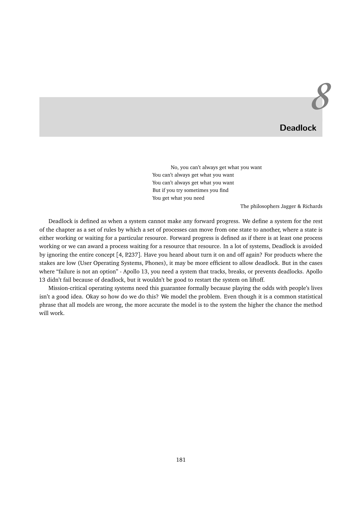

**提问：** 对截图中的内容逐句详细使用中文解释，不仅仅只是翻译，还需要对它们进行适当的解释,告诉我该怎么教学生并且指导怎么做

下面我将对截图中的内容**逐句进行详细中文解释**，不仅翻译，还会**加入教学指导**，帮助你理解如何给学生讲解这些内容。整体内容来自一本计算机操作系统教材第8章，主题是**死锁（Deadlock）**。

---

### 第一部分：章节标题与引言

> **Deadlock（标题）**

* **翻译**：死锁
* **解释**：该章主要讲操作系统中一个重要问题：当多个进程互相等待资源而无法继续运行时，就发生了“死锁”。
* **教学提示**：先让学生理解“死锁”直观比喻，例如两辆车在窄桥相对而行并卡住，都在等待对方先走，这就是死锁。

---

### 引用诗句部分（来自滚石乐队歌词）

> *No, you can’t always get what you want
> You can't always get what you want
> You can't always get what you want
> But if you try sometimes you find
> You get what you need*
> ——The philosophers Jagger & Richards

* **翻译**：

  * 不，你不能总是得到你想要的
  * 你不能总是得到你想要的
  * 你不能总是得到你想要的
  * 但如果你努力尝试，有时候你会发现
  * 你得到你所需要的
* **解释**：这里引用歌词是为了引出“资源有限”这一现实——在操作系统中，进程无法随时得到资源，必须学会处理等待和冲突，这引出了“死锁”问题。
* **教学方法**：

  * 用轻松方式开头，吸引学生注意力；
  * 提醒学生：“操作系统不是魔法，资源有限，所以需要合理分配与避免死锁”。

---

### 正文段落逐句讲解

> **Deadlock is defined as when a system cannot make any forward progress.**

* **翻译**：死锁被定义为系统无法再继续向前推进的状态。
* **解释**：所有进程都停住了，没人能继续运行。
* **教学示例**：可以用“互相拿着对方需要的钥匙而不放”的例子来解释。

---

> **We define a system for the rest of the chapter as a set of rules by which a set of processes can move from one state to another, where a state is either working or waiting for a particular resource.**

* **翻译**：我们在本章中把“系统”定义为一组规则，它控制一组进程从一个状态切换到另一个状态，而状态可以是“运行”或“等待资源”。
* **解释**：引入模型概念，告诉学生我们用简单规则来描述复杂系统。
* **教学指导**：让学生先理解“模型化思维”——抽象复杂系统是重要方法。

---

> **Forward progress is defined as if there is at least one process working or we can award a process waiting for a resource that resource.**

* **翻译**：如果至少有一个进程在运行，或者我们能为一个正在等待资源的进程分配资源，那么就认为系统在前进。
* **解释**：只要有进程能继续运行，就**不是死锁**。
* **教学提示**：强调“死锁 = 完全停滞，而不是速度慢”。

---

> **In a lot of systems, Deadlock is avoided by ignoring the entire concept.**

* **翻译**：在很多系统里，人们避免死锁的方式是——干脆完全忽略它。
* **解释**：很多普通系统不主动处理死锁，而是通过重启解决。
* **教学方法**：引导学生思考：“你是不是常听别人说‘试试关机重启’？”

---

> **Have you heard about turn it on and off again?**

* **翻译**：你听说过“关掉再开”的方法吗？
* **解释**：教材在幽默说明普通系统遇到死锁时简单粗暴地处理。
* **教学示例**：举手机死机必须强制重启的真实例子。

---

> **For products where the stakes are low (User Operating Systems, Phones), it may be more efficient to allow deadlock.**

* **翻译**：对于风险较低的产品（如普通用户系统或手机），允许死锁反而可能更高效。
* **解释**：因为处理死锁的成本比重启更高，不划算。
* **教学延伸**：让学生理解“工程权衡”——不是所有问题都值得动态解决。

---

> **But in the cases where “failure is not an option” – Apollo 13, you need a system that tracks, breaks, or prevents deadlocks.**

* **翻译**：但在“失败不是选项”的场景下，比如阿波罗13号任务，就必须使用能跟踪、打破或防止死锁的系统。
* **解释**：引出死锁问题的重要性，在关键任务（航天、医疗）中不能容忍死锁。
* **教学提示**：强调系统设计根据场景不同而不同。

---

> **Mission-critical operating systems need this guarantee formally because playing the odds with people’s lives isn’t a good idea.**

* **翻译**：关键任务操作系统需要正式确保不会出现死锁，因为拿人的生命去赌风险并不是个好主意。
* **解释**：正式方法和理论模型在这里特别重要。
* **教学指导**：让学生意识到操作系统不仅是技术，也关系到安全责任。

---

> **We model the problem. Even though it is a common statistical phrase that all models are wrong, the more accurate the model is to the system the higher the chance the method will work.**

* **翻译**：我们通过建立模型来解决这个问题。虽然统计学里说“所有模型都有错误”，但模型越接近系统真实情况，方法成功的概率越高。
* **解释**：引出下一节——构建资源分配模型来分析死锁。
* **教学强调**：告诉学生建模是工程师分析复杂问题的必备能力。

---

### 总结教学建议

| 教学目标        | 方法建议                 |
| ----------- | -------------------- |
| 让学生直观理解死锁   | 使用生活例子讲解（过桥堵车、互相等钥匙） |
| 让学生明白死锁的重要性 | 区分普通系统与关键系统为何要处理死锁   |
| 引导学生兴趣      | 运用幽默引用（歌词/重启电脑）吸引注意  |
| 建立模型意识      | 讲解问题建模是解决复杂系统问题的基础   |

---

如果你愿意，我可以继续**逐句讲解后面的页面**，或者**帮你出一份教学计划**甚至**课堂讲义**。
👉 需要继续吗？


---

## 第 196 页

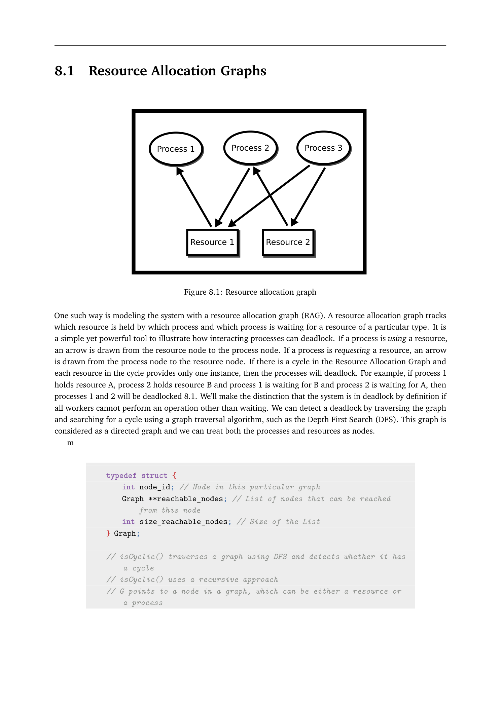

**提问：** 对截图中的内容逐句详细使用中文解释，不仅仅只是翻译，还需要对它们进行适当的解释,告诉我该怎么教学生并且指导怎么做

下面开始对这页内容**逐句进行详细的中文解释**，不仅翻译，还会补充背景知识，并给出**教学建议**，告诉你应该如何一步步教学生理解这一页内容。

---

## 标题部分

### **8.1 Resource Allocation Graphs**

* **翻译**：8.1 资源分配图
* **解释**：这一小节将介绍用“资源分配图”（RAG）来建模系统中“进程和资源的关系”。这是理解死锁的经典工具。
* **教学提示**：告诉学生：**这是死锁分析中最重要的基础模型，一定要掌握**。

---

## 图示部分：Figure 8.1

图中展示：

* 上方三个**椭圆形**代表进程：`Process 1、Process 2、Process 3`
* 下方两个**方框**代表资源：`Resource 1、Resource 2`
* 箭头表示：

  * 从**资源 → 进程**，表示资源被进程占有（allocated）
  * 从**进程 → 资源**，表示进程请求该资源（request）

---

## 正文逐句解释

> **One such way is modeling the system with a resource allocation graph (RAG).**

* **翻译**：其中一种方法是用资源分配图（RAG）对系统进行建模。
* **解释**：第一个介绍的死锁建模方法就是资源分配图。
* **怎么教**：强调为什么要建模——“直观看不懂复杂系统，用图帮助我们看清结构”。

---

> **A resource allocation graph tracks which resource is held by which process and which process is waiting for a resource of a particular type.**

* **翻译**：资源分配图用于记录每个进程占有了什么资源，以及哪个进程正在等待某类资源。
* **解释**：RAG 图核心作用是显示**资源占用关系**和**资源请求关系**。
* **教学建议**：可以画如下简单表示：

```
进程 → 资源（请求）
资源 → 进程（分配）
```

---

> **It is a simple yet powerful tool to illustrate how interacting processes can deadlock.**

* **翻译**：它是一个简单却很有力的工具，用于说明多个进程如何发生死锁。
* **解释**：虽然画起来很简单，但能帮助我们分析系统是否可能“卡死”。
* **教学建议**：举例说明：像交通堵塞图一样，图能看出“互相卡住”。

---

> **If a process is using a resource, an arrow is drawn from the resource node to the process node.**

* **翻译**：如果一个进程正在使用某个资源，就从资源节点画一条箭头指向进程节点。
* **如何教学生**：教学生如何画图，告诉他们第一条规则：**资源 → 进程 = 资源被进程占用**

---

> **If a process is requesting a resource, an arrow is drawn from the process node to the resource node.**

* **翻译**：如果一个进程请求某个资源，就从进程节点画一条箭头指向资源节点。
* **教学要点**：第二条规则：**进程 → 资源 = 正在请求资源**

---

> **If there is a cycle in the Resource Allocation Graph and each resource in the cycle provides only one instance, then the processes will deadlock.**

* **翻译**：如果资源分配图中存在环，并且环上的每个资源都只有一个实例，那么系统必定发生死锁。
* **解释**：“存在环路 = 有相互等待依赖 = 死锁”。
* **教学建议**：让学生寻找图中是否存在环是判断死锁的关键步骤！

---

> **For example, if process 1 holds resource A, process 2 holds resource B and process 1 is waiting for B and process 2 is waiting for A, then processes 1 and 2 will be deadlocked.**

* **翻译**：例如：如果进程1占有资源A，进程2占有资源B，而进程1等待B，进程2等待A，那么它们就死锁了。
* **教学方法**：引导学生画出 RAG：

```
R_A → P1 → R_B → P2 → R_A （形成环）
```

---

> **We can detect a deadlock by traversing the graph and searching for a cycle using a graph traversal algorithm, such as Depth First Search (DFS).**

* **翻译**：我们可以通过遍历图来检测死锁，例如用深度优先搜索（DFS）寻找环。
* **教学建议**：先教找环，再补充算法，不要直接讲 DFS 会让学生吸收不了。

---

> **This graph is considered as a directed graph and we can treat both the processes and resources as nodes.**

* **翻译**：这个图是一个有向图，我们把进程和资源都当作图中的节点。
* **教学总结**：

  * ✅ 图类型：有向图
  * ✅ 节点类型：两种（进程节点、资源节点）
  * ✅ 目标：检测环

---

### ✅ 接下来解释代码区域吗？

截图下半部分出现了一个 C 语言结构体 `Graph`，说明后面会讲如何用程序实现死锁检测算法。

---

如果你愿意，我可以继续**逐行讲解这段代码**，并**告诉你如何讲给学生听**，还可以**出一份课堂示范版教学讲义**。
需要继续吗？✅

要继续讲这页的后半部分代码吗？ 👇
**回复**：`继续讲代码` 或 `先出讲义`


---

## 第 197 页

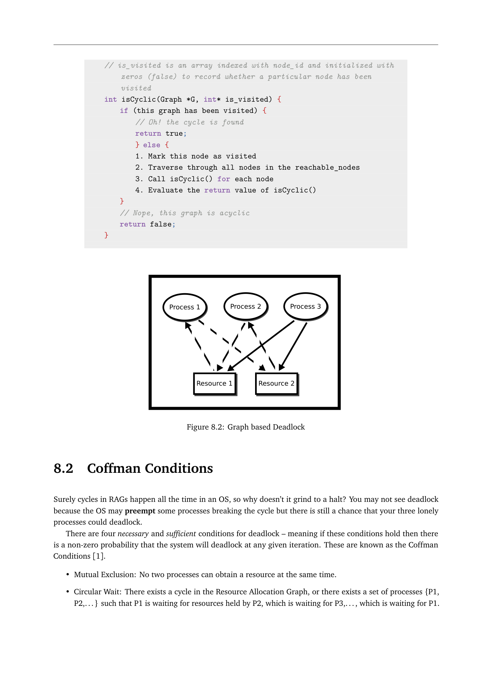

**提问：** 对截图中的内容逐句详细使用中文解释，不仅仅只是翻译，还需要对它们进行适当的解释,告诉我该怎么教学生并且指导怎么做

下面开始对这页内容**逐句进行详细的中文解释**，不仅翻译，还会补充背景知识，并给出**教学建议**，告诉你应该如何一步步教学生理解这一页内容。

---

## 标题部分

### **8.1 Resource Allocation Graphs**

* **翻译**：8.1 资源分配图
* **解释**：这一小节将介绍用“资源分配图”（RAG）来建模系统中“进程和资源的关系”。这是理解死锁的经典工具。
* **教学提示**：告诉学生：**这是死锁分析中最重要的基础模型，一定要掌握**。

---

## 图示部分：Figure 8.1

图中展示：

* 上方三个**椭圆形**代表进程：`Process 1、Process 2、Process 3`
* 下方两个**方框**代表资源：`Resource 1、Resource 2`
* 箭头表示：

  * 从**资源 → 进程**，表示资源被进程占有（allocated）
  * 从**进程 → 资源**，表示进程请求该资源（request）

---

## 正文逐句解释

> **One such way is modeling the system with a resource allocation graph (RAG).**

* **翻译**：其中一种方法是用资源分配图（RAG）对系统进行建模。
* **解释**：第一个介绍的死锁建模方法就是资源分配图。
* **怎么教**：强调为什么要建模——“直观看不懂复杂系统，用图帮助我们看清结构”。

---

> **A resource allocation graph tracks which resource is held by which process and which process is waiting for a resource of a particular type.**

* **翻译**：资源分配图用于记录每个进程占有了什么资源，以及哪个进程正在等待某类资源。
* **解释**：RAG 图核心作用是显示**资源占用关系**和**资源请求关系**。
* **教学建议**：可以画如下简单表示：

```
进程 → 资源（请求）
资源 → 进程（分配）
```

---

> **It is a simple yet powerful tool to illustrate how interacting processes can deadlock.**

* **翻译**：它是一个简单却很有力的工具，用于说明多个进程如何发生死锁。
* **解释**：虽然画起来很简单，但能帮助我们分析系统是否可能“卡死”。
* **教学建议**：举例说明：像交通堵塞图一样，图能看出“互相卡住”。

---

> **If a process is using a resource, an arrow is drawn from the resource node to the process node.**

* **翻译**：如果一个进程正在使用某个资源，就从资源节点画一条箭头指向进程节点。
* **如何教学生**：教学生如何画图，告诉他们第一条规则：**资源 → 进程 = 资源被进程占用**

---

> **If a process is requesting a resource, an arrow is drawn from the process node to the resource node.**

* **翻译**：如果一个进程请求某个资源，就从进程节点画一条箭头指向资源节点。
* **教学要点**：第二条规则：**进程 → 资源 = 正在请求资源**

---

> **If there is a cycle in the Resource Allocation Graph and each resource in the cycle provides only one instance, then the processes will deadlock.**

* **翻译**：如果资源分配图中存在环，并且环上的每个资源都只有一个实例，那么系统必定发生死锁。
* **解释**：“存在环路 = 有相互等待依赖 = 死锁”。
* **教学建议**：让学生寻找图中是否存在环是判断死锁的关键步骤！

---

> **For example, if process 1 holds resource A, process 2 holds resource B and process 1 is waiting for B and process 2 is waiting for A, then processes 1 and 2 will be deadlocked.**

* **翻译**：例如：如果进程1占有资源A，进程2占有资源B，而进程1等待B，进程2等待A，那么它们就死锁了。
* **教学方法**：引导学生画出 RAG：

```
R_A → P1 → R_B → P2 → R_A （形成环）
```

---

> **We can detect a deadlock by traversing the graph and searching for a cycle using a graph traversal algorithm, such as Depth First Search (DFS).**

* **翻译**：我们可以通过遍历图来检测死锁，例如用深度优先搜索（DFS）寻找环。
* **教学建议**：先教找环，再补充算法，不要直接讲 DFS 会让学生吸收不了。

---

> **This graph is considered as a directed graph and we can treat both the processes and resources as nodes.**

* **翻译**：这个图是一个有向图，我们把进程和资源都当作图中的节点。
* **教学总结**：

  * ✅ 图类型：有向图
  * ✅ 节点类型：两种（进程节点、资源节点）
  * ✅ 目标：检测环

---

### ✅ 接下来解释代码区域吗？

截图下半部分出现了一个 C 语言结构体 `Graph`，说明后面会讲如何用程序实现死锁检测算法。

---

如果你愿意，我可以继续**逐行讲解这段代码**，并**告诉你如何讲给学生听**，还可以**出一份课堂示范版教学讲义**。
需要继续吗？✅

要继续讲这页的后半部分代码吗？ 👇
**回复**：`继续讲代码` 或 `先出讲义`


---

## 第 198 页

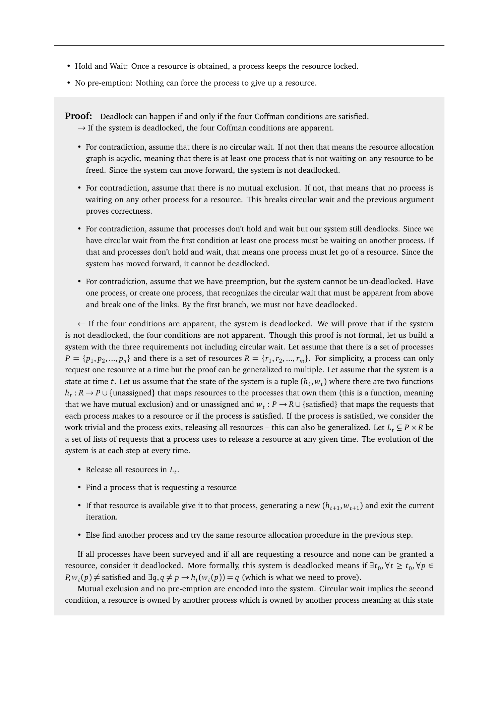

**提问：** 对截图中的内容逐句详细使用中文解释，不仅仅只是翻译，还需要对它们进行适当的解释,告诉我该怎么教学生并且指导怎么做

太好了！这页主要补全了 **Coffman 四条件**的后两条，并给出一个\*\*“充要性”证明思路\*\*。我会按页面顺序**逐句解释 + 补充背景 + 教学指导**，让你可以直接拿去讲。

---

# 一、Coffman 条件（补完后两条）

> **• Hold and Wait: Once a resource is obtained, a process keeps the resource locked.**
> （一旦拿到某个资源，进程会继续保持/占有该资源。）

* **深入解释**：
  进程在已经持有某资源时，不会主动释放它，同时还会去**请求别的资源**。这会造成“手里攥着 A，再去等 B”。
  一旦多进程都“各攥一把”，就容易形成**循环等待**。
* **怎么教**：

  * 举例：打印任务握着**打印机**，又去等**纸盒**；另一任务握着**纸盒**，等**打印机**。
  * 讨论**如何打破**：让进程在请求新资源前**先释放已有资源**；或使用**一次性请求全部资源**的协议（但可能降低并发）。

---

> **• No pre-emption: Nothing can force the process to give up a resource.**
> （不可抢占：系统不能强行让进程交出已持有的资源。）

* **深入解释**：
  已分配的资源**只能由持有者自愿释放**。如果系统能“把资源从甲抢给乙”，就能打断环路，死锁通常可解。
* **怎么教**：

  * 举例：数据库锁一般**不可被 OS 抢走**；而内存页在某些场景**可抢占/回收**（换出），因此不同资源的“可抢占性”不同。
  * 引导学生思考 pros/cons：可抢占能提高活性，但实现复杂、可能破坏一致性。

---

# 二、证明（Proof）部分逐句讲解

接下来是一个“**四条件 ⇔ 死锁**”的**思路性证明**。教材不是纯形式化，但足够教学。

---

## （⇒ 方向）死锁 ⇒ 四条件显然都成立

> **Deadlock can happen if and only if the four Coffman conditions are satisfied.**
> （当且仅当四条件都满足时，会发生死锁。）

> **→ If the system is deadlocked, the four Coffman conditions are apparent.**
> （如果系统已死锁，那么四条件显然成立。）

* **怎么教**：
  先从直觉出发：系统已经卡死，说明**谁也拿不到想要的资源**、**都不放手**、**存在互斥资源**、**构成环**。下面逐条反证说明。

---

### 1）反证：假设**没有循环等待**

> **For contradiction, assume that there is no circular wait… the graph is acyclic… at least one process is not waiting… the system can move forward… not deadlocked.**

* **译+解**：
  若 **RAG 无环**，则拓扑序存在，至少有一个进程**不必等待**，系统可前进 ⇒ 与“死锁”矛盾。
* **教**：
  让学生把“无环 ⇒ 可拓扑排序 ⇒ 有可运行结点”画出来，体会逻辑链。

---

### 2）反证：假设**没有互斥**

> **assume that there is no mutual exclusion… no process is waiting… breaks circular wait… not deadlocked.**

* **译+解**：
  如果资源都**可共享**（无互斥），谁也不用等谁，自然不会有循环等待 ⇒ 不死锁。
* **教**：
  提示设计思维：把资源“并行化/复制化/只读共享”，等于从根上**剪掉一条条件**。

---

### 3）反证：假设**没有“占有并等待”**（Hold & Wait）

> **assume that processes don’t hold and wait but our system still deadlocks… from circular wait at least one process must be waiting… if no hold-and-wait then someone must let go of a resource… system has moved forward… cannot be deadlocked.**

* **译+解**：
  若进程**不会一边占有一边再等**，则一旦需要新资源就会**先释放旧资源**，环路被打断，系统可推进 ⇒ 不死锁。
* **教**：
  画“松手再要”的时序图，显示如何**拆环**。

---

### 4）反证：假设**可以抢占**（No Pre-emption 不成立）

> **assume that we have preemption… the system cannot be un-deadlocked… have/create a process that recognizes circular wait… break one of the links… we must not have deadlocked.**

* **译+解**：
  如果系统**能抢占**，就能在环上“剪断一条边”（把某资源从 A 抢给 B），循环被破坏 ⇒ 不死锁。
* **教**：
  让学生口头模拟“运行监控器检测到环 → 抢占 Pk 的资源 rk → 给 Pk+1”，环消失。

---

## （⇐ 方向）四条件都成立 ⇒ 存在死锁

> **← If the four conditions are apparent, the system is deadlocked. We will prove… if the system is not deadlocked, the four conditions are not apparent.**

* **思路**：
  用**构造/归纳**说明：若系统能持续推进（不死锁），则**至少破坏**其中某一条件；若四条一直都保持成立，就会卡住。

---

### 建模符号与过程（教材给的“半形式化”框架）

> **build a system with three requirements not including circular wait… processes P = {p1…pn}, resources R = {r1…rm}… one request at a time… system state at time t is a tuple (h\_t, w\_t)**

* **译与解释**：

  * 进程集合 **P**、资源集合 **R**；
  * 简化：一时刻每个进程**只提出一个请求**（可泛化）；
  * 系统状态用二元组 **(h\_t, w\_t)**：

    * **h\_t : R → P ∪ {unassigned}**（资源归属：哪个资源给了哪个进程或尚未分配）
    * **w\_t : P → R ∪ {satisfied}**（请求映射：进程此刻在要哪个资源，或已满足）

> **Let L\_t ⊆ P × R be the set of lists of requests a process uses to release a resource… evolution of the system…**

* **译+解**：
  L\_t 描述“释放动作/顺序”，方便定义状态推进。核心是：如果**某一步找不到能被满足的请求**，且大家都在请求，那么系统就**停机**（死锁）。

---

### 状态推进规则（每轮迭代做下面几件事）

> **• Release all resources in L\_t.**
> **• Find a process that is requesting a resource.**
> **• If that resource is available give it to that process, generating a new (h\_{t+1}, w\_{t+1}) and exit the current iteration.**
> **• Else find another process and try the same procedure…**

* **译+解**：

  1. 先处理这一步该释放的资源；
  2. 找一个正在请求的进程；
  3. 如果它要的资源**空闲**，就分配（系统前进一步）；
  4. 否则换下一个进程试；
     **如果把所有进程都试过了，仍没人能被满足** ⇒ 当前无前进空间 ⇒ 死锁。

* **怎么教**：
  把这一过程当作“**银行家算法前奏**”或“贪心分配小循环”，让学生动手模拟 2–3 轮。

---

### 死锁判定的口径

> **If all processes have been surveyed… none can be granted a resource, consider it deadlocked.**

* **译**：
  若一轮下来所有进程都看过，且没人能获批资源 —— 判为死锁。

> **Formally… deadlocked means if ∃t0, ∀t ≥ t0, ∀p ∈ P, w\_t(p) ≠ satisfied and ∃q, q ≠ p, h\_t(w\_t(p)) = q (which is what we need to prove).**

* **直译+解释**：
  存在某个时刻 t0，以后所有时刻 t ≥ t0：

  * 每个进程 p 的请求 **w\_t(p)** 都**未被满足**；
  * 且它想要的资源 **w\_t(p)** 总是被**另一个进程 q** 持有（形成互相卡住的链）。
    这正是**循环等待 + 持有并等待 + 互斥 + 不可抢占**共同造成的停滞。

---

> **Mutual exclusion and no pre-emption are encoded into the system. Circular wait implies the second condition…**

* **译+解**：
  互斥与不可抢占作为**系统假设**已写入（encoded）；循环等待意味着“此时某资源被另一个进程持有，而那个进程又被另一个进程持有资源卡住……”，也就是把四条件连成**闭环**。

* **怎么教**：
  画一条链：
  `p1 等 r1（r1 在 p2 手里） → p2 等 r2（r2 在 p3 手里） → … → pk 等 rk（rk 在 p1 手里）`
  然后对照四条件逐一打钩。

---

# 三、课堂教学怎么落地（可直接使用）

## A. 黑板三步走

1. **复习四条件**（2 分钟）

   * 互斥 / 占有并等待 / 不可抢占 / 循环等待
   * “打破任一条 ⇒ 保证不死锁”
2. **环路反证演示**（5 分钟）

   * 画无环 RAG → 解释“拓扑序/可前进”；
   * 画有环 RAG → 说明“满足四条 ⇒ 可能卡死”。
3. **状态推进小游戏**（8 分钟）

   * 发一张进程–资源小表（2–3 进程、2–3 资源）；
   * 学生按规则“找能满足的请求→分配→下一步”；
   * 观察“某轮没人可被满足 ⇒ 宣布死锁”。

## B. 讨论题（小组 6 分钟）

* 题目：**在不牺牲太多吞吐的前提下，你会优先破坏哪一条条件？**
  参考：

  * 打破“循环等待”最常见（资源全序 + 只升不降）；
  * 分场景引入“可抢占”（如超时收回锁）；
  * 用“可共享”缓解“互斥”（读多写少场景）。

## C. 作业/实验建议

* **实现 `isCyclic`（带 `in_stack` 标记）**，输入边表输出一条环；
* **模拟分配过程**（如上“状态推进”），检测“无人可满足”的轮次，并打印此刻的等待链；
* **设计一条策略**打破某个 Coffman 条件，给出利弊与场景。

---

# 四、易混与易错点提醒

* **“看到环 = 一定死锁？”**
  不一定（系统可能抢占/回滚）；但**四条件同时满足** ⇒ **非零概率**地会卡住。考试要说清楚“充要/可能性”的措辞。
* **Hold & Wait 与 Circular Wait 的区别**：
  前者说**个体行为**（一边占有一边等）；后者说**全局结构**（形成环）。两者常相互强化，但不是同一概念。
* **只用一个 `visited`** 容易误判环；教学编程时加入 `in_stack`/“三色标记”。

---

需要的话，我可以给你：

* 一页式**讲义 PDF**（四条件图解 + 反证流程图 + 状态推进规则）；
* **可运行 Python 模板**（读入 RAG、DFS 找环、模拟分配直到检测死锁）。


---

## 第 199 页

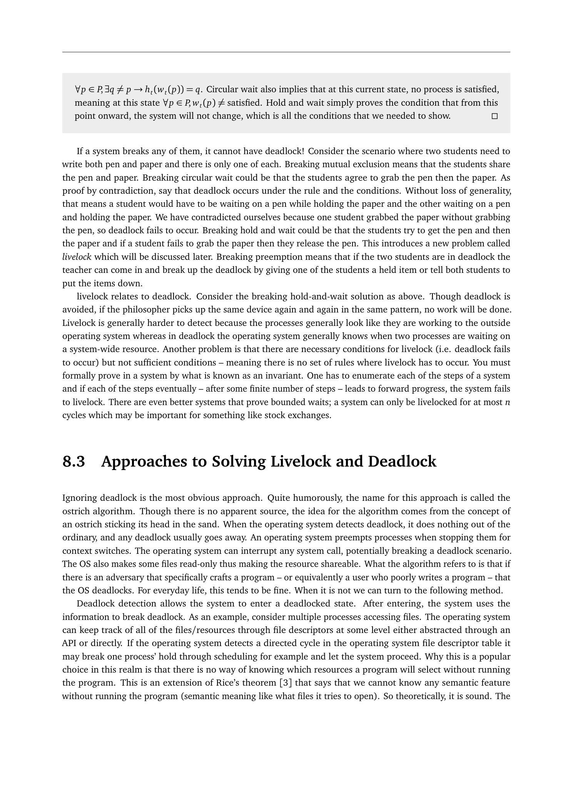

**提问：** 对截图中的内容逐句详细使用中文解释，不仅仅只是翻译，还需要对它们进行适当的解释,告诉我该怎么教学生并且指导怎么做

下面这页分三块：①上一页证明里最后的“形式化条件”总结；②用“学生抢笔和纸”的生活化例子解释四条件与**活锁**（livelock）；③8.3 讲“处理活锁与死锁的办法”。我按原文**逐句翻译+解释**，并给你**课堂怎么讲、怎么练**的建议。

---

# ① 证明收束（形式化条件）

> **∀p ∈ P ∃q ≠ p → hₜ(wₜ(p)) = q. Circular wait also implies that at this current state, no process is satisfied, meaning at this state ∀p ∈ P, wₜ(p) ≠ satisfied. Hold and wait simply proves… from this point onward, the system will not change, which is all the conditions we needed to show.**

* **翻译**：对于集合 P 中的每个进程 p，都存在另一个不同的进程 q，使得在时刻 t，p 想要的资源 wₜ(p) 的持有者是 q（即 hₜ(wₜ(p))=q）。循环等待还意味着在当前状态下，没有进程请求被满足，即对所有 p 都有 wₜ(p)≠“已满足”。“占有并等待（Hold & Wait）”则说明从这一刻起系统状态不会再变化（谁也不放手、也拿不到），这正是我们要证明的全部条件。
* **解释**：一句话把四条件拼起来：

  * **互斥**：资源只在 hₜ 中被唯一进程占用；
  * **循环等待**：每个 p 的目标资源都在另一个 q 手里，首尾相接成环；
  * **占有并等待**：手里攥着、不释放；
  * **不可抢占**：没人能把资源抢走，所以状态停滞。
* **教学怎么讲**：把这行式子画成一条“等待链”：
  `p1 等 r1(在 p2) → p2 等 r2(在 p3) → … → pk 等 rk(在 p1)`
  然后给四条件逐一打勾，让学生看到“环 + 不放 + 不能抢 + 互斥 ⇒ 一动不动”。

---

# ② 生活例子：两名学生与一支笔一张纸（引出活锁）

> **If a system breaks any of them, it cannot have deadlock!**

* **译**：只要打破四条件中的任意一条，就不会死锁。
* **教**：板书“**破一条=保活性**”。接着用例子演示分别怎么破。

> **Consider the scenario where two students need to write both pen and paper and there is only one of each.**

* **译**：设有两名学生写作业，各需要“笔+纸”，而笔只有一支、纸只有一张。
* **解释**：这是最小化的“两个进程、两个独占资源”的模型。

> **Breaking mutual exclusion means that the students share the pen and paper.**

* **译**：破“互斥”= 让资源可共享（两人一起用笔/纸）。
* **解释**：现实里不太可行，但概念上说明：**若能共享就不会等**。

> **Breaking circular wait could be that the students agree to grab the pen then the paper.**

* **译**：破“循环等待”= 约定**拿资源的顺序**（先笔后纸）。
* **解释**：这就是“资源全序法”：只允许按同一递增次序请求，杜绝回头拿小号资源，自然无环。

> **As proof by contradiction, say that deadlock occurs… that means a student would have to be waiting on a pen while holding the paper and the other waiting on a pen and holding the paper.**

* **译**：反证：若仍死锁，则必然出现 A 等笔却拿着纸、B 也等笔且拿着纸。
* **解释**：与“先拿笔后拿纸”的约定矛盾（因为两人都先拿到了纸）。

> **We have contradicted ourselves because one student grabbed the paper without grabbing the pen…**

* **译**：这与策略冲突，故不可能死锁。
* **教**：让学生用**时序图**演练“统一顺序”的正确性：谁先拿笔、谁后拿笔都能推进。

> **Breaking hold and wait… students try to get the pen then the paper and if a student fails to grab the paper then they release the pen. This introduces a new problem called livelock…**

* **译**：破“占有并等待”：规定**拿不到下一个资源就释放已有资源**。但这会引入一个新问题：**活锁**。
* **解释**：活锁=大家都在“忙着让路/重试”，**系统没有卡死**，却**没有前进**。
* **教**：演示“AB 同步礼让”：A 拿笔→等纸→失败→放笔；B 也如此；两人**一直礼让**，谁也写不成作业。

> **Breaking preemption means that if the two students are in deadlock the teacher can come in and break up the deadlock by giving one of the students a held item or tell both students to put the items down.**

* **译**：破“不可抢占”：老师介入，**把资源从一个人手里拿走**或让两人都放下。
* **解释**：这就是“抢占/回滚”的工程手段。

---

### 活锁再解释

> **livelock relates to deadlock… philosopher picks up the same device again and again… no work will be done.**

* **译**：活锁与死锁相关；比如哲学家不断按相同模式拿放叉子，**一直在动作**但**没有进度**。
* **解释**：活锁是“**忙等/忙让**”，CPU 有动作、任务没推进。

> **Livelock is generally harder to detect because the processes generally look like they are working…**

* **译**：活锁更难检测，因为从外部看进程在“忙”，不像死锁那么明显。
* **教**：对比监控指标：**死锁**→线程阻塞、无上下文切换；**活锁**→高切换、高调用、但吞吐≈0。

> **Another problem is that there are necessary conditions for livelock (i.e. deadlock fails to occur) but not sufficient conditions…**

* **译**：活锁只有**必要条件**（例如未满足死锁条件），但没有一组明确的“充要条件”。
* **解释**：活锁模式多变，难以一组公理穷尽，需要\*\*不变式（invariant）\*\*证明。

> **One has to enumerate each of the steps of a system and if each of the steps eventually… leads to forward progress, the system fails to livelock.**

* **译**：要证明**不会活锁**，常用办法是定义不变式并枚举系统步骤，证明**有限步内必前进**（即**有界等待**）。
* **教**：引入“有界等待/公平性”概念（bounded wait/fairness）。

> **There are even better systems that prove bounded waits; a system can only be livelocked for at most n cycles… stock exchanges.**

* **译**：更强的系统能证明**等待有上界**：最多活锁 n 次就会前进；这种性质对证券交易所等场景很重要。
* **课堂活动**：让学生设计“随机退避+上限”的活锁化解策略（如以太网退避、指数退避）。

---

# ③ 8.3 解决活锁与死锁的思路

> **Ignoring deadlock is the most obvious approach… “ostrich algorithm”.**

* **译**：**忽略死锁**是最直观的方案，俗称“**鸵鸟算法**”（把头埋沙里当看不见）。
* **解释**：对普通桌面/手机系统，**偶发死锁**常靠“重启/重试/超时”自然消退。
* **教**：提醒工程取舍：成本低、效果够用，但**不适合关键系统**。

> **When the OS detects deadlock, it does nothing out of the ordinary, and any deadlock usually goes away.**

* **译**：系统发现死锁也不做特别处理，通常靠时间片切换、资源释放等“自然解冻”。

> **An operating system preempts processes when stopping them for context switches… potentially breaking a deadlock scenario.**

* **译**：**上下文切换**本身就是一种轻度“抢占”，能顺带打破一些死锁局面。
* **补充**：不是严格意义上的“资源抢占”，但会改变时序，让冲突避开。

> **The OS also makes some files read-only thus making the resource shareable.**

* **译**：把某些文件设为只读，从互斥变共享，也能减少死锁机会。

> **What the algorithm refers to is that if there is an adversary… crafts a program… that the OS deadlocks.**

* **译**：但若遇到“对手式”程序（故意制造），鸵鸟法可能让 OS 真的卡住。
* **教**：区分“日常够用”与“对抗环境不安全”。

---

> **Deadlock detection allows the system to enter a deadlocked state. After entering, the system uses the information to break deadlock.**

* **译**：**死锁检测**：允许系统进入死锁态，但**检测到后**用信息来**打破**。
* **解释**：典型做法：建图→找环→回滚/杀进程/撤销事务。

> **Example: multiple processes accessing files… OS keeps track via file descriptors… detects a directed cycle… may break one process’ hold through scheduling…**

* **译**：例子：多进程访问文件；OS 通过文件描述符追踪，发现**有向环**就**打断**某进程的持有或调整调度让系统继续。
* **教**：把“文件-进程”画成二部图，做一次环检测演示。

> **Why popular: there is no way of knowing which resources a program will select without running the program. This is an extension of Rice’s theorem… cannot know semantic feature without running the program.**

* **译**：受欢迎的原因：**不运行程序就无法知道它会请求哪些资源**（类似 **Rice 定理**的思想：程序语义性质不可判定）。所以**静态彻底避免**不现实，只能**运行中检测**。
* **课堂扩展**：和“银行家算法（需要先声明最大需求）”对比：现代通用系统很少能提前精确声明全部资源，因此倾向“运行时检测+干预”。

---

## 课堂怎么教（可直接照做）

1. **热身 3 分钟**：回顾四条件，用“笔与纸”例子提问：你会如何**破一条**？
2. **活锁演示 6 分钟**：两名学生角色扮演“拿不到就放手”的策略，实演 3 轮，体会“忙、但没前进”。
3. **三种处理思路 10 分钟**：

   * **鸵鸟**：何时可接受？（桌面/移动端）风险？
   * **检测+恢复**：画 RAG、找环、选择“牺牲者”（kill/rollback/撤销锁）。
   * **设计时预防**：资源排序、超时+退避、读写分离、只读共享。
4. **小练习**：给一张文件-进程图，学生手算是否有环；若有，提出一种“恢复动作”。

---

## 作业/实验建议

* **实现**：
  1）RAG 的 DFS/三色标记找环；
  2）一个“活锁模拟器”（两个线程反复让路），加入**随机退避**观察活锁消失。
* **写作**：选一个系统（数据库/微服务/操作系统）分析它如何分别：**忽略、检测、恢复**死锁。

---

## 易错点提醒

* **活锁≠死锁**：活锁“忙但无进展”，死锁“卡且不动”；检测方法与信号不同。
* **“看到环=一定死锁？”**：不一定（可能有抢占/回滚/超时）；但四条件全在 ⇒ 存在非零概率卡死。
* **Rice 定理类比**：别说“静态方法一定能杜绝所有死锁”，在通用环境往往做不到。

需要我把**练习题+答案**或**课堂讲义 PDF**整理出来吗？我可以直接给你可打印版。


---

## 第 200 页

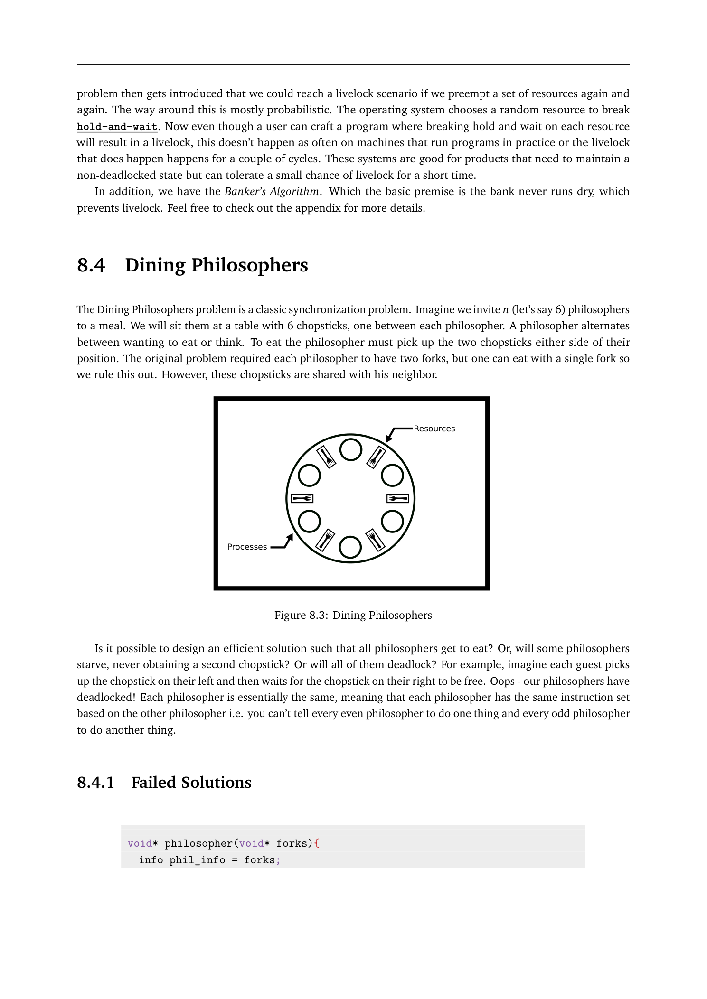

**提问：** 对截图中的内容逐句详细使用中文解释，不仅仅只是翻译，还需要对它们进行适当的解释,告诉我该怎么教学生并且指导怎么做

下面开始逐句讲解本页内容，并结合教学怎么讲、怎么引导学生理解。本页分为两部分内容：

✅ **（上半）继续解释活锁与预防**
✅ **（下半）进入经典问题：哲学家进餐问题（Dining Philosophers）** —— 死锁教学中的重头戏。

---

## 🔹 第一部分：活锁补充 + Banker’s Algorithm 引出

> **…we could reach a livelock scenario if we preempt a set of resources again and again.**

* **翻译**：如果我们不断地抢占同一组资源，系统可能进入**活锁**。
* **解释**：反复抢资源 → 所有进程都在“忙着重新尝试” → 没有进展，但系统没有完全卡死。
* **教学提示**：举 TCP 网络退避算法例子，两端同时重试就活锁。

---

> **The operating system chooses a random resource to break hold-and-wait.**

* **翻译**：操作系统常用**随机性**来打破“占有并等待（Hold and Wait）”。
* **解释**：这是避免活锁的常见做法：别总抢同一个，随机退避避免循环卡住。

---

> **…this doesn’t happen as often on machines that run programs in practice or the livelock that does happen happens for a couple of cycles.**

* **翻译**：在实际系统中，活锁通常持续时间很短，只持续几个循环后就会解除。
* **教学解释**：随机退避、调度切换会帮助系统跳出活锁。

---

> **These systems are good for products that need to maintain a non-deadlocked state but can tolerate a small chance of livelock for a short time.**

* **翻译**：这种系统适用于需要尽量避免死锁、但可以容忍**短时间活锁**的产品。
* **例子**：无线网络、数据库自旋锁、并发哈希表。

---

> **In addition, we have the Banker’s Algorithm. The basic premise is the bank never runs dry, which prevents livelock.**

* **翻译**：还有一种方法是**银行家算法**，它的核心思想是：**银行永远不会把钱借光**（系统永远不进入不安全状态），从而避免死锁甚至活锁。
* **教学提示**：告诉学生：银行家算法是 **安全资源分配算法**，会在请求资源前判断**安全状态**。

---

---

## 🔹 第二部分：8.4 哲学家进餐问题（Dining Philosophers Problem）

> **The Dining Philosophers problem is a classic synchronization problem.**

* **翻译**：哲学家进餐问题是经典的同步问题。
* **讲解方向**：本问题用于说明**死锁、饥饿、并发冲突**。

---

> **Imagine we invite n (let’s say 6) philosophers to a meal…**

* **翻译**：假设有 6 位哲学家围坐吃饭，每人左右各一根筷子（资源）。

---

> **A philosopher alternates between wanting to eat or think.**

* **解释**：哲学家 = **进程**，筷子 = **资源**。

---

> **To eat the philosopher must pick up the two chopsticks either side of their position…**

* **解释**：每次想吃饭必须同时得到**两个资源** → 具有**资源竞争**，存在**死锁风险**。

---

> **However, these chopsticks are shared with his neighbor.**

* **解释**：每根筷子只能被一人用（**互斥条件**满足），死锁可能发生。

---

### ✅ 图解（Figure 8.3）

图中要让学生理解：

* 椭圆 = 哲学家（进程）
* 棒状资源 = 筷子（资源）
* 典型资源争用结构：**环形资源分配图**

---

> **Is it possible to design an efficient solution such that all philosophers get to eat? Or will some philosophers starve? Or will all of them deadlock?**

* **引导教学问题**：

  * 会不会有人**饿死**（Starvation）？
  * 会不会**全部死锁**？
  * 有没有策略让大家**公平进餐**？

---

> **For example, imagine each guest picks up the chopstick on their left and then waits for the chopstick on their right… philosophers have deadlocked!**

* **解释**：典型死锁场景：**大家一起左手先拿 → 等待右边 → 环形等待 → 死锁**。
* **让学生画 RAG**：
  `P1 → R1 → P2 → R2 → … → P6 → R6 → P1` ✅ **出现环！**

---

> **Each philosopher is essentially the same… can’t tell every even philosopher to do one thing and every odd philosopher to do another thing.**

* **解释**：所有哲学家代码一样（称为**对称性**问题），不能靠硬编码“规定奇数先拿左、偶数先拿右”，需要**通用解决方案**。

---

---

## ✅ 怎么讲这一节（教学建议）

### ✨ 课堂讲解结构

| 步骤  | 内容    | 教学方法               |
| --- | ----- | ------------------ |
| 第一步 | 引出问题  | 讲哲学家故事激发兴趣         |
| 第二步 | 建立模型  | 画出进程与资源关系          |
| 第三步 | 发现问题  | 让学生找出死锁            |
| 第四步 | 引出四条件 | 对照四条件证明死锁可发生       |
| 第五步 | 过渡    | 进入 8.4.1 “失败的解法”分析 |

---

### 🎓 学生活动示例

让学生扮演哲学家：

* 6 个学生组成一圈，每人用两支笔模拟两支筷子。
* 模拟“先拿左再拿右”策略 → 全体停住 → 死锁演示完成 ✅
* 讨论：有没有办法避免？

---

✅ 如果你愿意，我可以继续**逐句解释下一页 8.4.1 Failed Solutions**，并帮你分析源码逻辑 + 提醒课堂重点
——继续吗？👨‍🏫


---

## 第 201 页

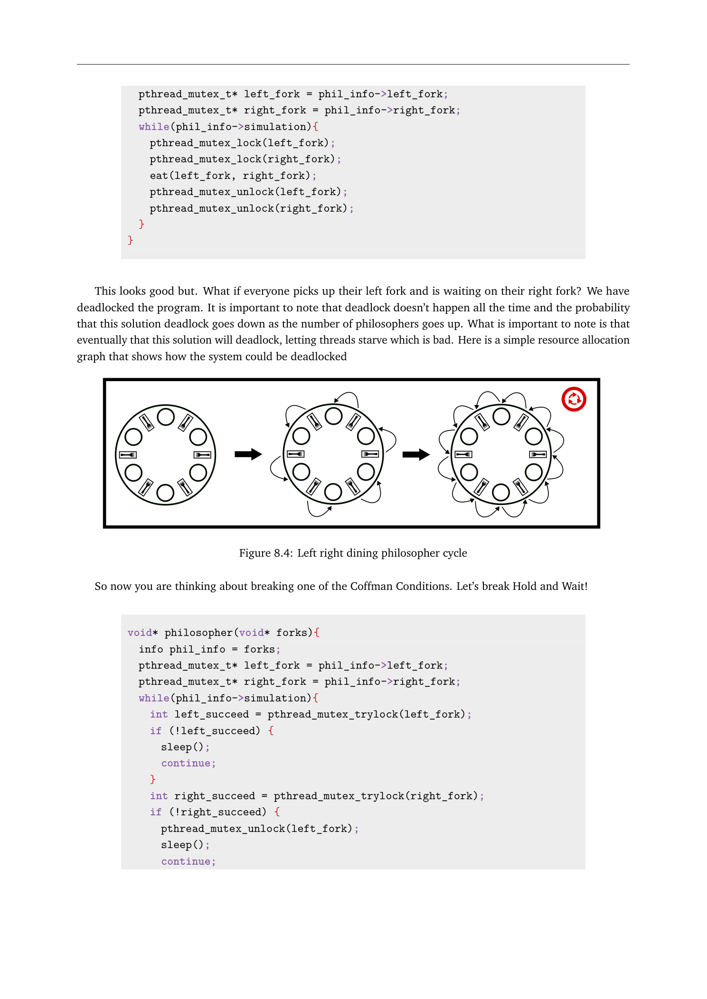

**提问：** 对截图中的内容逐句详细使用中文解释，不仅仅只是翻译，还需要对它们进行适当的解释,告诉我该怎么教学生并且指导怎么做

太棒了，这一页正好把“失败的解法 → 为什么会死锁/饥饿 → 试图打破 Coffman 条件（Hold & Wait）→ 但会引出活锁”的教学链条串起来。下面我**逐句/逐行**解释并给出**课堂讲法与练习建议**。

---

# 一、第一段代码（“看似合理”的失败方案）

```c
pthread_mutex_t* left_fork  = phil_info->left_fork;
pthread_mutex_t* right_fork = phil_info->right_fork;
while (phil_info->simulation){
    pthread_mutex_lock(left_fork);
    pthread_mutex_lock(right_fork);
    eat(left_fork, right_fork);
    pthread_mutex_unlock(left_fork);
    pthread_mutex_unlock(right_fork);
}
```

* `left_fork/right_fork`：
  **翻译**：从线程私有的 `phil_info` 结构里取出左右两把“叉子”的互斥量地址。
  **解释**：每位哲学家（线程）知道自己左右的两个资源（互斥锁）。
  **教学提示**：先让学生把桌子画出来，标清“P\[i] 左锁 = F\[i]，右锁 = F\[(i+1) mod n]”。

* `while (phil_info->simulation)`：
  **译**：只要模拟还在运行，就持续尝试“吃饭”。
  **教**：强调：循环里必须**遵循某种锁顺序策略**，否则风险很大。

* `pthread_mutex_lock(left_fork); pthread_mutex_lock(right_fork);`
  **译**：先锁左叉，再锁右叉。
  **解释**：这是最朴素、最常见的写法；**一旦大家都先锁左**，就可能**形成环形等待**。
  **板书 RAG**：`F[i] → P[i]`（已占有），同时 `P[i] → F[i+1]`（请求中）⇒ 出现长度为 n 的有向环。

* `eat(...);`
  **译**：两把都拿到才进餐。
  **解释**：吃饭期间保持两把锁（持有并等待下一轮）。

* `pthread_mutex_unlock(...)`
  **译**：按某顺序释放锁。
  **解释**：释放顺序对**本轮**影响不大，问题出在**加锁顺序**。

---

## 图下文字解释

> **This looks good but. What if everyone picks up their left fork and is waiting on their right fork? We have deadlocked the program.**

* **翻译**：看起来没问题，但如果每个人都先拿左边、再等右边，就**死锁**了。
* **教学做法**：6 个学生围成一圈演示：统一口令“拿左边”，立刻卡住。

> **…deadlock doesn’t happen all the time and the probability … goes down as the number of philosophers goes up.**

* **翻译**：并非每次都会死锁；哲学家人数越多，“全部同时左锁成功”的概率越低。
* **解释**：并发的具体时序受调度与随机扰动影响；人数多时“完全同步撞车”的机会更小（但**可能性仍在**）。

> **…eventually this solution will deadlock, letting threads starve which is bad.**

* **翻译**：但**最终**在某次时序里还是可能死锁，造成**线程饥饿**（无法继续）——不可接受。
* **教学结论**：**朴素的“先左后右”方案不安全**。

> **Figure 8.4：Left right dining philosopher cycle**

* **解读**：三幅简图展示从“逐步持有左叉 → 全体等待右叉 → 成环卡死”的演化。
* **课堂**：让学生用 RAG 把这三步画成：
  1）`F[i] → P[i]`；2）再加 `P[i] → F[i+1]`；3）看到**闭环**。

---

# 二、打破 Coffman 条件之一：**破 “Hold & Wait（占有并等待）”**

> **So now you are thinking about breaking one of the Coffman Conditions. Let’s break Hold and Wait!**

* **翻译**：我们试着**破坏**四条件之一——**占有并等待**。
* **思路**：**拿不到第二把时，必须放掉第一把**，避免“手里攥着还等”。

---

## 第二段代码（使用 `trylock` + 放手重试）

```c
void* philosopher(void* forks){
    info phil_info = forks;
    pthread_mutex_t* left_fork  = phil_info->left_fork;
    pthread_mutex_t* right_fork = phil_info->right_fork;

    while (phil_info->simulation){
        int left_succeed = pthread_mutex_trylock(left_fork);
        if (!left_succeed) {
            sleep();
            continue;
        }

        int right_succeed = pthread_mutex_trylock(right_fork);
        if (!right_succeed) {
            pthread_mutex_unlock(left_fork);
            sleep();
            continue;
        }

        eat(left_fork, right_fork);
        pthread_mutex_unlock(left_fork);
        pthread_mutex_unlock(right_fork);
    }
}
```

* `pthread_mutex_trylock(left_fork)`：
  **译**：尝试加左锁，**非阻塞**；失败就立刻返回。
  **解释**：不阻塞就不会“卡着等”，从而**不形成环上的硬等待**。
  **课堂**：对比 `lock` vs `trylock`：阻塞等待 vs 立即返回。

* `if (!left_succeed) { sleep(); continue; }`
  **译**：没拿到左锁就**小睡（退避）**再下一轮。
  **解释**：退避减少**忙等**；加一点随机 sleep 还能降低**活锁**概率。
  **实践建议**：用 `usleep(rand()%K)` 做**随机退避**演示活锁→消失。

* `int right_succeed = pthread_mutex_trylock(right_fork);`
  **译**：成功拿到左后，**尝试**拿右。
  **教学提醒**：这一步仍可能失败（右边被邻居拿着）。

* `if (!right_succeed) { pthread_mutex_unlock(left_fork); sleep(); continue; }`
  **译**：若右锁失败，**立刻放掉左锁**，休眠并重来。
  **关键点**：这一步就是在**破坏 Hold & Wait**（不一边占有一边等待）。
  **隐患**：可能出现**活锁**（大家都拿一下又放、谁也吃不到）。

* 末尾 `eat`/`unlock`：
  **译**：两把都成功后再吃，并在离开前释放两把。
  **解释**：此方案**不会死锁**；但需要**评估饥饿/活锁**风险。

---

## 这一页要点小结（讲给学生）

1. 朴素“先左再右”**可能死锁**。
2. 用 `trylock` + 失败就放手 **可破坏 Hold & Wait**，**杜绝死锁**。
3. 但是：**活锁/饥饿**可能出现 —— 需要**退避、随机化、限流或仲裁**等手段改善。

---

# 三、课堂怎么讲 & 指导学生怎么做

### A. 黑板/投影步骤（10–12 分钟）

1. **画圆桌**（6 人、6 把叉）→ 标注 `P[i]`、`F[i]`。
2. **走一遍“先左后右”** → 让 6 位同学表演（每人举一支马克笔代表左锁，空手等右锁）→ 全体停住 ⇒ **死锁出现**。
3. **板书 Figure 8.4 的 RAG**：把“占有边/请求边”画出，一个箭圈完成。
4. **切换到 trylock 方案**：

   * 让同学演示“拿不到右就放左 + 退避 1 秒”，连续演两轮；
   * 再加入**随机退避**（抽签 200–700ms），观察通常很快有人吃到饭 ⇒ **活锁概率下降**。

### B. 实验/作业（可直接布置）

* **实验 1**：实现两版哲学家：`lock-lock` 与 `trylock-release`。

  * 统计 **死锁发生率**（卡住超过 T 秒视为死锁）与 **吞吐量**（单位时间 `eat()` 次数）。
  * 加入 **随机退避**，比较吞吐与活性变化。
* **实验 2**（进阶）：加入**全局资源排序**或**服务员（waiter）/信号量限流**（最多允许 n-1 人尝试），证明**无死锁**且**饥饿受控**。
* **实验 3**：模拟**活锁**：所有线程同步 `trylock` → 失败即同时放；然后加入随机抖动，看活锁如何消失。

### C. 讨论题（5 分钟）

* 仅靠 `trylock+退避` 是否可能**长期饥饿**？如何缓解（随机退避、指数退避、排队、公平锁、令牌/服务员）？
* 与**银行家算法**相比，这种局部策略的优缺点？

---

## 四、可替代的“更稳”的方案（可作为下一页预告）

* **全局顺序法（资源层级）**：给叉子编号，**只允许按编号递增加锁** ⇒ 打掉“循环等待”。
* **仲裁者/服务员（Waiter/Butler）**：一个中央进程控制许可（例如只允许最多 `n-1` 个同时拿起左叉）。
* **奇偶非对称**：奇数先拿左、偶数先拿右（**打破对称性**），但要讨论公平性与实现复杂度。
* **Chandy–Misra**：消息传递型解法（适合分布式版本）。

---

## 五、易错/易混提醒

* **“无死锁 ≠ 无饥饿”**：trylock 放手方案常见**饿死/活锁**；一定要讲**退避与公平**。
* **只改释放顺序≠解决**：关键是**加锁顺序**与**是否占有并等待**。
* **同步原语的选择**：`pthread_mutex_lock` 会阻塞；`trylock` 立即返回。两者性质不同，评估 CPU 占用与响应性。

---

如果你愿意，我可以把**实验骨架代码（C/Pthread 或 Python 线程）**、**数据记录脚本**和**讲义一页纸**整理出来，直接拿去上机/课堂用。


---

## 第 202 页

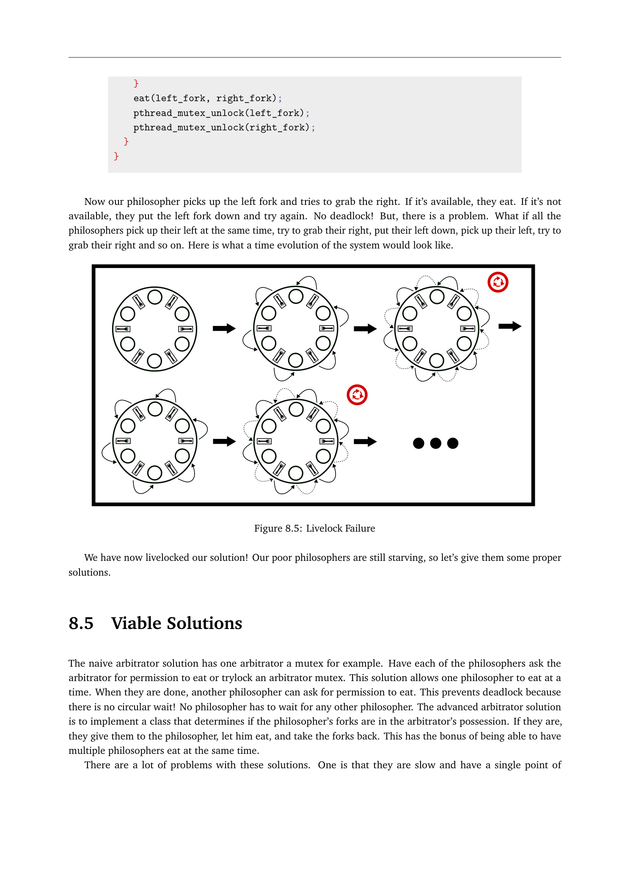

**提问：** 对截图中的内容逐句详细使用中文解释，不仅仅只是翻译，还需要对它们进行适当的解释,告诉我该怎么教学生并且指导怎么做

下面这页分两块内容：
A) 继续解释“**trylock + 放手重试**”方案会如何**演化成活锁**；
B) 给出**可行解（Viable Solutions）**——“仲裁者/服务员（arbitrator/waiter）”思路。
我会逐句译解 + 教学怎么讲 + 学生怎么做。

---

# A. 活锁演化（承接上一页的 trylock 方案）

> （代码末尾）
>
> ```c
> eat(left_fork, right_fork);
> pthread_mutex_unlock(left_fork);
> pthread_mutex_unlock(right_fork);
> ```

* **译**：拿到两把就吃，吃完释放两把。
* **解释**：这个版本**破坏了 Hold & Wait**（拿不到右就放左），因此**不出现死锁**；但可能出现**活锁**（大家同步拿-放-再拿，谁也吃不到）。

> **Now our philosopher picks up the left fork and tries to grab the right. If it’s available, they eat. If it’s not available, they put the left fork down and try again. No deadlock!**

* **译**：哲学家先拿左，再试右；右可用就吃，不可用就放左并重试。**不会死锁！**
* **讲**：在白板上重申“破 Hold & Wait ⇒ 断环”。

> **But… What if all the philosophers pick up their left at the same time, try to grab their right, put their left down, pick up their left, try to grab their right and so on.**

* **译**：但如果**所有人**几乎同时做同样动作（拿左→试右失败→放左→再拿左→再试右…）呢？
* **解释**：这就是**活锁（Livelock）**：大家都在动作，但系统**没前进**。

> **Here is what a time evolution of the system would look like. (Figure 8.5: Livelock Failure)**

* **译/解**：图 8.5 展示时间演化：几轮同步“拿-放-拿-放…”后，仍无一人吃到。红色循环标志强调**陷入活锁**。
* **课堂演示**：请 6 名同学围圈，按口令同时“试拿左；若右不可用就放左；原地数 1 再试”。你会看到**全体节拍一致**地反复尝试——这就是活锁。

> **We have now livelocked our solution! Our poor philosophers are still starving, so let’s give them some proper solutions.**

* **译**：方案落入活锁，哲学家仍在**挨饿**。需要更靠谱的解法。
* **讲**：总结——“**无死锁 ≠ 有进展**”。下一节给“正经解”。

---

# B. 8.5 Viable Solutions（可行解）

> **The naive arbitrator solution has one arbitrator a mutex for example. Have each of the philosophers ask the arbitrator for permission to eat or trylock an arbitrator mutex. This solution allows one philosopher to eat at a time.**

* **译**：**朴素仲裁者**：设一个“服务员/仲裁者”，用一个互斥量表示许可。每位哲学家吃饭前**先向仲裁者申请**（锁住这个互斥量），获得许可者进餐；吃完**释放许可**。
* **解释**：相当于**串行化**：一次只允许一个人吃。**彻底消灭循环等待**，因此**不死锁**。
* **课堂板书**：

  * 原来是“进程↔资源”环；
  * 现在加一个**中心点**（Arb）：每个哲学家先向 Arb 申请，拿到许可后再去拿左右叉。

> **This prevents deadlock because there is no circular wait! No philosopher has to wait for any other philosopher.**

* **译/解**：没有环形等待（所有等待都对**同一个仲裁者**），所以不死锁。
* **讲**：把 Coffman 的“循环等待”打叉，强调“破一条即不死锁”。

> **The advanced arbitrator solution is to implement a class that determines if the philosopher’s forks are in the arbitrator’s possession. If they are, they give them to the philosopher, let him eat, and take the forks back. This has the bonus of being able to have multiple philosophers eat at the same time.**

* **译**：**进阶仲裁者**：仲裁者维护**两把叉是否都可分配**；若可用，就一次性把两把都“交付”给哲学家；吃完收回。这样**可同时允许多个**不冲突的哲学家进餐（例如相隔的人）。
* **解释**：这等价于**集中式两阶段分配**：先核验“左右叉均空闲”，再原子地交付。常见实现：**服务员 + 叉子拥有权表**。
* **课堂演示**：安排“服务员”同学，手持一张表（F1..Fn 是否空闲）。只有当某人的两把叉都空闲时，服务员才说“可以吃”，并把这两把标记忙；吃完再标空。

> **There are a lot of problems with these solutions. One is that they are slow and have a single point of solutions.**

* **应为**：single point of **failure**（教材打字小瑕疵）。
* **译**：这些方案的问题：**慢**（集中仲裁带来瓶颈）且存在**单点失效**（仲裁者挂了，系统停摆）。
* **延伸**：分布式系统会担心**可用性**与**公平性**；需要冗余或去中心化改造（如令牌环、分区仲裁等）。

---

## 课堂怎么讲（一步步落地）

### 1) 活锁→可行解过渡（5 分钟）

* 重现活锁演示（同步“拿-放”）。
* 提问：**如何让他们“别同时动作”？** 引出“找个**服务员**排队发许可”。

### 2) 朴素仲裁者（5–7 分钟）

* **手势模拟**：只有拿到“服务员令牌”的人才能尝试拿叉；吃完把令牌给下一个。
* 板书 RAG：所有请求箭头先指向 Arb，再从 Arb 指向相应的两把叉（“许可”层）。
* 指出缺点：一次只能一个，**吞吐低**。

### 3) 进阶仲裁者（7–10 分钟）

* **表格演示**：`fork_owner[1..n]` 全空时，可同时批准 `P1` 与 `P4` 等不相邻者。
* 强调“**一次性授予两把**”避免中途等待。
* 提醒：要考虑**公平**（排队/轮转），避免饥饿。

### 4) 与其它常见“可行解”对比（3–5 分钟）

* **资源全序法**：给叉编号，只能按编号递增拿 → 破“循环等待”，实现简单、去中心、吞吐较好。
* **N-1 限流法**：最多允许 `n-1` 人同时“拿第一把” → 必有一人能拿到两把，不会全环等。
* **随机退避/抖动**：缓解活锁与饥饿。

---

## 学生怎么做（可直接布置）

### 实验 A：活锁复现与解除

1. 实现 trylock 放手方案（无随机退避）。
2. 给线程设置**相同节拍**（如 `usleep(5000)`），观察活锁发生（吞吐≈0）。
3. 加入**随机退避**（0–5ms 抖动），观察吞吐恢复。

### 实验 B：朴素仲裁者（单许可）

* 用一个 `mutex`/`semaphore(1)` 作为服务员许可。
* 度量吞吐（单位时间 `eat()` 次数）与平均等待时间。

### 实验 C：进阶仲裁者（双叉原子授予）

* 维护 `available[1..n]`；只有当 `available[left] && available[right]` 时才一次性授予。
* 支持**多位同时吃**（非相邻）。
* 加一个**公平队列**（FIFO）避免饥饿，或轮转发牌。

### 实验 D（对照组）：资源全序法

* 叉子全局编号；哲学家总是先拿较小编号再拿较大编号。
* 比较吞吐、等待时间与实现复杂度。

---

## 伪代码参考（上课可投影）

**服务员（进阶）**

```pseudo
waiter_loop:
  while true:
    p = next_request_from_queue()
    if forks_free[left(p)] and forks_free[right(p)]:
       forks_free[left(p)]  = false
       forks_free[right(p)] = false
       grant(p)   // 允许进餐
    else:
       requeue(p) // 放回队尾或随机退避
```

**哲学家**

```pseudo
loop:
  request(waiter)
  eat()
  return_forks_to(waiter)
  think()
```

**N-1 限流**

```pseudo
semaphore slots = n-1
loop:
  P(slots)           // 进入“尝试区”的名额
  lock(min(left,right))
  lock(max(left,right))
  eat()
  unlock(...)
  V(slots)
```

---

## 易错点与讲评提示

* **单点失效**：仲裁者是瓶颈与 SPOF，可用备用/主备切换或分片仲裁缓解。
* **公平性**：没有排队会导致饥饿；务必加入 FIFO 或轮转。
* **“无死锁≠高吞吐”**：朴素仲裁者虽然安全，但吞吐差；要结合场景权衡。
* **活锁与饥饿**：trylock 放手本身不死锁，但若无退避/随机化/公平队列，容易活锁或饿死。

---

需要的话，我可以把**四种方案的模板代码（C/Pthreads 或 Python）**和**实验记录表**打包给你，直接用于课堂/上机。


---

## 第 203 页

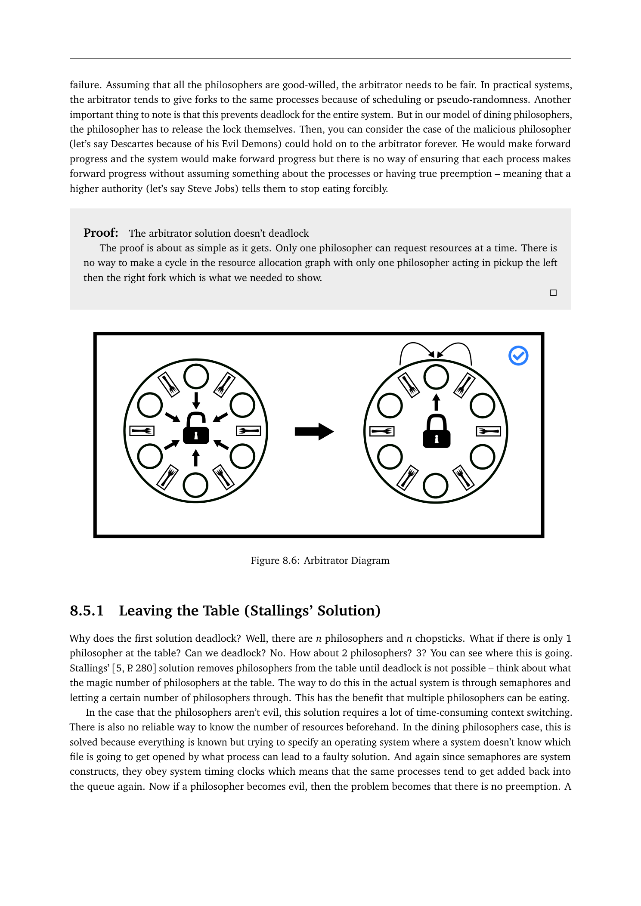

**提问：** 对截图中的内容逐句详细使用中文解释，不仅仅只是翻译，还需要对它们进行适当的解释,告诉我该怎么教学生并且指导怎么做

下面这页分三块内容：
A) 仲裁者（arbitrator/服务员）方案的注意点与公平性/恶意进程；
B) 一个简短的正确性证明（仲裁者方案不死锁）；
C) 8.5.1 Stallings 的“离桌法”（Leaving the Table）思路。
我按原文**逐句解释**，并配上**怎么讲给学生听**与**课堂可做什么**。

---

# A. 仲裁者方案的现实问题

> **failure. Assuming that all the philosophers are good-willed, the arbitrator needs to be fair.**

* **译**：即便（单点）故障问题存在，如果假设所有哲学家都“善意”，仲裁者还需要**公平**。
* **解**：不仅要安全（不死锁），还要**公平**，避免有人长期拿不到许可（饥饿）。
* **教**：板书“目标：安全 + 活性 + 公平”，提醒“仲裁者=排队器”。

> **In practical systems, the arbitrator tends to give forks to the same processes because of scheduling or pseudo-randomness.**

* **译**：在真实系统里，受调度或伪随机影响，仲裁者可能偏向**总是给同一批进程**。
* **解**：不公平的随机/调度会造成**饥饿**。
* **教**：引入**公平队列（FIFO）**或**轮转**作为改进。

> **Another important thing to note is that this prevents deadlock for the entire system.**

* **译**：需要强调：仲裁者方案能让**整个系统无死锁**。
* **解**：因为所有等待都对**一个中心点**，环被打破。
* **教**：让学生把 RAG 画成“星形”，说明“无环”。

> **But in our model of dining philosophers, the philosopher has to release the lock themselves.**

* **译**：但在本问题里，**释放**仍需哲学家**自愿**完成。
* **解**：如果进程不释放/卡住，仲裁者也会被“占着”。
* **教**：提醒“不可抢占”的影响：需要**超时/回收**机制。

> **Then, you can consider the case of the malicious philosopher (let’s say Descartes because of his Evil Demons) could hold on to the arbitrator forever.**

* **译**：设想有个**恶意哲学家**（玩笑称“笛卡尔”的恶魔），一直**霸占仲裁者**许可。
* **解**：这会导致**其他人都饿死**，尽管没有死锁。
* **教**：提出**租约/超时**：许可到期强制回收。

> **He would make forward progress and the system would make forward progress but there is no way of ensuring that each process makes forward progress without… true preemption…**

* **译**：恶意者和系统都在“前进”，但**无法保证每个进程**都有进展，除非引入**真正的抢占**或外部强制。
* **解**：这在分布式/操作系统里很常见：系统吞吐有，但**个体饥饿**。
* **教**：讲**公平性指标**（有界等待、最大等待时间）。

> **…meaning that a higher authority (let’s say Steve Jobs) tells them to stop eating forcibly.**

* **译**：比喻：需要更高的权威（比如“乔布斯”）**强制**让他停。
* **教**：把“高权威”映射为**内核/管理服务**的抢占、kill、超时回滚。

---

# B. 证明：仲裁者方案不死锁（Proof 框）

> **The arbitrator solution doesn’t deadlock.**

* **译**：结论：仲裁者方案**不会死锁**。

> **The proof is about as simple as it gets. Only one philosopher can request resources at a time.**

* **译**：证明很简单：任何时刻**只有一个哲学家**被允许请求资源。
* **解**：把竞争线性化（一次一个），环路不可能形成。

> **There is no way to make a cycle in the resource allocation graph with only one philosopher acting in pickup the left then the right fork…**

* **译**：资源分配图里**只有一个活动的请求者**，就无法形成“左→右→别人→…→回到我”的**环**。
* **教**：让学生把 RAG 画成一个进程与两把叉的**小三角**，没有其他节点参与，自然无环。
* **图 8.6**：左侧“许多人同时指向中心锁”→右侧“由仲裁者发放许可”的示意。

---

# C. 8.5.1 Leaving the Table（Stallings’ 解法）

> **Why does the first solution deadlock? Well, there are n philosophers and n chopsticks. What if there is only 1 philosopher at the table? Can we deadlock? No. How about 2… 3?**

* **译**：为什么最初的方案会死锁？因为桌上**n 人、n 把叉**。若桌上**只有 1 人**，会死锁吗？不会。那 **2 人、3 人**呢？
* **解**：在某些人数下，不会形成“全环等待”。
* **教**：引导推测“**同时放行的人数**与是否可能成环相关”。

> **Stallings’ solution removes philosophers from the table until deadlock is not possible – think about what the magic number of philosophers at the table.**

* **译**：Stallings 的思路：**减少在桌人数**，直到**不可能死锁**。问：桌上允许的“**魔法人数**”是多少？
* **解**：常见做法：**只允许最多 n−1 人**同时参与竞争（或更小的阈值）。这样至少有一把叉不被占，能打破环。
* **教**：板书结论：**Limit concurrent contenders ≤ n−1 ⇒ 无全环**。

> **The way to do this in the actual system is through semaphores and letting a certain number of philosophers through.**

* **译**：实现方式：用**信号量**控制，最多允许 **k** 人进入“取叉区域”。
* **教**：伪代码：`sem slots = n-1; P(slots); pick forks; eat; V(slots);`

> **This has the benefit that multiple philosophers can be eating.**

* **译**：优点：**可并发**，多个哲学家同时吃。
* **解**：不同于“单仲裁许可”的串行化。

> **In the case that the philosophers aren’t evil, this solution requires a lot of time-consuming context switching.**

* **译**：若哲学家不是恶意的，这一方案（控制人数/信号量）会带来**频繁上下文切换**的开销。
* **解**：进出“限流门”的调度+阻塞/唤醒成本。
* **教**：讨论**吞吐 vs 安全**权衡。

> **There is also no reliable way to know the number of resources beforehand.**

* **译**：实际系统里，常常**不知道**所需资源的精确数量（难以设置最佳 `k`）。
* **解**：通用 OS 很难提前声明全部资源需求（呼应前文 Rice 定理类观点）。

> **In the dining philosophers case, this is solved because everything is known but… trying to specify an operating system… can lead to a faulty solution.**

* **译**：在哲学家这个玩具模型里，资源数量可知；但在真实 OS 里，想预先指定会**不可靠**。
* **教**：把“教学模型”和“工业现实”对比，提醒学生不要生搬硬套。

> **And again since semaphores are system constructs, they obey system timing clocks which means that the same processes tend to get added back into the queue again.**

* **译**：信号量依赖系统时序，可能导致**相同进程反复排到前面**（不公平）。
* **解**：需要**公平队列/随机化/优先级**来缓解。
* **教**：让学生设计“FIFO semaphore”或在许可上附带**年龄/权重**。

> **Now if a philosopher becomes evil, then the problem becomes that there is no preemption.**

* **译**：若出现“恶意哲学家”，问题又回到**不可抢占**：他可能长时间占着许可/资源。
* **教**：加入**超时/租约/看门狗**：超过 T 强制回收或 kill。

---

## 课堂怎么讲与怎么做（可直接用）

### 1) 公平与饥饿演示（5–7 分钟）

* 用“仲裁者+无队列”的演示，让同一人连续多次获批；再改成**FIFO 队列**，比较等待时间。

### 2) Stallings 限流实验（10 分钟）

* 代码实现：`semaphore slots = n-1`；统计**吞吐**与**平均等待**。
* 改变 `k`：`k=n-2, n-1, n`，比较死锁概率与性能。
* 加入**恶意线程**（延长 `eat()` 时间），观察系统表现；再加**超时回收**。

### 3) 思考题（3–5 分钟）

* “无死锁、无活锁、无饥饿、吞吐高、无单点”能否同时满足？现实系统如何折中？（中心仲裁 + 备份、资源排序 + 随机退避、超时 + 回滚）

---

## 黑板小结（给学生的 checklist）

* 仲裁者：**破环**→不死锁；需**公平队列**、**超时/租约**、避免**SPOF**。
* Stallings：**限流到 n−1** → 不死锁；注意**调度开销**、**不公平**、**不可抢占**。
* 工程化：**安全（Safety）+ 活性（Liveness）+ 公平（Fairness）+ 吞吐（Throughput）+ 容错（Fault tolerance）**，需针对场景权衡。

---

需要的话，我可以：

* 给你一份**仲裁者（FIFO）**与**Stallings（n−1 限流）**的**可运行模板**（C/Pthreads 或 Python 线程）；
* 配套**实验记录表**与**评分 rubric**，方便课堂/作业批改。


---

## 第 204 页

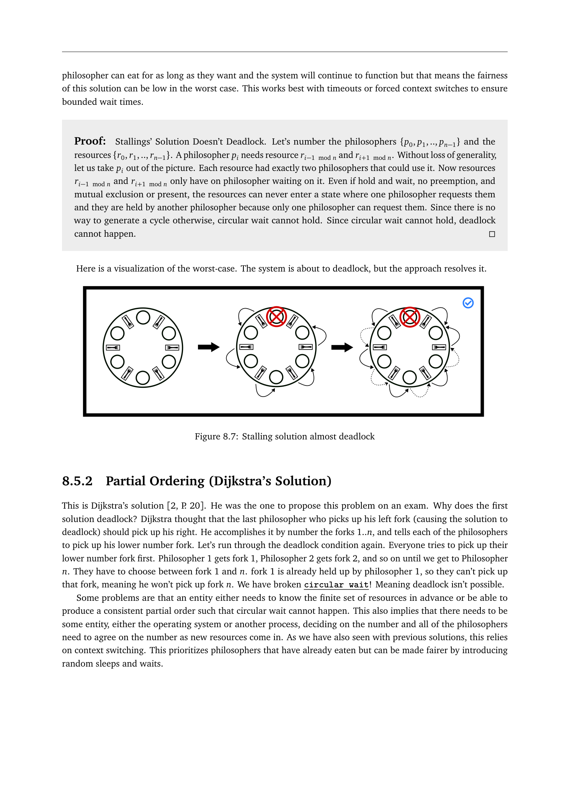

**提问：** 对截图中的内容逐句详细使用中文解释，不仅仅只是翻译，还需要对它们进行适当的解释,告诉我该怎么教学生并且指导怎么做

下面这页分成两大块：
A) **Stallings 的“离桌法”证明与最坏情形可视化**；
B) **Dijkstra 的“部分有序/全序编号法”（Partial Ordering）**。
我会按原文**逐句中文解释**，再给**怎么讲给学生听**与**可操作练习**。

---

# A. Stallings：离桌法（n−1 限流）证明与图解

> **(承上页) … a philosopher can eat for as long as they want … fairness … bounded wait times … timeouts or forced context switches.**

* **译**：在离桌法里（通过信号量只允许少数人上桌），某个哲学家可能**吃很久**，系统还能继续跑，但**最坏情况下公平性很差**。最好配合**超时**或**强制切换**来保证**有界等待**。
* **解释**：离桌法保证**不死锁**，但可能**饥饿**；需要工程化保障（超时/轮转）。

---

## 证明框：**Stallings’ Solution Doesn’t Deadlock**

> **Let’s number the philosophers {p₀, p₁, …, pₙ₋₁} and the resources {r₀, r₁, …, rₙ₋₁}. A philosopher pᵢ needs r\_{i−1 mod n} and r\_{i+1 mod n}.**

* **译**：哲学家与叉子都编号；pᵢ 需要左 r\_{i−1} 与右 r\_{i+1}（模 n）。
* **解释**：标准圆桌模型。

> **Without loss of generality, let us take pᵢ out of the picture.**

* **译**：不失一般性，设某个哲学家暂时不参与（离桌）。
* **解释**：离桌法的精髓：**减少并发竞争者**，典型做法是“最多允许 n−1 人上桌”。

> **Each resource had exactly two philosophers that could use it. Now resources r\_{i−1} and r\_{i+1} only have one philosopher waiting on it.**

* **译**：每把叉子原本被两人共享；当 pᵢ 离桌，pᵢ 左右两把叉子**各只剩一人**会去拿。
* **解释**：环上少了一个“等待者”，**断环**的机会出现了。

> **Even if hold and wait, no preemption, and mutual exclusion are present, the resources can never enter a state where one philosopher requests them and they are held by another philosopher because only one philosopher can request them.**

* **译**：即便互斥/占有并等待/不可抢占都成立，某些资源**不会出现“被甲持有同时被乙请求”的环式相互等待**，因为**只剩一个请求者**。
* **解释**：打掉**循环等待**这条 Coffman 条件 ⇒ **不死锁**。

> **Since there is no way to generate a cycle otherwise, circular wait cannot hold. Since circular wait cannot hold, deadlock cannot happen.**

* **译**：由于无法形成环，循环等待不成立 ⇒ 不会死锁。
* **课堂强调**：\*\*“破一条 ⇒ 无死锁”\*\*的典型实例。

---

> **Figure 8.7: Stalling solution almost deadlock**

* **解读**：图示“最坏情形”：看似要全环等待，但因为**有人离桌**，环被拆；流程继续。
* **教学**：让学生在图上画 RAG：缺席的那位对应的两把叉子**不会同时被两端占/等**。

---

### 课堂怎么讲（5–7 分钟）

1. 画圆桌与编号。
2. 让 pₖ “离桌”（用信号量 `slots = n−1` 表示）。
3. 口述：`r_{k−1}` 与 `r_{k+1}` 各只有一侧竞争者 ⇒ 不再闭环。
4. 强调配套：**超时/轮转**用于公平。

### 小练习（可当随堂题）

* 给出 `n=5` 的情形，`slots=4`，请画出可能的等待图并说明为何不能形成长度 5 的环。

---

# B. 8.5.2 Dijkstra：Partial Ordering（部分有序/全序编号法）

> **He was the one to propose this problem on an exam. Why does the first solution deadlock?**

* **译**：Dijkstra 在考试中提出了这个问题。他问：为什么最初的方案会死锁？
* **解释**：因为**循环等待**（每人先左后右）。

> **Dijkstra thought that the last philosopher who picks up his left fork … should pick up his right. He accomplishes it by number the forks 1..n, and tells each of the philosophers to pick up his lower number fork first.**

* **译**：Dijkstra 的想法：**给叉子编号 1..n**，规定每位哲学家**必须先拿编号较小的那把**，再拿较大的那把。
* **解释**：这就是\*\*资源全序（严格偏序）\*\*策略：**只升不降**的申请顺序 ⇒ **无法形成有向环**。

> **Let’s run through the deadlock condition again. Everyone tries to pick up their lower number fork first…**

* **译**：重新检查死锁四条件：每个人都先拿**较小编号**的叉。
* **课堂板演**：

  * P1 先拿 1，P2 先拿 2，…，Pn 先拿 n（或 1 与 n 的比较）。
  * 关键在**Pₙ 面对 1 与 n**的选择。

> **They have to choose between fork 1 and n. fork 1 is already held up by philosopher 1, so they can’t pick up that fork, meaning he won’t pick up fork n. We have broken circular wait!**

* **译**：当轮到哲学家 n，必须在叉 1 和叉 n 中先拿较小编号的**1**；但**1 已被 P1 拿着**，所以 Pn 在第一步就**拿不到**，因此**不会继续拿 n**。**循环等待被打破**！
* **解释**：因为严格的“先小后大”，在环路的某处必有一个人**无法完成第一步**，从而**不会形成全环请求链**。

> **Meaning deadlock isn’t possible.**

* **译**：因此**不可能死锁**。

> **Some problems are that an entity either needs to know the finite set of resources in advance or be able to produce a consistent partial order such that circular wait cannot happen.**

* **译**：问题在于：系统需要**预先知道资源集合**，并为它们建立一个**一致的全序/偏序**。
* **解释**：这在通用 OS/分布式里不总可行（资源动态出现、类型复杂）。

> **This also implies that there needs to be some entity … deciding on the number and all of the philosophers need to agree on the number as new resources come in.**

* **译**：还需要某个“实体”（OS 或管理者）来**分配编号并让大家达成一致**，当有新资源加入时继续维护这个顺序。
* **解释**：需要**全局协商**与**一致性**。

> **As we have also seen with previous solutions, this relies on context switching. This prioritizes philosophers that have already eaten but can be made fairer by introducing random sleeps and waits.**

* **译**：该方案依赖调度/切换；在实现中可能**优先**已吃过的人（或造成不公平），可通过**随机 sleep/等待**改善公平。
* **解释**：实践里要同时考虑**活性+公平**。

---

## 课堂怎么讲（8–10 分钟）

### 板书步骤

1. **给叉子编号**：1…n（顺时针）。
2. **规则**：哲学家总是先拿**min(左,右)**，再拿**max**。
3. **反证找环**：若存在环，则沿环编号应**严格递增**并最终**回到起点**，与“严格递增不可能回到原数”矛盾 ⇒ **无环**。
4. 强调前置条件：**必须能对所有资源建立全球一致顺序**。

### 课堂演示

* 让同学手持写有编号的“叉卡片”；每次只能按“先小后大”去拿。
* 你会看到：永远不会全体一起卡住；总有人拿不到“第一把”，从而让出时序。

---

## 实验/作业建议

1. **离桌法 vs 全序法**（C/Pthreads 或 Python）：

* 实现 `semaphore slots = n-1` 与“先小后大”两版；
* 度量吞吐（每秒 `eat()` 次数）、平均等待、最长等待；
* 加入**恶意线程**（长时间不释放）并加**超时**，比较系统表现。

2. **证明题（书面）**：

* 用**反证法/拓扑序**，写出“资源全序 ⇒ 无环 ⇒ 不死锁”的简明证明（≤200 字）。

3. **开放题**：

* 如果资源**动态加入/离开**，如何维护全序？（提示：分层命名、命名空间前缀、版本号、租约过期后重编号）

---

## 易错点与提醒

* **无死锁 ≠ 无饥饿**：离桌法与编号法都可能产生**不公平**；请引入**随机退避/FIFO 队列/老化（aging）**。
* **编号法的“全序一致性”**是关键：如果不同进程使用不同的编号视图，反而会**重新引入环**。
* **证明时别混淆**：编号法是**破“循环等待”**；离桌法是**减少并发者**，使环无法闭合。

---

需要的话，我可以把**两种方案的模板代码**、**实验记录表（含指标公式）**和**黑板证明图示**做成一页讲义，方便直接上课用。


---

## 第 205 页

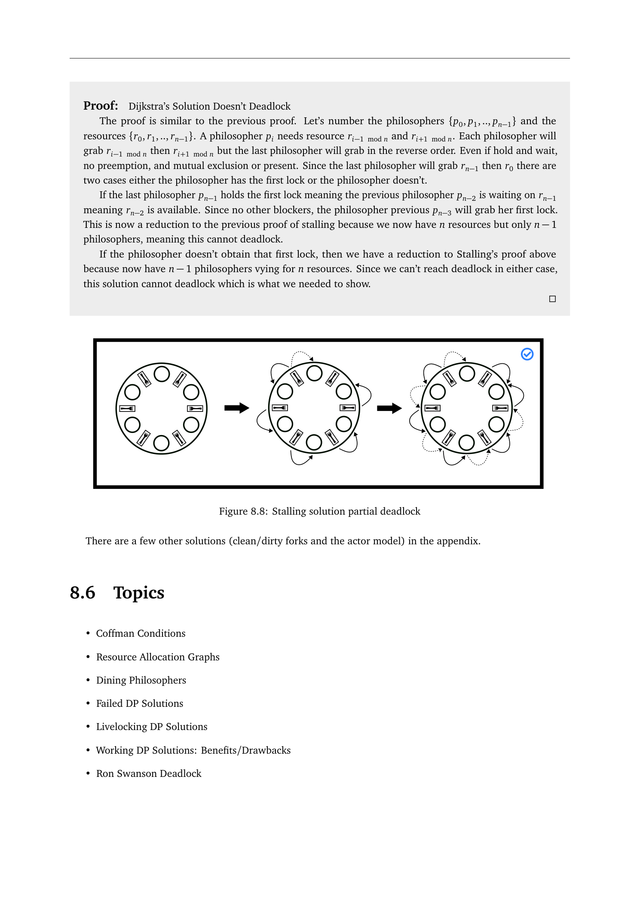

**提问：** 对截图中的内容逐句详细使用中文解释，不仅仅只是翻译，还需要对它们进行适当的解释,告诉我该怎么教学生并且指导怎么做

下面这页主要包括三部分：
A) **Dijkstra（部分有序/全序编号法）不死锁的证明**；
B) **图 8.8 的演化示意**；
C) **8.6 Topics 复盘清单**。
我会**逐句中文解释 + 点评**，并给出**课堂怎么讲/怎么练**的指引。

---

# A) 证明框：Dijkstra’s Solution Doesn’t Deadlock

> **The proof is similar to the previous proof. Let’s number the philosophers {p₀, p₁, …, pₙ₋₁} and the resources {r₀, r₁, …, rₙ₋₁}.**

* **译**：证明与前面相似。给哲学家和叉子都编号。
* **讲**：黑板写上圆桌编号，统一记法，后续便于指代。

> **A philosopher pᵢ needs resource r\_{i−1 mod n} and r\_{i+1 mod n}.**

* **译**：pᵢ 需要左右两把叉：r\_{i−1} 与 r\_{i+1}（模 n）。
* **讲**：标准模型回顾，确保学生不掉队。

> **Each philosopher will grab r\_{i−1 mod n} then r\_{i+1 mod n} but the last philosopher will grab in the reverse order.**

* **译**：每位哲学家按照“先拿较小编号，再拿较大编号”的规则取叉；特别地，“最后一位”在环的衔接处会与他人方向相反（形成“先小后大”的一致全序）。
* **解**：教材这里等价于**全序法**：所有人**先拿编号小的**那把，再拿大的。环上必有一处被“先小”卡住，从而破环。
* **讲**：板书规则：`lock(min(left,right)) → lock(max(left,right))`。

> **Even if hold and wait, no preemption, and mutual exclusion are present, since the last philosopher will grab r\_{n−1} then r₀ there are two cases either the philosopher has the first lock or the philosopher doesn’t.**

* **译**：即使“占有并等待/不可抢占/互斥”都成立，考虑“最后一位”面对 r₀ 与 r\_{n−1}：要么他先拿到“第一把”（较小编号），要么拿不到。
* **讲**：把问题拆成两种情况分别讨论（穷尽法）。

> **If the last philosopher p\_{n−1} holds the first lock meaning the previous philosopher p\_{n−2} is waiting on r\_{n−1} … the philosopher previous p\_{n−3} will grab her first lock. This is now a reduction to the previous proof of stalling because we now have n resources but only n−1 philosophers… cannot deadlock.**

* **译**：若 p\_{n−1} 拿到了自己的“第一把”，则 p\_{n−2} 可能在等这把；此时相当于“桌上少了一个竞争者”（n 把叉、n−1 个有效竞争者），**化约**到前面“离桌法（Stallings）”的情形 ⇒ **不死锁**。
* **讲**：告诉学生这是**归约论证**：把复杂情形化约为已证安全的场景。

> **If the philosopher doesn’t obtain that first lock, then we have a reduction to Stallings’s proof above because now have n−1 philosophers vying for n resources…**

* **译**：若 p\_{n−1} **拿不到**第一把，则“有效竞争者”立刻变成 n−1 个，同样归约到“离桌法”，**不死锁**。
* **讲**：两种情况都归约成功 ⇒ 结论成立。

> **…we can’t reach deadlock in either case, this solution cannot deadlock which is what we needed to show.**

* **译**：两种情形都不会走到死锁，因此全序法**不死锁**，证毕。
* **课堂提示**：强调\*\*破“循环等待”\*\*这一条就是关键。

---

# B) Figure 8.8：Stalling solution partial deadlock

* **图意**：展示一种“看似逐步逼近死锁”的演化，但由于**全序/离桌**带来的限制，环最终**闭合不了**，系统继续前进。
* **怎么讲**：让学生在图上给每把叉写编号，沿着“先小后大”的规则读一圈，必有一处“第一步拿不到”，从而环断。
* **课堂小练**：请一名学生当“讲解员”，带大家按编号顺序模拟一次加锁，其他同学检查是否出现回到起点的可行路径（应该不会）。

---

# C) 8.6 Topics（本章复盘清单）

> **Coffman Conditions**

* 四条件：**互斥、占有并等待、不可抢占、循环等待**。**破任意一条 ⇒ 不死锁**。

> **Resource Allocation Graphs**

* RAG 建模：进程/资源为节点，**资源→进程**=占有；**进程→资源**=请求。找**有向环**。

> **Dining Philosophers**

* 圆桌模型映射“多个进程竞争两个邻接资源”的通用场景。

> **Failed DP Solutions**

* 朴素“先左后右 lock-lock”可能**死锁**；`trylock+放手`**不死锁但可活锁/饥饿**。

> **Livelocking DP Solutions**

* 展示**活锁演化**与**随机退避**缓解思路。

> **Working DP Solutions: Benefits/Drawbacks**

* **仲裁者/服务员**：不死锁、可做公平，但**瓶颈/SPOF**；
* **离桌法（n−1 限流）**：不死锁、可并发；可能**不公平**、依赖调度；
* **部分有序/全序法（Dijkstra）**：简单高效、去中心；要求**全局一致编号**。

> **Ron Swanson Deadlock**

* 书后彩蛋/案例（可当课堂趣味讨论）。

---

## 教学收尾怎么做（15–20 分钟精讲版）

1. **黑板总结（5 分钟）**

   * 画 RAG；写 Coffman 四条件与“破一条即安全”；
   * 列出 3 个可行方案及优缺点对照表（安全/活性/公平/吞吐/复杂度）。

2. **证明回放（5 分钟）**

   * 用 3 行逻辑重述全序法证明：
     ① 全序 ⇒ 先小后大；② 环需要严格递增并回到起点；③ 矛盾 ⇒ 无环 ⇒ 不死锁。
   * 对比“离桌法”归约关系。

3. **小测/板演（5–10 分钟）**

   * 题 1：给出一张 RAG，判断是否死锁，并说明哪条 Coffman 条件失效可解。
   * 题 2：把 5 把叉编号，写出 P₄ 的加锁顺序；说明为何全体不可能同时阻塞。
   * 题 3（思辨）：在分布式系统里如何维护“全局资源顺序”？（提示：层级命名/命名空间/租约+版本）

---

## 作业与实践建议

* **编程**：实现三版哲学家（lock-lock、trylock+退避、全序法或服务员），测**吞吐、平均等待、最长等待**；用图表对比。
* **证明题**：用**反证**或**拓扑序**写出“全序 ⇒ 无环”的短证（≤200 字）。
* **工程化报告**：任选数据库/微服务/OS 锁管理，分析它如何避免死锁、处理活锁与饥饿。

---

## 易错点提醒

* **无死锁 ≠ 无饥饿**：任何方案都要考虑公平（FIFO、老化、随机退避）。
* **一致视图**：全序法的编号必须**全局一致**；不同视图会重新引入环。
* **归约逻辑**：注意“离桌法归约”与“全序法破环”的区别：一个是**减少竞争者**，一个是**限制请求方向**。

需要的话，我可以把**对照表、证明图解、随堂小测**做成一页讲义或幻灯片，方便你直接拿去上课。


---

## 第 206 页

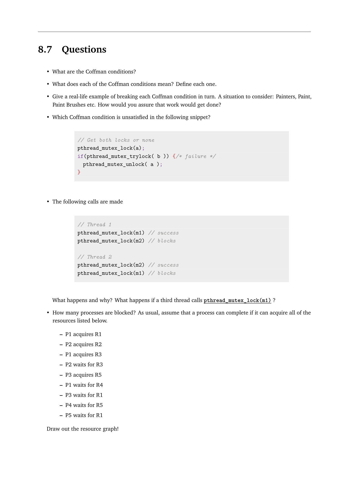

**提问：** 对截图中的内容逐句详细使用中文解释，不仅仅只是翻译，还需要对它们进行适当的解释,告诉我该怎么教学生并且指导怎么做

下面把这页“8.7 Questions”的每一项都**翻译 + 解释 + 给出示范答案**，并配上**课堂怎么教/怎么做**的指引。你可以直接拿去带练习。

---

# 逐题讲解与参考答案

## 1) What are the Coffman conditions?

**问**：什么是 Coffman（死锁）四条件？

**答要点（定义名词）**

1. **互斥（Mutual Exclusion）**：某些资源一次只能被一个进程占有。
2. **占有并等待（Hold & Wait）**：进程已占有至少一个资源，同时又在请求新的资源。
3. **不可抢占（No Preemption）**：已分配的资源不能被强制夺走，只能由持有者主动释放。
4. **循环等待（Circular Wait）**：存在一个进程—资源的有向环，每个进程都在等待下一个进程持有的资源。

**课堂怎么教**：把四条写在黑板上并画一个小 RAG 圈，边讲边让学生指出“这条条件在图里体现在哪”。

---

## 2) What does each of the Coffman conditions mean? Define each one.

**问**：逐条解释四条件含义。

**答**：上面已经按“名词 + 含义”给出；补充**工程例子**帮助记忆：

* 互斥：打印机、摄像头、独占文件句柄。
* 占有并等待：线程拿到锁A，再去要锁B。
* 不可抢占：数据库锁不能被 OS 强制剥夺。
* 循环等待：T1 拿 A 等 B；T2 拿 B 等 A。

**教学提示**：强调结论：**四条同时成立 ⇒ 存在死锁可能；打破任一条 ⇒ 不会死锁**。

---

## 3) Give a real-life example of breaking each Coffman condition…

**问**：给出**现实场景**（如油漆工、油漆、刷子）分别“破坏”四条件的方法，保证工作完成。

**参考示例（油漆工场景）**

* **破互斥**：买很多刷子/把刷子变“只读共享”（例如滚筒可多人同时蘸同一桶漆）。
* **破占有并等待**：规定“拿不到下一样工具就必须把手里的先放回”（拿不到梯子就把刷子先放回再重试）。
* **破不可抢占**：工长设定**超时/借用权**；超过 5 分钟未用就收回刷子给别人。
* **破循环等待**：给工具**编号并规定顺序**（先拿“桶号小”的漆，再拿“刷号小”的刷子，永远按编号递增申请），或让**服务员/库管**统一发放。

**课堂活动**：分 4 组，每组设计一种“破一条”的制度并说出**优缺点**（公平性/效率/成本）。

---

## 4) Which Coffman condition is unsatisfied in the following snippet?

代码片段：

```c
// Get both locks or none
pthread_mutex_lock(a);
if (pthread_mutex_trylock(b)) { /* failure */
    pthread_mutex_unlock(a);
}
```

**答**：**占有并等待（Hold & Wait）**被**破坏**。

* 解释：拿到 `a` 后，如果 `b` 获取失败就**立刻放掉 `a`**，不一边占有一边等，因此不满足（即破坏了）“占有并等待”。

**教学点**：顺便提醒 POSIX `trylock` 返回 0 表示成功，非 0 表示失败；这里注释已说明是“失败分支”。

---

## 5) The following calls are made … what happens and why?

片段：

```c
// Thread 1
pthread_mutex_lock(m1) // success
pthread_mutex_lock(m2) // blocks

// Thread 2
pthread_mutex_lock(m2) // success
pthread_mutex_lock(m1) // blocks
```

**答**：出现**死锁**。

* T1 占有 `m1` 等 `m2`；T2 占有 `m2` 等 `m1`，构成**循环等待**，且互斥/占有并等待/不可抢占都成立。
* **若第三个线程再调用 `pthread_mutex_lock(m1)`**：它也会**阻塞**（等待被 T1 释放），但由于前两者已死锁，它会**一直卡着**。

**教学延伸**：给出两种修复：

* **全序加锁**：所有线程按相同顺序获取（先 `min(m1,m2)` 再 `max`）。
* **trylock+退避**：拿不到第二把就释放第一把并随机等待后重试（注意活锁与公平）。

---

## 6) How many processes are blocked? … Draw out the resource graph!

给定状态（单实例资源）：

* P1 acquires R1
* P2 acquires R2
* P1 acquires R3
* P2 waits for R3
* P3 acquires R5
* P1 waits for R4
* P3 waits for R1
* P4 waits for R5
* P5 waits for R1

**先画 RAG（口述即可）**

* **分配边（资源→进程）**：R1→P1，R3→P1，R2→P2，R5→P3
* **请求边（进程→资源）**：P2→R3，P1→R4，P3→R1，P4→R5，P5→R1

**判断阻塞（看请求的资源当前是否被占）**

* P2 等 **R3**（被 P1 占）→ **阻塞**
* P3 等 **R1**（被 P1 占）→ **阻塞**
* P4 等 **R5**（被 P3 占）→ **阻塞**
* P5 等 **R1**（被 P1 占）→ **阻塞**
* P1 等 **R4** —— **当前没人占**（列表中没有“某人占 R4”），按常规调度可**立即获配** → **不算阻塞**

**答案**：被阻塞的进程数 **4 个**：P2、P3、P4、P5。
**进一步分析**：当前**尚未必然死锁**，因为只要把 **R4 分给 P1**，P1 可继续运行并释放 R1/R3，随后 P3/P2/P4/P5 都有机会前进。

**课堂操作**：

* 让学生在纸上画出 RAG（节点：P1..P5, R1..R5；箭头按上面）。
* 让他们用“**可用资源优先分配**”法手动推进 2–3 步，体验为何“不是所有环形结构都必定死锁”。

---

# 课堂带练建议（可直接用）

1. **分组快问快答（5 分钟）**

   * “破哪一条 Coffman 条件最容易？”
   * “为什么‘看到环’不一定=死锁？”（可能有抢占/可用资源/超时）

2. **板演 RAG（8 分钟）**

   * 把第 6 题画在黑板；请两名同学依次“授予资源/释放资源”，全班判断下一步是否可推进。

3. **小作业（可带回）**

   * 改写第 5 题代码，采用**全序加锁**与**trylock+随机退避**两版，测试是否还能复现死锁/活锁。
   * 任选现实团队协作场景（会议室/打印机/共享车辆），提出**破四条件**的制度，并评估公平与效率。

---

# 速查表（给学生）

* 四条件：互斥 / 占有并等待 / 不可抢占 / 循环等待
* **破一条 ⇒ 不死锁**：

  * 共享资源；
  * 一次申请全部 or 失败就释放；
  * 可抢占/超时回收；
  * 资源全序/服务员仲裁。
* RAG：资源→进程=占有；进程→资源=请求；**找环**是关键，但要看是否**有进程还能前进**。

如果你愿意，我可以把这份题目的\*\*可打印讲义（含空白 RAG 模板和标准答案）\*\*整理出来，方便课堂发放。


---

## 第 207 页

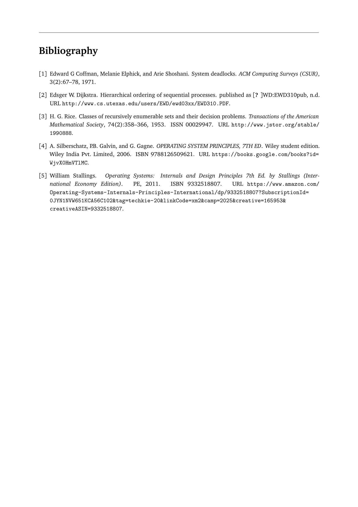

**提问：** 对截图中的内容逐句详细使用中文解释，不仅仅只是翻译，还需要对它们进行适当的解释,告诉我该怎么教学生并且指导怎么做

下面这页是本章的**参考文献（Bibliography）**。我会逐条**翻译+解释**每个条目的背景价值，并给出**教学建议：如何带学生阅读/使用这些文献、安排作业与讨论**。

---

# 参考文献逐条讲解

1. **Edward G. Coffman, Melanie Elphick, Arie Shoshani. “System deadlocks.” *ACM Computing Surveys (CSUR)*, 3(2):67–78, 1971.**

   * **译**：Coffman 等人在 1971 年发表的综述论文《系统死锁》。
   * **为什么重要**：首次系统提出并流行化了**死锁四条件**（互斥、占有并等待、不可抢占、循环等待）的框架，是今天教材与工程实践的基石。
   * **怎么教**：

     * 让学生对照课堂笔记，**在文中圈出**四条件的原始表述与定义差异。
     * 小任务：找一处当年的**系统/作业系统例子**，与今天的云/数据库做比较（技术如何演进、哪些没变）。

2. **Edsger W. Dijkstra. “Hierarchical ordering of sequential processes.”（EWD310 手稿/PDF）**

   * **译**：Dijkstra 的手稿《顺序进程的层次化次序》。
   * **为什么重要**：Dijkstra 提倡**为资源建立全序/偏序**来避免环路（即我们课堂上的“资源有序法”）；他也是把“哲学家进餐”变成经典考题的人。
   * **怎么教**：

     * 课堂读图：把“先拿较小编号再拿大编号”的论证画成**拓扑序**。
     * 作业：用**反证**写 150–200 字小证明“全序 ⇒ 无环 ⇒ 不死锁”。

3. **H. G. Rice. “Classes of recursively enumerable sets and their decision problems.” *Transactions of the AMS*, 74(2):358–366, 1953.**

   * **译**：Rice 定理的原始论文。
   * **为什么重要**：我们在“为什么很难静态证明程序不会死锁”时借用了**Rice 定理式的不可判定直觉**：一般而言，不运行程序就断言其语义性质（如将来会不会申请某资源）是不可行的。
   * **怎么教**：

     * 给出**直觉版**陈述：对任意非平凡语义性质，无法写出通用判定器。
     * 讨论题：哪些现实系统“绕开”了不可判定？（如银行家算法需要**声明最大需求**，属于**限制问题域**）。

4. **A. Silberschatz, P. B. Galvin, G. Gagne. *Operating System Principles*, 7th Ed., 2006（学生版）**

   * **译**：《操作系统概念（俗称黑皮书/恐龙书）》。
   * **为什么重要**：主流操作系统教材，对**死锁预防/避免/检测/恢复**、**RAG**、**银行家算法**有规范叙述与习题。
   * **怎么教**：

     * 指定**章节精读**（死锁一章）+ 选择两道课后题讲解。
     * 安排“**对照阅读**”：把课堂示例与书中**银行家算法**伪代码对齐，自己实现一次。

5. **William Stallings. *Operating Systems: Internals and Design Principles*, 7th Ed., 2011（International Economy 版）**

   * **译**：Stallings 的操作系统教材（我们前面讲到的\*\*Stallings “离桌法（n−1 限流）”\*\*就出自该书的一路讲解）。
   * **为什么重要**：案例化强、工程味足，对**哲学家进餐**给出多种可行解的利弊对比（仲裁者、限流、编号法等）。
   * **怎么教**：

     * 让学生**整理对照表**：方案 → 打破哪条 Coffman 条件 → 是否可能活锁/饥饿 → 吞吐/公平/复杂度。
     * 小组报告：任选两种方案做**实验对比**（吞吐、平均等待、最长等待），给出图表与结论。

---

# 课堂使用与作业设计（可直接套用）

## 1) 分层阅读路线（两周）

* **第 1 次课后（1.5–2 小时）**：读 Coffman’71 与恐龙书对应章节，写**要点摘要**（≤1 页）。
* **第 2 次课后（1.5 小时）**：读 Dijkstra 手稿（只读与全序相关段落），完成**150–200 字证明题**。
* **选读**：Stallings 相关小节 + 任选一个实现案例（仲裁者/限流/全序）做**代码复现**。

## 2) 注释式读书（Annotation）要求

* 在 PDF/打印稿上**标 3 处**“定义/定理/伪代码”，各写 2–3 句自己的话解释；
* 各文献**提出 1 个问题**（不懂/想验证/实践化），课堂提问或在论坛讨论。

## 3) 代码/实验（1–2 周）

* **实现三版哲学家**：`lock-lock`、`trylock+随机退避`、`资源全序`或`仲裁者（FIFO）`；
* **指标**：吞吐量（每秒 `eat()` 次数）、平均等待、最长等待、是否出现死锁/活锁；
* **报告**：1–2 页，包含图表与“哪种场景更适合哪种方案”的分析。

---

# 教学提示与注意事项

* **连线前后文**：让学生看到这份参考文献如何支撑教材里的每个观点（四条件来自 Coffman；全序来自 Dijkstra；“静态不可断言”类比 Rice）。
* **避免“只看链接”**：鼓励学生**摘抄关键原文**并尝试复述，防止只看二手转述。
* **版本差异**：教材版本众多，页码可能不同。提前给出**阅读范围**（章节/小节标题），避免学生迷路。
* **可获取性**：老论文常可在**作者主页/学校库/JSTOR**找到；阅读时注意版权与校园访问渠道。

---

需要的话，我可以把**阅读清单 + 摘要模板 + 实验评分 Rubric**做成一页 PDF，方便你直接布置与收作业。


---

## 第 208 页


**提问：** 对截图中的内容逐句详细使用中文解释，不仅仅只是翻译，还需要对它们进行适当的解释,告诉我该怎么教学生并且指导怎么做

看起来这页是空白页（多半是章节结尾或版面留白）。没有可逐句解读的正文内容。
不过你可以把这页**利用起来**，做“收尾与巩固”。下面给你一个**可直接拿去上课的结束环节脚本**。

# 课堂收尾（5–12 分钟）

1. **1 分钟小纸条（Minute Paper）**

   * 让学生写两句：

     * 今天学到的最重要概念（例如：RAG、Coffman 四条件、活锁 vs 死锁、哲学家解法）。
     * 仍然困惑的一点（例如：为什么“看到环≠一定死锁”）。
   * 收上来，下一次课“对症下药”。

2. **“最泥泞点”（Muddiest Point）**

   * 请大家用一句话写出本章最模糊的概念，你现场选 1–2 个马上澄清。

3. **黑板速记图（3 分钟）**

   * 让一位同学在空白页/白板上画**资源分配图（RAG）**，其他同学标出：

     * 占有边（资源→进程）、请求边（进程→资源）
     * 是否存在**有向环**
     * 如何**打破一条 Coffman 条件**来避免死锁

4. **3 题快问快答（每题 30 秒）**

   * Coffman 四条件分别是什么、破哪一条最常见？
   * 举例说明**活锁与死锁的区别**。
   * 哲学家问题里，“资源全序法”为什么能避免死锁？

# 可发的“离场卡”（Exit Ticket）

* 你更倾向哪种方案：**仲裁者、n−1 限流、资源全序、trylock+退避**？为什么？
* 你能画出一个**不会死锁但有活锁风险**的小例子吗？
* 下节课你想看哪种**代码 demo**（C/Pthreads、Python、多进程/分布式消息）？

# 作业建议（任选其一）

* **实现对比**：实现“先左后右 lock-lock”与“资源全序法”，统计 **吞吐/平均等待/最长等待**，写 1 页实验报告。
* **证明小练习**（≤200 字）：用反证法写出“资源全序 ⇒ 无向回到起点的环 ⇒ 不死锁”。
* **情景设计**：把“油漆工/刷子/油漆桶”建模成 RAG，分别给出**破四条件**的制度，各写优缺点。

# 复习清单（给学生抄）

* **RAG 规则**：资源→进程=占有；进程→资源=请求；找**有向环**。
* **Coffman 条件**：互斥 / 占有并等待 / 不可抢占 / 循环等待；**破一条 ⇒ 不死锁**。
* **活锁**：忙但无进展（常用**随机退避/公平队列**缓解）。
* **哲学家方案**：

  * 仲裁者（安全、可能瓶颈/SPOF）；
  * n−1 限流（不死锁、可能不公平）；
  * 资源全序（简洁高效，需全局一致编号）；
  * trylock+退避（不死锁，需防活锁/饥饿）。

需要的话，我可以把**复习清单 + Exit Ticket 模板**做成一页可打印 PDF，方便你直接发给学生。
