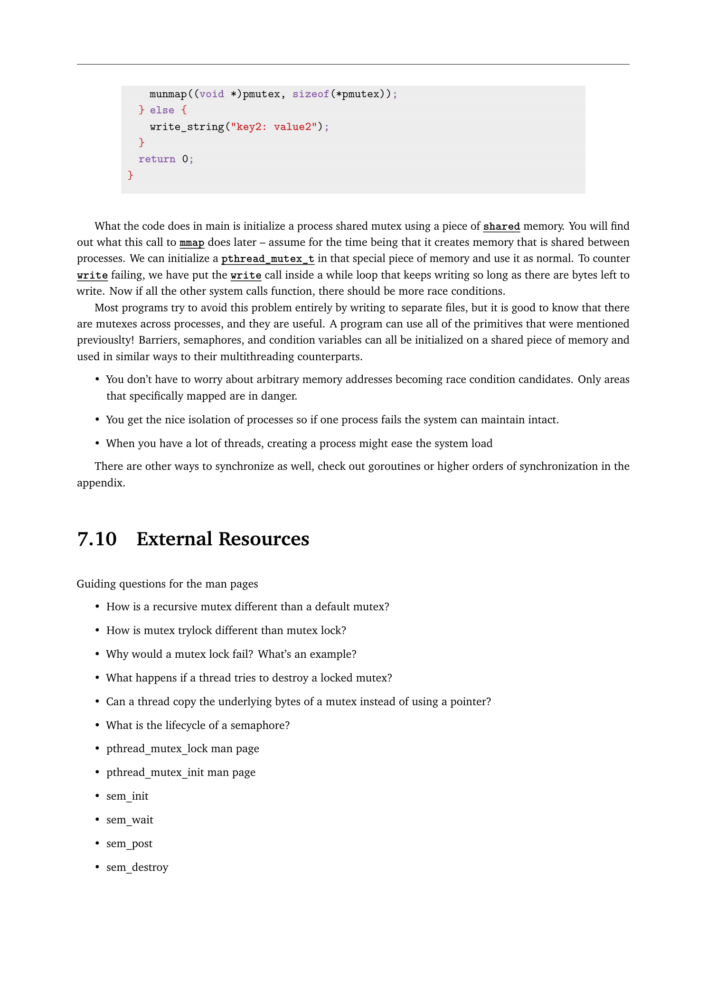

* 


---

## 第 131 页


**提问：** 对截图中的内容逐句详细使用中文解释，不仅仅只是翻译，还需要对它们进行适当的解释

好的，我来逐句为你详细解释截图中的内容，并且不仅仅是翻译，还会结合知识点做扩展说明，帮助你更深入理解。


---


## 第一部分：章节标题与引言


**"Threads"（线程）**

这里进入第 6 章，主题是 **线程**。线程是操作系统和编程中非常核心的概念，它直接关系到程序的并发执行。


**"If you think your programs crashing before, wait until they crash ten times as fast"**

直译是：“如果你觉得你的程序以前经常崩溃，那么等到它们以 10 倍速度崩溃吧。”

👉 这是一句幽默的话，暗示多线程编程虽然能提高性能，但也会让程序更容易出现复杂问题（比如同步错误、死锁、竞争条件），从而更快崩溃。


---


## 第二部分：什么是线程


**"A thread is short for ‘thread-of-execution’."**

线程的全称是“执行线程”。它代表了 CPU 将要执行的 **指令序列**。

👉 可以理解为：程序是一部“剧本”，而线程就是具体演员执行的“角色线”。


---


**"It represents the sequence of instructions that the CPU has and will execute."**

线程本质上就是 CPU 执行的 **一系列指令流**。

👉 一个线程在时间轴上按照特定顺序逐条执行代码。


---


**"To remember how to return from function calls, and to store the values of automatic variables and parameters a thread uses a stack."**

线程会用到 **栈（stack）**：


* 记录函数调用的返回地址；

* 存储局部变量（automatic variables）；

* 保存函数参数。

  👉 每个线程都有自己独立的栈，否则不同线程之间会把数据搞混。


---


**"Almost weirdly, a thread is a process, meaning that creating a thread is similar to fork, except there is no copying..."**

这句话的意思是：虽然线程和进程不同，但某种意义上可以把线程看作一个轻量级的进程。


* `fork`：在类 Unix 系统中，`fork` 会创建一个新的进程，几乎是 **完整复制** 父进程的地址空间。

* 线程：与 `fork` 不同，线程不会做完整复制，而是共享同一个进程的资源。


---


**"no copying meaning no copy on write."**

线程共享进程的内存空间，所以不需要“写时复制（Copy-On-Write, COW）”。

👉 换句话说，多个线程可以直接访问同一份数据。


---


**"What this allows is for a process to share the same address space, variables, heap, file descriptors and etc."**

这说明了线程的特性：**共享**。


* 地址空间

* 全局变量

* 堆（动态内存）

* 文件描述符（打开的文件/网络连接）

  👉 这就是线程比进程更轻量的原因，但同时也带来安全隐患（竞争条件）。


---


**"The actual system call to create a thread is similar to fork. It’s clone."**

在 Linux 中，真正创建线程的系统调用是 **`clone()`**，它和 `fork()` 很像，只不过允许指定共享哪些资源。

👉 例如，可以共享内存、文件描述符等。


---


**"LWP or Lightweight Processes or threads are preferred to forking..."**

轻量级进程（Lightweight Process, LWP）就是线程的另一种称呼。

👉 因为创建线程比创建进程开销更小，所以更常用。


---


**"But in some cases, notably python uses this, multiprocessing is the way to make your code faster."**

Python 中，由于 **全局解释器锁（GIL）** 的限制，多线程无法真正实现 CPU 并行，所以通常用 **多进程（multiprocessing）** 来加速。

👉 这也是为什么 Python 里常见的库（比如 `multiprocessing`）会选择进程而不是线程。


---


## 第三部分：6.1 Processes vs threads


**"Creating separate processes is useful when:"**

这一节比较 **进程 vs 线程** 的适用场景。


---


### 进程更适用的情况：


* **"When more security is desired. For example, Chrome browser uses different processes for different tabs."**

  当需要更高安全性时，用进程更好。比如 Chrome 浏览器中，每个标签页都是一个独立进程，避免一个崩溃影响全部。


* **"When running an existing and complete program then a new process is required, for example starting ‘gcc’."**

  如果要运行一个完整的程序（如编译器 `gcc`），必须使用新进程。线程无法做到。


* **"When you are running into synchronization primitives..."**

  如果涉及复杂的同步机制，多个线程可能会产生冲突。不同进程之间相互独立，可以避免一些麻烦。


* **"When you have too many threads..."**

  如果线程太多，内核调度会很混乱，反而拖慢系统。


* **"When you don’t want to worry about race conditions"**

  如果不想处理竞态条件，用进程更安全，因为进程的内存空间是隔离的。


* **"When the amount of communication is minimal..."**

  如果进程之间的通信很少（只需要偶尔传消息），那么用进程比较简单。


---


### 线程更适用的情况：


* **"You want to leverage the power of a multi-core system to do one task"**

  当你想利用多核 CPU 来并行完成一个任务时（比如矩阵运算、多媒体处理），线程是最佳选择。

  👉 因为线程之间共享数据，切换开销小，非常适合并行计算。


---


✅ 总结一下：


* **进程**：隔离性强，更安全，适合多个独立的任务。

* **线程**：开销小，共享资源，适合一个任务的并行加速。


---


要不要我帮你把这部分内容整理成一个 **对比表格（进程 vs 线程）**，这样你在复习或写论文时更直观？


---

## 第 132 页


**提问：** 对截图中的内容逐句详细使用中文解释，不仅仅只是翻译，还需要对它们进行适当的解释

好的，我来逐句为你详细解释截图中的内容（不仅翻译，还会结合知识点扩展说明），帮助你彻底理解 **线程内部机制 (Thread Internals)**。

你问的最后三条是关于「什么时候更适合使用线程（threads）」的补充。我们逐条翻译、解释原理，并给出教学讲法👇

------

## 🧩 英文原文 + 中文翻译 + 含义讲解

### 1️⃣ *When you can’t deal with the overhead of processes*

**中文翻译**：
 当你无法承受进程开销的时候。

**讲解**：

- “Overhead” 指创建和管理的额外系统开销。
- 每个进程都有独立的内存空间、文件描述符、页表等。创建一个新进程时，操作系统要复制这些结构（哪怕是 copy-on-write），代价比创建线程大得多。
- 而线程创建只需分配一个栈和少量调度信息，所以更轻量。

**课堂可讲例子**：
 在 Linux 下 `fork()` 一个进程可能耗时几毫秒，而 `pthread_create()` 一个线程只需几十微秒。
 👉 举例：一个 Web 服务器如果用“每请求一个进程”，效率会很低；改成“每请求一个线程”效率会高很多。

------

### 2️⃣ *When you want communication between the processes simplified*

**中文翻译**：
 当你希望进程（任务）之间的通信更简单时。

**讲解**：

- 不同进程的地址空间独立，因此要通信必须用 IPC（Inter-Process Communication），如管道、消息队列、共享内存、套接字等——写起来比较复杂。
- 线程则共享同一个进程的内存，传数据只要传指针、共享变量即可（当然要加锁防止竞争）。

**课堂讲法**：
 可以画一张图：

- 两个进程间通信：需要“邮递员”——操作系统帮忙搬数据。
- 两个线程间通信：直接对话——用同一块内存。

👉 小实验思路（Python/C 皆可）：
 让学生写一个父子进程通信（`Pipe` 或 `Queue`），再写一个多线程共享变量的版本，比较代码量与复杂度。

------

### 3️⃣ *When you want threads to be part of the same process*

**中文翻译**：
 当你希望多个执行单元属于同一个进程时。

**讲解**：

- 有时候你希望不同任务共享同一份资源（如内存池、数据库连接、全局配置）。
- 线程都在同一进程中运行，可以共享这些资源，不需要复制。
- 例如：一个游戏程序的主线程负责图形渲染，另一个线程负责物理计算，它们共用同一世界数据。

**课堂比喻**：
 一个公司（进程）里有多个部门（线程），他们共享公司资源（内存、文件、数据库连接），比起让每个部门都开一家公司（多进程）要省事得多。

---


## 6.2 Thread Internals （线程内部机制）


---


### **段落 1**


**"Your main function and other functions has automatic variables."**

程序的 `main` 函数以及其他函数中都有 **自动变量**（也就是局部变量）。


👉 自动变量的生命周期是函数调用期间，当函数结束时会被释放。


---


**"We will store them in memory using a stack and keep track of how large the stack is by using a simple pointer (the 'stack pointer')."**

这些局部变量会存储在 **栈（stack）** 中，并由 **栈指针（stack pointer）** 来追踪栈的大小。


👉 栈是一块后进先出（LIFO）的内存区域，用来保存局部变量、函数参数以及返回地址。


---


**"If the thread calls another function, we move our stack pointer down, so that we have more space for parameters and automatic variables."**

当线程调用另一个函数时，栈指针会向下移动（栈在内存中通常是从高地址往低地址增长），为新的函数调用准备局部变量和参数。


👉 每次函数调用都会开辟一个 **栈帧（stack frame）**。


---


**"Once it returns from a function, we can move the stack pointer back up to its previous value."**

当函数返回时，栈指针会恢复到调用前的位置，从而回收掉那部分栈空间。


👉 这也是局部变量会“消失”的原因。


---


**"We keep a copy of the old stack pointer value - on the stack!"**

在进入函数调用时，会把旧的栈指针值也保存在栈中，方便函数返回时恢复。


👉 这是函数调用机制的核心之一，保证能“退回”正确的执行点。


---


**"This is why returning from a function is quick. It’s easy to ‘free’ the memory used by automatic variables because the program needs to change the stack pointer."**

函数返回之所以很快，是因为只需要简单地调整栈指针，就能释放局部变量占用的内存。


👉 这比 `malloc/free` 的堆内存管理要高效得多。


---


### **段落 2**


**"In a multi-threaded program, there are multiple stacks but only one address space."**

在多线程程序中，**每个线程都有独立的栈**，但它们共享同一个 **进程地址空间**。


👉 这意味着：


* 每个线程有自己独立的局部变量（存储在各自的栈上）；

* 但全局变量、堆（动态分配的内存）、代码区都是共享的。


---


**"The pthread library allocates some stack space and uses the clone function call to start the thread at that stack address."**

POSIX 线程库（pthread）在创建新线程时，会分配一块新的栈空间，并使用 **`clone` 系统调用**来启动线程，从该栈空间开始执行。


👉 这保证了不同线程不会互相干扰局部变量。


---


### **图示解释 (Figure 6.1)**


这张图展示了多线程的栈布局：


* **Reserved Space**：保留空间，可能用于系统管理。

* **1st Thread's Stack**：主线程的栈。

* **2nd Thread's Stack**：第二个线程的栈。

* **...**：更多线程的栈。


👉 这些栈都在同一个进程地址空间中，但相互独立，避免冲突。


---


### **段落 3**


**"A program can have more than one thread running inside a process. The program get the first thread for free!"**

一个进程可以有多个线程在其中运行。程序一开始就会自动获得一个“免费”的线程——主线程。


👉 主线程默认运行 `main()` 函数中的代码。


---


**"It runs the code you write inside ‘main’."**

主线程负责执行 `main` 函数中的代码。


---


**"If a program need more threads, it can call pthread\_create to create a new thread using the pthread library."**

如果需要更多线程，可以使用 **`pthread_create`** 来创建。


👉 这是 C 语言多线程编程的常用接口。


---


**"You’ll need to pass a pointer to a function so that the thread knows where to start."**

创建新线程时，需要把一个函数指针传进去，告诉线程它从哪里开始执行。


👉 这就像告诉一个工人：“你从这一步开始干活。”


---


### **段落 4**


**"The threads all live inside the same virtual memory because they are part of the same process."**

所有线程都生活在同一个虚拟内存空间里，因为它们属于同一个进程。


---


**"Thus they can all see the heap, the global variables, and the program code."**

因此，所有线程可以共享：


* 堆（动态内存分配）

* 全局变量

* 程序代码区


👉 这就是线程间通信比进程间通信更快的原因，但也容易产生 **数据竞争（race condition）**。


---


✅ **总结**：


* 每个线程有 **自己独立的栈**（保存局部变量和函数调用信息）。

* 但所有线程共享 **堆、全局变量、代码区**。

* 主线程默认运行 `main()`，新线程通过 `pthread_create` 创建，并从传入的函数开始执行。

* 使用 `clone()` 系统调用实现线程的创建和栈分配。


---


要不要我帮你画一张 **“进程内线程内存布局示意图”**（栈、堆、全局变量、代码区的关系），这样比文字更直观？


---

## 第 133 页


**提问：** 对截图中的内容逐句详细使用中文解释，不仅仅只是翻译，还需要对它们进行适当的解释

好的！我按截图的行文顺序，逐句用中文解释，并在每句后补充必要的背景与延伸，帮助你真正吃透这页内容。


---


# 图 6.2（Threads pointing to the same place in the heap）


图中左侧是一根“内存柱”，表示**同一进程的虚拟地址空间**。


* 顶部是 **Reserved Space（保留空间）**：给系统或运行时用的区域。

* 接下来是 **1st Thread’s Stack（线程1的栈）**、**2nd Thread’s Stack（线程2的栈）**：每个线程各有一块独立栈内存。

* 底部是 **Heap（堆）**：进程中所有线程共享的动态内存区域。

* 图里标注了 `int *a`、`int *b` 两个虚线框，表示**不同线程的栈上各自保存了指针变量**；两根弯箭头指向堆里的同一个地址（底部标“1”处）。

  **要点**：虽然每个线程的**栈彼此独立**，但它们可以把**指针**都指向**同一块堆内存**，因此能读写同一份数据——这既是强大的共享能力，也是产生**数据竞争**的根源。


---


## 段落 1


**“Thus, a program can have two (or more) CPUs working on your program at the same time and inside the same process.”**

因此，一个程序（同一进程）里可以同时让**两个（或更多）CPU 内核**并行地为你的程序工作。


* 这里的“CPU”更准确说是**CPU 核心**（多核处理器）。

* 多线程让同一进程的不同线程在**不同核心**上同时跑，从而提升吞吐量或降低延迟。


**“It’s up to the operating system to assign the threads to CPUs.”**

把哪个线程分配到哪个 CPU 核心上，是**操作系统调度器**说了算。


* 你可以用线程优先级/亲和性影响调度，但最终决定权在内核。


**“If a program has more active threads than CPUs, the kernel will assign the thread to a CPU for a short duration or until it runs out of things to do and then will automatically switch the CPU to work on another thread.”**

如果**活动线程数 > CPU 核心数**，内核会让线程**轮流**占用 CPU：


* 给某个线程一个**时间片**执行一小段时间；

* 或者当它**暂时干不了活**（例如被 I/O 阻塞）时，

* **自动切换**到其他线程继续跑。

  这就是**时间分片 + 抢占式调度**与**上下文切换**的基本思想。


**“For example, one CPU might be processing the game AI while another thread is computing the graphics output.”**

举例：一个核心负责**游戏 AI** 线程，另一个核心负责**图形渲染**线程。


* 这是经典的**并行分工**：不同线程各司其职，互不阻塞。

* 但注意两者可能需要共享游戏状态（堆上的对象），要用**互斥/锁/原子操作**保证一致性。


---


# 6.3 Simple Usage（简单用法）


**“To use pthreads, include pthread.h and compile and link with -pthread or -lpthread compiler option.”**

要使用 POSIX 线程库（pthreads）：


1. 在源码里 `#include <pthread.h>`；

2. 编译/链接时加选项 **`-pthread`** 或 **`-lpthread`**。


* 多数编译器/平台上推荐 `-pthread`：它不仅链接库，还会设置必要的编译器宏与线程安全选项；

* `-lpthread` 仅显式链接库，有时不等价（取决于平台工具链）。


**“This option tells the compiler that your program requires threading support.”**

这些选项告诉编译器/链接器：**本程序需要线程支持**。


* 影响：链接到 `libpthread`，可能还会启用线程安全的 C 标准库实现等。


**“To create a thread, use the function pthread\_create. This function takes four arguments:”**

创建线程用 **`pthread_create`**，它有**四个参数**（随后给出函数原型）。


```c

int pthread_create(pthread_t *thread, const pthread_attr_t *attr,

                   void *(*start_routine) (void *), void *arg);

```


逐项解释：


1. **`pthread_t *thread`**


   * **输出参数**：返回新线程的 ID（句柄）。

   * 你传入的是指针，函数会把创建好的线程 ID 写进去，便于后续 `pthread_join`、`pthread_detach` 等操作。


2. **`const pthread_attr_t *attr`**


   * **线程属性**：如栈大小、是否设为分离态（detached）、调度策略/优先级等。

   * **传 `NULL` 表示用默认属性**（最常见做法）。


3. **`void *(*start_routine)(void *)`**


   * **线程入口函数指针**：新线程从这里开始执行。

   * 签名固定：接收一个 `void*` 参数，返回 `void*`。

   * 返回值在线程被 `pthread_join` 时可被获取。


4. **`void *arg`**


   * 传给入口函数的**单个参数指针**。

   * 想传多参数？把它们打包进一个结构体，再把结构体指针传进来。


**返回值（虽未在截图文字中展开，但理解很关键）**：


* `pthread_create` 成功返回 **0**；失败返回**错误码**（如 `EAGAIN` 资源不足、`EINVAL` 属性非法等）。

* 失败时 `*thread` 不会被赋有效值。


---


## 一个超短示例（把上面四个参数串起来）


```c

#include <pthread.h>

#include <stdio.h>


void* worker(void* p) {

    int n = *(int*)p;   // 解引用参数

    printf("work on %d\n", n);

    return NULL;        // 也可 return (void*)some_ptr;

}


int main() {

    pthread_t t;

    int x = 42;

    // 默认属性，入口函数为 worker，参数指向 x

    if (pthread_create(&t, NULL, worker, &x) != 0) {

        perror("pthread_create");

        return 1;

    }

    pthread_join(t, NULL);  // 等待线程结束，回收资源

    return 0;

}

```


* 若不 `pthread_join`，应考虑 `pthread_detach(t)`，避免**僵尸线程**（资源不被回收）。


---


## 本页核心小结


* **并行性**：多线程可在多核上同时运行，同一进程内实现真正并行（受语言/运行时限制如 Python GIL 例外）。

* **调度**：当线程多于核心时，内核通过**时间片**与**上下文切换**在核心间轮转执行线程。

* **内存模型**：线程的**栈独立**、**堆/全局/代码共享**；不同线程的栈上指针可共同指向堆上同一对象。

* **实操**：`#include <pthread.h>`，编译时 `-pthread`（首选）；用 `pthread_create` 指定入口函数与参数创建线程。


如果你愿意，我可以把“线程创建与回收的最佳实践（属性设置、分离态 vs join、错误处理、栈大小、数据共享与同步注意事项）”整理成一页备忘清单，方便你写作业或做实验时直接对照。


---

## 第 134 页


**提问：** 对截图中的内容逐句详细使用中文解释，不仅仅只是翻译，还需要对它们进行适当的解释

好的，我们继续逐句详细解析这页内容（不仅仅是翻译，还会结合知识点做扩展说明）。


---


## 四个参数的解释（延续上页的 `pthread_create`）


* **"The first is a pointer to a variable that will hold the id of the newly created thread."**

  第一个参数是一个指针，指向一个变量，这个变量用来保存新建线程的 ID（线程句柄）。

  👉 这样我们后续可以用这个 ID 去管理线程，比如 `pthread_join` 等。


* **"The second is a pointer to attributes that we can use to tweak and tune some of the advanced features of pthreads."**

  第二个参数是线程属性指针，可以用来设置线程的一些高级特性（例如栈大小、是否分离运行、调度策略）。

  👉 一般情况下我们传 `NULL`，表示用默认属性。


* **"The third is a pointer to a function that we want to run."**

  第三个参数是一个函数指针，表示线程要执行的入口函数。

  👉 每个新线程都会从这个函数开始运行。


* **"Fourth is a pointer that will be given to our function."**

  第四个参数是一个指针，传给入口函数作为参数。

  👉 如果你要给线程传多个参数，就需要把它们放到一个结构体里，然后把结构体指针传进来。


---


## 复杂函数指针的解释


\*\*"The argument void \*(*start\_routine) (void *) is difficult to read!"**

这个函数原型 `void *(*start_routine)(void *)` 很难读懂。

👉 它的含义是：一个函数指针，指向的函数接收一个 `void *` 参数，并返回一个 `void *`。


**"It looks like a function declaration except that the name of the function is wrapped with (* .... )"*\*

它看起来像一个普通的函数声明，只不过函数名部分被 `(* ... )` 包裹起来，表示这是一个 **指针**。


---


## 代码示例分析


```c

#include <stdio.h>

#include <pthread.h>


void *busy(void *ptr) {

    // ptr will point to "Hi"

    puts("Hello World");

    return NULL;

}


int main() {

    pthread_t id;

    pthread_create(&id, NULL, busy, "Hi");

    void *result;

    pthread_join(id, &result);

}

```


逐行解释：


1. `#include <pthread.h>` 引入 pthread 库头文件。

2. 定义函数 `busy`，参数 `void *ptr`，这里会指向 `"Hi"`（也就是 main 函数传进去的那个参数）。

3. `puts("Hello World");` 在线程里打印 "Hello World"。

4. `return NULL;` 表示线程返回空指针。

5. 在 `main` 中：


   * 定义 `pthread_t id;` 用于保存线程 ID。

   * `pthread_create(&id, NULL, busy, "Hi");` 创建线程，入口函数是 `busy`，参数是 `"Hi"`。

   * 定义一个 `void *result;` 保存线程返回值。

   * `pthread_join(id, &result);` 等待线程结束，并把返回值写入 `result`。


---


## 示例结果与注意事项


**"In the above example, the result will be NULL because the busy function returned NULL."**

在上面的例子里，`busy` 返回了 `NULL`，所以 `pthread_join` 得到的结果就是 `NULL`。


**"We need to pass the address-of result because pthread\_join will be writing into the contents of our pointer."**

注意我们传的是 `&result`，而不是 `result` 本身。因为 `pthread_join` 会把线程返回值写到这个地址指向的内存里。


---


## 关于 `pthread_t`


**"In the man pages, it warns that programmers should use pthread\_t as an opaque type and not look at the internals. We do ignore that often, though."**

在 Linux 手册中，提醒我们要把 `pthread_t` 当作一个 **不透明类型（opaque type）** 来使用，不要依赖它内部的实现。

👉 因为不同系统上 `pthread_t` 的底层实现可能不同（有的系统是 `unsigned long`，有的是结构体）。

虽然很多人会偷看或假设，但这是不推荐的。


---


## 6.4 Pthread Functions


**"Here are some common pthread functions:"**

下面介绍几个常见的 pthread 函数。


---


### pthread\_create


**"pthread\_create creates a new thread. Every thread gets a new stack."**

`pthread_create` 用来创建一个新线程，每个线程都会得到一个新的栈。


**"If a program calls pthread\_create twice, Your process will contain three stacks - one for each thread."**

如果程序调用两次 `pthread_create`，那么整个进程里会有三个栈：


* 一个是主线程的栈；

* 两个是新建线程的栈。


**"The important idea is that each thread requires a stack because the stack contains automatic variables and the old CPU PC register..."**

关键点：每个线程必须有自己的栈，因为栈里存放着：


* 自动变量（局部变量）；

* 函数调用时保存的寄存器状态（比如程序计数器 PC）。

  这样线程才能在函数返回时恢复正确的执行位置。


---


### pthread\_cancel


**"pthread\_cancel stops a thread. Note the thread may still continue."**

`pthread_cancel` 用于请求取消（终止）一个线程。

👉 但要注意，它不会立刻“杀死”线程，而是给目标线程发送一个取消请求。

线程会在下一个取消点（如调用阻塞函数时）检查到并终止。


**"For example, it can be terminated..."**

换句话说，线程能否被终止，取决于它的运行状态和是否响应取消点。


---


✅ **总结这一页**


1. `pthread_create` 四个参数：线程 ID、线程属性、入口函数、入口参数。

2. `start_routine` 类型复杂，但就是“接收 void\*，返回 void\*”的函数指针。

3. 示例代码展示了如何创建线程并用 `pthread_join` 获取返回值。

4. `pthread_t` 是不透明类型，不要依赖实现细节。

5. 常用函数：


   * `pthread_create`：创建线程，每个线程有独立的栈。

   * `pthread_cancel`：请求取消线程，但不保证立即终止。


---


要不要我接下来帮你把 **常见 pthread 函数及用途** 整理成一个表格（像速查表一样），让你在复习或者写代码时一眼就能找到？


---

## 第 135 页


**提问：** 对截图中的内容逐句详细使用中文解释，不仅仅只是翻译，还需要对它们进行适当的解释

好的，我按截图从上到下、逐句讲解，并在每句后补充必要的背景与延伸说明，确保不只是直译而是“读懂”。


---


## 一、`pthread_cancel`（继续自上一页的说明）


**“when the thread makes an operating system call (e.g. write).”**

指：线程在执行**系统调用**（比如 `write`）时，往往会出现**取消点（cancellation point）**，这时若对它发出取消请求，更容易被及时响应。


* 许多阻塞型系统调用（`read`/`write`/`select` 等）天然是取消点。


**“In practice, pthread\_cancel is rarely used because a thread won’t clean up open resources like files.”**

实践中很少直接用 `pthread_cancel`，因为**强行取消**线程时，它**可能来不及做清理**（比如没关闭已打开的文件、没释放锁/内存）。


* 这会导致**资源泄漏**或**死锁**风险。


**“An alternative implementation is to use a boolean (int) variable whose value is used to inform other threads that they should finish and clean up.”**

常用替代法：使用一个**布尔/整型的“停止标志位”**。


* 其他线程定期检查该标志，若为“停止”，就**自行收尾并退出**。

* 好处：线程能**以可控的方式**释放资源、解锁、保存状态。


---


## 二、`pthread_exit(void *)`


\**“pthread\_exit(void *) stops the calling thread meaning the thread never returns after calling pthread\_exit.”**

`pthread_exit` 会**结束调用它的那个线程**；调用后该线程**不再返回**到调用点。


* 注意：它**仅结束当前线程**，不是整个进程。


**“The pthread library will automatically finish the process if no other threads are running.”**

如果进程里**没有其他存活线程**了，pthread 库（准确说是进程的运行环境）会**结束整个进程**。


* 即：最后一个线程退出 → 进程也随之结束。


\**“pthread\_exit(...) is equivalent to returning from the thread’s function; both finish the thread and also set the return value (void *pointer) for the thread.”**

`pthread_exit(ret)` 与**从线程入口函数 `return ret;`** 本质等价：


* 都会结束该线程；

* 都会设置线程的**返回值**（一个 `void*` 指针），供 `pthread_join` 取得。


**“Calling pthread\_exit in the main thread is a common way for simple programs to ensure that all threads finish.”**

在**主线程**里调用 `pthread_exit` 是一种**简单**且常见的手法：让主线程先结束**自己**，但**不终止进程**，从而让其他工作线程**有时间跑完**。


* 典型用途：主线程只负责“拉起”工作线程，然后 `pthread_exit(NULL)`，进程维持到其他线程都结束为止。


**“For example, in the following program, the myfunc threads will probably not have time to get started.”**

如果主线程直接结束**整个进程**（见下一句讨论的 `exit()`），下面示例里刚创建的 `myfunc` 线程**可能还没来得及启动**就被一起终止了。


**“On the other hand exit() exits the entire process and sets the process’ exit value.”**

相反，`exit()` 会**结束整个进程**，并设置进程的**退出码**。


* 一旦 `exit()`，**所有线程都被杀掉**。


**“This is equivalent to return 0; in the main method.”**

`exit(0)` 的语义等价于 `main` 函数里 `return 0;`（即正常退出）。


* 只是前者**无条件**终止整个进程，后者是从 `main` 正常返回，但效果同为**进程结束**。


**“All threads inside the process are stopped.”**

再次强调：调用 `exit()` → **整个进程**终止 → **所有线程**被停止。


**“Note the pthread\_exit version creates thread zombies; however, this is not a long-running process, so we don’t care.”**

如果主线程用 `pthread_exit` 结束自己而**不 `join` 其他线程**，在某些实现/语境下，结束后的线程控制块可能**暂留**（俗称“僵尸线程”占用少量资源，等待被 `join` 回收)。


* 对于**短命的小程序**，进程很快结束，内核会统一回收资源，因此**通常不必在意**。

* 对于**长时间运行**的服务，应该 `pthread_join` 或 `pthread_detach`，避免资源堆积。


**示例代码（节选）讲解：**


```c

int main() {

  pthread_t tid1, tid2;

  pthread_create(&tid1, NULL, myfunc, "Jabberwocky");

  pthread_create(&tid2, NULL, myfunc, "Vorpel");

  if (keep_threads_going) {

    pthread_exit(NULL);     // 只结束主线程，让其它线程继续跑

  } else {

    exit(42);               // 或者直接结束整个进程（退出码 42）

  }

  // 到不了这里：exit 后无代码执行，pthread_exit 后主线程也不再返回

}

```


* `keep_threads_going` 为真 → 主线程 `pthread_exit`，给工作线程时间完成；

* 否则 `exit(42)` → 直接杀进程，所有线程立刻终止。


---


## 三、`pthread_join()`


**“pthread\_join() waits for a thread to finish and records its return value.”**

`pthread_join` 会**阻塞等待**指定线程结束，并把它的**返回值**（`void*`）取出来。


* 这是**回收线程资源**（类似 `waitpid` 回收子进程）的标准做法。


**“Finished threads will continue to consume resources.”**

如果线程结束了但**没人 `join`**，其某些资源仍会被占着（如线程描述符、栈空间未释放等）——这就是“僵尸线程”的比喻来源。


**“Eventually, if enough threads are created, pthread\_create will fail.”**

如果你不断创建新线程却**不回收旧线程**，最终会因为资源耗尽导致 `pthread_create` **失败**（返回错误码，如 `EAGAIN`）。


**“In practice, this is only an issue for long-running processes but is not an issue for simple, short-lived processes as all thread resources are automatically freed when the process exits.”**

实际开发里，这个问题主要困扰**长时间运行**的进程（服务/守护进程）。


* 对**短命程序**，进程很快结束，操作系统会**统一释放**资源，因此影响不大。


**“This is equivalent to turning your children into zombies, so keep this in mind for long-running processes.”**

类比：不 `join` 的线程就像把“孩子”变成“僵尸”。


* 对于**长期运行**的程序，请务必 `join` 或用 `pthread_detach` 进行**分离**，以便自动回收。


**“In the exit example, we could also wait on all the threads.”**

在前面 `exit`/`pthread_exit` 的示例里，另一种做法是**显式等待**（`pthread_join`）**所有线程**完成后再退出，更干净。


**示例（join 两个线程并返回退出码）**


```c

// ...

void* result;

pthread_join(tid1, &result);   // 等待线程1，并取其返回值到 result

pthread_join(tid2, &result);   // 等待线程2

return 42;                     // 进程的退出码

// ...

```


* `result` 可接收线程的 `return` 或 `pthread_exit` 传回的指针。

* 这里没有用到 `result` 的内容，只是演示调用。


---


## 四、线程退出的方式（开头几条）


**“There are many ways to exit threads. Here is a non-complete list:”**

退出线程的方法有很多，下面是不完整清单（还会在后续页面继续列）。


**“• Returning from the thread function”**


* **从线程入口函数 `return`**：最自然、最推荐的方式之一。

* 返回值会被 `pthread_join` 拿到；返回前可以做清理、解锁、释放内存等。


> 其它常见方式（虽在下一页，但提前补充方便体系化理解）：

>

> * 调用 **`pthread_exit(ret)`** 主动结束自己；

> * 主线程或其他线程 `cancel` 它（前提是代码在取消点、且允许取消）；

> * 进程整体 `exit()`/`_exit()`（所有线程一起终止）；

> * 设置“停止标志位”，让线程在下次检查时**自行善后并返回**；

> * 把线程设为 **detached**（避免 join），线程结束时资源自动释放。


---


## 实战建议（应对作业/写代码易踩点）


1. **优先用返回/`pthread_exit`** 自行收尾，少用 `pthread_cancel` 粗暴终止。

2. **长跑型进程**务必 `pthread_join` 或 `pthread_detach`，避免“僵尸线程”。

3. 用**停止标志**+**条件变量**/**事件**让线程**可中断**且**可清理**。

4. 需要结果就 `join` 并**检查返回值**；线程共享数据要用**锁/原子操作**防竞态。

5. 主线程若只负责“拉起”工作线程且不想阻塞，可 `pthread_exit(NULL)` 让其他线程跑完再让进程自然结束。


如果你愿意，我可以把“线程退出与资源回收”的关键路径画成一个**流程图**（带上推荐做法与反例），更便于你写论文或做实验时对照使用。


---

## 第 136 页


**提问：** 对截图中的内容逐句详细使用中文解释，不仅仅只是翻译，还需要对它们进行适当的解释

好的，我们逐句来看截图中的内容，并结合知识点做详细解释。


---


## 一、线程退出的各种方式


* **Calling `pthread_exit`**

  通过调用 `pthread_exit` 让线程结束。

  👉 这是最常用和安全的线程退出方式之一，线程能返回一个值给 `pthread_join`。


* **Canceling the thread with `pthread_cancel`**

  使用 `pthread_cancel` 请求取消一个线程。

  👉 不过它不保证线程立即退出，只是发出“终止请求”，线程会在取消点检查并退出。


* **Terminating the process through a signal.**

  通过信号终止整个进程，比如 `SIGTERM`、`SIGKILL`。

  👉 一旦进程死掉，所有线程也会结束。


* **calling `exit()` or `abort()`**


  * `exit()`：正常退出整个进程，释放资源并返回状态码。

  * `abort()`：非正常退出进程，会产生 core dump，便于调试。


* **Returning from `main`**

  如果主线程（运行 `main` 的那个）直接 `return`，等价于调用 `exit()`，整个进程结束。


* **Executing another program**

  如果调用 `exec()` 系列函数，当前进程会被新程序替换，原有线程全都会消失。


* **Unplugging your computer**

  😅 字面意思：拔掉电脑电源。实际含义是“外部强制因素”终止所有线程。


* **Some undefined behavior can terminate your threads, it is undefined behavior**

  某些未定义行为（如野指针访问、内存破坏）也会导致线程或整个进程异常终止。

  👉 因为是“未定义”，结果不可预期。


---


## 二、6.5 Race Conditions（竞争条件）


**定义**

**“Race conditions are whenever the outcome of a program is determined by its sequence of events determined by the processor.”**

竞争条件（Race Condition）指：程序的最终结果依赖于 CPU 执行事件的先后顺序。


👉 换句话说：结果并非由代码逻辑唯一决定，而是由“调度时机”决定。


---


**“This means that the execution of the code is non-deterministic.”**

这意味着代码的执行结果是**非确定性的**。


* 相同程序，多次运行，结果可能不同。

* 因为线程切换时机不可预测。


---


**“Meaning that the same program can run multiple times and depending on how the kernel schedules the threads could produce inaccurate results.”**

同一个程序多次运行，内核对线程的调度方式不同，就可能导致不同甚至错误的结果。

👉 这就是并发编程的最大挑战。


---


**“The following is the canonical race condition.”**

下面给出一个**经典的竞争条件示例**。


---


## 三、示例代码讲解


```c

void *thread_main(void *p) {

    int *p_int = (int*) p;

    int x = *p_int;

    x += x;

    *p_int = x;

    return NULL;

}

```


解释：


* 线程函数接收一个整数指针 `p_int`。

* 把它解引用得到 `x`，然后做运算（这里是自增）。

* 再写回 `*p_int = x`。


👉 如果两个线程同时读写 `*p_int`，结果可能不一致。因为“读 → 改 → 写”不是原子操作。


---


```c

int main() {

    int data = 1;

    pthread_t one, two;

    pthread_create(&one, NULL, thread_main, &data);

    pthread_create(&two, NULL, thread_main, &data);

    pthread_join(one, NULL);

    pthread_join(two, NULL);

    printf("%d\n", data);

    return 0;

}

```


解释：


1. 主线程定义 `int data = 1;`。

2. 创建两个线程 `one` 和 `two`，都执行 `thread_main(&data)`。

3. 等两个线程结束后，打印 `data` 的结果。


👉 按理说，每个线程都做一次 `x = x+1`，最终 `data` 应该从 1 变成 3。

但是由于竞争条件，可能结果是 2，甚至仍然是 1。


---


## 四、汇编层面分析


**“Breaking down the assembly there are many different accesses of the code.”**

在汇编层面，`*p_int = *p_int + 1` 并不是原子操作，会分解成多个步骤。


**“We will assume that data is stored in the eax register.”**

假设寄存器 `eax` 保存变量 `data` 的值。


**“The code to increment is the following with no optimization (assume int\_ptr contains eax).”**

在无优化的情况下，自增代码大致编译成如下汇编：


```asm

mov eax, DWORD PTR [rbp-4] ;Loads int_ptr

```


👉 这里先把内存中的值加载到寄存器。接下来会有 `add eax, 1`，然后再 `mov` 回内存。


* 如果两个线程同时执行到不同步骤，就会产生“丢失更新”的情况。

* 比如两个线程几乎同时读出 `data=1`，各自加 1，再写回 2 → 结果少了一次累加。


---


✅ **总结：**


1. 线程退出方式多种多样，但要尽量避免强制方式（如 `cancel`、`exit()`）。

2. 竞争条件使得程序结果不确定，核心原因是**非原子性操作 + 线程调度不可控**。

3. 解决竞争条件通常需要**锁（mutex）**、**原子操作**、或**内存屏障**来保证同步。


---


要不要我帮你把这个竞争条件示例扩展一下，展示如何用 **互斥锁（pthread\_mutex）** 修复它，并对比加锁前后 `data` 的结果？


---

## 第 137 页


**提问：** 对截图中的内容逐句详细使用中文解释，不仅仅只是翻译，还需要对它们进行适当的解释

好的，我们继续逐句细讲这一页的内容，并结合背景把“为什么会竞争、单条汇编是否就安全、该怎么修”的坑都说明白。


---


## 顶部两行汇编（延续自上一页）


```asm

add eax, eax        ; Does the addition

mov DWORD PTR [rbp-4], eax   ; Stores it back

```


* `add eax, eax`：把寄存器 `eax` 的值和自己相加，结果仍存回 `eax`。这只是**在寄存器里**做完“加法”这一步。

* `mov [rbp-4], eax`：把寄存器结果**写回内存**（假定 `[rbp-4]` 是那个共享变量的地址）。

  ⚠️ 关键点：**读-改-写**被拆成多条指令；如果两个线程交错执行（一个刚读完，另一个也读；各自加；再分别写），就会“丢失一次更新”。


---


## “Consider this access pattern.”（请考虑下面这种访问序列）


紧接着是 **图 6.3**：


### Figure 6.3：Thread access – not a race condition（不是竞争条件）


* 图里画了 **Thread 1** 与 **Thread 2** 的操作顺序是**严格串行**的：


  * 线程1依次：`x = *p` → `x += x` → `*p = x`；完成后

  * 线程2依次：`x = *p` → `x += x` → `*p = x`。

* 最底下“int data”的小格子从 `1 → 2 → 4`：


  * 先由线程1把 `1` 变成 `2`；

  * 再由线程2把 `2` 变成 `4`。

* 结论：**没有并发交织**，所以**没有竞争**；结果是确定的：`data = 4`。


**文中解释**


> “This access pattern will cause the variable **data** to be 4.”

> 就是上面的推导。**问题**只会出在**并行交织**时。


---


## Figure 6.4：Thread access – race condition（是竞争条件）


这张图与上一张的区别是：


* 两个线程的三步（读、加、写）被**穿插**了：例如两个线程都先各自做“读→加”，最后才写；

* 于是两个线程可能都基于**同一个旧值**（1）进行运算：


  * 线程1把 1 加成 2；线程2也把 1 加成 2；

  * “最后一次写回”覆盖“前一次写回”，底部轨迹停在 **2**。

* 文中给出结论：


> “This access pattern will cause the variable **data** to be 2. This is undefined behavior and a race condition.”

> 这里称其为**未定义行为**（实务上是**数据竞争**导致的**非确定结果**）。

> **我们真正想要**的是：**同一时刻只允许一个线程**执行这段“读-改-写”的临界区。


---


## “But when compiled with -O2, assembly output is a single instruction.”


> “当用 `-O2` 优化编译时，汇编输出只有一条指令。”


示例给出：


```asm

shl dword ptr [rdi]   ; Optimized way of doing the add

```


* 编译器优化把“乘2”（`x += x`）改写为**对内存的就地左移一位**（`shl`），**看起来**是一条**单指令**的“读改写”。

* 直觉会问：**只有一条指令了，岂不是原子了？不会交织了吧？**


---


## “Shouldn’t that fix it? … It doesn’t fix the problems … hardware itself may experience a race condition … add the lock prefix”


逐句解读：


**“Shouldn’t that fix it? It is a single assembly instruction so no interleaving?”**

“这不就修好了吗？单条汇编，不会被插入（interleaving）了吧？”

👉 **答案：不。** 单条指令≠自动原子。


**“It doesn’t fix the problems that the hardware itself may experience a race condition because we as programmers didn’t tell the hardware to check for it.”**

即使只有一条 `shl`，**硬件层面**仍可能发生**并发写冲突**：


* 多核 CPU 有各自的缓存与写回机制；

* 如果没有明确告诉 CPU“对该内存操作要保持总线互斥/缓存一致性的独占语义”，**不同核仍可并发修改同一地址**，结果不确定。

  换言之：**硬件需要你显式声明“这是一种需要原子/互斥的内存操作”**。


**“The easiest way is to add the `lock` prefix \[1, p.1120].”**

在 x86 上，给指令加 **`lock` 前缀**（如 `lock add [mem], imm`）可请求**总线锁/缓存一致性锁**，把该内存操作变成**原子**。


* 但你的例子是 `shl`，并不总有合适的 `lock shl [mem]` 形式（指令集限制/语义差异）；

* 更重要的是：我们不想写汇编，也不想依赖架构细节。


**“But we don’t want to be coding in assembly! We need to come up with a software solution to this problem.”**

我们不应该靠手写汇编加 `lock` 来解决；**软件层面**的通用方案是：


* 用 **互斥锁（`pthread_mutex_t`）** 把“读-改-写”包成**临界区**；

* 或者用 **原子操作**（如 C11 `stdatomic.h` 的 `atomic_fetch_add` / GNU 原子内建等）；

* 或者用更高层的**并发容器/同步原语**（读写锁、信号量、栅栏等）。


---


## 本页要点回收


1. **没有交织**（串行）→ 结果确定（例子输出 4）；**有交织**（并行）→ 丢失更新（例子输出 2）。

2. **单条指令不等于原子**：需要**硬件层面的原子语义**（如 x86 `lock` 前缀）或**软件同步**来保证。

3. 实际写程序时，**不要赌编译器优化**或硬件巧合；用**锁/原子**才是正确姿势。


---


如果你愿意，我可以把这段“读-改-写”用三种方式写出**对照代码**：


* 错误版（无同步）；

* 正确版（`pthread_mutex` 加锁）；

* 正确版（C11 原子 `atomic_int`）。

  并给你一个小脚本，跑 1e6 次统计结果分布，让“竞争条件”用数据说话。


---

## 第 138 页


**提问：** 对截图中的内容逐句详细使用中文解释，不仅仅只是翻译，还需要对它们进行适当的解释

好的，这页标题叫 **“A day at the races”**，继续讨论一个典型的小型竞态条件问题。我们逐句解释。


---


## 引言部分


**“Here is another small race condition. The following code is supposed to start ten threads with the integers 0 through 9 inclusive.”**

这里展示了另一个小型的竞争条件。下面的代码**本意**是要启动 10 个线程，每个线程处理整数 0\~9。


👉 程序设计者的期望：线程分别打印 0,1,2,…,9。


---


**“However, when run prints out 1 7 8 8 8 8 8 8 8 10! Or seldom does it print out what we expect.”**

然而，实际运行时可能输出奇怪的结果，比如：


```

1 7 8 8 8 8 8 8 8 10

```


很少会得到预期的 0\~9 顺序。


👉 这是典型的“线程没拿到它该拿的参数”，导致几乎所有线程打印出相同值。


---


**“Can you see why?”**

提问：你能看出为什么吗？


---


## 第一个错误的版本


代码：


```c

#include <pthread.h>

void* myfunc(void* ptr) {

    int i = *((int*) ptr);

    printf("%d ", i);

    return NULL;

}


int main() {

    int i;

    pthread_t tid;

    for(i =0; i < 10; i++) {

        pthread_create(&tid, NULL, myfunc, &i);  // ERROR

    }

    pthread_exit(NULL);

}

```


逐行解释：


* `myfunc`：线程函数，把 `ptr` 转换成 `int*`，解引用得到 `i`，然后打印。

* `main`：循环 10 次，依次创建线程。问题在于 `pthread_create(&tid, NULL, myfunc, &i)`，传入的参数是 **同一个变量 `i` 的地址**。


👉 这就导致了 **竞态条件**：


* 当线程启动时，`i` 的值可能已经被主线程循环改成了别的数；

* 特别是后面几个线程启动晚，很可能看到的是最终 `i=10`；

* 结果就会出现“很多线程都打印 8 或 10”的情况。


**文中总结：**


> “The above code suffers from a race condition - the value of i is changing.”

> 上面代码的问题是：`i` 在不断变化。新线程启动得太慢，看到的是循环后期甚至结束时的 `i`。


---


## 解决思路


**“To overcome this race-condition, we will give each thread a pointer to its own data area.”**

解决方法：给每个线程传递**属于它自己的数据副本**，而不是大家共用一个 `i`。


👉 比如给每个线程一个独立的存储空间，保存它的编号或参数。


---


**“For example, for each thread we may want to store the id, a starting value and an output value.”**

举例：线程的数据区可以保存：


* 线程 ID

* 一个起始值

* 一个输出值


这样线程间不会争用同一个变量。


---


**“We will instead treat i as a pointer and cast it by value.”**

这里采用的简化方案是：直接把 `i` 当作**整数**强制转换成 `void*` 传递。 我们通过 `(void*)i` 把 `i` 的值“复制”进去了，每个线程拿到的参数是不同的。

👉 即在 `pthread_create` 时写 `(void*)i`。这样每个线程得到的参数都是**不同的立即数值**，而不是同一个地址。


---


## 修改后的正确版本


代码：


```c

void* myfunc(void* ptr) {

    int data = ((int) ptr);

    printf("%d ", data);

    return NULL;

}


int main() {

    pthread_t tid;

    int i;

    for(i =0; i < 10; i++) {

        pthread_create(&tid, NULL, myfunc, (void*) i);

    }

    pthread_exit(NULL);

}

```


逐行解释：


* `pthread_create` 时传的是 `(void*)i`，即把 `i` 的值转成指针传过去。

* 在线程函数里再 `(int)ptr` 转回来，得到原始整数。

* 这样每个线程都能拿到属于自己的数值（0\~9）。


👉 注意：这种技巧依赖于“整数能安全存进指针”的假设。在 64 位平台上通常没问题（低位整数转 `void*` 再转回 `int` 是安全的），但严格来说更稳妥的方法是为每个线程分配独立的内存。


---


## 总结这一页的要点


1. **错误根源**：多个线程共享同一个循环变量 `i` 的地址 → 导致参数混乱。

2. **表现结果**：输出大量重复数字，顺序混乱。

3. **解决办法**：给每个线程一个独立的数据。方法有两种：


   * 严格方式：为每个线程分配堆上的数据块，传指针。

   * 简便方式：把整数 `i` 强制转为 `void*`，传值而不是传地址。

4. **经验教训**：**不要在多线程里共享变化中的局部变量地址**，除非加锁或复制数据。


---


要不要我帮你写出“更健壮的版本”，即用 `malloc` 给每个线程分配一块独立的内存（避免指针类型转换的小坑），并展示如何在 `pthread_join` 时 `free` 回收？


---

## 第 139 页


**提问：** 对截图中的内容逐句详细使用中文解释，不仅仅只是翻译，还需要对它们进行适当的解释

好的，这一页主要讲两件事：


1. 竞态条件并不只来自你自己写的并发代码，库函数或“共享返回缓冲区”的设计也会导致线程不安全；

2. 在多线程进程里调用 `fork()` 会只复制**调用 `fork()` 的那个线程**到子进程，其他线程不会跟过去，带来一些微妙问题。

   我按原文顺序逐句解释，并补充原因与改法。


---


## 竞态条件不只在你的代码里


**“Race conditions aren’t in our code. They can be in provided code…”**

竞态不一定出在你写的业务代码，也可能来自“别人提供的代码/库”。


**“Some functions like `asctime`, `getenv`, `strtok`, `strerror` not thread-safe.”**

这些经典 C 库函数**不是线程安全**的，因为它们内部使用**静态/全局的共享缓冲区**或**隐藏状态**：


* `asctime` / `strerror`：通常返回指向**静态内部缓冲区**的指针；

* `strtok`：使用**内部静态游标**保存分割进度；

* `getenv`：实现里可能返回指向**进程环境表**中的指针，多个线程并发读改会有风险。

  并发下调用可能互相覆盖结果 → 产生竞态。


**“Let’s look at a simple function that is also not ‘thread-safe’. The result buffer could be stored in global memory.”**

下面用一个“返回静态缓冲区”的自写函数当反例：在单线程里没问题，在多线程里会互相踩内存。


### 反例代码（不安全）


```c

char *to_message(int num) {

  static char result[256];

  if (num < 10) sprintf(result, "%d : blah blah", num);

  else strcpy(result, "Unknown");

  return result;

}

```


* `static char result[256];` 是**进程内唯一的一块**共享缓冲区；

* 线程 A 写 `result`，线程 B 同时也写 `result` → **互相覆盖**；

* 调用者拿到的返回指针总是同一块内存，因此**读到别的线程写入的内容**，这就是竞态。


---


## 通过“接口设计”而不是“加锁”来修复


**“There are ways around this like using synchronization locks, but first let’s do this by design.”**

当然可以在函数内部加锁，但更推荐**通过接口设计来避免共享状态**：


* 让**调用者**提供输出缓冲区；

* 函数只负责**往调用者给的内存里写**，避免内部静态数据。


**“How would you fix the function above? … Here is one valid solution.”**


### 改进版（线程安全）


```c

int to_message_r(int num, char *buf, size_t nbytes) {

  size_t written;

  if (num < 10) {

    written = snprintf(buf, nbytes, "%d : blah blah", num);

  } else {

    strncpy(buf, "Unknown", nbytes);

    buf[nbytes] = '\0';         // 保底终止（注意：这里越界，正确写法应是 buf[nbytes-1] = '\0';）

    written = strlen(buf) + 1;  // 包含终止符

  }

  return written <= nbytes;

}

```


逐点说明：


* **把内存责任转给调用者**：参数 `buf`/`nbytes` 由外部提供；函数不再返回内部静态指针。

* `snprintf`：按大小安全写入，返回将要写入的长度（不包括终止符），可用于**截断判断**。

* `strncpy` 后手动补 `'\0'`：确保以 NUL 结尾（原文写 `buf[nbytes] = '\0'` 会越界，正确应为 `buf[nbytes-1] = '\0'` —— 这里顺便指出细节）。

* 返回值设计成**是否写得下**：`written <= nbytes`，调用者可据此判断是否足够或是否需要更大缓冲区。


**“Instead of making the function responsible for the memory, we made the caller responsible!”**

这就是“**可重入（reentrant）**”风格——不持有内部静态状态，自然**线程安全**。


**“Often a malloc call is less work than locking a mutex or sending a message to another thread.”**

在很多程序里，临时 `malloc` 一段缓冲区传给函数，比在函数里加锁或做跨线程通信要简单且可组合（不过要注意释放时机）。


---


## 6.5.1 Don’t Cross the Streams


**“A program can fork inside a process with multiple threads!”**

在**多线程**进程里也可以 `fork()` 出子进程。


**“However, the child process only has a single thread, which is a clone of the thread that called `fork`.”**

**重点**：`fork()` 在多线程进程中只会把**调用 `fork()` 的那个线程**带到子进程，**其他线程不会被复制**。


* 子进程里只有“一个线程”（父进程里调用 `fork()` 的那条线程的拷贝）；

* 父进程中其他后台线程**在子进程里不存在**。

  这会导致：

* 父进程里其他线程持有的**锁**在 `fork()` 刚好持锁时，子进程里这些锁状态**不可知**，可能处于“已加锁但再无解锁者”的僵局；

* 因此**POSIX 强烈建议**：多线程进程中 `fork()` 之后应立刻 `exec()` 启动新程序；在 `exec()` 前仅调用**异步信号安全**（async-signal-safe）的少数函数。


**“We can see this as a simple example, where the background threads never print out a second message in the child process.”**

随后的示例会演示：父进程里跑着的后台线程，在子进程里**不会再继续打印**，因为**它们不存在了**（只剩下调用 `fork()` 的那条）。


**示例的开头包含：**


```c

#include <pthread.h>

#include <stdio.h>

#include <unistd.h>

```


* `pthread.h`：父进程里会创建线程；

* `unistd.h`：`fork()` 在这里；

* 示例会展示 `fork()` 后，子进程只保留了调用 `fork()` 的线程。


---


## 小结与建议


* **避免共享返回缓冲区**：把“内存责任”交给调用者（`xxx_r` 风格），函数自然变得**可重入/线程安全**。

* **库函数线程安全性要留心**：如需并发安全，使用对应的 `_r` 版本（如 `asctime_r`、`strtok_r`、`strerror_r`）或自己封装无共享状态的版本。

* **多线程中 `fork()` 的安全用法**：


  1. 能不用就不用；

  2. 若必须用，**`fork()` 后尽快 `exec()`**；

  3. 只在 `fork()` 之后调用**异步信号安全**函数；

  4. 如要在 `fork()` 前做准备，可用 `pthread_atfork` 注册回调，处理加锁/解锁的一致性（进阶话题）。


需要的话，我可以把上面的不安全函数改成**完整可编译的 `_r` 安全版本**，同时给出一个**多线程 + fork** 的最小示例，标注每一步可能出错的点和正确做法。


---

## 第 140 页


**提问：** 对截图中的内容逐句详细使用中文解释，不仅仅只是翻译，还需要对它们进行适当的解释

下面我按截图从上到下逐句解释，并加上关键背景与运行机理，帮你“读懂”这段多线程+`fork()`的示例。


---


# 代码块（带注释）


```c

static pid_t child = -2;

```


* 定义一个**进程内全局**变量 `child`，初始化为 **-2**。

* 这相当于放了一个“哨兵值”，用来表示“还没 `fork()` 完成”。一旦 `fork()` 调用返回，这个值会被改掉（父进程得到子进程 pid>0，子进程得到 0）。


```c

void *sleepnprint(void *arg) {

    printf("%d:%s starting up...\n", getpid(), (char *) arg);

```


* 线程入口函数：先打印“我在哪个进程（`getpid()`）里启动了、我的名字是什么（`arg`）”。


```c

    while (child == -2) { sleep(1); } /* Later we will use condition variables */

```


* **忙等/被动等待**：只要 `child` 还是 -2，就每秒睡一下，什么也不做。

* 注释说“后面我们会用条件变量”——意思是现在先用最朴素的轮询，正式写法应使用 **条件变量** 或 **事件** 来等待状态改变。


```c

    printf("%d:%s finishing...\n", getpid(), (char*)arg);

    return NULL;

}

```


* 当 `child` 不再是 -2，说明 `fork()` 已经发生且 `child` 被写成了 0 或子进程 pid，线程就继续往下，打印“finishing…”，然后正常返回，线程结束。


```c

int main() {

    pthread_t tid1, tid2;

    pthread_create(&tid1, NULL, sleepnprint, "New Thread One");

    pthread_create(&tid2, NULL, sleepnprint, "New Thread Two");

```


* 主线程先创建两个工作线程，它们会进入上面的 `sleepnprint`，打印“starting up…”，接着因为 `child==-2` 一直睡。


```c

    child = fork();

    printf("%d:%s\n", getpid(), "fork()ing complete");

```


* **关键点**：在**多线程进程中调用 `fork()`**。

* `fork()` 返回后：


  * **父进程**：`child` 被赋值为**子进程的 pid（>0）**；

  * **子进程**：`child` 被赋值为 **0**。

* 这行 `printf` 会在**父、子两个进程各打印一次**，但进程号不同。


```c

    sleep(3);

    printf("%d:%s\n", getpid(), "Main thread finished");

```


* 主线程再等 3 秒，打印“Main thread finished”。


```c

    pthread_exit(NULL);

    return 0; /* Never executes */

}

```


* `pthread_exit(NULL)` 让**当前（主）线程**结束，但**不强制结束进程**：


  * **父进程**里还有两个工作线程存活，所以进程会继续，直到所有线程退出；

  * **子进程**里**没有**其他线程（见下文），所以 `pthread_exit` 结束了**最后一个线程**，进程随之退出。

* 因为 `pthread_exit` 不会“返回到 `main`”，所以下面的 `return 0` 永远执行不到。


---


# 运行输出（逐行对应）


```

8970:New Thread One starting up...

8970:fork()ing complete

8973:fork()ing complete

8970:New Thread Two starting up...

8970:New Thread Two finishing...

8970:New Thread One finishing...

8970:Main thread finished

8973:Main thread finished

```


* 这里 `8970` 是**父进程 pid**，`8973` 是**子进程 pid**（你的机器上数字会不同）。

* **时间线**大致是：


  1. 父进程创建线程一、线程二；它们先后打印 `starting up...`（图中只显示了线程一先打印，线程二的“starting up...”出现在 fork 之后，这取决于调度时机）。

  2. 执行 `fork()`：


     * 父进程打印 `8970:fork()ing complete`；
    
     * 子进程仅保留**调用 `fork()` 的这一条主线程**，因此**子进程里没有那两个工作线程**，它也打印 `8973:fork()ing complete`。

  3. **父进程中**，`child` 被写成子进程 pid（>0），两个工作线程的 `while (child == -2)` 条件变为假，于是相继打印 `finishing...` 并退出。随后主线程打印 `Main thread finished`，调用 `pthread_exit`，进程在所有线程都结束后退出。

  4. **子进程中**，根本不存在那两个工作线程，所以只会看到主线程的两条消息：`fork()ing complete` 与 `Main thread finished`，紧接着 `pthread_exit` 使子进程直接退出。


> 观察：为什么线程二的 `starting up...` 出现在 `fork()ing complete` 之后？

> 因为**调度是非确定的**。`fork()` 可能在打印之间穿插发生；并且打印缓冲、行缓冲、stderr/stdout 的同步也会影响顺序。这正是并发程序“看起来乱序”的常见原因。


---


# 这段示例要传达的三个关键信息


1. **多线程里 `fork()` 的行为**


   * POSIX 规定：`fork()` 只复制**调用它的那个线程**到子进程；父进程里的其他线程**不会**出现在子进程。

   * 因此，父进程创建的后台线程“在子进程里失踪”，你在子进程中**不要期望**它们继续运行或收尾。


2. **为什么危险**


   * 若父进程在 `fork()` 之前，**其他线程正持有锁**（例如 `malloc` 内部锁、你自己的 `pthread_mutex`），子进程继承到的是“**已加锁但再无解锁者**”的状态——因为拿锁的线程并不存在了——子进程中再调用相关函数就可能**死锁**。

   * 同理，文件流缓冲、日志句柄、全局状态都可能处于**半完成**状态，子进程继续用会出问题。


3. **正确做法与建议**


   * **能避免就避免**在多线程中 `fork()`；如果必须 `fork()`，**立刻 `exec()`** 新程序（这会重置所有用户态状态，最安全）。

   * 如确要在 `fork()` 前/后做处理，可用 **`pthread_atfork`** 注册 3 个回调（准备、父进程返回后、子进程返回后）来专门处理加锁/解锁与状态修复 —— 但这属于进阶用法，且容易出错。

   * 更通用的策略：**先 `fork()` 再创建线程**；或者把并发交给**子进程**内部再起线程。


---


# 代码里的小设计点


* 用 `child == -2` 作为“未 fork 的哨兵值”，让工作线程在 `fork()` 前“睡眠等待”，避免它们与 `fork()` 过程纠缠。严格写法应改为**条件变量**：主线程在 `fork()` 返回后发信号唤醒线程，线程被动等待事件，避免忙等与不可控的睡眠时间。

* `getpid()` 打印的是**进程 ID**，所以你看到同样的消息会出现两份（父/子各一份），这能直观看出 `fork()` 产生了两个独立的进程。


---


# 文末段落（解释性文字）


**“In practice, creating threads before forking can lead to unexpected errors because (as demonstrated above) the other threads are immediately terminated when forking.”**

实务中，在创建线程后再 `fork()` 会引发**意料之外的错误**：`fork()` 时其他线程**都会消失**，状态可能被“卡住”。


**“Another thread might have locked a mutex like by calling malloc and never unlock it again.”**

典型坑：另一个线程也许刚好**持有了互斥锁**（例如 `malloc` 内部锁），子进程继承到“已上锁”的状态，但那个线程已不存在 → **永久死锁**。


**“Advanced users may find `pthread_atfork` useful…”**

高阶做法：用 `pthread_atfork` 安排 `fork()` 前后如何**加锁/解锁/修复**。但这需要非常清楚各库的锁与状态。


**“we suggest a program avoid creating threads before forking unless you fully understand the limitations and difficulties of this approach.”**

官方建议：**除非你完全理解其限制与坑，否则不要在起线程后再 `fork()`**。

最稳妥的模式是：**`fork()` 之后立刻 `exec()`**，或**先 `fork()` 再起线程**。


---


如果你愿意，我可以把这段代码改成“**条件变量版**”，去掉忙等，并展示一个“**fork 后立刻 exec**”的安全模板，方便你在实验/论文里直接引用对比。


---


---

## 第 141 页


**提问：** 对截图中的内容逐句详细使用中文解释，不仅仅只是翻译，还需要对它们进行适当的解释

好的，下面我将对你提供的截图内容 **逐句进行详细的中文解释和扩展说明**，不仅仅是翻译，而是帮助你理解其中涉及的计算机概念（特别是并行计算、线程、算法复杂度等）。


---


## 📘 6.5.2 Embarrassingly Parallel Problems


**（极易并行化的问题）**


> The study of parallel algorithms has exploded over the past few years.


这句话的意思是：“近年来，并行算法的研究迅速发展。”

➡️ **解释**：

随着多核 CPU、GPU 等硬件的发展，单个核心的速度提升已经趋于瓶颈。为了提高计算性能，研究人员和开发者越来越依赖于“并行算法”，即把任务分解成可以同时执行的多个部分，从而更高效地利用多个核心的计算能力。


---


> An embarrassingly parallel problem is any problem that needs little effort to turn parallel.


“一个‘极易并行化的问题’是指，只需要很少的工作量就可以把它变成并行问题。”

➡️ **解释**：

换句话说，这类问题几乎不需要线程之间的通信、同步，也不会有数据依赖。每个任务可以**独立执行**。

例如：对数组中的每个元素执行相同的计算、渲染图像中每个像素、或模拟多个独立实验。


---


> A lot of them have some synchronization concepts with them but not always.


“许多问题虽然也涉及同步的概念，但并非总是如此。”

➡️ **解释**：

有些问题在并行执行时仍需要一定的同步（比如合并结果、共享数据等），但“极易并行化的问题”往往可以完全独立运行，不需要线程协调。


---


> You already know a parallelizable algorithm, Merge Sort!


“你其实已经知道一个可以并行化的算法——归并排序（Merge Sort）！”


➡️ **解释**：

归并排序（Merge Sort）天然适合并行化，因为它会把数组分成左右两半分别排序。左右两部分的排序**互不影响**，可以由两个线程分别完成。


---


### 🧩 示例代码：归并排序框架


```c

void merge_sort(int *arr, size_t len){

    if(len > 1){

        // Merge Sort the left half

        // Merge Sort the right half

        // Merge the two halves

    }

}

```


➡️ **解释说明：**

上面的伪代码表示归并排序的递归结构。每次递归时：


1. 将数组分成左右两半；

2. 分别对左右部分进行排序；

3. 把结果合并。


因为左右部分是独立的，所以我们可以用**两个线程**分别处理左半和右半，实现并行排序。


---


> With your new understanding of threads, all you need to do is to create a thread for the left half, and one for the right half.


“现在你已经理解了线程，只需要为左半部分创建一个线程，为右半部分创建另一个线程即可。”


➡️ **解释**：

这说明在并行版本中，可以用例如 `pthread_create()`（在 C 中）或其他并行库，为每个子问题开新线程来处理。


---


> Given that your CPU has multiple real cores, you will see a speedup following Amdahl’s Law.


“考虑到你的 CPU 有多个真实核心，根据阿姆达尔定律（Amdahl’s Law），你会看到性能提升。”


➡️ **解释**：

**Amdahl 定律**描述的是：


> 程序的加速比受限于其中的串行部分。

> 如果 90% 的任务可并行，10% 不可并行，那么无论你有多少核心，速度提升也最多接近 10 倍。


---


> The time complexity analysis gets interesting here as well. The parallel algorithm runs in O(log³(n)) running time because we have the analysis assumes that we have a lot of cores.


“时间复杂度分析在这里也变得有趣。并行归并排序的运行时间为 O(log³(n))，因为分析假设我们拥有大量核心。”


➡️ **解释**：

普通归并排序的复杂度是 O(n log n)。

并行时，每一层递归都可以同时执行，因此理论上层数是 log n，合并的复杂度也可以摊薄，最终近似 O(log³ n)。

但这是假设**核心足够多**的理想情况。

> 	你提出了一个非常棒的问题，并且你的思考方向是正确的！你已经抓住了并行归并排序的核心思想：**利用递归的层次结构来并行化**。
> 你提到的 `O(log³ n)` 是一个在特定假设下（比如 PRAM 模型）的理论结果，但更常见且更实用的分析会得出一个不同的复杂度。让我们一步步来拆解这个计算过程，看看这些复杂度是怎么来的。
> ---
> ### 1. 回顾：串行归并排序的复杂度 O(n log n)
> 首先，我们快速回顾一下为什么串行归并排序是 `O(n log n)`。
> *   **递归树**：归并排序会不断地将数组对半分割，直到每个子数组只有一个元素。这个过程会形成一个递归树。
> *   **树的高度**：一个大小为 `n` 的数组，需要被分割 `log₂ n` 次才能到单个元素。所以，递归树的高度是 `log n`。
> *   **每层的工作量**：在树的每一层，所有子数组的合并操作加起来，总共需要处理 `n` 个元素（例如，第一层合并 2 个 n/2 的数组，第二层合并 4 个 n/4 的数组...）。
> *   **总工作量**：总工作量 = (树的高度) × (每层的工作量) = `log n` × `n` = `O(n log n)`。
> ---
> ### 2. 并行归并排序：理想情况下的分析
> 现在，我们引入并行计算。你的直觉完全正确：**每一层的递归调用都是可以并行执行的**。
> 我们假设一个最理想化的模型：**有无限多的处理核心**，并且核心之间通信没有成本。
> #### **阶段一：并行分解**
> *   **第 0 层**：1 个任务，处理 `n` 个元素。
> *   **第 1 层**：2 个任务，并行处理，每个处理 `n/2` 个元素。
> *   **第 2 层**：4 个任务，并行处理，每个处理 `n/4` 个元素。
> *   ...
> *   **第 `log n` 层**：`n` 个任务，并行处理，每个处理 1 个元素。
> 因为所有任务都是并行执行的，所以完成整个分解阶段的时间，只取决于**最长的那条路径**，也就是树的深度：**`O(log n)`**。
> #### **阶段二：并行合并**
> 这是最关键也最复杂的一步。你说“合并的复杂度也可以摊薄”，这非常正确。我们来看看如何并行化合并操作。
> 假设我们要合并两个已经排序好的子数组 `A` 和 `B`。
> **串行合并**：需要 `O(n)` 时间。
> **并行合并（理想模型）**：
> 1.  一个主核心在 `A` 和 `B` 中同时寻找中位数。这可以通过二分查找实现，花费 `O(log n)` 时间。
> 2.  找到中位数后，我们就知道了合并后的大数组的中位数应该由谁构成。这样，问题就被分解了：
>     *   `A` 的左半部分 和 `B` 的左半部分 合并成 大数组的左半部分。
>     *   `A` 的右半部分 和 `B` 的右半部分 合并成 大数组的右半部分。
> 3.  这两个新的、更小的合并任务可以**并行**交给两个核心去处理。
> 这个递归的合并过程，其递归树的高度是 `O(log n)`。在每一层，寻找中位数的工作是 `O(log n)`。所以，**单次合并两个 `n` 大小的数组，在理想并行模型下的时间是 `O(log² n)`**。
> #### **总时间复杂度（理想模型）**
> 现在我们把两个阶段加起来：
> *   **分解时间**：`O(log n)`
> *   **合并时间**：递归树的每一层都要进行合并。树的每一层，合并的总大小都是 `n`。在理想模型下，每一层的合并工作都可以在 `O(log n)` 时间内完成（因为 `n` 个元素的合并被 `n` 个核心并行处理了）。树的高度是 `log n`。
>     *   总合并时间 = (树的高度) × (每层并行合并时间) = `log n` × `O(log n)` = `O(log² n)`。
>    所以，在**无限核心**的理想模型下，并行归并排序的总时间复杂度是：
>    **T(n) = O(log n) + O(log² n) = O(log² n)**
> ---
> ### 3. 你提到的 `O(log³ n)` 是怎么来的？
> 你提到的 `O(log³ n)` 也是一个经典的理论结果，它来自于一个**不那么理想但仍然非常强大**的并行计算模型，通常称为 **CRCW (Concurrent Read, Concurrent Write) PRAM 模型**。
> 在这个模型下，分析方式略有不同，它更关注**总的操作步数**。
> *   **分解**：仍然是 `O(log n)` 层。
> *   **合并**：在每一层，我们都需要合并 `n` 个元素。即使并行化，合并 `n` 个元素的操作本身也被认为是 `O(log n)` 步（基于前面提到的并行合并算法）。
> *   **总步数**：我们有 `log n` 层，每一层的合并操作需要 `log n` 步，而每一步内部可能还涉及一些 `O(log n)` 的操作（比如二分查找）。
> 一个更直观的推导是：
> *   我们有 `log n` 层递归。
> *   在每一层 `i`，我们有 `2^i` 个子数组需要合并。
> *   合并两个大小为 `k` 的数组，在并行模型下需要 `O(log k)` 时间。
> *   在第 `i` 层，每个子数组的大小是 `n / 2^i`。所以合并一个子数组需要 `O(log(n / 2^i))` 时间。
> *   因为这一层的所有合并都是并行的，所以第 `i` 层的时间就是 `O(log(n / 2^i))`。
> *   总时间是所有层的时间之和：`Σ [from i=0 to log n-1] O(log(n / 2^i))`
> *   这个求和的结果近似于 `O(log² n)`。
> **那么 `log³ n` 从何而来？**
> 通常，`O(log³ n)` 出现在对**并行前缀和**等更基础操作的复杂度分析中，或者在分析某些特定并行算法的**总工作量** 时出现。它可能是一个对并行归并排序更悲观或基于不同模型（比如对共享内存访问有更多限制）的估算。不过，`O(log² n)` 是更被广泛接受的理想并行时间复杂度。
> ---
> ### 4. 现实世界：核心数量有限
> 现在，我们回到你问题的核心：**“这是假设核心足够多的理想情况”**。
> 在现实世界中，我们的 CPU 核心数 `p` 是有限的（比如 8 核、16 核、64 核）。这时，并行算法的效率会受到 `p` 的限制。
> 一个更实用的分析框架是 **Brent 定理**，它将串行工作量 `W₁` 和并行深度（关键路径长度） `W∞` 联系起来：
> **Tₚ(n) ≤ W₁(n) / p + W∞(n)**
> *   `W₁(n)`：串行总工作量，对于归并排序是 `O(n log n)`。
> *   `W∞(n)`：理想并行时间（关键路径长度），我们分析出是 `O(log² n)`。
> *   `p`：处理器核心数。
> 所以，在 `p` 个核心上的实际运行时间 `Tₚ(n)` 约为：
> **Tₚ(n) = O((n log n) / p + log² n)**
> 这个公式告诉我们：
> 1.  **当 `p` 很大时**（`p > n / log n`），第一项 `(n log n) / p` 会变得很小，总时间由第二项 `O(log² n)` 主导，接近理想情况。
> 2.  **当 `p` 较小时**（`p < n / log n`），第一项 `(n log n) / p` 是主导项。这意味着我们的加速比基本上是线性的（`p` 翻倍，时间大致减半），直到我们遇到 `O(log² n)` 这个极限。
> ### 总结
> | 模型         | 核心数         | 时间复杂度                    | 解释                                                         |
> | :----------- | :------------- | :---------------------------- | :----------------------------------------------------------- |
> | **串行**     | 1              | **O(n log n)**                | 标准归并排序。                                               |
> | **理想并行** | 无限 (`p → ∞`) | **O(log² n)**                 | 递归分解和合并都完全并行，时间由树的深度和并行合并的复杂度决定。 |
> | **理论模型** | 无限 (`p → ∞`) | **O(log³ n)**                 | 在某些更严格的并行计算模型下的理论结果，不如 `O(log² n)` 常见。 |
> | **现实并行** | 有限 (`p`)     | **O((n log n) / p + log² n)** | 最实用的模型。前期加速比接近 `p`，后期受限于 `O(log² n)` 的理论极限。 |
> 你的思考非常深入，已经触及了并行算法分析的核心。`O(log² n)` 是在“核心足够多”这一理想假设下，对并行归并排序最经典和最准确的理论时间复杂度。
>
> --------------------------------
> 以上内容由AI生成，仅供参考和借鉴


---


> In practice though, we typically do two changes.


“不过在实际中，我们通常会做两个改动。”


1️⃣ 当数组变得很小时，不再并行排序，而是改用普通排序（比如快速排序）。

2️⃣ 因为 CPU 核心有限，我们不会无限创建线程，而是使用线程池。


---


> Another embarrassingly parallel problem is parallel map.


“另一个极易并行化的问题是并行 map 操作。”


➡️ **解释**：

Map 操作是指：**对数组的每个元素应用同一个函数**。

例如：给定数组 `[1,2,3]` 和函数 `f(x)=x²`，结果是 `[1,4,9]`。


这种操作中，各元素之间完全独立，因此非常适合并行。


---


### 💡 示例代码：`map` 函数


```c

int *map(int (*func)(int), int *arr, size_t len){

    int *ret = malloc(len * sizeof(*arr));

    for(size_t i = 0; i < len; ++i) {

        ret[i] = func(arr[i]);

    }

    return ret;

}

```


➡️ **解释**：


* `func` 是一个函数指针，例如 `int square(int x)`。

* `arr` 是输入数组，`len` 是数组长度。

* `ret` 是输出数组，用来存放每个计算结果。


每个元素的计算都是独立的，可以让多个线程分别处理不同的 `arr[i]`。


---


> Since none of the elements depend on any other element, how would you go about parallelizing this?


“由于各个元素之间没有依赖关系，你会如何让这段代码并行化呢？”


➡️ **解释**：

这就是一个思考题。

可以用以下方法并行：


* 将数组按块划分，比如 4 个线程 → 每个线程处理 1/4 的数组；

* 每个线程独立执行循环中的一部分；

* 最后结果写入不同的输出区间。


---


> Check out thread scheduling in the appendix for more ways to schedule.


“请查阅附录中的线程调度部分，了解更多分配方式。”


➡️ **解释**：

“线程调度（Thread Scheduling）”是指系统如何分配线程执行时间。不同调度策略可能影响性能，比如静态分配、动态任务分配、工作窃取（work stealing）等。


---


## 📘 6.5.3 Other Problems（其他问题）


> From Wikipedia


接下来列出几个也是“极易并行”的问题例子：


---


> • Serving static files on a web server to multiple users at once.


“在网页服务器上同时为多个用户提供静态文件服务。”


➡️ **解释**：

比如 Nginx、Apache 等服务器，可以同时向多个用户提供图片、HTML 文件等。每个用户请求独立，不会相互干扰。


---


> • The Mandelbrot set, Perlin noise, and similar images, where each point is calculated independently.


“曼德布罗特集合（Mandelbrot Set）、柏林噪声（Perlin Noise）等类似图像中，每个像素点的计算都是独立的。”


➡️ **解释**：

这类图像生成算法的每个像素点都是单独计算的，不依赖于其他像素，非常适合 GPU 并行渲染。


---


## ✅ 小结


这页的核心思想是理解“**Embarrassingly Parallel Problem（极易并行化问题）**”：


* 各个子任务完全独立；

* 几乎不需要同步；

* 可以通过多线程显著加速；

* 常见例子：Merge Sort、Map 操作、网页请求处理、图像渲染等。


---


是否希望我帮你**在这些概念基础上进一步讲讲如何在 C 语言中实现并行 map（比如用 pthreads）**？这样我可以帮你写一个完整的并行版本并解释每步逻辑。


---

## 第 142 页


**提问：** 对截图中的内容逐句详细使用中文解释，不仅仅只是翻译，还需要对它们进行适当的解释

下面按你截图里的顺序，**逐条**用中文解释并补充背景，力求不仅翻译，还讲清楚为何这么说、背后的并行计算直觉。


---


## 6.5.3 其他（极易并行）的例子


* **计算机图形学中的渲染。计算机动画里，每一帧都可以独立渲染（可参考并行渲染）。**

  解释：一部动画是由一帧帧图片组成。第 120 帧怎么画，与第 121 帧怎么画在计算上没有直接依赖，所以可把不同帧分配给不同机器/线程并行渲染，最后按时间顺序拼起来即可。


* **密码学中的暴力穷举搜索。**

  解释：比如尝试所有密钥/口令。每个尝试是相互独立的任务，天然能把“候选空间”切块分配给多个线程或多台机器一起跑。


* **著名的真实世界案例包括：分布式.net 和加密货币中使用的工作量证明系统。**

  解释：像早期的 SETI\@home/.net 分布式计算、以及比特币这类“挖矿”的 PoW（工作量证明），本质就是大量独立哈希计算或候选验证，极其适合并行。


* **生物信息学里对多个查询做 BLAST 搜索（但对单个超大查询不一定）。**

  解释：BLAST 是把序列与数据库比对。如果你有“很多条短序列要查”，每条查询可以独立跑；但一条“超大序列”的内部流程未必能完全拆成互不依赖的块，所以并行化效果不一定好。


* **大规模人脸识别：把大量新采集的脸，与一个同样巨大的人脸库做比对（比如安防系统的嫌疑库）。**

  解释：把“每一张待识别的脸，与库里人脸集合比对”的任务分给不同线程/机器，各自独立匹配，最后汇总结果即可。


* **计算机仿真中对大量独立场景的比较，例如气候模型。**

  解释：做情景模拟（不同参数、不同初始条件）时，每个情景可以独立演算，因此可以把“参数组合”分配给不同计算节点并行跑。


* **进化计算的元启发式算法（如遗传算法）。**

  解释：遗传算法里个体的适应度评估往往彼此独立，可并行评估；不同种群/子群体也可以并行演化并偶尔交换信息。


* **数值天气预报中的集合预报（ensemble）。**

  解释：集合预报会用不同初始扰动或模型配置跑多次，每一次都是独立的数值积分任务，适合并行。


* **粒子物理中的事件模拟与重建。**

  解释：一次“事件”（粒子碰撞的产物及其探测响应）与另一次事件计算独立，可把海量事件分配并行处理。


* **Marching Squares 算法。**

  解释：这是 2D 等值线提取的算法。把网格划分为很多小方格，每个小方格的等值线形状可独立判断与生成，天然可分块并行。


* **二次筛（quadratic sieve）和数域筛（number field sieve）的“筛选步骤”。**

  解释：大整数分解算法中的筛法要对大量整数测试某些性质（如平滑性），这些测试可独立进行，因此容易并行化。


* **随机森林（Random Forest）机器学习中的树生长步骤。**

  解释：随机森林由许多决策树组成，通常可以并行训练每棵树；即便是单棵树，很多节点的候选划分统计也能分块并行计算。


* **离散傅里叶变换（DFT）：每个谐波分量可以独立计算。**

  解释：第 k 个频率分量是对输入序列按特定复指数的加权求和，和第 j 个分量互不依赖，因此可以把不同 k 值分给不同线程计算（当然，实际更常用 FFT 算法，但这里强调“可并行的独立性”）。


---


## 6.5.4 进阶：轻量级进程（Lightweight Processes）？


> **章节开头我们提到“线程就是进程”。这是什么意思？你可以像创建进程那样创建一个线程。下面的示例代码演示了这种做法。**

> 解释：传统操作系统里，“进程（process）”与“线程（thread）”概念不同：进程有独立地址空间；同一进程内的线程共享地址空间。Linux 里有个底层观点：**线程可以被看作是一种“共享资源的进程”**（轻量级进程 LWP）。系统调用层面（比如 `clone`）可以创建一个“与父执行流共享某些资源（如内存地址空间、文件描述符集等）的执行单元”，这就是线程的本质。所以下面代码想说明：我们可以用“像 fork/clone 那样的接口”来“像进程一样”创建一个线程。


### 代码片段逐行说明（你截图里可见的部分）


```c

// 8 KiB stacks

#define STACK_SIZE (8 * 1024 * 1024)

```


* **中文解释**：定义一个常量 `STACK_SIZE`，表示给“子执行流”（子线程/轻量级进程）分配的栈大小。这里是 8 MiB（注意注释里写 KiB 但表达式是 8 \* 1024 \* 1024，更接近 8 MiB，教材里有时会笔误）。

* **为什么需要它**：用底层 `clone` 等接口时，需要**手动**提供新执行流的栈内存；不像 `pthread_create`，库会帮你准备好。


```c

int thread_start(void *arg) {

    // Just like the pthread function

    puts("Hello Clone!");

    // This share the same heap and address space!

    return 0;

}

```


* **中文解释**：这是子执行流的“入口函数”。


  * `void* arg`：与 `pthread` 风格一致，入口接收一个泛型指针参数。

  * `puts("Hello Clone!")`：打印一行，证明子执行流确实运行了。

  * 注释提示：**这个执行流会与父方共享同一个堆和同一个地址空间**——也就是“线程”的典型属性。

* **要点**：与 `fork` 最大的不同是：`fork` 默认复制地址空间（写时复制），而“线程式的 clone”会**共享**地址空间，能直接访问彼此的全局变量/堆内存。


```c

int main() {

    // Allocate stack space for the child

    char *child_stack = malloc(STACK_SIZE);

    // Remember stacks work by growing down, so we need

    // to give the top of the stack

    char *stack_top = stack + STACK_SIZE;

```


* **中文解释**：


  * 先 `malloc` 一段内存给“子线程”的栈使用。

  * 栈通常是“向下生长”的（高地址 → 低地址），因此传给内核/库的应该是“这段栈内存的**顶部地址**”。

  * 所以用“起始指针 + 大小 = 栈顶”。

* **为何重要**：很多底层 API（如 Linux `clone`）要求你显式提供子执行流起始栈指针，且约定此指针为“可用栈的顶部”。如果给错了地址或大小，子线程调用会立刻在栈上溢出/崩溃。


> （你截图到这里结束；后续通常会看到调用 `clone(...)` 或类似接口，传入 `thread_start` 作为入口、`stack_top` 作为栈顶、以及一组标志位来指定“与父执行流共享哪些资源”（例如 `CLONE_VM` 共享地址空间、`CLONE_SIGHAND` 共享信号处理、`CLONE_FILES` 共享文件描述符等），从而创建“像线程一样的轻量级进程”。与 `pthread_create` 的差别是：`pthread` 封装了这些细节，并且配合线程库做更安全、可移植的初始化和清理。）


---


## 小结与迁移理解


* 本页前半部分罗列了**典型的“极易并行”任务**：每个子任务彼此独立、无需同步（或同步极少），所以可以“横向扩展”到多核/多机。

* 后半部分引出\*\*“线程是轻量级进程”\*\*的系统观：


  * 用底层 `clone`（或同类接口）你就能“像 fork 出进程一样”创建一个与父执行流共享资源的“子执行流”——这其实就是线程。

  * 与 `pthread_create` 相比，底层方式需要你**自己管理栈**和标志位，适合做系统级实验和理解内核抽象；工程里更推荐 `pthread`/C++ `std::thread` 这类更安全的封装。


如果你愿意，我可以把这段示例**补全到可编译的 Linux 代码**（演示 `clone` 的最小用法），并附上编译与运行说明，以及如何用 `pthread_create` 写一个等价版本，方便你横向比较。


---

## 第 143 页


**提问：** 对截图中的内容逐句详细使用中文解释，不仅仅只是翻译，还需要对它们进行适当的解释

下面按截图内容**逐段逐句**解释，并配上必要的背景知识，帮助你真正理解而不只是直译。


---


## 代码块：用 `clone`“像进程一样”创建线程


```c

// clone create thread

pid_t pid = clone(thread_start, stack_top, SIGCHLD, NULL);

if (pid == -1) {

    perror("clone");

    exit(1);

}

printf("Child pid %ld\n", (long) pid);


// Wait like any child

if (waitpid(pid, NULL, 0) == -1) {

    perror("waitpid");

    exit(1);

}


return 0;

}

```


* `pid_t pid = clone(thread_start, stack_top, SIGCHLD, NULL);`

  **解释**：调用 Linux 的底层系统调用 `clone` 来创建一个“轻量级进程”（即线程式的子执行流）。


  * `thread_start`：子执行流的入口函数（前一页里定义了，打印“Hello Clone!”）。

  * `stack_top`：传入**子栈的顶部指针**（因为栈向下生长）。

  * `SIGCHLD`：这里把标志位写成 `SIGCHLD` 其实是教学用的“极简写法”——很多教材用 `clone(fn, stack, SIGCHLD, arg)` 代表“创建与父进程大部分资源隔离的**类进程**孩子”，退出时像普通子进程那样给父进程发 `SIGCHLD`。如果想创建**真正意义上共享地址空间的线程**，通常需要额外的标志（例如 `CLONE_VM | CLONE_FS | CLONE_FILES | CLONE_SIGHAND | CLONE_THREAD ...`），但示例为了讲思路，先不展开复杂标志。

  * `NULL`：传给 `thread_start` 的参数，这里没有用到。


* `if (pid == -1) { perror("clone"); exit(1); }`

  **解释**：错误检查——`clone` 失败返回 `-1`，打印错误并退出。失败原因可能是：内存不足、传入栈非法、标志组合不合法、权限等。


* `printf("Child pid %ld\n", (long) pid);`

  **解释**：成功后返回子执行流的“PID/线程ID”（取决于标志组合与命名空间）。打印出来用于观测。

  **补充**：在启用了 `CLONE_THREAD` 的情形下，Linux 下“线程”与“进程”都由同一种任务结构表示，ID 呈树状关系更复杂；这里只是让你看到“确实创建了一个子实体”。


* `if (waitpid(pid, NULL, 0) == -1) { ... }`

  **解释**：像等待普通子进程那样等待它结束。

  **延伸**：如果你用的是“真正的线程风格”（`CLONE_THREAD` 等），等待方式就不是 `waitpid`，而是线程库提供的 `pthread_join` 或其他同步原语。此处示例沿用“类进程”的等待方式，便于理解 `clone` 与 `fork/waitpid` 的关系。


* `return 0;`

  **解释**：`main` 结束。此时子执行流已经运行过入口函数并退出，父进程也完成了等待。


> 小结：这段代码展示的是**底层思路**：你手动分配栈，把入口函数和“资源共享/回收方式”的语义通过 `clone` 的参数告诉内核，从而“像创建进程一样”创建一个与父执行流关系紧密的执行单元（可做成线程，也可做成类进程）。


---


## 说明段落：为什么不直接在工程里用 `clone`？


> **It seems pretty simple right? Why not use this functionality?**

> 看起来挺简单，对吧？那为什么不直接用它呢？


* **First, there is a decent bit of boilerplate code.**

  **解释**：底层 `clone` 需要你自己处理很多样板细节：分配/释放独立栈、选择一堆标志位、考虑信号/文件描述符/线程局部存储/取消语义等。这些在 `pthread_create` 里都被封装好了。


* **In addition, pthreads are part of the POSIX standard and have defined functionality.**

  **解释**：`pthreads` 是 POSIX 标准的一部分，接口稳定、跨平台可移植、语义明确，工具链和调试器支持也更好。直接用 `clone` 会让你的程序限定在 Linux 内核语义下，可移植性变差。


* **Pthreads let a program set various attributes – some that resemble the option in clone – to customize your thread.**

  **解释**：线程属性（栈大小、调度策略、继承属性等）可以通过 `pthread_attr_*` 系列接口设置；这些功能与 `clone` 的标志某种程度上“对应”，但更安全、统一。


* **But as we mentioned earlier, with each layer of abstraction for portability reasons we lose some functionality.**

  **解释**：抽象层带来可移植性，也会**丢失一部分内核级的“黑魔法”能力**。比如你可能没法像 `clone` 那样精确控制共享哪些内存页、用哪些不常见的旗标组合。


* **clone can do some neat things like keeping different parts of your heap the same while creating copies of other pages.**

  **解释**：通过特定的 `clone`/`mmap`/内存保护配合，你可以对**内存映射的共享与复制**做非常细粒度的控制：让某些堆区与父进程共享，另一些使用写时复制等。线程库通常不会暴露这么底层的开关。


* **A program has finer control of scheduling because it is a process with the same mappings.**

  **解释**：把“子实体”当作进程来看（但和父共享映射），有时能获得更细的调度/隔离控制（例如命名空间、cgroup、亲和性等），这是 `clone` 的强项。


* **At no time in this course should you be using clone. But in the future, know that it is a perfectly viable alternative to fork. You have to be careful and research edge cases.**

  **解释**：课程里**不要求也不鼓励**直接用 `clone`（容易踩坑，且与教学目标无关）。但要知道：在工程实践中，`clone` 是一个**可行且强大的**替代 `fork` 的手段（尤其在容器/沙箱/轻量隔离场景）。只是需要非常谨慎，研究清楚各种边界情况（信号、TLS、清理、竞态、栈溢出、与线程库混用等）。


---


## 6.5.5 延伸阅读（指导性问题）


> 下面是一些引导你自查/思考的问题与方向：


* **`pthread_create` 的第一个参数是什么？**

  解释：它是 `pthread_t*`（用于接收新线程的标识）。理解这个有助于后续 `pthread_join`、`pthread_equal` 等用法。


* **`pthread_create` 的“启动例程”（start routine）是什么？`arg` 又是什么？**

  解释：启动例程就是新线程运行的函数；`arg` 是传给该函数的单个 `void*` 参数（常用来传结构体指针以携带多个参数）。


* **为什么 `pthread_create` 可能失败？**

  解释：资源不足（内存/栈）、达到线程数上限、属性非法、进程受到 rlimit/cgroup 限制等。


* **同一进程中的线程共享哪些资源？又各自有哪些不同？**

  解释：共享地址空间、全局变量、堆、文件描述符、信号处理（默认）、工作目录等；不同的是**每个线程各自的栈、寄存器上下文、线程局部存储（TLS）、调度状态**等。


* **线程如何“唯一地识别自己”？**

  解释：通过 `pthread_self()` 获取自身 `pthread_t`；在 Linux 还可以用 `gettid()`（注意与 `getpid()` 区别）。


* **有哪些库函数不是线程安全的？为什么不安全？**

  解释：如返回静态缓冲区的函数（`strtok` 旧版、`asctime` 等）、非 reentrant 的 I/O、全局状态未加锁的函数。线程安全问题常因**共享可变状态**且**缺少同步**。


* **程序如何“停止”一个线程？**

  解释：通常通过**协作式**方式（设置原子标志/条件变量，线程定期检查并退出）；也可用 `pthread_cancel`，但要理解取消点和清理处理，避免资源泄露。


* **程序如何取回线程的“返回值”？**

  解释：`pthread_join(thread, &retval)`，启动例程返回的指针会放到 `retval`。需要管理返回对象的生命周期。


* **man page**

  解释：查阅 `man pthread_create`、`man pthreads`、`man clone`、`man waitpid` 等官方手册，理解准确语义与边界条件。


* **pthread 参考指南**

  解释：如 POSIX 规范、GNU pthread 文档，或权威教科书的线程章节。


* **第三方的简明示例代码：涵盖创建、等待（join）与退出（exit）。**

  解释：找一份精炼的样例，按照“创建→工作→收尾→回收”的最小闭环，把线程资源管理（尤其 join/分离、错误检查）写规范。


---


### 进一步建议


如果你愿意，我可以基于这些要点：


1. 给出一份**最小可编译**的 `pthread_create` 示例（含属性设置、错误处理、join 取回返回值）；

2. 再给出一个**对比版**的 `clone` 示例（带常见标志与注意事项），并标注“为何课程不推荐这样做”。

   这样你能同时掌握“高层安全做法”和“底层原理”。


---

## 第 144 页


**提问：** 对截图中的内容逐句详细使用中文解释，不仅仅只是翻译，还需要对它们进行适当的解释

下面我按截图里的顺序，把每一条都**解释 + 拓展**，不只是翻译，让你知道为什么要关心这些点、各自容易踩的坑是什么。


---


## 6.6 Topics（本节要点）


* **pthread 生命周期（pthread life-cycle）**

  含义：一个 POSIX 线程从“创建 → 运行 → 结束 → 被回收”的全过程。

  要点：


  1. `pthread_create` 只是**把线程排进可运行队列**；是否立刻运行由调度器决定。

  2. 线程结束的三种方式：入口函数 `return`；调用 `pthread_exit`；被其他线程 `pthread_cancel`（需到达取消点）。

  3. 结束后会进入 “joinable/可回收” 或 “detached/分离” 状态。可回收必须 `pthread_join` 回收，否则泄漏“线程句柄与栈资源”；分离态则由系统自动回收，不能再 join。


* **每个线程都有一个栈（Each thread has a stack）**

  线程独立的“调用栈”保存返回地址、局部变量、保存的寄存器等。

  关注点：


  * 栈默认大小因平台/库而异（常见 1–8 MiB，可用 `pthread_attr_setstacksize` 调整）。

  * 递归深或大数组作局部变量会**栈溢出**；应改用堆（`malloc/new`）或增大栈。

  * 若用底层 `clone`，需要**自己**分配和传入栈内存。


* **从线程捕获返回值（Capturing return values from a thread）**

  入口函数的 `return` 值（`void*` 指针）可通过 `pthread_join(thread, &ret)` 取回。

  注意：这个返回指针所指向的对象生命周期需你自己管理（常用 `malloc` 分配，由 join 后的线程释放）。


* **使用 `pthread_join`**

  作用：等待某线程结束，并可拿回其返回值。

  重要性：


  * 防止资源泄漏（不 join 的 joinable 线程会“僵尸化”占用 TCB/栈）。

  * 作为同步手段，保证某个工作完成后再继续。

  * 典型错误：对已分离的线程调用 `pthread_join` 会失败。


* **使用 `pthread_create`**

  作用：创建线程。核心参数：`pthread_t*`（输出线程 ID）、属性对象、启动例程、启动参数。

  常见失败原因：资源/上限、属性不合法、系统限制（rlimit/cgroup）等。

  创建后不一定立刻运行，由调度器决定。


* **使用 `pthread_exit`**

  作用：让**当前线程**以给定返回值退出；不会终止整个进程。

  关键区别：`pthread_exit` ≠ `exit`。前者仅结束当前线程；后者结束**整个进程**并终止所有线程。


* **进程在什么条件下退出（Under what conditions will a process exit）**

  典型三类：


  1. 任一线程调用 `exit/_exit` 或主线程从 `main` 返回（等价于调用 `exit`）；

  2. 进程收到致命信号（如 `SIGSEGV`、`SIGKILL`）；

  3. 被运行时/系统判定异常（如加载失败）或被父进程 `kill`。

     注意：**主线程 return** 会导致整个进程结束——哪怕其他线程还在运行；若只想结束主线程本身，应用 `pthread_exit`。


---


## 6.7 Questions（引导性问题与简要思路）


* **“创建一个 pthread 会发生什么？”**

  系统分配线程控制块（TCB）、栈等资源，把入口函数和参数登记，线程进入可调度状态，等待 CPU 运行。调度策略/优先级决定何时真正开始执行。


* **“每个线程的栈在哪儿？”**

  在同一进程的**共享虚拟地址空间**里，OS 为每个线程映射一块独立栈区（常带栈保护页）。地址范围彼此不同，但都在本进程的虚拟空间内。


* **“程序如何拿到某个 `pthread_t` 的返回值？线程如何设置这个返回值？丢弃会怎样？”**


  * 设置：入口函数 `return ptr;` 或 `pthread_exit(ptr);`。

  * 获取：`pthread_join(t, &ptr_out);`。

  * 丢弃：若从不 join（且线程是 joinable），返回值就没人拿，线程句柄不被回收 → 资源泄漏。若线程是 detached，返回值即使设置了也取不到（被系统丢弃）。


* **“为什么 `pthread_join` 很重要（联想栈空间、寄存器、返回值）？”**

  它负责**同步**和**资源回收**：释放线程栈与 TCB，拿回返回值，确保数据已写入共享内存/队列后再继续，避免读到未完成结果。


* **“`pthread_exit` 在不是最后一个线程时会做什么？调用后还会触发什么？”**

  它只结束当前线程并运行清理处理（如取消清理函数、`pthread_cleanup_push/pop` 注册的清理器），释放 TLS 等；若线程被其他线程 join，join 会返回并取到返回值。不是最后一个线程，进程不会退出。


* **“给出多线程进程会退出的三个条件。是否还有更多？”**

  示例三条：


  1. 任何线程调用 `exit`/主线程从 `main` 返回；

  2. 收到致命信号；

  3. 动态加载/初始化失败导致进程终止。

     其他情况：被父进程 `kill`、容器/作业控制信号终止、运行时库 `abort()` 等。


* **“什么是 embarrassingly parallel problem（极易并行化问题）？”**

  子任务彼此独立、几乎无需同步/通信的问题类型，轻松分配到多核/多机并行执行，如：对数组元素逐个应用函数、渲染每一帧/每个像素、密码穷举、独立仿真样本等。


---


## Bibliography（参考文献）


* **Intel® 64 与 IA-32 架构软件开发者手册，卷 3B：系统编程指南，第 2 部分（2011）**

  这本手册解释了从内核/处理器角度的系统编程细节：内存管理、分页、段、异常与中断、以及和线程实现相关的底层机制（如线程本地存储依赖的段寄存器用法等）。

  价值：当你需要理解线程在“硬件/内核层面”如何运行、栈与寄存器如何切换、上下文切换开销为何产生时，这类资料非常权威。


---


### 学习建议（把问题落到代码上）


* 写一个小例子：主线程创建 2–4 个工作线程，在线程里分配一点堆内存，把指针作为返回值通过 `pthread_join` 取回并释放。

* 改一次：把线程设为 `detached`，观察 join 失败与返回值丢失的现象。

* 再改一次：把局部大数组从栈改到堆，体会栈大小对程序健壮性的影响。

  如果你需要，我可以直接给你一份**最小、健壮**的示例代码（含属性设置/错误处理/可切换 join 或 detach），方便你照着跑与对比。


---

## 第 145 页


**提问：** 对截图中的内容逐句详细使用中文解释，不仅仅只是翻译，还需要对它们进行适当的解释

下面我按截图里的顺序，把每一条都**解释 + 拓展**，不只是翻译，让你知道为什么要关心这些点、各自容易踩的坑是什么。


---

# 🧩 第 7 章 Synchronization（同步）


### 标题下小字：


> *When multithreading gets interesting*

> “当多线程变得有趣时。”

> ➡️ 这句话其实是个幽默的开场：之前的章节讲了如何创建线程、并行执行，现在进入真正棘手的部分——**多个线程访问共享资源时的同步问题**。


---


### 第一段讲解：


> Synchronization coordinates various tasks so that they all finish in the correct state.


同步（Synchronization）的目标是**协调多个任务的执行，使它们最终处于正确状态**。

➡️ 解释：在多线程程序中，如果不控制好共享数据的访问顺序，程序结果就可能不正确。同步就是解决这个问题的一整套机制。


> In C, we have series of mechanisms to control what threads are allowed to perform at a given state.


在 C 语言的线程库（如 pthreads）中，有许多机制能控制线程在某个时刻被允许执行哪些操作。

➡️ 这些机制包括互斥锁（mutex）、信号量（semaphore）、条件变量（condition variable）等。


> Most of the time, the threads can progress without having to communicate...


大多数时候线程可以独立运行，不需要通信。


> ...but every so often two or more threads may want to access a critical section.


但偶尔会有两个或更多线程想同时访问同一个“关键区”（critical section）。

➡️ **关键区**指访问共享资源（如全局变量、文件、socket 等）的代码段。

在这个区域内同时访问会导致**竞态条件（race condition）**。


---


### 第二段：


> A critical section is a section of code that can only be executed by one thread at a time if the program is to function correctly.


关键区（critical section）是：在正确执行的前提下，必须**一次只允许一个线程执行**的代码。

➡️ 如果两个线程同时执行，就会破坏数据一致性。


> If two threads (or processes) were to execute code inside the critical section at the same time, it is possible that the program may no longer have the correct behavior.


如果两个线程（或进程）同时执行关键区代码，程序可能会出错。

➡️ 因为它们可能会同时修改同一块内存，产生不可预测的结果。


---


### 接下来提到：


> As we said in the previous chapter, race conditions happen when an operation touches a piece of memory at the same time as another thread.


“竞态条件（race condition）”的定义：当多个线程在**同一时间访问或修改同一内存位置**，而访问次序会影响结果。

➡️ 这是多线程中最常见、也最隐蔽的错误之一。


> If the memory location is only accessible by one thread... then there is no possibility of a race condition.


如果内存只被单个线程访问，就不可能产生竞态。

例如函数内的局部变量 `int i`，每个线程都有自己的一份拷贝，是安全的。


> However, the sum variable is a global variable and accessed by two threads.


但全局变量 `sum` 是共享的，两个线程会同时修改它，就会出问题。


* 


---

## 第 146 页


**提问：** 对截图中的内容逐句详细使用中文解释，不仅仅只是翻译，还需要对它们进行适当的解释

### 📘 示例代码讲解：


```c
int sum = 0; // shared

```


全局变量 sum 被两个线程共享。


```c
void *countgold(void *param) {

    int i; // 每个线程都有自己的局部变量 i

    for (i = 0; i < 10000000; i++) {

        sum += 1; // 修改共享变量

    }

    return NULL;

}

```


两个线程都会执行这段循环。理论上 `sum` 最后应该是 `2*10000000 = 20000000`，但实际上往往小于这个值。原因是：

➡️ 两个线程在修改 `sum` 时发生了**读写交叉**（race condition）。


---


### `main()` 主函数：


```c
pthread_create(&tid1, NULL, countgold, NULL);

pthread_create(&tid2, NULL, countgold, NULL);

pthread_join(tid1, NULL);

pthread_join(tid2, NULL);

printf("ARRRRG sum is %d\n", sum);

```


主线程创建两个线程执行同一函数，并在它们结束后打印结果。

➡️ 理想输出应为 “sum is 20000000”，但往往会看到 “sum is 17324853” 或其他比预期小的数。


---


### 💥 输出与问题解释：


> A typical output of the above code is **ARGGGH sum is <some number less than expected>** because there is a race condition.


解释：两个线程在不同 CPU 核上**同时读取** `sum` 的值，例如都读到 123，然后各自加 1（本地变成 124），再同时写回。结果 `sum` 仍是 124，而不是 125。

➡️ 这就是“丢失更新”（lost update）。


---


### 三种访问模式表：


#### 表 7.1：Good Thread Access Pattern（良好访问）


| Thread 1                                               | Thread 2                                               |

| ------------------------------------------------------ | ------------------------------------------------------ |

| Load Addr, Add 1 (i=1 locally)<br>Store (i=1 globally) | ...                                                    |

| ...                                                    | Load Addr, Add 1 (i=2 locally)<br>Store (i=2 globally) |


➡️ 两个线程**依次操作**，没有交叉，结果正确。


---


#### 表 7.2：Bad Thread Access Pattern（部分重叠）


| Thread 1                                               | Thread 2                                               |

| ------------------------------------------------------ | ------------------------------------------------------ |

| Load Addr, Add 1 (i=1 locally)<br>Store (i=1 globally) | Load Addr, Add 1 (i=1 locally)<br>Store (i=1 globally) |


➡️ 两个线程的操作部分重叠，一个刚写完，另一个才开始操作同样的值，结果可能被覆盖。


---


#### 表 7.3：Horrible Thread Access Pattern（完全重叠）


| Thread 1                                               | Thread 2                                               |

| ------------------------------------------------------ | ------------------------------------------------------ |

| Load Addr, Add 1 (i=1 locally)<br>Store (i=1 globally) | Load Addr, Add 1 (i=1 locally)<br>Store (i=1 globally) |


➡️ 两个线程完全同时进行，结果最糟糕，增量被完全丢失。


---


> We would like the first pattern ... mutually exclusive. Which leads us to our first synchronization primitive, a Mutex.


我们希望代码的执行像**表 7.1 那样互斥（mutually exclusive）**，所以引入同步原语：**互斥锁（Mutex）**。


---

## 第 147 页


**提问：** 对截图中的内容逐句详细使用中文解释，不仅仅只是翻译，还需要对它们进行适当的解释

好的，下面我会对你刚刚上传的三页截图（第 145–147 页）内容逐句进行**详细中文解释与扩展说明**。我不仅会翻译，还会补充背景、逻辑联系和容易出错的地方。

---


# 🔐 7.1 Mutex（互斥锁）


### 概念：


> To ensure that only one thread at a time can access a global variable, use a mutex – short for Mutual Exclusion.


互斥锁（mutex，全称 mutual exclusion）用于保证某一时刻只有一个线程能进入关键区。

➡️ 当一个线程持有锁时，其他线程必须等待。


---


### 生活化解释：


> Think about a duck satisfying the mutex API.


作者用一个“鸭子”比喻 mutex。

如果你拿到了那只鸭子，就能访问资源；别人必须等你放下它。

➡️ 一旦你放下鸭子，别人才能继续拿走操作。

这个“互斥鸭（mutex duck）”是形象地说明互斥锁的概念。


---


### 示例代码：


```c

pthread_mutex_t m = PTHREAD_MUTEX_INITIALIZER;


pthread_mutex_lock(&m);   // 进入关键区

// Critical Section

pthread_mutex_unlock(&m); // 离开关键区

```


* `pthread_mutex_t`：互斥锁类型。

* `pthread_mutex_lock()`：请求进入临界区，若锁已被其他线程持有，则阻塞等待。

* `pthread_mutex_unlock()`：释放锁，让其他线程可以进入。


---


# 7.1.1 Mutex Lifetime（互斥锁的生命周期）


### 初始化互斥锁的两种方法：


1. **静态初始化：**


   ```c

   pthread_mutex_t m = PTHREAD_MUTEX_INITIALIZER;

   ```


   适用于全局或静态变量。


2. **动态初始化：**


   ```c

   pthread_mutex_init(pthread_mutex_t *mutex, pthread_mutexattr_t *attr);

   ```


   用于在运行时创建锁。`attr` 可配置特性，如递归锁、错误检测锁等。


> The macro `PTHREAD_MUTEX_INITIALIZER` is functionally equivalent to ... `pthread_mutex_init(m, NULL)`.


宏版和函数版本质相同，但函数形式可传属性参数（`attr`）。

➡️ 推荐对**堆上分配的锁**使用 `pthread_mutex_init()`。


---


### 示例：在堆上创建锁


```c

pthread_mutex_t *lock = malloc(sizeof(pthread_mutex_t));

pthread_mutex_init(lock, NULL);

// ... 使用锁

pthread_mutex_destroy(lock);

free(lock);

```


注意事项：


* 用完锁要销毁：`pthread_mutex_destroy()`。

* 销毁前必须保证锁**未被加锁**；对上锁状态的销毁是**未定义行为（UB）**。


---


### ⚠️ 关键注意点：


> 1. Initializing an already initialized mutex is undefined behavior.


对一个已经初始化的锁再初始化，会导致**未定义行为**（可能崩溃或锁失效）。

同样地：


* 销毁一个未初始化的锁也不安全；

* 销毁一个仍被加锁的锁更危险（可能导致死锁或内存破坏）。


---


✅ **总结一下：**


1. 竞态条件是多线程共享资源访问的核心问题；

2. “关键区”是必须受保护的代码块；

3. Mutex（互斥锁）通过让线程“排队访问”来防止数据冲突；

4. 在使用 pthread 库时：


   * 静态锁用 `PTHREAD_MUTEX_INITIALIZER`；

   * 动态锁用 `pthread_mutex_init()`；

   * 使用结束必须 `pthread_mutex_destroy()`；

   * 锁的加解配对非常重要。


---


是否希望我接下来继续为你详细讲解 **7.1.2 互斥锁的使用示例（带加锁的 countgold 改进版）**？我可以解释加锁后如何避免竞态、以及常见错误（如死锁和重复加锁）是怎么产生的。


---

## 第 148 页


**提问：** 对截图中的内容逐句详细使用中文解释，不仅仅只是翻译，还需要对它们进行适当的解释

下面按你截图的内容**逐句+扩展**讲清楚（这一页主要是互斥锁的注意事项，以及把前面的竞态示例改成“加锁版”）。


---


## 互斥锁的注意事项（承接上一页的第 1 条）


**2. Destroying a locked mutex is undefined behavior**

**销毁一个仍处于“加锁状态”的互斥锁是未定义行为。**


* 解释：如果某线程还持有这把锁，你却 `pthread_mutex_destroy(&m)`，库和内核都不知道怎样安全回收：


  * 可能直接崩溃；

  * 也可能留下“卡死”的等待者（死锁）。

* 正确做法：保证**没有线程持有**，且不会再有线程尝试加锁时，才销毁。


**3. Keep to the pattern of one and only one thread initializing a mutex.**

**确保只有且仅有一个线程负责初始化一把互斥锁。**


* 解释：并发地对同一把锁做多次 `pthread_mutex_init`/宏初始化，会造成竞态/重复初始化 → 未定义行为。

* 习惯用法：


  * 静态/全局锁：`PTHREAD_MUTEX_INITIALIZER`，进程加载时即完成；

  * 动态锁：在单线程阶段或用一次性原语（如 `pthread_once`）初始化。


**4. Copying the bytes of the mutex to a new memory location and then using the copy is not supported. To reference a mutex, a program must have a pointer to that memory address.**

**把互斥锁的“字节内容”拷贝到新地址再使用是不被支持的；程序引用互斥锁，必须指向它的**“那一块原始内存”。\*\*


* 解释：`pthread_mutex_t` 里包含句柄/状态，简单 `memcpy` 或按值传递会破坏内部一致性（比如内核对象 ID 不匹配）。

* 正确做法：**不要拷贝 mutex 对象本体**；需要共享就共享指针/引用同一地址。


**5. Global/Static mutexes need not be destroyed.**

**全局/静态互斥锁可以不显式销毁。**


* 解释：进程退出时，OS 会回收资源，且全局静态锁通常在整个进程生命周期都有效。

* 但**堆上创建**的锁（`malloc`）仍建议 `pthread_mutex_destroy` + `free`，防止内存泄漏（尤其是长期运行的进程/可卸载模块）。


---


## 7.1.2 Mutex Usages（互斥锁的用法）


> **How does one use a mutex? Here is a complete example in the spirit of the earlier piece of code.**

> “怎么用锁？下面用之前的示例重写一遍完整版本。”


### 代码逐段讲解


```c

#include <stdio.h>

#include <pthread.h>

```


* 引入标准 I/O 与 pthread 库头。


```c

// Create a global mutex, this is ready to be locked!

pthread_mutex_t m = PTHREAD_MUTEX_INITIALIZER;

```


* **全局互斥锁**，用宏静态初始化。

* 这行之后 `m` 处于“可用”状态，可被直接 `pthread_mutex_lock/unlock`。


```c

int sum = 0;

```


* 共享变量 `sum`（上页里的肇事变量）。


```c

void *countgold(void *param) {

    int i;

    // Same thread that locks the mutex must unlock it

    // Critical section is 'sum += 1'

    // However locking and unlocking ten million times

    // has significant overhead

```


* 注释三层意思：


  1. **哪条线程加锁，必须由哪条线程解锁**（pthread 语义要求，否则是未定义行为）；

  2. 真正需要保护的是 `sum += 1` 这一小段关键区；

  3. **如果每次自增都加/解锁 1 次，1e7 次锁操作的开销会非常大**（远大于自增本身）。


```c

    pthread_mutex_lock(&m);

    // Other threads that call lock will have to wait until we call unlock

```


* 进入关键区：从现在起，其他线程调用 `pthread_mutex_lock(&m)` 会**阻塞等待**。

* **这行放在循环外**，意味着整个循环期间都持锁。


```c

    for (i = 0; i < 10000000; i++) {

        sum += 1;

    }

    pthread_mutex_unlock(&m);

    return NULL;

}

```


* 把 `sum += 1` 放在“**大锁**”包裹下：


  * 好处：**绝对正确**，再无竞态；

  * 代价：**完全串行化**，另一个线程只能在外面等 → 平行度为 1，相当于“排队”。

* 这叫**粗粒度加锁（coarse-grained locking）**。它安全但牺牲并发。


```c

int main() {

    pthread_t tid1, tid2;

    pthread_create(&tid1, NULL, countgold, NULL);

    pthread_create(&tid2, NULL, countgold, NULL);


    pthread_join(tid1, NULL);

    pthread_join(tid2, NULL);

```


* 创建两个线程并等待它们结束。

* 由于我们用了“粗粒度大锁”，结果必然是正确的（应为 20000000），但运行时间会接近“单线程跑两次”的开销。


> （截图未结束处）一般会接着 `printf("sum=%d\n", sum); return 0;`


---


## 这段代码想传达的三件事


1. **互斥锁能消灭竞态**：无论线程调度如何乱，关键区在同一时刻只会被一个线程执行。

2. **锁的粒度影响性能**：


   * 粗粒度（整段循环都持锁）→ 最简单、安全，但**几乎没并行收益**；

   * 细粒度（每次 `sum += 1` 时加/解锁）→ 并发度高，但**锁开销和争用严重**，通常更慢。

3. **更好的工程方案**（给你启发）：


   * **局部累加 + 一次合并**：每个线程用本地变量 `local` 做 1e7 次累加（无需锁），最后再 `pthread_mutex_lock` 一次，把 `sum += local`。→ 既正确，又高效。

   * **原子操作**：如果平台/编译器支持，使用 `std::atomic<int>`（C++）或 GCC/Clang 的 `__sync_fetch_and_add`/`__atomic_fetch_add` 等做原子加。→ 无需显式 mutex，但注意溢出与内存序。

   * **分片/分桶**：给每个线程分配独立计数桶，最后集中汇总。


---


## 与锁相关的易错点再提醒


* **谁加锁谁解锁**：`pthread_mutex_unlock` 必须由持有该锁的**同一个线程**调用。否则 UB。

* **拷贝锁是错的**：不要把 `pthread_mutex_t` 当普通 POD 拷贝；传递指针/引用同一把锁。

* **加锁后路径必须解锁**：异常/早退/错误返回前记得解锁；可用“defer 风格”或 RAII（C++）避免遗漏。

* **死锁**：多把锁的获取顺序不一致、重复加锁同一非递归 mutex 都会死锁。制定**全局一致的加锁顺序**是常规做法。


---


如果你愿意，我可以给出三版对比代码（**大锁**、**每次加锁**、**本地累加+一次合并**），并在同一台机器上跑个小基准，直观看到三者在“正确性”和“性能”上的差异。


---

## 第 149 页


**提问：** 对截图中的内容逐句详细使用中文解释，不仅仅只是翻译，还需要对它们进行适当的解释

下面我按截图内容**逐句+补充**说明，帮助你真正理解而不仅是直译。


---


### 代码（上一页延续的主函数结尾）


```c

printf("ARRRRG sum is %d\n", sum);

return 0;

}

```


* 打印总和后返回。上页已说明：若没有正确同步，`sum` 经常小于期望值，这是竞态造成的。


---


## “临界区只有 `sum += 1`，因此还可以这样写”


```c

for (i = 0; i < 10000000; i++) {

    pthread_mutex_lock(&m);

    sum += 1;

    pthread_mutex_unlock(&m);

}

return NULL;

}

```


* 逐句解释：


  * **`pthread_mutex_lock(&m);`**：在每次自增前先获取锁；若锁被别的线程持有，这里会阻塞等待。

  * **`sum += 1;`**：临界区——真正需要保护的只有这一句。

  * **`pthread_mutex_unlock(&m);`**：马上释放锁，让其他线程继续。


* 正确性：这样**绝对正确**（不会丢增量）。


* 代价：**非常慢**——每次自增都要一次“加锁+解锁”，这两个操作的开销远大于一次整数加法。对 1e7 次循环，就是 2e7 次系统层面的同步动作，成本巨大。


---


## 更快的多线程写法：先“本地累加”，再“一次合并”


> 文中解释：上面的做法很慢，因为做了一百万次（示意）加/解锁。这个示例其实不需要线程——单线程也能做两次加法。更合理的多线程方法是：在每个线程里先用**局部变量**把一百万加完，再**一次性**加到共享总和上。


```c

int local = 0;

for (i = 0; i < 10000000; i++) {

    local += 1;             // 线程私有，完全无需锁

}


pthread_mutex_lock(&m);     // 只在“合并”时加锁一次

sum += local;

pthread_mutex_unlock(&m);


return NULL;

}

```


* 关键思想：


  1. **把大多数计算搬到线程本地**（不共享就无竞态，无需锁）；

  2. **只在共享写入的那一刻加锁**（一次），把 `local` 合并到 `sum`。

* 效果：正确性有保证，并且比“每次加锁一次”的版本快很多。

* 工程常见套路：**先局部累加 / 分桶（sharding） / map-reduce，再集中合并**。


---


## 一些容易误解的点（gotchas）


> **Firstly, C Mutexes do not lock variables. A mutex is a simple data structure. It works with code, not data.**


* **互斥锁“锁住的是代码区（临界区）的执行权限，不是某个变量本身”。**


  * C 的 mutex 只是一个同步对象；它不会“绑定到某个变量”。

  * 是否“保护到某个数据”，**完全取决于你是否在所有访问该数据的地方都用同一把锁把相关代码包起来**。

  * 如果你加了锁，但访问数据的代码没有置于 `lock`/`unlock` 之间——**锁形同虚设**。


> **If a mutex is locked, the other threads will continue. It’s only when a thread attempts to lock a mutex that is already locked, will the thread have to wait.**


* 解释：


  * 上锁后，**不会影响**不去加这把锁的其他线程的执行；

  * 只有当别的线程也想 `pthread_mutex_lock` 同一把锁时，才会被阻塞。

  * 所以：**所有对同一共享资源的访问必须一致性地使用同一把锁**，才能形成有效保护。


> **As soon as the original thread unlocks the mutex, the second (waiting) thread will acquire the lock and be able to continue.**


* 解锁后，等待队列中的线程会获得锁并继续进入临界区。

* 这就是互斥保证“同一时刻只有一个线程在关键区”的基本机制。


---


## 示例：一个“几乎什么都没做”的互斥锁


```c

int a;

pthread_mutex_t m1 = PTHREAD_MUTEX_INITIALIZER,

                m2 = PTHREAD_MUTEX_INITIALIZER;

// later

```


* 文中说“下面的代码创建了一个其实并没起作用的互斥锁”。意思是：


  * **仅仅声明并初始化互斥锁对象，并不会自动保护任何变量（如 `a`）**；

  * 如果后续代码没有在访问 `a` 的地方用 `pthread_mutex_lock(&m1)` / `pthread_mutex_unlock(&m1)`（并且所有线程都遵守同一把锁），那么这些互斥锁**等于没用**。

  * 甚至如果线程 A 用 `m1` 保护，线程 B 却用 `m2` 保护同一数据，也**达不到同步效果**——两把不同的锁各自独立，无法互斥彼此。


> 正确姿势：

>

> * **选定一把锁**来保护某个共享对象/不变量；

> * **所有**读/改这份共享对象的代码路径都必须在同一把锁的 `lock`/`unlock` 之间；

> * 不要复制互斥锁对象、不要混用不同的锁保护同一资源。


---


## 本页核心 takeaway


1. **临界区越小越好**，但也要避免“每次操作都加/解锁”的高频开销；

2. **先局部、后合并**是并发计数/累加的常用高效模式；

3. **锁保护的是代码段，不是变量**——必须在所有访问路径上用同一把锁；

4. 互斥锁的正确使用依赖**一致的约定**与**严格的代码纪律**，否则“有锁等于无锁”。


如果你愿意，我可以把三种版本（大锁、每次加锁、本地累加后合并）写成完整可编译的 `pthread` 示例，并给出一个简单的计时对比脚本，直观看到差异。


---

## 第 150 页


**提问：** 对截图中的内容逐句详细使用中文解释，不仅仅只是翻译，还需要对它们进行适当的解释

下面按你截图的顺序，**逐句解释并扩展**。我不仅翻译，还会说明它们为什么重要、容易踩的坑是什么。


---


## 两段示例代码：两把不同的锁其实“互不相干”


```c

// Thread 1

pthread_mutex_lock(&m1);

a++;

pthread_mutex_unlock(&m1);


// Thread 2

pthread_mutex_lock(&m2);

a++;

pthread_mutex_unlock(&m2);

```


* 这段代码说明：**即使两个线程都“用了锁”，但它们用的是不同的锁 `m1` 与 `m2`**。

* 结果：**对同一个共享变量 `a` 的访问并没有互斥**，因为互斥是以“同一把锁”为单位生效的。

* 结论：**同一份共享数据，必须坚持使用同一把锁来保护**；否则“有锁等于无锁”。


---


## 接下来是一串“常见坑位”（no particular order）


1. **Don’t cross the streams! If using threads, don’t fork in the middle of your program.**

   用了线程之后，**不要在程序中途 fork**（尤其是在初始化了互斥锁之后）。


   * 原因：`fork` 只拷贝调用 `fork` 的那个线程到子进程，其它线程“消失”；若父进程里某把锁当时处于加锁状态，在子进程拷贝到的内存里也是“已加锁”但**没有持有者**，后续再使用会死锁或 UB。

   * 如果必须 `fork`：只在**多线程创建之前**，或 `fork` 后立刻 `exec`（丢弃进程内状态）。


2. **The thread that locks a mutex is the only thread that can unlock it.**

   **谁加的锁，必须谁来解。**


   * 这就是 pthread 互斥锁的所有权语义；跨线程解锁是未定义行为。


3. **Each program can have multiple mutex locks…**

   一个程序当然可以有很多把锁。良好的设计通常是**按数据结构/资源来分锁**：


   * 每个对象一把锁、或每个“堆/链表/桶”一把锁；

   * 如果只有一把“全局大锁”，所有线程都会争抢它，性能会差；

   * 如果两个线程在更新**不同**的计数器，就不必抢同一把锁，避免无谓的竞争。


4. **Locks are only tools. They don’t spot critical sections!**

   锁只是工具，**不会自动识别临界区**。


   * 你要在**所有**访问共享数据的代码路径上手动 `lock/unlock`，一致地使用**同一把锁**。


5. **There will always be a small amount of overhead of calling `pthread_mutex_lock` and `pthread_mutex_unlock`.**

   加/解锁**一定有开销**，这是正确性的代价。


   * 设计上应尽量**缩小临界区**、减少加锁次数；或用更合适的原语（读写锁、原子操作、分片汇总等）。


6. **Not unlocking a mutex due to an early return during an error condition**

   **提前返回导致忘记解锁**是常见 bug。


   * 解决：在每个可能返回的路径都解锁；或用 C++ RAII/`defer` 模式保证自动解锁。


7. **Resource leak (not calling `pthread_mutex_destroy`)**

   **资源泄漏**：堆上创建的互斥锁如果不 `destroy` + `free`，会泄漏（长跑服务要特别注意）。


   * 全局/静态锁可不显式销毁，但模块化/可卸载场景仍建议配对清理。


8. **Using an uninitialized mutex or a mutex that has already been destroyed**

   **用未初始化的锁，或用已经销毁的锁**，都是未定义行为。


   * 通过 `PTHREAD_MUTEX_INITIALIZER` 静态初始化，或在单线程阶段 `pthread_mutex_init`。


9. **Locking a mutex twice on a thread without unlocking first**

   **同一线程对同一把“非递归”互斥锁重复加锁**会**死锁**。


   * 若确需同线程重入，改用**递归互斥锁**属性（慎用，容易掩盖设计问题）。


10. **Deadlock**

    **死锁**：最常见的是**多把锁获取顺序不一致**；或循环等待条件满足。


    * 规约：制定全局一致的加锁顺序；能用“更粗的原子操作/把工作搬到临界区外”就尽量避免多锁嵌套。


---


## 7.1.3 Mutex Implementation（互斥锁是怎么实现的？）


> **So we have this cool data structure. How do we implement it?**

> “既然互斥锁很有用，那怎么实现它？”——接下来先展示一个**天真但错误**的实现思路。


> **A naive, incorrect implementation is shown below. The unlock function simply unlocks the mutex and returns.**

> 下面是个**错误**的“朴素版”实现：`unlock` 就把标志位改成未锁定然后返回。


> **The lock function first checks to see if the lock is already locked. If it is currently locked, it will keep checking again until another thread has unlocked the mutex.**

> `lock` 的逻辑是：如果发现“已上锁”，就**一直循环检查**直到它变成未锁定（忙等/自旋）。


> **For the time being, we’ll avoid the condition that other threads are able to unlock a lock they don’t own…**

> 先忽略“谁能解锁”的所有权问题，只谈“互斥”的核心。


### 错误示例（Version 1）


```c

// Version 1 (Incorrect!)

void lock(mutex_t *m) {

    while (m->locked) { /* Locked? Never-mind - loop and check again! */ }

}

```


**为什么这是错的？（关键点）**


1. **没有原子性**：


   * `m->locked` 的读取与设置并不是原子的两个动作，多个线程可能同时看到“未锁”，都进入临界区。

   * 正确实现需要“测试并设置（test-and-set）/交换（xchg）”这类**硬件支持的原子指令**，保证只有一个线程能把状态从“未锁”改为“已锁”。


2. **可见性与重排序问题**：


   * 即使用自旋，也需要\*\*内存屏障（memory fence）\*\*保证读写顺序与可见性；否则在多核/乱序执行下会出问题。

   * 真正的互斥原语会配合合适的内存序模型（acquire/release）。


3. **忙等耗 CPU**：


   * 这个循环会耗尽一个核心。实际实现通常会：


     * 自旋一小会儿后调用**阻塞式等待**（如 Linux 的 **futex**）；
    
     * 或退避（backoff）、`pause` 指令降低总线压力。


4. **缺少所有权/公平性/递归等语义**：


   * 没处理“谁持有锁”；

   * 没有避免**优先级反转**；

   * 没有队列/排队，可能造成饥饿。


> 现实中的 pthread 互斥锁通常是**混合实现**：轻度争用时用**自旋**（用户态），久等时用 **futex** 进入内核休眠；同时用**原子指令**与**内存屏障**保障语义，并处理**所有权**与**错误检测**等属性。


---


### 小结（这一页的要义）


* **不同的锁保护同一数据=没加锁**；

* 避免 `fork` + 线程混用带来的锁状态复制问题；

* 会用锁还要会**设计锁**：分散竞争、减少临界区、避免死锁；

* 手搓“while(locked){}”不是互斥锁：**必须借助原子操作 + 正确内存语义 + 阻塞等待机制**。


如果你想更深入，我可以给你展示一个“玩具级 spinlock”的正确实现（使用 `atomic_flag test_and_set`），再对比 pthread mutex/futex 的行为与适用场景。


---

## 第 151 页


**提问：** 对截图中的内容逐句详细使用中文解释，不仅仅只是翻译，还需要对它们进行适当的解释

下面我按截图内容**逐句+扩展**讲解（这一页先收尾“错误实现”，然后进入“用硬件原子指令实现互斥锁”的进阶部分）。


---


## 对“错误实现 Version 1”的继续说明


```c

m->locked = 1;

}


void unlock(mutex_t *m) {

    m->locked = 0;

}

```


* 这里补全了前页“天真实现”的两处赋值：`lock()` 最终把 `locked` 置 1；`unlock()` 把它置 0。

* 问题在于：**这些读/写都不是原子的**，也没有任何内存屏障或内核协助，无法保障互斥语义。


> **Version 1 uses ‘busy-waiting’ unnecessarily wasting CPU resources.**


* 解释：Version 1 的 `lock()` 用 `while(m->locked){}` **忙等（busy waiting）**，线程在循环里白白烧 CPU。

* 自旋本身并非一定不可取（轻度竞争下很快就获得锁），但**纯忙等且没有原子语义**是有害的。


> **However, there is a more serious problem. We have a race-condition! If two threads both called lock concurrently, it is possible that both threads would read m\_locked as zero.**


* 更严重的是**竞态**：两个线程几乎同时进入 `lock()`，都看到 `locked==0`，于是双双继续。


> **Thus both threads would believe they have exclusive access to the lock and both threads will continue.**


* 结果：**两个线程都以为自己拿到了“独占访问权”**，一起进入“临界区”，完全违背了互斥的本意。


> **We might attempt to reduce the CPU overhead a little by calling `pthread_yield()` inside the loop… This still leaves the race-condition.**


* 有人可能想：在忙等循环里加 `pthread_yield()` 减少 CPU 浪费——这**不解决竞态**，只是礼让一下调度器。

* 关键缺陷仍在：没有**原子“测试并设置”**。


> **We need a better implementation. We will talk about this later in the critical section part of this chapter. For now, we will talk about semaphores.**


* 小结：需要更好的实现（后文会谈更通用的临界区方案）。此处先引出另一类同步原语：**信号量（semaphore）**。

* 但这页马上进入一个“进阶：用硬件原子实现互斥”的示范。


---


## 7.1.4 Advanced: Implementing a Mutex with hardware


（进阶：用硬件原子实现互斥锁）


> **We can use C11 Atomics to do that perfectly! A complete solution is detailed here. This is a spinlock mutex, futex implementations can be found online.**


* 思路：用 **C11 原子类型与原子操作**实现一个**自旋锁式的互斥**（spinlock）。

* 说明：真正工程里的 pthread 互斥锁常用“**自旋 + futex**（用户态-内核态混合）”，这里给教学版；完整的 futex 版本可在网上找到。


> **First the data structure and initialization code.**


* 先看数据结构与初始化。


### 数据结构与初始化


```c

typedef struct mutex{

    // We need some variable to see if the lock is locked

    atomic_int_least_t lock;

    // A mutex needs to keep track of its owner so

    // Another thread can't unlock it

    pthread_t owner;

} mutex;

```


* 字段解释：


  * `atomic_int_least_t lock`：**原子整型**，用于表示“锁的状态”：0=未锁，1=已锁。用原子类型才能做“测试并设置（test-and-set）”。

  * `pthread_t owner`：**记录持有者**（哪个线程拿着锁）。这样**只有持有者才能解锁**，防止“线程 A 加锁、线程 B 解锁”的未定义行为。


```c

#define UNLOCKED 0

#define LOCKED 1

#define UNASSIGNED_OWNER 0

```


* 三个常量：未锁、已锁、未指定所有者。

* 注：把 `owner` 初始化为 0（无主）。


```c

int mutex_init(mutex* mtx){

    // Some simple error checking

    if(!mtx){

        return 0;

    }

    // Not thread-safe the user has to take care of this

    atomic_init(&mtx->lock, UNLOCKED);

    mtx->owner = UNASSIGNED_OWNER;

    return 1;

}

```


* 初始化函数说明：


  * **非线程安全**：一般在单线程阶段调用（比如对象构造时）；如果在并发中初始化，需要外部更高层的保证。

  * `atomic_init`：把原子变量置为 `UNLOCKED`。

  * `owner` 设为无主。

  * 返回 1 表示成功，0 表示传了空指针等错误。


---


## 这套“硬件原子版互斥”的核心思想（先提前概括）


1. **拿锁（lock）**：用原子指令做 **试图把 `lock` 从 0 改成 1 的“交换/比较并交换”**。


   * 若成功 → 获得锁，记录 `owner = pthread_self()`；

   * 若失败 → 自旋等待（可加退避/backoff），或在重度竞争时睡眠（futex 方案）。


2. **放锁（unlock）**：先校验“调用者是 `owner`”，再把 `owner` 清零、把 `lock` 原子地置回 0；必要时配合**release 屏障**确保临界区写入对其他核可见。


3. **内存序（memory order）**：


   * `lock` 操作要以 **acquire 语义** 读取/交换，使得之后的读写不会被重排到锁外；

   * `unlock` 要以 **release 语义** 写回，使得之前的临界区写入在解锁后对其他核“可见”。

   * C11 原子提供 `memory_order_acquire/release/acq_rel/seq_cst` 等选项，教学实现通常用 `seq_cst` 简化。


---


## 为什么这比 Version 1 正确？


* **原子性**：用 `atomic_exchange` / `atomic_compare_exchange_*` 之类指令确保“只有一个线程能把 0 改成 1”。

* **可见性与重排序**：配合 acquire/release 或 seq\_cst 语义，保证锁内外的读写顺序对所有核一致。

* **所有权**：用 `owner` 防止“他人代解锁”的未定义行为。

* **扩展性**（如果继续完善）：加入**自旋-睡眠混合**（与 futex 配合）可在高竞争下节能；加入**错误检测/递归属性**更接近 pthread 语义。


---


### 小提醒（工程实践）


* **不要自己造完整的 mutex 轮子**，除非是在学习/研究；生产中直接用 `pthread_mutex`、C++ `std::mutex`。

* 若确需自旋锁：


  * 仅用于**极短临界区**且竞争概率低的场景；

  * 使用**指数退避**降低总线抖动；

  * 注意**NUMA**、**优先级反转**（需要配合调度/继承优先级策略）。

* 初始化一定在**单线程阶段**完成；销毁前确保**无人持锁**。


---


如果你想继续，我可以把这套 `mutex_lock/mutex_unlock` 的**完整 C11 原子实现**（含 `atomic_exchange`、内存序与简易退避）写出来，并给出一个与 `pthread_mutex_t` 的对比小基准，看看在低竞争/高竞争下的行为差异。


---

## 第 152 页


**提问：** 对截图中的内容逐句详细使用中文解释，不仅仅只是翻译，还需要对它们进行适当的解释

下面我按你截图的内容**逐句解释并补充背景**（这一页主要讲：用 C11 原子操作实现 `mutex_lock`，CAS 的语义，weak/strong 的区别，以及循环里的调度礼让）。


---


## 文字导语


> *This is the initialization code, nothing fancy here. We set the state of the mutex to unlocked and set the owner to locked.*

> 这是对上一页初始化函数的承接说明：初始化没什么花哨的——把 `lock` 置成未加锁（`UNLOCKED`），`owner` 置成“无主”（文字里把 owner 写成 locked 是个小笔误，结合代码应为 `UNASSIGNED_OWNER`）。


---


## `mutex_lock` 的实现（核心）


```c

int mutex_lock(mutex* mtx){

    int_least8_t zero = UNLOCKED;

    while(!atomic_compare_exchange_weak_explicit(

             &mtx->lock,

             &zero,

             LOCKED,

             memory_order_seq_cst,

             memory_order_seq_cst)){

        zero = UNLOCKED;

        sched_yield(); // Use system calls for scheduling speed

    }

    // We have the lock now

    mtx->owner = pthread_self();

    return 1;

}

```


逐行解释：


* `int_least8_t zero = UNLOCKED;`

  定义一个临时变量 `zero`，初值为未加锁。**这个变量会被 CAS 调用读写**。


* `atomic_compare_exchange_weak_explicit(&mtx->lock, &zero, LOCKED, mo_succ, mo_fail)`

  这是 C11 原子库的**比较并交换（CAS）**：


  * 语义（成功路径）：如果 `mtx->lock == zero`，就把 `mtx->lock` 更新为 `LOCKED`，并返回 `true`；

  * 失败路径：如果不相等，就**把读取到的实际值写回 `zero`**，返回 `false`。

  * 这里把成功和失败的内存序都设为 `memory_order_seq_cst`（最强的顺序一致性），保证锁/解锁前后的读写不会乱序。教学上简单好用，虽略保守。

  * 使用 **weak** 版本（后面解释“弱”的意义）。


* `while(!atomic_compare_exchange_weak_explicit(...)) { ... }`

  用 **CAS 自旋**获取锁：


  * 如果 CAS 失败（可能是锁已被其他线程持有，也可能是“弱 CAS 的虚假失败”），就进入循环体：


    * `zero = UNLOCKED;` 把期望值重置为 0，准备下次 CAS；
    
    * `sched_yield();` 调度礼让：告诉内核“我先让一下”，让出时间片给其他可运行线程，**降低纯自旋的 CPU 浪费**。

  * 当 CAS 成功，跳出循环，说明我们已经把 `lock` 从 0 原子地改成 1，**拿到锁**。


* `mtx->owner = pthread_self();`

  记录持有者：仅允许持有者解锁，防止“线程 A 加锁、线程 B 解锁”的未定义行为。


  > 更严谨的实现会给这句配合 **release/acquire** 语义或放在 CAS 成功后的恰当位置/用屏障保证可见性；这里用 `seq_cst` 已经涵盖。


* `return 1;`

  表示加锁成功。


---


## 这段代码到底做了什么？


> *What does this code do? It initializes a variable that we will keep as the unlocked state…*


* 核心思想：不停尝试把 `lock` 从 **UNLOCKED(0)** 原子地交换成 **LOCKED(1)**；只有一个线程能成功，其他人继续循环等待/礼让。


---


## CAS 的伪代码（帮助理解）


```c

int atomic_compare_exchange_pseudo(int* addr1, int* addr2, int val){

    if(*addr1 == *addr2){

        *addr1 = val;

        return 1;

    }else{

        *addr2 = *addr1;

        return 0;

    }

}

```


* 这段只是**概念化**说明 CAS 行为：


  * 比较 `*addr1` 与 `*addr2`；

  * 相等 → 用 `val` 覆盖 `*addr1`（成功交换）；

  * 不等 → 把真实值回写到 `*addr2` 告诉调用者“你猜错了”。

* **真正的 CAS 是“不可中断的原子指令”**（x86 上是 `lock cmpxchg`），不会被上下文切换打断，也不会产生“两个线程同时成功”的情况。


---


## “原子地（atomically）”“弱（weak）”分别是什么意思？


> *Except it is all done atomically meaning in one uninterruptible operation.*


* **原子**：要么全部发生，要么完全不发生；期间不会被别的线程插针修改到同一内存位置。


> *What does the weak part mean? Atomic instructions are prone to spurious failures… there are two versions to these atomic functions: strong … weak …*


* C11 把 CAS 分成 **strong** 与 **weak** 两种：


  * **strong CAS**：只在条件不满足时失败；如果内存值和期望值相等，就**保证成功**。

  * **weak CAS**：可能出现**虚假失败（spurious failure）**——即使条件满足也可能返回失败（常见于某些架构的实现优化）。

* 为什么这里用 **weak**？


  * 因为我们在 **自旋循环** 里，**失败了就再试一次**；weak 的实现通常**更快**，总体更划算。

  * 同样的“虚假失败”概念也会出现在条件变量等原语的等待唤醒语义（需要循环检查条件）。


---


## 循环内部到底发生了什么？


> *Inside the while loop, we have failed to grab the lock! We reset zero to unlocked and sleep for a little while…*


* 每次 CAS 失败：


  1. `zero = UNLOCKED;` 重置期望值；

  2. `sched_yield();` 让出 CPU，避免持续自旋烧满核。

* 然后再次尝试 CAS。**一旦 CAS 成功**：


  * 我们就**进入临界区**；

  * 设置 `owner` 为当前线程；

  * 返回成功。


> *Once we successfully swap, we are in the critical section! We set the mutex’s owner to the current thread for the unlock method and return successfully.*


* 这总结了上面的流程：CAS 成功⇒获得互斥⇒记录 owner⇒返回 1。


---


## 小结与工程提示


1. **正确性三要素**：


   * 用 **原子 CAS** 确保“只有一个线程能把 0 改 1”；

   * 用 **内存序**（此处 `seq_cst`）保证锁内外读写的可见性与顺序；

   * 记录 **owner**，只允许持有者解锁。

2. **性能权衡**：


   * 纯自旋在轻度竞争下好用；重度竞争下应考虑**退避**（指数回退）或**futex** 睡眠。`sched_yield()` 是最简单的礼让手段；真正的 pthread mutex 通常是“自旋 + futex”的混合策略。

3. **weak vs strong**：


   * 自旋重试场景偏向 **weak CAS**（可能虚假失败没关系，马上重试）；

   * 一次性逻辑（不方便重试）可用 **strong CAS**。


如果你愿意，我可以继续把 `mutex_unlock` 和一个**完整可编译**的自旋锁 `mutex`（含内存序说明与小基准）写出来，并与 `pthread_mutex_t` 做对比说明适用场景。


---

## 第 153 页


**提问：** 对截图中的内容逐句详细使用中文解释，不仅仅只是翻译，还需要对它们进行适当的解释

下面我把这页内容**逐句讲清楚并补充背景**（本页完成“原子版 mutex 的 `unlock` 实现”，并引入“信号量 semaphore”）。


---


## `mutex_unlock`：如何正确地解锁


### 代码


```c

int mutex_unlock(mutex* mtx){

    if(unlikely(pthread_self() != mtx->owner)){

        return 0; // 不是持有者，不能解锁

    }

    int_least8_t one = 1;

    // 临界区在这次原子操作之后就结束了

    mtx->owner = UNASSIGNED_OWNER;

    if(!atomic_compare_exchange_strong_explicit(

            &mtx->lock,

            &one,

            UNLOCKED,

            memory_order_seq_cst,

            memory_order_seq_cst)){

        // 如果失败，说明这个锁本来就没被锁住

        return 0;

    }

    return 1;

}

```


逐句解释：


* `unlikely(pthread_self() != mtx->owner)`

  用一个分支预测提示（`unlikely`）告诉编译器：**大多数情况下**当前线程确实是锁的持有者。

  含义：**只有持有者才能解锁**；不是持有者就直接返回失败（保护 API 语义，避免“跨线程解锁”的未定义行为）。


* `int_least8_t one = 1;`

  准备 CAS 期望值：我们**期望**当前 `lock` 为 1（已加锁）。


* `mtx->owner = UNASSIGNED_OWNER;`

  把所有者清空，表示**临界区即将结束**。

  注：这里与 CAS 的内存序一同保证“在解锁前写入的数据对其他线程可见”。


* `atomic_compare_exchange_strong_explicit(&mtx->lock, &one, UNLOCKED, mo_succ, mo_fail)`

  解释：**强 CAS**（strong）——只有在条件不成立时才失败；如果 `lock==1`，就把它原子地置为 `UNLOCKED`。

  为什么用 strong？


  * 解锁希望**一次成功**，不想因“虚假失败”而进入循环；

  * 成功即表示“解锁完成”；失败则意味着“锁并不在加锁状态”——可能是重复解锁或逻辑错误。


* 返回 1：解锁成功；返回 0：不是持有者或锁本就未锁。


---


## 文本解释（逐句梳理）


> **How does this guarantee mutual exclusion? … we can because the thread that can successfully expect the lock to be UNLOCKED (0) and swap it to a LOCKED (1) state is considered the winner.**


* 互斥的保障来自**CAS 的原子性**：


  * 只有**一个**线程能把 `lock` 从 0 原子地改成 1（加锁时）；

  * 解锁时把 1 原子地改回 0；

  * 因此同一时刻只有一个线程处于临界区，达成“互斥”。


> **To satisfy the API, a thread can’t unlock the mutex unless the thread is the one who owns it.**


* 为满足 API 约定：**只有持有者能解锁**。这可以防止错误用法并便于调试（比如返回值/断言快速暴露问题）。


> **Then we unassign the mutex owner, because critical section is over after the atomic.**


* 在解锁时把 `owner` 清空。配合**内存序**，保证“临界区的数据写入”在解锁前都已对其他线程可见。


> **We want a strong exchange because we don’t want to block. We expect the mutex to be locked, and we swap it to unlock.**


* 解锁用 **strong CAS**：不想循环或阻塞；我们“预期锁是 1”，然后把它交换成 0。


> **If the swap was successful, we unlocked the mutex. If the swap wasn’t, that means that the mutex was UNLOCKED and we tried to switch it from UNLOCKED to UNLOCKED, preserving the behavior of unlock.**


* 成功 ⇒ 已正常解锁。

* 失败 ⇒ 说明锁**不在 1 状态**（多半是 0），即“原本就没锁”；从 0 试图再解成 0 是无效操作，保持“解锁是幂等”的语义，并通过返回值提示调用者逻辑问题。


> **What is this memory order business? … We need consistency to make sure no loads or stores are ordered before or after.**


* 这就是**内存序/内存栅栏**话题：


  * 加锁应具 **acquire** 语义（禁止把临界区读写重排到锁前）；

  * 解锁应具 **release** 语义（禁止把临界区读写重排到锁后）；

  * 这里直接用最保守的 `memory_order_seq_cst` 保证顺序一致性，便于教学与正确性。

  * 目的：建立**依赖链**，让不同 CPU 核对共享数据的可见性一致，从而避免乱序带来的诡异 bug。


---


## 7.1.5 Semaphore（信号量）


> **A semaphore is another synchronization primitive. It is initialized to some value.**

> 信号量是另一类同步原语，带一个**计数值**，初始化为某个整数。


> **Threads can either `sem_wait` or `sem_post` which lowers or increases the value.**


* `sem_wait`（P 操作）：**减 1**；如果减到负或值为 0 时再等，会**阻塞**直到别的线程 `sem_post`。

* `sem_post`（V 操作）：**加 1**，并唤醒一个在等待的线程（若有）。


> **If the value reaches zero and a wait is called, the thread will be blocked until a post is called.**

> 当值为 0 时再 `sem_wait`，当前线程会挂起，直到其他线程 `sem_post` 使其>0。


> **Using a semaphore is as easy as using a mutex. First, decide on the initial value…**

> 使用思路类似互斥锁，但要**先决定初始计数**。例如：


* 作为“资源池”计数：初值=池中资源数量；

* 作为“空位”计数：初值=数组剩余可用槽位数；

* 作为“开始屏障/同步点”：初值 0，由生产者 `post` 唤醒消费者。


> **Unlike pthread mutex there are no shortcuts to creating a semaphore — use `sem_init`.**

> 与 pthread 互斥锁不同，**信号量没有 `PTHREAD_*_INITIALIZER` 这样的静态初始化宏**；必须显式调用 `sem_init`（或 `sem_open` 用命名信号量）。


> ```c
> 
> ```

> #include <semaphore.h>

> ```
> 
> ```


使用信号量需要包含这个头文件，链接时通常还需要 `-pthread`。


---


## 何时用互斥锁，何时用信号量？


* **互斥锁（mutex）**：用来**互斥访问**一份共享资源/临界区——同一时刻只允许**一个线程**进入。

* **信号量（semaphore）**：用来表示**可用资源的数量**或做**线程间的事件通知**。


  * 二值信号量（初值为 1）也能做互斥，但一般更推荐 mutex（具所有权、错误检测、优先级继承等）。

  * 计数信号量能表达“最多 N 个并发进入”（例如连接池、并发下载槽位等），这是 mutex 做不到的。


---


### 小结


* `mutex_unlock` 的关键在：**持有者检查 + 强 CAS + 正确的内存序（release/seq\_cst）**；

* 信号量是另一种同步工具：**`sem_wait`/`sem_post` 通过计数控制阻塞与唤醒**，适用于“限流/配额/生产者-消费者”。


如果你想，我可以给出一个**生产者-消费者**的小例子：用 `sem_t` 做“空槽”和“可用项”的计数，再用 `mutex` 保护队列读写，这样能直观看到“信号量控制数量、互斥锁保护结构”的分工。


---

## 第 154 页


**提问：** 对截图中的内容逐句详细使用中文解释，不仅仅只是翻译，还需要对它们进行适当的解释

下面我把这页内容**逐句讲清楚并补充背景**（本页主要讲：信号量的基本用法、用信号量“仿造”互斥锁的方法，以及与真正互斥锁的关键差异与坑）。


---


## 代码：信号量最小示例


```c

sem_t s;

int main() {

    sem_init(&s, 0, 10);  // 在 OS X 上返回 -1（不支持/失败）

    sem_wait(&s);         // 可连续调用 10 次而不阻塞

    sem_post(&s);         // 宣布“我完成了/释放一个资源”（计数+1）

    sem_destroy(&s);      // 释放信号量相关资源

}

```


逐句解释：


* `sem_t s;`

  声明一个 POSIX 信号量对象。


* `sem_init(&s, 0, 10);`

  初始化信号量。第三个参数 `10` 是**初始计数值**。


  * 这表示该资源有 10 个“配额/令牌”。

  * 注释里说 **在 OS X（macOS）上会返回 -1**：因为 macOS 传统上**不支持**无名 POSIX 信号量（`sem_init`），只能用**命名信号量** `sem_open`（或使用 GCD/自带原语）。这不是代码错，是平台差异。


* `sem_wait(&s);`

  **消耗一个令牌（计数-1）**。如果值已经是 0，再调用就会**阻塞**，直到别的线程 `sem_post`。


* `sem_post(&s);`

  **归还一个令牌（计数+1）**，若有等待线程，会唤醒一个。


* `sem_destroy(&s);`

  释放内核/库资源（仅对 `sem_init` 创建的无名信号量；命名信号量用 `sem_close/sem_unlink`）。


---


## 概念说明


> **When using a semaphore, wait and post can be called from different threads! Unlike a mutex, the increment and decrement can be from different threads.**

> 使用信号量时，**`sem_wait` 和 `sem_post` 可以由不同线程调用**。与互斥锁不同，互斥锁强调“谁加锁谁解锁”；信号量的“加/减计数”天然支持跨线程：A 等、B 放，这是很常见的**线程间通知/配额**模式。


---


## 用信号量来“实现一个互斥”的思路（“二值信号量”）


> **This becomes especially useful if you want to use a semaphore to implement a mutex. A mutex is a semaphore that always waits before it posts. Some textbooks will refer to a mutex as a binary semaphore.**

> 如果想用信号量做互斥：把它当作**二值信号量**（初值 1）。互斥锁可以被视为“总是先 wait 再 post”的信号量。

> ⚠️ 但要非常小心：**不要对同一个互斥的抽象多次 `post`**，否则计数会>1，互斥就被破坏。


> **That is usually why a mutex is used to implement a semaphore and vice versa.**

> 很多教材会互相类比：


* 用“初值=1 的信号量”模拟互斥；

* 也可用“锁 + 计数 + 条件变量/队列”实现一个信号量。

  但二者**语义不同**（见后文“锁反转”），不能简单替代。


### 三步把信号量当“互斥”用


* **Initialize the semaphore with a count of one.**

  初值设为 **1**（只有一个“令牌” → 每次只能一个线程进入）。


* **Replace `pthread_mutex_lock` with `sem_wait`.**

  进入临界区前 `sem_wait(&s);`（拿走那 1 个令牌）。


* **Replace `pthread_mutex_unlock` with `sem_post`.**

  离开临界区时 `sem_post(&s);`（把令牌还回去）。


示例：


```c

sem_t s;

sem_init(&s, 0, 1);


sem_wait(&s);

// Critical Section

sem_post(&s);

```


---


## 重要但常被忽略的差异：它**并不等价**于互斥锁


> **But be warned, it isn’t the same! A mutex can handle what we call lock inversion well, meaning the following code breaks with a traditional mutex, but produces a race condition with threads.**

> **警告：信号量≠互斥锁。** 互斥锁有“所有权”，能处理**锁反转（Lock Inversion）/谁持有谁解锁**的语义；而信号量没有所有权限制，下面这种代码：


* 用互斥锁会**直接失败**（不是持有者解锁 → 错）；

* 用信号量却会**悄悄通过**，从而引入竞态。


### 反例代码（逐段解释）


```c

// Thread 1

sem_wait(&s);

// Critical Section

sem_post(&s);

```


* 正常使用：线程 1 进入临界区、退出时归还令牌。


```c

// Thread 2

// Some threads want to see the world burn

sem_post(&s);

```


* 线程 2 **额外调用 `sem_post`**，把计数**再+1**。

* 这在“互斥”语义下是**灾难**：计数从 1 变 2，现在**有两个线程可以同时进入**所谓“临界区”。


```c

// Thread 3

sem_wait(&s);

// Not thread-safe!

sem_post(&s);

```


* 线程 3 此时能 `sem_wait` 成功（因为被线程 2“偷偷放大”了配额）。

* 结果：同时可能有多个线程进入“关键区”，**互斥被破坏**。而真正的 `pthread_mutex` 会阻止这种“别人替你解锁/放行”的行为。


**结论**：


* **互斥锁**：有**所有权**与**错误检测**（可配置），保证“谁锁谁解”；

* **信号量**：只有计数，没有所有权，**允许跨线程 `wait/post`**，更适合**生产者-消费者、配额控制**。

* 用信号量模拟互斥很容易因为**多余的 `post`**等失误而露出竞态，因此**不推荐**在工程里用信号量替代互斥锁实现“临界区互斥”。


---


## 什么时候该用什么？


* **只需要“某一时刻恰好一个线程在关键区”** → 用 **mutex**；

* **需要“最多 N 个并发”或“线程间通知/排队/限流”** → 用 **semaphore**（计数信号量）。

* 混合用法（典型）：**生产者-消费者**


  * 用两个信号量：`empty`（空槽计数），`full`（可用项计数）；

  * 再用一个 **mutex** 只保护队列结构（入队/出队时短暂加锁）。

  * 这样既避免“结构破坏”，又能控制“数量”。


---


如果你想，我可以基于你前面的 `sum` 示例，写一个**小型生产者-消费者**示例：固定大小环形队列，`sem_wait/sem_post` 控制空/满计数，`pthread_mutex` 保护队列指针移动。运行起来你会直观看到信号量与互斥锁各自扮演的角色。


---

## 第 155 页


**提问：** 对截图中的内容逐句详细使用中文解释，不仅仅只是翻译，还需要对它们进行适当的解释

下面我把这页内容**逐句讲清楚并补充背景**（本页先对“用互斥锁替代信号量”的差异做收束，然后讲“信号与信号量的配合：哪些接口在信号处理函数里是安全的”）。


---


## 用互斥锁替代信号量后的行为对比


> **If we replace it with mutex lock, it won’t work now.**

> “如果把上页的信号量改成互斥锁，现在那段代码就跑不通了。”


* 含义：之前那个“Thread 2 乱入多发 `sem_post` 破坏互斥”的例子，如果换成真正的 **mutex**，就**不会出现**那种“别人替你解锁”的问题，因为互斥锁有**所有权**和**错误检测**语义。


### 代码（把信号量思路换成互斥锁）


```c

// Thread 1

mutex_lock(&s);

// Critical Section

mutex_unlock(&s);


// Thread 2

// Foiled!

mutex_unlock(&s);


// Thread 3

mutex_lock(&s);

// Now it’s thread-safe

mutex_unlock(&s);

```


逐行解释：


* 线程 1：正常“加锁→临界区→解锁”。

* 线程 2：**试图解锁**一把它**没有持有**的互斥锁（“Foiled!” 被挫败）。


  * 在严格实现里，这要么**立刻报错**（返回错误/断言触发/errno 设置），要么是**未定义行为**；总之不会像信号量那样“静悄悄+1 放行别人”。

* 线程 3：随后再 `mutex_lock` 时，互斥语义依然完好，“现在是线程安全的”。


> **Also, binary semaphores are different than mutexes because one thread can unlock a mutex from a different thread.**

> （原文这句应为：**binary semaphores are different than mutexes because one thread can `post` a semaphore for a different thread**, 而互斥锁**不能**由非持有者解锁。教材口误我帮你纠正意思。）


* 重点：**二值信号量**允许“线程 A 等、线程 B 发”，这是它的设计；

* **互斥锁**则要求“**谁锁谁解**”，不可跨线程解锁。

* 这就是“信号量≠互斥锁”的本质差别之一。


---


## Signal Safety（在信号处理函数里哪些调用是安全的）


> **Also, `sem_post` is one of a handful of functions that can be correctly used inside a signal handler; `pthread_mutex_unlock` is not.**

> “`sem_post` 属于少数**可在信号处理函数里调用的**接口；而 `pthread_mutex_unlock` **不行**。”


* 背景：**异步信号安全（async-signal-safe）**。在 `SIGINT`/`SIGALRM` 等信号的处理函数里，只能调用少数特定函数（POSIX 列表规定），否则可能打断库内部的不可重入操作，导致崩溃或死锁。

* `sem_post` 被规定为 **async-signal-safe**；`pthread_mutex_*` 系列一般**不是**，因为它们可能触发锁内部的不可重入路径或与线程调度交互。


> **We can release a waiting thread that can now make all of the calls that we disallowed to call inside the signal handler itself e.g. `printf`.**

> “我们可以在信号处理函数里 `sem_post` 唤醒一个等待线程，由那个普通线程去执行那些**不应在信号处理函数里**调用的操作（比如 `printf`）。”


* 设计模式：**信号处理函数只做最小动作**（发信号/置标志/`sem_post`），把真正的工作交给**安全的上下文**（普通线程）来完成。


### 安全用法示例


```c

#include <stdio.h>

#include <pthread.h>

#include <signal.h>

#include <semaphore.h>

#include <unistd.h>


sem_t s;


void handler(int signal) {

    sem_post(&s); /* Release the Kraken! */

}


void *singsong(void *param) {

    sem_wait(&s);

    printf("Waiting until a signal releases...\n");

}


int main() {

    int ok = sem_init(&s, 0, 0 /* Initial value of zero*/);

```


逐句解释：


* 头文件：`signal.h` 用于安装信号处理器；`semaphore.h` 提供 `sem_*`；`pthread.h` 创建线程；`unistd.h` 供 `sleep` 等。

* `sem_t s;`：全局信号量，便于处理函数与工作线程共享。

* `handler`：信号处理函数，只做一件事：`sem_post(&s)`，**合法且安全**。

* `singsong`：工作线程在 `sem_wait(&s)` 处阻塞，直到被信号处理函数 `sem_post` 唤醒，随后再做 `printf` 等**不适合在信号处理函数里**做的事。

* `main`：`sem_init(&s, 0, 0)` 初始化为 **0**（表示当前没有“许可”），这样 `singsong` 一启动就会阻塞等待。接下来（截图未显示的部分）典型步骤是：


  1. `signal(SIGINT, handler);` 或用 `sigaction` 安装处理器；

  2. 创建工作线程 `pthread_create(..., singsong, ...)`；

  3. 主线程 `pause()` 或 `sleep` 等待你按 `Ctrl+C` 触发 `SIGINT`；

  4. 信号进来 → 处理器 `sem_post` → 工作线程被唤醒 → 打印消息。


**要点回顾：**


* 在信号处理函数里**少做事**：不分配内存、不加解互斥锁、不 printf；

* 用 `sem_post`/写无锁管道/写自管道等**async-signal-safe** 技巧，把工作交给安全环境处理；

* 互斥锁**不能**在信号处理函数里随意解锁（可能造成严重的竞态/死锁）。


---


### 小结与实践建议


1. **互斥锁 vs. 二值信号量**：互斥锁有所有权，禁止跨线程解锁；二值信号量允许跨线程 `wait/post`，适合通知与配额控制。

2. **不要用信号量“硬充互斥锁”**：一个多余的 `post` 就会让“临界区”失去互斥。

3. **信号处理场景**：用 `sem_post` 或“设标志 + 自管道”唤醒工作线程，由后者完成 I/O、日志、锁等复杂操作。


如果你愿意，我可以把这段示例补完（安装 `sigaction`、创建线程、运行流程）成**可编译的完整程序**，并注释每一行为什么是“信号安全”的。


---

## 第 156 页


**提问：** 对截图中的内容逐句详细使用中文解释，不仅仅只是翻译，还需要对它们进行适当的解释

下面我把这页内容**逐句讲清楚并补充背景**（本页先对“用互斥锁替代信号量”的差异做收束，然后讲“信号与信号量的配合：哪些接口在信号处理函数里是安全的”）。


---


# 续上页：信号量示例收尾（第 156 页上半）


```c
if (ok == -1) {

    perror("Could not create unnamed semaphore");

    return 1;

}

signal(SIGINT, handler); // 太简化了，正式写法用 sigaction


pthread_t tid;

pthread_create(&tid, NULL, singsong, NULL);

pthread_exit(NULL); /* 进程会在没有可运行线程后退出 */

}

```


* `if (ok == -1) { ... }`

  说明 `sem_init` 可能失败（例如 macOS 不支持无名信号量），要**检查返回值**并报错退出。


* `signal(SIGINT, handler);`

  安装 `SIGINT`（Ctrl+C）处理函数 `handler`。注释提示“示例里用 `signal` 简写，**正式代码推荐 `sigaction`**”，因为它更可控（能设 `SA_RESTART`、信号掩码等）。


* `pthread_create(&tid, NULL, singsong, NULL);`

  启动工作线程去 `sem_wait(&s)`，等待信号处理函数把它唤醒。


* `pthread_exit(NULL);`

  让**主线程**退出，但**不终止整个进程**；只要还有其他线程在跑，进程不会结束。这是一个常见的小技巧，用来避免主线程 `return 0` 把进程直接带死。


> **Other uses for semaphores…**

> 文字补充：信号量还常被用来记录“数组里剩余空位”等**配额/计数**，后面“线程安全数据结构”小节会再展开。


---


# 7.2 Condition Variables（条件变量）


> **Condition variables allow a set of threads to sleep until woken up.**

> 条件变量让一组线程**睡眠等待**某个“条件”为真，直到被**唤醒**。


> **The API allows either one or all threads to be woken up.**

> API 支持**唤醒一个**（`pthread_cond_signal`）或**唤醒全部**（`pthread_cond_broadcast`）。


> **Threads don’t wake threads directly like by id. Instead, a thread ‘signals’ the condition variable…**

> 线程不是按 ID 直接叫醒另一个线程，而是**对条件变量发信号**；内核/库决定唤醒哪一个（或全部）。


> **Condition variables are also used with a mutex and with a loop…**

> 条件变量**必须配合互斥锁**使用，而且等待方应**用 while 循环反复检查条件**：


* 进入等待前先 `pthread_mutex_lock`；

* 在“条件不成立”时调用 `pthread_cond_wait`，这会**原子地**：释放锁→睡眠；被唤醒时**自动重新加锁**；

* 被唤醒后**再检查条件**，如果仍不满足继续等待。

  为什么要循环？看下一段。


> **Occasionally, a waiting thread may appear to wake up for no reason. This is called a spurious wakeup.**

> “**伪唤醒**”：等待中的线程**偶尔会莫名其妙被唤醒**（硬件/内核优化导致）。

> 因此**必须**用 while 循环重新检查条件，而不能用 if 一次性判断。


> **Why do spurious wakeups happen? For performance… kernel might not detect this lost wake-up call but can detect when it might occur. To avoid the potentially lost signal, the thread is woken up so that the program code can test the condition again.**

> 大意：为性能/并发可伸缩性，内核宁愿在某些极端竞态下“**多唤醒一次**”，也不做重代价的逐条确认；因此让应用端再**自己检查条件**，保证正确性。


> 这段在讲“条件变量（condition variables）”——多线程里用来**把等待某个条件的线程挂起、等别人叫醒**的一种同步原语。逐句拆给你：
>
> # 这东西解决什么问题？
>
> - 多线程程序里常见场景：某个线程需要“等到条件成立（例如：队列里有数据）”再继续。如果用 while 一直检查就会“忙等”浪费 CPU。
> - 条件变量允许线程**睡眠**，直到别的线程发出“条件可能变了，起来看看”的通知再醒来检查。
>
> # 怎么用（必须配合互斥锁）
>
> 典型写法（C/pthreads）：
>
> ```c
> pthread_mutex_lock(&mtx);
> while (!condition_is_true()) {                 // 🔴 必须用 while，不是 if（原因见“伪唤醒”）
>     pthread_cond_wait(&cv, &mtx);              // 原子地：释放 mtx 并睡眠；被唤醒后再把 mtx 上锁再返回
> }
> // 条件已满足，安全地访问共享数据
> pthread_mutex_unlock(&mtx);
> ```
>
> 通知方：
>
> ```c
> pthread_mutex_lock(&mtx);
> update_shared_state();                          // 让条件变为真
> pthread_cond_signal(&cv);                       // 叫醒“一个”等待者
> // 或 pthread_cond_broadcast(&cv);              // 叫醒“所有”等待者
> pthread_mutex_unlock(&mtx);
> ```
>
> 关键点：
>
> - `pthread_cond_wait(&cv, &mtx)` 会**原子地**释放互斥锁并把线程睡下；被唤醒时会**先重新拿回互斥锁**再返回。这保证了“检查条件”与“等待”的竞态不会丢信号。
> - 用 `signal` 叫醒**一个**等待线程；用 `broadcast` 叫醒**所有**等待的线程。具体唤醒哪一个由操作系统调度器决定。
>
> # 为什么醒来后要“再检查条件”（循环而不是 if）？
>
> 文中提到 **spurious wakeups（伪/虚假唤醒）**：线程有时会“无缘无故”醒来。原因包括实现层面的优化、竞态等（尤其在多核上）。因此规范要求你把 `wait` 放在 **while 循环**里，醒来后**重新检查条件**；不满足就继续睡。这样即使出现伪唤醒，也不会出错。
>
> # 和 POSIX signals（进程信号）无关
>
> `pthread_cond_signal()` 这个名字里虽然有 “signal”，但它跟 `kill()`/`SIGINT` 这些**进程信号完全不是一回事**。这里的“signal”只是“发通知”的意思，作用域仅在**同一进程内的线程**之间。
>
> # 细节补充（结合原文要点）
>
> - “API 允许叫醒一个或全部等待线程；叫醒哪个由系统决定。”——所以不能依赖叫醒顺序。
> - “醒来后要在临界区检查条件”——也就是醒来后、在**持锁**状态下判断共享状态是否真满足。
> - “如果需要在临界区外叫醒线程，POSIX 也有办法”——实践里几乎总是在持锁的临界区里更新状态并发通知，最安全。
> - “可能丢失唤醒？”——正确使用 `mutex+cond` 的原子语义可以避免**状态更新与通知**之间的竞态导致的“丢通知”；所以一定要按上面的锁定顺序来写。
>
> # 一个生活类比
>
> - 多个同学（线程）等老师（条件）说“开始发饭了（条件为真）”。与其大家不停探头（忙等），不如躺下睡觉（wait）。
> - 食堂阿姨（通知方）把饭做好（更新共享状态）后，按铃（signal/broadcast）。被叫醒的同学要先拿到餐盘（重新加锁）再确认“确实开饭了”（while 再检查），再开动。
>
> # 常见坑
>
> - ❌ 在没持有对应互斥锁的情况下调用 `pthread_cond_wait()` 或 `pthread_cond_signal()`。
> - ❌ 用 `if` 包住 `wait`，醒来后不再检查条件。
> - ❌ 更新共享状态后**先解锁再 signal**。正确顺序通常是“更新→signal/broadcast→再解锁”，避免竞态（有实现允许先解锁，但容易出错，遵循这一顺序最稳妥）。
>
> 一句话总结：**条件变量 = 让等待条件的线程高效睡眠/被唤醒的机制，必须与互斥锁配合，并且永远在 while 循环里等待以防伪唤醒**。


---


# 7.3 Thread-Safe Data Structures（线程安全的数据结构）


> **Atomicity is when an operation is thread-safe. We have atomic instructions in hardware by providing the lock prefix**

> 原子性：一个操作要么**一次性成功**，要么**不发生**。x86 上常见 `lock` 前缀的指令（如 `lock xadd`、`lock cmpxchg`）提供硬件级原子性。

> 但：**数据结构的原子性**更复杂，是由**一系列操作**组成的“复合原子操作”。


---

## 第 157 页


**提问：** 对截图中的内容逐句详细使用中文解释，不仅仅只是翻译，还需要对它们进行适当的解释

下面我把你这两页（第 156–157 页）的内容**逐句解释 + 补充背景**，不仅翻译，还讲清楚它们要表达的编程要点与常见陷阱。


---


## 提升：把“高层操作”做成原子（第 157 页）


> **Atomicity also applies to higher orders of operations… if it happens all at once and successfully or not at all.**

> 例如“**栈的 push**”包含：读写计数、写元素、再写计数……这些要作为一个整体原子地完成。


> **We can use synchronization primitives to make our data structures thread-safe… we will be using mutexes…**

> 我们用同步原语（主要是**互斥锁**）把这些复合操作做成“逻辑上的原子”，**初学阶段首选 mutex**，二值信号量语义不如 mutex 清晰。


> **Writing high-performance thread-safe data structures requires its own book!**

> 高性能并发结构（无锁队列、RCU、Hazard Pointer 等）是高级主题，这里只做入门。


---


## 例子：一个“线程不安全”的定长栈（Version 1）


```c

#define STACK_SIZE 20

int count;

double values[STACK_SIZE];


void push(double v) { values[count++] = v; }

double pop() { return values[--count]; }

int is_empty() { return count == 0; }

```


为什么**不安全**？


* `push`、`pop`、`is_empty` **共享同一内存**（`count`、`values`），可能被多个线程**同时读写**：


  * 两个线程同时 `pop`：都先读到相同的 `count`，各自 `--count`，会**重复返回同一个元素**或越界；

  * `push` 与 `pop` 交错：一个已读了旧 `count` 还没写回，另一个就动了 `values`；

  * `is_empty` 与 `pop` 并行：`is_empty` 看见 `count==0`，但 `pop` 正在把 `count` 减到 -1（未定义）。

* 结论：需要把这些**关键区**（对 `count/values` 的成组访问）用**互斥**保护。


---


## 尝试做线程安全（Version 2 的“候选方案”）


```c

#define STACK_SIZE 20

int count;

double values[STACK_SIZE];


pthread_mutex_t m1 = PTHREAD_MUTEX_INITIALIZER;

pthread_mutex_t m2 = PTHREAD_MUTEX_INITIALIZER;


void push(double v) {

    pthread_mutex_lock(&m1);

    ...

```


作者抛出问题：**这个方案正确吗？如果不对，会怎么错？**


> 结合前文，你应当警觉：**同一份共享数据必须用“同一把锁”保护**。


* 这里定义了 **两把锁 `m1` 和 `m2`**，若 `push` 用 `m1`，`pop`/`is_empty` 用 `m2`，那就**重现了之前的反例**：


  * 线程 A 拿 `m1` 在 `push`；线程 B 拿 `m2` 做 `pop`；**彼此互不等待**，对 `count/values` 仍是**并发访问** → 竞态依旧存在。

* 即便都用一把锁，如果 `is_empty` 没加锁，同样可能“看到不一致的中间状态”。


> 正确方向：

>

> * **用“一把锁”保护栈的全部共享不变量**（`count` 和 `values[]`）。

> * `push/pop/is_empty/top/size` **全部**在同一把 `mutex` 的 `lock`/`unlock` 内完成。

> * 再考虑边界与错误处理：`count==STACK_SIZE` 时 `push` 返回失败或阻塞；`count==0` 时 `pop` 失败或阻塞（可用条件变量实现“阻塞栈”）。

> * 之后才是性能优化（缩小临界区、无锁结构等）。


---


## 小结与实战建议


1. **条件变量**：总是“互斥锁 + while 循环检查条件”，接受“伪唤醒”。

2. **线程安全数据结构**：先找出**所有关键区**，用**一把一致的 mutex** 保护；不要像 Version 2 那样“一处一个锁”导致**锁不一致**。

3. **接口语义**：在 `push/pop` 中明确边界（满/空时怎么处理），必要时用**条件变量**实现“生产者-消费者式的阻塞语义”。

4. 真正高性能的并发结构（无锁栈/队列）属于更高阶主题，先把“**一把锁保正确**”练到稳，再逐步优化。


如果你想，我可以把这个“定长栈”写成**正确的 pthread 版**：


* `push/pop/is_empty/size` 全部加锁；

* 可选：用条件变量做“满则等、空则等”的阻塞栈；

* 再给出一个简单的多线程单元测试，演示不加锁/加错锁/加对锁的差异与测压结果。


---

## 第 158 页


**提问：** 对截图中的内容逐句详细使用中文解释，不仅仅只是翻译，还需要对它们进行适当的解释

下面按你这页的内容**逐句/逐段**讲清楚，并把隐藏的问题都点出来（不只是直译）。


---


## 代码（Version 2 的剩余部分）


```c

values[count++] = v;

pthread_mutex_unlock(&m1);

}


double pop() {

    pthread_mutex_lock(&m2);

    double v = values[--count];

    pthread_mutex_unlock(&m2);


    return v;

}


int is_empty() {

    pthread_mutex_lock(&m1);

    return count == 0;

    pthread_mutex_unlock(&m1);

}

```


* `push` 用的是 **m1**；`pop` 用的是 **m2**；`is_empty` 也用 **m1**。

* `is_empty` 里先 `lock(m1)`，**直接 `return` 了**，下面的 `unlock` 根本执行不到——这会**把 m1 永远锁住**（造成后续线程在 `lock(&m1)` 时卡死）。


---


## 紧随其后的文字解析


> **Version 2 contains at least one error. Take a moment to see if you can the error(s) and work out the consequence(s).**

> Version 2 至少有一个错误。读者先自己找，并思考后果。

> ➡️ 两个明显错误：


1. **不一致的加锁**：同一份共享数据却用 **两把不同的锁（m1/m2）** 保护；

2. **忘记解锁**：`is_empty` 在 `return` 前没有 `unlock`。


> **If three threads called `push()` at the same time, the lock `m1` ensures that only one thread at time manipulates the stack on push or `is_empty`…**

> 如果三个线程同时 `push()`，由于都用 **m1**，它们会**排队**，一次只允许一个线程进入 `push`（或 `is_empty`）的关键区。

> ➡️ 对“同类操作”来说，m1 起了作用。


> **However, Version 2 does not prevent `push` and `pop` from running at the same time because `push` and `pop` use two different mutex locks.**

> 但是 Version 2 **不能阻止** `push` 与 `pop` **同时执行**，因为它们拿的是**不同的锁**（`m1` 与 `m2` 互不相关）。

> ➡️ 结果：`count` 与 `values[]` 会被并发读写，**仍然是竞态**，栈可能越界/重复读写/出现脏数据。

> **修复**：用**同一把锁**保护 `push` 和 `pop` 的所有共享状态访问。


> **The code has a second error. `is_empty` returns after the comparison and leaves the mutex unlocked. However, the error would not be spotted immediately.**

> 第二个错误：`is_empty` **比较完就返回**，留下的锁**没有解开**。

> ➡️ 这类问题**不一定马上暴露**，而是会在某个“后来尝试 `lock(m1)` 的线程”那里体现为**莫名卡住**。


> **For example, suppose one thread calls `is_empty` and a second thread later calls `push`. This thread would mysteriously stop. Using debugger, you can discover that the thread is stuck at the `lock()` method inside the `push` method because the lock was never unlocked by the earlier `is_empty` call.**

> 例子：线程 A 先调用了 `is_empty`（把 m1 锁住且未释放），随后线程 B 调用 `push` 想 `lock(m1)`，会**一直阻塞**。用调试器看会发现：B 卡在 `pthread_mutex_lock(&m1)`；根因是 A **漏了 `unlock`**。

> ➡️ 教训：**任何可能返回的路径**（含 `return/err`）都要确保**解锁**；C 里常见做法是“先保存结果→统一在函数末尾 `unlock` 并 `return`”。


---


## 纠正思路（Version 3）


```c

// An attempt at a thread-safe stack (version 3)

int count;

double values[count];

pthread_mutex_t m = PTHREAD_MUTEX_INITIALIZER;


void push(double v) {

    pthread_mutex_lock(&m);

    values[count++] = v;

    pthread_mutex_unlock(&m);

}


double pop() {

    pthread_mutex_lock(&m);

    double v = values[--count];

    pthread_mutex_unlock(&m);

```


* **核心改动**：用**同一把锁 `m`** 来保护所有对 `count` / `values[]` 的读写；`push` 与 `pop` 进入关键区时互斥，**消除竞态**。

* **仍需注意**（教材这里没展开，但工程上必须考虑）：


  1. **边界检查**：


     * `push` 前应判断 `count < 容量`（否则越界）；
    
     * `pop` 前应判断 `count > 0`（否则越界/返回垃圾）。
    
       可以选择直接返回错误码，或配合**条件变量**实现“满则等待、空则等待”的**阻塞栈**。

  2. **is\_empty/size** 等读方法也要**在同一把锁下**完成，避免观察到中间状态。

  3. **返回路径必须解锁**：不要再犯 Version 2 的错误。

  4. 代码片段里 `double values[count];` 这种写法在 C 里是**可变长数组（VLA）**，但如果它是**全局/静态区域**或 `count` 尚未初始化，这在语义上是不对的；通常应使用固定大小（如 `#define STACK_SIZE`）或**动态分配**并在结构体里持有指针与容量。可把这个当作排版/示意，实际实现要修正。


---


## 一页小结


* **同一份共享数据 → 同一把锁**；否则“各锁各的”，互斥就失效。

* **所有返回路径都要解锁**（含早退/错误分支）。

* Version 3 的方向是对的：**一把锁包起所有对 `count/values` 的访问**；但要补上**满/空检查**与**读方法加锁**。

* 若要更强鲁棒性/可用性，可：


  * 用 `pthread_cond_t` 做“满/空时等待”；

  * 把栈封装成结构体：`{ double* values; size_t cap; size_t count; pthread_mutex_t m; pthread_cond_t not_full, not_empty; }`；

  * 提供 `push/pop/is_empty/size/destroy` 等完整接口。


如果你想，我可以给出一个**完整可编译**的“线程安全定长栈”版本（含条件变量的阻塞语义 + 单元测试），并演示 Version 2 的死锁与 Version 3 的修复效果。


---

## 第 159 页


**提问：** 对截图中的内容逐句详细使用中文解释，不仅仅只是翻译，还需要对它们进行适当的解释

下面把这一页内容**逐句解释 + 补充要点**，不仅翻译，还说明背后的并发语义与工程注意事项。


---


## Version 3 的 `is_empty` 实现与说明


```c

int is_empty() {

    pthread_mutex_lock(&m);

    int result = count == 0;

    pthread_mutex_unlock(&m);

    return result;

}

```


* `pthread_mutex_lock(&m);`

  进入临界区；`count` 是共享变量，读它也要加锁，避免读到“中间状态”。


* `int result = count == 0;`

  在**持锁**状态下进行判断，这样这个判断和随后的解锁之间，不会被其他线程插入修改 `count` 的操作。


* `pthread_mutex_unlock(&m);`

  离开临界区。与上一页 Version 2 的“提前 return 导致忘记解锁”形成对照：现在先保存结果，再统一解锁，最后 `return`，不会把锁遗留在加锁状态。


* `return result;`

  返回的是**拿锁时刻**的快照。


> 文中点评：

> **Version 3 is thread-safe.**

> 这一版在临界区上实现了互斥，因此**线程安全**。

> 但仍有两点需要注意：


1. **`is_empty` 的结果可能“过时”（stale）**


   > “its result may already be out-of-date.”

   > 这是**时序问题**而非“线程不安全”：


   * 你在 A 时刻拿到 `count==0` 的判断；

   * 解锁后，别的线程可能立刻 `push`，此时栈已非空，但你手里拿的是 A 时刻的结果。

     这就是为什么很多**线程安全的数据结构**里会把 `size()`、`empty()` 之类的查询**弱化或移除**，或者告诉用户：**只是一个快照**，不要据此做强假设。


2. **没有处理下溢/上溢（underflow/overflow）**


   > “popping on an empty stack / pushing onto an already-full stack.”

   > 也就是：


   * 空栈 `pop` 可能读到无效数据/越界；

   * 满栈 `push` 可能写越界。

     这不是互斥能解决的问题，需要**容量检查**或**阻塞策略**。


---


## 用“计数信号量”解决满/空问题（思路）


> “The last point can be fixed using counting semaphores. The implementation assumes a single stack.”


* 典型做法（生产者-消费者同款）：


  * `sem_t not_full` 初值 = 容量；每次 `push` 先 `sem_wait(&not_full)`，成功后再写入；完成后 `sem_post(&not_empty)`。

  * `sem_t not_empty` 初值 = 0；每次 `pop` 先 `sem_wait(&not_empty)`，成功后再读出；完成后 `sem_post(&not_full)`。

* 这样在不忙等的情况下自然地**限流**，并且避免上/下溢。

* 教材这里只提示“可用信号量修复”，具体实现会在后文/示例中展开。


---


## 把互斥锁放进“栈对象”里（面向多栈实例的设计）


> “A more general-purpose version might include the mutex as part of the memory structure and use `pthread_mutex_init` to initialize the mutex.”


### 代码与解释


```c

// Support for multiple stacks (each one has a mutex)

typedef struct stack {

    int count;

    pthread_mutex_t m;

    double *values;

} stack_t;

```


* 设计意图：


  * **每个栈**自带一把锁 `m`，而不是使用一个全局锁；

  * 可以创建**多个独立栈实例**，互不干扰、并行度更好；

  * `count` 记录当前元素个数；`values` 指向堆上数组（容量稍后由创建函数决定）。

  * 💡 工程上通常还会再加一个 `int capacity;` 字段，方便做边界检查（下面的创建函数依赖这个容量）。


```c

stack_t* stack_create(int capacity) {

    stack_t *result = malloc(sizeof(stack_t));

    result->count = 0;

    result->values = malloc(sizeof(double) * capacity);

    pthread_mutex_init(&result->m, NULL);

    return result;

}

```


* `stack_create`：


  * 在堆上分配结构体与**底层数组**；

  * 初始化互斥锁（动态初始化版）；

  * **建议补充**：把 `capacity` 存进结构体（例：`result->cap = capacity;`），否则 `push/pop` 无法做容量检查。


```c

void stack_destroy(stack_t *s) {

    free(s->values);

    pthread_mutex_destroy(&s->m);

    free(s);

}

```


* `stack_destroy`：


  * 释放底层数组；

  * 销毁互斥锁（必须是**未加锁**状态）；

  * 释放结构体本身。

  * ✅ 堆资源的**成对管理**（create/destroy）清晰明了，避免泄漏。


```c

// Warning: no underflow or overflow checks!

void push(stack_t *s, double v) {

    pthread_mutex_lock(&s->m);

```


* 警告注释：**下面的 `push` 还没做满/空检查**，只是展示“把锁放到对象里”的整体架构。

* `pthread_mutex_lock(&s->m);`：对**这个栈实例**加锁，保证该实例的 `push/pop` 互斥，和其他栈互不影响（提升并行度）。


> 在完整的 `push/pop` 中，应该补上：

>

> * `if (s->count == s->capacity) { … }`（溢出处理：返回错误，或 `sem_wait(&not_full)` 等待）；

> * `if (s->count == 0) { … }`（下溢处理：返回错误，或 `sem_wait(&not_empty)` 等待）；

> * 成功 `push` 后 `++count；` 成功 `pop` 后 `--count；`

> * 若使用信号量，配对做 `sem_post(&not_empty)` / `sem_post(&not_full)`。


---


## 小结与工程化建议


1. **Version 3 已经线程安全**：关键区用**同一把锁**保护；`is_empty` 采用“保存结果→解锁→返回”的安全模板。

2. **语义提醒**：`is_empty` 等查询是**快照**，可能与“下一刻的真实状态”不一致。

3. **边界必须处理**：没有上下溢防护会越界或读垃圾；推荐结合**计数信号量**做“阻塞/限流”。

4. **面向对象化**：把 `mutex` 和数据一起封装进 `stack_t`，用 `pthread_mutex_init/destroy` 在 **create/destroy** 阶段配对管理；如果要容量检查，别忘了把 **capacity** 存进结构体。

5. **可扩展的更优雅实现**：


   * 提供 `stack_try_push/try_pop`（非阻塞版本）；

   * 提供 `stack_push/stack_pop`（阻塞版本，配 `not_full/not_empty` 信号量或条件变量）；

   * 统一错误码和返回值语义，方便上层调用。


如果你愿意，我可以把这个 `stack_t` 补齐为**完整可编译**的线程安全栈（含容量字段、上下溢防护、可选“阻塞/非阻塞”接口，以及一个并发单元测试）。


---

## 第 160 页


**提问：** 对截图中的内容逐句详细使用中文解释，不仅仅只是翻译，还需要对它们进行适当的解释

下面把这页内容**逐句 + 逐段**讲清楚，并把隐藏的坑都指出来（不仅是翻译）。


---


## 先把上一页的“面向对象版栈 stack\_t”补完（互斥锁版）


```c

void push(stack_t *s, double v) {

    pthread_mutex_lock(&s->m);

    s->values[(s->count)++] = v;

    pthread_mutex_unlock(&s->m);

}


double pop(stack_t *s) {

    pthread_mutex_lock(&s->m);

    double v = s->values[--(s->count)];

    pthread_mutex_unlock(&s->m);

    return v;

}


int is_empty(stack_t *s) {

    pthread_mutex_lock(&s->m);

    int result = s->count == 0;

    pthread_mutex_unlock(&s->m);

    return result;

}

```


* 三个函数都对**同一把锁 `s->m`** 加锁/解锁，保证互斥访问 `count` 与 `values[]`。

* `is_empty` 的写法注意了**先保存结果、再解锁、最后 return**，避免“提前返回忘解锁”的坑。

* 但这里**还没有“满/空”处理**：空栈 `pop` 或满栈 `push` 会越界，后面会用条件变量/信号量来解决。


```c

int main() {

    stack_t *s1 = stack_create(10 /* Max capacity */);

    stack_t *s2 = stack_create(10);

    push(s1, 3.141);

    push(s2, pop(s1));

    stack_destroy(s2);

    stack_destroy(s1);

}

```


* 演示两个独立栈实例**彼此不影响**（每个栈各自有一把锁）。

* 代码仅演示 API；真实并发测试还需多线程压力。


---


## 过渡：如果**不用信号量**，能否用**条件变量**修“满/空”问题？


> *Before we fix the problems with semaphores. How would we fix the problems with condition variables? … We need to wait in push and pop if our stack is full or empty respectively.*

> 意思：先别急着用信号量；试试用**条件变量**来做“满等/空等”的阻塞语义：


* `push`：若**满**就**等待**；

* `pop`：若**空**就**等待**。


教材给了一个**尝试性的方案**（Attempted solution）：


```c

// Assume cv is a condition variable

// correctly initialized


void push(stack_t *s, double v) {

    pthread_mutex_lock(&s->m);

    if(s->count == 0) pthread_cond_wait(&s->cv, &s->m);

    s->values[(s->count)++] = v;

    pthread_mutex_unlock(&s->m);

}


double pop(stack_t *s) {

    pthread_mutex_lock(&s->m);

    if(s->count == 0) pthread_cond_wait(&s->cv, &s->m);

    double v = s->values[--(s->count)];

    pthread_mutex_unlock(&s->m);

```


### 逐句解释 + 问题逐个点名


1. **`pthread_cond_wait(&s->cv, &s->m)` 的语义**


   * 这是一个**原子操作**：把 `s->m` **暂时释放**并让线程睡眠；被唤醒时会**自动重新加锁** `s->m` 后返回。

   * 因此在调用前后，都处于互斥保护之下（只是等待期间把锁让给生产/消费方）。


2. **最大的问题一：条件写反 / 信息不足**


   * `push` 里等待条件写成了 `if (s->count == 0)`（栈空才等）——**这是错误的**。


     * `push` 应该在\*\*“满”\*\*时等待：`while (s->count == s->capacity) wait`。

   * 这暴露出另一个缺口：**结构体里需要保存 `capacity` 字段**，否则无法判断“满”。

   * `pop` 才是遇到\*\*“空”\*\*时等待：`while (s->count == 0) wait`。


3. **问题二：`if` 不够，应该用 `while`**


   * 条件变量存在**伪唤醒**（spurious wakeup）：即使没人 `signal` 也可能被唤醒；或者被唤醒时**条件仍不满足**。

   * 正确写法：


     ```c
    
     while (predicate_not_satisfied)
    
         pthread_cond_wait(&cv, &m);
    
     ```


     不能用 `if`，否则会在伪唤醒下直接越界/写坏数据。


4. **问题三：没有信号（signal/broadcast）**


   * 有线程 `push` 成功后，应该**唤醒“等待非空”的消费者”**；

   * 有线程 `pop` 成功后，应该**唤醒“等待非满的生产者”**。

   * 这意味着：**通常需要两条条件变量**或用一条也行但要区分谓词：


     * `pthread_cond_t not_empty;`（队列/栈**非空**的条件）；
    
     * `pthread_cond_t not_full;`（队列/栈**非满**的条件）。

   * 对应地：


     * `push` 成功 → `pthread_cond_signal(&not_empty);`
    
     * `pop` 成功 → `pthread_cond_signal(&not_full);`


5. **问题四：广播或单播的选择**


   * 大多场景 `signal`（唤醒一个）就够；

   * 如果可能一次性满足**多个**等待者（例如 `push` 插入多个元素，或“容量变化很大”），可以 `broadcast`。

   * 但广播过多会导致“惊群”，一般从 `signal` 开始。


6. **注意 Mesa 语义**


   * POSIX 条件变量采用**Mesa 风格**：被唤醒后**条件不保证仍为真**，所以我们**必须在 while 里重查谓词**。


7. **返回值与错误处理**


   * 真实代码中要检查 `pthread_cond_wait`/`pthread_mutex_lock` 的返回值（例如被取消或 EINTR），教材为简明略去。


---


## 正确的条件变量版（给你一个对照模板）


* 在 `stack_t` 里增加：`int capacity; pthread_cond_t not_full, not_empty;`，并在 `stack_create` 里初始化，`stack_destroy` 里销毁。

* 典型写法（**核心逻辑**，仅示意）：


```c

void push(stack_t *s, double v) {

    pthread_mutex_lock(&s->m);

    while (s->count == s->capacity)              // 满则等

        pthread_cond_wait(&s->not_full, &s->m);

    s->values[s->count++] = v;                    // 放入元素

    pthread_cond_signal(&s->not_empty);           // 现在非空了，叫醒消费者

    pthread_mutex_unlock(&s->m);

}


double pop(stack_t *s) {

    pthread_mutex_lock(&s->m);

    while (s->count == 0)                         // 空则等

        pthread_cond_wait(&s->not_empty, &s->m);

    double v = s->values[--s->count];             // 取出元素

    pthread_cond_signal(&s->not_full);            // 现在非满了，叫醒生产者

    pthread_mutex_unlock(&s->m);

    return v;

}

```


* 这样**既线程安全**又有**阻塞语义**，避免了上/下溢。

* 与“信号量方案”对比：


  * 信号量把“数量控制”外显（`not_full` 初值=容量，`not_empty` 初值=0）；

  * 条件变量把“等待与状态检查”写在**同一把锁的谓词判断**里，语义更靠近“状态机”。


---


### 小结（这页的 Takeaways）


* 互斥锁保证**互斥**；**满/空**要靠\*\*条件变量（或计数信号量）\*\*来等待与唤醒。

* **`while` 而不是 `if`** 是条件变量的铁律；

* `push` 等**满**，`pop` 等**空**（不是都等 `count==0`）；

* 需要在成功 `push/pop` 后**signal 对应的条件变量**，否则等待者永远睡着；

*


---

## 第 161 页


**提问：** 对截图中的内容逐句详细使用中文解释，不仅仅只是翻译，还需要对它们进行适当的解释

好的，这一页内容继续讲解上一节“如何让线程安全的栈在满或空时等待”，这一页非常关键，因为它引入了\*\*条件变量（condition variables）\*\*的正确使用方式。下面我会逐句解释，并穿插必要的背景说明。


---


## 1️⃣ 前半部分代码（复现第 160 页结尾）


上一页写了这样的“尝试版”：


```c

void push(stack_t *s, double v) {

    pthread_mutex_lock(&s->m);

    if (s->count == 0)

        pthread_cond_wait(&s->cv, &s->m);

    s->values[(s->count)++] = v;

    pthread_mutex_unlock(&s->m);

}


double pop(stack_t *s) {

    pthread_mutex_lock(&s->m);

    if (s->count == 0)

        pthread_cond_wait(&s->cv, &s->m);

    double v = s->values[--(s->count)];

    pthread_mutex_unlock(&s->m);

    return v;

}

```


作者说：**“试试看这个方案有没有问题？”**


---


## 2️⃣ 逐句解释与错误分析


> **Does the following solution work? Take a second before looking at the answer to spot the errors.**


意思是：“这个方案能用吗？先别看答案，自己找找问题。”


接着列出三个错误：


---


### ❌ 错误 1：判断条件错了


> **The first one is a simple one. In push, our check should be against the total capacity, not zero.**


解释：


* `push()` 里面写的是 `if (s->count == 0)`，但这是在判断“栈是否为空”。

* 实际上，`push` 应该在**栈满时等待**（`s->count == capacity`）。

* 所以条件写错了。


👉 正确逻辑：


```c

while (s->count == s->capacity)

    pthread_cond_wait(&s->cv, &s->m);

```


---


### ❌ 错误 2：使用 `if` 而不是 `while`


> **We only have if statement checks. `wait()` could spuriously wake up.**


解释：


* 条件变量的 `pthread_cond_wait()` **可能会“伪唤醒”**（spurious wakeup）。

* 所以**必须用 while 循环**重新检查条件，而不能只用 `if` 一次判断。

* 否则可能提前执行后续代码，破坏逻辑。


👉 正确做法：


```c

while (条件不满足)

    pthread_cond_wait(...);

```


---


### ❌ 错误 3：从未通知（signal）等待的线程


> **We never signal any of the threads! Threads could get stuck waiting indefinitely.**


解释：


* 在 `push()` 或 `pop()` 中调用 `pthread_cond_wait()` 的线程一旦被阻塞，

  如果别的线程从未执行 `pthread_cond_signal()` 或 `pthread_cond_broadcast()`，它们就会**永远睡下去**。

* 所以要在数据状态改变后（例如插入/取出后），主动 `signal()` 唤醒等待者。


---


## 3️⃣ 改正后的方案（带注释）


```c

void push(stack_t *s, double v) {

    pthread_mutex_lock(&s->m);


    // 若栈已满，等待条件变量信号

    while (s->count == capacity)

        pthread_cond_wait(&s->cv, &s->m);


    // 加入新元素

    s->values[(s->count)++] = v;


    pthread_mutex_unlock(&s->m);

    pthread_cond_signal(&s->cv); // 唤醒可能在 pop() 中等待的线程

}


double pop(stack_t *s) {

    pthread_mutex_lock(&s->m);


    // 若栈为空，等待条件变量信号

    while (s->count == 0)

        pthread_cond_wait(&s->cv, &s->m);


    double v = s->values[--(s->count)];


    pthread_cond_broadcast(&s->cv); // 唤醒所有等待 push 的线程

    pthread_mutex_unlock(&s->m);


    return v;

}

```


---


## 4️⃣ 教材说明部分详解


> **This solution doesn’t work either! The problem is with the signal. Can you see why? What would you do to fix it?**


解释：


* 即使这样改，**还没完全对**。

* 问题在于信号的逻辑：现在 `push()` 和 `pop()` 都用**同一个条件变量** `cv`。

* 但等待的语义不同：


  * `push` 线程等待“栈未满”；

  * `pop` 线程等待“栈非空”。

* 如果共用一个 `cv`，`signal()` 唤醒的线程**可能唤错对象**（例如 `pop` 唤醒另一个 `pop`，没意义）。

* 解决办法是：


  * 定义两个条件变量：`not_full` 和 `not_empty`；

  * 对应使用：


    ```c
    
    pthread_cond_wait(&s->not_full, &s->m);
    
    pthread_cond_signal(&s->not_empty);
    
    ```


    以及反过来。


---


## 5️⃣ 进入新主题的过渡：信号量版修复


> **Now, how would we use counting semaphores to prevent over and underflow? Let’s discuss it in the next section.**


解释：


* 教材准备从“条件变量方案”过渡到“信号量方案”。

* 信号量比条件变量简单一些，尤其是**计数信号量**非常适合控制“资源数量”。

* 思路：


  * 用一个信号量 `sremain` 表示“还剩多少空位”；

  * 用一个信号量 `sitems` 表示“当前有多少元素”；

  * 每次 `push` 先 `sem_wait(&sremain)`（等空位），再 `sem_post(&sitems)`；

  * 每次 `pop` 先 `sem_wait(&sitems)`（等元素），再 `sem_post(&sremain)`。


---


## 6️⃣ 新节标题 — 7.3.1 Using Semaphores


> **Let’s use a counting semaphore to keep track of how many spaces remain and another semaphore to track the number of items in the stack.**


解释：


* “计数信号量”就是有一个整型计数器的同步原语，用来控制“可用资源数量”。


  * 当 `sem_wait()` 被调用时，计数减一；若为零则阻塞；

  * 当 `sem_post()` 被调用时，计数加一并可能唤醒等待者。


> **We will call these two semaphores `sremain` and `sitems`.**


解释：


* `sremain` → 栈剩余空间数（防止上溢 overflow）；

* `sitems` → 栈内已有元素数（防止下溢 underflow）。


> **Remember `sem_wait` will wait if the semaphore’s count has been decremented to zero (by another thread calling `sem_post`).**


解释：


* 当资源数量为 0 时（例如空位已满/无元素可取），线程会在 `sem_wait()` 阻塞等待。


---


## 7️⃣ 示例开头（Sketch #1）


```c

sem_t sitems;

```


这是准备定义计数信号量的第一步。

在完整实现中还会看到：


```c

sem_t sremain;

sem_init(&sitems, 0, 0);

sem_init(&sremain, 0, capacity);

```


---


## ✅ 总结：这一页的主旨


| 概念          | 含义与改进                                                      |

| ----------- | ---------------------------------------------------------- |

| **初版错误**    | push 判断错条件；用了 `if` 而不是 `while`；忘记 signal。                  |

| **改进版问题**   | 共用一个 `cv`，唤醒逻辑不对。                                          |

| **条件变量关键点** | 必须配合互斥锁；`wait` 前要用 `while` 循环；需要适时 `signal` 或 `broadcast`。 |

| **进一步优化**   | 用两个条件变量区分“非空”和“未满”。                                        |

| **过渡主题**    | 用计数信号量来实现更简洁的“有界栈”同步。                                      |


---


如果你愿意，我可以帮你**画一张示意图**：展示 push 和 pop 线程如何通过条件变量或信号量同步（包括 wait/signal 流程、资源数量变化过程）。

是否希望我画出这张图？


---

## 第 162 页


**提问：** 对截图中的内容逐句详细使用中文解释，不仅仅只是翻译，还需要对它们进行适当的解释

下面我把这页的内容**逐句讲透+点出坑位**，不仅翻译，还解释“为什么”。


---


## Sketch #1：用两个**计数信号量**描述容量与元素数


```c

sem_t sremain;


void stack_init(){

    sem_init(&sitems, 0, 0);

    sem_init(&sremain, 0, 10);

}


double pop() {

    // 等到至少有一个元素

    sem_wait(&sitems);

    ...

}


void push(double v) {

    // 等到至少有一个空位

    sem_wait(&sremain);

    ...

}

```


* `sitems`：**已有元素**计数（初值 0）；`pop` 前 `sem_wait(&sitems)`，没有元素就阻塞。

* `sremain`：**剩余空位**计数（初值 10 即容量）；`push` 前 `sem_wait(&sremain)`，满了就阻塞。

* 这只是**骨架**：`wait` 只是“闸门”，真正的数组读写与 `count` 递增/递减还没写出来，也没有互斥保护。


---


## Sketch #2：**错误**——`post` 太早了


> **Sketch #2 has implemented the post too early.**

> 另一个等待的线程会被**过早唤醒**，从而在“状态尚未更新完成”时继续执行。


```c

// Sketch #2 (Error!)

double pop() {

    // 等到至少有一个元素

    sem_wait(&sitems);

    sem_post(&sremain);   // ❌过早：唤醒 push() 线程太早

    return values[--count];

}


void push(double v) {

    // 等到至少有一个空位

    sem_wait(&sremain);

    sem_post(&sitems);    // ❌过早：唤醒 pop() 线程太早

    values[count++] = v;

}

```


为什么错？


* `pop()`：先 `wait(sitems)`，**还没**把元素从数组里取出/`count--`，就 `post(sremain)` 述说“空位+1”。这会**过早**唤醒某个 `push()`，让它可能立刻写入，而此时 `pop()` **还没从旧位置把值拿走**——出现**并发覆盖/读错**。

* `push()`：先 `wait(sremain)`，**还没**把值写入并 `count++`，就 `post(sitems)` 述说“元素+1”。这会唤醒 `pop()`，让它可能**马上读**，但数据尚未写入 → 读出垃圾。

* 要点：**`post` 必须发生在“数据操作完成之后”**，保证别的线程被唤醒后看到的是**一致的状态**。


---


## Sketch #3：看似对了，其实还有坑


> **Sketch 3 implements the correct semaphore logic, but can you spot the error?**


```c

// Sketch #3 (Error!)

double pop() {

    // 等到至少有一个元素

    sem_wait(&sitems);

    double v= values[--count];

    sem_post(&sremain);

    return v;

}

```


（`push` 版本同理应为：`wait(sremain)` → 写入/`count++` → `post(sitems)`。）


* 这次 `post` 的**时机**正确了：先完成数据更新，再 `post`。

* **但仍然不安全**：**缺少互斥锁**。


  * `sem_wait/sem_post` 只在**数量层面**提供阻塞/唤醒，**并不保护对共享内存的读写**。

  * 多个 `pop()` 线程可能并发执行到 `values[--count]`，多个 `push()` 线程可能并发执行 `values[count++] = v`。在多核下，这些对 `values` 和 `count` 的操作仍然**会互相踩踏**（`count++/--` 不是原子复合操作；对数组的写读也需要按顺序和排他性进行）。

* 结论：**计数信号量只解决“满/空阻塞”**，还需要**互斥锁**来保护“对 `count` 和 `values[]` 的实际读写”。


---


## 正确做法（给出完整顺序与理由）


**push（生产者）**


1. `sem_wait(&sremain);` 等空位（计数维度控制，防溢出）

2. `pthread_mutex_lock(&m);` 进入**临界区**（内存维度控制，保证写与 `count++` 的原子性）

3. `values[count++] = v;` 完成写入

4. `pthread_mutex_unlock(&m);` 离开临界区

5. `sem_post(&sitems);` 发布“新增一个元素”（唤醒可能等待的 `pop`）


**pop（消费者）**


1. `sem_wait(&sitems);` 等元素（防下溢）

2. `pthread_mutex_lock(&m);` 进入临界区

3. `v = values[--count];` 完成读取

4. `pthread_mutex_unlock(&m);` 离开临界区

5. `sem_post(&sremain);` 发布“空位+1”（唤醒可能等待的 `push`）


为什么 `post` 放在**解锁之后**？


* 这样醒来的对方线程不会立即与我们**争同一把锁**（降低不必要的上下文切换），同时也能保证我们已经把共享数据更新完成并对外可见。

* 语义上：**先更新数据→释放互斥→再告知数量变化**，对方再开始它的临界区，观测到的是**一致的状态**。


---


## 小结：三张草图的学习要点


* **Sketch #1**：两个计数信号量的基本角色 —— `sremain`（空位）、`sitems`（元素）。

* **Sketch #2**：`post` 时机错误 → 过早唤醒，导致读/写与计数不一致。

* **Sketch #3**：`post` 时机正确，但**仍缺互斥**，导致对 `count/values` 的并发访问有竞态。

* **最终正确**：**信号量 + 互斥锁**双管齐下：


  * 信号量解决“何时该等/何时能进”（数量层面的**流量控制**）；

  * 互斥锁解决“进去后如何安全地改/读共享结构”（数据层面的**排他访问**）。


如果你愿意，我可以把“正确版的有界栈（容量=10）”写成**可编译**的 `pthread` 示例，包含：


* 完整 `stack_init/destroy/push/pop`；

* 两个 `sem_t` + 一个 `pthread_mutex_t`；

* 一个小型压力测试：多生产者/多消费者并发入栈出栈，验证不会溢出/下溢，且最终计数为 0。


---

## 第 163 页


**提问：** 对截图中的内容逐句详细使用中文解释，不仅仅只是翻译，还需要对它们进行适当的解释

下面把这一页的内容**逐句讲清楚 + 点出要点**。这一页是在前面“信号量草图”的基础上，给出**正确且完整**的“有界栈”实现思路：**用计数信号量控制满/空，用互斥锁保护临界区**。


---


## 先回顾上页 `push` 的“看似正确但仍不安全”的版本


```c

void push(double v) {

    // Wait until there’s at least one space

    sem_wait(&sremain);

    values[count++] = v;

    sem_post(&sitems);

}

```


* 这段做对了两件事：


  1. 用 `sem_wait(&sremain)` 在**无空位时阻塞**（防溢出）；

  2. 写入后 `sem_post(&sitems)` 告知“元素+1”，唤醒可能等待的 `pop`。

* 但**仍不安全**：没有互斥锁，多个线程可同时对 `values` / `count` 读写，**数据竞争**仍会发生（`count++`/`--` 不是原子复合操作；数组读写也需要排他）。


> **结论**：信号量只解决“多少个能进”（**数量层面**），互斥锁要解决“进去后如何安全改/读”（**数据层面**）。


---


## 教材说明（翻译+解释）


> **Sketch 3 correctly enforces buffer full and buffer empty conditions using semaphores. However, there is no mutual exclusion. Two threads can be in the critical section at the same time, which would corrupt the data structure or at least lead to data loss. The fix is to wrap a mutex around the critical section:**


* 这段话总结：


  * 计数信号量已把“满”和“空”的**阻塞条件**处理好；

  * 但缺少**互斥**，多个线程可同时进入**临界区**，会造成栈结构破坏或数据丢失；

  * **修复**：在临界区外再包上一把 `mutex`。


---


## 正确版：**信号量 + 互斥锁**（单栈示例）


```c

// Simple single stack - see the above example on how to convert this into multiple stacks.

// Also a robust POSIX implementation would check for EINTR and error codes of sem_wait.


// PTHREAD_MUTEX_INITIALIZER for statics (use pthread_mutex_init() for stack/heap memory)

#define SPACES 10

pthread_mutex_t m = PTHREAD_MUTEX_INITIALIZER;

int count = 0;

double values[SPACES];

sem_t sitems, sremain;

```


* 注释 1：这是**单实例**写法；要支持**多栈**，把这些成员封装进 `struct`，每个实例一把锁、两只信号量。

* 注释 2：健壮的 POSIX 实现会检查 `sem_wait` 的返回值（例如被信号 `EINTR` 中断需要重试）。

* `PTHREAD_MUTEX_INITIALIZER`：**静态初始化**方式（全局/静态区合适）；如果是堆/栈对象，需要用 `pthread_mutex_init()` 动态初始化。

* `SPACES`：容量=10。

* `m`：互斥锁，保护 `values[]` 与 `count`。

* `sitems`/`sremain`：计数信号量，分别表示“现有元素数”“剩余空位数”。


```c

void init() {

    sem_init(&sitems, 0, 0);

    sem_init(&sremain, 0, SPACES); // 10 spaces

}

```


* 初始化：


  * 元素计数从 0 开始（空栈）；

  * 空位计数从 `SPACES` 开始（全空）。


### pop（消费者）


```c

double pop() {

    // Wait until there’s at least one item

    sem_wait(&sitems);


    pthread_mutex_lock(&m);     // CRITICAL SECTION

    double v = values[--count];

    pthread_mutex_unlock(&m);


    sem_post(&sremain);         // Hey world, there’s at least one space

    return v;

}

```


* **顺序非常重要**：


  1. `sem_wait(&sitems)`：若无元素则**阻塞**；

  2. `pthread_mutex_lock(&m)`：进入临界区，**独占**访问 `values` 与 `count`；

  3. `--count` 后读值：这是个复合操作，必须持锁；

  4. `pthread_mutex_unlock(&m)`：退出临界区；

  5. `sem_post(&sremain)`：宣布“空位+1”，唤醒可能等待的 `push`。

* `post` 放在**解锁之后**的好处：


  * 被唤醒的 `push` 不会马上与我们抢同一把锁（减少无谓的切换）；

  * 确保我们已把共享数据更新完成，对外可见。


### push（生产者）— 代码后半页未完全展现，但应对称写法


```c

void push(double v) {

    // Wait until there’s at least one space

    sem_wait(&sremain);


    pthread_mutex_lock(&m);     // CRITICAL SECTION

    values[count++] = v;

    pthread_mutex_unlock(&m);


    sem_post(&sitems);          // Hey world, there’s at least one item

}

```


* 对称原则：**先等空位→持锁写入→释放锁→post 元素数**。


---


## 工程化注意事项（从注释延伸）


1. **EINTR 重试**：`sem_wait` 可能被信号中断返回 `-1` 且 `errno == EINTR`，应当 `continue` 重试。

2. **错误码检查**：对 `sem_init/sem_wait/sem_post/pthread_*` 都应检查返回值，必要时 `perror` 或 `abort`。

3. **对象化**：把 `count/values/m/sitems/sremain/capacity` 收纳到 `stack_t`，并提供 `stack_init/destroy/push/pop`。

4. **公平性 vs. 吞吐**：`pthread_cond_signal/broadcast` 与 `sem_post` 唤醒的顺序并不保证严格公平；若需要更强秩序，需额外设计（例如等待队列、Ticket 等）。

5. **可见性**：持锁区隐含 acquire/release 语义，结合“先改数据再 `post`”的顺序，确保被唤醒线程看到一致状态。


---


## 一页小结


* **最终正确模式**：


  * **信号量**（`sremain/sitems`）解决**满/空阻塞**；

  * **互斥锁**（`m`）解决**读写一致性**；

  * **调用顺序**：`wait` → `lock` → **修改数据** → `unlock` → `post`。

* 这样既避免了上/下溢，又避免了临界区并发导致的结构破坏，得到一个**线程安全的有界栈**。


如果你需要，我可以把这份“单栈全局版”改造成**可复用的 `stack_t` 结构体**（多实例、带容量字段、错误码、EINTR 重试、以及一个多生产者/多消费者的小测试），方便你直接编译运行验证。


---

## 第 164 页


**提问：** 对截图中的内容逐句详细使用中文解释，不仅仅只是翻译，还需要对它们进行适当的解释

下面把这一页逐句讲清楚，并补上“为什么这样写/会发生什么”的解释。


---


## 上半：把最终正确版 `push/pop` 补完整（并提醒 EINTR）


```c

pthread_mutex_lock(&m); // CRITICAL SECTION

values[count++] = v;

pthread_mutex_unlock(&m);


sem_post(&sitems); // 告诉世界：现在至少有一个元素了

}

// 注：健壮实现需要检查 sem_wait 的返回值是否因 EINTR 被信号中断（后文会讲）

```


* `pthread_mutex_lock(&m)`：进入**临界区**，独占访问 `values[]` 与 `count`。

* `values[count++] = v;`：把元素写入并递增计数，这是典型的**复合更新**，必须在锁内做。

* `pthread_mutex_unlock(&m)`：离开临界区。

* `sem_post(&sitems)`：**在解锁之后**再发布“可用元素 +1”，避免唤醒的 `pop` 线程立刻与我们抢同一把锁，同时保证它醒来看到的状态已经一致。

* 旁注：“健壮实现要检查 `sem_wait` 是否因 `EINTR` 返回”，意思是：若 `sem_wait` 被信号打断（返回 -1 且 `errno == EINTR`），应当重试，避免误判。


---


## 反思题：**如果把“加锁/等待”的顺序颠倒**会怎样？


> *What happens when we start inverting the lock and wait orders?*


接着给出一段“顺序颠倒”的实现：


```c

double pop() {

    pthread_mutex_lock(&m);

    sem_wait(&sitems);


    double v= values[--count];

    pthread_mutex_unlock(&m);


    sem_post(&sremain);

    return v;

}


void push(double v) {

    sem_wait(&sremain);


    pthread_mutex_lock(&m);

    values[count++] = v;

    pthread_mutex_unlock(&m);


    sem_post(&sitems);

}

```


逐句分析：


* `pop()` 一开始就 `lock(m)`，然后才 `sem_wait(&sitems)`：


  * **问题**：如果此时栈是空的，`sem_wait(&sitems)` 会阻塞；而我们**已经持有互斥锁**，导致其他想 `push()` 的生产者**拿不到锁**去写入元素；

  * 进一步，如果 `push()` 的顺序也不合适（先加锁、再等空位），就会出现**两边互相等待**，极易形成**死锁**。

* `push()` 这里先 `sem_wait(&sremain)` 再 `lock(m)`——这一支还算安全（等待发生在加锁之前），但与上面的 `pop()` 配对时，存在以下风险：


  * **死锁场景**（一条可能的序列）：


    1. 线程 A（pop）先 `lock(m)` 成功；
    
    2. A 发现无元素，`sem_wait(&sitems)` 阻塞，**一直持有 `m`**；
    
    3. 线程 B（push）要 `lock(m)` 来入栈，但被 A 占着锁，B 被**阻塞在 `lock(m)`** 前；
    
    4. A 想等 `sitems` 变为正数，而这需要 B 完成 `push` 并在**解锁后**做 `sem_post(&sitems)`；
    
    5. 但 B 拿不到锁 → 无法 push → 无法 post → **环路等待形成死锁**。

  * **结论**：在“**会阻塞**”的等待原语（`sem_wait`、`pthread_cond_wait` 等）之前，**不要先加互斥锁**，否则极易制造“持锁睡眠”的死锁链。


> *Rather than giving you the answer, we'll let you think about this. Is this a permissible way to lock and unlock? Is there a series of operations that could cause a race condition? How about deadlock? If there is, provide it. If there isn’t, provide a short justification proof of why that won’t happen.*


* 这是引导性提问，核心要点：


  1. **允许吗？**——一般**不允许**在“等待可能阻塞”的调用前先持锁，尤其当对端需要同一把锁完成状态变化时。

  2. **竞态？**——即便不死锁，也会因为持锁等待放大临界区、降低并发，增加“唤醒-争锁-再睡”的抖动，诱发逻辑竞态。

  3. **死锁？**——上面已给出具体序列（pop 先锁后等 items，push 需锁后 post items），条件具备即可循环等待。


**安全准则（记忆版）**：


* “**数量**靠信号量/条件变量，**数据**靠互斥锁”；

* 调用顺序**固定模板**：`wait` → `lock` → **读/写共享结构** → `unlock` → `post/signal`。

* 任何**可能阻塞**的等待，尽量在**未持锁**状态下进行；若必须持锁（比如 `pthread_cond_wait` 语义要求持锁进入），确保**唤醒它的对端不需要同一把锁来改变条件**，并用“**while 检查条件**”模式防伪唤醒。


---


## 7.4 标题：Software Solutions to the Critical Section


（**临界区的软件级解决方案**）


> *As already discussed, there are critical parts of our code that can only be executed by one thread at a time… We describe this requirement as ‘mutual exclusion’. … In multi-threaded programs, we can wrap a critical section with mutex lock and unlock calls:*


* 过渡说明：


  * **临界区**就是“必须保证一次只有一个执行者”的代码片段；

  * 达成它的需求就是**互斥（Mutual Exclusion, Mutex）**；

  * 在多线程程序里，我们通过在临界区**前后包上 `lock/unlock`** 来实现。

* 接下来小节会继续介绍**软件层**的互斥/同步原语（互斥锁、信号量、条件变量等），以及如何正确使用它们避免竞态/死锁。


---


### 本页要点回顾


1. **正确的入栈/出栈顺序**：`wait → lock → 操作共享数据 → unlock → post`。

2. **不要持锁去等**容易阻塞的原语，否则可能被对端“反向等待”卡住，形成**死锁**。

3. **互斥锁保护数据一致性，信号量/条件变量控制可用数量或条件成立**。

4. 后续章节会系统化讲“用软件手段实现互斥与临界区保护”。


如果你想，我可以把“错误的顺序导致死锁”的**可复现最小代码**写出来：两线程跑上面那段“先锁再等”的 `pop` 与正常 `push`，让你一跑就看到程序挂住，随后给出修正版本作对比。


---

## 第 166 页


**提问：** 对截图中的内容逐句详细使用中文解释，不仅仅只是翻译，还需要对它们进行适当的解释

下面把这一页逐句讲清楚，并把背后的并发要点都点出来（不仅翻译，还解释“为什么”）。


---


## 候选方案 #1（文字在上一页已出，这里继续总结）


伪码（意图是“举旗 + 轮询”）：


```

wait until your flag is lowered   // 等对方的旗子降下（对方不想进）

raise my flag                     // 我举旗，表示我要进

// Do Critical Section stuff

lower my flag                     // 我离开，放下旗子

```


**解释**：


* “举旗”是表示**我想进入临界区**的意图变量（布尔值）。

* 先等对方旗子放下，再举自己的旗子，然后进入临界区，出来后把旗子放下。


**答案（书里给出的结论）**：


> 候选方案 #1 仍然存在**竞态条件**。两个线程/进程可能**同时**读到对方旗子是放下的，于是都举起自己的旗子并进入临界区，互斥被破坏。


**为什么会这样**：


* 两个线程几乎同时执行“检查对方旗子是否为 0”，都看到“0”；

* 接着两边几乎同时把自己的旗子置为 1；

* 中间没有原子化的“检查并设置（test-and-set）”，所以会**并发闯入**。


---


## 候选方案 #2：把顺序改为“先举旗，再检查对方旗子”


伪码：


```

raise my flag                     // 先宣告“我要进”

wait until your flag is lowered   // 等对方把旗子放下

// Do Critical Section stuff

lower my flag

```


**解释**：


* 先把“我要进”的状态公开，然后再去观察对方是否也想进；

* 直觉上看，似乎可以避免方案 #1 的“同时读到 0”的竞态。


**书中结论**：


> 方案 #2 **满足互斥**（不可能同时在临界区），但会**死锁**：如果两个线程**同时**想进入临界区，两边都会先举旗，再彼此等待对方放下旗子，于是**相互等待**，永远卡住。


### 表格（Table 7.4）的含义


| 时间 | 线程1        | 线程2        |

| -- | ---------- | ---------- |

| 1  | Raise Flag |            |

| 2  |            | Raise Flag |

| 3  | Wait       | Wait       |


* 两边都举旗后都在等对方放下旗子——而谁也不会先放下，于是**死锁**。

* 这说明：**仅靠两个“意向标志”不能解决并发进入且避免死锁**。


**启示**：需要一个**仲裁变量**来“决定谁先来”。这就引出下面的“轮流制（turn-based）”。


---


## 7.4.2 Turn-based solutions（轮流制）


> “候选方案 #3 使用一个**轮流变量**，礼貌地让一个线程先执行，然后轮到另一个。”


伪码：


```

wait until my turn is myid    // 等到 turn == 我

// Do Critical Section stuff   // 进入临界区

turn = yourid                 // 离开时把机会让给对方

```


**解释**：


* 共享变量 `turn` 只有两个可能值：`myid` / `yourid`（假设仅两线程 A/B）。

* 谁的回合谁才能进临界区；离开时把回合交给对方。

* **性质**：


  * **互斥**：同一时刻，`turn` 只有一个值 → 只允许**一个**线程进入。

  * **可能的缺点**（书里这页还没展开，但一般要知道）：


    * **无进展/不必要等待**：如果现在是 A 的回合，但只有 B 想进入，B 也必须等到 A 把 `turn` 交给 B——即便 A 其实没想进，这违反了“**进展性**”（没有人在临界区时，想进的人应能立即进去）。
    
    * **有界等待**：两边确实轮换，不会饿死，但**一般化到多线程**就不够用了（需要更复杂的算法，例如 Peterson 两线程解法、Bakery 面包店算法等）。


> 小结：轮流制解决了“两个同时举旗”导致的**死锁**问题，但引入了“**进展差**”的问题：当只有一个线程需要进入时也可能被规则挡住。


---


## 一页总结与对比


* **方案 #1（先等对方降旗再举旗）**：有**竞态**，两个同时闯入 → 不互斥。

* **方案 #2（先举旗再等对方降旗）**：有**死锁**，两边都举旗就相互等待。

* **方案 #3（轮流制）**：**保证互斥**且避免了死锁，但**破坏进展性**（对方没需求也要等回合），扩展到多线程也不够用。


这几步演化的意义：


* 让我们看到**仅靠普通读写**的“意向变量”很难同时满足：**互斥**、**有界等待**、**进展**三大性质；

* 为后续引出更成熟的两线程算法（如 **Peterson 算法**：`flag[i]` + `turn`）以及多线程算法（如 **Bakery** 面包店算法）打基础；

* 最终也能理解为什么工业界直接用**硬件原子指令 + 内存序**实现的 mutex 更可靠。


如果你想，我可以在下一页给出**Peterson 两线程算法**的代码版本，逐步证明它满足“互斥、进展、有界等待”，并画一个小的时序图帮助你直观看。


---

## 第 167 页


**提问：** 对截图中的内容逐句详细使用中文解释，不仅仅只是翻译，还需要对它们进行适当的解释

下面把这页逐句讲清楚，并补充“为什么如此”的并发要点（不仅直译，还解释原理与陷阱）。


---


## 对候选方案 #3（Turn-based）的评价


> **Candidate #3 satisfies mutual exclusion. Each thread or process gets exclusive access to the Critical Section.**


* “方案 #3（轮流制）能保证互斥”：同一时刻只有当前 `turn` 指向的那一方能进临界区。


> **However, both threads/processes must take a strict turn-based approach to use the critical section. They are forced into an alternating critical section access pattern.**


* 但代价是**严格轮流**：不管另一方有没有需求，都得按回合交替使用临界区。


> **If thread 1 wishes to read a hash table every millisecond, but another thread writes to a hash table every second, then the reading thread would have to wait another 999ms before being able to read from the hash table again.**


* 举例：读线程每 1ms 想读一次，但写线程每 1s 才写一次。因为**必须轮流**，读线程常常会被卡住，白白等 999ms，极大降低吞吐。


> **This ‘solution’ is ineffective because our threads should be able to make progress and enter the critical section if no other thread is currently in the critical section.**


* 结论：这不是有效方案，因为它**违反进展性**：当**别人并不需要**临界区时，自己**应当能立即进入**，而不该被“回合规则”挡住。


---


## 7.4.3 Turn and Flag solutions（“轮次 + 旗标”的混合方案）


> **Is the following a correct solution to CSP?**


* CSP 这里指经典“临界区问题”。


### 候选方案 #4 的伪码


```

\\ Candidate #4

raise my flag                   // 先举旗，表明我想进

if your flag is raised,         // 如果你也想进

    wait until my turn          // 就看轮次：等到该我

// Do Critical Section stuff

turn = yourid                   // 出来时把回合让给你

lower my flag                   // 放下我的旗

```


* 直觉：把“**旗标（我是否想进）**”和“**轮次（打平手时谁先**）”结合起来：


  * 若只有我想进：对方旗子没举，我直接进入；

  * 若两人都想进：按 `turn` 决定谁先，满足“有界等待/进展”的愿望，看起来很美。


### 教材提醒：别被外表骗了


> **Analyzing these solutions is tricky. Even peer-reviewed papers… contain incorrect solutions.**


* 这是在说：**判断临界区算法很难**，连论文都会出错；别轻易被“看起来对”的逻辑蒙蔽。


> **At first glance, it appears to satisfy Mutual Exclusion, Bounded Wait and Progress… Perhaps you can find a counter-example?**


* 乍看像是同时满足**互斥**、**有界等待**、**进展**。但请你试着找**反例**。


### 反例解释：方案 #4 **并不满足互斥**


> **Candidate #4 fails because a thread does not wait until the other thread lowers its flag.**


* 关键：某个线程**不一定在对方放下旗子之后**才进入。只要“回合”对自己有利，就可能**与仍在临界区的对方重叠**。


> **Scenario（用它的表 7.5 解释）：**


* 假设**线程 1**已经进入临界区并执行了一次循环（还没离开），此时 `turn` 被设置成了**线程 2**。

* 这时**线程 2**到达：


  1. `raise my flag`（表明我也想进），

  2. 看到“你的旗子被举起”（线程 1 正在临界区），于是执行 `wait until my turn`，而此时 `turn` **恰好就是 2** → 条件满足，**立刻进入临界区**，与线程 1 **重叠**，互斥被破坏。


#### 表 7.5（逐行说明）


| Time | Turn | Thread #1                                  | Thread #2                                         |

| ---- | ---- | ------------------------------------------ | ------------------------------------------------- |

| 1    | 2    | Raise my flag                              |                                                   |

| 2    | 2    | If your flag is raised, wait until my turn | Raise my flag                                     |

| 3    | 2    | // Do Critical Section Stuff（仍在临界区）        | If your flag is raised, wait until my turn（TRUE！） |

| 4    | 2    | // Do Critical Section Stuff               | **Do Critical Section Stuff - OOPS**（同时进了）        |


* 第 3 步时 `turn==2`，线程 1 仍在临界区；线程 2 到达并发现自己“**已轮到**”，于是直接进入——**互斥失败**。


---


## 7.5 Working Solutions（真正正确的方案）


> **The first solution to the problem was Dekker’s Solution. Dekker’s Algorithm (1962) was the first provably correct solution.**


* 历史：**Dekker 算法（1962）**是第一个被证明**正确**的两线程临界区算法。

* 说明：最早是**未发表**的手稿，后来在 1965 年有英文转录版。

* 教材接下来会给出**一个版本**（通常是 Dekker 或更现代的 **Peterson 算法**；两者都使用“flag + turn”，但细节保证了互斥、进展与有界等待）。


---


## 小结（这一页的核心认识）


1. \*\*Turn-only（纯轮次）\*\*能互斥但不满足进展；

2. \*\*Flag-only（纯旗标）\*\*要么竞态，要么死锁；

3. **简单的 Turn+Flag 组合（候选 #4）**依然可能**不互斥**（反例如上），说明**设计细节至关重要**；

4. **正确方案（如 Dekker/Peterson）**会小心地在“举旗”“设置轮次”“等待条件”三者之间建立**正确的依赖和时序**，从而同时满足：


   * 互斥（不会同时进入）；

   * 有界等待（不被无限次插队）；

   * 进展（没人用时，想进的人能立即进）。


如果你愿意，我可以接着把**Peterson 两线程算法**贴出来，逐行解释它为什么满足“互斥/进展/有界等待”，并给一个**交错时序反例证明**它**不会**像候选 #4 那样出错。


---

## 第 168 页


**提问：** 对截图中的内容逐句详细使用中文解释，不仅仅只是翻译，还需要对它们进行适当的解释

下面把这一页分成三部分来解释：先读伪代码，再看三条性质（互斥/有界等待/进展）是怎么被满足的，最后引出 Peterson 解法。除了直译，我会补上“为什么这样写能工作”的关键点与常见误解。


---


## 一、伪代码（“旗标 + 轮次”的正确写法雏形）


```

raise my flag

while (your flag is raised) :

    if it is your turn to win :

        lower my flag

        wait while your turn

        raise my flag

// Do Critical Section stuff

set your turn to win

lower my flag

```


逐行解释（带目的）：


1. `raise my flag`

   我把“想进入临界区”的意图公开；从现在起，别人看到我的 flag 就知道我在竞争。


2. `while (your flag is raised) :`

   如果对方也举旗了（也要进），我们进入冲突处理分支；若对方没举旗，while 条件不成立，**我就直接进入**临界区（这保证了“没人竞争时的快速进入”）。


3. `if it is your turn to win :`

   当双方都举旗时，用一个“**轮次**/优先权”变量（turn）来裁决谁先。


   * 若“该你赢”（turn=你），我就**礼让**：


     * `lower my flag`：先放下我的旗子（表示我暂时退出竞争），
    
     * `wait while your turn`：等待直到轮次变回我（turn≠你），
    
     * `raise my flag`：重新举旗，再次尝试进入。

   * 若“该我赢”（turn=我），我就继续 while 判定；由于对方举旗但轮次不是他，我会停在 while 顶部，直到对方礼让、或对方放弃竞争。

     这段“放旗→等轮次→再举旗”的小舞步，是为了**打破双方同时举旗时的僵持**，并且保证“**谁被让位就真正退出竞争**”。


4. `// Do Critical Section stuff`

   走出 while，说明：


   * 要么对方没举旗（没人竞争，我直接进），

   * 要么我在竞争中获胜（turn 倾向我或对方礼让），

     于是**进入临界区**。


5. `set your turn to win`

   临界区结束时，把“轮次”给对方（turn=你），以保证**有限等待**：下次若再同时竞争，**对方会优先**。


6. `lower my flag`

   退出临界区并放下旗子——告诉别人“我不再竞争”。


> 关键直觉：

>

> * “**举旗**”表示“我想进”；

> * “**轮次**”只在**同时举旗**时才起作用；

> * “**放旗→等→再举旗**”保证“我真的让出了当下这次竞争”，而不是挂着旗子继续占着门口卡对方。


---


## 二、为什么它满足三条性质？


文中紧跟着给出三条性质与“半形式化”的解释：


1. **互斥（Mutual Exclusion）**


   * 循环不变量：检查 `while (your flag is raised)` 时，**我的旗始终是举着的**（因为只有在 `turn` 对你有利时，我才会“放旗等待”，等待结束后又会**再举旗**再进入判定）。

   * 当对方旗子举着且我旗子也举着时，**不会同时离开 while**：


     * 如果 `turn` 倾向你，我会放旗并等待你用完；
    
     * 如果 `turn` 倾向我，你必须继续在 while 中等待我的旗放下或我退出。

   * 因此**不可能出现两边同时突破 while 进入临界区**，互斥成立。


2. **有界等待（Bounded Wait）**


   * 临界区出口处设置 `turn = your`：一旦我离开临界区，**优先权就交给你**。

   * 这保证了：如果双方持续竞争，不会出现有人被对方**无限次数插队**的情况——总会轮到自己，避免“饿死”。


3. **进展（Progress）**


   * 若对方**没有举旗**（不想进），我的 while 条件立刻为假→**直接进入临界区**；

   * 即：当无竞争者时，不会被“规则”平白阻挡（满足进展性）。

   * 当然这里的分析默认线程能继续运行（没有调度器把线程永久挂起这类非算法因素）。


> 段落的小提示也强调：在整个临界区期间，**我的旗要么一直举着要么出于“礼让”而明确放下并等待**；没有“不明不白地掉旗又继续闯入”的情况。这就是正确性的根基。


---


## 三、7.5.1 Peterson’s Solution（Peterson 算法）


> Peterson 于 1981 年发表了一个**简洁而正确**的两线程互斥算法。下面是一个常见写法：共享变量 `turn`。


伪码（候选 #5）：


```

raise my flag

turn = other_thread_id

while (your flag is up and turn is other_thread_id)

    loop

// Do Critical Section stuff

lower my flag

```


逐句解释（对上面的“雏形”进行“极简化”）：


* `raise my flag`：声明我想进。

* `turn = other_thread_id`：把优先权**让给对方**（如果对方也来竞争，就先让它）。

* `while (your flag is up and turn is other_thread_id) loop`：


  * **仅当**对方也举旗**且**当前优先权属于对方（`turn==other`）时，我**自旋等待**；

  * 一旦对方没举旗（不竞争），或 `turn` 被改回我（对方让位/用完），我就跳出等待，进入临界区。

* `// Do Critical Section`：执行临界区代码。

* `lower my flag`：退出并放下旗；不用显式把 `turn` 再给对方，因为对方在进入时会把 `turn` 让给我，二者相互配合即可。


**为什么它正确**（直觉版）：


* 两人同时举旗时，**谁最后写 `turn`，谁就把优先权让给对方**；于是**至少有一方会等待**，另一方会进入；

* 进入的一方在临界区内一直保持自己的 flag=1（或按需要礼让），另一方看见 `your flag up && turn==other` 成立就等待；

* 退出方 `lower my flag`，等待方的条件变成假，顺利接力进入；

* 这样就同时满足：


  * **互斥**：不可能两人同时穿过 while；

  * **有界等待**：有“让优先权”的回合，双方不会无限插队；

  * **进展**：无人竞争时立刻进入，有人竞争时总有人能迅速进入。


> 现实工程里我们不直接用纯软件算法（有内存序与硬件细节风险），而是使用**硬件原子指令 + 语言/库提供的 mutex**。但学习 Peterson 算法能帮助你理解“**旗标**（意向）+ **轮次**（打平手的仲裁）+ **放旗等待再举旗**（真正礼让）”三者如何协同，才能同时满足**互斥 / 有界等待 / 进展**这三大目标。


---


### 小结


* 本页先给了一个“旗标+轮次”的**正确结构雏形**，再用三条性质验证它的正确性；

* 然后引出 **Peterson 算法**的“最小化实现”，其思想与雏形一致，但写得更紧凑；

* 这些经典算法为你理解现代互斥锁的**核心语义**打下基础：**有人竞争时要能裁决，没人竞争时要快速通过，同时绝不允许并发进入**。


---

## 第 169 页


**提问：** 对截图中的内容逐句详细使用中文解释，不仅仅只是翻译，还需要对它们进行适当的解释

下面是对你这页内容的**逐句详细中文解释**（包含原理性说明，而不仅是翻译）：


---


## 一、延续 Peterson 解法的总结说明


> **This solution satisfies Mutual Exclusion, Bounded Wait and Progress.**


这一句是确认：前一页提到的 **Peterson 算法** 同时满足三大正确性条件：


* **互斥（Mutual Exclusion）**：不会有两个线程同时进入临界区。

* **有界等待（Bounded Wait）**：不会无限期地被其他线程抢占。

* **进展性（Progress）**：当没有竞争者时，线程能立刻进入临界区。


---


> **If thread #2 has set turn to 2 and is currently inside the critical section. Thread #1 arrives, sets the turn back to 1 and now waits until thread 2 lowers the flag.**


举例来解释 Peterson 算法是怎么工作的：


* 线程 #2 先进入临界区，此时它设置 `turn = 2`，代表“当前是我（#2）的轮次”。

* 然后线程 #1 也想进入，它设置 `turn = 1`，等于“我让优先权给对方（2）”。

* 所以线程 #1 会在 `while(your flag is up && turn == other)` 条件中等待。

* 当线程 #2 离开临界区、放下 flag 时，线程 #1 的等待条件不再成立，#1 便进入临界区。


这就是 Peterson 算法中\*\*“flag + turn” 协同工作\*\*的核心逻辑。


---


## 二、三大性质的简化证明


### 1️⃣ Mutual Exclusion（互斥）


> A thread doesn’t get into the critical section until the turn variable is yours or the other thread’s flag isn’t up.


* 线程只有在下列两种情况下才能进入临界区：


  1. **轮次（turn）指向自己**；

  2. 或者**对方没有举旗（flag == 0）**，即对方没在竞争。


> If the other thread’s flag isn’t up, it isn’t trying to enter the critical section.


* 如果对方 flag = 0，代表对方并没有尝试进入临界区，因此我安全进入。


> If the turn variable is set to this thread, that means that the other thread has given the control to this thread.


* 如果 `turn == 我`，说明对方主动把优先权交给我（例如对方在退出时设置了 turn = my\_id）。


> Since my flag is raised and the turn variable is set, the other thread has to wait in the loop until the current thread is done.


* 当我举旗（表明我要进）且轮次属于我时，对方的条件判断会卡在 while 循环中，直到我放下 flag。

  这保证了**互斥成立**：永远不会有两个线程同时处在临界区。


---


### 2️⃣ Bounded Wait（有界等待）


> After one thread lowers, a thread waiting in the while loop will leave because the first condition is broken.


* 当一个线程退出时，它会放下自己的 flag；

  等待的线程检测到 `your flag == 0` 后跳出等待循环。


> This means that threads cannot win all the time.


* 意思是：线程不能一直垄断临界区。每个线程在合理时间内都会得到进入机会。


换句话说，这个算法避免了\*\*饥饿（starvation）\*\*问题。


---


### 3️⃣ Progress（进展性）


> If no other thread is contesting, other thread’s flags are not up.


* 当没有其他线程竞争时，对方 flag = 0。


> That means that a thread can go past the while loop and do critical section items.


* 这时 `while(your_flag && turn==other)` 条件立即为假，线程能直接进入临界区，保证系统有进展。


---


## 三、现代系统中的问题（重要！）


> Unfortunately, we can’t implement a software mutex in the same way today because of out of order instructions.


这一句非常关键！


意思是：


* **Peterson 算法是理论正确的，但现代 CPU 架构无法保证它在实际机器上可靠运行**。

* 原因是**指令乱序执行（out-of-order execution）**和**内存可见性问题（memory reordering）**。


在多核 CPU 上：


* 各个核心会对读写进行优化、缓存、乱序；

* 没有使用原子操作或内存栅栏时，线程可能“看到”旧的 flag 或 turn 值，导致算法逻辑被破坏。


所以现在我们一般用：


* 硬件支持的**原子操作（atomic instructions）**；

* 或系统库提供的 **pthread\_mutex / std::atomic** 等实现。


---


## 四、进入 7.6：实现 Counting Semaphore（计数信号量）


> **Now that we have a solution to the critical section problem, we can reasonably implement a mutex. How would we implement other synchronization primitives? Let’s start with a semaphore.**


意思是：

我们已经解决了“如何安全进入临界区”（通过 Peterson 或 mutex），现在可以用这个基础实现更复杂的同步机制，比如 **信号量（Semaphore）**。


---


### 🔹 信号量的构成思想


> **We can implement a counting semaphore using condition variables.**


* “计数信号量”是一种同步工具，允许多个线程同时访问共享资源，但数量有限。

* 我们可以用：


  * 一个整数 `count`（当前可用资源数）；

  * 一个互斥锁 `mutex`（保护 count 的并发访问）；

  * 一个条件变量 `condition variable`（在 count=0 时阻塞线程）。


> **Each semaphore needs a count, a condition variable and a mutex**


于是定义如下结构：


```c

typedef struct sem_t {

    ssize_t count;           // 资源计数

    pthread_mutex_t m;       // 保护count的互斥锁

    pthread_condition_t cv;  // 条件变量，用于等待/唤醒

} sem_t;

```


解释：


* `count` 表示可用的“资源个数”（比如还能进入多少个线程）。

* 当线程想进入但 `count == 0`，就 `pthread_cond_wait()` 阻塞自己。

* 当其他线程释放资源时，`count++` 并通过 `pthread_cond_signal()` 唤醒等待者。


这就是信号量的核心机制。


---


### 🔹 sem\_init 函数


> **Implement sem\_init to initialize the mutex and condition variable**


初始化函数如下：


```c

int sem_init(sem_t *s, int pshared, int value) {

    if (pshared) {

        errno = ENOSYS; /* Not implemented */

        return -1;

    }

}

```


解释：


* `pshared` 参数表示该信号量是否“可在进程间共享”。


  * `pshared = 0` 表示仅限同一进程内线程使用；

  * `pshared ≠ 0` 表示多个进程共享（需要内核支持）。

* 这里简单返回错误 `ENOSYS`（表示功能未实现）。

* 实际上，在真正的系统实现中，还需调用：


  ```c

  pthread_mutex_init(&s->m, NULL);

  pthread_cond_init(&s->cv, NULL);

  s->count = value;

  ```


  来完成信号量的初始化。


---


### ✅ 小结


到目前为止：


| 概念                     | 作用          | 实现手段                            |

| ---------------------- | ----------- | ------------------------------- |

| **Peterson 算法**        | 纯软件实现两线程互斥  | 理论模型（现代CPU上不可用）                 |

| **pthread\_mutex**     | 通用互斥锁，单线程进入 | 用硬件原子指令实现                       |

| **Counting Semaphore** | 允许多个线程共享资源  | 用 mutex + condition variable 模拟 |


> 所以信号量其实是“由 mutex 和条件变量”组合构建出来的更高层同步原语。


---


是否希望我接着帮你详细解释下一页的 **`sem_wait` / `sem_post` 实现与原理（包括唤醒与阻塞机制）**？那部分是信号量的精髓。


---

## 第 170 页


**提问：** 对截图中的内容逐句详细使用中文解释，不仅仅只是翻译，还需要对它们进行适当的解释

下面把这一页逐句讲清楚（不止翻译，还补充“为什么”与关键点）。本页完成了一个**基于互斥量+条件变量实现的计数信号量**：`sem_init / sem_post / sem_wait`。


---


## 1) `sem_init` 余下部分（初始化）


```c

s->count = value;

pthread_mutex_init(&s->m, NULL);

pthread_cond_init(&s->cv, NULL);

return 0;

```


* `s->count = value;`：设置信号量初始**计数**（可用资源个数）。

* `pthread_mutex_init`：初始化用于保护 `count` 的**互斥量**。任何读写 `count` 的操作都必须持有这把锁，防止并发修改。

* `pthread_cond_init`：初始化**条件变量**。当 `count == 0` 时，调用 `sem_wait` 的线程会在这个条件变量上**睡眠等待**；当有新资源释放时（`sem_post`），我们会发出**唤醒信号**。

* `return 0;`：返回成功。


> 要点：信号量的本质就是“一个受互斥量保护的计数+一个等待队列（条件变量）”。


---


## 2) `sem_post`（释放/增加一个资源）


> **解释文字**

> *Our implementation of `sem_post` needs to increment the count. We will also wake up any threads sleeping inside the condition variable. Notice we lock and unlock the mutex so only one thread can be inside the critical section at a time.*


* 作用：释放1个资源 → `count++`。如果有人等着，用条件变量**唤醒**其中一个/多个。

* 必须在**持锁情况下**修改 `count`，避免并发写坏。


```c

void sem_post(sem_t *s) {

    pthread_mutex_lock(&s->m);

    s->count++;

    pthread_cond_signal(&s->cv);

    /* 被唤醒的线程还得重新获得这把互斥锁，

       因此它会一直等到我们调用 unlock 之后才能继续 */

    pthread_mutex_unlock(&s->m);

}

```


* `pthread_cond_signal(&s->cv);`：通知**至少一个**等待在 `cv` 上的线程“现在可能可以继续了”。

* **为什么不是在解锁后 signal？**


  * 两种顺序都可行，但“**先 signal 再 unlock**”有个好处：被唤醒者会去抢这把锁，唯有我们 `unlock` 后它才能拿到，避免空窗期里的竞态（常见的条件变量用法）。


---


## 3) `sem_wait`（获取/消耗一个资源）


> **解释文字**

> *Our implementation of `sem_wait` may need to sleep if the semaphore’s count is zero… Notice if the thread does need to wait then the mutex will be unlocked, allowing another thread to enter `sem_post` and awaken us from our sleep! Also notice that even if a thread is woken up before it returns from `pthread_cond_wait`, it must re-acquire the lock…*


* 逻辑：


  1. 先**加锁**读 `count`；

  2. 若 `count == 0`，在条件变量上**等待**；

  3. 被唤醒后，**自动重新加锁**（`pthread_cond_wait` 的语义：*原子地*“释放锁→睡眠→被唤醒后重新加锁”）；

  4. 退出等待后，**消耗一个资源**（`count--`），再解锁。


```c

void sem_wait(sem_t *s) {

    pthread_mutex_lock(&s->m);

    while (s->count == 0) {

        pthread_cond_wait(&s->cv, &s->m); /* 原子：释放锁→睡眠→被唤醒后重新加锁 */

    }

    s->count--;                           /* 消耗一个配额 */

    pthread_mutex_unlock(&s->m);

}

```


* **为什么用 `while` 不用 `if`？**


  * 条件变量可能出现**伪唤醒**（spurious wakeup），或被唤醒时条件已不再成立（例如被其他线程先一步拿走资源）。用 `while` 重新检查条件是**正确范式**。

* **为什么 `cond_wait` 会先解锁？**


  * 让出互斥量，别的线程才能进入 `sem_post` 修改 `count` 并唤醒你，否则大家都拿不到锁会相互堵死。


---


## 4) 完整性与优化


> **解释文字**

> *That is a complete implementation of a counting semaphore. Notice that we are calling `sem_post` every single time… it would unnecessarily call `pthread_cond_signal` even if there are no waiting threads. A more efficient implementation would only call `pthread_cond_signal` when necessary…*


* 这已经是一个**可用的计数信号量**。

* 不过当前实现每次 `sem_post` 都 `signal`，即使没有线程在等待，也会产生**无意义的系统调用**。

* **优化思路**：仅在**确实有线程等待**时再调用 `pthread_cond_signal`。做法通常是：


  * 维护一个“等待者数量”的计数器，或

  * 用实现可查询的等待队列状态（部分平台/库不可直接获取，只能靠自管计数）。

* 另一个实践点：如果一次释放多个资源（或希望唤醒所有等待者），可用 `pthread_cond_broadcast`。


---


## 小结（这一页的要点）


1. `sem_init`：初始化 `count / mutex / cond`。

2. `sem_post`：加锁→`count++`→`cond_signal`→解锁。

3. `sem_wait`：加锁→`while (count==0) cond_wait`→`count--`→解锁。

4. **条件变量口诀**：**改状态在锁内，等待用 while，唤醒在修改后**。

5. 可做**性能优化**：只有当有人等待时才 `signal`；必要时使用 `broadcast`。


如果你愿意，我可以把这个 `sem_t` 再补齐**销毁函数 `sem_destroy`**（正确销毁互斥量/条件变量）和**线程安全的等待者计数优化版**，再给一个小 demo（多生产者/多消费者）展示它与 `push/pop` 配合的完整用法。


---

## 第 171 页


**提问：** 对截图中的内容逐句详细使用中文解释，不仅仅只是翻译，还需要对它们进行适当的解释

下面把这一页逐句/逐段讲清楚（不仅翻译，还解释“为什么”与工程含义）。


---


## 信号量的小优化（只在需要时 `signal`）


```c

/* Did we increment from zero to one - time to signal a thread sleeping

   inside sem_post */

if (s->count == 1) /* Wake up one waiting thread!*/

    pthread_cond_signal(&s->cv);

```


* 这段补在 `sem_post` 里，意思是：**只有当计数从 0 变成 1** 时才去 `signal`。

* 原因：当 `count>0` 时，本来就没有线程在 `sem_wait` 的 `while(count==0)` 里睡着；此时再 `signal` 没意义，等于空耗一次系统调用。

* “从 0→1” 是**有线程可能被唤醒**的唯一拐点：之前没人可用资源（大家睡），现在出现了第一个资源，应该叫醒**一个**等待者来消耗它。


---


## 7.6.1 其它关于信号量的注意点（Other semaphore considerations）


* **生产级实现会维护等待队列**：


  * 不只是“随便 `signal` 一个线程”，而是考虑**公平/优先级**（比如唤醒等待时间最长的、或优先级最高的），避免饿死。

* **进程间共享的信号量**：


  * 高级用法允许 `sem_init` 创建“跨进程共享”的信号量（`pshared!=0`）。

  * 当前示例只适用于**同一进程内的线程**。要支持跨进程，需要为 `pthread_mutex_t` 与 `pthread_cond_t` 设置**属性**（如 `PTHREAD_PROCESS_SHARED`），并把内存放在多进程共享的区域（shm/匿名映射等）。

* **条件变量+互斥锁的正确实现很复杂**：


  * 涉及**内存可见性、伪唤醒、唤醒丢失**等边缘情况；教材把更深入的细节放在附录。


---


## 7.7 屏障（Barriers）


> 多阶段的并行计算：**必须等所有线程都完成阶段1，才能一起进入阶段2**。这就用到“屏障”（barrier）。


* **类比**：几个人一起爬山，约定“每到一个山头**等齐**再出发”。第一个到的人会等后面的人；当最后一个人到达，大家**同时**向下一个阶段前进。

* **POSIX 提供**：


  * `pthread_barrier_t`：屏障对象；

  * `pthread_barrier_init(&bar, NULL, N)`：初始化，`N` 是要**等齐的人数**（参与屏障的线程总数）；

  * `pthread_barrier_wait(&bar)`：到达屏障；当**第 N 个**线程调用它时，**一次性放行**所有在此等待的线程。


### 示例程序前奏（包含的头文件与变量）


```c

#define _GNU_SOURCE

#include <stdio.h>

#include <stdlib.h>

#include <unistd.h>

#include <pthread.h>

#include <time.h>


#define THREAD_COUNT 4


pthread_barrier_t mybarrier;


void* threadFn(void *id_ptr) {

    int thread_id = *(int*)id_ptr;

```


* `#define _GNU_SOURCE`：启用 GNU 扩展（某些系统上需要它来使用 `pthread_barrier_*`）。

* 头文件解释：


  * `pthread.h` 提供线程与同步原语；

  * `time.h`/`unistd.h` 用来做睡眠/计时，模拟工作负载。

* `THREAD_COUNT 4`：我们要等齐 4 个线程。

* `pthread_barrier_t mybarrier;`：声明屏障对象。

* `threadFn`：线程入口，先把传入的 `id` 取出来，通常后面会：


  1. 做**阶段1**工作；

  2. 调用 `pthread_barrier_wait(&mybarrier)` **等齐**；

  3. 再做**阶段2**工作。


> 关键点：

>

> * `pthread_barrier_wait` 在**最后一个**到达时返回一个特殊值（常是 `PTHREAD_BARRIER_SERIAL_THREAD`），可以用于“选出一个线程做收尾/打印”等**序列化任务**。

> * `pthread_barrier_init` 的计数 **必须等于**将要参加屏障的线程数（包括可能的主线程，如果主线程也要等）。

> * 使用完成后记得 `pthread_barrier_destroy(&mybarrier)` 释放资源。


---


### 小结


* 对**计数信号量**：


  * 优化 `sem_post` → **只在 0→1 时 signal**；

  * 生产实现要考虑**公平/优先级**与**跨进程共享**。

* 对**屏障**：


  * 适合“阶段同步”：所有线程到齐后**统一放行**；

  * 用法三步：`barrier_t` 变量 → `barrier_init(N)` → 每阶段结束 `barrier_wait()`；最后 `barrier_destroy()`。


如果你愿意，我可以把这段屏障示例代码**补完整**（创建 4 个线程，阶段1随机睡眠→等齐→阶段2打印），并标注每行的要点，方便你直接编译运行。


---

## 第 172 页


**提问：** 对截图中的内容逐句详细使用中文解释，不仅仅只是翻译，还需要对它们进行适当的解释

下面把这一页的代码与文字**逐句/逐段解释**，不仅翻译，还讲清楚“为什么这样写”。


---


## 线程函数 `threadFn`（每个子线程要做的事）


```c

int wait_sec = 1 + rand() % 5;

printf("thread %d: Wait for %d seconds.\n", thread_id, wait_sec);

sleep(wait_sec);

printf("thread %d: I’m ready...\n", thread_id);


pthread_barrier_wait(&mybarrier);


printf("thread %d: going!\n", thread_id);

return NULL;

}

```


* `int wait_sec = 1 + rand() % 5;`

  随机出 1\~5 秒，模拟“每个线程做第一阶段工作所需时间不同”。


* `printf(... Wait for %d seconds ...)`

  打印这条线程计划“忙”多久，方便观察屏障是否生效。


* `sleep(wait_sec);`

  真正“忙一下”——在第一阶段里消耗一段时间。


* `printf("... I’m ready...\n");`

  第一阶段做完，告诉大家“我已到达山顶”（准备就绪）。


* `pthread_barrier_wait(&mybarrier);`

  **关键：屏障点**。线程在这里**等齐**——只有当参与这个屏障的**所有线程都到了**，屏障才会一次性放行；否则先到的线程会在此阻塞。


* `printf("... going!\n");`

  通过屏障后，统一开始第二阶段。“所有线程同时出发”，效果可从输出顺序看出来。


---


## `main` 函数（创建线程、设置屏障、等齐、回收）


```c

int main() {

    int i;

    pthread_t ids[THREAD_COUNT];

    int short_ids[THREAD_COUNT];


    srand(time(NULL));

    pthread_barrier_init(&mybarrier, NULL, THREAD_COUNT + 1);

```


* `pthread_t ids[...]` / `int short_ids[...]`：保存线程句柄与传入的线程编号（用小整型数组装每个线程的 id 值）。

* `srand(time(NULL));`：初始化随机数种子，使每次运行的等待时间不同。

* `pthread_barrier_init(&mybarrier, NULL, THREAD_COUNT + 1);`

  初始化屏障。**第三个参数是参与者个数**，这里写 `THREAD_COUNT + 1` 的原因是：**主线程也要参与**这次同步（它也会 `barrier_wait`），所以需要把它计入在内。如果写成 `THREAD_COUNT`，主线程等不到“第 N 个到达者”，会**永远卡住**或逻辑不一致。


```c

    for (i=0; i < THREAD_COUNT; i++) {

        short_ids[i] = i;

        pthread_create(&ids[i], NULL, threadFn, &short_ids[i]);

    }

```


* 循环创建 `THREAD_COUNT` 个子线程。

* 把 `i` 放进 `short_ids[i]` 再传地址给线程，避免把同一个临时变量地址传给所有线程（经典坑）。


```c

    printf("main() is ready.\n");


    pthread_barrier_wait(&mybarrier);


    printf("main() is going!\n");

```


* 主线程也完成“第一阶段准备”（这里只是打个日志，不 sleep），随后**同样在屏障处等待**。

* 当最后一个线程抵达屏障，所有参与者（包括主线程）**一起**通过，于是会看到一串几乎同时的“going!”日志。


```c

    for (i=0; i < THREAD_COUNT; i++) {

        pthread_join(ids[i], NULL);

    }


    pthread_barrier_destroy(&mybarrier);

    return 0;

}

```


* `pthread_join`：等所有子线程结束，做资源回收。

* `pthread_barrier_destroy`：销毁屏障对象，良好习惯，避免资源泄漏。


---


## 下面的段落（文字说明）


> **Now let’s implement our own barrier and use it to keep all the threads in sync in a large calculation. Here is our thought process,**


作者说明接下来要展示“自己实现一个屏障”的思路，用于把多线程的大型计算**分阶段同步**起来。给出三步心智流程：


1. **第一阶段计算**：

   每个线程**读取/修改**共享数据，完成第一阶段的独立部分。


2. **屏障**：

   **等待所有线程**第一阶段都完成，再一起进入第二阶段。

   这能保证第二阶段看到的数据已经由所有线程在第一阶段“准备完毕”。


3. **第二阶段计算**：

   继续使用/修改数据，开始下一轮并发处理。


> 这三步正是屏障的典型应用：**阶段性同步**。有了屏障，就能把“先完成的线程等一等没完成的线程”，让所有线程在阶段边界处**状态一致**后再继续，从而避免使用到“不完整/未更新”的数据。


---


## 小结与观察要点


* 屏障的**参与计数**必须精确：谁会 `barrier_wait`，就得算在 `init` 的人数里（本例包含主线程）。

* 屏障只做**同步**，不负责数据保护；阶段内的共享数据仍需靠**互斥/原子/锁**来保证一致性。

* 输出观察：


  * “Wait for X seconds…” → 各线程第一阶段耗时不同；

  * “I’m ready…” → 线程陆续到达屏障；

  * “going!”（含主线程）→ **几乎同时**打印，证明屏障正确放行。


---

## 第 173 页


**提问：** 对截图中的内容逐句详细使用中文解释，不仅仅只是翻译，还需要对它们进行适当的解释

下面我们对截图内容进行详细中文解释与扩展说明，逐句分析每一部分的代码与原理。


---


## 一、线程函数的结构说明


> *The thread function has four main parts —*

> 线程函数主要分为四个部分。


```c

// double data[256][8192]


void *calc(void *arg) {

    /* Do my part of the first calculation */

    /* Is this the last thread to finish? If so wake up all the other threads! */

    /* Otherwise wait until the other threads have finished part one */

    /* Do my part of the second calculation */

}

```


**解释：**

这段伪代码定义了多线程计算的基本逻辑，每个线程都执行 `calc()` 函数。这里作者没有实现细节，只说明每个线程要做的事情有四步：


1. **做自己负责的第一阶段计算。**

   每个线程只处理整个数据集的一部分。

   例如如果有 16 个线程，每个线程负责 1/16 的数据量。


2. **检查自己是否是最后一个完成第一阶段的线程。**


   * 如果是最后一个，就说明其他线程也都完成了第一阶段，可以“唤醒”所有线程进入第二阶段。

   * 如果不是最后一个，就需要等待其他线程都到达同步点。


3. **等待同步。**

   在进入第二阶段之前，线程需要在一个“屏障”（barrier）处等待所有线程都准备就绪。


4. **执行第二阶段计算。**

   所有线程通过屏障后，同时开始第二阶段任务。


这其实就是前面“屏障”机制的再次应用，不过这次不再使用 `pthread_barrier_t`，而是打算自己实现一个类似的同步点。


---


## 二、主线程创建16个线程，并划分任务


> *Our main thread will create the 16 threads, and we will divide each calculation into 16 separate pieces...*


```c

#define N (16)

double data[256][8192];

int main() {

    pthread_t ids[N];

    for(int i = 0; i < N; i++) {

        pthread_create(&ids[i], NULL, calc, (void *) i);

    }

    // ...

}

```


**解释：**


1. `#define N (16)`

   程序将创建 16 个线程，也就是将整个计算分为 16 份。


2. `double data[256][8192];`

   这是一个二维数组，可能是要被计算或处理的大型数据矩阵。


3. `pthread_t ids[N];`

   保存每个线程的 ID（用于 join）。


4. `pthread_create(&ids[i], NULL, calc, (void *)i);`

   创建线程时，把整数 `i`（0～15）传给线程函数。

   由于 `pthread_create` 的参数是 `void*`，所以通过 `(void *)i` 把整数转成指针传入。


> ⚠️ 注意：

> 我们只是**利用指针类型传整数**，并不会把它当作真正的内存地址来使用（后面会强制转回 `int`）。


---


## 三、线程函数中的任务划分逻辑


> *Note, we will never dereference this pointer... We will cast it straight back to an integer.*


```c

void *calc(void *ptr) {

    // Thread 0 will work on rows 0..15, thread 1 on rows 16..31

    int x, y, start = N * (int) ptr;

    int end = start + N;

    for (x = start; x < end; x++) {

        for (y = 0; y < 8192; y++) {

            /* do calc #1 */

        }

    }

}

```


**逐句解释：**


* `int start = N * (int) ptr;`

  这里将 `void*` 强制转回整型 `(int)ptr`，即取出线程编号。

  然后计算它负责的起始行号。例如：


  * 线程0：起始行 = 0

  * 线程1：起始行 = 16

  * 线程2：起始行 = 32

  * … 以此类推


* `int end = start + N;`

  每个线程处理 `N` 行数据。

  所以线程0处理行 0~~15，线程1处理行16~~31，以此类推。


* `for (x = start; x < end; x++) { for (y = 0; y < 8192; y++) {...} }`

  双重循环扫描矩阵的每个单元，执行某种计算操作（这里省略为 `/* do calc #1 */`）。

  这样每个线程只操作自己负责的“矩阵块”，互不干扰。


> ⚙️ 核心思想：数据划分(Data Partitioning)。

> 把一个大矩阵拆成16个不重叠的小矩阵，让16个线程并行处理，从而显著加速。


---


## 四、同步点逻辑：等待“最慢的线程”


> *After calculation 1 completes, we need to wait for the slower threads unless we are the last thread!*


这里作者指出——当每个线程完成自己的第一阶段时，需要检查是否**所有线程都完成了**：


* 如果不是最后一个，就要等待；

* 如果自己是最后一个（说明大家都完成了），就“唤醒”所有线程进入第二阶段。


这实际上是自己实现一个**简单的屏障机制**。

实现方式通常是：


1. 设一个**全局计数器 `done_count`**；

2. 每个线程在完成第一阶段时执行：


   ```c

   pthread_mutex_lock(&lock);

   done_count++;

   if (done_count == N)

       pthread_cond_broadcast(&cv); // 唤醒所有等待的线程

   else

       pthread_cond_wait(&cv, &lock); // 等待别人

   pthread_mutex_unlock(&lock);

   ```

3. 所有线程都被唤醒后，进入第二阶段。


这就是**自定义 barrier（屏障）** 的基本原理。


---


## 五、总结


* **主线程职责：**


  * 创建16个工作线程；

  * 每个线程有自己独立的数据块；

  * 所有线程并行执行。


* **线程职责：**


  1. 做自己的部分计算；

  2. 到达屏障等待；

  3. 所有线程到齐后，继续做第二部分。


* **技术关键点：**


  * 利用 `(void *)` 向线程传小整数；

  * 数据划分避免共享冲突；

  * 自定义 barrier 让阶段性同步；

  * `pthread_cond_wait` + `pthread_cond_broadcast` 构成同步机制。


---


是否希望我帮你把接下来作者提到的“自制屏障实现部分”（即如何用 `mutex` + `condition variable` 实现 barrier）也完整地拆解讲解？

那部分是本页之后的核心代码段，我可以帮你逐行画出执行顺序与每个线程的同步行为。


---

## 第 174 页


**提问：** 对截图中的内容逐句详细使用中文解释，不仅仅只是翻译，还需要对它们进行适当的解释

下面把这一页逐句/逐段讲透（不只翻译，还解释“为什么这样写”与隐藏的坑）。


---


## 1) 朴素版“自制屏障”的思路（有问题的版本）


```c

// Global:

int remain = N;


// After calc #1 code:

remain--;    // We finished

if (remain == 0) { /* I'm last! - Time for everyone to wake up! */ }

else {

    while (remain != 0) { /* spin spin spin */ }

}

```


* 含义：


  * 设全局计数 `remain = N`，表示还剩多少线程没有到达屏障。

  * 每个线程完成“阶段1”后 `remain--`。

  * 如果自己把它减到 0，说明**我是最后一个到达者**，应该让大家继续；否则就**忙等**直到 `remain==0` 再继续。


* **两个明显问题**：


  1. `remain--` 没有互斥保护，**两个线程可能同时修改**，出现竞态（丢增量）。

  2. `while(remain!=0)` 是**忙等（busy-wait）**，会空转浪费 CPU。


> 结论：需要**互斥**保护 `remain`，并用**条件变量**把“忙等”改成“睡眠等待+被唤醒”。


---


## 2) 引入条件变量/互斥量（设计目标）


> *A reminder, a condition variable is similar to a house! Threads go there to sleep (`pthread_cond_wait`). A thread can choose to wake up one thread (`pthread_cond_signal`) or all of them (`pthread_cond_broadcast`).*


* **条件变量**：让线程**睡**在一个“等待队列”里；当条件变为真时，用 `signal` 或 `broadcast` **唤醒**。

* **选择 `broadcast` 的原因**：屏障语义是“**等齐再一起走**”，最后一个线程到达时要把**所有睡着的线程**一起叫醒。


---


## 3) 全局对象与初始化


```c

// global variables

pthread_mutex_t m;

pthread_cond_t  cv;


int main() {

    pthread_mutex_init(&m,  NULL);

    pthread_cond_init(&cv,  NULL);

}

```


* `m`：保护 `remain` 的互斥量；

* `cv`：大家在屏障处睡觉/被唤醒用的条件变量；

* 在 `main` 里初始化，避免未初始化造成未定义行为。


---


## 4) 正确的等待/唤醒代码（一次性屏障）


```c

pthread_mutex_lock(&m);

remain--;

if (remain == 0) {

    pthread_cond_broadcast(&cv);   // 最后到的人：一次性唤醒所有等待者

} else {

    while (remain != 0) {          // 不是最后到：睡到“等齐”为止

        pthread_cond_wait(&cv, &m);/* 原子：释放 m → 睡眠 → 被唤醒后重新加锁 m */

    }

}

pthread_mutex_unlock(&m);

```


逐行说明（关键点用★标出）：


1. `pthread_mutex_lock(&m);`

   ★ 对 `remain` 的修改和判断必须受同一把锁保护，避免竞态。


2. `remain--;`

   我也到达屏障了，把剩余计数减一。


3. `if (remain == 0) { pthread_cond_broadcast(&cv); }`

   ★ 我是**最后一个到达者**：此时其他线程都已经在 `cv` 上睡着（或马上去睡），我**一次性唤醒所有人**。


   * 为什么要 **broadcast** 而不是 `signal`？

     屏障需要**全部**通过；只唤醒一个人不满足语义（其余人仍睡着）。


4. `else { while (remain != 0) pthread_cond_wait(&cv, &m); }`

   ★ 不是最后一个：


   * **用 while 而不是 if**，防止**伪唤醒**或被唤醒后条件又变回不成立（规范用法）。

   * `pthread_cond_wait` 会**原子地**释放互斥量并进入睡眠；被唤醒后**自动重新加锁**。

   * 释放锁这一步很重要：让最后到的线程能够拿到锁、将 `remain` 减到 0 并 `broadcast`，否则大家会互相卡住。


5. `pthread_mutex_unlock(&m);`

   通过屏障后，释放互斥量，进入第二阶段。


---


## 5) 这版实现还能踩哪些坑？


* **丢唤醒**？

  此代码通过“**先检查条件→否则再 wait**”避免了“先 broadcast、后 wait”导致的永远睡死：


  * 如果我进入时 `remain==0`，我不会 wait；

  * 如果我进入时 `remain!=0`，我才 wait；这时最后到达者会 broadcast 把我叫醒。

* **一次性屏障**：

  该实现**只适合用一次**。如果要在多个阶段重复使用屏障，需要引入\*\*“代次/世代”（generation）**计数来区分不同回合，并在最后到达时**重置 `remain`\*\*。

* **公平性**：

  屏障只负责“等齐”，不承诺唤醒顺序；一般也不需要，但要知道这不是 FIFO。


---


## 6) 与最开始“忙等版”的对比（为什么现在更好）


* 有 **mutex**：消除了对 `remain` 的数据竞争；

* 有 **cond + wait**：把“`while(remain!=0)` 忙等”改成**睡眠等待**，不浪费 CPU；

* 用 **broadcast**：一次性把全部等待线程放行，符合屏障语义；

* 用 **while** 包裹 `cond_wait`：对抗伪唤醒与竞态；

* `cond_wait` 的**释放锁→睡眠→再加锁**是原子步骤，避免“刚准备睡就错过唤醒”的竞态。


---


### 小结


* 这段代码实现了**单次可用的自制屏障**。

* 正确性来自三点：**互斥保护的计数、条件变量的睡眠/唤醒、最后到达者 broadcast**。

* 若想复用为“多阶段屏障”，需要再加一个**世代计数（generation）**并在最后到达时**重置计数**，防止上一轮的唤醒影响下一轮；这通常被称为“可重用屏障”的实现。


---

## 第 175 页


**提问：** 对截图中的内容逐句详细使用中文解释，不仅仅只是翻译，还需要对它们进行适当的解释

下面我会对你截图中的所有内容做**逐句详细解释与拓展说明**（不仅仅翻译，还讲清楚其中的并发逻辑与潜在问题）。


---


## 一、`pthread_cond_wait` 的行为复盘


> When a thread enters `pthread_cond_wait`, it releases the mutex and sleeps. After, the thread will be woken up. Once we bring a thread back from its sleep, before returning it must wait until it can lock the mutex.


**解释：**


* 当线程调用 `pthread_cond_wait(&cv, &m)`：


  1. 它会**自动释放互斥锁 `m`**；

  2. 然后进入休眠状态，等待别的线程通过 `pthread_cond_signal` 或 `pthread_cond_broadcast` 把它唤醒；

  3. 被唤醒后，它并不会立刻继续执行，而是要**重新获得互斥锁 `m`** 才能从 `wait` 返回。


这就是为什么条件变量必须和互斥量搭配使用的根本原因——保证线程被唤醒时看到的数据状态是受保护的。


---


> Notice that even if a sleeping thread wakes up early, it will check the while loop condition and re-enter wait if necessary.


**解释：**

即使某个线程因为“虚假唤醒（spurious wakeup）”提前醒来，它仍然会重新检查 `while (condition)` 条件。如果条件依旧不成立，它会再次进入等待。

→ 这就是为什么条件等待总是写成 `while (!condition)` 而不是 `if (!condition)`。


---


## 二、说明：上一个 barrier 实现“不可复用”


> The above barrier is not reusable.


**解释：**

前面那种“计数 + broadcast”的屏障是**一次性**的。

为什么？因为 `remain` 减到 0 之后没有被正确地“重置”或区分代次，下一轮再进入时，旧状态可能导致逻辑错乱或死锁。


---


> Meaning that if we stick it into any old calculation loop there is a good chance that the code will encounter a condition where the barrier either deadlocks or thread races ahead one iteration faster.


**解释：**

假设我们把这个屏障放在循环中使用（例如计算多轮数据，每轮都要等齐）：


* 有的线程可能提前进入下一轮（“抢跑”），

* 有的线程还在上一轮睡觉没醒，

  结果就可能导致：


1. **死锁**（有线程永远等不到别人）；

2. **乱序执行**（有的线程提前开始下一轮运算）。


---


> Why is that? Because of the ambitious thread.


**解释：**

罪魁祸首是“**过于勤奋（ambitious）的线程**”——运行太快的那个线程。


比如：


* 线程 A 很快完成一轮计算；

* 其他线程还在睡；

* A 立刻又跑去下一轮屏障逻辑；

* 结果把 `remain` 重置或乱改，导致旧的一轮还没结束，新的一轮又开始，最终逻辑紊乱。


---


## 三、示例代码：一个不可重用屏障


```c

void barrier_wait(barrier *b) {

    pthread_mutex_lock(&b->m);


    // If it is 0 before decrement, we should be on another iteration right?

    if (b->remain == 0) 

        b->remain = NUM_THREADS;


    b->remain--;

    if (b->remain == 0) {

        pthread_cond_broadcast(&cv);

    } else {

        while (b->remain != 0) {

            pthread_cond_wait(&cv, &b->m);

        }

    }


    pthread_mutex_unlock(&b->m);

}

```


**逐行讲解：**


1. `pthread_mutex_lock(&b->m);`

   获取锁以安全地访问 `remain`。


2. `if (b->remain == 0) b->remain = NUM_THREADS;`

   意图：如果发现上一次循环结束（remain 已为 0），说明是新一轮，重新设置线程计数。

   ⚠️ 问题：**线程太快**时可能提前触发这行，导致把前一轮正在等待的线程“抹掉”。


3. `b->remain--;`

   当前线程到达屏障，减 1。


4. `if (b->remain == 0)`：最后一个到达。

   唤醒所有线程 → `pthread_cond_broadcast(&cv);`


5. `else { while (b->remain != 0) pthread_cond_wait(&cv, &b->m); }`

   不是最后一个 → 睡觉，等别人都到了。


6. `pthread_mutex_unlock(&b->m);`

   解锁，继续后续工作。


7. `for (...) { /* ... */ barrier_wait(b); }`

   外部循环多次调用 `barrier_wait` → 即复用场景。


---


## 四、复用屏障的“野心线程问题”


> What happens if a thread becomes ambitious?


意思是：如果有线程比别人快得多，它会导致混乱。下面解释执行序列。


---


### 场景模拟：


1️⃣ 大多数线程都在 `pthread_cond_wait` 上休眠，等最后一个到。

2️⃣ 最后一个线程（第 N 个）到了，执行：


```c

b->remain == 0;

pthread_cond_broadcast(&cv);

```


唤醒全部线程。


3️⃣ 一部分线程刚醒，还没重新拿到锁；但有一个“超级快”的线程**率先离开 while 循环**，然后立刻回到 `barrier_wait(b)` 的下一轮调用。


4️⃣ 它发现 `b->remain == 0`（上一轮的残值），于是执行 `b->remain = NUM_THREADS`，相当于**提前重置了计数器**。


5️⃣ 它又 `b->remain--`，然后进入等待新一轮；与此同时，那些上一轮刚被唤醒的慢线程还在执行 `pthread_cond_wait` 退出路径，它们看到的 `remain` 已经被改掉，导致逻辑错乱。

结果：


* 有的线程以为还在旧屏障；

* 有的线程以为进入了新屏障；

  → **死锁** 或 **线程乱序**。


---


## 五、总结问题根源


> 1. Many other threads wait on the condition variable

> 2. The last thread broadcasts

> 3. A single thread leaves the while loop

> 4. This single thread performs its calculation before any other threads even wake up

> 5. Reset the number of remaining threads and goes back to sleep

> 6. All others never wake up → **Deadlock**


**解释：**


* 最快线程（第 3 步）太急了，跑去执行新一轮逻辑；

* 它在第 5 步中提前重置了 `remain`；

* 结果第 6 步：其他线程醒来后看到的条件变量状态已被破坏，永远等不到 `broadcast`。


→ 这就是典型的**非可重用屏障陷阱（non-reusable barrier bug）**。


---


## 六、作者给的提示（解决思路）


> *Hint: If multiple threads call barrier\_wait in a loop then one can guarantee that they are on the same iteration.*


**解释：**

要解决“越界线程”问题，必须确保：


* 线程在进入屏障时知道“自己是第几轮（iteration）”；

* 唤醒后再进入时，只有**所有线程**都完成同一轮后才能开始下一轮。


也就是说：

我们要在屏障结构中引入一个\*\*“世代号（generation / phase）”\*\*。

常见修复方法如下：


```c

typedef struct {

    pthread_mutex_t m;

    pthread_cond_t  cv;

    int remain;

    int generation; // 新增：当前屏障的代次

} barrier_t;


void barrier_wait(barrier_t *b) {

    pthread_mutex_lock(&b->m);

    int gen = b->generation;


    b->remain--;

    if (b->remain == 0) {

        b->generation++;        // 开启下一轮

        b->remain = NUM_THREADS;

        pthread_cond_broadcast(&b->cv);

    } else {

        while (gen == b->generation)

            pthread_cond_wait(&b->cv, &b->m);

    }

    pthread_mutex_unlock(&b->m);

}

```


这样：


* 所有线程在同一轮时共享相同的 `generation`；

* 唯有最后一个线程会修改它（+1），代表“这一轮结束了”；

* 其他线程被唤醒时检查代次变化后才退出；

  → 保证**严格同步**、**可重复使用**且**无死锁**。


---


✅ **总结归纳**


| 问题点    | 原因                     | 解决方法                                  |

| ------ | ---------------------- | ------------------------------------- |

| 屏障不可复用 | 没有区分不同轮次               | 增加“generation”字段                      |

| 死锁     | 快线程提前重置 `remain`       | 把重置动作放在受锁保护、由最后线程执行                   |

| 忙等     | `while(remain!=0)` 纯循环 | 改用条件变量                                |

| 唤醒丢失   | 唤醒早于等待发生               | 使用 `pthread_cond_wait` 搭配互斥锁原子释放/睡眠机制 |


---


是否希望我接下来继续详细解释下一页（也就是**改进版可重用 barrier 的完整实现**）？

那一页正是本段 hint 的实现答案，我可以帮你逐行画出“线程同步时序图”，展示 generation 是如何避免死锁的。


---

## 第 176 页


**提问：** 对截图中的内容逐句详细使用中文解释，不仅仅只是翻译，还需要对它们进行适当的解释

下面把这一页逐段、逐句讲清楚（不仅翻译，还补上“为什么”与常见坑）。


---


## 7.7.1 读者–写者问题（Reader–Writer Problem）


> *Imagine you had a key-value map data structure that is used by many threads…*

> 设想你有一个**键值表（map）**，被很多线程同时访问。大家都想**读取（read）**，而且当没有人在写的时候，**多个读者可以并发读**——这是我们期望利用的并行性。


> *Only one thread at a time may modify (write)… and no readers may be reading at that time.*

> 但**写（write）**不同：为了避免数据损坏，**同一时刻只能有一个写者**在修改结构，而且**写期间不允许任何读者**读取——因为读到一半数据可能处于不一致状态（例如链表正在重排、rehash 进行中）。


> *This is an example of the Reader Writer Problem… multiple readers can read together, but a writer gets exclusive access?*

> 这就是经典的**读者–写者同步问题**：


* 目标 1：**读读并行**（多个读者同时读）。

* 目标 2：**写独占**（写时独占，读者与其他写者都要等）。

* 目标 3：通常还要考虑**公平性**（避免读者或写者长期被饿死）。


---


## 7.7.2 尝试一：粗暴互斥（Attempt #1）


```c

void read() {

    lock(&m)

    // do read stuff

    unlock(&m)

}


void write() {

    lock(&m)

    // do write stuff

    unlock(&m)

}

```


**解释：**


* 这里 `lock`/`unlock` 相当于 `pthread_mutex_lock`/`pthread_mutex_unlock`。

* 无论读还是写，都用**同一把互斥锁**包住整个操作。


**好处：**


* **不会破坏数据**。写期间没有别的操作；读期间也不会有写。


**问题：**


* **读读也被串行化了**。即使两个读者互不影响，也必须排队拿同一把锁。

* 这等于把“读读并行”优势完全丢掉 → 性能不佳。


> 结论：Attempt #1 安全但**太保守**，没有利用“读是只读、可以并行”的特性。


---


## 7.7.3 尝试二：使用标志位+忙等（Attempt #2）


```c

void read() {

    while (writing) { /* spin */ }

    reading = 1

    // do read stuff

    reading = 0

}


void write() {

    while (reading || writing) { /* spin */ }

    writing = 1

    // do write stuff

    writing = 0

}

```


**作者意图：**


* 设两个全局标志：`reading` 和 `writing`。


  * 读者在 `writing==0` 时才读；

  * 写者在没有人读也没有人写（`reading==0 && writing==0`）时才写。

* 通过 `while (...) /* spin */` 进行**忙等自旋**，一直等到条件满足。


**看起来“像对的”，但有多个严重问题**：


1. **竞态条件（数据竞争）**


* `reading`/`writing` 只是普通整型标志，**没有互斥或原子语义**。

* 两个读者可能并发执行：


  * 都看到 `writing==0`，于是同时把 `reading=1`；

  * 写者检查 `reading||writing` 的时机不确定，可能读到旧值。

* 更可怕的是，**编译器/CPU 重排**或缓存可见性，可能让读写标志位的时序在不同核心看到不一致。


> 正确做法应使用**互斥/原子变量+内存序**来修改这些标志，或通过条件变量来协调。


2. **读者计数设计有误**


* 这里只有一个 `reading` 标志（0/1），表示“有没有人在读”。

* **如果同时有多个读者**：第一个读者把 `reading=1` 开始读；第二个读者也看到 `writing==0`，也把 `reading=1`，还算能工作；

* 但**退出时**，第一个读者把 `reading=0`，**把其他读者也“抹掉了”**，这会让后来的写者以为“没人读了”，从而在还有读者的情况下开始写 ⇒ **数据被破坏**。

* 正确姿势：`reading` 不能是布尔值，而应该是**读者计数器**（`read_count++` / `read_count--`），写者在 `read_count==0` 时才能写。


3. **忙等（spin）浪费 CPU**


* `while (writing) {}` 与 `while (reading||writing) {}` 会持续占用 CPU。

* 在写操作很慢或读密集时，空转严重、能耗高、影响系统整体吞吐。

* 更合理的实现应使用**条件变量/信号量**让线程睡眠等待，或用**自旋+退避**结合。


4. **可能导致饿死（starvation）**


* 如果读请求源源不断、`reading` 总是非零，写者可能**永远进不去**（读者优先的典型饥饿）。

* 反之，若设计成写者优先，也可能让读者长期饿死。

* 因此成熟实现里会引入**公平策略**或“队列化”的唤醒策略。


5. **缺失内存可见性保证**


* 就算把 `reading`/`writing` 改成原子变量，读写真实数据也需要**在进入/离开临界区时建立内存屏障**（acquire/release），否则别的线程可能看不到一致的结构状态。


---


## 小结与下一步怎么做


* Attempt #1：**安全但慢**（读读被串行）。

* Attempt #2：**想快但不安全**（布尔 `reading` 不够用、自旋浪费 CPU、缺少内存语义且易饿死）。


**正确方向（经典读写锁思路）：**


1. **读者计数器 `read_count`**（受互斥保护或用原子操作）：


   * 第一个读者进入时**阻塞写者**（例如锁住一个写锁/turnstile）；

   * 最后一个读者离开时**释放写者**。


2. **写者独占锁**：


   * 写者需要独占访问，进入时阻止新的读者；

   * 执行写操作；离开时允许读者进入。


3. **条件变量**实现“睡眠等待+唤醒”，避免忙等；

   可能需要两个条件变量：一个给写者（等读者清空），一个给读者（等写者完成）。


4. **公平策略**（避免饿死）


   * 常见有**写者优先**、**读者优先**、或**公平顺序（队列化）**。

   * 公平顺序可通过“到达先后队列/turnstile”实现，保证到达顺序被尊重。


> 如果你愿意，我可以在下一页给出一个**读写锁的参考实现**（基于 `pthread_mutex_t + pthread_cond_t`）：

>

> * 读者优先版、写者优先版、以及一个简单的公平版，

> * 并逐行解释为什么不会竞态、为何不会忙等、以及如何避免饿死。


---

## 第 177 页


**提问：** 对截图中的内容逐句详细使用中文解释，不仅仅只是翻译，还需要对它们进行适当的解释

下面是对截图内容的**逐句详细中文讲解**，不仅翻译，还包含底层机制、逻辑分析和潜在问题说明。


---


## 🧩 概览：读者–写者问题的第三次尝试（Attempt #3）


前面的 Attempt #2 存在明显的竞态条件问题（race condition）。

假设两个线程同时调用 `read()` 和 `write()`，或者两个线程都调用 `write()`：

因为没有真正的互斥保护，所以它们可能**同时进入临界区**。这会直接破坏数据结构。


因此作者说：


> “Our second attempt suffers from a race condition… Both threads would be able to proceed!”


意思是：上一个方案没有正确同步访问状态变量，导致多个线程可能同时修改共享状态（即使不该）。


---


### 🔹 过渡到改进方案


> “Secondly, we can have multiple readers and multiple writers, so let’s keep track of the total number of readers or writers which brings us to attempt #3.”


解释：


* 既然允许多个读者同时读，我们需要一个变量（比如 `reading`）记录当前正在读的线程数量。

* 同样，对写者也要用一个标志（比如 `writing`）确保写操作独占。

* 这引出了 **Attempt #3：基于条件变量（condition variable）的实现。**


---


## ⚙️ 条件变量机制回顾


> “Remember that pthread\_cond\_wait performs three actions.”


`pthread_cond_wait` 做了三件非常重要的事（必须理解）：


1. **原子释放互斥锁并进入睡眠状态。**


   * 保证线程睡着时不持有锁，防止死锁；

   * “原子”意味着释放锁和进入等待状态之间没有竞态窗口。

     （不会出现：别人发了信号而我还没睡的情况。）


2. **等待信号唤醒。**


   * 唤醒事件可能来自 `pthread_cond_signal()`（单个）或 `pthread_cond_broadcast()`（全部）。


3. **被唤醒后重新获得锁。**


   * 唤醒后线程不会立即返回，而是重新获取互斥锁后继续执行；

   * 所以即使多个线程被 broadcast 唤醒，也保证它们一个一个依次拿锁进入临界区。


> “Thus only one thread can actually be running inside the critical section defined by lock/unlock.”


这句话的意思是：

即使有很多线程等待被唤醒，真正进入锁保护区的只有一个线程，其他线程会排队拿锁。


---


## 🧠 Attempt #3 — 改进版读写同步逻辑


### 第一版（错误示范）


```c

read() {

    lock(&m)

    while (writing)

        cond_wait(&cv, &m)

    reading++;


    /* Read here! */


    reading--;

    cond_signal(&cv)

    unlock(&m)

}

```


**解释流程：**


1. 进入 `read()` 时，先拿互斥锁（保证修改 `reading`/`writing` 的原子性）；

2. 若此时有写者在写（`writing == true`），

   则调用 `pthread_cond_wait`：


   * 自动释放锁；

   * 睡眠；

   * 等写者完成后 `signal` 唤醒；

   * 唤醒后重新拿锁。

3. 若没人写，则直接 `reading++`；

4. 执行实际读操作；

5. 读完后 `reading--`；

6. 发信号 `cond_signal` 通知等待的写者（可能现在没人读了）；

7. 释放锁。


**问题：**


> “However, only one reader at a time can read because candidate #3 did not unlock the mutex.”


解释：


* 在这段代码中，**读者在整个读操作期间一直持有互斥锁**。

* 所以即使多个读者理论上可以同时读，也被串行化了！

* 互斥锁相当于在“读期间”仍然阻止了其他读线程。


换句话说，这个版本保证正确性，但没有并发性能，退化为串行。


---


## ✅ 改进版：在读之前释放锁


第二段代码是修复版：


```c

read() {

    lock(&m);

    while (writing)

        cond_wait(&cv, &m);

    reading++;

    unlock(&m);


    /* Read here! */  // 临界区外执行读操作


    lock(&m);

    reading--;

    cond_signal(&cv);

    unlock(&m);

}

```


### 逐句解释与关键逻辑：


1️⃣ `lock(&m)`

进入互斥区，保证检测 `writing` 与修改 `reading` 是原子的。


2️⃣ `while (writing) cond_wait(&cv, &m);`

若有写者在写，则睡眠等待，直到被唤醒。

→ 确保不会有读者在写过程中插入。


3️⃣ `reading++`

表示“我开始读了”，读者计数 +1。

→ 这让写者在检查 `reading` 时知道“还有人没读完，不能写”。


4️⃣ `unlock(&m)`

立刻释放锁，让其他读者也能进入这段逻辑（并发读）。


> 🔥 关键改动：

> 在 Attempt #3 第一个版本中，读者在读期间仍持锁。

> 在这个改进版中，**读操作在锁外执行**，因此多个读者可以同时运行。


5️⃣ `/* Read here! */`

真正的读操作，此时可以安全并行进行。

因为写者会被阻塞直到所有读者完成。


6️⃣ `lock(&m)`

读完后重新加锁以安全修改 `reading`。


7️⃣ `reading--`

减少当前读者计数。


8️⃣ `cond_signal(&cv)`

通知可能等待的写者：“有个读者退出了”。

（若读者计数变成 0，写者就能继续。）


9️⃣ `unlock(&m)`

离开互斥区，完成整个操作。


---


## ⚖️ 本版本的特点


✅ **优点**：


* 多个读者可以同时执行；

* 写者仍保持独占访问；

* 使用条件变量替代了忙等，CPU 利用率更高。


⚠️ **缺陷**（后续章节会解决）：


* 没有考虑“写者饥饿（writer starvation）”问题。

  如果读者持续到达，新来的写者可能永远进不去；

* `cond_signal` 只唤醒一个等待线程，如果等待队列里是多个写者或混合顺序，可能出现调度不公平；

* 对于并发复杂环境，还需双条件变量机制（一个专管读者，一个专管写者）。


---


## 💡 总结回顾


| 项目    | Attempt #2  | Attempt #3 初版 | Attempt #3 改进版 |

| ----- | ----------- | ------------- | -------------- |

| 同步方式  | 自旋忙等        | 互斥锁+条件变量      | 互斥锁+条件变量       |

| 并发读能力 | ❌ 不行（布尔量错误） | ❌ 被锁限制        | ✅ 可并行读         |

| 写独占性  | ❌ 不保证       | ✅ 保证          | ✅ 保证           |

| 资源占用  | 🔥 忙等浪费 CPU | ✅ 高效等待        | ✅ 高效等待         |

| 公平性   | ❌ 可能饿死      | ❌ 仍未考虑        | ❌ 仍未考虑         |


---


如果你希望我继续下一页（即 **Attempt #4：支持公平性与写者优先的改进版本**），我可以帮你逐行解释写者如何等待、读者如何协调退出，以及为什么双条件变量能避免饿死问题。是否继续？


---

## 第 178 页


**提问：** 对截图中的内容逐句详细使用中文解释，不仅仅只是翻译，还需要对它们进行适当的解释

非常好，这一页主要在深入解释 **读者–写者问题（Reader–Writer Problem）** 的第三个实现（Attempt #3）是如何工作的，并指出它仍然存在“写者饥饿（starving writers）”的问题。我们逐句详细讲解：


---


## 一、关于读者和写者是否可能同时操作


> Does this mean that a writer and read could read and write at the same time? No!


译：这是否意味着读者和写者可以同时进行读写操作？答案是**不能**！


**解释：**

虽然在改进版 Attempt #3 中多个读者可以并行读，但写者仍是互斥进入的。换句话说：


* 读者之间可以并行；

* 写者必须独占；

* 并且写者和读者绝不会同时进入。


---


> First of all, remember cond\_wait requires the thread re-acquire the mutex lock before returning.


译：首先要记得，`pthread_cond_wait` 在返回之前必须**重新获取互斥锁（mutex lock）**。


**解释：**

`pthread_cond_wait(&cv, &m)` 的行为是：


1. 原子释放 `m`；

2. 线程进入休眠；

3. 被唤醒后**在返回前**重新获取锁。


因此，虽然多个线程可能同时被唤醒，但在重新拿锁时仍是一个一个串行进入的。这确保了所有对共享变量（如 `reading`、`writing`）的访问仍是互斥安全的。


---


> Thus only one thread can actually be running inside the critical section (marked with \*\*) at a time!


译：因此，带有“\*\*”标记的临界区（critical section）内，实际上同一时刻只会有一个线程在执行。


**解释：**

这是作者特别强调的关键点：

虽然条件变量允许多个线程等待同一个信号，但由于“唤醒后要重新获取互斥锁”这一机制，

→ 在锁保护区中依旧保持互斥访问（不会乱读写共享状态）。


---


## 二、读者函数（`read()`）逻辑分析


代码如下：


```c

read() {

    lock(&m);

    ** while (writing)

    **     cond_wait(&cv, &m);

    ** reading++;

    unlock(&m);


    /* Read here! */


    lock(&m);

    ** reading--;

    ** cond_signal(&cv);

    unlock(&m);

}

```


### 分步说明：


1️⃣ `lock(&m)`

获取互斥锁，防止同时修改共享状态变量。


2️⃣ `while (writing)`

若当前有写者在写（`writing == 1`），则：


→ `cond_wait(&cv, &m)`


* 暂时释放锁；

* 进入睡眠；

* 等待写者完成后 `signal` 唤醒；

* 唤醒后重新拿锁、重新检查条件（防止虚假唤醒）。


3️⃣ `reading++`

表示“我开始读了”，让写者知道当前还有读者在执行。


4️⃣ `unlock(&m)`

释放锁，让别的读者也能执行同样逻辑并行读。


5️⃣ `/* Read here! */`

在锁外执行读操作。

→ 多个读者可并行进行，不会阻塞彼此。


6️⃣ 再次 `lock(&m)`

准备修改计数。


7️⃣ `reading--`

表示“我读完了”，当前读者数减少。


8️⃣ `cond_signal(&cv)`

通知可能等待的写者（或其他线程）去检查条件是否满足。


9️⃣ `unlock(&m)`

释放互斥锁，读操作完成。


---


## 三、写者函数（`write()`）逻辑分析


代码如下：


```c

write() {

    lock(&m);

    ** while (reading || writing)

    **     cond_wait(&cv, &m);

    ** writing++;

    **

    ** /* Write here! */

    **

    ** writing--;

    ** cond_signal(&cv);

    unlock(&m);

}

```


### 分步解释：


1️⃣ `lock(&m)`

进入锁保护区。


2️⃣ `while (reading || writing)`

如果此时：


* 有读者在读（`reading > 0`），或者

* 有另一个写者在写（`writing > 0`），

  则该写者不能进入，必须等待。


→ `cond_wait(&cv, &m)`

将锁释放并进入睡眠，等待条件变量唤醒。


3️⃣ 当条件满足（即 `reading == 0 && writing == 0`）后：


* 重新拿锁；

* `writing++` → 表示“我开始写了”。


4️⃣ `/* Write here! */`

此处是独占写操作，期间没有任何读者或其他写者。


5️⃣ 写完后：


* `writing--`；

* `cond_signal(&cv)` 通知其他等待线程（可能是读者或其他写者）。


6️⃣ `unlock(&m)`

释放锁。


---


## 四、互斥性保证


> “Writers must wait for everyone. Mutual exclusion is assured by the lock.”


译：写者必须等待所有其他线程（读者或写者）结束。互斥性由互斥锁保证。


**解释：**


* `while (reading || writing)` 确保写者只能在“完全空闲”状态下进入；

* 互斥锁保证同一时刻只有一个线程修改共享计数。


---


## 五、关于信号唤醒机制的问题


> “Candidate #3 above also uses pthread\_cond\_signal. This will only wake up one thread.”


译：第三个实现使用 `pthread_cond_signal`，它一次只能唤醒**一个**等待线程。


**解释：**


* `pthread_cond_signal()` → 唤醒一个线程；

* `pthread_cond_broadcast()` → 唤醒所有等待该条件的线程。


如果有多个读者在等待写者结束，而写者写完后只调用了 `cond_signal`，

则：


* 只有一个读者会被唤醒；

* 其他读者仍在沉睡；

* 下一个被唤醒的线程（比如另一个写者）可能马上占用锁；

  → 导致**性能下降**或潜在调度不公平。


因此作者建议：


> “The reader and writer should use cond\_broadcast so that all threads should wake up and check their while-loop condition.”


译：

读者和写者在唤醒时应使用 `pthread_cond_broadcast()`，让所有等待线程都醒来重新检查 `while` 条件（`reading`、`writing` 等）。

→ 这能确保多个读者可以同时被唤醒去读，不必逐个 signal。


---


## 六、7.7.5 Starving writers —— 写者饥饿问题


> “Candidate #3 above suffers from starvation.”


译：第三个方案会导致写者“饿死”。


**解释：**

假设系统中不断有新读者到来：


* 每次一个读者结束时，会 `signal` 唤醒下一个等待线程；

* 但新读者到来又立刻可以开始读（因为写者仍在等待）；

* 写者总是被迫等待 `reading == 0`；

* 但 `reading` 永远大于 0，因为新读者不断进入。


最终写者一直得不到机会 → **写者饥饿（writer starvation）**。


---


> “If readers are constantly arriving then a writer will never be able to proceed (the reading count never reduces to zero).”


译：如果读者持续不断到达，`reading` 永远不会降到 0，写者就永远无法获得执行权。


---


> “This is known as starvation and would be discovered under heavy loads.”


译：这种现象叫做**饿死（starvation）**，通常只在系统负载高、读者持续进入的情况下出现。


---


> “Our fix is to implement a bounded-wait for the writer.”


译：我们的解决办法是为写者实现**有界等待（bounded wait）**。


**解释：**

“有界等待”意思是：即使读者持续不断，也必须保证写者最终会被调度执行。

即，等待时间被限制在某个范围之内，不会无限延迟。


---


> “If a writer arrives they will still need to wait…”


译：当写者到达时，它仍然需要等待（不能立即写），但接下来的设计会保证它最终能获得机会，而不会被永远推迟。


---


## ✳️ 总结要点：


| 概念                       | 含义                   | 说明                   |

| ------------------------ | -------------------- | -------------------- |

| `pthread_cond_wait`      | 原子释放锁 + 睡眠 + 唤醒后重新拿锁 | 确保条件变量操作安全无竞态        |

| `pthread_cond_signal`    | 唤醒一个线程               | 若多个线程在等，可能不够用        |

| `pthread_cond_broadcast` | 唤醒所有线程               | 所有线程都会重新检查条件         |

| Attempt #3               | 安全、可并发读              | 但可能造成写者饥饿            |

| 写者饥饿                     | 新读者不断到来导致写者永远等不到     | 需要 bounded-wait 机制解决 |


---


下一页通常会介绍 **Attempt #4：带有有界等待（bounded-wait）或写者优先（writer-priority）的实现**，

我可以帮你解释：


* 如何在条件变量上区分读者等待与写者等待；

* 如何通过额外标志或计数防止写者饿死；

* 以及为什么在真实系统中“公平策略（fair RWLock）”更常用。


是否希望我继续详细讲解下一页（7.7.6）？


---

## 第 179 页


**提问：** 对截图中的内容逐句详细使用中文解释，不仅仅只是翻译，还需要对它们进行适当的解释

好的，这一页内容非常关键——它介绍了 **读者–写者问题（Reader–Writer Problem）** 的第四种实现方案（Attempt #4），这是**第一个真正可行的解决方案**，能够避免“写者饥饿（starving writers）”问题。我们来逐句详细讲解，不仅翻译原文，还分析逻辑、同步原理和改进意义。


---


## 一、问题背景回顾：为什么需要 Attempt #4？


上一页提到的 Attempt #3 存在严重缺陷：


* 如果读者持续到达，新写者永远进不去（**写者饥饿**）。

* 因为每个读者都可以自由进入，导致 `reading` 永远不为 0。

* 写者必须等到所有读者退出，才能写入。


因此，Attempt #4 要解决的核心目标是：

✅ **保证写者最终能获得机会**（bounded wait，有界等待），

✅ **同时保持读者的并发读取能力**。


---


## 二、思路：建立一个“候车区（holding pen）”


> “for existing readers however future readers must be placed in a ‘holding pen’ and wait for the writer to finish.”


译：

对于已经在读的线程，让它们读完没问题；

但对于**新来的读者**，必须被放入一个“等待区（holding pen）”，直到当前写者完成。


**解释：**


* “holding pen” 指的就是一个**等待区机制**，可通过一个布尔变量（或计数器）+ 条件变量实现；

* 当一个写者来了：


  * 不阻止当前正在读的读者；

  * 但阻止新来的读者进入临界区（必须等写者完成后再读）。


这样做能保证写者最终不会被持续新来的读者挡住。


---


## 三、写者到达时的计划（核心逻辑）


> “The plan is that when a writer arrives, and before waiting for current readers to finish, register our intent to write by incrementing a counter ‘writer’.”


译：

计划是：当写者线程到达时，在等待当前读者完成之前，先登记“我要写”的意图，通过 `writer++` 来表示。


**解释：**


* 这步非常关键！

* `writer` 是一个全局计数器，表示**有多少写者想写**；

* 它的作用是：让后续来的读者看到“写者已在等”，于是自己不再进入；

* 这样可以防止不断有新读者加入、写者永远进不去。


---


### 💻 写者伪代码


```c

write() {

    lock()

    writer++                // 表示“我要写”

    while (reading || writing)

        cond_wait()

    unlock()

    ...

}

```


**详细解释：**


1️⃣ `lock()`

获取互斥锁以修改共享变量。


2️⃣ `writer++`

登记自己为等待写者。

→ 这意味着未来的读者会看到 `writer > 0`，从而被阻止。


3️⃣ `while (reading || writing)`

如果当前仍有读者或写者在操作，进入等待。


* `reading > 0` → 有读者正在读；

* `writing > 0` → 另一个写者正在写。


此时执行：


* `cond_wait()`：释放锁，睡眠等待；

* 被唤醒后重新获取锁并重试。


4️⃣ `unlock()`

退出临界区后，写者就可以执行实际写操作。


---


## 四、修改读者逻辑：如何识别写者已在等？


> “And incoming readers will not be allowed to continue while writer is nonzero.”


译：

只要 `writer != 0`（有写者在等待），新来的读者就不能继续。


**解释：**


* 这就是“holding pen”的实现逻辑；

* 它阻止未来的读者在写者等候期间进入；

* 目的是让系统逐渐清空读者，让写者尽快执行。


---


### 💻 读者伪代码


```c

read() {

    lock()

    // readers that arrive *after* the writer arrived will have to wait here!

    while (writer)

        cond_wait(&cv, &m)


    // readers that arrive while there is an active writer will also wait

    while (writing)

        cond_wait(&cv, &m)


    reading++

    unlock()

    ...

}

```


#### 逐行解释：


1️⃣ `lock()`

获取互斥锁以安全检查状态。


2️⃣ `while (writer)`

如果 `writer > 0`（有写者正在排队等写），

→ 新读者必须等待（进入“holding pen”）。

这确保不会有新读者不断插队导致写者饿死。


3️⃣ `while (writing)`

如果当前已经有一个写者在写，读者也要等待。

（这是前面几版的通用逻辑。）


4️⃣ `reading++`

登记自己开始读，计数+1。


5️⃣ `unlock()`

释放锁，让其他读者也能进来（并发读）。


---


## 五、写者优先策略（Writer Preference）


这一方案实际上采用了\*\*写者优先（writer-preference）\*\*策略：


* 写者一旦出现：


  * 阻止新读者；

  * 等所有当前读者完成；

  * 然后自己写；

  * 写完后再唤醒所有等待的线程。


这样可以保证写者不会被持续推迟，从而解决饥饿问题。


---


## 六、7.7.6 Attempt #4 段落讲解


> “Below is our first working solution to the Reader–Writer problem.”


译：

下面是我们第一个真正可行的读者–写者问题解决方案。


---


> “If you continue to read about the ‘Reader–Writer problem’ then you will discover that we solved the ‘Second Reader–Writer problem’ by giving writers preferential access to the lock.”


译：

如果你进一步了解这个问题，你会发现我们解决的是所谓“**第二类读者–写者问题（Second Reader–Writer Problem）**”，即通过**给写者优先权**来解决写者饥饿。


**解释：**


* 第一类读者–写者问题（Readers’ preference）：读者优先，可能导致写者饿死；

* 第二类问题（Writers’ preference）：写者优先，读者需要等待，但写者不会饿死。


---


> “This solution is not optimal. However, it satisfies our original problem of N active readers, single active writer, and avoiding starvation of the writer if there is a constant stream of readers.”


译：

这个方案并不是最优的，但它实现了我们最初的目标：


* 允许最多 N 个并发读者；

* 同时只允许 1 个写者；

* 并且在持续有读者到来的情况下，**保证写者不会被饿死**。


---


## 七、总结：Attempt #4 的意义


| 特点    | 描述                                         |

| ----- | ------------------------------------------ |

| ✅ 安全性 | 保证读写互斥、数据一致性                               |

| ✅ 并发性 | 多个读者可并行读                                   |

| ✅ 公平性 | 写者最终能执行（有界等待）                              |

| ⚠️ 缺点 | 写者优先，可能导致读者延迟过久（读者饥饿）                      |

| 🧩 机制 | “holding pen” 阻止新读者、`writer++` 登记意图、条件变量协调 |


---


## 💡 延伸说明


在现代系统中，这个方案的思想演化为：


* POSIX 提供的 `pthread_rwlock_t`；

* 操作系统内核的读写锁；

* 以及“公平锁（fair read-write lock）”，会交替给予读者和写者机会，避免双方饿死。


---


如果你想继续，我可以帮你详细讲解下一页（Attempt #4 的完整代码实现部分），包括：


* 写者如何唤醒所有线程；

* 条件变量如何重置；

* 为什么这版虽然写者优先但仍可能导致性能瓶颈。


是否要继续？


---

## 第 180 页


**提问：** 对截图中的内容逐句详细使用中文解释，不仅仅只是翻译，还需要对它们进行适当的解释

下面把这页的每一句话与代码逐行讲透（不仅翻译，还解释为什么这样写、有哪些隐含不变量、还能怎么改得更好）。


---


## 顶部引导句


> **Can you identify any improvements? For example, how would you improve the code so that we only woke up readers or one writer?**

> 能想到改进吗？例如：怎样修改，才能**只**唤醒读者**或者**只唤醒一个写者，而不是把所有等待线程都叫醒？


* 背景：上一版（Attempt #4）在完成一次读/写后用 `broadcast` 把所有等待线程都唤醒，简单但有“惊群”（thundering herd）开销。

* 这一页给出一个“写者优先”的可行实现，并提示读者继续思考如何**更精细地唤醒**正确的那一类线程。


---


## 共享状态与不变量


```c

int writers;  // 想要进入临界区的写者线程数（包含可能被阻塞的）

int writing;  // 正在临界区里写的线程数（只能是 0 或 1）

int reading;  // 正在临界区里读的线程数

// 约束：如果 writing != 0 则 reading 必须为 0；反之亦然

```


* `writers`：**意向计数**。任何写者一到就先把它 +1，用来挡住“后来者读者”。这是解决写者饥饿的关键。

* `writing`：**活动写者计数**，严格来说只能是 0 或 1（单写者独占）。

* `reading`：**活动读者计数**，允许并发多个读者。

* **不变量**：`writing > 0` ⇒ `reading == 0`（有写者写时不能有读者）；对称地，若有读者在读，写者不能写。

  这个不变量由“进入条件 + 计数更新的原子性（加锁保护）+ 等待循环”共同保证。


> **小结**：`writers` 是“**队列前方还有写者要来**”的信号灯；`writing`/`reading` 是“**当前是否有人在操作**”的状态位。


---


## 读者 reader()


```c

reader() {

    lock(&m)

    while (writers)

        cond_wait(&turn, &m)

    // 这里不需要再 while(writing)，因为能从上面的 while 退出，说明写路径已经清空

    // （写者到来时会先 writers++，表明有写者意图；只要仍在写或等待写，writers 就>0）

    reading++

    unlock(&m)


    // 执行读操作（无锁，可并行多读者）


    lock(&m)

    reading--

    cond_broadcast(&turn)

    unlock(&m)

}

```


逐句解释：


1. `lock(&m)`：进入互斥区，后续检查与修改计数必须原子。

2. `while (writers) cond_wait(&turn, &m)`：**只要有写者“已登记要写”**，新来的读者就必须等待（进入“候车区”）。这样可以逐步清空读者队列，避免写者被持续插入的新读者饿死。

3. “不必再 `while (writing)` 的注释”：因为一旦还在写，`writers` 一定 > 0（写者是先 `writers++` 再等待/写入的），所以 `while (writers)` 已经覆盖了“正在写”的情况。

4. `reading++`：登记自己成为活动读者。

5. 解锁，接下来真正的读操作在锁外进行，可与其他读者并行。

6. 读完后再次加锁，`reading--`；

7. `cond_broadcast(&turn)`：告诉所有等待的线程“状态变了”。（这就是本页想优化的点——是否可以只唤醒正确的一方？）


---


## 写者 writer()


```c

writer() {

    lock(&m)

    writers++                         // 声明写意图，阻止后续新读者进入

    while (reading || writing)        // 只要还有在读的，或已有写者在写，就等待

        cond_wait(&turn, &m)

    writing++                         // 真正进入写临界区（独占）

    unlock(&m)


    // 执行写操作（无锁，只有一个写者在这里）


    lock(&m)

    writing--

    writers--                         // 写完撤销意图：既不在写，也不再占据“写者排队”名额

    cond_broadcast(&turn)             // 唤醒所有等待者（待优化）

    unlock(&m)

}

```


逐句解释：


1. 写者先 `writers++`：**挡住**之后到来的读者，保证“有界等待”（写者最终能轮到）。

2. 入口条件 `while (reading || writing)`：


   * 有读者在读？等；

   * 有写者在写？也等（保持单写者独占）。

3. 能跳出循环，说明当前无读者、无写者，于是 `writing++` 独占进入。

4. 写完：`writing--`，再 `writers--` 撤销意图；

5. `broadcast` 叫醒所有等待线程，让他们各自重新判断条件。


---


## 正确性要点 & 为什么能避免写者饥饿


* **避免饥饿**：写者一到就把 `writers++` 置为非零，所有新到读者都会在 `while(writers)` 卡住，读者“洪流”被止住；

  等现有读者陆续退出，写者自然能拿到写机会。

* **互斥保证**：进入写时要求 `reading==0 && writing==0`，并且对 `writing++/--` 在锁内进行。

* **并发读**：读者在锁外做实际读，多个读者可并发。

* **等待用 while**：应对伪唤醒（spurious wakeups）或被别人“抢先占用”导致条件再次不满足的情况。


---


## 还能如何改进？（只唤醒需要的线程）


这段代码在离开临界区时用的是 `cond_broadcast(&turn)`：简单但昂贵。

更好的做法是**分离两类条件变量**，并且**有选择地 signal/broadcast**：


### 改进版思路（常见写法）


* 两个条件变量：


  * `can_read`：唤醒等待的读者；

  * `can_write`：唤醒等待的写者。

* 读者入口条件：`while (writers > 0 || writing > 0) wait(can_read)`

* 写者入口条件：`while (reading > 0 || writing > 0) wait(can_write)`

* 读者退出时：


  * `reading--`；

  * **如果** `reading == 0` 且 `writers > 0` ⇒ `signal(can_write)`（让一个写者上）；

  * **否则** 可以什么也不做，或 `signal(can_read)`（让更多读者进来，视策略而定）。

* 写者退出时：


  * `writing--, writers--`；

  * **如果** `writers > 0` ⇒ `signal(can_write)`（继续让下一个写者，倾向写者优先）；

  * **否则** ⇒ `broadcast(can_read)`（没有写者在排队了，放读者进来）。


### 改进版伪代码（示意）


```c

pthread_mutex_t m = PTHREAD_MUTEX_INITIALIZER;

pthread_cond_t  can_read  = PTHREAD_COND_INITIALIZER;

pthread_cond_t  can_write = PTHREAD_COND_INITIALIZER;


int writers = 0;   // 等待写者数

int writing = 0;   // 正在写(0/1)

int reading = 0;   // 正在读数


void reader() {

    pthread_mutex_lock(&m);

    while (writers > 0 || writing > 0)

        pthread_cond_wait(&can_read, &m);

    reading++;

    pthread_mutex_unlock(&m);


    // do read...


    pthread_mutex_lock(&m);

    reading--;

    if (reading == 0 && writers > 0) {

        // 有写者在排队，而且读者清空了，让写者先上

        pthread_cond_signal(&can_write);

    } else {

        // 可选：也可以什么都不做，或者 signal(can_read) 允许更多读者进

    }

    pthread_mutex_unlock(&m);

}


void writer() {

    pthread_mutex_lock(&m);

    writers++;

    while (reading > 0 || writing > 0)

        pthread_cond_wait(&can_write, &m);

    writing = 1;

    pthread_mutex_unlock(&m);


    // do write...


    pthread_mutex_lock(&m);

    writing = 0;

    writers--;

    if (writers > 0) {

        // 仍有写者排队，继续照顾写者（写者优先策略）

        pthread_cond_signal(&can_write);

    } else {

        // 没写者排队了，允许所有读者并发进入

        pthread_cond_broadcast(&can_read);

    }

    pthread_mutex_unlock(&m);

}

```


**这样做的好处：**


* 避免“全部广播”带来的惊群；

* 能根据当前状态**只唤醒正确的等待方**：


  * 需要一个写者时，就 `signal(can_write)` 只叫醒一个；

  * 放行一批读者时，再 `broadcast(can_read)` 一次叫醒所有等待的读者；

* 仍保持“写者优先”，避免写者饥饿；

* 整体效率更高、更公平可控。


---


## 小结


* 本页代码是“写者优先 + 有界等待”的**工作方案**，核心在于 `writers++` 阻挡后到读者。

* 读者进入条件只看 `writers`，因为“在写/等待写”都会让 `writers > 0`。

* 写者进入条件看 `reading || writing`，保证独占写。

* 收尾用 `broadcast` 简单粗暴但开销高；**更好的工程化做法**是引入**两个条件变量**，按需 `signal` 或 `broadcast`，避免惊群、提升效率与公平性。


---

## 第 181 页


**提问：** 对截图中的内容逐句详细使用中文解释，不仅仅只是翻译，还需要对它们进行适当的解释

非常好，这一页介绍了\*\*环形缓冲区（Ring Buffer）\*\*的概念、原理、图示及单线程实现。下面我将逐句进行详细的中文解释，并加入必要的背景知识和代码工作机制分析。


---


## 一、图示讲解 — Figure 7.1


> **Figure 7.1: Ring Buffer Visualization**


译：图 7.1 是环形缓冲区的可视化示意图。


**解释：**


* 图中有一个固定大小（16个单元）的数组，形状画成一个“环”。

* 有两个关键指针：


  * `buffer[in]`：指向**下一个要写入的位置**。

  * `buffer[out]`：指向**下一个要读取的位置**。

* 当数据写入时，`in` 向前移动；当读取时，`out` 向前移动。

* 当到达末尾时（例如 index=15），下一个位置会“回绕”（wrap around）到 0。

  → 因此称为“环形（circular）”。


---


## 二、标题


> **7.8 Ring Buffer**


译：第 7.8 节 环形缓冲区。


---


## 三、概念解释


> **A ring buffer is a simple, usually fixed-sized, storage mechanism where contiguous memory is treated as if it is circular...**


译：环形缓冲区是一种简单的、通常是固定大小的存储机制，它把一段连续的内存**看作是一个首尾相连的圆形结构**。


**深入解释：**


* 本质上，它就是一个数组（例如 `buffer[16]`）。

* 但逻辑上，它“首尾相连”形成一个循环队列。

* 优点是：不需要移动已有数据，只需要移动两个指针。

* 常见应用场景：


  * I/O缓冲（如串口、网络缓冲、音频流缓冲）。

  * 生产者–消费者队列（尤其在多线程中）。


---


> **two index counters keep track of the current beginning and end of the queue.**


译：两个索引计数器（index counter）分别记录队列当前的“开头”和“结尾”。


即：


* `in`：下一个要放入数据的索引；

* `out`：下一个要取出数据的索引。


---


> **As array indexing is not circular, the index counters must wrap around to zero when moved past the end of the array.**


译：由于普通数组的索引不是循环的，因此当索引移到数组末尾后，需要回绕（wrap around）到 0。


**解释：**


* 如果 `in == buffer_size`，说明已经到尾部；

* 下一次操作应该重置为 0，继续从头开始。


代码中体现为：


```c

if (in == 16) in = 0;

if (out == 16) out = 0;

```


---


> **As data is added (enqueued) to the front of the queue or removed (dequeued) from the tail...**


译：当数据被添加（入队 enqueue）到队列的前端，或从队列的尾端移除（出队 dequeue）时...


**说明：**


* “前端（front）”其实是入队位置（in 索引）；

* “尾端（tail）”是出队位置（out 索引）。


---


> **the current items in the buffer form a train that appears to circle the track.**


译：缓冲区中的数据看起来就像一列在圆形轨道上循环行驶的火车。


**类比帮助理解：**


* 火车车厢代表数据项；

* 轨道是固定长度的数组；

* 车头和车尾分别对应 `in` 和 `out`；

* 当车头到达终点时，继续从 0 开始“绕一圈”。


---


## 四、单线程示例介绍


> **A simple (single-threaded) implementation is shown below.**


译：下面展示一个简单的（单线程）实现。


> **Note, enqueue and dequeue do not guard against underflow or overflow.**


译：注意，这个实现没有防止“上溢（overflow）”或“下溢（underflow）”。


**解释：**


* 上溢：缓冲区满了还要写（数据会覆盖旧的）。

* 下溢：缓冲区空了还要读（结果是读取到错误数据或空指针）。


---


> **It’s possible to add an item when the queue is full and possible to remove an item when the queue is empty.**


译：这个实现允许在队列已满时添加新元素，也允许在队列为空时取元素——虽然这会导致逻辑错误。


---


> **If we added 20 integers (1, 2, 3, …, 20) to the queue and did not dequeue any items then values 17,18,19,20 would overwrite the 1,2,3,4.**


译：例如，如果我们向队列添加 20 个整数（1,2,…,20），而从未出队，那么最后 17,18,19,20 会**覆盖掉**原本的 1,2,3,4。


**解释：**


* 缓冲区大小是 16；

* 加入 17 个元素后，第 17 个会落在索引 0；

* 继续写入就会“覆盖”最早的数据（循环特性导致）。


---


> **We won’t fix this problem right now\...**


译：我们暂时不会修复这个问题（即不检查满或空的情况）。


> **Instead, when we create the multi-threaded version we will ensure enqueue-ing and dequeue-ing threads are blocked while the ring buffer is full or empty respectively.**


译：相反，当我们创建多线程版本时，会确保：


* 当缓冲区**满**时，入队线程（enqueue）会被阻塞；

* 当缓冲区**空**时，出队线程（dequeue）会被阻塞。


**解释：**

这意味着后续版本会使用同步原语（如信号量、条件变量）来防止越界访问。


---


## 五、代码讲解（单线程版）


```c

void *buffer[16];

unsigned int in = 0, out = 0;

```


定义：


* `buffer[16]`：固定大小为16的数组；

* `in`：写入指针；

* `out`：读取指针；

* 二者都使用 **无符号整型**，防止负值。


---


### 1️⃣ 入队操作 — `enqueue`


```c

void enqueue(void *value) {  /* Add one item to the front of the queue */

    buffer[in] = value;

    in++;           /* Advance the index for next time */

    if (in == 16)   /* Wrap around! */

        in = 0;

}

```


**详细解释：**


1. `buffer[in] = value;`

   把新值放进当前索引位置；

2. `in++;`

   移动写入指针；

3. `if (in == 16) in = 0;`

   若到达末尾，回到开头；

4. 没有检查队列是否“满”，也没有阻塞机制。


---


### 2️⃣ 出队操作 — `dequeue`


```c

void *dequeue() {  /* Remove one item from the end of the queue */

    void *result = buffer[out];

    out++;

    if (out == 16)

        out = 0;

    return result;

}

```


**详细解释：**


1. 从 `buffer[out]` 位置取值；

2. 移动出队指针；

3. 如果越过数组尾部，回绕到 0；

4. 返回取出的值；

5. 同样没有防止“空读”。


---


## 六、整体逻辑总结


| 操作      | 指针变化    | 判断逻辑               | 问题      |

| ------- | ------- | ------------------ | ------- |

| enqueue | `in++`  | if (`in==16`) → 0  | 可能覆盖旧数据 |

| dequeue | `out++` | if (`out==16`) → 0 | 可能取空数据  |


---


## 七、改进思路（为多线程做准备）


当前实现适用于单线程循环队列，但不适用于并发。改进方向如下：


1. **防止覆盖（overflow）与空读（underflow）**


   * 通过判断 `(in + 1) % N == out` 检查“满”；

   * `(in == out)` 表示“空”。


2. **多线程安全**


   * 使用 `mutex`（互斥锁）保护读写操作；

   * 用 `semaphore` 控制“可用空间”和“可用数据”；


     * `sem_empty`：剩余空位；
    
     * `sem_full`：已有数据数。


3. **性能优化**


   * 可采用无锁算法（lock-free ring buffer），在高性能系统（如网络驱动、音频流）中常用。


---


✅ **总结：**

这页内容主要阐述了：


* 环形缓冲区的核心概念与机制；

* 单线程循环队列的基本实现；

* “指针回绕”思想；

* 下一步多线程扩展的方向。


---


如果你愿意，我可以继续帮你讲解下一页 —— 即**多线程版的环形缓冲区实现（thread-safe ring buffer）**，包括：


* 如何使用信号量防止溢出；

* 以及如何让多个生产者/消费者安全协作。

  要我继续讲解吗？


---

## 第 182 页


**提问：** 对截图中的内容逐句详细使用中文解释，不仅仅只是翻译，还需要对它们进行适当的解释

下面把这一页的内容按**句子/代码行**逐一用中文解释，并在需要处加上延伸说明，帮助你真正理解要点与坑点。


---


# 7.8.1 Ring Buffer Gotchas


（环形缓冲区的坑点）


> It’s tempting to write the enqueue or dequeue method in the following compact form.

> 直译：人们往往会想把入队/出队写成下面这种很紧凑的一行代码。

> 解释：为了“优雅/简短”，很多人会把索引自增与取模放在同一行里。


```c

// N is the capacity of the buffer

void enqueue(void *value)

{

    b[(in++) % N] = value;

}

```


* `N`：缓冲区容量（数组长度）。

* `in++`：先取当前 `in` 作为下标，再让 `in` 自增 1（后缀自增）。

* `% N`：把线性增长的 `in` 映射回 0..N-1 的环形索引。


> This method would appear to work but contains a subtle bug.

> 直译：这段代码看起来能工作，但有个细微的 bug。

> 解释：多数测试下是对的，但在**非常多次操作**或**边界**情况下会出问题。


> With more than four billion enqueue operations, the int value of in will overflow and wrap around to 0! Thus, you might end up writing into b\[0] for example!

> 直译：如果入队操作超过 40 多亿次，`int` 类型的 `in` 会溢出并回到 0！因此你可能会（意外地）写到 `b[0]`。

> 解释：


* 在 32 位 `int` 上，达到 `INT_MAX` 后自增是**未定义行为**（如果是无符号 `unsigned`，会按 2^32 回绕）。

* 这会让“取模前的值”变得不可预期，可能变成负数或突然跳变，从而导致**错误位置**被访问。

* 结论：这行代码对类型和极端次数很敏感，不够健壮。


> A compact form is correct uses bit masking provided N is a power of two. (16,32,64,…)

> 直译：如果 `N` 是 2 的幂，可以用**位掩码**写成一个既紧凑又正确的版本（如 16、32、64…）。

> 解释：


* 对 2 的幂，`x % N` 等价于 `x & (N-1)`。

* 位运算不依赖除法，且与**无符号溢出**（按模 2^32 回绕）更相容，写法更安全也更快。


```c

b[(in++) & (N - 1)] = value;

```


* 建议把 `in` 定义为 `unsigned`，这样回绕是定义良好的（C 里无符号整型溢出是按模回绕）。

* 仍然只是**索引安全**，并没有解决“满/空”的逻辑问题。


> This buffer does not yet prevent overwrites. For that, we'll turn to our multi-threaded attempt that will block a thread until there is space or there is at least one item to remove.

> 直译：这个缓冲区还没阻止覆盖（溢出/下溢）。接下来在多线程版本里，我们会在**满**时阻塞入队线程、在**空**时阻塞出队线程。

> 解释：


* 单线程简化版只是演示“回绕”。

* 真正可用的版本要配合同步原语保证“不会写满还写/不会空读”。


---


# 7.8.2 Multithreaded Correctness


（多线程正确性）


> The following code is an incorrect implementation. What will happen? Will enqueue and/or dequeue block? Is mutual exclusion satisfied? Can the buffer underflow? Can the buffer overflow?

> 直译：下面这段是**不正确**的实现。会发生什么？`enqueue`/`dequeue` 会阻塞吗？互斥是否满足？会下溢/上溢吗？

> 解释：作者抛问题让你思考：这份“看起来像样”的并发实现到底缺了什么。


> For clarity, pthread\_mutex is shortened to p\_m and we assume sem\_wait cannot be interrupted.

> 直译：为简洁，`pthread_mutex` 简写为 `p_m`；假设 `sem_wait` 不会被中断。

> 解释：只是写法简化，不影响理解。


```c

#define N 16

void *b[N];

int in = 0, out = 0

p_m_t lock

sem_t s1, s2

```


* `b[N]`：环形数组。

* `in/out`：写入/读取索引（注意它们是 **int**，前文提过最好用无符号）。

* `lock`：互斥锁。

* `s1/s2`：两个信号量（作者会用来表示“可用空间/可用数据”的数量）。


```c

void init() {

    p_m_init(&lock, NULL);

    sem_init(&s1, 0, 16);

    sem_init(&s2, 0, 0)

}

```


* `sem_init(&s1, 0, 16)`：`s1` 初值 16，表示**剩余空位=16**（一开始缓冲区是空的）。

* `sem_init(&s2, 0, 0)`：`s2` 初值 0，表示**已有数据=0**。

* 这种两个计数信号量的套路很典型：`s1` 管“空位”、`s2` 管“数据”。


```c

enqueue(void *value) {

    p_m_lock(&lock)


    // Hint: Wait while zero. Decrement and return

    sem_wait(&s1)


    b[(in++) & (N-1)] = value

```


逐行说明：


1. 先`锁互斥锁`以保护对共享索引/数组的访问；

2. `sem_wait(&s1)`：当**没有空位**时阻塞；如果有空位，**先把空位数减 1**；

3. 把数据写到 `in` 位置，并移动 `in`（按位与回绕）。


> 这里为什么“不正确”？

> 当前页只展示了 `enqueue` 的前半段，**但缺了两件关键事**（通常在后续页会给出）：


* **没给 `s2` 做 `sem_post`**：入队后应该把“已有数据数”加 1，否则消费者永远等不到数据；

* **解锁缺失**：`p_m_unlock(&lock)` 没出现。

  如果真按现在的样子运行：

* 生产者可能永远不释放互斥锁，导致其他线程（包括消费者）死等；

* 即使解了锁，没 `sem_post(&s2)` 也会让出队线程一直阻塞。

* 这正是作者说“incorrect implementation”的原因：他希望你意识到并发协议必须**成对**：空位 `wait`→写入→**数据 `post`**；读取端则是数据 `wait`→读取→**空位 `post`**；每个临界段都有 `lock`/`unlock` 对。


---


## 小结与正确思路


1. **索引回绕的正确写法**


* 若 `N` 为 2 的幂，用 `index & (N-1)`，并把索引声明为 `unsigned`。

* 若 `N` 不是 2 的幂，可以用加法后判断回绕，或安全的 `%`（但注意整数溢出、类型）。


2. **生产者–消费者的信号量协议**


* 生产者：`sem_wait(空位)` → `lock` → 写入 → `unlock` → `sem_post(数据)`

* 消费者：`sem_wait(数据)` → `lock` → 读取 → `unlock` → `sem_post(空位)`


3. **互斥保证“互斥访问共享状态”**


* `in/out` 和 `b[]` 的读写必须在 `lock`/`unlock` 内完成。

* `sem_wait/sem_post` 的顺序要与“资源数量变化”匹配。


> 接下来一页很可能会继续给出 `dequeue()` 的（错误/正确）版本，并讨论它们是否会阻塞、是否会溢出/下溢、是否满足互斥。如果你需要，我可以继续逐行把下一页也讲透。


---

## 第 183 页


**提问：** 对截图中的内容逐句详细使用中文解释，不仅仅只是翻译，还需要对它们进行适当的解释

下面按**代码与段落顺序**把这一页内容逐句讲清楚，并补充为什么这么写 / 哪里会出错。


---


## 续写的 `enqueue()` 尾部


```c

// Hint: Increment. Will wake up a waiting thread

sem_post(&s1);

p_m_unlock(&lock);

}

```


* 注释：“提示：自增。会唤醒一个等待的线程。”

  解释：`sem_post(&s1)` 把信号量 `s1` 的计数 +1。谁在等 `s1`？——取决于你的协议设计：一般把 `s1` 作为“空位数”，那么 `sem_post(&s1)` 应该发生在**出队**之后；若把 `s1` 作为“可用数据数”，则应发生在**入队**之后。这里马上会看到一个**协议混淆**的问题。

* `p_m_unlock(&lock)`：离开临界区，释放互斥锁。


> 小结：这段尾巴看似合理，但和稍后 `dequeue()` 的逻辑组合起来，会暴露“用错信号量”的根本问题。


---


## 错误版 `dequeue()`（完整展示）


```c

void *dequeue(){

    p_m_lock(&lock);

    sem_wait(&s2);

    void *result = b[(out++) & (N-1)];

    sem_post(&s2);

    p_m_unlock(&lock);

    return result;

}

```


逐行说明：


* 先 `lock`：进入临界区，保护共享状态（索引、数组元素）。

* `sem_wait(&s2)`：在 `s2` 计数为 0 时阻塞；当计数 > 0 时抢下一个“名额”，并把 `s2`--。

* 读出元素：用 `out` 当前值索引，然后 `out` 自增并环绕。

* `sem_post(&s2)`：**又把 `s2` 加回去**。

  解释：这就和前面的 `sem_wait(&s2)` 抵消了——读一个就减 1，立刻又加 1，等于没变。等效于**消费者永不消耗配额**，导致配额永远不变。

* 解锁并返回结果。


> 关键问题：**信号量角色错配**。常规生产者–消费者写法是：

>

> * 入队：`sem_wait(空位)` → 写入 → `sem_post(可用数据)`

> * 出队：`sem_wait(可用数据)` → 读取 → `sem_post(空位)`

>   这里却把**同一个**信号量在同一函数里 `wait` 完又 `post` 回去，完全没达到“**跨函数**改变系统状态”的目的。


---


## 7.8.3 Analysis（分析）


> Before reading on, see how many mistakes you can find. Then determine what would happen if threads called the enqueue and dequeue methods.

> 先自己找错，再推演并发时会发生什么。


* **“入队方法在同一个信号量（s1）上先 wait 又 post；出队同理在（s2）上先 wait 又 post；因此函数结束时信号量值没有变化。”**

  解释：信号量应体现**系统资源的跨线程转移**（空位→数据或数据→空位）。在一个函数内部“减完又加”= 原地踏步，结果是永远不会让对侧看见资源状态的改变。


* **`s1` 初始值是 16，因此它永远不会降到 0；入队永远不会阻塞，即使环形缓冲区满了也能继续写，→ 可能溢出/覆盖。**

  解释：按这版逻辑，入队不受“满”约束，等价于没有背压(backpressure)。


* **`s2` 初始值是 0，因此出队永远在 `sem_wait(&s2)` 处阻塞并且不会返回。**

  解释：因为入队并没有对 `s2` 进行配对的 `post(数据)`，`s2` 永远不被加一。


* **互斥锁与 `sem_wait` 的顺序需要交换；不过这版已经烂到顺序也无所谓了。**

  解释：更规范的顺序通常是**先等资源、后进临界区**，可以减少把锁占住的时间，避免把锁与外部阻塞原语叠加导致长时间持锁。但就当前错误而言，根本协议错了，谈顺序意义不大。


> 总结：这段程序的“死锁/饥饿/覆盖”问题来自于**两个信号量没有分别代表“空位”和“数据”**，以及**没有在对侧函数做配对的 post**。


---


## 7.8.4 Another Analysis（另一段错误实现的分析开场）


> The following code is an incorrect implementation. What will happen? Will enqueue and/or dequeue block? Is mutual exclusion satisfied? Can the buffer underflow? Can the buffer overflow?

> 又一版不正确实现，继续问同样四个问题（阻塞？互斥？下溢？上溢？）。


```c

void *b[16]

int in = 0, out = 0

p_m_t lock

sem_t s1, s2


void init() {

    sem_init(&s1,0,16)

    sem_init(&s2,0,0)

}

```


* 与上一段相同的初值：`s1=16`（全部空位），`s2=0`（无数据）。

* 但这版稍后（在下一页）很可能会把**锁的使用位置**、**wait/post 的对象**再次写错，作者会让你对比：


  * 入队是否对**空位**做 `wait`、对**数据**做 `post`？

  * 出队是否对**数据**做 `wait`、对**空位**做 `post`？

  * `lock/unlock` 是否只包裹“对共享索引/数组的访问”，而不是把 `sem_wait` 也放进锁里（避免长时间持锁）？


> 提示：判断一段生产者–消费者代码是否正确，抓住两条**不变量**：

>

> 1. `空位数 + 数据数 == 容量`（这里恒为 16），通过两个信号量维护；

> 2. 每次入队**只影响空位--、数据++**；每次出队**只影响数据--、空位++**；这两个变化必须发生在**不同的线程函数**里。


---


### 给出一份“正确的最小骨架”，帮助对照你识别错误


```c

#define N 16

static void *b[N];

static unsigned in = 0, out = 0;

static pthread_mutex_t m = PTHREAD_MUTEX_INITIALIZER;

static sem_t spaces; // 空位

static sem_t items;  // 数据


void rb_init(void) {

    sem_init(&spaces, 0, N);

    sem_init(&items,  0, 0);

}


void enqueue(void *v) {

    sem_wait(&spaces);              // 等空位（可能阻塞）

    pthread_mutex_lock(&m);

    b[in & (N-1)] = v;              // 写入

    in++;

    pthread_mutex_unlock(&m);

    sem_post(&items);               // 公告“有一个新数据”

}


void *dequeue(void) {

    sem_wait(&items);               // 等数据（可能阻塞）

    pthread_mutex_lock(&m);

    void *ret = b[out & (N-1)];     // 读取

    out++;

    pthread_mutex_unlock(&m);

    sem_post(&spaces);              // 归还一个空位

    return ret;

}

```


* 为什么 `sem_wait` 放在锁外？

  降低临界区时间，避免把“等待资源”这类可能长时间阻塞的操作与互斥锁嵌套造成整个系统卡死。

* 为什么用位与回绕？

  因为 `N` 是 2 的幂，这样比 `%` 快，且结合 `unsigned` 索引自然回绕。


---


如果你愿意，我可以继续把下一页（这个“Another Analysis”的完整错误代码与结论）也逐行拆解，指出每一处不满足“空位/数据守恒”和“跨函数配对”的地方。


---

## 第 184 页


**提问：** 对截图中的内容逐句详细使用中文解释，不仅仅只是翻译，还需要对它们进行适当的解释

下面按**从上到下、逐句逐行**把这一页讲清楚，并在直译之外补充“这句究竟想表达什么、为什么这样写/错在何处”。


---


## 错误实现（Another Analysis 的具体代码）


```c

enqueue(void *value){

    sem_wait(&s2)

    p_m_lock(&lock)


    b[ (in++) & (N-1) ] = value


    p_m_unlock(&lock)

    sem_post(&s1)

}

```


* `enqueue(void *value){`

  入队函数。

* `sem_wait(&s2)`

  先在 `s2` 上等待。**问题**：按经典“生产者-消费者”协议，入队应当等的是“空位”的信号量（通常叫 `spaces`），而不是“已有数据”的信号量（通常叫 `items`）。这里一上来等 `s2`，等价于“缓冲区里必须先有数据我才能写入”，明显颠倒了语义。

* `p_m_lock(&lock)`

  进入临界区，保护共享索引和数组。

* `b[ (in++) & (N-1) ] = value`

  把元素写到环形缓冲区，`(N-1)` 与操作是为了快速取模（前提：`N` 是 2 的幂）。

* `p_m_unlock(&lock)`

  离开临界区。

* `sem_post(&s1)`

  对 `s1` 执行 `post`。**问题**：入队结束后应该通知“多了一个**数据**”，而这里却给 `s1` 加 1；如果 `s1` 代表的是“空位数”，这就更加不对了（写入后空位应该减少）。


> 小结：这段入队把两个信号量的角色**彻底搞反**。


---


```c

void *dequeue(){

    sem_wait(&s1)

    p_m_lock(&lock)

    void *result = b[(out++) & (N-1)]

    p_m_unlock(&lock)

    sem_post(&s2)


    return result;

}

```


* `sem_wait(&s1)`

  出队在 `s1` 上等待。若 `s1` 被当作“空位”，那出队就成了“等有空位才能读”，也是反了；正确做法是等“有数据”的信号量。

* 其余几行：进临界区→读数据→出临界区→`sem_post(&s2)`。

  **问题**：读完以后应该“归还一个空位”（空位++），可这里却对 `s2` `post`；若 `s2` 被作者当成“数据数”，则又是反向操作。


---


## 下面是对这段错误实现的点评（文中三条 bullet）


> **The initial value of s2 is 0. Thus enqueue will block on the first call to sem\_wait even though the buffer is empty!**

> `s2` 初始值为 0，所以 `enqueue` 一开始就在 `sem_wait(&s2)` 处**立刻阻塞**，即使缓冲区还是空的。

> 解释：入队本应“等空位”，空缓冲区空位很多，不该阻塞；因为把信号量用反了才会这样。


> **The initial value of s1 is 16. Thus dequeue will not block … even though the buffer is empty – Underflow!**

> `s1` 初值为 16（看作“空位数”），出队在 `s1` 上等→不会阻塞，于是**对空队列也能出队**，产生**下溢**（返回无效数据）。

> 解释：正确应当等待“数据数”，空队列数据数为 0，自然会阻塞。


> **The code does not satisfy Mutual Exclusion… the lock may not work (not initialized).**

> 代码还不满足**互斥**：两个线程可能同时改 `in` 或 `out`，因为看起来用了互斥锁，但**从未初始化**（既没 `pthread_mutex_init()` 也没 `PTHREAD_MUTEX_INITIALIZER`），导致 `pthread_mutex_lock()` 可能什么都没做。

> 解释：这提醒你别忽略“**初始化**”这种工程细节——没初始化的锁就像摆设。


---


## 7.8.5 正确实现思路：ring buffer 的标准骨架


> **As the mutex lock is stored in global (static) memory it can be initialized with `PTHREAD_MUTEX_INITIALIZER`. If allocated on the heap we would have used `pthread_mutex_init(ptr, NULL)`**

> 如果互斥量放在**全局/静态**存储里，可以用**静态初始化** `PTHREAD_MUTEX_INITIALIZER`；若是动态分配（堆上），则要在运行时 `pthread_mutex_init(&m, NULL)`。

> 解释：两种初始化方式的场景差异。


```c

#include <pthread.h>

#include <semaphore.h>

// N must be 2^i

#define N (16)


void *b[N]

int in = 0, out = 0

p_m_t lock = PTHREAD_MUTEX_INITIALIZER

```


* `#include <pthread.h>` / `<semaphore.h>`：使用 POSIX 线程和信号量。

* `// N must be 2^i`：强调 N 必须是 2 的幂，这样 `(idx & (N-1))` 的位运算才能正确地等价于取模。

* `void *b[N]`：环形缓冲区。

* `int in = 0, out = 0`：写指针（头）、读指针（尾）。

* `lock = PTHREAD_MUTEX_INITIALIZER`：采用静态方式把互斥锁初始化好。

  解释：这避免了“未初始化导致互斥失效”的老问题。


> 接下来（下一页通常会给出）标准的**正确协议**应当是：

>

> * 维护两个信号量：`spaces = N`（还剩多少空位）、`items = 0`（已有多少数据）

> * 入队：`sem_wait(spaces)` → 加锁写入 → `sem_post(items)`

> * 出队：`sem_wait(items)` → 加锁读取 → `sem_post(spaces)`

> * `sem_wait` 一般**放在锁外**，以减少临界区时长，避免把“可能阻塞”的等待与互斥锁嵌套造成长时间持锁。


---


### 一眼识错的小口诀


* **谁等谁？** 生产者等**空位**，消费者等**数据**。

* **谁 post 谁？** 生产者写完 `post(数据)`，消费者读完 `post(空位)`。

* **锁包什么？** 只包“对共享索引/数组的实际读写”，**不要**把 `sem_wait` 放在锁里。

* **N 是几？** 取位运算回绕的前提是 **N=2^k**。

* **别忘初始化**：锁/信号量都要在用之前正确初始化。


这样，你就能把本页指出的三个核心问题（信号量语义反了、互斥没初始化、下溢/上溢）在自己的代码里一次性规避掉。


---

## 第 185 页


**提问：** 对截图中的内容逐句详细使用中文解释，不仅仅只是翻译，还需要对它们进行适当的解释

下面把这一页内容**逐句+逐行**讲清楚，并补上“为什么要这么写/背后的规则”。


---


### 顶部：两个信号量


```

sem_t countsem, spacesem

```


* 定义了两个 POSIX 信号量：


  * `countsem`：**当前“数据个数”**（items count）。

  * `spacesem`：**当前“空位个数”**（spaces count）。


```

void init() {

    sem_init(&countsem, 0, 0)

    sem_init(&spacesem, 0, 16)

}

```


* 初始化信号量。


  * `countsem` 初值为 0 —— 刚启动时缓冲区里**没有数据**。

  * `spacesem` 初值为 16 —— 缓冲区容量是 16，所以一开始**有 16 个空位**。

  * 第二个参数 `0` 表示**进程内**匿名信号量（不是跨进程共享）。


---


### 文字说明（两点注意事项）


> The enqueue method is shown below. Make sure to note.


---

## 第 186 页


**提问：** 对截图中的内容逐句详细使用中文解释，不仅仅只是翻译，还需要对它们进行适当的解释

下面我们对截图的内容逐句详细解释，不仅翻译每句话，还补充其含义与背后的逻辑。


---


## 🌟 第7.9节 Extra: Process Synchronization（进程同步）


### 段落开头说明


> You thought that you were using different processes, so you don’t have to synchronize? Think again!

> 你可能以为既然自己使用的是**不同的进程**（processes），就不需要同步（synchronization）。再想一想！


🔍 **解释：**

在多线程编程中我们知道共享内存会引发竞争（race condition），所以需要互斥锁。但许多人误以为「不同进程」彼此完全隔离，因此不必担心竞争。

然而事实上，**多个进程仍然可能共享资源**，比如文件、网络端口、标准输入输出、甚至内核对象，因此仍然可能出现**竞争条件**。


---


> You may not have race conditions within a process but what if your process needs to interact with the system around it?

> 虽然单个进程内部可能没有竞争问题，但如果你的进程与外部系统交互（例如写文件、打印日志），竞争条件依然可能出现。


🔍 **解释：**

即使每个进程自己的代码是安全的，只要多个进程访问同一个**外部资源**（例如同一个文件），就可能会出现「写入交错、数据错乱」的问题。

**这类情况叫做「跨进程竞争条件」（inter-process race condition）。**


---


### 示例代码讲解


```c

void write_string(const char *data) {

    int fd = open("my_file.txt", O_WRONLY);

    write(fd, data, strlen(data));

    close(fd);

}

```


🔍 **解释：**

这个函数简单地向文件 `"my_file.txt"` 写入字符串。


1. `open()` 打开文件（只写模式），返回文件描述符 `fd`。

2. `write()` 把字符串写进去。

3. `close()` 关闭文件。


但注意：


* 每次调用 `open()` 都返回一个新的文件描述符。

* 如果多个进程同时打开同一个文件（尤其是未加锁的普通文本文件），**操作系统可能交替写入**，造成文件内容错乱。


---


```c

int main() {

    if (!fork()) {

        write_string("key1: value1");

        wait(NULL);

    } else {

        write_string("key2: value2");

    }

    return 0;

}

```


🔍 **解释：**

这段代码演示了**两个进程同时写文件**：


1. `fork()` 创建子进程。


   * 父进程继续执行 `else` 分支；

   * 子进程执行 `if` 分支。

2. 子进程写 `"key1: value1"`，并在 `wait()` 等待父进程结束。

3. 父进程写 `"key2: value2"`。


**注意**：虽然 `wait(NULL)` 让子进程等待父进程结束，但在大多数系统中，`fork()` 的调度是不确定的。

也就是说，在父进程写完之前，子进程也可能立即执行 `write_string()`。


---


### 程序期望的结果


> If none of the system calls fail then we should get something that looks like this given the file was empty to begin with.


假设所有系统调用都成功，且文件最初是空的，我们期望文件内容如下：


```

key1: value1

key2: value2

```


🔍 **解释：**

也就是**先写 key1**，然后写 **key2**，每一行完整。

但因为没有任何同步手段（比如文件锁），操作系统可能交错写入，造成混乱。


---


### 实际可能结果


截图下面展示了另一种可能的结果：


```

key2: value2

key1: value1

```


🔍 **解释：**

两个 `write_string()` 调用并没有规定谁先执行。


* 如果父进程先调度执行，就先写 `key2`。

* 如果子进程先执行，就先写 `key1`。

  由于操作系统调度不可预测，因此输出顺序**不确定**。


更糟的是，如果两个进程同时在写，可能产生这样的输出：


```

key1: va

key2: lue1key2: value2

```


即字符被交错写入文件，造成**数据损坏**。


---


## 总结要点（本页核心思想）


| 概念                  | 含义                                                   |

| ------------------- | ---------------------------------------------------- |

| **多进程竞争**           | 即使是不同进程，也可能竞争同一系统资源（如文件、socket）。                     |

| **文件写入非原子操作**       | 多个进程同时写入同一文件时，写操作可能交错执行。                             |

| **`fork()` 并不保证顺序** | 父子进程的执行顺序取决于调度器。                                     |

| **需要同步机制**          | 可用文件锁（`flock`/`fcntl`）、信号量（`sem_open`）、共享内存互斥量等实现同步。 |


---


### 💡 思考题（隐含的问题）


> 1. 如果我们在 `write_string()` 中使用了 `O_APPEND` 打开文件，情况会不会好一点？

> 2. 如果我们在写入前用 `flock(fd, LOCK_EX)` 加锁，再 `flock(fd, LOCK_UN)` 解锁，会不会避免交错？

> 3. 如果改成 `fprintf()` 而不是 `write()`，是否就安全？（提示：依然不安全，因为底层还是 write 系统调用。）


---


这页的主旨是：


> ✅ **同步不仅是线程之间的事，进程之间同样需要。**

> 尤其当它们共享文件、管道、内存映射区或设备等外部资源时。


---

## 第 187 页


**提问：** 对截图中的内容逐句详细使用中文解释，不仅仅只是翻译，还需要对它们进行适当的解释

下面把这页内容逐句＋扩展说明成中文，帮助你把**进程同步**里“中断（Interruption）”与“解决方案（Solution）”两块吃透。


---


# 7.9.1 Interruption（系统调用被中断）


> But, there is a hidden nuance.

> 但这里有个容易忽略的细节。


> Most system calls can be *interrupted* meaning that the operating system can stop an ongoing system call because it needs to stop the process.

> 大多数系统调用都**可能被中断**。意思是：内核在某些情况下（例如送达一个信号）可以把正在执行的系统调用打断，让调用提前返回。


> So barring `fork` `wait` `open` and `close` from failing – they typically go to completion – what happens if `write` fails?

> 通常（并非绝对）`fork`、`wait`、`open`、`close` 这类调用会“跑到头”（不常被中断），先不讨论它们失败的情况。**那如果 `write` 失败会怎样？**


> If `write` fails and no bytes are written, we can get something like `key1:  value1` or `key2:  value2`.

> 如果 `write` 失败且**一个字节都没写**，文件里就可能少一整行或缺一段——比如只看到 `key1:` 或 `key2:`，这属于**数据缺失**（逻辑错误），但**不会破坏文件结构**。


> What happens if `write` gets interrupted after a partial write? We get all sorts of madness. For example,

> 如果 `write` **写了一部分就被中断**，情况更糟——会出现“半截数据+别的进程插队”的各种混乱。


> `key2: key1: value1`

> 举例：本应两行的数据被**交错**成一行的部分拼接（数据被“撕裂”）。


**要点解释：**


* `write(fd, buf, n)` 的语义是“**尝试**写入 n 字节”，但**可能只写入部分**（称 **short write**），甚至被信号中断并返回 `-1`、`errno=EINTR`。

* 多进程并发向同一文件写入，如果没有任何同步/原子性保障，就会出现**缺行、顺序颠倒、交错**等“不可预测的混乱”。


---


# 7.9.2 Solution（解决方案）


> A program can create a mutex before fork-ing - however the child and parent process will not share virtual memory and each one will have a mutex independent of the other.

> 可以在 `fork` 之前创建一个互斥量，但**父子进程地址空间彼此独立**，因此**各自拿到的是各自的 mutex，互不共享**——这并不能实现跨进程互斥。


> Advanced note: There are advanced options using shared memory that allow a child and parent to share a mutex if it’s created with the correct options and uses a shared memory segment.

> 进阶：如果**把互斥量放在共享内存里**，并用**进程可共享的属性**创建，那么父子进程就能**共享**这个 mutex。


> So what should we do? We should use a shared mutex!

> 结论：用**放在共享内存中的进程间互斥量**。


---


## 代码讲解


```c

pthread_mutex_t * mutex = NULL;

pthread_mutexattr_t attr;

```


* `mutex` 是一个**指针**，后面会指向共享内存中的互斥量对象。

* `attr` 是互斥量的**属性对象**，用来设置“可进程共享”等标志。


```c

void write_string(const char *data) {

    pthread_mutex_lock(mutex);

    int fd = open("my_file.txt", O_WRONLY);

    int bytes_to_write = strlen(data), written = 0;

    while(written < bytes_to_write) {

        written += write(fd, data + written, bytes_to_write - written);

    }

    close(fd);

    pthread_mutex_unlock(mutex);

}

```


逐行解释与要点：


* `pthread_mutex_lock(mutex);`：进入**临界区**——从此直到 `unlock` 之前，同一时间只允许**一个进程**写文件。

* `open()`：打开文件（只写），省略了错误处理，真实代码应检查 `fd<0`。

* `while (...) write(...)`：**处理短写/被中断**的正确姿势：循环直到把应写的字节全部写完。


  * 若 `write` 返回 `-1` 且 `errno==EINTR`，应重试；若返回 `>0` 但小于剩余字节数，继续补写。

* `close(fd);`：关闭文件描述符。

* `pthread_mutex_unlock(mutex);`：离开临界区，释放锁。


> **为什么必须 while 循环？**

> 因为 `write` 可能**写一部分就返回**（短写），不循环会导致**数据缺失或被别的进程“插进去”**，形成交错。


```c

int main() {

    pthread_mutexattr_init(&attr);

    pthread_mutexattr_setpshared(&attr, PTHREAD_PROCESS_SHARED);

```


* 初始化属性，并把属性设置为 **`PTHREAD_PROCESS_SHARED`** ——告诉 pthread：这个互斥量将**被多个进程共享**。


```c

    pmutex = mmap(NULL, sizeof(pthread_mutex_t),

        PROT_READ|PROT_WRITE, MAP_SHARED|MAP_ANON, -1, 0);

```


* 用 `mmap` 创建一块**匿名共享内存**（`MAP_SHARED|MAP_ANON`），可读可写。

* 返回的指针 `pmutex` 指向的是**跨进程可见**的共享区域。


```c

    pthread_mutex_init(pmutex, &attr);

```


* 在共享内存里**原地构造**这个互斥量，并使用前面设置好的“进程共享”属性。


```c

    if(!fork()) {

        write_string("key1: value1");

        wait(NULL);

    } else {

        write_string("key2: value2");

    }

```


* `fork()` 后，父子进程**共享同一块** `mmap` 的互斥量，因此**锁真的共享了**。

* 两个 `write_string()` 会严格**串行**执行，不会再交错。


```c

    pthread_mutex_destroy(pmutex);

    pthread_mutexattr_destroy(&attrmutex);

}

```


* 程序收尾：销毁互斥量与属性对象。

* 现实代码里还应 `munmap(pmutex, sizeof(*pmutex))`。


---


## 额外建议与坑点


1. **处理 `write` 错误：**

   真实代码应检查 `write` 的返回值：


   * `-1 && errno==EINTR`：重试；

   * `-1` 其他错误：退出或上报错误；

   * `>=0` 但 `<剩余字节`：继续写。


2. **考虑 `O_APPEND`：**

   若多个进程都要**追加**写入，可用 `open(..., O_WRONLY|O_APPEND)`，使每次 `write` 从文件尾写，并由内核保证文件偏移更新的原子性。但**多次 write 仍可能分段**，所以建议**仍然加共享互斥量**，并保持“一次 write 写一条完整记录”的习惯。


3. **锁放在哪：**


   * 本例用 `MAP_SHARED|MAP_ANON`；

   * 也可用**具名共享内存**（`shm_open`）、或**内存映射文件**，关键是：**互斥量对象要位于所有进程都能访问到的“同一块共享物理内存”**。


4. **`PTHREAD_PROCESS_SHARED` 生效前提：**

   你的系统与 pthread 实现要支持 **进程共享互斥量**（Linux glibc 支持良好）。


5. **销毁顺序：**

   确保**不再有进程使用**后再 `pthread_mutex_destroy`，否则是未定义行为。


---


### 小结


* **问题**：多进程并发写文件不仅有“顺序竞态”，还有**短写/被中断**的问题。

* **正确做法**：把互斥量放在**共享内存**里，设置 `PTHREAD_PROCESS_SHARED`，写文件时**加锁**，并用**while 循环**处理 `write` 的短写/中断，确保一次逻辑记录完整写入。

* **结果**：避免交错、撕裂、缺失等“疯狂输出”。


---

## 第 188 页



**提问：** 对截图中的内容逐句详细使用中文解释，不仅仅只是翻译，还需要对它们进行适当的解释

下面把这页内容按段逐句解释，并补充必要的背景与要点，帮助你完全吃透“用共享内存做进程间互斥”的收尾与“外部资源”部分。


---


## 代码尾部（unmap 与主流程收尾）


```c

    munmap((void *)pmutex, sizeof(*pmutex));

} else {

    write_string("key2: value2");

}

return 0;

}

```


* `munmap((void *)pmutex, sizeof(*pmutex));`

  把先前 `mmap` 出来的共享内存区域释放掉。

  解释：`mmap`/`munmap` 成对使用；这里的共享内存里存放的是那个可**跨进程共享**的 `pthread_mutex_t`。程序结束前释放它是良好习惯（尽管进程退出内核会回收，但显式释放更清晰）。


* `else { write_string("key2: value2"); }`

  父进程路径。父进程也调用 `write_string`，它会先加同一个共享互斥锁，再写文件，因此父子进程对文件的写入**不会交错**。


* `return 0;`

  正常结束。


---


## 文字说明逐句讲解


> What the code does in main is initialize a process shared mutex using a piece of **shared** memory.

> 这段程序在 `main` 中做的事情是：用**共享内存**来初始化一个“**进程可共享**”的互斥量。


> You will find out what this call to `mmap` does later – assume for the time being that it creates memory that is shared between processes.

> 你可以之后再深入 `mmap` 的细节；现在只需要知道：它创建了一块**多个进程都能看到的内存**。


> We can initialize a `pthread_mutex_t` in that special piece of memory and use it as normal.

> 把 `pthread_mutex_t` **直接放到那块共享内存**里初始化，随后像普通互斥量一样调用就行（差别在于它能跨进程用）。


> To counter `write` failing, we have put the `write` call inside a while loop that keeps writing so long as there are bytes left to write.

> 为了对抗 `write` 的**短写/被中断**，把 `write` 放在 `while` 循环里，直到**所有字节都写完**才退出。


> Now if all the other system calls function, there should be more race conditions.

> 如果**其它系统调用**也正常工作（这里的意思是：也处理好了错误/中断），就**不会再有竞态**导致内容交错。


> Most programs try to avoid this problem entirely by writing to separate files, but it is good to know that there are mutexes across processes, and they are useful.

> 很多程序根本上**通过写不同文件**来规避并发写同一文件的问题；不过知道“**跨进程互斥量**”这件事很重要——在必须共享同一资源时它非常有用。


> A program can use all of the primitives that were mentioned previously! Barriers, semaphores, and condition variables can all be initialized on a shared piece of memory and used in similar ways to their multithreading counterparts.

> 不仅互斥量，之前讲过的**屏障（barrier）**、**信号量（semaphore）**、**条件变量（cond var）**也都可以**放在共享内存**里做成**进程间**版本，使用方式与线程版类似。


### 三条好处（逐条解释）


* **You don't have to worry about arbitrary memory addresses becoming race condition candidates. Only areas that specifically mapped are in danger.**

  你不必担心“任意地址”产生进程间竞态——**只有被映射为共享的那块内存**才是跨进程共享的，注意把**共享**与**私有**隔离好，竞态面更可控。


* **You get the nice isolation of processes so if one process fails the system can maintain intact.**

  进程之间天然**隔离**：一个进程崩溃时，其它进程仍可存活，系统健壮性更好（相较于同进程内的多线程）。


* **When you have a lot of threads, creating a process might ease the system load**

  线程非常多时，改用进程（外加进程间同步原语）有时能更好地**分摊负载**或规避某些线程调度开销/资源限制（这点因场景而异，是经验性建议）。


> There are other ways to synchronize as well, check out goroutines or higher orders of synchronization in the appendix.

> 同步的办法不止这些：可以了解例如 Go 的 goroutine 生态，或在附录里看更高级的同步方案。


---


## 7.10 External Resources（外部资源 / 引导性问题）


> Guiding questions for the man pages

> 下面这些**引导性问题**帮你带着问题去读 `man` 手册/文档：


* **How is a recursive mutex different than a default mutex?**

  递归互斥量与默认互斥量的区别？（递归锁允许**同一线程**对同一锁**重复加锁**并通过计数解锁，默认互斥量不允许，会死锁。）


* **How is mutex trylock different than mutex lock?**

  `pthread_mutex_trylock` 与 `pthread_mutex_lock` 的区别？（`trylock` **不阻塞**，如果拿不到锁立刻返回 `EBUSY`。）


* **Why would a mutex lock fail? What's an example?**

  互斥锁加锁为什么会失败？举例。（如锁已被破坏 `EINVAL`、使用未初始化/已销毁的锁、检测到死锁的**错误检查型**锁返回 `EDEADLK` 等。）


* **What happens if a thread tries to destroy a locked mutex?**

  若对**已上锁**的互斥量调用 `pthread_mutex_destroy` 会怎样？（**未定义行为**，标准要求必须对**未上锁**的互斥量销毁。）


* **Can a thread copy the underlying bytes of a mutex instead of using a pointer?**

  线程能否直接**拷贝互斥量的字节**（而不是传指针）？（不行。直接字节拷贝会导致两个“看似相同”的对象**逻辑上不是同一把锁**，并且破坏内部状态。）


* **What is the lifecycle of a semaphore?**

  信号量的**生命周期**是什么？（`sem_init` → `sem_wait/sem_post` → `sem_destroy`；注意共享/进程间语义与错误处理。）


* **pthread\_mutex\_lock man page**

  去读 `pthread_mutex_lock` 的 `man` 页，理解返回值、错误码、可重入性、与不同类型互斥量的关系。


* **pthread\_mutex\_init man page**

  读 `pthread_mutex_init` 的 `man` 页，理解**属性对象**如何配置：如 `PTHREAD_PROCESS_SHARED`、错误检查/递归/普通锁类型等。


* **sem\_init / sem\_wait / sem\_post / sem\_destroy**

  一套 `sem_*` 系列 `man` 页，关注：


  * 计数语义；

  * **EINTR**（被信号打断）处理方式；

  * 进程内/进程间的 `pshared` 参数；

  * 公平性与实现差异。


---


## 实战补充与最佳实践


* **文件写入的健壮循环**

  对 `write`：处理 `EINTR`、短写；对 `open`：考虑 `O_APPEND`（在追加日志时常用）；对 `close`：也可能 `EINTR`，但资源已由内核回收，通常可忽略或重试。


* **销毁顺序与时机**

  跨进程对象的销毁要格外小心：确保**不再有进程使用**。例如：用引用计数或由“最后一个进程”负责清理。


* **共享内存的选择**

  `MAP_SHARED|MAP_ANON`、`shm_open`、映射文件都行，关键在于**所有进程拿到同一段物理共享区域**。


* **只唤醒需要的人**

  在条件变量/信号量方案里，尽量做到“有且只唤醒需要的线程/进程”（例如从 0→1 时再 `signal`），以减少**惊群（thundering herd）**。


---


### 一句话总结


* 这页完成了：**进程间**用**共享内存＋PTHREAD\_PROCESS\_SHARED 互斥量**来守护文件写入，并用**循环 write**消除短写/中断引发的数据撕裂。

* 给出了进一步阅读的关键 `man` 页问题清单，便于你把“互斥量/信号量的正确语义与边界条件”真正掌握。


---

## 第 189 页


**提问：** 对截图中的内容逐句详细使用中文解释，不仅仅只是翻译，还需要对它们进行适当的解释

下面把这页分成两块来讲：先把“Topics”逐条说明，再把“Questions”里每句问题与代码做深入解释与点评。


---


# 7.11 Topics（本章要点）


* **Atomic operations（原子操作）**

  解释：一次性、不可被打断的读-改-写（如 `atomic_fetch_add`）。硬件保证“要么全做完、要么没发生”，从而避免同一位置上的竞争写入。


* **Critical Section（临界区）**

  解释：访问共享资源、必须串行化执行的那段代码。配套手段：互斥量、信号量、条件变量、原子指令等，目的都是“同一时刻只让一个执行者进入”。


* **Producer-Consumer Problem（生产者-消费者问题）**

  解释：典型并发模型：一个或多个线程生产数据，另一些线程消费数据。核心是**缓冲区**与**同步**——防止空取（下溢）与满放（上溢），并保持有序与高效。


* **Using Condition Variables（用条件变量）**

  解释：让线程在某个**条件满足**前睡眠，避免忙等。配合互斥量使用：`cond_wait` 会“原子地释放锁并睡眠；被唤醒后再重新加锁”。


* **Using Counting Semaphore（用计数信号量）**

  解释：用一个整数表示可用资源数量；`sem_wait` 等待/减一，`sem_post` 释放/加一。可用于实现有界缓冲、限流等。


* **Implementing a barrier（实现屏障）**

  解释：让一批线程在某个阶段**汇合**：直到所有成员到齐才一起继续。用于分阶段并行计算的阶段同步。


* **Implementing a ring buffer（实现环形缓冲区）**

  解释：固定大小的循环队列，用 `in/out` 两个索引环绕前进。并发场景需用信号量/锁保证不下溢/上溢，单线程版本只需处理索引回绕。


* **Using pthread\_mutex（使用互斥量）**

  解释：POSIX 线程的“锁”。进入临界区前 `pthread_mutex_lock`，离开时 `pthread_mutex_unlock`。注意初始化/销毁、死锁与错误处理。


* **Implementing producer consumer（实现生产者-消费者）**

  解释：通常用**两个计数信号量**（空位数、元素数）+ **一个互斥量**（保护队列）来写出正确高效的实现。


* **Analyzing multi-threaded coded（分析多线程代码）**

  解释：识别竞态、死锁、饥饿、伪共享、错误的内存序；用工具（sanitizer/helgrind）与推理（不变量、顺序图）来验证正确性。


---


# 7.12 Questions（思考题逐条解析）


### 1) What is atomic operation?


**什么是原子操作？**

答：对单个共享内存位置的操作，在**硬件层面**保证不可分割；并发下多个线程同时执行也不会把彼此的读写交错到不一致的中间状态。常见如 `atomic_load/store`、`atomic_fetch_add/sub`、CAS（Compare-And-Swap）。


---


### 2) Why will the following not work in parallel code


代码一（错误示例）：


```c

// In the global section

size_t a;

// In pthread function

for (int i = 0; i < 100000000; i++) a++;

```


**为什么并行时不正确？**


* `a++` 不是一个原子动作，它分解为“读 a→加一→写回”。两个线程可能都读到同一个旧值，比如同时读到 5，都加一，最后都写回 6，**丢失一次增量**（经典竞态）。

* 结果：总和**小于**期望值（少加了很多次）。


---


### 3) And this will?


代码二（正确示例）：


```c

// In the global section

atomic_size_t a;

// In pthread function

for (int i = 0; i < 100000000; i++) atomic_fetch_add(&a, 1);

```


**为什么这个可行？**


* `atomic_fetch_add` 是**原子读-改-写**：硬件保证同一时刻只有一个成功修改；其他并发修改会在内存总线上串行化。因此不会丢增量。

* 注：默认内存序是 `memory_order_seq_cst`（最强的一致性），也可以按需放宽（但需理解可见性语义）。


---


### 4) What are some downsides to atomic operations? What would be faster: keeping a local variable or many atomic operations?


**原子操作的代价？哪个更快：大量原子操作 vs. 先用局部变量累加再一次性合并？**


* 缺点：


  * **总线争用/缓存一致性流量大**：原子 RMW 会导致 cache line 的频繁独占与失效，扩展性差。

  * **内存序开销**：强内存序（seq\_cst）限制编译器/CPU 重排，影响性能。

  * **不可组合**：跨多个位置的一致性仍需更高层同步（锁/事务）。

* 性能建议：


  * **局部累加再一次原子合并**通常更快：例如每线程先在栈上累计 N 次，然后 `atomic_fetch_add(&a, N)` 一次。这样把很多小的原子操作**批量化**，大幅减少总线抖动。

  * 或者采用**分片/分桶计数**（每线程私有计数，读时汇总），进一步降低共享写热点。


---


### 5) What is the critical section?


**什么是临界区？**


* 访问共享可变状态、需要互斥的代码片段。

* 正确写法：进入前获取某种**互斥手段**（锁/原子/禁中断/单线程执行等），离开时释放，使得**同一时间至多一个执行者**在里面运行，从而避免竞态和数据破坏。

* 实战要点：**缩短临界区**（减少锁持有时间）、**尽量无阻塞**（避免在临界区做 I/O 或等待），必要时用更细粒度的锁或读写锁提升并发度。


---


## 小结


* 计数累加这种**热点共享写**，用**原子**能保证正确，但性能常一般；更优方案是**局部聚合 + 原子合并**或**分桶计数**。

* 任何共享可变数据的访问都应被视作临界区，选择合适的同步原语来保护。


---

## 第 190 页


**提问：** 对截图中的内容逐句详细使用中文解释，不仅仅只是翻译，还需要对它们进行适当的解释

下面我们把这页的每一部分——包括代码与提问——逐句详细解释，并结合多线程概念说明背后的逻辑。


---


## 🧩 关键问题 1：


> Once you have identified a critical section, what is one way of assuring that only one thread will be in the section at a time?

> 当你确定了临界区之后，怎样确保同一时间只有一个线程能进入这段代码？


**解释：**


* 临界区（Critical Section）是指对共享资源（比如链表、数组、全局变量）进行访问和修改的那段代码。

* 最常见的做法是用 **互斥锁（mutex）** 来保护。


  * 在线程进入临界区之前调用 `pthread_mutex_lock()`；

  * 执行完共享数据修改后调用 `pthread_mutex_unlock()`；

  * 这样即便多个线程同时运行，也只能有一个线程获得锁、执行那段代码。

* 其他替代方式还有信号量、原子操作、自旋锁等，但 `pthread_mutex` 是最标准的实现。


---


## 🧩 关键问题 2：


> Identify the critical section here

> 请在下面的代码中指出“临界区”所在位置


代码如下：


```c

struct linked_list;

struct node;


void add_linked_list(linked_list *ll, void* elem) {

    node* packaged = new_node(elem);

    if (ll->head) {

        ll->head = 

    } else {

        packaged->next = ll->head;

        ll->head = packaged;

        ll->size++;

    }

}

```


### 🧠 解释：


这段函数向链表添加一个节点。临界区是**访问或修改共享链表结构的地方**。

即：


```c

if (ll->head) { ... }

else { packaged->next = ll->head; ll->head = packaged; ll->size++; }

```


这些语句修改了 `ll->head` 和 `ll->size`，它们是全局或共享变量（若被多个线程访问），因此需要保护。

👉 所以整个 if-else 结构体内部就是**临界区**。


可以写成：


```c

pthread_mutex_lock(&ll->lock);

/* 临界区：修改链表头指针和size */

pthread_mutex_unlock(&ll->lock);

```


---


再看删除函数：


```c

void* pop_elem(linked_list *ll, size_t index) {

    if (index >= ll->size) return NULL;


    node *i, *prev;

    for (i = ll->head; i && index; i = i->next, index--) {

        prev = i;

    }

    if (prev->next) prev->next = prev->next->next;

    ll->size--;

    void* elem = i->elem;

    destroy_node(i);

    return elem;

}

```


### 🔍 临界区在：


* 任何修改链表指针或 `size` 的语句：


  ```c

  if (prev->next) prev->next = prev->next->next;

  ll->size--;

  destroy_node(i);

  ```


这些语句必须在锁保护下执行，否则可能在删除时另一个线程在插入，链表结构会损坏。


---


## 🧩 关键问题 3：


> How tight can you make the critical section?

> 你能把临界区控制得多“紧”？


**解释：**


* “紧”指的是：尽量让锁只保护**必须串行化**的代码，其他能并行执行的逻辑不要放进锁里。

* 比如：

  ✅ **必须加锁的部分**：修改 `ll->head`、`ll->size`、`prev->next`

  ❌ **不必加锁的部分**：创建节点 `new_node(elem)`、销毁节点 `destroy_node()`，这些操作不依赖共享资源。

* **优化目标：** 缩短锁的持有时间，提高并发性能，同时保持正确性。


---


## 🧩 关键问题 4：


> What is a producer consumer problem? How might the above be a producer consumer problem be used in the above section?

> How is a producer consumer problem related to a reader writer problem?


**解释：**


* **生产者消费者问题**：


  * 生产者不断产生数据（如 `add_linked_list()` 往链表插入元素）；

  * 消费者不断取数据（如 `pop_elem()` 从链表中移除元素）；

  * 两者共享一个**缓冲区**（这里就是链表），必须同步，防止：


    * 缓冲区满时继续添加（上溢）
    
    * 缓冲区空时继续取（下溢）


* **在本例中：**


  * `add_linked_list()` 是生产者操作；

  * `pop_elem()` 是消费者操作；

  * 两个函数都访问同一个链表，所以需要互斥或条件变量来协调。


* **与读者-写者问题的关系：**


  * 两者都是**并发访问共享资源**的同步问题。

  * 区别在于：


    * 读者写者问题允许多个“读”并行，一个“写”独占。
    
    * 生产者消费者问题强调**数据流动**（生产与消费的节奏协调）。


---


## 🧩 关键问题 5：


> What is a condition variable? Why is there an advantage to using one over a while loop?


**解释：**


* \*\*条件变量（Condition Variable）\*\*用于线程间通信。


  * 当一个线程等待某个条件（比如“缓冲区非空”）时，使用 `pthread_cond_wait()` 进入睡眠，直到被另一个线程 `pthread_cond_signal()` 唤醒。

  * 它总是与互斥锁配合使用，保证等待与检查条件的原子性。


* **为什么比 while 循环好？**


  * 如果不用条件变量，而是用 `while(条件不满足) {}` 忙等，CPU 会浪费时间轮询。

  * 条件变量可以让线程进入**阻塞睡眠**状态，节省 CPU 资源，直到条件满足再醒来。

  * 举例：


    ```c
    
    pthread_mutex_lock(&lock);
    
    while (buffer_empty)
    
        pthread_cond_wait(&not_empty, &lock);
    
    consume();
    
    pthread_mutex_unlock(&lock);
    
    ```


---


## ⚠️ 关键问题 6：


> Why is this code dangerous?


```c

if (not_ready){

    pthread_cond_wait(&cv, &mtx);

}

```


**解释：**


* 危险原因：**条件变量等待应该放在 `while` 循环里，而不是 if。**

* `pthread_cond_wait()` 可能出现“伪唤醒”（spurious wakeup），也就是线程被唤醒但条件其实没满足。

* 另外，多个等待线程被唤醒后可能竞争执行，导致条件再次变为假。


✅ 正确写法：


```c

pthread_mutex_lock(&mtx);

while (not_ready) {   // 用while重新检查条件

    pthread_cond_wait(&cv, &mtx);

}

pthread_mutex_unlock(&mtx);

```


👉 用 `while` 保证线程醒来后再次判断条件，避免错误执行。


---


## ✅ 总结（学习重点）


| 概念     | 含义与要点                               |

| ------ | ----------------------------------- |

| 临界区    | 修改共享数据的代码块，必须串行化                    |

| 加锁方式   | 用 `pthread_mutex_lock/unlock` 包围临界区 |

| 临界区缩小  | 只锁住共享部分，释放 CPU 并行性                  |

| 生产者消费者 | 一个生产数据、一个消费数据，需同步                   |

| 条件变量   | 等待条件变化时阻塞线程而非忙等                     |

| 伪唤醒问题  | `pthread_cond_wait` 必须在 `while` 中使用 |


---


想象一个多线程链表队列系统：


* `add_linked_list()` = 生产者（push 数据）

* `pop_elem()` = 消费者（pop 数据）

* `pthread_mutex_t` = 临界区保护

* `pthread_cond_t` = 控制“队列非空/非满”状态


---

## 第 191 页


**提问：** 对截图中的内容逐句详细使用中文解释，不仅仅只是翻译，还需要对它们进行适当的解释

下面我们逐句详细解释这页内容，包括每个问题、背后的操作系统或线程概念、代码结构含义和设计思路。


---


## 🧩 1. “What is a counting semaphore? Give me an analogy to a cookie jar/pizza box/limited food item.”


**什么是计数信号量？请用“饼干罐 / 披萨盒 / 有限食物”的类比说明。**


---


### 🧠 解释：


* **计数信号量（counting semaphore）** 是一种同步原语，用来控制**有限数量的共享资源**。

  它内部维护一个**整数计数值**：


  * 当计数值 > 0 时，表示有可用资源；

  * 当计数值 = 0 时，表示资源用完，请求方必须等待。


* **类比理解：**

  想象有一个**饼干罐**，里面有 10 块饼干（即 `sem = 10`）。


  * 每当一个孩子想吃饼干时，他先“取出”一块饼干（`sem_wait()` → 计数减 1）；

  * 如果饼干罐空了，新的孩子就得等；

  * 当有人“放回”饼干（`sem_post()` → 计数加 1），等待的孩子被唤醒，可以再取。


📌 **总结：**


* `sem_wait()` 表示“我要拿资源”；

* `sem_post()` 表示“我用完了，还回来”；

* 它能让多个线程公平地共享有限的资源数量。


---


## 🧩 2. “What is a thread barrier?”


**什么是线程屏障（thread barrier）？**


---


### 🧠 解释：


* **屏障（Barrier）** 是一种同步机制，用来让多个线程在某个阶段“集合”等待。

  所有线程必须都到达屏障点后，才能一起继续执行。


例子：

假设 5 个线程在并行计算不同部分的矩阵：


* 每个线程计算自己的一部分；

* 当所有线程都完成了本阶段计算后，才可以进入下一步（比如合并结果）。


这时就需要一个 **barrier**：


```c

pthread_barrier_wait(&barrier);

```


只有所有线程都执行到这一行，屏障才“打开”。


---


## 🧩 3. “Use a counting semaphore to implement a barrier.”


**用计数信号量实现屏障。**


---


### 💡 解释思路：


* 我们可以把“到达屏障”的线程数记作计数器；

* 每到达一个线程就执行 `sem_wait()`；

* 最后一个线程到达时，用多次 `sem_post()` 唤醒所有等待线程。


```c

sem_t barrier;

int count = 0;


void wait_barrier() {

    sem_wait(&barrier);

    count++;

    if (count == N) {          // 最后一个线程到了

        for (int i = 0; i < N; i++)

            sem_post(&barrier); // 唤醒所有线程

    }

}

```


---


## 🧩 4. “Write up a Producer/Consumer queue, How about a producer consumer stack?”


**写一个生产者-消费者队列。那如果改成栈又如何？**


---


### 🧠 解释：


* **生产者消费者队列**：生产者 `enqueue()` 放入任务，消费者 `dequeue()` 取出任务。

  通常用：


  * 一个**互斥锁**保护队列操作；

  * 两个**信号量**：


    * `empty` 表示剩余空位；
    
    * `full` 表示已有元素数。

* 当缓冲区满时，生产者等待；当缓冲区空时，消费者等待。


**栈版本**：


* 改为后进先出（LIFO），基本同步逻辑一致，只是操作数据结构不同。


---


## 🧩 5. “Give me an implementation of a reader-writer lock with condition variables...”


**请你用条件变量实现一个读者-写者锁（reader-writer lock）。**


---


### 🧠 解释：


读写锁的目标：


* 允许**多个读者（reader）同时读**；

* 但写者（writer）必须**独占访问**（写时不能有其他读写）。


---


代码框架如下：


```c

typedef struct {

    pthread_mutex_t lock;

    pthread_cond_t readers_ok;

    pthread_cond_t writers_ok;

    int readers;

    int writers;

    int write_wait;

} rw_lock_t;


void reader_lock(rw_lock_t *lck) {

    pthread_mutex_lock(&lck->lock);

    while (lck->writers > 0 || lck->write_wait > 0)

        pthread_cond_wait(&lck->readers_ok, &lck->lock);

    lck->readers++;

    pthread_mutex_unlock(&lck->lock);

}


void writer_lock(rw_lock_t *lck) {

    pthread_mutex_lock(&lck->lock);

    lck->write_wait++;

    while (lck->writers > 0 || lck->readers > 0)

        pthread_cond_wait(&lck->writers_ok, &lck->lock);

    lck->write_wait--;

    lck->writers = 1;

    pthread_mutex_unlock(&lck->lock);

}


void reader_unlock(rw_lock_t *lck) {

    pthread_mutex_lock(&lck->lock);

    lck->readers--;

    if (lck->readers == 0)

        pthread_cond_signal(&lck->writers_ok);

    pthread_mutex_unlock(&lck->lock);

}


void writer_unlock(rw_lock_t *lck) {

    pthread_mutex_lock(&lck->lock);

    lck->writers = 0;

    if (lck->write_wait > 0)

        pthread_cond_signal(&lck->writers_ok);

    else

        pthread_cond_broadcast(&lck->readers_ok);

    pthread_mutex_unlock(&lck->lock);

}

```


📌 **逻辑总结：**


* `reader_lock()`：若有写者或写者在等，就等待；

* `writer_lock()`：若有人在读或写，就等待；

* `reader_unlock()`：最后一个读者离开后，唤醒写者；

* `writer_unlock()`：唤醒等待的写者或所有读者。


这段代码保证：


> * `reader_lock` 与 `reader_unlock` 之间，**禁止写者**；

> * `writer_lock` 与 `writer_unlock` 之间，**仅允许一个写者独占**。


---


## 🧩 6. “Write code to implement a producer consumer using ONLY three counting semaphores...”


**用三个信号量实现生产者消费者模型。**


---


### 💡 思路：


* `mutex`：保护共享缓冲区；

* `empty`：空位数量；

* `full`：已填充数量。


初始化：


```c

sem_init(&mutex, 0, 1);

sem_init(&empty, 0, N);  // 初始全空

sem_init(&full, 0, 0);   // 初始无任务

```


代码逻辑：


```c

void producer() {

    sem_wait(&empty);

    sem_wait(&mutex);

    put_item();

    sem_post(&mutex);

    sem_post(&full);

}


void consumer() {

    sem_wait(&full);

    sem_wait(&mutex);

    get_item();

    sem_post(&mutex);

    sem_post(&empty);

}

```


---


## 🧩 7. “Write code to implement producer consumer using condition variables and a mutex.”


**用条件变量 + 互斥锁实现同样的生产者消费者。**


---


```c

pthread_mutex_t lock;

pthread_cond_t not_full, not_empty;


void producer() {

    pthread_mutex_lock(&lock);

    while (count == N)

        pthread_cond_wait(&not_full, &lock);

    put_item();

    count++;

    pthread_cond_signal(&not_empty);

    pthread_mutex_unlock(&lock);

}


void consumer() {

    pthread_mutex_lock(&lock);

    while (count == 0)

        pthread_cond_wait(&not_empty, &lock);

    get_item();

    count--;

    pthread_cond_signal(&not_full);

    pthread_mutex_unlock(&lock);

}

```


✅ 特点：


* `while` 防止虚假唤醒；

* `not_full` 控制生产；

* `not_empty` 控制消费。


---


## 🧩 8. “Use CVs to implement add/subtract(unsigned int) blocking functions never allow the global value > 100.”


**用条件变量实现一个“计数上限为 100”的加减函数。**


---


### 💡 逻辑：


* 一个全局 `unsigned int value = 0;`；

* 线程可以执行：


  * `add(x)`：等待直到 `value + x <= 100`；

  * `sub(x)`：等待直到 `value >= x`；

* 用条件变量阻塞不合法操作。


伪代码：


```c

pthread_mutex_t lock;

pthread_cond_t cond;

unsigned int value = 0;


void add(unsigned int x) {

    pthread_mutex_lock(&lock);

    while (value + x > 100)

        pthread_cond_wait(&cond, &lock);

    value += x;

    pthread_cond_broadcast(&cond);

    pthread_mutex_unlock(&lock);

}


void sub(unsigned int x) {

    pthread_mutex_lock(&lock);

    while (value < x)

        pthread_cond_wait(&cond, &lock);

    value -= x;

    pthread_cond_broadcast(&cond);

    pthread_mutex_unlock(&lock);

}

```


---


## 🧩 9. “Use CVs to implement a barrier for 15 threads.”


**用条件变量实现 15 个线程的屏障。**


---


思路：


* 有一个全局 `count`；

* 每个线程到达屏障时 `count++`；

* 如果 `count < 15`，则等待；

* 最后一个到达的线程调用 `pthread_cond_broadcast()` 唤醒其他线程。


```c

pthread_mutex_t lock;

pthread_cond_t cond;

int count = 0;


void barrier_wait() {

    pthread_mutex_lock(&lock);

    count++;

    if (count < 15)

        pthread_cond_wait(&cond, &lock);

    else

        pthread_cond_broadcast(&cond);

    pthread_mutex_unlock(&lock);

}

```


---


## 🧩 10. “What does the following code do?”


**接下来的代码：`void main()`（尚未展示）**

这是一道留白题，通常用于分析某段多线程程序的执行顺序或同步逻辑。


---


# ✅ 总结要点


| 概念                 | 核心作用        | 对应原语                                 |

| ------------------ | ----------- | ------------------------------------ |

| Counting Semaphore | 限制资源数量      | `sem_wait/sem_post`                  |

| Thread Barrier     | 等待所有线程到齐再继续 | `pthread_barrier_wait` / 自定义计数信号量    |

| Reader-Writer Lock | 允许多读单写      | 互斥锁 + 条件变量                           |

| Producer-Consumer  | 控制“满/空”状态   | 信号量或条件变量                             |

| Condition Variable | 等待条件变化      | `pthread_cond_wait/signal/broadcast` |


---


📘 **一句话总结：**

这一页的所有问题都围绕着“**线程同步机制的构建**”，重点是如何使用：


* 信号量（semaphore）、

* 条件变量（condition variable）、

* 互斥锁（mutex）

  去组合实现各种经典并发控制结构（barrier、queue、reader-writer lock、bounded counter）。


---

## 第 192 页


**提问：** 对截图中的内容逐句详细使用中文解释，不仅仅只是翻译，还需要对它们进行适当的解释

下面我们逐句详细解释这页内容，包括每个问题、背后的操作系统或线程概念、代码结构含义和设计思路。


---


## 🧩 1. “What is a counting semaphore? Give me an analogy to a cookie jar/pizza box/limited food item.”


**什么是计数信号量？请用“饼干罐 / 披萨盒 / 有限食物”的类比说明。**


---


### 🧠 解释：


* **计数信号量（counting semaphore）** 是一种同步原语，用来控制**有限数量的共享资源**。

  它内部维护一个**整数计数值**：


  * 当计数值 > 0 时，表示有可用资源；

  * 当计数值 = 0 时，表示资源用完，请求方必须等待。


* **类比理解：**

  想象有一个**饼干罐**，里面有 10 块饼干（即 `sem = 10`）。


  * 每当一个孩子想吃饼干时，他先“取出”一块饼干（`sem_wait()` → 计数减 1）；

  * 如果饼干罐空了，新的孩子就得等；

  * 当有人“放回”饼干（`sem_post()` → 计数加 1），等待的孩子被唤醒，可以再取。


📌 **总结：**


* `sem_wait()` 表示“我要拿资源”；

* `sem_post()` 表示“我用完了，还回来”；

* 它能让多个线程公平地共享有限的资源数量。


---


## 🧩 2. “What is a thread barrier?”


**什么是线程屏障（thread barrier）？**


---


### 🧠 解释：


* **屏障（Barrier）** 是一种同步机制，用来让多个线程在某个阶段“集合”等待。

  所有线程必须都到达屏障点后，才能一起继续执行。


例子：

假设 5 个线程在并行计算不同部分的矩阵：


* 每个线程计算自己的一部分；

* 当所有线程都完成了本阶段计算后，才可以进入下一步（比如合并结果）。


这时就需要一个 **barrier**：


```c

pthread_barrier_wait(&barrier);

```


只有所有线程都执行到这一行，屏障才“打开”。


---


## 🧩 3. “Use a counting semaphore to implement a barrier.”


**用计数信号量实现屏障。**


---


### 💡 解释思路：


* 我们可以把“到达屏障”的线程数记作计数器；

* 每到达一个线程就执行 `sem_wait()`；

* 最后一个线程到达时，用多次 `sem_post()` 唤醒所有等待线程。


```c

sem_t barrier;

int count = 0;


void wait_barrier() {

    sem_wait(&barrier);

    count++;

    if (count == N) {          // 最后一个线程到了

        for (int i = 0; i < N; i++)

            sem_post(&barrier); // 唤醒所有线程

    }

}

```


---


## 🧩 4. “Write up a Producer/Consumer queue, How about a producer consumer stack?”


**写一个生产者-消费者队列。那如果改成栈又如何？**


---


### 🧠 解释：


* **生产者消费者队列**：生产者 `enqueue()` 放入任务，消费者 `dequeue()` 取出任务。

  通常用：


  * 一个**互斥锁**保护队列操作；

  * 两个**信号量**：


    * `empty` 表示剩余空位；
    
    * `full` 表示已有元素数。

* 当缓冲区满时，生产者等待；当缓冲区空时，消费者等待。


**栈版本**：


* 改为后进先出（LIFO），基本同步逻辑一致，只是操作数据结构不同。


---


## 🧩 5. “Give me an implementation of a reader-writer lock with condition variables...”


**请你用条件变量实现一个读者-写者锁（reader-writer lock）。**


---


### 🧠 解释：


读写锁的目标：


* 允许**多个读者（reader）同时读**；

* 但写者（writer）必须**独占访问**（写时不能有其他读写）。


---


代码框架如下：


```c

typedef struct {

    pthread_mutex_t lock;

    pthread_cond_t readers_ok;

    pthread_cond_t writers_ok;

    int readers;

    int writers;

    int write_wait;

} rw_lock_t;


void reader_lock(rw_lock_t *lck) {

    pthread_mutex_lock(&lck->lock);

    while (lck->writers > 0 || lck->write_wait > 0)

        pthread_cond_wait(&lck->readers_ok, &lck->lock);

    lck->readers++;

    pthread_mutex_unlock(&lck->lock);

}


void writer_lock(rw_lock_t *lck) {

    pthread_mutex_lock(&lck->lock);

    lck->write_wait++;

    while (lck->writers > 0 || lck->readers > 0)

        pthread_cond_wait(&lck->writers_ok, &lck->lock);

    lck->write_wait--;

    lck->writers = 1;

    pthread_mutex_unlock(&lck->lock);

}


void reader_unlock(rw_lock_t *lck) {

    pthread_mutex_lock(&lck->lock);

    lck->readers--;

    if (lck->readers == 0)

        pthread_cond_signal(&lck->writers_ok);

    pthread_mutex_unlock(&lck->lock);

}


void writer_unlock(rw_lock_t *lck) {

    pthread_mutex_lock(&lck->lock);

    lck->writers = 0;

    if (lck->write_wait > 0)

        pthread_cond_signal(&lck->writers_ok);

    else

        pthread_cond_broadcast(&lck->readers_ok);

    pthread_mutex_unlock(&lck->lock);

}

```


📌 **逻辑总结：**


* `reader_lock()`：若有写者或写者在等，就等待；

* `writer_lock()`：若有人在读或写，就等待；

* `reader_unlock()`：最后一个读者离开后，唤醒写者；

* `writer_unlock()`：唤醒等待的写者或所有读者。


这段代码保证：


> * `reader_lock` 与 `reader_unlock` 之间，**禁止写者**；

> * `writer_lock` 与 `writer_unlock` 之间，**仅允许一个写者独占**。


---


## 🧩 6. “Write code to implement a producer consumer using ONLY three counting semaphores...”


**用三个信号量实现生产者消费者模型。**


---


### 💡 思路：


* `mutex`：保护共享缓冲区；

* `empty`：空位数量；

* `full`：已填充数量。


初始化：


```c

sem_init(&mutex, 0, 1);

sem_init(&empty, 0, N);  // 初始全空

sem_init(&full, 0, 0);   // 初始无任务

```


代码逻辑：


```c

void producer() {

    sem_wait(&empty);

    sem_wait(&mutex);

    put_item();

    sem_post(&mutex);

    sem_post(&full);

}


void consumer() {

    sem_wait(&full);

    sem_wait(&mutex);

    get_item();

    sem_post(&mutex);

    sem_post(&empty);

}

```


---


## 🧩 7. “Write code to implement producer consumer using condition variables and a mutex.”


**用条件变量 + 互斥锁实现同样的生产者消费者。**


---


```c

pthread_mutex_t lock;

pthread_cond_t not_full, not_empty;


void producer() {

    pthread_mutex_lock(&lock);

    while (count == N)

        pthread_cond_wait(&not_full, &lock);

    put_item();

    count++;

    pthread_cond_signal(&not_empty);

    pthread_mutex_unlock(&lock);

}


void consumer() {

    pthread_mutex_lock(&lock);

    while (count == 0)

        pthread_cond_wait(&not_empty, &lock);

    get_item();

    count--;

    pthread_cond_signal(&not_full);

    pthread_mutex_unlock(&lock);

}

```


✅ 特点：


* `while` 防止虚假唤醒；

* `not_full` 控制生产；

* `not_empty` 控制消费。


---


## 🧩 8. “Use CVs to implement add/subtract(unsigned int) blocking functions never allow the global value > 100.”


**用条件变量实现一个“计数上限为 100”的加减函数。**


---


### 💡 逻辑：


* 一个全局 `unsigned int value = 0;`；

* 线程可以执行：


  * `add(x)`：等待直到 `value + x <= 100`；

  * `sub(x)`：等待直到 `value >= x`；

* 用条件变量阻塞不合法操作。


伪代码：


```c

pthread_mutex_t lock;

pthread_cond_t cond;

unsigned int value = 0;


void add(unsigned int x) {

    pthread_mutex_lock(&lock);

    while (value + x > 100)

        pthread_cond_wait(&cond, &lock);

    value += x;

    pthread_cond_broadcast(&cond);

    pthread_mutex_unlock(&lock);

}


void sub(unsigned int x) {

    pthread_mutex_lock(&lock);

    while (value < x)

        pthread_cond_wait(&cond, &lock);

    value -= x;

    pthread_cond_broadcast(&cond);

    pthread_mutex_unlock(&lock);

}

```


---


## 🧩 9. “Use CVs to implement a barrier for 15 threads.”


**用条件变量实现 15 个线程的屏障。**


---


思路：


* 有一个全局 `count`；

* 每个线程到达屏障时 `count++`；

* 如果 `count < 15`，则等待；

* 最后一个到达的线程调用 `pthread_cond_broadcast()` 唤醒其他线程。


```c

pthread_mutex_t lock;

pthread_cond_t cond;

int count = 0;


void barrier_wait() {

    pthread_mutex_lock(&lock);

    count++;

    if (count < 15)

        pthread_cond_wait(&cond, &lock);

    else

        pthread_cond_broadcast(&cond);

    pthread_mutex_unlock(&lock);

}

```


---


## 🧩 10. “What does the following code do?”


**接下来的代码：`void main()`（尚未展示）**

这是一道留白题，通常用于分析某段多线程程序的执行顺序或同步逻辑。


---


# ✅ 总结要点


| 概念                 | 核心作用        | 对应原语                                 |

| ------------------ | ----------- | ------------------------------------ |

| Counting Semaphore | 限制资源数量      | `sem_wait/sem_post`                  |

| Thread Barrier     | 等待所有线程到齐再继续 | `pthread_barrier_wait` / 自定义计数信号量    |

| Reader-Writer Lock | 允许多读单写      | 互斥锁 + 条件变量                           |

| Producer-Consumer  | 控制“满/空”状态   | 信号量或条件变量                             |

| Condition Variable | 等待条件变化      | `pthread_cond_wait/signal/broadcast` |


---


📘 **一句话总结：**

这一页的所有问题都围绕着“**线程同步机制的构建**”，重点是如何使用：


* 信号量（semaphore）、

* 条件变量（condition variable）、

* 互斥锁（mutex）

  去组合实现各种经典并发控制结构（barrier、queue、reader-writer lock、bounded counter）。


---

## 第 193 页


**提问：** 对截图中的内容逐句详细使用中文解释，不仅仅只是翻译，还需要对它们进行适当的解释

下面我们逐句详细解释这页内容，包括每个问题、背后的操作系统或线程概念、代码结构含义和设计思路。


---


## 🧩 1. “What is a counting semaphore? Give me an analogy to a cookie jar/pizza box/limited food item.”


**什么是计数信号量？请用“饼干罐 / 披萨盒 / 有限食物”的类比说明。**


---


### 🧠 解释：


* **计数信号量（counting semaphore）** 是一种同步原语，用来控制**有限数量的共享资源**。

  它内部维护一个**整数计数值**：


  * 当计数值 > 0 时，表示有可用资源；

  * 当计数值 = 0 时，表示资源用完，请求方必须等待。


* **类比理解：**

  想象有一个**饼干罐**，里面有 10 块饼干（即 `sem = 10`）。


  * 每当一个孩子想吃饼干时，他先“取出”一块饼干（`sem_wait()` → 计数减 1）；

  * 如果饼干罐空了，新的孩子就得等；

  * 当有人“放回”饼干（`sem_post()` → 计数加 1），等待的孩子被唤醒，可以再取。


📌 **总结：**


* `sem_wait()` 表示“我要拿资源”；

* `sem_post()` 表示“我用完了，还回来”；

* 它能让多个线程公平地共享有限的资源数量。


---


## 🧩 2. “What is a thread barrier?”


**什么是线程屏障（thread barrier）？**


---


### 🧠 解释：


* **屏障（Barrier）** 是一种同步机制，用来让多个线程在某个阶段“集合”等待。

  所有线程必须都到达屏障点后，才能一起继续执行。


例子：

假设 5 个线程在并行计算不同部分的矩阵：


* 每个线程计算自己的一部分；

* 当所有线程都完成了本阶段计算后，才可以进入下一步（比如合并结果）。


这时就需要一个 **barrier**：


```c

pthread_barrier_wait(&barrier);

```


只有所有线程都执行到这一行，屏障才“打开”。


---


## 🧩 3. “Use a counting semaphore to implement a barrier.”


**用计数信号量实现屏障。**


---


### 💡 解释思路：


* 我们可以把“到达屏障”的线程数记作计数器；

* 每到达一个线程就执行 `sem_wait()`；

* 最后一个线程到达时，用多次 `sem_post()` 唤醒所有等待线程。


```c

sem_t barrier;

int count = 0;


void wait_barrier() {

    sem_wait(&barrier);

    count++;

    if (count == N) {          // 最后一个线程到了

        for (int i = 0; i < N; i++)

            sem_post(&barrier); // 唤醒所有线程

    }

}

```


---


## 🧩 4. “Write up a Producer/Consumer queue, How about a producer consumer stack?”


**写一个生产者-消费者队列。那如果改成栈又如何？**


---


### 🧠 解释：


* **生产者消费者队列**：生产者 `enqueue()` 放入任务，消费者 `dequeue()` 取出任务。

  通常用：


  * 一个**互斥锁**保护队列操作；

  * 两个**信号量**：


    * `empty` 表示剩余空位；
    
    * `full` 表示已有元素数。

* 当缓冲区满时，生产者等待；当缓冲区空时，消费者等待。


**栈版本**：


* 改为后进先出（LIFO），基本同步逻辑一致，只是操作数据结构不同。


---


## 🧩 5. “Give me an implementation of a reader-writer lock with condition variables...”


**请你用条件变量实现一个读者-写者锁（reader-writer lock）。**


---


### 🧠 解释：


读写锁的目标：


* 允许**多个读者（reader）同时读**；

* 但写者（writer）必须**独占访问**（写时不能有其他读写）。


---


代码框架如下：


```c

typedef struct {

    pthread_mutex_t lock;

    pthread_cond_t readers_ok;

    pthread_cond_t writers_ok;

    int readers;

    int writers;

    int write_wait;

} rw_lock_t;


void reader_lock(rw_lock_t *lck) {

    pthread_mutex_lock(&lck->lock);

    while (lck->writers > 0 || lck->write_wait > 0)

        pthread_cond_wait(&lck->readers_ok, &lck->lock);

    lck->readers++;

    pthread_mutex_unlock(&lck->lock);

}


void writer_lock(rw_lock_t *lck) {

    pthread_mutex_lock(&lck->lock);

    lck->write_wait++;

    while (lck->writers > 0 || lck->readers > 0)

        pthread_cond_wait(&lck->writers_ok, &lck->lock);

    lck->write_wait--;

    lck->writers = 1;

    pthread_mutex_unlock(&lck->lock);

}


void reader_unlock(rw_lock_t *lck) {

    pthread_mutex_lock(&lck->lock);

    lck->readers--;

    if (lck->readers == 0)

        pthread_cond_signal(&lck->writers_ok);

    pthread_mutex_unlock(&lck->lock);

}


void writer_unlock(rw_lock_t *lck) {

    pthread_mutex_lock(&lck->lock);

    lck->writers = 0;

    if (lck->write_wait > 0)

        pthread_cond_signal(&lck->writers_ok);

    else

        pthread_cond_broadcast(&lck->readers_ok);

    pthread_mutex_unlock(&lck->lock);

}

```


📌 **逻辑总结：**


* `reader_lock()`：若有写者或写者在等，就等待；

* `writer_lock()`：若有人在读或写，就等待；

* `reader_unlock()`：最后一个读者离开后，唤醒写者；

* `writer_unlock()`：唤醒等待的写者或所有读者。


这段代码保证：


> * `reader_lock` 与 `reader_unlock` 之间，**禁止写者**；

> * `writer_lock` 与 `writer_unlock` 之间，**仅允许一个写者独占**。


---


## 🧩 6. “Write code to implement a producer consumer using ONLY three counting semaphores...”


**用三个信号量实现生产者消费者模型。**


---


### 💡 思路：


* `mutex`：保护共享缓冲区；

* `empty`：空位数量；

* `full`：已填充数量。


初始化：


```c

sem_init(&mutex, 0, 1);

sem_init(&empty, 0, N);  // 初始全空

sem_init(&full, 0, 0);   // 初始无任务

```


代码逻辑：


```c

void producer() {

    sem_wait(&empty);

    sem_wait(&mutex);

    put_item();

    sem_post(&mutex);

    sem_post(&full);

}


void consumer() {

    sem_wait(&full);

    sem_wait(&mutex);

    get_item();

    sem_post(&mutex);

    sem_post(&empty);

}

```


---


## 🧩 7. “Write code to implement producer consumer using condition variables and a mutex.”


**用条件变量 + 互斥锁实现同样的生产者消费者。**


---


```c

pthread_mutex_t lock;

pthread_cond_t not_full, not_empty;


void producer() {

    pthread_mutex_lock(&lock);

    while (count == N)

        pthread_cond_wait(&not_full, &lock);

    put_item();

    count++;

    pthread_cond_signal(&not_empty);

    pthread_mutex_unlock(&lock);

}


void consumer() {

    pthread_mutex_lock(&lock);

    while (count == 0)

        pthread_cond_wait(&not_empty, &lock);

    get_item();

    count--;

    pthread_cond_signal(&not_full);

    pthread_mutex_unlock(&lock);

}

```


✅ 特点：


* `while` 防止虚假唤醒；

* `not_full` 控制生产；

* `not_empty` 控制消费。


---


## 🧩 8. “Use CVs to implement add/subtract(unsigned int) blocking functions never allow the global value > 100.”


**用条件变量实现一个“计数上限为 100”的加减函数。**


---


### 💡 逻辑：


* 一个全局 `unsigned int value = 0;`；

* 线程可以执行：


  * `add(x)`：等待直到 `value + x <= 100`；

  * `sub(x)`：等待直到 `value >= x`；

* 用条件变量阻塞不合法操作。


伪代码：


```c

pthread_mutex_t lock;

pthread_cond_t cond;

unsigned int value = 0;


void add(unsigned int x) {

    pthread_mutex_lock(&lock);

    while (value + x > 100)

        pthread_cond_wait(&cond, &lock);

    value += x;

    pthread_cond_broadcast(&cond);

    pthread_mutex_unlock(&lock);

}


void sub(unsigned int x) {

    pthread_mutex_lock(&lock);

    while (value < x)

        pthread_cond_wait(&cond, &lock);

    value -= x;

    pthread_cond_broadcast(&cond);

    pthread_mutex_unlock(&lock);

}

```


---


## 🧩 9. “Use CVs to implement a barrier for 15 threads.”


**用条件变量实现 15 个线程的屏障。**


---


思路：


* 有一个全局 `count`；

* 每个线程到达屏障时 `count++`；

* 如果 `count < 15`，则等待；

* 最后一个到达的线程调用 `pthread_cond_broadcast()` 唤醒其他线程。


```c

pthread_mutex_t lock;

pthread_cond_t cond;

int count = 0;


void barrier_wait() {

    pthread_mutex_lock(&lock);

    count++;

    if (count < 15)

        pthread_cond_wait(&cond, &lock);

    else

        pthread_cond_broadcast(&cond);

    pthread_mutex_unlock(&lock);

}

```


---


## 🧩 10. “What does the following code do?”


**接下来的代码：`void main()`（尚未展示）**

这是一道留白题，通常用于分析某段多线程程序的执行顺序或同步逻辑。


---


# ✅ 总结要点


| 概念                 | 核心作用        | 对应原语                                 |

| ------------------ | ----------- | ------------------------------------ |

| Counting Semaphore | 限制资源数量      | `sem_wait/sem_post`                  |

| Thread Barrier     | 等待所有线程到齐再继续 | `pthread_barrier_wait` / 自定义计数信号量    |

| Reader-Writer Lock | 允许多读单写      | 互斥锁 + 条件变量                           |

| Producer-Consumer  | 控制“满/空”状态   | 信号量或条件变量                             |

| Condition Variable | 等待条件变化      | `pthread_cond_wait/signal/broadcast` |


---


📘 **一句话总结：**

这一页的所有问题都围绕着“**线程同步机制的构建**”，重点是如何使用：


* 信号量（semaphore）、

* 条件变量（condition variable）、

* 互斥锁（mutex）

  去组合实现各种经典并发控制结构（barrier、queue、reader-writer lock、bounded counter）。


---

## 第 194 页


**提问：** 对截图中的内容逐句详细使用中文解释，不仅仅只是翻译，还需要对它们进行适当的解释

下面我们逐句详细解释这页内容，包括每个问题、背后的操作系统或线程概念、代码结构含义和设计思路。


---


## 🧩 1. “What is a counting semaphore? Give me an analogy to a cookie jar/pizza box/limited food item.”


**什么是计数信号量？请用“饼干罐 / 披萨盒 / 有限食物”的类比说明。**


---


### 🧠 解释：


* **计数信号量（counting semaphore）** 是一种同步原语，用来控制**有限数量的共享资源**。

  它内部维护一个**整数计数值**：


  * 当计数值 > 0 时，表示有可用资源；

  * 当计数值 = 0 时，表示资源用完，请求方必须等待。


* **类比理解：**

  想象有一个**饼干罐**，里面有 10 块饼干（即 `sem = 10`）。


  * 每当一个孩子想吃饼干时，他先“取出”一块饼干（`sem_wait()` → 计数减 1）；

  * 如果饼干罐空了，新的孩子就得等；

  * 当有人“放回”饼干（`sem_post()` → 计数加 1），等待的孩子被唤醒，可以再取。


📌 **总结：**


* `sem_wait()` 表示“我要拿资源”；

* `sem_post()` 表示“我用完了，还回来”；

* 它能让多个线程公平地共享有限的资源数量。


---


## 🧩 2. “What is a thread barrier?”


**什么是线程屏障（thread barrier）？**


---


### 🧠 解释：


* **屏障（Barrier）** 是一种同步机制，用来让多个线程在某个阶段“集合”等待。

  所有线程必须都到达屏障点后，才能一起继续执行。


例子：

假设 5 个线程在并行计算不同部分的矩阵：


* 每个线程计算自己的一部分；

* 当所有线程都完成了本阶段计算后，才可以进入下一步（比如合并结果）。


这时就需要一个 **barrier**：


```c

pthread_barrier_wait(&barrier);

```


只有所有线程都执行到这一行，屏障才“打开”。


---


## 🧩 3. “Use a counting semaphore to implement a barrier.”


**用计数信号量实现屏障。**


---


### 💡 解释思路：


* 我们可以把“到达屏障”的线程数记作计数器；

* 每到达一个线程就执行 `sem_wait()`；

* 最后一个线程到达时，用多次 `sem_post()` 唤醒所有等待线程。


```c

sem_t barrier;

int count = 0;


void wait_barrier() {

    sem_wait(&barrier);

    count++;

    if (count == N) {          // 最后一个线程到了

        for (int i = 0; i < N; i++)

            sem_post(&barrier); // 唤醒所有线程

    }

}

```


---


## 🧩 4. “Write up a Producer/Consumer queue, How about a producer consumer stack?”


**写一个生产者-消费者队列。那如果改成栈又如何？**


---


### 🧠 解释：


* **生产者消费者队列**：生产者 `enqueue()` 放入任务，消费者 `dequeue()` 取出任务。

  通常用：


  * 一个**互斥锁**保护队列操作；

  * 两个**信号量**：


    * `empty` 表示剩余空位；
    
    * `full` 表示已有元素数。

* 当缓冲区满时，生产者等待；当缓冲区空时，消费者等待。


**栈版本**：


* 改为后进先出（LIFO），基本同步逻辑一致，只是操作数据结构不同。


---


## 🧩 5. “Give me an implementation of a reader-writer lock with condition variables...”


**请你用条件变量实现一个读者-写者锁（reader-writer lock）。**


---


### 🧠 解释：


读写锁的目标：


* 允许**多个读者（reader）同时读**；

* 但写者（writer）必须**独占访问**（写时不能有其他读写）。


---


代码框架如下：


```c

typedef struct {

    pthread_mutex_t lock;

    pthread_cond_t readers_ok;

    pthread_cond_t writers_ok;

    int readers;

    int writers;

    int write_wait;

} rw_lock_t;


void reader_lock(rw_lock_t *lck) {

    pthread_mutex_lock(&lck->lock);

    while (lck->writers > 0 || lck->write_wait > 0)

        pthread_cond_wait(&lck->readers_ok, &lck->lock);

    lck->readers++;

    pthread_mutex_unlock(&lck->lock);

}


void writer_lock(rw_lock_t *lck) {

    pthread_mutex_lock(&lck->lock);

    lck->write_wait++;

    while (lck->writers > 0 || lck->readers > 0)

        pthread_cond_wait(&lck->writers_ok, &lck->lock);

    lck->write_wait--;

    lck->writers = 1;

    pthread_mutex_unlock(&lck->lock);

}


void reader_unlock(rw_lock_t *lck) {

    pthread_mutex_lock(&lck->lock);

    lck->readers--;

    if (lck->readers == 0)

        pthread_cond_signal(&lck->writers_ok);

    pthread_mutex_unlock(&lck->lock);

}


void writer_unlock(rw_lock_t *lck) {

    pthread_mutex_lock(&lck->lock);

    lck->writers = 0;

    if (lck->write_wait > 0)

        pthread_cond_signal(&lck->writers_ok);

    else

        pthread_cond_broadcast(&lck->readers_ok);

    pthread_mutex_unlock(&lck->lock);

}

```


📌 **逻辑总结：**


* `reader_lock()`：若有写者或写者在等，就等待；

* `writer_lock()`：若有人在读或写，就等待；

* `reader_unlock()`：最后一个读者离开后，唤醒写者；

* `writer_unlock()`：唤醒等待的写者或所有读者。


这段代码保证：


> * `reader_lock` 与 `reader_unlock` 之间，**禁止写者**；

> * `writer_lock` 与 `writer_unlock` 之间，**仅允许一个写者独占**。


---


## 🧩 6. “Write code to implement a producer consumer using ONLY three counting semaphores...”


**用三个信号量实现生产者消费者模型。**


---


### 💡 思路：


* `mutex`：保护共享缓冲区；

* `empty`：空位数量；

* `full`：已填充数量。


初始化：


```c

sem_init(&mutex, 0, 1);

sem_init(&empty, 0, N);  // 初始全空

sem_init(&full, 0, 0);   // 初始无任务

```


代码逻辑：


```c

void producer() {

    sem_wait(&empty);

    sem_wait(&mutex);

    put_item();

    sem_post(&mutex);

    sem_post(&full);

}


void consumer() {

    sem_wait(&full);

    sem_wait(&mutex);

    get_item();

    sem_post(&mutex);

    sem_post(&empty);

}

```


---


## 🧩 7. “Write code to implement producer consumer using condition variables and a mutex.”


**用条件变量 + 互斥锁实现同样的生产者消费者。**


---


```c

pthread_mutex_t lock;

pthread_cond_t not_full, not_empty;


void producer() {

    pthread_mutex_lock(&lock);

    while (count == N)

        pthread_cond_wait(&not_full, &lock);

    put_item();

    count++;

    pthread_cond_signal(&not_empty);

    pthread_mutex_unlock(&lock);

}


void consumer() {

    pthread_mutex_lock(&lock);

    while (count == 0)

        pthread_cond_wait(&not_empty, &lock);

    get_item();

    count--;

    pthread_cond_signal(&not_full);

    pthread_mutex_unlock(&lock);

}

```


✅ 特点：


* `while` 防止虚假唤醒；

* `not_full` 控制生产；

* `not_empty` 控制消费。


---


## 🧩 8. “Use CVs to implement add/subtract(unsigned int) blocking functions never allow the global value > 100.”


**用条件变量实现一个“计数上限为 100”的加减函数。**


---


### 💡 逻辑：


* 一个全局 `unsigned int value = 0;`；

* 线程可以执行：


  * `add(x)`：等待直到 `value + x <= 100`；

  * `sub(x)`：等待直到 `value >= x`；

* 用条件变量阻塞不合法操作。


伪代码：


```c

pthread_mutex_t lock;

pthread_cond_t cond;

unsigned int value = 0;


void add(unsigned int x) {

    pthread_mutex_lock(&lock);

    while (value + x > 100)

        pthread_cond_wait(&cond, &lock);

    value += x;

    pthread_cond_broadcast(&cond);

    pthread_mutex_unlock(&lock);

}


void sub(unsigned int x) {

    pthread_mutex_lock(&lock);

    while (value < x)

        pthread_cond_wait(&cond, &lock);

    value -= x;

    pthread_cond_broadcast(&cond);

    pthread_mutex_unlock(&lock);

}

```


---


## 🧩 9. “Use CVs to implement a barrier for 15 threads.”


**用条件变量实现 15 个线程的屏障。**


---


思路：


* 有一个全局 `count`；

* 每个线程到达屏障时 `count++`；

* 如果 `count < 15`，则等待；

* 最后一个到达的线程调用 `pthread_cond_broadcast()` 唤醒其他线程。


```c

pthread_mutex_t lock;

pthread_cond_t cond;

int count = 0;


void barrier_wait() {

    pthread_mutex_lock(&lock);

    count++;

    if (count < 15)

        pthread_cond_wait(&cond, &lock);

    else

        pthread_cond_broadcast(&cond);

    pthread_mutex_unlock(&lock);

}

```


---


## 🧩 10. “What does the following code do?”


**接下来的代码：`void main()`（尚未展示）**

这是一道留白题，通常用于分析某段多线程程序的执行顺序或同步逻辑。


---


# ✅ 总结要点


| 概念                 | 核心作用        | 对应原语                                 |

| ------------------ | ----------- | ------------------------------------ |

| Counting Semaphore | 限制资源数量      | `sem_wait/sem_post`                  |

| Thread Barrier     | 等待所有线程到齐再继续 | `pthread_barrier_wait` / 自定义计数信号量    |

| Reader-Writer Lock | 允许多读单写      | 互斥锁 + 条件变量                           |

| Producer-Consumer  | 控制“满/空”状态   | 信号量或条件变量                             |

| Condition Variable | 等待条件变化      | `pthread_cond_wait/signal/broadcast` |


---


📘 **一句话总结：**

这一页的所有问题都围绕着“**线程同步机制的构建**”，重点是如何使用：


* 信号量（semaphore）、

* 条件变量（condition variable）、

* 互斥锁（mutex）

  去组合实现各种经典并发控制结构（barrier、queue、reader-writer lock、bounded counter）。

