当然可以！以下是你问的「**老师在 CS915 期末复习课音频中提到的关键考点和备考建议**」在原文中对应的**具体位置引用**，我会标明每条建议或考点在音频转录文本中的出处内容，帮助你核实与复习：

------

## ✅ 一、备考策略建议出处

### 1. **答题要简洁，不要啰嗦**

📍原文位置：

> “I prefer short, brief and quite answers over lengthy and natural experiences. … I do not recommend it to you unless you are quite sure … some students get confused…”
>  → 老师明确建议用简洁的答案，避免冗长解释。

------

### 2. **优先做简单题目，跳过难题**

📍原文位置：

> “Spend a few minutes just to go through different questions. You can very quickly start with these ones.”

------

### 3. **考试题型和历年试题类似**

📍原文位置：

> “I want to go over the last exam because I think there good example in a similar source, same logic. Definitely the content is not the same.”

------

### 4. **优先复习 Feistel、DES、RSA**

📍多个位置都有系统讲解，部分示例：

- Feistel network：

  > > “We must be able to get very high the difference between democratic tools … so namely, we solve cushion techniques of the property totally harsh functions…”
  >
  > 这段原文语音识别转录明显存在错误，是**ASR（自动语音识别）识别不准导致的乱码**，很多词并不通顺或真实存在，比如：
  >
  > - “democratic tools” 应该是 **"cryptographic tools"**
  > - “cushion techniques” 应该是 **"encryption techniques"**
  > - “totally harsh functions” 很可能是 **"cryptographic hash functions"**
  >
  > ------
  >
  > ### ✅ 正确理解（推测原意）
  >
  > 老师本意大概率是想表达以下意思：
  >
  > > “我们需要能够清楚地区分不同的加密工具（cryptographic tools），例如加密技术（encryption techniques）、散列函数（hash functions）等等。”
  >
  > ------
  >
  > ### 🔑 所涉及的核心知识点是：
  >
  > | 项目                      | 说明                                         |
  > | ------------------------- | -------------------------------------------- |
  > | **Encryption techniques** | 像对称加密（AES, DES）或非对称加密（RSA）    |
  > | **Hash functions**        | 如 SHA-256, MD5，不可逆，用于完整性校验      |
  > | **Cryptographic tools**   | 广义上包括加密、签名、认证、散列、密钥交换等 |
  >
  > ------
  >
  > ### 📘 学术式翻译（修正后）：
  >
  > > “我们必须能够清晰地区分课堂中讲过的不同**加密工具**，特别是**加密算法、哈希函数**等，它们的作用、原理和适用场景。”
  >
  > 

- RSA 加密与解密流程：

  > “Remember that in RSA we have to start with a lot of numbers … The secret team and the public team should be inverse of each other…”

------

### 5. **理解为主，不死记公式**

📍原文位置：

> “Try to do less for memory, understand the concept and provide us through… solution based on your understanding.”

------

### 6. **尽量不要套模板，内容清晰更重要**

📍原文位置：

> “This is not just for you, former step because of the father given elements across one…”

（虽然这段话有些不清晰，但前后语境强调**清楚说明你的理解**比死板地套公式更重要。）

------

## ✅ 二、关键知识点出处示例

| 知识点                             | 对应原文语句（精简）                                         | 提示               |
| ---------------------------------- | ------------------------------------------------------------ | ------------------ |
| **Feistel 结构**                   | “Divide the message into two blocks... left and right... XOR and swap...” | 明确讲解结构原理   |
| **最后一轮是否 swap**              | “What was the last round? It is not similar to the previous…” | 强调了最后一轮细节 |
| **DES 的 Meet-in-the-middle 攻击** | “Very famous... it's called meet in the middle… Table one and table two...” | 经典攻击方式       |
| **RSA 加解密**                     | “In RSA we have to start with two large primes… compute m^e mod n...” | 详细推导流程       |
| **Semantic security**              | “What is semantic security? … shouldn't be able to derive the information…” | 明确定义与考点     |

------

如果你想要我**把这些段落提取成一个清单**、或者做成**重点知识笔记表格**或**音频关键词速记卡片**，我也可以帮你整理。

你希望用哪种方式继续复习？纸质笔记？表格？Quiz？


根据你上传的全部 PPT（共 22 个），我将它们分为 **三个优先级类别**，明确指出“哪些是考试重点”。

------

## ✅ 第一优先级（最重要，几乎必考）

| 文件                                | 内容重点                             | 考点说明                       |
| ----------------------------------- | ------------------------------------ | ------------------------------ |
| **5 block_cipher_i.pdf**            | Feistel 结构、DES                    | 出题频率高，结构推导是重点题型 |
| **6 block_cipher_ii.pdf**           | AES 加密结构、轮函数、模式 (ECB/CBC) | AES 是对称加密主力，出题常见   |
| **3 crypto_classical.pdf**          | 替换密码、频率分析、Kasiski 攻击     | 通常考解密逻辑和破译           |
| **9 software_security_i.pdf**       | 缓冲区溢出、栈结构、shellcode        | 实战题常出，必须掌握           |
| **13–16 network_security_i~iv.pdf** | TCP 攻击、DNS 欺骗、防火墙策略、DoS  | 网络攻击题目的基础             |

------

## ✅ 第二优先级（重点理解型，可能考简答/判断题）

| 文件                             | 内容重点                            | 考点说明                        |
| -------------------------------- | ----------------------------------- | ------------------------------- |
| **7 hash.pdf**                   | 哈希函数特性、SHA、生日悖论         | 常考概念理解，例题：碰撞概率    |
| **8 mac.pdf**                    | HMAC、CBC-MAC                       | 区分不同 MAC 的安全性与用法     |
| **17 key_agreement.pdf**         | Diffie-Hellman 协议、Merkle Puzzles | 可能考手算/共享密钥流程图       |
| **18 public_key_encryption.pdf** | RSA 加解密、欧拉函数、模逆          | 常考 RSA 算法流程或手动加密解密 |
| **19 digital_signature.pdf**     | 签名与验证流程、RSA 签名结构        | 结合 hash 使用，考点稳定        |
| **11–12 web_security_i~ii.pdf**  | XSS, CSRF, SQLi, Same-Origin        | 基础题可能涉及判断攻击类型      |

------

## ✅ 第三优先级（了解为主，偶尔考补充题或选答）

| 文件                            | 内容重点                                   | 说明                           |
| ------------------------------- | ------------------------------------------ | ------------------------------ |
| **4 stream_cipher.pdf**         | RC4, One-time pad, PRNG                    | 流加密比重较低，概念掌握即可   |
| **10 software_security_ii.pdf** | 整数溢出、格式化字符串                     | 比较少出简答题，但可能出现判断 |
| **1 introduction.pdf**          | CIA 模型、安全目标                         | 基础概念题，分值低             |
| **2 users_and_security.pdf**    | 用户身份管理、密码策略                     | 可能考“密码选择”场景题         |
| **20 hardware_security.pdf**    | 侧信道攻击、随机数生成器                   | 高阶知识，了解即可             |
| **21 api_security.pdf**         | HSM、API攻击（PIN offset、decimalisation） | 出题概率较低，但很精彩         |
| **22 emerging_topics.pdf**      | 区块链、比特币、P2PKH、矿工机制            | 了解现代应用，不是重点考点     |

------

## 🧠 建议复习顺序（高效备考）：

1. **Feistel + DES + AES 模式结构（PPT 5, 6）**
2. **经典密码破解方法（PPT 3）**
3. **缓冲区溢出 + shellcode 攻击（PPT 9）**
4. **网络攻击与防护机制（PPT 13–16）**
5. **Diffie-Hellman + RSA + 签名验证（PPT 17–19）**
6. **MAC + Hash 函数知识（PPT 7–8）**

------

如果你需要我把「这些重点 PPT 的考点」整理成：

- ✅ PDF 复习提纲
- ✅ 一页纸公式 + 概念清单
- ✅ 练习题 & 答案（含 Feistel/RSA/DH 等手算题）

可以现在就帮你生成，是否继续？


我已经分析了你上传的三份试卷（2022、2023、2024 年的 CS9150/CS9150_B 期末考试），下面是对它们**共同考点和重点内容的总结**，帮助你高效备考：

------

## ✅ 三份试卷的**共同结构**

每份卷子都由 **4 道大题组成**，总分 100 分（每题 25 分）：

| 题号 | 主题类别                                                   |
| ---- | ---------------------------------------------------------- |
| Q1   | 对称加密 / 经典密码学（Feistel、OTP、Vigenère 等）         |
| Q2   | 公钥加密 / RSA / Diffie-Hellman / 数字签名                 |
| Q3   | 软件/网络安全（Buffer Overflow、DNS、TCP、Race condition） |
| Q4   | Web 安全 或 硬件安全（XSS、CSRF、HSM、PIN 攻击）           |

------

## 🔑 共同核心考点总结

### **一、对称加密 / 经典密码学（Q1）**

| 年份 | 涉及考点                                                     |
| ---- | ------------------------------------------------------------ |
| 2022 | Substitution cipher、Vigenère、Kasiski、Index of Coincidence |
| 2023 | One-Time Pad (OTP)、HMAC攻击、Hash collision                 |
| 2024 | **Feistel网络结构**、DES最后一轮、Meet-in-the-middle attack  |

📌 **重点总结**：

- 掌握 OTP 的完美保密性（Shannon’s Perfect Secrecy）
- 熟悉 Feistel 的每一轮结构、可逆性原理
- 明确 DES 为什么不再安全（56-bit key 太短 + 被中间相遇攻击）

------

### **二、公钥加密（Q2）**

| 年份 | 涉及考点                                               |
| ---- | ------------------------------------------------------ |
| 2022 | RSA 密钥生成、安全弱点、同一密钥用于加密和签名         |
| 2023 | Diffie-Hellman + 中间人攻击、RSA 签名伪造              |
| 2024 | RSA 完整流程 + 语义安全 + 小 e 攻击 + 加签是否共用密钥 |

📌 **重点总结**：

- RSA 加密 & 解密公式理解 + 私钥求法（模逆元）
- 为什么不能用同一对密钥做加密和签名
- **Semantic Security（语义安全）** 必考！
- Diffie-Hellman 协议流程及其易受中间人攻击的原因

------

### **三、软件/网络安全（Q3）**

| 年份 | 涉及考点                                                  |
| ---- | --------------------------------------------------------- |
| 2022 | DNS cache poisoning、Kaminsky attack                      |
| 2023 | Buffer overflow、StackGuard、Set-UID 程序、race condition |
| 2024 | SYN flood、endianness（大小端）、TCP session hijacking    |

📌 **重点总结**：

- Buffer overflow 攻击与防御（栈布局、Canary、StackGuard）
- DNS cache poisoning 攻击机制 & DNSSEC 防护
- TCP 三次握手 + 会话劫持图解
- 大端/小端字节序对内存读写的影响

------

### **四、Web / 硬件安全（Q4）**

| 年份 | 涉及考点                                 |
| ---- | ---------------------------------------- |
| 2022 | **Hardware PIN攻击**（HSM offset abuse） |
| 2023 | XSS、CSRF、SameSite Cookie、Token机制    |
| 2024 | HSM 设备 vs 电脑、PIN重用攻击、API被滥用 |

📌 **重点总结**：

- CSRF 与 XSS 的攻击原理、差异与防御方式
- SameSite cookie 有限作用
- HSM 安全设计 & PIN offset 滥用漏洞（银行案例常考）

------

## 🎯 高频重点知识点（建议优先复习）

| 模块              | 高频程度 | 备注                             |
| ----------------- | -------- | -------------------------------- |
| Feistel 网络结构  | ⭐⭐⭐⭐     | 2024 明确考图示和数学原理        |
| RSA 加解密与签名  | ⭐⭐⭐⭐     | 每年都有                         |
| Semantic Security | ⭐⭐⭐      | 多年考过，尤其是修改密文类攻击   |
| Buffer Overflow   | ⭐⭐⭐      | 图示 + 防护机制                  |
| DNS攻击 & 伪造    | ⭐⭐       | 2022 出题较多                    |
| CSRF vs XSS 防护  | ⭐⭐       | 2023 重点区分                    |
| HSM/PIN 机制滥用  | ⭐⭐       | 2022 & 2024 都出现了 offset 计算 |

------

## 📚 结论：备考建议清单

1. **重点复习 Feistel、RSA、语义安全、Buffer Overflow**
2. 熟练写出 RSA 数学公式与流程（`e`, `d`, `φ(n)`，模逆元等）
3. 学会画图：**Feistel 网络结构图、堆栈布局图、TCP 握手图**
4. 练习题目类型：证明型（如 perfect secrecy）、攻击流程分析题、代码漏洞分析题

------

如果你需要我帮你把这份分析转成：

- ✅ PDF 备考提纲
- ✅ 每年试题考点对比表
- ✅ Quiz 小测练习题

我都可以帮你生成。你想要哪一种？


这门课程（CS915）的期末复习课音频整理中，老师提到了多个关键考点和备考建议，以下是根据课上内容的**总结与分析**，帮助你高效备考：

------

## 📌 **一、考试结构与策略建议**

### ✅ 答题风格建议：

- **简洁明确**：老师强调“short, brief and quite answers”，不建议啰嗦。
- **避免过度解释**：如果不确定，不要写多；写错反而会扣分。
- **稳扎稳打**：宁可少写正确点，不要强行答你不懂的内容。

### ✅ 复习材料建议：

- **多看历年真题**：可从 2013 到 2024 的考试题练习。
- **模拟练习**：优先练“结构逻辑相似”的旧题。

------

## 🔐 **二、核心知识点汇总**

### 1. **Feistel 网络结构（Feistel Network）**

- 特性：可逆结构，适用于加密与解密。

- 操作步骤：

  - 将消息分为 L（左）和 R（右）两部分。
  - 进行若干轮加密：
     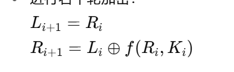

- 解密使用同一结构，只需逆序密钥。

- 最后一轮是否 swap 是常考细节。

- > Feistel 网络结构（**Feistel Network**）是对称加密算法中一种非常重要的设计框架，它广泛用于构建安全且可逆（即可加密也可解密）的加密算法。最著名的例子是 **DES（数据加密标准）** 就是基于 Feistel 结构设计的。
  >
  > ------
  >
  > ## 🔐 Feistel 网络的核心思想
  >
  > ### 🧱 **结构图简化**（每轮的基本结构）
  >
  > 假设输入为两个部分：`L0`（左半部分） 和 `R0`（右半部分）：
  >
  > 每一轮的操作：
  >
  > ```
  > Li+1 = Ri  
  > Ri+1 = Li ⊕ F(Ri, Ki)
  > ```
  >
  > 其中：
  >
  > - `F` 是轮函数（round function）：可以是任何非线性、不可逆的函数。
  > - `Ki` 是第 i 轮使用的子密钥。
  > - ⊕ 表示 **异或运算（XOR）**
  >
  > ------
  >
  > ## 🔁 加密流程示意（N轮）
  >
  > 1. 将明文分为左右两部分：`L0`, `R0`
  > 2. 对每一轮（例如 16 轮）重复以下操作：
  >    - `Li+1 = Ri`
  >    - `Ri+1 = Li ⊕ F(Ri, Ki)`
  > 3. 最后可以选择**是否交换 L 和 R**
  >
  > ------
  >
  > ## 🔁 解密过程 **用相同结构实现！**
  >
  > 这是 Feistel 网络的一大优点：
  >
  > - 解密只需用 **相同的轮函数 F**
  > - 唯一的不同是：**子密钥 Ki 使用逆序**
  >
  > ------
  >
  > ## ✅ 特点总结
  >
  > | 特性              | 描述                                               |
  > | ----------------- | -------------------------------------------------- |
  > | **结构对称**      | 加密与解密结构相同，代码易实现                     |
  > | **不要求 F 可逆** | 即使 F 本身不是可逆函数，也能构造出可逆的整体加密  |
  > | **可扩展性强**    | 可以设计任意轮数，调整安全性                       |
  > | **广泛应用**      | DES, Blowfish, TEA, etc. 都是基于 Feistel 结构设计 |
  >
  > ------
  >
  > ## 📘 举个例子：一轮 Feistel 加密
  >
  > 假设：
  >
  > - `L0 = 1010`，`R0 = 1100`
  > - 密钥：`K1 = 1111`
  > - F 函数就是简单地异或：`F(Ri, Ki) = Ri ⊕ Ki`
  >
  > 运算：
  >
  > - `L1 = R0 = 1100`
  > - `R1 = L0 ⊕ F(R0, K1) = 1010 ⊕ (1100 ⊕ 1111) = 1010 ⊕ 0011 = 1001`
  >
  > 所以结果是：
  >
  > - `L1 = 1100`, `R1 = 1001`
  >
  > ------
  >
  > ## 🎯 在考试中怎么被问？
  >
  > 常见题型包括：
  >
  > 1. **解释 Feistel 结构如何工作**
  > 2. **推导某一轮的加密过程**
  > 3. **为什么它可以使用同样的结构来解密？**
  > 4. **对比 DES 的最后一轮是否交换**
  >
  > 


### 2. **DES & 3DES（Data Encryption Standard）**

- DES 密钥：56-bit。
- 3DES 攻击方式：**Meet-in-the-middle attack**。
  
- 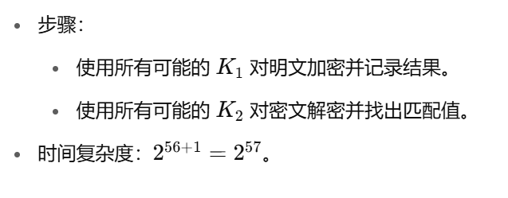
  
- 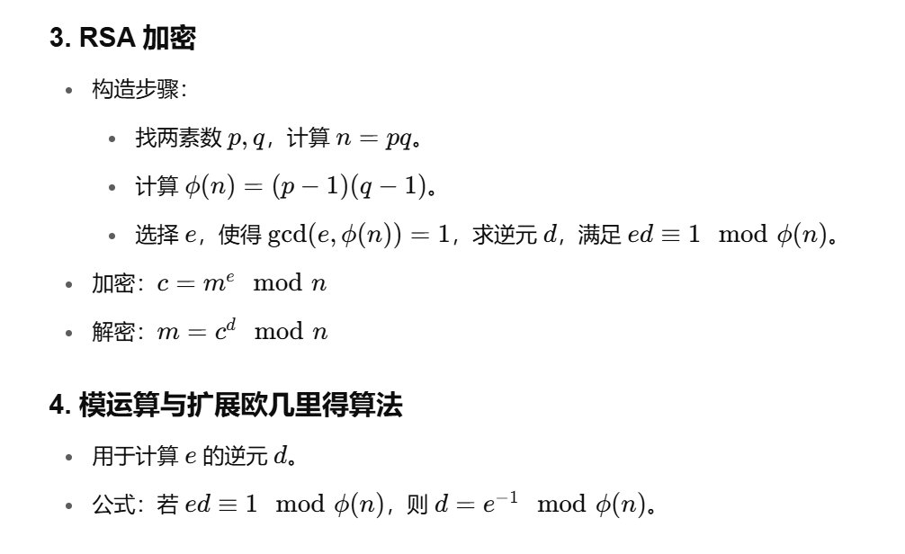

- > RSA 加密是一种**非对称加密算法**，由 Ron **Rivest**, Adi **Shamir**, 和 Leonard **Adleman** 于 1977 年提出，它的名字就是三位创始人名字首字母的缩写。
  >
  > RSA 是现代密码学的基石之一，广泛用于：
  >
  > - 网络通信加密（HTTPS）
  > - 数字签名
  > - 电子投票系统
  > - 区块链钱包地址生成
  >
  > ------
  >
  > ## 🔐 一句话解释：
  >
  > > **RSA 使用一对密钥（公钥 + 私钥）来实现加密和解密**：
  > >
  > > - 公钥（公开给所有人）用来加密
  > > - 私钥（只有自己知道）用来解密
  >
  > ------
  >
  > 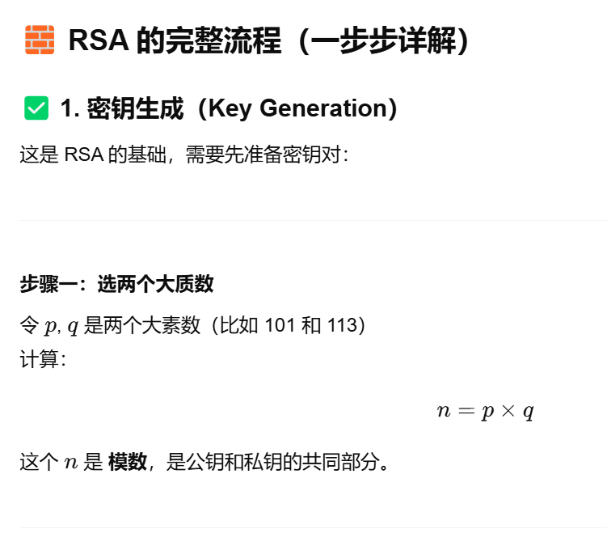
  >
  > ------
  >
  > 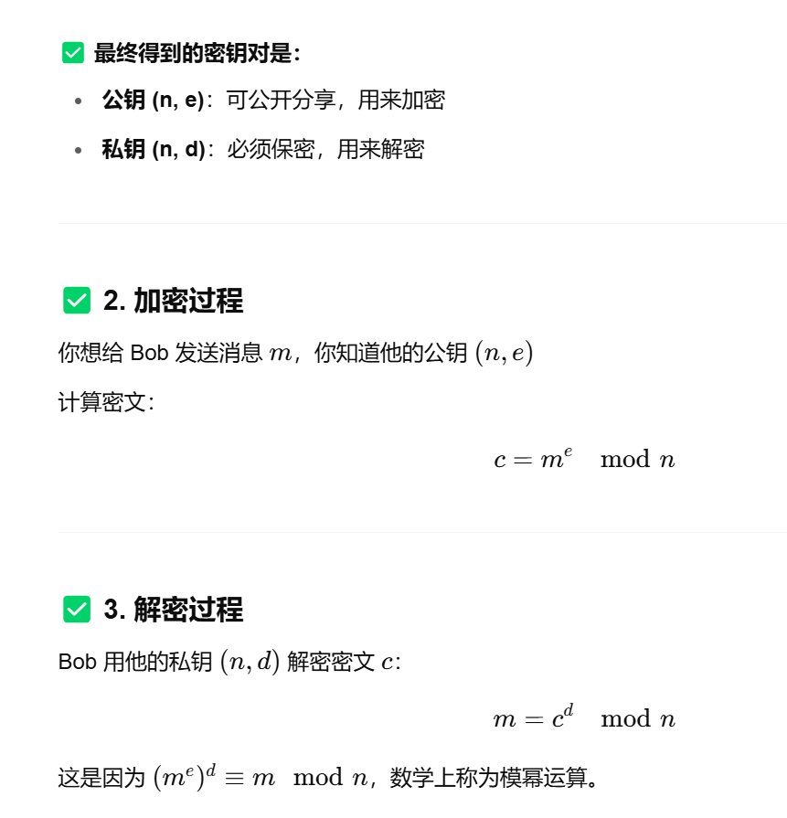
  >
  > ------
  >
  > 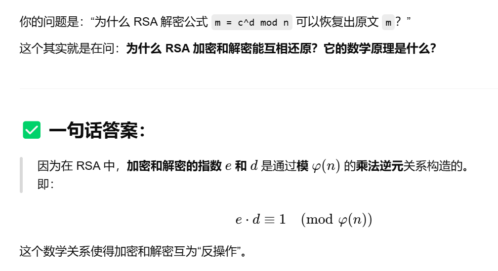
  >
  > 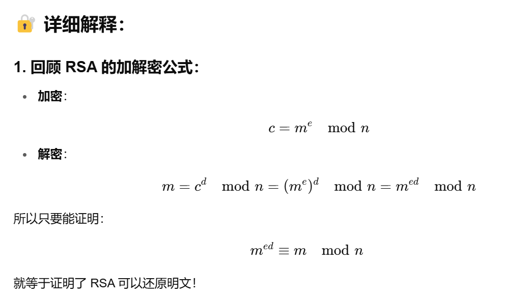
  >
  > 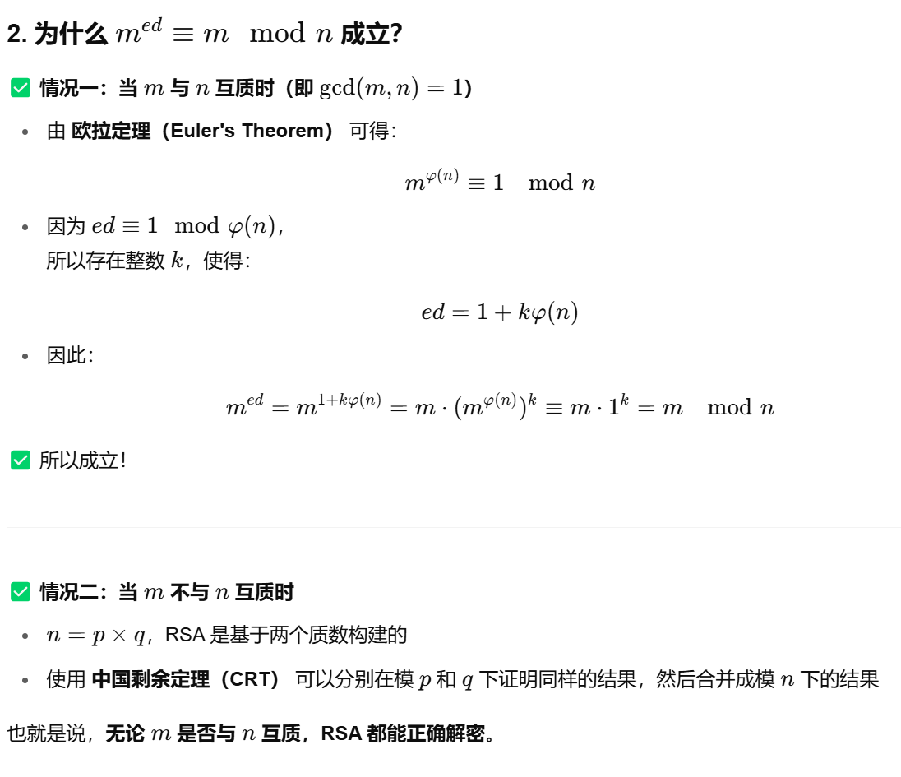
  >
  > 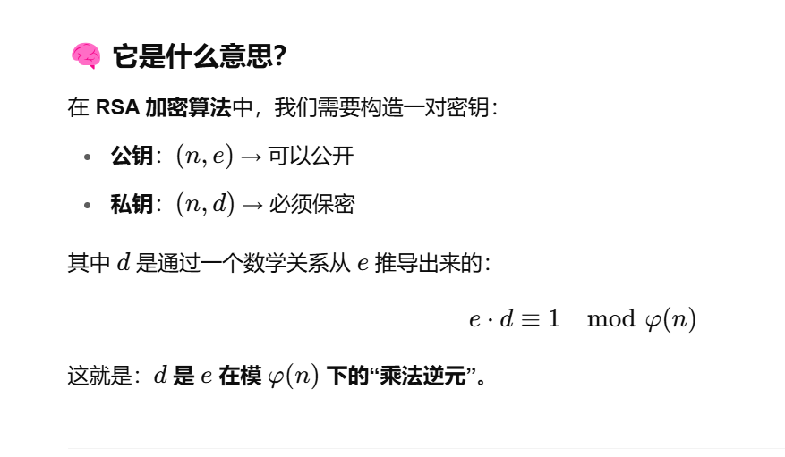
  >
  > 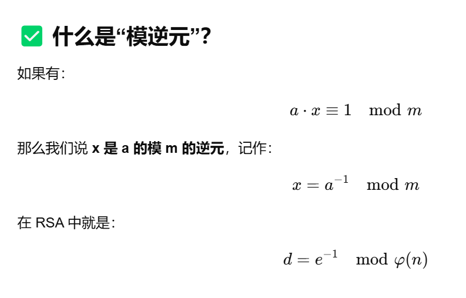
  >
  > 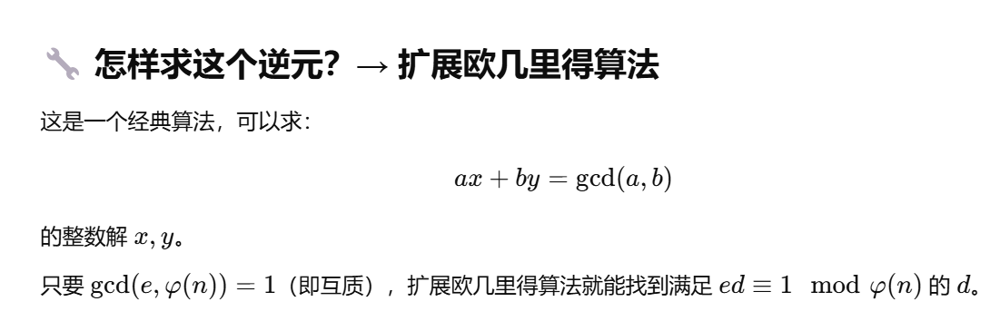
  >
  > ## 🎯 举个 RSA 的小例子（演示）
  >
  > 1. 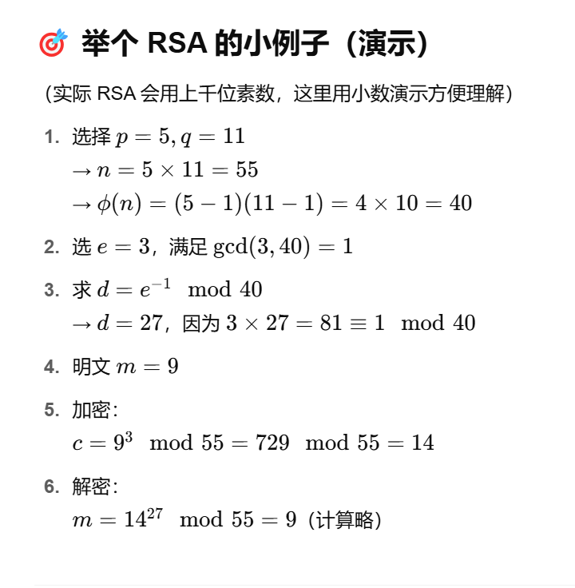
  >
  > ------
  >
  > ## ✅ 安全性来源
  >
  > RSA 的安全性基于：
  >
  > > **大整数因式分解问题（即已知 n，无法高效求出 p 和 q）**
  >
  > 目前尚无高效算法能破解大位数（如 2048 位）RSA。
  >
  > ------
  >
  > ## ⚠️ 注意事项（考试可能考）
  >
  > | 问题                              | 解答                                       |
  > | --------------------------------- | ------------------------------------------ |
  > | 为什么 RSA 不直接用于加密大文件？ | 慢、效率低，通常用来加对称密钥（混合加密） |
  > | 如何防止 RSA 被语义攻击？         | 使用 **填充方案**（如 OAEP）               |
  > | 公钥和私钥谁加密谁解密？          | 公钥加密，私钥解密；**数字签名**则反过来   |
  >
  > 

### 5. **语义安全性（Semantic Security）**

- 定义：即使攻击者知道密文，也无法推测出明文的任何信息。
- 示例：简单的 textbook RSA **不是语义安全的**，因为明文之间有可被检测的规律。
- 对策：需要加入随机填充（如OAEP padding）来增加语义安全性。

------

## 📖 **三、答题技巧**

- 多使用符号推导，例如 Feistel 网络里的 Li+1,Ri+1L_{i+1}, R_{i+1} 推导过程。
- 遇到算法题，如 RSA 密钥生成，重点写出过程步骤和公式即可。
- 如果题目问“为什么”，尽量用逻辑解释，不要死记硬背。

------

## 🧠 **四、重点复习建议**

| 模块                      | 优先级 | 原因               |
| ------------------------- | ------ | ------------------ |
| Feistel 结构              | ⭐⭐⭐⭐   | 出现频繁、细节多   |
| DES & 3DES                | ⭐⭐⭐⭐   | 理论 + 攻击方法    |
| RSA 算法                  | ⭐⭐⭐⭐   | 常考计算与语义问题 |
| 模逆元 / 扩展欧几里得算法 | ⭐⭐⭐    | 核心计算步骤       |
| Semantic Security         | ⭐⭐⭐    | 可作问答题考查     |

------

如果你需要我帮你制作：

- ✅ **思维导图**
- ✅ **知识点清单**
- ✅ **模拟试题 & 答案解析**

可以直接告诉我！我可以帮你快速搞定这些复习材料。需要吗？


