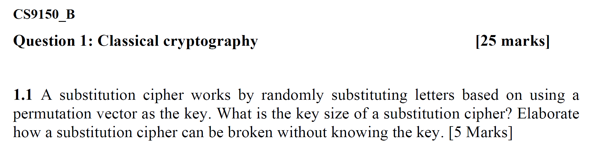

这是CS9150课程的一道期末题目，属于“Classical cryptography（经典密码学）”部分，下面是对题目的逐句翻译、解释、以及答题思路分析：

------

### 📘 **题目原文翻译**

> **1.1** A substitution cipher works by randomly substituting letters based on using a permutation vector as the key.
>  替换密码（Substitution cipher）通过使用一个**排列向量（permutation vector）**作为密钥，随机替换字母来加密信息。

> What is the key size of a substitution cipher?
>  替换密码的密钥空间大小是多少？

> Elaborate how a substitution cipher can be broken without knowing the key.
>  请详细说明在不知道密钥的情况下，替换密码是如何被破解的。

> **[5 Marks]**

------

## ✅ **解题要点整理**

这是一个**5分题目**，考察两个核心内容：

------

### ✳️ 第一问：What is the key size of a substitution cipher?

#### ✔️ 答案逻辑：

- 替换密码对26个字母进行重新排列。

- 所有可能的排列数是：

  26!（26的阶乘）26! \quad（26的阶乘）

- 这是**密钥空间（key space）**的大小，意味着密钥的数量是：

  26!≈4×102626! ≈ 4 \times 10^{26}

  非常大，无法通过**穷举**暴力破解。

#### 📝 可写参考句式：

> The key size of a substitution cipher is **26!** (factorial of 26), because each letter in the alphabet is mapped to a unique other letter, and there are 26! possible permutations of the 26 letters.

------

### ✳️ 第二问：How can a substitution cipher be broken without knowing the key?

#### ✔️ 解法关键：

使用**频率分析法（Frequency Analysis）**：

- 英文中不同字母出现频率不同，比如：
  - E, T, A, O 是最常见的；
  - Q, Z, X 是最少见的。
- 如果有足够长的密文，可以统计其中每个字母出现的频率，与英语常见频率分布做匹配，从而**推测替换关系**。
- 此方法是对“单表替换密码（monoalphabetic substitution cipher）”特别有效。

#### 📝 可写参考句式：

> A substitution cipher can be broken using **frequency analysis**. In English, letters such as **E, T, and A** appear more frequently. By comparing the frequency distribution of letters in the ciphertext with typical English letter frequencies, an attacker can deduce probable mappings between cipher letters and plaintext letters.

------

## 🧠 **完整参考答案（可直接背诵）**

> The key size of a substitution cipher is **26!**, which is the number of all possible permutations of the 26 letters in the English alphabet.
>
> Despite the large key space, a substitution cipher can be broken using **frequency analysis**. This technique involves analyzing the frequency of letters in the ciphertext and comparing it with known letter frequencies in English. For example, if a letter appears most frequently in the ciphertext, it might correspond to 'E', the most common letter in English. With enough ciphertext, an attacker can reconstruct the substitution pattern and recover the plaintext without knowing the key.

------

如果你还不熟悉频率表或者想练练这类题目，我可以提供一个练习工具或小练习。需要吗？

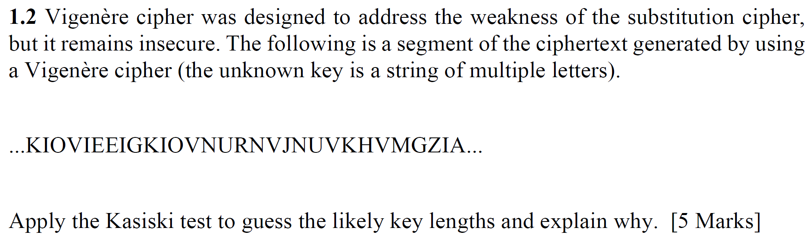

这是一个关于 **Vigenère cipher** 的考试题，要求你使用 **Kasiski 检验法（Kasiski Test）** 来猜测密钥长度，并说明理由。

------

## ✅ 题目简析

你被给出一段用 **Vigenère 密码** 加密的密文：

```
KIOVIEEIGKIOVNURNVJNUVKHVMGZIA...
```

目标：**利用 Kasiski 检验法 猜测密钥长度**。

------

## ✅ Kasiski Test 是什么？

Kasiski Test 是一种破解 Vigenère 密码的方法，基本思路是：

> 找出密文中重复的字符串（通常是3个或更多字母的重复片段），记录它们之间的**间距**（即它们出现位置的距离），然后计算这些间距的 **最大公因数（GCD）**，从而猜测密钥长度。

------

## ✅ 步骤详解（根据题目给的密文）：

原文片段：

```
KIOVIEEIGKIOVNURNVJNUVKHVMGZIA...
```

### **Step 1: 找重复字符串**

观察密文：我们看到 `KIO` 出现了两次：

- 第一次出现的位置：索引 0
- 第二次出现的位置：索引 9

🔢 距离（间隔）= 9 - 0 = **9**

### **Step 2: 看其他重复**

再看 `UV` 也重复了：

- `UV` 出现在索引 20 和 24
- 间距 = 24 - 20 = **4**

但这种重复很短，Kasiski 更偏好 3 字母以上重复。

再看 `VIE` 和 `JNU` 出现频次较低，忽略。

所以我们只用可靠的 **"KIO" -> 间距 9**。

------

### **Step 3: 推测密钥长度**

Kasiski 检验的核心是：**重复串的间距 = 密钥长度的倍数**

因为加密是周期性的，密钥每隔 N 个字符重复一次。

所以：
 ➡️ 密钥长度是 **9 的因数**
 即可能的 key length 是：

```
{1, 3, **9**}
```

------

## ✅ 答案格式参考（适合考试答题）

### ✅ Sample Answer (5 Marks)

**Step 1**: I observed that the 3-letter sequence `KIO` appears twice in the ciphertext. The first occurrence starts at position 0, and the second at position 9.

**Step 2**: The distance between the repeated sequences is 9 characters.

**Step 3**: According to the Kasiski test, the key length is likely a factor of this distance. The factors of 9 are 1, 3, and 9.

**Step 4**: Therefore, the likely key lengths are **1, 3, or 9**, with **3 or 9** being the more probable since a key length of 1 would make it a Caesar cipher.

**Conclusion**: The most likely key lengths are **3 or 9**, based on repeated segments and their spacing (Kasiski method).

------

## 🧠 附加提示（如果问你进一步验证）

你可以用 **Index of Coincidence (IC)** 或 **频率分析** 对不同 key 长度分段尝试破译。

------

如果你想要我带你手动解出这个密文、还原出 key 或明文，我也可以继续带你做，继续吗？

### ✅ 所在 PPT：

📄 **第 3 个 PPT**：

> **文件名**：`3 crypto_-_classical.pdf`

## 26页

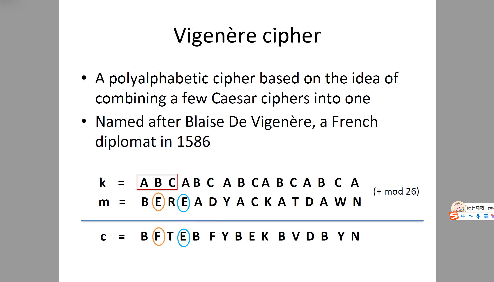

这张图详细解释了 **Vigenère cipher（维吉尼亚密码）** 是如何工作的，我们一起来逐行拆解：

------

## ✅ 1. 什么是 Vigenère cipher？

> 一种 **多表代换加密（polyalphabetic substitution cipher）**，通过使用多个不同的 Caesar 密码循环叠加实现更强的加密效果。

------

## ✅ 2. 图中变量解释：

| 符号 | 含义                              |
| ---- | --------------------------------- |
| `k`  | 密钥（Key）重复扩展以匹配明文长度 |
| `m`  | 明文（Message）要加密的原始内容   |
| `c`  | 密文（Ciphertext）加密后的结果    |

------

## ✅ 3. 加密方式（图中公式）：

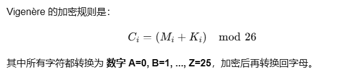

------

## ✅ 4. 图解说明

### 原始内容（按字母对齐）：

| 位置          | 1    | 2    | 3    | 4    | 5    | 6    | ...      |
| ------------- | ---- | ---- | ---- | ---- | ---- | ---- | -------- |
| **k**（密钥） | A    | B    | C    | A    | B    | C    | 重复循环 |
| **m**（明文） | B    | E    | R    | E    | A    | D    | ...      |
| **c**（密文） | B    | F    | T    | E    | F    | Y    | ...      |

------

## ✅ 示例：手算前三组加密过程

### 第1个字母：

- 明文 `B` → 数字 1
- 密钥 `A` → 数字 0
- 加密后 = (1 + 0) mod 26 = 1 → 密文 `B`

### 第2个字母：

- 明文 `E` → 4
- 密钥 `B` → 1
- 加密后 = (4 + 1) mod 26 = 5 → 密文 `F`

### 第3个字母：

- 明文 `R` → 17
- 密钥 `C` → 2
- 加密后 = (17 + 2) mod 26 = 19 → 密文 `T`

如此类推。

------

## ✅ 加密流程总结：

1. 将密钥循环使用（对齐明文长度）
2. 把字符转换为数字（A=0, B=1,...）
3. 每一对字母加和取模 26
4. 把结果转换回字母 → 得到密文

------

## ✅ 为什么 Vigenère 比 Caesar 更强？

- Caesar 只用一个固定偏移（单字母密钥），容易被频率分析破解
- Vigenère 使用多个字母密钥，对同一个字母加密结果不同 → **打破字母频率规律**
- 但仍可被 **Kasiski Test** 和 **Friedman Test** 破解

------

如果你希望我演示一组自己加密一段内容，或者帮你做反向解密（暴力还原 key），可以继续问我 😎

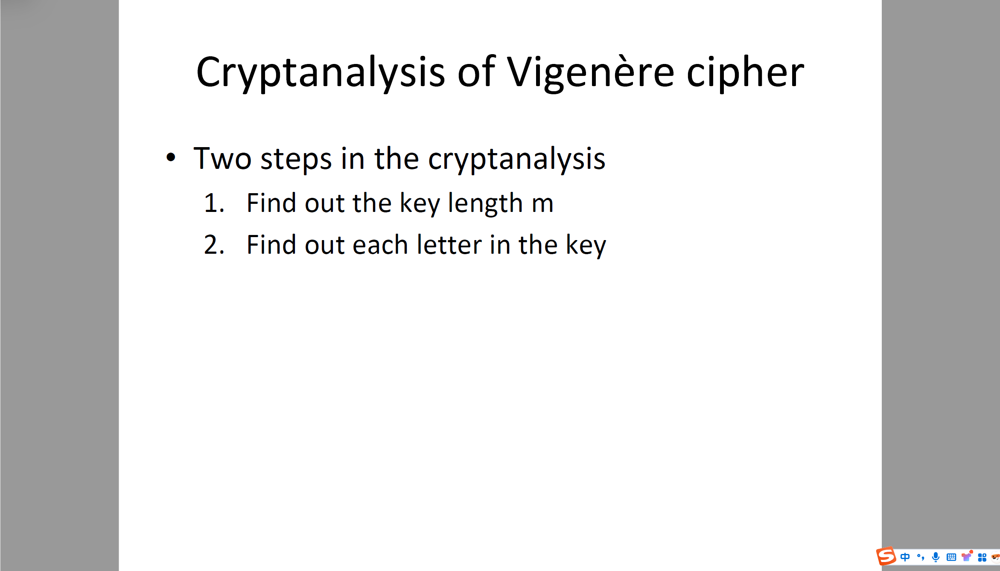

这张幻灯片是对 **Vigenère cipher 的破解（cryptanalysis）方法** 的总结，指出了两大核心步骤：

------

## 🔍 标题：Cryptanalysis of Vigenère Cipher

（**维吉尼亚密码的密码分析**）

### 👉 Cryptanalysis = 破解密码，不知道密钥的情况下还原明文。

------

## ✅ 两个主要步骤详解：

### ### 1️⃣ Find out the key length `m`

**找出密钥的长度（key length）**

这是破解 Vigenère 密码的**第一步**，如果你能确定密钥是几个字母的，那么你就可以把整个密文**分成 m 个 Caesar 密文来单独破解**。

#### ✨ 方法包括：

- **Kasiski Test**（重复子串 + 距离 → 公因数）✔️
- **Friedman Test**（统计字母重合度，Index of Coincidence）📊

举例：如果你发现密文中出现 `KIO...KIO`，间隔为 9，则可能密钥长度是 3 或 9。

------

### ### 2️⃣ Find out each letter in the key

**找出密钥的每一个字母**

确定密钥长度 `m` 后，就可以将密文分为 m 组，每组都是用同一个 Caesar 加密：

- 比如 key 长度是 3，就把密文分为第 1、4、7、10... 为第 1 组
- 然后对每组做**频率分析**，破解出该组用的 Caesar 密钥（即 key 中的某一位）

#### ✨ 技术手段：

- 英文中 `E` 出现频率最高 → 推测出 Caesar 偏移
- 多组组合起来，还原出整个 key，比如 `B E C O D E`

------

## ✅ 小结（适合答题时写）

维吉尼亚密码破解的基本思路是两步：

1. **确定密钥长度**：利用 Kasiski 或 Friedman 检验，通过统计分析或重复子串推测 key 长度。
2. **确定每个密钥字母**：将密文分组，每组视为一个 Caesar 密码，用频率分析等方法逐个破译出 key。

------

如果你愿意，我可以教你如何手动从一个实际例子里推测 key，比如用 Python 帮你模拟这两个过程，要试试吗？

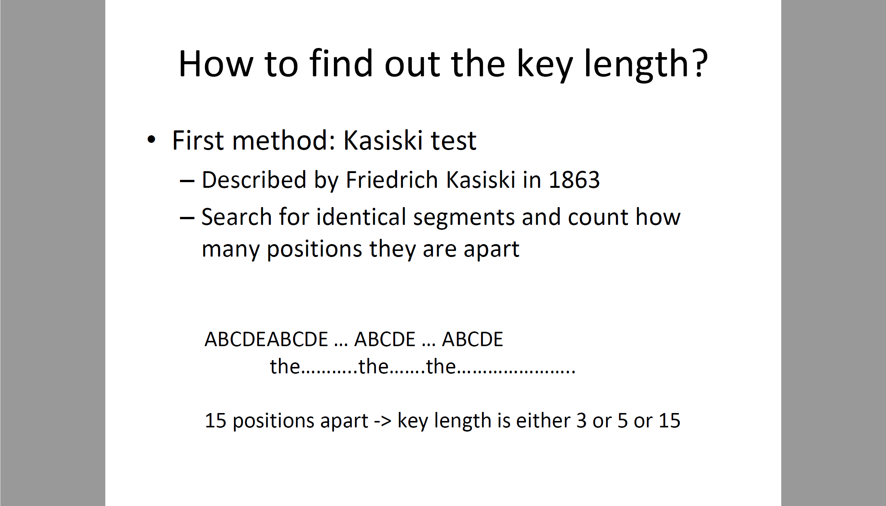

这张幻灯片讲的是：

# ✅ 如何找出 Vigenère 密码的密钥长度？

**使用的方法是：Kasiski 检验法（Kasiski Test）**

------

## 🧠 背景知识：

Vigenère 密码的破解，第一步是**找出密钥长度 `m`**。
 Kasiski 检验是一种历史悠久的方法，发明于 1863 年。

------

## ✅ 幻灯片内容逐条解释：

### 🔸 标题：How to find out the key length?

➡️ **如何找出密钥长度？**

------

### 🔹 First method: **Kasiski Test**

- **发明者**：Friedrich Kasiski
- **核心思想**：找出密文中**重复的字符串片段**，比如相同的三连字母（如 `ABC` 出现多次），并计算它们之间的**距离（位置间隔）**

------

### 🔹 举例说明：

密文片段示例（人为简化的例子）：

```
ABCDEABCDE...ABCDE...ABCDE
     ^          ^         ^  
```

假设 `ABCDE` 这个重复字符串出现了几次，它们之间的**间距**是 15 个字符。

------

### 🔹 关键推理：

**出现间距是 15** → 推测密钥长度是 15 的因子：

可能的 key 长度=因数(15)=1,3,5,15\text{可能的 key 长度} = \text{因数(15)} = 1, 3, 5, 15

通常会排除掉太小的（如 1），所以最有可能的 key 长度是 **3 或 5**。

> 因为 Vigenère 密码是按密钥长度 **周期性** 加密的，
>  如果两个明文片段间隔正好是密钥的整数倍，它们就会被 **同一密钥片段加密**，
>  所以它们加密后会得到 **相同的密文片段**，从而出现在密文中重复。

------

## ✅ 结论总结：

Kasiski 方法步骤如下：

1. **找到密文中重复的子串（≥3 个字母）**
2. **记录这些子串之间的间距**
3. **对多个间距取最大公因数（GCD）**
4. **所有 GCD 的因子都是可能的 key 长度**

------

## ✅ 应用示例参考你前面的题目：

比如你看到 `KIO` 在密文中重复出现两次，间距是 9 →
 可能的 key 长度 = 因数(9) = **1, 3, 9**

------

如你想，我可以带你完整做一个 Kasiski 破解例题（含找子串 + GCD 推导），是否继续？

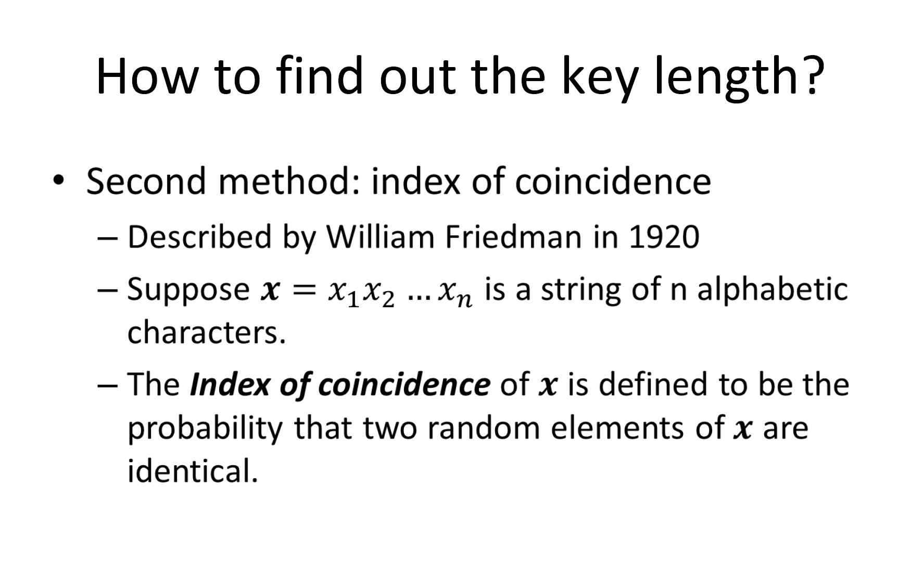

这张幻灯片讲的是破解 Vigenère 密码的第二种方法：

# ✅ **Friedman Test**（基于 Index of Coincidence）

------

## 🔍 标题：How to find out the key length?

### 第二种方法：Index of Coincidence（重合指数）

------

## ✅ 幻灯片内容逐行解释：

### 🔹 **Second method: index of coincidence**

➡️ 第二种方法叫做 **重合指数（Index of Coincidence，简称 IC）**

------

### 🔸 Described by William Friedman in 1920

➡️ 这个方法是密码学家 William Friedman 在 1920 年提出的。
 他也是现代密码分析（cryptanalysis）的先驱之一。

------

### 🔸 Suppose x = x₁x₂...xₙ is a string of n alphabetic characters.

➡️ 假设你有一个由 n 个英文字母组成的字符串 `x`，也就是你的密文。

------

### 🔸 The Index of Coincidence of x is defined to be the probability that two random elements of x are identical.

➡️ **重合指数 IC**：
 是从字符串中**随机抽两个字母**，这两个字母是**一样的**的概率。

------

## ✅ 这个值有什么用？为什么能用来猜 key 长度？

| 场景               | IC 值大小（大致） | 说明                                                       |
| ------------------ | ----------------- | ---------------------------------------------------------- |
| **英语自然文本**   | ≈ 0.065           | 频率分布不均（E 最常见等）                                 |
| **完全随机字符串** | ≈ 0.038           | 所有字母等概率                                             |
| **Vigenère 密文**  | 介于两者之间      | 如果猜对 key 长度，就能还原每一组为 Caesar 密码，IC 会变大 |

------

## ✅ 用法总结：

1. **尝试不同的 key length（m）**
2. 将密文分成 m 个组（每组隔 m 个字母）
3. 分别计算每组的 IC 值
4. 如果某个 m 的平均 IC 接近 0.065 → 说明这个 m 很可能是 key 的长度！

------

## ✅ 举个例子说明：

假设密文为：

```
CIPHERTEXTENCRYPTEDWITHVIGENERE
```

你试 key length = 3，把密文分成：

- 组1：第1、第4、第7… （→ Caesar 1）
- 组2：第2、第5、第8… （→ Caesar 2）
- 组3：第3、第6、第9… （→ Caesar 3）

然后分别计算 IC：

- 如果这些组的 IC 都接近英文自然 IC（~0.065），说明你猜的 key length 是对的！

------

## ✅ 小结：

**Index of Coincidence 是用于猜 key 长度的统计工具**，它通过概率分析判断一个字符串是否像“自然语言”。
 当你用正确的 key 长度分组，组内看起来就像英文，这时 IC 就会接近 0.065。

------

如果你想，我可以现场用 Python 给你算一个密文的 IC 值、图示出不同 key length 的可能性图（frequency analysis），是否继续？

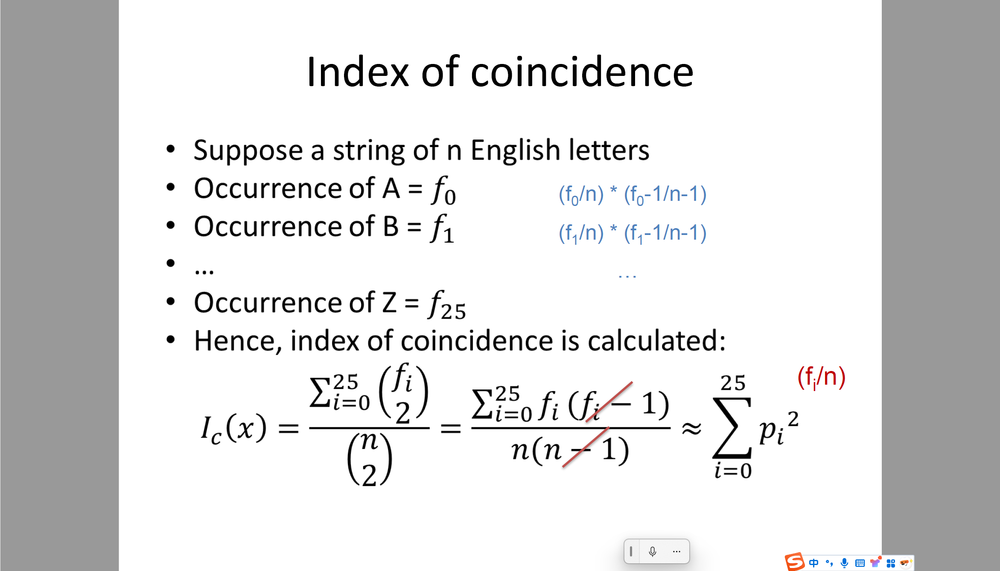

这张幻灯片详细讲解了如何计算 **Index of Coincidence（IC，重合指数）**，是密码分析中非常关键的数学工具。下面我们逐行来解释：

------

## 📌 标题：**Index of Coincidence**

------

## ✅ 概念说明：

### 🔹 **Suppose a string of n English letters**

假设你有一个长度为 `n` 的英文字符串 `x`（比如密文）

------

### 🔹 **Occurrence of A = f₀**

表示字母 **A** 在这个字符串中出现了 `f₀` 次

### 🔹 **Occurrence of B = f₁**

表示字母 **B** 出现了 `f₁` 次

...

### 🔹 **Occurrence of Z = f₂₅**

表示字母 **Z** 出现了 `f₂₅` 次

------

## ✅ 什么是 Index of Coincidence？

> 是在字符串中**随机选两个字符，它们是一样的概率**。

------

- 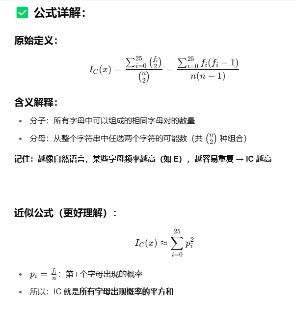

------

## ✅ 常见的 IC 值：

| 字符串类型    | 典型 IC 值   | 说明                             |
| ------------- | ------------ | -------------------------------- |
| 英文正常句子  | ~0.065       | 出现频率不平均，E/T/A 多         |
| 随机字符串    | ~0.038       | 字母分布均匀                     |
| Vigenère 密文 | 介于两者之间 | 越长密钥越随机，越短密钥越偏英文 |

------

## 🧠 用途回顾：

如果你尝试用不同 key length 去切分 Vigenère 密文：

- 如果用对了 key 长度，每组子串就是 Caesar 密文，接近英文 → **IC ≈ 0.065**
- 如果猜错，组内字母分布偏随机 → **IC ≈ 0.038**

------

## ✅ 总结：

1. IC 衡量的是字符串中字母的集中程度
2. 用于识别 **Vigenère 密文的 key 长度**
3. 计算方法就是：看每个字母出现次数，计算重复概率

------

如果你想，我可以用一段真实密文，带你手动算一次 IC 或画出不同 key length 下的 IC 曲线图，帮你更直观理解。要试试看吗？

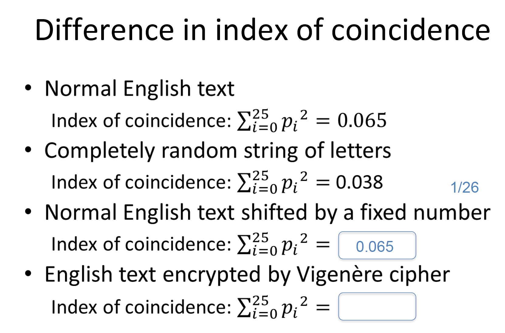

这张幻灯片是在总结 **不同类型文本的 Index of Coincidence（IC） 的差异**，用来解释 **为什么可以通过 IC 判断密钥长度**，是 Friedman 分析法的核心依据。

------

## ✅ 标题：Difference in index of coincidence

**各种字符串的 IC 值对比**

------

## 🧠 背景回顾：

IC 是指：**从字符串中随机抽两个字母，这两个字母一样的概率**

------

下面我们解释四种类型的文本和它们的 IC 值：

------

### 🔹 1. **Normal English text（正常英文）**

- 字母出现频率差别很大（E/T/A 很多，Q/Z 很少）
- 所以有更高的“重复字母”概率
- **IC ≈ 0.065**

------

### 🔹 2. **Completely random string of letters（完全随机）**

- 每个字母都是平均出现，像密码随机生成一样
- 所以重复概率更低
- **IC ≈ 0.038**

------

### 🔹 3. **Normal English text shifted by a fixed number（凯撒密码）**

- 这就是 **Caesar cipher** 加密后的结果（每个字母偏移固定数）
- 字母频率分布完全没有改变，只是被“换了名字”
- 所以和原文一样，IC 不变
- **IC ≈ 0.065**

------

### 🔹 4. **English text encrypted by Vigenère cipher**

- Vigenère 是多个 Caesar 密码轮流使用（poly-alphabetic）
- 随着密钥长度变大，分布逐渐变得更平均，更随机
- 所以：**IC 介于 0.038 ~ 0.065 之间**

**IC 值范围判断如下：**

| Key Length | 密文越像英文 → IC 越高                |
| ---------- | ------------------------------------- |
| Key 短     | 字母规律性强 → **IC ↑**（接近 0.065） |
| Key 长     | 字母接近随机 → **IC ↓**（接近 0.038） |

------

## ✅ 用法总结：

通过计算密文的 IC：

- 如果 IC 接近 **0.065** → 很可能是英文或 Caesar 密文
- 如果 IC 接近 **0.038** → 很可能是随机或 Vigenère 密钥很长
- 如果你用某个 key length 把密文分组，每组 IC 都 ≈ 0.065
   → **猜对了 key length！**

------

## ✅ 填空答案（最后一项）：

> **English text encrypted by Vigenère cipher**
>  IC ≈ **0.038 ~ 0.065**
>  （一般在 0.045 ~ 0.055 之间）

------

需要我举例演示用 IC 猜 key length 的 Python 脚本吗？或者你想练习一道例题？

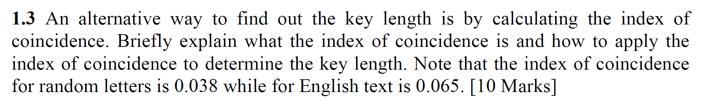

这是一道典型的关于 **Index of Coincidence (IC)** 的简答题，考查你对其**定义和应用方法的理解**。

------

## ✅ 中文翻译 + 题意说明：

**题目内容：**

> 1.3 另一种猜测密钥长度的方法是通过计算重合指数（Index of Coincidence）。请简要说明：
>
> 1. 什么是 IC；
> 2. 如何通过 IC 来判断密钥长度。
>
> 提示：随机字母的 IC ≈ 0.038，英语文本的 IC ≈ 0.065。
>  【10分】

------

## ✅ 解题结构（写作建议，逻辑清晰可拿满分）：

------

### **第一部分：解释什么是 Index of Coincidence**（4 分）

> The Index of Coincidence (IC) is a statistical measure that estimates the probability that two randomly selected letters from a string are identical.
>
> It is calculated using the formula:

IC = \frac{\sum_{i=0}^{25} f_i(f_i - 1)}{n(n - 1)}
 ]

> where fif_i is the number of times letter ii appears and nn is the total number of letters.

➡️ 中文：重合指数是指从一个字符串中随机抽两个字符，它们是**相同字母**的概率。
 ➡️ 如果字母频率不均匀（如英文文本），IC 值就会偏大。

------

### **第二部分：如何利用 IC 猜密钥长度**（6 分）

> To determine the key length in a Vigenère cipher using IC:
>
> 1. Guess a potential key length mm.
> 2. Divide the ciphertext into mm groups, each containing every mm-th letter.
> 3. Compute the IC of each group.
> 4. If the average IC is close to **0.065**, then this mm is likely the correct key length.
> 5. If the IC is close to **0.038**, it likely indicates random distribution — try another key length.

➡️ 中文思路总结：

1. 假设密钥长度为 m
2. 把密文每 m 个一组分成 m 个子序列
3. 每个子序列都像是一个 Caesar 密码（固定偏移）
4. 分别计算这 m 个序列的 IC，求平均
5. 如果平均值接近 0.065 → 猜对了 key 长度
    如果接近 0.038 → key 长度猜错了，要换别的

------

## ✅ 样板答案（英文写法建议）：

> The Index of Coincidence (IC) measures the likelihood that two randomly selected letters from a text are the same. In English text, where letter frequencies vary (e.g., E is most common), the IC is about 0.065. In completely random text, the IC is about 0.038.
>
> To determine the key length of a Vigenère cipher using IC, one assumes a possible key length mm, then divides the ciphertext into mm groups, each taking every mm-th character. The IC of each group is calculated. If the average IC is close to 0.065, it indicates each group resembles English text encrypted by Caesar cipher, and the key length is likely correct. Otherwise, try another value of mm.

------

如你需要，我也可以：

- 帮你直接写一份中文版本
- 帮你写成 Markdown/Word 结构
- 或者用 Python 工具演示一个 IC 实际计算过程

需要的话请告诉我 😄

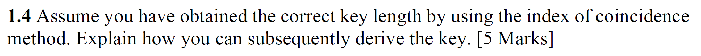

这是一个关于 **Vigenère 密码破译**中第二阶段的问题：
 **你已经知道了密钥长度，下一步如何推导出密钥本身？**

------

## ✅ 中文翻译：

**1.4** 假设你已经通过 index of coincidence 方法正确找到了密钥长度。
 请解释你接下来如何推导出密钥。
 【5 分】

------

## ✅ 回答结构（适合考试写作）：

------

### 🌟 前提：你知道密钥长度是 m

那么可以把密文分成 m 个子序列，每个子序列都是一个**Caesar 密码（凯撒密码）**加密的。

------

### ✅ 解题步骤（英文 + 中文解释）：

> 1. Divide the ciphertext into mm separate groups, each containing letters encrypted with the same Caesar shift.
>     ➤ 将密文按密钥长度 mm 分成 m 个组，例如每第 ii 个字母归为第 ii 组。

> 1. For each group, perform **frequency analysis** to identify the Caesar shift used.
>     ➤ 对每组分别做**字母频率分析**，找出最常出现的字母（比如 ‘E’ 是英文中最常见的），推测它是由哪个明文字母加密而来。

> 1. Calculate the Caesar shift by comparing the observed most frequent letter with the expected one (typically 'E' in English).
>     ➤ 例如这一组中 'B' 最常见，你可以猜它是 'E' 被加密而来 → Caesar shift 是 23（因为 E→B 是 -3 mod 26）

> 1. This Caesar shift corresponds to the key letter used for that group.
>     ➤ 把每组的 Caesar shift 转换为密钥字母（0→A，1→B，...）

> 1. Repeat this process for all mm groups to get the full key.
>     ➤ 最终你得到了完整的密钥，如 "LEMON"。

------

## ✅ 总结（一句话精炼）：

> By treating each group as a Caesar cipher and using frequency analysis on each, we can recover each letter of the Vigenère key.

------

## ✅ 样板英文答案（考试可用）：

> Once the key length mm is known, the ciphertext is divided into mm groups, each consisting of every mm-th letter. Each group corresponds to a Caesar cipher.
>
> By performing frequency analysis on each group, we estimate the shift by assuming the most frequent letter in each group corresponds to 'E' (the most common English letter).
>
> The shift reveals the key letter for that group. Repeating this for all mm groups gives the complete Vigenère key.

------

需要我帮你做一个频率分析的小例子（比如用 Python 做）吗？可以更直观理解怎么推导密钥。

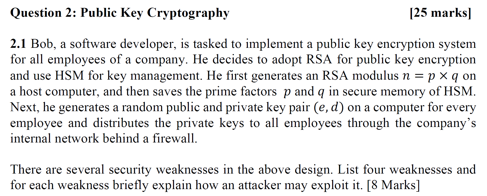

这是一个关于 **公共密钥加密系统设计漏洞分析** 的题目。你需要识别 Bob 设计中 **4 个安全漏洞**，并解释**攻击者如何利用每个漏洞**。题目背景基于 **RSA 加密 和 HSM（硬件安全模块）**。

------

## ✅ 中文翻译：

> Bob 是一名软件工程师，他要为公司员工实现一个公钥加密系统。他使用 RSA 方案，并使用 HSM 做密钥管理。
>
> - 他在主机上生成 RSA 模数 n=p×qn = p \times q，并把素数 p,qp, q 保存在 HSM 中。
> - 然后他为每位员工在一台计算机上生成一对公私钥 (e,d)(e, d)，并通过公司内部网络分发私钥。

你的任务是：
 列出这个设计中的 **4 个安全漏洞**，并简要说明攻击者如何利用这些漏洞。
 【8 分 → 每个漏洞+攻击方式 = 2 分】

------

## ✅ 标准答案（共4点）：

------

### **漏洞 1：RSA密钥生成在不受保护的主机上**

- **问题**：在主机上生成模数 n=p×qn = p \times q，p 和 q 可能在内存中暂时暴露。
- **攻击方式**：攻击者可以通过恶意软件、缓存分析、内存转储等方式提取 p 和 q，进而**完全破解 RSA 私钥**。

------

### **漏洞 2：每个员工的私钥在同一台机器上生成**

- **问题**：集中生成所有员工的密钥意味着**单点失败（single point of failure）**。
- **攻击方式**：如果攻击者控制这台机器，就可以**获取所有员工的私钥**，从而**解密所有通信**。

------

### **漏洞 3：私钥通过公司内网分发**

- **问题**：私钥在网络中传输，即使在内网中也容易受到中间人攻击。
- **攻击方式**：攻击者可以通过 ARP 欺骗、网络嗅探等方式**拦截密钥分发数据包**，盗取私钥。

------

### **漏洞 4：每个员工都有自己的 RSA 密钥对**

- **问题**：这使得**密钥管理成本非常高**，也会增加人为失误和密钥泄露的风险。
- **攻击方式**：攻击者只要攻击一个弱用户（例如密钥备份保存在不安全的地方），就可以**破坏整个系统信任链**。

------

## ✅ 总结模板（考试写作建议）：

| Weakness                                        | Explanation                        | How an attacker can exploit it                   |
| ----------------------------------------------- | ---------------------------------- | ------------------------------------------------ |
| 1. Key generation on insecure host              | p and q are exposed in RAM         | Malware or RAM dump to recover RSA private key   |
| 2. Centralized key generation for all employees | Single point of failure            | Compromise the machine to steal all private keys |
| 3. Private key distributed via internal network | Keys in transit can be intercepted | ARP spoofing or sniffing to steal keys           |
| 4. One RSA key pair per employee                | Too many keys to manage securely   | Attack weakest endpoint to compromise the system |

------

#  **PPT 文件名**: `18 crypto_-_public_key_encryption.pdf` 3页


这页讲的是 **公钥加密（Public Key Encryption）** 的基本原理，下面是详细解释：

------

### 📌 图解含义（配合下方文字）

- 左边是 **Alice（发送者）**，右边是 **Bob（接收者）**
- 加密函数 `E` 和解密函数 `D` 分别用于加密和解密
- `m` 是明文（message），`c` 是密文（ciphertext）
- `pk` 是公钥（public key），`sk` 是私钥（secret/private key）

------

### 🔐 加密流程说明

1. **Bob 生成密钥对**：

   - Bob 生成一对密钥：公钥 `PK` 和私钥 `SK`
   - 公钥 `PK` 是可以公开的，任何人都可以使用
   - 私钥 `SK` 是保密的，仅 Bob 自己拥有

2. **Bob 将公钥发给 Alice**：

   - Alice 收到 `PK` 后，就可以加密她想要发送给 Bob 的消息 `m`

3. **Alice 使用公钥加密消息**：

   - 她用公钥 `PK` 和加密算法 `E`，将消息 `m` 加密成密文 `c`

     ```
     c = E(PK, m)
     ```

4. **Bob 使用私钥解密密文**：

   - Bob 收到密文 `c` 后，使用私钥 `SK` 和解密算法 `D` 将其还原为原始消息 `m`：

     ```
     m = D(SK, c)
     ```

------

### ✅ 总结概念

| 角色  | 拥有的密钥 | 操作     | 结果         |
| ----- | ---------- | -------- | ------------ |
| Alice | 公钥 `PK`  | 加密消息 | 得到密文 `c` |
| Bob   | 私钥 `SK`  | 解密密文 | 得到原文 `m` |

------

### 📍核心思想

- 公钥加密的优势在于**即使攻击者拿到公钥，也无法轻易解密密文**
- **只有持有私钥的接收者 Bob 才能解密**，确保通信安全

需要我解释它和 RSA 的关系，或在考试里如何答这类题吗？

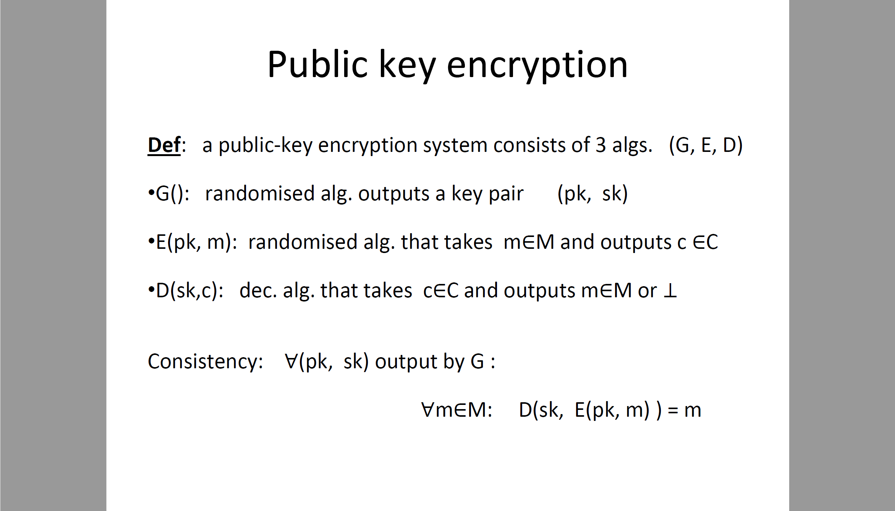

这页是对**公钥加密系统（Public Key Encryption System）**的形式化定义。我们逐行详细解释：

------

### 🔑 定义：一个公钥加密系统由三个算法组成：

#### 1. **G()** — 密钥生成算法（Key Generation）

- 是一个**随机算法（randomised algorithm）**
- 它会输出一对密钥：`(pk, sk)`
  - `pk`: 公钥（public key）
  - `sk`: 私钥（secret/private key）

✅ 这一步通常由接收者（如 Bob）来完成。

------

#### 2. **E(pk, m)** — 加密算法（Encryption）

- 是一个**随机算法**
- 输入：`pk`（公钥），`m`（明文）属于消息空间 `M`
- 输出：`c`（密文）属于密文空间 `C`

✅ 发送者（如 Alice）使用 `pk` 和明文 `m`，生成密文 `c`

------

#### 3. **D(sk, c)** — 解密算法（Decryption）

- 是一个确定性算法（不是随机的）
- 输入：`sk`（私钥），`c`（密文）属于 `C`
- 输出：`m`（明文）属于 `M`，或者 `⊥` 表示“解密失败”或“无效密文”

✅ 接收者（如 Bob）使用 `sk` 和收到的 `c`，恢复原始消息 `m`

------

### ✅ 一致性要求（Consistency）

这一部分是整个定义的核心，确保系统有效可用：

> 对所有通过 `G()` 生成的密钥对 `(pk, sk)`，以及所有可能的明文 `m ∈ M`，都应该有：
>
> ```
> D(sk, E(pk, m)) = m
> ```

也就是说：

- 先用公钥加密，再用私钥解密
- **一定能还原出原始明文 m**

------

### 🧠 总结（通俗理解）

| 步骤 | 作用     | 谁操作          | 用到的键   |
| ---- | -------- | --------------- | ---------- |
| G()  | 生成密钥 | 接收者（Bob）   | `(pk, sk)` |
| E()  | 加密消息 | 发送者（Alice） | 使用 `pk`  |
| D()  | 解密密文 | 接收者（Bob）   | 使用 `sk`  |

一致性是整个加密系统的**正确性保障**。

------

## **公钥不能用来解密**，其**安全性**确实**依赖于数学难题**，比如：

### 👉 在 **RSA 公钥加密** 中，安全性基于：

> **大数因式分解困难性问题（Integer Factorization Problem）**

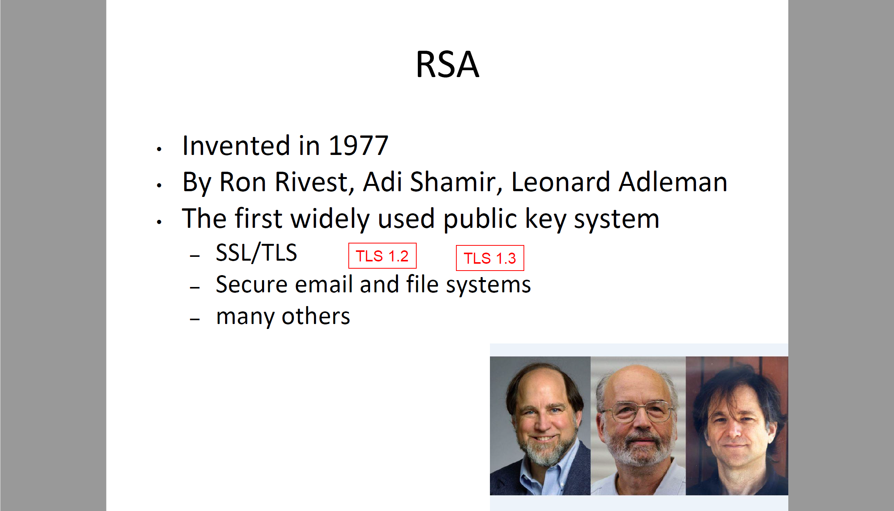

这张幻灯片讲的是 **RSA 公钥加密算法** 的起源与应用。

------

## ✅ 逐行详细解释：

### **标题：RSA**

这是指 RSA 加密算法，全称是：

> **Rivest–Shamir–Adleman** 加密算法

------

### **Invented in 1977（1977年发明）**

RSA 是在 1977 年由三位学者提出的，是世界上第一个真正广泛使用的**非对称加密算法**（即公钥加密）。

------

### **By Ron Rivest, Adi Shamir, Leonard Adleman**

这三位 MIT 的科学家是 RSA 算法的发明人，他们用自己的姓氏首字母来命名算法：

- R = Rivest
- S = Shamir
- A = Adleman

右下角的照片就是这三位发明人。

------

### **The first widely used public key system**

意思是：**RSA 是第一个被广泛应用的公钥加密系统**，它改变了密码学的格局：

#### 它应用于：

- **SSL/TLS 协议**：用于网页加密传输（https）
  - TLS 1.2 和 TLS 1.3 都支持/兼容 RSA（虽然 TLS 1.3 更常用椭圆曲线加密）
- **Secure email and file systems**：如 PGP 加密邮件、加密硬盘等
- **many others**：比如数字签名、软件更新验证、安全登录、VPN 等

------

## 🧠 小总结：

| 内容     | 说明                                      |
| -------- | ----------------------------------------- |
| 算法名称 | RSA                                       |
| 发明人   | Ron Rivest、Adi Shamir、Leonard Adleman   |
| 发明时间 | 1977 年                                   |
| 属于     | 公钥加密 / 非对称加密                     |
| 应用场景 | SSL/TLS（网络安全）、加密邮件、数字签名等 |

RSA 的核心数学基础是：

> 使用两个大质数相乘得到一个大数 `n`，反过来从 `n` 推出那两个质数 `p, q` 是非常难的（即因式分解困难）
>  所以加密容易，解密必须掌握私钥

------

如需我用图示帮你补充整个 RSA 工作流程，我可以继续展开。

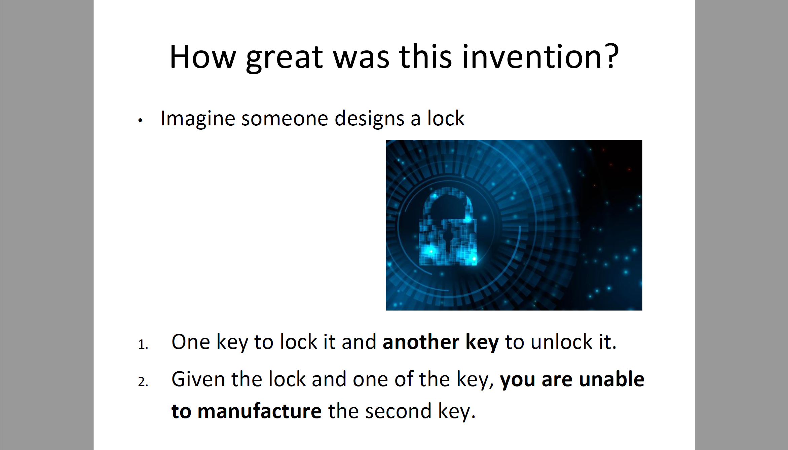

这张幻灯片用一个“锁和钥匙”的类比来解释 **公钥加密（Public Key Encryption）** 的核心思想，目的是让人们直观理解它的伟大之处。

------

## 🔐 标题：**How great was this invention?（这项发明有多伟大？）**

它试图表达：

> 公钥加密就像是一种颠覆常识的“神奇锁”，**用一把钥匙锁上，却只能用另一把钥匙解开**，而且**你无法从已知钥匙或锁推出另一把钥匙**。

------

### ✅ 逐条解释：

#### **1. One key to lock it, and \*another key\* to unlock it**

- 这代表：

  - **加密（锁）用公钥（Public Key）**
  - **解密（开锁）用私钥（Private Key）**

- 也就是说：

  > 加密和解密不是同一把钥匙，而是**一对密钥**，这个特性叫做：**非对称加密**

------

#### **2. Given the lock and one of the keys, \*you are unable to manufacture the second key\***

- 这就是公钥加密安全性的根基：

  - 即使你**知道了公钥**（或公开的加密方法）
  - 也**无法逆推出私钥**

- 数学上，这依赖于：

  - **大整数因式分解难题**（RSA）
  - 或 **离散对数问题**（如 ElGamal、ECC）

- 所以：

  > 拿到公钥就算你能加密，但**你无法反推出私钥，也就无法解密**

------

### 💡 总结（通俗类比）：

想象你设计了一个锁（加密算法），
 别人可以用你提供的钥匙（公钥）来**上锁**，
 但**只有你**有**那把私钥**能开锁，
 而他们**根本造不出另一把钥匙**来开这个锁——
 这就是**公钥加密的魔力**！

------

需要我把这类比延伸成图解或补充公式原理，也可以继续告诉我。

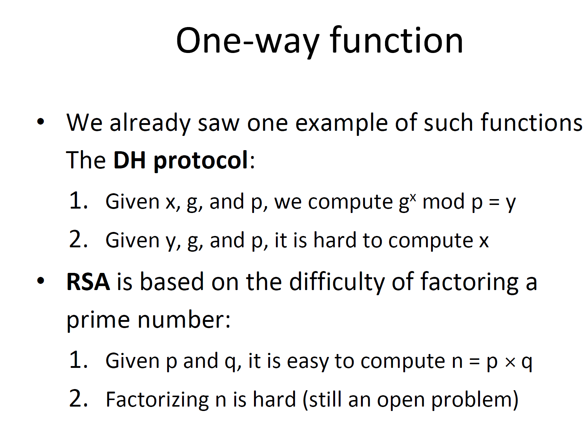

这张幻灯片解释了加密学中的一个核心概念：**单向函数（One-way function）**，它是现代加密系统（比如 Diffie-Hellman 协议 和 RSA）的基础。

------

## 🔑 标题：**One-way function（单向函数）**

一个单向函数具备两个特征：

1. **正向计算容易**（easy to compute）
2. **反向计算困难**（hard to invert）

------

- 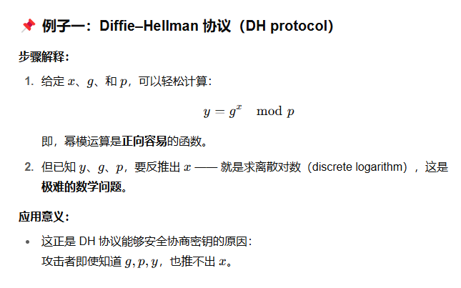


1. 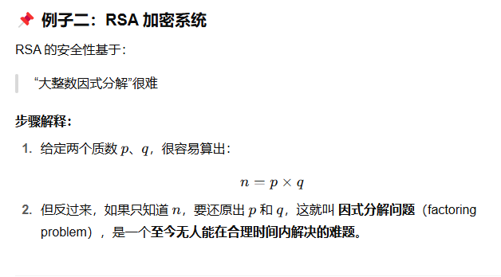

------

### 💡 总结：

| 加密方案       | 正向操作            | 反向操作（困难之处）       |
| -------------- | ------------------- | -------------------------- |
| Diffie-Hellman | gxmod  pg^x \mod p  | 离散对数问题（求 xx）      |
| RSA            | n=p×qn = p \times q | 因式分解问题（求 p,qp, q） |

因此，**单向函数是加密安全的核心保障**：让加密过程简单，但解密只能靠特定密钥（而不是暴力反推）。

------

需要我用更生活化的例子解释单向函数，也可以告诉我！

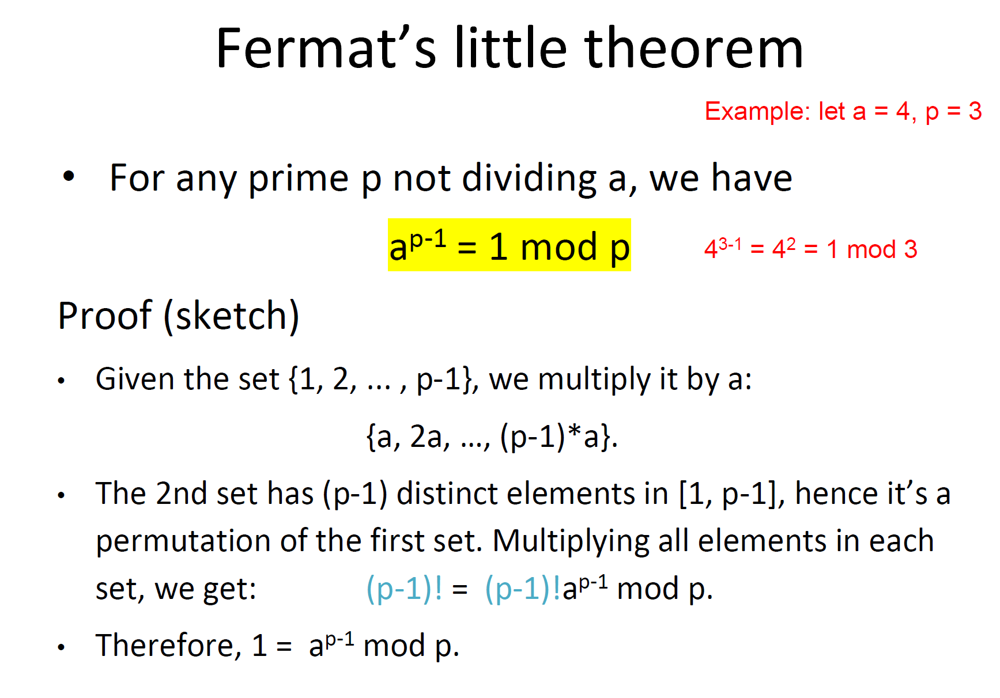

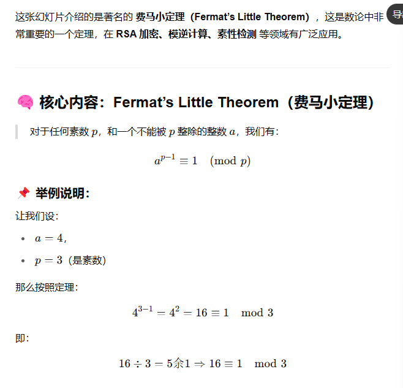

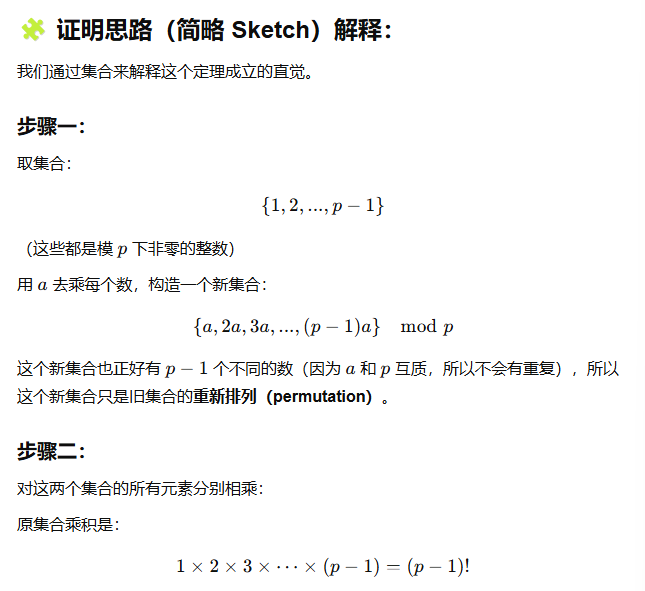

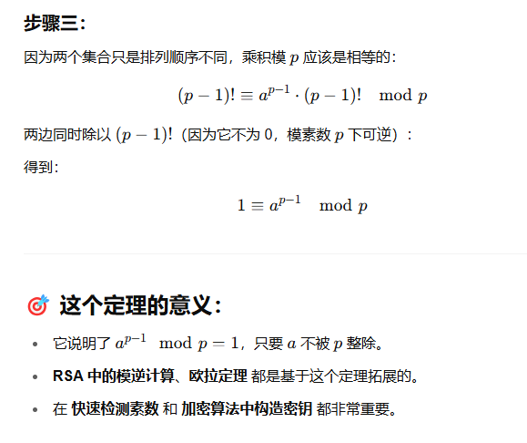

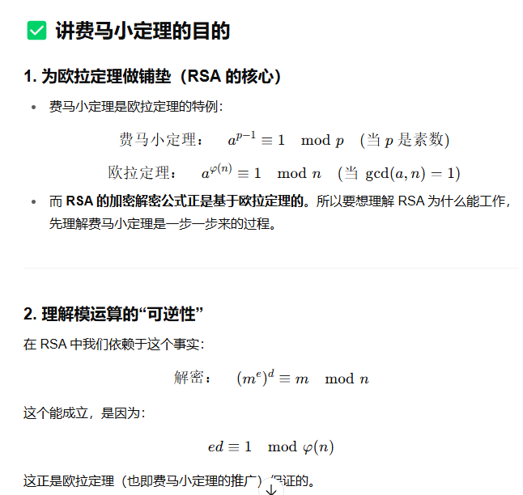

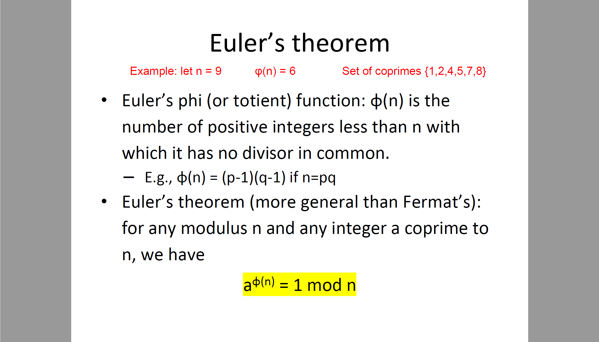

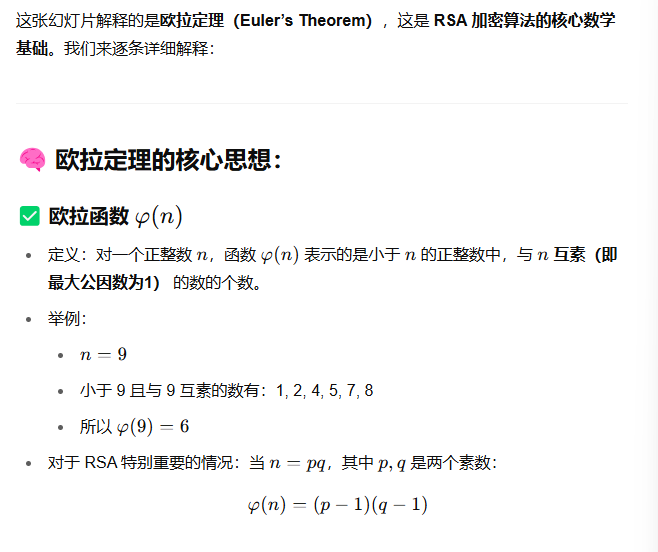

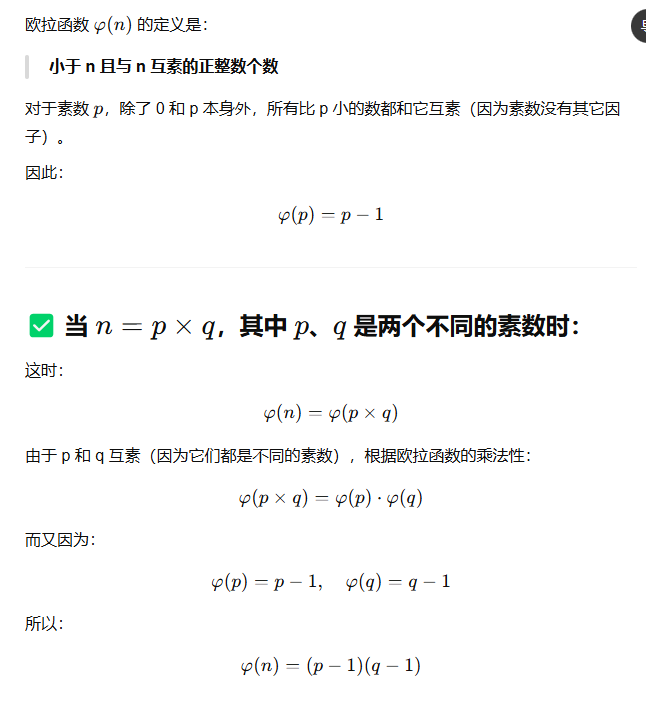

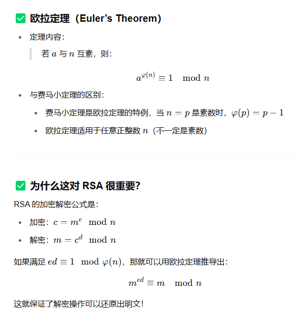


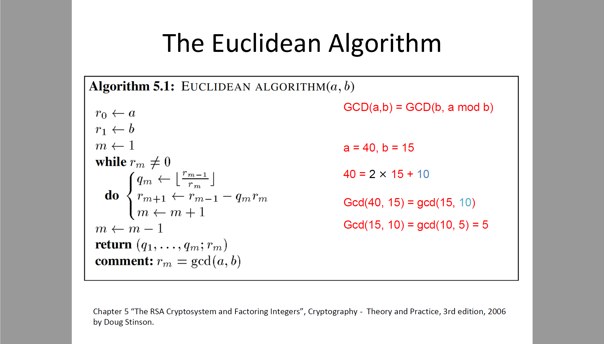

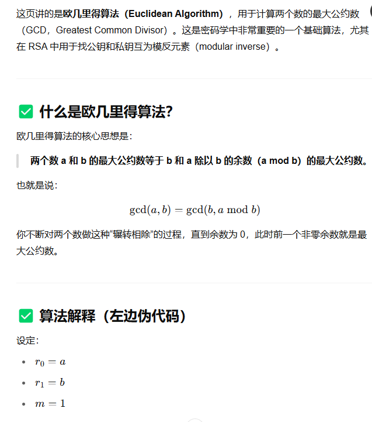

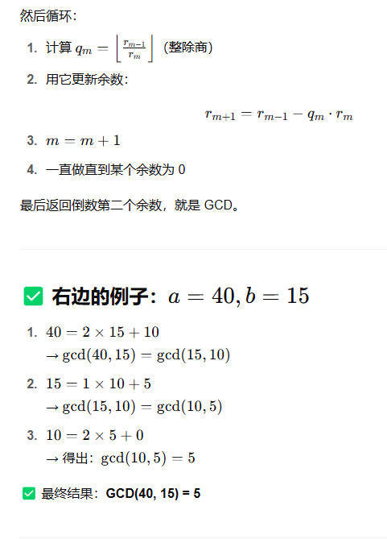

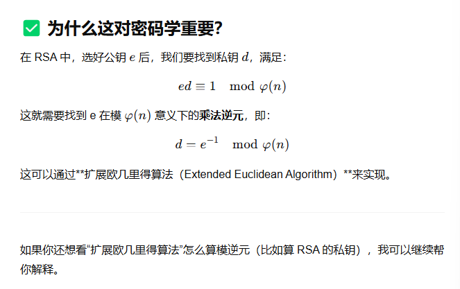

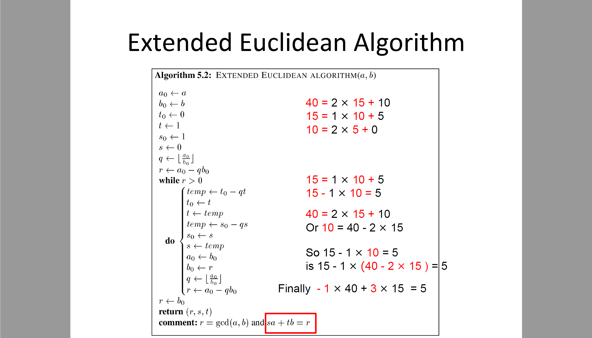

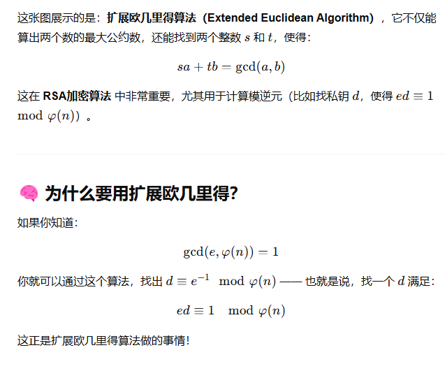

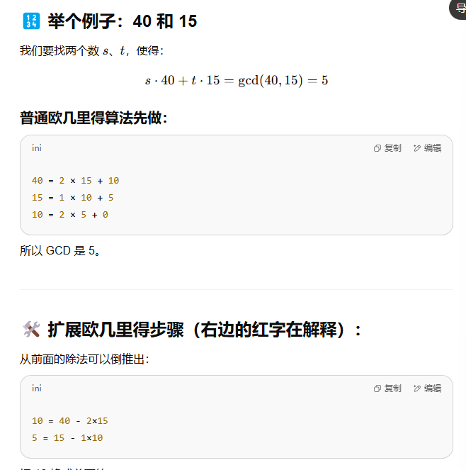


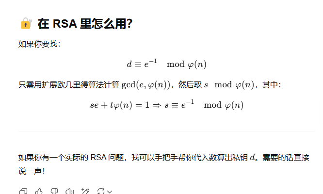