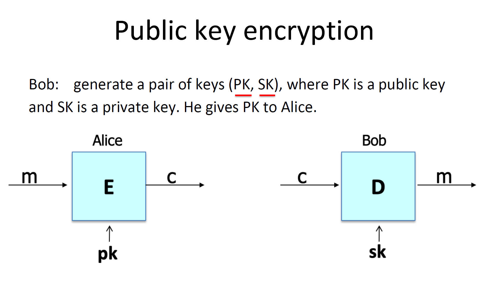
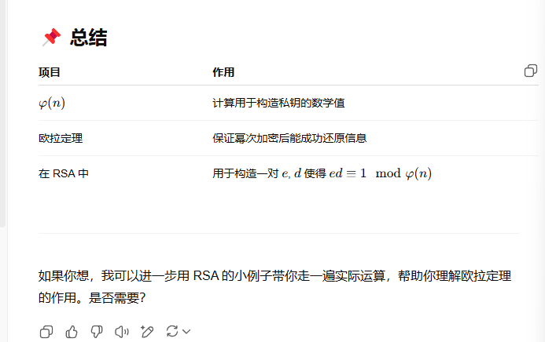
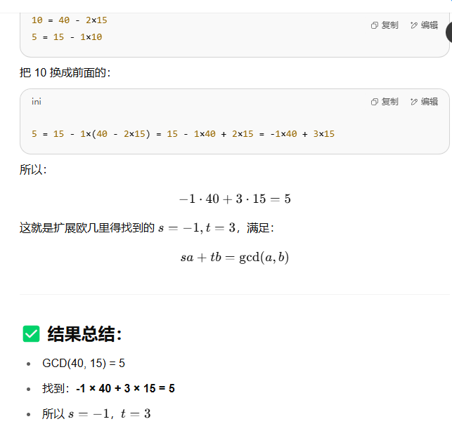

这是CS9150课程的一é“期末题目，å±äºâ€œClassical cryptography（ç»å…¸å¯†ç å­¦ï¼‰â€éƒ¨åˆ†ï¼Œä¸‹é¢æ˜¯å¯¹é¢˜ç›®çš„é€å¥ç¿»è¯‘ã€è§£é‡Šã€ä»¥åŠç­”题æ€è·¯åˆ†æ：

------

### 📘 **题目åŸæ–‡ç¿»è¯‘**

> **1.1** A substitution cipher works by randomly substituting letters based on using a permutation vector as the key.
>  替æ¢å¯†ç ï¼ˆSubstitution cipher）通过使用一个**æ’列å‘é‡ï¼ˆpermutation vector）**作为密钥，éšæœºæ›¿æ¢å­—æ¯æ¥åŠ å¯†ä¿¡æ¯ã€‚

> What is the key size of a substitution cipher?
>  替æ¢å¯†ç çš„密钥空间大å°æ˜¯å¤šå°‘？

> Elaborate how a substitution cipher can be broken without knowing the key.
>  请详细说æ˜åœ¨ä¸çŸ¥é“密钥的情况下，替æ¢å¯†ç æ˜¯å¦‚何被破解的。

> **[5 Marks]**

------

## ✅ **解题è¦ç‚¹æ•´ç†**

这是一个**5分题目**，考察两个核心内容：

------

### âœ³ï¸ ç¬¬ä¸€é—®ï¼šWhat is the key size of a substitution cipher?

#### âœ”ï¸ ç­”æ¡ˆé€»è¾‘ï¼š

- 替æ¢å¯†ç å¯¹26个字æ¯è¿›è¡Œé‡æ–°æ’列。

- 所有å¯èƒ½çš„æ’列数是：

  26!（26的阶乘）26! \quad（26的阶乘）

- 这是**密钥空间（key space）**的大å°ï¼Œæ„味ç€å¯†é’¥çš„æ•°é‡æ˜¯ï¼š

  26!≈4×102626! ≈ 4 \times 10^{26}

  é常大，无法通过**穷举**暴力破解。

#### 📠å¯å†™å‚考å¥å¼ï¼š

> The key size of a substitution cipher is **26!** (factorial of 26), because each letter in the alphabet is mapped to a unique other letter, and there are 26! possible permutations of the 26 letters.

------

### âœ³ï¸ ç¬¬äºŒé—®ï¼šHow can a substitution cipher be broken without knowing the key?

#### âœ”ï¸ è§£æ³•å…³é”®ï¼š

使用**频ç‡åˆ†æ法（Frequency Analysis）**：

- 英文中ä¸åŒå­—æ¯å‡ºç°é¢‘ç‡ä¸åŒï¼Œæ¯”如：
  - E, T, A, O 是最常è§çš„ï¼›
  - Q, Z, X 是最少è§çš„。
- 如æœæœ‰è¶³å¤Ÿé•¿çš„密文，å¯ä»¥ç»Ÿè®¡å…¶ä¸­æ¯ä¸ªå­—æ¯å‡ºç°çš„频ç‡ï¼Œä¸è‹±è¯­å¸¸è§é¢‘ç‡åˆ†å¸ƒåšåŒ¹é…，ä»è€Œ**æ¨æµ‹æ›¿æ¢å…³ç³»**。
- 此方法是对“å•è¡¨æ›¿æ¢å¯†ç ï¼ˆmonoalphabetic substitution cipher）â€ç‰¹åˆ«æœ‰æ•ˆã€‚

#### 📠å¯å†™å‚考å¥å¼ï¼š

> A substitution cipher can be broken using **frequency analysis**. In English, letters such as **E, T, and A** appear more frequently. By comparing the frequency distribution of letters in the ciphertext with typical English letter frequencies, an attacker can deduce probable mappings between cipher letters and plaintext letters.

------

## 🧠 **完整å‚考答案（å¯ç›´æ¥èƒŒè¯µï¼‰**

> The key size of a substitution cipher is **26!**, which is the number of all possible permutations of the 26 letters in the English alphabet.
>
> Despite the large key space, a substitution cipher can be broken using **frequency analysis**. This technique involves analyzing the frequency of letters in the ciphertext and comparing it with known letter frequencies in English. For example, if a letter appears most frequently in the ciphertext, it might correspond to 'E', the most common letter in English. With enough ciphertext, an attacker can reconstruct the substitution pattern and recover the plaintext without knowing the key.

------

如æœä½ è¿˜ä¸ç†Ÿæ‚‰é¢‘ç‡è¡¨æˆ–者想练练这类题目，我å¯ä»¥æ供一个练习工具或å°ç»ƒä¹ ã€‚需è¦å—？


è¿™æ˜¯ä¸€ä¸ªå…³äº **Vigenère cipher** 的考试题，è¦æ±‚你使用 **Kasiski 检验法（Kasiski Test）** æ¥çŒœæµ‹å¯†é’¥é•¿åº¦ï¼Œå¹¶è¯´æ˜ç†ç”±ã€‚

------

## ✅ 题目简æ

你被给出一段用 **Vigenère 密ç ** 加密的密文：

```
KIOVIEEIGKIOVNURNVJNUVKHVMGZIA...
```

目标：**利用 Kasiski 检验法 猜测密钥长度**。

------

## ✅ Kasiski Test 是什么？

Kasiski Test 是一ç§ç ´è§£ Vigenère 密ç çš„方法，基本æ€è·¯æ˜¯ï¼š

> 找出密文中é‡å¤çš„字符串（通常是3个或更多字æ¯çš„é‡å¤ç‰‡æ®µï¼‰ï¼Œè®°å½•å®ƒä»¬ä¹‹é—´çš„**é—´è·**（å³å®ƒä»¬å‡ºç°ä½ç½®çš„è·ç¦»ï¼‰ï¼Œç„¶å计算这些间è·çš„ **最大公因数（GCD）**，ä»è€ŒçŒœæµ‹å¯†é’¥é•¿åº¦ã€‚

------

## ✅ 步骤详解（根æ®é¢˜ç›®ç»™çš„密文）：

åŸæ–‡ç‰‡æ®µï¼š

```
KIOVIEEIGKIOVNURNVJNUVKHVMGZIA...
```

### **Step 1: 找é‡å¤å­—符串**

观察密文：我们看到 `KIO` 出ç°äº†ä¸¤æ¬¡ï¼š

- 第一次出ç°çš„ä½ç½®ï¼šç´¢å¼• 0
- 第二次出ç°çš„ä½ç½®ï¼šç´¢å¼• 9

🔢 è·ç¦»ï¼ˆé—´éš”）= 9 - 0 = **9**

### **Step 2: 看其他é‡å¤**

å†çœ‹ `UV` 也é‡å¤äº†ï¼š

- `UV` 出ç°åœ¨ç´¢å¼• 20 å’Œ 24
- é—´è· = 24 - 20 = **4**

但这ç§é‡å¤å¾ˆçŸ­ï¼ŒKasiski æ›´å好 3 å­—æ¯ä»¥ä¸Šé‡å¤ã€‚

å†çœ‹ `VIE` å’Œ `JNU` 出ç°é¢‘次较ä½ï¼Œå¿½ç•¥ã€‚

所以我们åªç”¨å¯é çš„ **"KIO" -> é—´è· 9**。

------

### **Step 3: æ¨æµ‹å¯†é’¥é•¿åº¦**

Kasiski 检验的核心是：**é‡å¤ä¸²çš„é—´è· = 密钥长度的å€æ•°**

因为加密是周期性的，密钥æ¯éš” N 个字符é‡å¤ä¸€æ¬¡ã€‚

所以：
 â¡ï¸ 密钥长度是 **9 çš„å› æ•°**
 å³å¯èƒ½çš„ key length 是：

```
{1, 3, **9**}
```

------

## ✅ 答案格å¼å‚考（适åˆè€ƒè¯•ç­”题）

### ✅ Sample Answer (5 Marks)

**Step 1**: I observed that the 3-letter sequence `KIO` appears twice in the ciphertext. The first occurrence starts at position 0, and the second at position 9.

**Step 2**: The distance between the repeated sequences is 9 characters.

**Step 3**: According to the Kasiski test, the key length is likely a factor of this distance. The factors of 9 are 1, 3, and 9.

**Step 4**: Therefore, the likely key lengths are **1, 3, or 9**, with **3 or 9** being the more probable since a key length of 1 would make it a Caesar cipher.

**Conclusion**: The most likely key lengths are **3 or 9**, based on repeated segments and their spacing (Kasiski method).

------

## 🧠 附加æ示（如æœé—®ä½ è¿›ä¸€æ­¥éªŒè¯ï¼‰

ä½ å¯ä»¥ç”¨ **Index of Coincidence (IC)** 或 **频ç‡åˆ†æ** 对ä¸åŒ key 长度分段å°è¯•ç ´è¯‘。

------

如æœä½ æƒ³è¦æˆ‘带你手动解出这个密文ã€è¿˜åŸå‡º key 或æ˜æ–‡ï¼Œæˆ‘也å¯ä»¥ç»§ç»­å¸¦ä½ åšï¼Œç»§ç»­å—？

### ✅ 所在 PPT：

📄 **第 3 个 PPT**：

> **文件å**：`3 crypto_-_classical.pdf`

## 26页


这张图详细解释了 **Vigenère cipher（维å‰å°¼äºšå¯†ç ï¼‰** 是如何工作的，我们一起æ¥é€è¡Œæ‹†è§£ï¼š

------

## ✅ 1. 什么是 Vigenère cipher？

> ä¸€ç§ **多表代æ¢åŠ å¯†ï¼ˆpolyalphabetic substitution cipher）**，通过使用多个ä¸åŒçš„ Caesar 密ç å¾ªç¯å åŠ å®ç°æ›´å¼ºçš„加密效æœã€‚

------

## ✅ 2. 图中å˜é‡è§£é‡Šï¼š

| ç¬¦å· | å«ä¹‰                              |
| ---- | --------------------------------- |
| `k`  | 密钥（Key）é‡å¤æ‰©å±•ä»¥åŒ¹é…æ˜æ–‡é•¿åº¦ |
| `m`  | æ˜æ–‡ï¼ˆMessage）è¦åŠ å¯†çš„åŸå§‹å†…容   |
| `c`  | 密文（Ciphertext）加密åçš„ç»“æœ    |

------

## ✅ 3. 加密方å¼ï¼ˆå›¾ä¸­å…¬å¼ï¼‰ï¼š


------

## ✅ 4. 图解说æ˜

### åŸå§‹å†…容（按字æ¯å¯¹é½ï¼‰ï¼š

| ä½ç½®          | 1    | 2    | 3    | 4    | 5    | 6    | ...      |
| ------------- | ---- | ---- | ---- | ---- | ---- | ---- | -------- |
| **k**（密钥） | A    | B    | C    | A    | B    | C    | é‡å¤å¾ªç¯ |
| **m**（æ˜æ–‡ï¼‰ | B    | E    | R    | E    | A    | D    | ...      |
| **c**（密文） | B    | F    | T    | E    | F    | Y    | ...      |

------

## ✅ 示例：手算å‰ä¸‰ç»„加密过程

### 第1个字æ¯ï¼š

- æ˜æ–‡ `B` → æ•°å­— 1
- 密钥 `A` → 数字 0
- 加密å = (1 + 0) mod 26 = 1 → 密文 `B`

### 第2个字æ¯ï¼š

- æ˜æ–‡ `E` → 4
- 密钥 `B` → 1
- 加密å = (4 + 1) mod 26 = 5 → 密文 `F`

### 第3个字æ¯ï¼š

- æ˜æ–‡ `R` → 17
- 密钥 `C` → 2
- 加密å = (17 + 2) mod 26 = 19 → 密文 `T`

如此类æ¨ã€‚

------

## ✅ 加密æµç¨‹æ€»ç»“：

1. 将密钥循ç¯ä½¿ç”¨ï¼ˆå¯¹é½æ˜æ–‡é•¿åº¦ï¼‰
2. 把字符转æ¢ä¸ºæ•°å­—（A=0, B=1,...）
3. æ¯ä¸€å¯¹å­—æ¯åŠ å’Œå–模 26
4. 把结æœè½¬æ¢å›å­—æ¯ â†’ 得到密文

------

## ✅ 为什么 Vigenère 比 Caesar 更强？

- Caesar åªç”¨ä¸€ä¸ªå›ºå®šå移（å•å­—æ¯å¯†é’¥ï¼‰ï¼Œå®¹æ˜“被频ç‡åˆ†æ破解
- Vigenère 使用多个字æ¯å¯†é’¥ï¼Œå¯¹åŒä¸€ä¸ªå­—æ¯åŠ å¯†ç»“æœä¸åŒ → **打破字æ¯é¢‘ç‡è§„律**
- 但ä»å¯è¢« **Kasiski Test** å’Œ **Friedman Test** 破解

------

如æœä½ å¸Œæœ›æˆ‘演示一组自己加密一段内容，或者帮你åšåå‘è§£å¯†ï¼ˆæš´åŠ›è¿˜åŸ key），å¯ä»¥ç»§ç»­é—®æˆ‘ ğŸ˜


这张幻ç¯ç‰‡æ˜¯å¯¹ **Vigenère cipher 的破解（cryptanalysis）方法** 的总结，指出了两大核心步骤：

------

## 🔠标题：Cryptanalysis of Vigenère Cipher

（**ç»´å‰å°¼äºšå¯†ç çš„密ç åˆ†æ**）

### 👉 Cryptanalysis = 破解密ç ï¼Œä¸çŸ¥é“密钥的情况下还åŸæ˜æ–‡ã€‚

------

## ✅ 两个主è¦æ­¥éª¤è¯¦è§£ï¼š

### ### 1ï¸âƒ£ Find out the key length `m`

**找出密钥的长度（key length）**

这是破解 Vigenère 密ç çš„**第一步**，如æœä½ èƒ½ç¡®å®šå¯†é’¥æ˜¯å‡ ä¸ªå­—æ¯çš„，那么你就å¯ä»¥æŠŠæ•´ä¸ªå¯†æ–‡**åˆ†æˆ m 个 Caesar 密文æ¥å•ç‹¬ç ´è§£**。

#### ✨ 方法包括：

- **Kasiski Test**（é‡å¤å­ä¸² + è·ç¦» → 公因数）✔ï¸
- **Friedman Test**（统计字æ¯é‡åˆåº¦ï¼ŒIndex of Coincidence）📊

举例：如æœä½ å‘ç°å¯†æ–‡ä¸­å‡ºç° `KIO...KIO`，间隔为 9，则å¯èƒ½å¯†é’¥é•¿åº¦æ˜¯ 3 或 9。

------

### ### 2ï¸âƒ£ Find out each letter in the key

**找出密钥的æ¯ä¸€ä¸ªå­—æ¯**

确定密钥长度 `m` å，就å¯ä»¥å°†å¯†æ–‡åˆ†ä¸º m 组，æ¯ç»„都是用åŒä¸€ä¸ª Caesar 加密：

- 比如 key 长度是 3，就把密文分为第 1ã€4ã€7ã€10... 为第 1 组
- 然å对æ¯ç»„åš**频ç‡åˆ†æ**，破解出该组用的 Caesar å¯†é’¥ï¼ˆå³ key 中的æŸä¸€ä½ï¼‰

#### ✨ 技术手段：

- 英文中 `E` 出ç°é¢‘ç‡æœ€é«˜ → æ¨æµ‹å‡º Caesar å移
- 多组组åˆèµ·æ¥ï¼Œè¿˜åŸå‡ºæ•´ä¸ª key，比如 `B E C O D E`

------

## ✅ å°ç»“（适åˆç­”题时写）

ç»´å‰å°¼äºšå¯†ç ç ´è§£çš„基本æ€è·¯æ˜¯ä¸¤æ­¥ï¼š

1. **确定密钥长度**：利用 Kasiski 或 Friedman 检验，通过统计分æ或é‡å¤å­ä¸²æ¨æµ‹ key 长度。
2. **确定æ¯ä¸ªå¯†é’¥å­—æ¯**：将密文分组，æ¯ç»„视为一个 Caesar 密ç ï¼Œç”¨é¢‘ç‡åˆ†æ等方法é€ä¸ªç ´è¯‘出 key。

------

如æœä½ æ„¿æ„，我å¯ä»¥æ•™ä½ å¦‚何手动ä»ä¸€ä¸ªå®é™…例å­é‡Œæ¨æµ‹ key，比如用 Python 帮你模拟这两个过程，è¦è¯•è¯•å—？


这张幻ç¯ç‰‡è®²çš„是：

# ✅ 如何找出 Vigenère 密ç çš„密钥长度？

**使用的方法是：Kasiski 检验法（Kasiski Test）**

------

## 🧠 背景知识：

Vigenère 密ç çš„破解，第一步是**找出密钥长度 `m`**。
 Kasiski 检验是一ç§å†å²æ‚ ä¹…的方法，å‘æ˜äº 1863 年。

------

## ✅ å¹»ç¯ç‰‡å†…容é€æ¡è§£é‡Šï¼š

### 🔸 标题：How to find out the key length?

â¡ï¸ **如何找出密钥长度？**

------

### 🔹 First method: **Kasiski Test**

- **å‘æ˜è€…**：Friedrich Kasiski
- **核心æ€æƒ³**：找出密文中**é‡å¤çš„字符串片段**，比如相åŒçš„三è¿å­—æ¯ï¼ˆå¦‚ `ABC` 出ç°å¤šæ¬¡ï¼‰ï¼Œå¹¶è®¡ç®—它们之间的**è·ç¦»ï¼ˆä½ç½®é—´éš”）**

------

### 🔹 举例说æ˜ï¼š

密文片段示例（人为简化的例å­ï¼‰ï¼š

```
ABCDEABCDE...ABCDE...ABCDE
     ^          ^         ^  
```

å‡è®¾ `ABCDE` 这个é‡å¤å­—符串出ç°äº†å‡ æ¬¡ï¼Œå®ƒä»¬ä¹‹é—´çš„**é—´è·**是 15 个字符。

------

### 🔹 关键æ¨ç†ï¼š

**出ç°é—´è·æ˜¯ 15** → æ¨æµ‹å¯†é’¥é•¿åº¦æ˜¯ 15 çš„å› å­ï¼š

å¯èƒ½çš„ key 长度=å› æ•°(15)=1,3,5,15\text{å¯èƒ½çš„ key 长度} = \text{å› æ•°(15)} = 1, 3, 5, 15

通常会æ’除æ‰å¤ªå°çš„（如 1），所以最有å¯èƒ½çš„ key 长度是 **3 或 5**。

> 因为 Vigenère 密ç æ˜¯æŒ‰å¯†é’¥é•¿åº¦ **周期性** 加密的，
>  如æœä¸¤ä¸ªæ˜æ–‡ç‰‡æ®µé—´éš”正好是密钥的整数å€ï¼Œå®ƒä»¬å°±ä¼šè¢« **åŒä¸€å¯†é’¥ç‰‡æ®µåŠ å¯†**，
>  所以它们加密å会得到 **相åŒçš„密文片段**，ä»è€Œå‡ºç°åœ¨å¯†æ–‡ä¸­é‡å¤ã€‚

------

## ✅ 结论总结：

Kasiski 方法步骤如下：

1. **找到密文中é‡å¤çš„å­ä¸²ï¼ˆâ‰¥3 个字æ¯ï¼‰**
2. **记录这些å­ä¸²ä¹‹é—´çš„é—´è·**
3. **对多个间è·å–最大公因数（GCD）**
4. **所有 GCD çš„å› å­éƒ½æ˜¯å¯èƒ½çš„ key 长度**

------

## ✅ 应用示例å‚考你å‰é¢çš„题目：

比如你看到 `KIO` 在密文中é‡å¤å‡ºç°ä¸¤æ¬¡ï¼Œé—´è·æ˜¯ 9 →
 å¯èƒ½çš„ key 长度 = å› æ•°(9) = **1, 3, 9**

------

如你想，我å¯ä»¥å¸¦ä½ å®Œæ•´åšä¸€ä¸ª Kasiski 破解例题（å«æ‰¾å­ä¸² + GCD æ¨å¯¼ï¼‰ï¼Œæ˜¯å¦ç»§ç»­ï¼Ÿ


这张幻ç¯ç‰‡è®²çš„是破解 Vigenère 密ç çš„第二ç§æ–¹æ³•ï¼š

# ✅ **Friedman Test**ï¼ˆåŸºäº Index of Coincidence）

------

## 🔠标题：How to find out the key length?

### 第二ç§æ–¹æ³•ï¼šIndex of Coincidence（é‡åˆæŒ‡æ•°ï¼‰

------

## ✅ å¹»ç¯ç‰‡å†…容é€è¡Œè§£é‡Šï¼š

### 🔹 **Second method: index of coincidence**

â¡ï¸ 第二ç§æ–¹æ³•å«åš **é‡åˆæŒ‡æ•°ï¼ˆIndex of Coincidence，简称 IC）**

------

### 🔸 Described by William Friedman in 1920

â¡ï¸ 这个方法是密ç å­¦å®¶ William Friedman 在 1920 å¹´æ出的。
 他也是ç°ä»£å¯†ç åˆ†æ（cryptanalysis）的先驱之一。

------

### 🔸 Suppose x = xâ‚xâ‚‚...xâ‚™ is a string of n alphabetic characters.

â¡ï¸ å‡è®¾ä½ æœ‰ä¸€ä¸ªç”± n 个英文字æ¯ç»„æˆçš„字符串 `x`，也就是你的密文。

------

### 🔸 The Index of Coincidence of x is defined to be the probability that two random elements of x are identical.

â¡ï¸ **é‡åˆæŒ‡æ•° IC**：
 是ä»å­—符串中**éšæœºæŠ½ä¸¤ä¸ªå­—æ¯**，这两个字æ¯æ˜¯**一样的**的概ç‡ã€‚

------

## ✅ 这个值有什么用？为什么能用æ¥çŒœ key 长度？

| 场景               | IC 值大å°ï¼ˆå¤§è‡´ï¼‰ | è¯´æ˜                                                       |
| ------------------ | ----------------- | ---------------------------------------------------------- |
| **英语自然文本**   | ≈ 0.065           | 频ç‡åˆ†å¸ƒä¸å‡ï¼ˆE 最常è§ç­‰ï¼‰                                 |
| **完全éšæœºå­—符串** | ≈ 0.038           | 所有字æ¯ç­‰æ¦‚ç‡                                             |
| **Vigenère 密文**  | 介äºä¸¤è€…之间      | 如æœçŒœå¯¹ key 长度，就能还åŸæ¯ä¸€ç»„为 Caesar 密ç ï¼ŒIC 会å˜å¤§ |

------

## ✅ 用法总结：

1. **å°è¯•ä¸åŒçš„ key length（m）**
2. å°†å¯†æ–‡åˆ†æˆ m 个组（æ¯ç»„éš” m 个字æ¯ï¼‰
3. 分别计算æ¯ç»„çš„ IC 值
4. 如æœæŸä¸ª m çš„å¹³å‡ IC æ¥è¿‘ 0.065 → 说æ˜è¿™ä¸ª m 很å¯èƒ½æ˜¯ key 的长度ï¼

------

## ✅ 举个例å­è¯´æ˜ï¼š

å‡è®¾å¯†æ–‡ä¸ºï¼š

```
CIPHERTEXTENCRYPTEDWITHVIGENERE
```

你试 key length = 3，把密文分æˆï¼š

- 组1：第1ã€ç¬¬4ã€ç¬¬7… （→ Caesar 1）
- 组2：第2ã€ç¬¬5ã€ç¬¬8… （→ Caesar 2）
- 组3：第3ã€ç¬¬6ã€ç¬¬9… （→ Caesar 3）

然å分别计算 IC：

- 如æœè¿™äº›ç»„çš„ IC 都æ¥è¿‘英文自然 IC（~0.065），说æ˜ä½ çŒœçš„ key length 是对的ï¼

------

## ✅ å°ç»“：

**Index of Coincidence 是用äºçŒœ key 长度的统计工具**，它通过概ç‡åˆ†æ判断一个字符串是å¦åƒâ€œè‡ªç„¶è¯­è¨€â€ã€‚
 当你用正确的 key 长度分组，组内看起æ¥å°±åƒè‹±æ–‡ï¼Œè¿™æ—¶ IC 就会æ¥è¿‘ 0.065。

------

如æœä½ æƒ³ï¼Œæˆ‘å¯ä»¥ç°åœºç”¨ Python 给你算一个密文的 IC 值ã€å›¾ç¤ºå‡ºä¸åŒ key length çš„å¯èƒ½æ€§å›¾ï¼ˆfrequency analysis），是å¦ç»§ç»­ï¼Ÿ


这张幻ç¯ç‰‡è¯¦ç»†è®²è§£äº†å¦‚何计算 **Index of Coincidence（IC，é‡åˆæŒ‡æ•°ï¼‰**，是密ç åˆ†æ中é常关键的数学工具。下é¢æˆ‘们é€è¡Œæ¥è§£é‡Šï¼š

------

## 📌 标题：**Index of Coincidence**

------

## ✅ 概念说æ˜ï¼š

### 🔹 **Suppose a string of n English letters**

å‡è®¾ä½ æœ‰ä¸€ä¸ªé•¿åº¦ä¸º `n` 的英文字符串 `x`（比如密文）

------

### 🔹 **Occurrence of A = f₀**

è¡¨ç¤ºå­—æ¯ **A** 在这个字符串中出ç°äº† `fâ‚€` 次

### 🔹 **Occurrence of B = fâ‚**

è¡¨ç¤ºå­—æ¯ **B** 出ç°äº† `fâ‚` 次

...

### 🔹 **Occurrence of Z = f₂₅**

è¡¨ç¤ºå­—æ¯ **Z** 出ç°äº† `fâ‚‚â‚…` 次

------

## ✅ 什么是 Index of Coincidence？

> 是在字符串中**éšæœºé€‰ä¸¤ä¸ªå­—符，它们是一样的概ç‡**。

------

- 

------

## ✅ 常è§çš„ IC 值：

| å­—ç¬¦ä¸²ç±»å‹    | å…¸å‹ IC 值   | è¯´æ˜                             |
| ------------- | ------------ | -------------------------------- |
| 英文正常å¥å­  | ~0.065       | 出ç°é¢‘ç‡ä¸å¹³å‡ï¼ŒE/T/A 多         |
| éšæœºå­—符串    | ~0.038       | å­—æ¯åˆ†å¸ƒå‡åŒ€                     |
| Vigenère 密文 | 介äºä¸¤è€…之间 | 越长密钥越éšæœºï¼Œè¶ŠçŸ­å¯†é’¥è¶Šå英文 |

------

## 🧠 用途å›é¡¾ï¼š

如æœä½ å°è¯•ç”¨ä¸åŒ key length å»åˆ‡åˆ† Vigenère 密文：

- 如æœç”¨å¯¹äº† key 长度，æ¯ç»„å­ä¸²å°±æ˜¯ Caesar 密文，æ¥è¿‘英文 → **IC ≈ 0.065**
- 如æœçŒœé”™ï¼Œç»„内字æ¯åˆ†å¸ƒåéšæœº → **IC ≈ 0.038**

------

## ✅ 总结：

1. IC è¡¡é‡çš„是字符串中字æ¯çš„集中程度
2. 用äºè¯†åˆ« **Vigenère 密文的 key 长度**
3. 计算方法就是：看æ¯ä¸ªå­—æ¯å‡ºç°æ¬¡æ•°ï¼Œè®¡ç®—é‡å¤æ¦‚ç‡

------

如æœä½ æƒ³ï¼Œæˆ‘å¯ä»¥ç”¨ä¸€æ®µçœŸå®å¯†æ–‡ï¼Œå¸¦ä½ æ‰‹åŠ¨ç®—一次 IC 或画出ä¸åŒ key length 下的 IC 曲线图，帮你更直观ç†è§£ã€‚è¦è¯•è¯•çœ‹å—？


这张幻ç¯ç‰‡æ˜¯åœ¨æ€»ç»“ **ä¸åŒç±»å‹æ–‡æœ¬çš„ Index of Coincidence（IC） 的差异**，用æ¥è§£é‡Š **为什么å¯ä»¥é€šè¿‡ IC 判断密钥长度**，是 Friedman 分æ法的核心ä¾æ®ã€‚

------

## ✅ 标题：Difference in index of coincidence

**å„ç§å­—符串的 IC 值对比**

------

## 🧠 背景å›é¡¾ï¼š

IC 是指：**ä»å­—符串中éšæœºæŠ½ä¸¤ä¸ªå­—æ¯ï¼Œè¿™ä¸¤ä¸ªå­—æ¯ä¸€æ ·çš„概ç‡**

------

下é¢æˆ‘们解释四ç§ç±»å‹çš„文本和它们的 IC 值：

------

### 🔹 1. **Normal English text（正常英文）**

- å­—æ¯å‡ºç°é¢‘ç‡å·®åˆ«å¾ˆå¤§ï¼ˆE/T/A 很多，Q/Z 很少）
- 所以有更高的“é‡å¤å­—æ¯â€æ¦‚ç‡
- **IC ≈ 0.065**

------

### 🔹 2. **Completely random string of letters（完全éšæœºï¼‰**

- æ¯ä¸ªå­—æ¯éƒ½æ˜¯å¹³å‡å‡ºç°ï¼Œåƒå¯†ç éšæœºç”Ÿæˆä¸€æ ·
- 所以é‡å¤æ¦‚ç‡æ›´ä½
- **IC ≈ 0.038**

------

### 🔹 3. **Normal English text shifted by a fixed number（凯撒密ç ï¼‰**

- 这就是 **Caesar cipher** 加密å的结æœï¼ˆæ¯ä¸ªå­—æ¯å移固定数）
- å­—æ¯é¢‘ç‡åˆ†å¸ƒå®Œå…¨æ²¡æœ‰æ”¹å˜ï¼Œåªæ˜¯è¢«â€œæ¢äº†åå­—â€
- 所以和åŸæ–‡ä¸€æ ·ï¼ŒIC ä¸å˜
- **IC ≈ 0.065**

------

### 🔹 4. **English text encrypted by Vigenère cipher**

- Vigenère 是多个 Caesar 密ç è½®æµä½¿ç”¨ï¼ˆpoly-alphabetic）
- éšç€å¯†é’¥é•¿åº¦å˜å¤§ï¼Œåˆ†å¸ƒé€æ¸å˜å¾—æ›´å¹³å‡ï¼Œæ›´éšæœº
- 所以：**IC ä»‹äº 0.038 ~ 0.065 之间**

**IC 值范围判断如下：**

| Key Length | 密文越åƒè‹±æ–‡ → IC 越高                |
| ---------- | ------------------------------------- |
| Key 短     | å­—æ¯è§„律性强 → **IC ↑**（æ¥è¿‘ 0.065） |
| Key é•¿     | å­—æ¯æ¥è¿‘éšæœº → **IC ↓**（æ¥è¿‘ 0.038） |

------

## ✅ 用法总结：

通过计算密文的 IC：

- å¦‚æœ IC æ¥è¿‘ **0.065** → 很å¯èƒ½æ˜¯è‹±æ–‡æˆ– Caesar 密文
- å¦‚æœ IC æ¥è¿‘ **0.038** → 很å¯èƒ½æ˜¯éšæœºæˆ– Vigenère 密钥很长
- 如æœä½ ç”¨æŸä¸ª key length 把密文分组，æ¯ç»„ IC 都 ≈ 0.065
   → **猜对了 key lengthï¼**

------

## ✅ 填空答案（最å一项）：

> **English text encrypted by Vigenère cipher**
>  IC ≈ **0.038 ~ 0.065**
>  （一般在 0.045 ~ 0.055 之间）

------

需è¦æˆ‘举例演示用 IC 猜 key length çš„ Python 脚本å—？或者你想练习一é“例题？


这是一é“å…¸å‹çš„å…³äº **Index of Coincidence (IC)** 的简答题，考查你对其**定义和应用方法的ç†è§£**。

------

## ✅ 中文翻译 + 题æ„说æ˜ï¼š

**题目内容：**

> 1.3 å¦ä¸€ç§çŒœæµ‹å¯†é’¥é•¿åº¦çš„方法是通过计算é‡åˆæŒ‡æ•°ï¼ˆIndex of Coincidence）。请简è¦è¯´æ˜ï¼š
>
> 1. 什么是 IC；
> 2. 如何通过 IC æ¥åˆ¤æ–­å¯†é’¥é•¿åº¦ã€‚
>
> æ示：éšæœºå­—æ¯çš„ IC ≈ 0.038，英语文本的 IC ≈ 0.065。
>  ã€10分】

------

## ✅ 解题结æ„（写作建议，逻辑清晰å¯æ‹¿æ»¡åˆ†ï¼‰ï¼š

------

### **第一部分：解释什么是 Index of Coincidence**（4 分）

> The Index of Coincidence (IC) is a statistical measure that estimates the probability that two randomly selected letters from a string are identical.
>
> It is calculated using the formula:

IC = \frac{\sum_{i=0}^{25} f_i(f_i - 1)}{n(n - 1)}
 ]

> where fif_i is the number of times letter ii appears and nn is the total number of letters.

â¡ï¸ 中文：é‡åˆæŒ‡æ•°æ˜¯æŒ‡ä»ä¸€ä¸ªå­—符串中éšæœºæŠ½ä¸¤ä¸ªå­—符，它们是**相åŒå­—æ¯**的概ç‡ã€‚
 â¡ï¸ 如æœå­—æ¯é¢‘ç‡ä¸å‡åŒ€ï¼ˆå¦‚英文文本），IC 值就会å大。

------

### **第二部分：如何利用 IC 猜密钥长度**（6 分）

> To determine the key length in a Vigenère cipher using IC:
>
> 1. Guess a potential key length mm.
> 2. Divide the ciphertext into mm groups, each containing every mm-th letter.
> 3. Compute the IC of each group.
> 4. If the average IC is close to **0.065**, then this mm is likely the correct key length.
> 5. If the IC is close to **0.038**, it likely indicates random distribution — try another key length.

â¡ï¸ 中文æ€è·¯æ€»ç»“：

1. å‡è®¾å¯†é’¥é•¿åº¦ä¸º m
2. æŠŠå¯†æ–‡æ¯ m ä¸ªä¸€ç»„åˆ†æˆ m 个å­åºåˆ—
3. æ¯ä¸ªå­åºåˆ—都åƒæ˜¯ä¸€ä¸ª Caesar 密ç ï¼ˆå›ºå®šå移）
4. 分别计算这 m 个åºåˆ—çš„ IC，求平å‡
5. 如æœå¹³å‡å€¼æ¥è¿‘ 0.065 → 猜对了 key 长度
    如æœæ¥è¿‘ 0.038 → key 长度猜错了，è¦æ¢åˆ«çš„

------

## ✅ æ ·æ¿ç­”案（英文写法建议）：

> The Index of Coincidence (IC) measures the likelihood that two randomly selected letters from a text are the same. In English text, where letter frequencies vary (e.g., E is most common), the IC is about 0.065. In completely random text, the IC is about 0.038.
>
> To determine the key length of a Vigenère cipher using IC, one assumes a possible key length mm, then divides the ciphertext into mm groups, each taking every mm-th character. The IC of each group is calculated. If the average IC is close to 0.065, it indicates each group resembles English text encrypted by Caesar cipher, and the key length is likely correct. Otherwise, try another value of mm.

------

如你需è¦ï¼Œæˆ‘也å¯ä»¥ï¼š

- 帮你直æ¥å†™ä¸€ä»½ä¸­æ–‡ç‰ˆæœ¬
- å¸®ä½ å†™æˆ Markdown/Word 结æ„
- 或者用 Python 工具演示一个 IC å®é™…计算过程

需è¦çš„è¯è¯·å‘Šè¯‰æˆ‘ 😄


è¿™æ˜¯ä¸€ä¸ªå…³äº **Vigenère 密ç ç ´è¯‘**中第二阶段的问题：
 **ä½ å·²ç»çŸ¥é“了密钥长度，下一步如何æ¨å¯¼å‡ºå¯†é’¥æœ¬èº«ï¼Ÿ**

------

## ✅ 中文翻译：

**1.4** å‡è®¾ä½ å·²ç»é€šè¿‡ index of coincidence 方法正确找到了密钥长度。
 请解释你æ¥ä¸‹æ¥å¦‚何æ¨å¯¼å‡ºå¯†é’¥ã€‚
 ã€5 分】

------

## ✅ å›ç­”结æ„（适åˆè€ƒè¯•å†™ä½œï¼‰ï¼š

------

### 🌟 å‰æ：你知é“密钥长度是 m

那么å¯ä»¥æŠŠå¯†æ–‡åˆ†æˆ m 个å­åºåˆ—，æ¯ä¸ªå­åºåˆ—都是一个**Caesar 密ç ï¼ˆå‡¯æ’’密ç ï¼‰**加密的。

------

### ✅ 解题步骤（英文 + 中文解释）：

> 1. Divide the ciphertext into mm separate groups, each containing letters encrypted with the same Caesar shift.
>     ⤠将密文按密钥长度 mm åˆ†æˆ m 个组，例如æ¯ç¬¬ ii 个字æ¯å½’为第 ii 组。

> 1. For each group, perform **frequency analysis** to identify the Caesar shift used.
>     ⤠对æ¯ç»„分别åš**å­—æ¯é¢‘ç‡åˆ†æ**，找出最常出ç°çš„å­—æ¯ï¼ˆæ¯”如 ‘E’ 是英文中最常è§çš„），æ¨æµ‹å®ƒæ˜¯ç”±å“ªä¸ªæ˜æ–‡å­—æ¯åŠ å¯†è€Œæ¥ã€‚

> 1. Calculate the Caesar shift by comparing the observed most frequent letter with the expected one (typically 'E' in English).
>     ⤠例如这一组中 'B' 最常è§ï¼Œä½ å¯ä»¥çŒœå®ƒæ˜¯ 'E' è¢«åŠ å¯†è€Œæ¥ â†’ Caesar shift 是 23（因为 E→B 是 -3 mod 26）

> 1. This Caesar shift corresponds to the key letter used for that group.
>     ⤠把æ¯ç»„çš„ Caesar shift 转æ¢ä¸ºå¯†é’¥å­—æ¯ï¼ˆ0→A，1→B，...）

> 1. Repeat this process for all mm groups to get the full key.
>     ⤠最终你得到了完整的密钥，如 "LEMON"。

------

## ✅ 总结（一å¥è¯ç²¾ç‚¼ï¼‰ï¼š

> By treating each group as a Caesar cipher and using frequency analysis on each, we can recover each letter of the Vigenère key.

------

## ✅ æ ·æ¿è‹±æ–‡ç­”案（考试å¯ç”¨ï¼‰ï¼š

> Once the key length mm is known, the ciphertext is divided into mm groups, each consisting of every mm-th letter. Each group corresponds to a Caesar cipher.
>
> By performing frequency analysis on each group, we estimate the shift by assuming the most frequent letter in each group corresponds to 'E' (the most common English letter).
>
> The shift reveals the key letter for that group. Repeating this for all mm groups gives the complete Vigenère key.

------

需è¦æˆ‘帮你åšä¸€ä¸ªé¢‘ç‡åˆ†æçš„å°ä¾‹å­ï¼ˆæ¯”如用 Python åšï¼‰å—？å¯ä»¥æ›´ç›´è§‚ç†è§£æ€ä¹ˆæ¨å¯¼å¯†é’¥ã€‚


è¿™æ˜¯ä¸€ä¸ªå…³äº **公共密钥加密系统设计æ¼æ´åˆ†æ** 的题目。你需è¦è¯†åˆ« Bob 设计中 **4 个安全æ¼æ´**，并解释**攻击者如何利用æ¯ä¸ªæ¼æ´**ã€‚é¢˜ç›®èƒŒæ™¯åŸºäº **RSA 加密 å’Œ HSM（硬件安全模å—）**。

------

## ✅ 中文翻译：

> Bob 是一å软件工程师，他è¦ä¸ºå…¬å¸å‘˜å·¥å®ç°ä¸€ä¸ªå…¬é’¥åŠ å¯†ç³»ç»Ÿã€‚他使用 RSA 方案，并使用 HSM åšå¯†é’¥ç®¡ç†ã€‚
>
> - ä»–åœ¨ä¸»æœºä¸Šç”Ÿæˆ RSA 模数 n=p×qn = p \times q，并把素数 p,qp, q ä¿å­˜åœ¨ HSM 中。
> - 然å他为æ¯ä½å‘˜å·¥åœ¨ä¸€å°è®¡ç®—机上生æˆä¸€å¯¹å…¬ç§é’¥ (e,d)(e, d)，并通过公å¸å†…部网络分å‘ç§é’¥ã€‚

你的任务是：
 列出这个设计中的 **4 个安全æ¼æ´**，并简è¦è¯´æ˜æ”»å‡»è€…如何利用这些æ¼æ´ã€‚
 ã€8 分 → æ¯ä¸ªæ¼æ´+æ”»å‡»æ–¹å¼ = 2 分】

------

## ✅ 标准答案（共4点）：

------

### **æ¼æ´ 1：RSA密钥生æˆåœ¨ä¸å—ä¿æŠ¤çš„主机上**

- **问题**：在主机上生æˆæ¨¡æ•° n=p×qn = p \times q，p å’Œ q å¯èƒ½åœ¨å†…存中暂时暴露。
- **攻击方å¼**：攻击者å¯ä»¥é€šè¿‡æ¶æ„软件ã€ç¼“存分æã€å†…存转储等方å¼æå– p å’Œ q，进而**完全破解 RSA ç§é’¥**。

------

### **æ¼æ´ 2：æ¯ä¸ªå‘˜å·¥çš„ç§é’¥åœ¨åŒä¸€å°æœºå™¨ä¸Šç”Ÿæˆ**

- **问题**：集中生æˆæ‰€æœ‰å‘˜å·¥çš„密钥æ„味ç€**å•ç‚¹å¤±è´¥ï¼ˆsingle point of failure）**。
- **攻击方å¼**：如æœæ”»å‡»è€…æ§åˆ¶è¿™å°æœºå™¨ï¼Œå°±å¯ä»¥**è·å–所有员工的ç§é’¥**，ä»è€Œ**解密所有通信**。

------

### **æ¼æ´ 3：ç§é’¥é€šè¿‡å…¬å¸å†…网分å‘**

- **问题**：ç§é’¥åœ¨ç½‘络中传输，å³ä½¿åœ¨å†…网中也容易å—到中间人攻击。
- **攻击方å¼**：攻击者å¯ä»¥é€šè¿‡ ARP 欺骗ã€ç½‘络嗅æ¢ç­‰æ–¹å¼**拦截密钥分å‘æ•°æ®åŒ…**，盗å–ç§é’¥ã€‚

------

### **æ¼æ´ 4：æ¯ä¸ªå‘˜å·¥éƒ½æœ‰è‡ªå·±çš„ RSA 密钥对**

- **问题**：这使得**密钥管ç†æˆæœ¬é常高**，也会å¢åŠ äººä¸ºå¤±è¯¯å’Œå¯†é’¥æ³„露的é£é™©ã€‚
- **攻击方å¼**：攻击者åªè¦æ”»å‡»ä¸€ä¸ªå¼±ç”¨æˆ·ï¼ˆä¾‹å¦‚密钥备份ä¿å­˜åœ¨ä¸å®‰å…¨çš„地方），就å¯ä»¥**ç ´å整个系统信任链**。

------

## ✅ 总结模æ¿ï¼ˆè€ƒè¯•å†™ä½œå»ºè®®ï¼‰ï¼š

| Weakness                                        | Explanation                        | How an attacker can exploit it                   |
| ----------------------------------------------- | ---------------------------------- | ------------------------------------------------ |
| 1. Key generation on insecure host              | p and q are exposed in RAM         | Malware or RAM dump to recover RSA private key   |
| 2. Centralized key generation for all employees | Single point of failure            | Compromise the machine to steal all private keys |
| 3. Private key distributed via internal network | Keys in transit can be intercepted | ARP spoofing or sniffing to steal keys           |
| 4. One RSA key pair per employee                | Too many keys to manage securely   | Attack weakest endpoint to compromise the system |

------

#  **PPT 文件å**: `18 crypto_-_public_key_encryption.pdf` 3页



这页讲的是 **公钥加密（Public Key Encryption）** 的基本åŸç†ï¼Œä¸‹é¢æ˜¯è¯¦ç»†è§£é‡Šï¼š

------

### 📌 图解å«ä¹‰ï¼ˆé…åˆä¸‹æ–¹æ–‡å­—）

- 左边是 **Alice（å‘é€è€…）**，å³è¾¹æ˜¯ **Bob（æ¥æ”¶è€…）**
- 加密函数 `E` 和解密函数 `D` 分别用äºåŠ å¯†å’Œè§£å¯†
- `m` 是æ˜æ–‡ï¼ˆmessage），`c` 是密文（ciphertext）
- `pk` 是公钥（public key），`sk` 是ç§é’¥ï¼ˆsecret/private key）

------

### 🔠加密æµç¨‹è¯´æ˜

1. **Bob 生æˆå¯†é’¥å¯¹**：

   - Bob 生æˆä¸€å¯¹å¯†é’¥ï¼šå…¬é’¥ `PK` å’Œç§é’¥ `SK`
   - 公钥 `PK` 是å¯ä»¥å…¬å¼€çš„，任何人都å¯ä»¥ä½¿ç”¨
   - ç§é’¥ `SK` 是ä¿å¯†çš„，仅 Bob 自己拥有

2. **Bob 将公钥å‘ç»™ Alice**：

   - Alice 收到 `PK` å，就å¯ä»¥åŠ å¯†å¥¹æƒ³è¦å‘é€ç»™ Bob çš„æ¶ˆæ¯ `m`

3. **Alice 使用公钥加密消æ¯**：

   - 她用公钥 `PK` 和加密算法 `E`ï¼Œå°†æ¶ˆæ¯ `m` 加密æˆå¯†æ–‡ `c`

     ```
     c = E(PK, m)
     ```

4. **Bob 使用ç§é’¥è§£å¯†å¯†æ–‡**：

   - Bob 收到密文 `c` å，使用ç§é’¥ `SK` 和解密算法 `D` 将其还åŸä¸ºåŸå§‹æ¶ˆæ¯ `m`：

     ```
     m = D(SK, c)
     ```

------

### ✅ 总结概念

| 角色  | 拥有的密钥 | æ“作     | ç»“æœ         |
| ----- | ---------- | -------- | ------------ |
| Alice | 公钥 `PK`  | åŠ å¯†æ¶ˆæ¯ | 得到密文 `c` |
| Bob   | ç§é’¥ `SK`  | 解密密文 | 得到åŸæ–‡ `m` |

------

### ğŸ“核心æ€æƒ³

- 公钥加密的优势在äº**å³ä½¿æ”»å‡»è€…拿到公钥，也无法轻易解密密文**
- **åªæœ‰æŒæœ‰ç§é’¥çš„æ¥æ”¶è€… Bob æ‰èƒ½è§£å¯†**，确ä¿é€šä¿¡å®‰å…¨

需è¦æˆ‘解释它和 RSA 的关系，或在考试里如何答这类题å—？


这页是对**公钥加密系统（Public Key Encryption System）**çš„å½¢å¼åŒ–定义。我们é€è¡Œè¯¦ç»†è§£é‡Šï¼š

------

### 🔑 定义：一个公钥加密系统由三个算法组æˆï¼š

#### 1. **G()** — 密钥生æˆç®—法（Key Generation）

- 是一个**éšæœºç®—法（randomised algorithm）**
- 它会输出一对密钥：`(pk, sk)`
  - `pk`: 公钥（public key）
  - `sk`: ç§é’¥ï¼ˆsecret/private key）

✅ 这一步通常由æ¥æ”¶è€…（如 Bob）æ¥å®Œæˆã€‚

------

#### 2. **E(pk, m)** — 加密算法（Encryption）

- 是一个**éšæœºç®—法**
- 输入：`pk`（公钥），`m`（æ˜æ–‡ï¼‰å±äºæ¶ˆæ¯ç©ºé—´ `M`
- 输出：`c`（密文）å±äºå¯†æ–‡ç©ºé—´ `C`

✅ å‘é€è€…（如 Alice）使用 `pk` å’Œæ˜æ–‡ `m`，生æˆå¯†æ–‡ `c`

------

#### 3. **D(sk, c)** — 解密算法（Decryption）

- 是一个确定性算法（ä¸æ˜¯éšæœºçš„）
- 输入：`sk`（ç§é’¥ï¼‰ï¼Œ`c`（密文）å±äº `C`
- 输出：`m`（æ˜æ–‡ï¼‰å±äº `M`，或者 `⊥` 表示“解密失败â€æˆ–“无效密文â€

✅ æ¥æ”¶è€…（如 Bob）使用 `sk` 和收到的 `c`，æ¢å¤åŸå§‹æ¶ˆæ¯ `m`

------

### ✅ 一致性è¦æ±‚（Consistency）

这一部分是整个定义的核心，确ä¿ç³»ç»Ÿæœ‰æ•ˆå¯ç”¨ï¼š

> 对所有通过 `G()` 生æˆçš„密钥对 `(pk, sk)`，以åŠæ‰€æœ‰å¯èƒ½çš„æ˜æ–‡ `m ∈ M`，都应该有：
>
> ```
> D(sk, E(pk, m)) = m
> ```

也就是说：

- 先用公钥加密，å†ç”¨ç§é’¥è§£å¯†
- **一定能还åŸå‡ºåŸå§‹æ˜æ–‡ m**

------

### 🧠 总结（通俗ç†è§£ï¼‰

| 步骤 | 作用     | è°æ“作          | 用到的键   |
| ---- | -------- | --------------- | ---------- |
| G()  | 生æˆå¯†é’¥ | æ¥æ”¶è€…（Bob）   | `(pk, sk)` |
| E()  | åŠ å¯†æ¶ˆæ¯ | å‘é€è€…（Alice） | 使用 `pk`  |
| D()  | 解密密文 | æ¥æ”¶è€…（Bob）   | 使用 `sk`  |

一致性是整个加密系统的**正确性ä¿éšœ**。

------

## **公钥ä¸èƒ½ç”¨æ¥è§£å¯†**，其**安全性**ç¡®å®**ä¾èµ–äºæ•°å­¦éš¾é¢˜**，比如：

### 👉 在 **RSA 公钥加密** 中，安全性基äºï¼š

> **大数因å¼åˆ†è§£å›°éš¾æ€§é—®é¢˜ï¼ˆInteger Factorization Problem）**


这张幻ç¯ç‰‡è®²çš„是 **RSA 公钥加密算法** çš„èµ·æºä¸åº”用。

------

## ✅ é€è¡Œè¯¦ç»†è§£é‡Šï¼š

### **标题：RSA**

这是指 RSA 加密算法，全称是：

> **Rivest–Shamir–Adleman** 加密算法

------

### **Invented in 1977（1977å¹´å‘æ˜ï¼‰**

RSA 是在 1977 年由三ä½å­¦è€…æ出的，是世界上第一个真正广泛使用的**é对称加密算法**（å³å…¬é’¥åŠ å¯†ï¼‰ã€‚

------

### **By Ron Rivest, Adi Shamir, Leonard Adleman**

è¿™ä¸‰ä½ MIT 的科学家是 RSA 算法的å‘æ˜äººï¼Œä»–们用自己的姓æ°é¦–å­—æ¯æ¥å‘½å算法：

- R = Rivest
- S = Shamir
- A = Adleman

å³ä¸‹è§’的照片就是这三ä½å‘æ˜äººã€‚

------

### **The first widely used public key system**

æ„æ€æ˜¯ï¼š**RSA 是第一个被广泛应用的公钥加密系统**，它改å˜äº†å¯†ç å­¦çš„格局：

#### 它应用äºï¼š

- **SSL/TLS åè®®**：用äºç½‘页加密传输（https）
  - TLS 1.2 å’Œ TLS 1.3 都支æŒ/兼容 RSA（虽然 TLS 1.3 更常用椭圆曲线加密）
- **Secure email and file systems**：如 PGP 加密邮件ã€åŠ å¯†ç¡¬ç›˜ç­‰
- **many others**：比如数字签åã€è½¯ä»¶æ›´æ–°éªŒè¯ã€å®‰å…¨ç™»å½•ã€VPN ç­‰

------

## 🧠 å°æ€»ç»“：

| 内容     | è¯´æ˜                                      |
| -------- | ----------------------------------------- |
| 算法å称 | RSA                                       |
| å‘æ˜äºº   | Ron Rivestã€Adi Shamirã€Leonard Adleman   |
| å‘æ˜æ—¶é—´ | 1977 å¹´                                   |
| å±äº     | 公钥加密 / é对称加密                     |
| 应用场景 | SSL/TLS（网络安全）ã€åŠ å¯†é‚®ä»¶ã€æ•°å­—ç­¾åç­‰ |

RSA 的核心数学基础是：

> 使用两个大质数相乘得到一个大数 `n`，å过æ¥ä» `n` æ¨å‡ºé‚£ä¸¤ä¸ªè´¨æ•° `p, q` 是é常难的（å³å› å¼åˆ†è§£å›°éš¾ï¼‰
>  所以加密容易，解密必须æŒæ¡ç§é’¥

------

如需我用图示帮你补充整个 RSA 工作æµç¨‹ï¼Œæˆ‘å¯ä»¥ç»§ç»­å±•å¼€ã€‚


这张幻ç¯ç‰‡ç”¨ä¸€ä¸ªâ€œé”和钥匙â€çš„类比æ¥è§£é‡Š **公钥加密（Public Key Encryption）** 的核心æ€æƒ³ï¼Œç›®çš„是让人们直观ç†è§£å®ƒçš„伟大之处。

------

## 🔠标题：**How great was this invention?（这项å‘æ˜æœ‰å¤šä¼Ÿå¤§ï¼Ÿï¼‰**

它试图表达：

> 公钥加密就åƒæ˜¯ä¸€ç§é¢ è¦†å¸¸è¯†çš„“ç¥å¥‡é”â€ï¼Œ**用一把钥匙é”上，å´åªèƒ½ç”¨å¦ä¸€æŠŠé’¥åŒ™è§£å¼€**，而且**你无法ä»å·²çŸ¥é’¥åŒ™æˆ–é”æ¨å‡ºå¦ä¸€æŠŠé’¥åŒ™**。

------

### ✅ é€æ¡è§£é‡Šï¼š

#### **1. One key to lock it, and \*another key\* to unlock it**

- 这代表：

  - **加密（é”）用公钥（Public Key）**
  - **解密（开é”）用ç§é’¥ï¼ˆPrivate Key）**

- 也就是说：

  > 加密和解密ä¸æ˜¯åŒä¸€æŠŠé’¥åŒ™ï¼Œè€Œæ˜¯**一对密钥**，这个特性å«åšï¼š**é对称加密**

------

#### **2. Given the lock and one of the keys, \*you are unable to manufacture the second key\***

- 这就是公钥加密安全性的根基：

  - å³ä½¿ä½ **知é“了公钥**（或公开的加密方法）
  - 也**无法逆æ¨å‡ºç§é’¥**

- 数学上，这ä¾èµ–äºï¼š

  - **大整数因å¼åˆ†è§£éš¾é¢˜**（RSA）
  - 或 **离散对数问题**（如 ElGamalã€ECC）

- 所以：

  > 拿到公钥就算你能加密，但**你无法åæ¨å‡ºç§é’¥ï¼Œä¹Ÿå°±æ— æ³•è§£å¯†**

------

### 💡 总结（通俗类比）：

想象你设计了一个é”（加密算法），
 别人å¯ä»¥ç”¨ä½ æ供的钥匙（公钥）æ¥**上é”**，
 但**åªæœ‰ä½ **有**那把ç§é’¥**能开é”，
 而他们**根本造ä¸å‡ºå¦ä¸€æŠŠé’¥åŒ™**æ¥å¼€è¿™ä¸ªé”——
 这就是**公钥加密的魔力**ï¼

------

需è¦æˆ‘把这类比延伸æˆå›¾è§£æˆ–补充公å¼åŸç†ï¼Œä¹Ÿå¯ä»¥ç»§ç»­å‘Šè¯‰æˆ‘。


这张幻ç¯ç‰‡è§£é‡Šäº†åŠ å¯†å­¦ä¸­çš„一个核心概念：**å•å‘函数（One-way function）**，它是ç°ä»£åŠ å¯†ç³»ç»Ÿï¼ˆæ¯”如 Diffie-Hellman åè®® å’Œ RSA）的基础。

------

## 🔑 标题：**One-way function（å•å‘函数）**

一个å•å‘函数具备两个特å¾ï¼š

1. **æ­£å‘计算容易**（easy to compute）
2. **åå‘计算困难**（hard to invert）

------

- 


1. 

------

### 💡 总结：

| 加密方案       | æ­£å‘æ“作            | åå‘æ“作（困难之处）       |
| -------------- | ------------------- | -------------------------- |
| Diffie-Hellman | gxmod  pg^x \mod p  | 离散对数问题（求 xx）      |
| RSA            | n=p×qn = p \times q | å› å¼åˆ†è§£é—®é¢˜ï¼ˆæ±‚ p,qp, q） |

因此，**å•å‘函数是加密安全的核心ä¿éšœ**：让加密过程简å•ï¼Œä½†è§£å¯†åªèƒ½é ç‰¹å®šå¯†é’¥ï¼ˆè€Œä¸æ˜¯æš´åŠ›åæ¨ï¼‰ã€‚

------

需è¦æˆ‘用更生活化的例å­è§£é‡Šå•å‘函数，也å¯ä»¥å‘Šè¯‰æˆ‘ï¼







