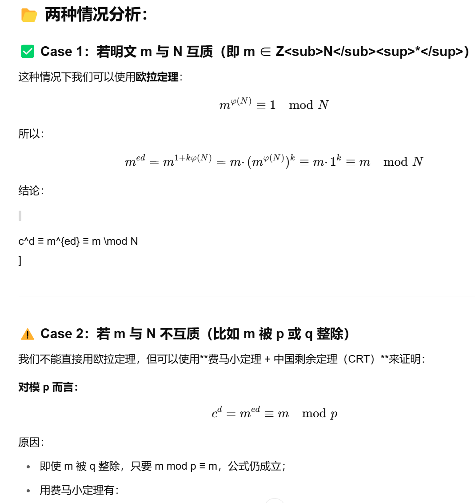

这是CS9150课程的一道期末题目，属于“Classical cryptography（经典密码学）”部分，下面是对题目的逐句翻译、解释、以及答题思路分析：

------

### 📘 **题目原文翻译**

> **1.1** A substitution cipher works by randomly substituting letters based on using a permutation vector as the key.
>  替换密码（Substitution cipher）通过使用一个**排列向量（permutation vector）**作为密钥，随机替换字母来加密信息。

> What is the key size of a substitution cipher?
>  替换密码的密钥空间大小是多少？

> Elaborate how a substitution cipher can be broken without knowing the key.
>  请详细说明在不知道密钥的情况下，替换密码是如何被破解的。

> **[5 Marks]**

------

## ✅ **解题要点整理**

这是一个**5分题目**，考察两个核心内容：

------

### ✳️ 第一问：What is the key size of a substitution cipher?

#### ✔️ 答案逻辑：

- 替换密码对26个字母进行重新排列。

- 所有可能的排列数是：

  26!（26的阶乘）26! \quad（26的阶乘）

- 这是**密钥空间（key space）**的大小，意味着密钥的数量是：

  26!≈4×102626! ≈ 4 \times 10^{26}

  非常大，无法通过**穷举**暴力破解。

#### 📝 可写参考句式：

> The key size of a substitution cipher is **26!** (factorial of 26), because each letter in the alphabet is mapped to a unique other letter, and there are 26! possible permutations of the 26 letters.

------

### ✳️ 第二问：How can a substitution cipher be broken without knowing the key?

#### ✔️ 解法关键：

使用**频率分析法（Frequency Analysis）**：

- 英文中不同字母出现频率不同，比如：
  - E, T, A, O 是最常见的；
  - Q, Z, X 是最少见的。
- 如果有足够长的密文，可以统计其中每个字母出现的频率，与英语常见频率分布做匹配，从而**推测替换关系**。
- 此方法是对“单表替换密码（monoalphabetic substitution cipher）”特别有效。

#### 📝 可写参考句式：

> A substitution cipher can be broken using **frequency analysis**. In English, letters such as **E, T, and A** appear more frequently. By comparing the frequency distribution of letters in the ciphertext with typical English letter frequencies, an attacker can deduce probable mappings between cipher letters and plaintext letters.

------

## 🧠 **完整参考答案（可直接背诵）**

> The key size of a substitution cipher is **26!**, which is the number of all possible permutations of the 26 letters in the English alphabet.
>
> Despite the large key space, a substitution cipher can be broken using **frequency analysis**. This technique involves analyzing the frequency of letters in the ciphertext and comparing it with known letter frequencies in English. For example, if a letter appears most frequently in the ciphertext, it might correspond to 'E', the most common letter in English. With enough ciphertext, an attacker can reconstruct the substitution pattern and recover the plaintext without knowing the key.

------

如果你还不熟悉频率表或者想练练这类题目，我可以提供一个练习工具或小练习。需要吗？


这是一个关于 **Vigenère cipher** 的考试题，要求你使用 **Kasiski 检验法（Kasiski Test）** 来猜测密钥长度，并说明理由。

------

## ✅ 题目简析

你被给出一段用 **Vigenère 密码** 加密的密文：

```
KIOVIEEIGKIOVNURNVJNUVKHVMGZIA...
```

目标：**利用 Kasiski 检验法 猜测密钥长度**。

------

## ✅ Kasiski Test 是什么？

Kasiski Test 是一种破解 Vigenère 密码的方法，基本思路是：

> 找出密文中重复的字符串（通常是3个或更多字母的重复片段），记录它们之间的**间距**（即它们出现位置的距离），然后计算这些间距的 **最大公因数（GCD）**，从而猜测密钥长度。

------

## ✅ 步骤详解（根据题目给的密文）：

原文片段：

```
KIOVIEEIGKIOVNURNVJNUVKHVMGZIA...
```

### **Step 1: 找重复字符串**

观察密文：我们看到 `KIO` 出现了两次：

- 第一次出现的位置：索引 0
- 第二次出现的位置：索引 9

🔢 距离（间隔）= 9 - 0 = **9**

### **Step 2: 看其他重复**

再看 `UV` 也重复了：

- `UV` 出现在索引 20 和 24
- 间距 = 24 - 20 = **4**

但这种重复很短，Kasiski 更偏好 3 字母以上重复。

再看 `VIE` 和 `JNU` 出现频次较低，忽略。

所以我们只用可靠的 **"KIO" -> 间距 9**。

------

### **Step 3: 推测密钥长度**

Kasiski 检验的核心是：**重复串的间距 = 密钥长度的倍数**

因为加密是周期性的，密钥每隔 N 个字符重复一次。

所以：
 ➡️ 密钥长度是 **9 的因数**
 即可能的 key length 是：

```
{1, 3, **9**}
```

------

## ✅ 答案格式参考（适合考试答题）

### ✅ Sample Answer (5 Marks)

**Step 1**: I observed that the 3-letter sequence `KIO` appears twice in the ciphertext. The first occurrence starts at position 0, and the second at position 9.

**Step 2**: The distance between the repeated sequences is 9 characters.

**Step 3**: According to the Kasiski test, the key length is likely a factor of this distance. The factors of 9 are 1, 3, and 9.

**Step 4**: Therefore, the likely key lengths are **1, 3, or 9**, with **3 or 9** being the more probable since a key length of 1 would make it a Caesar cipher.

**Conclusion**: The most likely key lengths are **3 or 9**, based on repeated segments and their spacing (Kasiski method).

------

## 🧠 附加提示（如果问你进一步验证）

你可以用 **Index of Coincidence (IC)** 或 **频率分析** 对不同 key 长度分段尝试破译。

------

如果你想要我带你手动解出这个密文、还原出 key 或明文，我也可以继续带你做，继续吗？

### ✅ 所在 PPT：

📄 **第 3 个 PPT**：

> **文件名**：`3 crypto_-_classical.pdf`

## 26页


这张图详细解释了 **Vigenère cipher（维吉尼亚密码）** 是如何工作的，我们一起来逐行拆解：

------

## ✅ 1. 什么是 Vigenère cipher？

> 一种 **多表代换加密（polyalphabetic substitution cipher）**，通过使用多个不同的 Caesar 密码循环叠加实现更强的加密效果。

------

## ✅ 2. 图中变量解释：

| 符号 | 含义                              |
| ---- | --------------------------------- |
| `k`  | 密钥（Key）重复扩展以匹配明文长度 |
| `m`  | 明文（Message）要加密的原始内容   |
| `c`  | 密文（Ciphertext）加密后的结果    |

------

## ✅ 3. 加密方式（图中公式）：


------

## ✅ 4. 图解说明

### 原始内容（按字母对齐）：

| 位置          | 1    | 2    | 3    | 4    | 5    | 6    | ...      |
| ------------- | ---- | ---- | ---- | ---- | ---- | ---- | -------- |
| **k**（密钥） | A    | B    | C    | A    | B    | C    | 重复循环 |
| **m**（明文） | B    | E    | R    | E    | A    | D    | ...      |
| **c**（密文） | B    | F    | T    | E    | F    | Y    | ...      |

------

## ✅ 示例：手算前三组加密过程

### 第1个字母：

- 明文 `B` → 数字 1
- 密钥 `A` → 数字 0
- 加密后 = (1 + 0) mod 26 = 1 → 密文 `B`

### 第2个字母：

- 明文 `E` → 4
- 密钥 `B` → 1
- 加密后 = (4 + 1) mod 26 = 5 → 密文 `F`

### 第3个字母：

- 明文 `R` → 17
- 密钥 `C` → 2
- 加密后 = (17 + 2) mod 26 = 19 → 密文 `T`

如此类推。

------

## ✅ 加密流程总结：

1. 将密钥循环使用（对齐明文长度）
2. 把字符转换为数字（A=0, B=1,...）
3. 每一对字母加和取模 26
4. 把结果转换回字母 → 得到密文

------

## ✅ 为什么 Vigenère 比 Caesar 更强？

- Caesar 只用一个固定偏移（单字母密钥），容易被频率分析破解
- Vigenère 使用多个字母密钥，对同一个字母加密结果不同 → **打破字母频率规律**
- 但仍可被 **Kasiski Test** 和 **Friedman Test** 破解

------

如果你希望我演示一组自己加密一段内容，或者帮你做反向解密（暴力还原 key），可以继续问我 😎


这张幻灯片是对 **Vigenère cipher 的破解（cryptanalysis）方法** 的总结，指出了两大核心步骤：

------

## 🔍 标题：Cryptanalysis of Vigenère Cipher

（**维吉尼亚密码的密码分析**）

### 👉 Cryptanalysis = 破解密码，不知道密钥的情况下还原明文。

------

## ✅ 两个主要步骤详解：

### ### 1️⃣ Find out the key length `m`

**找出密钥的长度（key length）**

这是破解 Vigenère 密码的**第一步**，如果你能确定密钥是几个字母的，那么你就可以把整个密文**分成 m 个 Caesar 密文来单独破解**。

#### ✨ 方法包括：

- **Kasiski Test**（重复子串 + 距离 → 公因数）✔️
- **Friedman Test**（统计字母重合度，Index of Coincidence）📊

举例：如果你发现密文中出现 `KIO...KIO`，间隔为 9，则可能密钥长度是 3 或 9。

------

### ### 2️⃣ Find out each letter in the key

**找出密钥的每一个字母**

确定密钥长度 `m` 后，就可以将密文分为 m 组，每组都是用同一个 Caesar 加密：

- 比如 key 长度是 3，就把密文分为第 1、4、7、10... 为第 1 组
- 然后对每组做**频率分析**，破解出该组用的 Caesar 密钥（即 key 中的某一位）

#### ✨ 技术手段：

- 英文中 `E` 出现频率最高 → 推测出 Caesar 偏移
- 多组组合起来，还原出整个 key，比如 `B E C O D E`

------

## ✅ 小结（适合答题时写）

维吉尼亚密码破解的基本思路是两步：

1. **确定密钥长度**：利用 Kasiski 或 Friedman 检验，通过统计分析或重复子串推测 key 长度。
2. **确定每个密钥字母**：将密文分组，每组视为一个 Caesar 密码，用频率分析等方法逐个破译出 key。

------

如果你愿意，我可以教你如何手动从一个实际例子里推测 key，比如用 Python 帮你模拟这两个过程，要试试吗？


这张幻灯片讲的是：

# ✅ 如何找出 Vigenère 密码的密钥长度？

**使用的方法是：Kasiski 检验法（Kasiski Test）**

------

## 🧠 背景知识：

Vigenère 密码的破解，第一步是**找出密钥长度 `m`**。
 Kasiski 检验是一种历史悠久的方法，发明于 1863 年。

------

## ✅ 幻灯片内容逐条解释：

### 🔸 标题：How to find out the key length?

➡️ **如何找出密钥长度？**

------

### 🔹 First method: **Kasiski Test**

- **发明者**：Friedrich Kasiski
- **核心思想**：找出密文中**重复的字符串片段**，比如相同的三连字母（如 `ABC` 出现多次），并计算它们之间的**距离（位置间隔）**

------

### 🔹 举例说明：

密文片段示例（人为简化的例子）：

```
ABCDEABCDE...ABCDE...ABCDE
     ^          ^         ^  
```

假设 `ABCDE` 这个重复字符串出现了几次，它们之间的**间距**是 15 个字符。

------

### 🔹 关键推理：

**出现间距是 15** → 推测密钥长度是 15 的因子：

可能的 key 长度=因数(15)=1,3,5,15\text{可能的 key 长度} = \text{因数(15)} = 1, 3, 5, 15

通常会排除掉太小的（如 1），所以最有可能的 key 长度是 **3 或 5**。

> 因为 Vigenère 密码是按密钥长度 **周期性** 加密的，
>  如果两个明文片段间隔正好是密钥的整数倍，它们就会被 **同一密钥片段加密**，
>  所以它们加密后会得到 **相同的密文片段**，从而出现在密文中重复。

------

## ✅ 结论总结：

Kasiski 方法步骤如下：

1. **找到密文中重复的子串（≥3 个字母）**
2. **记录这些子串之间的间距**
3. **对多个间距取最大公因数（GCD）**
4. **所有 GCD 的因子都是可能的 key 长度**

------

## ✅ 应用示例参考你前面的题目：

比如你看到 `KIO` 在密文中重复出现两次，间距是 9 →
 可能的 key 长度 = 因数(9) = **1, 3, 9**

------

如你想，我可以带你完整做一个 Kasiski 破解例题（含找子串 + GCD 推导），是否继续？


这张幻灯片讲的是破解 Vigenère 密码的第二种方法：

# ✅ **Friedman Test**（基于 Index of Coincidence）

------

## 🔍 标题：How to find out the key length?

### 第二种方法：Index of Coincidence（重合指数）

------

## ✅ 幻灯片内容逐行解释：

### 🔹 **Second method: index of coincidence**

➡️ 第二种方法叫做 **重合指数（Index of Coincidence，简称 IC）**

------

### 🔸 Described by William Friedman in 1920

➡️ 这个方法是密码学家 William Friedman 在 1920 年提出的。
 他也是现代密码分析（cryptanalysis）的先驱之一。

------

### 🔸 Suppose x = x₁x₂...xₙ is a string of n alphabetic characters.

➡️ 假设你有一个由 n 个英文字母组成的字符串 `x`，也就是你的密文。

------

### 🔸 The Index of Coincidence of x is defined to be the probability that two random elements of x are identical.

➡️ **重合指数 IC**：
 是从字符串中**随机抽两个字母**，这两个字母是**一样的**的概率。

------

## ✅ 这个值有什么用？为什么能用来猜 key 长度？

| 场景               | IC 值大小（大致） | 说明                                                       |
| ------------------ | ----------------- | ---------------------------------------------------------- |
| **英语自然文本**   | ≈ 0.065           | 频率分布不均（E 最常见等）                                 |
| **完全随机字符串** | ≈ 0.038           | 所有字母等概率                                             |
| **Vigenère 密文**  | 介于两者之间      | 如果猜对 key 长度，就能还原每一组为 Caesar 密码，IC 会变大 |

------

## ✅ 用法总结：

1. **尝试不同的 key length（m）**
2. 将密文分成 m 个组（每组隔 m 个字母）
3. 分别计算每组的 IC 值
4. 如果某个 m 的平均 IC 接近 0.065 → 说明这个 m 很可能是 key 的长度！

------

## ✅ 举个例子说明：

假设密文为：

```
CIPHERTEXTENCRYPTEDWITHVIGENERE
```

你试 key length = 3，把密文分成：

- 组1：第1、第4、第7… （→ Caesar 1）
- 组2：第2、第5、第8… （→ Caesar 2）
- 组3：第3、第6、第9… （→ Caesar 3）

然后分别计算 IC：

- 如果这些组的 IC 都接近英文自然 IC（~0.065），说明你猜的 key length 是对的！

------

## ✅ 小结：

**Index of Coincidence 是用于猜 key 长度的统计工具**，它通过概率分析判断一个字符串是否像“自然语言”。
 当你用正确的 key 长度分组，组内看起来就像英文，这时 IC 就会接近 0.065。

------

如果你想，我可以现场用 Python 给你算一个密文的 IC 值、图示出不同 key length 的可能性图（frequency analysis），是否继续？


这张幻灯片详细讲解了如何计算 **Index of Coincidence（IC，重合指数）**，是密码分析中非常关键的数学工具。下面我们逐行来解释：

------

## 📌 标题：**Index of Coincidence**

------

## ✅ 概念说明：

### 🔹 **Suppose a string of n English letters**

假设你有一个长度为 `n` 的英文字符串 `x`（比如密文）

------

### 🔹 **Occurrence of A = f₀**

表示字母 **A** 在这个字符串中出现了 `f₀` 次

### 🔹 **Occurrence of B = f₁**

表示字母 **B** 出现了 `f₁` 次

...

### 🔹 **Occurrence of Z = f₂₅**

表示字母 **Z** 出现了 `f₂₅` 次

------

## ✅ 什么是 Index of Coincidence？

> 是在字符串中**随机选两个字符，它们是一样的概率**。

------

- 

------

## ✅ 常见的 IC 值：

| 字符串类型    | 典型 IC 值   | 说明                             |
| ------------- | ------------ | -------------------------------- |
| 英文正常句子  | ~0.065       | 出现频率不平均，E/T/A 多         |
| 随机字符串    | ~0.038       | 字母分布均匀                     |
| Vigenère 密文 | 介于两者之间 | 越长密钥越随机，越短密钥越偏英文 |

------

## 🧠 用途回顾：

如果你尝试用不同 key length 去切分 Vigenère 密文：

- 如果用对了 key 长度，每组子串就是 Caesar 密文，接近英文 → **IC ≈ 0.065**
- 如果猜错，组内字母分布偏随机 → **IC ≈ 0.038**

------

## ✅ 总结：

1. IC 衡量的是字符串中字母的集中程度
2. 用于识别 **Vigenère 密文的 key 长度**
3. 计算方法就是：看每个字母出现次数，计算重复概率

------

如果你想，我可以用一段真实密文，带你手动算一次 IC 或画出不同 key length 下的 IC 曲线图，帮你更直观理解。要试试看吗？


这张幻灯片是在总结 **不同类型文本的 Index of Coincidence（IC） 的差异**，用来解释 **为什么可以通过 IC 判断密钥长度**，是 Friedman 分析法的核心依据。

------

## ✅ 标题：Difference in index of coincidence

**各种字符串的 IC 值对比**

------

## 🧠 背景回顾：

IC 是指：**从字符串中随机抽两个字母，这两个字母一样的概率**

------

下面我们解释四种类型的文本和它们的 IC 值：

------

### 🔹 1. **Normal English text（正常英文）**

- 字母出现频率差别很大（E/T/A 很多，Q/Z 很少）
- 所以有更高的“重复字母”概率
- **IC ≈ 0.065**

------

### 🔹 2. **Completely random string of letters（完全随机）**

- 每个字母都是平均出现，像密码随机生成一样
- 所以重复概率更低
- **IC ≈ 0.038**

------

### 🔹 3. **Normal English text shifted by a fixed number（凯撒密码）**

- 这就是 **Caesar cipher** 加密后的结果（每个字母偏移固定数）
- 字母频率分布完全没有改变，只是被“换了名字”
- 所以和原文一样，IC 不变
- **IC ≈ 0.065**

------

### 🔹 4. **English text encrypted by Vigenère cipher**

- Vigenère 是多个 Caesar 密码轮流使用（poly-alphabetic）
- 随着密钥长度变大，分布逐渐变得更平均，更随机
- 所以：**IC 介于 0.038 ~ 0.065 之间**

**IC 值范围判断如下：**

| Key Length | 密文越像英文 → IC 越高                |
| ---------- | ------------------------------------- |
| Key 短     | 字母规律性强 → **IC ↑**（接近 0.065） |
| Key 长     | 字母接近随机 → **IC ↓**（接近 0.038） |

------

## ✅ 用法总结：

通过计算密文的 IC：

- 如果 IC 接近 **0.065** → 很可能是英文或 Caesar 密文
- 如果 IC 接近 **0.038** → 很可能是随机或 Vigenère 密钥很长
- 如果你用某个 key length 把密文分组，每组 IC 都 ≈ 0.065
   → **猜对了 key length！**

------

## ✅ 填空答案（最后一项）：

> **English text encrypted by Vigenère cipher**
>  IC ≈ **0.038 ~ 0.065**
>  （一般在 0.045 ~ 0.055 之间）

------

需要我举例演示用 IC 猜 key length 的 Python 脚本吗？或者你想练习一道例题？


这是一道典型的关于 **Index of Coincidence (IC)** 的简答题，考查你对其**定义和应用方法的理解**。

------

## ✅ 中文翻译 + 题意说明：

**题目内容：**

> 1.3 另一种猜测密钥长度的方法是通过计算重合指数（Index of Coincidence）。请简要说明：
>
> 1. 什么是 IC；
> 2. 如何通过 IC 来判断密钥长度。
>
> 提示：随机字母的 IC ≈ 0.038，英语文本的 IC ≈ 0.065。
>  【10分】

------

## ✅ 解题结构（写作建议，逻辑清晰可拿满分）：

------

### **第一部分：解释什么是 Index of Coincidence**（4 分）

> The Index of Coincidence (IC) is a statistical measure that estimates the probability that two randomly selected letters from a string are identical.
>
> It is calculated using the formula:

IC = \frac{\sum_{i=0}^{25} f_i(f_i - 1)}{n(n - 1)}
 ]

> where fif_i is the number of times letter ii appears and nn is the total number of letters.

➡️ 中文：重合指数是指从一个字符串中随机抽两个字符，它们是**相同字母**的概率。
 ➡️ 如果字母频率不均匀（如英文文本），IC 值就会偏大。

------

### **第二部分：如何利用 IC 猜密钥长度**（6 分）

> To determine the key length in a Vigenère cipher using IC:
>
> 1. Guess a potential key length mm.
> 2. Divide the ciphertext into mm groups, each containing every mm-th letter.
> 3. Compute the IC of each group.
> 4. If the average IC is close to **0.065**, then this mm is likely the correct key length.
> 5. If the IC is close to **0.038**, it likely indicates random distribution — try another key length.

➡️ 中文思路总结：

1. 假设密钥长度为 m
2. 把密文每 m 个一组分成 m 个子序列
3. 每个子序列都像是一个 Caesar 密码（固定偏移）
4. 分别计算这 m 个序列的 IC，求平均
5. 如果平均值接近 0.065 → 猜对了 key 长度
    如果接近 0.038 → key 长度猜错了，要换别的

------

## ✅ 样板答案（英文写法建议）：

> The Index of Coincidence (IC) measures the likelihood that two randomly selected letters from a text are the same. In English text, where letter frequencies vary (e.g., E is most common), the IC is about 0.065. In completely random text, the IC is about 0.038.
>
> To determine the key length of a Vigenère cipher using IC, one assumes a possible key length mm, then divides the ciphertext into mm groups, each taking every mm-th character. The IC of each group is calculated. If the average IC is close to 0.065, it indicates each group resembles English text encrypted by Caesar cipher, and the key length is likely correct. Otherwise, try another value of mm.

------

如你需要，我也可以：

- 帮你直接写一份中文版本
- 帮你写成 Markdown/Word 结构
- 或者用 Python 工具演示一个 IC 实际计算过程

需要的话请告诉我 😄


这是一个关于 **Vigenère 密码破译**中第二阶段的问题：
 **你已经知道了密钥长度，下一步如何推导出密钥本身？**

------

## ✅ 中文翻译：

**1.4** 假设你已经通过 index of coincidence 方法正确找到了密钥长度。
 请解释你接下来如何推导出密钥。
 【5 分】

------

## ✅ 回答结构（适合考试写作）：

------

### 🌟 前提：你知道密钥长度是 m

那么可以把密文分成 m 个子序列，每个子序列都是一个**Caesar 密码（凯撒密码）**加密的。

------

### ✅ 解题步骤（英文 + 中文解释）：

> 1. Divide the ciphertext into mm separate groups, each containing letters encrypted with the same Caesar shift.
>     ➤ 将密文按密钥长度 mm 分成 m 个组，例如每第 ii 个字母归为第 ii 组。

> 1. For each group, perform **frequency analysis** to identify the Caesar shift used.
>     ➤ 对每组分别做**字母频率分析**，找出最常出现的字母（比如 ‘E’ 是英文中最常见的），推测它是由哪个明文字母加密而来。

> 1. Calculate the Caesar shift by comparing the observed most frequent letter with the expected one (typically 'E' in English).
>     ➤ 例如这一组中 'B' 最常见，你可以猜它是 'E' 被加密而来 → Caesar shift 是 23（因为 E→B 是 -3 mod 26）

> 1. This Caesar shift corresponds to the key letter used for that group.
>     ➤ 把每组的 Caesar shift 转换为密钥字母（0→A，1→B，...）

> 1. Repeat this process for all mm groups to get the full key.
>     ➤ 最终你得到了完整的密钥，如 "LEMON"。

------

## ✅ 总结（一句话精炼）：

> By treating each group as a Caesar cipher and using frequency analysis on each, we can recover each letter of the Vigenère key.

------

## ✅ 样板英文答案（考试可用）：

> Once the key length mm is known, the ciphertext is divided into mm groups, each consisting of every mm-th letter. Each group corresponds to a Caesar cipher.
>
> By performing frequency analysis on each group, we estimate the shift by assuming the most frequent letter in each group corresponds to 'E' (the most common English letter).
>
> The shift reveals the key letter for that group. Repeating this for all mm groups gives the complete Vigenère key.

------

需要我帮你做一个频率分析的小例子（比如用 Python 做）吗？可以更直观理解怎么推导密钥。


这是一个关于 **公共密钥加密系统设计漏洞分析** 的题目。你需要识别 Bob 设计中 **4 个安全漏洞**，并解释**攻击者如何利用每个漏洞**。题目背景基于 **RSA 加密 和 HSM（硬件安全模块）**。

------

## ✅ 中文翻译：

> Bob 是一名软件工程师，他要为公司员工实现一个公钥加密系统。他使用 RSA 方案，并使用 HSM 做密钥管理。
>
> - 他在主机上生成 RSA 模数 n=p×qn = p \times q，并把素数 p,qp, q 保存在 HSM 中。
> - 然后他为每位员工在一台计算机上生成一对公私钥 (e,d)(e, d)，并通过公司内部网络分发私钥。

你的任务是：
 列出这个设计中的 **4 个安全漏洞**，并简要说明攻击者如何利用这些漏洞。
 【8 分 → 每个漏洞+攻击方式 = 2 分】

------

## ✅ 标准答案（共4点）：

------

### **漏洞 1：RSA密钥生成在不受保护的主机上**

- **问题**：在主机上生成模数 n=p×qn = p \times q，p 和 q 可能在内存中暂时暴露。
- **攻击方式**：攻击者可以通过恶意软件、缓存分析、内存转储等方式提取 p 和 q，进而**完全破解 RSA 私钥**。

------

### **漏洞 2：每个员工的私钥在同一台机器上生成**

- **问题**：集中生成所有员工的密钥意味着**单点失败（single point of failure）**。
- **攻击方式**：如果攻击者控制这台机器，就可以**获取所有员工的私钥**，从而**解密所有通信**。

------

### **漏洞 3：私钥通过公司内网分发**

- **问题**：私钥在网络中传输，即使在内网中也容易受到中间人攻击。

- **攻击方式**：攻击者可以通过 ARP 欺骗、网络嗅探等方式**拦截密钥分发数据包**，盗取私钥。

- > ### **ARP 欺骗（ARP Spoofing）**
  >
  > - **定义**：ARP 欺骗是一种网络攻击手段，攻击者伪装成网络中的合法设备，通过发送伪造的 ARP（地址解析协议）消息，将自己的 MAC 地址与目标设备的 IP 地址绑定，从而劫持网络流量。
  > - **攻击方式**：通过 ARP 欺骗，攻击者可以使得数据包通过其计算机进行中转，窃取或者修改传输的数据。例如，攻击者伪装成目标服务器或路由器，从而在数据传输过程中窃取私钥。
  >
  > ### **网络嗅探（Packet Sniffing）**
  >
  > - **定义**：网络嗅探是一种通过监听和捕获网络上未加密的通信数据包的技术，攻击者可以读取经过网络传输的敏感信息。
  > - **攻击方式**：攻击者使用嗅探工具（如 Wireshark）在网络中捕捉数据包，如果通信没有加密或加密弱，攻击者就可以获取包括私钥在内的敏感数据。这些信息可以被用于后续的攻击。
  >
  > 这两种攻击方式都可以通过监听或伪装通信路径来窃取敏感信息，特别是私钥，严重威胁网络安全。

------

### **漏洞 4：每个员工都有自己的 RSA 密钥对**

- **问题**：这使得**密钥管理成本非常高**，也会增加人为失误和密钥泄露的风险。
- **攻击方式**：攻击者只要攻击一个弱用户（例如密钥备份保存在不安全的地方），就可以**破坏整个系统信任链**。

------

## ✅ 总结模板（考试写作建议）：

| Weakness                                        | Explanation                        | How an attacker can exploit it                   |
| ----------------------------------------------- | ---------------------------------- | ------------------------------------------------ |
| 1. Key generation on insecure host              | p and q are exposed in RAM         | Malware or RAM dump to recover RSA private key   |
| 2. Centralized key generation for all employees | Single point of failure            | Compromise the machine to steal all private keys |
| 3. Private key distributed via internal network | Keys in transit can be intercepted | ARP spoofing or sniffing to steal keys           |
| 4. One RSA key pair per employee                | Too many keys to manage securely   | Attack weakest endpoint to compromise the system |

------

#  **PPT 文件名**: `18 crypto_-_public_key_encryption.pdf` 3页


这页讲的是 **公钥加密（Public Key Encryption）** 的基本原理，下面是详细解释：

------

### 📌 图解含义（配合下方文字）

- 左边是 **Alice（发送者）**，右边是 **Bob（接收者）**
- 加密函数 `E` 和解密函数 `D` 分别用于加密和解密
- `m` 是明文（message），`c` 是密文（ciphertext）
- `pk` 是公钥（public key），`sk` 是私钥（secret/private key）

------

### 🔐 加密流程说明

1. **Bob 生成密钥对**：

   - Bob 生成一对密钥：公钥 `PK` 和私钥 `SK`
   - 公钥 `PK` 是可以公开的，任何人都可以使用
   - 私钥 `SK` 是保密的，仅 Bob 自己拥有

2. **Bob 将公钥发给 Alice**：

   - Alice 收到 `PK` 后，就可以加密她想要发送给 Bob 的消息 `m`

3. **Alice 使用公钥加密消息**：

   - 她用公钥 `PK` 和加密算法 `E`，将消息 `m` 加密成密文 `c`

     ```
     c = E(PK, m)
     ```

4. **Bob 使用私钥解密密文**：

   - Bob 收到密文 `c` 后，使用私钥 `SK` 和解密算法 `D` 将其还原为原始消息 `m`：

     ```
     m = D(SK, c)
     ```

------

### ✅ 总结概念

| 角色  | 拥有的密钥 | 操作     | 结果         |
| ----- | ---------- | -------- | ------------ |
| Alice | 公钥 `PK`  | 加密消息 | 得到密文 `c` |
| Bob   | 私钥 `SK`  | 解密密文 | 得到原文 `m` |

------

### 📍核心思想

- 公钥加密的优势在于**即使攻击者拿到公钥，也无法轻易解密密文**
- **只有持有私钥的接收者 Bob 才能解密**，确保通信安全

需要我解释它和 RSA 的关系，或在考试里如何答这类题吗？


这页是对**公钥加密系统（Public Key Encryption System）**的形式化定义。我们逐行详细解释：

------

### 🔑 定义：一个公钥加密系统由三个算法组成：

#### 1. **G()** — 密钥生成算法（Key Generation）

- 是一个**随机算法（randomised algorithm）**
- 它会输出一对密钥：`(pk, sk)`
  - `pk`: 公钥（public key）
  - `sk`: 私钥（secret/private key）

✅ 这一步通常由接收者（如 Bob）来完成。

------

#### 2. **E(pk, m)** — 加密算法（Encryption）

- 是一个**随机算法**
- 输入：`pk`（公钥），`m`（明文）属于消息空间 `M`
- 输出：`c`（密文）属于密文空间 `C`

✅ 发送者（如 Alice）使用 `pk` 和明文 `m`，生成密文 `c`

------

#### 3. **D(sk, c)** — 解密算法（Decryption）

- 是一个确定性算法（不是随机的）
- 输入：`sk`（私钥），`c`（密文）属于 `C`
- 输出：`m`（明文）属于 `M`，或者 `⊥` 表示“解密失败”或“无效密文”

✅ 接收者（如 Bob）使用 `sk` 和收到的 `c`，恢复原始消息 `m`

------

### ✅ 一致性要求（Consistency）

这一部分是整个定义的核心，确保系统有效可用：

> 对所有通过 `G()` 生成的密钥对 `(pk, sk)`，以及所有可能的明文 `m ∈ M`，都应该有：
>
> ```
> D(sk, E(pk, m)) = m
> ```

也就是说：

- 先用公钥加密，再用私钥解密
- **一定能还原出原始明文 m**

------

### 🧠 总结（通俗理解）

| 步骤 | 作用     | 谁操作          | 用到的键   |
| ---- | -------- | --------------- | ---------- |
| G()  | 生成密钥 | 接收者（Bob）   | `(pk, sk)` |
| E()  | 加密消息 | 发送者（Alice） | 使用 `pk`  |
| D()  | 解密密文 | 接收者（Bob）   | 使用 `sk`  |

一致性是整个加密系统的**正确性保障**。

------

## **公钥不能用来解密**，其**安全性**确实**依赖于数学难题**，比如：

### 👉 在 **RSA 公钥加密** 中，安全性基于：

> **大数因式分解困难性问题（Integer Factorization Problem）**


这张幻灯片讲的是 **RSA 公钥加密算法** 的起源与应用。

------

## ✅ 逐行详细解释：

### **标题：RSA**

这是指 RSA 加密算法，全称是：

> **Rivest–Shamir–Adleman** 加密算法

------

### **Invented in 1977（1977年发明）**

RSA 是在 1977 年由三位学者提出的，是世界上第一个真正广泛使用的**非对称加密算法**（即公钥加密）。

------

### **By Ron Rivest, Adi Shamir, Leonard Adleman**

这三位 MIT 的科学家是 RSA 算法的发明人，他们用自己的姓氏首字母来命名算法：

- R = Rivest
- S = Shamir
- A = Adleman

右下角的照片就是这三位发明人。

------

### **The first widely used public key system**

意思是：**RSA 是第一个被广泛应用的公钥加密系统**，它改变了密码学的格局：

#### 它应用于：

- **SSL/TLS 协议**：用于网页加密传输（https）
  - TLS 1.2 和 TLS 1.3 都支持/兼容 RSA（虽然 TLS 1.3 更常用椭圆曲线加密）
- **Secure email and file systems**：如 PGP 加密邮件、加密硬盘等
- **many others**：比如数字签名、软件更新验证、安全登录、VPN 等

------

## 🧠 小总结：

| 内容     | 说明                                      |
| -------- | ----------------------------------------- |
| 算法名称 | RSA                                       |
| 发明人   | Ron Rivest、Adi Shamir、Leonard Adleman   |
| 发明时间 | 1977 年                                   |
| 属于     | 公钥加密 / 非对称加密                     |
| 应用场景 | SSL/TLS（网络安全）、加密邮件、数字签名等 |

RSA 的核心数学基础是：

> 使用两个大质数相乘得到一个大数 `n`，反过来从 `n` 推出那两个质数 `p, q` 是非常难的（即因式分解困难）
>  所以加密容易，解密必须掌握私钥

------

如需我用图示帮你补充整个 RSA 工作流程，我可以继续展开。


这张幻灯片用一个“锁和钥匙”的类比来解释 **公钥加密（Public Key Encryption）** 的核心思想，目的是让人们直观理解它的伟大之处。

------

## 🔐 标题：**How great was this invention?（这项发明有多伟大？）**

它试图表达：

> 公钥加密就像是一种颠覆常识的“神奇锁”，**用一把钥匙锁上，却只能用另一把钥匙解开**，而且**你无法从已知钥匙或锁推出另一把钥匙**。

------

### ✅ 逐条解释：

#### **1. One key to lock it, and \*another key\* to unlock it**

- 这代表：

  - **加密（锁）用公钥（Public Key）**
  - **解密（开锁）用私钥（Private Key）**

- 也就是说：

  > 加密和解密不是同一把钥匙，而是**一对密钥**，这个特性叫做：**非对称加密**

------

#### **2. Given the lock and one of the keys, \*you are unable to manufacture the second key\***

- 这就是公钥加密安全性的根基：

  - 即使你**知道了公钥**（或公开的加密方法）
  - 也**无法逆推出私钥**

- 数学上，这依赖于：

  - **大整数因式分解难题**（RSA）
  - 或 **离散对数问题**（如 ElGamal、ECC）

- 所以：

  > 拿到公钥就算你能加密，但**你无法反推出私钥，也就无法解密**

------

### 💡 总结（通俗类比）：

想象你设计了一个锁（加密算法），
 别人可以用你提供的钥匙（公钥）来**上锁**，
 但**只有你**有**那把私钥**能开锁，
 而他们**根本造不出另一把钥匙**来开这个锁——
 这就是**公钥加密的魔力**！

------

需要我把这类比延伸成图解或补充公式原理，也可以继续告诉我。


这张幻灯片解释了加密学中的一个核心概念：**单向函数（One-way function）**，它是现代加密系统（比如 Diffie-Hellman 协议 和 RSA）的基础。

------

## 🔑 标题：**One-way function（单向函数）**

一个单向函数具备两个特征：

1. **正向计算容易**（easy to compute）
2. **反向计算困难**（hard to invert）

------

- 

> 公式 `y = g^x mod p` 代表的是 **模幂运算**，具体含义如下：
>
> 1. **g**：这是一个固定的基数（通常为一个小的整数），在Diffie-Hellman协议中，`g` 是公开的，所有参与者都知道它。
> 2. **x**：这是一个秘密的整数，通常称为**私钥**。每个参与者都有一个私钥，`x` 是私钥的表示。
> 3. **p**：这是一个大素数，也通常是公开的。在Diffie-Hellman协议中，`p` 也是参与者之间共享的。
> 4. **y**：这是通过模幂运算得出的结果。`y` 是公开的，可以安全地传输给其他参与者。
>
> ### 公式的含义：
>
> - `g^x` 是指将基数 `g` 提升到 `x` 次方。
> - `mod p` 表示取该结果对 `p` 取模，即取余数。这个操作的目的是使得计算结果不会过于庞大，从而使计算可以在合理范围内进行。
> - 

1. 

------

### 💡 总结：

| 加密方案       | 正向操作            | 反向操作（困难之处）       |
| -------------- | ------------------- | -------------------------- |
| Diffie-Hellman | gxmod  pg^x \mod p  | 离散对数问题（求 xx）      |
| RSA            | n=p×qn = p \times q | 因式分解问题（求 p,qp, q） |

因此，**单向函数是加密安全的核心保障**：让加密过程简单，但解密只能靠特定密钥（而不是暴力反推）。

------

需要我用更生活化的例子解释单向函数，也可以告诉我！


这张图片介绍的是**扩展欧几里得算法（Extended Euclidean Algorithm）\**的一个\**特别应用场景**，也就是我们非常关注的情况：**两个数互质（最大公约数为1）时如何找到它们的乘法逆元**。

我来一步步详细解释：

------

### 📘 什么是扩展欧几里得算法？

这是一个算法，用来解决下列形式的等式：

```
sa + bt = gcd(a, b)
```

其中：

- `a` 和 `b` 是两个已知整数，
- `s` 和 `t` 是未知整数（我们要找的），
- `gcd(a, b)` 是 `a` 和 `b` 的最大公约数。

这个算法的强大之处在于：

> 它不仅能算出 `gcd(a, b)`，还能找出一组整数 `s` 和 `t`，使得 `sa + bt = gcd(a, b)` 成立。

------

### 🧩 图片中讲的“特别情况”是：

我们只关注 `gcd(a, b) = 1` 的情况，也就是：

```
a 和 b 互质（没有公共因子）
```

于是公式变成：

```
sa + bt = 1
```

------

### 🔁 这个公式是怎么来的？

- 因为 `gcd(a, b) = 1`，所以一定存在整数 `s` 和 `t` 使得：

  ```
  sa + bt = 1
  ```

- 把这个式子变一下：

  ```
  sa = 1 - bt
  ```

- 那么这就说明：

  ```
  sa ≡ 1 (mod b)
  ```

换句话说：**s 就是 a 的模 b 的乘法逆元**！

------

### ✅ 举个例子帮你理解：

设 `a = 3`，`b = 7`。我们希望找到整数 `s`，使得：

```
3 × s ≡ 1 mod 7
```

用扩展欧几里得算法可以求得：

```
s = 5，因为 3 × 5 = 15，15 mod 7 = 1
```

------

### 📌 这个有什么用？

这个运算广泛应用在密码学中，比如：

- **RSA 算法**里，需要求 `d = e⁻¹ mod φ(N)`，就是求 `e` 在模 `φ(N)` 下的逆元；
- 还有在 **模线性方程求解**、**椭圆曲线密码** 等中也都用到了扩展欧几里得算法。

------

### ✅ 总结：

| 术语                   | 含义                                                         |
| ---------------------- | ------------------------------------------------------------ |
| `sa + bt = 1`          | 说明 a 和 b 是互质的                                         |
| `sa ≡ 1 mod b`         | 说明 `s` 是 `a` 在模 `b` 下的乘法逆元                        |
| 扩展欧几里得算法的作用 | 不仅能求最大公约数，还能找出 `s` 和 `t` 使得这个等式成立，从而找出乘法逆元 |

------

如果你想看这个算法的**计算过程实例**，我也可以一步步演算给你看！是否要我演示一个完整例子？


这张图片解释了如何**计算模 N 下某个整数 a 的乘法逆元**（也称模反元素），其内容如下：

------

### ✅ 中文翻译与详细解释：

#### 📌 问题定义：

我们给定一个整数 `a` 和一个模数 `N`，**要求 a 与 N 互质**（即 `gcd(a, N) = 1`），我们想求出一个整数 `a⁻¹`，使得：

>   **a × a⁻¹ ≡ 1 mod N**

也就是说，`a⁻¹` 是 `a` 在模 `N` 意义下的乘法逆元。

------

#### 📌 如何计算？（提示）

我们可以使用 **扩展欧几里得算法（Extended Euclidean Algorithm）** 来求解。

扩展欧几里得算法不只是求最大公约数 `gcd(a, N)`，它还会找出一组整数 `s` 和 `t`，满足这个等式：

>   **s × a + t × N = gcd(a, N)**

如果 `a` 与 `N` 互质，那么 `gcd(a, N) = 1`，代入可得：

>   **s × a + t × N = 1**

我们可以对这个等式两边同时取模 `N`，因为 `t × N ≡ 0 mod N`，所以：

>   **s × a ≡ 1 mod N**

这正是我们想要的逆元定义式！所以，**`s` 就是 a 在模 N 下的逆元 a⁻¹**。

------

### 🧠 举个例子：

设 `a = 3`，`N = 7`，我们求 `3⁻¹ mod 7`：

1. 由于 `gcd(3, 7) = 1`，满足互质条件；
2. 使用扩展欧几里得算法，我们可以得到：
     `1 = 5 × 3 + (-2) × 7`；
3. 所以：`5 × 3 ≡ 1 mod 7`，即：
     **3⁻¹ ≡ 5 mod 7**

------

### ✅ 总结：

- **逆元的本质**是解出 `a × x ≡ 1 mod N` 中的 `x`；
- 使用扩展欧几里得算法可有效求出 `s`，使得 `s × a + t × N = 1`；
- 那么这个 `s` 即为 `a` 的模逆元 `a⁻¹`（模 `N`）。

如需我手动演示一次扩展欧几里得算法的过程，请告诉我数值，我可以一步步展示！


这张幻灯片总结了**合数模运算（arithmetic mod composites）**中的一些重要概念，特别是在 RSA 和数论中非常关键。下面是详细的中文解释：

------

## ✅ 幻灯片标题：

**Summary: arithmetic mod composites**
 **合数模下的算术运算总结**

------

## 📌 第一行：

**Let N = p × q where p, q are primes**
 令 N = p × q，其中 p 和 q 是质数。

> 这对应于 RSA 加密中最关键的一步：构造一个由两个质数乘积构成的模数 N。

------

## 📌 第二行：

**ZN = {0, 1, 2, ..., N−1}**

> 表示模 N 意义下的整数集合，也称为模环（ring），包含从 0 到 N−1 的所有整数。

------

## 📌 第三行：

**ZN\* = {invertible elements in ZN}**

> 表示模 N 意义下的**可逆元素集合**，也就是所有与 N 互质的整数的集合。

例如：如果 N = 15，Z15* = {1, 2, 4, 7, 8, 11, 13, 14}（这些数和 15 的最大公约数都是 1）。

------

## 📌 Facts: （事实/定理）

### (1) x ∈ ZN is invertible ⟺ gcd(x, N) = 1

> 一个整数 x 在模 N 下可逆，当且仅当 **x 与 N 互质**。也就是说：

- 若 `gcd(x, N) = 1`，则存在 x−1，使得：

  >   x × x⁻¹ ≡ 1 mod N

------

### (2) Number of elements in ZN* is φ(N) = (p−1)(q−1)

> 在 ZN 中，满足与 N 互质的数的个数，就是欧拉函数 φ(N)。

- 若 N = p × q（p 和 q 是不同质数），那么：

  >   φ(N) = (p−1)(q−1)

这个 φ(N) 在 RSA 中非常重要，因为私钥 `d` 是基于 `e⁻¹ mod φ(N)` 计算的。

------

## 📌 Euler’s Theorem（欧拉定理）：

**对于所有 a ∈ ZN\*：aφ(N) ≡ 1 mod N**

> 欧拉定理说明了：只要 a 与 N 互质，则：

- a 的 φ(N) 次方在模 N 下恒等于 1。
- 

------

## ✅ 总结一下整张图的核心意思：

1. **模 N 可逆元素**必须与 N 互质（即 `gcd(x, N) = 1`）；
2. **可逆元素的数量**是欧拉函数 φ(N)；
3. **欧拉定理**是 RSA 安全性的数学基础之一，它保证了模逆元存在性及 RSA 加解密的正确性。

------

如你需要，我可以继续结合这些知识解释 RSA 的整个加解密流程，或者演示如何用欧拉定理和扩展欧几里得算法构造密钥。需要吗？


这张幻灯片介绍的是**中国剩余定理（Chinese Remainder Theorem，简称 CRT）**，它是数论中非常重要的一条定理，广泛应用于密码学（如RSA解密加速）、模运算计算等领域。

下面我来进行逐条中文详细讲解：

------

## 🧠 中国剩余定理的本质：

> 中国剩余定理解决的问题是：
>  **如何求解一组模数互素的线性同余方程组的通解？**

------

### 🔢 左边公式部分解释：

这是一组模方程：

```
x ≡ a₁ (mod m₁)      比如 x ≡ 2 mod 3  
x ≡ a₂ (mod m₂)      比如 x ≡ 3 mod 5  
...  
x ≡ aᵣ (mod mᵣ)      比如 x ≡ 2 mod 7
```

这些模数 `m₁, m₂, ..., mᵣ` 都是**两两互素**（即 `gcd(mᵢ, mⱼ) = 1`，对于任意 i ≠ j）。

------

### ✅ 中国剩余定理的结论：

> 对于这组同余方程，如果模数之间互素，就一定存在一个唯一的解 `x`，满足这些式子，且这个解在模 `M = m₁ × m₂ × ... × mᵣ` 意义下是**唯一的**。

------

### 📌 举个例子来说明：

给定：

```
x ≡ 2 mod 3  
x ≡ 3 mod 5  
x ≡ 2 mod 7  
```

我们想找出一个满足这三条条件的最小正整数 `x`。

根据中国剩余定理，**一定存在唯一解（mod 105）**（因为 3×5×7=105），即：

```
x ≡ 23 mod 105 ✅
```

也就是说，`x = 23` 同时满足：

- 23 ≡ 2 mod 3
- 23 ≡ 3 mod 5
- 23 ≡ 2 mod 7

------

### 🔁 通解（general solution）

幻灯片中写了：

> One possible solution: x = 23
>  General solution is: x = 23 + 105k （k ∈ ℤ）

即：所有解的形式都是：

> **x ≡ 23 mod 105**

------

### 📦 右边灰框解释：

它说明了一个特别情况（也常出现在 RSA 中）：

- x ≡ a mod p
- x ≡ a mod q

那么就有 x ≡ a mod pq （因为 p, q 互素）

这个原理用在 **RSA 加速解密算法** 中（CRT-RSA），把模 N（p×q）的运算分解成模 p 和模 q 两个小模数的计算，提高效率。

------

## 🔑 总结核心内容：

| 内容            | 中文解释                                    |
| --------------- | ------------------------------------------- |
| `x ≡ aᵢ mod mᵢ` | 一组同余方程，模数互素                      |
| 条件            | 所有 `mᵢ` 两两互素                          |
| 保证            | 存在唯一解 `x`（在 mod M 下）               |
| 解的形式        | **x = 某个特解 + M × k**，即 `x ≡ 解 mod M` |
| 用途            | 模运算解法优化、RSA 解密加速、并行计算等    |

------

如你愿意，我可以用一步步手算的方式带你用中国剩余定理手动解上面的例子：
 x ≡ 2 mod 3
 x ≡ 3 mod 5
 x ≡ 2 mod 7

你需要吗？


这张图展示的是 **RSA 密钥生成（RSA Key Generation）** 的完整流程，是学习非对称加密算法（如 RSA）的基础部分。下面我将逐行进行详细中文解释：

------

## 🔐 标题：RSA Key Generation

这部分讲的是如何根据密钥长度 `n` 来生成一对 RSA 密钥：**公钥 (public key)** 和 **私钥 (secret key)**。

------

## 📥 Input（输入）：key length `n`

- 表示你想要的密钥长度（比如 1024 位、2048 位）。
- 输入形式是 `1ⁿ`，这是理论计算复杂度中的标准符号。

------

## 📐 密钥生成步骤详解：

### ✅ Step 1：生成两个大的不相等的素数 p 和 q

**Generate two large n-bit distinct primes p and q**

- 使用素性测试（如图右注释：**Miller-Rabin 素性测试**）来判断生成的数是否为素数；
- **p ≠ q** 是为了安全性，避免攻击者只需要分解一个平方因子；
- p 和 q 是保密的，不会直接公开。

------

### ✅ Step 2：计算模数 N 以及欧拉函数 φ(N)

**Compute N = p · q 和 φ(N) = (p−1)(q−1)**

- `N = p × q` 是 RSA 的核心模数，**既是加密也用于解密的“运算空间”**；
- φ(N) 是 Euler’s totient function，用于后续计算逆元；
- 在 N 被公开的前提下，φ(N) 的具体值只有知道 p 和 q 才能算出来。

------

### ✅ Step 3：选择公钥指数 e

**Choose a random integer e，要求 gcd(e, φ(N)) = 1**

- `e` 必须和 φ(N) 互质，才能有逆元；
- 常见的选择是 `e = 65537`，它是一个常用的素数，计算高效且安全；
- `e` 是**公开的**，将作为加密指数。

------

### ✅ Step 4：计算 e 的模逆元 d

**Compute d: d · e ≡ 1 mod φ(N)**

- 使用扩展欧几里得算法来求逆元；

- `d` 是私钥指数，满足：

  >   **d × e ≡ 1 mod φ(N)**
  >  也就是说，**d 是 e 在 φ(N) 下的乘法逆元**；

- `d` 是**私密的**，只能由合法接收者使用。

------

## 📤 Output（输出）：

- **公钥 pk = (N, e)**
  - `N`：模数
  - `e`：加密指数
  - 用于加密数据，对所有人公开
- **私钥 sk = (N, d)**
  - `N`：模数（同样）
  - `d`：解密指数
  - 用于解密数据，必须保密

------

## 🔑 RSA 加密解密关系：

- 加密：  **C = M^e mod N**（公钥加密）
- 解密：  **M = C^d mod N**（私钥解密）

只要保证 d × e ≡ 1 mod φ(N)，加密和解密就能互为逆过程。

------

## ✅ 总结一句话：

> 这张图描述了 RSA 密钥生成的完整过程：
>  从选取两个大素数 p、q 开始，通过计算 N 和 φ(N)，选择公钥 e，计算私钥 d，
>  最终生成一对密钥 (N, e)、(N, d)，供加密与解密使用。

------

如果你需要，我可以演示一个小规模 RSA 密钥的完整计算流程，包括如何选 p, q, 算 N、φ(N)、e 和 d。需要吗？


这张图讲解的是**“教科书版本（Textbook RSA）”的加密与解密流程**，是最基础、最原始的 RSA 加密方法。我们下面逐行进行详细中文解释：

------

## 🧠 核心目的：

RSA 是一种**非对称加密算法**，即使用一对密钥：

- **公钥（public key）**：加密用
- **私钥（secret key）**：解密用

------

## 🔐 KeyGen：密钥生成

>  **pk = (N, e)**：公钥，包含模数 `N` 和加密指数 `e`
>  **sk = (N, d)**：私钥，包含模数 `N` 和解密指数 `d`

这些来自前一张幻灯片的密钥生成过程，其中：

- `N = p × q`（两个大素数的乘积）
- `φ(N) = (p–1)(q–1)`
- `e` 是与 φ(N) 互素的数
- `d` 是 `e` 关于模 φ(N) 的逆元：`e·d ≡ 1 mod φ(N)`

------

## 🔒 Enc：加密过程

>  **给定公钥 (N, e) 和明文 m，计算密文：**


其中：

- `m` 是明文消息，要求 `0 ≤ m < N`（属于模 N 的整数域 ZN）
- `e` 是加密指数
- `c` 是密文

🔎 加密的本质是：**将明文 m 提升为 e 次幂，然后对 N 取模**

------

## 🔓 Dec：解密过程

>  **给定私钥 (N, d) 和密文 c，还原明文：**


其中：

- `d` 是私钥指数（解密指数）
- `c` 是密文
- `m` 是还原出的明文

✅ 由于 `e·d ≡ 1 mod φ(N)`，所以由欧拉定理或费马小定理可得：


即：加密再解密，等价于还原原文。

------

## 🧨 重要提示：为什么叫 “Textbook RSA”

所谓 “Textbook RSA” 就是指**最原始的 RSA，没有加入填充（padding）或任何随机化**，它在实际使用中是不安全的，容易受到以下攻击：

- **明文攻击（Known Plaintext Attack）**
- **选择密文攻击（CCA）**
- **不使用填充易被代数结构利用**

所以实际使用时，通常使用更安全的版本，比如：

- **RSA-OAEP**：加密用的填充标准
- **RSA-PSS**：签名用的填充标准

------

## ✅ 总结一句话：

> Textbook RSA 是最基础的 RSA 加密/解密机制，
>  利用公钥进行加密：`c = m^e mod N`
>  用私钥进行解密：`m = c^d mod N`
>  其正确性依赖于 `e·d ≡ 1 mod φ(N)` 和模幂运算的可逆性。

------

如果你需要，我可以手工演示一个完整的小数值 RSA 加密/解密过程（例如用 N = 33, e = 3, m = 7 这类小数值）。需要吗？





这张图是一个 **RSA 密钥生成的完整例子（RSA Example - Key Setup）**，它详细展示了如何一步步计算出 RSA 的公钥和私钥。下面我按照步骤用中文逐行详细解释：

------

## 🧾 RSA 密钥生成实例详解：

------

### ✅ 第 1 步：选择两个素数

```
Select primes: p = 17, q = 11
```

选择两个质数 `p` 和 `q`。这是 RSA 的基础步骤。
 在实际中，p 和 q 会很大（512位以上），这里为了演示用小数值。

------

### ✅ 第 2 步：计算模数 n

```
n = p × q = 17 × 11 = 187
```

RSA 中的模数 `n` 是 p 和 q 的乘积，用于加解密时的“模空间”。

------

### ✅ 第 3 步：计算欧拉函数 φ(n)

```
φ(n) = (p−1)(q−1) = 16 × 10 = 160
```

欧拉函数 `φ(n)` 表示小于 n 且与 n 互素的数的个数。RSA 中用它来生成私钥。

------

### ✅ 第 4 步：选择公钥指数 e

```
Select e: gcd(e, 160) = 1 ; choose e = 7
```

选择一个整数 `e`，要求它与 `φ(n)` 互质。这里选择 `e = 7`，因为：

gcd⁡(7,160)=1\gcd(7, 160) = 1

e 就是**加密指数**，将作为公钥的一部分。

------

### ✅ 第 5 步：求出私钥指数 d

```
Determine d: d · e ≡ 1 mod 160, and d < 160
```

目标是找一个整数 `d`，使得：

d×e≡1mod  φ(n)即d×7≡1mod  160d × e ≡ 1 \mod φ(n) \quad 即 \quad d × 7 ≡ 1 \mod 160

------

#### ✅ 使用欧几里得扩展算法（步骤 5.1）

```
Use Euclid's Inverse algorithm
```

使用扩展欧几里得算法来求 `e` 在模 φ(n) 下的逆元。

------

#### ✅ 计算得到 d = 23（步骤 5.2）

```
Value is d = 23, since 23 × 7 = 161 = 10 × 160 + 1
```

说明验证成立：

23×7=161≡1mod  16023 × 7 = 161 ≡ 1 \mod 160

所以：
 **d = 23** 是 7 在 mod 160 下的模逆元（即私钥指数）。

------

### ✅ 第 6 步：发布公钥

```
Publish public key PU = {7, 187}
```

将 `(e, n) = (7, 187)` 作为公钥发布，用于加密。

------

### ✅ 第 7 步：保留私钥

```
Keep secret private key PR = {23, 187}
```

将 `(d, n) = (23, 187)` 作为私钥保密，用于解密。

------


这张图展示的是刚才那组 RSA 密钥的实际应用：**一个完整的加密与解密实例**，包括加密明文 `m = 88`，以及如何用私钥解密还原回明文。

下面是逐条的详细中文解释：

------

## 🔐 RSA 加密 & 解密示例（RSA Example - En/Decryption）

------

### ✅ 输入明文：

```
Given a message M = 88  （且 88 < 187）
```

我们要加密的明文是 88。由于 RSA 要求明文 `m` 必须小于模数 `n = 187`，所以这个输入是合法的。

------

### ✅ 加密过程：

```
Its encryption is:  
C = 88^7 mod 187 = 11
```


------

### ✅ 解密过程：

```
Its decryption is:  
M = 11^23 mod 187 = 88
```

- 

------

### 🔁 补充说明：“Square and Multiply” 算法是如何参与的？

图中红色标注提到：

> **Square and multiply algorithm**

这是一种高效计算大整数模幂的方法，常用于计算如 `88^7 mod 187` 或 `11^23 mod 187` 这种大指数模运算。

比如计算 `11^23 mod 187` 时：

1. 将 23 转为二进制：`23 = 10111₂`；
2. 依次平方并按需要乘 11；
3. 每一步都取 mod 187；
4. 过程快很多，避免直接算出 11^23 这么大的数。

------

## ✅ 最终结论：

- 明文 `M = 88`
- 加密后密文 `C = 11`
- 解密后还原出 `M = 88` ✅


------

如你需要，我可以用“square and multiply”算法一步步手算 `11^23 mod 187` 的过程，帮助你掌握高效模幂计算的方法。要不要我演示一下？


这张幻灯片提出一个重要问题：

------

## ❓How Secure is Textbook RSA?

**教科书版 RSA 有多安全？**

------

### 📌 图中核心内容解释如下：

------

## 🔐 安全性定义（Security Definition）

图中讲的是**语义安全（semantic security）**，这是现代密码学中对加密系统的一项重要安全标准。

------

### ✅ 什么是语义安全（Semantic Security）？

> **语义安全**的定义是：
>  加密后的密文应该**在统计上无法区分于随机数据**，即攻击者看不出任何有用的信息。

换句话说：

- 攻击者即使知道密文，也**不能猜出明文的哪怕一点点信息**；
- 再直白一点：**密文看起来就像完全随机的字符串**。

这是现代加密算法（如 AES、RSA+padding）追求的基本目标。

------

### ❌ 教科书版 RSA 存在的问题：

> “But textbook RSA is not semantically secure; many attacks exist”

教科书版本的 RSA 没有任何**填充（padding）或随机性**，所以存在严重的安全缺陷：

------

1. 

------

## ✅ 如何改进教科书 RSA 的安全性？

在实际中，从不直接使用“Textbook RSA”。相反，使用安全增强版本：

| 安全改进方式 | 作用                                                |
| ------------ | --------------------------------------------------- |
| **RSA-OAEP** | 加密时使用填充方案（padding），提供随机性与语义安全 |
| **RSA-PSS**  | 用于数字签名，更安全的替代传统 RSA 签名             |

------

## ✅ 总结一句话：

> 教科书版本的 RSA **不具备语义安全性**，存在多种攻击方式，**不适合直接用于实际加密系统**。
>  实际应用必须配合 **填充方案（padding）或混淆机制**，如 RSA-OAEP 才能确保安全性。

------

如果你需要，我可以帮你进一步讲解 OAEP 是如何工作，或者对比 Textbook RSA 与安全 RSA 的加密流程图。是否需要？


这张图展示了一种**中间相遇攻击（Meet-in-the-Middle Attack）**，针对的是**教科书版 RSA（Textbook RSA）** 的具体弱点，尤其是在**加密随机会话密钥时**。
 我们来逐步解读这张图，并解释它背后的原理、流程和危险性。

------

## 🧠 攻击背景与目标

- Web 浏览器与 Web 服务器通过 RSA 交换 **会话密钥 k**。
- 会话密钥是加密通信中的核心（比如 TLS 中用对称加密的 AES 会用 RSA 来加密 AES 的密钥）。
- 假设：
  - 会话密钥 `k` 是 64 位的（比较短）；
  - 加密采用教科书 RSA：`c = RSA(k) = k^e mod N`

攻击者 Eve 能看到公钥 `(e, N)` 和密文 `c`，目标是恢复 `k`。

------

## ⚠️ 攻击前提：**教科书 RSA 是确定性加密，无填充（No padding）**

这是整个攻击成立的前提。因为没有填充，明文 `k` 和密文 `c = k^e mod N` 是**一一对应的**，可以枚举还原。

------

- 

------

## 🔍 攻击步骤（图中黄色框）：

### 🔸 Step 1：构建表（前向搜索）

- 构造一个查找表：`c / k₁^e mod N`，其中 `k₁ ∈ [0, 2^34)`
- 表中保存的是中间值 `c / k₁^e mod N`，供后面查找

耗时约 `2^34`

------

### 🔸 Step 2：尝试 `k₂^e`（逆向匹配）

- 枚举所有可能的 `k₂ ∈ [0, 2^34)`
- 计算 `k₂^e mod N`，在表中查找是否有匹配项

如果找到了：

> 恭喜你，已经获得 `(k₁, k₂)` → 可推出 `k = k₁ × k₂`

同样耗时约 `2^34`

------

## ✅ 整体时间复杂度：

虽然 `k` 有 `2^64` 种可能，但这个攻击只需 `2^34 + 2^34 = 2^35` 时间和空间
 比暴力破解快了 `2^29` 倍！

------

## 🚨 安全性结论：

- 这是**针对教科书版 RSA 的攻击**；
- 如果 RSA 被直接用于加密短数据（如 64-bit 密钥）且无填充，攻击者可以高效暴力还原；
- 这是 RSA 必须使用**填充方案（如 OAEP）**的根本原因之一。

------

## ✅ 总结：

| 项目     | 内容                                               |
| -------- | -------------------------------------------------- |
| 攻击名称 | 中间相遇攻击（Meet-in-the-Middle）                 |
| 前提条件 | 使用教科书 RSA，加密的是短整数（如 64-bit）        |
| 利用结构 | `k = k₁ × k₂`，以及 RSA 的乘法结构                 |
| 步骤     | 构造 `c / k₁^e` 表 → 匹配 `k₂^e`                   |
| 效果     | 在 `2^35` 时间内破解密钥                           |
| 安全建议 | 永远不要用 Textbook RSA，必须加 padding（如 OAEP） |

------

如果你还想我手动举例用小数字（比如 e = 3, N = 187）模拟这个攻击过程，也可以继续告诉我！


这是一道关于 **HSM（硬件安全模块）中恢复 RSA 私钥的安全性分析题**，题号为 **2.2**，满分 **7 分**。

我们下面逐条解释题意，并提供**标准完整答案**（适合考试书写）。

------

## ✅ 题目翻译与理解

> **场景：**
>  如果员工丢失了他们的私钥，Bob（系统管理员）计划设计一个 HSM API（接口）来恢复该私钥。

**API 定义如下：**

```
Host -> HSM: e      // 输入：公钥指数 e  
HSM -> Host: d      // 输出：私钥指数 d
```

你需要回答：

> **这个方案是否可行？是否安全？请解释。**

------

## ❗核心分析：

### ✅ 技术上**可能实现**，但**不安全**

我们来拆解它的含义和风险。

------

### 🔐 1. 技术上是否可行？

是的，**技术上是可能的**。如果 HSM 中存储了：

- `p` 和 `q`（RSA 的两个质数），
   那么它可以：
- 计算 φ(N) = (p−1)(q−1)
- 然后通过扩展欧几里得算法求出 `d = e⁻¹ mod φ(N)`

所以：**给定 e，HSM 可以计算出 d。**

------

### 🚨 2. 但这安全吗？——不安全，**严重违反密钥保护原则**

#### ✅ 为什么不安全？

- 私钥 `d` 是最敏感的加密材料；
- 若任意人可以输入 `e` 获取对应 `d`，那么：
  - **攻击者就可以通过 HSM 恢复所有用户的私钥**
  - 实际上变成了 **“公钥→私钥”查询系统**

#### ⚠️ 导致什么后果？

- RSA 加密系统彻底失效；
- 没有任何访问控制；
- 一旦 HSM 被入侵或接口被滥用，所有私钥可被批量泄露。

------

## ✅ 标准考试答案（结构化，7 分满分）

------

### ✅ **Answer (7 Marks):**

Yes, technically it is possible for the HSM to compute the private key `d` given the public key exponent `e`, if the HSM stores the prime factors `p` and `q` of the RSA modulus `N`.

Since:

- φ(N) = (p − 1)(q − 1), and
- `d = e⁻¹ mod φ(N)`,

The HSM can compute `d` using the Extended Euclidean Algorithm.

**However, this design is highly insecure.**

If the HSM exposes `d` directly to any user who supplies `e`, it effectively allows recovery of any user's private key, undermining the entire security of RSA.

It violates the principle of key isolation — the private key should never leave the HSM or be reconstructable via an API.

**Conclusion:** While feasible, this design introduces critical vulnerabilities and should never be used in a secure system.

------

### ✅ 中文总结版（适合你理解）：

技术上是可行的，但安全性上是完全不可接受的。
 因为这样设计的 HSM 接口 **允许任意人根据公钥指数 e 查询出私钥 d**，相当于直接泄露所有密钥。

HSM 的核心职责是**密钥保护**，不是密钥泄露。
 这个 API 会使整个 RSA 系统失去意义，**严重违反安全设计原则**。

------

如你还需要我用图解或例子来说明“为什么这个 API 很危险”，我也可以补充。是否需要？


这道题是关于 **RSA 密钥复用（加密和签名使用同一密钥）是否安全** 的分析题，题号为 **2.3**，满分 **10 分**，需要技术说明 + 安全性评价。

------

## ✅ 题目翻译

> Bob 被要求为每位员工添加数字签名功能。为了省事，他决定让加密和签名共用同一对 RSA 密钥（`N, e, d`）。
>
> 他给员工提供了一个程序，使用**教科书版 RSA**（即无填充）来实现加密/解密与签名/验证。
>
> **问题是：使用同一对密钥做加密和签名是否安全？请你说明并分析。**

------

## ✅ 标准结构化回答（满分10分答案）

------

### 🔹 Step 1：RSA 加密/解密与签名/验证的基本流程

- **加密（Encryption）**
   给定公钥 `(e, N)` 和消息 `m`，加密为：

  c=memod  Nc = m^e \mod N

- **解密（Decryption）**
   给定私钥 `(d, N)` 和密文 `c`，解密为：

  m=cdmod  Nm = c^d \mod N

- **签名（Signature）**
   给定私钥 `(d, N)` 和消息哈希 `h(m)`，签名为：

  s=h(m)dmod  Ns = h(m)^d \mod N

- **验证（Verification）**
   给定公钥 `(e, N)` 和签名 `s`，验证为：

  h(m)=?semod  Nh(m) \overset{?}{=} s^e \mod N

------

### 🔹 Step 2：是否能共用密钥？技术上可以，但不安全

- 技术上你当然**可以使用同一组（e, d）来完成加密与签名**，因为数学结构是对称的。
- 但这样做在**教科书版（无填充）RSA**中会导致严重安全问题。

------

### 🔥 Step 3：为什么不安全？（核心）

#### ⚠️

------

### ✅ Step 4：最佳实践

- 加密和签名应**使用不同的密钥对**。
- 并且使用安全填充算法：
  - **RSA-OAEP** 用于加密
  - **RSA-PSS** 用于签名

------

## ✅ 标准考试答案（10 Marks）

------

### ✅ **Answer:**

Using the same RSA key pair for both encryption and digital signature is technically possible, but highly insecure — especially when using textbook RSA without padding.

In textbook RSA:

- Encryption:         c = m^e mod N
- Decryption:         m = c^d mod N
- Signing:            s = m^d mod N
- Verification:         m = s^e mod N

If the same key is used:

- A ciphertext can be interpreted as a valid signature, and vice versa.
- An attacker can encrypt a message and falsely claim it was signed.
- The system becomes vulnerable to chosen-message and replay attacks.
- The lack of padding means ciphertexts are deterministic and structure-leaking.

**Conclusion:**
 Sharing keys between encryption and signing **breaks the security** guarantees of both schemes. Best practice is to use **separate key pairs** and apply **proper padding (e.g., OAEP, PSS)**.

------

如果你需要我扩展为**中文完整版考试答案**，或加上图示结构说明，也可以继续补充！是否需要？