202410290025

后台姓名：王敏嘉
用户ID：129430
用户1V1昵称：豚宝
学生需求类型：知识点辅导,考前辅导
学生基础：一般
期望上课时间：尽快（澳洲
学生DUE时间：11.15（澳洲
用户类型：1v1老用户
院校：UQ
年级：大三
专业：Computer Science
科目代码：comp3301
科目名称：operating systems architecture
备注：需要老师辅导题目，学生这边想约2h，讲不完的话，可以大概理下思路。

## 先读题目

FCFS（First-Come, First-Served）算法是磁盘调度算法之一，它按照请求到达的先后顺序来处理磁盘访问请求。FCFS 算法的特点是简单实现，并且不会出现“饥饿”问题，但可能会因为请求的排列顺序而导致较长的寻道时间和磁盘访问延迟。

### FCFS 算法的计算步骤

1. **确定读取顺序**：
   
- 按照请求到达的顺序进行处理。假设磁头当前位于某个柱面位置，接下来访问的请求按照到达顺序读取，不进行任何优化或重新排序。
   
2. **计算寻道时间**：
   
   - 寻道时间是指磁头从当前位置移动到目标柱面所需的时间。寻道时间的计算公式通常为：
     $$
     \[
     \text{寻道时间} = 10 \text{ms} + 5 \text{µs} \times \text{移动的柱面数}
  \]
     $$
     其中，`10 ms` 是固定时间，`5 µs` 是每个柱面的附加时间。
   
     其中，`10 ms` 是固定时间，`5 µs` 是每个柱面的附加时间。
   
3. **计算旋转延迟**：
   - 旋转延迟是指盘片旋转使磁头到达所需扇区的时间。一般情况下，旋转延迟被近似为一次完整旋转时间的一半。例如，如果磁盘转速为 250 RPM，则一圈旋转时间为：
     $$
     
     \text{旋转时间} = \frac{60}{250} \text{秒} = 0.24 \text{秒}
     $$
  旋转延迟为 \( 
     $$
     \frac{0.24}{2} = 0.12 \text{秒}
     $$
     \) 或 120 毫秒。
   
     分母中的“转速”表示盘片在 60 秒内的旋转次数。
   
     旋转延迟为 \( 
     $$
     \frac{0.24}{2} = 0.12 \text{秒}
     $$
      \) 或 120 毫秒。
   
4. **计算总时间**：
   
   - 将所有请求的寻道时间和旋转延迟累加，得到总时间。

### 示例

假设当前磁头位置在柱面 103，有如下请求队列：`201, 210, 1800, 530, 1500, 300, 1200, 655`。

#### 计算步骤：
- **从 103 移动到 201**：柱面数 = 98  
  寻道时间 =
$$
  \( 10 \text{ms} + 5 \text{µs} \times 98 = 10.49 \text{ms} \)
  $$
  
  
- **从 201 移动到 210**：柱面数 = 9  
  寻道时间 = \( 
$$
  10 \text{ms} + 5 \text{µs} \times 9 = 10.045 \text{ms}
  $$
   \)
  
- 依此类推，计算每个请求的寻道时间并累加。

- **旋转延迟**：每次访问需要加上 120 毫秒的旋转延迟。

- **总时间**：将所有寻道时间和旋转延迟相加，得到总时间。

这种算法实现简单，但可能在请求分布不均匀的情况下导致较大的寻道时间。

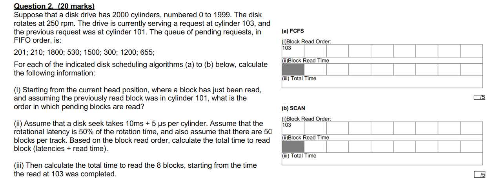

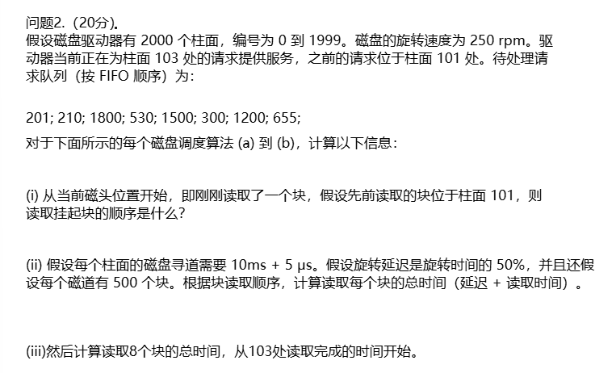

### 问题解析步骤

#### (a) FCFS（先来先服务）

1. **确定读取顺序**：
   
   - 根据给定的请求队列：`201, 210, 1800, 530, 1500, 300, 1200, 655`。
- 当前磁头位置在 103，读取顺序为：`103, 201, 210, 1800, 530, 1500, 300, 1200, 655`。
   
2. **计算每次移动的寻道时间**：
   - 使用给定的寻道时间公式：\( 
     $$
  \text{寻道时间} = 10 \text{ms} + 5 \text{µs} \times \text{移动的柱面数}
     $$
      \)。
   
   - 计算每次移动的柱面数，并计算出对应的寻道时间。
   
3. **计算旋转延迟和读取时间**：
   - 旋转延迟为一个旋转时间的一半。
   
   - 旋转时间为 \( 
  $$
     \frac{60}{250}
     $$
      \) 秒每转。
   
   - 计算每个块的旋转延迟和读取时间。
   
4. **计算总时间**：
   
   - 将所有的寻道时间和旋转延迟相加，得到读取所有 8 个块的总时间。

#### (b) SCAN（电梯算法）

1. **确定读取顺序**：
   - 在 SCAN 算法中，磁头从当前位置开始向一个方向移动，直到磁盘末端或队列的最大请求，然后反向。
   - 从柱面 103 开始，按升序读取，直到最大请求，再反向。
   - 读取顺序为：`103, 201, 210, 300, 530, 655, 1200, 1500, 1800`。

2. **计算每次移动的寻道时间**：
   - 按照 FCFS 的方法计算每次移动的寻道时间。

3. **计算旋转延迟和读取时间**：
   - 计算每个块的旋转延迟和读取时间，步骤与 FCFS 相同。

4. **计算总时间**：
   - 将所有的寻道时间和旋转延迟相加，得到整个读取过程的总时间。

### 示例计算

假设从 `103` 移动到 `201` 的柱面数是 \( 201 - 103 = 98 \) 个柱面。

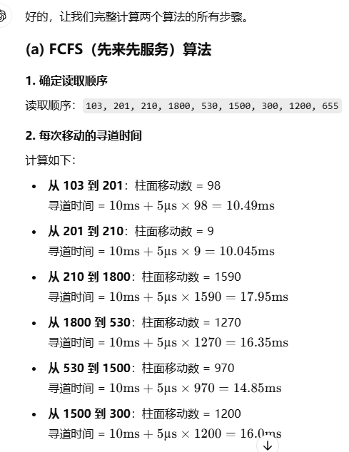

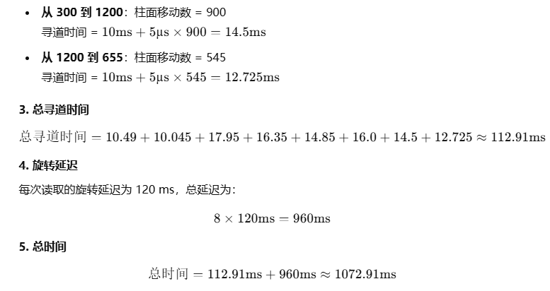

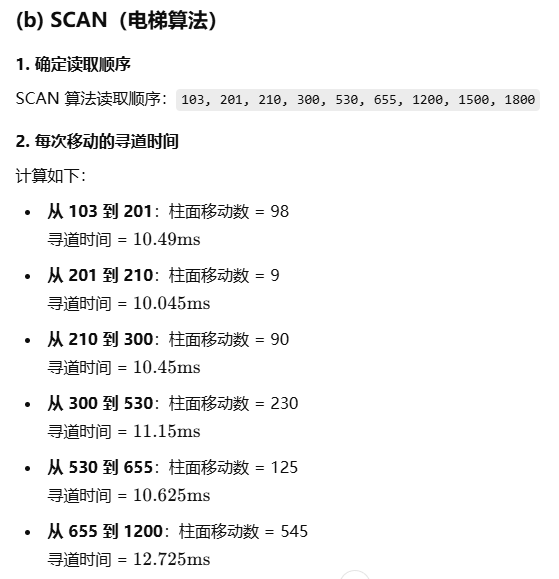

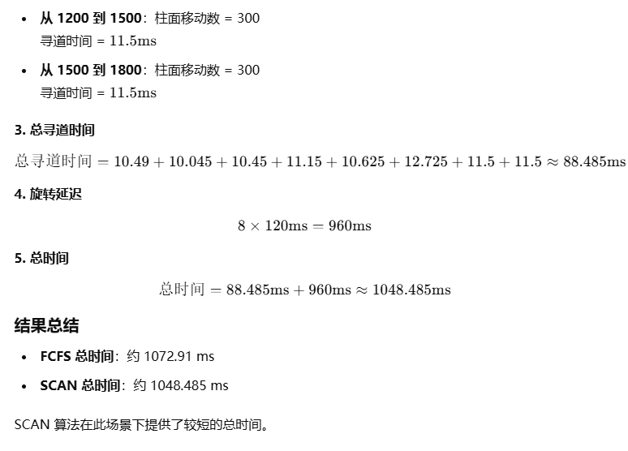

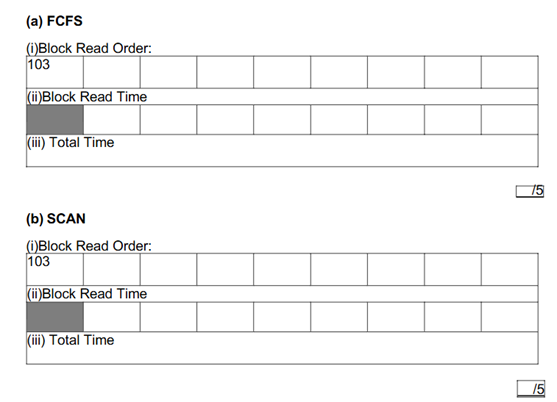

以下是关于磁盘中各个术语的解释：

### i) Read/Write Head（读写磁头）
读写磁头是磁盘驱动器中的关键组件，负责在盘片上读取和写入数据。它悬浮在盘片表面之上，不与盘片直接接触。读写磁头通过磁化和解磁化来改变和检测盘片表面上的磁性区域，从而实现数据的存储和读取。

### ii) Sector（扇区）
扇区是磁盘上存储数据的最小物理存储单元。每个磁道被分成若干个扇区，每个扇区存储固定数量的数据（通常为 512 字节或更大）。扇区是读写操作的基本单位。

### iii) Track（磁道）
磁道是盘片上由同心圆组成的环，每一圈代表一个磁道。磁道是数据的存储路径，每个盘片的表面包含多个磁道，从中心向外扩展。不同的磁道可用于存储不同的数据块。

### iv) Cylinder（柱面）
柱面是由磁盘上所有盘片的同一半径的磁道所组成的集合。换句话说，多个盘片上位置相同的磁道组合在一起就形成了一个柱面。读写磁头在访问数据时，可以在同一柱面上移动而无需调整高度，只需水平移动磁头即可。

### v) Spindle（主轴）
主轴是用于固定和旋转盘片的轴。主轴带动盘片以固定的转速旋转，使读写磁头能够在盘片上方快速定位到需要读取或写入的数据。主轴的转速（以 RPM 表示）对磁盘的访问速度有很大的影响。

这些定义解释了每个术语的含义和它们在磁盘结构中的作用。希望这些说明对你有帮助！

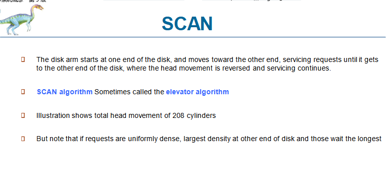

这张图片解释了 **SCAN 算法**，又被称为**电梯算法**，用于磁盘调度。以下是每个要点的解释：

1. **基本工作原理**：
   - 磁盘读写磁头从磁盘的一端开始移动，向另一端移动时服务沿途的所有请求。
   - 当磁头到达磁盘的另一端后，方向会反转，磁头继续移动并服务沿途的请求，就像电梯上下运行一样。

2. **电梯算法的别称**：
   - **SCAN 算法**有时被称为**电梯算法**，因为它的运行方式类似于电梯在楼层之间上下运行时会沿途服务请求。

3. **磁头移动示例**：
   - 图片提到一个例子，其中磁头总共移动了 208 个柱面（cylinders）。

4. **注意事项**：
   - 如果请求在磁盘上的分布是均匀的，那么磁头在磁盘一端的等待时间会更长，因为它必须等到磁头移动到磁盘的另一端后才开始返回。

**总结**：
SCAN 算法通过来回扫描磁盘来服务请求，优化了磁盘的寻道时间。这种方法有助于减少磁头移动的总距离，使请求得到更均匀的服务，但在磁盘的两端可能会有较长的等待时间。

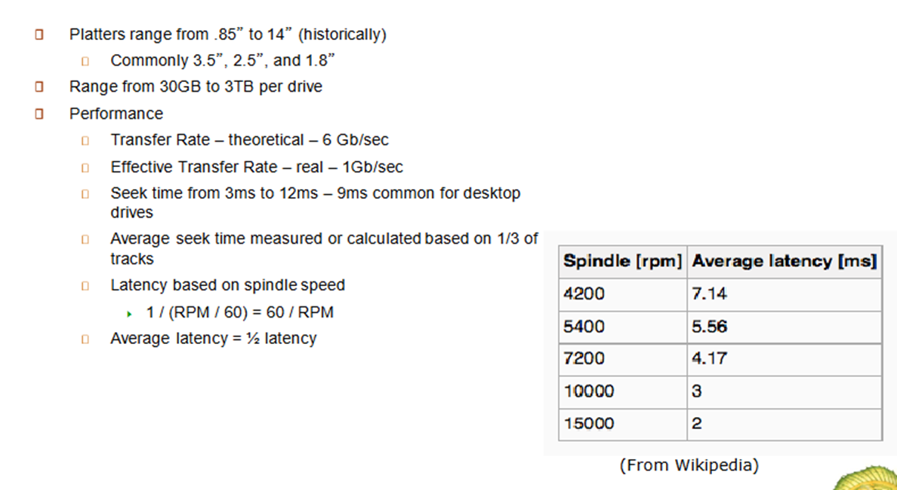

这张图表提供了关于磁盘驱动器性能和参数的详细信息。以下是各部分的解释：

1. **盘片尺寸范围**：
   - 历史上，盘片的直径范围从 0.85 英寸到 14 英寸。
   - 常见的尺寸为 3.5 英寸、2.5 英寸和 1.8 英寸。

2. **每个驱动器的容量范围**：
   
- 从 30GB 到 3TB 不等。
   
3. **性能指标**：
   - **传输速率**：
     - 理论最大速率为 6 Gb/秒。
     - 实际有效传输速率约为 1 Gb/秒。
   - **寻道时间**：
     
     - 寻道时间范围从 3 毫秒到 12 毫秒不等，桌面硬盘的典型寻道时间为 9 毫秒。
   - **平均寻道时间**：
     
     - 平均寻道时间根据磁盘的 1/3 的磁道数进行测量或计算。
   - **延迟**：
  - 延迟基于主轴的转速计算，公式为 \(
       $$
       \frac{60}{\text{RPM}}
       $$
        \) 秒，表示盘片转一圈的时间。
     
     - 平均延迟为上述计算值的一半。
   
4. **主轴转速和平均延迟对照表**：
   - 表格列出了不同主轴转速下的平均延迟时间，例如：
     - 4200 RPM 的平均延迟为 7.14 毫秒。
     - 7200 RPM 的平均延迟为 4.17 毫秒。
     - 15000 RPM 的平均延迟为 2 毫秒。

这些信息用于评估磁盘驱动器的速度和性能，尤其在存取数据的响应时间和传输速度上非常重要。

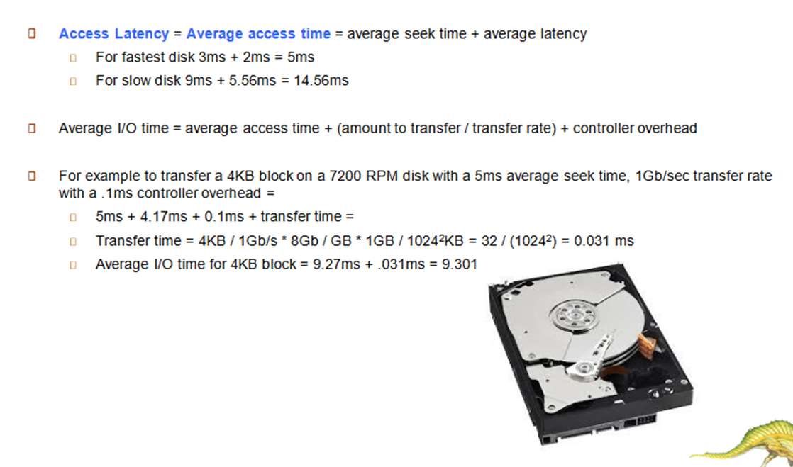

这张图解释了磁盘访问延迟和平均 I/O 时间的计算方法。以下是具体解释：

### 1. 访问延迟（Access Latency）
**平均访问时间**是由**平均寻道时间**和**平均旋转延迟**组成的：
\[
$$
\text{Access Latency} = \text{Average access time} = \text{Average seek time} + \text{Average latency}
$$
\]

\]

- 对于最快的磁盘，假设平均寻道时间为 3 毫秒，平均延迟为 2 毫秒，总访问延迟为：
  \[
  $$
  3 \text{ms} + 2 \text{ms} = 5 \text{ms}
  $$
  \]

  \]

- 对于较慢的磁盘，假设平均寻道时间为 9 毫秒，平均延迟为 5.56 毫秒，总访问延迟为：
  $$
  \[
  9 \text{ms} + 5.56 \text{ms} = 14.56 \text{ms}
  \]
  $$
  

### 2. 平均 I/O 时间
**平均 I/O 时间**包括平均访问时间、数据传输时间和控制器开销：
$$
\[
\text{Average I/O time} = \text{Average access time} + \frac{\text{Amount to transfer}}{\text{Transfer rate}} + \text{Controller overhead}
\]
$$


### 3. 示例计算
传输一个 4KB 数据块，假设磁盘的转速为 7200 RPM，平均寻道时间为 5 毫秒，传输速率为 1 Gb/秒，控制器开销为 0.1 毫秒：

- **总访问时间**：
  $$
  \[
  5 \text{ms} + 4.17 \text{ms} + 0.1 \text{ms}
  \]
  $$
  

- **传输时间**：
  $$
  \[
  \frac{4 \text{KB}}{1 \text{Gb/s}} \times \frac{8 \text{Gb}}{\text{GB}} \times \frac{1 \text{GB}}{1024^2 \text{KB}} \approx 0.031 \text{ms}
  \]
  $$
  

- **平均 I/O 时间**：
  $$
  \[
  9.27 \text{ms} + 0.031 \text{ms} = 9.301 \text{ms}
  \]
  $$
  


这个例子说明了在计算磁盘 I/O 时间时需要考虑寻道时间、旋转延迟、数据传输时间和控制器开销等因素。


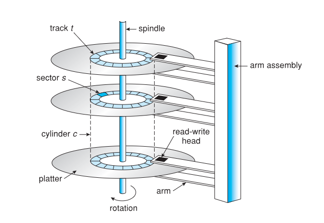

这张图片展示了磁盘驱动器的结构。下面是各个组件的含义：

1. **Spindle（主轴）**：用于固定和旋转磁盘盘片的轴，驱动多个盘片一起旋转。

2. **Platter（盘片）**：磁盘驱动器中存储数据的圆盘。每个盘片都有两个表面，能够存储数据。

3. **Track \( t \)（磁道）**：在盘片表面上的同心圆，每一圈表示一个磁道。数据按顺序存储在磁道上。

4. **Sector \( s \)（扇区）**：每个磁道被分成若干个扇区，每个扇区是磁盘存储数据的最小单元。

5. **Cylinder \( c \)（柱面）**：多个盘片上的对应磁道形成的圆柱体。如果将所有盘片上半径相同的磁道组合起来，就构成了一个柱面。磁盘驱动器的磁头同时在同一个柱面上读取或写入数据。

6. **Read-write head（读写磁头）**：磁头用于读取或写入数据。在磁头移动时，它可以在不同的柱面之间移动，进行数据访问。

7. **Arm（磁头臂）**：连接并移动读写磁头的部件，使其能够在不同的柱面之间移动。

8. **Arm assembly（磁头臂组件）**：磁头臂及其控制系统组成的组件，负责在不同的柱面之间移动磁头。

9. **Rotation（旋转）**：盘片围绕主轴旋转的运动，使得数据能够被读写磁头访问。

总的来说，这个图表明了磁盘驱动器如何通过读写磁头在旋转的盘片上访问数据，通过磁头臂在不同的柱面之间移动来定位数据。

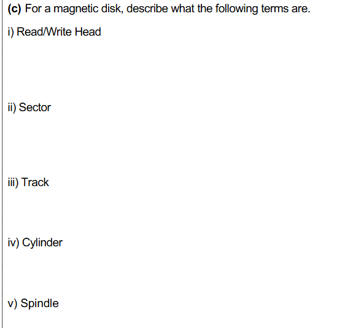

以下是关于磁盘中各个术语的解释：

### i) Read/Write Head（读写磁头）
读写磁头是磁盘驱动器中的关键组件，负责在盘片上读取和写入数据。它悬浮在盘片表面之上，不与盘片直接接触。读写磁头通过磁化和解磁化来改变和检测盘片表面上的磁性区域，从而实现数据的存储和读取。

### ii) Sector（扇区）
扇区是磁盘上存储数据的最小物理存储单元。每个磁道被分成若干个扇区，每个扇区存储固定数量的数据（通常为 512 字节或更大）。扇区是读写操作的基本单位。

### iii) Track（磁道）
磁道是盘片上由同心圆组成的环，每一圈代表一个磁道。磁道是数据的存储路径，每个盘片的表面包含多个磁道，从中心向外扩展。不同的磁道可用于存储不同的数据块。

### iv) Cylinder（柱面）
柱面是由磁盘上所有盘片的同一半径的磁道所组成的集合。换句话说，多个盘片上位置相同的磁道组合在一起就形成了一个柱面。读写磁头在访问数据时，可以在同一柱面上移动而无需调整高度，只需水平移动磁头即可。

### v) Spindle（主轴）
主轴是用于固定和旋转盘片的轴。主轴带动盘片以固定的转速旋转，使读写磁头能够在盘片上方快速定位到需要读取或写入的数据。主轴的转速（以 RPM 表示）对磁盘的访问速度有很大的影响。

这些定义解释了每个术语的含义和它们在磁盘结构中的作用。希望这些说明对你有帮助！

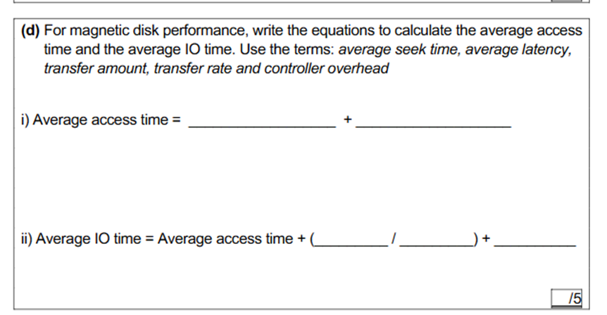

这道题目要求你写出计算磁盘性能的**平均访问时间**和**平均 I/O 时间**的公式，使用给定的术语（如 `average seek time`、`average latency`、`transfer amount`、`transfer rate` 和 `controller overhead`）。

### 解答步骤：

#### (i) 平均访问时间公式：
**平均访问时间**是指磁盘从接收到读/写请求到磁头移动到正确位置并准备开始读/写操作所需的时间。计算公式如下：
\[
$$
\text{Average access time} = \text{Average seek time} + \text{Average latency}
$$
\]

\]

其中：
- **Average seek time**：磁头从当前柱面移动到目标柱面所需的时间。
- **Average latency**：等待磁盘旋转使目标扇区到达磁头下方的平均时间。

#### (ii) 平均 I/O 时间公式：
**平均 I/O 时间**是指完成整个 I/O 操作（包括数据传输）的总时间。计算公式如下：
\[
$$
\text{Average IO time} = \text{Average access time} + \left(\frac{\text{Transfer amount}}{\text{Transfer rate}}\right) + \text{Controller overhead}
$$
\]

\]

其中：
- **Transfer amount**：需要传输的数据量。
- **Transfer rate**：数据传输速率。
- **Controller overhead**：磁盘控制器处理请求的时间。

### 填写公式：
(i) 平均访问时间：
\[
$$
\text{Average access time} = \text{Average seek time} + \text{Average latency}
$$
\]

\]

(ii) 平均 I/O 时间：
\[
$$
\text{Average IO time} = \text{Average access time} + \left(\frac{\text{Transfer amount}}{\text{Transfer rate}}\right) + \text{Controller overhead}
$$
\]

\]

这样就完成了两个公式的填写，帮助你更好地理解磁盘性能的计算方法。

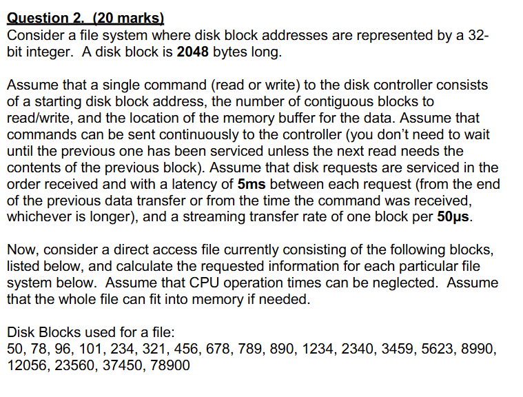

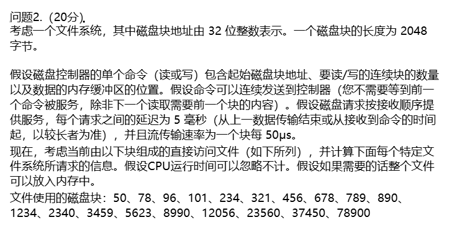

这道题目是关于计算访问一系列磁盘块所需的时间。下面是如何理解和解决该问题的步骤：

### 题目分析：
- 每个磁盘块的大小为 2048 字节。
- 磁盘请求的延迟为 5 毫秒（从上一个数据传输结束或命令接收开始算起，以较长者为准）。
- 每个块的传输时间为 50 微秒。
- CPU 的操作时间可以忽略，整个文件可以加载到内存中。

**磁盘块列表**：`50, 78, 96, 101, 234, 321, 456, 678, 789, 890, 1234, 2340, 3459, 5623, 8990, 12056, 23560, 37450, 78900`

### 解题步骤：
1. **计算每次访问的延迟**：
   - 每次新的磁盘访问会有一个固定的 5 毫秒延迟。
   - 如果读取多个块连续存储，则只有一个延迟时间。

2. **计算传输时间**：
   - 每个块的传输时间为 50 微秒。
   - 计算传输多个块的总时间为：\( \text{块数} \times 50 \) 微秒。

3. **确定访问的顺序和每次的时间消耗**：
   - 依次计算每次访问的延迟（5 毫秒）和每个块的传输时间。
   - 如果请求是连续的，则只需一个 5 毫秒延迟和连续块的总传输时间。

### 示例计算：
假设要访问第一个块（50）：
- **访问延迟**：5 毫秒。
- **传输时间**：50 微秒。

总时间为 \( 
$$
5 \text{ ms} + 50 \text{ µs}
$$
 \)。

对于访问后续块，可以逐个分析这些块是否连续：
- 如果块是连续的，如 `50` 到 `78` 之间的连续块，则只需要一个延迟时间加上传输多个块的总时间。

### 计算方法总结：
- 遍历每个块，计算是否与前一个块连续。
- 如果不连续，添加 5 毫秒的延迟。
- 计算每个块的传输时间，将其累加。

好的，我将用手动的方式解释计算过程。

### 计算步骤：
1. **访问延迟**：
   - 每次访问非连续块时，需添加 5 毫秒的延迟。
   - 我们遍历磁盘块列表，检查每个块是否与前一个块连续。

2. **传输时间**：
   - 每个块的传输时间是 50 微秒，将所有块的传输时间累加即可。

### 步骤计算：
- **磁盘块列表**：
  `50, 78, 96, 101, 234, 321, 456, 678, 789, 890, 1234, 2340, 3459, 5623, 8990, 12056, 23560, 37450, 78900`

- **传输时间计算**：
  - 共有 19 个块，每个块的传输时间是 50 微秒。
  
- 总传输时间 \( = 
    $$
    19 \times 50 \text{ 微秒} = 950 \text{ 微秒}
    $$
     \)，即 0.95 毫秒。
  
- **延迟计算**：
  - 检查每个块是否与前一个块连续，不连续时加 5 毫秒。
  - 块 `50` 到 `78` 不连续，加 5 毫秒。
  - 块 `78` 到 `96` 不连续，加 5 毫秒。
  - 块 `96` 到 `101` 不连续，加 5 毫秒。
  - 块 `101` 到 `234` 不连续，加 5 毫秒。
  - 按此方式继续检查整个列表，每次发现不连续时都加 5 毫秒。

  **每次延迟累加**：
  
  - 总共有 19 次访问，其中每次访问（除第一个块外）都需要 5 毫秒的延迟。

### 总结：
- 延迟时间累计为 \( 
  $$
  5 \text{ 毫秒} \times 18 = 90 \text{ 毫秒}
  $$
   \)（第一个块不计算延迟）。

- 总传输时间为 0.95 毫秒。

- **总时间**为 \(
  $$
  90 \text{ 毫秒} + 0.95 \text{ 毫秒} = 90.95 \text{ 毫秒}
  $$
   \)。

这个计算方法解释了如何逐个手动检查磁盘块并累加延迟和传输时间。

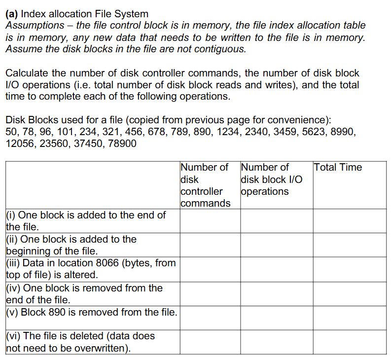

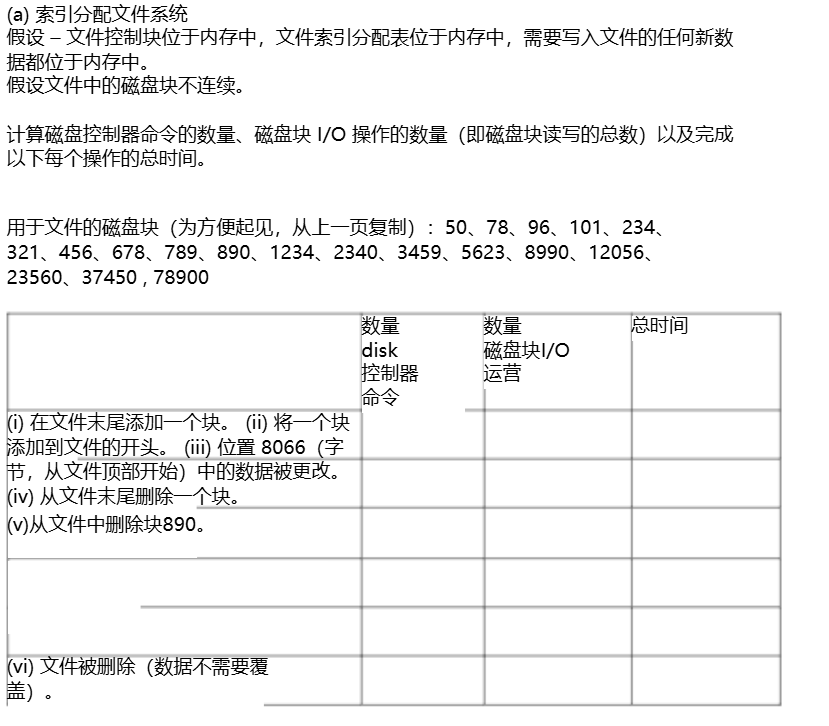

这道题目涉及的是在索引分配文件系统（Index Allocation File System）中对不同操作的分析。你需要计算每个操作涉及的磁盘控制器命令数量、磁盘块 I/O 操作数量，以及完成每个操作所需的总时间。

### 题目分析：
- **假设条件**：文件控制块和文件索引分配表都在内存中，写入文件的新数据在内存中。文件中的磁盘块是不连续的。
- **磁盘块列表**：`50, 78, 96, 101, 234, 321, 456, 678, 789, 890, 1234, 2340, 3459, 5623, 8990, 12056, 23560, 37450, 78900`

### 计算说明：
1. **Number of disk controller commands**：
   - 每个操作可能涉及多个磁盘控制器命令，比如添加或删除块需要控制器发送和接收多个命令。

2. **Number of disk block I/O operations**：
   - 这是操作中磁盘读写的块数量。

3. **Total Time**：
   - 总时间包括磁盘控制器命令延迟和传输时间，视具体操作而定。

### 各项操作分析：
1. **(i) 向文件末尾添加一个块**：
   - 控制器命令数量：写入一个新的块。
   - I/O 操作数量：涉及一个块的写操作。
   - 时间计算：延迟时间 + 传输时间。
- **磁盘控制器命令数量**：1（写入新的块）。
   - **磁盘块 I/O 操作数量**：1（写入一个块）。
   - **总时间**：
     - 延迟时间：5 毫秒。
     - 传输时间：50 微秒。
     - **总时间**：5 毫秒 + 50 微秒 = 5.05 毫秒。
   
2. **(ii) 向文件开头添加一个块**：
   
   - 控制器命令数量：写入一个块，更新文件结构。
   - I/O 操作数量：涉及一个块的写操作。
- 时间计算：与末尾添加类似，但可能有额外的文件结构更新。
   - **磁盘控制器命令数量**：1（写入新的块，并更新索引或头部结构）。
   - **磁盘块 I/O 操作数量**：1（写入一个块）。
   - **总时间**：
     - 延迟时间：5 毫秒。
     - 传输时间：50 微秒。
     - **总时间**：5 毫秒 + 50 微秒 = 5.05 毫秒。
   
3. **(iii) 修改位置 8066 处的数据**：
   - 控制器命令数量：读一个块（定位），然后写回修改的块。
   
   - I/O 操作数量：涉及读和写各一个块。

   - 时间计算：读操作时间 + 写操作时间。
   
   - **磁盘控制器命令数量**：2（读取块，写回修改的块）。
   
   - **磁盘块 I/O 操作数量**：2（读取和写入各一个块）。
   
   - **总时间**：
   
     - 延迟时间：5 毫秒（读取） + 5 毫秒（写回）= 10 毫秒。
   
     - 传输时间：50 微秒（读取）+ 50 微秒（写入）= 100 微秒。
   
     - **总时间**：10 毫秒 + 100 微秒 = 10.1 毫秒。
   
     - 在索引分配文件系统中，文件的每个块都有一个指向磁盘上数据块的索引，因此在修改文件中的某个位置（如位置 8066）时，不需要顺序读取整个文件来找到那个位置。
   
       ### 原因解释：
       1. **索引分配结构**：
          - 索引分配文件系统使用一个索引块来记录每个文件的数据块位置。文件中的每个数据块都可以通过索引块直接访问。
          - 这意味着，即使文件在磁盘上是分散存储的，通过查找索引块，系统可以快速定位并直接访问任意数据块。
   
       2. **定位特定数据块**：
          - 当需要修改文件中位置 8066 的数据时，系统会通过索引块计算 8066 这个位置所对应的磁盘块编号，然后直接读取和修改该块。
          - 无需从文件顶部开始顺序读取，因为索引块提供了快速定位的能力。
   
       3. **效率**：
          - 由于索引块在内存中，查找具体的磁盘块位置非常快速。
          - 这使得修改特定位置的数据只需读取并修改对应的磁盘块，而不需要读取整个文件或扫描其他数据块。
   
       ### 结论：
       索引分配文件系统的设计使得文件操作可以随机访问任意数据块，而无需顺序读取整个文件。这大大提高了访问和修改特定数据块的效率。
   
4. **(iv) 从文件末尾删除一个块**：
   - 控制器命令数量：删除块的操作。
   - I/O 操作数量：可能不涉及实际块操作，只更新元数据。
   - 时间计算：延迟主要为控制器命令。
- **磁盘控制器命令数量**：1（删除块的操作）。
   - **磁盘块 I/O 操作数量**：0（可能只需更新索引，无需物理删除）。
   - **总时间**：5 毫秒（控制器命令延迟）。
   
5. **(v) 删除块 890**：
   - 控制器命令数量：涉及查找并删除块。
   - I/O 操作数量：可能需要修改索引结构。
   - 时间计算：延迟和修改的时间。
- **磁盘控制器命令数量**：1（定位并删除块）。
   - **磁盘块 I/O 操作数量**：0（可能仅更新索引）。
   - **总时间**：5 毫秒（控制器命令延迟）。
   
6. **(vi) 删除整个文件**：
   - 控制器命令数量：清空整个文件的索引。
   - I/O 操作数量：删除操作通常不涉及每个块的写入，只清除索引。
   - 时间计算：延迟为清空索引的时间。
   - **磁盘控制器命令数量**：1（清空文件索引）。
   - **磁盘块 I/O 操作数量**：0（清除索引时不涉及每个块的写入）。
   - **总时间**：5 毫秒（清空索引的延迟）。

- 

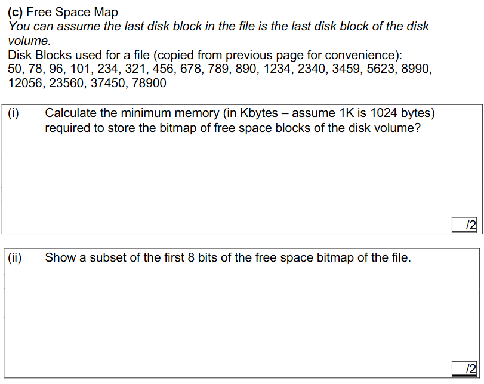

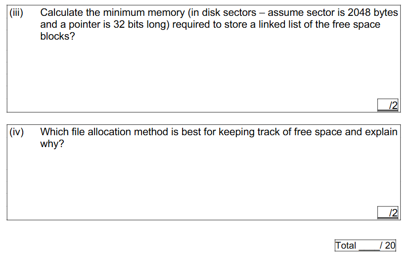

这部分问题涉及**空闲空间映射**，需要计算与文件系统中跟踪空闲空间相关的内存和位图等。具体解答如下：

### (i) 计算存储磁盘卷空闲空间位图所需的最小内存（以 KBytes 为单位）：
要存储空闲空间的位图，你需要知道整个磁盘卷中有多少个磁盘块，并计算为每个块分配一个比特来表示是否为空闲。

**步骤**：
1. 确定磁盘卷中总共有多少个磁盘块。

2. 每个块用 1 个比特来表示，计算需要多少个比特来表示整个磁盘卷。

3. 将比特数转换为字节数，并进一步转换为 KB（1 KByte = 1024 字节）。

4. **步骤**：

   1. 确定磁盘卷中总共有多少个磁盘块。

      - 假设磁盘的最后一个块编号是 `78900`，表示磁盘总共包含 `78901` 个块（块编号从 `0` 到 `78900`）。

   2. 每个块用 1 个比特表示，所以需要 `78901` 个比特来存储整个磁盘的位图。

   3. 将比特数转换为字节数： 字节数
      $$
      =789018≈9862.625 字节\text{字节数} = \frac{78901}{8} \approx 9862.625 \text{ 字节}
      $$
      字节数=878901≈9862.625 字节

   4. 将字节数转换为 KBytes： 
      $$
      内存 (KB)=9862.6251024≈9.63 KB\text{内存 (KB)}
      $$
       
      $$
      = \frac{9862.625}{1024} \approx 9.63 \text{ KB}内存 (KB)=10249862.625≈9.63 KB
      $$
      

   **答案**：大约需要 `9.63 KB` 的内存来存储空闲空间位图。

### (ii) 显示文件前 8 位的空闲空间位图子集：
这个子集展示了文件前 8 个磁盘块的空闲或已用状态，每个位代表一个块。
- `1` 表示该块已被使用。

- `0` 表示该块为空闲。

  - **步骤**：

    - 需要确定文件前 8 个磁盘块的使用状态。假设我们检查块 

      ```
      0
      ```

       到 

      ```
      7
      ```

      ：

      - 检查这些块是否在磁盘块列表中：`50, 78, 96, 101, 234, 321, 456, 678, 789, ...`。

    - 如果块在文件中已被使用，则位设置为 `1`，否则为 `0`。

    **结果示例**： 假设块 `0` 到 `7` 都为空闲，位图为：

    ```
    复制代码
    00000000
    ```

### (iii) 计算存储空闲块链表所需的最小内存（以磁盘扇区为单位）：
链表存储空闲块的内存大小计算如下：
1. 每个指针是 32 位（或 4 字节）。

2. 计算链表节点数量，即空闲块数量，并确定存储这些指针所需的字节数。

3. 将字节数转换为磁盘扇区数量（每个扇区为 2048 字节）。

4. **步骤**：

   1. 每个链表节点存储一个指针（32 位或 4 字节）。

   2. 假设磁盘有 `78901` 个块，其中某些块为空闲块，需要存储指针来表示这些空闲块。

   3. 计算存储这些指针所需的总字节数。 字节数=
      $$
      空闲块数量×4 字节\text{字节数} = \text{空闲块数量} \times 4 \text{ 字节}字节数=空闲块数量×4 字节
      $$
      

   4. 将字节数转换为扇区数量（每个扇区为 2048 字节）： 
      $$
      所需扇区数=总字节数2048\text{所需扇区数} = \frac{\text{总字节数}}{2048}
      $$
      所需扇区数=2048总字节数

   **示例计算**： 假设有 `5000` 个空闲块，所需字节数为：
   $$
   5000×4=20000 字节5000 \times 4 = 20000 \text{ 字节}5000×4=20000 字节
   $$
   所需扇区数为：
   $$
   200002048≈9.77 扇区\frac{20000}{2048} \approx 9.77 \text{ 扇区}204820000≈9.77 扇区
   $$
   **答案**：大约需要 `10` 个扇区来存储空闲块链表。

### (iv) 最佳的文件分配方法及其原因：
**推荐方法**：**位图法**

- **原因**：位图方法直观且易于实现，可以快速查找连续的空闲块，适用于大型磁盘。
- **优点**：占用内存较少，能够快速定位空闲和已用块。
- **缺点**：如果磁盘很大，位图可能会变得较大，但仍易于管理。

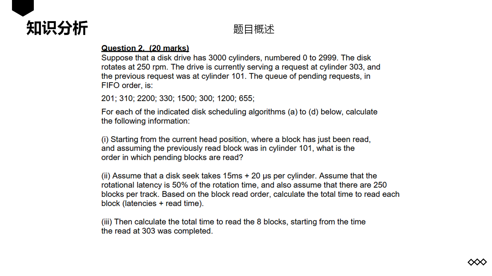

这道题涉及磁盘调度算法的计算。题目给出了磁盘的参数和请求队列，并要求根据不同的调度算法计算访问顺序和读取时间。以下是如何理解和进行计算的具体步骤：

### 题目理解：
- 磁盘有 3000 个柱面，编号从 0 到 2999。
- 磁盘旋转速度为 250 RPM。
- 当前磁头位置在柱面 303，之前访问的柱面是 101。
- 待处理的请求队列（FIFO 顺序）为：`201, 310, 2200, 330, 1500, 300, 1200, 655`。

### 计算要求：
1. **(i) 确定请求的读取顺序**：
   
   - 按不同调度算法（如 FCFS、SSTF、SCAN、C-SCAN）计算每个算法的读取顺序。
   
2. **(ii) 计算读取每个块的时间**：
   - **寻道时间**：公式为 \( 
     $$
     15 \text{ms} + 20 \text{µs} \times \text{柱面数}
  $$
      \)。
   
   - **旋转延迟**：旋转延迟是旋转时间的一半。旋转时间为 \( 
     $$
     \frac{60}{250} \text{秒}
     $$
      \)，所以旋转延迟为 \(
     $$
     \frac{60}{2 \times 250} \text{秒}
     $$
      \) 或约 120 毫秒。
   
   - **读取时间**：包含寻道时间和旋转延迟。
   
3. **(iii) 计算读取 8 个块的总时间**：
   
   - 累加所有块的读取时间，包括寻道时间和旋转延迟。

### 示例计算步骤：
1. **(i) 确定读取顺序**：
   
- 根据调度算法，例如 FCFS（先来先服务），读取顺序直接是请求队列：`201, 310, 2200, 330, 1500, 300, 1200, 655`。
   
2. **(ii) 计算每个块的读取时间**：
   - **从 303 移动到 201**：
     
     - 柱面数 \( = |303 - 201| = 102 \)
     
     - 寻道时间 \( = 
  $$
       15 \text{ms} + 20 \text{µs} \times 102 = 15 \text{ms} + 2.04 \text{ms} = 17.04 \text{ms}
    $$
        \)
     
     - 加上旋转延迟 \( = 
       $$
       120 \text{ms}
       $$
        \)
     
     - 总读取时间 \( = 
       $$
       17.04 \text{ms} + 120 \text{ms} = 137.04 \text{ms}
       $$
        \)
     
   - 对于其他块依次计算每次移动的柱面数和时间。
   
3. **(iii) 累加总时间**：
   
   - 把每个块的读取时间累加，得到读取 8 个块的总时间。

请告诉我是否需要具体为某个调度算法进行完整的计算示例！

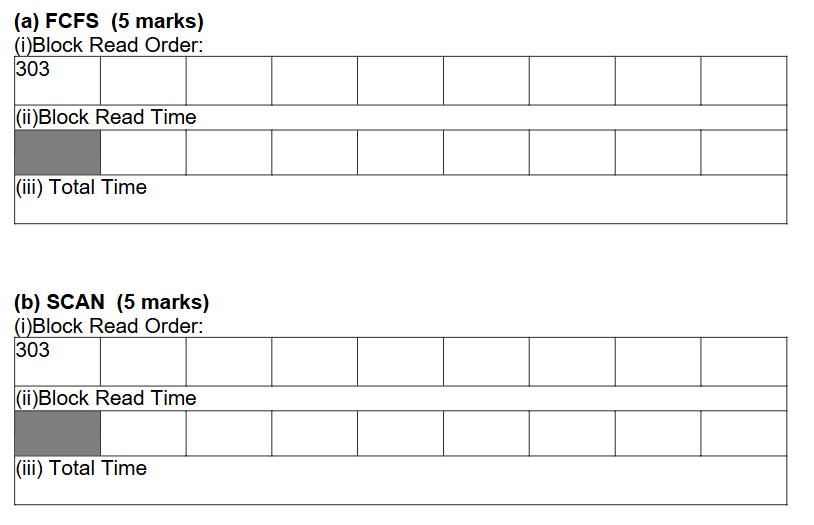

我们来详细计算 (a) FCFS 和 (b) SCAN 算法的步骤：

### (a) FCFS（先来先服务）算法：
1. **读取顺序**：
   - 按照题目给出的请求队列直接访问，即：`303, 201, 310, 2200, 330, 1500, 300, 1200, 655`。

2. **计算每个块的读取时间**：
   - **从 303 到 201**：
     - 移动的柱面数 = \( |303 - 201| = 102 \)
     - 寻道时间 = \( 15 \text{ms} + 20 \text{µs} \times 102 = 15 \text{ms} + 2.04 \text{ms} = 17.04 \text{ms} \)
     - 加上旋转延迟（120 ms）
     - 总读取时间 = \( 17.04 \text{ms} + 120 \text{ms} = 137.04 \text{ms} \)

   - **从 201 到 310**：
     - 移动的柱面数 = \( |310 - 201| = 109 \)
     - 寻道时间 = \( 15 \text{ms} + 20 \text{µs} \times 109 = 15 \text{ms} + 2.18 \text{ms} = 17.18 \text{ms} \)
     - 总读取时间 = \( 17.18 \text{ms} + 120 \text{ms} = 137.18 \text{ms} \)

   - 按照此方法计算队列中每个请求的读取时间。

3. **总时间计算**：
   - 将每次移动的读取时间累加，得到读取 8 个块的总时间。

### (b) SCAN（电梯算法）：
1. **读取顺序**：
   
- 从当前柱面 303 开始，按柱面号递增的顺序移动，访问请求队列中的所有柱面号，直到最右边的柱面，然后折返。
   
2. **计算每个块的读取时间**：
   - **从 303 到 310**：
     - 移动的柱面数 = \( |310 - 303| = 7 \)
     
     - 寻道时间 = \( 
  $$
       15 \text{ms} + 20 \text{µs} \times 7 = 15 \text{ms} + 0.14 \text{ms} = 15.14 \text{ms}
       $$
        \)
     
  - 总读取时间 = \( 
       $$
    15.14 \text{ms} + 120 \text{ms} = 135.14 \text{ms}
       $$
        \)
     
   - **从 310 到 330**：
     
     - 移动的柱面数 = \( |330 - 310| = 20 \)
     
   - 寻道时间 = \( 
       $$
       15 \text{ms} + 20 \text{µs} \times 20 = 15 \text{ms} + 0.4 \text{ms} = 15.4 \text{ms}
       $$
        \)
     
     - 总读取时间 = \( 
       $$
       15.4 \text{ms} + 120 \text{ms} = 135.4 \text{ms}
       $$
        \)
     
   - 继续此方法，计算到最远的请求柱面，然后折返访问。
   
3. **总时间计算**：
   
   - 将 SCAN 算法中每个请求的读取时间累加，得到读取所有块的总时间。

好的，我们将计算 FCFS 和 SCAN 算法下的每个块的读取时间，并提供详细的步骤。

### (a) FCFS 算法详细计算
**读取顺序**：`303, 201, 310, 2200, 330, 1500, 300, 1200, 655`

#### 计算每个块的读取时间：
1. **从 303 到 201**：
   - 柱面数：\( |303 - 201| = 102 \)
   
   - 寻道时间：\( 
     $$
  15 \text{ms} + 20 \text{µs} \times 102 = 17.04 \text{ms}
     $$
      \)
   
   - 旋转延迟：120 ms
   
   - 总读取时间：\( 
     $$
     17.04 \text{ms} + 120 \text{ms} = 137.04 \text{ms}
     $$
      \)
   
2. **从 201 到 310**：
   - 柱面数：\( |310 - 201| = 109 \)
   
   - 寻道时间：\( 
     $$
  15 \text{ms} + 20 \text{µs} \times 109 = 17.18 \text{ms}
     $$
      \)
   
   - 旋转延迟：120 ms
   
   - 总读取时间：\( 
     $$
     17.18 \text{ms} + 120 \text{ms} = 137.18 \text{ms}
     $$
      \)
   
3. **从 310 到 2200**：
   - 柱面数：\( |2200 - 310| = 1890 \)
   
   - 寻道时间：\( 
     $$
  15 \text{ms} + 20 \text{µs} \times 1890 = 52.8 \text{ms}
     $$
     \)
   
   - 旋转延迟：120 ms
   
   - 总读取时间：\( 
     $$
     52.8 \text{ms} + 120 \text{ms} = 172.8 \text{ms}
     $$
     \)
   
4. **从 2200 到 330**：
   - 柱面数：\( |2200 - 330| = 1870 \)
   
   - 寻道时间：\( 
     $$
  15 \text{ms} + 20 \text{µs} \times 1870 = 52.4 \text{ms}
     $$
     \)
   
   - 旋转延迟：120 ms
   
   - 总读取时间：\(
     $$
     52.4 \text{ms} + 120 \text{ms} = 172.4 \text{ms}
     $$
      \)
   
5. **从 330 到 1500**：
   - 柱面数：\( |1500 - 330| = 1170 \)
   
   - 寻道时间：\( 
     $$
  15 \text{ms} + 20 \text{µs} \times 1170 = 38.4 \text{ms}
     $$
      \)
   
   - 旋转延迟：120 ms
   
   - 总读取时间：\(
     $$
     38.4 \text{ms} + 120 \text{ms} = 158.4 \text{ms}
     $$
      \)
   
6. **从 1500 到 300**：
   - 柱面数：\( |1500 - 300| = 1200 \)
   
   - 寻道时间：\( 
     $$
  15 \text{ms} + 20 \text{µs} \times 1200 = 39 \text{ms}
     $$
     \)
   
   - 旋转延迟：120 ms
   
   - 总读取时间：\( 
     $$
     39 \text{ms} + 120 \text{ms} = 159 \text{ms}
     $$
     \)
   
7. **从 300 到 1200**：
   
   - 柱面数：\( |1200 - 300| = 900 \)
   
   - 寻道时间：\( 
  $$
     15 \text{ms} + 20 \text{µs} \times 900 = 33 \text{ms}
     $$
      \)
   
   - 旋转延迟：120 ms
   
   - 总读取时间：\( 
     $$
     33 \text{ms} + 120 \text{ms} = 153 \text{ms}
     $$
      \)
   
8. **从 1200 到 655**：
   - 柱面数：\( |1200 - 655| = 545 \)
   
   - 寻道时间：\( 
     $$
     15 \text{ms} + 20 \text{µs} \times 545 = 26.9 \text{ms}
     $$
      \)
   
   - 旋转延迟：120 ms
   
   - 总读取时间：\( 26.9 \text{ms} + 120 \text{ms} = 146.9 \text{ms} \)

#### 总时间：
将每次读取时间相加：
\[
$$
137.04 + 137.18 + 172.8 + 172.4 + 158.4 + 159 + 153 + 146.9 \approx 1236.72 \text{ms}
$$
\]

\]

### (b) SCAN 算法详细计算
**读取顺序**：

1. 从 303 开始向更高柱面移动，依次访问：`310, 330, 655, 1200, 1500, 2200`，到达最高请求。
2. 再向回移动访问：`300, 201`。

按此顺序进行寻道时间和读取时间的计算。

如果需要详细计算 SCAN 算法每一步的具体数值，请告诉我！

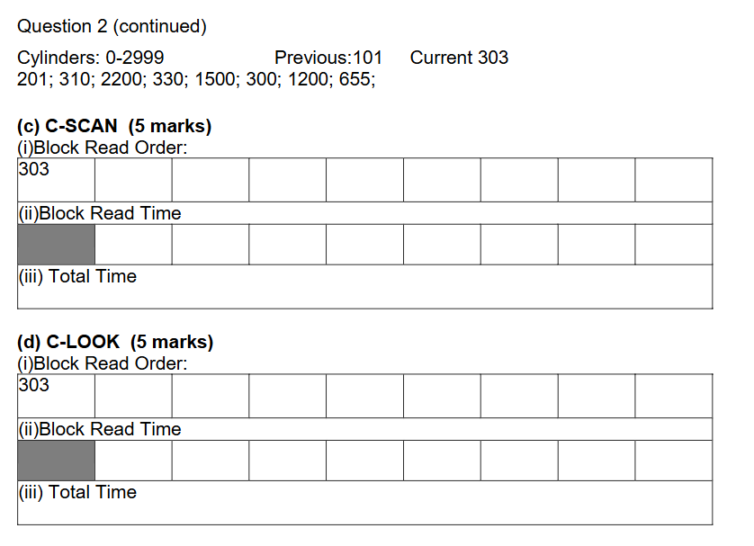

我们来详细解释 (c) C-SCAN 和 (d) C-LOOK 算法的计算方法。

C-SCAN（循环扫描）算法和 C-LOOK 算法都是用于磁盘调度的优化扫描算法，它们在工作原理上有一些相似之处，但也有显著的区别。以下是这两种算法的主要区别和特点：

### 1. C-SCAN（循环扫描）算法：
- **工作原理**：C-SCAN 算法从磁头当前位置开始向一个方向扫描，并处理所有请求，直到达到磁盘的最右端。当磁头到达磁盘的最右端时，它会立即跳回到磁盘的最左端（不处理这段返回路径上的请求），然后继续向同一方向扫描，处理剩余的请求。
- **优点**：保证了请求的公平性。C-SCAN 算法可以确保磁盘头在服务中间柱面的请求时不会倾向于某一边，给每个请求一个公平的机会。
- **缺点**：由于磁头在扫描过程中需要跳回到磁盘的起点，可能会导致一些额外的时间开销。

### 2. C-LOOK 算法：
- **工作原理**：C-LOOK 算法类似于 C-SCAN，但有所不同的是，磁头只会扫描到最远的请求（而不是磁盘的最边缘）。在完成一次从当前到最远请求的扫描后，磁头会直接跳回到最小的请求位置，然后继续扫描。
- **优点**：减少了不必要的磁头移动，因为磁头不会扫描到磁盘的最边缘，只会扫描到实际有请求的位置。
- **缺点**：由于直接跳回到最小请求位置，可能对一些具体情况下的性能会有一定的影响。

### 总结：
- **C-SCAN**：磁头扫描到磁盘的最边缘后返回到另一端再开始扫描。处理过程更具循环性，扫描固定范围，比较公平。
- **C-LOOK**：磁头只扫描实际存在请求的范围，减少了不必要的移动，性能上更高效。

**举例**：
假设有一个请求队列和磁头当前位置：
- **C-SCAN** 会扫描到磁盘的最右边，跳回到左边再继续。
- **C-LOOK** 只扫描到最远的请求位置，然后跳回到最小的请求位置。

这些算法在实际应用中的选择取决于特定应用场景对公平性和性能的要求。

### (c) C-SCAN（循环扫描）算法：
C-SCAN 算法的行为类似于 SCAN，但每次磁头移动到最右边后，会直接返回到最左边（不处理返回过程中的请求），然后重新向右扫描处理剩余请求。

#### 计算步骤：
1. **确定读取顺序**：
   - 从当前位置 303 开始，向右扫描到最右端，访问所有请求柱面号大于 303 的位置。
   - 然后磁头跳回到最左端，从头开始扫描并处理剩余请求。

2. **读取顺序**：
   - 依次访问柱面：`310, 330, 655, 1200, 1500, 2200`
   - 返回最左端，然后访问剩余的柱面：`201, 300`

3. **计算每个块的读取时间**：
   - **从 303 到 310**：
     - 柱面数：\( |310 - 303| = 7 \)
     
     - 寻道时间：\( 
       $$
       15 \text{ms} + 20 \text{µs} \times 7 = 15.14 \text{ms}
       $$
        \)
     
     - 旋转延迟：120 ms
     
     - 总读取时间：\( 
       $$
       15.14 \text{ms} + 120 \text{ms} = 135.14 \text{ms}
       $$
       \)
   - **从 310 到 330**：
     
     - 依次类推，计算每个请求的读取时间。

### (d) C-LOOK（循环优化扫描）算法：
C-LOOK 类似于 C-SCAN，但磁头不会扫描到磁盘的最右端，而是到达最远请求后直接跳回最左边的请求。

#### 计算步骤：
1. **确定读取顺序**：
   - 从当前位置 303 开始，向右扫描并访问所有比 303 大的请求，直到最高请求。
   - 然后跳回到最左端的请求，继续扫描。

2. **读取顺序**：
   - 依次访问：`310, 330, 655, 1200, 1500, 2200`
   - 跳回头部，然后访问剩余的请求：`201, 300`

3. **计算每个块的读取时间**：
   - **从 303 到 310**：
     - 使用与 C-SCAN 相同的计算方法计算每个请求的读取时间。

### 总结：
- 对于 C-SCAN 和 C-LOOK 算法，你需要计算从一个请求到下一个请求的柱面数，并根据给定的寻道时间公式 \( 
  $$
  15 \text{ms} + 20 \text{µs} \times \text{柱面数}
  $$
   \) 和旋转延迟（120 ms）计算每个请求的总时间。

- 累加每个请求的总时间，得到最终的总读取时间。

我们将为 C-SCAN 和 C-LOOK 算法进行完整的读取时间计算。

### (c) C-SCAN 算法详细计算

**读取顺序**：
从 303 开始向右扫描，依次访问 `310, 330, 655, 1200, 1500, 2200`，然后跳回到左端，访问剩余的 `201, 300`。

#### 具体计算步骤：
1. **从 303 到 310**：
   - 柱面数：\( |310 - 303| = 7 \)
   
   - 寻道时间：\( 
  $$
     15 \text{ms} + 20 \text{µs} \times 7 = 15.14 \text{ms}
     $$
      \)
   
   - 总读取时间：\( 
     $$
     15.14 \text{ms} + 120 \text{ms} = 135.14 \text{ms}
     $$
      \)
   
2. **从 310 到 330**：
   - 柱面数：\( |330 - 310| = 20 \)
   
   - 寻道时间：\( 
  $$
     15 \text{ms} + 20 \text{µs} \times 20 = 15.4 \text{ms}
     $$
      \)
   
   - 总读取时间：
     $$
     ( 15.4 \text{ms} + 120 \text{ms} = 135.4 \text{ms} \)
     $$
     
   
3. **从 330 到 655**：
   - 柱面数：\( |655 - 330| = 325 \)
   
   - 寻道时间：
  $$
     ( 15 \text{ms} + 20 \text{µs} \times 325 = 21.5 \text{ms} \)
     $$
     
   
   - 总读取时间：
     $$
     ( 21.5 \text{ms} + 120 \text{ms} = 141.5 \text{ms} \)
     $$
     
   
4. **从 655 到 1200**：
   - 柱面数：\( |1200 - 655| = 545 \)
   
   - 寻道时间：
  $$
     \( 15 \text{ms} + 20 \text{µs} \times 545 = 26.9 \text{ms} \)
     $$
     
   
   - 总读取时间：
     $$
     \( 26.9 \text{ms} + 120 \text{ms} = 146.9 \text{ms} \)
     $$
     
   
5. **从 1200 到 1500**：
   - 柱面数：\( |1500 - 1200| = 300 \)
   - 寻道时间：\( 15 \text{ms} + 20 \text{µs} \times 300 = 21 \text{ms} \)
   - 总读取时间：\( 21 \text{ms} + 120 \text{ms} = 141 \text{ms} \)

6. **从 1500 到 2200**：
   - 柱面数：\( |2200 - 1500| = 700 \)
   - 寻道时间：\( 15 \text{ms} + 20 \text{µs} \times 700 = 29 \text{ms} \)
   - 总读取时间：\( 29 \text{ms} + 120 \text{ms} = 149 \text{ms} \)

7. **跳回到 0**（不计算时间），从 0 移动到 201：
   - 柱面数：\( |201 - 0| = 201 \)
   - 寻道时间：\( 15 \text{ms} + 20 \text{µs} \times 201 = 19.02 \text{ms} \)
   - 总读取时间：\( 19.02 \text{ms} + 120 \text{ms} = 139.02 \text{ms} \)

8. **从 201 到 300**：
   - 柱面数：\( |300 - 201| = 99 \)
   - 寻道时间：\( 15 \text{ms} + 20 \text{µs} \times 99 = 16.98 \text{ms} \)
   - 总读取时间：\( 16.98 \text{ms} + 120 \text{ms} = 136.98 \text{ms} \)

### C-SCAN 总时间：
累加所有读取时间：
\[
135.14 + 135.4 + 141.5 + 146.9 + 141 + 149 + 139.02 + 136.98 \approx 1125.94 \text{ms}
\]


### (d) C-LOOK 算法详细计算

**读取顺序**：从柱面 303 开始向右扫描并处理请求，依次访问 `310, 330, 655, 1200, 1500, 2200`，然后直接跳回最小请求 `201`，最后访问 `300`。

#### 具体计算步骤：

1. **从 303 到 310**：
   - 柱面数：\( |310 - 303| = 7 \)
   - 寻道时间：\( 15 \text{ms} + 20 \text{µs} \times 7 = 15.14 \text{ms} \)
   - 总读取时间：\( 15.14 \text{ms} + 120 \text{ms} = 135.14 \text{ms} \)

2. **从 310 到 330**：
   - 柱面数：\( |330 - 310| = 20 \)
   - 寻道时间：\( 15 \text{ms} + 20 \text{µs} \times 20 = 15.4 \text{ms} \)
   - 总读取时间：\( 15.4 \text{ms} + 120 \text{ms} = 135.4 \text{ms} \)

3. **从 330 到 655**：
   - 柱面数：\( |655 - 330| = 325 \)
   - 寻道时间：\( 15 \text{ms} + 20 \text{µs} \times 325 = 21.5 \text{ms} \)
   - 总读取时间：\( 21.5 \text{ms} + 120 \text{ms} = 141.5 \text{ms} \)

4. **从 655 到 1200**：
   - 柱面数：\( |1200 - 655| = 545 \)
   - 寻道时间：\( 15 \text{ms} + 20 \text{µs} \times 545 = 26.9 \text{ms} \)
   - 总读取时间：\( 26.9 \text{ms} + 120 \text{ms} = 146.9 \text{ms} \)

5. **从 1200 到 1500**：
   - 柱面数：\( |1500 - 1200| = 300 \)
   - 寻道时间：\( 15 \text{ms} + 20 \text{µs} \times 300 = 21 \text{ms} \)
   - 总读取时间：\( 21 \text{ms} + 120 \text{ms} = 141 \text{ms} \)

6. **从 1500 到 2200**：
   - 柱面数：\( |2200 - 1500| = 700 \)
   - 寻道时间：\( 15 \text{ms} + 20 \text{µs} \times 700 = 29 \text{ms} \)
   - 总读取时间：\( 29 \text{ms} + 120 \text{ms} = 149 \text{ms} \)

7. **跳回最小请求 201**（直接跳跃）：
   - 柱面数：\( |2200 - 201| = 1999 \)
   - 寻道时间：\( 15 \text{ms} + 20 \text{µs} \times 1999 = 54.98 \text{ms} \)
   - 总读取时间：\( 54.98 \text{ms} + 120 \text{ms} = 174.98 \text{ms} \)

8. **从 201 到 300**：
   - 柱面数：\( |300 - 201| = 99 \)
   - 寻道时间：\( 15 \text{ms} + 20 \text{µs} \times 99 = 16.98 \text{ms} \)
   - 总读取时间：\( 16.98 \text{ms} + 120 \text{ms} = 136.98 \text{ms} \)

### C-LOOK 总时间：
累加每次读取时间：
\[
135.14 + 135.4 + 141.5 + 146.9 + 141 + 149 + 174.98 + 136.98 \approx 1161.9 \text{ms}
\]

这是 C-LOOK 算法的读取总时间。请告诉我是否需要进一步的解释或帮助！

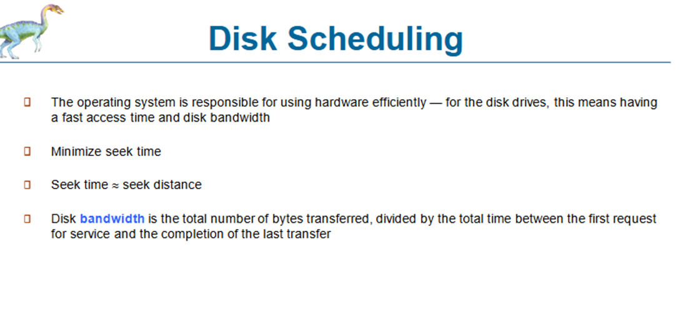

这张图片解释了**磁盘调度**的基本概念。以下是每个要点的解释：

1. **操作系统在使用硬件方面的责任**：
   
- 操作系统负责有效地利用磁盘驱动器硬件。这意味着要实现较快的访问时间和磁盘带宽。
   
2. **最小化寻道时间**：
   
- 寻道时间是磁盘读写操作中定位磁头到指定柱面所需的时间。优化磁盘调度算法的目标是减少寻道时间，从而提高磁盘访问效率。
   
3. **寻道时间与寻道距离近似**：
   
- 寻道时间通常与磁头需要移动的距离（柱面数）成正比。因此，减少磁头移动的距离可以有效减少寻道时间。
   
4. **磁盘带宽**：
   - 磁盘带宽是指在一段时间内传输的数据总量，计算公式为：
     $$
     \[
     \text{磁盘带宽} = \frac{\text{传输的总字节数}}{\text{从第一个请求到最后一个传输完成的总时间}}
     \]
     $$
     这衡量了磁盘的传输能力和效率。
   
     这衡量了磁盘的传输能力和效率。

总的来说，磁盘调度的目标是通过优化寻道时间和提高带宽来实现更高效的磁盘性能。

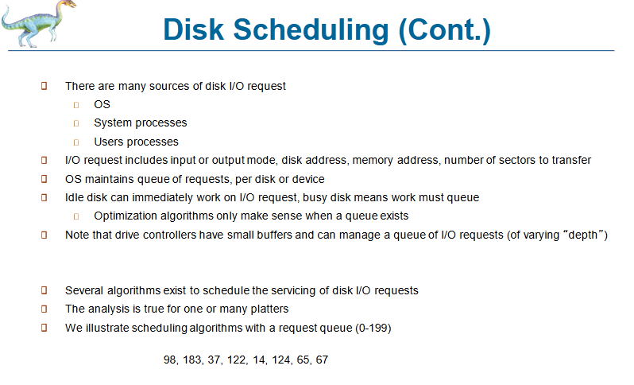

这张图片进一步解释了**磁盘调度**中的一些要点和细节。以下是对每个要点的解释：

1. **磁盘 I/O 请求的来源**：
   - 磁盘输入/输出（I/O）请求可以来源于：
     - **操作系统**（OS）本身进行的读写操作。
     - **系统进程**，例如与后台任务和系统服务相关的操作。
     - **用户进程**，如用户使用的软件和应用程序发出的请求。

2. **I/O 请求的组成**：
   - 每个 I/O 请求包括输入或输出模式、磁盘地址、内存地址和传输扇区的数量等信息。

3. **OS 管理请求队列**：
   - 操作系统为每个磁盘或设备维护一个请求队列，以便处理多个同时到来的请求。

4. **闲置与繁忙磁盘的区别**：
   - 当磁盘处于空闲状态时，它可以立即处理新请求。
   - 当磁盘繁忙时，请求会在队列中等待。优化调度算法在请求排队的情况下最有效。

5. **驱动控制器的缓冲和队列管理**：
   - 驱动控制器通常有小的缓冲区，可以管理一定深度的 I/O 请求队列。

6. **调度算法的存在**：
   - 有多种调度算法可用于优化磁盘 I/O 请求的处理。
   - 分析适用于单个或多个盘片（platter）的磁盘。

7. **示例请求队列**：
   - 图中给出了一个示例请求队列（范围从 0 到 199）：`98, 183, 37, 122, 14, 124, 65, 67`，用于说明不同调度算法如何对这些请求进行调度和优化。

这张图旨在说明磁盘调度的重要性和实现方法。操作系统通过不同的调度算法来管理和优化磁盘 I/O 请求，以减少等待时间、提高吞吐量和整体性能。

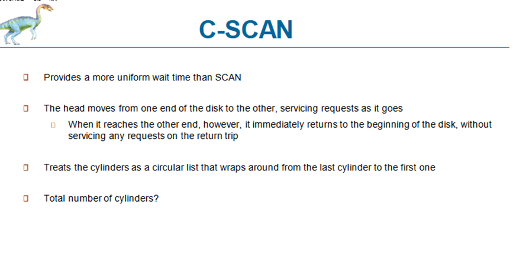

这张图片解释了 **C-SCAN（循环扫描）算法**，以下是要点的含义和解释：

1. **提供比 SCAN 更均匀的等待时间**：
   - C-SCAN 算法通常提供更一致的请求等待时间，因为它在磁头移动过程中均匀地处理请求，不论请求在哪一端分布，都能获得类似的响应时间。

2. **磁头移动方式**：
   - 磁头从磁盘的一端开始移动，沿途处理请求，直到到达磁盘的另一端。
   - 当磁头到达磁盘的另一端时，它会立即返回到磁盘的起点，而在返回的过程中不会处理任何请求。

3. **柱面视为循环列表**：
   - C-SCAN 将磁盘的柱面视为一个循环列表。当磁头到达最右边的柱面后，它会直接跳到最左边的柱面，继续扫描和处理请求。
   - 这种方式有效地模拟了磁头在磁盘上的循环运动，使得调度方式更公平。

4. **总柱面数**：
   - 图片中提到 "Total number of cylinders?"，这意味着需要考虑磁盘的柱面总数来了解磁头移动的范围和算法的实现。

**总结**：
C-SCAN 算法通过让磁头始终以单一方向扫描来提供更稳定的服务。与 SCAN 不同，它在每次到达磁盘的末端时返回到起点，而不服务返回路径上的请求，这样可以确保磁盘两端的请求不会等待更长时间。

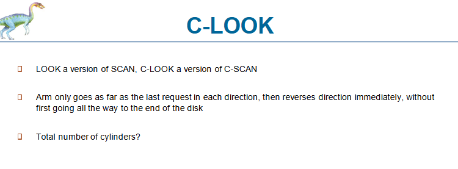

这张图片解释了 **C-LOOK 算法**，以下是要点的含义和解释：

1. **C-LOOK 是 SCAN 和 C-SCAN 的变体**：
   - **LOOK** 是 **SCAN** 算法的变体，而 **C-LOOK** 是 **C-SCAN** 算法的变体。
   - 两者都是基于扫描的磁盘调度算法，目的是优化磁盘访问顺序，减少寻道时间。

2. **磁头的移动范围**：
   - 在 C-LOOK 算法中，磁头只会移动到当前扫描方向上最远的请求位置，然后立即反向，而不会移动到磁盘的最边缘。
   - 换句话说，磁头只会扫描到有请求的位置，不会浪费时间去磁盘的两端没有请求的位置。

3. **与 C-SCAN 的区别**：
   - C-LOOK 在到达最远请求时会立即返回到下一个方向的最小请求位置，而不是像 C-SCAN 那样跳到磁盘的起始位置再开始扫描。
   - 这种方式减少了磁头不必要的长距离移动，提高了整体效率。

4. **总柱面数**：
   - 图片中提到 "Total number of cylinders?"，这意味着需要考虑磁盘的柱面总数来了解磁头移动的范围和算法的实现。

**总结**：
C-LOOK 算法通过在每次扫描中只处理请求的范围并立即反向扫描，使得调度更高效，比 C-SCAN 算法节省了从最远位置跳回到磁盘起点的时间。C-LOOK 是一种更智能的扫描算法，适用于需要快速响应的磁盘操作环境。