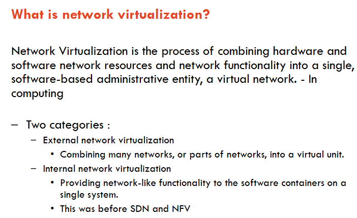

202411100019

后台姓名：梁欣怡
用户ID：128033
用户1V1昵称：Gato
学生需求类型：考前辅导
学生基础：一般，需要老师总结重点，上课
期望上课时间：澳洲时间，尽快
学生DUE时间：澳洲时间，11.15
用户类型：1v1老用户
院校：USYD
年级：Master
专业：Telecommunications Engineering
科目代码：elec5517
科目名称：software defined network
备注：主要是总结一下知识点重点，总结lec的知识点，压缩包里面有那个unit review，重点应该可以从那里确定，然后相当于是做个final总结，大概12-14号这几天都可以上课

根据 **Unit Review** 的内容，以下是该单元的一些关键复习要点：

1. **软件定义网络 (SDN)**:
   - SDN是一种网络架构，核心在于分离控制平面和数据平面，实现网络编程化。
   - SDN的关键原则包括：**集中控制**、**开放接口**、**基于流的路由**。
   - OpenFlow是SDN中广泛应用的协议，用于控制器和交换机之间的通信。

2. **Mininet**:
   - Mininet是一个简单、经济的网络测试平台，用于开发和测试OpenFlow应用。
   - 允许开发者在虚拟环境中模拟复杂的网络拓扑，并能与实际硬件集成。

3. **OpenFlow 和 控制器**:
   - OpenFlow协议用于在控制器和交换机之间发送和接收转发规则。
   - 控制器可以通过流表管理数据包的匹配、转发和修改。控制器主要角色是更新流表。
   - 控制器使用安全通道（如TCP连接）与交换机通信，定义流表规则来控制数据流。

4. **ONOS控制器**:
   - ONOS是一种分布式SDN控制器，具有高可用性和可扩展性，适用于服务提供商网络。
   - 提供北向和南向接口，方便模块化开发和管理，支持多种协议和网络抽象。

5. **数据平面和可编程性**:
   - 数据平面负责数据包的实际转发操作，支持流量监控、访问控制和深度包检测等功能。
   - P4语言可以编程定义协议无关的数据包处理器，使数据平面更加灵活。

6. **虚拟化和NFV**:
   - **网络功能虚拟化 (NFV)** 将传统的网络功能如防火墙、负载均衡等虚拟化，可以在通用硬件上运行。
   - **网络虚拟化 (NV)** 是指通过软件将物理网络资源整合为一个虚拟网络，有助于多租户环境下的资源隔离和管理。

7. **网络切片 (Network Slicing)**:
   - 通过SDN在数据中心内实现网络切片，可以将物理网络划分为多个逻辑切片，每个切片拥有独立的控制权限和资源。

8. **软件定义广域网 (SD-WAN)**:
   - SD-WAN通过虚拟化方式实现广域网连接的灵活性、成本降低和冗余性。可以实现动态路由、成本优化等功能。

9. **数据中心网络 (CORD)**:
   - CORD将传统的电信中心重构为数据中心，通过SDN和NFV技术提供高效的网络服务。
   - 主要组件包括XOS服务编排层、Kubernetes或OpenStack等管理工具，用于实现灵活的网络功能部署和管理。

这些要点覆盖了课程的主要概念，帮助学生理解SDN及相关技术的核心内容。如果您希望详细解释某个主题或进一步的概念复习，请告诉我。

这张图片列出了本单元学习的主题，涵盖了以下内容：

1. **Introduction to SDN** - 软件定义网络（SDN）的简介。
2. **Networking Technologies Basics** - 网络技术基础知识。
3. **OpenFlow and Mininet** - OpenFlow协议和Mininet网络模拟器的应用。
4. **Smart Switches** - 智能交换机的概念和应用。
5. **Controllers Design** - 控制器的设计与架构。
6. **ONOS Controller** - ONOS控制器的具体介绍。
7. **Programmable Data Planes** - 可编程数据平面的原理和实现。
8. **Virtualisation** - 虚拟化技术。
9. **Network Function Virtualisation (NFV)** - 网络功能虚拟化。
10. **SDN applications (CORD & Datacenter)** - SDN在CORD（中央办公室重构为数据中心）和数据中心中的应用。
11. **SDN applications (SDX & SDWan)** - SDN在SDX（软件定义交换）和SD-WAN（软件定义广域网）中的应用。

这些主题构成了本单元的核心内容，主要涉及SDN及其相关的技术和应用。

这张图片的主题是“**New Internet Architecture（新互联网架构）**”，主要内容包括：

1. **无法更改互联网的基本技术**：即现有互联网架构中的一些基础技术（如IP地址、路由等）很难更改，原因包括：
   - 引入新技术的成本很高。
   - 新技术可能带来故障的风险。
   - 商业上的考量，即需要看到引入新技术的实际收益。

2. **重新设计互联网架构**：提出了对现有架构进行重新设计的设想，相关的内容包括：
   - 斯坦福大学的“Clean Slate（白纸）”计划，旨在从头开始重新设计互联网架构。
   - 世界范围内有数百个项目获得资助，以研究新的互联网架构。
   - 有关该主题的会议和期刊（如万维网会议和相关学术期刊）。

总结来说，这张幻灯片讨论了现有互联网架构的局限性，以及重新设计架构以支持未来需求的可能性。

这张幻灯片解释了**什么是SDN（软件定义网络）**，主要内容包括：

1. **SDN是一种新型网络架构**，使网络比过去更具可编程性。

   > 1. SDN（软件定义网络，Software-Defined Networking）是一种网络架构，它通过将网络的**控制平面**和**数据平面**分离，使网络更加灵活和可编程。以下是SDN的几个关键点：
   >
   >    1. **集中控制**：SDN通过一个中央控制器来管理整个网络的流量，使管理员可以集中定义和控制网络行为。
   >
   >    2. **开放接口**：SDN使用开放的接口（如OpenFlow协议）来实现控制器与网络设备之间的通信，使不同设备间能够互操作。
   >
   >    3. **基于流的路由**：SDN能够根据网络流量的特征来动态调整路由，以提高网络效率和适应性。
   >
   >    总的来说，SDN使网络操作更加灵活，便于快速响应新的应用需求、进行自动化管理，并大幅降低网络运营成本。

2. **SDN的关键原则**：

   - **集中控制**：网络控制集中在一个中心节点上。

   - **开放接口**：使用开放的接口进行网络管理和控制。

   - **基于流的路由**：通过流量来控制数据包的转发路径。

   - > SDN的关键原则包括**集中控制**、**开放接口**和**基于流的路由**。以下是对这些原则的详细解释：
     >
     > ### 1. 集中控制
     >    - 在传统网络中，每个交换机和路由器都拥有独立的控制逻辑，各设备之间通过路由协议（如OSPF、BGP等）彼此协作，以实现网络数据包的转发和管理。
     >    - SDN通过引入一个**集中式控制器**（称为“SDN控制器”），将所有网络设备的控制逻辑集中管理。这个控制器相当于整个网络的“**大脑**”，它可以查看、管理和控制所有设备的行为。
     >    - **优势**：集中控制让网络管理员可以在一个中央位置配置和监控网络，不再需要逐一配置每个设备。这提高了网络管理的效率，使得全局优化（如流量工程、负载均衡）更加容易。
     >
     > ### 2. 开放接口
     >    - 在SDN架构中，控制器通过标准化的、开放的协议与网络设备通信，最常用的协议是**OpenFlow**。
     >    - **开放接口**（如OpenFlow）使得控制平面和数据平面之间的通信不再依赖于特定厂商的设备。网络管理员可以通过控制器直接控制网络设备的行为，如指定数据包的转发路径、配置流表规则等。
     >    - **优势**：开放接口带来更大的互操作性，使得不同厂商的设备可以一起工作，避免了对单一供应商的依赖（即“供应商锁定”）。这也使得网络更具灵活性，支持快速开发和部署新功能。
     >
     > ### 3. 基于流的路由
     >    - SDN基于“流”（Flow）来管理数据包的转发，流是指具有相同特征的数据包集合，比如同一应用会话、同一源地址到目的地址的流量等。
     >    - 在传统网络中，路由和交换设备主要基于数据包的目的地址进行转发，无法灵活识别和控制特定流的路径。而SDN允许控制器定义和管理每一条流的具体路径和策略，比如控制不同应用流量的优先级或限制带宽。
     >    - **优势**：基于流的路由能够更细粒度地控制网络流量，适应不同应用和服务的需求。例如，可以为视频流设置高优先级，以确保质量；为大数据传输提供带宽保障，或限制P2P流量。这样可以更有效地利用网络资源，提高网络的服务质量（QoS）。
     >
     > ### 总结
     > 通过这三个原则，SDN使网络管理和配置更加灵活、智能，并实现网络资源的高效利用。管理员可以从中心位置控制网络，基于应用需求来优化流量管理，从而应对快速变化的业务需求和网络环境。

3. **OpenFlow协议**：
   - OpenFlow是最广泛采用的SDN协议。

   - 虽然OpenFlow并不是SDN，但它是SDN中的一个重要技术。

   - > OpenFlow是一种**网络通信协议**，它在**SDN（软件定义网络）**中用于控制平面与数据平面之间的通信。具体来说，OpenFlow允许SDN控制器直接与网络设备（如交换机、路由器）交互，控制数据包的转发路径。以下是对OpenFlow协议的详细介绍：
     >
     > ### 1. OpenFlow的基本概念
     >    - OpenFlow协议定义了一种标准化的接口，通过这个接口，**SDN控制器**可以控制网络设备的行为。
     >    - 网络设备中通常包含一个**流表（Flow Table）**，而控制器通过OpenFlow协议向设备下发流表规则，以决定数据包的处理方式。
     >    - OpenFlow协议最早由斯坦福大学提出，是最早广泛应用的SDN协议。
     >
     > ### 2. OpenFlow的工作机制
     >    OpenFlow的工作流程可以分为以下几个步骤：
     >    - **数据包匹配**：当数据包进入交换机或路由器时，设备会根据OpenFlow流表中的规则检查数据包的各项属性（如源IP、目的IP、端口号等），看是否有匹配的规则。
     >    - **执行操作**：如果找到匹配的规则，设备会根据规则中指定的操作对数据包进行处理，如**转发到特定端口**、**修改数据包头**、或**丢弃数据包**。
     >    - **控制器请求**：如果没有匹配的规则，设备会将数据包的信息发送给SDN控制器，请求控制器下发处理该数据包的规则。控制器可以决定新增一个流表项或采取其他操作。
     >
     > ### 3. OpenFlow流表的结构
     >    - **匹配字段**：用于定义匹配条件，如源地址、目的地址、协议类型等。只有符合这些条件的数据包才能匹配到该条流表规则。
     >    - **指令（Action）**：当数据包匹配某条规则后，设备将执行该规则中定义的操作，比如转发、丢弃、修改等。
     >    - **计数器（Counter）**：用于记录流量信息，如数据包数、字节数等，以便控制器监控网络性能和流量统计。
     >    - **优先级**：当多个流表项匹配同一个数据包时，通过优先级来决定最终选择哪一条规则。
     >    - **超时**：OpenFlow流表中的规则可以设置**硬超时（Hard Timeout）**或**空闲超时（Idle Timeout）**。硬超时表示规则在一定时间后自动删除，空闲超时表示规则在一段时间内未被匹配时会被删除。
     >
     > ### 4. OpenFlow的优势
     >    - **灵活性**：OpenFlow允许控制器动态添加、修改或删除流表规则，可以灵活地控制网络流量。
     >    - **集中管理**：通过集中式的SDN控制器，可以从全局视角对网络进行管理和优化。
     >    - **协议无关性**：OpenFlow可以控制不同类型的网络设备，实现跨厂商的互操作。
     >
     > ### 5. OpenFlow的局限性
     >    - **扩展性**：OpenFlow最初设计较为简单，随着需求增加，流表规则变得复杂，在大型网络中可能会导致扩展性问题。
     >    - **硬件支持**：许多传统的网络设备不支持OpenFlow协议，或仅支持较低版本，限制了其应用范围。
     >    - **复杂的规则管理**：在大规模网络中，管理大量的流表规则可能会变得复杂，且可能增加控制器的负载。
     >
     > ### 总结
     > OpenFlow作为SDN的核心协议，允许SDN控制器灵活控制网络设备的行为，从而实现网络的集中管理和动态配置。它在SDN中起到桥梁作用，使控制平面和数据平面可以分离，并通过流表规则实现灵活的数据包转发和处理。

这张幻灯片展示了“**网络的操作系统（OS）**”的概念。它的主要含义是将网络中的设备（如交换机、路由器）看作一种类似计算机的系统，这些设备通过一个“操作系统”来管理它们的行为。幻灯片中的图表强调了以下几点：

1. **专用的包转发硬件**（Specialized Packet Forwarding Hardware）：每个网络设备都有专门的硬件，用于高效地转发数据包。这部分相当于传统计算机的硬件。

2. **操作系统层**（Operating System）：每个设备都有一个控制和管理其硬件的操作系统。在传统网络中，这个层通常是闭源的、专有的，无法被统一管理。

3. **应用程序层**（App）：在操作系统上可以运行一些应用程序来实现特定的网络功能，但它们通常只能在该设备内部运行。

4. **闭合的网络结构**（Closed）：由于这些操作系统和硬件是专有的，网络设备之间的互通性有限，难以灵活配置和集中控制。

通过SDN的理念，可以把网络中的设备集中控制，使得操作系统可以在一个中央位置进行管理，从而实现更高效的网络操作。

这张幻灯片展示了“**网络的操作系统（Network Operating System）**”的概念，通过SDN（软件定义网络）的集中控制来管理网络设备。主要含义包括：

1. **网络操作系统（Network Operating System）**：作为一个中央控制系统，管理整个网络的设备，使得网络的控制集中化。
   
2. **控制程序（Control Programs）**：这些是集中控制程序，通过网络操作系统来指挥和管理各个设备的行为。

3. **设备层结构**：每个网络设备（如交换机、路由器）都有自己的**操作系统**和**专用的包转发硬件**，但通过网络操作系统进行统一管理。

这种集中式管理结构使得网络可以通过一个中心进行控制和配置，增加了网络的灵活性和可管理性。

这张幻灯片展示了“**网络的操作系统（Network Operating System）**”的概念，重点在于通过集中管理的操作系统控制所有网络设备。主要内容包括：

1. **网络操作系统**：作为中心节点，控制所有设备，实现集中式管理。
   
2. **控制程序（Control Programs）**：通过网络操作系统执行网络控制逻辑，指挥网络流量和设备行为。

3. **简单数据包转发硬件**：每个设备只需简单的硬件来转发数据包，复杂的控制由中央网络操作系统处理。

这种架构将网络设备的复杂控制逻辑集中到中央系统中，简化了设备的硬件需求并提升了网络的灵活性和可扩展性。

这张幻灯片详细展示了**传统网络**和**软件定义网络（SDN）**的关键区别，主要体现在**控制平面和数据平面的分离**。以下是详细解释：

### 1. 传统网络架构
   - **控制平面**和**数据平面**都集成在每个交换机（Switch）或路由器中。
   - **控制平面**：负责网络的控制逻辑，包括路由决策、路径选择等。每个设备通过内部的控制逻辑和协议（如OSPF、BGP等）决定如何处理和转发数据包。
   - **数据平面**：负责数据包的实际转发，根据控制平面的指令，将数据包发送到指定的端口。
   - 这种架构的特点是：每个交换机或路由器都自主决定转发行为，控制逻辑分散在各个设备中，管理起来复杂，且缺乏全局视角。

### 2. 软件定义网络（SDN）架构
   - **控制平面**和**数据平面分离**，是SDN的核心特点。
   - **数据平面**：数据包的实际转发依然由交换机等网络设备完成，这些设备称为**可编程交换机**（Programmable Switch），它们的主要功能是接收和执行控制平面发送的指令。
   - **控制平面**：控制逻辑集中在一个或多个中央**控制器机器**上（Controller），控制器负责整个网络的决策和配置，包括路由计算、流量管理等。
   - **控制器**通过**开放接口协议**（如OpenFlow）与网络设备通信，实时下发流表规则，决定数据包的转发路径。
   - 这种架构的特点是：控制平面集中在控制器上，所有的控制逻辑在中央位置统一管理，交换机只负责执行指令而不进行决策。这种集中化管理使网络具备全局视角，便于控制和优化。

### 3. SDN的主要优势
   - **集中控制**：控制器可以看到整个网络的拓扑和状态，可以做出全局的优化决策，如流量工程、负载均衡、故障恢复等。
   - **灵活性**：通过集中控制，管理员可以动态调整网络配置，快速响应应用需求。
   - **可编程性**：通过SDN控制器，管理员可以编写控制逻辑、配置网络设备，使网络更具可定制性。
   - **简化管理**：SDN集中控制平面，减少了传统网络中逐个配置设备的繁琐步骤，大大简化了网络管理。

### 总结
- **传统网络**：控制和数据平面集成在设备中，控制分散。
- **SDN网络**：控制和数据平面分离，控制集中，设备只负责数据转发。

这张幻灯片介绍了**SDN（软件定义网络）的基本概念**，详细说明如下：

### 1. 控制平面和数据平面的分离
   - 在SDN中，**控制平面**和**数据平面**是独立的两个实体。控制平面负责决策和管理网络流量，而数据平面负责实际的数据包转发。
   - **集中化的网络智能**：控制平面将网络的智能和状态集中在一个中央位置（即SDN控制器），使得网络管理更加统一和高效。
   - **基础设施与应用解耦**：这种结构将底层网络基础设施从应用中解耦，让应用只需关注自己的功能而不必担心底层网络如何管理。

### 2. 在通用硬件上运行控制平面软件
   - SDN中的控制平面软件可以运行在通用的硬件（如普通服务器或交换机）上，而不需要依赖特定的网络硬件。
   - **与特定硬件解耦**：这意味着控制逻辑不再依赖于特定的网络设备或厂商，管理员可以自由选择硬件，实现更高的灵活性。
   - **使用通用服务器和交换机**：SDN允许使用性价比高的通用硬件，降低了网络部署和维护的成本。

### 3. 可编程的数据平面
   - 数据平面是可编程的，控制器可以通过下发指令来动态维护、控制和配置数据平面状态。
   - **集中管理数据平面状态**：通过中央控制器，可以灵活地编写规则、配置流表、控制数据包的转发路径。
   - **灵活性与扩展性**：可编程的数据平面支持动态修改，适应不同应用的需求。

### 4. 整体网络的架构控制
   - SDN的架构不仅仅是控制单个设备，而是对整个网络进行控制。
   - **全局网络视图**：控制器可以查看整个网络的拓扑和流量状态，从而实现全局优化。
   - **网络管理简化**：管理员可以从一个集中位置管理整个网络，而不必逐一配置每台设备，实现网络的自动化和智能化。

### 总结
SDN的核心概念在于通过**分离控制平面和数据平面**，在**通用硬件上运行控制软件**，实现**数据平面的可编程性**，从而让管理员能够控制和优化整个网络。这种架构使得网络更加灵活、易管理，能够更好地适应应用需求和变化。

这张幻灯片介绍了**Mininet**，一个用于开发和测试OpenFlow应用的简单且经济的网络测试平台。以下是详细说明：

### 1. Mininet是什么？
   - Mininet是一个模拟环境，用于创建虚拟网络并测试**OpenFlow应用**。它通过在单台计算机上创建虚拟网络拓扑，允许开发者在不需要物理设备的情况下进行网络测试。
   - OpenFlow协议在其中起到核心作用，它允许控制器向交换机发送和接收转发规则，支持集中控制和基于流的控制。

### 2. Mininet的功能
   - **复杂拓扑测试**：可以模拟复杂的网络拓扑，而无需搭建实际的物理网络。这非常适合开发和测试网络应用，尤其是在学习和研究环境中。
   - **多用户并发开发**：允许多个开发者同时在同一个拓扑上工作，每个人可以独立进行测试和开发，这样提高了协作和开发效率。
   - **开箱即用**：Mininet不需要编程基础即可使用，提供了一个开箱即用的测试环境，方便快速上手。

### 3. Mininet的特色工具
   - **拓扑感知的命令行接口（CLI）**：Mininet提供了一个支持拓扑的命令行工具，用于操作和调试网络。开发者可以通过CLI查看网络拓扑、节点状态、流量路径等，有助于快速发现和解决问题。
   - **回归测试支持**：Mininet支持系统级的回归测试，这意味着可以验证之前开发和测试的网络在修改后是否仍然正常工作。这对于保证网络的稳定性和一致性非常重要，尤其是在频繁调整或升级的环境中。

### 4. 主要优势
   - **经济实惠**：通过模拟环境替代物理设备，节省了成本。
   - **灵活性高**：支持多种网络拓扑和配置，可以灵活测试各种场景。
   - **协作友好**：支持多用户并发，CLI工具使得调试和管理更方便。

### 总结
Mininet为开发和测试OpenFlow应用提供了一个灵活、便捷、成本低的虚拟平台，支持复杂网络拓扑的模拟和协作开发，使得网络研究和学习更高效。

这张幻灯片详细介绍了**OpenFlow协议**的工作原理和流程，具体内容如下：

### 1. OpenFlow协议的作用
   - **OpenFlow协议**是一种网络通信协议，用于控制器和交换机之间发送和接收转发规则。控制器通过OpenFlow协议向交换机下发流表规则，以实现对数据包转发路径的管理。
   - 在SDN架构中，控制逻辑由控制器负责，而数据包的实际转发由交换机执行。OpenFlow是实现控制器与交换机之间通信的关键协议。

### 2. 控制器和交换机的分工
   - **控制器**：控制器是控制逻辑的实现者，负责决定数据包的转发策略和路径。控制器根据网络的全局视图和策略，生成相应的转发规则，并将这些规则通过OpenFlow协议发送给交换机。
   - **交换机**：交换机接收控制器下发的转发规则，存储在流表中，并负责实际的数据包转发。当数据包到达交换机时，交换机会根据流表中的规则来处理该数据包。

### 3. 数据包处理流程
   - **数据包到达**：当数据包到达交换机时，交换机会检查数据包的头部字段（如源IP地址、目的IP地址、端口号等）。
   - **流表匹配**：交换机会将数据包的头部信息与流表中的条目逐一匹配，寻找符合条件的规则。
   - **执行操作**：如果找到匹配的条目，交换机会更新该条目的计数器，并执行条目中定义的操作，比如将数据包转发到指定端口、修改数据包头部信息，或者丢弃数据包。
   - **请求控制器**：如果没有匹配的条目，交换机会将数据包或相关信息发送给控制器，请求控制器制定处理策略并下发新的规则。

### 4. OpenFlow的优势
   - **灵活性**：通过集中控制，管理员可以在控制器上定义和修改转发规则，使网络更具灵活性。
   - **集中管理**：控制器可以查看网络的整体状态和拓扑，优化网络流量，实现更智能的流量管理。
   - **动态调整**：控制器可以根据实时流量情况动态调整规则，为不同的应用或服务提供不同的服务质量（QoS）。

### 总结
OpenFlow协议使得SDN控制器可以通过流表规则来控制交换机的数据包转发，从而实现集中控制和动态管理。这种架构使得网络可以根据需求进行灵活配置，适应不同的应用场景。

这张幻灯片介绍了**流表（Flow Table）**在SDN中的作用和内容，详细内容如下：

### 1. 匹配条件（Match Criteria）
   - 流表中的每一条规则都有匹配条件，用于识别符合特定条件的数据包。
   - 匹配条件包括数据包的源地址、目的地址、协议类型等信息。 
   - 这些匹配条件可以动态定义和添加，这是SDN的一个关键特点，使网络能够根据需求实时更新规则。

### 2. 动作（Actions）
   - 当数据包符合流表中的匹配条件时，交换机会执行指定的操作。这些操作可以包括：
     - **转发**：将数据包转发到指定端口。
     - **发送到控制器**：将数据包发送给SDN控制器，以便控制器做出进一步决策。
     - **丢弃**：直接丢弃该数据包。
     - **修改数据包头**：修改数据包的头部信息，如更改源或目的地址等。
   - 这些动作使网络能够更灵活地管理和控制流量，支持多种应用场景。

### 3. 优先级（Priority）
   - 当多个流表条目都匹配同一个数据包时，优先级决定了哪一条规则会被应用。优先级数值越高，该条规则的优先级越高。
   - 这对于精细控制网络流量非常重要，可以确保特定类型的流量得到优先处理。

### 4. 超时时间（Timeout）
   - 流表条目可以设置超时时间，包括**硬超时（Hard Timeout）**和**空闲超时（Idle Timeout）**：
     - **硬超时（Hard TO）**：规则在指定时间后自动失效，无论是否被使用。
     - **空闲超时（Idle TO）**：规则在指定时间内未被匹配时失效。
   - 超时时间机制使流表更高效，避免了过时或不再需要的规则占用流表空间。

### 总结
流表是SDN交换机实现数据包转发的核心组件，通过匹配条件、动作、优先级和超时时间，控制器可以精细地管理网络流量，实现灵活、高效的网络管理。

这张幻灯片介绍了**控制器（Controller）**在OpenFlow协议中的作用和流表的数据包转发流程，详细内容如下：

### 1. 控制器与交换机的通信
   - 在OpenFlow中，**控制器**通过一个安全通道与交换机进行通信。
   - **OpenFlow协议**定义了通信的消息格式，使得控制器能够下发和更新流表规则。
   - **控制通道的作用**是用于控制器向交换机发送指令来更新流表，以控制数据包的转发路径。
   - **控制逻辑在控制器上执行**：控制器是SDN架构中的“中央大脑”，负责处理和决策所有的控制逻辑，并将结果传达给各个交换机。
   - 控制器还可以与外部的其他控制器通信，实现跨控制器的协调和管理。

### 2. 流表的数据包转发（Packet Switching）
   - **数据包匹配**：每个数据包到达交换机后，会与流表中的规则进行匹配，检查数据包的头部字段（如源地址、目的地址、协议等）是否符合流表中的条件。
   - **动作**：如果匹配到一条规则，交换机会执行规则中定义的动作。这些动作可以包括：
     - **转发（Forward）**：将数据包发送到指定端口。
     - **丢弃（Drop）**：直接丢弃该数据包。
     - **修改（Modify）**：修改数据包的头部字段，例如更改源地址或目的地址。
     - **排队（Enqueue）**：将数据包放入指定的队列中，以控制其传输顺序。
   - **无匹配处理**：如果没有匹配的规则，交换机会将数据包或相关信息发送到控制器，让控制器决定如何处理该数据包。控制器可以下发新的规则来处理该数据包或丢弃它。

### 3. 控制器的作用
   - 控制器负责全局的网络管理和控制，使得交换机只需要执行数据包转发任务，不需要承担复杂的决策逻辑。
   - 通过集中控制，控制器可以实现网络的全局优化，例如负载均衡、流量工程、路径选择等。
   - 控制器还可以根据网络情况实时调整流表规则，实现动态的流量管理。

### 总结
控制器是SDN架构中的核心组件，通过OpenFlow协议与交换机通信，控制流表的内容，实现集中控制和动态管理。数据包在交换机中依据流表匹配和执行操作，如无匹配则由控制器处理，从而实现灵活的网络管理。

这张幻灯片介绍了**OpenFlow交换机**中的“**白盒交换机（Whitebox Switch）**”，详细说明如下：

### 1. 什么是白盒交换机
   - 白盒交换机是指使用“通用”的、非专用的硬件来实现交换和路由功能，这种硬件通常是**开架式**或**商用现成**的设备，区别于传统网络中的专有硬件。
   - 在SDN（软件定义网络）架构中，白盒交换机可以在数据平面中充当一个可编程的转发设备，执行控制器下发的流表规则。

### 2. 白盒交换机的作用
   - 白盒交换机是**通用网络生态系统的基础**，它们通过开放的硬件和软件组合，提供了一个高度灵活和可定制的网络设备选择。
   - 这种架构使得网络设备的选择更加灵活，降低了对特定厂商的依赖，避免了“供应商锁定”问题。

### 3. 操作系统与定制化
   - 白盒交换机通常运行基于Linux的操作系统。Linux系统开放源代码，有许多免费的工具和软件可以用来对设备进行定制，满足不同的网络需求。
   - 由于Linux的开放性和丰富的工具支持，网络管理员可以根据具体需求对白盒交换机进行深度配置和调整，例如添加安全功能、优化性能等。

### 总结
白盒交换机为SDN提供了一种灵活、低成本的硬件解决方案，通过Linux系统实现高定制化，代表了未来网络设备的一个发展趋势。

这张幻灯片展示了“**网络的操作系统（Network Operating System）**”在**SDN（软件定义网络）**中的作用。具体含义如下：

### 1. SDN的概念
   - SDN将网络视为一个整体，由中央控制器进行集中管理。控制器负责执行网络控制逻辑，作为网络的“操作系统”。
   - 这种架构可以使网络更加灵活和可编程，使管理员能够更高效地控制整个网络。

### 2. 控制程序（Control Programs）
   - 控制程序是SDN控制器中的逻辑层，它们定义了网络的行为和策略。
   - 控制程序负责生成和分发流表规则，使网络设备按预期的方式工作。

### 3. 全局网络视图（Global Network View）
   - 控制器拥有整个网络的全局视图，了解所有网络设备和链路的状态。
   - 这种全局视图使控制器能够做出全局优化的决策，如负载均衡、流量工程等。

### 4. 网络操作系统（Network Operating System）
   - 网络操作系统是控制器运行控制程序的环境，支持SDN架构中的控制与数据分离。
   - 它通过转发接口与底层网络设备（如交换机和路由器）通信，发送指令来控制数据包的流动。

### 5. 协议（Protocols）与转发接口
   - 网络操作系统通过协议和转发接口与各个设备进行通信，实现数据包转发路径的控制。
   - 通过这些接口，控制器可以灵活地调整网络设备的行为，适应不同的网络需求。

### 总结
这张幻灯片展示了SDN的集中管理架构，通过控制程序和全局视图，网络操作系统可以有效地控制所有网络设备，实现灵活、高效的网络管理。

这张幻灯片详细介绍了**网络操作系统（Network OS）**在SDN中的功能，内容包括以下几个方面：

### 1. 实时维护网络状态（Maintain an up-to-date view of the network state）
   - 网络操作系统负责保持对整个网络状态的实时视图，包括网络拓扑、设备连接状态、流量路径等信息。
   - 这种实时视图帮助控制器了解网络中各设备的当前状态，使得控制器可以做出最优的决策。
   - 实时更新的网络视图是网络操作系统在集中管理和控制网络中的重要功能。

### 2. 配置网络元素（Configure network elements）
   - 网络操作系统可以配置和控制网络设备，如交换机、路由器等，以实现数据包的转发路径和流量控制。

   - 这种配置通常通过**南向接口（Southbound Interface）**或**API**来实现。南向接口使得控制器可以下发规则和指令到各网络设备，从而控制数据包的流向。

   - 通过南向接口，网络操作系统可以灵活地在各个网络设备间下发策略，实现对整个网络的集中管理。

   - > **南向接口（Southbound Interface）**是在SDN架构中，控制器与网络设备（如交换机、路由器）之间通信的接口。它主要用于将控制器的指令发送到网络设备，以实现对数据平面设备的集中管理。以下是南向接口的详细解释：
     >
     > ### 1. 南向接口的作用
     >    - 南向接口允许SDN控制器下发流表规则、配置和控制指令到各个网络设备，使得控制器可以直接管理这些设备的行为。
     >    - 通过南向接口，控制器能够动态调整网络流量的路径、优先级、带宽等，以满足不同应用的需求。
     >
     > ### 2. 常用的南向接口协议
     >    - **OpenFlow**：这是最常用的南向接口协议，用于控制器与交换机之间的通信。OpenFlow允许控制器下发流表规则，控制数据包的转发路径。
     >    - **NETCONF**：用于配置和管理网络设备的协议，支持远程修改设备配置。
     >    - **gRPC**：一种现代化的远程过程调用协议，也可以作为南向接口，允许控制器与设备之间进行高效通信。
     >
     > ### 3. 南向接口的优势
     >    - **集中控制**：通过南向接口，控制器可以集中管理整个网络，而不需要逐一配置每台设备。
     >    - **灵活性**：控制器可以动态更新和调整设备的配置，快速响应网络变化或应用需求。
     >    - **协议无关性**：南向接口支持多种协议，允许控制器与不同厂商的设备互操作，避免供应商锁定。
     >
     > ### 总结
     > 南向接口是SDN控制器管理和配置网络设备的关键接口，通过它控制器能够集中控制和动态管理网络设备，实现灵活、高效的网络操作。

### 3. 向上层应用提供图形抽象（Provide a graph abstraction to the applications on the top）
   - 网络操作系统向上层应用提供了一个图形抽象接口，使得应用可以在更高层次上管理网络资源，而无需了解底层具体细节。
   - 这种接口通常称为**北向接口（Northbound Interface）**或API，通过图形抽象，应用可以通过可视化的方式进行流量管理、故障检测、路径选择等。
   - 北向接口让开发者可以在SDN之上构建应用，如流量优化、负载均衡等，实现更高层次的网络服务。

### 总结
网络操作系统通过维护实时网络视图、使用南向接口配置网络设备、提供北向接口供应用使用，构建了一个灵活、可编程的网络架构，使得SDN能够实现集中管理和智能化控制。

这张幻灯片介绍了**网络视图（Network View）**，即SDN控制器通过图形抽象来获取和展示整个网络的状态。以下是详细说明：

### 1. 网络视图包含的内容
   - **交换机级别拓扑（Switch-level topology）**：展示网络中交换机和路由器的连接结构和位置。
   - **主机、中间设备和其他网络元素的位置**：包含主机（如服务器）、中间设备（如防火墙）等网络设备的位置信息，帮助控制器掌握网络的物理和逻辑布局。
   - **用户位置**：网络视图中还可以包含用户的位置信息，帮助管理员了解用户连接的网络位置，进行流量优化。
   - **命名空间（Namespace）**：这是名称和地址之间的映射关系。控制器可以通过命名空间将网络设备和用户与特定的网络地址绑定，便于识别和管理。

### 2. 不在网络视图中的内容
   - **部分网络状态信息**：例如流量情况等动态信息可能不包含在网络视图中。这些信息是实时变化的，通常通过其他方式（如监控系统）来获取，以辅助控制器的管理。

### 3. 网络信息库（Network Information Base, NIB）
   - 网络信息库是SDN控制器存储网络视图的地方，它包含了网络的拓扑图和抽象信息。
   - NIB帮助控制器获取最新的网络结构、设备位置等，为网络管理和优化提供数据支持。

### 总结
网络视图通过图形抽象的方式，让SDN控制器能够全面了解网络的拓扑结构和设备位置，并通过网络信息库（NIB）进行存储和管理。这种视图为控制器提供了决策依据，便于进行集中管理和优化。

这张幻灯片讨论了构建**网络操作系统（NOS）**的挑战，主要包括以下几点：

### 1. 可扩展性（Scalability）
   - 网络操作系统需要能够支持大规模网络的管理和控制。随着网络规模的增加（如更多的交换机、路由器和用户），NOS必须具备良好的扩展能力，确保在大规模网络中依然能够正常工作。
   - 可扩展性要求NOS在资源消耗和性能上都能适应网络的增长，保持稳定的管理和控制能力。

### 2. 可靠性（Reliability）
   - 作为整个网络的控制中心，NOS的可靠性至关重要。任何故障都可能影响到整个网络的运行。
   - 可靠性要求NOS能够承受各种故障，具有容错能力，保证网络在出现硬件或软件故障时依然能够稳定运行。

### 3. 良好的性能（Good Performance）
   - NOS需要快速响应网络变化和控制请求，以确保网络设备的指令和配置能够及时生效。
   - 性能主要包括指令执行的速度、数据处理的效率等，这直接关系到网络的整体运行效率和用户体验。

### 4. 北向接口的通用性和简易性（Generality and Simplicity of the "North-bound" API）
   - NOS的北向接口用于与上层应用交互，因此需要设计得简单易用，便于开发者使用。
   - 北向接口的通用性和简易性能够帮助开发者在NOS之上创建各种网络应用，提升网络的功能性和灵活性。

### 总结
构建一个高效的NOS面临可扩展性、可靠性、性能和简易的北向接口设计等挑战，要求系统在大规模和复杂网络中保持稳定和高效。

这张幻灯片介绍了当前流行的两个SDN控制器：**ONOS**和**OpenDayLight（ODL）**，详细内容如下：

### 1. ONOS（Open Network Operating System）
   - **成立时间**：ONOS于2014年推出。
   - **来源**：由Open Networking Foundation（ONF）开发，之前由ON.LAB资助，斯坦福大学和加州大学伯克利分校参与了初期研发。
   - **目标**：ONOS专为服务提供商的网络需求设计，强调高可扩展性和高性能，适合大规模网络应用。

### 2. OpenDayLight（ODL）
   - **成立时间**：ODL于2013年推出。
   - **来源**：由Linux基金会开发，是一个开源SDN控制器项目。
   - **目标**：ODL旨在通过开放标准和开源软件构建灵活的网络控制平台，支持多厂商环境和多种协议。

### 3. 共同特性
   - **开发语言**：ONOS和ODL均使用Java编写，设计为模块化结构，可以根据需求自定义基础设施。
   - **支持OpenStack**：两者都兼容OpenStack，支持云环境的网络管理。
   - **合作关系**：ONOS的所有合作伙伴也都是ODL的成员，表明这两个项目在社区和开发资源上有较高的重叠性。

### 总结
ONOS和ODL是当前流行的SDN控制器，分别侧重于服务提供商和多协议环境，均提供了灵活的模块化设计，支持大规模网络和云环境管理。

这张幻灯片比较了**ONOS**和**OpenDayLight（ODL）**这两个SDN控制器的差异，详细说明如下：

### 1. 应用场景
   - **ONOS**：专注于**运营商级网络（Carrier-grade networks）**，适合服务提供商的大规模网络需求，例如电信公司和互联网服务提供商，强调高性能和高可用性。
   - **ODL**：更适用于**云服务提供商（Cloud provider）**，例如数据中心和云计算环境。ODL的设计更注重灵活性和兼容性，以支持多租户和多协议环境。

### 2. 设计理念
   - **ONOS**：专注于构建**纯SDN**环境，意味着其架构从一开始就是为SDN而设计的，强调集中控制和网络的可编程性。
   - **ODL**：支持**传统网络（Legacy）**和SDN的混合模式，兼容传统的网络协议，使其在向SDN迁移的过程中更具灵活性。

### 3. 起源背景
   - **ONOS**：由学术机构主导研发，最初由斯坦福大学和加州大学伯克利分校发起，目标是推动SDN技术的前沿研究和应用。
   - **ODL**：由企业（如Linux基金会）主导开发，目的是创建一个实用的、企业级的开源SDN解决方案，适合商业应用。

### 总结
ONOS主要面向运营商级网络，追求纯SDN架构，起源于学术界；ODL更适合云环境，兼容传统网络，起源于企业界。

这张幻灯片展示了**ONOS（Open Network Operating System）**的层级和分布式架构。ONOS的架构由多个层级组成，每个实例都运行相同的软件栈，以实现分布式和高可用性。以下是详细说明：

### 1. 分布式架构
   - **分布式架构**：ONOS采用分布式架构，有六层结构，每个实例都有相同的软件栈。多个实例共同运行以增强系统的可靠性、可扩展性和容错性。
   - 通过多个实例分担网络负载，ONOS可以管理大规模网络，实现高可用性和扩展性。

### 2. 层级结构
   - **Northbound Abstraction（北向抽象）**：
     - 包含网络图和应用意图。北向抽象为上层应用和控制程序提供了可视化的网络图和应用接口。
     - 通过北向API（NB Core API），应用可以与ONOS控制器进行交互，执行网络配置、流量管理等操作。
   
   - **Core（核心层）**：
     - 核心层是分布式的，且与协议无关，负责状态管理、通知、消息传递等功能，确保数据的高可用性和一致性。
     - 核心层是整个ONOS控制器的中心，实现了数据的集中管理和状态同步。

   - **Southbound Abstraction（南向抽象）**：
     - 负责抽象通用的OpenFlow协议，并提供可扩展的南向接口，使ONOS可以与不同类型的网络设备通信。
     - 通过南向API（SB Core API），ONOS可以下发流表规则、配置和控制指令，实现对底层网络设备的集中管理。
   
   - **Adapters（适配器）**：
     - 适配器层包含多个南向协议的适配器，支持多种网络协议的集成。
     - 适配器层充当南向接口的桥梁，支持多个协议，帮助ONOS与不同类型的网络设备进行兼容。

   - **Protocols（协议层）**：
     - 协议层包含支持的SDN协议，提供自定义的协议接口来支持ONOS的SDN功能。
     - 协议层使ONOS能够通过标准化和自定义协议与底层设备进行通信，实现不同网络设备的互操作性。

### 总结
ONOS的分布式架构通过多个实例实现高可用性，层级结构包括北向抽象、核心层、南向抽象、适配器和协议层，各层负责不同的功能。北向接口支持上层应用，南向接口与底层设备通信，核心层实现数据的集中管理和同步。

这张幻灯片讨论了**一致性（Consistency）**的定义，尤其是在分布式数据管理中的一致性类型。以下是详细说明：

### 1. 强一致性（Strong Consistency）
   - **定义**：强一致性保证当一个实例对网络状态进行更新后，任何其他实例的读取操作都会返回最新的更新值。
   - **特点**：所有实例对数据的读取结果是一致的，即使是不同的时间和不同的实例，也能获取相同的更新值。
   - **影响**：为了实现强一致性，系统需要在各个实例之间进行同步，增加了分布式数据管理的复杂性和延迟（latency），因为需要确保每个更新都立即同步到所有实例。

### 2. 复杂性与延迟
   - **复杂性**：强一致性要求各实例间进行频繁的通信，确保数据的一致性。这会增加系统的复杂性，特别是在大规模分布式环境中。
   - **延迟**：为了保证所有实例读取到的都是最新数据，系统需要等待所有同步完成后再进行下一步操作。这会导致延迟，尤其是在网络不稳定或数据量大的情况下。

### 3. 最终一致性（Eventual Consistency）
   - **定义**：最终一致性是一种相对较宽松的一致性模型，允许在短时间内不同实例读取到的数据有所不同，但在一段时间后所有实例都会收敛到相同的数据。
   - **特点**：这种一致性模型允许读取数据时稍有滞后，即允许某些实例的读取结果稍微落后于最新状态。
   - **应用场景**：最终一致性适用于对一致性要求不太严格的场景，比如可以容忍短时间内数据稍有不同，但最终数据会同步一致。

### 总结
- **强一致性**：确保所有实例立即读取到最新更新，但增加复杂性和延迟。
- **最终一致性**：允许短时间内数据不一致，但最终会同步，适用于对实时性要求不高的场景。

这张幻灯片描述了**ONOS的分布式核心（Distributed Core）**的结构和一致性管理策略。以下是详细说明：

### 1. 分布式核心的作用
   - **分布式核心**负责管理所有的状态信息，如网络拓扑、链路资源等。
   - 核心被组织为一系列“存储区（Stores）”，每个存储区存放不同类型的网络状态数据。

### 2. 状态管理策略（ACID vs. BASE）
   - **ACID**：适用于强一致性需求的场景，包含以下特性：
     - **原子性（Atomicity）**：操作要么全部成功，要么全部失败。
     - **一致性（Consistency）**：在事务结束后，数据必须保持一致。
     - **隔离性（Isolation）**：每个操作互不干扰。
     - **持久性（Durability）**：操作完成后数据持久存储。
   - **BASE**：适用于最终一致性需求的场景，包含以下特性：
     - **基本可用（Basically Available）**：系统可以提供一定程度的可用性。
     - **软状态（Soft state）**：状态可以是临时的。
     - **最终一致性（Eventually consistency）**：允许短期不一致，但最终会收敛。

### 3. 状态和属性表
   - **网络拓扑（Network Topology）**：采用最终一致性，允许快速访问。
   - **流规则、流统计（Flow Rules, Flow Stats）**：采用最终一致性，支持分片和临时状态。
   - **交换机-控制器映射及分布式锁（Switch – Controller Mapping, Distributed Locks）**：需要强一致性，但更新较慢。
   - **应用意图和资源分配（Application Intents, Resource Allocations）**：强一致性和持久性，确保意图和资源分配的准确性。

### 总结
ONOS分布式核心使用不同的一致性策略管理状态数据，对网络拓扑和流量统计采用最终一致性，对分布式锁和应用意图则采用强一致性。ACID和BASE策略根据场景需要灵活应用。

这张幻灯片介绍了**数据平面（Data Plane）**的功能概述和设计目标。以下是详细说明：

### 1. 数据平面的功能
   数据平面负责网络中的实际数据包处理，具有广泛的功能，包括：
   - **转发（Forwarding）**：将数据包从一个端口转发到另一个端口。
   - **访问控制（Access Control）**：根据预设的规则允许或阻止数据包的传输，确保网络安全。
   - **映射头字段（Mapping Header Fields）**：识别并修改数据包头部字段，如源IP、目的IP等，以适应网络需求。
   - **流量监控（Traffic Monitoring）**：监控网络流量，收集统计数据，为网络管理提供支持。
   - **缓冲和标记（Buffering and Marking）**：对数据包进行缓存或标记，为流量控制和优先级管理提供支持。
   - **流量整形和调度（Shaping and Scheduling）**：控制数据包的发送速率和顺序，优化网络性能，防止拥塞。
   - **深度包检测（Deep Packet Inspection）**：深入检查数据包内容，识别特定应用或协议，通常用于安全和流量管理。

### 2. 数据平面设计目标
   数据平面设计时的主要目标包括：
   - **灵活性（Flexible）**：能够适应不同的网络需求，支持多种数据包处理方式。
   - **可扩展性（Extensible）**：能够根据需求进行功能扩展，支持新协议和新功能。
   - **清晰接口（Clean Interfaces）**：提供简洁的接口，便于控制平面和数据平面之间的通信。

### 总结
数据平面提供多种数据包处理功能，其设计目标是灵活、可扩展和具有清晰接口，以便更好地支持控制平面的管理和控制需求。

这张幻灯片解释了**SDN数据平面（Data Plane）设计的动机**，详细内容如下：

### 1. SDN协议需要数据平面的变更
   - SDN引入了新的协议和控制方式，与传统网络不同，因此需要对数据平面进行修改，以支持SDN协议的独特要求。
   - 这些变更允许数据平面更好地与SDN控制平面集成，支持集中管理和动态控制。

### 2. 性能需求
   - **性能要求**：SDN数据平面需要能够以可接受的速度转发数据包，保证网络的高效运行。
   - 数据平面必须满足高吞吐量、低延迟的要求，以确保数据包的转发性能达到标准，支持各种实时应用。

### 3. 支持多种协议
   - **协议兼容性**：数据平面需要能够支持不同的网络协议，与现有协议并行运行。
   - 这意味着SDN数据平面应当能够同时支持多种协议，以适应不同的网络需求和应用场景。

### 4. SDN数据平面的要求
   - **高速转发**：数据平面必须能够以高速转发数据包，以满足现代网络的需求。
   - **并行运行多种协议**：需要提供一个平台，能够并行运行多种协议，以保证兼容性和扩展性。

### 总结
SDN数据平面的设计动机是为了满足SDN协议的需求、实现高性能的包转发、支持多协议并行运行，为SDN的灵活性和可扩展性提供保障。

这张幻灯片介绍了**现有的数据平面实现方法**，主要包括三种方法及其优缺点：

### 1. 开发自定义软件（Develop Custom Software）
   - **优点**：灵活性高，编程简单。自定义软件实现允许网络开发者根据特定需求灵活调整网络行为，增加或修改功能较为容易。
   - **缺点**：转发速度较慢。由于软件实现通常依赖于通用处理器，数据包处理效率不及硬件实现，导致较低的性能。

### 2. 开发自定义硬件（Develop Custom Hardware）
   - **优点**：性能优越。定制化硬件可以专门优化数据包处理，使其达到极高的转发速度和低延迟，适合对性能要求极高的场景。
   - **缺点**：开发周期长，灵活性较差。硬件设计和生产通常耗时较长，一旦完成后很难进行功能扩展或调整。

### 3. 开发可编程硬件（Develop Programmable Hardware）
   - **优点**：结合了灵活性和高性能。可编程硬件（如FPGA、可编程ASIC）既能达到较高的转发速度，又具备一定的灵活性，允许根据需要修改硬件行为。
   - **缺点**：编程难度高。可编程硬件的开发需要专门的知识，编程和调试过程较为复杂，增加了开发难度。

### 总结
三种实现方法各有优缺点：自定义软件灵活但性能低，自定义硬件性能高但不灵活，可编程硬件兼具灵活性和性能，但编程难度大。

这张幻灯片介绍了**网络汇编语言（Network Assembly Language）**的概念和背景，以下是详细说明：

### 1. OpenFlow设计的局限性
   - **设计初衷**：OpenFlow的设计受到底层设备布局的影响，初衷是实现控制器对交换机的控制。
   - **局限性**：OpenFlow只能支持它设计之初包含的功能，对于新增加的功能支持有限。这限制了控制器的灵活性，尤其是在数据平面有新功能需要支持时。

### 2. 新芯片组增加数据平面功能
   - 随着硬件的发展，新一代的芯片组增加了数据平面的功能，这使得数据平面的能力得到拓展。
   - 新增的硬件功能可以实现更复杂的数据包处理，但这也要求编程语言能支持这些新功能。

### 3. 新的高级数据平面语言
   - **高层语言**：现在出现了一些新的编程语言，用于更高层次地定义数据平面功能，便于开发者使用。
   - 这些高级语言可以让开发者更简单地编写和管理数据平面的逻辑，减少低层编程的复杂性。

### 4. 关注的焦点：介于中间的部分
   - 幻灯片提出了一个问题：“What’s in between?”，意思是关注OpenFlow协议和新高级语言之间的空缺。
   - 这个空缺意味着需要一种语言或机制，既能兼顾底层硬件功能的灵活性，又能提供高级语言的易用性，填补现有协议和新语言之间的差距。

### 总结
网络汇编语言旨在解决OpenFlow的功能局限性，支持新芯片组的数据平面功能，同时借鉴高级语言的简便性，以更好地管理数据平面的操作和逻辑。

这张幻灯片讨论了对**网络汇编语言（Network Assembly Language）**的需求，提出了低级网络编程的动机和优势。以下是详细说明：

### 1. 低级编程语言的需求
   - **低级编程语言**：需要一种专门用于可编程网络设备的低级语言。这种语言能直接控制硬件，实现精细化的数据包处理和网络操作。
   - 与高级语言相比，低级语言更接近底层硬件，可以直接控制数据包的转发、过滤等操作。

### 2. 与硬件的一对一对应关系
   - 低级网络语言提供了与底层硬件的一对一映射关系，意味着程序中的每个指令都直接对应一个硬件操作。
   - 这种直接对应关系可以减少抽象层带来的开销，使得指令执行更加高效，同时也能充分利用硬件的能力。

### 3. 使用明确的构造定义低级操作
   - 网络汇编语言使用**明确的构造**来定义低级数据包操作，如数据包的头部解析、字段匹配等。
   - 这些构造为程序员提供了更大的灵活性，使其可以精细控制数据包的处理流程，定制符合特定网络需求的功能。

### 4. 实现高度优化的网络程序
   - 通过网络汇编语言，程序员可以编写**高度优化的网络程序**，充分利用硬件资源。
   - 这种优化程序能够提高网络设备的性能，如更快的数据包处理速度、更低的延迟等，适用于对性能要求极高的网络环境。

### 总结
网络汇编语言为可编程网络设备提供了低级控制能力，具有硬件对应关系明确、构造灵活、支持高效优化等优点，适用于需要高度优化的数据包处理任务。

这张幻灯片介绍了**P4（Programming Protocol-Independent Packet Processors）**，一种用于编程协议无关的数据包处理器的高级语言。以下是详细说明：

### 1. 什么是P4？
   - **P4**是一种高级编程语言，专门用于编程数据包处理器，使其能够处理不同类型的网络协议。
   - **协议无关**：与传统方法不同，P4不依赖于具体的协议格式，因此可以灵活地支持各种网络协议，满足不同网络环境的需求。

### 2. 与SDN控制协议（如OpenFlow）的结合
   - P4可以与SDN控制协议（如OpenFlow）配合使用，增强控制器对数据包处理的灵活性。
   - **OpenFlow的限制**：OpenFlow对其支持的协议头字段进行了明确规定，这些字段数量从最初的12个增加到41个，导致了协议的复杂性和扩展困难。
   - **P4的优势**：P4通过协议无关的设计，解决了OpenFlow在扩展新协议时的局限性，使网络设备可以灵活适应不同协议的需求。

### 3. P4对OpenFlow未来发展的建议
   - P4提出了OpenFlow未来演进的方向，即需要从依赖具体协议的控制方法转向协议无关的方式，以增强灵活性和扩展性。
   - 通过使用P4，网络管理员可以更轻松地定义数据包的处理方式，避免每次添加新协议时都需要更新控制器协议。

### 总结
P4是一种协议无关的高级编程语言，与OpenFlow等SDN控制协议配合使用，解决了协议扩展的难题，为OpenFlow的未来演进提供了更灵活的方向。

这张幻灯片解释了**虚拟化（Virtualization）**的概念，展示了传统系统与虚拟化系统的区别。以下是详细说明：

### 1. 什么是虚拟化？
   - **虚拟化**是一个广义的术语，可以应用于虚拟内存、存储、网络等领域。
   - 它允许一台物理计算机通过分配和隔离硬件资源来执行多台计算机的工作，实现在单一硬件上运行多个独立的环境。

### 2. 非虚拟化系统 vs. 虚拟化系统
   - **非虚拟化系统（Nonvirtualized system）**：
     - 在传统的非虚拟化系统中，硬件资源（CPU、内存、存储等）由单一的操作系统（OS）控制，所有应用程序都运行在这个操作系统上。
     - 这种架构使得硬件资源的使用和管理集中化，但不同应用程序之间的隔离性较差。
   
   - **虚拟化系统（Virtualized system）**：
     - 在虚拟化系统中，硬件资源被虚拟化层（Virtualization Layer）抽象出来，通过虚拟容器（Virtual Containers）分配给多个操作环境。
     - 每个虚拟容器可以独立运行不同的应用程序，彼此之间互相隔离，同时共享底层硬件资源。
     - 这种架构使得一台物理设备能够支持多个独立的操作环境，提升了资源利用率和灵活性。

### 3. 虚拟化的优势
   - **资源共享**：虚拟化允许硬件资源在多个环境中共享，避免资源浪费。
   - **隔离性**：每个虚拟容器独立运行，应用程序之间的相互影响较小，提高了系统的稳定性和安全性。
   - **灵活性**：虚拟化系统可以轻松扩展和迁移应用，方便资源管理和负载均衡。

### 总结
虚拟化通过虚拟化层实现硬件资源的分配，使单台硬件可以支持多个隔离的操作环境，提高资源利用率、系统隔离性和灵活性。

这张幻灯片介绍了**网络虚拟化（Network Virtualization）**的概念及其分类。以下是详细说明：

### 1. 什么是网络虚拟化？
   - **网络虚拟化**是将硬件和软件的网络资源及网络功能组合成一个单独的软件管理实体，即虚拟网络。
   - 通过虚拟化，将物理网络资源抽象化，可以在单个虚拟环境中管理多个网络功能和资源，提高网络管理的灵活性和效率。

### 2. 网络虚拟化的两种类型
   - **外部网络虚拟化（External Network Virtualization）**：
     - 这是将多个网络或网络的一部分组合成一个虚拟单元的过程。
     - 外部网络虚拟化通常用于合并不同的物理网络资源，使得多个网络看起来像一个整体，这样可以简化网络管理。

   - **内部网络虚拟化（Internal Network Virtualization）**：
     - 这是在单一系统上为软件容器提供类似网络的功能。
     - 在虚拟化环境下，每个容器或虚拟机可以独立运行，并具备各自的网络功能，这种方式通常用于服务器内部的网络资源隔离。
     - 内部网络虚拟化在SDN（软件定义网络）和NFV（网络功能虚拟化）出现之前已经被使用，属于早期的网络虚拟化方式。

### 总结
网络虚拟化通过将网络资源抽象为虚拟实体，实现灵活的资源管理。分为外部网络虚拟化（合并网络资源）和内部网络虚拟化（为容器提供网络功能）。

这张幻灯片介绍了**NFV（网络功能虚拟化，Network Function Virtualization）**的概念和作用，具体内容如下：

### 1. NFV的定义
   - **NFV**将转发设备（如路由器）和中间设备（如防火墙、负载均衡器）整合到一个统一的控制框架中。

     >    - NFV通过**虚拟化技术**将传统上运行在专用硬件上的网络功能（如路由、负载均衡、防火墙等）整合到**通用硬件**（如标准服务器）中，以实现网络功能的**软件化**。具体的整合方式如下：
     >
     >      1. **虚拟网络功能（VNF）**：
     >         - 每个网络功能（如防火墙、路由器）被虚拟化，称为虚拟网络功能（VNF）。
     >         - VNF可以在通用硬件上作为软件组件独立运行，不再依赖于专用硬件。
     >         - 多个VNF可以在同一物理服务器上运行，从而节省硬件资源。
     >
     >      2. **网络功能管理和编排（NFVO）**：
     >         - NFV框架中包含一个管理和编排层（NFVO），负责控制和协调各个VNF。
     >         - NFVO可以动态部署、管理和调整VNF的位置和资源分配，确保网络功能按需调整。
     >         - 通过管理和编排层，运营商可以集中控制和自动化管理VNF的生命周期。
     >
     >      3. **通用硬件池**：
     >         - NFV将多个通用服务器、存储和网络设备组成一个硬件资源池。
     >         - 各种网络功能以虚拟化的形式运行在这个硬件池中，实现资源共享，提高资源利用率。
     >
     >      4. **服务链（Service Chaining）**：
     >         - NFV支持服务链技术，即可以将不同的VNF串联起来，形成一个按需组合的服务路径。
     >         - 例如，流量可以按需依次通过防火墙、负载均衡器等多个VNF，实现灵活的功能组合。
     >
     >      ### 总结
     >      通过将网络功能虚拟化（VNF），NFV实现了网络功能在通用硬件上的整合，利用管理和编排层统一控制资源分配和服务链配置，从而提供了灵活、高效的网络管理模式。

   - 通过虚拟化，中间设备和网络功能可以在通用的硬件上运行，而不再依赖于专用硬件设备，增强了网络的灵活性和扩展性。

### 2. NFV的作用
   - **网络策略的实现**：NFV使得网络运营商能够在网络中实施各种策略，而不必担心物理设备的位置和流量路由的问题。
   - **放置（Placement）**：NFV简化了网络功能的位置选择问题，即在网络中放置中间设备的位置。传统网络中，中间设备的物理位置固定，调整较为困难，而NFV可以灵活地在任何位置部署功能。
   - **流量引导（Steering）**：NFV简化了流量通过中间设备的路由问题。传统网络中，需要手动配置路由规则来引导流量，而NFV可以自动管理流量路径，使其经过所需的网络功能。

### 3. 传统网络的挑战
   - 在传统网络中，设备的放置和流量引导是两个复杂的问题。由于中间设备的固定位置和路由的手动配置，网络管理和扩展变得复杂。
   - NFV通过虚拟化方式，使这些问题更易于管理，提高了网络的灵活性和可扩展性。

### 总结
NFV通过虚拟化整合转发设备和中间设备，简化了网络功能的部署位置和流量引导的问题，解决了传统网络中设备固定和路由复杂的问题，增强了网络的灵活性。

这张幻灯片介绍了**NFV基础设施即服务（NFVIaaS, NFV Infrastructure as a Service）**的概念。以下是详细解释：

### 1. NFV基础设施的作用
   - **NFV基础设施**提供了一种环境，使虚拟化网络功能（VNF）可以在其中运行。

   - 这个环境包括计算资源、存储资源和网络资源，为VNF提供执行所需的基础设施支持。

     >    - **NFV（网络功能虚拟化）\**确实可以理解为在通用硬件（如服务器）上\**虚拟一个网络环境**，以模拟和替代传统的中控网络设备（如路由器、防火墙、负载均衡器等）。NFV的主要目的是将传统上需要专用硬件的网络功能转移到虚拟化平台上，以提高灵活性、降低成本，并简化网络管理。以下是NFV的关键特性和作用：
     >
     >      1. **虚拟化网络功能（VNF）**：
     >         - NFV将各类网络功能虚拟化为软件模块，称为**虚拟网络功能（VNF）**。
     >         - 每个VNF在通用硬件上运行，可以执行特定的网络任务，比如数据包转发、防火墙规则检查等。
     >      2. **在通用硬件上运行**：
     >         - 传统的网络设备通常是专用硬件，而NFV则允许这些网络功能在通用服务器、存储设备上以虚拟机或容器的形式运行。
     >         - 这使得网络功能不再依赖专用硬件，增加了设备的灵活性。
     >      3. **集中管理和灵活配置**：
     >         - NFV可以通过**集中管理**实现VNF的灵活部署和配置。比如，可以在需要时快速增加防火墙功能或改变流量路径，而不需要物理插拔设备。
     >         - 管理系统能够在不同硬件上按需分配、迁移和调整VNF，实现灵活的网络管理。
     >      4. **模拟传统网络设备的功能**：
     >         - 通过虚拟化技术，NFV能够提供类似传统网络设备的功能和性能，满足不同业务需求。
     >         - 运营商可以通过NFV搭建灵活的网络基础设施，以支持各类网络服务。
     >
     >      ### 总结
     >
     >      NFV在通用硬件上创建一个虚拟网络环境，通过VNF实现传统中控网络设备的功能，使得网络更加灵活、易扩展，同时降低硬件成本。

### 2. NFVIaaS的定义
   - **NFVIaaS**是NFV的一种实现模式，将计算和网络资源作为服务提供给用户。
   - 它类似于IaaS（基础设施即服务），但是更专注于支持VNF的执行，并支持动态的网络连接服务。

### 3. IaaS和NaaS的结合
   - **IaaS**（Infrastructure as a Service）：NFVIaaS提供的计算能力与传统IaaS云计算服务类似，为VNF的运行提供所需的基础计算资源。
   - **NaaS**（Network as a Service）：NFVIaaS不仅提供计算资源，还支持动态网络连接服务，类似于NaaS，确保VNF之间的互联和通信需求。
   - NFVIaaS结合了IaaS和NaaS的特点，既提供了运行环境，又支持VNF之间的动态网络连接。

### 总结
NFVIaaS为VNF提供运行环境，结合了IaaS的计算资源和NaaS的网络连接服务，形成了一个支持VNF执行的完整平台。

这张幻灯片比较了**NFV**和**SDN**的不同之处，说明了它们的不同目标和起源。

### 1. NFV：重新定义网络设备架构
   - **目标**：NFV重新定义了网络设备的架构，主要是针对服务提供商（SP）的需求。
   - **特性**：
     - **降低资本支出（CAPEX）**：通过减少或消除专有硬件，NFV能够在标准化的通用平台上运行虚拟网络功能（VNF），降低设备成本。
     - **整合网络功能**：将多个网络功能整合到标准化的硬件平台上，从而减少对专有设备的依赖，提升灵活性和资源利用率。

### 2. SDN：重新定义网络架构
   - **目标**：SDN关注的是重新定义整个网络架构，而不仅仅是设备架构。
   - **特性**：
     - **数据层与控制层分离**：SDN将数据层（转发数据包）和控制层（管理路由和策略）分离，同时集中化控制，便于管理和优化网络流量。
     - **编程能力**：通过定义良好的接口，SDN提供了编程网络行为的能力，使网络行为能够根据需求灵活调整。

### 总结
- **NFV** 侧重于**设备架构的虚拟化**，减少专有硬件依赖，适合服务提供商的需求。
- **SDN** 专注于**网络架构的重构**，实现控制与数据分离，提供灵活的网络管理和编程能力。

这张幻灯片对比了**硬件定义数据中心（HDDC）**与**软件定义数据中心（SDDC）**，并展示了SDDC带来的灵活性和效率提升。以下是详细说明：

### 1. 软件定义数据中心（SDDC）架构
   - **SDDC**通过虚拟化平台、通用硬件（如x86服务器）、任意存储和IP网络构建，可运行任何应用程序。与传统的硬件定义架构相比，SDDC在资源管理上更加灵活。
   - 这种架构支持在通用基础设施上运行不同类型的应用程序，避免了对特定厂商硬件的依赖。

### 2. HDDC vs. SDDC的对比
   - **创新速度**：
     - **HDDC**：创新缓慢，依赖于硬件和ASIC的长周期。
     - **SDDC**：创新快速，基于软件的更新和虚拟化技术，可以快速适应变化。
   
   - **灵活性**：
     - **HDDC**：没有灵活性，受限于硬件锁定，难以更换或扩展。
     - **SDDC**：灵活性高，可根据需求选择不同的基础设施，实现自由扩展和调整。
   
   - **部署难易度**：
     - **HDDC**：升级和扩展较为困难，通常需要替换整个硬件（forklift upgrade）。
     - **SDDC**：部署和扩展简单，不会中断现有服务，可以实现无缝升级和迁移。

### 总结
SDDC通过虚拟化技术提供了更高的灵活性、快速的创新能力和简便的部署流程，显著提升了数据中心的敏捷性和效率。

这张幻灯片介绍了**网络切片（Network Slicing）**的概念，它是数据中心中SDN（软件定义网络）的支持技术之一，同时展示了传统网络设备的控制方式。以下是详细解释：

### 1. 网络切片
   - **网络切片**是一项支持SDN的数据中心技术，旨在将网络资源划分为多个虚拟“切片”。
   - 每个切片可以独立地运行不同的网络服务和策略，满足不同应用的需求，提高资源利用率和灵活性。

### 2. 传统网络设备控制
   - 在传统网络控制中，网络的**控制平面（Control Plane）**和**数据平面（Data Plane）**紧密耦合。
   - **控制平面**：负责计算和生成转发规则。例如，控制平面计算出“128.8.128/16 → 端口6”的规则，然后将该规则下发到数据平面。
   - **数据平面**：接收并执行控制平面下发的规则，处理数据包转发。如果出现未定义的情况或异常（Exception），数据平面将这些异常发送回控制平面，由控制平面进行处理。

### 3. 控制和数据的分离
   - 在传统网络架构中，控制平面和数据平面之间通过协议进行通信，控制平面负责全局决策，而数据平面执行规则。
   - 网络切片与SDN结合时，控制平面可以更灵活地管理不同切片的流量，从而提供定制化的网络服务。

### 总结
网络切片使SDN能够在数据中心中更好地分配和管理网络资源，通过控制平面集中管理，数据平面执行，提高了网络的灵活性和定制能力。

这张幻灯片介绍了如何实现**网络切片（Network Slicing）**，并详细描述了两个关键方面：**数据平面**和**控制策略**。

### 1. 数据平面保持不变
   - **数据平面不修改**：为了确保网络切片的实施不会影响网络的性能，数据平面保持不变。
   - **无性能惩罚**：因为数据平面没有进行修改，因此不会导致性能下降，网络的转发速度不受影响。

### 2. 控制策略
   - **控制策略**：通过指定资源限制，确保每个网络切片的资源得到合理分配。具体包括：
     - **链路带宽（Link bandwidth）**：为每个切片分配特定的带宽。
     - **最大转发规则数（Maximum number of forwarding rules）**：限制每个切片可使用的转发规则数量。
     - **拓扑（Topology）**：定义每个切片的网络拓扑结构，确保切片间的互联和独立性。
     - **交换机/路由器CPU的分配（Fraction of switch/router CPU）**：为每个切片指定交换机或路由器的CPU使用份额，保证每个切片有足够的计算资源。

### 总结
网络切片通过不改变数据平面、制定控制策略来分配资源，确保各切片独立运行并且不会影响网络性能。

这张幻灯片介绍了**SDN在跨域路由中的应用（SDX）**，特别是在跨域网络控制中的作用。以下是详细解释：

### 1. 转发多个头部字段
   - **多头部字段转发**：与传统的仅依赖目的IP前缀的路由方式不同，SDN允许基于多个头部字段进行数据包转发。
   - 这意味着，SDN能够根据数据包头部中的多个信息（例如源IP、目的端口、协议类型等）来做出更精确的转发决策。

### 2. 单一软件程序控制整个网络
   - **控制整个网络**：SDN使得能够通过单一的控制程序来管理整个网络，而不仅仅是与直接相连的邻居设备。
   - 这为网络管理员提供了集中化控制的能力，可以在全网范围内统一调度和管理网络资源，避免了传统方式中多个设备之间复杂的协调。

### 3. 直接控制数据平面转发
   - **直接控制数据平面**：SDN提供对数据平面转发的直接控制，而不是像传统网络那样通过控制平面间接控制数据的流向。
   - 这意味着，网络控制器可以直接指挥数据包如何在网络中转发，提供更精确和灵活的流量管理。

### 总结
SDX通过SDN实现对跨域网络的精细控制，支持基于多个头部字段的转发、全网统一管理以及直接控制数据平面的转发方式，使得网络管理更加灵活和高效。

这张幻灯片介绍了**Google的软件定义广域网（SD-WAN）**，并概述了它在连接数据中心时的关键特点。以下是详细解释：

### 1. **弹性带宽需求**
   - **弹性带宽**：Google的私有WAN具备弹性带宽需求，能够适应流量变化，支持带宽的灵活调节。
   - **容忍带宽减小**：该网络能够在面对周期性的故障时，通过临时减少带宽来维持网络的运行，保证了稳定性和灵活性。

### 2. **小规模站点**
   - **少量站点**：Google的数据中心连接网络仅涉及少数几个站点，使得网络管理更加简便，并且能够进行特殊优化。
   - **优化**：少量站点使得网络架构可以根据特定需求进行高度优化，提高效率。

### 3. **完全控制终端应用**
   - **终端应用控制**：SD-WAN允许Google对终端应用的流量进行全面控制，包括设定应用的优先级和控制数据突发流量。
   - **应用优先级**：能够根据应用需求优先分配带宽和资源，确保重要任务的顺利执行。

### 4. **成本敏感性**
   - **成本敏感性**：传统的WAN连接方式在大规模高带宽利用时，成本不可持续，通常是SD-WAN的2-3倍。
   - **优化成本**：Google通过软件定义的网络方式，能够降低成本并提高资源利用率。

### 总结
Google的SD-WAN通过弹性带宽、少量站点、对应用的精细控制以及成本优化，提供了高效且成本可控的数据中心连接方案。