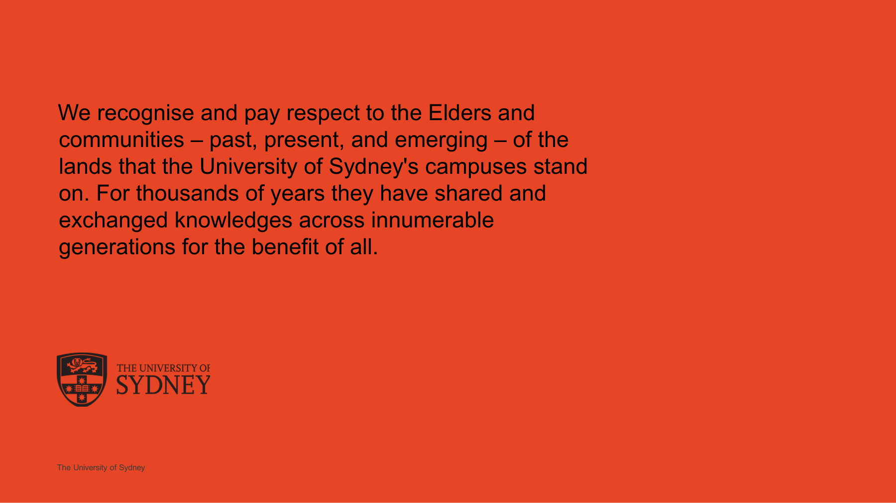
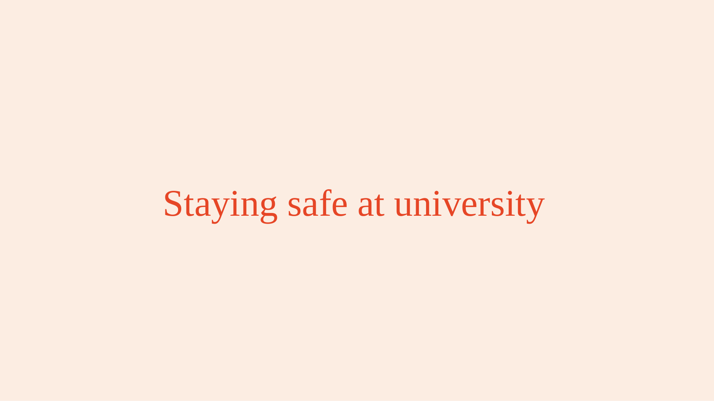
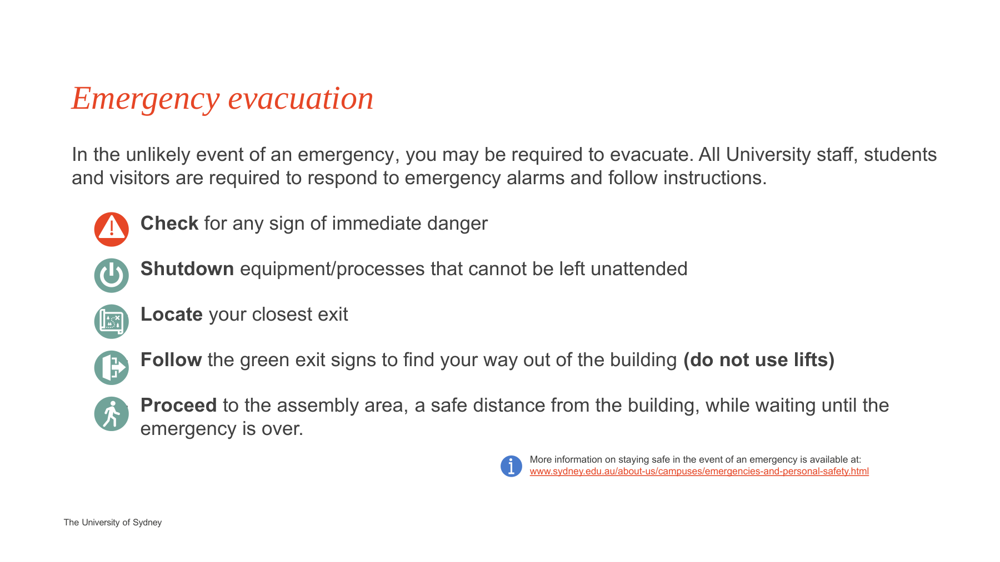

---

## 第 1 页

**提问：** 这张截图里的内容是什么意思？请面向初学者详细解释，分点讲清楚。

下面这张图是**悉尼大学（The University of Sydney）的一段“致谢土地与原住民长者”的声明**。它常见于澳大利亚高校、会议或网站，用来表达对当地原住民的尊重。

### 先给出通俗中文翻译

> 我们认识并致敬我们校园所在地土地上的**长者与社群**——无论是过去的、现在的，还是正在成长中的（未来的）。在几千年的时间里，他们将知识在无数代人之间**分享与传承**，造福所有人。

### 逐点解释

1. **“We recognise and pay respect（我们认识并致敬）”**
   表示正式地承认并尊重当地原住民及其文化、历史与贡献。

2. **“Elders（长者）”**
   指澳大利亚原住民与托雷斯海峡岛民社群中德高望重的长辈与文化守护者，他们在社区中承担传承知识、指导与领导的角色。

3. **“communities – past, present, and emerging（社群——过去、现在以及新生的）”**

   * *past*：已故的长者与早期社群；
   * *present*：当下在世并活跃的成员；
   * *emerging*：正在成长、将来会承担领导与传承职责的年轻一代。
     这句话强调**跨越时间的连续性**与对所有世代的尊重。

4. **“of the lands that the University of Sydney’s campuses stand on（悉尼大学校区所在的土地）”**
   意思是大学的各个校区都位于这些原住民传统土地之上，因此大学要向土地的“传统守护者”表达谢意。

   > 注：这类表达在澳大利亚被称为 **Acknowledgement of Country（致谢土地）**。

5. **“For thousands of years（数千年来）”**
   强调原住民文化与知识体系的**悠久历史**，远早于现代大学的建立。

6. **“they have shared and exchanged knowledges（他们分享并交流*多种*知识）”**
   这里用 *knowledges* 的复数，表示不仅是“科学知识”，还包括语言、环境与土地管理、艺术、法律、精神与仪式等**多元知识体系**。
   “分享与交流”说明知识是在社区与世代之间**传承与互动**的。

7. **“across innumerable generations（跨越无数代人）”**
   突出文化与知识**一代接一代**地延续。

8. **“for the benefit of all（造福所有人）”**
   说明这些知识不仅惠及原住民社群，也对更广泛社会有价值（例如可持续土地管理、医学与语言学等领域的启发）。

9. **图下角的校徽与校名**
   左下角是悉尼大学的校徽与英文校名，表示这段话是**学校的官方致谢**。

### 背景补充（给初学者）

* 在澳大利亚，公共活动、大学课程或网页开头常会出现这类**致谢土地/致谢原住民**的话，以表达对**传统土地守护者**的承认与尊重。
* 目的在于：**承认历史、尊重文化、促进理解与和解**，并提醒人们大学与机构是建在这些传统土地之上的。

如果你需要，我可以把这段英文改写成**更正式/更口语**的中英文版本，用在演讲或PPT里。

---

## 第 2 页

**提问：** 这张截图里的内容是什么意思？请面向初学者详细解释，分点讲清楚。

这张截图只有一行英文大字：**“Staying safe at university”**。
直译：**“在大学里保持安全 / 大学安全指南”**。
它通常是PPT里一个章节封面或标题页，提醒接下来会介绍如何在校园里保障安全与求助。

### 这句话在说什么（面向初学者）

1. **主题是“安全”**：不只指人身安全，还包括心理健康、财产与信息安全、实验与活动安全等。
2. **对象是“大学场景”**：校园、宿舍、图书馆、夜间出行、实验室、社团活动、线上学习环境等。
3. **目的**：让学生知道**有哪些风险、能用哪些服务、遇事怎么求助**，以及自己需要做什么。

### 这类标题后面通常会讲到的要点

* **紧急与非紧急求助**

  * 紧急：拨打当地紧急号码（例如澳大利亚是 **000**），或联系校园保安/紧急电话柱。
  * 非紧急：校园安保前台、学院办公室、学生服务中心、学校安全App/在线报案表。
* **个人与同伴安全**

  * 夜间结伴而行/使用校车与安全护送服务；告知行程；在人多明亮的区域走动。
  * 参加迎新或安全培训，了解校园地图与疏散路线。
* **心理健康与支持**

  * 学校心理咨询与危机支持渠道；如何预约、是否保密、是否免费。
* **骚扰、歧视与性同意（Consent）**

  * 校规与零容忍政策；遇到不当行为如何**记录、报案、获得支持**。
* **数字与信息安全**

  * 开启双重验证、谨防钓鱼邮件、保护密码与设备、谨慎公开个人信息。
* **财产与住宿安全**

  * 锁门锁柜、给自行车上锁、少带现金、为设备做标记/备份数据。
* **实验室/实地教学安全**

  * 穿戴防护装备、学习化学/生物/电气安全规程与急救、懂得事故上报流程。
* **健康与突发事件**

  * 校园急救、急救箱位置、火灾或极端天气时的疏散步骤与集合点。

### 新同学可用的“速查清单”

* 把**紧急电话**、校园安保电话与**位置**存进手机，并写在学生卡套里。
* 下载/启用学校的**安全App**（若有），打开定位与通知。
* 认识宿舍/学院的**安全负责人**与**学生服务**窗口。
* 走常用路线做一次**日/夜间演练**，找出最近的照明路与求助点。
* 为邮箱、学习平台开启**双重验证**；识别钓鱼邮件。
* 参加**实验/消防/性同意**等必修培训。
* 与同学建立**互相报平安**的习惯（特别是夜间返程或外出聚会后）。

> 小提示：这张截图只是一个**章节标题**，不含具体号码或校内政策。真正的细节（电话、地点、流程）请以你所在大学官网、迎新手册或课程PPT后续页面为准。
> 如果你告诉我学校名字或发来后续页，我可以把上面的清单**按你学校**做成更贴合的版本。

---

## 第 3 页

**提问：** 这张截图里的内容是什么意思？请面向初学者详细解释，分点讲清楚。

下面这页是悉尼大学的**紧急疏散指引（Emergency evacuation）**。当大楼里出现火警、化学泄漏、地震等突发事件时，大家要按这套步骤离开建筑。

## 一句话翻译

> 极少数情况下若发生紧急状况，你可能需要疏散。所有教职工、学生和访客都必须对**紧急警报**做出反应并**听从指示**。

## 图标+要点逐条解释

1. 🚨 **Check（检查是否有立即危险）**
   看到/闻到烟雾、火、气味，或听到警报、广播，就视为紧急情况。先环顾确认周围安全，再行动。

2. ⏻ **Shutdown（关闭不能无人看管的设备/流程）**
   正在运行的实验器材、明火、加热板、3D 打印机等，能**快速安全**地关就关；无法安全关闭就**立刻撤离**，不要为了关机耽误逃生。

3. 🧭 **Locate（找到最近的出口）**
   事先熟悉最近的**疏散路线与应急楼梯**。紧急时走离你**最近**且**安全**的那条路。

4. 🚪 **Follow（沿绿色出口标志前进，**不要坐电梯**）**
   跟着绿色“EXIT”标志走**楼梯**。

   * **为什么不能用电梯（lift）**：断电会被困、烟气像烟囱一样通过井道上升，极不安全。

5. 🏃 **Proceed（到达集合点并等待）**
   到大楼外指定的**集合区（assembly area）**，与同伴/老师**报平安并等候通知**。未经允许**不要返回**大楼。

## 新手可用的“3 步小流程”

1. 听到警报→带走手机/身份证件（不折返取物）
2. 快速安全停掉危险设备→按最近楼梯沿“绿色出口”疏散
3. 到集合点→报平安→等待工作人员指令

## 常见疑问

* **我行动不便/需要协助？** 提前告知课程负责人或安保；紧急时就地等待协助或前往**避难区**并拨打校园安保电话（或当地紧急号码）。
* **和访客在一起？** 一并带离并到集合点，说明你所在的课程/房间号。
* **实验室里？** 能安全的话关气源/电源/火源，不能则立即撤离并告知他人。

### 小词汇

* **lift** = 电梯
* **assembly area** = 集合点
* **green exit signs** = 绿色出口指示牌

> 提醒：这页是**总原则**。具体到你所在校区/大楼的集合点位置和安保电话，请查看本楼层平面图或学校官网/课程PPT的后续页面。
