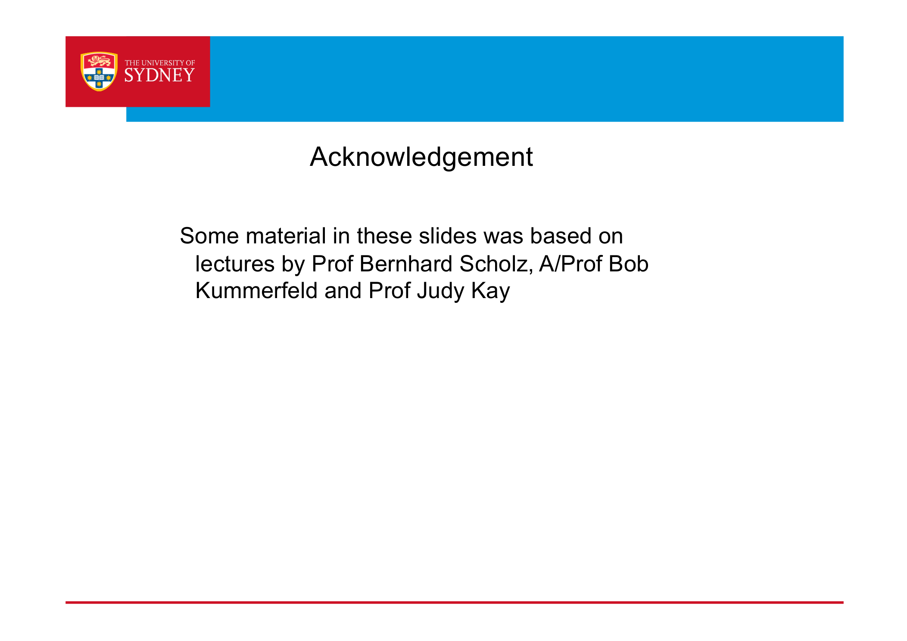
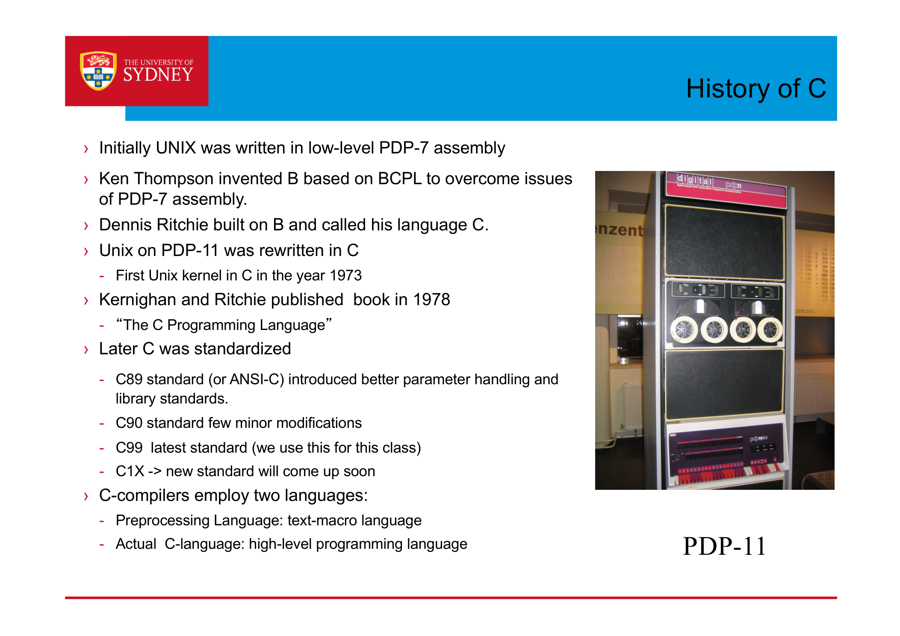
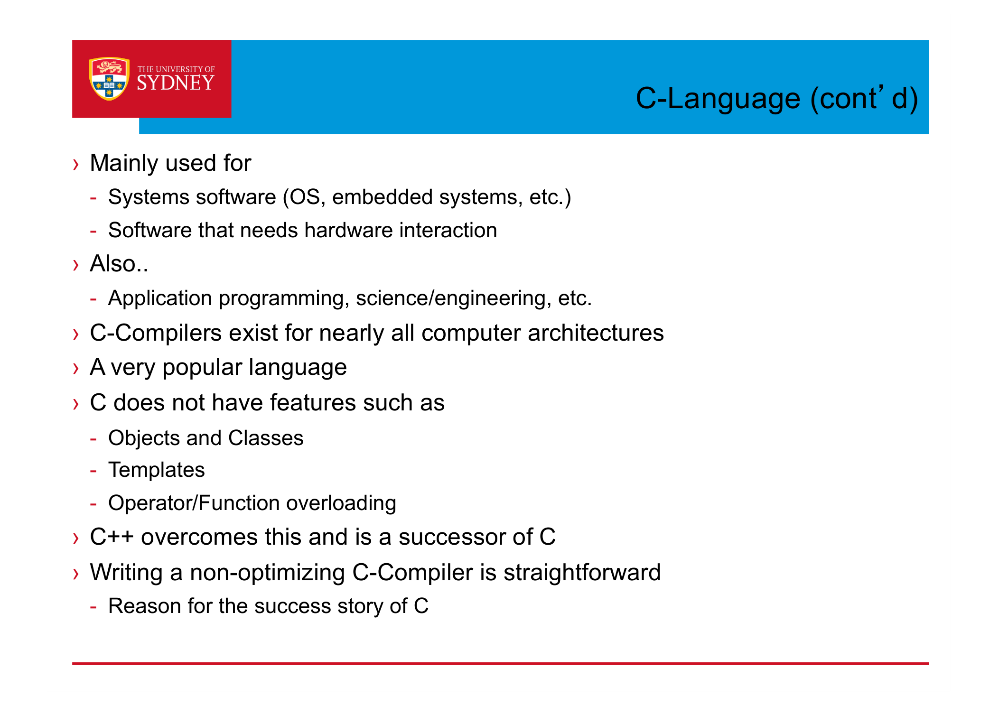

---

## 第 1 页

**提问：** 这张截图里的内容是什么意思？请面向初学者详细解释，分点讲清楚。

下面这页其实是**教学PPT里的“致谢页”（Acknowledgement）**。给初学者分点说明：

1. 页面在说什么（直译）

* 标题：Acknowledgement＝致谢。
* 正文：*“Some material in these slides was based on lectures by Prof Bernhard Scholz, A/Prof Bob Kummerfeld and Prof Judy Kay.”*
  → 意思是“本组幻灯片中的**部分内容**参考/改编自Bernhard Scholz 教授、Bob Kummerfeld **副教授**、Judy Kay 教授的**课程讲授**（lectures）”。

2. 关键词解释

* **slides**：演示文稿/幻灯片。
* **material**：材料，指文字、图表、例子、思路等。
* **was based on**：以……为基础、参考并整理，并不等于逐字照搬。
* **Prof**＝Professor（教授）；**A/Prof**＝Associate Professor（副教授）。

3. 标志与版式

* 左上是\*\*悉尼大学（The University of Sydney）\*\*的校徽与模板条带，说明这份PPT出自（或用于）该校相关课程/报告。

4. 为什么要放这页

* **学术诚信与版权意识**：借用了他人的讲义/图示/思路，需要**明确致谢**，告诉听众信息来源，避免抄袭误解。
* 也提示听众：内容里有部分并非演讲者原创。

5. 这页**不代表**的意思

* 并不表示被致谢的老师对PPT内容负责或背书；只是来源与灵感的说明。

6. 你能由此推断的场景

* 讲者可能在授课或汇报时，整合了以上几位老师的课堂内容/讲义制作了这套PPT。

7. 自己写致谢时的简易模板

* 英文：*“Some material in this presentation was adapted from lectures/slides by **Name**, **Affiliation** (Year).”*
* 中文：*“本报告部分内容参考/改编自**某某**（单位/课程/年份）的讲义/幻灯片，在此致谢。”*

> 总结：这张图就是一页**致谢声明**，礼貌而合规地说明：PPT里有些内容源自几位老师的课程。

---

## 第 2 页

**提问：** 这张截图里的内容是什么意思？请面向初学者详细解释，分点讲清楚。

这页是“C 语言的历史”概要。按初学者能懂的方式分点说明：

### 1) 这页想表达的主线

* **C 语言是为改进 UNIX 操作系统而诞生的**，从最早的汇编→B→C，并在 **PDP-11** 计算机上把 UNIX 重新用 C 写了一遍；随后 C 被**标准化**；编译 C 程序时会先做**预处理**再真正编译。右图就是当年的 **PDP-11** 机器。

### 2) 时间线（配术语解释）

* **最初 UNIX 用 PDP-7 的汇编语言编写**

  * *汇编（assembly）*：非常接近机器指令的低级语言，移植困难、开发慢。
  * *PDP-7*：DEC 公司60年代的小型机。
* **Ken Thompson 基于 BCPL 发明了 B 语言**（为摆脱汇编的不便）

  * *BCPL*：更高级的系统编程语言；B 是它的简化版。
* **Dennis Ritchie 在 B 的基础上设计了 C**

  * 目标：既接近硬件、效率高，又比汇编更易写、可移植。
* **UNIX 在 PDP-11 上用 C 重写**

  * *内核（kernel）*：操作系统的核心部分。
  * **1973 年**出现了用 C 写成的第一版 UNIX 内核——这让 UNIX 更易移植到不同硬件。
* **1978 年** Kernighan 与 Ritchie 出版经典教材 **《The C Programming Language》**（常叫 **K\&R**），推广了 C。
* **后来 C 被标准化**（为了不同编译器/平台一致）：

  * **C89 / ANSI C**：改进了参数处理、标准库规范等。
  * **C90**：在国际标准化（ISO）过程中的小改。
  * **C99**：新增 `//` 注释、可变长数组、`inline`、`long long` 等（这张幻灯片上说本课使用 C99）。
  * **C1X（即将发布）**：当时的占位称呼，后来正式成为 **C11**。
  * *补充给你：其后还有* **C17**（勘误版）和 **C23**（最新一版，语法与库又有改进）。

### 3) “C 编译器使用两种语言”是什么意思？

* **预处理语言（preprocessing language）**：在真正编译前做“文本级改写”。

  * 典型指令以 `#` 开头：`#include`（包含头文件）、`#define`（宏）、`#if/#endif`（条件编译）等。
  * 可以把它理解为“先把源文件按这些规则**替换/裁剪**一遍”。
* **实际的 C 语言**：预处理后的代码才交给编译器，编译成目标文件/机器码。

### 4) 这页图里的物件

* **PDP-11**：当年 DEC 的主流小型机，UNIX/C 的重要试验平台。右图就是其机柜外观。

### 5) 给初学者的小结

* C 诞生于**系统软件开发**的实际需求（重写 UNIX），特点是**高效、可移植、贴近硬件**。
* 学习路径：先掌握 **C 基本语法与标准库**，再熟悉 **预处理** 与 **标准（C99/C11 及以上）** 的差异与常用特性。

---

## 第 3 页

**提问：** 这张截图里的内容是什么意思？请面向初学者详细解释，分点讲清楚。

这页是对 **C 语言用途与特性** 的续讲。给初学者分点解释如下：

### 1) C 主要用来做什么

* **系统软件**：如操作系统（OS）、驱动、数据库内核、编译器自身、嵌入式固件等。
  *原因：C 接近硬件、效率高、可精细控制内存与寄存器。*
* **需要直接跟硬件打交道的软件**：比如设备驱动、单片机程序、实时控制系统。

### 2) 还能用在什么场景

* **通用应用与科学/工程计算**：命令行工具、图形库、数值计算库、网络库等。很多高层语言（Python、Ruby 等）的**底层扩展/解释器**也是用 C 写的。

### 3) “编译器几乎覆盖所有架构”

* 几乎所有 CPU 架构（x86、ARM、RISC-V、MIPS…）都有 **C 编译器**。
  *意义：同一份 C 代码更容易移植到不同硬件上（跨平台）。*

### 4) C 很流行（为什么）

* 历史悠久生态大、性能稳定可预期、与操作系统/库接口紧密、各平台都有编译器与工具链。

### 5) C **没有**哪些语言特性（跟 C++ 等对比）

* **对象/类（OOP）**：C 只有 `struct` 和函数，没有“类”的封装/继承/多态机制。
* **模板（templates）**：没有类型参数化；常用宏或手工实现泛型。
* **重载（overloading）**：同名函数或运算符不能按参数类型区分；需要不同函数名（如 `abs`, `labs`, `llabs`）。

> 这让 C 更“简洁朴素”，但表达抽象时需要更多样板代码。

### 6) C++ 的关系

* **C++ 在 C 基础上扩展**了面向对象、模板、运算符/函数重载等能力，因此被称为 C 的“继承者/后继”。
* 但 **C 并未被取代**：当你要极致控制、依赖小、可移植且可预测的性能时，C 仍是首选；当需要强抽象与大型工程管理时，C++ 更合适。

### 7) “写一个不做优化的 C 编译器很容易”是什么意思

* **编译器**把 C 源码翻成机器码；**优化**是让机器码更快/更小的高级步骤。
* **不做优化**的 C 编译器实现相对直观，因此早期很多硬件厂商能**很快提供 C 编译器** → 促进了 C 的普及（“成功故事”的重要原因）。
  *一旦有了编译器，库与系统就会围绕它发展，生态越滚越大。*

---

**一句话总结**：
C 是贴近硬件又相对高级的“通用系统编程语言”。它在几乎所有平台可用、生态庞大、性能可靠；缺少面向对象/模板/重载等高层特性，但正因简洁与可移植，成为系统软件与嵌入式开发的基石，而 C++ 则在此之上提供了更强的抽象能力。
