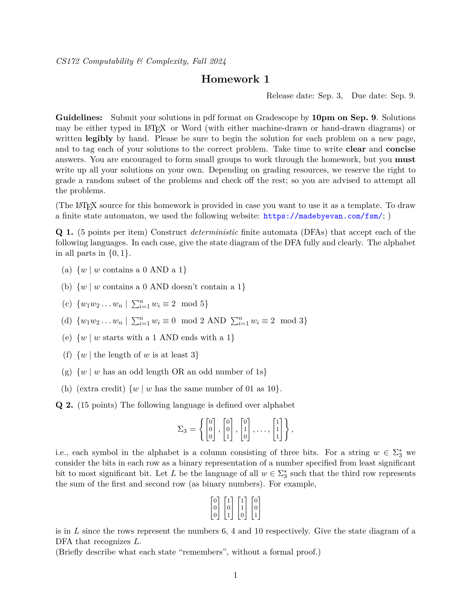
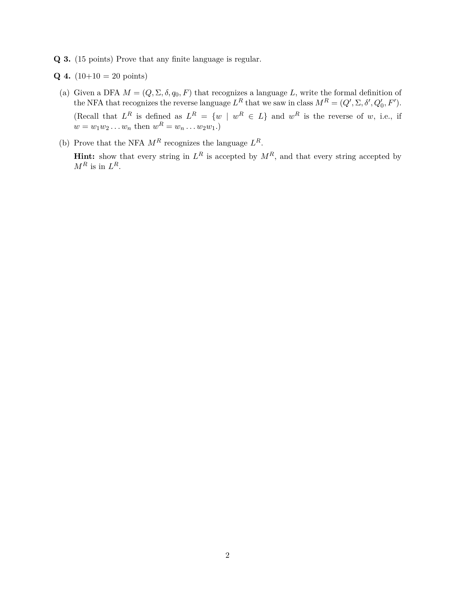

---

## 第 1 页



**提问：** 对截图中的内容逐句详细使用中文解释，不仅仅只是翻译，还需要对它们进行适当的解释,告诉我该怎么教学生并且指导怎么做

好的，下面我将**逐句详细解释截图中的内容（英文作业页）**，并且**告诉你该怎么教学生理解与完成这份作业**。我会分成几个部分，每部分都包含原文句子、中文翻译、再加教学与指导说明。

---

## 🧭 整体背景说明

这份作业标题是：

> **CS172 Computability & Complexity, Fall 2024 — Homework 1**

也就是说，这是\*\*计算理论（可计算性与复杂性）\*\*课程的第一次作业，针对大学高年级或研究生级别的学生。

主题主要涉及：

* **确定性有限自动机（DFA）**
* **形式语言与计算模型**
* **构造与理解自动机的能力**

---

## 📅 时间与要求部分

> **Release date: Sep. 3,  Due date: Sep. 9.**

📖 翻译与解释：

* 作业发布于 **9月3日**
* 截止日期为 **9月9日**

教学说明：

* 要提醒学生这是一周的周期，时间较短，需要尽早动手。
* 可以建议学生先画图草稿，再整理成清晰的PDF。

---

## 📋 Guidelines（指导说明）

> Submit your solutions in pdf format on Gradescope by 10pm on Sep. 9.
> Solutions may be either typed in LaTeX or Word (with either machine-drawn or hand-drawn diagrams) or written legibly by hand.

📖 翻译：
请在 **9月9日晚10点前** 将PDF格式的作业上传到 **Gradescope**。
解答可以：

* 用 **LaTeX** 或 **Word** 打字完成；
* 图可以用电脑绘制或手绘；
* 也可以手写答案，但要工整清晰。

教学建议：

* 教学生使用 [https://madebyevan.com/fsm/](https://madebyevan.com/fsm/) 来画自动机图。
* 讲解 LaTeX 的优势：清晰、便于标注状态机与公式。
* 如果学生不熟悉 LaTeX，可使用 Word + 插图。

---

> Be sure to begin the solution for each problem on a new page, and to tag each of your solutions to the correct problem.

📖 翻译：
每道题的答案要从新的一页开始，并在 Gradescope 上标记清楚每道题对应的部分。

教学建议：

* 强调在 Gradescope 上“标题对应问题”的功能（否则助教批改时会丢分）。
* 教学生分题编号，如 “Q1(a)”, “Q1(b)”, “Q2”等。

---

> Take time to write clear and concise answers. You are encouraged to form small groups to work through the homework, but you must write up all your solutions on your own.

📖 翻译：
写答案时要**清晰简洁**。
鼓励你与同学讨论，但**必须独立完成书面作业**。

教学建议：

* 告诉学生可以**一起讨论概念与思路**，但不能抄答案。
* 教他们如何解释 DFA 的“设计逻辑”，而不仅是画出图。

---

> Depending on grading resources, we reserve the right to grade a random subset of the problems and check off the rest.

📖 翻译：
老师/助教可能只会随机批改部分题目，其余题目只做“完成检查”。

教学建议：

* 鼓励学生**所有题都做**，因为不知道哪题会被抽查。
* 告诉他们“不要赌运气”，因为通常难题也可能被抽中。

---

> The LaTeX source for this homework is provided... [https://madebyevan.com/fsm/](https://madebyevan.com/fsm/)

📖 翻译：
作业的 LaTeX 模板已提供，如果想画有限状态自动机，可以使用这个在线工具。

教学建议：

* 演示如何使用该网站：拖动节点画状态，添加箭头表示转移。
* 帮助学生熟悉 DFA 图形化表示的标准格式（起始箭头、终止状态等）。

---

## 🧩 Q1 — DFA 设计题（每小题 5分）

> Construct deterministic finite automata (DFAs) that accept each of the following languages.
> Give the state diagram of the DFA fully and clearly.

📖 翻译：
构造确定性有限自动机（DFA），使其能识别下列语言。
每题画出完整、清晰的状态图。

教学指导：

* 教学生 **DFA 的基本定义**：

  * 状态集合 Q
  * 输入字母表 Σ
  * 转移函数 δ
  * 初始状态 q₀
  * 接受状态集合 F
* 提醒学生：每个小题都是一个独立的语言，都需要**单独画 DFA**。

---

### (a) `{ w | w contains a 0 AND a 1 }`

📖 翻译：
包含至少一个 `0` 且至少一个 `1` 的字符串。

教学讲解：

* 可以设计 4 个状态：

  1. 初始状态（还没见过0或1）
  2. 见过0
  3. 见过1
  4. 见过0和1（接受状态）
* 教学生画出所有转移。

---

### (b) `{ w | w contains a 0 AND doesn’t contain a 1 }`

📖 翻译：
包含至少一个 `0`，但不包含任何 `1` 的字符串。

教学要点：

* 强调“包含0”且“没有1”。
* 一旦出现1，就进入“死状态”。
* 设计3个状态即可。

---

### (c) `{ w = w₁w₂…wₙ | Σ wᵢ ≡ 2 mod 5 }`

📖 翻译：
字符串中所有符号（假设0和1是数值）之和模5余2。

教学方法：

* 这题考察**模运算自动机**。
* 每个状态代表“当前总和 mod 5 的结果”（即状态0\~4）。
* 接受状态是余数为2的状态。

---

### (d) 模2与模3联合条件

📖 翻译：
要求总和 ≡ 0 (mod 2) 且 ≡ 2 (mod 3)。

教学指导：

* 教学生用**笛卡尔积法构造DFA**：

  * 构造两个自动机（模2、模3），然后组合状态。
  * 最终接受状态为满足两个条件同时成立的状态对。

---

### (e) `{ w | w starts with a 1 AND ends with a 1 }`

📖 翻译：
以1开头、以1结尾的字符串。

教学指导：

* 状态要记住“是否已读第一个字符”，以及“最后一个字符是否是1”。
* 教学生用“记忆最后符号”的方式设计转移。

---

### (f) `{ w | the length of w is at least 3 }`

📖 翻译：
字符串长度 ≥ 3。

教学指导：

* 每个状态代表“当前长度”：0,1,2,≥3。
* 第四个状态为接受状态（并保持自环）。

---

### (g) `{ w | w has an odd length OR an odd number of 1s }`

📖 翻译：
长度为奇数，或者包含奇数个1的字符串。

教学指导：

* 这题可使用 **并集的 DFA** 概念。
* 两个条件都可以单独构造 DFA，再取并集。
* 状态可以定义为（长度奇偶，1的奇偶）。

---

### (h) （额外加分题）

> `{ w | w has the same number of 01 as 10 }`

📖 翻译：
`01` 与 `10` 的出现次数相等。

教学指导：

* 这题较难，考察**模式平衡**。
* 可以用状态表示“上一个字符是什么”与“01-10差值”。
* 教学生从小样例入手推理。

---

## 🧮 Q2 — 三行二进制语言题（15分）

> The following language is defined over alphabet Σ₃ = { \[0;0;0], \[0;0;1], …, \[1;1;1] }.

📖 翻译：
每个符号是一个“3位二进制列向量”，例如：

```
[0]
[1]
[1]
```

表示每一行都是一个二进制位。

---

> ... consider the bits in each row as a binary representation of a number.

📖 翻译：
把每一行看作一个二进制数（从最低位到最高位）。

---

> L = { w | 第三行的数值 = 第一行 + 第二行 }

📖 翻译：
语言 L 包含所有满足 “第三行 = 前两行之和” 的字符串。

教学讲解：

* 这是一个**加法自动机（binary adder DFA）**。
* 每个状态“记忆”是否有进位（carry）。
* 输入符号是三位列，每次读一列。

---

> Give the state diagram of a DFA that recognizes L.
> (Briefly describe what each state "remembers")

📖 翻译：
画出识别该语言的 DFA 图，并简要描述每个状态“记住”什么信息。

教学指导：

* 重点：**每个状态 = 当前进位（carry）**
* 状态集合通常是 `{carry = 0, carry = 1}`。
* 如果在某列的和与第三行不匹配，则进入拒绝状态。

---

## 🧑‍🏫 教学建议总结

| 教学重点       | 说明                                    |
| ---------- | ------------------------------------- |
| **分解问题**   | 每题独立分析语言特征（是否涉及模运算、长度、开头结尾、计数等）。      |
| **画状态图**   | 从最小状态开始思考，保持逻辑清晰。                     |
| **验证样例**   | 用短字符串测试DFA设计是否正确。                     |
| **强调逻辑表达** | 学生要学会写出状态含义，如：“状态 q2 表示‘已经看到1但未看到0’”。 |
| **培养思维习惯** | 强调形式化表达 + 图示理解两者结合。                   |

---

是否希望我帮你为其中一题（比如 Q1(a) 或 Q2）**画出完整的 DFA 图并附中文讲解过程**？
这样可以直接作为你教学的范例用。


---

## 第 2 页



**提问：** 对截图中的内容逐句详细使用中文解释，不仅仅只是翻译，还需要对它们进行适当的解释,告诉我该怎么教学生并且指导怎么做

太好啦！这页主要是 **Q3 与 Q4**，围绕“**有限语言是正则的**”与“**语言反转的自动机构造与证明**”。下面我按**逐句→翻译→扩展解释→教学怎么讲&学生怎么做**的结构来拆解。

---

# Q3 （15 分）

> **Prove that any finite language is regular.**
> **证明任何有限语言都是正则语言。**

## 怎么讲给学生

1. **回顾定义**：正则语言 = 能被某个 DFA/NFA 识别的语言（或能被正则表达式生成）。
2. **给出两种常见证明法**（任选其一都可拿满分，最好两种都讲）：

   * **构造法（Trie/前缀树）**：对有限集合 $L=\{w_1,\dots,w_k\}$ 把所有单词挂在同一棵前缀树上，叶子或中间“完整单词处”设为接受态；不存在的边指向“死状态”。这是显式构造一个 DFA。
   * **闭包法**：先证明任意**单元素集合** $\{w\}$ 是正则的（构造一个只接受 $w$ 的 DFA）；再用**有限并封闭性**（正则语言对有限并集封闭）推出有限集合 $L=\bigcup_{i=1}^k \{w_i\}$ 也是正则。

## 学生落地步骤（建议写法）

* **步骤1**：给出只接受某个固定串 $w=a_1a_2\cdots a_n$ 的 DFA（$n+2$ 个状态：起始 $q_0$，每读对一个符号推进到下一状态；出错就去死状态；读完在 $q_n$ 接受）。
* **步骤2**：说明 $\{w\}$ 正则。
* **步骤3**：说明“正则对有限并封闭”，因此任意有限 $L$ 正则。
* **可选**：画一个三词示例的前缀树 DFA，帮助阅卷者迅速确认理解。

## 评分提示（给你当老师用）

* 有**清晰的构造或闭包论证**（8 分）
* **形式化描述或图**（4 分）
* **文字论证完整、无漏洞**（3 分）

---

# Q4 （10+10 = 20 分）

> (a) **Given a DFA $M=(Q,\Sigma,\delta,q_0,F)$ that recognizes a language $L$, write the formal definition of the NFA that recognizes the reverse language $L^R$** that we saw in class $M^R=(Q',\Sigma,\delta',Q_0',F')$.
> （已知 $M$ 识别 $L$，请**形式化写出**识别反转语言 $L^R$ 的 **NFA** 的定义。）

> **Recall** that $L^R=\{\,w\mid w^R\in L\,\}$ and $w^R$ is the reverse of $w$.
> （回忆：$L^R$ 的定义是把所有串反过来。）

> (b) **Prove that the NFA $M^R$ recognizes $L^R$.**
> **证明**你在 (a) 构造的 $M^R$ 的确识别 $L^R$。

> **Hint**: show both directions—every string in $L^R$ is accepted by $M^R$, and every string accepted by $M^R$ belongs to $L^R$.
> （提示：做双向包含。）

---

## Q4(a) 标准构造（逐句+形式化写法）

**直觉**：把原 DFA 的**边全部反向**；把**原终态**当作**新的起点**（因起点可能不止一个，NFA 更合适）；把**原起点**当作**新的终态**。读串也要反向，这样刚好对应“反串”。

**形式化定义**（建议学生直接抄这套模板）：

* $Q' = Q\cup\{q_{\text{new}}\}$（也可不加新点，直接把原 $F$ 作为起始集合；两种写法都对）
* 字母表：$\Sigma'=\Sigma$
* **转移函数 $\delta'$**：对任意边 $\delta(p,a)=q$（即 $p\xrightarrow{a}q$），在 $M^R$ 中加入**反向边** $q\xrightarrow{a}p$。
  形式写法：$\forall p,q\in Q,\forall a\in\Sigma,\ \ p\in\delta'(q,a)\iff \delta(p,a)=q$。
* **起始部分**（二选一）
  **写法 A（更规范）**：新增 $q_{\text{new}}$ 为**唯一起始状态**，并对每个 $f\in F$ 加一条 $\epsilon$-边：$q_{\text{new}}\xrightarrow{\epsilon} f$。于是

  $$
  Q_0'=\{q_{\text{new}}\},\quad
  \delta'(q_{\text{new}},\epsilon)=F.
  $$

  **写法 B（也常用）**：不加新点，**把 $F$ 当作一组起始状态**：$Q_0'=F$。
  （二者等价，老师一般都接受其中之一。）
* **接受集**：$F'=\{q_0\}$（原起始变新终止）。

> **课堂强调**：必须说明“这是一个 **NFA**”，因为**多起点/ε 转移**超出了 DFA 的限制。

---

## Q4(b) 正确性证明（怎么教）

**目标**：证明 $L(M^R)=L^R$。分两步（提示也这样要求）：

### (I) 设 $w\in L^R$，证 $M^R$ 接受 $w$

* $w\in L^R\Rightarrow w^R\in L$。
* 在原 DFA $M$ 中，存在从 $q_0$ 读 $w^R$ 到某个 $f\in F$ 的**唯一路径**。
* **把这条路径反过来**：从 $f$ 沿**反向边**读 $w$ 回到 $q_0$。
* 在 $M^R$ 中我们**正是**从某个起点（写法 A 的 $q_{\text{new}}$ 经 $\epsilon$ 到 $f$；或写法 B 直接从 $f$）出发，通过反向边读 $w$，到达接受态 $q_0$。
* 故 $M^R$ 接受 $w$。

### (II) 设 $M^R$ 接受 $w$，证 $w\in L^R$

* $M^R$ 接受 $w$：存在从某个起点（某个 $f\in F$ 或经 $\epsilon$ 到 $f$）读 $w$ 到达 $q_0$ 的路径。
* **把这条路径再反过来**：在 $M$ 中从 $q_0$ 读 $w^R$ 到 $f\in F$。
* 因此 $w^R\in L$，故 $w\in L^R$。

**结论**：双向包含成立，$L(M^R)=L^R$。

---

## 学生作答清单（防丢分）

* **Q4(a)**：给出 $M^R$ 的 **五元组**（或四元组+起始集合），明确：

  * $Q',\Sigma,\delta',Q_0',F'$
  * $\delta'$ 的**反向边定义**
  * 起始/接受集合的**对应关系**
  * 是否采用 **ε-起始** 或 **多起点**（任选其一，但要说清）
* **Q4(b)**：写**两段式证明**（→ 与 ←），每段都要说明“反向路径与 $\epsilon$-起点/多起点”的衔接。
* （可选加分）画一个小示例 DFA，再画其反转 NFA，配合一条样例串演示路径反转。

---

## 课堂/助教实操建议

* **黑板演示一个玩具 DFA**（比如识别以 01 结尾的串），**当场画出反向 NFA**，让学生用 3 个样例串验证。
* **练习对比**：让学生思考“为什么一定要 NFA 而不是 DFA？”（多起点/ε 边的必要性）。
* **常见坑提醒**

  1. 忘记把原起点 $q_0$ 设为新接受态。
  2. 把“反向边”写成“同向边”。
  3. 只写直觉，不给五元组/形式化定义。
  4. 证明只写一侧包含。

---

## 示范答案骨架（学生可直接按此组织）

**Q3**

* 构造只接受 $w$ 的 DFA（附图/附五元组）。
* 由此 $\{w\}$ 正则；正则对有限并封闭；故任意有限 $L$ 正则。∎

**Q4(a)**
给出 $M^R=(Q',\Sigma,\delta',Q_0',F')$，其中

* $Q'=Q\cup\{q_{\text{new}}\}$, $\Sigma$ 同上，$F'=\{q_0\}$，$Q_0'=\{q_{\text{new}}\}$，$\delta'(q_{\text{new}},\epsilon)=F$；
* $\forall p,q,a$，若 $\delta(p,a)=q$，则 $p\in\delta'(q,a)$。

**Q4(b)**

* 若 $w\in L^R\Rightarrow w^R\in L$，用 $M$ 中路径反向得到 $M^R$ 接受 $w$。
* 若 $M^R$ 接受 $w$，反向路径说明 $M$ 接受 $w^R\Rightarrow w\in L^R$。
* 故 $L(M^R)=L^R$。∎

---

需要的话，我也可以把 **Q3 的“前缀树 DFA 示意图”** 或 **Q4 的“反向构造小例子图”** 画出来，配上中文讲解，直接给你当课上/答疑用讲义。


---

## 第 1 页


**提问：** 对截图中的内容逐句详细使用中文解释，不仅仅只是翻译，还需要对它们进行适当的解释,告诉我该怎么教学生并且指导怎么做

> ⚠️ 本页多次重试仍超时，稍后请手动重试。

原因：Message: 多次重试后仍超时（共 5 次），请稍后再试。


---

## 第 2 页


**提问：** 对截图中的内容逐句详细使用中文解释，不仅仅只是翻译，还需要对它们进行适当的解释,告诉我该怎么教学生并且指导怎么做

> ⚠️ 本页多次重试仍超时，稍后请手动重试。

原因：Message: 多次重试后仍超时（共 5 次），请稍后再试。

