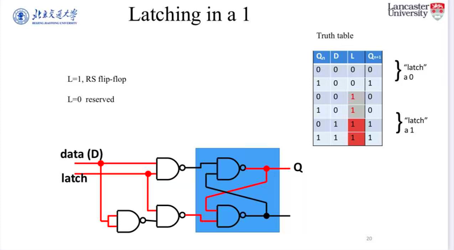
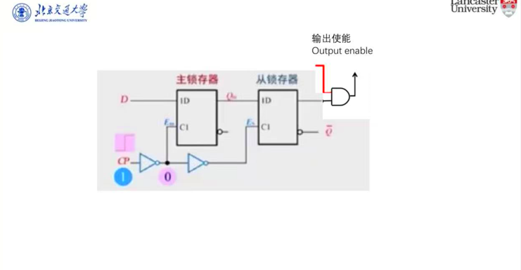

这页课件的标题是：

- **Topic 4: Building memory** —— 主题四：**构建存储（记忆）**
- **Flip-flop 触发器**
- **Register（寄存器） and Counter（计数器）**

意思：这一章要讲如何在数字电路里“记住”信息；核心器件是**触发器**，由触发器组成**寄存器**，寄存器再配上时序逻辑就能做**计数器**等更复杂的存储/序列功能。

# 1) 触发器（Flip-flop，中文常叫“触发器”）

**作用**：存一位（二进制 0/1）数据，并在**时钟沿**（上升沿或下降沿）到来时，**同步**更新。
 **关键点**：

- **Q**：输出（当前存的位）。
- **D/JK/T/SR**：不同输入形式。
- **CLK**：时钟；只有在指定边沿到来时，输入才会被“采样”并写入。
- **异步清零/置位（CLR/SET）**：不等时钟，立刻清 0 或置 1（有些器件提供）。

**常见类型**（了解即可）：

- **D 触发器**：最常用。时钟沿到来时，Q ← D。适合做寄存器。
- **SR 触发器**：S 置 1，R 置 0（S=R=1 非法/保留）。
- **JK 触发器**：J=1,K=0 置 1；J=0,K=1 置 0；J=K=1 翻转。
- **T 触发器**：T=1 时每个时钟**翻转**；T=0 保持。

**时序约束**（工程里非常重要）：

- **建立时间（setup）**：时钟沿到来前，输入必须稳定一小段时间。
- **保持时间（hold）**：时钟沿之后，输入还需继续稳定一小段时间。
- **亚稳态**：若违反上述约束，输出可能短暂“不确定”，需用同步器等手段避免。

# 2) 寄存器（Register，寄存器）

**作用**：一次存**多位**数据（比如 8 位、32 位）。
 **实现**：把若干个 D 触发器并排放——每个触发器存一位，同一个时钟同步写入。
 **用法**：

- **数据缓冲/流水线级**：在每个时钟“锁存”一批数据，形成时序边界。
- **配置/状态寄存器**：保存控制位、状态位。
- **移位寄存器**：把触发器串起来，时钟来时位向左/右移动，用于串并转换、序列产生。

**术语**：

- **并行加载（parallel load）**：一次性写入多位。
- **使能（enable）**：只有使能=1 时才在时钟沿更新，否则保持原值。
- **清零/置位**：初始化或快速恢复到已知状态。

# 3) 计数器（Counter，计数器）

**作用**：按照时钟“数数”，按顺序产生 0,1,2,…（或相反），常用于分频、定时、地址遍历。
 **实现**：在寄存器基础上，加上**加法器/控制逻辑**或用 T/JK 触发器级联。

**分类**：

- **向上/向下/可逆计数器**：递增、递减或双向。
- **模 N（mod-N）计数器**：数到 N−1 后回到 0（例如模-10 做十进制计数）。
- **异步（ripple）计数器**：低位翻转作为高位的“时钟”，简单但**传播延迟累积**。
- **同步计数器**：所有触发器同一时钟驱动，速度更高、时序更可控（实际设计更常用）。
- **可预置/加载（preset/load）**：可把计数器设置到任意起始值。

**小例子**：

- 一个 4 位向上模-16 同步计数器：每个时钟沿，Q ← Q + 1（溢出回 0）。
- 一个分频器：让计数器在达到某值时翻转输出，就得到时钟的 1/2、1/4、…频率。

# 4) 三者关系 & 为何“构建存储”

- **触发器**：最基本的**一位存储单元**（边沿触发）。
- **寄存器**：把很多触发器**并联**，组成多位存储（一次存一字）。
- **计数器**：在寄存器上加组合逻辑，形成**自动按序变化**的状态机（记住“当前计数”）。
   这就是数字系统里从“位存储”到“字存储”再到“时序控制”的**层层构建**。

# 5) 你可能会遇到的典型图/符号（阅读提示）

- D 触发器方块，带 D 输入、Q 输出、时钟符号（有时带小三角表示**沿**触发，气泡表示**低有效**）。
- 多个 DFF 并排 + 同一时钟线 = **寄存器**。
- 寄存器输出接**加法器**（+1），回写寄存器 = **同步计数器**。
- **CLR/RESET**、**EN**、**LOAD** 等控制脚，注意高/低有效（常用小圆点“○”标注低有效）。

如果你愿意，我可以画几个简单的时序/真值表或给出 Verilog/VHDL 的最小实例，帮助你更直观地理解。


这是一个**S-R 触发器（更准确说是 S-R 锁存器 / SR latch）\**的示意图。图里用的是\**两级交叉反馈的 NAND 门**，因此**输入是低有效**：给 0 表示“动作”，给 1 表示“无动作”。

# 电路怎么看

- 左边上下两个是 **NAND 门**（输出端的小黑圈表示“非”）。
- 上门输出是 **Q**，下门输出是 **Q′**（Q 的反相），两者互为反馈：Q 反馈到下面门的一个输入，Q′ 反馈到上面门的一个输入。
- 左侧两个外部输入分别叫 **S**（Set，置位）和 **R**（Reset，复位）。因为是 NAND 结构，**S、R 为 0 时起作用**。


# 基本工作规律（NAND 型，低有效）

| S    | R    | 结果（Q 的变化）                                        |
| ---- | ---- | ------------------------------------------------------- |
| 1    | 1    | **保持**原值（不变）                                    |
| 0    | 1    | **置位**：Q → 1                                         |
| 1    | 0    | **复位**：Q → 0                                         |
| 0    | 0    | **不允许/非法**：两门都被强迫，释放后可能不确定（亚稳） |

图中中文注释正对应：

- 左上“**S=0, R=1; Q=1 置位**”
- 右上“**S=1, R=0; Q=0 复位**”
- 下方“**R=S=1, Unchanged（保持）**；**R=S=0, not allowed（不允许）**”

# 发生了什么（直观推演）

1. **置位（S=0, R=1）**
   - 上门的一个输入被拉到 0，NAND 输出必为 1，所以 **Q 被拉到 1**；
   - Q=1 通过反馈喂到下门，使下门两个输入都为 1（因为 R=1），所以下门输出 **Q′=0**；
   - 这时（Q, Q′）稳定在（1, 0）。
2. **保持（S、R 都回到 1）**
   - 两个外部输入都无动作；由于交叉反馈，门的输入仍被 Q/Q′ 维持，**电路“记住”了上一步的状态**。
3. **复位（S=1, R=0）**
   - 类似推理：下门被强迫输出 1，因此 **Q′=1**，进而使上门输出 **Q=0**，最终（Q, Q′）稳定在（0,1）。
4. **非法情况（S=0, R=0）**
   - 两个 NAND 都被强迫输出 1，得到（Q, Q′）=（1,1），这与互为反相的期望相矛盾；
   - 一旦同时把 S、R 从 0 放回 1，谁先释放、谁的传播延迟稍短，电


这是在介绍一种最基础的时序电路——**S-R 触发器（SR flip-flop）**，这里讲的是**低电平有效**的 SR 触发器（通常由两只 NAND 门交叉反馈构成）。要点如下：

# 它是干什么的

- **记忆**电路：能长期保持两种稳定状态之一（Q=1 或 Q=0），因此可存储 1 bit。
- 有两个输出：**Q** 和 **Q’（\overline{Q}）**，理想情况下二者互补。
- 之所以能“记忆”，是因为电路内部做了**反馈**（输出再喂回输入）。

# 记号说明

- **Qₙ**：当前（现在）状态。
- **Qₙ₊₁**：下一个状态（在给定输入 S、R 的作用后会到达的状态）。
- 幻灯片里的 “Qₙ 表示无输入、Qₙ₊₁ 表示有输入” 可以理解为：当没有新的置/复位脉冲时，状态保持为 Qₙ；当施加了输入后，电路转到 Qₙ₊₁。

# 输入与输出的关系（低有效）

这里的 **S**（Set）和 **R**（Reset）都是**低脉冲有效**：

- **S 出现一个低脉冲** → 置位：**Q 被设为 1**（记住“1”）。
- **R 出现一个低脉冲** → 复位：**Q 被设为 0**（记住“0”）。
- 当 S 或 R 的低脉冲结束、信号回到高电平后，**Q 会保持刚才的状态不变**，这就是“记忆”。

可以用真值表（以 S、R 的电平为准）概括：

| S    | R    | Qₙ₊₁（下一个 Q） | 含义                         |
| ---- | ---- | ---------------- | ---------------------------- |
| 1    | 1    | Qₙ（保持）       | 无操作，保持原值             |
| 0    | 1    | 1                | 置位（Set）                  |
| 1    | 0    | 0                | 复位（Reset）                |
| 0    | 0    | **非法/不允许**  | 同时置位和复位，结果不可预测 |

> 幻灯片最后一句 “不允许 S 和 R 同时为低” 就是强调 **(S=0, R=0) 是禁用组合**。
>  对于 NAND 型 SR 触发器，S=R=0 时会让两个输出都变为 1；当它们同时回到 1 时，由于两条信号谁先到、器件延迟等微小差异不同，最终落到 Q=1 或 Q=0 **不可预测**，甚至可能出现短暂的**亚稳态**。因此在设计上必须避免让 S 与 R 同时为低。

# 关于“脉冲”的理解

- 幻灯片说的是“**一个低脉冲**”——这说明该器件是**电平敏感**的锁存器（latch）行为：只要 S 或 R 被拉低到一定时间，电路就响应；拉回高电平后就“记住”那次操作。
- 与之相对，**边沿触发的触发器**（如 D 触发器）只在时钟上升/下降沿采样；而这里没有时钟，完全由 S、R 的电平决定。

# 小结（一句话）

这是**低有效 SR 触发器**的基本工作原理：

- S=0 → Q=1；R=0 → Q=0；S=R=1 → 保持；**S=R=0 禁止**。
   它利用交叉反馈来“记住”上次被置位或复位后的状态。


这页讲的是**组合逻辑**（combinational logic）与**时序逻辑**（sequential logic）的区别，以及“反馈”如何让电路拥有**记忆**。

# 1) 组合逻辑 = 只看“现在的输入”

- **定义**：输出**仅仅**是**当前输入**的函数，和历史无关。
   公式化：`Y(t) = F(X(t))`
- **特性**：没有存储元素（没有“状态”），没有时钟。改变输入后，传播延迟过后输出立即随之确定。
- **例子**：加法器（ALU 的加/与/或）、多数表决器（voter）、编码器/解码器、多路复用器（MUX）、比较器、生成 flags（零/进位/溢出）等。

# 2) 时序逻辑 = 看“输入 + 之前的输出（状态）”

- **定义**：输出是**当前输入**和**当前状态**（由**之前的输出**经存储保存而来）的函数。
   公式化（Mealy 型做参考）：

  ```
  状态更新：S(t+1) = G(S(t), X(t))
  输出：    Y(t)   = H(S(t), X(t))   （或 Moore：Y(t)=H(S(t))）
  ```

- **关键**：有**存储元件**（寄存器/触发器）保存“当前输出/状态”。

- **时钟**：大多数时序逻辑用时钟边沿在寄存器里**同步更新**状态。

- **例子**：寄存器、移位寄存器、计数器、定时器、有限状态机（协议控制器）、流水线寄存器等。

# 3) “反馈（feedback）”让电路会记忆

- **含义**：把**输出的一部分**回送到**输入**路径（通常经寄存器/触发器）。
- **作用**：形成“状态回路”，电路不再只由当下输入决定；它会记住**上一个时刻**的信息 ⇒ **记忆（memory）**的基础。
- **直观例子**：
  - **计数器**：`Q_next = Q + 1`。这里 `Q` 是上个周期的输出（状态），通过寄存器反馈回来参与计算。
  - **锁存/保持**：当“使能”=0 时，`Q_next = Q`（保持不变），这也是反馈的一种。

# 4) 为什么说“这反馈是我们挂载记忆的钩子”

- 如果没有反馈，电路无法引用历史 ⇒ 只能是组合逻辑。
- 一旦把“旧输出（状态）”经寄存器反馈到输入，电路就能基于**过去+现在**做决定 ⇒ 诞生**存储/记忆**与**时序行为**。

# 5) 实务中的区别与检查点

- **设计关注点**
  - 组合逻辑：关注**功能正确性**与**传播延迟**（是否满足时序收敛）。
  - 时序逻辑：还要关注**时钟**、**建立/保持时间**、**复位**、**时钟域跨越（CDC）**、**初始化状态**等。
- **建模方式**
  - 组合：Verilog `assign` 或 `always_comb`/`always @(*)`。
  - 时序：`always @(posedge clk)` 用寄存器描述状态更新。
- **调试思路**
  - 组合错误常来自布尔表达式、优先级、覆盖不全。
  - 时序错误常来自忘记寄存器、反馈路径不当、时序约束/复位/使能问题。

------

一句话总结：

- **组合逻辑**：`此刻输出 = 此刻输入的函数`（无记忆）。
- **时序逻辑**：`此刻输出 = 此刻输入 + 之前输出（状态）的函数`（通过**反馈**与**寄存器**实现“记忆”）。
   这就是幻灯片中“组合逻辑 vs 时序逻辑”和“反馈是记忆的‘挂钩’”的意思。


这页在讲“RS 触发器（更准确叫 **SR 锁存器**）”的工作要点。结合你上一页（NAND 交叉反馈，输入**低有效**）来读，这里的式子 **Qₙ₊₁ = S′ + Q·R** 也是针对 **NAND 型 SR 锁存器**写的：

- 变量含义：
  - **Qₙ**：当前时刻输出（现在的 Q）
  - **Qₙ₊₁**：下一时刻输出（更新后的 Q）
  - **S、R**：置位/复位输入（对 NAND 型来说是**低有效**：0 表示动作）
  - **x′** 表示对 x 取反（NOT）

下面逐条把每个黑点解释清楚：

1. **Feedback is introduced（引入反馈）**
    SR 锁存器由两个门（这里是两个 NAND）互相把输出喂回到对方输入，形成**交叉反馈**。这个反馈让电路即使在输入“无动作”时（S=R=1）也能**记住**之前的状态。
2. **Output Qₙ₊₁ is related to original Qₙ（输出与原值相关）**
    因为有反馈，下一拍/下一时刻的 Q（Qₙ₊₁）不仅取决于 S、R，还与当前 Q（Qₙ）有关，不像组合逻辑只看瞬时输入。
3. **R, S can set or reset output（可置位或复位）**

- **S=0（动作为置位）** → Q 被强制到 1
- **R=0（动作为复位）** → Q 被强制到 0
- 这是 **NAND 型** 的低有效语义；如果换成 **NOR 型**，则是高有效（S=1 置位、R=1 复位）。

1. **R, S=1, the output remain（保持不变）**
    当 **S=R=1**（无动作）时，Q 由反馈维持：保持 Qₙ₊₁ = Qₙ。
2. **It means this bit is reserved（应为 preserved=被保留）**
    “reserved” 这里基本是英文笔误，应理解为 **preserved（保持/被保留）**：输入不动作时，这一位状态会被“保留”。
3. **Basic logic gate for sequential circuit（时序电路的基本单元）**
    SR 锁存器是最基本的存储/记忆单元；在此基础上加上时钟/边沿控制，就能构成 D 触发器、JK、T 等。
4. **Qₙ₊₁ = S′ + Q·R（状态方程）**
    这是 **NAND（低有效）SR 锁存器**的特性方程，含义一目了然：

- 若 **S=0** → **S′=1** → **Qₙ₊₁=1**（置位）
- 若 **R=0** → **Q·R = Q·0 = 0** 且一般 S=1（没置位），所以 **Qₙ₊₁=0**（复位）
- 若 **S=R=1** → **S′=0**、**Q·R=Q·1=Q** → **Qₙ₊₁ = Q**（保持）

> ⚠️ 非法情形：**S=R=0**
>  两个 NAND 都被“强迫”输出 1，得到（Q, Q′）=（1,1），与互为反相矛盾；一旦同时释放到 1，可能落到任一稳定态（还可能短暂亚稳），所以称 **not allowed**。状态方程在这行给不出一致的（Q, Q′）配对，这也是它被标注为非法的原因。

------

### 和 NOR 型的对照（便于记忆）

- **NAND 型（低有效）**：
   状态方程 **Q⁺ = S′ + Q·R**
   动作：S=0 置位、R=0 复位、S=R=1 保持、S=R=0 非法
- **NOR 型（高有效）**：
   状态方程 **Q⁺ = S + Q·R′**
   动作：S=1 置位、R=1 复位、S=R=0 保持、S=R=1 非法

如果你想，我可以按你的偏好（NAND 低有效或 NOR 高有效）给出完整真值表和推导，或画一张时序波形帮助理解。


这页在讲：**用 S-R 触发器做寄存器（存 1 bit）时的局限性**，以及为什么要引入带“数据输入”和“时序控制”的器件（如 D 锁存器 / D 触发器）。

# 两个主要问题

1. **输入接口不友好：S、R 是两根分立的控制线**
   - SR 触发器要“置位”用 **S**，要“复位”用 **R**，而且还是低电平有效的脉冲。
   - 在实际系统里，我们更希望只有**一根数据输入线**：输入为 **1 就存 1**、输入为 **0 就存 0**。
   - 这就是 D（Data）型器件的动机：把 “S/R 两根线 + 互斥约束” 简化为 **一根 D**（并在内部自动转换成置位/复位动作），避免 S、R 同时有效的**非法状态**和控制复杂度。
2. **没有“什么时候存”的明确时序信号**
   - 纯 SR 触发器是**电平敏感**：S 或 R 只要拉低就会立刻改变、松开就保持。它**缺少一个统一的“现在存！”信号**。
   - 在处理器/数字系统里，寄存器应在**受控的时间点**采样数据（由**控制单元**统一调度），否则容易被毛刺/临时变化写入错误的值。
   - 因此我们需要一个**锁存/使能（latch/enable）**或**时钟（clock）**信号来指定“**此刻**把输入数据存进去”。
   - 这催生了两类更实用的器件：
     - **D 锁存器 + 使能（EN）**：EN=1 时透明传输，EN=0 时保持。
     - **边沿触发 D 触发器（有时钟 CLK）**：只在上/下沿采样一次，抗毛刺、便于全系统同步。

# 右图（Data → Register，旁边写 latch/“Store input data now”）

- “Register（寄存器）”是一组能存数据的触发器。
- 箭头表示外部“数据”输入；下方的 **latch**/“立即存储”指的是**需要一个控制信号**来告诉寄存器**现在**抓取并保存输入值——而 SR 触发器本身没有这种系统级的时序接口。

# 小结（为什么 SR 不适合直接做寄存器）

- 接口层面：两根 S/R 线麻烦且有非法组合；我们更想要**单根 D 输入**。
- 时序层面：缺少**统一的存储时刻**控制；我们需要 **EN/CLK** 之类的时序信号。
   → 实际设计里通常用 **D 锁存器/触发器（带使能或时钟）**来构成寄存器，而不是裸用 SR 触发器。


这页在讲：**把 RS 触发器（S-R 锁存）改造成 D 型触发器（D flip-flop）** 的思路——核心是用“锁存（latch）/时钟使能”把 **D**（数据）在允许的时刻送进电路，在其他时刻保持不变，并用 **NAND 门**实现。

------

# 1) 从 RS 锁存到 D 锁存（D latch）

**RS 锁存**是由两只互相交叉反馈的门（常见是两只 NAND 或两只 NOR）构成的存储元件：

- 设定（Set）让 **Q=1**；复位（Reset）让 **Q=0**；在 S=R=非激活 时**保持**原值。
- 交叉反馈（你图中红色回路）就是“记忆”的来源。

要把它变成**D 锁存**（只有一个数据输入 **D**），做两件事：

1. **用 D 和 ~D（取反）去生成 S 与 R**，这样就不会出现 S=R=1 的非法情况：
   - 当 D=1 ⇒ S=有效，R=无效 ⇒ Q 被置 1；
   - 当 D=0 ⇒ R=有效，S=无效 ⇒ Q 被清 0。
2. **加一个“使能/门控”（latch/enable/CLK）\**去\**同时控制**进入 RS 的两只门：
   - 使能=1（门打开）时，RS 接受由 D/~D 产生的命令，**透明地跟随 D**；
   - 使能=0（门关闭）时，输入被切断，靠**红色反馈回路**“自保持”，**Q 保持不变**。

图上“Add a latch as control to two gates / Add NAND Gates”的意思就是：

- 用两只 **NAND** 把**使能**与 **D / ~D**“与”在一起，分别作为 RS 的 S、R 输入。
- “latch”字样指的就是**锁存/使能控制**（中文“锁存”）。

> 小结：这一步得到的是**D 锁存器（level-sensitive）**：使能高⇒透传，低⇒保持。

------

# 2) 从 D 锁存到 D 触发器（edge-triggered D flip-flop）

真正的**D 型触发器（边沿触发）**，通常由**两级 D 锁存**串接（**主从结构**）实现：

- **主锁存**：在 **CLK=1** 时打开，采样 D；CLK=0 时关闭并保持。
- **从锁存**：在 **CLK=0** 时打开，接收主锁存输出；CLK=1 时关闭并保持。
- 这样，当 **时钟从 0→1 的瞬间**，主从“交接班”，输出 **Q 只在该边沿更新**，避免了使能为高时的长时间透明导致的“毛刺/穿透”。

> 你的图只画到了“用 NAND + 使能”构造的那部分（D→RS 的门控），是构造 D 锁存/触发器的**基本单元**。把两套这样的单元非重叠地由时钟控制，就得到**D flip-flop**。

------

# 3) 行为与时序要点

- **功能**：在指定的**时钟边沿**（或使能撤销的瞬间）把 D 的值存入，之后 **Q 保持**。
- **不同时钟/极性**：用 NAND/NOR 的实现会决定 S、R 的有效电平（常见为**低有效**），注意电路符号上小圆点表示低有效。
- **建立/保持时间**：在采样边沿前后，D 必须稳定（setup/hold），否则可能进入**亚稳态**。

------

# 4) 你可以这样记忆

- **RS 锁存**：两门交叉→能“记住”。
- **D 锁存**：用 **D / ~D**喂给 RS，并用**同一个使能**管住两条路→允许时跟随 D；关闭时保持。
- **D 触发器**：两个 D 锁存“交替开门”→只在**时钟边沿**更新。

如果你愿意，我可以画一个小真值/时序示意，或给出等价的 Verilog 描述（D 锁存与 D 触发器各一段），帮助你对照理解。


这页在讲 **D 锁存器（D-type latch）**，也叫**透明锁存器（transparent latch）**。它是在 **SR 锁存器** 的基础上，用数据 **D** 和**使能/门控**信号（图里标成 **latch** 或 **L**）组合出 **S、R**，从而避免了 SR 的“非法输入”。

------

# 结构怎么读

- 右边还是那个由 **两级交叉 NAND** 组成的 **SR 锁存器**（NAND 型，输入低有效），输出是 **Q** 和 **Q′**。
- 左边多了两级 **门控 NAND**：把 **D** 与 **L**（latch/enable）进行“门控”，生成送往 SR 锁存器的 **S、R**。
- 对应的逻辑为（NAND 低有效）：
  - **S = ¬(D · L)**
  - **R = ¬(¬D · L)**
  - 其中“¬”是取反。

直观理解：**L=1 打开门**，把 D 的信息送进 SR；**L=0 关门**，SR 输入都为 1（无动作），于是保持原状态。

------

# 工作规律（按 L 分两种情况）

## 1) L = 1（门开，“透明”）

这时：

- 若 **D=1**：
   S = ¬(1·1)=0（有效置位），R = ¬(0·1)=1（无复位）→ **Q 被置 1**
- 若 **D=0**：
   S = ¬(0·1)=1（无置位），R = ¬(1·1)=0（有效复位）→ **Q 被置 0**

所以当 **L=1** 时，**Q 直接跟随 D**（“透明”）：
 **Q⁺ = D**（Q 的下一值等于 D）。

## 2) L = 0（门关，“保持”）

这时：

- S = ¬(D·0)=1，R = ¬(¬D·0)=1 —— SR 的两个输入都为 1（无动作）
- 交叉反馈让 SR 锁存器**保持**原状态
   **Q⁺ = Q**（保持不变）

> 这两个分支正好对应右上表格：列是 Q₀（原值）、D、L、Q（新值）。
>  蓝色是 **保持**（L=0），红色是 **跟随 D**（L=1）。

------

# 为什么它比 SR 更安全？

SR 锁存器的“非法情况”是 **S=R=0**。
 D 锁存器通过前端两级门控保证：

- 当 **L=1** 时，(S,R) 只会是 (0,1) 或 (1,0)（取决于 D），绝不会同时为 0；
- 当 **L=0** 时，(S,R)=(1,1)，进入保持。
   因此**杜绝了非法输入**。

------

# 关键要点小结

- 这是**NAND 型、低有效**的实现：
   **S = ¬(D·L)**，**R = ¬(¬D·L)**。
- **L=1（使能/门开）**：Q 立即跟随 D（**透明**）。
- **L=0（门关）**：Q **保持**原值。
- 与 SR 相同，**Q′ = ¬Q**（互补）。
- D 锁存器是时序电路的基本“存储单元”；把**两个互补相位的 D 锁存器串接**（主从），就得到**边沿触发的 D 触发器（D flip-flop）**：只在时钟边沿更新，其他时间保持。

如果你愿意，我可以画一张时序图：给定一组 D、L 的波形，展示 Q 如何在 L=1 时“透传”D、在 L=0 时“锁住”。



这页在说明**如何用“使能/闩锁信号 L（latch, 又称 EN）+ 数据输入 D”，让 SR 内核在 L=1 时把“1”写进去并记住**。图中蓝色区域是**交叉反馈的 SR 内核**，左侧两级与门/或门（教材常见有多种等效画法）是**输入门控**：只有当 **L=1** 时，D 才被送进 SR 内核；**L=0** 时切断输入，让内核保持原状态。

## 行为要点

- **L=1（打开闩锁）**
  - 若 **D=1**：经左侧门控电路，产生“置位（Set）”作用送到 SR 内核 → **Q 被写成 1**。
  - 若 **D=0**：产生“复位（Reset）”作用 → **Q 被写成 0**。
  - 因而 **L=1 时，Qₙ₊₁ = D**（透明传输）。
- **L=0（关闭闩锁）**
  - 左侧门控把对 SR 的作用关掉，**Q 保持为先前的 Qₙ**（保持/记忆）。

右侧真值表（不同教材细节略异）表达的是同一个结论：

- 当 **L=1** 时，**Qₙ₊₁ = D**（红色格子：D=1 → 写入 1；D=0 → 写入 0）。
- 当 **L=0** 时，不对 SR 施加置位/复位，**Qₙ₊₁ = Qₙ**（“latch/保持”）。

## 图中红线（“Latching in a 1” 的信号路径）

这页特意高亮 **把 1 写进去** 的路径：当 **D=1 且 L=1**，左侧门控导通信号，驱动 SR 内核的“置位”输入，使 **Q→1**；随后即便 **L 回到 0**，输入被断开，**SR 内核靠反馈把 Q=1 保持住**（完成“记住 1”的过程）。

## 与 D 锁存器的关系

把“L 门控 + SR 内核”合起来，就是**带使能的 D 锁存器（level-sensitive D latch）**：

- **EN/L=1**：透明，**Q=D**；
- **EN/L=0**：保持，**Q 不变**。
   这解决了 SR 触发器“需要两根 S/R 线且没有明确写入时刻”的缺点，用**一根 D** 表示要存的值，用 **L** 统一规定“现在存”。


这页在对比 **D 型（D）** 和 **RS（Set/Reset）** 触发器的差别，并给出 D 锁存/触发器的行为规律。逐条解释如下：

# 1) One input（单输入）

- **RS 触发器**有两个功能输入：S（置位）和 R（复位），而且还存在 S=R=1 的非法组合。
- **D 触发器/锁存器**只有一个数据输入 **D**，没有“非法组合”的烦恼；它的目标就是在允许的时刻把 **D** 存到 **Q**。
- 数学上写作：**Q(n+1) = D**（在采样时刻）。意思是“下一个状态等于此刻的 D”。

# 2) One control（单控制）

- RS 常需要分别控制 S、R；D 只需要**一个控制信号**：**L**（latch/enable，或时钟的某个沿）。
- 对**电平敏感 D 锁存器（L 为高有效）**：
  - **L = 1（开启）**：电路“透明”，**Q = D**，输入变化会通过门电路直接更新到 Q。
  - **L = 0（关闭）**：**保持**，**Q** 维持上一次的值 **Q₀**（不再跟随 D）。
- 对**边沿触发 D 触发器**（常见“上升沿”）：
  - 只有在时钟边沿那一瞬间采样：**Q(n+1)=D(边沿时刻)**；边沿之外保持不变。

> 幻灯右侧的两行就是这个意思：
>  **L=1, Q=D； L=0, keep（保持）Q=Q₀。**

# 3) Latch one bit（锁存 1 位）

- D 元件一次存 **1 位** 二进制信息（0/1）。多个并排就是多位寄存器。

# 4) Hold the one bit in latch high（保持）

- 指“**锁存**状态下保持该 1 位不变”。若 L 为**低**时保持（常见设计），那就表示 **L 关闭时保持**；若采用高有效保持，则反之。这里要点是：**非采样阶段通过反馈回路自保持**。

------

## 小表总结（以高有效使能的 D 锁存为例）

| 控制 L    | 行为     | 关系式 |
| --------- | -------- | ------ |
| 1（开启） | 透明跟随 | Q = D  |
| 0（关闭） | 保持不变 | Q = Q₀ |

而**D 触发器（边沿触发）**可理解为“两个互补使能的 D 锁存串接（主从结构）”，使得 **Q 只在时钟边沿更新**，其余时间保持。

**对比 RS**：

- D：接口更简单（1 个 D + 1 个控制），无非法输入；适合做寄存器、流水线。
- RS：更基础，但需避免 S/R 同时有效且控制更复杂。


这页是在说明 **D 锁存器（D latch）的电路符号与含义**。读图方式与要点如下：

# 端口与命名

- **D**：数据输入（Data）。
- **Q**：数据输出（存储的那一位）。
- **Latch**（也常写作 **EN/LE/Enable**）：**门控/使能**信号，用来决定“是否让 D 进入并更新 Q”。

# 行为（级联 NAND/NOR 的通用结论）

- **L=1（Latch 打开 / open / 使能）**：
   锁存器**透明**，**Q 立即跟随 D**（只要 L 维持为 1，D 变化就会直接反映到 Q）。
  - 记作：**Q⁺ = D**（下一时刻输出等于 D）。
- **L=0（Latch 关闭 / closed / 禁能）**：
   输入被“关在门外”，**Q 保持先前的值**，不再随着 D 变化。
  - 记作：**Q⁺ = Q**（保持）。

> 这就是“**电平敏感（level-sensitive）**”的特征：对 **L 的电平**敏感，而不是对边沿敏感。

# 与 SR 锁存器的关系

- D 锁存器其实是**在 SR 锁存器前面加了门控逻辑**，用 **D 和 L** 自动生成 S、R，从而：
  - **L=1** 时，根据 D 决定置位/复位；
  - **L=0** 时，给 SR 的输入都是“无动作”，因此保持。
- 这样做能**避免 SR 的非法输入（S=R=0）**问题。

# 图中几个容易疑惑的点

- 左侧标的 **D3** 只是示意“某个数据总线/信号名”的来源，不影响功能。
- 有些教材会在使能脚画一个小圈表示**低有效**；本页文字明确写了 **L=1 open / L=0 closed**，所以这里的 **L 是高有效**（L=1 才打开）。
- 右上只画了 **Q**；在实现里还会有 **Q′（反相信号）**，且始终 **Q′ = ¬Q**。

# 与 D 触发器（D flip-flop）的区别

- **D 锁存器**：电平敏感（L=1 透明，L=0 保持）。
- **D 触发器**：**边沿触发（edge-triggered）**，只在时钟的上升沿或下降沿更新一次，其余时间保持。
   实际上可用**两个相反相位的 D 锁存器串接（主从）**来做成边沿触发的 D 触发器。
- 幻灯片里“**D flip flop is one bit register**”是在强调：D 触发器/锁存器都是**寄存器的基本一位存储单元**；多个并列就是多位寄存器。

# 迷你真值表（按本页定义：L 高有效）

| L    | D    | Q（下一值） |
| ---- | ---- | ----------- |
| 0    | X    | 维持原值    |
| 1    | 0    | 0           |
| 1    | 1    | 1           |

想更直观看看“L=1 透明、L=0 保持”的波形吗？我可以按你给的 D/L 时序画出 Q 的变化。


这页在讲**边沿触发的 D 触发器（D flip-flop）\**的工作原理。图里是典型的\**主从结构**：用两级**电平敏感 D 锁存器**串联而成，受**互补时钟相位**控制（蓝色 CP1、CP2）。

- 第一级（Master，左）在 **CP1 有效**时“透明”，把 D 读入并暂存到 **Q1**；CP1 失效后锁住 Q1。
- 第二级（Slave，右）在 **CP2 有效**时才把 Q1 送到输出 **Q**；CP2 失效后锁住 Q。

因为 CP1 与 CP2 互补（中间画的反相器表示相位相反并留有传播延迟，避免两级同时打开），两级不会同时透明，于是整个器件只在**时钟边沿**更新一次。

------

## “In what case, Q = D?”（什么时候 Q 等于 D？）

严格说：**在有效边沿之后、经过器件的时钟到输出延迟 $t_{CQ}$ 后，Q 等于该次边沿**到来前瞬间的 D（即 $D(t_\text{edge}^-)$）。

- 其余时间里，Q **保持**上一次边沿采样到的值，并不会随着 D 的电平变化而变化。
- 换句话说：满足**建立时间/保持时间**（setup/hold）要求时，**Q ← D_sampled** 只发生在有效边沿。

> 例：若这是**上升沿触发**器件，则在上升沿前满足 $t_{setup}$ 与上升沿后满足 $t_{hold}$，上升沿过后 $t_{CQ}$ 时间，Q 变成该上升沿“之前”的 D。

------

## Benefit?（好处/意义）

1. **统一而精确的“采样时刻”**
   - 全系统只在边沿时刻采样，便于与时序分析（时钟周期、建立/保持、时钟到 Q 延迟）对齐。
2. **避免“贯通/竞赛”问题**
   - 两级互补工作，避免电平敏感锁存器在时钟为高（或低）时一路“透明传输”导致的**race-through**。
3. **简化设计、易于级联与流水线**
   - 多级触发器可由同一时钟驱动，每个边沿推进一次状态，**同步逻辑**分析清晰，便于做高频流水线。
4. **输入接口简单、无 SR 非法态**
   - 只有一根数据脚 D（想存 1 就给 1，存 0 就给 0），不需要同时约束 S/R，也避免 SR 的禁用组合。

> 小结：边沿触发 D 触发器 = “**只在时钟边沿，把 D 的瞬时值**可靠地**记到 Q**”。这带来清晰的全局时序与可控的状态更新，是现代同步数字电路的基石。


这页在讲**主从 D 触发器（master–slave D flip-flop）\**的结构与波形。它由两个\**D 锁存器**串联而成：**主锁存器（Master）\**和\**从锁存器（Slave）**，两者由同一时钟 **CP** 的**互补相位**控制（图中 CP 经过反相后分别作为 CP1、CP2）。因此它整体表现为**边沿触发**——只在某个时钟边沿更新输出。

------

# 工作机理（配合右下波形理解）

设该结构为**下降沿触发**（图里 CP1、CP2一高一低，CP 从高到低时主关从开）。

**相位 A：CP=高电平**

- **主锁存器开（透明）**：Q1 跟随 D 变化（有传播延迟）。
- **从锁存器关（保持）**：Q 保持上一拍的值，不受 D 和 Q1 的影响。
- ⇒ 这段时间里，**Q 不变，Q1≈D**。

**边沿 ①：CP 由高→低（下降沿）**

- 主锁存器**关闭**，把刚刚的 D 值“锁住”在 Q1。
- 从锁存器**打开**，立即把 Q1 的值传到 Q。
- ⇒ **Q 在下降沿采样 D**（更准确地说采样的是**边沿到来之前**稳定下来的 Q1/D）。

**相位 B：CP=低电平**

- **主锁存器关**：Q1 保持（不再跟随 D）。
- **从锁存器开**：但其输入 Q1 不变，所以 **Q 继续保持**刚写入的值。
- ⇒ 这段时间里，**Q 保持，Q1 保持**。

**边沿 ②：CP 由低→高（上升沿）**

- 从锁存器**关闭**，把 Q 的值保持住；
- 主锁存器**打开**，开始重新跟随 D；
- ⇒ **Q 仍不变**，准备下一次下降沿再更新。

> 右下波形标注的 ①②③④ 处即为每个**下降沿**；在这些虚线处，**Q 才更新**。
>  其余时间：**Q1 在 CP 高时段跟随 D；Q 只在下降沿跳变**。

------

# 记忆要点

- **主从结构 = 两个互补使能的 D 锁存**：主开从关 → 主关从开。
- **边沿触发**是由“交接班”形成的：在那一瞬间，数据从主传到从。
- **采样时刻**：下降沿触发 ⇒ `Q(n+1) = D(下降沿前一瞬间)`；（若换成另一种接法也可做上升沿触发）。
- **优点**：避免“透明窗口”引发的穿透/毛刺；Q 在一个时钟周期内只更新一次。
- **时序约束**：D 必须满足建立/保持时间相对**采样边沿**稳定，否则可能亚稳。

------

# 如何“画出 Q1、Q”（口算步骤）

给定 D 和 CP 的波形：

1. 在 **CP 为高**的区间，把 **Q1 画成 D 的延迟版本**；在 **CP 为低**的区间，**Q1 保持不变**。
2. 在**每个下降沿**，把 **Q 跳到 Q1 的值**；除此之外 **Q 保持**。

如果你把某段 D 在下降沿前突然变化，可看到：若未满足建立/保持时间，理论上可能导致不可预测；满足时，Q 取“下降沿前稳定下来的那一位”。


这页是在讲**主从式 D 触发器（master–slave D FF）\**的工作原理与波形：用两级\**互补相位的 D 锁存器**串接成“只在时钟边沿更新”的触发器。

# 结构与相位

- 左边是**主锁存**（Q1），右边是**从锁存**（Q）。
- 时钟 **CP** 经过反相后分别去主、从两级，所以**两级“交替打开”**：
  - **CP = 0**：**主锁存打开**，从锁存关闭。→ **Q1 跟随 D**，**Q 保持**；
  - **CP = 1**：主锁存关闭，从锁存打开。→ **Q = Q1**（把主锁存里保存的值送到输出），**外部 D 被阻断**。
- 因此这是一个**上升沿采样**的 D 触发器：**Q 在 CP 的 0→1 边沿更新为上一阶段（CP=0 末端）的 D**，其余时间保持。

# 右侧波形怎么读

以图中用 1~4 标出的四个时段说明（每个上升沿前后被分段）：

1. **时段1（CP=0）**
   - 主锁存打开：**Q1 跟随 D**。
   - 从锁存关闭：**Q 保持**。
   - 这段末尾的 D 电平被“准备好”存到 Q1，记做 **D0**。
2. **第1个上升沿到时段2（CP 变为 1）**
   - 主锁存关、从锁存开：**Q ← Q1**，因此 **Q 变成 D0**。
   - 现在外部 **D 被阻断**到主锁存，图里把这期间 D 上出现的窄脉冲称为 **D1、D2、D3（干扰/毛刺）**，**它们不会传到 Q**。
3. **时段3（CP 再次为 0）**
   - 主锁存又开：**Q1 重新跟随 D**，为下一次边沿做准备；
   - 从锁存关：**Q 继续保持**。
4. **第2个上升沿到时段4（CP 变为 1）**
   - **Q ← Q1**，于是 **Q 变为 D4**（即上一段 CP=0 末端时 D 的值）。
   - 之后 CP=1 期间外部变化仍被阻断。

> 结论：**只有 D0 与 D4 被有效采样到 Q**；在 **CP=1** 期间出现的 **D1、D2、D3** 都被主锁存关闭所**抑制**，不会影响 Q（图注里 “Assume: interference” 就是把它们当成干扰）。

# 文字区对应解释

- **D0 is effective input；D4 is effective input**
   → 有效进入 Q 的是每个上升沿前、CP=0 末端那一刻的 D（这里示为 D0、D4）。
- **D1, D2, D3 are interference**
   → 这些在 **CP=1** 期间的毛刺不会进入触发器输出。
- **CP=0：外部信号进入 Q1，Q 不变**
- **CP=1：Q1 进入 Q 输出，外部信号不进入，D1、D2、D3 抑制**

# 一句话记忆

> 主开从关（CP=0）：**Q1 跟 D**，Q 保持；
>  主关从开（CP=1）：**Q ← Q1**，外部 D 被挡住；
>  所以 **Q 只在 CP 上升沿更新为先前的 D**（上升沿触发）。

若你想，我可以按你指定的一组 D/CP 波形画出对应的 Q1、Q，帮你验证理解。


这页是在说明**主从式上升沿触发 D 触发器**（master–slave D FF）的工作机制与优点。

# 结构与相位

- 左边是**主锁存器**，右边是**从锁存器**；两者由**互补时钟**驱动（图中时钟线经反相器再去从锁存器）。
- 因为相位相反，**两级不会同时透明**。

# 工作规律（配合图中文字）

- **CP = 0（低电平阶段）**
   主锁存器**打开**：Q1 ≈ D（D 的变化会被主锁存器跟随）
   从锁存器**关闭**：Q 保持不变
   ⇒ “CP=0, Q1=D, Q 保持”
- **CP = 1（高电平阶段）**
   主锁存器**关闭**：Q1 保持
   从锁存器**打开**：Q ← Q1，并在 CP 回到 0 后保持
   ⇒ “CP=1, Q1 保持，Q=Q1 并保持”

由此得到边沿行为：

- **在 0→1 的上升沿**，主锁从“打开→关闭”、从锁从“关闭→打开”，
- 边沿到来前一瞬间主锁里已有 **Q1 = D(edge⁻)**，上升沿让从锁抓取这个 Q1，
   **因此：Q 在上升沿采样 D（满足时序时，Q = D(edge⁻)）。**

# 时序要求（防止“干扰”/亚稳态）

- 需满足**建立时间 t_setup**：上升沿到来前 D 要稳定一段时间；
- 需满足**保持时间 t_hold**：上升沿后 D 继续保持一小段时间；
- 上升沿后经过**时钟到输出延迟 t_CQ**，Q 才更新为采样值。

# 优点（slide: “Advantage: anti-interference”）

- **抗干扰/抗毛刺**：除了**上升沿附近的极短采样窗**，D 的抖动或毛刺都不会传到 Q；Q 在两个边沿之间稳定不变。
- **避免贯通/竞赛**：主从相位互补，不会出现整条路径同时透明。
- **易于做同步设计/流水线**：所有触发器都在同一时钟边沿更新，时序分析清晰。

**一句话**：这就是标准的**上升沿触发 D 触发器**——“只在上升沿把 D 的瞬时值记到 Q，其余时间保持”。



这页是在前一页“主从 D 触发器”的基础上，**在输出端加了“输出使能（Output Enable，OE）”**。
 核心：**OE 只控制“是否把内部存的值 Q 输出到外部”，并不改变内部的存储行为。**

# 电路含义

- 左边仍是**主—从 D 触发器**（两个互补使能的 D 锁存串接）。
  - 主锁存在 CP=1 时开、从锁存在 CP=0 时开（或相反，取决于接法），因此整体表现为**单边沿触发**。
  - 内部**Q**（从锁存输出）在采样边沿更新，平时保持。
- 右边红线标注的是 **OE（输出使能）**，去控制一个**输出门**：
  - 图里画的是一只与门（AND）作示意：
    - **OE=1** → **输出 = Q**（把寄存器内容送出去）；
    - **OE=0** → **输出被关断**，这里与门的等效是“**输出固定为 0**”。
  - 在实际芯片里更常见的是**三态缓冲器**：
    - **OE=1** → 输出 = Q；
    - **OE=0** → 输出为 **高阻态（Hi-Z）**，不驱动总线，便于多器件共享一条总线。

> 要点：**OE 不影响寄存器内部的 Q**——无论 OE 为 0 还是 1，Q 都按时钟边沿更新并保持；OE 只决定**“看得见/看不见”**这份数据。

# 为什么要加 OE？

- **共享总线**：多个寄存器接到同一数据线时，必须保证**同一时刻只有一个驱动**；用 OE 选择谁开口说话，其它都 Hi-Z（或被拉到固定电平）。
- **隔离/门控**：需要在某些周期**不对外输出**，以避免干扰或保存功耗。

# 简化真值（以图中 AND 门实现为例）

| 时钟（边沿） | 内部 Q 行为         | OE   | 外部输出                                        |
| ------------ | ------------------- | ---- | ----------------------------------------------- |
| 采样边沿     | Q ← D(边沿前稳定值) | 1    | 输出 = Q                                        |
| 非采样       | Q 保持              | 1    | 输出 = Q（保持）                                |
| 任意         | Q 照常更新/保持     | 0    | 输出被屏蔽（与门实现时为 0；三态实现时为 Hi-Z） |

# 小结

- 左边：**存**（主从结构保证“边沿更新”）。
- 右边：**用不用这份值**（OE 决定是否把 Q送到外部/总线）。
- **OE 只控制可见性，不改变存储**；这就是“输出使能”的意义。


这页是在讲 **D 触发器（D flip-flop）** 的**符号与工作方式**。

## 图上各部分

- **D**：数据输入（Data）。
- **CP**：时钟输入（Clock/Clock Pulse）。
- **Q / $\overline{Q}$**：输出与其反相输出（右下小圆点表示**取反**）。
- **时钟边上的三角形**：表示**边沿触发**；本页箭头标注 *Rising edge trigger*，说明这是**上升沿触发**的 D 触发器（若是下降沿，一般画三角形前再加一个小圆点）。

## 行为（最重要）

- **只有在 CP 的上升沿（0→1）瞬间**，D 的电平被**采样**，并送到输出：

  Q+=D（在时钟上升沿时刻）Q^{+} = D \quad \text{（在时钟上升沿时刻）}

- **非上升沿时间里**，无论 D 怎么抖动，**Q 都保持不变**。

- 始终有 $\overline{Q} = \text{NOT}(Q)$。

可用简表理解（↑ 表示上升沿）：

| CP       | D    | Q（下一值） |
| -------- | ---- | ----------- |
| ↑        | 0    | 0           |
| ↑        | 1    | 1           |
| 其他时间 | X    | 保持        |

> 直观：**在上升沿“拍照”D，并把这张“照片”保存为 Q**，直到下一次上升沿再更新。

## 与 D 锁存器的区别

- **D 锁存器**：电平敏感（使能=1 时“透明”，使能=0 时保持）。
- **D 触发器**：**边沿敏感**（只在指定边沿更新），可由**主从两个互补相位的 D 锁存器**串接实现，因此上升沿到来前先由主锁存“准备”数据，上升沿到来时从锁存输出更新 Q。

## 时序约束（工程中必须满足）

- **建置时间 $t_{su}$**：上升沿到来**之前**，D 必须已稳定至少 $t_{su}$。
- **保持时间 $t_h$**：上升沿到来**之后**，D 仍需保持稳定至少 $t_h$。
- 若违背 $t_{su}$/$t_h$，触发器可能进入**亚稳态**，Q 短暂不确定或延迟很长才稳定。

## 可选引脚

实际芯片常见还有**异步清零/置位**（CLR/PR 或 $\overline{CLR}$、$\overline{PRE}$）脚，可在无时钟的情况下强制 Q 为 0 或 1；符号上会单独画出并常带小圆点表示**低有效**。

**一句话**：

> D 触发器在**时钟上升沿**把 D 的值**采样**到 Q，其余时间**锁住**，$\overline{Q}$ 为 Q 的反相。


这页是要你根据给定的 **CP（时钟）** 与 **D** 的波形，画出**上升沿触发 D 触发器**的输出 **$Q_{n+1}$**。规则与结论如下：

# 画图规则（上升沿触发 D FF）

1. **只在时钟的上升沿采样 D**：在每个上升沿到来前一瞬间的 D 值（满足建立/保持）被记到 Q。
2. **边沿之后输出变化**：上升沿过后，经过**时钟到输出延迟 $t_{CQ}$**，Q 跳变到刚才采样的值。
3. **两次边沿之间保持**：非采样窗口内，Q 保持不变，D 怎么抖动都不影响 Q。

> 公式化地说：若满足 setup/hold，
>  $Q(t^+_\text{edge}+t_{CQ}) = D(t^-_\text{edge})$。

# 读这张图得到的 $Q_{n+1}$ 走向

图中灰虚线标出三次**上升沿**。观察每个上升沿**之前**的 D 电平：

- **第 1 个上升沿**前，**D=1** → 上升沿后 $Q$ 置为 **1**（初始给定 $Q_n=0$，所以 0→1）。
- **第 2 个上升沿**前，**D=0** → 上升沿后 $Q$ 变为 **0**。
- **第 3 个上升沿**前，**D=1** → 上升沿后 $Q$ 变为 **1**。

因此整条 $Q_{n+1}$ 波形是：
 **从 0 开始 →（沿1后）1 →（沿2后）0 →（沿3后）1**；在相邻两次上升沿之间保持不变（若考虑 $t_{CQ}$，每次跳变会相对上升沿稍微滞后一点点）。

# “What tools are used?”（用到哪些“工具/规则”？）

- **边沿采样规则**：上升沿触发 → 只在上升沿采样 D。
- **时序约束**：**建立时间 $t_{setup}$**、**保持时间 $t_{hold}$** 要满足；
- **传播/时钟到输出延迟 $t_{CQ}$**：决定 Q 的跳变相对时钟沿的延后量。

用这三条就能机械地把任何上升沿触发 D FF 的 $Q$ 波形画出来。


这页讲 **JK 触发器（JK flip-flop）** 的结构与功能表。它可以视作“带反馈、无非法态的改进型 SR 触发器”，并且在 **J=K=1** 时具备**翻转（toggle）**能力。

------

## 结构看图（左侧方框）

- **G1、G2、G3、G4** 是四个与门（&）。
- **J、K** 是数据输入；**CP** 是时钟/使能（图中为电平门控示意）。
- 上方有来自 **Q** 和 **$\overline{Q}$** 的**反馈**接入到输入逻辑，目的：
  - 当已是某状态时，自动抑制“重复置位/复位”，避免 SR 的非法组合。
- 与门的输出最终驱动一对交叉反馈的基本存储单元（等价于 SR）。

> 当 **CP=0**：与门被关断，触发器**保持**。
>  当 **CP=1**：与门打开，允许依据 **J、K** 与当前 **Q** 的反馈决定下一状态。

------

## 功能/状态表（右侧）

在 **CP=1** 的采样时刻，其行为是：

| J    | K    | 下一拍 $Q_{next}$  | 说明               |
| ---- | ---- | ------------------ | ------------------ |
| 0    | 0    | **Q 保持**         | 不变（保持）       |
| 0    | 1    | **0**              | 复位（Reset）      |
| 1    | 0    | **1**              | 置位（Set）        |
| 1    | 1    | **$\overline{Q}$** | **翻转**（Toggle） |

若 **CP=0**，无论 J、K 如何，**Q 保持**。
 常用布尔式（在有效时钟条件下）：

$Q_{next} = J\,\overline{Q} \;+\; \overline{K}\,Q$

（当 J=K=1 时，式子化为 $Q_{next}=\overline{Q}$）

------

## 为什么不会像 SR 那样“非法”？

- SR 锁存若 **S=R=1** 会矛盾；
- JK 通过把 **Q、$\overline{Q}$** 反馈到输入与门：
  - 若当前 **Q=1**，则产生的逻辑禁止再去“置 1”通道，只允许 K 复位；
  - 若 **Q=0**，同理禁止重复复位，只允许 J 置位；
  - 当 **J=K=1** 时，反馈让两路交替生效，从而**翻转**。


------

## 重要工程点：race-around（竞赛环绕）

- 如果这是**电平敏感**门控（CP=1 的时间过长），且组合延迟很小，**J=K=1** 时可能在同一高电平窗口内多次翻转（0→1→0→…），称 **race-around**。
- 解决：
  1. 用**主从结构（Master–Slave JK）\**或\**边沿触发 JK**，使其只在边沿更新一次；
  2. 或把 CP 脉宽做得很短（不推荐作为根本手段）。

------

## 与其他触发器的关系/用法

- 把 **J=K=T**（同一信号）就得到 **T 触发器**：`T=1` 时每拍翻转，`T=0` 保持。
- 把 **K=$\overline{D}$**、**J=D** 可变成 **D 触发器**。
- 常用于**分频、计数器**（因翻转特性）和一些可编程状态逻辑。

------

**一句话：** JK 触发器在时钟有效时按 $J,K$ 与当前状态 $Q$ 决定下一状态：保持、置 1、清 0、或翻转；它通过反馈避免 SR 的非法态，J=K=1 时能稳定实现“每拍翻转”。


这页讲的是 **JK 触发器（JK flip-flop）** 的结构与行为。它是在 **SR 触发器** 的基础上，把输入与当前状态做“自反馈门控”，从而解决了 SR 的非法输入，并新增一种 **“翻转（toggle）”** 的工作模式。

# 结构怎么读

- 右侧是 **Q** 与 **$\overline{Q}$** 两个互补输出。
- 底部有三个输入：**J、CP（时钟/使能）、K**。
- 图中四个“&”是 **与门**（G1~G4）。它们把 **J、K、CP** 和 **Q/$\overline{Q}$** 的反馈组合后，驱动中间那对交叉反馈的存储核心（可视作 SR 内核）。
- 关键点：**J 这一路与 $\overline{Q}$** 相与；**K 这一路与 Q** 相与。
   这就是“根据当前状态决定是否允许置位/复位”的自反馈门控。

# 行为（把 CP 当作“门控/使能”来理解）

当 **CP=0**：门关闭，输出 **保持**（不变）。
 当 **CP=1**：门打开，触发器根据 J、K 与当前状态 Q 决定下一值 $Q^+$。

具体四种情况（你图右侧列出的就是这四项）：

1. **CP=1, J=0, K=0 → 保持**
   - 不置位也不复位：**$Q^+=Q$**。
2. **CP=1, J=0, K=1 → 复位**
   - 只允许复位通路：**$Q^+=0$**（$\overline{Q}^+=1$）。
3. **CP=1, J=1, K=0 → 置位**
   - 只允许置位通路：**$Q^+=1$**（$\overline{Q}^+=0$）。
4. **CP=1, J=1, K=1 → 翻转（Toggle）**
   - 置位、复位通路都被打开，但因带有 **Q/$\overline{Q}$ 的反馈**，只会让输出**翻转一次**：
      **$Q^+ = \overline{Q}$**（从 0 变 1，或从 1 变 0）。

> 上面四条可用**特性方程**概括（正电平/正边沿版本常见写法）：
>
>  Q+=J⋅Q‾  +  K‾⋅Q \boxed{\,Q^+ = J\cdot\overline{Q}\;+\;\overline{K}\cdot Q\,}
>
> 读法：J 为 1 且当前 Q 为 0 时置 1；K 为 0 且当前 Q 为 1 时保持 1。
>  代入四种 J/K 组合就得到上面的结果；当 J=K=1 时，$Q^+=\overline{Q}$（翻转）。

# 与 SR 触发器的关系

- SR 的非法输入是 **S=R=1**。
- JK 通过引入 **状态反馈（Q 与 $\overline{Q}$）** 来限制“同时置位/复位”的有效性：
  - 当 **Q=1** 时，只允许 **K** 路起作用；
  - 当 **Q=0** 时，只允许 **J** 路起作用；
     因此 **不会出现 SR 的“非法”状态**；若 J=K=1，则变成**可控的翻转**。

# 级别敏感 vs. 边沿触发

- 若把 **CP** 作为**电平使能**（CP=1 整段时间都“开门”），且门延迟小、CP 脉冲很宽，**J=K=1** 时可能发生“race-around（多次翻转）”。
- 工程上常把 JK 做成 **边沿触发**（主从或真边沿结构），或限制 CP 脉宽，避免 race-around。边沿触发下它等效为：**仅在时钟边沿按上表更新一次**。

# 与 D/T 触发器的转换

- **化为 D**：把上式改写得出

   D=J⋅Q‾+K‾⋅Q \boxed{\,D = J\cdot\overline{Q} + \overline{K}\cdot Q\,}

  用这个 D 去驱动一个 D 触发器，可实现同等功能。

- **化为 T**：令 **J=K=T**，则

  - **T=0 → 保持**，**T=1 → 翻转**，这就是 **T 触发器**。

# 小结（记忆版）

- **00：保持、01：复位、10：置位、11：翻转**（在 CP 有效时）。
- 特性方程：**$Q^+=J\overline{Q}+\overline{K}Q$**。
- 解决了 SR 的非法状态；边沿化可避免 race-around。


这页是在介绍 **T 触发器（T flip-flop）**，图里把它画成由 **JK 触发器**实现：
 把 **J、K 两个输入短接为同一根线 T**（也常见写成 J=K=T），用同一个时钟 **CP** 驱动。

# 行为（上升/下降沿以器件标注为准）

- **T = 0**：在有效时钟沿到来时，**状态保持**（Qₙ₊₁ = Qₙ）。
- **T = 1**：在有效时钟沿到来时，**状态翻转**（toggle），即 **Qₙ₊₁ = $\overline{Qₙ}$**。
- 用公式：**Qₙ₊₁ = T ⊕ Qₙ**（仅在有效时钟沿采样并更新；其余时间输出保持）。

> 这直接来自 JK 的特性：
>  J=K=0 → 保持；J=1,K=0 → 置位；J=0,K=1 → 复位；J=K=1 → 翻转。把 J、K 短接后，T=0 等价保持，T=1 等价翻转。

# 真值/时序要点

- 只在时钟**有效边沿**更新（图中菱形处 C 表示时钟触发）；
- 必须满足 **建立时间 $t_{setup}$** 与 **保持时间 $t_{hold}$**；
- 更新会在边沿之后经过 **时钟到输出延迟 $t_{CQ}$** 出现在 Q 上。

# 作用与用途

- **二分频**：若 **T 固定接 1**（图左上“1→T”的连线），每个时钟沿 Q 都翻转一次，输出频率变为输入的一半（f_out = f_clk / 2），占空比 ≈ 50%。
- **计数器的基本单元**：把多个 T=1 的触发器串接（用前一级的 Q 作后一级时钟或同步驱动），可构成二进制计数器（1、2、4、8…位）。
- **节拍/翻转控制**：当 T 由控制逻辑产生时，可在某些周期翻转、某些周期保持，用于可编程分频、序列控制等。

# 与其他触发器的关系

- **由 JK 得到**：如图，令 J=K=T。
- **也可由 D 触发器得到**：把 **D = T ⊕ Q**（用一个异或门），仍满足 Qₙ₊₁ = T ⊕ Qₙ。
- 与 **SR** 相比：接口简单、无非法态；与 **D** 相比：更适合“翻转/分频/计数”。

# 小结

T 触发器就是“**T=1 就在时钟沿翻转，T=0 就保持**”的边沿触发器。最常见用途是把 T 绑到常 1 做**二分频**，或作为**二进制计数器**的位单元。


这是 **T 触发器（Toggle flip-flop）** 的功能表。

表中含义（默认在时钟有效的**边沿**更新）：

| T    | $Q_{n+1}$                |
| ---- | ------------------------ |
| 0    | $Q_n$（保持）            |
| 1    | $\overline{Q_n}$（翻转） |

解释：

- **T=0**：不管当前 Q 是 0 还是 1，下一拍都**保持原值**。
- **T=1**：在时钟边沿到来时，Q **取反**（0→1，1→0）。因此若 T 一直为 1，Q 每个时钟翻转一次，相当于**对时钟分频 2**。

常用等式（在采样边沿）：

$Q_{n+1} = T \oplus Q_n$

（T 异或当前 Q；T=0 得 Q，T=1 得 $\overline{Q}$）

关系与实现：

- 由 **JK 触发器**可得：令 **J=K=T** ⇒ 得到 T 触发器。
- 由 **D 触发器**可得：令 **D = T \oplus Q** ⇒ DFF 行为等同 TFF。

用途：

- **分频器**：T=1 时，Q 输出频率为时钟的一半。
- **计数器**：把多个 T 触发器级联（或用同步逻辑）可构成二进制计数器（最低位 T=1，高位 T 由低位进位驱动）。

注意：

- 作为时序元件，同样需要满足**建立/保持时间**；违背会导致亚稳或不确定跳变。


这页在回答一个问题：**触发器里的 CP（时钟脉冲/Clock Pulse）从哪里来？**
 右图写着“时钟芯片”，左上小框画的是一个**振荡+整形**的小电路，意思是：**系统里的 CP 由“时钟产生电路（clock pulse circuit）”提供**。

## 核心思路

- **目的**：产生一串稳定、周期性的脉冲（近似方波），作为触发器/计数器/寄存器的**统一节拍**。
- **做法**：先“振荡”得到周期信号，再“整形/缓冲/分配”。

## 常见实现方式

1. **RC 振荡 + 施密特触发器整形**（小图大概率就是这个）
   - 一个 RC 网络接在具有**施密特触发（Schmitt trigger）**特性的反相器/门电路上，利用滞回阈值反复充放电 → 形成振荡；
   - 经过门电路整形，输出为比较干净的**方波**，作为 CP。
2. **石英晶体振荡器（Crystal Oscillator）**
   - 以晶体谐振稳定频率，抖动（jitter）很小，是最常见的系统主时钟来源；
   - 常见封装如 8/16/25/50/100 MHz 等，外接或片上晶振模块。
3. **555 定时器**
   - 在多谐（astable）模式下输出方波，简易、便宜，适合实验板或低要求应用。
4. **可编程时钟/PLL/时钟芯片**（图中“时钟芯片”）
   - 片上锁相环（PLL）或时钟发生器/分频器，能把参考时钟倍频、分频，生成多个频点并**缓冲分配**到各处（fanout）。
5. **函数发生器/MCU/FPGA GPIO**
   - 实验环境常直接用函数发生器或用单片机/FPGA 输出方波做 CP。

## 从“时钟电路”到触发器的路径

1. **产生**：振荡（RC/晶振/PLL/555…）
2. **整形**：施密特触发器/比较器把波形变成陡峭方波
3. **缓冲/驱动**：时钟缓冲器（clock buffer）提高驱动能力、降低抖动、分配到多处
4. **分频/门控**：需要时再分频（÷2、÷4…）或用门控信号开关门
5. **送入触发器**：作为 CP 输入（上升沿/下降沿触发）

## 设计时关注的参数

- **频率/占空比**（edge 位置决定采样时刻）
- **抖动（jitter）与相位噪声**（影响时序裕量）
- **上升/下降沿速度、幅度与电平标准**（CMOS/TTL）
- **扇出能力与布线延迟/偏斜（skew）**（多点同步时重要）
- **去抖（debounce）**：若 CP 来自按键，必须硬/软件去抖后才能用

### 一句话

> **CP 来自“时钟脉冲产生电路”**：用振荡器产生周期信号，再经整形、缓冲和分配，最终提供给触发器作为统一的节拍。图中小框表示一个简化的振荡+整形单元，右侧“时钟芯片”则是实际系统里集中生成/分配 CP 的器件。


这页在回答“**CP 到哪儿去了？**”——也就是**系统里的 CP（Clock/Control Pulse，时钟/控制脉冲）如何被使用与分发**。

# 1) CP 是什么

- 在这些触发器/寄存器电路里，**CP 通常指时钟脉冲（Clock Pulse）**；教材里也会把它称作“控制脉冲（Control Pulse）”，本质上就是**统一的时序基准**：决定**何时**采样、**何时**状态更新。

# 2) CP 去了哪里（接到哪些模块）

- **CPU 内部**
  - **CU（Control Unit，控制器）**：在时钟沿驱动下推进指令周期与微操作序列（取指→译码→执行…），对各条控制线给出在**这一拍**应有的使能/选择信号。
  - **寄存器堆、流水线寄存器、状态机**：在时钟沿采样输入并保持到下一拍。
  - **ALU 的输入/输出寄存器**：保证运算结果在边沿被锁存。
- **存储器与外设的控制器**
  - **Memory CU/内存控制器**：用时钟节拍发起/对齐读写时序（地址有效→数据有效等）。
  - **I/O/其他控制器**：在各自时钟域内按拍工作（DMA、总线仲裁、序列口等）。
- **系统级时钟网络**
  - 主时钟经 **PLL/时钟发生器** 产生目标频率，再通过**时钟树/布线**分发到上述模块；有时会做**时钟门控（clock gating）**以省电。

# 3) CU 与 CPU 的关系

- 幻灯片写“**CU is the core of CPU**”，意思是：**CU 是 CPU 的“核心职能之一”**——它按时钟节拍**指挥**整个处理器的动作；但在现代 CPU 中，“核心（core）”通常还包括 **ALU、寄存器、前端/后端流水线、缓存等**，不仅仅是 CU。

# 4) 为什么要把 CP 分发到这些地方（好处）

- **统一时序**：所有触发器只在时钟沿更新 → 易于做同步设计与时序分析（setup/hold、tCQ）。
- **抗干扰**：非采样窗口内输入抖动不会影响寄存器输出。
- **可流水线/可扩展**：每一拍推进一次状态，便于提升频率与吞吐。

# 5) 工程注意点（你以后会见到）

- **时钟偏斜/抖动**：分发路径不同会引入 skew/jitter，要靠时钟树综合解决。
- **跨时钟域**：不同模块时钟不同时，需做 **CDC 同步**（双触发器/异步 FIFO 等）。
- **复位与使能**：除时钟外，常配 **同步/异步复位** 和 **时钟/寄存器使能** 来控制何时更新。


这页在引出：**寄存器（register）怎么搭？**

# 核心思路

- **寄存器 = 一组并联的 D 触发器**（每个存 1 bit，同一拍一起更新）。
- 用**同一时钟**驱动 → 多位数据在**同一边沿**被写入并保持。

# 最小 1-bit 单元

- **D 触发器**：在时钟边沿采样 `D`，输出 `Q` 保持到下次边沿。
- 常配**复位（RESET）**、**写使能（EN/WE）**、**输出使能（OE）**。

# N 位寄存器

把 N 个 1-bit 单元并排，所有触发器共用：`CLK`、`RESET`、`EN`。

- **并行输入/输出**：`D[N-1:0]` → `Q[N-1:0]`
- **写使能**：`EN=1` 时采样 `D`；`EN=0` 保持 `Q`。
- **输出使能（可选）**：OE 控制是否把 `Q` 驱动到总线（OE=0 时关断/Hi-Z）。

# 典型电路实现

- **带写使能**：在 D 前放一个 2:1 多路器
  - `mux_out = EN ? D : Q`
  - 送入 D 触发器：边沿到来时，若 EN=1 载入新值；否则回写老值保持。
- **复位**：
  - **同步复位**（推荐）：`if (RESET) Q<=0` 在时钟沿生效；
  - **异步复位**：不等时钟立即清零（芯片脚常见 `CLR/RESET_n`）。

# 时序与使用

- 写入发生在**采样边沿**，必须满足**建立/保持时间**：
  - `D` 在边沿前稳定 ≥ setup，边沿后保持 ≥ hold。
- 所有位同拍更新 → 适合做**流水线寄存器、状态/配置寄存器**。

# 变体

- **移位寄存器**：把每位的 `D` 接前一位的 `Q`（或加并/串装载控制）。
- **计数寄存器**：在输入前加 `Q + 1` 逻辑即可得到计数器。
- **寄存器文件**：很多寄存器 + 读写译码器（多端口访问）。

# 极简 Verilog（带 EN、同步复位）

```verilog
module reg_n #(parameter N=32)(
  input  wire         clk, rst, en,
  input  wire [N-1:0] d,
  output reg  [N-1:0] q
);
  always @(posedge clk) begin
    if (rst) q <= {N{1'b0}};      // 同步复位
    else if (en) q <= d;          // 并行加载
    // else 保持
  end
endmodule
```

**一句话**：用**多个 D 触发器并联 +（可选）复位/写使能/输出使能/装载控制**，就构成了功能完备的寄存器。


这页在讲：**用多个触发器实现一个并行寄存器（register）**。图里画的是一个 **4 位寄存器**，位宽为 D3…D0 → Q3…Q0。

## 组成与连线

- 左到右四个方块是 **D 触发器（画成“Latch”但标注了 \*CP rising edge trigger\*，意思是主从结构组成的**上升沿触发 D FF**）**。
- **D3…D0**：并行写入的数据线（输入总线）。
- **CP (Pulse)**：四个触发器**共用同一时钟**；在**上升沿**同时采样各自的 D。
- **OE（Output Enable）**：输出使能线，控制下方那些 **门/三态缓冲**（“∪”形符号）：
  - **OE=1**：把触发器的内容 **驱动到外部引脚 Q3…Q0**；
  - **OE=0**：**断开/高阻态**，不向外部总线输出，便于多器件共享总线。
- 右上 “Master-slave flip-flop” 提示：每个方块内部用主从锁存实现**边沿**触发，防止“透明”导致的竞态。

## 工作流程（并行寄存器的“写/读”）

**写（装载）**

1. 在 **D3…D0** 放好要写入的数据（满足 **建立/保持时间**）。
2. 给 **CP 一个上升沿**。
3. 四个触发器**同时**把各自的 D 采样到 **Q3…Q0**（内部保存）。

**读（输出到总线）**

- 置 **OE=1** → 打开每位的输出缓冲 → 外部看到 **Q3…Q0**。
- **OE=0** → 输出为高阻 **Z**，寄存器内容仍保留但不驱动外部。

## 时序特性（必知）

- **边沿触发**：只有在 **CP 上升沿**更新，其他时间 Q 保持。
- 需满足每位的 **setup/hold**：$D_i$ 在上升沿前后保持稳定。
- 多位**共享同一 CP**，因此 **Q3…Q0 在同一时刻更新**，实现真正的“并行写入/并行保持”。

## 一句话

> 把 4 个上升沿触发的 D 触发器并联在同一时钟下，就得到一个 4 位寄存器；**CP** 负责“写入时刻”，**OE** 负责“是否把已存数据对外驱动”。


这页要你**看懂并分析一个由 3 个 D 触发器串联的时序电路**，并写出状态方程、画出时序波形。关键信息：

- 方框是**边沿触发 D 触发器**，带**异步置位 SD**、**异步复位 RD**（括号里说“low level is effective”＝**低电平有效**）。
- 图上 SD、RD 都接到常数 **“1”**，表示**异步端不启用**（始终无效）。
- 三个触发器共用同一个 **CP（时钟）**。
- 连线关系（从图可读出）：
   **第 1 个触发器的 D 接常 1；第 2 个的 D 接 Q₀；第 3 个的 D 接 Q₁。**
   输出分别记为 **Q₀、Q₁、Q₂**。
- 已知初值：**Q₀(0)=0，Q₀'(0)=1**（其余初值若未给出，一般默认 0）。

------

## 逻辑/状态方程（同步更新）

因为是 D 触发器：**Q⁺ = D（在有效时钟沿采样）**。由连线得到：

- **Q₀⁺ = 1**
- **Q₁⁺ = Q₀**
- **Q₂⁺ = Q₁**

> 这里的 “⁺” 表示**下一个时刻（下一个时钟沿之后）**的值。

这说明：每个时钟沿到来时，

- 第 1 级被**强制写成 1**；
- 第 2 级取第 1 级的旧值；
- 第 3 级取第 2 级的旧值。
   本质上就是**“串行输入=1”的 3 级移位寄存器**：每打一拍，就再多“灌入”一个 1。

------

## 状态演进示例（给定初值 Q₀=0，其他默认 0）

以向量 [Q₂ Q₁ Q₀] 表示：

- 初始：[0 0 0]
- 第 1 个上升沿后：Q₀←1，Q₁←0，Q₂←0 → **[0 0 1]**
- 第 2 个上升沿后：Q₀←1，Q₁←1，Q₂←0 → **[0 1 1]**
- 第 3 个上升沿后：Q₀←1，Q₁←1，Q₂←1 → **[1 1 1]**
- 之后保持 [1 1 1]（因为每拍 Q₀ 仍被写成 1，后两级继续得到 1）

------

## 时序波形怎么画（题目让你 “Draw sequential waveform”）

按**上升沿触发**规则画：

1. 标出每个时钟**上升沿**。
2. 在每个上升沿，把 **Q₀ 立即置 1**；把 **Q₁** 画成**上一拍的 Q₀**；把 **Q₂** 画成**上一拍的 Q₁**。
3. 两次上升沿之间，各 Q 保持不变（若考虑器件延迟，会在沿后延迟 $t_{CQ}$ 才跳变）。

------

## 小结（功能）

- 逻辑功能：
  - **Q₀** 被固定写 1；
  - **Q₁、Q₂** 依次“跟随/移位”前一级 → **把 1 逐拍灌满三位**。
- 方程：**Q₀⁺=1，Q₁⁺=Q₀，Q₂⁺=Q₁**。
- 异步端 SD/RD 为低有效，但此图中均接 **1**，因此**始终无效**、不影响同步行为。


这是一个**2 位（模 4）计数器**的时序图，展示了各信号随时钟变化的关系。

# 各信号含义

- **Q0**：最低位（LSB）计数输出。
- **Q′0**：Q0 的反相。
- **CP1**：第二级触发器（产生 Q1）的时钟，等同于 **Q′0**（把 Q0 的某个沿作为 Q1 的时钟）。
- **Q1**：高位（MSB）计数输出。
- 图底部 “**Q1Q0**: 00 → 01 → 10 → 11 → 00 …” 表示二进制**上数**的状态序列。

# 工作机理（典型“异步/串级”T 或 JK 计数器）

1. **Q0**由系统时钟驱动，每个时钟边沿**翻转一次** ⇒ 频率为 `f_clk/2`。
2. **Q1**不直接用系统时钟，而是用 **CP1 = Q′0** 作时钟：
   - 当 **Q0 从 1→0（Q′0 上升沿）** 时，Q1 **翻转**；
   - 因此 Q1 的频率再**除以 2** ⇒ `f_clk/4`。
3. 于是两位组合成模 4 计数：
   - 初态 00
   - 下一拍：Q0 翻转 → **01**
   - 再下一拍：Q0 从 1→0，同时触发 Q1 翻转 → **10**
   - 再下一拍：Q0 翻转 → **11**
   - 再下一拍：Q0 从 1→0，再触发 Q1 翻转 → **00**（回到起点）

# 波形读法

- 观察到 **Q0**是规则的方波；
- **Q′0**与 Q0 相反，相当于给 Q1 的“时钟选择沿”；
- **Q1**只在 **Q0 的下降沿**处改变（因为用 Q′0 作时钟），因此周期是 Q0 的两倍。

# 小结

- 这是一个**基数 4（Base-4）/ 模 4（Mod-4）**计数器的波形。
- 频率关系：`f(Q0)=f_clk/2`，`f(Q1)=f_clk/4`。
- 状态按二进制顺序循环：**00 → 01 → 10 → 11**。
- 由于 Q1 的时钟由 Q0 派生，这是一个**异步（ripple）计数器**的常见实现；需要注意传播延迟在更高位会累积。


这页讲的是：**寄存器（register）或移位寄存器的基本原理**，也就是把多个 D 触发器级联起来，用时钟脉冲（CP）同步传递或存储数据。

------

## 🧩 一、结构概览

图中有三个上升沿触发的 **D 触发器**（带预置/清零端 SD、RD），它们依次相连：

- 左 → 右：Q0 → Q1 → Q2
- 每个触发器的 **D 输入** 都来自 **前一级的 Q’（反相信号）**
- 时钟 **CP** 共用，表示这三个触发器在同一个时钟边沿**同时更新**

------

## ⚙️ 二、信号关系

公式给出：

$Q_{n+1} = D = Q'_n$

意思是：
 在 **CP 上升沿** 来临时，每个触发器的新输出 $Q_{n+1}$ 取决于上一级的反相信号 $Q'_n$。

也就是说：

- 第一个触发器的输入 D = “1”（恒定高电平）；
- 第二个触发器的输入 D = 前一级的 Q0’；
- 第三个触发器的输入 D = 前一级的 Q1’。

------

## 📉 三、假设与状态演变

题中假设初始状态：

$Q_0, Q_1, Q_2 = 0,\quad Q'_0, Q'_1, Q'_2 = 1$

那么当时钟 CP 上升沿到来：

- 第一级：D = 1 → Q0 变为 1；
- 第二级：D = Q0' = 1 → Q1 变为 1；
- 第三级：D = Q1' = 1 → Q2 变为 1。

时钟再来一个周期后：

- 各级输出会依次反转，因为每一级都取前一级的反相值。

结果：输出会在若干周期后**周期性翻转**，形成**一种序列信号**。

------

## 🧠 四、可以当成什么电路？

根据反馈方式不同，它可以实现：

1. **基本寄存器（Register）**
   - 如果 D 输入是并行的数据线，那么这是一种**存储器结构**。
   - 每个时钟上升沿，把输入 D 的瞬时值锁存进 Q。
2. **移位寄存器（Shift Register）**
   - 如果 D 来自前一级 Q 或 Q′，那么就是**串行移位寄存器**。
   - 数据在每次时钟上升沿中**向右传播一位**。
3. **环形寄存器 / 计数序列电路（Ring Counter / Toggle Chain）**
   - 当 D = Q′ 且反馈到自身或下一级，就形成**环形翻转链**，在时钟驱动下产生规律性的比特流（比如二进制计数、格雷码序列、脉冲分频）。

------

## 🧾 五、公式解读

> $Q_{n+1} = D = Q'_n$

说明在每个时钟上升沿：

- 新状态 = 上一状态的反向；
- 电路整体表现为 **每拍翻转一次**；
- 所以它是 **具有反馈的触发链**，可以构成分频器或序列发生器。

------

## ✅ 六、总结

| 元件         | 功能              | 时钟作用                  |
| ------------ | ----------------- | ------------------------- |
| D 触发器     | 单个位的存储单元  | 在 CP 上升沿采样 D 并保持 |
| 多级级联     | 构成寄存器/移位链 | 每个上升沿同时更新各级    |
| 反馈（D=Q′） | 产生翻转或序列    | 可作为计数或分频基础      |

------

📌 **一句话总结：**
 这张图展示了一个由多个上升沿触发 D 触发器组成的**寄存器（或移位寄存器）链**，
 它的工作规律是：在每次时钟上升沿时，新的输出 $Q_{n+1}$ 等于上一级输出的反相 $Q'_n$，可用作**寄存器、移位寄存器、计数器的基础结构**。


这页在说明一个**2 位异步（脉动）倒计数器**的工作波形。

## 电路含义

- **CP₀**：外部时钟，驱动第 1 个触发器（T=1 或 D=¬Q 的 D 触发器），因此该级每个有效沿**翻转**一次。
- **Q₀**：第 1 级输出 = **CP₀ 的二分频**。
- **CP₁ = Q₀**：把 Q₀当作第 2 个触发器的时钟，所以第 2 级在 Q₀ 的有效沿时翻转。
- **Q₁**：第 2 级输出 = **CP₀ 的四分频**。

这就是典型的**两级脉动计数器**（后一位用前一位作时钟）。根据触发沿的选择（图中波形对应的连法），其**计数方向是下降（倒数）**。

## 状态序列（以 Q₁ 为高位、Q₀ 为低位）

给定初值 **Q₁Q₀=00**，随后每个 CP₀ 有效沿，状态按下面顺序循环：

```
00 → 11 → 10 → 01 → 00 → …
```

这正是 **2 位二进制倒计数器**（从 3 到 0 再回到 3）。

> 观察波形即可验证：
>
> - Q₀ 在每个 CP₀ 沿翻转（频率 = fclk/2）。
> - Q₁ 在每个 Q₀ 的沿翻转（频率 = fclk/4）。
>    将 Q₁Q₀ 读作二进制数，就得到上面的 11,10,01,00 顺序。

## 要点/结论

- **功能**：2 位异步倒计数器（MOD-4），分频关系：Q₀=fclk/2，Q₁=fclk/4。
- **实现方式**：两级触发器**串接时钟**（脉动/异步计数）；后一位的时钟来自前一位的 **Q**。
- **方向为何是“倒数”**：用 **Q**（而非 $\overline{Q}$）去时钟下一位，并结合所选的触发沿，会得到 00→11→10→01→00 的顺序（若改为用 $\overline{Q}$ 或改触发沿，可变成**加计数**）。
- **注意**：脉动计数器各位翻转**不同时**，存在传播延迟（ripple/skew），不适合很高频；若要高频/严格同步，应使用**同步计数器**（各位同一个时钟，按组合逻辑决定是否翻转）。


这张图展示的是一个 **4 位二进制计数器（Base = 2⁴ = 16，也称模16计数器）** 的电路结构。
 下面是详细解释：

------

## 🧩 电路结构说明

图中共有 **4 个 D 触发器**，分别输出 **Q₀、Q₁、Q₂、Q₃**。

- 每个触发器都有输入 D、输出 Q（和反向输出 $\overline{Q}$），还有时钟（CP）输入。
- 最左边的触发器（Q₀）由系统时钟 CP 驱动。
- 其余的触发器（Q₁、Q₂、Q₃）依次由前一级输出 $Q$ 或 $\overline{Q}$ 驱动。
   这意味着信号是**级联传播**的，所以该计数器属于**异步（ripple）计数器**。

每个 D 触发器的 D 输入都连着它自身输出的反相（D = $\overline{Q}$）。
 因此每次时钟有效时，Q 都会**翻转一次**。

------

## ⚙️ 工作原理（逐级翻转）

1. **第 1 位 Q₀**
   - D = $\overline{Q₀}$，时钟 = CP。
   - 每个时钟沿 Q₀ 翻转一次。
      → 频率 = 时钟频率 ÷ 2。
2. **第 2 位 Q₁**
   - D = $\overline{Q₁}$，时钟 = Q₀。
   - 每当 Q₀ 下降沿（或上升沿）来时，Q₁ 翻转一次。
      → 频率 = 时钟频率 ÷ 4。
3. **第 3 位 Q₂**
   - 时钟 = Q₁。
   - 频率 = 时钟频率 ÷ 8。
4. **第 4 位 Q₃**
   - 时钟 = Q₂。
   - 频率 = 时钟频率 ÷ 16。

------

## 🔢 输出序列（计数模式）

输出 Q₃Q₂Q₁Q₀ 从 0000 开始，依次变化：

```
0000
0001
0010
0011
0100
...
1111
0000 （循环）
```

即：**16 个状态后回到初始状态**
 → **Base = 16**，或称 **Mod-16 counter**。

------

## 📘 小结

| 特征     | 说明                            |
| -------- | ------------------------------- |
| 类型     | 异步（ripple）计数器            |
| 位数     | 4 位                            |
| 基数     | 2⁴ = 16（模 16）                |
| 输入时钟 | CP（作用于最低位）              |
| 输出频率 | 每级除以 2                      |
| 输出序列 | 0000 → 0001 → ... → 1111 → 0000 |

------

💡 **思考扩展：**

- 若只接 3 个触发器 → 模 8（base = 8）计数器。
- 若加译码逻辑强制回零（如到“9”清零） → 可实现 **十进制计数器（mod-10）**。


这页要你“画时序图、分析逻辑功能”。电路是**4 个上升沿触发的 D 触发器级联**（带异步 **SD**=Set、**RD**=Reset），公共时钟 **CP**。上方有一条标注 **“1”** 的线、下方有一条标注 **“0”** 的线。右下方的小方块是一个**组合逻辑门**，用来把若干状态组合成**异步复位信号 R**（接各级 **RD**，低有效）。

下面按连线逐条读图，并给出可操作的“画图步骤”。

------

## 1) 连线关系（读图）

- **四个 D 触发器共享同一个 CP**（上升沿采样）。
- 每一位的 **D** 由**前一位的 Q** 提供：
   $D_1 \leftarrow Q_0,\; D_2 \leftarrow Q_1,\; D_3 \leftarrow Q_2$。
   ——这是**移位寄存器**的典型接法。
- 第一位 $D_0$ 的串行输入接在图左的“1”线上（恒为 1）。
   （因此只要没有被复位，‘1’会被依次推送到更高位。）
- **SD**（异步置位）均接在上面的“1”线上，表示**SD 处于不激活**（常见是**低有效 SD**，拉到 1 就失效）。
- **RD**（异步复位，低有效）统一接到下面这条“0”线上；
   这条线不是永远为 0，而是由中间的小**组合逻辑块**“拉低”产生复位脉冲——
   小方块的两个输入来自 **Q1 与 Q2**，因此它是在**检测某个状态**后把 **RD** 拉低，完成**清零**。

> 结论：这其实是“**串行注入 1** 的 4 位移位寄存器，并在**检测到某个状态（由 Q1、Q2 组合决定）后**，对寄存器做**异步清零**”。

------

## 2) 功能用方程表示

$\begin{aligned} Q_0^+ &= D_0 = 1 \quad\text{（串行输入恒为 1）}\\ Q_1^+ &= D_1 = Q_0\\ Q_2^+ &= D_2 = Q_1\\ Q_3^+ &= D_3 = Q_2\\[4pt] \text{若 }R &= f(Q_1,Q_2)=0\text{（被触发）}\Rightarrow Q_i \gets 0\;(i=0..3) \end{aligned}$

其中 $f(Q_1,Q_2)$ 是中间小方块实现的组合逻辑（从接线看，它以 $Q_1,Q_2$ 为输入，输出一个**低有效复位**）。最常见也最合理的实现是 **NAND**：

$R=\overline{Q_1\cdot Q_2}$

——当 $Q_1=Q_2=1$ 时，$R=0$ 拉低 RD，**全清零**。

> 你题面给出“assume $Q_0=0$” 是初始条件；其它位未明示时，通常按 0 处理。

------

## 3) 按上面假设画**时序图**（给出关键采样点）

设初始 $(Q_3Q_2Q_1Q_0)=0000$，CP 为上升沿触发：

- **第 1 个上升沿**：
   $Q_0 \gets 1$，其余保持 → **0001**
- **第 2 个上升沿**：
   $Q_1 \gets Q_0=1$，$Q_0$ 仍为 1 → **0011**
- **第 3 个上升沿**：
   $Q_2 \gets Q_1=1$ → **0111**
   此时 **$Q_1=Q_2=1$**，若 $R=\overline{Q_1Q_2}$，组合逻辑把 **RD 拉低**产生**异步清零脉冲**；
- **清零发生**：
   所有位被拉成 **0000**，等待下一轮。

因此波形呈现为：一个‘1’从低位向高位“爬升”，**一旦到达使 $Q_1=Q_2=1$ 的状态就整条寄存器被清零**，序列重复：

$0000 \to 0001 \to 0011 \to 0111 \to 0000 \to \cdots$

> 如果你把中间小方块换成别的判定（例如 $R=\overline{Q_2}$、或 $R=\overline{Q_1+Q_2}$ 等），只要照“**先移位，再按判定异步清零**”的规则，也能按同样步骤画出对应的波形。

------

## 4) 逻辑门功能一句话

- **寄存器主体**：4 位、上升沿移位，串入恒 1。
- **中间小门**：对 **$Q_1,Q_2$** 做组合检测，输出**低有效复位**；
   典型为 **NAND：$R=\overline{Q_1Q_2}$**，作用是“检测到 **11** 时把 4 位**异步清零**”。

------

如果你愿意，我可以把这个电路的**完整时序表/波形图**（Q0~Q3 随若干个 CP 上升沿的变化）画出来给你对照。


这张图展示的是一个 **4 位二进制计数器（Counter）** 的工作波形，同时说明了它的另一个重要用途——**分频器（Frequency Divider）**。下面分步骤详细解释：

------

## 一、整体结构与信号含义

- **CP**：外部输入时钟信号（Clock Pulse），频率最高。
- **Q₀, Q₁, Q₂, Q₃**：四个触发器的输出信号，每一级都比前一级频率低一半。

这是一个典型的**异步（二进制）计数器**，通常由四个触发器串联而成：

- 第一个触发器的时钟接 CP；
- 第二个触发器的时钟接 Q₀；
- 第三个触发器的时钟接 Q₁；
- 第四个触发器的时钟接 Q₂。

------

## 二、工作原理（逐级分频）

1. **Q₀**：每接收到一次 CP 的有效沿就翻转一次
    → 输出频率为 CP 的 **1/2**。
2. **Q₁**：以 Q₀ 为时钟源，每当 Q₀ 翻转一次，就翻转一次
    → 输出频率为 CP 的 **1/4**。
3. **Q₂**：以 Q₁ 为时钟源
    → 输出频率为 CP 的 **1/8**。
4. **Q₃**：以 Q₂ 为时钟源
    → 输出频率为 CP 的 **1/16**。

因此，这个 4 位计数器能实现 **16 分频** 的效果。

------

## 三、从波形看结果

- 上方的 CP 是最密的脉冲。
- Q₀ 的频率 = CP ÷ 2
- Q₁ 的频率 = CP ÷ 4
- Q₂ 的频率 = CP ÷ 8
- Q₃ 的频率 = CP ÷ 16

你可以看到波形的周期越来越长，这正是“分频”的表现。

红色竖线表示某一时刻的计数状态（例如计数到 8 或 9）。
 绿色线代表整个周期范围，显示出 Q₃ 的一个完整周期对应于 16 个 CP 脉冲。

------

## 四、逻辑功能：计数器与分频器的关系

| 输出 | 含义   | 频率(相对CP) |
| ---- | ------ | ------------ |
| Q₀   | 最低位 | 1/2          |
| Q₁   | 次低位 | 1/4          |
| Q₂   | 次高位 | 1/8          |
| Q₃   | 最高位 | 1/16         |

- 把 Q₃Q₂Q₁Q₀ 读作二进制数，它们形成一个 **0000 → 0001 → 0010 → … → 1111 → 0000** 的计数序列。
- 同时，每个 Q 都是一个**频率分频输出**，因此可用作不同频率的**定时信号（Timer）**。


------

## 五、应用总结

1. **作为计数器**
    用于统计时钟脉冲数量（如定时器、地址递增器）。
2. **作为分频器（Frequency Divider）**
    提供多个不同频率的时钟信号，常用于：
   - 定时电路；
   - 数码管扫描；
   - 脉宽调制（PWM）；
   - 时序控制或低速设备驱动。
3. **作为 Timer（定时器）**
    若再接组合逻辑（如比较器），可在特定计数状态输出脉冲，实现**可编程定时**。

------

✅ **总结一句话：**
 这张图展示了一个**4 位二进制异步计数器**的波形，每一级触发器输出都比上一级频率减半，构成了一个**多级分频器（Frequency Divider）**，既能用于计数，也能作为定时器使用。


这张图展示的是一个典型的 **四位异步二进制计数器**（又称**分频器**、**计数器**）。
 右边的注释告诉我们它既可以当作 **频率分频器（Frequency Divider）**，也可以用作 **计数器（Counter）**。
 下面是详细讲解👇

------

## 🧩 电路结构分析

图中有 4 个 D 型触发器（标为 D、Q、CP、S、R）：

- **D 输入都接到自身 Q 的反相**（即 D = ¬Q），所以每次触发时 Q 会**翻转一次**。
- **第一个触发器（Q₀）**的时钟是外部输入信号 **CP**。
- **其余触发器（Q₁、Q₂、Q₃）**的时钟各自由前一级输出 **Q** 驱动。
  - Q₁ 的 CP = Q₀
  - Q₂ 的 CP = Q₁
  - Q₃ 的 CP = Q₂

这是一种**异步（ripple）连接方式**。

------

## ⚙️ 工作原理

1. **Q₀** 每次外部时钟 CP 上升沿（或下降沿）时翻转一次。
   - 频率 = f(CP) / 2
2. **Q₁** 以 Q₀ 为时钟，因此每当 Q₀ 从 1→0（或 0→1）时翻转一次。
   - 频率 = f(CP) / 4
3. **Q₂** 以 Q₁ 为时钟 ⇒ 频率 = f(CP) / 8
4. **Q₃** 以 Q₂ 为时钟 ⇒ 频率 = f(CP) / 16

结果是：

- Q₀、Q₁、Q₂、Q₃ 分别产生**频率依次减半**的波形。
- 这就是“**分频器（frequency divider）**”的原理。

------

## 📉 分频器（Frequency Divider）的作用

在数字电路里，我们常需要不同频率的信号来驱动不同模块或控制单元（CU）：

- Q₀ 提供时钟频率的一半。
- Q₁ 提供 1/4。
- Q₂ 提供 1/8。
- Q₃ 提供 1/16。

> 因此你可以从同一个输入时钟 CP 派生出多路不同频率信号，用于不同逻辑控制。

------

## 🔢 计数器（Counter）功能

同样，这个电路还可以视为一个 **4 位二进制计数器**。

当每来一个时钟 CP，输出的 Q₃Q₂Q₁Q₀ 按如下顺序循环：

```
0000
0001
0010
0011
0100
...
1111
0000
```

也就是从 0 → 15 再回 0，形成 **mod-16（基数 16）计数器**。

右边文字解释：

- **CP₁: Q₀ = 1** → 第 1 级输出（最低位）
- **CP₂: Q₁ = 1** → 第 2 级输出（频率减半）
- **CP₃: “11”** → 表示第 3 级输出 Q₂
- **CP₄: Carry out** → 第 4 级（Q₃），也可作**进位输出**或更高位计数器的时钟。

最后提到：

> **Frequency meter（频率计）**：

- 用这种分频计数器结构，可以测量输入信号频率（通过计数器的计数结果或分频输出）。

------

## ✅ 小结

| 名称 | 功能    | 输出频率 | 用途            |
| ---- | ------- | -------- | --------------- |
| Q₀   | 第 1 位 | f/2      | 最低位计数/分频 |
| Q₁   | 第 2 位 | f/4      | 次低位计数      |
| Q₂   | 第 3 位 | f/8      | 分频信号        |
| Q₃   | 第 4 位 | f/16     | 高位 / 进位输出 |

🔸 **Base（模数）**：4 位 ⇒ 2⁴ = **16**
 🔸 **类型**：异步二进制计数器
 🔸 **功能**：既可作 **计数器**，又可作 **分频器 / 时钟分频源**

------

简言之：
 这电路是一种 **4 位异步二进制计数器**。
 它的输出 Q₀–Q₃ 各自频率依次减半，所以既能**计数（0–15）**，又能**分频（1/2、1/4、1/8、1/16）**。


这张图讲的是 **右移寄存器（Shift Right Register）**，也叫**串行输入、并行输出寄存器（Serial In – Parallel Out, SIPO）**。它是一种**时序电路**，利用多个 D 触发器，在每个时钟脉冲下将数据逐位右移。

------

## 🧩 一、结构组成

图中共有四个上升沿触发的 **D 触发器（FF₀–FF₃）**：

- **输入信号：**
  - **D₁**：串行输入（Serial Input）。
  - **CP**：时钟脉冲（Clock Pulse, 同步触发）。
- **输出信号：**
  - **Q₀、Q₁、Q₂、Q₃**：并行输出（Parallel Outputs）。

连接关系：

```
D₁ → FF₀.D
FF₀.Q → FF₁.D
FF₁.Q → FF₂.D
FF₂.Q → FF₃.D
```

四个触发器共用同一个 **时钟 CP**。

------

## ⚙️ 二、工作原理

### （1）时钟同步

- 这是一个**同步触发（synchronous trigger）\**寄存器，所有触发器在\**同一时钟上升沿**同时采样各自的输入。

### （2）移位方向

- 因为连接是从左（D₁）到右（Q₃），所以称为 **右移寄存器（shift-right register）**。
- 每次时钟上升沿，数据从输入端**右移一位**。

------

## 🔄 三、时序举例

假设初始状态全为 0：

| 时钟上升沿 | 串行输入 D₁ | Q₃   | Q₂   | Q₁   | Q₀   |
| ---------- | ----------- | ---- | ---- | ---- | ---- |
| 初始       | —           | 0    | 0    | 0    | 0    |
| 第 1 次 CP | 1           | 0    | 0    | 0    | 1    |
| 第 2 次 CP | 0           | 0    | 0    | 1    | 0    |
| 第 3 次 CP | 1           | 0    | 1    | 0    | 1    |
| 第 4 次 CP | 1           | 1    | 0    | 1    | 0    |

- 每次时钟上升沿：
  - Q₀ ← D₁
  - Q₁ ← Q₀
  - Q₂ ← Q₁
  - Q₃ ← Q₂

数据被“推送”向右端（高位）。

------

## 🧠 四、功能总结

| 功能         | 说明                                                         |
| ------------ | ------------------------------------------------------------ |
| **类型**     | 串行输入、并行输出寄存器（SIPO）                             |
| **方向**     | 向右移位（Shift Right）                                      |
| **触发方式** | 同步（上升沿触发）                                           |
| **作用**     | 把一串串行输入数据（D₁）逐位存入寄存器，形成并行输出（Q₀–Q₃） |

------

## 💡 五、典型应用

- 串行数据 → 并行数据转换（如 SPI 接收端）
- 串行通信接收缓存
- 数码管动态显示的移位控制
- 数据缓冲、时序延迟链

------

✅ **一句话总结：**

> “右移寄存器”由多个 D 触发器级联组成，
>  在每个时钟上升沿将串行输入 D₁ 的数据逐步向右移，
>  最终在 Q₀–Q₃ 并行输出，实现**串入并出（Serial In Parallel Out）**的同步移位存储功能。


这张图展示的是一个 **环形移位寄存器（Loop Shift Register）** 的工作原理。
 它利用多个 **D 触发器（D Flip-Flop）** 串联成一个**闭环结构（loop）**，实现“循环移动”的功能。

------

## 一、结构说明

电路由四个 **D 触发器 F1～F4** 构成：

- 每个触发器都有输入 D、输出 Q，以及共同的时钟 **CP**。
- 输出 **Q** 连接到下一个触发器的输入 **D**。
- 最后一级 **F4** 的输出又反馈到第一级 **F1** 的输入，形成一个“环路（loop）”。

因此，这是一种 **循环移位寄存器**。
 在每个时钟脉冲到来时，所有触发器同时把前一级的 Q 值“传”到自己的 D 上，从而整体数据向右循环一位。

------

## 二、初始状态

右下角标明：

```
Initial state: F4F3F2F1 = 1000
```

也就是：

| F4   | F3   | F2   | F1   |
| ---- | ---- | ---- | ---- |
| 1    | 0    | 0    | 0    |

说明只有 F4 里存有“1”，其他都是 0。

------

## 三、移位过程（逐拍变化）

每来一个时钟脉冲，数据向右移一位：

| 时钟脉冲次数 | F4   | F3   | F2   | F1   | 说明                      |
| ------------ | ---- | ---- | ---- | ---- | ------------------------- |
| 0            | 1    | 0    | 0    | 0    | 初始状态                  |
| 1            | 0    | 1    | 0    | 0    | “1” 从 F4 移到 F3         |
| 2            | 0    | 0    | 1    | 0    | “1” 从 F3 移到 F2         |
| 3            | 0    | 0    | 0    | 1    | “1” 从 F2 移到 F1         |
| 4            | 1    | 0    | 0    | 0    | “1” 从 F1 又回到 F4，循环 |

这和右侧的表格完全对应。

------

## 四、工作原理总结

- 每个时钟沿，所有触发器**同时更新**；
- 最后一位（F4）的输出**反馈**到第一位（F1）的输入；
- 因此，数据“首尾相连”地循环移动；
- 周期 = 触发器个数（此例为 4），循环周期为 4 个时钟脉冲。

------

## 五、应用场景

1. **循环序列发生器（ring counter）**
   - 可生成固定周期的“单 1”循环序列（如本例）。
   - 常用于扫描显示（LED 灯“追光”效果）、定时控制等。
2. **时序控制 / 状态机**
   - 每个时钟周期输出一个不同的状态。
   - 易于设计同步控制电路。
3. **改进形式：约翰逊计数器（Johnson Counter）**
   - 若在反馈前加一个反相器，就变成**“反向反馈移位寄存器”**，能产生 2N 种状态序列。

------

✅ **一句话总结：**
 这是一个**4 位环形移位寄存器**，初始状态为 1000；
 每个时钟脉冲把“1”循环移到下一位，
 经过 4 个脉冲后又回到初始状态，实现了一个**周期为 4 的循环序列**。


这页讲的是 **计算机系统中“总线（Bus）”的作用和类型**。
 标题是 **“Buses: connecting the blocks”** —— 意思是“总线：连接计算机各部分的通道”。
 下面是详细解释👇

------

## 🧩 1. 什么是总线（Bus）

> **Buses are the “glue” of the computer architecture.**

- **总线是计算机体系结构的“胶水”**。
   它把计算机内部的各个功能模块连接起来，让它们能交换信息。

- **作用**：
   连接冯·诺依曼结构中的各个组成部分：

  - **ALU（算术逻辑单元）**
  - **Control Unit（控制器）**
  - **Memory（存储器）**
  - **I/O 设备（输入输出设备）**

- **本质**：
   总线其实就是一组并行的导线（wires）。
   每一条线传输一位（bit）信号——因此总线的“位宽”（多少根线）决定一次能传输多少位信息。

  👉 所以文中写道：

  > *They are essentially bundles of wires, one for each bit.*

------

## 🚦 2. 总线的三种类型（Three types of bus）

计算机中常见三种总线，每种承担不同任务：

------

### （1）Address Bus 地址总线

> *An address bus runs between the control unit and main memory.*

- 功能：
   地址总线用来**告诉主存储器要访问哪个地址**。
   控制单元通过地址总线把“地址信号”送给内存（或 I/O 设备），指定读写位置。
- 地址总线宽度（bit 数）决定了能寻址的内存空间大小。
  - 例如：
    - 16 位地址总线 → $2^{16} = 65536$ 个地址（≈ 64KB）
    - 32 位地址总线 → $2^{32} = 4GB$
    - 64 位地址总线 → $2^{64}$ 个地址（理论上非常大）

------

### （2）Data Bus 数据总线

> *Data buses carry data around the computer.*

- 功能：
   数据总线用于**在 CPU、内存和外设之间传送数据本体**。
- “n 位处理器”意味着它有一条 **n 位宽的数据总线**，一次能并行传输 n 位（bit）数据。
  - 比如 8 位 CPU → 一次传输 1 字节（8 位）
  - 32 位 CPU → 一次传输 4 字节
  - 64 位 CPU → 一次传输 8 字节
- 一些处理器还区分：
  - **内部数据总线**（CPU 内部运算通道）
  - **外部数据总线**（CPU 与存储器或 I/O 的接口）
     有时外部总线会比内部更窄，以减少封装引脚数量和硬件成本。

------

### （3）Control Bus 控制总线

> *-- Control bus*
>  （幻灯片未详细展开，通常在下一页继续）

- 功能：传输**控制信号**（如 读/写、时钟、复位、中断请求等）。
- 它让 CPU、内存和 I/O 协调“什么时候读”“什么时候写”“谁控制总线”等操作。

------

## 🧠 总结对比

| 总线类型 | 主要功能     | 决定因素                   | 示例                   |
| -------- | ------------ | -------------------------- | ---------------------- |
| 地址总线 | 指定存储位置 | 宽度决定最大可寻址内存     | 16位→64KB，32位→4GB    |
| 数据总线 | 传送数据     | 宽度决定一次能传输多少数据 | 32位CPU→一次4字节      |
| 控制总线 | 传送控制信号 | 信号种类                   | 读写控制、中断、时钟等 |

------

✅ **一句话总结**：
 总线（Bus）是一组并行信号线，用来在计算机各部件间**传送地址、数据和控制信息**。
 它是连接 CPU、存储器、I/O 的**信息公路**——
 **地址总线**负责“去哪儿”，**数据总线**负责“传什么”，**控制总线**负责“怎么传”。


这页讲的是：**数据总线（Data Bus）与寄存器（Register）之间的连接原理**，以及为什么需要“**输出使能（Output Enable, OE）**”控制信号。

------

## 🧩 一、图的含义

图里有：

- **Reg.0、Reg.1**：两个 8 位寄存器（从 Bit0 到 Bit7）。
- **Bus（总线）**：一组**共享的数据线**（通常是 8 位、16 位或 32 位并行导线）。

箭头显示：

- 两个寄存器的输出端口（Q）都连接到**同一组总线**。
- 每个寄存器的 8 位输出线并联到 Bus 的相应位上（Bit0 ↔ Bit0，Bit7 ↔ Bit7）。

------

## ⚙️ 二、问题：总线是**共享线（shared wires）**

因为多个寄存器的输出都连接到同一条总线线上，如果它们**同时驱动总线**，就会发生**信号冲突（bus contention）**。

例如：

- Reg0 想输出 **10101010**
- Reg1 想输出 **01010101**
- 两者都连到 Bus：→ 各位线上电平相互拉扯，可能导致**短路、过流、错误逻辑电平**。

------

## 💡 三、解决办法：**Output Enable (OE)** 控制

为防止冲突，每个寄存器的输出端口都通过一个 **三态缓冲器（Tri-state buffer）** 控制，带有输出使能端 **OE**：

| OE   | 状态             | 含义                   |
| ---- | ---------------- | ---------------------- |
| 1    | 有效（Enable）   | 寄存器内容送到 Bus     |
| 0    | 高阻态（High-Z） | 输出“断开”，不影响 Bus |

👉 这样，总线上任意时刻**只能有一个寄存器 OE=1**，其余寄存器 OE=0。
 Bus 上的信号就只来自那个被选中的寄存器。

------

## 🧠 四、整体工作原理（多寄存器共享总线）

| 时刻 | OE(0) | OE(1) | Bus 上的内容       |
| ---- | ----- | ----- | ------------------ |
| T₁   | 1     | 0     | Reg0 的数据        |
| T₂   | 0     | 1     | Reg1 的数据        |
| T₃   | 0     | 0     | Bus 空闲（高阻态） |

> 即：**“多寄存器共享一条总线，但同一时间只允许一个寄存器驱动它”**。

------

## 🔌 五、总结

| 项目             | 说明                                         |
| ---------------- | -------------------------------------------- |
| **Bus 是共享线** | 多个寄存器的输出并联到同一组导线             |
| **危险**         | 同时驱动会冲突、烧毁或出错                   |
| **解决办法**     | 使用三态输出（Tri-state）+ 输出使能 OE       |
| **控制原则**     | 任意时刻只能一个 OE=1，其他 OE=0             |
| **常见应用**     | CPU 内部总线、微控制器寄存器组、内存数据线等 |

------

✅ **一句话总结：**

> 因为总线（Bus）是共享的，我们必须通过 **Output Enable** 控制，让任意时刻只有一个寄存器驱动总线，其余处于高阻态，从而实现安全、可靠的总线通信。


这张幻灯片是本章内容的**总结（Summary）**，概括了你在“时序逻辑电路”这一单元中需要掌握的核心知识点。下面我来逐条详细解释。

------

## 🧩 1. 区分组合逻辑（Combinatorial Logic）与时序逻辑（Sequential Logic）

- **组合逻辑（Combinatorial logic）**
   输出仅由**当前输入**决定，**没有记忆能力**。
   例如：加法器（Adder）、多路选择器（MUX）、编码器（Encoder）等。
   👉 没有“时间”概念，输入一变输出立刻变。
- **时序逻辑（Sequential logic）**
   输出不仅与当前输入有关，还与**过去状态（存储的结果）\**有关。
   它包含\**反馈或存储元件（触发器、寄存器）**。
   👉 有“记忆”功能，用来保存信息。
   例如：触发器（Flip-flop）、计数器（Counter）、寄存器（Register）。

📘 总结一句话：

> 组合逻辑 = “纯计算”；
>  时序逻辑 = “计算 + 记忆 + 时钟控制”。

------

## 💾 2. 用逻辑元件构建 **1 bit 静态存储单元（flip-flop）**

- 通过 **逻辑门反馈（feedback）** 可以实现“记忆”功能，最基础的就是 **S-R 触发器（SR flip-flop）**。

- 后续演变出更实用的 **D、T、JK** 等触发器。

- 每一个触发器可以**存储 1 bit（二进制位）**的状态（0 或 1）。

  > 这就是“static storage”——一种**静态存储单元**（不丢失信息，除非被时钟更新）。

------

## 🧮 3. 把多个触发器组合成更复杂的结构：Registers 和 Counters

- **寄存器（Register）**
   由若干个 D 触发器组成，可存储多位数据（例如 8 位 = 1 字节）。
   它在 CPU 中用于暂存数据、地址、指令等。

- **计数器（Counter）**
   由触发器按照特定连接（通常用 Q 输出来驱动下一级时钟）构成。
   它可以**自动累加或递减**，用于定时、分频、地址生成等。

  例如：

  - 二进制计数器（Binary Counter）
  - 约翰逊计数器（Johnson Counter）
  - 环形计数器（Ring Counter）

------

## 🔗 4. 理解计算机结构中元素的连接——**总线（Bus）**

- **总线**是一组公共的信号线，用于在不同的功能模块（CPU、内存、I/O 设备）之间传输数据或控制信号。
- 它是“把计算机各个部分粘在一起”的通道。
- 常见三类总线：
  - **数据总线（Data Bus）**：传输实际数据；
  - **地址总线（Address Bus）**：指定访问的内存地址；
  - **控制总线（Control Bus）**：传递读写、时钟、复位等控制信号。

------

## ✅ 整体理解

这张总结页其实概括了整门**计算机逻辑基础（Digital Logic）**课程的知识脉络：

| 模块     | 内容                  | 关键点           |
| -------- | --------------------- | ---------------- |
| 逻辑类型 | 组合逻辑 vs. 时序逻辑 | 是否有记忆       |
| 基本单元 | 触发器（Flip-Flop）   | 存 1 bit         |
| 扩展结构 | 寄存器 / 计数器       | 存多位、时序控制 |
| 系统层面 | 总线结构（Bus）       | 各模块通信与协调 |

------

**一句话总结：**
 本章教你从最基本的逻辑门出发，
 → 理解“如何记住一个比特”（flip-flop），
 → 再组合成寄存器和计数器，
 → 最终连接成计算机系统（用总线通信）。


你上传的图片中列出了三个数字电路与逻辑设计的练习题，内容涉及 D 触发器、六进制计数器、以及任意进制计数器的设计。下面我来逐条解释题目的意思，并告诉你该怎么做，思路是什么，如何画图、设计电路。

---

### **题目 1：D 触发器（D Flip-Flop）**

#### **题目要求：**
> 画出 D 触发器的符号图，解释 CP、D、Sd、Rd、Q、Enable 的含义。

#### **详细解释：**

**D 触发器** 是一种**边沿触发**的存储器件，用于存储 1 位二进制数据。

##### **符号图（D Flip-Flop Symbol）**
通常是一个矩形框，带有以下引脚：

```
      +--------+
D  -->|        |--> Q
      |   D    |
CP -->|  Flip  |
      | -Flop  |
Sd-->|        |
Rd-->|        |
      +--------+
       __
   Q --|  |--> Q (可选，反相输出)
```

##### **引脚含义：**
| 引脚           | 名称                     | 含义                                           |
| -------------- | ------------------------ | ---------------------------------------------- |
| D              | Data Input               | 数据输入端，触发时 Q 将等于 D                  |
| CP             | Clock Pulse              | 时钟输入，**上升沿触发**（或下降沿，看型号）   |
| Sd             | Set direct（异步置位）   | 通常为低电平有效，强制 Q = 1，**不受时钟控制** |
| Rd             | Reset direct（异步复位） | 通常为低电平有效，强制 Q = 0，**不受时钟控制** |
| Q              | 输出                     | 存储的状态                                     |
| Enable（可选） | 使能端                   | 有些 D 触发器带使能，Enable = 1 时才响应时钟   |

> ✅ **怎么做：**  
> 1. 画一个矩形，标出 D、CP、Sd、Rd、Q 五个引脚。  
> 2. 在图旁边列出每个引脚的功能说明。  
> 3. 可以画一个小表格说明 Sd 和 Rd 的组合行为（如 Sd=0, Rd=1 → Q=1）。

---

### **题目 2：六进制计数器（Base-6 Counter）**

#### **题目要求：**
> 1. 画出六进制计数器的逻辑电路图  
> 2. 画出它的波形图（时序图）

#### **详细解释：**

**六进制计数器** 是一个循环从 0 数到 5 的计数器，共 6 个状态：  
`000 → 001 → 010 → 011 → 100 → 101 → 000 → ...`

##### **实现方式：**
- 用 **3 个 D 或 JK 触发器** 构成一个同步计数器。
- 使用逻辑门（与门、或门）设计控制逻辑，使得计数器在达到 5（101）后下一个状态回到 0（000）。
- 也可以用 **74LS161 + 反馈清零法** 实现。

##### **波形图（时序图）**
画出 CP（时钟）、Q2、Q1、Q0 的波形，显示从 000 到 101 再回到 000 的循环。

> ✅ **怎么做：**  
> 1. 画出 3 个触发器（Q2, Q1, Q0）。  
> 2. 设计组合逻辑，使得在状态 101 时产生一个清零信号（Rd = 0）。  
> 3. 画出电路图（触发器 + 门电路）。  
> 4. 画出波形图：横轴是时间，纵轴是 Q2、Q1、Q0 的电平变化。

---

### **题目 3：任意进制计数器（例如 54 进制）**

#### **题目要求：**
> 设计一个 54 进制计数器，前 50 个是十进制，后 4 个是五进制。

#### **详细解释：**

这是一个 **混合进制计数器**，也叫 **BCD 码计数器 + 自定义进制**。

##### **实现思路：**
- 用两个 BCD 计数器（十进制，0~9）构成 **个位和十位**。
- 设计逻辑，使得：
  - 当个位 = 9，十位 = 4 时，下一个状态是 **十位 = 5，个位 = 0**
  - 然后继续计数到 **十位 = 5，个位 = 3**（即总共 54 个状态）
  - 下一个状态回到 **00**

##### **状态转换举例：**
```
00 → 01 → ... → 09 → 10 → ... → 49 → 50 → 51 → 52 → 53 → 00
```

> ✅ **怎么做：**  
> 1. 用两个 74LS160（十进制计数器）分别表示个位和十位。  
> 2. 用门电路检测状态 **53**（即 5 和 3），产生一个清零信号。  
> 3. 画出电路图（两个计数器 + 门电路 + 反馈清零）。  
> 4. 画出状态转换图或时序图。

---

### ✅ 总结：你该怎么开始？

| 题目 | 你需要做的事                              |
| ---- | ----------------------------------------- |
| 1    | 画 D 触发器符号图 + 写引脚说明            |
| 2    | 画 3 位计数器电路 + 画波形图（0~5 循环）  |
| 3    | 用两个十进制计数器设计 54 进制 + 画电路图 |

---

### ✅ 下一步建议：

如果你需要，我可以：
- 帮你画出这些图的 **示意图（ASCII 或文字描述）**
- 提供 **电路设计步骤**
- 给你 **波形图的模板**

你告诉我你想从哪一题开始，我来带你一步步做。


你上传的图片中写的是：

> **北京交通大学**  
> **Exercise after class**  
> **Design 60 base counter**  
> **Design a timer (counter based on subtraction)**

---

### ✅ 题目翻译：

**课后作业：**
1. 设计一个 **60进制计数器**（Base-60 Counter）  
2. 设计一个 **基于减法的计时器**（Subtraction-based Timer）

---

### ✅ 详细解释 + 怎么做：

---

### **题目 1：Design 60 base counter（设计60进制计数器）**

#### ✅ 含义：
设计一个计数器，它从 **0 数到 59**，然后回到 0，共 **60 个状态**。

#### ✅ 应用场景：
- 电子钟的 **秒计数器**（0~59 秒）
- 分计数器也是 60 进制

#### ✅ 实现方式：
##### 方法 1：**用两个十进制计数器（74LS160）**
- 第一个：表示 **个位**（0~9）
- 第二个：表示 **十位**（0~5）
- 当十位 = 5 且个位 = 9 时，下一个状态回到 00

##### 方法 2：**用反馈清零法**
- 用一片 74LS161（16进制）（或两片）构成 0~59 计数
- 用门电路检测状态 **59（即 00111011）**，产生清零信号

#### ✅ 步骤（推荐方法 1）：
1. 用两片 74LS160（十进制计数器）
2. 第一片的进位输出（RCO）接到第二片的时钟（CLK）
3. 用与门检测：十位 = 5 且个位 = 9 → 异步清零两计数器
4. 画出电路图（我可以帮你画）

---

### **题目 2：Design a timer (counter based on subtraction)**

#### ✅ 含义：
设计一个 **倒计时器**，不是从 0 往上加，而是从某个数 **往下减**，减到 0 停止或报警。

#### ✅ 举例：
- 从 60 秒开始，每秒减 1，减到 0 时输出一个信号（比如亮灯或响铃）

#### ✅ 实现方式：
##### 方法：**用减法计数器（down counter）**
- 用 74LS190 或 74LS191（可加减的计数器）
- 设置初始值为 60（或任意值）
- 每秒减 1，减到 0 时停止或输出信号

##### 步骤：
1. 用两片 74LS190（十进制加减计数器）
2. 设置为 **减法模式（DOWN = 1）**
3. 用拨码开关或预置数方式设定初值（如 60）
4. 用 1Hz 脉冲（1秒一次）作为时钟
5. 用门电路检测输出为 00 时，停止计数或触发报警

---

### ✅ 总结：你该怎么做？

| 题目         | 实现方式              | 所需芯片   | 关键技巧                     |
| ------------ | --------------------- | ---------- | ---------------------------- |
| 60进制计数器 | 两片 74LS160 级联     | 74LS160 ×2 | 检测 59 → 清零               |
| 减法计时器   | 两片 74LS190 减法模式 | 74LS190 ×2 | 设置初值 → 减到 0 → 输出信号 |

---

### ✅ 下一步：

你可以告诉我：
- 你是要 **画电路图**？
- 还是要 **写设计报告**？
- 还是要 **仿真（比如用 Proteus 或 Logisim）**？

我可以：
- 给你 **电路图（文字描述或手绘图）**
- 给你 **芯片接线表**
- 给你 **仿真文件结构**

---

你想从哪一部分开始？我带你一步步做。