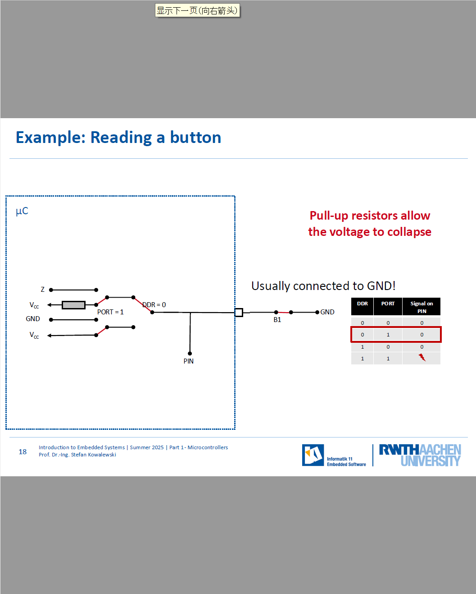
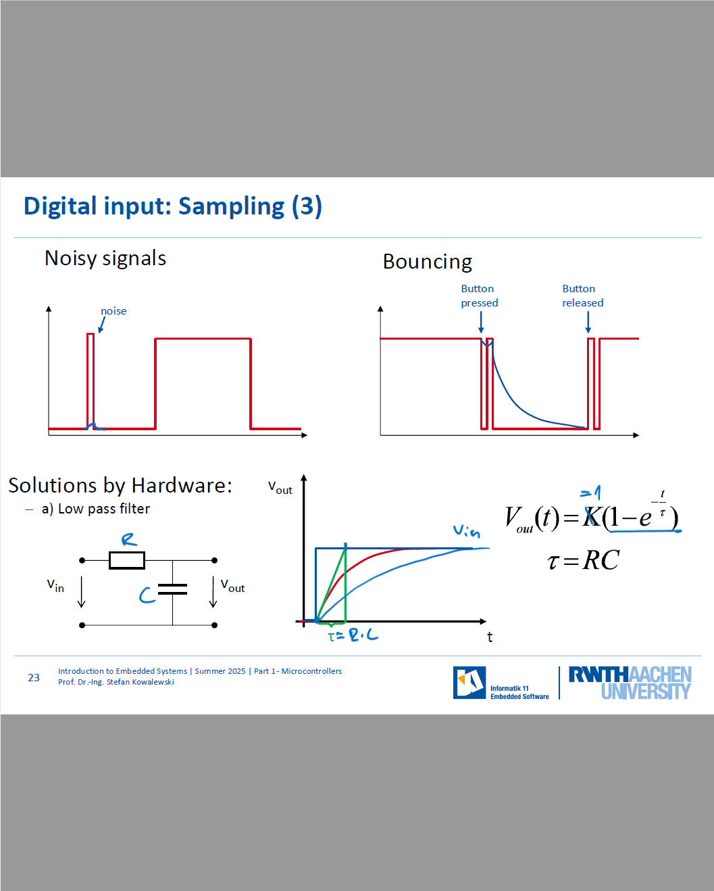

这张图片是《嵌入式系统导论》课程的幻灯片，课程来自德国亚琛工业大学（RWTH Aachen University）。下面是详细信息：

- **课程代码：** 12.24196
- **课程名称：** 嵌入式系统导论
- **授课老师：**
  - Prof. Dr.-Ing. Stefan Kowalewski
  - Julius Kahle, M. Sc.
- **学期：** 2025年夏季学期
- **第一部分：** 微控制器

这张幻灯片是该课程的引导部分，主要介绍嵌入式系统，并且重点讨论微控制器。课程内容可能包括嵌入式系统的基础知识，而这张幻灯片是课程中关于微控制器的内容的开篇。

这张图片展示的是一款微控制器（Microcontroller）的实物图。具体来看，它是Atmel公司生产的ATmega 8型号的微控制器。微控制器是一种集成了处理器、内存、输入输出端口等功能的单芯片系统，广泛应用于嵌入式系统中，用于执行各种控制任务。

在这张图片中，您可以看到芯片的外形为DIP（Dual In-line Package）封装，具有多个引脚，可以通过这些引脚与外部电路进行连接。ATmega 8芯片是该系列中的一种常见型号，常用于各种小型电子项目中，比如Arduino平台上的开发板。

这部分内容出自“Introduction to Embedded Systems”课程的第一部分，主要介绍了微控制器的基础知识及其应用。

这张图片是《嵌入式系统导论》课程的内容概览，具体内容如下：

- **课程部分：** 微控制器
- **主要内容：**
  1. **Basics（基础知识）**：介绍微控制器的基本概念和工作原理。
  2. **Structure/elements（结构/元件）**：讲解微控制器的内部结构及其关键元件。
  3. **Digital I/O（数字输入输出）**：介绍微控制器的数字输入和输出接口。
  4. **Interrupts（中断）**：讲解中断机制的基本概念及如何在嵌入式系统中应用。
  5. **Timers/Counters（定时器/计数器）**：介绍微控制器中的定时器和计数器的功能和应用。
  6. **Analog I/O（模拟输入输出）**：讲解模拟输入输出接口的使用和原理。

这张幻灯片概述了嵌入式系统中微控制器的核心组成部分，并列出了该部分要讲解的主要内容。课程的重点包括微控制器的基础知识、结构及各类输入输出操作的使用。

这张幻灯片解释了**微处理器（Microprocessors）**和**微控制器（Microcontrollers）**的区别，具体内容如下：

### **Microcontroller（微控制器）**（简称“μC”）：

- **独立设备：** 微控制器是专为嵌入式应用设计的独立设备。
- **结构：** 微控制器大致由低端微处理器、内存、输入输出（I/O）接口和其他外设组成。
- **专用设备：** 它不是通用设备，而是为特定应用领域定制的控制单元。
- **与其他处理器的比较：**
  - 微控制器比应用特定指令集处理器（ASIPs）和片上系统（SoCs）更通用，但仍是为某些特定领域优化的设备。

### **Microcontroller Family（微控制器家族）：**

- **相同的微处理器：** 微控制器家族中的所有设备通常使用相同的微处理器架构。
- **可扩展性：** 在内存、输入输出能力和片上外设等方面具有可扩展性。

这张幻灯片的目的是帮助学生理解微控制器和微处理器之间的区别，强调微控制器作为嵌入式系统中用于特定应用的控制单元，而不是通用的计算设备。

这张幻灯片展示了**微控制器的基本结构**，包含了以下几个主要组成部分：

1. **Processor core（处理器核心）：** 微控制器的核心部分，负责执行指令和控制整个系统的工作。
2. **Memory（内存）：** 存储程序代码和数据。微控制器内的内存通常包括不同类型的存储器，如闪存（Flash）、静态RAM（SRAM）等。
3. **Other on-board peripherals (or on-chip with processor)（其他板载外设，或与处理器集成的外设）：** 除了处理器和内存外，微控制器还可能包括其他外设，如定时器、ADC（模拟到数字转换器）、PWM（脉冲宽度调制）模块等。
4. **Internal bus（内部总线）：** 负责在处理器、内存和外设之间传输数据，确保不同部件之间的通信。
5. **I/O（输入输出接口）：** 用于与外部设备进行数据交换。I/O接口包括数字输入输出、模拟输入输出等。

### 总结：

这张图展示了微控制器的基础结构，主要包括处理器核心、内存、外设、内部总线和I/O接口，它们共同组成了微控制器的工作体系，使其能够执行嵌入式应用任务。

这张图展示的是微控制器的基本结构。结构图中包括了微控制器的多个重要组成部分，下面是对每个部分的详细解释：

1. **Processor core（处理器核心）**：这是微控制器的大脑，负责处理指令和控制其他组件的操作。
2. **Volatile memory (SRAM)**：易失性存储器，用于存储程序运行时的数据，断电后会丢失数据。
3. **Non-volatile memory (EEPROM, Flash)**：非易失性存储器，用于存储数据和程序代码，即使断电也能保留数据。常见类型包括EEPROM和Flash存储器。
4. **Counter, Timer（计数器、定时器）**：用于时间控制和事件计数，通常用于处理延时、测量时间间隔等功能。
5. **Clock（时钟）**：提供微控制器的时序信号，确保各个部分协调工作。
6. **Watchdog（看门狗）**：防止系统陷入死循环或长时间无响应的机制。如果系统长时间没有执行任务，Watchdog会复位系统。
7. **Digital I/O (parallel)**：数字输入输出，通常用于与外部设备（如传感器、开关）进行数字信号的交互。并行接口允许同时传输多个数据位。
8. **Serial interface（串行接口）**：允许微控制器与外部设备进行数据交换，通常用于较为长距离或需要较低接线数量的通信。
9. **Interrupt controller（中断控制器）**：管理外部或内部事件引发的中断，用于及时响应重要事件并暂停当前的程序执行。
10. **A/D converters（模拟到数字转换器）**：将模拟信号转换为数字信号，常用于从模拟传感器获取数据。
11. **D/A converters, PWM output（数字到模拟转换器，脉宽调制输出）**：D/A转换器将数字信号转换为模拟信号，PWM用于模拟信号输出和控制。
12. **Bus controller（总线控制器）**：管理微控制器与外部设备或外部总线的通信。
13. **External bus（外部总线）**：允许微控制器与其他外部设备进行数据交换，如外部存储器或其他外围设备。

这些部分通过内部分配的总线连接在一起，实现微控制器的各项功能。此结构图展示了微控制器各组件之间的关系及其协同工作方式。

这张图片是关于嵌入式系统中如何访问内部模块（特别是内存）的内容。它展示了一个微控制器系统的内部结构，并解释了内存的访问方式。

详细解释如下：

1. **处理器核心 (Processor core)**：
   - 这是系统的大脑，负责执行指令和控制其他组件。
2. **内存 (Memory)**：
   - 内存被分为两种类型：
     - **易失性内存 (Volatile memory)**：如 SRAM，它在断电后会丢失数据。
     - **非易失性内存 (Non-volatile memory)**：如 EEPROM 和 Flash，它们在断电后依然能够保留数据。
3. **计数器/定时器 (Counter, Timer)**、**时钟 (Clock)** 和 **看门狗 (Watchdog)**：
   - 这些模块用于计时、监控系统状态，以及在系统异常时进行复位。
4. **其他模块**：
   - **数字输入输出 (Digital I/O)**、**串口接口 (Serial interface)**、**中断控制器 (Interrupt controller)**、**A/D转换器 (A/D converters)**、**D/A转换器、PWM输出 (D/A converters, PWM output)** 和 **总线控制器 (Bus controller)** 等模块，这些都是微控制器常见的外设。
5. **内存访问**：
   - 所有的内存类型共享一个共同的地址范围，或者不同类型的内存被映射到同一个地址范围。
   - 这里提到，**如果使用C语言编程，编译器会处理大部分的内存映射工作**。

总结来说，这张图片的目的是展示微控制器内部的模块和它们如何通过内部总线相互连接。特别地，内存模块和其他外设模块如何通过统一的地址空间进行管理。

这张幻灯片解释了**如何访问微控制器内部模块**，特别是**数字I/O和片上外设**的访问方式。以下是幻灯片的详细内容：

### **微控制器的基本结构：**

- **Processor core（处理器核心）：** 控制整个系统，执行指令。
- **Volatile memory (SRAM)（易失性内存 - SRAM）：** 用于临时存储数据，断电后会丢失。
- **Non-volatile memory (EEPROM, Flash)（非易失性内存 - EEPROM, Flash）：** 用于存储永久数据，不会因为断电而丢失。
- **Counter, Timer（计数器、定时器）：** 用于定时操作或计数功能。
- **Clock（时钟）：** 提供系统运行所需的时钟信号。
- **Watchdog（看门狗）：** 用于监控系统是否正常运行，防止系统崩溃。

这些内部模块通过**内部总线**连接，数据可以在它们之间传递。

### **如何访问这些内部模块？**

- **数字I/O（并行）：** 用于与外部设备进行并行通信。
- **串行接口（Serial interface）：** 用于串行数据通信。
- **中断控制器（Interrupt controller）：** 用于处理外部或内部的中断请求。
- **A/D转换器（A/D converters）：** 将模拟信号转换为数字信号。
- **D/A转换器，PWM输出（D/A converters, PWM output）：** 将数字信号转换为模拟信号，或生成脉冲宽度调制（PWM）信号。
- **总线控制器（Bus controller）：** 控制内部与外部的总线通信。

### **访问方式：**

- **专用寄存器（Dedicated registers）：** 所有的数字I/O和片上外设通过专门的寄存器来访问。这些寄存器允许微控制器与内部模块进行通信和操作。

### **总结：**

微控制器的内部模块如数字I/O、定时器、中断控制器等可以通过专用的寄存器进行访问和操作，寄存器是与硬件直接交互的关键。

这张图片展示的是微控制器课程的内容大纲，具体包括以下部分：

1. **Basics（基础知识）**：介绍微控制器的基本概念，功能和应用背景。为学生提供微控制器相关的入门知识。
2. **Structure/elements（结构/元素）**：讲解微控制器的基本结构以及各个组成部分（如处理器、内存、输入输出端口等），帮助学生理解微控制器如何工作。
3. **Digital I/O（数字输入/输出）**：介绍微控制器如何处理数字信号的输入与输出，数字输入输出通常用于控制开关、LED等设备。
4. **Interrupts（中断）**：讲解中断机制，帮助学生理解如何在微控制器中实现及时响应外部事件的功能。
5. **Timers/Counters（定时器/计数器）**：介绍微控制器中的定时器和计数器，讲解如何使用这些组件来精确控制时间或计数事件。
6. **Analog I/O（模拟输入/输出）**：讲解微控制器如何处理模拟信号的输入与输出，这对于一些模拟传感器和设备的应用非常重要。

这是课程的结构化内容，帮助学生全面理解微控制器的工作原理和应用。

这张图片展示了微控制器的基本结构，进一步细化了之前的结构图，说明了各个模块和它们之间的关系。

详细解释如下：

1. **处理器核心 (Processor core)**：
   - 负责执行指令并控制其他模块的运行，是微控制器的大脑。
2. **内存 (Memory)**：
   - **易失性内存 (Volatile memory)**：如 SRAM，它是暂时存储数据的内存，掉电后数据会丢失。
   - **非易失性内存 (Non-volatile memory)**：如 EEPROM 和 Flash，这些内存在断电后能够保留数据。
3. **计数器/定时器 (Counter, Timer)** 和 **时钟 (Clock)**：
   - 这些模块用来提供时间和定时功能，通常用于控制程序的执行节奏，或在特定时间间隔内触发事件。
4. **看门狗 (Watchdog)**：
   - 用来监控系统运行情况，在系统异常时重启系统，保证系统的可靠性。
5. **数字输入输出 (Digital I/O)**：
   - 这是微控制器与外部设备之间进行数据交互的通道，支持并行数据传输。
6. **串行接口 (Serial interface)**：
   - 用于通过串行通信（如 UART、SPI 等）与其他设备进行通信。
7. **中断控制器 (Interrupt controller)**：
   - 处理外部或内部事件触发的中断请求，确保系统能够响应紧急任务或时间敏感的操作。
8. **A/D 转换器 (A/D converters)**：
   - 将模拟信号转换为数字信号，常用于处理来自传感器的模拟信号。
9. **D/A 转换器、PWM 输出 (D/A converters, PWM output)**：
   - D/A 转换器将数字信号转换为模拟信号，PWM 输出则用于控制电机或灯光等设备的功率或亮度。
10. **总线控制器 (Bus controller)**：
    - 负责管理微控制器内部和外部设备之间的数据传输，确保数据的正确流动。
11. **外部总线 (External bus)**：
    - 连接微控制器与外部设备的接口，用于数据的输入输出。

总结来说，这张图详细描述了微控制器内部各个模块的功能和连接关系，强调了不同模块如何通过内部总线和外部总线进行数据交换和控制。特别地，**数字输入输出 (Digital I/O)** 作为关键模块，负责处理与外部设备的并行数据交互。

这张幻灯片讲解了**数字I/O引脚**的基本概念以及如何使用它们来监控和控制外部硬件。具体内容如下：

### **数字I/O引脚：**

- **基本作用：** 数字I/O引脚是用于监控和控制外部硬件的基本方式。
- **通常情况下：**
  - **引脚分组：** 数字I/O引脚通常被分组为每组8个引脚（在8位架构中）。
  - **双向性：** 这些引脚是双向的，可以作为输入引脚或输出引脚使用。
  - **备用功能：** 数字I/O引脚可以有其他功能，除了作为数字I/O引脚外，还可以用作模拟I/O引脚等。

### **数字I/O引脚的监控、访问和控制：**

- **通过三个特殊寄存器：**
  1. **数据方向寄存器（Data Direction Register, DDR）：** 用于设置引脚的输入或输出方向。可以将引脚配置为输入或输出。
  2. **端口寄存器（Port Register, PORT）：** 用于控制输出引脚的值（高或低）。
  3. **端口输入寄存器（Port Input Register, PIN）：** 用于读取输入引脚的值。

### **总结：**

数字I/O引脚通过这三个寄存器进行控制和监控，数据方向寄存器设置引脚方向，端口寄存器控制输出，端口输入寄存器读取输入状态。通过这些寄存器，微控制器可以与外部硬件进行有效的交互。

这张图讲解了通过寄存器控制数字I/O引脚的方法，具体包括以下几个寄存器的功能和作用：

1. **Data Direction Register (DDR)**：数据方向寄存器，允许读取和写入操作。它的每一位控制对应端口的引脚是输入还是输出：

   - **输出**：当某个位为 1 时，表示对应的引脚是输出。
   - **输入**：当某个位为 0 时，表示对应的引脚是输入。

   图中通过 `DDRA` 寄存器来控制端口 A 的引脚方向。例如，`DDRA3` 为 1 表示 `PORTA3` 引脚为输出，为 0 表示为输入。

2. **Port Register (PORT)**：端口寄存器，允许读取和写入操作。它用来指定输出引脚的值是高电平还是低电平。对于输出引脚，设置为1表示高电平，设置为0表示低电平。

   - 在ATmega16微控制器中，`PORT` 寄存器也用于控制输入引脚的上拉电阻。通过设置相应位为1，启用该引脚的上拉电阻。

3. **Port Input Register (PIN)**：端口输入寄存器，只能进行读取操作。它包含当前所有引脚的电平状态（高或低），包括输入引脚和输出引脚。读取此寄存器的值可以得到输入引脚的当前电平。

   - 对于输入引脚，可以通过读取 `PIN` 寄存器来获取其当前的状态，而写入此寄存器没有效果。

总结：

- **DDR** 用于设置引脚的方向（输入或输出）。
- **PORT** 用于设置输出引脚的电平（高或低），并且可以控制输入引脚的上拉电阻。
- **PIN** 用于读取输入引脚的电平状态。

这些寄存器是微控制器中控制数字I/O引脚的基础工具，广泛应用于嵌入式系统中。

这张图片展示了一个LED控制的示例电路，并解释了如何通过微控制器（MCU）控制LED的开关。

详细解释如下：

### 电路结构：

1. **微控制器（MCU）**：
   - 这个微控制器通过控制端口和数据方向寄存器（DDR）来控制LED的状态。
2. **电源（Vcc, GND）**：
   - Vcc 是电路的正电源（通常为5V），GND 是地线。
3. **PORT, DDR, PIN**：
   - **PORT**：用于输出控制信号，控制LED的开关。
   - **DDR (Data Direction Register)**：控制数据的方向（输入或输出）。当DDR设为1时，表示该引脚是输出端；当DDR设为0时，表示该引脚是输入端。
   - **PIN**：读取引脚的当前状态。
4. **LED连接**：
   - LED 通常连接到Vcc（5V）。通过控制PORT寄存器来控制LED的开关状态。
   - LED上的电流是通过一个限流电阻进行限制的，防止过高电流损坏LED。

### 控制逻辑：

- **PORT = 0, DDR = 1**：表示将端口设置为输出模式，并将信号设置为低电平（0），这会使LED熄灭。
- **PORT = 1, DDR = 1**：表示将端口设置为输出模式，并将信号设置为高电平（1），这会使LED点亮。

### 表格说明：

- 表格展示了DDR、PORT和PIN的不同组合如何影响LED的状态：
  - **DDR = 0, PORT = 0**：输入模式，输出信号为高电平，LED熄灭。
  - **DDR = 1, PORT = 0**：输出模式，输出信号为低电平，LED熄灭。
  - **DDR = 1, PORT = 1**：输出模式，输出信号为高电平，LED点亮。

### 总结：

这张图通过简单的电路和寄存器设置，展示了如何使用微控制器控制LED的开关。通过改变DDR和PORT的值，能够控制LED的亮灭。

这张幻灯片提供了一个**LED控制的例子**，展示了如何通过微控制器（μC）控制LED的开关。图示了LED电路的连接方式及其控制过程。

### **电路说明：**

- **微控制器（μC）：** 控制LED的开关。
- **PORT和DDR设置：**
  - **PORT = 1：** 该设置表示输出端口的状态为高（1），使LED接收到Vcc电压，从而控制LED的亮灭。
  - **DDR = 1：** 数据方向寄存器（DDR）设置为1，表示该引脚配置为输出模式。
- **LED连接：** LED连接到Vcc（通常是电源电压），通过电阻和微控制器的端口输出引脚进行控制。
  - 当PORT设为1时，LED应该亮起；而如果PORT设为0时，LED将熄灭。

### **控制表格：**

- **DDR（数据方向寄存器）和PORT（端口寄存器）的设置：**
  - **DDR = 0, PORT = 1, PIN = 1：** 该配置为输入引脚，不会影响LED。
  - **DDR = 1, PORT = 1, PIN = 0：** 这表示引脚作为输出设置，且输出低电平，LED关闭。
  - **DDR = 1, PORT = 0, PIN = 1：** 这表示引脚作为输出设置，且输出高电平，LED点亮。

### **总结：**

通过设置数据方向寄存器（DDR）和端口寄存器（PORT），可以控制LED的开关。将端口寄存器设置为1可以让LED亮起，而设置为0则让LED熄灭。此操作通过微控制器的数字I/O引脚实现。

这张图讲解了**数字输出**（Digital Output）的工作原理，具体内容如下：

1. **配置为输出引脚时**：
   - 当一个引脚被配置为输出时，微控制器会根据该引脚的**PORT寄存器**的值来控制引脚的电平。
   - 具体来说：
     - **逻辑1（high）**会将引脚电平拉高至VCC（正电压）。
     - **逻辑0（low）**会将引脚电平拉低至GND（地电位）。
2. **电流的依赖**：
   - 引脚输出的电流大小取决于连接的电路。如果电路中连接了较大的负载，电流会更大。
   - **短路故障（Short circuit fault）**：如果引脚被错误地连接，可能会导致短路，造成损坏。
   - **可能需要外部电流限制器**：为了保护电路，可能需要使用外部电流限制器来控制电流的大小，防止过流损坏电路。

总结：

- 输出引脚通过PORT寄存器的控制来输出高电平或低电平，且电流的大小受到连接电路的影响。在设计电路时，需小心避免短路，并确保电流不会超过安全范围，必要时使用电流限制器。

这张图片展示了如何通过微控制器（MCU）读取按钮（Button）的输入信号。

详细解释如下：

### 电路结构：

1. **微控制器（MCU）**：
   - 控制信号的输入，通过 **PORT**、**DDR** 和 **PIN** 来读取按钮的状态。
2. **按钮 (B1)**：
   - 按钮通常与地（GND）相连接，用于控制信号的高低电平。按钮打开时（未按下），信号是未定义的。
   - 按钮关闭时（按下），电路连接至地（GND），信号读取为低电平（0）。
3. **电源（Vcc, GND）**：
   - Vcc 是电路的正电源，通常为 5V，GND 是地线。
4. **PORT, DDR, PIN**：
   - **PORT = 0, DDR = 0**：表示该引脚设置为输入模式，且不驱动电平。即该引脚的状态将由外部按钮的状态决定。
   - **PIN**：读取引脚的当前状态。

### 控制逻辑：

- **PORT = 0, DDR = 0**：这个设置表示该引脚是输入模式，且没有输出电平控制。PIN 的值取决于按钮的状态。
  - 如果按钮（B1）**打开**（未按下），PIN 的状态是未定义的。
  - 如果按钮（B1）**关闭**（按下），PIN 的状态会连接到地（GND），即低电平（0）。

### 表格说明：

表格展示了 **DDR**、**PORT** 和 **PIN** 的不同组合以及它们如何影响按钮状态的读取：

- **DDR = 0, PORT = 0**：输入模式，没有驱动电平，PIN 的信号取决于外部按钮的状态。
- **DDR = 0, PORT = 1**：按钮按下时，PIN 的信号为低电平（0）。
- **DDR = 1, PORT = 0**：该状态用于输出，不适合读取按钮状态。
- **DDR = 1, PORT = 1**：输出模式，通常用于控制外部设备，而不是读取按钮。

### 总结：

这张图通过展示如何读取按钮的状态，介绍了在微控制器中如何使用 **PORT**、**DDR** 和 **PIN** 来读取外部输入信号（如按钮）。特别地，按钮未按下时，PIN 的状态未定义，而按下按钮时，PIN 会连接到地（GND），使得信号变为低电平（0）。

这张幻灯片展示了**读取按钮的例子**，并介绍了如何使用**上拉电阻**来解决按钮按下时的电气问题。具体内容如下：

### **电路说明：**

- **微控制器（μC）：** 用于读取按钮的状态。
- **PORT = 1，DDR = 0：**
  - **PORT = 1** 表示端口设置为高电平，通常连接到电源（Vcc）。
  - **DDR = 0** 表示该引脚配置为输入模式。
- **按钮（B1）：** 按钮连接到微控制器的输入端口。当按钮没有被按下时，端口信号应该是高电平（1），当按钮被按下时，信号应该变为低电平（0）。
- **上拉电阻：** 上拉电阻被用来确保在按钮没有按下时，输入端口的状态为高电平（1），而不是浮空状态。它将端口拉至电源（Vcc），确保信号稳定。

### **按钮操作示例：**

- **按钮未按下：** 当按钮没有按下时，上拉电阻确保输入端口的信号为高电平（1），即信号值为1。
- **按钮按下：** 当按钮按下时，输入端口连接到GND（地），信号会变为低电平（0），即信号值为0。

### **控制表格：**

- **DDR = 0, PORT = 1, PIN = 1：** 按钮未按下时，信号是高电平。
- **DDR = 0, PORT = 1, PIN = 0：** 按钮按下时，信号是低电平。

### **总结：**

- **上拉电阻的作用：** 上拉电阻确保在按钮未按下时，输入端口保持高电平（1），避免输入端口漂浮。按下按钮时，信号会直接接地，变为低电平（0）。通过这种方式，微控制器可以准确读取按钮的状态。

这张图展示了一个**读取按钮**的示例，并解释了如何使用上拉电阻来读取按钮的状态。具体内容如下：

1. **电路示意**：
   - 在这个示例中，按钮（B1）连接在微控制器（μC）的输入引脚上。按钮的一端连接到地（GND），另一端通过上拉电阻（Pull-up resistor）连接到VCC。
   - **PORT寄存器**设置为1，表示输出高电平；**DDR寄存器**设置为0，表示引脚配置为输入。
   - 当按钮未按下时，上拉电阻将输入引脚拉高至VCC电平。当按钮按下时，输入引脚将连接到地（GND），使电压变为低电平。
2. **上拉电阻的作用**：
   - 上拉电阻将引脚的电压拉高（到VCC），确保按钮未按下时引脚的电平为高电平。
   - 按钮按下时，它将输入引脚连接到地（GND），电压降至低电平。这时，可以通过读取引脚的状态来判断按钮是否被按下。
3. **状态表格**：
   - **DDR = 0，PORT = 1**：表示引脚为输入，且通过上拉电阻将其电平保持在高电平。
   - **当按钮按下（B1闭合）时**：引脚电压为低电平（GND），即PIN引脚上的信号为0。
   - **当按钮松开时**：引脚电压为高电平（VCC），即PIN引脚上的信号为1。

总结：

- **上拉电阻**用于确保在按钮未按下时，输入引脚的电平为高（VCC）。
- 按钮按下时，输入引脚的电平会被拉低（接地），通过读取该引脚的电平，可以检测到按钮的状态。

这种电路设计广泛用于处理简单的开关输入，如按钮、开关等。

这张图片总结了数字输入输出（Digital I/O）端口的配置，并通过不同的情况展示了 **DDR** 和 **PORT** 的设置对微控制器端口状态的影响。

详细解释如下：

### 表格说明：

1. **DDR**（数据方向寄存器）：控制端口是输入还是输出。
   - **DDR = 0**：输入模式
   - **DDR = 1**：输出模式
2. **PORT**：控制输出端口的电平状态（高或低）。
   - **PORT = 0**：低电平（0）
   - **PORT = 1**：高电平（1）

### 各种连接情况：

- **I**: 直接连接到 GND（地）
  - **DDR = 0, PORT = 0**：表示该引脚配置为输入模式，连接到地（GND），此时端口为低电平（0）。
  - **DDR = 1, PORT = 0**：该引脚为输出模式，输出低电平，连接到地（GND）。
- **II**: 直接连接到 VCC（正电源）
  - **DDR = 0, PORT = 1**：该引脚为输入模式，连接到 VCC，此时端口为高电平（1）。
  - **DDR = 1, PORT = 1**：该引脚为输出模式，输出高电平，连接到 VCC。
- **III**: 开关或按钮打开
  - **DDR = 0, PORT = ?**：表示该引脚是输入模式，状态不确定，按钮或开关打开时，读取的值可能不确定（由外部电路配置决定）。
- **IV**: 电阻连接到 GND
  - **DDR = 0, PORT = 0**：该引脚为输入模式，电阻连接到 GND，端口为低电平（0）。
  - **DDR = 1, PORT = 0**：该引脚为输出模式，电阻连接到 GND，输出低电平。
- **V**: 电阻连接到 VCC
  - **DDR = 0, PORT = 1**：该引脚为输入模式，电阻连接到 VCC，端口为高电平（1）。
  - **DDR = 1, PORT = 1**：该引脚为输出模式，电阻连接到 VCC，输出高电平。

### 总结：

表格总结了不同的数字I/O配置和它们的电气行为，特别是如何通过配置 **DDR** 和 **PORT** 寄存器来实现与外部设备（如按钮、开关、电阻等）的连接。它帮助理解在不同场景下如何通过硬件配置读取输入信号或输出控制信号。

这张幻灯片讨论了**数字输入采样**的概念，特别是当微控制器使用时钟周期进行采样时可能出现的延迟问题。具体内容如下：

### **数字输入：采样**

- **每个时钟周期进行采样：**
  - 每次采样都会引入大约一个时钟周期的延迟。这是因为微控制器只能在每个时钟周期的特定时刻采集输入信号的状态。
- **短于时钟周期的脉冲可能无法检测：**
  - 如果输入信号的脉冲时间短于一个时钟周期的长度，微控制器可能无法在采样时检测到该脉冲，导致漏掉脉冲。

### **信号采样过程：**

- **时钟（clock）：** 时钟信号在时间轴上按照固定的间隔（一个时钟周期）触发采样。
- **信号（signal）：** 输入信号可能出现脉冲，微控制器在时钟周期的特定时刻读取信号的状态。
- **PIN寄存器：** 存储读取到的输入信号值。在每个时钟周期结束时，寄存器存储采样值。

### **问题说明：**

- **最坏情况下的延迟（worst-case delay）：** 当采样与每个时钟周期同步时，最坏的情况下会产生约1个时钟周期的延迟。这意味着信号变化发生在时钟周期内，微控制器可能在下一个时钟周期才检测到变化。
- **漏掉的脉冲（missed impulse）：** 如果信号变化的持续时间小于一个时钟周期，微控制器可能在该变化发生的时刻没有进行采样，导致漏掉该脉冲。

### **总结：**

这张幻灯片解释了在使用时钟周期进行数字输入采样时可能遇到的问题：时钟周期的延迟可能导致微控制器无法检测到较短的脉冲。因此，采样时需要考虑时钟周期的长度以及脉冲的持续时间。

这张图讲解了**数字输入的采样问题**，特别是在信号没有明确的电平时如何处理。具体内容如下：

### **问题：信号没有明确的电平**

- **输入信号**（`V_in`）的电压在一定时间内变化，从而可能在**高电平**和**低电平**之间不稳定，导致采样不准确。图中的信号有一个**未定义的区域**，即输入信号的电压在 3V 到 3.5V 之间时，无法准确判断它是高电平（`high`）还是低电平（`low`）。
- 在图中，**Vcc = 5V**，因此：
  - 高电平 (`high`) 通常定义为接近 5V。
  - 低电平 (`low`) 通常定义为接近 0V。
  - 然而，信号在 2V 到 3V 之间没有明确的电平定义，这就产生了问题，导致采样时可能出现**不确定性**，即输入信号的电压处于**未定义区域**。

### **解决方案：施密特触发器（Schmitt Trigger）**

- **施密特触发器**是一种常用的电路，能够解决这一问题。
  - 它通过定义**上升阈值**和**下降阈值**，使得输入信号的电压在这两个阈值之间变化时，输出保持稳定。
  - 图中展示了施密特触发器的工作方式，输入信号 `V_in` 经施密特触发器后会得到一个清晰的数字输出 `V_out`，无论输入信号的变化如何。

### **施密特触发器的工作原理**：

- 当输入信号超过某个阈值（例如，3V时），输出信号会稳定为高电平（Vcc）。
- 当输入信号低于某个较低阈值时，输出信号会稳定为低电平（0V）。
- 这种**滞后特性**（hysteresis）确保了输入信号的小幅波动不会影响输出，从而有效地消除了不稳定的信号区域。

### 总结：

施密特触发器通过在输入信号的变化过程中提供一个**明确的高电平和低电平转换**，帮助稳定数字输入，确保采样过程的准确性，避免由于信号不明确导致的错误。

这张图片介绍了数字输入采样中的问题和解决方案，重点讲解了 **Schmitt Trigger**（施密特触发器）的应用。

### 解释：

#### **问题**：

- **信号未定义电平**：
  - 在数字输入采样中，有时输入信号的电平并不总是清晰可辨的。例如，输入信号可能处于高电平（high）、低电平（low）之间的一个模糊区域，这就导致信号的状态不明确。图中的 **"undefined"** 区域表示这个问题：信号可能处于不稳定或不确定的状态，导致采样不准确。

#### **图示说明**：

- **信号波形**：
  - 左图中，蓝色曲线表示输入信号（**v_in**）随时间（**t**）的变化。
  - 输入信号有时可能在电压范围的中间波动，无法清晰地判定是高电平（5V）还是低电平（0V）。例如，在 **0.2 Vcc** 和 **0.6 Vcc** 之间，输入信号的电平无法明确界定。

#### **解决方案**：

- **施密特触发器（Schmitt Trigger）**：
  - 为了解决信号不稳定的问题，可以使用 **Schmitt Trigger**。它能够将模糊或噪声信号转换为稳定的数字信号。
  - **施密特触发器的工作原理**：它采用了滞回效应（Hysteresis），即它在信号上升和下降时使用不同的阈值。这意味着，当输入信号从低电平（例如0V）上升到高电平（例如5V）时，施密特触发器会在一个较低的阈值（例如1V）触发改变输出电平；而当信号下降时，它会在较高的阈值（例如3V）触发。这就避免了输入信号在不确定区域内反复切换，确保输出信号稳定。

#### **右侧的图表**：

- **输出波形**：
  - 右侧的图展示了施密特触发器的输入输出关系。当输入信号（**V_in**）跨越设定阈值时，输出信号（**V_out**）会发生变化。
  - 在输入信号超过 **3V** 时，输出从 0V 跳跃到 5V（高电平），而当输入信号低于 **1V** 时，输出从 5V 跳跃到 0V（低电平）。这种滞回效应确保了输入信号的快速转换。

### 总结：

施密特触发器用于解决输入信号不稳定或未定义电平的问题。通过引入滞回效应，它使输入信号的采样更加稳定、可靠。此技术广泛应用于数字电路中，确保了数字信号的准确转换和可靠性。

这张幻灯片讨论了**数字输入采样中的噪声信号**和**按键抖动**问题，以及**硬件解决方案**，特别是使用**低通滤波器**来解决这些问题。具体内容如下：

### **1. 噪声信号（Noisy signals）：**

- 图示的红色信号表示一个理想的数字输入信号，但在实际应用中，信号可能会受到噪声（蓝色部分）影响，导致信号在采样时出现误读。
- 噪声可能在输入信号中产生不必要的波动，导致错误的采样结果。

### **2. 按键抖动（Bouncing）：**

- 当按键被按下或释放时，按键本身会因为机械结构的原因产生反复的开关动作（即抖动）。
- 这种抖动会导致输入信号短暂地出现高频振荡，从而影响采样的准确性。例如，当按钮按下时，信号会出现多个快速的高低电平跳动。

### **3. 硬件解决方案：低通滤波器（Low pass filter）：**

- **低通滤波器**是一个常见的硬件解决方案，用于去除高频噪声和信号的抖动。
  - 低通滤波器允许低频信号通过（例如，平稳的按钮按下/释放信号），并滤除高频噪声或抖动信号。

### **电路设计：**

- 电路由一个**电阻（R）**和一个**电容（C）**组成，构成了低通滤波器。
- **Vin** 是输入信号，**Vout** 是经过滤波后的输出信号。
  - **Vout(t) = K(1 - e^(-t/τ))**：这个公式描述了滤波器的输出信号随时间变化的过程，其中 **τ = RC** 是滤波器的时间常数，控制滤波器响应的速度。
  - 时间常数 **τ** 由电阻和电容值决定，影响滤波器对信号变化的响应速度。

### **总结：**

- **噪声信号**和**按键抖动**是常见的数字输入采样问题。
- **低通滤波器**可以有效去除这些干扰，通过平滑输入信号来提高采样的准确性。
- 低通滤波器的响应由电阻（R）和电容（C）决定，设计适当的电路可以解决这些问题。

这张图讲解了**数字输入的采样问题**，特别是**噪声信号**和**按钮反弹**（bouncing）现象，并提供了解决方案。具体内容如下：

### 1. **噪声信号（Noisy signals）**

- **问题描述**：图左边显示的是一个带有噪声的信号。在这种情况下，信号的波动在正常的高电平和低电平之间出现额外的小波动，这些波动被称为**噪声**（noise）。噪声会使得信号不稳定，难以准确读取。
- **解决方案**：
  - **硬件解决方案**：
    - **低通滤波器（Low pass filter）**：通过使用低通滤波器，可以滤除高频噪声，只保留信号中的低频部分，从而稳定输入信号。
    - **内置噪声取消（Built-in noise cancelation）**：一些微控制器或电路可能内置噪声取消机制，可以在硬件级别减少信号中的噪声。
  - **软件解决方案**：
    - **读取信号两次或更多次（Read signal twice or more）**：通过在软件中多次读取同一信号，并对比其结果，可以减少由于噪声带来的错误判断。如果多次读取结果相同，则可以认为信号是稳定的。

### 2. **按钮反弹（Button Bouncing）**

- **问题描述**：图右边展示的是按钮按下和松开时的**反弹**现象。当按钮按下时，接触点可能会由于机械反应产生多个高电平和低电平的快速切换，导致信号的反复波动。这会使得微控制器读取到多个误差信号，无法准确判断按钮的状态。
- **解决方案**：
  - **硬件解决方案**：
    - **低通滤波器（Low pass filter）**：与噪声信号一样，可以使用低通滤波器来平滑按钮的信号，避免反弹造成的不稳定。
    - **内置噪声取消（Built-in noise cancelation）**：一些微控制器或外部电路也可能内置消除反弹的功能，确保按钮信号稳定。
  - **软件解决方案**：
    - **读取信号两次或更多次（Read signal twice or more）**：软件可以通过多次读取按钮的状态，确认按钮是否真正按下或松开。多次读取并对比其结果，可以有效去除反弹效应的影响。

### 总结：

- 对于**噪声信号**和**按钮反弹**问题，可以通过硬件和软件两种方式来解决。硬件上使用低通滤波器和噪声取消功能，而软件上则可以通过多次采样来确保信号的准确性。

这张图片是一个嵌入式系统课程的内容目录，列出了课程的主要主题。具体内容如下：

1. **Basics**：基本概念
   - 这一部分介绍了嵌入式系统的基础知识，可能包括嵌入式系统的定义、应用领域以及基础的硬件和软件知识。
2. **Structure/elements**：结构/元素
   - 这部分讲解了嵌入式系统的组成结构和关键元素，例如微控制器、传感器、执行器等。
3. **Digital I/O**：数字输入输出
   - 这部分内容涉及数字信号的输入输出，介绍如何处理和控制数字信号，例如通过端口控制外部设备。
4. **Interrupts**：中断
   - 介绍中断机制，它是嵌入式系统中用来响应事件和实时处理的关键概念。中断允许系统在某些条件下暂停当前操作，快速响应特定事件。
5. **Timers/Counters**：定时器/计数器
   - 这一部分讲解如何使用定时器和计数器来控制时间相关的操作，例如延时、事件计时等。
6. **Analog I/O**：模拟输入输出
   - 介绍模拟信号的输入输出处理，通常包括模拟传感器和模拟控制信号的转换，例如模拟到数字的转换（ADC）和数字到模拟的转换（DAC）。

总结：这张图片展示了课程的基本框架，涵盖了从嵌入式系统的基础到具体硬件控制（数字、模拟输入输出）的各个方面。

这张幻灯片讨论了**为什么需要中断（Interrupts）**，以及如何确保微控制器对事件的适当和及时反应。具体内容如下：

### **为什么需要中断？**

- **微控制器需要响应事件：** 微控制器（MCU）必须对内部或外部的事件作出反应。
- **如何确保适当且及时的反应？**
  - **轮询（Polling）和中断（Interrupts）**是两种常见的实现方式。

### **1. 轮询（Polling）**

- **概念：** 轮询是指定期检查是否有事件发生。
- **缺点：**
  - **CPU时间浪费：** 如果事件发生不频繁，轮询会浪费CPU时间，因为微控制器一直在检查而没有什么事件发生。
  - **代码难以扩展：** 轮询的顺序必须与程序的其他部分协调，这使得代码在修改和扩展时变得困难。

### **2. 中断（Interrupts）**

- **概念：** 微控制器定期轮询信号，一旦检测到状态变化，就会中断主程序的执行。
  - **中断服务例程（ISR）：** 当中断发生时，微控制器会调用一个中断服务例程（ISR），该例程负责处理事件。中断服务例程是在主程序暂停时运行的函数，用来处理特定事件（例如按钮按下或外部信号变化）。

### **总结：**

- **轮询**适用于事件发生频繁且不影响CPU资源的情况，但它会浪费不必要的CPU时间，并且修改或扩展轮询逻辑比较复杂。
- **中断**是更高效的解决方案，当事件发生时，微控制器可以立即暂停当前程序并处理事件，提高了系统的响应速度和资源利用率。

这张图讲解了**中断控制**的概念，尤其是在微控制器中的中断处理方式。具体内容如下：

### **1. 启用中断**

- **全局中断使能（Global Interrupt Enable）**：在微控制器中，通常需要通过设置一个全局使能位来启用所有的中断。这意味着启用这个全局中断使能后，所有的中断源都会被允许触发。
- **个别中断使能（Individual Interrupt Enable）**：除了全局使能，还需要为每一个特定的中断源单独设置一个使能位，以便控制特定中断的触发。例如，针对外部中断 0、外部中断 1 等，微控制器需要分别设置各自的使能位。

### **2. 中断向量表（Interrupt Vector Table）**

- **ATmega系列微控制器**：在 ATmega 系列微控制器中，中断被映射到一个中断向量表中。该表列出了中断源、相应的程序地址以及汇编指令。

#### 表格内容：

- **Vector No.**：中断向量的编号。每个中断源都会有一个唯一的编号。
- **Source**：中断源，例如重置（Reset）、外部中断 0、外部中断 1等。
- **Prog. Addr.**：对应中断源的程序地址，表示中断服务程序（ISR）的起始地址。
- **Mnemonics**：对应的汇编指令，用于跳转到中断服务程序（ISR）。

### **3. 中断服务程序（ISR）**

- 每个中断源都会有一个跳转指令（`JMP`），指向特定的中断服务程序（ISR）。例如，图中的 **External Interrupt 0** 对应的程序地址为 `$0002`，通过 `JMP $1302` 跳转到中断服务程序的起始位置。

### **4. 空的向量**

- **空的中断向量**：如果某个中断源没有被使用，它的中断向量应该指向一个**无限循环**（trap）。这样可以防止程序执行到没有定义的中断向量时发生意外错误，保证系统的稳定性。

### **总结**

- 为了启用中断，微控制器需要通过设置全局中断使能和每个中断源的使能位。
- 每个中断源在中断向量表中都有一个唯一的向量编号和程序地址，通过跳转指令来执行对应的中断服务程序（ISR）。
- 空的中断向量应该指向一个无限循环，以防止执行到未定义的中断时出现错误。

这些中断控制机制是微控制器中实现实时响应和事件驱动控制的基础。

这张图片讨论了嵌入式系统中 **中断处理** 的概念和工作原理。

### 解释：

#### **中断处理基本流程**：

1. **MCU监控特定事件**：
   - 微控制器（MCU）通过监控特定事件（例如计时器溢出等）来响应外部或内部的变化。
2. **硬件设置标志**：
   - 当一个事件发生时，硬件会自动设置一个标志（flag），指示事件的发生。例如，当计时器溢出时，硬件会设置一个计时器溢出标志。
3. **中断服务程序（ISR）的调用**：
   - 当满足以下三个条件时，MCU会调用中断服务程序（ISR）来处理事件：
     - **全局中断使能位（Global interrupt enable bit）**：这是一个全局使能位，确保中断机制启用。
     - **单独中断使能位（Individual interrupt enable bit）**：例如，计时器溢出使能位，用来启用特定中断。
     - **中断标志（Interrupt flag）**：例如，计时器溢出标志，当标志位被设置时，MCU知道中断已发生。

#### **中断冲突解决机制**：

- 在多种中断同时发生时，MCU会根据中断优先级来解决冲突。
  1. **静态优先级（Static priorities）**：
     - 例如 **ATMEGA 系列** 微控制器，它使用静态优先级来决定中断的处理顺序。每个中断源都有一个固定的优先级，优先级高的中断先被处理。
  2. **动态优先级（Dynamic priorities）**：
     - 例如 **Renesas R8C 系列** 微控制器，它使用动态优先级，允许在运行时改变中断优先级的顺序。这样，MCU可以根据需要调整不同中断的处理优先级。

### 总结：

这张图片讲解了中断处理的基础机制：MCU通过启用中断使能位并监控中断标志来响应事件。同时，当多个中断同时发生时，优先级机制（静态或动态）会决定哪个中断先被处理。

这张幻灯片展示了**中断服务例程（ISR）调用前的状态**，并详细说明了中断服务的执行过程。具体内容如下：

### **中断服务例程 - 调用前的状态**

1. **程序执行状态（Program Control）：**
   - 在主程序的**主循环（Main Loop）**中，微控制器的**程序计数器（PC）**不断指向下一条要执行的指令。主程序不断地在循环中运行。
2. **程序内存（Program Memory）：**
   - 程序代码存储在**程序内存（Program Memory）**中，微控制器从中获取指令执行。主程序和中断服务例程的指令都存储在这里。
3. **中断向量（ISR Vectors）：**
   - **ISR向量**是存储中断服务例程入口地址的地址表。中断发生时，微控制器会跳转到相应的ISR向量位置，执行对应的中断服务例程。
4. **状态保存（State Preservation）：**
   - 在进入中断服务例程之前，必须**保存当前的状态（State Points）**。这包括保存程序计数器（PC）和其他关键寄存器的值，以确保中断服务完成后，程序可以从中断发生前的位置恢复继续执行。
5. **堆栈（Stack）和内存：**
   - **堆栈（Stack）**用于保存当前的程序状态，包括寄存器和局部变量等。
   - **SRAM（静态随机存取内存）**用于存储变量和程序运行时的数据。

### **ISR调用前的过程：**

- 当中断发生时，微控制器暂停主程序，保存当前程序的状态（包括程序计数器和相关寄存器）。
- 然后，微控制器跳转到对应的ISR向量位置，执行中断服务例程，处理外部事件。
- 在ISR执行完成后，微控制器通过堆栈恢复之前保存的程序状态，返回并继续执行主程序。

### **总结：**

这张幻灯片展示了当中断发生时，微控制器如何保存当前状态并跳转到中断服务例程进行处理。通过堆栈和SRAM等内存区域的管理，微控制器能够在处理中断后恢复主程序的执行。

这张图解释了**中断服务例程（ISR）**中保存返回地址的过程。具体内容如下：

### **图示内容**

1. **ISR的结构**：
   - **ISR vectors（中断向量）**：指向中断服务程序（ISR）的地址。每个中断源都有一个唯一的中断向量，在程序中定义了中断响应的入口。
   - **ISR body（中断服务程序体）**：这是响应中断后执行的代码。当中断触发时，微控制器会跳转到ISR体内执行。
   - **Program memory（程序存储器）**：存储程序代码的地方，微控制器执行的所有指令都来自程序存储器。
2. **返回地址的保存**：
   - **Main loop（主循环）**：程序的主循环，通常是微控制器的主要执行流程。当中断发生时，当前的程序状态（如指令指针）需要被保存，以便在ISR执行完成后能够恢复并继续执行主循环。
   - **PC (Program Counter，程序计数器)**：这是当前执行指令的地址。当中断发生时，微控制器会将PC的值（即当前指令地址）保存，以便在中断服务程序执行完毕后，能够从正确的位置恢复主循环的执行。
   - **SP (Stack Pointer，栈指针)**：栈指针指向栈内存的当前地址。当中断发生时，微控制器会将当前的PC（程序计数器）值和相关的寄存器值压入栈中，这样中断服务完成后就可以从栈中弹出这些值并恢复执行。
3. **保存返回地址的过程**：
   - **ISR的返回**：为了在ISR结束后能够正确返回并继续执行主程序，微控制器将当前的程序计数器（PC）的值保存到栈中。当ISR执行完毕后，微控制器通过从栈中弹出保存的PC值，将控制权转交给主程序的下一条指令。
4. **内存区域**：
   - **Vars（变量）**：变量存储区域，通常是静态变量存储在此区域。
   - **Heap（堆）**：动态内存分配区域，主要用于动态分配内存。
   - **SRAM（静态RAM）**：用于存储临时数据、变量等。
   - **Stack（栈）**：存储函数调用信息、局部变量以及中断时的返回地址等。

### **总结**

- 在中断处理过程中，微控制器会保存当前执行状态（如PC和相关寄存器的值）到栈中，以便ISR执行完毕后能够恢复主程序的执行。
- **程序计数器（PC）**保存了当前执行指令的地址，而**栈指针（SP）**帮助保存执行过程中需要恢复的状态。
- 这种机制确保了中断的响应能够正确完成，并且在中断结束后可以无缝地返回主程序继续执行。

这张图片展示了 **中断服务例程（ISR）** 在微控制器中的工作过程，特别是如何跳转到中断向量并处理相关步骤。

### 解释：

#### **中断服务例程（ISR）**：

1. **ISR 向量**：
   - 当中断发生时，微控制器会跳转到一个特定的地址（即 **ISR 向量**），该地址在程序存储器中预定义。中断向量表是存储这些地址的表格，告诉微控制器在发生中断时应跳转到哪里执行相应的 ISR。
2. **程序计数器（PC）**：
   - 程序计数器（PC）保存当前程序执行的地址。当中断发生时，微控制器会保存当前 PC 的值，以便在 ISR 执行完后恢复到原来的位置继续执行。
3. **ISR 体（ISR body）**：
   - 一旦跳转到中断向量，微控制器将执行 **ISR 体**，这部分代码是响应中断的实际处理程序。ISR 体执行的任务通常包括读取输入、清除中断标志、更新数据等。
4. **主循环（Main loop）**：
   - 微控制器在没有中断发生时，会不断循环执行主程序。在中断发生时，程序会暂时中断主循环，跳转到 ISR 体，执行完毕后再返回继续执行主循环。

#### **清除标志位**：

- **清除 I 位（Clear I bit）**：
  - I 位是一个全局中断使能位，通常在进入 ISR 时需要清除，以禁止其他中断的发生。这是为了防止在当前处理中断时再次打断。
- **清除标志位（Clear flag bit）**：
  - 这是与特定事件（如计时器溢出）相关的标志位，表示某个事件已发生。ISR 执行过程中通常会清除这些标志位，以确保同一事件不会重复处理中断。

#### **栈（Stack）**：

- 在跳转到 ISR 时，微控制器会保存当前的上下文（例如程序计数器和寄存器值）到 **栈** 中。这是为了在 ISR 执行完后能够恢复到中断前的状态，确保程序的正常运行。

#### **变量、堆和 SRAM**：

- **Vars** 和 **Heap** 表示程序运行时使用的内存区域，其中堆用于动态内存分配，SRAM 用于存储运行时数据。
- 中断处理过程中可能会修改或使用这些区域的内容。

### 总结：

这张图片描述了中断服务例程的工作流程，包括从触发中断到执行中断处理程序、清除中断标志位、保护主程序执行环境等步骤。通过清除 I 位和标志位，ISR 可以处理特定的中断事件，并确保中断处理的顺利进行。