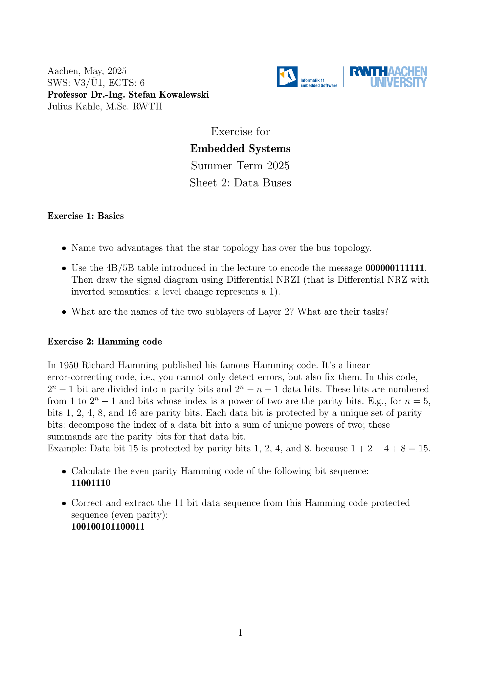
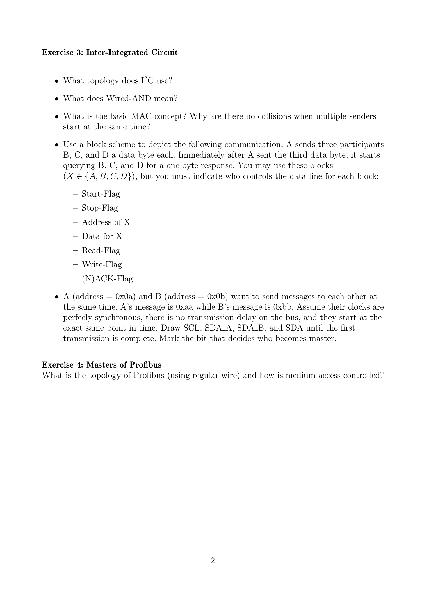

---

## 第 1 页



这是一份来自 **德国亚琛工业大学（RWTH Aachen University）** 的课程练习题，课程名称是 **Embedded Systems（嵌入式系统）**，时间为 **2025 年夏季学期**，主讲教授是 **Stefan Kowalewski 教授**，助教是 **Julius Kahle, M.Sc.**。
该练习的主题是 **“Data Buses（数据总线）”**，共有两个主要部分：**基础知识（Basics）** 和 **海明码（Hamming Code）**。

---

## 🧩 第一部分：Basics（基础知识）

这部分考察的是计算机网络与通信协议的基本概念：

1. **星型拓扑（Star Topology）相对于总线型拓扑（Bus Topology）的优点**

* 星型拓扑中，每个节点都单独连接到中心节点（通常是交换机或集线器）。
* 优点包括：

* 故障隔离性好：某个节点出问题不会影响整个网络。
* 易于管理与扩展：增加或移除节点不会中断其他连接。

2. **4B/5B 编码 + NRZI 信号图**

* 4B/5B 是一种将 4 位数据映射为 5 位码字的编码方法，用来保证信号中不会出现太长的连续 0（保持时钟同步）。
* 题目要求将二进制消息 `000000111111` 用 4B/5B 表编码，然后根据 **NRZI (Non-Return-to-Zero Inverted)** 绘制信号波形图。

> “Differential NRZI with inverted semantics” 意味着：**电平变化表示 1，不变化表示 0**。

3. **OSI 模型第 2 层的两个子层及其任务**

* 第 2 层是 **数据链路层（Data Link Layer）**，它分为：

* **LLC（Logical Link Control）逻辑链路控制子层**：负责错误检测、流量控制。
* **MAC（Media Access Control）介质访问控制子层**：负责决定哪个设备可以在何时使用传输介质（例如以太网中控制冲突）。

---

## ⚙️ 第二部分：Hamming Code（海明码）

这是一个著名的错误检测与纠正编码，由 **Richard Hamming** 在 1950 年提出。
它能 **检测并自动纠正单比特错误**。

### 核心概念：

* 采用 **线性分组码**，总共有 `2^n - 1` 个比特，其中：

* **n** 个是校验位（Parity Bits）
* **2^n - n - 1** 个是数据位（Data Bits）
* 校验位的位置是 1、2、4、8、16……（2 的幂）
* 每个数据位由多个校验位保护，例如：

* 第 15 位由校验位 1、2、4、8 共同保护（因为 15 = 1 + 2 + 4 + 8）

### 题目内容：

1. **计算以下比特序列的偶校验（even parity）Hamming Code：**

```
11001110
```

要求：找出插入的校验位并计算它们的值。

2. **纠错与解码：**
给定一个带偶校验的海明码序列：

```
1001001100011
```

要求：

* 检查其中的错误位（如果存在）
* 修正错误
* 提取原始的 11 位数据序列

---

## ✅ 主要归纳总结

整份题目主要是嵌入式系统中通信与错误控制的核心知识点：

* 第一部分让学生理解数据传输拓扑结构、编码方式（4B/5B）与物理层信号（NRZI）。
* 第二部分让学生熟悉数据链路层的错误检测与纠正机制（Hamming Code）。

---

\[口语化表达]
这份练习其实是亚琛工大的嵌入式系统课程第二张习题，主要讲数据总线。前面几题考的是网络拓扑和信号编码，比如星型拓扑比总线拓扑更稳定、容易维护；还有怎么把二进制消息用 4B/5B 编码再画出 NRZI 信号图；还有就是数据链路层分成 LLC 和 MAC 两层，各自负责不同任务。后半部分是海明码的计算和纠错练习，让你动手算偶校验的编码并修正出错比特。整体来说，就是复习通信结构、信号编码和错误检测这三大块。


---

## 第 2 页



这页是 **RWTH Aachen（亚琛工业大学）嵌入式系统课程练习题 Sheet 2: Data Buses** 的后半部分，包含 **Exercise 3（I²C 总线）** 和 **Exercise 4（Profibus 总线）** 两个主题，内容主要围绕总线拓扑结构、数据通信机制和总线访问控制机制。下面是详细解释👇

---

## 🧠 Exercise 3: Inter-Integrated Circuit（I²C 总线）

这一部分考察 I²C 总线（Inter-Integrated Circuit）的通信原理。

### 1. What topology does I²C use?

> I²C 使用 **总线型拓扑结构（Bus Topology）**。
> 所有设备（主机 Master 和从机 Slave）都连接在两根线上：

* **SCL（Serial Clock Line）**：时钟信号线
* **SDA（Serial Data Line）**：数据信号线
所有设备通过这两条线进行通信，使用地址区分。

---

### 2. What does Wired-AND mean?

> “有线与（Wired-AND）” 是一种电气连接方式。

在 I²C 中：

* 总线是 **开漏（Open-Drain）** 或 **集电极开路（Open-Collector）** 结构。
* 多个设备都可以拉低 SDA 或 SCL 线，但只有上拉电阻能将其拉高。
* 当一个设备输出低电平（0）时，总线就被强制为低电平，即：

```
只要有一个设备输出0，总线电平为0 → 实际上是逻辑“与”。
```

这种方式避免了信号冲突：两个设备不会“硬拉”高低电平对抗，从而保护电路安全。

---

### 3. What is the basic MAC concept? Why are there no collisions?

> MAC（Medium Access Control）在 I²C 中基于 **地址仲裁（Address Arbitration）** 原理。

当多个主机同时尝试发送时：

* 所有设备都监控 SDA 线上的信号。
* 每个设备在发送时也同时读取 SDA。
* 如果某个设备想发“1”，但总线为“0”，说明别的设备占线了，于是它**立刻停止发送**。

这种机制保证了：

* **不会发生碰撞（collision）**；
* **优先级由地址决定**：地址低的设备（即二进制值更小）优先获得总线控制权。

---

### 4. Block Scheme 通信流程题

题目要求画出数据通信的流程图，过程如下：

* 设备 A 发送三条消息给 B、C、D（每个一个字节）。
* 然后 A 依次读取 B、C、D 的一个字节响应。
* 每个传输由以下部分组成：

* **Start-Flag**：开始信号（A 发送）
* **Address of X**：目标设备地址
* **Read/Write-Flag**：读写控制位（0=写，1=读）
* **Data for X**：传输的数据（主机或从机发送）
* **(N)ACK-Flag**：应答信号（接收方发送）
* **Stop-Flag**：结束信号（A 发送）

要求指出每个阶段是谁控制 SDA 线（A 或 B/C/D）。

---

### 5. 仲裁（Arbitration）示例题

题目给定：

* A 地址 = 0x0A（发送消息 0xAA）
* B 地址 = 0x0B（发送消息 0xBB）
* 两者同时开始发送，没有时延。

要求：

* 画出 SCL（时钟线）及各自的 SDA\_A、SDA\_B，以及实际总线 SDA；
* 标出哪个比特位决定了谁成为总线主控（master）。

> 结论：在 I²C 仲裁中，**先出现低电平（0）的设备优先**。
> 由于 A 的地址更小（0x0A < 0x0B），A 会赢得仲裁成为 Master。

---

## ⚙️ Exercise 4: Masters of Profibus（Profibus 总线主机）

这部分转向工业现场总线 Profibus。

### 题目：

> “Profibus 使用普通电线时的拓扑是什么？介质访问是如何控制的？”

**答案：**

* **拓扑结构**：Profibus 使用 **总线型拓扑（Bus Topology）**，多个设备沿着一根主干线并联连接。
* **介质访问控制（Medium Access Control）**：

* 采用 **令牌传递（Token Passing）** 机制。
* 多个主站（Master）之间传递一个“令牌（token）”，只有持有令牌的主站可以发送数据；
* 从站（Slave）只能在被询问（polled）时响应。

这种机制保证了通信的确定性（deterministic），即通信顺序和时延是可预测的。

---

## ✅ 主要归纳总结

这一页主要讲两种总线通信协议的核心机制：

1. **I²C 总线**：两线式、开漏结构（Wired-AND），支持多主机，靠地址仲裁避免冲突；
2. **Profibus 总线**：工业现场标准，总线拓扑，用“令牌传递”控制访问，适合多主机系统。

---

\[口语化表达]
这一页其实讲的是两种总线的通信机制。I²C 是那种两根线（SCL 和 SDA）的总线，所有设备都连在一起，用开漏结构避免短路冲突，逻辑上就是“有线与”。多个设备同时发的时候，谁先发出低电平谁赢，就能自动仲裁出主机；而 Profibus 则是工业上常见的总线，用普通电线串起来，靠传“令牌”来控制谁能发消息。总体来说，这页练习让你理解两种总线在“谁能发”、“怎么防冲突”和“怎么控制访问”上的不同设计。
