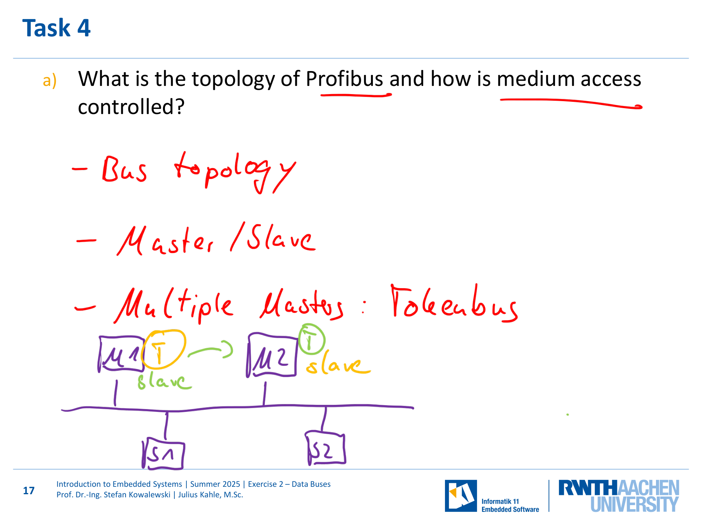

---

## 第 1 页


这张图片是 **德国亚琛工业大学（RWTH Aachen University）** 的课程幻灯片封面页，课程名为 **“Introduction to Embedded Systems”（嵌入式系统导论）**。下面我来逐部分详细解释👇

---

## 📘 幻灯片内容解析

### 🔹 学校与院系信息

右上角的标志表明该课程属于 **RWTH Aachen University（亚琛工业大学）**，由 **Informatik 11 – Embedded Software（信息学第11教研组：嵌入式软件方向）** 提供。
这是 RWTH 的计算机科学系中专门研究嵌入式系统的软件方向的教研组。

---

### 🔹 课程信息

标题部分写着：

> **Introduction to Embedded Systems**
> Prof. Dr.-Ing. Stefan Kowalewski | Julius Kahle, M.Sc.
> Summer Semester 2025

含义如下：

* **课程名称**：嵌入式系统导论（Introduction to Embedded Systems）
* **主讲教师**：Stefan Kowalewski 教授（工程博士，德国工学博士头衔 “Dr.-Ing.”）
* **助教**：Julius Kahle，理学硕士（M.Sc.）
* **学期**：2025 年夏季学期（Summer Semester 2025）

---

### 🔹 幻灯片主题

底部大蓝色部分写着：

> **Exercise 2 – Data Buses**

说明这是这门课的 **第二次练习（Exercise 2）**，主题是 **数据总线（Data Buses）**。
这表示学生将学习或练习与计算机系统中 **数据总线通信、拓扑结构、信号编码、错误检测与纠正机制** 等相关的内容。

结合前面你提供的题目页内容（Sheet 2），可以推断这份幻灯片是与那份练习配套的讲义封面。两者属于同一个教学单元。

---

### 🔹 设计含义

* 蓝黄配色是 RWTH 的官方色。
* 左侧黄色方块是装饰性设计元素，象征模块化与嵌入式组件结构。
* “Exercise 2 – Data Buses” 明确指出学生要学习嵌入式系统中常见的总线通信方式（例如 I²C、SPI、CAN、Profibus 等）。

---

## ✅ 主要归纳总结

这页是 RWTH 亚琛工业大学《嵌入式系统导论》课程的第二次练习封面页，主题是“数据总线”。课程由 Stefan Kowalewski 教授和 Julius Kahle 硕士负责教学，开设于 2025 年夏季学期，属于信息学第11教研组（嵌入式软件方向）的课程资料。

---

\[口语化表达]
这页其实就是亚琛工大嵌入式系统课的第二次练习封面，讲的是“数据总线”这个主题。课程是 2025 年夏季学期开的，由 Kowalewski 教授和他的助教 Julius Kahle 负责。蓝黄配色是学校的风格，这张主要是告诉你这节课要学的内容方向：嵌入式系统里各种总线通信机制，比如 I²C、SPI、CAN 这些。简单来说，这是一份练习讲义的封面页。


---

## 第 2 页


这张图片是 RWTH Aachen University（亚琛工业大学）《Introduction to Embedded Systems》（嵌入式系统导论）课程第 2 次练习（Exercise 2 – Data Buses）的 **概览页（Overview）**。它列出了本次课程或习题要学习的四个主要主题。

---

## 📖 幻灯片详细解释

### 标题：**Overview（概览）**

这一页的作用是告诉学生，这一节课或这一份练习的主要内容是什么。下面的四个主题按教学顺序排列，构成本节“Data Buses（数据总线）”单元的核心知识结构。

---

### 🟠 **1. Basics（基础知识）**

这一部分主要是对数据总线的基本概念进行介绍。
内容通常包括：

* 不同**总线拓扑结构（bus topology）** 的比较，如星型、总线型；
* **编码方式**（例如 4B/5B 编码、NRZI 编码）；
* **OSI 模型中数据链路层（Layer 2）** 的两个子层（LLC 与 MAC）及其作用。

这部分相当于是为后面的技术内容打基础。

---

### 🟠 **2. Hamming Code（海明码）**

这是讲解 **错误检测与纠错编码（Error Detection & Correction Code）**。
海明码是由 Richard Hamming 在 1950 年提出的一种能自动**检测并纠正单比特错误**的编码方式。
学生需要掌握：

* 如何为数据添加校验位（parity bits）；
* 如何用海明码检测并修复出错的比特；
* 偶校验（even parity）和奇校验（odd parity）的区别。

---

### 🟠 **3. I²C（Inter-Integrated Circuit，总线通信协议）**

I²C 是一种常见的 **双线串行通信总线协议**，广泛应用于嵌入式系统中多个芯片之间的通信。
要点包括：

* **总线拓扑**：两条信号线（SDA 数据线，SCL 时钟线）；
* **Wired-AND（有线与）**：防止信号冲突；
* **仲裁机制（Arbitration）**：多主机竞争时如何决定谁是主控；
* **通信帧结构**：起始位、地址、读写位、应答位、停止位等。

---

### 🟠 **4. Profibus（工业现场总线）**

Profibus 是一种工业自动化领域常见的通信协议。
内容包括：

* **总线型拓扑结构**；
* **主从结构（Master-Slave）通信机制**；
* **令牌传递（Token Passing）** 控制访问；
* 应用场景：PLC 控制、工厂自动化等。

---

### 页脚说明

底部的文字表明：

* 课程名称：*Introduction to Embedded Systems*
* 学期：*Summer 2025*（2025 年夏季学期）
* 教师：*Prof. Dr.-Ing. Stefan Kowalewski*
* 助教：*Julius Kahle, M.Sc.*
* 页码：2（说明这页在整个讲义的第二页）

---

## ✅ 主要归纳总结

这页是 RWTH 亚琛工业大学《嵌入式系统导论》课程中关于“数据总线（Data Buses）”的总览页。它列出了四个教学主题：
1️⃣ 基础知识（总线拓扑与编码）；
2️⃣ 海明码（错误检测与纠正）；
3️⃣ I²C 通信协议（芯片间数据传输机制）；
4️⃣ Profibus（工业现场通信系统）。
整节内容围绕“嵌入式系统中的通信与数据传输”展开。

---

\[口语化表达]
这页其实就是课程第二次练习的提纲页，告诉你这节课主要讲四个部分：先讲数据总线的基础知识，比如总线结构和编码方式；然后讲海明码，怎么检测和纠正数据错误；接着是 I²C，这是一种嵌入式里常用的双线通信协议；最后是 Profibus，它是工业现场用的总线标准。简单说，这页就是这节课的学习目录，让你知道后面要学什么内容。


---

## 第 3 页


这张幻灯片来自 **RWTH Aachen University（亚琛工业大学）** 的课程 **Introduction to Embedded Systems（嵌入式系统导论）**，是 **Exercise 2 – Data Buses（练习二：数据总线）** 的其中一页。

---

## 📘 幻灯片详细解释

### 标题：**Basics（基础知识）**

这一页表示该部分内容对应练习题中的 **Task 1: a) – c)**，也就是练习中的第一题的三个小题。
在前面你上传的习题纸（Sheet 2）中，这一题正是：

> **Exercise 1: Basics**
> a) Name two advantages that the star topology has over the bus topology.
> b) Use the 4B/5B table to encode the message and draw the NRZI signal.
> c) Name the two sublayers of Layer 2 and their tasks.

因此，这张幻灯片的“Basics”部分主要涉及 **嵌入式系统中数据通信的基础概念**。

---

### 🧠 内容涵盖范围

#### 1️⃣ 网络拓扑结构（Topology）

* **星型拓扑（Star topology）**：每个节点都连接到一个中央节点。
优点：

* 单个节点出错不会影响整个网络。
* 易于管理与扩展。
* **总线型拓扑（Bus topology）**：所有节点共享一条总线。虽然成本低，但容易造成信号冲突。

👉 题目要求比较两种结构的优缺点，这一部分帮助学生理解嵌入式设备间的物理连接方式。

---

#### 2️⃣ 信号编码与传输（Encoding & Signaling）

* **4B/5B 编码**：把每 4 位数据映射为 5 位码字，以防止出现太多连续 0，方便时钟同步。
* **NRZI（Non-Return-to-Zero Inverted）编码**：通过信号电平变化表示“1”，保持不变表示“0”。
这类编码技术在嵌入式总线通信（如 USB、以太网）中十分常见。

---

#### 3️⃣ OSI 第二层（数据链路层 Layer 2）的两个子层

* **MAC（Media Access Control）介质访问控制层**：决定谁在何时发送数据，防止冲突。
* **LLC（Logical Link Control）逻辑链路控制层**：提供错误检测、流量控制等上层服务。

👉 这一部分让学生理解“数据是如何在网络上传输和被管理的”。

---

### 📚 页脚信息

* 页脚表明这是 RWTH 的 **Informatik 11 – Embedded Software（信息学第11教研组）** 的教学资料。
* 教师：**Prof. Dr.-Ing. Stefan Kowalewski**
* 助教：**Julius Kahle, M.Sc.**
* 页码：第 3 页。

---

## ✅ 主要归纳总结

这页幻灯片是《嵌入式系统导论》课程练习二中“基础知识”部分的标题页，对应题目 1 的 a～c 三小问。内容主要包括三大块：
1️⃣ 网络拓扑（星型 vs 总线型）；
2️⃣ 数据编码（4B/5B、NRZI）；
3️⃣ 数据链路层结构（LLC 与 MAC）。
这是整个“数据总线”主题的入门部分，重点是理解通信的物理结构与编码规则。

---

\[口语化表达]
这页其实是讲练习题第一部分“基础知识”的封面，涵盖题目 1 的三个小问。内容主要是让学生搞清楚网络拓扑（比如星型和总线型的区别）、信号是怎么编码传输的（4B/5B、NRZI 这些），以及数据链路层的两个子层 MAC 和 LLC 各负责什么。简单说，就是在讲“数据总线通信的基本原理”——系统怎么连、信号怎么传、谁来控制数据发送。


---

## 第 4 页


这张幻灯片展示了 **“Task 1: a)”** —— 题目要求比较 **星型拓扑（Star Topology）** 相对于 **总线型拓扑（Bus Topology）** 的优点。图片中包含题目正文、手写笔记以及示意图。下面是详细中文解释👇

---

## 📘 幻灯片内容解读

### 📍题目

> **Name two advantages that the star topology has over the bus topology.**
> 说明：列出星型拓扑相对于总线型拓扑的两个优点。

这是一道非常基础的网络结构问题，目的是让学生理解不同总线架构在嵌入式系统或网络通信中的特性差异。

---

## 🌐 1. 星型拓扑（Star Topology）

星型拓扑的结构特征是：

* 所有节点都通过单独的连接线与中央节点（hub 或 switch）相连；
* 各节点之间并不直接通信，通信都通过中央节点转发。

手写笔记中画了一个带中心节点的星状图，中心节点被标为“F”（表示主控点），表示典型的星型连接结构。

---

## 🌐 2. 总线型拓扑（Bus Topology）

总线拓扑是将所有节点沿一条主线（bus）相连，信号沿总线传播。
右上角的手绘图显示出一条水平主线（红色），上面连接了多个节点；蓝色“X”符号标出可能出现的故障点或冲突点。

---

## ✅ 优点（Advantages）

幻灯片中红色笔记写的“Adv.”下列出了星型拓扑的几个主要优点：

1. **No collision（无碰撞）**

* 在总线结构中，多个节点共享一条线路，若同时发送会导致信号冲突。
* 星型结构通过中央节点控制通信，可以避免碰撞。

2. **No implicit broadcast（没有隐式广播）**

* 星型结构中的通信是点对点传输，信息不会被所有节点同时接收，提高了安全性与效率。

3. **Only one single point of failure（只有一个单点故障）**

* 若某个端点出问题，不影响其他节点通信；
* 不过若中心节点出问题，则整个系统会停。

4. **Multiple senders at the same time（可同时多路通信）**

* 由于通过交换机或集线器控制，可以实现并行通信，提高带宽利用率。

---

## ⚠️ 缺点（Disadvantages）

幻灯片下方列出了星型拓扑的缺陷：

1. **Single point of failure（单点故障）**

* 一旦中央节点（hub/switch）出错，整个网络就会瘫痪。

2. **More wiring（布线更多）**

* 每个节点都要独立连到中心，线路较多，布线复杂。

3. **Need a central station（需要中央设备）**

* 系统依赖中心设备，成本较高，整体比总线结构更贵。
* 手写旁注中写了 “overall more expensive（整体更贵）”。

---

## 🧠 关键知识点总结

|  对比项 | 星型拓扑（Star Topology）  | 总线拓扑（Bus Topology） |
| :--: | :------------------- | :----------------- |
|  结构  | 各节点连接到中心节点           | 所有节点共享同一条总线        |
|  冲突  | 无碰撞（central control） | 易发生信号冲突            |
| 故障影响 | 端点故障不影响整体；中心节点故障致命   | 任意节点或主线故障都影响通信     |
|  成本  | 需要更多线缆和中心设备          | 成本低、布线简单           |

---

## ✅ 主要归纳总结

这张幻灯片解释了星型拓扑相比总线拓扑的优势与劣势。星型拓扑通过中央节点管理通信，能避免数据碰撞并允许多节点同时传输，通信更可靠；但其缺点是需要更多的线缆、依赖中央设备且成本更高。一旦中央节点出问题，整个网络都会受影响。

---

\[口语化表达]
这页其实是讲网络拓扑结构的比较。老师让我们说出星型结构比总线结构好的地方。星型的好处是不会发生信号碰撞，数据不会乱发给所有人，还能让多个设备同时通信。不过它也有问题，比如中心设备坏了整个网络都瘫痪，而且线要多、造价高。简单说，就是星型更稳定但更贵，总线更便宜但容易乱。


---

## 第 5 页


这张幻灯片是 **Exercise 2 – Data Buses** 的 **Task 1: b)**，题目要求用 **4B/5B 编码表** 将一串二进制信息进行编码，并用 **Differential NRZI（差分非归零反转编码）** 画出信号波形。内容主要在讲数字通信中**编码与信号表示方法**。下面是详细解释👇

---

## 📘 幻灯片内容讲解

### 🟩 题目

> **Use the 4B/5B table to encode the message `000000111111`. Then draw the signal diagram using Differential NRZI.**

意思是：

1. 把原始 12 位的二进制信息 `000000111111` 用 4B/5B 编码；
2. 再用差分 NRZI 编码规则画出信号波形。

---

## 🔢 一、4B/5B 编码的作用

幻灯片上方红字写着：

> “=> avoid long sequences of 1s”（避免长时间连续的 1）

实际上，4B/5B 编码的真正作用是：

* **避免出现太多连续的 0 或 1**，以便时钟同步；
* **提高信号传输可靠性**。

4B/5B 的原理是：
每 4 个比特（4B）映射为 5 个比特（5B）码字。
这样虽然多出 25% 比特（4 → 5），但保证了在编码结果中不会出现长时间无变化的信号。
因此，传输速率约为原来的 **80%（4/5）**，幻灯片右侧蓝字写着 “⇒ 80% of data rate”。

---

## 🧮 二、编码步骤

原始消息：

```
0000 0011 1111
```

分组：

* 前 4 位：0000（十六进制 0）
* 中间 4 位：0011（十六进制 3）
* 最后 4 位：1111（十六进制 F）

根据表格（截图中左侧表）：

| 4B   | 5B    |
| ---- | ----- |
| 0000 | 11110 |
| 0011 | 10101 |
| 1111 | 11101 |

所以编码结果为：

```
11110 10101 11101
```

也就是：

```
111101010111101
```

幻灯片红字中也写出了相同结果。

---

## ⚡ 三、Differential NRZI（差分非归零反转）

**NRZI 编码规则：**

* 在这种编码中，**“电平变化”表示 1**，**“电平不变”表示 0**。
* “Differential” 表示：编码依赖于前一比特的状态，而不是绝对电平。

幻灯片底部画出的波形图中：

* 红线表示信号的电平变化；
* 蓝线表示二进制比特的逻辑含义；
* 每次电平跳变（High ↔ Low）表示 1；
* 电平保持不变表示 0。

可以看到信号电平在 1 处不断变化，而在 0 时保持稳定。

---

## 🧠 四、其他标注解读

* “=> provided in the exam” 表示：这张 4B/5B 对照表会在考试中提供，不需要死记。
* “=> 80% of data rate” 表示：由于 4B/5B 把 4 位数据变为 5 位码字，传输速率降低到原来的 80%。

---

## ✅ 主要归纳总结

这页讲的是用 **4B/5B 编码 + 差分 NRZI 信号** 对二进制数据进行转换的过程。

* 4B/5B 通过把 4 位映射为 5 位来防止长时间无信号变化；
* 然后用 NRZI（电平变化=1）画出波形；
* 编码的代价是数据速率下降约 20%，但传输更稳定。
整个过程体现了**通信系统在可靠性与效率之间的权衡**。

---

\[口语化表达]
这页讲的就是怎么把一串二进制信号转成更适合传输的形式。先用 4B/5B 编码，把每 4 位数据换成 5 位码字，避免连续的 0 或 1 让时钟不同步。比如题目里的 000000111111 会变成 11110 10101 11101。然后再用 NRZI 差分编码来画波形，电平变化代表 1，不变代表 0。虽然这样传输速率只有原来的 80%，但信号更稳定也更容易识别。简单说，就是用编码让通信更稳、更不容易出错。


---

## 第 6 页


这页是 **Task 1: b)** 的题面与空白作图格。要求你把给定比特串用 **4B/5B** 编码后，再按 **Differential NRZI（差分 NRZI，电平变化代表 1，不变代表 0）** 画出信号时序。

---

## 题目要求

**b) 用 4B/5B 表把消息 `0000 0011 1111` 编码，然后用 Differential NRZI 画信号图。**
（上表右侧的 Q/I/J/K/T/R/S/H 是控制码说明：Idle/Start/End/Reset/Set/Halt，本题不需要用到。）

---

## 第一步：4B/5B 编码

把 12 位数据分成 3 组，每组 4 位：

* `0000` → **11110**
* `0011` → **10101**
* `1111` → **11101**

拼接得到 15 位 5B 码：
**11110 10101 11101** → **111101010111101**

> 直觉提示：4B/5B 会把每 4 位扩成 5 位，使码流中“长时间不变的电平”很少出现，便于时钟恢复。代价是有效数据速率变为 **4/5 = 80%**。

---

## 第二步：按 Differential NRZI 画波形

规则：**电平变化=1**，**电平不变=0**；起始电平可任选（通常随手从 Low 或 High 开始，整条曲线形状会不同，但 1/0 的位置与数量不会变）。下面给出一条示例轨迹——假设**起始为 Low**：

4B/5B 码：1 1 1 1 0 1 0 1 0 1 1 1 1 0 1

| 位序 |  码值 | 是否翻转 | 位后电平 |
| -: | :-: | :--: | :--: |
|  1 |  1  |  翻转  |   H  |
|  2 |  1  |  翻转  |   L  |
|  3 |  1  |  翻转  |   H  |
|  4 |  1  |  翻转  |   L  |
|  5 |  0  |  不变  |   L  |
|  6 |  1  |  翻转  |   H  |
|  7 |  0  |  不变  |   H  |
|  8 |  1  |  翻转  |   L  |
|  9 |  0  |  不变  |   L  |
| 10 |  1  |  翻转  |   H  |
| 11 |  1  |  翻转  |   L  |
| 12 |  1  |  翻转  |   H  |
| 13 |  1  |  翻转  |   L  |
| 14 |  0  |  不变  |   L  |
| 15 |  1  |  翻转  |   H  |

把这些“翻转/不变”按位画在下方的 High/Low 坐标格上，就得到 NRZI 波形（每个“1”处有跳变，“0”处保持水平）。

---

## 小结要点

* 4B/5B：`0000 0011 1111` → `11110 10101 11101`（**111101010111101**）。
* Differential NRZI：**跳变=1，不变=0**；起始电平任意。
* 4B/5B 的好处是便于时钟恢复，坏处是有效载荷率降到 **80%**。
* 表中控制码（Idle/Start/End…）是其他场景用的，本题只用到数据码。

---

\[口语化表达]
这页让你先把 `0000 0011 1111` 按 4B/5B 转成 5 比特码，答案是 `11110 10101 11101`（连起来就是 111101010111101）。然后按 NRZI 规则画波形：看到“1”就把电平翻一下，看到“0”就保持不动。起始电平随便定（高或低都行），只要每个 1 的地方有跳变、0 的地方不变就对了。顺便记着：4B/5B 会多出 1/4 的比特，所以有效速率只剩 80%，但换来的是更容易做时钟同步、传起来更稳。


---

## 第 7 页


这页是 **Task 1: c)**，在问：**OSI 模型中第 2 层（数据链路层）的两个子层叫什么？各自负责什么？** 幻灯片把答案分成左右两栏：左边是 **MAC（Medium Access Control，介质访问控制）**，右边是 **LLC（Logical Link Control，逻辑链路控制）**，右侧还手写标出了 OSI 七层结构以定位“第 2 层”。

---

## 两个子层与主要职责

### 1) MAC —— 介质访问控制（左栏）

核心：**规定“谁在什么时候、以什么方式”使用共享的传输介质**。

* **介质访问策略**：决定节点如何竞争或分配信道，例如

* **频分/时分/码分/混合（Frequency / Time / Code / Hybrid）**；
* **CSMA/CD、CSMA/CA** 等（手写里标了 CSMA/CD/CR）。
* **避免冲突与仲裁**：多发送方同时想发时，如何避免/检测碰撞并恢复。
* **（常见实现中）与物理层协作进行帧边界标识、FCS 校验传递、地址识别**等底层动作。

> 直观理解：MAC 就像“路口红绿灯 + 交警”，负责调度车辆（数据帧）上路的时机与规则。

---

### 2) LLC —— 逻辑链路控制（右栏）

核心：**在 MAC 之上提供面向上层（网络层）的“逻辑链路”服务**。

* **定义帧格式**（在这张课件的口径里，LLC 负责帧的结构与头部字段）；
* **流量控制**（Flow Control）：防止过载，协调发送与接收速率；
* **差错检测/纠正**（Error Detection/Correction）：检测并在需要时触发重传或纠正；
* **标识与寻址**：定义上层可见的 **ID/地址**（如 SAP/服务访问点）以区分不同协议流。

> 直观理解：LLC 更偏“文书与规则”的层次，负责把一帧帧数据整理成上层好用的逻辑通道，并提供可靠性与节流。

---

## OSI 七层定位

手写列表右侧强调：
1 物理层（Physical）
**2 数据链路层（Data Link，= MAC + LLC）**
3 网络层（Network）
4 传输层（Transport）
5 会话层（Session）
6 表示层（Presentation）
7 应用层（Application）

---

## 小提示（与常见实现的对照）

* 在 IEEE 802 家族里，**MAC 通常也承担“MAC 地址、FCS（帧校验序列）”等具体帧处理细节**；
* **LLC**（如 802.2）为上层提供**统一的服务接入点（SAP）**、**流控/差错控制**等。
* 这张课件为教学简化：把“帧格式、差错/流控、ID/地址”归到 LLC，把“如何上介质/避免冲突”归到 MAC。掌握这种划分即可完成题目。

---

## ✅ 主要归纳总结

第 2 层由 **MAC** 与 **LLC** 两个子层组成：

* **MAC**：负责**介质访问**与**冲突/仲裁**，决定谁何时发、如何发（如时分/频分/码分、CSMA 等）。
* **LLC**：在 MAC 之上提供**帧格式**、**流量控制**、**差错检测/纠正**与\*\*标识/寻址（SAP）\*\*等，使上层看到的是“可用且更可靠的逻辑链路”。
右侧手写的 OSI 七层列表强调：数据链路层正是第 2 层，由这两个子层共同完成。

---

\[口语化表达]
这页就是在说：数据链路层其实分成两半。**MAC** 负责“上不上车、谁先走、怎么避免撞车”，也就是怎么用那条线（信道）；**LLC** 负责把数据“装成标准包、控制快慢、出错能发现/处理、还要标好身份”，把底层的线用成上层能直接用的“逻辑通道”。放到 OSI 模型里，第 2 层=MAC+LLC，上面是网络层，下面是物理层。记住：MAC 管“上路规则”，LLC 管“包怎么装+路上别挤别丢”。


---

## 第 8 页


这页是 **Task 1: c)**，在问：**OSI 模型中第 2 层（数据链路层）的两个子层叫什么？各自负责什么？** 幻灯片把答案分成左右两栏：左边是 **MAC（Medium Access Control，介质访问控制）**，右边是 **LLC（Logical Link Control，逻辑链路控制）**，右侧还手写标出了 OSI 七层结构以定位“第 2 层”。

---

## 两个子层与主要职责

### 1) MAC —— 介质访问控制（左栏）

核心：**规定“谁在什么时候、以什么方式”使用共享的传输介质**。

* **介质访问策略**：决定节点如何竞争或分配信道，例如

* **频分/时分/码分/混合（Frequency / Time / Code / Hybrid）**；
* **CSMA/CD、CSMA/CA** 等（手写里标了 CSMA/CD/CR）。
* **避免冲突与仲裁**：多发送方同时想发时，如何避免/检测碰撞并恢复。
* **（常见实现中）与物理层协作进行帧边界标识、FCS 校验传递、地址识别**等底层动作。

> 直观理解：MAC 就像“路口红绿灯 + 交警”，负责调度车辆（数据帧）上路的时机与规则。

---

### 2) LLC —— 逻辑链路控制（右栏）

核心：**在 MAC 之上提供面向上层（网络层）的“逻辑链路”服务**。

* **定义帧格式**（在这张课件的口径里，LLC 负责帧的结构与头部字段）；
* **流量控制**（Flow Control）：防止过载，协调发送与接收速率；
* **差错检测/纠正**（Error Detection/Correction）：检测并在需要时触发重传或纠正；
* **标识与寻址**：定义上层可见的 **ID/地址**（如 SAP/服务访问点）以区分不同协议流。

> 直观理解：LLC 更偏“文书与规则”的层次，负责把一帧帧数据整理成上层好用的逻辑通道，并提供可靠性与节流。

---

## OSI 七层定位

手写列表右侧强调：
1 物理层（Physical）
**2 数据链路层（Data Link，= MAC + LLC）**
3 网络层（Network）
4 传输层（Transport）
5 会话层（Session）
6 表示层（Presentation）
7 应用层（Application）

---

## 小提示（与常见实现的对照）

* 在 IEEE 802 家族里，**MAC 通常也承担“MAC 地址、FCS（帧校验序列）”等具体帧处理细节**；
* **LLC**（如 802.2）为上层提供**统一的服务接入点（SAP）**、**流控/差错控制**等。
* 这张课件为教学简化：把“帧格式、差错/流控、ID/地址”归到 LLC，把“如何上介质/避免冲突”归到 MAC。掌握这种划分即可完成题目。

---

## ✅ 主要归纳总结

第 2 层由 **MAC** 与 **LLC** 两个子层组成：

* **MAC**：负责**介质访问**与**冲突/仲裁**，决定谁何时发、如何发（如时分/频分/码分、CSMA 等）。
* **LLC**：在 MAC 之上提供**帧格式**、**流量控制**、**差错检测/纠正**与\*\*标识/寻址（SAP）\*\*等，使上层看到的是“可用且更可靠的逻辑链路”。
右侧手写的 OSI 七层列表强调：数据链路层正是第 2 层，由这两个子层共同完成。

---

\[口语化表达]
这页就是在说：数据链路层其实分成两半。**MAC** 负责“上不上车、谁先走、怎么避免撞车”，也就是怎么用那条线（信道）；**LLC** 负责把数据“装成标准包、控制快慢、出错能发现/处理、还要标好身份”，把底层的线用成上层能直接用的“逻辑通道”。放到 OSI 模型里，第 2 层=MAC+LLC，上面是网络层，下面是物理层。记住：MAC 管“上路规则”，LLC 管“包怎么装+路上别挤别丢”。


---

## 第 9 页


这两页幻灯片是 **Exercise 2 – Data Buses** 的 **Task 2: a)**，主题是 **Hamming Code（海明码）**。
这一部分主要讲如何计算 **偶校验（even parity）Hamming 码**，并通过实例展示计算步骤。下面是详细解释👇

---

## 📘 幻灯片 1：标题页

标题为 **“Hamming-Code Task 2: a)–b)”**，说明这部分的任务包括两个小题：

* a) 计算海明码；
* b) 对收到的海明码进行纠错与提取原始数据。
本节主题是学习 **错误检测与纠正编码（Error Detection and Correction Code）** 的基本原理。

---

## 📊 幻灯片 2：Task 2(a) 详细内容

### 题目

> **Calculate the even parity Hamming code of the following bit sequence: 11001110**
> 意思是：
> 对给定的数据序列 `11001110`，计算其 **偶校验 Hamming 码**。

---

## 🧠 Hamming 码原理（简要复习）

海明码是一种能**检测并纠正单比特错误**的线性分组码。
对于长度为 $n$ 的海明码，其中：

* 一部分是**数据位（data bits）**，
* 另一部分是**校验位（parity bits）**。

这些校验位分布在索引为 1, 2, 4, 8, 16, …（即 2 的幂）的比特位置上。
其余位置是数据位。

例如，这里共有 8 个数据位，则至少需要 4 个校验位（因为 $2^4 = 16 > 8 + 4 + 1$）。
所以总共有 12 位：
**位序：1, 2, 3, 4, 5, 6, 7, 8, 9, 10, 11, 12**

---

## 🔢 步骤讲解

### 1️⃣ 把数据位放入正确位置

把 `11001110` 填入非 2 的幂的位置（即 3, 5, 6, 7, 9, 10, 11, 12），其余位置留空放校验位。

| Bit # | 1 | 2 | 3 | 4 | 5 | 6 | 7 | 8 | 9 | 10 | 11 | 12 |
| ----- | - | - | - | - | - | - | - | - | - | -- | -- | -- |
| Value | ? | ? | 1 | ? | 1 | 0 | 0 | ? | 1 | 1  | 1  | 0  |

校验位分别放在 1, 2, 4, 8 号位置。

---

### 2️⃣ 计算各个校验位（偶校验）

规则：
每个校验位 $P_k$ 负责一组数据位，这组比特的编号用二进制表示时在相应位上为 1。

例如：

* **P1** 负责：1, 3, 5, 7, 9, 11 …（最低位为 1 的位置）
* **P2** 负责：2, 3, 6, 7, 10, 11 …
* **P4** 负责：4, 5, 6, 7, 12 …
* **P8** 负责：8, 9, 10, 11, 12 …

计算时要保证：**每组的 1 的数量为偶数（even parity）**。

---

### 3️⃣ 计算结果（幻灯片中已给出）

从表格底部结果行可见：

| 校验位 |  值  |
| :-: | :-: |
|  P1 |  0  |
|  P2 |  1  |
|  P4 |  1  |
|  P8 |  0  |

所以最终的 Hamming 码序列为：

```
0 1 1 1 1 0 0 0 1 1 1 1 0
```

或者写作：**011110011110**

---

## 🧩 图中符号说明

* 黄色圆圈（如 8）表示校验位所在位置。
* 紫色 `p1, p2, p4, p8` 表示各个 parity bit。
* 蓝色下划线的 1 表示被某个 parity bit 覆盖的比特。
* 底部黄色数字行是最终的完整 Hamming 码输出结果。

---

## ✅ 主要归纳总结

这两页讲的是海明码的计算过程（偶校验）。
步骤如下：
1️⃣ 把数据位放在除 1,2,4,8 外的位置；
2️⃣ 每个 parity bit 覆盖一组比特，使得组内“1”的总数为偶数；
3️⃣ 计算得出四个校验位 $P1=0, P2=1, P4=1, P8=0$；
4️⃣ 最终的 Hamming 码是 **011110011110**。
这个编码在传输中若出现 1 位错误，可通过校验位自动检测并纠正。

---

\[口语化表达]
这两页讲的是怎么算海明码。给你一串数据 11001110，要加上 4 个校验位，让它能自己发现并修正单个错误。我们把校验位放在 1、2、4、8 号位上，用偶校验法算每个 parity bit，要保证对应那组的“1”的数量是偶数。最后算出来 P1=0、P2=1、P4=1、P8=0，整个码变成 011110011110。这个叫偶校验海明码，它能在传输时自动检测并改正 1 位出错。


---

## 第 10 页


这页是 **Task 2: b)**，要你对一串“带偶校验的海明码”进行**纠错**并**提取其中的 11 位原始数据**。给定码字为：
**1001001100011**（题注：even parity）。

---

## 思路与步骤

### 1) 把码字放到 1～15 号位

海明码（Hamming(15,11)）有 15 位：其中 **1、2、4、8** 是校验位（$P_1,P_2,P_4,P_8$），其余是数据位。
将收到的比特依次填到位号 1…15（题图表格右边确实到 15），并标出校验位覆盖的那些位置（图中红/绿/紫的圈与下划线）。

### 2) 计算综合（syndrome），找出错误位

使用**偶校验**规则，分别检查四个校验组：

* $P_1$：覆盖位号二进制最低位为 1 的位置（1,3,5,7,9,11,13,15…）
* $P_2$：覆盖 2^1 位为 1 的位置（2,3,6,7,10,11,14,15…）
* $P_4$：覆盖 2^2 位为 1 的位置（4,5,6,7,12,13,14,15）
* $P_8$：覆盖 8～15 中相应位置（8,9,10,11,12,13,14,15）

图中计算结果显示：**$P_1$、$P_4$、$P_8$** 失败，$P_2$ 通过，于是综合为

$$
S = b_8 b_4 b_2 b_1 = 1\,1\,0\,1_2 = 13_{10}
$$

所以**第 13 位出错**（图上也圈出 13，并写了 *1+4+8=13*）。

### 3) 翻转第 13 位，完成单比特纠错

把位 13 取反，即得到**纠正后的 15 位码字**。

### 4) 提取 11 位数据

从纠正后的 15 位中，取**非 1、2、4、8**的位置（即 3,5,6,7,9,10,11,12,13,14,15）：

> **00011100011**

这就是题目要的 **11 位数据序列**（图中底部红字同样写出了此结果，并注明 “One error correction, two error detection”——海明(15,11)可纠 1 位、检 2 位）。

---

## 关键要点

* 本题用的是 **偶校验海明码 Hamming(15,11)**：4 个校验位 + 11 个数据位。
* **综合（syndrome）二进制值**直接就是**出错的位号**。
* 纠错后再**丢弃校验位**（1、2、4、8 号位），保留其余 11 位即为原始数据。

---

## 最终答案

* **错误位置**：第 **13** 位
* **纠正后提取的 11 位数据**：**00011100011**

---

\[口语化表达]
这题就是把一串海明码先“体检”再“纠错”。先按 Hamming(15,11) 把收到的比特放到 1～15 位上，检查四个偶校验组。结果 P1、P4、P8 挂了，综合值是 1101（二进制）= 13，说明第 13 位错了，把它翻转就修好了。最后把 1、2、4、8 号这些校验位扔掉，剩下的数据位拼起来就是 **00011100011**。搞定：找错位→翻一位→取数据。


---

## 第 11 页


这页是 **“Inter-Integrated Circuit（I²C）”** 小节的**标题页**，对应 **Task 3: a)–e)**。它告诉你接下来这一组题都围绕 **I²C 总线**：一种在嵌入式系统中极常见的**两线式串行总线**，用于芯片之间的短距离通信。右侧红字“**I²C**（读作 I-square-C）”是它的常用写法。

---

## 这页在说什么（配套知识与后面题目的重点）

为了后续 a)–e) 小题，通常需要掌握下面这几个 I²C 核心概念：

1. **物理与拓扑**

* 两根线：**SCL**（时钟）和 **SDA**（数据）。
* 典型是**总线型拓扑**：所有器件并联在同一对线缆上。
* 线路电气为**开漏/开集（open-drain/open-collector）+上拉电阻**，总线电平由上拉电阻拉高，任何设备都只能“拉低”。

2. **Wired-AND（有线与）与仲裁**

* “**有线与**”等价规则：**只要有设备拉低，总线就是低**。
* 多主机同时发送时，大家一边发一边“读回”SDA；若自己想发 1（不拉低）却读到 0（被别人拉低），就**自动让出总线**，因此**不发生碰撞**，由“更低的地址/比特序更占优”的一方赢得**仲裁**。

3. **帧结构与时序**

* **Start**（S）起始条件：SCL 高电平时 SDA 产生高→低跳变；
* **Address + R/W**：7 位（或 10 位）地址 + 读/写位；
* 每字节之后接收方回 **ACK/NACK**；
* **Stop**（P）结束条件：SCL 高电平时 SDA 低→高跳变。
* 主机产生时钟；若从机需要等待，可 **Clock Stretching（时钟拉伸）** 将 SCL 拉低。

4. **读写方向与主从角色**

* 写：主机发地址+W，随后发数据字节，从机逐字节 ACK。
* 读：主机发地址+R，从机发送数据，**主机**在每个字节后给 ACK/NACK，并最终发 Stop。
* I²C 支持**多主多从**，但**同一交易**期间只有一个主机控制总线。

5. **速率等级与布线限制（常识）**

* 标准模式 100 kHz，快速模式 400 kHz，Fast-Mode Plus 1 MHz，High-Speed 3.4 MHz（控制阶段仍低速）。
* 上拉电阻、总线电容决定斜率与线长，影响可靠速率。

> 这些正好对应后续题目常问：**拓扑**、**Wired-AND 是什么**、**为什么不会碰撞**、**画出一次主从收发的块图/时序**、**两主同时起发时谁赢仲裁**等。

---

## 看到这页该准备什么

* 会画 **S/Address/RW/ACK/…/P** 的**块图**或**位时序**；
* 能解释 **Wired-AND** 与 **仲裁无碰撞**原因；
* 能区分 **谁在何时驱动 SDA**（主机 or 从机）；
* 能用示例地址比较**多主同时发送**时哪一方获胜；
* 能说出 **拓扑**、**速率等级**、**上拉电阻作用** 等基本事实。

---

## 小结

这页并不含计算或题干本身，而是 I²C 专题的“章节扉页”。接下来的 **Task 3 a–e** 就会逐条考这些要点（如你前面提供的题纸：拓扑、Wired-AND、MAC/仲裁原理、用块图描述一次多设备收发、两主同时起发的仲裁示例等）。

---

\[口语化表达]
这页就是在告诉你：“下面进入 I²C 章节了！”I²C 就两根线：SCL 时钟、SDA 数据，大家并在同一条总线上，用上拉电阻拉高、谁都只能拉低，这就叫有线与。多个主机一起发时，谁在关键位先把线拉低谁就赢，所以不会撞车。一次传输的流程是：起始、地址+读写位、每个字节后有 ACK，最后停止；写的时候主机发数据，读的时候从机发数据但主机给 ACK。准备好能画出这套流程、说清谁在什么时刻驱动 SDA，并能解释为什么不会碰撞，就能拿下后面 a–e 的题。


---

## 第 12 页


这页是 **“Inter-Integrated Circuit（I²C）”** 小节的**标题页**，对应 **Task 3: a)–e)**。它告诉你接下来这一组题都围绕 **I²C 总线**：一种在嵌入式系统中极常见的**两线式串行总线**，用于芯片之间的短距离通信。右侧红字“**I²C**（读作 I-square-C）”是它的常用写法。

---

## 这页在说什么（配套知识与后面题目的重点）

为了后续 a)–e) 小题，通常需要掌握下面这几个 I²C 核心概念：

1. **物理与拓扑**

* 两根线：**SCL**（时钟）和 **SDA**（数据）。
* 典型是**总线型拓扑**：所有器件并联在同一对线缆上。
* 线路电气为**开漏/开集（open-drain/open-collector）+上拉电阻**，总线电平由上拉电阻拉高，任何设备都只能“拉低”。

2. **Wired-AND（有线与）与仲裁**

* “**有线与**”等价规则：**只要有设备拉低，总线就是低**。
* 多主机同时发送时，大家一边发一边“读回”SDA；若自己想发 1（不拉低）却读到 0（被别人拉低），就**自动让出总线**，因此**不发生碰撞**，由“更低的地址/比特序更占优”的一方赢得**仲裁**。

3. **帧结构与时序**

* **Start**（S）起始条件：SCL 高电平时 SDA 产生高→低跳变；
* **Address + R/W**：7 位（或 10 位）地址 + 读/写位；
* 每字节之后接收方回 **ACK/NACK**；
* **Stop**（P）结束条件：SCL 高电平时 SDA 低→高跳变。
* 主机产生时钟；若从机需要等待，可 **Clock Stretching（时钟拉伸）** 将 SCL 拉低。

4. **读写方向与主从角色**

* 写：主机发地址+W，随后发数据字节，从机逐字节 ACK。
* 读：主机发地址+R，从机发送数据，**主机**在每个字节后给 ACK/NACK，并最终发 Stop。
* I²C 支持**多主多从**，但**同一交易**期间只有一个主机控制总线。

5. **速率等级与布线限制（常识）**

* 标准模式 100 kHz，快速模式 400 kHz，Fast-Mode Plus 1 MHz，High-Speed 3.4 MHz（控制阶段仍低速）。
* 上拉电阻、总线电容决定斜率与线长，影响可靠速率。

> 这些正好对应后续题目常问：**拓扑**、**Wired-AND 是什么**、**为什么不会碰撞**、**画出一次主从收发的块图/时序**、**两主同时起发时谁赢仲裁**等。

---

## 看到这页该准备什么

* 会画 **S/Address/RW/ACK/…/P** 的**块图**或**位时序**；
* 能解释 **Wired-AND** 与 **仲裁无碰撞**原因；
* 能区分 **谁在何时驱动 SDA**（主机 or 从机）；
* 能用示例地址比较**多主同时发送**时哪一方获胜；
* 能说出 **拓扑**、**速率等级**、**上拉电阻作用** 等基本事实。

---

## 小结

这页并不含计算或题干本身，而是 I²C 专题的“章节扉页”。接下来的 **Task 3 a–e** 就会逐条考这些要点（如你前面提供的题纸：拓扑、Wired-AND、MAC/仲裁原理、用块图描述一次多设备收发、两主同时起发的仲裁示例等）。

---

\[口语化表达]
这页就是在告诉你：“下面进入 I²C 章节了！”I²C 就两根线：SCL 时钟、SDA 数据，大家并在同一条总线上，用上拉电阻拉高、谁都只能拉低，这就叫有线与。多个主机一起发时，谁在关键位先把线拉低谁就赢，所以不会撞车。一次传输的流程是：起始、地址+读写位、每个字节后有 ACK，最后停止；写的时候主机发数据，读的时候从机发数据但主机给 ACK。准备好能画出这套流程、说清谁在什么时刻驱动 SDA，并能解释为什么不会碰撞，就能拿下后面 a–e 的题。


---

## 第 13 页


这页是 **“Inter-Integrated Circuit（I²C）”** 小节的**标题页**，对应 **Task 3: a)–e)**。它告诉你接下来这一组题都围绕 **I²C 总线**：一种在嵌入式系统中极常见的**两线式串行总线**，用于芯片之间的短距离通信。右侧红字“**I²C**（读作 I-square-C）”是它的常用写法。

---

## 这页在说什么（配套知识与后面题目的重点）

为了后续 a)–e) 小题，通常需要掌握下面这几个 I²C 核心概念：

1. **物理与拓扑**

* 两根线：**SCL**（时钟）和 **SDA**（数据）。
* 典型是**总线型拓扑**：所有器件并联在同一对线缆上。
* 线路电气为**开漏/开集（open-drain/open-collector）+上拉电阻**，总线电平由上拉电阻拉高，任何设备都只能“拉低”。

2. **Wired-AND（有线与）与仲裁**

* “**有线与**”等价规则：**只要有设备拉低，总线就是低**。
* 多主机同时发送时，大家一边发一边“读回”SDA；若自己想发 1（不拉低）却读到 0（被别人拉低），就**自动让出总线**，因此**不发生碰撞**，由“更低的地址/比特序更占优”的一方赢得**仲裁**。

3. **帧结构与时序**

* **Start**（S）起始条件：SCL 高电平时 SDA 产生高→低跳变；
* **Address + R/W**：7 位（或 10 位）地址 + 读/写位；
* 每字节之后接收方回 **ACK/NACK**；
* **Stop**（P）结束条件：SCL 高电平时 SDA 低→高跳变。
* 主机产生时钟；若从机需要等待，可 **Clock Stretching（时钟拉伸）** 将 SCL 拉低。

4. **读写方向与主从角色**

* 写：主机发地址+W，随后发数据字节，从机逐字节 ACK。
* 读：主机发地址+R，从机发送数据，**主机**在每个字节后给 ACK/NACK，并最终发 Stop。
* I²C 支持**多主多从**，但**同一交易**期间只有一个主机控制总线。

5. **速率等级与布线限制（常识）**

* 标准模式 100 kHz，快速模式 400 kHz，Fast-Mode Plus 1 MHz，High-Speed 3.4 MHz（控制阶段仍低速）。
* 上拉电阻、总线电容决定斜率与线长，影响可靠速率。

> 这些正好对应后续题目常问：**拓扑**、**Wired-AND 是什么**、**为什么不会碰撞**、**画出一次主从收发的块图/时序**、**两主同时起发时谁赢仲裁**等。

---

## 看到这页该准备什么

* 会画 **S/Address/RW/ACK/…/P** 的**块图**或**位时序**；
* 能解释 **Wired-AND** 与 **仲裁无碰撞**原因；
* 能区分 **谁在何时驱动 SDA**（主机 or 从机）；
* 能用示例地址比较**多主同时发送**时哪一方获胜；
* 能说出 **拓扑**、**速率等级**、**上拉电阻作用** 等基本事实。

---

## 小结

这页并不含计算或题干本身，而是 I²C 专题的“章节扉页”。接下来的 **Task 3 a–e** 就会逐条考这些要点（如你前面提供的题纸：拓扑、Wired-AND、MAC/仲裁原理、用块图描述一次多设备收发、两主同时起发的仲裁示例等）。

---

\[口语化表达]
这页就是在告诉你：“下面进入 I²C 章节了！”I²C 就两根线：SCL 时钟、SDA 数据，大家并在同一条总线上，用上拉电阻拉高、谁都只能拉低，这就叫有线与。多个主机一起发时，谁在关键位先把线拉低谁就赢，所以不会撞车。一次传输的流程是：起始、地址+读写位、每个字节后有 ACK，最后停止；写的时候主机发数据，读的时候从机发数据但主机给 ACK。准备好能画出这套流程、说清谁在什么时刻驱动 SDA，并能解释为什么不会碰撞，就能拿下后面 a–e 的题。


---

## 第 14 页


这三张幻灯片（Task 3: a–d）是关于 **I²C 总线通信机制的详细解释与应用实例**。它们展示了从 I²C 的**基本原理**到**通信时序构造**的完整逻辑。下面是详细中文讲解👇

---

## 🧠 第一部分（Task 3: a–c）——I²C 的基本原理

### **a) What topology does I²C use?**

> 题目问：I²C 使用哪种拓扑结构？

答案：
**I²C 使用总线型拓扑（Bus Topology）**。
幻灯片上红字写了“**Bus-Topologie**”，旁边还画了两根线（SCL 和 SDA）并行连接多个设备的示意图。

* **SCL（Serial Clock Line）**：时钟信号线
* **SDA（Serial Data Line）**：数据传输线
所有主机和从机都连在这两根线上，形成一条共享总线。

---

### **b) What does Wired-AND mean?**

> “有线与”是什么意思？

答案：
**有线与（Wired-AND）** 是一种电气连接方式。
在 I²C 中：

* 总线采用\*\*开漏（open-drain）或集电极开路（open-collector）\*\*结构。
* 所有设备都只能拉低 SDA/SCL 线，不能主动拉高。
* 线路靠上拉电阻（R）保持高电平。
* **“0”（低电平）是主导状态**：只要有设备输出 0，整条总线就是 0。

幻灯片红字写道：

> “a zero is dominant on the bus”
> 即：低电平（0）优先。

这使得多个设备同时发信号时不会造成短路冲突，从而可以实现**安全的仲裁**。

---

### **c) What is the basic MAC concept? Why are there no collisions?**

> 问：I²C 的介质访问控制（MAC）概念是什么？为什么多个主机同时发送不会碰撞？

答案：
I²C 的 MAC 机制基于：

* **Master/Slave（主从结构）**
* **Multiple Master（支持多主机）**
* **CSMA/CR with Wired-AND（载波监听+冲突检测+有线与仲裁）**

解释如下：

* 当多个主机同时启动传输时，它们会边发送边“监听” SDA 总线。
* 如果某主机发送的是“1”，但检测到线路上是“0”，说明别的主机占用了总线，于是立即停止发送。
* 因为“0”是主导的，所以不会发生信号碰撞。
* 这样，**地址更小（高位为0多）的设备赢得仲裁**。

所以 I²C 可以在**多主机共享总线**的情况下，**自动无碰撞仲裁**。

---

## ⚙️ 第二部分（Task 3: d）——I²C 通信时序块图

这部分要求画出一次主机 A 与从机 B、C、D 通信的流程。

### **题目内容：**

A 依次给 B、C、D 各发送一个字节（data byte），之后再从 B、C、D 各读一个字节。
要求画出块结构，并标明**谁控制数据线（SDA）**。

---

### **通信块结构（block scheme）组成：**

| 块               | 含义                | 位数    | 控制者             |
| :-------------- | :---------------- | :---- | :-------------- |
| Start-Flag      | 起始信号（S）           | 1 bit | 主机 A            |
| Address of X    | 从机地址（B/C/D）       | 7 bit | 主机 A            |
| Read/Write Flag | 读写标志（R/W）         | 1 bit | 主机 A            |
| ACK/NACK Flag   | 应答信号（Acknowledge） | 1 bit | 从机 X            |
| Data for X      | 数据字节              | 8 bit | 写时由主机 A，读时由从机 X |
| Stop-Flag       | 停止信号（P）           | 1 bit | 主机 A            |

幻灯片第 13 页写明：

* S / P 各 1 bit
* 地址 7 bit
* 数据 8 bit
* R/W 1 bit
* ACK/NACK 1 bit

---

### **通信流程说明（第 14 页）**

#### **写操作：A → B/C/D**

1️⃣ A 发送 Start (S)
2️⃣ 发送 B 的地址 + Write 位 (0)
3️⃣ B 响应 ACK
4️⃣ A 发送 8 位数据
5️⃣ B 再次 ACK
6️⃣ A 发 Stop (P)

接着同样流程发送给 C、D。

#### **读操作：B/C/D → A**

1️⃣ A 发送 Start + 地址 + Read 位 (1)
2️⃣ 从机发送 8 位数据
3️⃣ A 发送 ACK 或 NACK（最后一个读通常发 NACK 表示结束）
4️⃣ A 发 Stop

幻灯片上红框标出各个阶段是谁控制 SDA：

* **红色块（A）**：主机控制
* **绿色块（B、C、D）**：从机控制

最后红字注解中写：

> “A sends data to B, C, D”
> “A reads data from B, C, D”
> “Indicate who controls the data line for each block”

这就是一次典型的 I²C 主从通信序列。

---

## ✅ 主要归纳总结

这些页完整讲解了 I²C 总线的工作机制与通信流程：

* **a)** I²C 是**总线拓扑结构**（Bus Topology），所有设备并联在两根线上。
* **b)** **Wired-AND** 表示“低电平主导”，任何设备拉低总线即为 0，可避免信号冲突。
* **c)** MAC 机制采用**CSMA/CR + Wired-AND 仲裁**，多个主机同时通信时不会碰撞。
* **d)** 通信由主机控制时钟与大部分数据，从机仅在需要时响应或返回数据。
* 每次传输都有 **Start / Address / R/W / ACK / Data / Stop** 六个阶段。

---

\[口语化表达]
这几页讲的是 I²C 的原理和一次完整通信怎么进行。I²C 是一条两线的总线结构，所有设备都接在 SDA 和 SCL 上。它的“有线与”意思是，线上的 0 比 1 更“强”，只要有设备拉低就是 0，这样多个设备同时通信也不会打架。I²C 的仲裁靠这个机制——谁先发 0 谁赢。传输时主机负责起始信号、地址、读写控制和时钟，从机只在需要的时候应答（ACK）或返回数据。A 给 B、C、D 各发一个字节，再分别去读一个字节，就是典型的一次主从通信过程。整套结构简单又安全，所以嵌入式系统几乎都用 I²C 来连多个芯片。


---

## 第 15 页


这三张幻灯片（Task 3: a–d）是关于 **I²C 总线通信机制的详细解释与应用实例**。它们展示了从 I²C 的**基本原理**到**通信时序构造**的完整逻辑。下面是详细中文讲解👇

---

## 🧠 第一部分（Task 3: a–c）——I²C 的基本原理

### **a) What topology does I²C use?**

> 题目问：I²C 使用哪种拓扑结构？

答案：
**I²C 使用总线型拓扑（Bus Topology）**。
幻灯片上红字写了“**Bus-Topologie**”，旁边还画了两根线（SCL 和 SDA）并行连接多个设备的示意图。

* **SCL（Serial Clock Line）**：时钟信号线
* **SDA（Serial Data Line）**：数据传输线
所有主机和从机都连在这两根线上，形成一条共享总线。

---

### **b) What does Wired-AND mean?**

> “有线与”是什么意思？

答案：
**有线与（Wired-AND）** 是一种电气连接方式。
在 I²C 中：

* 总线采用\*\*开漏（open-drain）或集电极开路（open-collector）\*\*结构。
* 所有设备都只能拉低 SDA/SCL 线，不能主动拉高。
* 线路靠上拉电阻（R）保持高电平。
* **“0”（低电平）是主导状态**：只要有设备输出 0，整条总线就是 0。

幻灯片红字写道：

> “a zero is dominant on the bus”
> 即：低电平（0）优先。

这使得多个设备同时发信号时不会造成短路冲突，从而可以实现**安全的仲裁**。

---

### **c) What is the basic MAC concept? Why are there no collisions?**

> 问：I²C 的介质访问控制（MAC）概念是什么？为什么多个主机同时发送不会碰撞？

答案：
I²C 的 MAC 机制基于：

* **Master/Slave（主从结构）**
* **Multiple Master（支持多主机）**
* **CSMA/CR with Wired-AND（载波监听+冲突检测+有线与仲裁）**

解释如下：

* 当多个主机同时启动传输时，它们会边发送边“监听” SDA 总线。
* 如果某主机发送的是“1”，但检测到线路上是“0”，说明别的主机占用了总线，于是立即停止发送。
* 因为“0”是主导的，所以不会发生信号碰撞。
* 这样，**地址更小（高位为0多）的设备赢得仲裁**。

所以 I²C 可以在**多主机共享总线**的情况下，**自动无碰撞仲裁**。

---

## ⚙️ 第二部分（Task 3: d）——I²C 通信时序块图

这部分要求画出一次主机 A 与从机 B、C、D 通信的流程。

### **题目内容：**

A 依次给 B、C、D 各发送一个字节（data byte），之后再从 B、C、D 各读一个字节。
要求画出块结构，并标明**谁控制数据线（SDA）**。

---

### **通信块结构（block scheme）组成：**

| 块               | 含义                | 位数    | 控制者             |
| :-------------- | :---------------- | :---- | :-------------- |
| Start-Flag      | 起始信号（S）           | 1 bit | 主机 A            |
| Address of X    | 从机地址（B/C/D）       | 7 bit | 主机 A            |
| Read/Write Flag | 读写标志（R/W）         | 1 bit | 主机 A            |
| ACK/NACK Flag   | 应答信号（Acknowledge） | 1 bit | 从机 X            |
| Data for X      | 数据字节              | 8 bit | 写时由主机 A，读时由从机 X |
| Stop-Flag       | 停止信号（P）           | 1 bit | 主机 A            |

幻灯片第 13 页写明：

* S / P 各 1 bit
* 地址 7 bit
* 数据 8 bit
* R/W 1 bit
* ACK/NACK 1 bit

---

### **通信流程说明（第 14 页）**

#### **写操作：A → B/C/D**

1️⃣ A 发送 Start (S)
2️⃣ 发送 B 的地址 + Write 位 (0)
3️⃣ B 响应 ACK
4️⃣ A 发送 8 位数据
5️⃣ B 再次 ACK
6️⃣ A 发 Stop (P)

接着同样流程发送给 C、D。

#### **读操作：B/C/D → A**

1️⃣ A 发送 Start + 地址 + Read 位 (1)
2️⃣ 从机发送 8 位数据
3️⃣ A 发送 ACK 或 NACK（最后一个读通常发 NACK 表示结束）
4️⃣ A 发 Stop

幻灯片上红框标出各个阶段是谁控制 SDA：

* **红色块（A）**：主机控制
* **绿色块（B、C、D）**：从机控制

最后红字注解中写：

> “A sends data to B, C, D”
> “A reads data from B, C, D”
> “Indicate who controls the data line for each block”

这就是一次典型的 I²C 主从通信序列。

---

## ✅ 主要归纳总结

这些页完整讲解了 I²C 总线的工作机制与通信流程：

* **a)** I²C 是**总线拓扑结构**（Bus Topology），所有设备并联在两根线上。
* **b)** **Wired-AND** 表示“低电平主导”，任何设备拉低总线即为 0，可避免信号冲突。
* **c)** MAC 机制采用**CSMA/CR + Wired-AND 仲裁**，多个主机同时通信时不会碰撞。
* **d)** 通信由主机控制时钟与大部分数据，从机仅在需要时响应或返回数据。
* 每次传输都有 **Start / Address / R/W / ACK / Data / Stop** 六个阶段。

---

\[口语化表达]
这几页讲的是 I²C 的原理和一次完整通信怎么进行。I²C 是一条两线的总线结构，所有设备都接在 SDA 和 SCL 上。它的“有线与”意思是，线上的 0 比 1 更“强”，只要有设备拉低就是 0，这样多个设备同时通信也不会打架。I²C 的仲裁靠这个机制——谁先发 0 谁赢。传输时主机负责起始信号、地址、读写控制和时钟，从机只在需要的时候应答（ACK）或返回数据。A 给 B、C、D 各发一个字节，再分别去读一个字节，就是典型的一次主从通信过程。整套结构简单又安全，所以嵌入式系统几乎都用 I²C 来连多个芯片。


---

## 第 16 页


这三张幻灯片（Task 3: a–d）是关于 **I²C 总线通信机制的详细解释与应用实例**。它们展示了从 I²C 的**基本原理**到**通信时序构造**的完整逻辑。下面是详细中文讲解👇

---

## 🧠 第一部分（Task 3: a–c）——I²C 的基本原理

### **a) What topology does I²C use?**

> 题目问：I²C 使用哪种拓扑结构？

答案：
**I²C 使用总线型拓扑（Bus Topology）**。
幻灯片上红字写了“**Bus-Topologie**”，旁边还画了两根线（SCL 和 SDA）并行连接多个设备的示意图。

* **SCL（Serial Clock Line）**：时钟信号线
* **SDA（Serial Data Line）**：数据传输线
所有主机和从机都连在这两根线上，形成一条共享总线。

---

### **b) What does Wired-AND mean?**

> “有线与”是什么意思？

答案：
**有线与（Wired-AND）** 是一种电气连接方式。
在 I²C 中：

* 总线采用\*\*开漏（open-drain）或集电极开路（open-collector）\*\*结构。
* 所有设备都只能拉低 SDA/SCL 线，不能主动拉高。
* 线路靠上拉电阻（R）保持高电平。
* **“0”（低电平）是主导状态**：只要有设备输出 0，整条总线就是 0。

幻灯片红字写道：

> “a zero is dominant on the bus”
> 即：低电平（0）优先。

这使得多个设备同时发信号时不会造成短路冲突，从而可以实现**安全的仲裁**。

---

### **c) What is the basic MAC concept? Why are there no collisions?**

> 问：I²C 的介质访问控制（MAC）概念是什么？为什么多个主机同时发送不会碰撞？

答案：
I²C 的 MAC 机制基于：

* **Master/Slave（主从结构）**
* **Multiple Master（支持多主机）**
* **CSMA/CR with Wired-AND（载波监听+冲突检测+有线与仲裁）**

解释如下：

* 当多个主机同时启动传输时，它们会边发送边“监听” SDA 总线。
* 如果某主机发送的是“1”，但检测到线路上是“0”，说明别的主机占用了总线，于是立即停止发送。
* 因为“0”是主导的，所以不会发生信号碰撞。
* 这样，**地址更小（高位为0多）的设备赢得仲裁**。

所以 I²C 可以在**多主机共享总线**的情况下，**自动无碰撞仲裁**。

---

## ⚙️ 第二部分（Task 3: d）——I²C 通信时序块图

这部分要求画出一次主机 A 与从机 B、C、D 通信的流程。

### **题目内容：**

A 依次给 B、C、D 各发送一个字节（data byte），之后再从 B、C、D 各读一个字节。
要求画出块结构，并标明**谁控制数据线（SDA）**。

---

### **通信块结构（block scheme）组成：**

| 块               | 含义                | 位数    | 控制者             |
| :-------------- | :---------------- | :---- | :-------------- |
| Start-Flag      | 起始信号（S）           | 1 bit | 主机 A            |
| Address of X    | 从机地址（B/C/D）       | 7 bit | 主机 A            |
| Read/Write Flag | 读写标志（R/W）         | 1 bit | 主机 A            |
| ACK/NACK Flag   | 应答信号（Acknowledge） | 1 bit | 从机 X            |
| Data for X      | 数据字节              | 8 bit | 写时由主机 A，读时由从机 X |
| Stop-Flag       | 停止信号（P）           | 1 bit | 主机 A            |

幻灯片第 13 页写明：

* S / P 各 1 bit
* 地址 7 bit
* 数据 8 bit
* R/W 1 bit
* ACK/NACK 1 bit

---

### **通信流程说明（第 14 页）**

#### **写操作：A → B/C/D**

1️⃣ A 发送 Start (S)
2️⃣ 发送 B 的地址 + Write 位 (0)
3️⃣ B 响应 ACK
4️⃣ A 发送 8 位数据
5️⃣ B 再次 ACK
6️⃣ A 发 Stop (P)

接着同样流程发送给 C、D。

#### **读操作：B/C/D → A**

1️⃣ A 发送 Start + 地址 + Read 位 (1)
2️⃣ 从机发送 8 位数据
3️⃣ A 发送 ACK 或 NACK（最后一个读通常发 NACK 表示结束）
4️⃣ A 发 Stop

幻灯片上红框标出各个阶段是谁控制 SDA：

* **红色块（A）**：主机控制
* **绿色块（B、C、D）**：从机控制

最后红字注解中写：

> “A sends data to B, C, D”
> “A reads data from B, C, D”
> “Indicate who controls the data line for each block”

这就是一次典型的 I²C 主从通信序列。

---

## ✅ 主要归纳总结

这些页完整讲解了 I²C 总线的工作机制与通信流程：

* **a)** I²C 是**总线拓扑结构**（Bus Topology），所有设备并联在两根线上。
* **b)** **Wired-AND** 表示“低电平主导”，任何设备拉低总线即为 0，可避免信号冲突。
* **c)** MAC 机制采用**CSMA/CR + Wired-AND 仲裁**，多个主机同时通信时不会碰撞。
* **d)** 通信由主机控制时钟与大部分数据，从机仅在需要时响应或返回数据。
* 每次传输都有 **Start / Address / R/W / ACK / Data / Stop** 六个阶段。

---

\[口语化表达]
这几页讲的是 I²C 的原理和一次完整通信怎么进行。I²C 是一条两线的总线结构，所有设备都接在 SDA 和 SCL 上。它的“有线与”意思是，线上的 0 比 1 更“强”，只要有设备拉低就是 0，这样多个设备同时通信也不会打架。I²C 的仲裁靠这个机制——谁先发 0 谁赢。传输时主机负责起始信号、地址、读写控制和时钟，从机只在需要的时候应答（ACK）或返回数据。A 给 B、C、D 各发一个字节，再分别去读一个字节，就是典型的一次主从通信过程。整套结构简单又安全，所以嵌入式系统几乎都用 I²C 来连多个芯片。


---

## 第 17 页



这三张幻灯片（Task 3: a–d）是关于 **I²C 总线通信机制的详细解释与应用实例**。它们展示了从 I²C 的**基本原理**到**通信时序构造**的完整逻辑。下面是详细中文讲解👇

---

## 🧠 第一部分（Task 3: a–c）——I²C 的基本原理

### **a) What topology does I²C use?**

> 题目问：I²C 使用哪种拓扑结构？

答案：
**I²C 使用总线型拓扑（Bus Topology）**。
幻灯片上红字写了“**Bus-Topologie**”，旁边还画了两根线（SCL 和 SDA）并行连接多个设备的示意图。

* **SCL（Serial Clock Line）**：时钟信号线
* **SDA（Serial Data Line）**：数据传输线
所有主机和从机都连在这两根线上，形成一条共享总线。

---

### **b) What does Wired-AND mean?**

> “有线与”是什么意思？

答案：
**有线与（Wired-AND）** 是一种电气连接方式。
在 I²C 中：

* 总线采用\*\*开漏（open-drain）或集电极开路（open-collector）\*\*结构。
* 所有设备都只能拉低 SDA/SCL 线，不能主动拉高。
* 线路靠上拉电阻（R）保持高电平。
* **“0”（低电平）是主导状态**：只要有设备输出 0，整条总线就是 0。

幻灯片红字写道：

> “a zero is dominant on the bus”
> 即：低电平（0）优先。

这使得多个设备同时发信号时不会造成短路冲突，从而可以实现**安全的仲裁**。

---

### **c) What is the basic MAC concept? Why are there no collisions?**

> 问：I²C 的介质访问控制（MAC）概念是什么？为什么多个主机同时发送不会碰撞？

答案：
I²C 的 MAC 机制基于：

* **Master/Slave（主从结构）**
* **Multiple Master（支持多主机）**
* **CSMA/CR with Wired-AND（载波监听+冲突检测+有线与仲裁）**

解释如下：

* 当多个主机同时启动传输时，它们会边发送边“监听” SDA 总线。
* 如果某主机发送的是“1”，但检测到线路上是“0”，说明别的主机占用了总线，于是立即停止发送。
* 因为“0”是主导的，所以不会发生信号碰撞。
* 这样，**地址更小（高位为0多）的设备赢得仲裁**。

所以 I²C 可以在**多主机共享总线**的情况下，**自动无碰撞仲裁**。

---

## ⚙️ 第二部分（Task 3: d）——I²C 通信时序块图

这部分要求画出一次主机 A 与从机 B、C、D 通信的流程。

### **题目内容：**

A 依次给 B、C、D 各发送一个字节（data byte），之后再从 B、C、D 各读一个字节。
要求画出块结构，并标明**谁控制数据线（SDA）**。

---

### **通信块结构（block scheme）组成：**

| 块               | 含义                | 位数    | 控制者             |
| :-------------- | :---------------- | :---- | :-------------- |
| Start-Flag      | 起始信号（S）           | 1 bit | 主机 A            |
| Address of X    | 从机地址（B/C/D）       | 7 bit | 主机 A            |
| Read/Write Flag | 读写标志（R/W）         | 1 bit | 主机 A            |
| ACK/NACK Flag   | 应答信号（Acknowledge） | 1 bit | 从机 X            |
| Data for X      | 数据字节              | 8 bit | 写时由主机 A，读时由从机 X |
| Stop-Flag       | 停止信号（P）           | 1 bit | 主机 A            |

幻灯片第 13 页写明：

* S / P 各 1 bit
* 地址 7 bit
* 数据 8 bit
* R/W 1 bit
* ACK/NACK 1 bit

---

### **通信流程说明（第 14 页）**

#### **写操作：A → B/C/D**

1️⃣ A 发送 Start (S)
2️⃣ 发送 B 的地址 + Write 位 (0)
3️⃣ B 响应 ACK
4️⃣ A 发送 8 位数据
5️⃣ B 再次 ACK
6️⃣ A 发 Stop (P)

接着同样流程发送给 C、D。

#### **读操作：B/C/D → A**

1️⃣ A 发送 Start + 地址 + Read 位 (1)
2️⃣ 从机发送 8 位数据
3️⃣ A 发送 ACK 或 NACK（最后一个读通常发 NACK 表示结束）
4️⃣ A 发 Stop

幻灯片上红框标出各个阶段是谁控制 SDA：

* **红色块（A）**：主机控制
* **绿色块（B、C、D）**：从机控制

最后红字注解中写：

> “A sends data to B, C, D”
> “A reads data from B, C, D”
> “Indicate who controls the data line for each block”

这就是一次典型的 I²C 主从通信序列。

---

## ✅ 主要归纳总结

这些页完整讲解了 I²C 总线的工作机制与通信流程：

* **a)** I²C 是**总线拓扑结构**（Bus Topology），所有设备并联在两根线上。
* **b)** **Wired-AND** 表示“低电平主导”，任何设备拉低总线即为 0，可避免信号冲突。
* **c)** MAC 机制采用**CSMA/CR + Wired-AND 仲裁**，多个主机同时通信时不会碰撞。
* **d)** 通信由主机控制时钟与大部分数据，从机仅在需要时响应或返回数据。
* 每次传输都有 **Start / Address / R/W / ACK / Data / Stop** 六个阶段。

---

\[口语化表达]
这几页讲的是 I²C 的原理和一次完整通信怎么进行。I²C 是一条两线的总线结构，所有设备都接在 SDA 和 SCL 上。它的“有线与”意思是，线上的 0 比 1 更“强”，只要有设备拉低就是 0，这样多个设备同时通信也不会打架。I²C 的仲裁靠这个机制——谁先发 0 谁赢。传输时主机负责起始信号、地址、读写控制和时钟，从机只在需要的时候应答（ACK）或返回数据。A 给 B、C、D 各发一个字节，再分别去读一个字节，就是典型的一次主从通信过程。整套结构简单又安全，所以嵌入式系统几乎都用 I²C 来连多个芯片。
