---

## 第 1 页

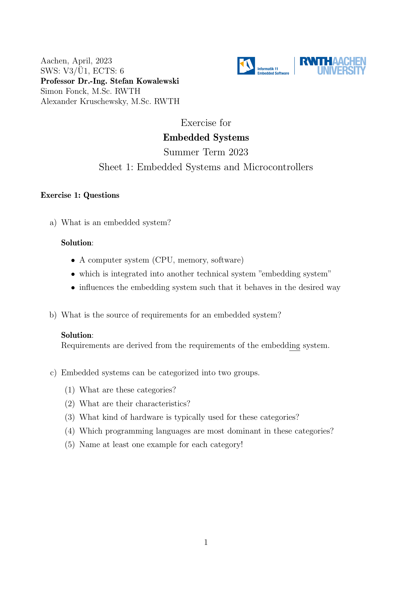

这是一份来自德国亚琛工业大学（RWTH Aachen University）\*\*嵌入式系统课程（Embedded Systems）\*\*的练习题（Sheet 1: Embedded Systems and Microcontrollers），时间是 **2023 年夏季学期（Summer Term 2023）**。下面我将逐段为你详细解释内容含义。

---

### 📘 文件概述

* **机构与负责人：**
文件顶部写着 Aachen, April 2023，说明这是在 2023 年 4 月发布的。课程由 **Stefan Kowalewski 教授（Prof. Dr.-Ing. Stefan Kowalewski）** 主讲，助教是 **Simon Fonck 和 Alexander Kruschewsky**，都来自 RWTH。
* **课程信息：**
SWS: V3/Ü1, ECTS: 6
意思是这门课每周有 3 学时的讲座（Vorlesung, V3）和 1 学时的练习（Übung, Ü1），学分为 6 分。

---

### 🧩 练习 1：问题与解答

#### a) 什么是嵌入式系统？

**答案解释：**

* 它是一个 **计算机系统**，包括 **CPU、内存和软件**。
* 这个系统被 **嵌入（integrated）到另一个技术系统** 中，那个系统称为“**embedding system**”（宿主系统或被嵌入系统）。
* 嵌入式系统通过控制或影响宿主系统，使其按照预期的方式运行。

👉 简单说：嵌入式系统是“**隐藏在机器内部的小型计算机系统**”，用于控制特定功能，比如洗衣机的控制模块、汽车的ABS控制系统等。

---

#### b) 嵌入式系统的需求来源是什么？

**答案解释：**

* 嵌入式系统的需求来自于它所服务的\*\*宿主系统（embedding system）\*\*的需求。

👉 举个例子：汽车制造商要求自动刹车系统在某种情况下启动，这就是宿主系统的需求；嵌入式系统则必须据此设计相应的功能。

---

#### c) 嵌入式系统的分类

题目指出嵌入式系统可分为 **两大类**，并要求回答以下五个子问题：

1. **有哪些类别？**
通常是：

* 通用型嵌入式系统（General Purpose Embedded Systems）
* 专用型嵌入式系统（Application-Specific Embedded Systems）
有时也称为：
* 小规模嵌入式系统（Small Scale）
* 大规模或复杂嵌入式系统（Large Scale / Complex）

2. **它们的特征？**

* 小型系统通常资源有限（低功耗、低存储、低成本）。
* 大型系统则更复杂，具有实时操作系统、网络连接等功能。

3. **常见硬件？**

* 小型系统用 **微控制器（Microcontroller）**。
* 大型系统使用 **微处理器（Microprocessor）** 或 **SoC（System on Chip）**。

4. **主要编程语言？**

* 常见的有 **C、C++、汇编语言（Assembly）**。
* 对于高层系统，也会用到 **Python、Java、MATLAB** 等。

5. **举例：**

* 小型嵌入式系统例子：洗衣机控制器、遥控器、微波炉控制板。
* 大型嵌入式系统例子：智能手机、汽车电子控制单元（ECU）、飞机导航系统。

---

### 🧠 总结（知识要点）

| 主题      | 关键点                  |
| ------- | -------------------- |
| 嵌入式系统定义 | 嵌入在其他系统中的计算机，用于控制和协调 |
| 需求来源    | 来自宿主系统的需求            |
| 分类      | 小型 vs. 大型，或通用 vs. 专用 |
| 硬件      | 微控制器、微处理器、SoC        |
| 语言      | C、C++、汇编等            |
| 示例      | 洗衣机控制器 / 智能汽车控制系统    |

---

### \[口语化表达]

这份文件其实是德国亚琛工业大学的嵌入式系统课程的第一份练习题，主要讲的就是“什么是嵌入式系统”。它解释了嵌入式系统就是一个小型计算机，比如有CPU、内存和软件，它被装进别的设备里，去控制那个设备的行为，比如汽车或家电。然后它还说，这种系统的设计需求其实都是根据外部系统的要求来的，比如车厂需要刹车控制系统，那这个系统的嵌入式部分就要按这个需求设计。最后，它让学生思考嵌入式系统的两种类型、各自的特点、常用硬件和语言，还有例子。简单说，就是一份帮学生理解嵌入式系统基础概念的入门练习题。


---

## 第 2 页

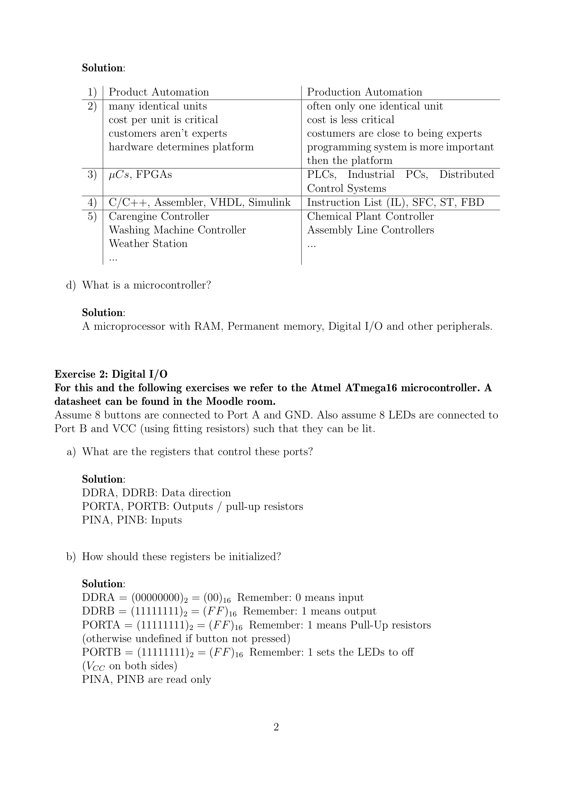

这页是上一页（嵌入式系统练习）的延续，主要讲了两部分内容：
**一是嵌入式系统的分类及示例，二是数字输入/输出（Digital I/O）在ATmega16微控制器中的应用。**
下面我为你详细说明。

---

## 🧩 第一部分：嵌入式系统分类补充与微控制器定义

这部分是上一页第 c) 题的解答延续。

表格对比了两类嵌入式系统：

| 项目         | Product Automation（产品自动化） | Production Automation（生产自动化）   |
| ---------- | ------------------------- | ------------------------------ |
| **特征**     | 大量相同单元；成本敏感；用户不是专家；硬件平台固定 | 通常只有一个系统；成本不敏感；用户是专业人员；软件系统更重要 |
| **常用硬件**   | 微控制器（μC）、FPGA             | PLC、工业PC、分布式控制系统               |
| **主要编程语言** | C、C++、汇编、VHDL、Simulink    | IL（指令表）、SFC、ST、FBD             |
| **典型例子**   | 汽车发动机控制器、洗衣机控制器、气象站等      | 化工厂控制系统、装配线控制器等                |

📖 简单理解：

* “**产品自动化**” 是那种在产品内部嵌入的系统，比如洗衣机、空调，它们大规模生产、成本敏感。
* “**生产自动化**” 是用于工厂或生产线的控制系统，通常定制、单一、昂贵，重点在系统灵活性和编程能力。

---

### 💡 d) 什么是微控制器（microcontroller）？

**答案：**

> 微控制器是一种带有 RAM、永久存储器、数字输入输出（Digital I/O）及其他外设的微处理器。

📘 解释：
微控制器是一个“微型计算机系统”，通常集成在一块芯片上，内部包括：

* **CPU（中央处理单元）**
* **RAM（随机存储器）**
* **ROM / Flash（程序存储器）**
* **I/O 接口（输入输出控制）**

比如 Arduino、ESP32、STM32 都属于微控制器（MCU）。它们被广泛用于家电、传感器、机器人等。

---

## ⚙️ 第二部分：数字输入/输出（Digital I/O）

这部分是 **Exercise 2: Digital I/O**，以 **Atmel ATmega16 微控制器** 为例。

---

### 🧠 背景说明

ATmega16 是一种 8 位 AVR 微控制器。
题目设定：

* **Port A**：连接了 8 个按钮（开关），另一端接地（GND）。
* **Port B**：连接了 8 个 LED，通过限流电阻接到电源（VCC）。

任务是要让按钮输入、LED 输出。

---

### 🧩 a) 控制这些端口的寄存器（Registers）

答案中提到：

| 寄存器              | 功能                                                  |
| ---------------- | --------------------------------------------------- |
| **DDRA, DDRB**   | 数据方向寄存器（Data Direction Register），决定引脚是输入(0)还是输出(1)。 |
| **PORTA, PORTB** | 控制输出或激活上拉电阻（pull-up resistor）。                      |
| **PINA, PINB**   | 读取输入值（只读）。                                          |

例如：
如果 DDRB 的某位是 1，说明对应的引脚是输出端口；如果是 0，就是输入端口。

---

### ⚙️ b) 初始化寄存器

题目要求根据设定初始化寄存器。

| 寄存器                  | 二进制值   | 十六进制                              | 含义 |
| -------------------- | ------ | --------------------------------- | -- |
| **DDRA = 00000000**  | (00)₁₆ | 所有引脚作为输入（按钮）。                     |    |
| **DDRB = 11111111**  | (FF)₁₆ | 所有引脚作为输出（LED）。                    |    |
| **PORTA = 11111111** | (FF)₁₆ | 启用上拉电阻，使未按按钮时输入为高电平。              |    |
| **PORTB = 11111111** | (FF)₁₆ | 初始化LED关闭状态（因为高电平两端VCC-VCC，无电流流过）。 |    |
| **PINA, PINB**       | 只读     | 用来读取当前端口的输入值。                     |    |

📘 解释：
这样设置后：

* Port A 上的按钮能正确检测到按下/未按下状态。
* Port B 上的 LED 默认关闭，当程序输出低电平时，LED 就会点亮。

---

## ✅ 知识总结

| 概念        | 说明                    |
| --------- | --------------------- |
| 嵌入式系统分类   | 产品自动化 vs. 生产自动化       |
| 微控制器定义    | 带 RAM、存储器、I/O 的微型计算机  |
| I/O 控制寄存器 | DDRA/B、PORTA/B、PINA/B |
| 初始化逻辑     | 输入端启用上拉，输出端初始化为关闭     |
| 示例设备      | 按钮输入、LED 输出的简单系统      |

---

### \[口语化表达]

这页讲的是嵌入式系统的两种类型和微控制器的基本操作。前半部分在讲产品自动化和生产自动化的区别：前者像洗衣机控制板、气象站这种成千上万的设备，讲究成本低；后者像化工厂控制系统、装配线控制器这种，一般只做一个，成本不重要但要求稳定可靠。然后又解释了什么是微控制器，就是一块带有内存、CPU、输入输出接口的小电脑芯片。
后半部分开始讲实践内容，用ATmega16微控制器举例，教你怎么让按钮当输入、LED当输出。它通过几个寄存器（DDRx、PORTx、PINx）来控制输入输出方向和状态，还展示了怎么初始化寄存器，比如PortA全是输入、PortB全是输出、启用上拉电阻让电路稳定。整体就是让学生理解“嵌入式系统不只是理论，还要能用代码和硬件连接起来”。


---

## 第 3 页


这页是嵌入式系统练习的延续，内容主要讲如何**用程序循环控制 LED 与按钮（button）的交互**。也就是说，如何通过微控制器（ATmega16）的输入端口（PINA）读取按钮状态，并通过输出端口（PORTB）来点亮对应的 LED。下面我会一步步解释。

---

## 🧩 c) 写一个循环，通过按钮控制LED

### (1) 一对一控制（1-to-1 basis）

题目要求：**按下按钮4，就点亮LED4**（即每个按钮控制一个对应的LED）。

**解答：**

```c
while (1) {
PORTB = PINA;
}
```

📘 **解释：**

* `while(1)` 表示无限循环，程序会一直运行。
* `PINA` 是输入寄存器，表示 Port A 的当前输入状态（8个按钮的状态）。
* `PORTB` 是输出寄存器，用来控制 Port B 上的 8 个LED。
* 当按钮被按下时，对应位在 `PINA` 中为 **0**（因为连接到地 GND）。
* 因为LED是低电平点亮（0点亮），直接赋值 `PORTB = PINA` 就能同步LED状态。

✅ **结论：**
每个按钮直接对应一个LED，按下哪个按钮，就点亮哪个LED。
这是最简单、最直观的实现方式。

---

### (2) 优先编码器（Priority Encoder）

题目要求：**显示最高优先级（编号最大）的被按下按钮的编号的二进制值。**

**解答：**

```c
while (1) {
int i;
for (i = 7; i >= 0; i--) {
if (~PINA & (1 << i)) {
PORTB = ~i;
break;
}
}
}
```

📘 **逐行解释：**

#### 🔹 `for (i = 7; i >= 0; i--)`

* 从最高编号的按钮（第7个）开始检查，一直到第0个。
* 从高往低遍历的原因是要**优先响应编号更大的按钮**（即“优先级高”）。

#### 🔹 `if (~PINA & (1 << i))`

* `~PINA`：按位取反，因为按钮按下时输入是0，而我们希望检测到“1 = 按下”。
* `(1 << i)`：表示第 i 位是1（左移运算）。
* 因此，`(~PINA & (1 << i))` 判断第 i 个按钮是否被按下。

#### 🔹 `PORTB = ~i`

* 这行是把按钮的编号（i）取反后赋给PORTB。
* 因为LED是“0亮1灭”，所以要取反（bitwise invert）才能正确显示。
* 例如，如果按钮5是最高被按的，那么输出二进制值 `(11111010)₂`。

#### 🔹 `break`

* 一旦检测到最高优先级的按钮被按，就退出循环，防止被低编号按钮覆盖。

---

### 📘 补充说明

底部的注释解释了输出结果的例子：

> 如果第5个按钮（编号从0开始）是最高被按的，PORTB的值为 `(11111010)₂`。
> 也就是说，LED 会显示出数字“5”的二进制反码形式。

---

## ✅ 知识总结

| 内容           | 说明                      |
| ------------ | ----------------------- |
| 一对一控制        | 每个按钮直接控制一个LED，简单直接      |
| 优先编码器        | 程序扫描所有按钮，从最高编号开始        |
| `~PINA`      | 取反操作，把“0=按下”转为“1=按下”    |
| `(1<<i)`     | 生成只有第 i 位为1的掩码，用于检测某个按钮 |
| `PORTB = ~i` | 输出反码，使LED正确点亮           |
| `break`      | 检测到最高优先按钮后退出循环          |

---

### \[口语化表达]

这页主要讲的是怎么用程序控制按钮和LED的对应关系。第一种方式最简单，就是“哪个按钮亮哪个灯”，程序里只要把输入端口PINA的值直接赋给输出端口PORTB就行了。因为按钮按下时是0，而LED在接法上也是0点亮，所以刚好对应得上。第二种方式稍微复杂一些，叫“优先编码器”，意思是如果同时按下多个按钮，只显示编号最大的那个。程序会从第7个按钮开始往下查，一旦发现哪个被按下，就把它的编号转成二进制，输出给LED。这里还用到了位运算，比如“\~PINA”取反、“(1<\<i)”左移这些操作。简单来说，就是教你怎么用循环和位运算实现输入输出控制逻辑，让LED的显示有优先级逻辑，而不仅仅是一对一亮灯。


---

## 第 4 页


这页是练习题 **d)**：解释什么是 **“抖动（bouncing）”**，并实现一个\*\*消抖（debouncing）\*\*方法。页面给出了一个基于多次采样一致性的软消抖示例。

---

## 1) 什么是“抖动（Bouncing）”？

当你按下或松开一个机械按钮/开关时，触点不会一次就稳定导通或断开，而会在几毫秒内**快速地反复接触/分离**，导致输入信号在高/低之间**短暂来回跳变**。
如果不处理，程序会把一次按键误认为多次，从而出现“多次触发”的错误。

---

## 2) 示例中的消抖思路（多次一致采样法）

页面代码核心思路：**只有当连续若干次读取到的值都一致时，才承认信号真的改变了**。

**变量含义：**

* `BTN_PIN`：要消抖的那个按键引脚在端口里的**位序号**。
* `PINA`：端口 A 的输入寄存器。
* `1 & (PINA >> BTN_PIN)`：把 `PINA` 右移到目标位，再与 `1` 做按位与，**取出该按键当前的 0/1 值**。
* `first`：本轮消抖时**第一次读到的值**（基准）。
* `count = 3`：要求**连续 3 次读到相同值**才接受变化。
* `fail`：标记是否“本轮失败”（即这几次采样里出现与 `first` 不同的值）。

**流程（伪代码复述）：**

```c
do {
first = 1 & (PINA >> BTN_PIN);  // 记录首次读到的按键值（0或1）
fail = 0;                       // 先假设能通过

for (int i = 0; i < count; i++) {
// 反复再读若干次，如果有一次与 first 不同，就判定失败
if (first != (1 & (PINA >> BTN_PIN))) {
fail = 1;
break;                  // 立刻重来
}
}
} while (fail);                     // 失败就重新开始；直到连续 count 次一致才结束
```

**要点解释：**

* `do { ... } while (fail);`：只要在这几次采样中发现不一致（`fail=1`），就**重启一轮**，继续等待稳定；直到拿到**连续 `count` 次一致**的读数才接受“信号已改变”。
* 由于本练习的按键接法是**按下为 0**（下拉到 GND），松开为 1（通过上拉电阻为高），以上读法能正确反映按钮状态。
* 页面注释提到：这种写法有很多等价实现，思路是**稳定一致才承认**。

> 小提示：在实际程序里，通常会在每次采样之间加一点**微小延时（例如 1–5 ms）**，或用**定时器中断**驱动采样，这样能更有效地跨过抖动窄脉冲。

---

## 3) 为什么有效？

* **机械抖动的时间**通常在 **5–20 ms**（取决于器件），如果你要求在这段时间内**多次读取都一致**，抖动期间的反复跳变就不会被当成真正的状态改变。
* 这是一种**软件冗余**：用时间上的“多数表决/一致性”来换取稳定性。

---

## 4) 可替代/扩展做法（了解）

* **固定延时法**：检测到电平变化→等待固定时间（如 10 ms）→再读一次确认。
* **状态机法**：每隔固定周期采样一次，只有在稳定 N 次后才切换状态。
* **硬件消抖**：RC 滤波 + **施密特触发器**（如 74HC14），从根源上把抖动变成平滑边沿，CPU 只需读一次。

---

## 5) 与本页代码对齐的小改进示例（含延时，便于实用）

```c
// 需要一个简易延时（例如 _delay_ms(2)），或用定时器驱动
uint8_t read_stable_btn(uint8_t pin_idx, uint8_t samples) {
uint8_t first, i;
while (1) {
first = (PINA >> pin_idx) & 0x01;   // 首次读
for (i = 0; i < samples; i++) {
_delay_ms(2);                  // 间隔采样，跨过抖动
if (((PINA >> pin_idx) & 0x01) != first) {
break;                     // 本轮失败，重新来
}
}
if (i == samples) return first;    // 连续 samples 次一致，返回稳定值
}
}
```

思路和页面完全一致：**连续一致才承认**，只是加入了**采样间隔**，更贴近实机。

---

## 6) 本页关键信息小结

* **抖动**：按键在切换瞬间的快速高低跳变。
* **页面方案**：取首次值 `first`，随后再读 `count` 次；若有任意一次不同→重来；若全部相同→承认状态改变。
* **位运算**：`(PINA >> BTN_PIN) & 1` 提取目标位；`&` 是按位与。
* **实践建议**：采样间隔/定时器或硬件消抖更可靠。

---

### \[口语化表达]

这页讲的是“按钮为什么会误触发”和“怎么用代码把它稳定下来”。按钮在按下/松开时会抖，电平会在高低之间来回跳几毫秒，如果你立刻去读，就可能以为按了很多下。解决办法是：别急着相信第一次读到的值，先把当前值记成 `first`，然后再连续读几次（比如 3 次），只要这几次都和 `first` 一样，才算它真的变了；中间哪怕有一次不一样，就当作抖动，重新开始。代码用 `PINA` 读按键那个位（右移再与 1），用 `do...while` 循环不停重试，直到拿到几次一致的结果为止。实际项目里再加点小延时或用定时器更稳，还可以用 RC+施密特触发做硬件消抖。总之，就是“**连续读到一致才算数**”，这样一次按键就不会被当成好几次。


---

## 第 5 页


这页是 Exercise 3: Interrupts and Polling（中断与轮询） 的内容。主要讲两部分：
① 在不同场景下选择使用中断（Interrupts）还是轮询（Polling）；
② 介绍中断服务程序（ISR, Interrupt Service Routine）的触发条件和执行过程。
🧩 a) 选择中断或轮询，并说明理由
(1) 显示器上的“更改输入源”按钮（change input button）
选择：中断 (Interrupts)
理由： 这种信号发生得非常少（例如用户偶尔按一下），如果使用轮询去不断检测它，会浪费 CPU 资源。用中断能在信号真正发生时才响应，效率更高。
(2) 车库门的无线接收器（wireless receiver）
选择：视情况而定 (Depends)
解释：
如果信号较稀少 → 用中断更合适（能在信号到达时立即响应）。
但如果无线信号噪声多（可能产生虚假触发），为安全起见可使用轮询方式，因为轮询可以更好地进行多次确认，避免误开门。
(3) 标准桌面键盘（desktop keyboard）
选择：轮询 (Polling)
理由：
若用中断，频繁输入可能导致程序频繁暂停，影响系统流畅性。
轮询能定期检测键是否按下、持续多久，这对判断长按/短按等状态更方便。
比如要知道“某键按下了多长时间”，中断就不适合了。
(4) 气象站的温度传感器（temperature sensor）
选择：轮询 (Polling)
理由：
温度变化是慢速、连续的，不需要频繁中断。
轮询可以定时读取温度数据，计划性好（节约资源），也能保持较高的采样精度。
若用中断，温度微小变化会导致中断频繁，反而浪费性能。
🧠 总结对比：Interrupts vs Polling
特征 Interrupts（中断） Polling（轮询）
触发方式 事件触发（自动响应） 定时主动查询
适用场景 信号稀少、突发事件 信号稳定、周期性采样
优点 响应快，节省CPU 稳定可控，便于规划资源
缺点 过多中断会打断主程序 持续检测会浪费CPU时间
🧩 b) ISR（中断服务程序）何时被调用？怎么执行？
触发条件：
全局中断允许位（Global Interrupt Enable Bit）= 1
特定中断允许位（Specific Interrupt Enable Bit）= 1
对应中断标志位（Interrupt Flag）= 1
这三个条件都满足时，中断才会被触发。
ISR 调用的过程：
硬件保存程序计数器（Program Counter）
→ 记录当前执行的位置，以便返回。
关闭全局中断（Global Interrupt Bit = 0）
→ 防止中断嵌套。
设置程序计数器为 ISR 地址（查表跳转）
→ 根据中断向量表找到对应ISR的入口。
程序跳转到 ISR 函数执行。
保存上下文（寄存器、状态等）。
执行 ISR 代码（处理中断逻辑）。
恢复上下文。
恢复原来的程序计数器（返回主程序）。
💡 这样系统在执行完中断后能无缝返回原任务，就像“暂停—处理—继续”一样。
✅ 本页知识要点总结
主题 关键点
中断 vs 轮询 中断用于稀少事件，轮询用于定期任务
中断触发条件 全局允许位 + 专用允许位 + 标志位 都为1
ISR执行流程 保存现场 → 跳转 → 执行 → 恢复现场
实际设计建议 混合使用：关键事件用中断，周期数据用轮询
[口语化表达]
这页讲的是中断（Interrupt）和轮询（Polling）这两种程序响应方式。它先举了几个例子让你判断该用哪个：比如显示器的“切换输入源”按钮很少按，适合用中断；车库门的无线接收器要看情况，信号干净的话用中断，干扰多的话用轮询更安全；键盘因为要判断持续按多久，用轮询更方便；温度传感器变化慢，用定时轮询最合适。然后它还解释了中断是怎么被触发的：必须三个条件都满足（全局开中断、具体中断开、标志位为1），系统就会自动暂停当前程序，把执行位置记下来，跳转到中断函数（ISR）去执行，处理完后再回来接着运行原来的程序。整体就是教你什么时候该用中断、什么时候该用轮询，以及中断在硬件层面是怎么运行的。


---

## 第 6 页


这页包含两部分内容：**Exercise 4：定时/计数器（Timers and Counters）**与**Exercise 5：模拟外设（Analog Devices）**。下面逐问解释。

---

## Exercise 4：Timers and Counters

### a) 什么是 counter？什么是 timer？

* **Counter（计数器）**：硬件单元，用来**计外部事件**的次数，比如上升沿、下降沿或任意边沿（把脉冲个数累加）。
* **Timer（定时器）**：本质上也是计数器，但它专门**计内部时钟**的周期数（由系统时钟/分频提供），用于产生时间基准、定时中断等。

---

### b) ATmega16 的 **Timer1** 由哪些部件组成？如何配置？

* **计数寄存器 `TCNT1`**：16 位，分高/低字节（`TCNT1H`, `TCNT1L`），存当前计数值。
* **比较寄存器 `OCR1`**：16 位（`OCR1H`, `OCR1L`），与 `TCNT1` 比较触发事件（如 CTC、PWM）。
* **输入捕获寄存器 `ICR1`**：16 位（`ICR1H`, `ICR1L`），把外部输入捕获到的时间戳“锁存”下来。
* **控制寄存器 `TCCR1A`, `TCCR1B`**：配置工作模式（普通/CTC/PWM等）、时钟预分频、比较输出行为、输入捕获边沿等。

> 小结：通过设置 `TCCR1A/B` 选择模式和分频；`TCNT1` 跑动；比较值放在 `OCR1`；若要测某个外部边沿到达的精确时刻，用 `ICR1` 捕获。

---

### c) 16 位数值的读写如何做到“原子”（不被打断）？

在 8 位 MCU 上，16 位数需要**分两次**访问。要保证“看起来一次性完成”，做法是：

* **读（Read）**：**先读低字节 `Low`，再读高字节 `High`**。读低字节会把高字节锁存到缓冲，这样后读到的高字节与刚才的低字节属于同一时刻。
* **写（Write）**：**先写高字节 `High`，再写低字节 `Low`**。写低字节时，硬件一次性把两个字节更新到目标寄存器。
* 实践中常**短暂关中断**（见 e），避免在两次访问之间被 ISR 打断。

---

### d) 什么是看门狗（Watchdog）？

* **看门狗定时器**：从某个初值开始倒计时，**减到 0 就复位 MCU**。
* 在主循环里需要定期“喂狗”（把计数重置到初值）。
* 作用：如果程序跑飞/死循环，主循环没机会喂狗，计数到 0 后系统会自动重启，从而**从异常状态自恢复**。

---

### e) 为什么在读 16 位数值时，可能需要暂时禁止中断？

* 因为 8 位平台读取 16 位要**两次总线访问**。
* 若两次访问中间来了一个**中断**，ISR 可能也访问/修改了同一个资源，导致主程序拿到一个**前后不一致**的“撕裂值”。
* 解决：在临界区短暂**关中断**（如 `cli()`），读/写完成后**开中断**（`sei()`），保证一致性与数据完整。

---

## Exercise 5：Analog Devices

### a) ATmega16 上有哪些模拟相关外设？

* **4 路 PWM 通道**（用于占空比控制、伺服/调光等）。
* **8 通道 10 位 ADC**，逐次逼近型（**SAR**，Successive Approximation）A/D 转换器。
* **模拟比较器**（Analog Comparator），用于比较两个模拟电压并输出高/低。

---

## 速记图（按用途分）

* **时间相关**：`TCNT1`（数）、`OCR1`（比）、`ICR1`（捕）、`TCCR1A/B`（配）。
* **原子访问**：读低→读高；写高→写低；必要时关中断。
* **鲁棒性**：看门狗避免死机。
* **模拟**：PWM、10 位 ADC（8 路）、比较器。

---

### \[口语化表达]

这页主要在讲两类东西：一是“怎么数时间/事件”，二是“芯片上有哪些模拟功能”。先说计时器：计数器用来数外部脉冲，定时器用来数内部时钟。ATmega16 的 Timer1 有计数寄存器（TCNT1）、比较寄存器（OCR1）、输入捕获寄存器（ICR1）和控制寄存器（TCCR1A/B），通过这些就能做定时、比较匹配、PWM、输入捕获等。读写 16 位寄存器时，因为芯片是 8 位的，要分两次：读的时候“先低后高”，写的时候“先高后低”，最好在这段时间把中断关掉，防止被打断拿到半截数据。看门狗就是一个倒计时器，倒到 0 就重启 MCU，用来防止程序卡死。最后，这个芯片的模拟功能包括 4 路 PWM、一个 8 通道 10 位的 SAR ADC，还有一个模拟比较器。总之，这页就是教你 Timer1 的家底、原子访问的规范、为什么要关中断，以及 ATmega16 有哪些常用的模拟外设。


---

## 第 7 页

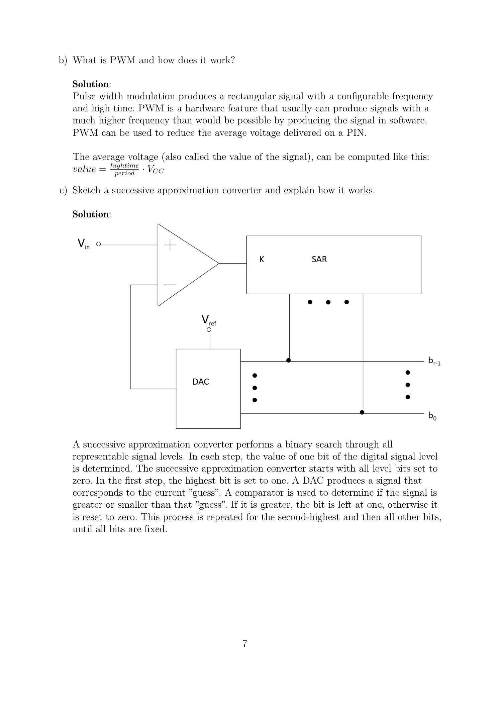

这页涵盖 **Exercise 5** 的两道题：**(b) 什么是 PWM 以及它如何工作**，和 **(c) 逐次逼近型 A/D 转换器（SAR ADC）的原理示意与说明**。下面逐项解释。

---

## b) 什么是 PWM？怎么工作的？

**PWM（Pulse Width Modulation，脉宽调制）**会产生一个**矩形波**，它的**频率**与\*\*高电平持续时间（High time）\*\*是可配置的。

* 硬件 PWM 模块能以很高频率输出这种波形（通常**远高于**软件“延时开关”能做到的频率）。
* 通过改变高电平在一个周期内所占比例（**占空比 duty cycle**），可**改变引脚输出的平均电压/能量**，从而实现调速、调光、音频合成等。

**平均电压公式（文中给出）：**

$$
\text{value}=\frac{\text{high\_time}}{\text{period}}\cdot V_{CC}
$$

也就是：**平均电压 = 占空比 × 供电电压**。
例如周期 1 ms、高电平 0.25 ms、$V_{CC}=5\text{V}$，平均电压约 $1.25\text{V}$。

---

## c) 画出逐次逼近 ADC 并解释工作原理

页面的方框图包含：**比较器（Comparator）**、**SAR（逐次逼近寄存器/控制逻辑）**、**DAC** 和参考电压 $V_{ref}$。右侧 $b_{r-1}$ 到 $b_0$ 是输出的 **r 位数字码**。

**工作流程（等价于“二分搜索”）：**

1. **初始化**：所有位先置 0。
2. **试探最高位** $b_{r-1}$：先把它置 1，SAR 把当前位串给 **DAC**，DAC 以 $V_{ref}$ 产生一个\*\*“猜测电压”\*\* $V_{DAC}$。
3. **比较**：比较器判断输入电压 $V_{in}$ 与 $V_{DAC}$ 的大小：

* 若 $V_{in} \ge V_{DAC}$ → **保留**该位为 1；
* 若 $V_{in} < V_{DAC}$ → **清零**该位为 0。
4. **继续下一位**（次高位 $b_{r-2}$），重复“置 1 → DAC 产生新值 → 比较 → 保留/清零”。
5. **直到最低位** $b_0$ 决定完成，所有位确定，得到最终的 r 位数字结果。

**直观理解：**
SAR 每次把区间“对半分”，逐位逼近真实电压；r 位 ADC 需要 **r 次比较** 就能完成一次转换，速度快、硬件简单、广泛用于通用 MCU（如 ATmega16）里的 10 位 ADC。

---

### 小结对比

* **PWM**：用“时间占比”来等效输出平均电压（占空比 × $V_{CC}$）。
* **SAR ADC**：用“逐位二分”的方式把模拟电压转成 r 位数字量：**置位→DAC 生成→比较→保留/清零**，逐位确定到 LSB。

---

### \[口语化表达]

这一页两件事：第一，PWM 就是快速地“开一会、关一会”的方波，靠改变“开着的时间占比”来调平均电压，平均电压就是占空比乘以供电电压，硬件做 PWM 会比用软件开关快很多。第二，逐次逼近 ADC 就像玩“猜数字”的二分法：先把最高位试着设成 1，用 DAC 把这个“猜的数字”转成电压和输入比一比，大就留 1，小就改回 0；然后换下一位继续试，一直试到最后一位，所有位就都定了，输入电压也就被量完了。总之，PWM是“时间换电压”，SAR ADC是“二分法量电压”。


---

## 第 8 页


这页是 **Exercise 5(d)**：只给你**1Ω**电阻（每只 **0.10 €**），问在**只能串联**的条件下，做一个 **4 位 R-2R 阶梯网络** 和一个 **4 位二进制加权电阻网络（BWRC）** 的**最小成本**分别是多少？页面还给了“若**允许并联**”时的最优用量作对照。

---

## 题意与关键点

* **器件限制**：只有 **1Ω** 电阻；先算**只能串联**的最省方案。
* **成本** = **电阻数量 × 0.10 €**。
* 两种 DAC 拓扑：

* **R-2R 阶梯（R-2R ladder）**：横向是 2R 段，纵向每一位有一个 R，到末端再接一个终止电阻。
* **BWRC（二进制加权）**：每一位需要阻值成 **R、2R、4R、8R** 的加权支路接到同一汇点。

---

## 只能串联时的最小电阻数与成本

### 1) 4 位 **R-2R**

* 4 位阶梯通常包含：

* **4 个“R”竖支路**，再加**末端 1 个“R”终止** → 共 **5 个 R**；
* **4 段“2R”横向主干** → 共 **4 个 2R**。
* 由于只有 1Ω 且**只能串联**：

* 每个 **R** 用 **1 只** 1Ω；5×1 = **5 只**
* 每个 **2R** 用 **2 只** 1Ω 串成 2Ω；4×2 = **8 只**
* **合计电阻**：5 + 8 = **13 只** → **成本 13×0.10 = 1.3 €**。
* 这与页面给出的答案一致：**R-2R：1.3 €（13 只）**。

### 2) 4 位 **BWRC（二进制加权）**

* 需要四条支路阻值分别为 **R、2R、4R、8R**。
* 只能串联时，每条支路要用对应数量的 1Ω 电阻串成：

* 1 + 2 + 4 + 8 = **15 只**。
* 但还需要把这四条支路**依次串接到共同汇点**（参见右图的那串纵向电阻链），等价于再补一条**8 只 1Ω** 的串链来“对齐”各支路的等效路径长度（保证汇点等效电阻匹配/实现加权连接）。
* **总数**：15 + 8 = **23 只** → **成本 23×0.10 = 2.3 €**。
* 与页面给出的答案一致：**BWRC：2.3 €（23 只）**。

> 小结：在“只能串联”的限制下，R-2R 更省料，因为它只需做 **R** 和 **2R** 两种值，且结构共享“2R 主干”；而 BWRC 既要做 **R、2R、4R、8R** 四种阻值，还得为连接/匹配补一段串链，所以电阻更多。

---

## 若 **允许并联**（串/并均可）

* 页面给出最优用量：**两种网络都只需 11 只电阻**（见下方两幅简图）。
* 原因：一旦允许并联，就可以**通过串/并组合“缩放”基准阻值**，让多个 2R 段或加权支路共享更少的 1Ω 单元（例如：并联得到较小等效电阻、串联得到较大等效电阻），从而把总用量压到 **11 只**。

---

## 结论（与图对应）

* **只能串联**：

* **R-2R：13 只 → 1.3 €**
* **BWRC：23 只 → 2.3 €**
* **可串并**：两者**各 11 只**（成本 1.1 €）。

---

### \[口语化表达]

这页在算“拿一堆 1Ω 小电阻，怎么最省钱做两个 4 位 DAC 网络”。如果**只能串联**，R-2R 梯形很省，只要把 4 个竖支路各用 1 只，再把 4 段横向 2R 用两两串起来，总共 13 只，花 1.3 欧；而二进制加权那种要做 R、2R、4R、8R 四条支路（就 15 只了），还得再加一串 8 只把它们接到同一个点，所以一共 23 只，2.3 欧。要是**允许并联**，就能用串/并混合把阻值“折腾”出来，两个方案都能压到 11 只。总之：受限时选 R-2R 更省料；放开并联后，两者都能做到 11 只。


---

## 第 9 页


这页是 **Exercise 5(e)** 的题目，讨论 **二进制加权电阻网络（Binary Weighted Resistor Circuit, BWRC）** 的**缺点**。下面是详细说明。

---

## 🧩 问题与解答说明

**题目：**

> What are the disadvantages of the binary weighted resistor circuit?
> 二进制加权电阻网络有哪些缺点？

---

### **原文答案解释**

> Many different types resistors or many resistors are needed for BWRC (or many resistors of the same type in series, which is not preferable in practice). This leads to either bad quality of the produced voltage level due to different deviations from the nominal value of the resistances, or to high costs if high-precision resistances are used.

翻译并解释如下：

---

### **1️⃣ 电阻需求复杂**

在 **二进制加权电阻网络（BWRC）** 中，每一位的电阻值按 1:2:4:8… 这样的比例递增。

* 比如一个 4 位 DAC，需要阻值为 **R、2R、4R、8R** 四种不同阻值的电阻。
* 实际上，随着位数增加，阻值范围会迅速扩大（例如 8 位时最高位要 128R），这意味着要么需要**不同阻值规格很多**，要么要用大量相同电阻**串联或并联组合**来“拼出”这些阻值。

---

### **2️⃣ 实际制作困难**

* 如果使用多种阻值电阻，制造难度增加，因为要采购并校准很多不同的精度件。
* 如果用相同电阻串联来实现倍数关系，电路会变大、复杂度高、误差累积，**不适合量产或高频应用**。

---

### **3️⃣ 精度问题或成本高**

* 若使用普通电阻（±1%、±5%误差），不同电阻的误差叠加会导致输出电压不准确，DAC 输出的电压级差不均匀。
* 若改用高精度电阻（例如 ±0.1%），则成本非常高，不经济。
所以会出现两难：

> 要么**精度差**、输出电压质量低，要么**成本高**。

---

### **总结一句话**

二进制加权电阻 DAC 的主要缺点就是：

> “电阻种类多、误差累积大、难制造、成本高。”

---

### ✅ 对比说明（补充）

| 特性   | R-2R 阶梯网络    | 二进制加权电阻网络 (BWRC)    |
| ---- | ------------ | ------------------- |
| 电阻种类 | 只需两种（R 与 2R） | 需多种阻值（R, 2R, 4R, …） |
| 规模扩展 | 易扩展，误差小      | 扩展困难，误差累积           |
| 成本   | 较低           | 随位数增长迅速上升           |
| 精度   | 稳定           | 需高精度电阻才能保证输出正确      |
| 实际应用 | 常见于集成 DAC    | 多用于理论或低位数实验电路       |

---

### \[口语化表达]

这页主要在讲二进制加权电阻 DAC（BWRC）的缺点。它的问题是：要么得用很多不同阻值的电阻（像 R、2R、4R、8R），要么只能用一堆 1Ω 串起来拼，这样电路又大又不稳定。因为每个电阻都有误差，阻值越多误差越累积，输出电压就会不准；如果为了精度去买高精度电阻，成本又高。所以它的通病就是“难造、贵、精度还容易飘”。这也是为什么实际设计里更常用 R-2R 阶梯网络，因为那种只要两种阻值就能搞定，简单又稳定。


---

## 第 10 页

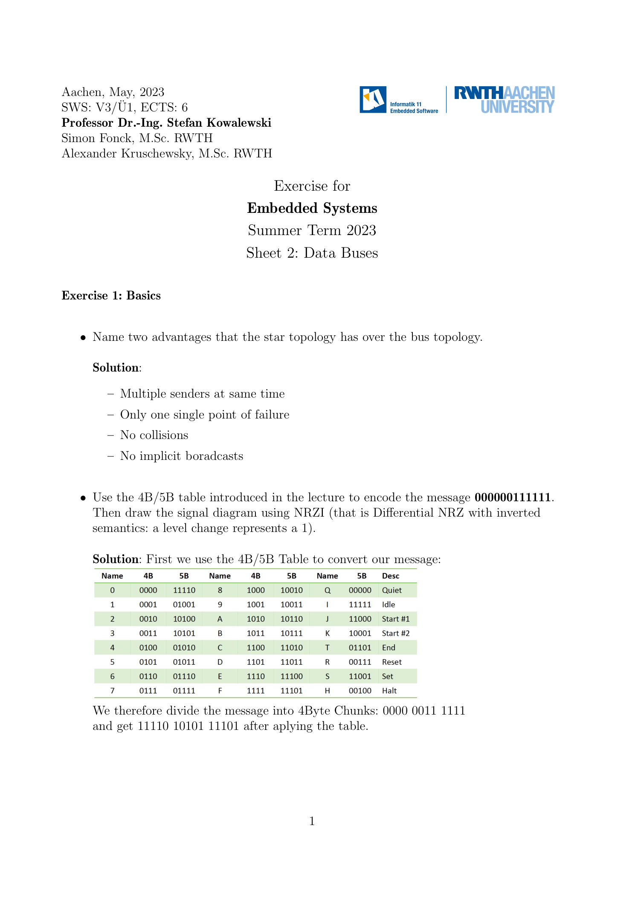

这页是 **嵌入式系统课程（Embedded Systems）2023 夏季学期的第二份练习题**，主题是 **数据总线（Data Buses）**。
主要内容包括两个部分：
1️⃣ 比较星形拓扑（Star Topology）和总线拓扑（Bus Topology）；
2️⃣ 使用 4B/5B 编码表对一段二进制信息进行编码并解释 NRZI（Non-Return-to-Zero Inverted）信号表示法。

---

## 🧩 Exercise 1: Basics（基础部分）

### （1）星形拓扑相比总线拓扑的优势

题目要求写出两点优点，答案给出了以下几个关键点：

**Solution（答案）:**

* 可以有多个发送端同时工作（Multiple senders at the same time）
* 仅有一个中心节点作为单一失效点（Only one single point of failure）
* 无碰撞（No collisions）
* 无隐式广播（No implicit broadcasts）

📘 **解释：**

* \*\*星形拓扑（Star Topology）\*\*是指所有设备都连接到一个中央节点（例如交换机或集线器）。
相比之下，\*\*总线拓扑（Bus Topology）\*\*是所有设备共享同一条通信通道（总线）。

➡ **优点详解：**

1. **多发同时通信**：
每个节点与中央节点独立连接，不共享带宽，因此可以同时有多个节点发送数据而不会干扰。
2. **单点失效更可控**：
若某条支线断开，只影响一个节点，不影响整个网络；相比之下，总线断裂会让所有通信中断。
3. **无碰撞**：
各链路独立传输，不会出现两个设备“同时说话”而冲突的情况。
4. **无隐式广播**：
数据仅在目的节点之间传输，不会像总线那样所有节点都“听见”所有数据，安全性更好。

---

### （2）4B/5B 编码及 NRZI 信号

题目要求：

> 使用 4B/5B 编码表对消息 `000000111111` 进行编码，并用 NRZI（Non-Return-to-Zero Inverted）方式画出信号图。

---

#### 📗 什么是 4B/5B 编码？

4B/5B 是一种**线路编码方式**，将 **4 位二进制数据**编码成 **5 位传输码（code group）**。
目的：保证传输信号中不会出现太多连续的“0”（因为连续 0 会导致时钟同步丢失）。

➡ 编码表示例如题中绿色表格所示：

| 名称  | 4B   | 5B    | 描述（Desc） |
| --- | ---- | ----- | -------- |
| 0   | 0000 | 11110 | Quiet    |
| 1   | 0001 | 01001 | Idle     |
| 2   | 0010 | 10100 | Start#1  |
| 3   | 0011 | 10101 | Start#2  |
| 4   | 0100 | 01010 | End      |
| 5   | 0101 | 01011 | Reset    |
| 6   | 0110 | 01110 | Set      |
| 7   | 0111 | 01111 | Halt     |
| ... | ...  | ...   | ...      |

---

#### 📘 实际编码步骤

消息是：

```
0000 0011 1111  （共 12 位）
```

我们将其按 **4 位一组（4B）** 分段：

* 第一组：0000
* 第二组：0011
* 第三组：1111

查表得到对应的 5B 码：

* 0000 → 11110
* 0011 → 10101
* 1111 → 11101

所以，编码后的完整序列是：

```
11110 10101 11101
```

也就是 **“111101010111101”**。

---

#### 📙 NRZI（Non-Return-to-Zero Inverted）信号解释

NRZI 是一种**差分编码**方式：

* **“电平变化”表示 1**
* **“电平不变”表示 0**

例如假设起始电平为低（0V）：

| 输入比特 | 电平变化 | 输出电平 |
| ---- | ---- | ---- |
| 1    | 变化   | 高电平  |
| 0    | 不变   | 高电平  |
| 1    | 变化   | 低电平  |
| 0    | 不变   | 低电平  |

这样信号中每次“变化”都对应数据位 1，方便接收方保持时钟同步。

---

## ✅ 总结要点

| 项目         | 内容                                 |
| ---------- | ---------------------------------- |
| 星形拓扑优点     | 多发同时通信、单点故障易管理、无碰撞、无广播干扰           |
| 4B/5B 编码作用 | 防止长串 0 丢时钟，提高信号可靠性                 |
| 实例编码       | `000000111111 → 11110 10101 11101` |
| NRZI 特点    | 1 = 电平切换；0 = 电平保持                  |

---

### \[口语化表达]

这页讲了两件事：第一是网络拓扑的比较，星形比总线好在可以同时多发数据、不会冲突、出问题只会影响一个节点而不是全网；第二是数据传输里的 4B/5B 编码。就是把每 4 位数据换成 5 位传输码，避免太多连续的 0 影响时钟同步。题里把 `000000111111` 拆成三组 4 位（0000、0011、1111），查表变成 11110、10101、11101，拼起来就是 111101010111101。接着还提到了 NRZI 信号法，它的规则是“电平变就代表 1，不变代表 0”，这样收发两边都能保持同步。整页其实是在讲数据传输中“物理层信号是怎么编码和传的”。


---

## 第 11 页


这页延续了上一题的编码结果，先把**4B/5B 编码后的比特序列**用 **NRZI** 表示成波形，然后问**数据链路层（OSI 第2层）的两个子层叫什么，各自负责什么**。

---

## 1) NRZI 波形说明

* **规则**：在 NRZI（Non-Return-to-Zero Inverted）中
**1 = 电平翻转（change）**，**0 = 电平不变（no change）**。
* 做法：从一个初始电平（高或低都可以）开始，按位扫描编码后的比特串；遇到 **1** 就把电平从高→低或低→高翻一次；遇到 **0** 就保持当前电平。
* 图中给出了按照该规则画出的方波。题注还说明：**若把整条波形上下“翻转”（一开始从低电平起，最后停在高电平）也是正确的**，因为 NRZI 只关心“是否翻转”，而不强制起始电平。

> 这一步就是把前页得到的 4B/5B 结果，用“1=翻转、0=保持”画成时域信号。

---

## 2) 第2层（数据链路层）的两个子层及职责

**数据链路层（DLL）分为：**

### (a) LLC（Logical Link Control，逻辑链路控制）

* 规定**帧格式**（Frame format）。
* 定义**地址/标识**（Addresses/IDs）。
* 提供**流量控制**（Flow control）。
* 提供**差错检测/纠正**（Error detection/correction），如 CRC、重传等。

### (b) MAC（Medium Access Control，介质访问控制）

* 规定**谁在何时/用何种资源发送**（按**频率/编码/时间**等方式分配介质，如 FDMA/CDMA/TDMA 等）。
* 定义**冲突如何处理**（如果介质会冲突，如以太网的 CSMA/CD/CA 一类机制）。

---

## 要点速记

* **NRZI**：看“翻不翻”而不是电平高低本身；**1=翻转，0=不变**；起始电平可自定。
* **第2层子层**：**LLC** 负责帧、地址、流控、差错；**MAC** 负责介质访问与冲突处理。

---

### \[口语化表达]

这页干两件事：先把上一页编码出来的比特串按 NRZI 画成波形——记住规则就是“遇到 1 就翻一下电平，遇到 0 电平不动”，起始电平随便选，整条波形上下倒过来也算对；然后问网络分层里第2层的两个子层是什么：一个是 LLC，负责帧长啥样、地址怎么写、怎么限速、怎么检错纠错；另一个是 MAC，管大家怎么轮着用链路资源（按频率/时间/码等分配）以及真碰上冲突了怎么处理。


---

## 第 12 页

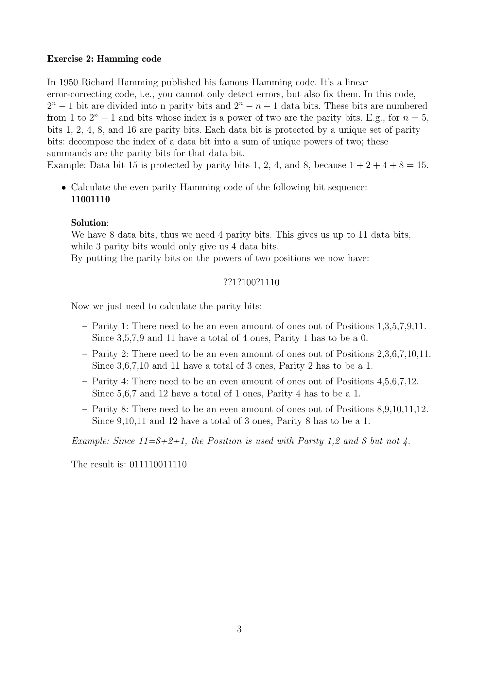

这页讲的是 **Exercise 2: Hamming Code（海明码）**，主要介绍了 Hamming 码的原理与一个具体例子。它是嵌入式通信和数据校验里常见的一种**差错检测与纠错编码方法**。

---

## 🧩 Hamming Code 原理说明

### 1️⃣ 背景

1950 年，Richard Hamming 提出了 **Hamming Code**，这是一种**线性纠错码**（linear error-correcting code）。
它的特点是：

* 不仅能**检测错误**（detect errors），还能**纠正错误**（correct errors）。
* 它通过在原始数据位（data bits）中插入多个\*\*校验位（parity bits）\*\*来实现。

---

### 2️⃣ Hamming 码结构公式

对于一个含 **n 个数据位** 的编码，需要的 **校验位数量 p** 满足：

$$
2^p \ge n + p + 1
$$

换句话说，编码总长是 $n + p$，校验位放在位置 1, 2, 4, 8, 16, …（即 2 的幂次位置上）。

示例：

* 当有 8 个数据位时，需要 4 个校验位（因为 $2^4=16 ≥ 8+4+1=13$）。

---

### 3️⃣ 示例：编码 11001110

题目给的数据是：

```
11001110
```

这是 8 位数据，所以需要 4 位校验位，总共 12 位（8+4=12）。

---

### 4️⃣ 放置校验位

校验位放在 2 的幂次位置：

```
位置: 1 2 3 4 5 6 7 8 9 10 11 12
位值: ? ? 1 ? 1 0 0 ? 1 1 1 0
```

即在位置 1, 2, 4, 8 上放校验位，其他为数据位。

---

### 5️⃣ 计算偶校验（Even Parity）

我们用 **偶校验（even parity）**：每组受保护的位中，“1”的数量必须为偶数。

#### Parity 1 → 影响位置 1,3,5,7,9,11

* 各位是：1(3),1(5),0(7),1(9),1(11) → 共 4 个“1” → 已是偶数 → P1 = 0。

#### Parity 2 → 影响位置 2,3,6,7,10,11

* 各位是：1(3),0(6),0(7),1(10),1(11) → 共 3 个“1” → 奇数 → P2 = 1。

#### Parity 4 → 影响位置 4,5,6,7,12

* 各位是：1(5),0(6),0(7),0(12) → 共 1 个“1” → 奇数 → P4 = 1。

#### Parity 8 → 影响位置 8,9,10,11,12

* 各位是：1(9),1(10),1(11),0(12) → 共 3 个“1” → 奇数 → P8 = 1。

---

### 6️⃣ 得出最终码字

把校验位代回原位置：

| 位置 | 1 | 2 | 3 | 4 | 5 | 6 | 7 | 8 | 9 | 10 | 11 | 12 |
| -- | - | - | - | - | - | - | - | - | - | -- | -- | -- |
| 位值 | 0 | 1 | 1 | 1 | 1 | 0 | 0 | 1 | 1 | 1  | 1  | 0  |

最终结果：

```
011110011110
```

---

### 7️⃣ 小结：Hamming 码能做什么

* **检测单比特错误**
* **定位并纠正单比特错误**
* **检测但无法纠正双比特错误**

---

## ✅ 知识重点总结表

| 概念    | 内容                        |
| ----- | ------------------------- |
| 校验位位置 | 1, 2, 4, 8, 16, …         |
| 校验规则  | 每组中“1”的数量为偶数（even parity） |
| 公式    | $2^p \ge n + p + 1$       |
| 本例数据  | 11001110 → 011110011110   |
| 功能    | 能检测并纠正 1 位错误；检测 2 位错误     |

---

### \[口语化表达]

这一页讲的是海明码（Hamming Code），也就是一种能自动检测和修正错误的编码方式。做法是：在数据里插入几个“校验位”，放在 1、2、4、8 这些位置。校验位的作用是让某些特定组合的比特数总是偶数，这样如果有一位被传错，就能通过这些组合算出来哪一位错了。比如题目给的 11001110，要加 4 个校验位，放在 1、2、4、8 号位置，然后一个个算出该填 0 还是 1，最后结果是 011110011110。它能发现并修复单个比特错误，非常聪明，是早期计算机通信和存储校验的基础。


---

## 第 13 页

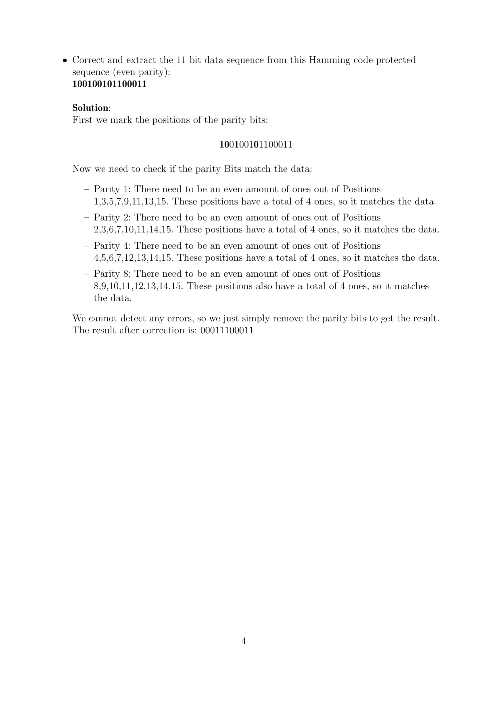

这页是 **海明码（Hamming code）— 解码与纠错示例**。已知一段**偶校验**（even parity）的海明码码字：

```
100100101100011   （共 15 位）
```

要求：**纠正并提取其中的 11 位原始数据**。

---

## 解题步骤详解

### 1) 标出校验位位置

长度 15 ⇒ 采用 **P1、P2、P4、P8** 四个校验位（放在 2 的幂次位置 1、2、4、8）。
把码字按位编号（1…15），并记下每个校验位覆盖的“奇偶校验组”：

* **P1** 覆盖位：1,3,5,7,9,11,13,15
* **P2** 覆盖位：2,3,6,7,10,11,14,15
* **P4** 覆盖位：4,5,6,7,12,13,14,15
* **P8** 覆盖位：8,9,10,11,12,13,14,15

> 规则：偶校验 → 每个覆盖组里“1”的个数必须为**偶数**。

### 2) 逐组检查奇偶（求“综合征”）

对照码字 `100100101100011` 逐组数“1”的个数：

* **P1组**（1,3,5,7,9,11,13,15）：共有 **4** 个 1 → 符合偶数。
* **P2组**（2,3,6,7,10,11,14,15）：共有 **4** 个 1 → 符合偶数。
* **P4组**（4,5,6,7,12,13,14,15）：共有 **4** 个 1 → 符合偶数。
* **P8组**（8,9,10,11,12,13,14,15）：共有 **4** 个 1 → 符合偶数。

四组都满足偶数 ⇒ **综合征 = 0000** ⇒ **未检测到错误**（或错误数为偶数但标准 Hamming 仅能纠正 1 位、检测 2 位，这里按题意视为无误）。

### 3) 去掉校验位，提取数据

去除位置 **1、2、4、8** 上的校验位，保留其余 11 位数据，得到：

```
00011100011
```

---

## 关键点回顾

* 15 位码字 = 11 位数据 + 4 个校验位（位于 1、2、4、8）。
* 使用**偶校验**，各校验组内“1”的总数应为偶数。
* 四组都满足 ⇒ 无错误；删除校验位即可还原数据。
* **最终 11 位数据**：**`00011100011`**。

---

### \[口语化表达]

这页就是教你怎么把一串海明码拆开来：先认出 1、2、4、8 这四个位置是校验位，然后按照偶校验的规则去数它们各自管的那几组比特里有几个“1”。四组数下来都是偶数，就说明这串码字没错，把 1、2、4、8 位置丢掉，剩下的就是原始数据了。这题最后拿到的 11 位数据是 `00011100011`。


---

## 第 14 页

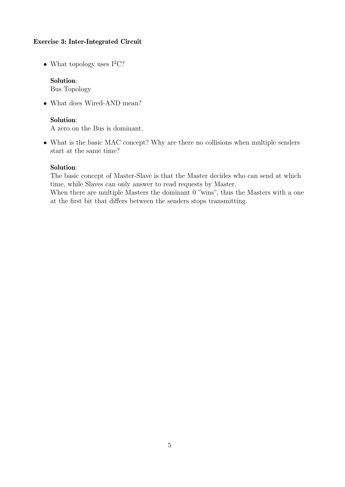

这页是 **Exercise 3: I²C（Inter-Integrated Circuit）** 的要点问答，围绕 I²C 的网络结构、**有线与（Wired-AND）** 含义，以及其 **MAC（介质访问控制）/仲裁** 机制为什么不会碰撞。

---

## 1) I²C 使用什么拓扑？

**答案：Bus 拓扑（总线拓扑）。**
I²C 用两根公共信号线 **SCL（时钟）** 和 **SDA（数据）** 把多个器件并在同一条总线上，谁在总线上说话、什么时候说，由主机（Master）调度或通过仲裁自动决定。

---

## 2) Wired-AND 是什么含义？

**答案：总线上“0”是支配（dominant）的。**

* I²C 设备的引脚是 **开漏/开集（open-drain/open-collector）**，线被上拉到高电平。
* 任何一个器件只要把线拉低（输出 0），总线电平就会是 **低**；所有器件都不拉低时，总线才是 **高**。
* 这在逻辑上等价于“**线与**”（多个输出按位与在一起）：只要有 0，结果就是 0。

---

## 3) 基本 MAC 概念；为什么多个发送者同时开始也不冲突？

**答案（要点）：**

* **主从模型（Master-Slave）**：通常由 **Master** 发起并控制通信时机，**Slave** 只在被主机寻址后回应。这样天然减少冲突。
* **多主仲裁（Arbitration）**：即便有多个 Master 同时起步发送，它们都监视 SDA：

* 发送位为 **1** 的 Master 会期望线上是高电平；
* 如果它发现线上变成 **低**（说明别的 Master 发了 0），它就知道自己“输掉仲裁”，**立即停止发送**；
* 因为“0”在 Wired-AND 上是**支配**的，所以不会出现电气冲突，最后只会剩下一个 Master 继续把整帧发完。
* 仲裁发生在**第一个不同的比特**处；输的一方退让，故**不会产生碰撞**。

> 直观理解：大家同时说话，但只要有人说“0”（拉低线），其它说“1”的人就闭嘴，整个过程在比特级别完成，既安全又高效。

---

## 小结速记

* **拓扑**：I²C 是 **总线**。
* **Wired-AND**：开漏+上拉 → **0 胜出**。
* **无碰撞原因**：主从调度 + 多主**比特级仲裁**（检测到自己想发 1 但线上是 0 → 让路）。

---

### \[口语化表达]

这一页讲 I²C 的基本套路：它是总线结构，所有器件共用 SDA/SCL 两根线；线是开漏+上拉的“有线与”，谁拉低就是 0，0 有绝对话语权。至于为啥多个主机一起开始也不撞车？因为 I²C 会边发边看：如果我想发 1，但发现线上被别人拉成 0，我就马上闭麦退出，让对方继续发。这样靠“0 胜出”的规则在比特级就完成仲裁，所以既不会烧线也不会冲突。


---

## 第 15 页

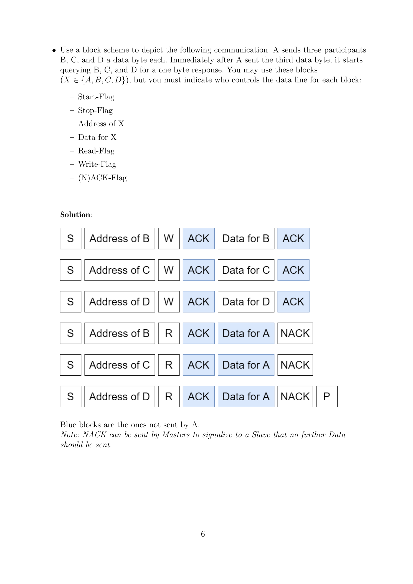

这页是 **I²C 通信流程示例题**，题目要求你根据给定场景画出通信流程（block scheme），并标明在每个阶段是谁控制数据线。整个场景是：
**设备 A（主机 Master）** 依次给 **B、C、D** 三个从机（Slave）发送 1 字节数据，然后马上轮询它们各自回复 1 字节响应。

---

## 🧩 通信背景：I²C 总线特性

I²C 通信是 **双线串行总线**：

* 一条是 **SCL（时钟线）**
* 一条是 **SDA（数据线）**
* 主机（Master）负责产生时钟，并控制通信的起止。
* 数据线上通信由当前发送方驱动（可能是 Master，也可能是 Slave）。

---

## 🧠 通信结构说明

### 通信阶段包含这些块：

| 块名                          | 说明                         |
| --------------------------- | -------------------------- |
| **S（Start Flag）**           | 起始信号，主机发出。                 |
| **Address of X**            | 主机发送目标设备地址（B、C 或 D）。       |
| **W（Write Flag）**           | 主机告诉目标是“写”操作。              |
| **R（Read Flag）**            | 主机告诉目标是“读”操作。              |
| **Data for X / Data for A** | 数据传输阶段。                    |
| **ACK / NACK**              | 接收方应答位（ACK=确认，NACK=拒绝/结束）。 |
| **P（Stop Flag）**            | 停止信号，通信结束。                 |

> **蓝色方块**表示数据是**A（主机）以外**的设备发的（例如从机的 ACK 和返回的数据）。

---

## 🧩 通信过程逐步说明

### 第一轮：A 写入数据给三个从机

A 依次给 B、C、D 发送 1 字节数据。

1️⃣ A → B：

```
S  Address of B  W  ACK  Data for B  ACK
```

2️⃣ A → C：

```
S  Address of C  W  ACK  Data for C  ACK
```

3️⃣ A → D：

```
S  Address of D  W  ACK  Data for D  ACK
```

每一轮：

* **A 控制总线**（S、地址、W、Data 都是 A 发的）
* **B/C/D** 只在 ACK 阶段响应。

---

### 第二轮：A 读取各从机的响应数据

A 再依次向 B、C、D 发起“读”请求（即让它们发回一字节数据）。

4️⃣ 读取 B 的回应：

```
S  Address of B  R  ACK  Data for A  NACK
```

5️⃣ 读取 C 的回应：

```
S  Address of C  R  ACK  Data for A  NACK
```

6️⃣ 读取 D 的回应（最后一轮，带停止信号）：

```
S  Address of D  R  ACK  Data for A  NACK  P
```

* 在 “Data for A” 阶段，由 **B/C/D（从机）** 发送 1 字节回给 A。
* A 收到后发送 **NACK** 告诉从机“结束，不要再发”，然后最后发 **P（Stop）**。

---

## 💡 结果解析

* 整个流程共有 6 次通信会话（3 次写 + 3 次读）。
* 每次通信都从 **S（Start）** 开始，到 **ACK/NACK 或 Stop** 结束。
* **主机 A 控制总线时钟**，但数据在 Data 阶段的方向会根据 W/R 切换。

---

## ✅ 总结重点表

| 步骤       | 主体                | 方向            | 内容           |
| -------- | ----------------- | ------------- | ------------ |
| 写入阶段     | A → B/C/D         | 主机发送数据        | W 模式 + 数据字节  |
| 读取阶段     | B/C/D → A         | 从机回传数据        | R 模式 + 从机发回应 |
| 同步机制     | A 控制时钟            | 总线上信号方向由读/写决定 |              |
| ACK/NACK | 从机在写时确认，主机在读时结束传输 |               |              |

---

### \[口语化表达]

这页其实是画出 I²C 主机 A 给三个从机发数据、再读回响应的全过程。前半段是写操作，A 先给 B、C、D 各发一个字节；每次都是 A 发起“开始信号 S”，发地址和写标志 W，再发数据，从机回个 ACK 表示收到了。后半段是读操作，A 又依次给 B、C、D 发读请求（S + 地址 + R），这时由从机发回一个字节，A 收完就回个 NACK 表示“我读完了”，最后一次读完再发停止信号 P。蓝色块代表是从机发的信号。整页的重点就是理解：I²C 的通信是主机调度的，一次传输里只有一方控制数据线，读写阶段方向会切换，但时钟始终由主机发。


---

## 第 16 页


这页包含两个部分：**I²C 总线的仲裁示例** 和 **Profibus 的主站机制**。下面分别详细解释。

---

## 🧩 第一部分：I²C 仲裁（Arbitration）机制示例

题目描述：

> A（地址 0x0A）和 B（地址 0x0B）两个设备想同时在总线上发送信息。
> A 要发送的数据是 0xAA（即二进制 10101010），B 要发送的数据是 0xBB（即 10111011）。
> 两者时钟完全同步、无延迟，并同时开始发送。

---

### ⚙️ 背景知识：I²C 仲裁机制

在 I²C 中，多主（Multi-Master）系统可能出现多个主机同时发起通信。
为了避免电气冲突，I²C 采用“**有线与（Wired-AND）**”的结构：

* **规则**：任何设备把 SDA 线拉低（发送 0），总线上就会变成 0。
只有当**所有设备都发送 1**时，总线才是高电平。
* 因此，0 是 **dominant（支配的）**，1 是 **recessive（被动的）**。

每个设备在发送时还要同时**监视 SDA 线**的真实电平，如果发现：

> “我发的是 1，但线是 0”
> 说明别的设备在发 0，它就输了仲裁（Arbitration lost）。

输掉仲裁的主机会立刻停止发送，等待获胜的主机传输结束后再重试。

---

### 🧮 本题具体过程

#### 设备信息：

| 设备 | 地址（十六进制） | 地址（二进制）  | 数据（十六进制） | 数据（二进制）  |
| -- | -------- | -------- | -------- | -------- |
| A  | 0x0A     | 00001010 | 0xAA     | 10101010 |
| B  | 0x0B     | 00001011 | 0xBB     | 10111011 |

#### 步骤：

1️⃣ 两个设备同时发送地址（地址阶段）：

* A 发送 0000101**0**
* B 发送 0000101**1**

2️⃣ 前面 7 位都一样（0000101），所以两者都认为一切正常。
但在 **第 8 位（最后一位地址位）**：

* A 发 0
* B 发 1
总线被拉低（因为 0 支配 1）。

结果：

* A 发的是 0，与总线一致（没问题）
* B 发的是 1，但总线是 0 ⇒ **B 发现输掉仲裁**。

⚡ **结论：A 赢得仲裁，继续发送；B 停止发送。**

> 图中绿色区域标出了“决定胜负的那一位”。

---

### ✅ 总结：仲裁的本质

* 仲裁发生在**比特级别**。
* 比较的内容包括地址和读写标志。
* “0 胜 1” 是基于硬件的逻辑与特性。
* 输掉仲裁的主机会立即让出总线。

---

## 🧩 第二部分：Profibus 主站控制机制

### 📘 题目：

> Profibus 使用常规电缆时是什么拓扑结构？介质访问是如何控制的？

### 📗 答案解释：

* **拓扑结构（Topology）**：Bus 拓扑（总线结构）
→ 所有设备连接在一根总线上，数据通过共享通道传递。

* **访问控制（Medium Access Control）**：
Profibus 系统使用 **主从（Master/Slave）** 模式：

* **主站（Master）** 控制通信时机，决定谁能发送。
* **从站（Slave）** 仅在被轮询（polled）时响应。

当系统中有多个主站（Multiple Masters）时，使用 **Token Bus** 机制：

* “令牌（Token）” 是一个特殊的权限包；
* 只有持有令牌的主站才能访问总线；
* 主站发送完后把令牌传给下一个主站；
* 这样避免了碰撞，保证访问顺序。

---

## ✅ 综合总结

| 部分          | 内容                                        | 关键机制                     |
| ----------- | ----------------------------------------- | ------------------------ |
| I²C 仲裁      | 两个主机同时发起通信，通过比较 SDA 电平确定胜者。0 胜出，输的一方立即停发。 | **Wired-AND 仲裁（0 优先）**   |
| Profibus 拓扑 | 总线型结构（Bus Topology）                       | **主从 + 令牌传递（Token Bus）** |

---

### \[口语化表达]

这页其实讲了两种总线通信的“谁先说话”规则。
第一部分是 I²C：假设 A 和 B 同时想发数据，它们的信号线是“有线与”的，也就是谁拉低谁赢。两个设备的地址前几位都一样，但在最后一位 A 发 0、B 发 1，总线上成了 0，所以 A 赢、B 认输、马上停。这个机制叫仲裁（Arbitration），能让多个主机同时起步也不会撞车。
第二部分是 Profibus：它用总线拓扑，通信由主机控制，从机只在被问到时才回；要是有多个主机，就用“令牌传递”，哪个主机拿着令牌谁就能说话，说完把令牌传给下一个。这样也能避免冲突。


---

## 第 17 页

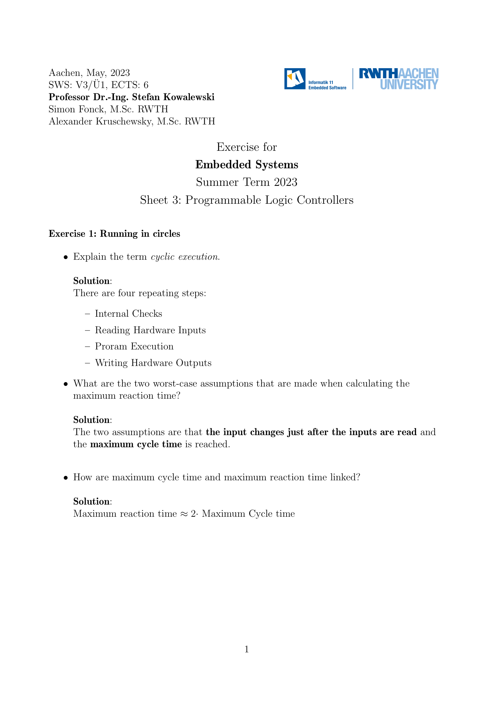

这页是**习题单3：可编程逻辑控制器（PLC）**的开头，主题是 PLC 的**循环（扫描）执行**与**反应时间**。它给出三个小问题及答案。我把概念与原因补全讲清楚：

---

## 1) cyclic execution（循环执行）是什么意思？

在 PLC 里，用户程序不是被中断零碎地跑，而是按\*\*固定的扫描周期（scan cycle）\*\*一遍又一遍地重复执行，每一轮通常包含这 **4 个顺序步骤**：

1. **Internal Checks**：内部自检/维护（看门狗、任务调度、诊断等）
2. **Reading Hardware Inputs**：读取所有输入点/输入映像区（把现场传感器的状态读入缓存）
3. **Program Execution**：按梯形图/功能块/指令表等**顺序执行用户逻辑**（基于“本周期读取”的输入）
4. **Writing Hardware Outputs**：把运算结果一次性**写回输出点**（驱动执行器）

> 这 4 步统称“一次扫描”。\*\*扫描时间/周期（cycle time）\*\*就是完成这 4 步所需的时长。

---

## 2) 计算“最大反应时间”时做的两个最坏假设是什么？

两条最坏情况假设（题里原话）：

* **输入恰好在读入之后才变化**（也就是这次扫描已经错过了它）；
* 当前系统正处于/取得到 **最大扫描周期（maximum cycle time）**（程序路径最长、负载最高）。

> 这意味着：新输入要等到**下一个扫描**的“读取输入”阶段才能被看到，而且那一轮和上一轮都取最大时长。

---

## 3) 最大扫描周期与最大反应时间如何关联？

* **最大反应时间 ≈ 2 × 最大扫描周期**

**直觉解释**：
输入在本轮“读输入”刚结束后才变化 → 本轮看不到，要**等完整的一轮**（≈1×T\_cycle\_max）到下一轮的“读输入”才被采到；
随后这轮还要**执行程序并写输出**到末尾才生效，又是一段接近**一个周期**的时间。两段加起来≈**2 个最大周期**。

> 实际工程里，还可加上 I/O 模块更新延迟、通信刷新、任务切换抖动等小量项；但课堂与考题常用 **≈2T\_max** 的近似。

---

### 小结公式

* 扫描周期：`T_cycle = T_check + T_in + T_exec + T_out`
* **最坏反应时间**：`T_react_max ≈ 2 · T_cycle_max`

---

### \[口语化表达]

这页说的是：PLC 是一遍一遍“扫”的，每一遍依次做“自检 → 读输入 → 跑程序 → 写输出”。要算最慢能多快响应一个新输入，就按最倒霉的情况想：输入偏偏在这次“读输入”刚结束后才变，而且这两轮扫描都很慢（最大周期）。于是它要等到下一轮开头才能被读到，再等到这轮末尾才把结果写出去，所以差不多就是 **两个最大扫描周期**那么久。


---

## 第 18 页

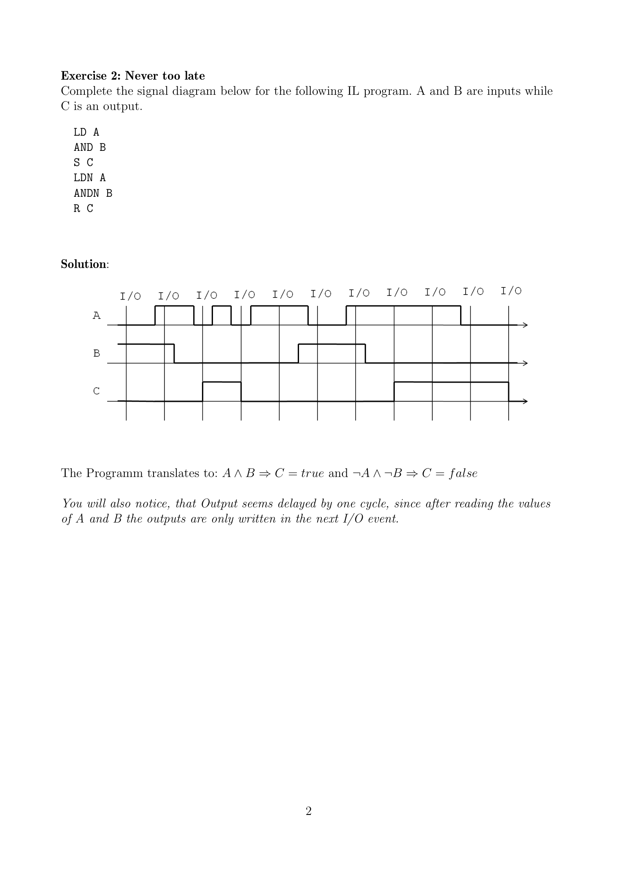

这页讲的是 **PLC（可编程逻辑控制器）中输入/输出延迟的信号时序分析**。
题目给了一个简单的指令表（IL, Instruction List）程序，并要求根据输入信号 **A** 和 **B** 的变化，画出输出 **C** 的波形。

---

## 🧩 程序解释

题目程序如下：

```
LD  A        ; 装载输入A
AND B        ; 与输入B做逻辑与
S   C        ; 若结果为1，则置位（Set）输出C

LDN A        ; 装载A的反相（非A）
ANDN B       ; 与B的反相（非B）做逻辑与
R   C        ; 若结果为1，则复位（Reset）输出C
```

---

## 🧠 程序逻辑推导

这个程序的逻辑相当于：

* 当 **A ∧ B = 1** 时，**C 被置为 1（True）**
* 当 **¬A ∧ ¬B = 1** 时，**C 被复位为 0（False）**

也就是说：

> 只有当两个输入 **A、B 同时为 1** 时，输出 C 被“打开”；
> 当它们同时都为 0 时，输出 C 被“关闭”；
> 其他混合状态时，C 保持原值。

---

## ⚙️ 信号时序分析

波形图里三条线分别是：

* A：输入信号 A 的变化
* B：输入信号 B 的变化
* C：输出信号 C 的变化（由程序逻辑控制）

### 扫描执行特点

在 PLC 中，逻辑执行是“循环的”：

* 每个循环先读输入，再运行逻辑，最后写输出。
* 这意味着输出的更新**永远滞后一个扫描周期**。

> 比如某一时刻 A、B 变为 1，这一轮程序只“读到”之前的输入值；
> 下一轮读到更新后的输入后，才执行逻辑，把输出 C 改成 1。
> 所以输出看起来总是比输入**延迟一个循环周期（one cycle delay）**。

---

## 📊 程序逻辑总结

| 条件        | 执行结果           | 说明                  |
| --------- | -------------- | ------------------- |
| A=1 且 B=1 | `S C` 执行 → C=1 | 同时为真时置位             |
| A=0 且 B=0 | `R C` 执行 → C=0 | 同时为假时复位             |
| 其他情况      | C 保持不变         | 混合输入时无操作            |
| 延迟现象      | 输出 C 比输入滞后一周期  | 因为输出写入在下一次 I/O 周期发生 |

---

## ✅ 结论公式

程序行为可以写成：

$$
C_{next} =
\begin{cases}
1, & \text{如果 } A \land B = 1 \\
0, & \text{如果 } \neg A \land \neg B = 1 \\
C_{prev}, & \text{其他情况}
\end{cases}
$$

而输出更新时刻总是：

$$
t_C = t_{A,B} + T_{cycle}
$$

---

### \[口语化表达]

这页讲的就是 PLC 程序执行的“输入延迟”现象。程序逻辑很简单：当 A 和 B 都为 1 时输出 C 打开，当 A 和 B 都为 0 时输出 C 关掉，其他时候保持原样。但因为 PLC 是“读输入 → 执行程序 → 写输出”一圈一圈跑的，所以输出信号总是比输入晚一个循环周期才变。也就是说，你一改 A、B，它不会立刻影响 C，要等下一轮扫描才生效。这个就是图上看到的输出 C 比输入波形慢半拍的原因。


---

## 第 19 页


这页是 **Exercise 3: Fun with Functions（函数逻辑练习）**，主要考察如何用三种 PLC 编程形式实现同一个逻辑函数：

$$
f = a \land (b \lor \neg c)
$$

其中：

* $a, b, c$ 是输入信号，
* $f$ 是输出信号。

题目要求用三种常见 PLC 语言形式分别实现这条逻辑表达式：
1️⃣ 梯形图（Ladder Diagram）
2️⃣ 功能块图（Function Block Diagram）
3️⃣ 指令表（Instruction List, IL）

---

## 🧩 逻辑函数分析

### 表达式拆解

$$
f = a \land (b \lor \neg c)
$$

意思是：

> 输出 f 只有在 **a 为真** 且 **(b 或 非c)** 成立时为真。

换句话说：

* a 必须为 1（起使能作用）；
* 同时满足：b 为 1 **或者** c 为 0。

---

## 🧱 一、Ladder Diagram（梯形图实现）

图上给出的梯形图表示：

* 左侧是电源线；
* 最右边是输出线圈 f；
* a 是主串联条件；
* b 和 非c 处于并联支路，形成“b 或 非c”的逻辑。

逻辑解释如下：

* 当 a 闭合（a=1），并且以下任意支路导通：

* b=1，或者
* c=0（非c导通）；
则输出线圈 f 得电（f=1）。

这正对应 $f = a \land (b \lor \neg c)$。

---

## 🔲 二、Function Block Diagram（功能块实现）

功能块图中：

* a 直接连到 **AND** 模块的一个输入；
* b 与 c（其中 c 是取反输入）先进入一个 **OR** 模块；
* OR 的输出再与 a 通过 AND 结合，输出到 f。

所以信号路径是：

```
b ----\
OR ---> AND ---> f
¬c ---/
a ---------------------/
```

逻辑完全一致。

---

## 🧮 三、Instruction List（指令表实现）

PLC 的指令表相当于汇编语言风格的逻辑指令。

### 写法1（用括号形式）：

```
LD A         ; 载入 A
AND (        ; 与 括号内逻辑结果 相与
LD B         ; 载入 B
ORN C        ; B 或 非C
)            ; 括号结束
ST F         ; 结果存入 F
```

### 写法2（展开形式）：

```
LD B         ; 载入 B
ORN C        ; B 或 非C
AND A        ; 与 A 相与
ST F         ; 存储结果到 F
```

说明：

* `LD` = Load（装载信号）
* `AND` = 与
* `ORN` = OR NOT，即“或 非C”
* `ST` = Store（保存结果）

---

## ✅ 总结表

| 表达形式  | 表示方式                          | 说明           |
| ----- | ----------------------------- | ------------ |
| 逻辑表达式 | $f = a \land (b \lor \neg c)$ | a 且 (b 或 非c) |
| 梯形图   | a 串联 (b 和 非c 并联)              | 电气逻辑图式       |
| 功能块图  | AND( a , OR(b , ¬c) )         | 图形逻辑模块       |
| 指令表   | LD/AND/ORN/ST                 | 逐条逻辑指令实现     |

---

### \[口语化表达]

这一页其实在讲同一条逻辑表达式在不同 PLC 编程语言里的写法。函数是 $f = a \land (b \lor \neg c)$，意思就是“当 a 为真，且 b 为真或 c 为假时，输出 f 为真”。
在梯形图里，它画成 a 串联、b 和 非c 并联的回路；在功能块图里，就是一个 OR 块接一个 AND 块；在指令表里就是“先装载 A，再做 B 或 非C 的逻辑，再相与，最后把结果存到 F”。
总结一句：无论是画图、用块，还是写指令，逻辑都是一样的，只是换了不同表达方式。


---

## 第 20 页


一、Timer1 在 ATmega16 里的地位
16 位定时器，唯一带 输入捕获 和 16 位比较/捕获寄存器 的定时器。
时钟源、分频、波形模式、比较匹配、输入捕获、中断全都由它自己说了算，不跟 Timer0/2 抢。
二、四组寄存器分别干什么
TCNT1（TCNT1H + TCNT1L）
16 位计数器本体，随时随硬件时钟 +1/-1。
读写必须先访问 临时高速缓存寄存器机制：
读：先读 TCNT1H，硬件把当前高字节锁存，再读 TCNT1L 拿到低字节；
写：先写 TCNT1H（只是缓存），再写 TCNT1L 的那一刻，16 位一起更新，防止中间被中断撕裂。
OCR1（OCR1A/B）（OCR1AH + OCR1AL …）
输出比较寄存器 A/B，各 16 位。
用途：
– 与 TCNT1 随时比较，相等时可以
‑ 产生中断 (OCF1A/B)
‑ 清零 TCNT1（CTC 模式）
‑ 让 OC1A/OC1B 引脚自动置位/清零/翻转（PWM 模式）。
写方法同 TCNT1：先高后低，用临时缓存。
ICR1（ICF1H + ICR1L）
输入捕获寄存器，16 位。
当 ICP1 引脚出现指定边沿（由 TCCR1B 的 ICES1 选上升或下降）时，硬件立刻把 当前 TCNT1 值锁存进 ICR1，并置位中断标志 ICF1。
经典用法：测脉冲宽度、周期、占空比、红外解码、电机转速。
TCCR1A / TCCR1B
两个 8 位控制寄存器，所有“怎么数、数多快、到顶怎么办、引脚怎么翻”都在这儿。
重要位一览（写代码时常用）：
TCCR1A
COM1A1/0：OC1A 引脚比较匹配行为（00 断开，01 翻转，10 清零，11 置位）
COM1B1/0：同上，对应 OC1B
WGM11/0：波形模式低 2 位（与 TCCR1B 的 WGM13/2 拼成 4 位模式字）
TCCR1B
ICNC1：输入捕获噪声抑制（1 打开 4 采样同步）
ICES1：输入捕获边沿选择 0=下降 1=上升
WGM13/2：波形模式高 2 位
CS12/10：时钟选择 000=停 001=无分频 010=8 分频 … 111=外部下降沿
常见模式举例（16 MHz 晶振）：
– 普通 16 位计数：WGM=0000，CS=101（1024 分频）→ 1 tick = 64 µs，满量程 ~ 4.2 s
– CTC 自动清零：WGM=0100，OCR1A=15999，CS=010 → 1 ms 精确中断基准
– 10 位快速 PWM：WGM=0111，TOP=0x03FF，CS=001 → 15.6 kHz 载波，占空比 = OCR1A/1024


---

## 第 21 页


这页是 **Exercise 5: Choosing the right path（选择正确路径）**，主要讲的是如何用 **IL（Instruction List，指令表）语言** 编写一个“分拣控制程序”，控制输送带上物体分流的逻辑。

---

## 🧩 场景说明

图中是一个**传送带分支系统**。
当物体沿着传送带移动时，会经过一个**光电开关 S（light barrier）**，并被一个\*\*分流挡板 F（flap）\*\*导向上分支或下分支。

程序要求：

* **前两个物体** → 进入 **下分支**；
* **接下来的五个物体** → 进入 **上分支**；
* 再下两个 → 下分支；
* 再五个 → 上分支；
* 如此循环往复（2 下 + 5 上）。

---

## ⚙️ 程序输入与输出说明

| 名称    | 类型    | 功能                              |
| ----- | ----- | ------------------------------- |
| **S** | 输入    | 当物体经过光电传感器时为 1（只持续 1 个周期）       |
| **F** | 输出    | 挡板控制信号：F=0 → 下分支；F=1 → 上分支      |
| **C** | 输入/输出 | 计数器，用来数当前通过的物体个数（每检测到 S=1 时加 1） |

初始化：

* F = 0（初始指向下分支）
* C = 0（初始计数为零）

---

## 💻 有用的 IL 指令解释（部分）

| 指令      | 说明               |
| ------- | ---------------- |
| `ADD X` | 计数寄存器 C 加上整数 X   |
| `MOD X` | 将 C 对 X 取模（计算余数） |
| `GT X`  | 如果 C > X，结果为真    |
| `LT X`  | 如果 C < X，结果为真    |
| `RETC`  | 若条件为真则跳到程序末尾     |
| `RETCN` | 若条件为假则跳到程序末尾     |

---

## 🧠 程序逻辑思路

1. 每当检测到物体经过（S=1），就执行计数：C = C + 1
2. 让 C 循环在 0 到 6 之间变化（通过 `MOD 7` 实现周期 7）

* 周期长度是 2+5=7。
3. 如果 C < 2 → 输出 F=0（导向下分支）
如果 C ≥ 2 → 输出 F=1（导向上分支）。

---

## ✅ 示例 IL 程序（6条指令实现）

```IL
LD S           ; 载入传感器状态
ADD C          ; 如果S=1，加1计数
MOD 7          ; 保持C在0~6之间循环
LT 2           ; 检查C是否小于2
STN F          ; 若为真，则清零F（下分支）
ST F           ; 若为假，则置位F（上分支）
```

---

## 🔍 程序行为解释

* 当计数 C = 0,1 时，`LT 2` 成立 → F = 0（下分支）；
* 当计数 C = 2\~6 时，`LT 2` 不成立 → F = 1（上分支）；
* 每检测一个新物体，C 增 1；到 7 又归零，重新开始下分支循环。

因此形成节奏：

> 下、下、上、上、上、上、上、下、下、上、上、上、上、上、...

---

### \[口语化表达]

这页讲的是一个传送带的分流控制，用 IL 指令来写“挡板控制程序”。每次有物体经过光电传感器 S，计数 C 加 1。程序让计数循环在 0 到 6 之间转（用 MOD 7），当 C 是 0 或 1 时，挡板 F 让物体走下边；当 C 是 2 到 6 时，F 让物体走上边。这样就能实现“两件下、五件上”的循环分流。程序不到 10 行，非常简洁。


---

## 第 22 页

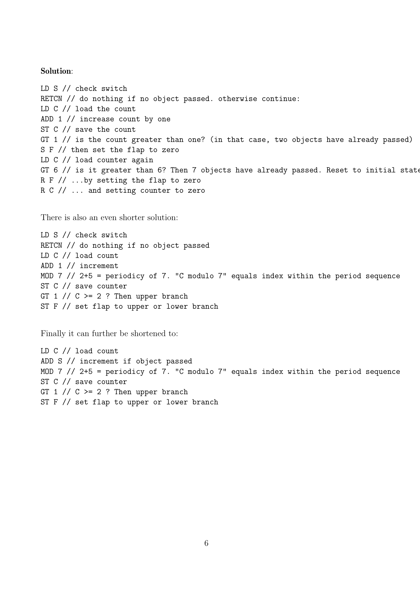

这页是上一题 **Exercise 5: Choosing the right path（选择正确路径）** 的解答页，展示了几种不同版本的 **IL（指令表）程序** 实现方式，功能都是控制输送带分流挡板 **F**，让前两个物体走下支路，后五个走上支路，然后循环往复。
这页主要展示了三个版本：完整版、简化版、最简版，并逐步优化了代码的结构和逻辑。

---

## 🧩 一、完整版程序讲解

```IL
LD S        // 检查光电传感器 S 是否被触发
RETCN       // 如果 S 没触发（没有物体经过），则什么也不做
LD C        // 载入当前计数值
ADD 1       // 物体通过一次，加一
ST C        // 保存新的计数值
GT 1        // 判断是否大于 1（即是否已经通过两个物体）
S F         // 如果大于 1，则将 F 设为 0（挡板导向下支路）

LD C        // 再次载入计数器
GT 6        // 判断是否大于 6（即是否到达一个周期的第七个物体）
R F         // 如果是，则将 F 复位（导向下支路）
R C         // 并重置计数器 C 为 0
```

**解释：**

* 前两件物体时，`C=0、1` → F=0（下分支）；
* 接下来的 5 件，`C=2~6` → F=1（上分支）；
* 当 C=7（第 7 件）时，程序重置：C=0，F=0，开始下一个周期。

---

## ⚙️ 二、更短版本（更优化的写法）

```IL
LD S        // 检查传感器 S
RETCN       // 若无物体通过则跳过
LD C        // 载入计数器
ADD 1       // 每次加一
MOD 7       // 保证计数在 0~6 之间循环（7 周期）
ST C        // 保存计数
GT 1        // 判断计数是否 ≥ 2
ST F        // 设置挡板方向（上分支或下分支）
```

**逻辑分析：**

* `MOD 7` 让计数自动循环，不用手动重置；
* 当 C<2 → `GT 1` 为假 → F=0（下分支）；
* 当 C≥2 → `GT 1` 为真 → F=1（上分支）；
* 简洁且功能等同于完整版。

---

## 🧮 三、最简化写法（极限压缩版）

```IL
LD C        // 读取计数
ADD S       // 若有物体通过（S=1）则加一
MOD 7       // 取模，保持计数在 0~6
ST C        // 保存结果
GT 1        // 判断是否大于等于2
ST F        // 设置挡板输出（0=下支路, 1=上支路）
```

**说明：**

* 这版本连“是否触发传感器”的判断都合并了；
* 若 S=0（无物体），`ADD S` 不改变计数；
* 若 S=1，则计数自动加 1；
* 逻辑非常紧凑，仅用 6 行实现全部功能。

---

## ✅ 总体逻辑总结

| 步骤 | 内容        | 说明                  |
| -- | --------- | ------------------- |
| 1  | 读取输入 S    | 检测物体是否经过光电传感器       |
| 2  | 计数加一      | 每检测到一次物体，C 自增       |
| 3  | 计数取模 7    | 实现 7 次循环（2 下 + 5 上） |
| 4  | 判断 C 是否≥2 | 若≥2 说明进入“上分支”阶段     |
| 5  | 设置 F      | F=0 → 下支路；F=1 → 上支路 |

---

### \[口语化表达]

这页其实是在教我们怎么一步步优化控制程序，让分拣挡板的逻辑又短又高效。最开始的版本写得比较啰嗦，先判断有没有物体，再手动加数、判断边界、重置；第二个版本聪明点了，用 `MOD 7` 自动循环；最后一个版本更狠，直接用 `ADD S` 一行解决加数问题，不用再分开判断了。
整个逻辑就是：每当有物体经过就计一次数，数到第 1、2 个走下边，数到第 3 到第 7 个走上边，然后重新开始。短短几行 IL 代码就能让输送带“聪明地分流”。


---

## 第 23 页

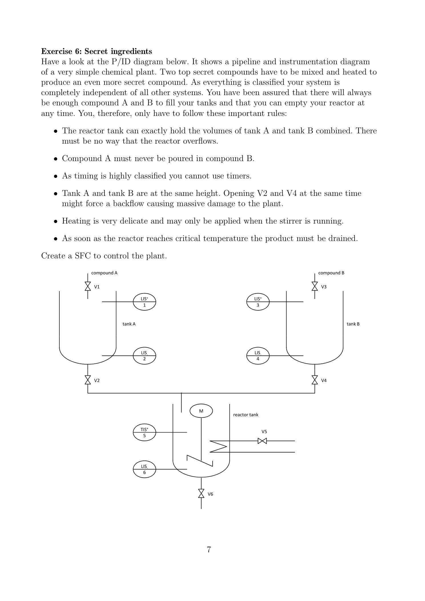

这页是 **Exercise 6: Secret ingredients**。给了一张小化工装置的 **P\&ID（管仪流程图）**，要你在**严格约束**下，用 \*\*SFC（顺序功能流程图）\*\*设计一套自动控制逻辑。目标是把 Tank A 与 Tank B 的两种原料依次送入反应釜搅拌并加热，达到“临界温度”后把产物排出。

---

## 一、装置与信号（按图标记）

* **阀门**：

* V1：A 原料进 A 罐；V2：A 罐 → 反应釜；
* V3：B 原料进 B 罐；V4：B 罐 → 反应釜；
* V5：加热介质阀（或电加热允许信号）；
* V6：反应釜出料（放空/排料）。
* **测点/执行器**：

* LIS1/LIS2：A 罐上/下液位（高/低）；
* LIS3/LIS4：B 罐上/下液位（高/低）；
* LIS6：反应釜液位（有料/空罐）；
* TIS5：反应釜温度；
* M：搅拌器电机。
* **重要约束**（题目给出）：

1. 反应釜体积**恰好等于** A 罐+ B 罐的体积和，**不允许溢流**。
2. **A 料绝不能流入 B 罐**。
3. **不能用定时器**（保密原因）；一切靠测点触发。
4. A/B 两罐**等高**，**V2 与 V4 绝不能同时开**（否则可能互相倒灌）。
5. **加热必须在搅拌运行时**才允许。
6. **达到临界温度即刻排料**。

---

## 二、SFC（顺序功能图）设计

> 文字版 SFC：每个“步（Step）”给出动作（Action），每个“转移（Transition）”给出条件（Condition）。

### S0：系统就绪 / 反应釜空

* **前置条件**：LIS6=0（釜空）、V2=V4=V5=V6=0、M=0。
* **转移条件**：启动命令（Start）=1。

### S1：填充 A 罐

* **动作**：开 V1；（向 A 罐进料）
* **互锁**：V3=0（避免同时误操作 B 进料）
* **转移**：LIS1=1（A 罐到高液位）→ 关 V1 → S2。

### S2：填充 B 罐

* **动作**：开 V3；（向 B 罐进料）
* **互锁**：V1=0
* **转移**：LIS3=1（B 罐到高液位）→ 关 V3 → S3。

### S3：A → 反应釜转移

* **动作**：开 V2。
* **硬互锁**（**防倒灌**）：强制 **V4=0**（逻辑上互锁）。
* **转移**：LIS2=1（A 罐到低液位=已排空）→ 关 V2 → S4。

### S4：B → 反应釜转移

* **动作**：开 V4。
* **硬互锁**：强制 **V2=0**。
* **安全校验**：LIS6=0→1（确认釜有料，且没有越界信号）。
* **转移**：LIS4=1（B 罐到低液位=已排空）→ 关 V4 → S5。

> 注：按题设“釜容= A+B 总量”，S3+S4 结束后釜应满而不溢；仍可添加“溢流联锁”以防图纸外异常（例如 LIS6\_HH → 紧急停机并关 V2/V4）。

### S5：搅拌

* **动作**：启 **M=1**（搅拌器运行）。
* **转移**：M\_运行反馈=1 → S6。若 M 启动失败 → 故障支路（停机、报警）。

### S6：加热到临界温度

* **动作**：在 **M=1 且 LIS6=1**（釜内有料）条件下，**允许 V5=1（加热）**。
* **联锁**：M=0 或 LIS6=0 时 **立即关 V5**（禁止“无搅拌/无料”加热）。
* **转移**：TIS5 ≥ T\_crit（临界温度）→ 关 V5 → S7。

### S7：达温即排料

* **动作**：开 **V6=1**（排料/出料）；保持 **M=1**（排料过程中仍搅拌，防沉积）。
* **联锁**：若 TIS5 上冲，可按工艺允许短时开冷却或保持搅拌，题目未要求可忽略。
* **转移**：LIS6=0（釜空）→ 关 V6，停 **M=0** → S0（循环结束，准备下一批）。

---

## 三、关键互锁与安全逻辑（实现要点）

* **绝对禁止 V2 与 V4 同时开**：
`Interlock_V2 = (Start_S3) AND (V4=0)`；`Interlock_V4 = (Start_S4) AND (V2=0)`。
* **A 不得进 B**：流程只允许 V1→A 罐、V3→B 罐，且 A→釜 与 B→釜分两步完成，无交叉管路。
* **无定时器原则**：所有步骤过渡完全依赖 **液位/温度/电机运行**等测点，不用时间条件。
* **加热条件**：`V5 = 1` 仅当 `M=1 AND LIS6=1 AND TIS5 < T_crit`。
* **达温即放**：`TIS5 ≥ T_crit` 触发 S7，**V5 立刻关闭**，**V6 打开**。
* **溢流保护（建议）**：若配置釜高液位（未画出），则 `LIS6_HH=1` → 立即关 V2/V4 并报警。
* **异常复位**：任何故障（电机未起、液位传感失效）应进入“安全停机步”，关闭全部阀门并报警。

---

## 四、SFC 简要文本版（便于抄写）

```
S0  釜空待机    [Start]→S1
S1  进A罐       动作:V1=1; 条件:LIS1=1 → V1=0 → S2
S2  进B罐       动作:V3=1; 条件:LIS3=1 → V3=0 → S3
S3  A→釜         动作:V2=1 & 强制V4=0; 条件:LIS2=1 → V2=0 → S4
S4  B→釜         动作:V4=1 & 强制V2=0; 条件:LIS4=1 → V4=0 → S5
S5  搅拌         动作:M=1; 条件:M_Run=1 → S6
S6  加热至临界    允许:V5= (M=1 & LIS6=1 & T<Tcrit)
条件:TIS5≥Tcrit → V5=0 → S7
S7  达温排料      动作:V6=1 (M保持1); 条件:LIS6=0 → V6=0, M=0 → S0
```

---

### \[口语化表达]

这页要你给一套小化工系统做自动顺控。规矩很多：A、B 两罐先各自装满；往反应釜转料时 **V2 和 V4 不能一起开**，不然会互相倒灌；加热只能在搅拌开着时进行；一到临界温度就马上排料；全程不许用定时器，只能靠液位、温度、搅拌运行这些信号。我的 SFC 就是：启动后先开 V1 把 A 罐装满，再开 V3 装满 B 罐；然后**先开 V2**把 A 倒进釜，关了再**开 V4**把 B 倒进釜（永远不让 V2 和 V4 同时开）；转完料，启动搅拌，再允许加热（搅拌停或釜里没料就禁止加热）；温度一到点就关加热、开 V6 排料，釜空就停搅拌回到起点。整套流程完全用测点做条件，既满足“不用定时器”的要求，也把防倒灌、禁止 A 进 B、达温即排等安全逻辑都卡住了。


---

## 第 24 页


这页展示的是上一题 **Exercise 6（秘密成分化工控制系统）** 的 **SFC（Sequential Function Chart，顺序功能流程图）最终实现图**，是对上一页文字逻辑的图形化总结。它把整个反应过程拆分成自动执行的步骤，每一步的执行条件、触发信号和设备动作都用框图清晰表达出来。

---

## 一、整体结构说明（流程从上到下）

### **1️⃣ Init（初始化）**

* 系统初始化时，关闭所有阀门和搅拌电机，保证安全状态。
图中动作：

```
R V1
R V2
R V3
R V4
R V5
S V6
R M
```

其中 “R” 表示复位（关闭）， “S” 表示启动（打开）。

* 所以：关闭 V1\~V5、搅拌电机 M；
* 打开 V6（排空阀），确保反应釜先放空。
* 转换条件：当液位传感器 **LIS6 = 0（釜空）** 时 → 进入下一步。

---

### **2️⃣ Ready（准备状态）**

* 系统进入待机状态，等待操作开始。
* 图中动作：`R V6`（关闭排料阀，釜保持空状态）。

---

### **3️⃣ Fill A & Fill B（同时灌装 A 罐和 B 罐）**

* 两个分支**并行**执行（左 A，右 B）。
* 动作：

* Fill A 步：`S V1`（打开阀 V1，向 A 罐进料）。
* Fill B 步：`S V3`（打开阀 V3，向 B 罐进料）。
* 转换条件：

* 当 **LIS1 = 1**（A 罐满）→ 执行 Wait 步 → `R V1`（关阀）。
* 当 **LIS3 = 1**（B 罐满）→ 执行 Wait 步 → `R V3`（关阀）。
* 说明：两个罐可同时进料，节省时间。

---

### **4️⃣ Pour A（A 料倒入反应釜）**

* 动作：`S V2` 打开阀 V2，让 A 罐物料流入反应釜。
* 转换条件：当 **LIS2 = 1**（A 罐空）→ 进入下一步。

---

### **5️⃣ Pour B（B 料倒入反应釜）**

* 动作：`R V2`（先关掉 V2 防止倒灌），再 `S V4` 打开 B 料阀。
* 转换条件：当 **LIS4 = 1**（B 罐空）→ 下一步。

---

### **6️⃣ Close Pour（关闭进料）**

* 动作：`R V4`（关闭 B 料阀）。
* 此时反应釜中已包含完整的 A+B 混合原料，准备进入搅拌。

---

### **7️⃣ Stirring（搅拌）**

* 动作：`S M` 启动搅拌电机。
* 说明：加热必须依赖搅拌运行，否则不允许下一步执行。

---

### **8️⃣ Heating（加热）**

* 动作：`S V5` 打开加热阀。
* 转换条件：当 **TIS5 = 1（达到临界温度）** → 流程重新返回最上方 **Init**（即完成反应，排料，重新开始新循环）。

---

## 二、流程逻辑总结

| 步骤         | 动作               | 条件 / 信号         | 说明       |
| ---------- | ---------------- | --------------- | -------- |
| Init       | 全部复位，排空釜         | LIS6=0          | 保证系统初始安全 |
| Ready      | 关闭排料阀            | —               | 进入待机状态   |
| Fill A/B   | 打开 V1 / V3 进料    | LIS1=1 / LIS3=1 | 两罐同时灌装   |
| Pour A     | 打开 V2（A→釜）       | LIS2=1          | 倒入 A 料   |
| Pour B     | 关闭 V2，打开 V4（B→釜） | LIS4=1          | 倒入 B 料   |
| Close Pour | 关闭 V4            | —               | 倒料完成     |
| Stirring   | 启动搅拌 M           | —               | 加热前必须搅拌  |
| Heating    | 打开加热 V5          | TIS5=1          | 达温后流程复位  |

---

## 三、安全逻辑保持一致

* 永远不会同时开 V2、V4（在 Pour B 步先强制关闭 V2）。
* 加热只会在搅拌开始后进行。
* 达温后立即返回初始化，反应釜自动排空，进入新一轮循环。
* 所有条件都依赖液位/温度信号，无任何定时器。

---

### \[口语化表达]

这页是上一题的顺序功能图，也就是化工自动控制的执行流程图。系统启动后先初始化，关掉所有阀门、开排料阀放空反应釜，确认空了再进入“Ready”待命。然后同时给 A 罐和 B 罐进料，液位到高点就各自关阀。接着先开 V2 把 A 倒进反应釜，A 倒完关 V2，再开 V4 倒 B。两罐倒完后关进料阀，启动搅拌，再开加热阀升温。等温度到达设定值，就回到最初状态，排料准备下一轮。整个流程自动进行，阀门互锁、无定时器，全靠液位和温度信号控制。简单说，这个 SFC 就是把化工操作变成一条清晰的自动化生产“路线图”。


---

## 第 25 页


这页是上一题（化工厂 SFC 控制系统）的解释说明部分，主要在文字上一步步讲解了**为什么前面那张 SFC 图要这么设计**，以及每个阶段的逻辑理由和注意事项。

---

## 一、详细解释逐条说明

### **1️⃣ 初始化阶段（Init）**

* 初始化的目标是：让系统处于**安全、干净、受控的起始状态**。
因此：

* 要关闭所有可能处于开启状态的阀门（防止液体流错方向，或者加热器/搅拌器误动作）。
* 同时要**排空反应釜（V6 打开）**，以清除里面可能残留的物料（特别是上次反应留下的 B 物质）。
* 这样可以避免“交叉污染”和“错误启动”问题。

> **总结**：Init 步是整个系统的“重置按钮”，确保下一轮反应的起点是安全的。

---

### **2️⃣ 灌装阶段（Fill A 和 Fill B）**

* 接下来要把 A、B 两个罐装满原料。
* 设计上这里采用**并行灌装**（A 罐和 B 罐同时进行）——这样能节省时间。

* 不过，也可以选择顺序进行，只是效率稍低。
* 重点：关闭阀门 V1 和 V3（对应 A 和 B 罐进料）时，只依赖各自的液位传感器（LIS1、LIS3），**不需要等另一个罐完成**。

* 因为两个罐的充填速度可能不同，强制同步反而不合理。

> **总结**：A、B 同时装料更快；每个罐都根据自己的液位信号自动停止。

---

### **3️⃣ 倒料阶段（Pour A → Pour B）**

* 灌装完后，原料 A 和 B 必须倒入反应釜。
* 根据规则：

* **A 必须先倒入**（防止 B 料受热或倒灌风险）。
* A 倒完（LIS2=1）后，再打开 V4 倒 B。
* 注意：

* 如果未说明搅拌器状态，则搅拌器可以在倒料阶段就提前启动。
* 甚至在 A 正倒入时，B 仍在灌装，也可以允许（只要不违反“V2、V4 不同时开”的规则）。

> **总结**：A 先倒、B 后倒；搅拌可在倒料时提前运行；倒料顺序符合安全要求。

---

### **4️⃣ 反应阶段（Stirring + Heating）**

* 当两种原料都进入反应釜后，开始反应阶段。
* 按规则：

* 搅拌器 **必须先启动**（M=1），然后才允许加热。
* 加热阶段（V5=1）持续到温度传感器 TIS5 达到临界温度为止。
* 当温度达到 TIS5 所设定值，就认为反应完成。

> **总结**：搅拌→加热→达到温度；搅拌是加热的前提条件。

---

### **5️⃣ 收尾阶段（排料与复位）**

* 反应完成后，系统跳回初始化（Init）状态。
* 这个步骤：

* 打开排料阀（V6）排出反应物；
* 同时关闭所有阀门、搅拌和加热；
* 排完后又回到安全状态（准备下一轮）。
* 有些方案可以在 SFC 中为排料单独设一个状态，但那样效率较低。
因此直接“回 Init 并排料”是更高效的做法。

> **总结**：反应结束 → 回 Init 排料 → 关闭系统 → 等待下一循环。

---

## 二、整体逻辑回顾

| 阶段 | 名称                | 主要动作                 | 信号条件            | 关键逻辑        |
| -- | ----------------- | -------------------- | --------------- | ----------- |
| 1  | 初始化 (Init)        | 全关阀、排空釜              | LIS6=0          | 确保安全起始      |
| 2  | 灌装 (Fill A/B)     | 打 V1/V3 灌料           | LIS1=1 / LIS3=1 | 并行充填自动停止    |
| 3  | 倒料 (Pour A/B)     | 开 V2（A→釜），再开 V4（B→釜） | LIS2=1 / LIS4=1 | 先 A 后 B，防倒灌 |
| 4  | 反应 (Stir + Heat)  | 开搅拌再开加热              | TIS5=1          | 达温即完成       |
| 5  | 复位 (Back to Init) | 排料关阀                 | —               | 回到起点循环      |

---

### \[口语化表达]

这一页其实就是把前面的流程图解释成文字版的说明。意思是说：系统刚开始要先把所有阀门关掉、反应釜排空，避免乱流或者混料；然后同时往 A、B 两个罐里装料，各自到高液位就停。接着 A 料要先倒进反应釜，再倒 B 料（不能同时开阀，防止互相倒灌）。等两罐都倒完，就启动搅拌，再开始加热，温度达到设定值就算反应完成。最后直接跳回初始状态，排料并关闭所有设备，准备下一轮。
简而言之，这页是在讲为什么前面的 SFC 图要那样画——每一步都有逻辑依据和安全理由，既符合化工操作规范，又让自动化控制更高效安全。


---

## 第 26 页


这页是《嵌入式系统（Embedded Systems）》课程第四份练习（Sheet 4: Real Time，实时系统）的一部分，主要介绍了**实时系统的基本概念和分类**，包括“实时性的两个必要条件”以及“硬实时（Hard Real Time）和软实时（Soft Real Time）”的区别。

---

## 一、实时系统的两个基本要求（requirements）

**题目：**
Name the two requirements needed for real time
（说明实时系统需要满足的两个条件）

**答案解释：**

1. **计算必须正确（The computation is correct）**
也就是说，系统必须得出逻辑上正确的结果，不能算错。
2. **计算必须在截止时间前完成（The computation finishes before its deadline）**
实时系统不仅要正确，还要“及时”，也就是在规定的时间内完成任务。

🟢 结论：
实时系统关心的是“**既对又快**”，也就是**正确性（correctness）+ 时限性（timeliness）**。
如果计算正确但太慢，就不算真正的实时系统。

---

## 二、两种实时系统类型

### **1️⃣ 硬实时系统（Hard Real Time）**

**解释：**

* 在截止时间（deadline）之前，计算结果的“有用性”是 **100%**。
* 一旦超过截止时间，即使结果算出来也完全没用（有用性=0）。

> 换句话说，错过时限就彻底失败。

**典型场景：**
飞行控制、汽车安全气囊、医疗设备、导弹控制等，
这些系统必须在毫秒甚至微秒级的时间内响应，否则后果严重。

🧩 **要点：**
硬实时系统追求“**绝对不能迟到**”。

---

### **2️⃣ 软实时系统（Soft Real Time）**

**解释：**

* 在截止时间前，结果的有用性仍然是 **100%**。
* 超过截止时间后，结果仍然可以使用，只是效果下降（有用性>0，但随时间衰减）。

**典型场景：**
视频播放、语音通话、在线游戏、网络传输等。
例如，播放视频时稍微延迟几毫秒并不会造成灾难，只会让体验稍差一点。

🧩 **要点：**
软实时系统追求“**尽量准时，但迟一点也能接受**”。

---

## 三、总结对比表格

| 项目    | 硬实时（Hard Real Time） | 软实时（Soft Real Time） |
| ----- | ------------------- | ------------------- |
| 关键点   | 必须在截止时间内完成          | 尽量在截止时间内完成          |
| 超时结果  | 无效（失败）              | 仍可接受（性能下降）          |
| 有用性曲线 | 截止前100%，截止后0        | 截止前100%，之后逐渐下降      |
| 应用场景  | 飞控、医疗、安全控制          | 视频流、网络通信、游戏         |

---

### \[口语化表达]

这页讲的是“实时系统”的基本概念。要让一个系统算是“实时的”，它必须又对又快：一是运算结果得正确，二是要在规定时间内完成。然后又分两种：**硬实时系统**是那种绝对不能迟到的，比如飞机控制、汽车安全气囊——一旦超过时限就彻底没用了；而**软实时系统**就宽松点，比如视频或游戏，虽然也希望准时响应，但晚一点还能凑合，只是效果差点。简单说，硬实时就是“迟到等于挂”，软实时就是“迟到就扣分”。


---

## 第 27 页

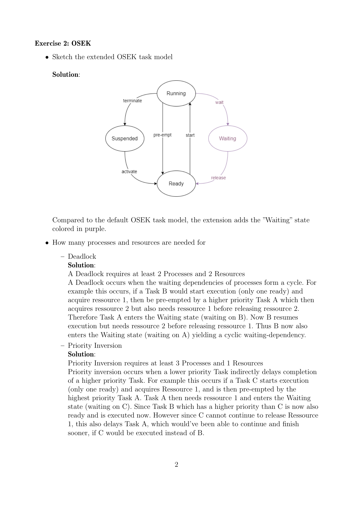

这页内容讲的是 **OSEK（汽车嵌入式系统操作系统标准）中的任务模型和两种常见问题：死锁（Deadlock）与优先级反转（Priority Inversion）**。下面是详细解释。

---

## 一、扩展的 OSEK 任务模型（Extended OSEK Task Model）

图中显示了一个扩展版的任务状态转换图，包括以下几个状态：

* **Suspended（挂起）**：任务未激活，处于空闲状态。
* **Ready（就绪）**：任务已被激活，等待调度器安排执行。
* **Running（运行）**：任务正在被 CPU 执行。
* **Waiting（等待）**：任务因等待某个事件、信号或资源而暂停。

箭头表示状态转换：

* “activate”：从挂起到就绪（任务被激活）
* “start”：从就绪到运行（任务获得 CPU）
* “terminate”：运行任务结束，回到挂起状态
* “pre-empt”：高优先级任务打断当前运行任务，当前任务进入就绪状态
* “wait”：运行任务等待某个条件 → 进入等待状态
* “release”：条件满足 → 从等待回到就绪

🟣 紫色标注的 “Waiting” 状态是**扩展 OSEK 模型中新增的部分**，在基础 OSEK 模型中是没有的。
它用于更精确地表示任务在等待资源或事件时的状态。

---

## 二、死锁（Deadlock）

**定义：**
死锁是指两个或多个任务互相等待对方持有的资源而陷入无限等待的状态。

**形成条件：**

* 至少需要 **2 个进程（Tasks）和 2 个资源（Resources）**。
* 死锁发生在任务的**等待依赖关系形成循环**时。

**例子：**

1. 任务 **B** 开始执行并占用资源 1。
2. 然后任务 **A**（优先级更高）抢占了 CPU，获取了资源 2。
3. 现在：

* A 需要资源 1 才能继续，但资源 1 被 B 占用 → A 进入等待状态（等 B）。
* B 继续运行，发现自己也需要资源 2，但资源 2 被 A 占用 → B 也进入等待状态（等 A）。
4. 于是形成循环等待：A 等 B，B 等 A → 死锁。

🧩 **总结：**
死锁 = 等待环路（循环依赖）
条件：至少 2 个任务 + 2 个资源。

---

## 三、优先级反转（Priority Inversion）

**定义：**
当一个**低优先级任务**持有某个资源，而一个**高优先级任务**正在等待这个资源，但中间被**中等优先级任务**插队执行时，就会造成高优先级任务被“间接延迟”的现象，这就是优先级反转。

**形成条件：**

* 至少需要 **3 个任务（Processes）和 1 个资源（Resource）**。

**例子：**

1. **C（低优先级）** 开始运行并占用了资源 1。
2. **A（高优先级）** 被激活，需要资源 1，但资源被 C 占用 → A 等待。
3. 此时 **B（中优先级）** 被调度运行（因为 A 被阻塞、C 低优先级）。
B 不依赖资源 1，所以可以正常运行。
4. 结果：

* 高优先级的 A 被卡住，
* 低优先级的 C 也没机会释放资源，
* 中优先级的 B 占据了 CPU。
→ A 被“间接”反转到比 B 还低的执行顺序。

🧩 **总结：**
优先级反转 = 高优先级任务被低优先级任务+调度机制“间接延迟”。
条件：至少 3 个任务 + 1 个资源。

---

## 四、两者对比表

| 问题                        | 所需进程数 | 所需资源数 | 原因                   | 结果         |
| ------------------------- | ----- | ----- | -------------------- | ---------- |
| 死锁（Deadlock）              | ≥2    | ≥2    | 任务间循环等待资源            | 所有相关任务永久阻塞 |
| 优先级反转（Priority Inversion） | ≥3    | ≥1    | 低优先级任务占资源 + 中优先级任务插队 | 高优先级任务被延迟  |

---

### \[口语化表达]

这页讲的是 OSEK 操作系统中的任务状态和两种常见问题。OSEK 的任务状态包括挂起、就绪、运行，还有一个扩展状态“等待”，表示任务在等资源或事件。然后它解释了两个经典的并发问题：
第一种是**死锁**，就是两个任务互相等着对方放资源，结果谁都动不了，至少得有两个任务和两个资源才会出现。
第二种是**优先级反转**，意思是高优先级任务被低优先级任务间接拖慢了，因为低优先级任务占着资源不放，中间还有个中等优先级的任务插队执行，导致高优先级任务被“卡”在最后。
简单来说，死锁是“大家都等着”，优先级反转是“该快的被慢的拖住”。


---

## 第 28 页

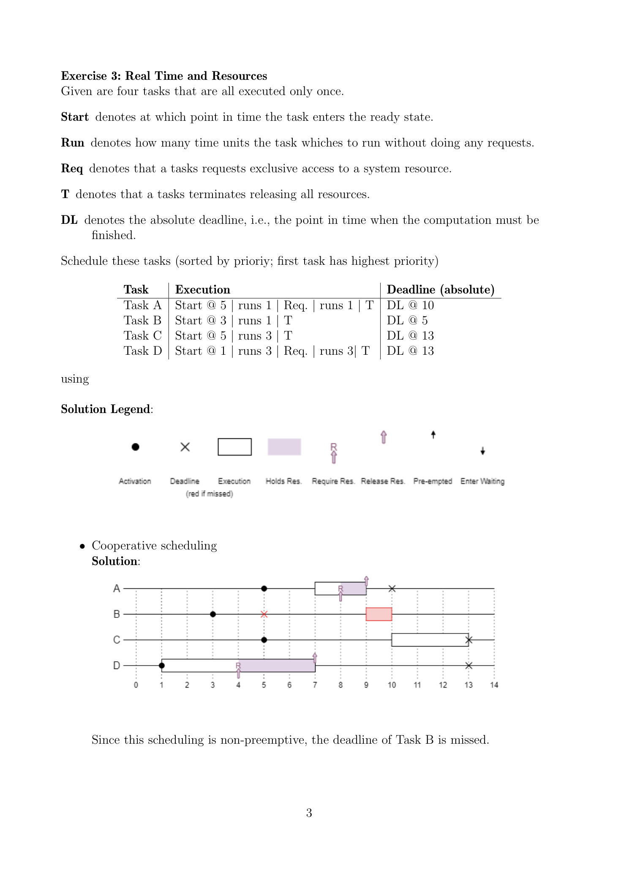

这页讲的是\*\*实时任务调度与资源共享（Real-Time and Resources）\*\*的例题，核心内容是分析在“合作式调度（Cooperative Scheduling）”下，不可抢占的任务执行顺序，以及为什么有任务会错过截止时间（deadline）。

---

## 一、题目背景说明

系统中有 **4 个任务（A、B、C、D）**，每个任务都只执行一次。表格里给出了每个任务的：

* **Start**：任务进入就绪状态（ready）的时间；
* **Run**：任务需要执行的时间长度；
* **Req**：任务请求独占资源的时间；
* **T**：任务结束时释放资源；
* **DL**：任务的绝对截止时间（必须完成的时间点）；
* **优先级顺序**：A > B > C > D（A 最高优先级）。

| 任务    | 执行细节                        | 截止时间 |
| ----- | --------------------------- | ---- |
| **A** | 5时激活，运行1 → 请求资源 → 再运行1 → 结束 | 10   |
| **B** | 3时激活，运行1 → 结束               | 5    |
| **C** | 5时激活，运行3 → 结束               | 13   |
| **D** | 1时激活，运行3 → 请求资源 → 再运行3 → 结束 | 13   |

---

## 二、调度类型：合作式调度（Cooperative Scheduling）

* “合作式”意味着：
**任务一旦开始运行，不会被抢占（non-preemptive）**。
即使有更高优先级的任务就绪，也要等当前任务主动释放 CPU。

* 所以，这里的调度器是**非抢占式的（non-preemptive）**。

---

## 三、任务执行过程分析（对应时间轴图）

从时间线（0\~14）可以逐步理解：

1. **t = 1**
→ D 激活（Start\@1），开始执行。
它先运行 3 个时间单位（1\~4），然后请求资源（Req）。

2. **t = 3**
→ B 激活（Start\@3），但由于 D 还在执行（合作式调度，不能抢占），所以 B 只能等待。

3. **t = 4\~7**
→ D 拿到资源继续执行（3 个时间单位）。
此时 B 虽然有更高优先级，但必须等 D 完成（因为 D 不会被打断）。

4. **t = 5**
→ A 和 C 同时激活，但 CPU 仍被 D 占用。
A 优先级最高，但此刻也得等 D 执行完。

5. **t = 7**
→ D 结束并释放资源，A 终于能开始。
A 执行：运行 1 → 请求资源 → 再运行 1 → 结束（共 2 单位时间）。

6. **t = 9**
→ A 完成，释放资源。
接着执行 C（因为 B 已经过了截止时间）。

7. **t = 9\~12**
→ C 执行三单位时间。

8. **t = 12\~14**
→ 所有任务结束。

---

## 四、结果分析

从图中可以看到：

* **任务 B（DL\@5）未能按时完成（红色叉号）**。
因为它在 3 时被激活，但 D 从 1 开始执行到 7 才结束，而调度是“非抢占”的，所以 B 一直被卡住。
当 B 真正获得 CPU 时，它的截止时间早已过期。

* **任务 A、C、D** 都在各自截止时间前完成。

> ✅ 总结：因为是合作式（不可抢占）调度，低优先级任务 D 长时间占用 CPU，导致高优先级任务 B 错过截止时间。

---

## 五、关键结论

| 项目   | 结果                        |
| ---- | ------------------------- |
| 调度类型 | Cooperative（非抢占式）         |
| 问题出现 | 高优先级任务被低优先级任务阻塞           |
| 结果   | Task B 错过截止时间             |
| 原因   | D 在执行时占用 CPU 且不释放，B 无法中断它 |

---

### \[口语化表达]

这页是在讲一个实时调度的例子，有四个任务要在特定时间启动并在规定时间前完成，但系统用的是“合作式调度”，也就是任务自己不让出 CPU，别人就抢不走。结果就是：低优先级的 D 从第 1 秒开始一直跑到第 7 秒，中间高优先级的 B 虽然在第 3 秒就准备好了，但没办法插队，只能干等着。等它能运行的时候，截止时间已经过了，所以 B 就超时失败了。
简单说，这个例子告诉我们：**在非抢占式调度下，低优先级任务可能会拖死高优先级任务。**


---

## 第 29 页


这页讲的是在**可抢占式调度（Preemptive Scheduling）**下，不同的资源访问策略对任务调度的影响，特别是**“优先级反转（Priority Inversion）”问题**以及两种解决方法：**优先级继承协议（Priority Inheritance Protocol）**和**优先级上限协议（Priority Ceiling Protocol）**。下面是详细解释。

---

## 一、可抢占式调度（Preemptive Scheduling）

### **调度特点：**

在可抢占式调度中：

* 高优先级任务可以随时\*\*打断（preempt）\*\*低优先级任务的执行；
* CPU 会立即切换给更高优先级的任务。

### **图中情况分析：**

* **任务 D** 在运行时获取了资源 **R**；
* 此时高优先级任务 **A** 激活，理论上应该立即执行；
* 但由于 D 拿着资源 R，A 无法继续（因为要用同一个资源），只能等待；
* 接着中优先级任务 **C** 被调度执行；
* 结果：A（高优先级）被低优先级 D 间接阻塞，并且还被中优先级 C 插队；
→ 这就是**优先级反转（Priority Inversion）**。

### **后果：**

* **A 的截止时间被延误（红色叉号表示）**；
* 原因是资源锁导致调度顺序错乱，A 被迫等待比它低优先级的任务完成。

🧩 **总结：**
在可抢占调度下，如果资源没有保护机制，就可能发生优先级反转，让高优先级任务反而被拖慢。

---

## 二、使用优先级继承协议（Priority Inheritance Protocol）

### **原理：**

当一个低优先级任务（如 D）持有高优先级任务（如 A）需要的资源时：

* D **临时继承 A 的优先级**；
* 这样中间的中优先级任务（如 C）就无法插队；
* D 继续执行，尽快释放资源；
* 一旦释放资源，D 的优先级恢复原状。

### **图中说明：**

* D 持有资源 R 后被“提升”为 A 的优先级；
* 因此 C（中优先级）不会被调度；
* D 先完成释放资源；
* 然后 A 立即继续执行，**所有任务都在截止时间内完成**。

✅ **结果：**

* **A 不再错过截止时间；**
* **优先级反转被修复。**

---

## 三、使用优先级上限协议（Priority Ceiling Protocol）

### **原理：**

每个资源都有一个固定的**优先级上限（Priority Ceiling）**，
表示系统中使用该资源的任务中最高的优先级。

当某个任务请求资源时：

* 如果它的优先级低于当前已锁定资源的“上限”，它必须等待；
* 这样可以**防止死锁（Deadlock）**和**优先级反转（Priority Inversion）**。

### **图中说明：**

* 资源 R 的上限设定得很高；
* 当 D 请求资源 R 时，它会暂时获得 R 的“最高优先级”；
* A 或 C 不会在 D 持锁期间插入执行；
* D 完成任务并释放 R 后，系统恢复正常；
* 所有任务都按时完成，没有优先级混乱，也没有死锁。

✅ **结果：**

* 不仅避免了优先级反转；
* 还防止了多个任务同时等待资源导致的死锁问题。

---

## 四、三种调度方式对比总结

| 调度类型                     | 特点            | 问题         | 结果          |
| ------------------------ | ------------- | ---------- | ----------- |
| **Preemptive（无保护）**      | 高优先级可打断低优先级   | 可能出现优先级反转  | Task A 超时失败 |
| **Priority Inheritance** | 低优先级任务临时提升优先级 | 解决优先级反转    | 所有任务按时完成    |
| **Priority Ceiling**     | 每个资源设置优先级上限   | 预防优先级反转+死锁 | 稳定无冲突       |

---

### \[口语化表达]

这页讲的就是可抢占式调度下的优先级问题。
一开始没加任何保护时，低优先级的任务 D 抢先拿了资源，结果高优先级的 A 被卡住，反而让中间的 C 插队执行，导致 A 超时——这就是**优先级反转**。
后来用“**优先级继承协议**”，让 D 临时变成 A 的优先级，这样 C 就不能插队了，D赶紧做完放锁，A 就能继续，大家都准时。
再换成“**优先级上限协议**”，干脆一开始就给资源设定一个最高优先级，只要有人在用这个资源，别的任务都不能打断，这样既能防止优先级反转，又能避免死锁。
简单说：
没保护会“乱套”，继承协议能“救场”，上限协议是“提前预防”。


---

## 第 30 页

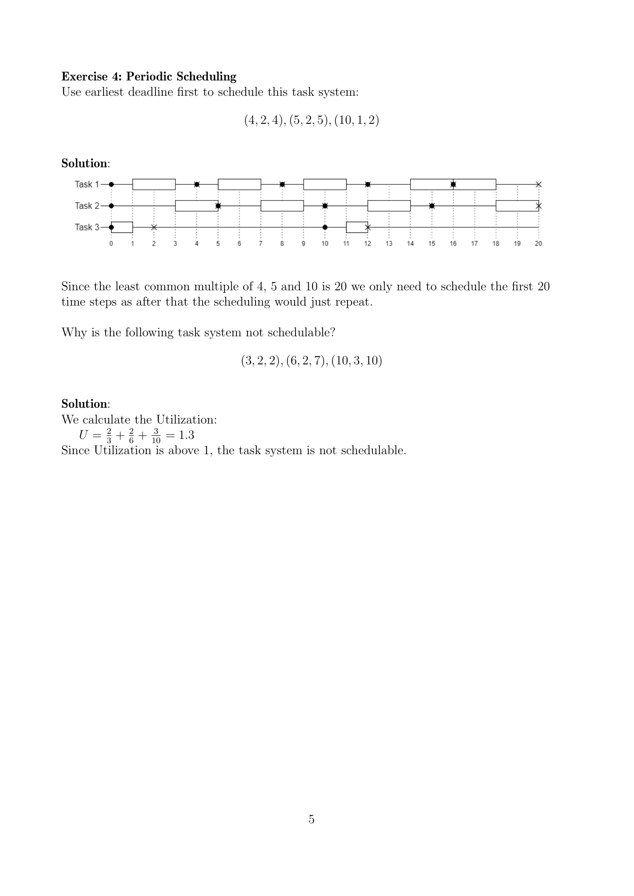

这页讲的是**周期性调度（Periodic Scheduling）**，主要使用**最早截止时间优先（Earliest Deadline First, EDF）算法**来安排任务执行，并说明了什么时候一个任务系统不可调度。下面是详细解释。

---

## 一、题目背景

给出一组周期性任务系统，每个任务用三元组表示：

$$
(T_i, C_i, D_i)
$$

其中：

* $T_i$：任务的周期（Period）——任务每隔多久释放一次；
* $C_i$：任务的执行时间（Computation time）；
* $D_i$：任务的截止时间（Deadline）。

---

## 二、第一个任务系统的调度分析

任务系统为：

$$
(4, 2, 4), \quad (5, 2, 5), \quad (10, 1, 2)
$$

也就是说：

| 任务     | 周期 T | 执行时间 C | 截止时间 D |
| ------ | ---- | ------ | ------ |
| Task 1 | 4    | 2      | 4      |
| Task 2 | 5    | 2      | 5      |
| Task 3 | 10   | 1      | 2      |

---

### **调度策略：最早截止时间优先（EDF）**

EDF 的原则是：

> 谁的截止时间最早，就先执行谁。

---

### **调度图解释（图中方块部分）**

横轴是时间（0\~20），纵轴是三个任务。

* 每当某个任务周期到来，它就“激活”；
* 如果多个任务同时就绪，调度器比较它们的截止时间，选择**最早到期的任务先运行**；
* 每个任务执行时间 $C_i$ 完成后结束；
* 到了任务周期 $T_i$，该任务会再次释放（周期性出现）。

---

### **为什么只画到 20？**

因为 4、5、10 的最小公倍数（LCM）是 20。
在 20 个时间单位后，任务释放的模式会重复出现，所以只需看前 20。

图中可以看到：

* 所有任务都能在它们的截止时间前完成；
* 调度是可行（schedulable）的；
* 没有任务延迟或冲突。

---

## 三、第二个任务系统：不可调度的情况

任务系统为：

$$
(3, 2, 2), \quad (6, 2, 7), \quad (10, 3, 10)
$$

| 任务     | 周期 T | 执行时间 C | 截止时间 D |
| ------ | ---- | ------ | ------ |
| Task 1 | 3    | 2      | 2      |
| Task 2 | 6    | 2      | 7      |
| Task 3 | 10   | 3      | 10     |

---

### **判断系统是否可调度的方法：CPU 利用率（Utilization Test）**

计算公式：

$$
U = \sum_{i=1}^{n} \frac{C_i}{T_i}
$$

代入数据：

$$
U = \frac{2}{3} + \frac{2}{6} + \frac{3}{10} = 0.667 + 0.333 + 0.3 = 1.3
$$

---

### **结果分析**

* $U = 1.3 > 1$
* CPU 的负载超过 100%，即使使用最优调度算法（如 EDF）也无法按时完成所有任务。

**结论：**

> 当任务系统的利用率 $U > 1$，系统不可调度。

---

## 四、关键总结

| 概念              | 含义                           |
| --------------- | ---------------------------- |
| **EDF 调度原则**    | 先执行最早截止的任务                   |
| **最小公倍数 (LCM)** | 周期性任务模式的重复周期                 |
| **可调度条件**       | $U = \sum (C_i / T_i) \le 1$ |
| **系统不可调度原因**    | 总利用率超过 100%                  |

---

### \[口语化表达]

这页讲的是怎么用“最早截止时间优先”方法来安排周期任务。
第一个例子里有三个任务，周期是 4、5、10，调度器每次都先执行最先到期的任务。算下来，在 0 到 20 时间单位内，所有任务都能按时完成，之后模式会重复，所以系统是能正常运行的。
但第二个例子里，任务加起来的执行时间占了 CPU 的 130%，也就是说，CPU 根本忙不过来，永远没办法让所有任务都在截止时间前完成。
简单讲：**第一个系统工作正常，第二个系统超负荷。**


---

## 第 31 页

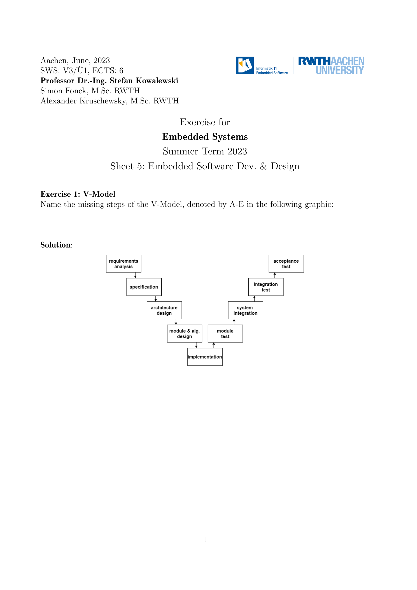

这页讲的是**嵌入式系统开发中的 V-Model（V 模型）**，也就是软件和系统开发中常用的一种生命周期模型。它强调\*\*开发阶段（左边的“V”）**与**测试验证阶段（右边的“V”）\*\*之间的对应关系。下面是详细解释。

---

## 一、V 模型的整体概念

V-Model 是一种**结构化开发流程模型**，它的名字来自于图形的形状（像一个字母“V”）：

* 左边：系统从需求分析到详细设计的**开发阶段**；
* 底部：**实现（implementation）阶段**；
* 右边：系统从模块测试到系统验证的**测试阶段**；
* 每个开发阶段都对应一个测试阶段（比如需求对应验收测试）。

它体现的是\*\*“验证与确认（Verification and Validation）”\*\*的思想：

> 左边定义的内容，右边必须通过测试来验证它是否正确实现。

---

## 二、图中的步骤说明（A–E）

在图中，已经给出了部分关键步骤，我们来完整说明整个流程。

| 阶段 | 名称                                     | 含义                     | 对应测试                                           |
| -- | -------------------------------------- | ---------------------- | ---------------------------------------------- |
| A  | **Requirements Analysis（需求分析）**        | 明确系统需要实现的功能与性能要求。      | 对应 **Acceptance Test（验收测试）**：验证系统是否满足用户需求。     |
| B  | **Specification（系统规格说明）**              | 把需求转化成更详细的系统行为说明。      | 对应 **Integration Test（集成测试）**：验证系统部件是否按照规格交互。  |
| C  | **Architecture Design（系统架构设计）**        | 设计系统的总体结构（模块划分、接口定义等）。 | 对应 **System Integration（系统集成）**：把各模块整合在一起进行测试。 |
| D  | **Module & Algorithm Design（模块和算法设计）** | 设计每个模块的详细功能、数据结构和算法。   | 对应 **Module Test（模块测试）**：单独验证每个模块是否正确。         |
| E  | **Implementation（实现/编码）**              | 把设计转化成代码，形成可运行的系统。     | 是整个 V 字底部的实际开发阶段。                              |

---

## 三、V 模型的工作机制总结

1. **开发流程是从左到右**：

* 从高层抽象（需求）到低层实现（代码）。
2. **测试流程是从右到左**：

* 从低层模块测试到高层系统验收测试。
3. **每一步都与测试相对应**：

* 确保“做的”与“要求的”一致，减少错误的层层传播。

---

## 四、V 模型在嵌入式开发中的意义

在嵌入式系统中，V 模型特别适用，因为它要求：

* 清晰的需求定义；
* 可验证的系统架构；
* 严格的测试流程；
* 可追溯性（每个需求都能在测试中找到验证依据）。

这对于高安全性、高可靠性系统（如汽车控制系统、医疗设备）尤其重要。

---

### \[口语化表达]

这页讲的是嵌入式系统开发里的 V 模型。它就像一个 “V” 字：左边是开发过程，从需求分析、系统设计，一直到模块设计；中间底部是写代码（实现阶段）；右边是各种测试，去验证左边每一步是不是都实现对了。
比如：你一开始定的“需求”，最后要通过“验收测试”去确认；你设计的“模块”，就要通过“模块测试”来验证。
V 模型的核心思想是——**每一步设计都要有相应的验证步骤**。
简单说，就是“先想清楚、再做出来、最后一项项验收”，这样开发过程更规范，出错也能早发现。


---

## 第 32 页


这页讲的是在一个**汽车制造创业公司**的假设场景下，如何区分和分析系统的**功能性需求（Functional Requirements）**与**非功能性需求（Non-Functional Requirements）**。重点在于理解每种需求的类型及其属于的质量属性类别。下面是详细解释。

---

## 一、场景背景说明

假设你是一家创新型豪华汽车的创业公司。
由于预算有限，你：

* 无法负担完整的生产流水线；
* 希望未来随着市场需求增长，能轻松扩大产能。

所以你现在要为生产系统（System）写出需求清单，并判断每个需求属于哪一类（功能性或非功能性），若是非功能性，还要进一步分类（例如：性能、可扩展性、可配置性等）。

---

## 二、十个需求中的前六个解释（本页展示的部分）

### 1️⃣ 需求：系统必须适合在 20×20 米的空间内安装。

**Solution: Mounting Space（安装空间）**

* **类型**：非功能性需求（Non-Functional）
* **说明**：这是对系统物理尺寸的限制。
即生产设备或装配系统在布置时必须在特定空间内放得下。
→ 属于**物理限制**或\*\*安装空间（Mounting Space）\*\*类别。

---

### 2️⃣ 需求：装配系统的初期投入不应超过 300 万美元。

**Solution: Cost（成本）**

* **类型**：非功能性需求
* **说明**：规定了系统建设和人工成本的上限。
这是对**经济资源使用**的限制。
→ 属于\*\*成本（Cost）\*\*类别。

---

### 3️⃣ 需求：切换到不同车型的生产不应超过 24 小时，并且不需要额外投资。

**Solution: Configurability（可配置性）**

* **类型**：非功能性需求
* **说明**：这里体现的是系统**能多快适应新的生产需求**，且无需增加新设备。
可配置性意味着系统能在不进行物理修改的前提下，通过调整参数或配置文件实现功能变化。
→ 属于\*\*可修改性（Modifiability）**中的**可配置性（Configurability）\*\*子类。

---

### 4️⃣ 需求：使系统产能翻倍所需的工时不能超过 100 人时。

**Solution: Scalability（可扩展性）**

* **类型**：非功能性需求
* **说明**：可扩展性描述系统如何在较少资源投入的情况下提升输出能力。
比如增加生产速度、增加并行工作站或扩大计算性能。
→ 属于**可扩展性（Scalability）**。

---

### 5️⃣ 需求：将系统缩小到 10×10 米、生产率降低 60% 时，资本投入不得超过 10 万美元。

**Solution: Adaptability（可适应性）**

* **类型**：非功能性需求
* **说明**：系统能在不同的环境或约束下调整自身结构的能力。
与可配置性类似，但可适应性通常涉及**物理改造**或**重新开发**。
→ 属于\*\*可修改性（Modifiability）**中的**可适应性（Adaptability）\*\*子类。

---

### 6️⃣ 需求：汽车底盘的装配时间最多为 60 分钟。

**Solution: Performance（性能）**

* **类型**：非功能性需求
* **说明**：这是一个关于**速度和输出效率**的指标，衡量系统在单位时间内能完成的工作量。
→ 属于\*\*性能（Performance）\*\*类别。

---

## 三、总结：功能性 vs 非功能性需求

| 分类                         | 说明                            | 示例                      |
| -------------------------- | ----------------------------- | ----------------------- |
| **功能性需求（Functional）**      | 描述系统“做什么”——具体功能或行为。           | 例如：“系统应能自动检测生产错误。”      |
| **非功能性需求（Non-Functional）** | 描述系统“做得怎么样”——性能、成本、可靠性、可扩展性等。 | 例如：“系统的装配速度应在 60 分钟以内。” |

本页提到的所有需求都是**非功能性需求**，因为它们描述的是**性能、成本、灵活性、空间、扩展能力**等方面，而不是系统执行的具体操作。

---

### \[口语化表达]

这一页讲的是：你开了一家豪车创业公司，但预算不多，所以得先写出系统的各种需求，然后判断哪些是功能性的，哪些是非功能性的。
比如：

* “系统要装得下 20×20 米空间里” 是空间限制；
* “不能花超过 300 万美元” 是成本限制；
* “换车型要在 24 小时内搞定” 是系统要能灵活配置；
* “产量翻倍不能超过 100 人时” 是扩展能力；
* “缩小系统面积成本不能超 10 万美元” 是适应能力；
* “底盘组装要在 60 分钟内完成” 是性能要求。

总结一下，这些都不是系统要“做什么”，而是“怎么做得更快、更省、更灵活”，也就是**非功能性需求**。


---

## 第 33 页


这页是前一页（第 2 页）需求分类的延续，主要讲剩下四个系统需求，进一步区分**功能性需求（Functional Requirements）**和**非功能性需求（Non-Functional Requirements）**。这些需求与系统在生产汽车零部件和装配整车方面的能力有关。以下是详细说明。

---

## 一、第 7 个需求

### **需求内容：**

> 系统必须能够生产由钛（Titanium）和铝（Aluminium）制成的零件。

### **Solution: Functional（功能性需求）**

* **解释：**
这是一个**功能性需求**，因为它描述了系统“**要做什么（What it does）**”，而不是“**做得多好（How good it does it）**”。
也就是说，这个需求说明了系统需要具备**加工钛和铝材料**的能力，而不涉及效率、精度或速度等性能指标。
* **总结：**
它属于系统的**基本功能定义**，体现系统的制造范围与工艺能力。

---

## 二、第 8 个需求

### **需求内容：**

> 将新的金属合金加入生产线的过程不应超过 80 人工时。

### **Solution: Extendability（可扩展性）**

* **解释：**
这是一个**非功能性需求**，属于系统质量特性中的**可扩展性**（Extendability）。
可扩展性是指系统能否容易地扩充新功能或引入新材料。
在这里，要求系统能在较短时间（80 工时内）增加新合金材料的生产能力，这就体现了它的“可扩展”设计。
* **总结：**
这种需求确保系统在面对新材料或新技术时，不需要大规模修改生产结构，保持灵活性与可升级性。

---

## 三、第 9 个需求

### **需求内容：**

> 装配的公差应小于 0.05 毫米。

### **Solution: Reliability（可靠性）**

* **解释：**
这是一个**非功能性需求**，属于\*\*可靠性（Reliability）\*\*范畴。
它强调系统输出的结果要符合预期标准，不能有过大的偏差。
也就是说，系统每次装配的结果都必须稳定、精准，误差不超过 0.05 mm。
* **总结：**
可靠性要求系统能**持续稳定地产生高质量输出**，体现制造过程中的精确控制和一致性。

---

## 四、第 10 个需求

### **需求内容：**

> 系统必须能组装一个底盘、所有机械部件和车身外板。

### **Solution: Functional（功能性需求）**

* **解释：**
和第一个功能性需求类似，这个也说明了系统“**要做什么**”。
它定义了系统的核心生产目标——从零件到整车装配。
但它不关注速度、能耗或精度这些“如何做得更好”的方面。
* **总结：**
这是最典型的功能性需求之一，明确系统必须支持**整车组装**这一核心任务。

---

## 五、功能性与非功能性对比总结

| 类型                         | 特点                | 示例（来自本页）                           |
| -------------------------- | ----------------- | ---------------------------------- |
| **功能性需求（Functional）**      | 说明系统要“做什么”        | 生产钛和铝零件；组装整车                       |
| **非功能性需求（Non-Functional）** | 说明系统“做得多好、多稳、多灵活” | 可扩展性（80 工时内加新合金）；可靠性（公差 ≤ 0.05 mm） |

---

### \[口语化表达]

这一页讲的是最后四个系统需求。
比如说，系统要能加工钛和铝的零件，这是“它能做什么”，所以是功能性需求。
接着要求在 80 个工时内能加入新材料，就是讲系统“能多快适应新变化”，那属于可扩展性，是非功能性需求。
还有装配精度要小于 0.05 毫米，这是对输出的稳定性要求，也就是可靠性。
最后，系统必须能完成底盘、机械件和车身装配，这又是“系统要做什么”，所以也是功能性需求。

一句话总结：**功能性需求讲“做什么”，非功能性需求讲“做得多好”。**


---

## 第 34 页

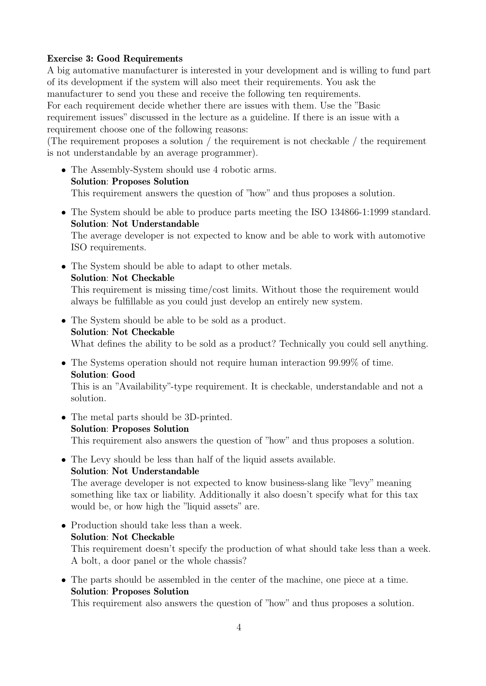

这页讲的是**如何判断需求是否“好”（Good Requirements）**，即——当汽车制造商想资助你的系统研发时，他们会提出一系列需求。你需要分析这些需求，看是否存在问题，并说明问题的类型。

系统工程中，一个“好”的需求必须是：

* **清晰（Understandable）**：开发者都能理解；
* **可验证（Checkable）**：能够测试或量化；
* **不带解决方案（Not Proposing Solution）**：只说明“要做什么”，而不是“怎么做”。

---

## 一、题目背景

一个大型汽车制造商对你的创新系统感兴趣，并提出了 10 条他们的“需求”。
你要判断每条需求是否有问题，如果有，要说明是哪一类问题（提出了解决方案 / 不可验证 / 难以理解）。

---

## 二、十条需求分析（带解读）

### 1️⃣ The Assembly-System should use 4 robotic arms.

**Solution: Proposes Solution（提出了解决方案）**

* 解释：这条需求告诉你要“怎么做”——用 4 个机械臂。
* 问题在于：它不是在描述“目标”，而是在规定“方法”。
正确写法应是：“系统应能在某个速度或精度下完成装配。”

---

### 2️⃣ The System should be able to produce parts meeting the ISO 134866-1:1999 standard.

**Solution: Not Understandable（难以理解）**

* 解释：普通开发者可能不熟悉这个汽车行业标准，也不清楚要符合哪些细节。
* 问题：需求太专业，开发者难以直接执行。
→ 应补充说明 ISO 标准中具体要求的项目。

---

### 3️⃣ The System should be able to adapt to other metals.

**Solution: Not Checkable（不可验证）**

* 解释：这个需求没有说明需要多少时间、花费多少资源才能实现适配。
* 问题：如果不限定成本或时间，这个需求永远可实现，也就无法验证。

---

### 4️⃣ The System should be able to be sold as a product.

**Solution: Not Checkable（不可验证）**

* 解释：什么叫“能被销售”？几乎任何东西都能卖。
* 问题：缺少明确标准，比如市场认证、用户可用性等。

---

### 5️⃣ The System’s operation should not require human interaction 99.99% of the time.

**Solution: Good（良好需求）**

* 解释：这条需求是可量化、可验证的。
* 属于\*\*可用性（Availability）\*\*类型，明确说明系统自动运行的可靠程度。

---

### 6️⃣ The metal parts should be 3D-printed.

**Solution: Proposes Solution（提出了解决方案）**

* 解释：它规定了“如何实现”——用 3D 打印。
* 问题：需求不该限制技术方案，而应表达“零件应能通过某种方式制造”。

---

### 7️⃣ The Levy should be less than half of the liquid assets available.

**Solution: Not Understandable（难以理解）**

* 解释：“Levy”是财务术语（税金或负债），开发人员不一定懂。
* 问题：没明确指的是哪种费用，也没定义“liquid assets”的范围。

---

### 8️⃣ Production should take less than a week.

**Solution: Not Checkable（不可验证）**

* 解释：没有说明“生产什么”——是一个螺丝，还是整辆车？
* 问题：太模糊，无法衡量。

---

### 9️⃣ The parts should be assembled in the center of the machine, one piece at a time.

**Solution: Proposes Solution（提出了解决方案）**

* 解释：这又是在告诉“怎么做”而不是“要做什么”。
* 正确写法应是：“系统应能逐件完成装配，避免零件重叠或卡滞。”

---

## 三、总结：好的需求标准

| 类型                     | 含义        | 示例                    |
| ---------------------- | --------- | --------------------- |
| **Proposes Solution**  | 直接告诉“怎么做” | “系统应使用 4 个机械臂”        |
| **Not Understandable** | 表述模糊或太专业  | “系统应符合 ISO 134866 标准” |
| **Not Checkable**      | 无法测试或量化   | “系统应可被销售”             |
| **Good**               | 清晰、可验证、合理 | “系统应在 99.99% 时间内自动运行” |

---

### \[口语化表达]

这一页讲的是怎么判断一条“需求”写得好不好。
比如有的需求写得太具体了，直接告诉你该怎么做（像“用 4 个机械臂”“3D 打印”），这叫“提出了解决方案”；
有的太模糊，比如“系统能卖出去”或者“生产少于一周”，根本没法验证；
还有的太专业，比如提到 ISO 标准、财务术语“Levy”，程序员看不懂；
只有像“系统 99.99% 时间能自动运行”这种——能懂、能测、能实现，才算是个好需求。

一句话总结：**好需求要“清楚”“能测”“不教你怎么做”。**


---

## 第 35 页

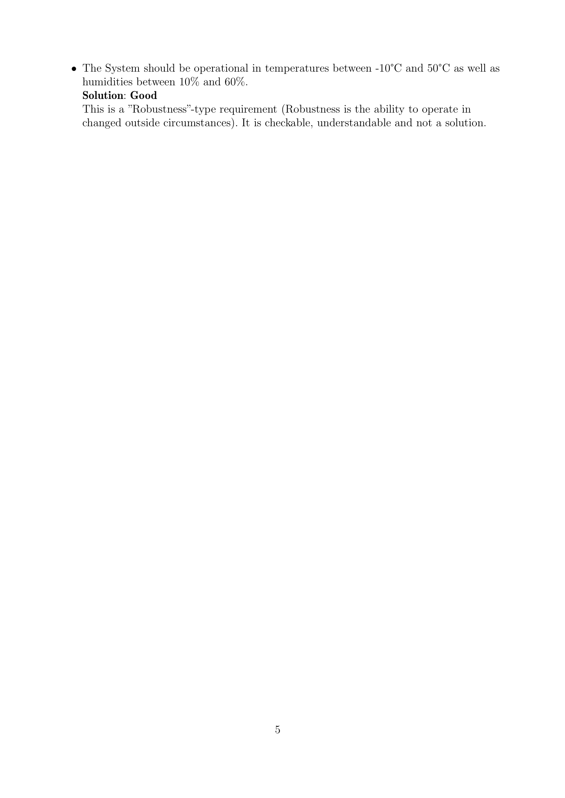

这页讲的是第 10 条“需求”分析，即在前面“好需求（Good Requirements）”练习中，最后一个被认为是\*\*良好（Good）\*\*的需求。

---

## 一、需求内容

> **The System should be operational in temperatures between -10°C and 50°C as well as humidities between 10% and 60%.**
> （系统应能在温度 -10°C 至 50°C、湿度 10% 至 60% 的环境下正常运行。）

---

## 二、Solution: Good（良好需求）

**解释：**
这条需求被认为是一个“好”的系统需求，原因如下：

1. **类型：Robustness（鲁棒性 / 稳定性）**

* “鲁棒性”描述系统在**外部环境变化下仍能正常工作的能力**。
* 在这个例子中，温度和湿度的波动属于外部条件变化，而系统必须保证在这些范围内仍能运行。

2. **可验证（Checkable）**

* 这个需求是**可测量的**。
* 工程师可以通过实验环境（如气候室）测试系统是否能在指定的温度和湿度下工作。

3. **可理解（Understandable）**

* 描述清晰，没有歧义。
* 每个开发人员或测试工程师都能准确理解测试标准。

4. **不包含解决方案（Not a solution）**

* 它只说明了“系统要能承受什么环境”，没有规定“怎么实现”。
* 没有限制具体的材料或冷却技术。

**总结：**
这类需求属于**非功能性需求**中的“鲁棒性（Robustness）”或“可靠性（Reliability）”范畴，强调系统对外部条件的耐受性和持续运行能力。

---

## 三、例子对比

| 需求                      | 类型   | 是否是好需求 | 说明                |
| ----------------------- | ---- | ------ | ----------------- |
| “系统应能在 -10°C 至 50°C 运行” | 鲁棒性  | ✅      | 可测、清晰、无方案         |
| “系统应配备冷却风扇防止高温停机”       | 提出方案 | ❌      | 告诉“怎么做”而不是“要实现什么” |
| “系统应在任何天气下运行”           | 含糊   | ❌      | 不可验证，没有明确范围       |

---

### \[口语化表达]

这一页其实在讲最后一个好需求，就是“系统要能在 -10°C 到 50°C、湿度 10% 到 60% 之间都能正常工作”。
它好就好在：

* 范围写得很清楚；
* 能测、能验证；
* 任何人都能看懂；
* 而且它没规定用什么技术去实现，比如没说“要加风扇”或者“要加加热器”。

一句话总结：**这是个标准的“鲁棒性”需求——系统要能在各种环境下稳得住、顶得住。**


---

## 第 36 页

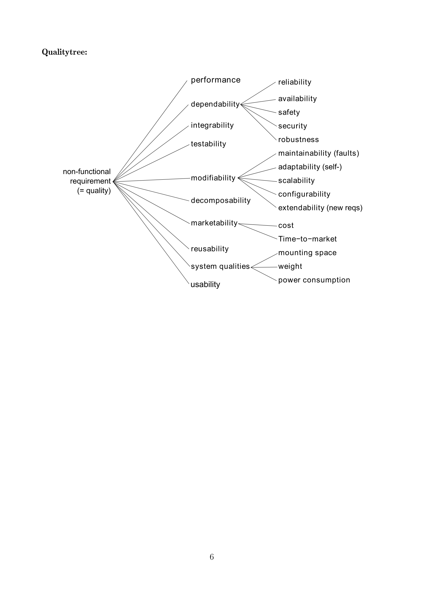

这页展示的是一个 **“质量树（Quality Tree）”**，也叫**非功能性需求分类图（Non-functional Requirements Tree）**。
它总结了所有与系统“质量”相关的特性（即系统**如何做得好**，而不是**做什么**）。

---

## 一、图的整体意义

在系统设计中，需求分为两大类：

1. **功能性需求（Functional Requirements）**：描述系统**做什么**。

* 例如：“系统应能组装汽车底盘”。
2. **非功能性需求（Non-functional Requirements，简称 NFR）**：描述系统**做得多好**。

* 例如：“系统应在 -10°C 至 50°C 下运行”。

这张图就是专门对第二类——**非功能性需求**进行细分的结构图。
它的核心思想是：

> “系统质量 = 多个可衡量的非功能性特征的集合。”

---

## 二、主要分支说明

下面是图中主要的分支及其子类解释（从左到右分析）：

---

### 1️⃣ **Performance（性能）**

* 衡量系统的**速度与效率**。

* **Reliability（可靠性）**：系统输出是否稳定、正确（如误差 ≤ 0.05mm）。
* **Availability（可用性）**：系统正常运行时间比例（如 99.99% uptime）。
* **Safety（安全性）**：系统能否防止人身或设备损害。
* **Security（安全防护）**：系统能否抵御恶意攻击或未经授权访问。
* **Robustness（鲁棒性）**：系统能否在外部环境变化下仍能运行（例如温度、湿度波动）。

---

### 2️⃣ **Dependability（可靠度）**

* 是对系统整体“可信赖性”的概括，包括安全性、安全防护、可用性等子项。
它说明系统**不会轻易出错**，并且**在错误时能安全恢复**。

---

### 3️⃣ **Integrability（可集成性）**

* 系统能否方便地与其他系统连接或协作（比如模块化设计、接口标准）。

---

### 4️⃣ **Testability（可测试性）**

* 系统是否容易测试、验证、查错。

---

### 5️⃣ **Modifiability（可修改性）**

* 指系统的可维护与可扩展能力。
其下分为多个细分特性：

* **Maintainability (faults)**：容易修复错误或维护。
* **Adaptability (self-)**：能适应新的条件（自适应）。
* **Scalability**：系统扩容或提高性能的能力（例如产能翻倍只需 100 人工时）。
* **Configurability**：用户能否通过配置改变功能（无需物理改动）。
* **Extendability (new reqs)**：能否快速加入新功能或新需求。

---

### 6️⃣ **Decomposability（可分解性）**

* 系统能否被拆分为多个独立的子模块以便开发与维护。

---

### 7️⃣ **Marketability（市场性）**

* 与商业因素相关的质量属性，包括：

* **Cost（成本）**：制造或运行成本。
* **Time-to-market（上市时间）**：开发周期是否短。

---

### 8️⃣ **System Qualities（系统属性）**

* 与系统本身物理特征相关的指标，例如：

* **Mounting Space（安装空间）**：占地大小。
* **Weight（重量）**
* **Power Consumption（功耗）**

---

### 9️⃣ **Reusability（可复用性）**

* 系统或模块是否可在其他项目中重复使用。

---

### 🔟 **Usability（可用性）**

* 系统对用户是否友好、易于操作。

---

## 三、总结

这个“质量树”就是把所有**非功能性需求**系统化地分类展示。
在软件或系统工程中，这个图通常用于：

* 分析项目的质量目标；
* 帮助团队识别“系统做得好不好”的指标；
* 指导测试与评估（每个分支都可转化为量化指标）。

---

### \[口语化表达]

这一页是“质量树”，其实就是把所有“非功能性需求”系统地画出来。
功能性需求讲“系统要做什么”，而非功能性需求讲“系统要做得多好”。
比如性能、可靠性、扩展性、可维护性、可测试性、功耗、成本这些，都属于“质量”。
这张图就像一棵树，从“质量”这个根开始，往外分成不同的枝条：
有的管速度（性能），有的管稳定（可靠性），有的管适应变化（可扩展性），还有的管成本和空间这些现实因素。

一句话总结：**这棵质量树就是在告诉我们，“一个好系统，不光要能干活，还得干得稳、快、省、灵活、好用”。**
