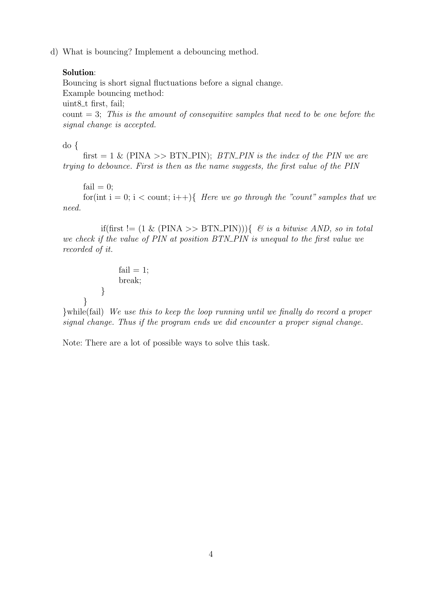
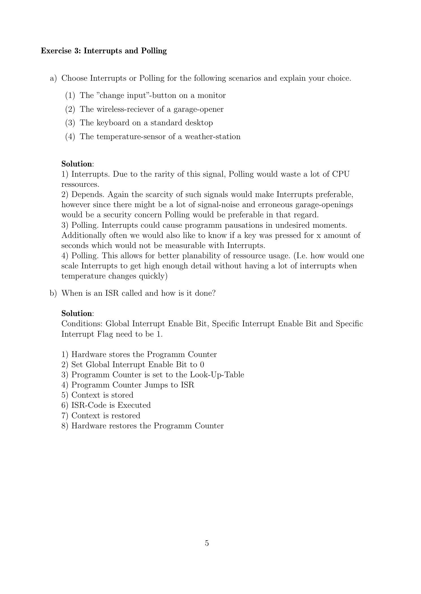

---

## 第 1 页


这是一份来自德国亚琛工业大学（RWTH Aachen University）\*\*嵌入式系统课程（Embedded Systems）\*\*的练习题（Sheet 1: Embedded Systems and Microcontrollers），时间是 **2023 年夏季学期（Summer Term 2023）**。下面我将逐段为你详细解释内容含义。

---

### 📘 文件概述

* **机构与负责人：**
文件顶部写着 Aachen, April 2023，说明这是在 2023 年 4 月发布的。课程由 **Stefan Kowalewski 教授（Prof. Dr.-Ing. Stefan Kowalewski）** 主讲，助教是 **Simon Fonck 和 Alexander Kruschewsky**，都来自 RWTH。
* **课程信息：**
SWS: V3/Ü1, ECTS: 6
意思是这门课每周有 3 学时的讲座（Vorlesung, V3）和 1 学时的练习（Übung, Ü1），学分为 6 分。

---

### 🧩 练习 1：问题与解答

#### a) 什么是嵌入式系统？

**答案解释：**

* 它是一个 **计算机系统**，包括 **CPU、内存和软件**。
* 这个系统被 **嵌入（integrated）到另一个技术系统** 中，那个系统称为“**embedding system**”（宿主系统或被嵌入系统）。
* 嵌入式系统通过控制或影响宿主系统，使其按照预期的方式运行。

👉 简单说：嵌入式系统是“**隐藏在机器内部的小型计算机系统**”，用于控制特定功能，比如洗衣机的控制模块、汽车的ABS控制系统等。

---

#### b) 嵌入式系统的需求来源是什么？

**答案解释：**

* 嵌入式系统的需求来自于它所服务的\*\*宿主系统（embedding system）\*\*的需求。

👉 举个例子：汽车制造商要求自动刹车系统在某种情况下启动，这就是宿主系统的需求；嵌入式系统则必须据此设计相应的功能。

---

#### c) 嵌入式系统的分类

题目指出嵌入式系统可分为 **两大类**，并要求回答以下五个子问题：

1. **有哪些类别？**
通常是：

* 通用型嵌入式系统（General Purpose Embedded Systems）
* 专用型嵌入式系统（Application-Specific Embedded Systems）
有时也称为：
* 小规模嵌入式系统（Small Scale）
* 大规模或复杂嵌入式系统（Large Scale / Complex）

2. **它们的特征？**

* 小型系统通常资源有限（低功耗、低存储、低成本）。
* 大型系统则更复杂，具有实时操作系统、网络连接等功能。

3. **常见硬件？**

* 小型系统用 **微控制器（Microcontroller）**。
* 大型系统使用 **微处理器（Microprocessor）** 或 **SoC（System on Chip）**。

4. **主要编程语言？**

* 常见的有 **C、C++、汇编语言（Assembly）**。
* 对于高层系统，也会用到 **Python、Java、MATLAB** 等。

5. **举例：**

* 小型嵌入式系统例子：洗衣机控制器、遥控器、微波炉控制板。
* 大型嵌入式系统例子：智能手机、汽车电子控制单元（ECU）、飞机导航系统。

---

### 🧠 总结（知识要点）

| 主题      | 关键点                  |
| ------- | -------------------- |
| 嵌入式系统定义 | 嵌入在其他系统中的计算机，用于控制和协调 |
| 需求来源    | 来自宿主系统的需求            |
| 分类      | 小型 vs. 大型，或通用 vs. 专用 |
| 硬件      | 微控制器、微处理器、SoC        |
| 语言      | C、C++、汇编等            |
| 示例      | 洗衣机控制器 / 智能汽车控制系统    |

---

### \[口语化表达]

这份文件其实是德国亚琛工业大学的嵌入式系统课程的第一份练习题，主要讲的就是“什么是嵌入式系统”。它解释了嵌入式系统就是一个小型计算机，比如有CPU、内存和软件，它被装进别的设备里，去控制那个设备的行为，比如汽车或家电。然后它还说，这种系统的设计需求其实都是根据外部系统的要求来的，比如车厂需要刹车控制系统，那这个系统的嵌入式部分就要按这个需求设计。最后，它让学生思考嵌入式系统的两种类型、各自的特点、常用硬件和语言，还有例子。简单说，就是一份帮学生理解嵌入式系统基础概念的入门练习题。


---

## 第 2 页


这页是上一页（嵌入式系统练习）的延续，主要讲了两部分内容：
**一是嵌入式系统的分类及示例，二是数字输入/输出（Digital I/O）在ATmega16微控制器中的应用。**
下面我为你详细说明。

---

## 🧩 第一部分：嵌入式系统分类补充与微控制器定义

这部分是上一页第 c) 题的解答延续。

表格对比了两类嵌入式系统：

| 项目         | Product Automation（产品自动化） | Production Automation（生产自动化）   |
| ---------- | ------------------------- | ------------------------------ |
| **特征**     | 大量相同单元；成本敏感；用户不是专家；硬件平台固定 | 通常只有一个系统；成本不敏感；用户是专业人员；软件系统更重要 |
| **常用硬件**   | 微控制器（μC）、FPGA             | PLC、工业PC、分布式控制系统               |
| **主要编程语言** | C、C++、汇编、VHDL、Simulink    | IL（指令表）、SFC、ST、FBD             |
| **典型例子**   | 汽车发动机控制器、洗衣机控制器、气象站等      | 化工厂控制系统、装配线控制器等                |

📖 简单理解：

* “**产品自动化**” 是那种在产品内部嵌入的系统，比如洗衣机、空调，它们大规模生产、成本敏感。
* “**生产自动化**” 是用于工厂或生产线的控制系统，通常定制、单一、昂贵，重点在系统灵活性和编程能力。

---

### 💡 d) 什么是微控制器（microcontroller）？

**答案：**

> 微控制器是一种带有 RAM、永久存储器、数字输入输出（Digital I/O）及其他外设的微处理器。

📘 解释：
微控制器是一个“微型计算机系统”，通常集成在一块芯片上，内部包括：

* **CPU（中央处理单元）**
* **RAM（随机存储器）**
* **ROM / Flash（程序存储器）**
* **I/O 接口（输入输出控制）**

比如 Arduino、ESP32、STM32 都属于微控制器（MCU）。它们被广泛用于家电、传感器、机器人等。

---

## ⚙️ 第二部分：数字输入/输出（Digital I/O）

这部分是 **Exercise 2: Digital I/O**，以 **Atmel ATmega16 微控制器** 为例。

---

### 🧠 背景说明

ATmega16 是一种 8 位 AVR 微控制器。
题目设定：

* **Port A**：连接了 8 个按钮（开关），另一端接地（GND）。
* **Port B**：连接了 8 个 LED，通过限流电阻接到电源（VCC）。

任务是要让按钮输入、LED 输出。

---

### 🧩 a) 控制这些端口的寄存器（Registers）

答案中提到：

| 寄存器              | 功能                                                  |
| ---------------- | --------------------------------------------------- |
| **DDRA, DDRB**   | 数据方向寄存器（Data Direction Register），决定引脚是输入(0)还是输出(1)。 |
| **PORTA, PORTB** | 控制输出或激活上拉电阻（pull-up resistor）。                      |
| **PINA, PINB**   | 读取输入值（只读）。                                          |

例如：
如果 DDRB 的某位是 1，说明对应的引脚是输出端口；如果是 0，就是输入端口。

---

### ⚙️ b) 初始化寄存器

题目要求根据设定初始化寄存器。

| 寄存器                  | 二进制值   | 十六进制                              | 含义 |
| -------------------- | ------ | --------------------------------- | -- |
| **DDRA = 00000000**  | (00)₁₆ | 所有引脚作为输入（按钮）。                     |    |
| **DDRB = 11111111**  | (FF)₁₆ | 所有引脚作为输出（LED）。                    |    |
| **PORTA = 11111111** | (FF)₁₆ | 启用上拉电阻，使未按按钮时输入为高电平。              |    |
| **PORTB = 11111111** | (FF)₁₆ | 初始化LED关闭状态（因为高电平两端VCC-VCC，无电流流过）。 |    |
| **PINA, PINB**       | 只读     | 用来读取当前端口的输入值。                     |    |

📘 解释：
这样设置后：

* Port A 上的按钮能正确检测到按下/未按下状态。
* Port B 上的 LED 默认关闭，当程序输出低电平时，LED 就会点亮。

---

## ✅ 知识总结

| 概念        | 说明                    |
| --------- | --------------------- |
| 嵌入式系统分类   | 产品自动化 vs. 生产自动化       |
| 微控制器定义    | 带 RAM、存储器、I/O 的微型计算机  |
| I/O 控制寄存器 | DDRA/B、PORTA/B、PINA/B |
| 初始化逻辑     | 输入端启用上拉，输出端初始化为关闭     |
| 示例设备      | 按钮输入、LED 输出的简单系统      |

---

### \[口语化表达]

这页讲的是嵌入式系统的两种类型和微控制器的基本操作。前半部分在讲产品自动化和生产自动化的区别：前者像洗衣机控制板、气象站这种成千上万的设备，讲究成本低；后者像化工厂控制系统、装配线控制器这种，一般只做一个，成本不重要但要求稳定可靠。然后又解释了什么是微控制器，就是一块带有内存、CPU、输入输出接口的小电脑芯片。
后半部分开始讲实践内容，用ATmega16微控制器举例，教你怎么让按钮当输入、LED当输出。它通过几个寄存器（DDRx、PORTx、PINx）来控制输入输出方向和状态，还展示了怎么初始化寄存器，比如PortA全是输入、PortB全是输出、启用上拉电阻让电路稳定。整体就是让学生理解“嵌入式系统不只是理论，还要能用代码和硬件连接起来”。


---

## 第 3 页


这页是嵌入式系统练习的延续，内容主要讲如何**用程序循环控制 LED 与按钮（button）的交互**。也就是说，如何通过微控制器（ATmega16）的输入端口（PINA）读取按钮状态，并通过输出端口（PORTB）来点亮对应的 LED。下面我会一步步解释。

---

## 🧩 c) 写一个循环，通过按钮控制LED

### (1) 一对一控制（1-to-1 basis）

题目要求：**按下按钮4，就点亮LED4**（即每个按钮控制一个对应的LED）。

**解答：**

```c
while (1) {
PORTB = PINA;
}
```

📘 **解释：**

* `while(1)` 表示无限循环，程序会一直运行。
* `PINA` 是输入寄存器，表示 Port A 的当前输入状态（8个按钮的状态）。
* `PORTB` 是输出寄存器，用来控制 Port B 上的 8 个LED。
* 当按钮被按下时，对应位在 `PINA` 中为 **0**（因为连接到地 GND）。
* 因为LED是低电平点亮（0点亮），直接赋值 `PORTB = PINA` 就能同步LED状态。

✅ **结论：**
每个按钮直接对应一个LED，按下哪个按钮，就点亮哪个LED。
这是最简单、最直观的实现方式。

---

### (2) 优先编码器（Priority Encoder）

题目要求：**显示最高优先级（编号最大）的被按下按钮的编号的二进制值。**

**解答：**

```c
while (1) {
int i;
for (i = 7; i >= 0; i--) {
if (~PINA & (1 << i)) {
PORTB = ~i;
break;
}
}
}
```

📘 **逐行解释：**

#### 🔹 `for (i = 7; i >= 0; i--)`

* 从最高编号的按钮（第7个）开始检查，一直到第0个。
* 从高往低遍历的原因是要**优先响应编号更大的按钮**（即“优先级高”）。

#### 🔹 `if (~PINA & (1 << i))`

* `~PINA`：按位取反，因为按钮按下时输入是0，而我们希望检测到“1 = 按下”。
* `(1 << i)`：表示第 i 位是1（左移运算）。
* 因此，`(~PINA & (1 << i))` 判断第 i 个按钮是否被按下。

#### 🔹 `PORTB = ~i`

* 这行是把按钮的编号（i）取反后赋给PORTB。
* 因为LED是“0亮1灭”，所以要取反（bitwise invert）才能正确显示。
* 例如，如果按钮5是最高被按的，那么输出二进制值 `(11111010)₂`。

#### 🔹 `break`

* 一旦检测到最高优先级的按钮被按，就退出循环，防止被低编号按钮覆盖。

---

### 📘 补充说明

底部的注释解释了输出结果的例子：

> 如果第5个按钮（编号从0开始）是最高被按的，PORTB的值为 `(11111010)₂`。
> 也就是说，LED 会显示出数字“5”的二进制反码形式。

---

## ✅ 知识总结

| 内容           | 说明                      |
| ------------ | ----------------------- |
| 一对一控制        | 每个按钮直接控制一个LED，简单直接      |
| 优先编码器        | 程序扫描所有按钮，从最高编号开始        |
| `~PINA`      | 取反操作，把“0=按下”转为“1=按下”    |
| `(1<<i)`     | 生成只有第 i 位为1的掩码，用于检测某个按钮 |
| `PORTB = ~i` | 输出反码，使LED正确点亮           |
| `break`      | 检测到最高优先按钮后退出循环          |

---

### \[口语化表达]

这页主要讲的是怎么用程序控制按钮和LED的对应关系。第一种方式最简单，就是“哪个按钮亮哪个灯”，程序里只要把输入端口PINA的值直接赋给输出端口PORTB就行了。因为按钮按下时是0，而LED在接法上也是0点亮，所以刚好对应得上。第二种方式稍微复杂一些，叫“优先编码器”，意思是如果同时按下多个按钮，只显示编号最大的那个。程序会从第7个按钮开始往下查，一旦发现哪个被按下，就把它的编号转成二进制，输出给LED。这里还用到了位运算，比如“\~PINA”取反、“(1<\<i)”左移这些操作。简单来说，就是教你怎么用循环和位运算实现输入输出控制逻辑，让LED的显示有优先级逻辑，而不仅仅是一对一亮灯。


---

## 第 4 页



这页是练习题 **d)**：解释什么是 **“抖动（bouncing）”**，并实现一个\*\*消抖（debouncing）\*\*方法。页面给出了一个基于多次采样一致性的软消抖示例。

---

## 1) 什么是“抖动（Bouncing）”？

当你按下或松开一个机械按钮/开关时，触点不会一次就稳定导通或断开，而会在几毫秒内**快速地反复接触/分离**，导致输入信号在高/低之间**短暂来回跳变**。
如果不处理，程序会把一次按键误认为多次，从而出现“多次触发”的错误。

---

## 2) 示例中的消抖思路（多次一致采样法）

页面代码核心思路：**只有当连续若干次读取到的值都一致时，才承认信号真的改变了**。

**变量含义：**

* `BTN_PIN`：要消抖的那个按键引脚在端口里的**位序号**。
* `PINA`：端口 A 的输入寄存器。
* `1 & (PINA >> BTN_PIN)`：把 `PINA` 右移到目标位，再与 `1` 做按位与，**取出该按键当前的 0/1 值**。
* `first`：本轮消抖时**第一次读到的值**（基准）。
* `count = 3`：要求**连续 3 次读到相同值**才接受变化。
* `fail`：标记是否“本轮失败”（即这几次采样里出现与 `first` 不同的值）。

**流程（伪代码复述）：**

```c
do {
first = 1 & (PINA >> BTN_PIN);  // 记录首次读到的按键值（0或1）
fail = 0;                       // 先假设能通过

for (int i = 0; i < count; i++) {
// 反复再读若干次，如果有一次与 first 不同，就判定失败
if (first != (1 & (PINA >> BTN_PIN))) {
fail = 1;
break;                  // 立刻重来
}
}
} while (fail);                     // 失败就重新开始；直到连续 count 次一致才结束
```

**要点解释：**

* `do { ... } while (fail);`：只要在这几次采样中发现不一致（`fail=1`），就**重启一轮**，继续等待稳定；直到拿到**连续 `count` 次一致**的读数才接受“信号已改变”。
* 由于本练习的按键接法是**按下为 0**（下拉到 GND），松开为 1（通过上拉电阻为高），以上读法能正确反映按钮状态。
* 页面注释提到：这种写法有很多等价实现，思路是**稳定一致才承认**。

> 小提示：在实际程序里，通常会在每次采样之间加一点**微小延时（例如 1–5 ms）**，或用**定时器中断**驱动采样，这样能更有效地跨过抖动窄脉冲。

---

## 3) 为什么有效？

* **机械抖动的时间**通常在 **5–20 ms**（取决于器件），如果你要求在这段时间内**多次读取都一致**，抖动期间的反复跳变就不会被当成真正的状态改变。
* 这是一种**软件冗余**：用时间上的“多数表决/一致性”来换取稳定性。

---

## 4) 可替代/扩展做法（了解）

* **固定延时法**：检测到电平变化→等待固定时间（如 10 ms）→再读一次确认。
* **状态机法**：每隔固定周期采样一次，只有在稳定 N 次后才切换状态。
* **硬件消抖**：RC 滤波 + **施密特触发器**（如 74HC14），从根源上把抖动变成平滑边沿，CPU 只需读一次。

---

## 5) 与本页代码对齐的小改进示例（含延时，便于实用）

```c
// 需要一个简易延时（例如 _delay_ms(2)），或用定时器驱动
uint8_t read_stable_btn(uint8_t pin_idx, uint8_t samples) {
uint8_t first, i;
while (1) {
first = (PINA >> pin_idx) & 0x01;   // 首次读
for (i = 0; i < samples; i++) {
_delay_ms(2);                  // 间隔采样，跨过抖动
if (((PINA >> pin_idx) & 0x01) != first) {
break;                     // 本轮失败，重新来
}
}
if (i == samples) return first;    // 连续 samples 次一致，返回稳定值
}
}
```

思路和页面完全一致：**连续一致才承认**，只是加入了**采样间隔**，更贴近实机。

---

## 6) 本页关键信息小结

* **抖动**：按键在切换瞬间的快速高低跳变。
* **页面方案**：取首次值 `first`，随后再读 `count` 次；若有任意一次不同→重来；若全部相同→承认状态改变。
* **位运算**：`(PINA >> BTN_PIN) & 1` 提取目标位；`&` 是按位与。
* **实践建议**：采样间隔/定时器或硬件消抖更可靠。

---

### \[口语化表达]

这页讲的是“按钮为什么会误触发”和“怎么用代码把它稳定下来”。按钮在按下/松开时会抖，电平会在高低之间来回跳几毫秒，如果你立刻去读，就可能以为按了很多下。解决办法是：别急着相信第一次读到的值，先把当前值记成 `first`，然后再连续读几次（比如 3 次），只要这几次都和 `first` 一样，才算它真的变了；中间哪怕有一次不一样，就当作抖动，重新开始。代码用 `PINA` 读按键那个位（右移再与 1），用 `do...while` 循环不停重试，直到拿到几次一致的结果为止。实际项目里再加点小延时或用定时器更稳，还可以用 RC+施密特触发做硬件消抖。总之，就是“**连续读到一致才算数**”，这样一次按键就不会被当成好几次。


---

## 第 5 页



这页是 Exercise 3: Interrupts and Polling（中断与轮询） 的内容。主要讲两部分：
① 在不同场景下选择使用中断（Interrupts）还是轮询（Polling）；
② 介绍中断服务程序（ISR, Interrupt Service Routine）的触发条件和执行过程。
🧩 a) 选择中断或轮询，并说明理由
(1) 显示器上的“更改输入源”按钮（change input button）
选择：中断 (Interrupts)
理由： 这种信号发生得非常少（例如用户偶尔按一下），如果使用轮询去不断检测它，会浪费 CPU 资源。用中断能在信号真正发生时才响应，效率更高。
(2) 车库门的无线接收器（wireless receiver）
选择：视情况而定 (Depends)
解释：
如果信号较稀少 → 用中断更合适（能在信号到达时立即响应）。
但如果无线信号噪声多（可能产生虚假触发），为安全起见可使用轮询方式，因为轮询可以更好地进行多次确认，避免误开门。
(3) 标准桌面键盘（desktop keyboard）
选择：轮询 (Polling)
理由：
若用中断，频繁输入可能导致程序频繁暂停，影响系统流畅性。
轮询能定期检测键是否按下、持续多久，这对判断长按/短按等状态更方便。
比如要知道“某键按下了多长时间”，中断就不适合了。
(4) 气象站的温度传感器（temperature sensor）
选择：轮询 (Polling)
理由：
温度变化是慢速、连续的，不需要频繁中断。
轮询可以定时读取温度数据，计划性好（节约资源），也能保持较高的采样精度。
若用中断，温度微小变化会导致中断频繁，反而浪费性能。
🧠 总结对比：Interrupts vs Polling
特征 Interrupts（中断） Polling（轮询）
触发方式 事件触发（自动响应） 定时主动查询
适用场景 信号稀少、突发事件 信号稳定、周期性采样
优点 响应快，节省CPU 稳定可控，便于规划资源
缺点 过多中断会打断主程序 持续检测会浪费CPU时间
🧩 b) ISR（中断服务程序）何时被调用？怎么执行？
触发条件：
全局中断允许位（Global Interrupt Enable Bit）= 1
特定中断允许位（Specific Interrupt Enable Bit）= 1
对应中断标志位（Interrupt Flag）= 1
这三个条件都满足时，中断才会被触发。
ISR 调用的过程：
硬件保存程序计数器（Program Counter）
→ 记录当前执行的位置，以便返回。
关闭全局中断（Global Interrupt Bit = 0）
→ 防止中断嵌套。
设置程序计数器为 ISR 地址（查表跳转）
→ 根据中断向量表找到对应ISR的入口。
程序跳转到 ISR 函数执行。
保存上下文（寄存器、状态等）。
执行 ISR 代码（处理中断逻辑）。
恢复上下文。
恢复原来的程序计数器（返回主程序）。
💡 这样系统在执行完中断后能无缝返回原任务，就像“暂停—处理—继续”一样。
✅ 本页知识要点总结
主题 关键点
中断 vs 轮询 中断用于稀少事件，轮询用于定期任务
中断触发条件 全局允许位 + 专用允许位 + 标志位 都为1
ISR执行流程 保存现场 → 跳转 → 执行 → 恢复现场
实际设计建议 混合使用：关键事件用中断，周期数据用轮询
[口语化表达]
这页讲的是中断（Interrupt）和轮询（Polling）这两种程序响应方式。它先举了几个例子让你判断该用哪个：比如显示器的“切换输入源”按钮很少按，适合用中断；车库门的无线接收器要看情况，信号干净的话用中断，干扰多的话用轮询更安全；键盘因为要判断持续按多久，用轮询更方便；温度传感器变化慢，用定时轮询最合适。然后它还解释了中断是怎么被触发的：必须三个条件都满足（全局开中断、具体中断开、标志位为1），系统就会自动暂停当前程序，把执行位置记下来，跳转到中断函数（ISR）去执行，处理完后再回来接着运行原来的程序。整体就是教你什么时候该用中断、什么时候该用轮询，以及中断在硬件层面是怎么运行的。


---

## 第 6 页


这页包含两部分内容：**Exercise 4：定时/计数器（Timers and Counters）**与**Exercise 5：模拟外设（Analog Devices）**。下面逐问解释。

---

## Exercise 4：Timers and Counters

### a) 什么是 counter？什么是 timer？

* **Counter（计数器）**：硬件单元，用来**计外部事件**的次数，比如上升沿、下降沿或任意边沿（把脉冲个数累加）。
* **Timer（定时器）**：本质上也是计数器，但它专门**计内部时钟**的周期数（由系统时钟/分频提供），用于产生时间基准、定时中断等。

---

### b) ATmega16 的 **Timer1** 由哪些部件组成？如何配置？

* **计数寄存器 `TCNT1`**：16 位，分高/低字节（`TCNT1H`, `TCNT1L`），存当前计数值。
* **比较寄存器 `OCR1`**：16 位（`OCR1H`, `OCR1L`），与 `TCNT1` 比较触发事件（如 CTC、PWM）。
* **输入捕获寄存器 `ICR1`**：16 位（`ICR1H`, `ICR1L`），把外部输入捕获到的时间戳“锁存”下来。
* **控制寄存器 `TCCR1A`, `TCCR1B`**：配置工作模式（普通/CTC/PWM等）、时钟预分频、比较输出行为、输入捕获边沿等。

> 小结：通过设置 `TCCR1A/B` 选择模式和分频；`TCNT1` 跑动；比较值放在 `OCR1`；若要测某个外部边沿到达的精确时刻，用 `ICR1` 捕获。

---

### c) 16 位数值的读写如何做到“原子”（不被打断）？

在 8 位 MCU 上，16 位数需要**分两次**访问。要保证“看起来一次性完成”，做法是：

* **读（Read）**：**先读低字节 `Low`，再读高字节 `High`**。读低字节会把高字节锁存到缓冲，这样后读到的高字节与刚才的低字节属于同一时刻。
* **写（Write）**：**先写高字节 `High`，再写低字节 `Low`**。写低字节时，硬件一次性把两个字节更新到目标寄存器。
* 实践中常**短暂关中断**（见 e），避免在两次访问之间被 ISR 打断。

---

### d) 什么是看门狗（Watchdog）？

* **看门狗定时器**：从某个初值开始倒计时，**减到 0 就复位 MCU**。
* 在主循环里需要定期“喂狗”（把计数重置到初值）。
* 作用：如果程序跑飞/死循环，主循环没机会喂狗，计数到 0 后系统会自动重启，从而**从异常状态自恢复**。

---

### e) 为什么在读 16 位数值时，可能需要暂时禁止中断？

* 因为 8 位平台读取 16 位要**两次总线访问**。
* 若两次访问中间来了一个**中断**，ISR 可能也访问/修改了同一个资源，导致主程序拿到一个**前后不一致**的“撕裂值”。
* 解决：在临界区短暂**关中断**（如 `cli()`），读/写完成后**开中断**（`sei()`），保证一致性与数据完整。

---

## Exercise 5：Analog Devices

### a) ATmega16 上有哪些模拟相关外设？

* **4 路 PWM 通道**（用于占空比控制、伺服/调光等）。
* **8 通道 10 位 ADC**，逐次逼近型（**SAR**，Successive Approximation）A/D 转换器。
* **模拟比较器**（Analog Comparator），用于比较两个模拟电压并输出高/低。

---

## 速记图（按用途分）

* **时间相关**：`TCNT1`（数）、`OCR1`（比）、`ICR1`（捕）、`TCCR1A/B`（配）。
* **原子访问**：读低→读高；写高→写低；必要时关中断。
* **鲁棒性**：看门狗避免死机。
* **模拟**：PWM、10 位 ADC（8 路）、比较器。

---

### \[口语化表达]

这页主要在讲两类东西：一是“怎么数时间/事件”，二是“芯片上有哪些模拟功能”。先说计时器：计数器用来数外部脉冲，定时器用来数内部时钟。ATmega16 的 Timer1 有计数寄存器（TCNT1）、比较寄存器（OCR1）、输入捕获寄存器（ICR1）和控制寄存器（TCCR1A/B），通过这些就能做定时、比较匹配、PWM、输入捕获等。读写 16 位寄存器时，因为芯片是 8 位的，要分两次：读的时候“先低后高”，写的时候“先高后低”，最好在这段时间把中断关掉，防止被打断拿到半截数据。看门狗就是一个倒计时器，倒到 0 就重启 MCU，用来防止程序卡死。最后，这个芯片的模拟功能包括 4 路 PWM、一个 8 通道 10 位的 SAR ADC，还有一个模拟比较器。总之，这页就是教你 Timer1 的家底、原子访问的规范、为什么要关中断，以及 ATmega16 有哪些常用的模拟外设。
