---

## 第 1 页

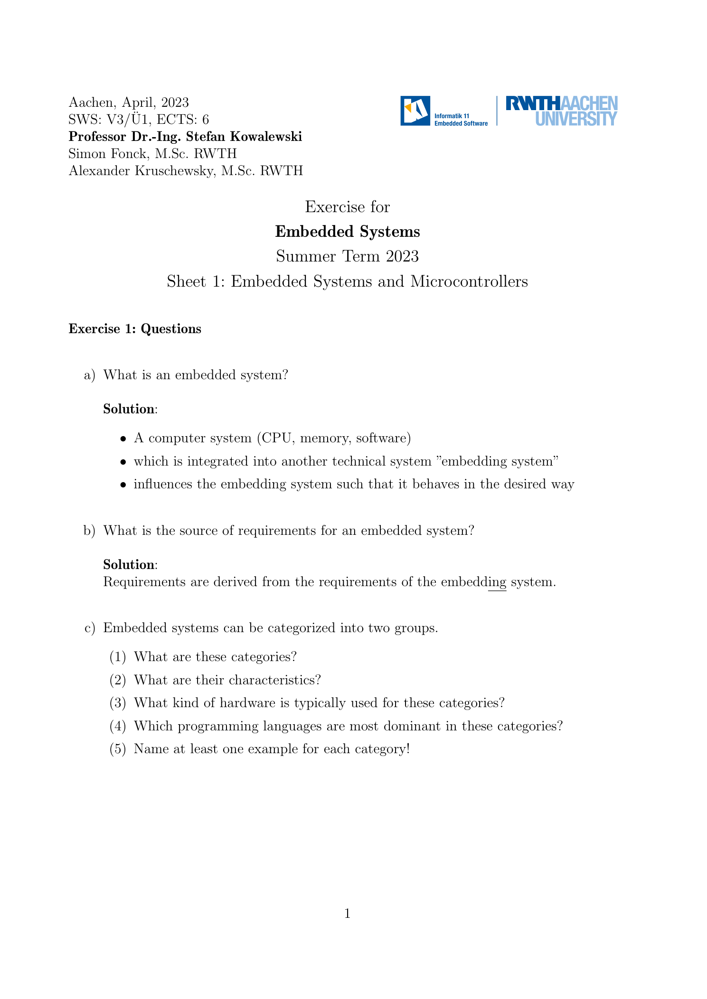

这张图是一份来自德国亚琛工业大学（RWTH Aachen University）**嵌入式系统（Embedded Systems）课程**的练习题（Exercise Sheet 1），主要帮助学生理解嵌入式系统与微控制器的基础概念。下面我会逐题解释并说明应该怎么作答。

---

## 🧩 **题目逐条解析**

### **Exercise 1a：What is an embedded system?（什么是嵌入式系统？）**

**题意解释：**
要求说明什么是嵌入式系统的定义。

**标准答案与解释：**
嵌入式系统（Embedded System）是一种**被集成在其他技术系统中，用于控制或影响该系统行为的计算机系统**。
它包含：

* **硬件部分**：中央处理器（CPU）、存储器（Memory）、输入输出接口等；
* **软件部分**：用于执行特定任务的程序。

它不同于普通的计算机，因为它不是通用设备，而是**嵌入到某个设备中完成特定功能**，比如洗衣机控制模块、汽车ABS系统等。

✅ **回答建议：**

> 嵌入式系统是一种由硬件（CPU、存储器等）和软件组成的计算机系统，它被集成到其他设备或系统中，用来控制或影响该设备的行为，使其按照预期方式工作。

---

### **Exercise 1b：What is the source of requirements for an embedded system?（嵌入式系统的需求来源是什么？）**

**题意解释：**
问“嵌入式系统的需求来自哪里”。

**标准答案与解释：**
嵌入式系统的需求来源于“宿主系统”（embedding system）。
也就是说，嵌入式系统本身不是独立存在的，它的功能和性能要求都是**由其所在的大系统（被嵌入的设备或产品）决定的**。

✅ **回答建议：**

> 嵌入式系统的需求来自它所嵌入的系统，也就是由宿主系统的整体功能与要求推导出来的。

---

### **Exercise 1c：Embedded systems can be categorized into two groups（嵌入式系统可以分为两类）**

**题意解释：**
这一题要求区分嵌入式系统的两大类型，并回答五个子问题。

---

* 这张图把嵌入式系统按“**应用场景对成本、体积、数量的敏感度**”粗暴地划成两大类：

  1. **产品类（Product Automation）**
  2. **生产类（Production Automation）**

  下面把 5 个问题逐条翻译成“人话”，并补全缺失的细节。

  ------------------------------------------------
  1. 两类到底指什么？
  - **产品类**：一次要卖几百万、几千万台的“小东西”，成本压到极限。  
    例：手机、洗衣机、汽车 ECU、蓝牙耳机。
  - **生产类**：工厂里用来“造东西”或“管设备”的控制系统，量小但单价高，可靠性优先。  
    例：化工厂 DCS、PLC 机柜、数控机床、工业机器人。

  ------------------------------------------------
  2. 性格差异对照表

  | 维度         | 产品类                           | 生产类                                      |
  | ------------ | -------------------------------- | ------------------------------------------- |
  | 产量         | 百万级，完全同款                 | 往往只有一套或几套                          |
  | 成本         | 几分钱都要抠                     | 预算几万–几百万都能谈                       |
  | 用户         | 普通消费者，不懂技术             | 工程师/技术员，几乎就是专家                 |
  | 平台决定因素 | 硬件 BOM 价 → 选最便宜能跑的 MCU | 软件功能/算法/实时性 → 先满足工艺，再选硬件 |
  | 生命周期     | 2–3 年就换代                     | 10–20 年，必须长期供货                      |
  | 环境         | 客厅、口袋、车内                 | 高温、高湿、强电磁干扰                      |

  ------------------------------------------------
  3. 典型硬件

  产品类  
  - 超低 cost MCU（STM32F0、ESP32-C3、NXP S32K）  
  - 片内 Flash/RAM，QFN 封装，4 层板就能跑  
  - 量大直接掩膜 ASIC 或把 CPU 核塞到面板驱动里

  生产类  
  - PLC：西门子 S7-1500、Allen-Bradley ControlLogix  
  - 工业 PC：倍福 CX、Advantech UNO，i7+RTX 做视觉  
  - 分布式 DCS：Honeywell C300、ABB AC 800M，双冗余电源/环网  
  - 高端也会上 FPGA 做硬实时运动控制（Kintex-7、Zynq）

  ------------------------------------------------
  4. 主流语言

  产品类  
  - C/C++（裸机或 RTOS）  
  - 汇编：启动文件、临界段、功耗优化  
  - 硬件描述：VHDL/Verilog 做外设 IP  
  - 图形化：MATLAB/Simulink 先生成 C 再编译

  生产类  
  - IEC 61131-3 五种官方语言：  
    – IL（指令表，类似汇编）  
    – ST（结构化文本，Pascal 味）  
    – LD（梯形图，电工最爱）  
    – FBD（功能块）  
    – SFC（顺序功能图）  
  - 高级 SCADA 脚本：Python、VBA  
  - 运动控制：PLCopen Motion + C++ 写算法块

  ------------------------------------------------
  5. 举例对号入座

  产品类  
  - 汽车发动机控制器（ECU）：ST 的 SPC58 MCU，C 代码，量 800 万颗/年  
  - 家用洗衣机主控：5 块钱 32 位 MCU，C+汇编，两年一换 BOM

  生产类  
  - 化工厂反应釜 DCS：Honeywell Experion，冗余服务器+千兆环网，卖一套 300 万美元  
  - 汽车装配线 PLC：西门子 S7-400，带 200 个远程 I/O 站，ST+梯形图混写，24×7 运行 15 年

  ------------------------------------------------
  一句话总结  
  “产品类”拼的是**极致成本、海量复制**；  
  “生产类”拼的是**高可靠、可维护、搞定工艺**。  
  硬件、语言、价格、寿命全都围着这两个目标转。

---

## 🧾 **总结归纳**

嵌入式系统就是被嵌入到其他设备中、执行特定功能的计算机系统，它的需求来自它所服务的整体系统。根据任务的时间要求不同，它可以分为通用型和实时型两大类。通用型系统注重稳定和能效，而实时型系统注重时间响应和可靠性。常用的硬件包括微控制器、DSP等，主要编程语言是C和C++，应用举例包括洗衣机控制模块（通用型）和汽车安全气囊控制器（实时型）。

---

## \[口语化表达]

其实这份练习就是在帮你理解“嵌入式系统”到底是什么。简单来说，它就是被嵌进别的机器里、用来控制它们的小型计算机。比如洗衣机、汽车、无人机里都有这种系统。它的需求都是从“大系统”来的，也就是说它要做什么，取决于它所在的设备需要什么功能。再往下分，可以分成两种：一种是通用的，比如家电控制；另一种是实时的，比如安全气囊这种，必须在几毫秒内反应。用的硬件一般是单片机或ARM芯片，写程序主要用C语言。


---

## 第 2 页

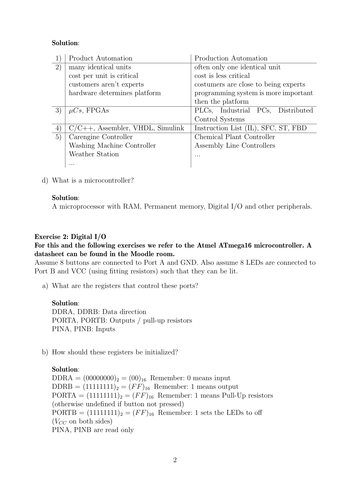

这页是前面“嵌入式系统与微控制器”练习的第二部分，主要讲两类嵌入式系统的区别、微控制器的定义，以及ATmega16单片机的数字输入输出（Digital I/O）配置。下面是详细中文讲解👇

---

## 🧩 **题目逐条解析**

### **（接上页）c.5）嵌入式系统的分类与举例**

从表格可以看到，系统被分成两大类：

1. **Product Automation（产品自动化）**
2. **Production Automation（生产自动化）**

---

#### **1）类别说明**

* **Product Automation**：产品层面的自动化系统，比如控制家电、消费电子等。
* **Production Automation**：生产线或工业过程自动化，如工厂设备控制。

---

#### **2）特点**

| 项目   | Product Automation | Production Automation |
| ---- | ------------------ | --------------------- |
| 单元数量 | 大量相同产品             | 通常只有一个独立系统            |
| 成本   | 单个成本非常关键           | 成本不太敏感                |
| 用户   | 普通用户，不懂技术          | 用户多为技术专家              |
| 平台选择 | 硬件平台决定系统           | 编程系统（软件架构）更关键         |

解释：
前者强调**量产、成本与易用性**，后者更关注**可靠性、可配置性与维护性**。

---

#### **3）常用硬件**

* **Product Automation：** 微控制器（µC）、FPGA
* **Production Automation：** PLC（可编程逻辑控制器）、工业PC、分布式控制系统（DCS）

---

#### **4）常用编程语言**

* **Product Automation：** C/C++、汇编、VHDL、Simulink
* **Production Automation：** 工业控制语言，如IL（指令表）、SFC（顺序功能图）、ST（结构化文本）、FBD（功能块图）

---

#### **5）示例**

* Product Automation：洗衣机控制器、汽车发动机控制（Care Engine Controller）、气象站控制器等。
* Production Automation：化工厂控制系统、装配线控制系统等。

---

### **d）What is a microcontroller?（什么是微控制器？）**

**题意解释：**
要定义微控制器（microcontroller）。

**答案与解释：**
微控制器（MCU）是一种**带有内存和输入输出接口的小型计算机**。
它包含：

* **CPU**（微处理器核心）
* **RAM**（易失性存储器）
* **永久存储器（ROM或Flash）**
* **数字I/O接口**
* **定时器、ADC、通信接口等外设**

✅ **回答建议：**

> 微控制器是一种包含微处理器、RAM、永久存储器、数字输入输出和外设模块的小型计算机系统，能独立执行控制任务。

---

## ⚙️ **Exercise 2：Digital I/O（数字输入输出）**

这一题是针对**Atmel ATmega16 单片机**的输入输出端口配置题。

1. 硬件接法先搞清楚

- **8 个按键**：一端接 **Port A 的 0~7 引脚**，另一端全部接 **GND**。
- **8 个 LED**：一端接 **Port B 的 0~7 引脚**，另一端经 **限流电阻**接 **Vcc**（5 V）。
  这种接法叫“**低电平点亮**”——引脚输出 0，LED 两端就有压差，灯亮；输出 1，两边都是 5 V，灯灭。

---

### **a）What are the registers that control these ports?（控制端口的寄存器有哪些？）**

**题意解释：**
要求写出用来控制端口输入输出功能的寄存器。

**答案与解释：**

* `DDRA`, `DDRB` → 数据方向寄存器（Data Direction Register）

* 控制端口的方向（输入或输出）
* 0 = 输入，1 = 输出
* `PORTA`, `PORTB` → 输出或上拉电阻寄存器（Output / Pull-up）

* 写入1可以启用上拉电阻
* 写入0表示输出低电平
* `PINA`, `PINB` → 输入引脚寄存器（Input pins）

* 用于读取引脚当前状态（只读）

✅ **总结表：**

| 寄存器           | 功能       | 备注          |
| ------------- | -------- | ----------- |
| DDRA / DDRB   | 数据方向控制   | 0=输入, 1=输出  |
| PORTA / PORTB | 输出值或上拉电阻 | 1=上拉, 0=低电平 |
| PINA / PINB   | 输入检测     | 只读          |

---

### **b）How should these registers be initialized?（这些寄存器该如何初始化？）**

**题意解释：**
根据题目假设：

* Port A 接按钮（Button）
* Port B 接LED
要设置输入输出方向和初始状态。

**答案与解释：**

| 寄存器                 | 设置               | 说明 |
| ------------------- | ---------------- | -- |
| `DDRA = 00000000₂`  | 所有A端口为输入         |    |
| `DDRB = 11111111₂`  | 所有B端口为输出         |    |
| `PORTA = 11111111₂` | 打开上拉电阻（防止按钮悬空）   |    |
| `PORTB = 11111111₂` | LED初始熄灭状态（高电平关灯） |    |
| `PINA`, `PINB`      | 只读，不需初始化         |    |

a) **DDRA = 0x00**
二进制 `0000 0000` → 8 位全 0
含义：把 **Port A 8 根脚全部设为输入**，因为按键要读外部电平。

b) **DDRB = 0xFF**
二进制 `1111 1111` → 8 位全 1
含义：把 **Port B 全部设为输出**，因为要驱动 LED。

c) **PORTA = 0xFF**
此时 Port A 是输入模式，**写 1 不会输出高**，而是**把内部上拉电阻接到每根引脚**。
好处：

- 按键没按下 → 上拉把引脚拉到 1，读 PINA 得到 1
- 按键按下 → 引脚被外部硬拉到 0，读 PINA 得到 0
  既省外部电阻，又保证逻辑确定。

d) **PORTB = 0xFF**
Port B 是输出模式，写 1 会让引脚输出 Vcc。
前面说了 LED 另一端已经接 Vcc，**两边同电位 → 无电流 → 灯全灭**；
以后想点亮哪一位，再把对应位清零即可：

```
PORTB &= ~(1 << 3);   // 单独点亮 LED3
```

e) **PINA / PINB**
只读寄存器，**写没用**。
读 PINA 可知哪个按键被按下；读 PINB 可看自己上次写给 Port B 的值（虽然通常没必要）。

💡 **关键记忆点：**

* **输入端口** → `DDRx = 0`，`PORTx = 1`（上拉）
* **输出端口** → `DDRx = 1`，`PORTx` 控制LED亮灭
* `PINx` 寄存器仅用于读取输入状态。

---

## 🧾 **总结归纳**

本页主要内容包括嵌入式系统分类、微控制器定义，以及ATmega16的I/O寄存器操作。
嵌入式系统分为**产品自动化**和**生产自动化**两类，分别应用于消费类与工业控制领域。
微控制器是小型计算机，集成了CPU、内存和外设。
ATmega16的数字I/O使用`DDRx`控制方向、`PORTx`输出或启用上拉、`PINx`用于读取输入值。
在初始化时，应为按钮端口设置输入并启用上拉，为LED端口设置输出并关闭LED。

---

## \[口语化表达]

这页主要讲的是嵌入式系统的分类、微控制器是什么，还有怎么在ATmega16上配置输入输出。简单说，嵌入式系统分两种：一种是产品类，比如洗衣机；另一种是生产线那种工厂控制系统。前者讲求成本和量产，后者讲究稳定和精度。微控制器其实就是个小电脑，里面有CPU、内存、输入输出接口等，能独立控制设备。然后在ATmega16的例子里，我们用A口连按钮、B口连LED。A口要设成输入并加上拉电阻防止乱跳，B口设成输出控制灯亮灭。整个初始化过程就是把端口方向和默认状态都先配置好。


---

## 第 3 页

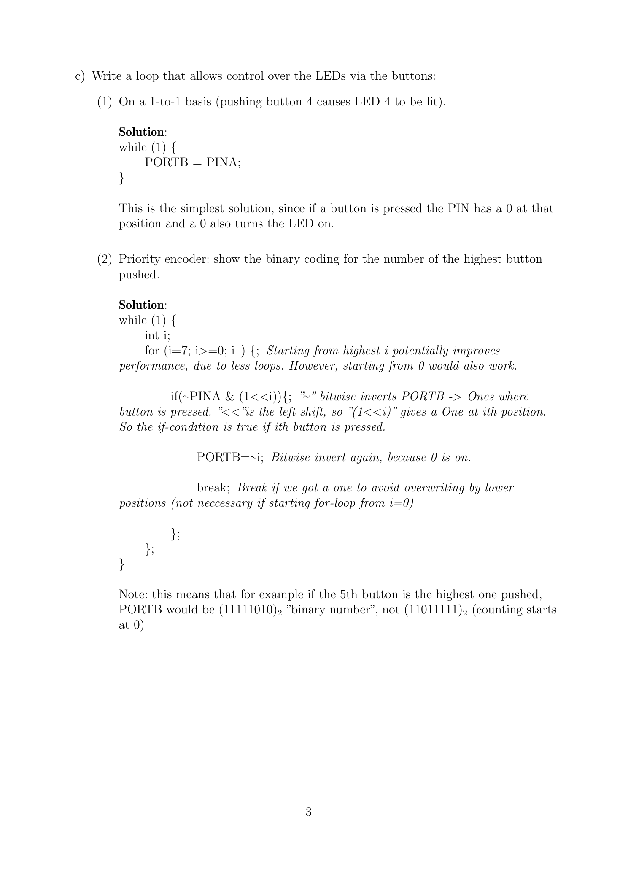

这页讲的是**如何通过按钮（button）来控制LED灯（LED）**的程序设计，属于**数字I/O编程的实操部分**。题目要求你写两个循环（loop）：
一个是**一对一控制**（按钮控制对应的LED），另一个是\*\*优先编码器（priority encoder）\*\*模式（只有最高编号的按钮起作用）。
下面是逐题讲解👇

---

## 🧩 **题目详细解析**

### **(c)(1) 一对一控制 (1-to-1 basis)**

**题意解释：**
要求每个按钮控制自己编号的LED，例如：

* 按下按钮 4 → LED 4 亮；
* 放开按钮 4 → LED 4 灭。

---

**代码解读：**

```c
while (1) {
PORTB = PINA;
}
```

---

**工作原理：**

* `PINA` 表示按钮输入端口（Port A），每个按键连接到该端口；
* `PORTB` 表示LED输出端口（Port B）。

这段代码的意思是：

1. 持续读取 `PINA`（按钮状态）；
2. 把它直接复制到 `PORTB`，这样LED会跟着按钮同步变化。

---

**注意点：**

* 按钮按下时引脚电平为 **0**（因为接地GND）；
* LED 通常是“低电平亮”，所以**按钮按下（0）→ LED亮**；
* 放开按钮（1）→ LED灭。

因此直接赋值 `PORTB = PINA;` 就可以实现“哪个按钮按下哪个灯亮”的效果。

✅ **总结：**

> 这个程序是最简单的方式：直接把输入端口的值复制到输出端口，实现一对一控制。

---

### **(c)(2) 优先编码器 (Priority Encoder)**

**题意解释：**
当多个按钮同时按下时，只让**编号最高的那个按钮**起作用。
例如同时按下按钮 2、4、7 → 只点亮对应“按钮7”的LED，其他忽略。

---

**代码解读：**

```c
while (1) {
int i;
for (i = 7; i >= 0; i--) {        // 从最高位开始检测按钮
if (~PINA & (1 << i)) {       // 检查第 i 个按钮是否按下
PORTB = ~i;               // 输出i的反码作为显示（让对应LED亮）
break;                    // 找到最高的就退出循环
}
}
}
```

---

**解释细节：**

* `~PINA` ：按位取反，因为按钮按下时引脚为0，取反后变成1，更方便判断。
* `(1 << i)` ：表示第 i 位掩码。例如当 i=3 时，`(1<<3)` = `00001000₂`。
* `if (~PINA & (1 << i))` ：如果第 i 个按钮被按下，该条件为真。
* `PORTB = ~i;` ：把i的反码输出给LED端口。
因为0代表亮灯，所以反码的位1会使LED灭，位0会让对应LED亮。
* `break;` ：找到最高编号的按钮后立即退出循环，避免被低编号覆盖。

---

**举例说明：**

> 如果第5号按钮（从0开始计数）是最高被按下的按钮，
> `PORTB` 的值会是 `11111010₂`。
> 这表示第5位对应的灯亮，其它灯保持熄灭。

---

**程序思路总结：**

1. 从第7个按钮开始检查，一直到第0个；
2. 检测到哪个按钮按下，就让LED显示相应的状态；
3. 由于使用 `break;`，只有最高编号按钮起作用。

✅ **总结：**

> 这个程序实现了一个“优先编码器”逻辑：多个按钮同时按时，系统只响应最高编号按钮，并点亮相应的LED。

---

## 🧾 **总体总结归纳**

这一页讲的是嵌入式系统中如何通过**循环和寄存器操作**实现LED控制：

* 第一种方式（1-to-1）是**直接映射**，输入和输出完全对应，简单高效；
* 第二种方式（priority encoder）是**逻辑控制**，只响应最高优先级输入，体现了编程逻辑思维；
* 两个程序都使用了`PINA`（读取输入）和`PORTB`（输出控制），并通过位运算操作(`~`, `<<`, `&`)实现状态判断。

这些实验是理解**微控制器I/O控制与循环结构**的关键基础。

---

## \[口语化表达]

这页其实是在教你怎么写程序，让按钮去控制LED灯。第一个程序最简单，就是“谁按谁亮”：按钮A连着LED A，直接把输入复制到输出就行，因为按钮按下时引脚变低电平，对应LED就亮。第二个程序稍微高级点，叫“优先编码器”。意思是如果同时按了好几个按钮，它只认最高编号的那个，比如你按了2、4、7，它只亮7号灯。代码里用循环从高位往低位查，一旦发现有按下的按钮就退出循环，不让低编号的覆盖掉结果。整体来说，这部分是让你学会用循环和位运算去控制I/O口的逻辑，是嵌入式编程的核心基础。


---

## 第 4 页

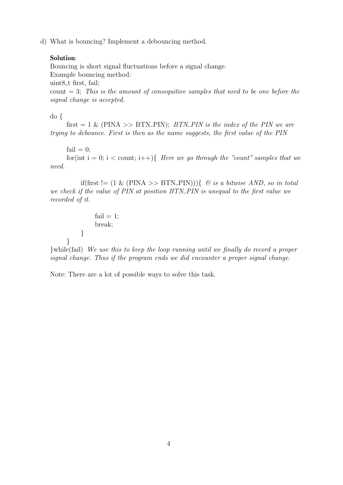

这页讲的是按钮输入信号中的**抖动（bouncing）**现象，以及如何用编程实现**去抖（debouncing）**。这是嵌入式系统中非常重要的一个细节问题，尤其在按键输入时。下面是详细讲解👇

---

## 🧩 **题目详细解析**

### **(d) What is bouncing? Implement a debouncing method.（什么是“抖动”？请实现一种去抖方法。）**

---

### **1️⃣ 什么是 Bouncing（信号抖动）**

**解释：**
当我们按下或释放一个机械按钮时，按钮的触点不会瞬间稳定地从“断开”变为“接通”，而是会在很短时间内（几毫秒内）产生多次快速的通断跳变。
这就叫做 **信号抖动（bouncing）**。

**举例：**
你按下一次按钮，理论上信号应从 1 → 0；
但实际上示波器上能看到类似这样的波形：

```
1 → 0 → 1 → 0 → 1 → 0 → 0（最后才稳定）
```

这就会让程序误以为你按了很多次，而实际上只按了一次。

---

### **2️⃣ Debouncing（去抖动）方法**

**目标：**
在程序中确保只识别一次稳定的信号变化，不受抖动影响。

---

### **3️⃣ 代码分析**

题目提供了一个去抖动的示例方法：

```c
uint8_t first, fail;
count = 3; // 连续3次采样一致才认为信号有效

do {
first = 1 & (PINA >> BTN_PIN); // 读取按钮引脚的初始状态（第一个采样）
fail = 0;

for (int i = 0; i < count; i++) { // 连续检测count次
if (first != (1 & (PINA >> BTN_PIN))) { // 如果有不同的值
fail = 1; // 表示检测失败（信号不稳定）
break;    // 退出检测循环
}
}
} while (fail); // 如果失败，就继续检测，直到连续多次一致
```

---

### **4️⃣ 程序逻辑步骤说明**

1. **读取第一次信号状态**（first）；
2. \*\*连续检测几次（count次）\*\*输入引脚的状态；
3. 如果中间任何一次与第一次不同（即抖动发生），
→ 设置 `fail = 1`，重新开始检测；
4. 如果连续多次都一致，
→ `fail = 0`，退出循环，认为信号变化稳定；
5. **最终结果：** 只有稳定状态才能被接受，过滤掉抖动干扰。

---

### **5️⃣ 关键语句解析**

* `PINA >> BTN_PIN`
→ 把对应按钮引脚的位移到最低位，方便判断。

* `1 & (...)`
→ 用位运算取出该按钮的当前状态（0或1）。

* `~`（按位取反）
→ 在前面例子中用过，有时用于信号反向（视硬件电平而定）。

* `do { ... } while (fail)`
→ 表示如果检测失败，就一直重新检测，直到成功。

---

### **6️⃣ 思考与扩展**

该程序的思想是“**多次采样、一致确认**”，是最常见的软件去抖方式。
除了这种方法，还有以下几种常见策略：

* **延时法（Delay法）**：检测到信号变化后等待10\~20毫秒再读取。
* **定时采样法**：用定时器每隔固定时间采样，连续多次相同才有效。
* **滤波算法法**：通过加权平均或低通滤波消除抖动。

---

## 🧾 **总结归纳**

这一页讲述了“**按键抖动**”问题及如何编程解决。
抖动是由机械接触弹性造成的信号快速波动，会导致系统误判多次按键输入。
解决方法是**软件去抖**，即在程序中连续多次采样同一按键的状态，只有当多次结果一致时才确认信号有效。
题目中提供的例程使用 `do-while` 循环配合计数检测，直到信号稳定为止，属于最典型的去抖逻辑。

---

## \[口语化表达]

这页其实讲的是“按钮抖动”这个小毛病。就是说，当你按一下按键的时候，电路不会立刻稳定成高电平或低电平，而是会来回跳几次。程序要是直接读，就会以为你按了好几下。去抖动（debouncing）就是让程序判断这信号到底稳没稳。这个例子的方法是先读一次按键值，然后连续读几次（比如3次），如果这几次都一样，就认定信号稳定；要是中途有变化，就重新再读。这样就能过滤掉抖动，只在信号真正稳定的时候才算“按下”。简单说，就是让程序“多确认几次”，只信稳的信号。


---

## 第 5 页

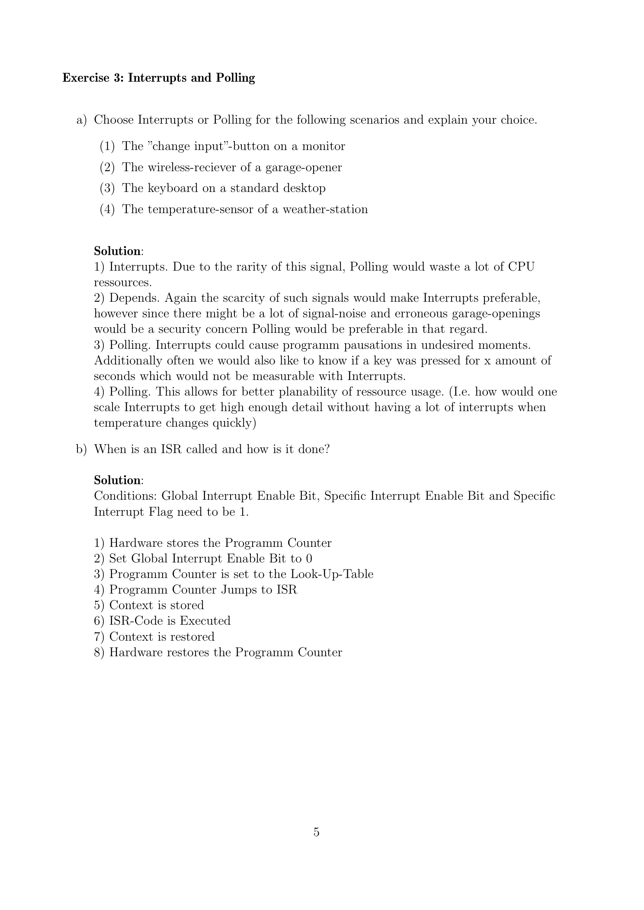

下面把原题和官方答案逐句“翻译”成大白话，并补上为什么这样选、每一步在芯片里到底发生了什么，保证看完就能自己给别人讲明白。

------------------------------------------------
一、先分清两个主角
- **轮询（Polling）**：CPU 像个“保安”，每隔 x ms 主动去“扫楼”——看寄存器/引脚有没有事件发生。  
- **中断（Interrupt）**：外设自己“按铃”，CPU 听到铃响才放下当前工作去处理。  
选谁，就看“事件频度、实时性、功耗/CPU 占用、噪声/安全”这四条权衡。

------------------------------------------------
二、4 个场景逐条拆解

1. 显示器上的“切换输入源”按键  
   官方答案：用 **中断**  
   原因：  
   - 人一天说不定只按一次，**事件极稀疏**。  
   - 若轮询，保安每秒扫 100 次，99.99% 空跑，**白白耗电**。  
   - 中断方案：按键接到 GPIO，按下触发边沿中断，CPU 直接从 sleep 醒来切信号源，**省电又及时**。

2. 车库门无线接收器  
   官方答案：**看情况**（Interrupt vs. Polling 折中）  
   原因：  
   - 稀疏角度：每天开关几次 → 中断好像合适。  
   - 安全/噪声角度：空中 433 MHz/868 MHz 信号乱飞，**中断太敏感**会导致“鬼开门”。  
   实际产品做法：  
   - 硬件先用 **Timer 轮询采样**（每 1 ms 看一次 RF 解码脚），连续 N 次看到合法码再 **软件触发一次中断** 去开门。  
   - 既滤掉毛刺，又不用 100% 空转。

3. 标准台式机键盘  
   官方答案：用 **轮询**（其实严格说是“**中断 + 轮询混合**”，但作业里把扫描部分叫 Polling）  
   原因：  
   - 键盘里有一颗 **专用单片机**（例如 8048 后代），它 **每 100 μs 轮询一次按键矩阵**——测哪一行哪一列导通。  
   - 只有在 **检测到“新键按下/松开”** 时，才通过 **USB 中断 IN 端点** 把数据包发给 PC。  
   好处：  
   - 能轻松实现 **连发延时、组合键、去抖**；  
   - PC 主机侧不需要为每个按键动作都进中断，**减轻系统抖动**（gaming 时尤其重要）。

4. 气象站的温度传感器  
   官方答案：用 **轮询**  
   原因：  
   - 温度变化 **慢**（分钟级），但你想 **每 1 s 更新一次屏幕/数据库**。  
   - 若用中断，必须设“温度变化 > ΔT”才触发——ΔT 太小 → 中断风暴；ΔT 太大 → 精度丢。  
   - 轮询：Timer 每 1000 ms 触发一次 ADC 采样，**CPU 占用可预测、可调度**，还能做数字滤波，**更容易“扩精度”**（比如 10 次平均）。

------------------------------------------------
三、ISR（中断服务程序）啥时候跑？官方 8 步流程再解释

前置条件（必须同时满足，缺一个都不进）：  
① **全局中断使能位**（如 AVR 的 I 位） = 1  
② **该外设自身的中断使能位** = 1  
③ **该外设中断标志位** = 1（硬件置位，表示“事件来了”）

一旦 3 个 1 凑齐，硬件马上自动做以下 8 件事：  
1. **把当前 PC（下一条指令地址）压栈**——相当于“在书里的这一页夹个书签”。  
2. **清全局中断使能位**（I ← 0），**自动关中断**，防止中断嵌套搞乱现场。  
3. **CPU 把 PC 换成中断向量表里的地址**（每个中断源固定一个入口）。  
4. **执行向量表里的跳转指令**，真正跳到用户写的 ISR 入口。  
5. **ISR 开头软件保存上下文**（push 寄存器、push 状态寄存器等）。  
6. **跑你的 ISR 代码**（读数据、清外设中断标志、喂狗……）。  
7. **恢复上下文**（pop 回来）。  
8. **执行 RETI 指令**：  
   - 把步骤 1 压栈的 PC 弹回来 → 继续原程序；  
   - 同时再把全局中断使能位 I 置 1，**重新允许中断**。

------------------------------------------------
四、一句话背下来
- **稀事件 + 低功耗** → 中断；  
- **可预测 + 慢变化 + 要滤波/组合键** → 轮询；  
- 中断真要进场，硬件先“压 PC → 关中断 → 跳向量”，ISR 结束“RETI”把一切都还回去。


---

## 第 6 页

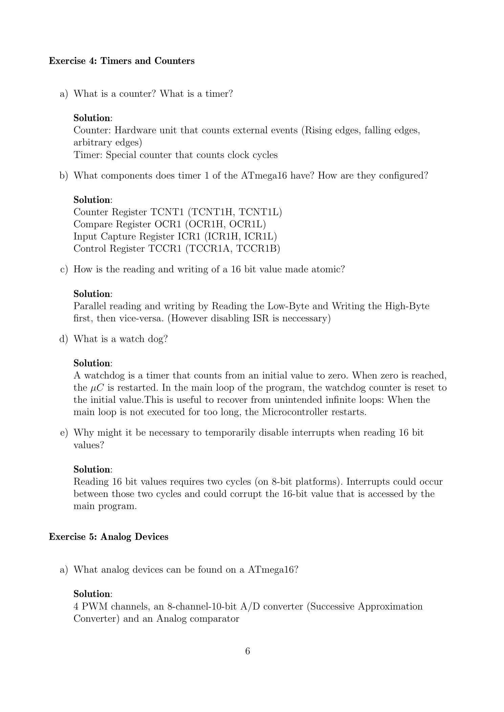

这页内容讲的是**定时器（Timer）与计数器（Counter）**的概念、ATmega16的定时器组成、看门狗（Watchdog）原理，以及与中断相关的16位数据访问问题。最后还提到了ATmega16中自带的**模拟（Analog）外设**。以下是详细解析👇

---

## 🧩 **Exercise 4：Timers and Counters（定时器与计数器）**

---

### **(a) What is a counter? What is a timer?**

**题意：**
解释“计数器（Counter）”和“定时器（Timer）”的区别。

**解析：**

* **Counter（计数器）**：是一种**硬件单元**，用于计数外部事件。例如：

* 上升沿（rising edge）
* 下降沿（falling edge）
* 任意边沿（arbitrary edges）

它常用于检测外部信号发生的次数，比如转速计、脉冲计数等。

* **Timer（定时器）**：是一个**特殊的计数器**，但它计数的不是外部信号，而是**内部时钟周期（clock cycles）**。
它可以用于：

* 延时控制
* 定时触发事件
* 周期性中断等

✅ **总结：**

> Counter 数外部信号；Timer 数内部时钟。

---

### **(b) What components does timer 1 of the ATmega16 have? How are they configured?**

**题意：**
列出ATmega16微控制器中 Timer1 的主要组成部分。

**解析：**
Timer1 是一个**16位定时/计数单元**，包含以下寄存器：

| 组件    | 名称                           | 功能               |
| ----- | ---------------------------- | ---------------- |
| 计数寄存器 | `TCNT1` (`TCNT1H`, `TCNT1L`) | 存放当前计数值          |
| 比较寄存器 | `OCR1` (`OCR1H`, `OCR1L`)    | 用于设定比较匹配值        |
| 捕获寄存器 | `ICR1` (`ICR1H`, `ICR1L`)    | 捕获输入信号变化的时间戳     |
| 控制寄存器 | `TCCR1` (`TCCR1A`, `TCCR1B`) | 设置计数模式、预分频、波形模式等 |

✅ **配置方法：**
通过设置 `TCCR1A` 和 `TCCR1B` 控制寄存器中的位来调整定时器的工作模式（如CTC模式、PWM模式等）。

一、Timer1 在 ATmega16 里的地位

- 16 位定时器，**唯一**带 **输入捕获** 和 **16 位比较/捕获寄存器** 的定时器。
- 时钟源、分频、波形模式、比较匹配、输入捕获、中断全都由它自己说了算，不跟 Timer0/2 抢。

------

二、四组寄存器分别干什么

1. TCNT1（TCNT1H + TCNT1L）

   - **16 位计数器本体**，随时随硬件时钟 +1/-1。
   - 读写必须先访问 **临时高速缓存寄存器**机制：
     读：先读 TCNT1H，硬件把当前高字节锁存，再读 TCNT1L 拿到低字节；
     写：先写 TCNT1H（只是缓存），再写 TCNT1L 的那一刻，**16 位一起更新**，防止中间被中断撕裂。

2. OCR1（OCR1A/B）（OCR1AH + OCR1AL …）

   - **输出比较寄存器 A/B**，各 16 位。
   - 用途：
     – 与 TCNT1 随时比较，**相等时**可以
     ‑ 产生中断 (OCF1A/B)
     ‑ 清零 TCNT1（CTC 模式）
     ‑ 让 OC1A/OC1B 引脚自动置位/清零/翻转（PWM 模式）。
   - 写方法同 TCNT1：先高后低，用临时缓存。

3. ICR1（ICF1H + ICR1L）

   - **输入捕获寄存器**，16 位。
   - 当 **ICP1 引脚**出现指定边沿（由 TCCR1B 的 ICES1 选上升或下降）时，硬件立刻把 **当前 TCNT1 值**锁存进 ICR1，并置位中断标志 ICF1。
   - 经典用法：测脉冲宽度、周期、占空比、红外解码、电机转速。

4. TCCR1A / TCCR1B

   - **两个 8 位控制寄存器**，所有“怎么数、数多快、到顶怎么办、引脚怎么翻”都在这儿。
     重要位一览（写代码时常用）：

   TCCR1A

   - COM1A1/0：OC1A 引脚比较匹配行为（00 断开，01 翻转，10 清零，11 置位）
   - COM1B1/0：同上，对应 OC1B
   - WGM11/0：波形模式低 2 位（与 TCCR1B 的 WGM13/2 拼成 4 位模式字）

   TCCR1B

   - ICNC1：输入捕获噪声抑制（1 打开 4 采样同步）
   - ICES1：输入捕获边沿选择 0=下降 1=上升
   - WGM13/2：波形模式高 2 位
   - CS12/10：时钟选择 000=停 001=无分频 010=8 分频 … 111=外部下降沿

   常见模式举例（16 MHz 晶振）：
   – 普通 16 位计数：WGM=0000，CS=101（1024 分频）→ 1 tick = 64 µs，满量程 ~ 4.2 s
   – CTC 自动清零：WGM=0100，OCR1A=15999，CS=010 → 1 ms 精确中断基准
   – 10 位快速 PWM：WGM=0111，TOP=0x03FF，CS=001 → 15.6 kHz 载波，占空比 = OCR1A/1024

---

### **(c) How is the reading and writing of a 16-bit value made atomic?**

**题意：**
在8位处理器上，如何保证16位数据读写的“原子性”（atomic）？

**解析：**
ATmega16 是 8 位 MCU，一次只能读写 8 位。
所以要安全读写 16 位寄存器（如 `TCNT1`），需要**分两步操作**：

* 读/写低字节（Low Byte）
* 再读/写高字节（High Byte）

为了防止这两步之间被中断打断，需要**暂时关闭中断**（Disable ISR）。

✅ **方法：**

> 并行读写：先读取低字节，再读取高字节（或反过来），期间关闭中断确保数据一致。

---

### **(d) What is a watchdog?**

**题意：**
解释看门狗（Watchdog）的概念。

**解析：**

* **看门狗定时器（Watchdog Timer, WDT）** 是一种特殊的定时器。
* 它从设定值开始倒计时，如果倒数到 0 时系统没有“重置”它，就会自动**复位微控制器（重启系统）**。
* 通常在主程序循环中定期“喂狗”（reset WDT），防止系统因卡死或死循环而停止运行。

✅ **总结：**

> 看门狗能监控程序运行状况，当程序卡死或未及时喂狗时，系统会自动重启以恢复正常工作。

---

### **(e) Why might it be necessary to temporarily disable interrupts when reading 16-bit values?**

**题意：**
为什么在读取16位值时要临时关闭中断？

**解析：**

* 在8位CPU上读取16位值要花两次指令周期；
* 如果在读取两个字节中间发生中断，中断服务程序可能修改该寄存器；
* 结果：读取的高低字节不匹配，数据损坏。

✅ **解决：**

> 在读写16位寄存器前关闭中断，读完后再开启中断，确保数据一致性。

---

## 🧩 **Exercise 5：Analog Devices（模拟设备）**

---

### **(a) What analog devices can be found on a ATmega16?**

**题意：**
列出ATmega16上内置的模拟功能模块。

**解析：**
ATmega16具备以下模拟设备：

1. **4 个 PWM 通道**（用于脉宽调制输出）；
2. **一个 8通道 10位 ADC（模数转换器）**，采用**逐次逼近法（SAR, Successive Approximation Register）**；
3. **一个模拟比较器（Analog Comparator）**，用于比较两个模拟电压的大小。

✅ **总结：**

> 模拟外设包括 PWM、ADC、比较器。

---

## 🧾 **总结归纳**

这一页主要讲解了**定时/计数器的原理与应用**，以及ATmega16的硬件组成。
计数器用于外部事件计数，定时器用于时钟周期计时；Timer1 是16位结构，有计数、比较、捕获和控制寄存器；16位访问需保证原子性，必要时关闭中断。
看门狗用于防止程序卡死，自动重启系统。
最后介绍了ATmega16的模拟模块：PWM、ADC、模拟比较器。

---

## \[口语化表达]

这页主要讲的是定时器和计数器的区别，还有ATmega16里的定时器模块怎么用。计数器就是数外部信号的，比如有多少个脉冲；定时器则是用系统时钟来数时间。ATmega16 的 Timer1 是个16位的计数器，有好几个寄存器负责计数、比较、捕获信号这些。因为是8位处理器，读写16位寄存器时要分两步，为了防止中断插进来搞乱数据，就得先关中断再操作。看门狗定时器的作用是防止程序卡死，如果主程序太久没喂狗，它就自动重启芯片。最后还提到这芯片有4个PWM输出、一个8通道10位ADC和一个模拟比较器，用来做模拟信号采集和输出。这些都是嵌入式系统里非常基础但很实用的功能。


---

## 第 7 页

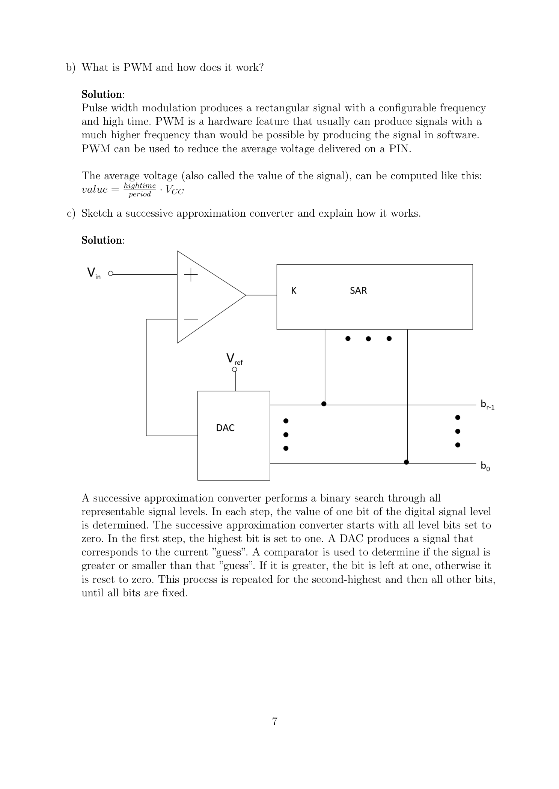

下面这页主要考两个点：\*\*PWM（脉宽调制）**是什么、怎么工作的；以及**逐次逼近型 A/D 转换器（SAR ADC）\*\*的原理与工作流程。我按小题逐条解释，并给出可以直接用于作答的要点与表达。

---

## Exercise 5（续）

### b) What is PWM and how does it work?（什么是 PWM？它如何工作？）

**考点**：能用一句话定义 PWM，说明“频率 + 占空比”两参数；会写出等效平均电压公式；知道硬件 PWM 相比软件波形的优势与使用场景。

**标准作答要点：**

* **定义**：PWM（Pulse Width Modulation，脉宽调制）输出的是**矩形波**，其**频率（frequency）**与**高电平持续时间（high time）/占空比（duty cycle）**可配置。通过改变“高电平所占比例”来调节**等效平均电压/功率**。
* **平均电压公式**（题面给出的式子，可直接引用）

$$
\text{value}=\frac{\text{high time}}{\text{period}}\cdot V_{CC}
$$

其中 period 是一个周期的总时长，high time 是该周期内为高电平的时长。
* **工作机制**：定时器/比较器硬件在固定周期内，根据设定的比较值自动切换引脚高/低电平，形成指定占空比的方波。
* **硬件优势**：硬件 PWM 不占或极少占用 CPU，能产生**比软件翻转更高、更稳定的频率**，抖动小。
* **用途**：调光、调速（电机）、DAC 拟真（经 RC 滤波）、音频/蜂鸣器驱动、模拟电压近似输出等。

**可直接写在卷面的话**：

> PWM 通过在固定周期内改变高电平所占比例（占空比）来调节引脚的平均电压：$V_\text{avg}=\frac{t_\text{high}}{T}\cdot V_{CC}$。它通常由定时器/比较器硬件产生，相比软件翻转可实现更高、更稳定的输出频率，常用于调光、调速与功率控制。

---

### c) Sketch a successive approximation converter and explain how it works.

（画出逐次逼近型 ADC 的框图并解释其工作原理。）

**考点**：能说出 SAR ADC 的基本模块（比较器、DAC、逐次逼近寄存器 SAR、时序/控制 K），说明“二分搜索/逐位判定”的流程，并用 1 段话或伪代码描述步骤。

**框图元素（与题图一致）**：

* **Comparator（比较器）**：比较 $V_{in}$ 与 DAC 输出 $V_{DAC}$。
* **DAC（数模转换器）**：把当前的数字“猜测值”转成电压与 $V_{in}$ 比较。
* **SAR（Successive Approximation Register）**：逐位决定数字输出，从最高位到最低位。
* **Control / Clock（K）**：提供时序，驱动逐次逼近过程。
* **$V_{ref}$**：参考电压，供 DAC 使用。

**工作原理（逐位/二分搜索）：**

1. **初始化**：所有位清零；从\*\*最高位（MSB）\*\*开始试探，将该位暂置 1，形成“当前猜测”。
2. **比较**：DAC 把“当前猜测”转为 $V_{DAC}$，比较器判断 $V_{in}$ 与 $V_{DAC}$：

* 若 $V_{in} \ge V_{DAC}$ → 保留该位为 1；
* 否则 → 清回 0。
3. **下一位**：移动到次高位，重复“置 1 → 转换 → 比较 → 保留/清零”的过程。
4. **收敛**：直到最低位（LSB）判定完成，**一次转换结束**；SAR 中的比特串即为数字结果。

**一段式伪代码**（8 位示例，便于在卷面写明思路）：

```text
result = 0
for bit from 7 downto 0:
trial = result | (1 << bit)
V_DAC = DAC(trial)
if Vin >= V_DAC: result = trial   // 保留该位为1
else:             // 保持为0
done -> result 为数字输出
```

**一句话概括**：

> SAR ADC 本质上做了一次“**二分搜索**”：自 MSB 向 LSB 逐位试探，用比较器决定该位取 1 还是 0，最终得到最接近输入电压的数字码。

**常见优点**：速度快、分辨率/精度与成本折中好、功耗低，广泛用于通用 MCU（如 ATmega16 的 10 位 SAR ADC）。

---

## 🧾 小结

* **PWM**：硬件生成的矩形波；关键参数“频率 + 占空比”；平均电压 $=\frac{t_\text{high}}{T}V_{CC}$；适合功率/亮度/速度控制。
* **SAR ADC**：由**比较器 + DAC + SAR 寄存器 + 控制时序**构成，按**从高到低逐位试探**的方式完成模数转换，等价于对可表示电平做一次**二分搜索**。

---

## \[口语化表达]

这页就两件事儿：第一，PWM 是用方波来“骗”出一个平均电压的办法，周期固定，改变高电平占的比例（占空比）就能调亮度、调速度，平均电压就是“高电平时间/周期 × 供电电压”。硬件 PWM 比软件翻转靠谱多了，频率高、抖动小。第二，SAR ADC 的思路像“猜数字做二分”：先把最高位试着设成 1，用 DAC 生成电压跟输入比一比，高就保留，低就清零，然后换下一位，直到最低位。最终那串 0/1 就是转换结果。这两块一个负责“从数字做出类模拟”（PWM），一个负责“把模拟变成数字”（SAR ADC），刚好一个出一个进，配合特别常见。


---

## 第 8 页

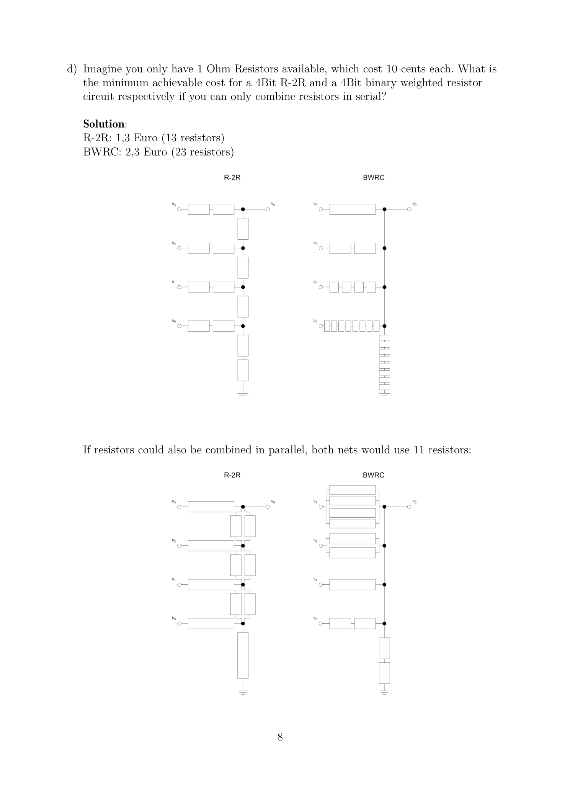

这页在考：**只用 1Ω 电阻且只能串联**时，4 位 **R-2R 梯形网络**与 **二进制加权电阻（BWRC）DAC**分别最少要用多少个电阻、花多少钱；以及如果**允许并联**，两种网络各会用到多少个电阻（图里都为 11 个）。下面按方法与计算展开。

> R-2R 和 BWRC 是两种**用最简单的电阻阵列就能“把数字变成电压”**的经典方法——DAC（数模转换器）里最常考、最容易手焊的两种拓扑。
>
> ------------------------------------------------
> 一、BWRC（Binary-Weighted Resistor DAC）（二进制加权电阻网络）
> 1. 思想  
>    每一位的**权值=2ⁿ**，直接用**阻值成倍数**的电阻实现：  
>    - MSB（最高位）→ 最小电阻 R  
>    - 次高位 → 2R  
>    - 再次 → 4R  
>    - … → 8R、16R …  
>    电流 ∝ 1/R，于是**位权越大→电阻越小→电流越大→对输出贡献越大**，天然符合二进制权重。
>
> 2. 4 位例子（R = 10 kΩ）  
>    ```
>    Vref ──R──┐
>              ├──→ 汇总点（运放反相输入）
>    Vref ─2R──┤
>              |
>    Vref ─4R──┤
>              |
>    Vref ─8R──┘
>    ```
>    开关由数字位 D3…D0 控制：接 Vref（1）或 GND（0）。  
>    汇总电流 Iout = Vref/R × (D3·1 + D2·½ + D1·¼ + D0·⅛)  
>    运放转成电压 ⇒ 完成 DAC。
>
> 3. 优点  
>    - 电阻种类只有 n 种（n = 位数）  
>    - 理论电路极简，书上画起来漂亮。
>
> 4. 缺点  
>    - 宽阻值范围：8 位就要 1R～128R，**大电阻占面积、寄生电容大**。  
>    - 小电阻电流大、发热高。  
>    - 阻值比一旦偏差，**高位的误差会被放大 128 倍**，难做高精度。  
>    → 所以集成芯片里很少真用，>6 位基本放弃。
>
> ------------------------------------------------
> 二、R-2R 梯形网络（R-2R Ladder DAC）
> 1. 思想  
>    只用 **两种阻值**：R 和 2R，排成“梯子”形状，**每一节向左看阻抗都是 2R**，因此**节点电压按 1/2 衰减**，天然二进制权重。
>
> 2. 4 位例子（全部 R = 10 kΩ，2R = 20 kΩ）  
>    ```
>             2R
>    D3 ──R──┬──→ 到运放
>             |
>             R
>    D2 ──R──┬──→ 2R
>             |
>             R
>    D1 ──R──┬──→ 2R
>             |
>             R
>    D0 ──R──┬──→ 2R
>             |
>            GND
>    ```
>    每个“梯级”向右看阻抗都是 2R，于是节点电压：  
>    V3 = Vref·D3  
>    V2 = V3/2  
>    V1 = V2/2 …  
>    输出电压 Vout = –Vref × (D3/2 + D2/4 + D1/8 + D0/16)（假设运放反相）
>
> 3. 优点  
>    - 只有 **R 和 2R** 两种值，**激光修调容易**，匹配精度高。  
>    - 阻值范围窄，**面积小、寄生小**，适合 8–16 位集成 DAC。  
>    - 电流恒定的 2 倍分支，**功耗/发热均匀**。
>
> 4. 缺点  
>    - 元件数翻倍：n 位需要 **2n 只电阻**（但值只有两种）。  
>    - 开关必须**同时切电流方向**（通常用 CMOS 双掷开关），比 BWRC 稍复杂。
>
> ------------------------------------------------
> 三、一张表秒懂对比
>
> |                 | BWRC             | R-2R              |
> | --------------- | ---------------- | ----------------- |
> | 阻值种类        | n 种（1R…2ⁿ⁻¹R） | **2 种**（R, 2R） |
> | 元件数          | n 只             | **2n 只**         |
> | 高位/低位阻值比 | 2ⁿ⁻¹             | **2**             |
> | 匹配难度        | 随位数指数上升   | **恒定**          |
> | 集成难度        | >6 位基本放弃    | **8–16 位轻松**   |
> | 教科书电路图    | 简洁             | 梯形稍复杂        |
> | 芯片实际采用    | 极少             | **绝大多数**      |
>
> ------------------------------------------------
> 四、一句话总结
> - **BWRC** = “用**阻值倍数**硬砸出二进制权重”，画着简单，做着难，**高分辨率直接翻车**。  
> - **R-2R** = “用**梯形分压**魔术变出二进制权重”，只认识两只电阻，**精度高、面积小**，所以现代集成 DAC 几乎清一色 R-2R 或其电流舵变种。

---

## 题意与数据

* 只能使用 **1Ω** 的标准电阻；
* 单价 **€0.10/只**；
* 先只允许**串联**组合；
* 比较两种 4-bit DAC：**R-2R** 与 **Binary-Weighted Resistor Circuit（BWRC）**。

---

## 1) 4 位 R-2R 梯形网络（仅串联）

### 结构要点（4 位）

* 对于 **N 位** R-2R：有 **N 个 2R** 串在主干上，且有 **N+1 个 R**（包含末端与地的终止电阻）。
* 这里 **N=4**，所以：

* **2R 的数量：4 个**
* **R 的数量：5 个**

### 只能用 1Ω 串联时的等效与计数

* 选最小可实现的基准：**R = 1Ω**；
* **2R = 2Ω** → 需要 **2 个** 1Ω 串联。

> 总 1Ω 颗数 = 5×(1Ω) + 4×(2×1Ω) = 5 + 8 = **13 只**。

### 成本

* **13 × €0.10 = €1.30**。
* 与题面给出的 **“R-2R: 1,3 Euro (13 resistors)”** 对应。

---

## 2) 4 位 BWRC（二进制加权电阻，仿照右图，仅串联）

### 结构要点（4 位）

* 需要四个权值电阻：**R、2R、4R、8R** 分别接到同一汇合点（或开关矩阵/输出节点）。
* 为了获得与 R-2R 相近且稳定的输出等效阻抗，常在输出端/参考侧配一个**匹配电阻**（图中等效为 **8R** 级的那串）。这与题图相符，也解释了单位电阻总数为何多出一组 **8R**。

### 只能用 1Ω 串联时的等效与计数

* 以 **R = 1Ω** 计：

* **R** = 1 只
* **2R** = 2 只
* **4R** = 4 只
* **8R** = 8 只
* **匹配/负载 8R** = **再 8 只**
* 合计 1Ω 颗数：1 + 2 + 4 + 8 + 8 = **23 只**。

### 成本

* **23 × €0.10 = €2.30**。
* 与题面给出的 **“BWRC: 2,3 Euro (23 resistors)”** 对应。

---

## 3) 若允许并联（题图下半部分）

* 通过**串并联混合**来合成所需的 R、2R、4R、8R，可复用与等效组合，**两种网络都可以压到 11 只**（如图所示）。
* 因为单位仍是 1Ω，11 只的成本为 **€1.10**。
* 本题只需理解“并联允许后，可以用更少的元件实现同样的等效阻值”，不必逐一展开每个支路的化简过程（图已给出参考实现）。

---

## 结论小抄

* **仅串联**：

* **4-bit R-2R** → **13 只** → **€1.30**
* **4-bit BWRC** → **23 只** → **€2.30**
* **可并联**：两者都可做到 **11 只**（€1.10）。

---

## \[口语化表达]

这页就是在算“拿一堆 1Ω 小电阻，怎么最省钱地拼个 4 位 DAC”。如果只能串联，那 R-2R 梯子一共要 13 只，折 €1.30；二进制加权那种更费料，因为要凑出 1、2、4、8 倍的阻值，还得再来一组 8R 做匹配，所以一共 23 只，€2.30。要是放开手脚能并联，俩方案都能用一些巧妙的串并联等效把数量压到 11 只，成本 €1.10。总之：串联限制下 R-2R 更省料；能并联的话，两种都能做到 11 只。


---

## 第 9 页

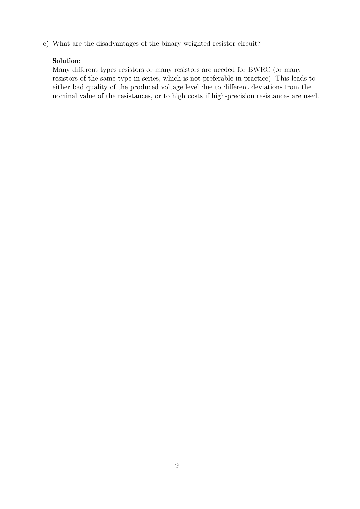

这页只问一个问题：**“二进制加权电阻（BWRC）电路有哪些缺点？”**
题面给出要点，我在其基础上做更完整的解释，便于作答与理解。


---

## e) 二进制加权电阻（BWRC）的缺点

**标准答案（题面主旨）：**
BWRC 需要**多种不同阻值**的电阻（R、2R、4R、8R…），或者用**很多同值电阻串联**去拼出高阻值。这样要么因为阻值偏差导致输出电压等级**精度差**，要么为了保证精度必须使用**高精度电阻**，从而**成本很高**。

**展开说明（考试可酌情写 2–4 点）：**

1. **阻值种类/比值跨度大，匹配困难**

* N 位需要 1:2:4:…:2^(N−1) 的比值，分辨率越高，**阻值比越极端**。任何一个电阻的公差或温漂不一致，都会放大成**比例误差**，引起 **DNL/INL** 失真，严重时**不单调**。
2. **若用串联拼阻值，器件数暴涨**

* 只能用 1Ω 串联时，高位（如 8R、16R…）要很多颗才能凑齐，**面积大、布线长、寄生电容/电感增多**，响应变慢、噪声与温漂累积。

  > * “高分辨率直接翻车”说的是：**只要位数一多，BWRC（二进制加权电阻 DAC）就会因为“阻值跨度大 + 匹配难 + 误差放大”三条致命缺陷，根本做不准**。下面把“翻车现场”逐条拆开给你看。
  >
  >   ------
  >
  >   一、阻值跨度指数爆炸
  >
  >   - 8 位：MSB 电阻 = R，LSB 电阻 = 128 R
  >   - 12 位：MSB = R，LSB = 2048 R
  >   - 16 位：MSB = R，LSB = 32 768 R
  >
  >   **几万倍的阻值差**意味着：
  >
  >   1. 同一块硅上要同时刻出 1 kΩ 和 32 MΩ 的电阻，**工艺窗口根本盖不住**。
  >   2. 大电阻占面积 → 寄生电容大 → 带宽下降，**速度也崩**。
  >   3. 小电阻支路电流大（mA～几十 mA），**自发热** → 局部温升 → 阻值再漂移。
3. **参考源/输出负载敏感**

* 各码型下**等效输入/输出阻抗随代码变化**，参考源与开关导通电阻的影响不一致，进一步恶化线性度与稳定性。
4. **成本与可制造性**

* 若用**高精度、低温漂**电阻保证线性度，**单价高**；若用常规电阻，**一致性差**、良率与精度不达标。两难选择。
5. **扩展性差**

* 位数一增加，阻值范围快速扩大；与之相比，**R-2R 梯形**只需两种阻值（R 与 2R），**更易匹配、成本可控**。

**一句作答模板：**

> BWRC 需要大量且比值跨度很大的电阻（或许多串联电阻）才能实现各位权重，导致阻值匹配难、线性度差、温漂与寄生效应重；若用高精度电阻改善，又会显著提高成本。因此在高分辨率与量产场景下，BWRC 不如 R-2R 实用。

---

## \[口语化表达]

这页其实就是吐槽“二进制加权电阻 DAC”不好用：要么你得备一堆不同阻值的电阻（1R、2R、4R、8R…），要么拿很多 1Ω 串起来凑，结果不是精度配不齐、输出不准，就是为了用上高精度电阻把成本顶上去；而且位数一多，阻值跨度更离谱，布板占地大、寄生多、参考源也更难带。简单说：**做着麻烦、配不准、要想准就很贵**，所以工程上常用 **R-2R** 替代。


---

## 第 10 页

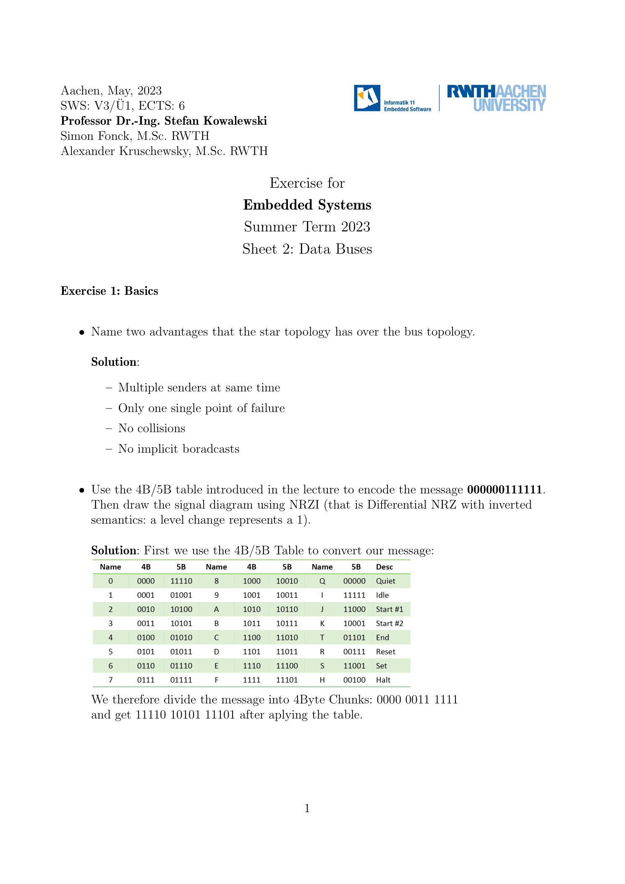

这页是 Sheet 2（Data Buses）里“基础”练习。两道题：①星型拓扑相对总线拓扑的优势；②把二进制消息用 4B/5B 编码，然后按 NRZI（电平变化代表 1）画信号时序。下面逐题讲清楚并给出可直接作答的要点。

---

## Exercise 1: Basics

### 1) 星型（Star）相比总线（Bus）的两个优势

**可写作答要点（任选其二即可，写 2–4 点更稳）：**

* **并发能力强**：交换机可同时转发多路通信，多个发送者可**同时**发送（对端不同端口互不干扰）。
* **无碰撞/冲突少**：每条链路点到点，\*\*没有“总线争用/冲突”\*\*问题，协议更简单、效率更高。
* **故障隔离好**：**单条支线故障只影响该节点**，不会像总线那样整条总线瘫痪，问题定位更快。
* **无隐式广播**：不会把帧自然广播到所有节点（交换式转发），**带宽与安全性更好**。

> 备注：题图里的“Only one single point of failure”常被视为**星型的劣势**（中心设备失效影响全网），但从“易于定位、集中管理”的角度也有人把它当作“运维上的优点”。考试作答时，以上四点任选两点即可。

---

### 2) 用 4B/5B 编码消息 **0000 0011 1111**，并按 **NRZI**（电平变化代表 1）画波形

#### (a) 4B/5B 映射

把消息按 4 位一组分块：

* `0000` → 查表得 **`11110`**
* `0011` → 查表得 **`10101`**
* `1111` → 查表得 **`11101`**

**拼接后的 4B/5B 码流**：

```
11110 10101 11101
```

即 **`111101010111101`**（15 位）。

> 这一行就是答案的第一部分：编码后的比特序列。

#### (b) 按 NRZI 规则画时序（“1=跳变，0=保持”）

* 设定**初始电平**（随意给定；常取 Low）。
* 扫描上面的 15 位码流，每遇到 **1** 就**翻转电平**，遇到 **0** 就**保持**。

参考“位 → 电平变化 → 新电平”的过程（初始 **L**）：

| 位序 | 比特 | 动作     | 新电平 |
| -- | -- | ------ | --- |
| 1  | 1  | toggle | H   |
| 2  | 1  | toggle | L   |
| 3  | 1  | toggle | H   |
| 4  | 1  | toggle | L   |
| 5  | 0  | hold   | L   |
| 6  | 1  | toggle | H   |
| 7  | 0  | hold   | H   |
| 8  | 1  | toggle | L   |
| 9  | 0  | hold   | L   |
| 10 | 1  | toggle | H   |
| 11 | 1  | toggle | L   |
| 12 | 1  | toggle | H   |
| 13 | 1  | toggle | L   |
| 14 | 0  | hold   | L   |
| 15 | 1  | toggle | H   |

把这些电平在等宽时间栅格上连成阶梯波形，就是 NRZI 信号图。
**画图要点**：位边界处按上表“toggle/hold”决定是否画一个**跳变**；“0”位是**水平延续**，“1”位是**出现跳变**。

---

## 小结（可直接誊到答案里）

* **星型优于总线的优势（任选两条）**：支持多发送者并发、无总线冲突/碰撞、故障局部化（单支路故障只影响一节点）、无隐式广播（带宽和安全更好）。
* **4B/5B 编码**：`0000 0011 1111` → `11110 10101 11101`。
* **NRZI 画法**：以“1=跳变、0=保持”逐位生成阶梯波；给出如上 15 位的跳变/保持序列即可。

---

## \[口语化表达]

这页做两件事：先说星型网络为什么比总线好——简单讲就是能多路同时传、不打架，出问题也只坏一条线；再就是把 `0000 0011 1111` 用 4B/5B 表格换成 `11110 10101 11101`，然后按 NRZI 规则画波形：看到 1 就翻电平，看到 0 就维持不动。你随便定个起始电平（比如低电平），按位往后走，哪儿是 1 你就画个跳变，哪儿是 0 就画水平线，连起来就是最终的时序图。


---

## 第 11 页

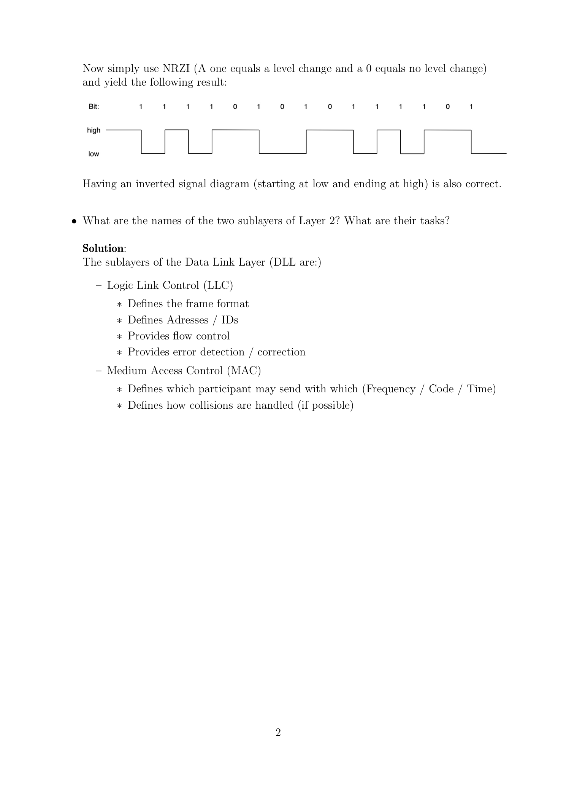

这页是上一题 4B/5B→NRZI 的**标准画法示意**，并新增一道关于\*\*OSI 第2层（数据链路层）\*\*子层的问答。下面分两部分解释。

---

## 1) NRZI 示意图说明（电平翻转代表 1，保持代表 0）

* 规则再次强调：**NRZI（反向 NRZ）**把**“1”编码为电平翻转**，把\*\*“0”编码为电平不变\*\*。
* 你把上一页得到的 4B/5B 结果（例如：`11110 10101 11101`）逐位应用这个规则，就能得到图中阶梯波形。
* **起始电平**可以任意（高或低均可）。图中也特别说明：**若你的时序从低开始、最后停在高电平，同样是对的**——只要“遇 1 翻转、遇 0 保持”的规则一致即可。
* 作图步骤小抄：

1. 选定初始电平；
2. 按位扫描比特流；
3. 画出每一位对应的“翻转/保持”；
4. 位宽一致、位边界清晰即可得分。

> 评分点一般看：是否遵守 NRZI 规则、位宽是否统一、位边界处是否正确翻转/保持。起始电平不作为扣分点。

---

## 2) Layer 2 的两个子层及其职责

**问：第 2 层（数据链路层，DLL）分成哪两个子层？分别负责什么？**

**答：**

* **LLC（Logical Link Control，逻辑链路控制子层）**

* **定义帧格式**（frame format）
* **地址/ID 定义**（如 SAP/DSAP/SSAP，或高层的标识映射）
* **流量控制**（Flow control）
* **差错检测/更正**（Error detection / correction），例如 FCS/CRC 等机制
* **MAC（Medium Access Control，介质访问控制子层）**

* **规定介质访问方式**与发送者何时如何发送（**频率/码型/时隙**等资源的分配与时序规则）
* **冲突/碰撞处理**（如果该介质存在碰撞的可能，如以太网的历史 CSMA/CD 模型，或在无线中做冲突避免）

> 记忆法：**LLC 管“帧与逻辑”、MAC 管“上链路、下介质”**。LLC 更偏“帧+寻址+可靠性”，MAC 更偏“谁能何时发、冲突怎么办”。

---

## \[口语化表达]

这页干两件事：第一，给你看 NRZI 的标准波形画法，提醒你只要“1 就翻转、0 就不变”，不管你从高电平还是低电平起步，最后画出来的形状都算对；第二，问数据链路层的两个子层——**LLC** 和 **MAC**。LLC 负责帧长啥样、地址怎么放、流控和检错；MAC 负责谁什么时候发、怎么占用介质以及碰撞怎么处理。记住：**LLC 管帧和可靠性，MAC 管上车发车（占用介质）**，这样就不容易混了。


---

## 第 12 页

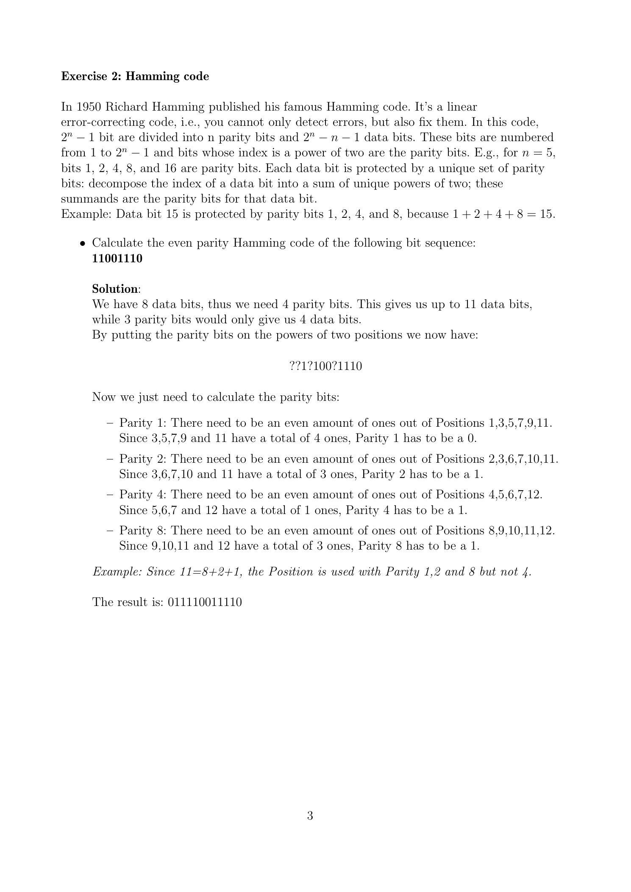

这页是 **Exercise 2: Hamming code**。题目让你用\*\*偶校验（even parity）\*\*的汉明码把 8 位数据 `11001110` 编成 12 位码，并解释做法。下面按步骤详细说明，最后给出结果与验证方法。

---

## 汉明码基本规则（本题用偶校验）

* 对于 **n** 个数据位，需要 **r** 个校验位，使得：
$2^r \ge n + r + 1$。
本题 $n=8$ ⇒ 取 $r=4$（因为 $2^4=16 \ge 8+4+1=13$）。
* 码长 = $n+r = 8+4 = 12$ 位，位置从 1 到 12 编号。
* **校验位放在位置为 2 的幂**：1、2、4、8。剩余位置放数据位。
* 每个校验位 $P_k$ 负责**二进制编号中第 k 位为 1**的所有位置（含自己）。

* $P_1$ 覆盖：1,3,5,7,9,11
* $P_2$ 覆盖：2,3,6,7,10,11
* $P_4$ 覆盖：4,5,6,7,12
* $P_8$ 覆盖：8,9,10,11,12
* **偶校验**：每个覆盖集合中 **1 的个数要为偶数**（和为 0 mod 2）。

---

## 第 1 步：把数据位放入非 2 的幂位置

数据序列：`11001110`（按从左到右，先放靠前的小编号）

* 非 2 的幂位置依次是：3,5,6,7,9,10,11,12
* 依次填入：1 1 0 0 1 1 1 0
于是 12 位骨架（用 `?` 代表未知校验位）为：

```
pos:  1 2 3 4 5 6 7 8 9 10 11 12
bit:  ? ? 1 ? 1 0 0 ? 1  1  1  0
```

---

## 第 2 步：逐个求校验位（偶校验）

* **P1（位1覆盖 1,3,5,7,9,11）**
已有 3,5,7,9,11 = 1,1,0,1,1 → 共 **4 个 1**（偶数），所以 **P1=0**。
* **P2（位2覆盖 2,3,6,7,10,11）**
3,6,7,10,11 = 1,0,0,1,1 → 共 **3 个 1**（奇数），要变偶数 ⇒ **P2=1**。
* **P4（位4覆盖 4,5,6,7,12）**
5,6,7,12 = 1,0,0,0 → 共 **1 个 1**（奇数），要变偶数 ⇒ **P4=1**。
* **P8（位8覆盖 8,9,10,11,12）**
9,10,11,12 = 1,1,1,0 → 共 **3 个 1**（奇数），要变偶数 ⇒ **P8=1**。

把这些校验位填回去：

```
pos:  1 2 3 4 5 6 7 8 9 10 11 12
bit:  0 1 1 1 1 0 0 1 1  1  1  0
```

---

## 结果 & 快速自检

* **最终偶校验汉明码**：`011110011110`
* 自检方法：对每个校验集合（如 P1 的 {1,3,5,7,9,11} 等）统计 1 的个数，都是偶数即可。
* 位置与覆盖集合理解技巧：任意位置号的二进制分解决定它归哪些校验位管。
例如 **11** 的二进制是 $8+2+1$ ⇒ 由 **P8、P2、P1** 共同覆盖（不受 P4 影响）。

---

## \[口语化表达]

这题就是把 8 位数据用汉明码包起来。先算需要 4 个校验位，所以总长 12 位；把校验位放在 1、2、4、8 位置，其他位置按顺序塞上 `11001110`。然后按“偶校验”算出每个校验位：看它负责的那堆位置里 1 的个数，如果是奇数就把这个校验位设成 1，让总数变偶数。最后算出来是 `011110011110`。想检查对不对，就把每个校验集合再数一遍 1 的个数，都是偶数就稳了。


---

## 第 13 页

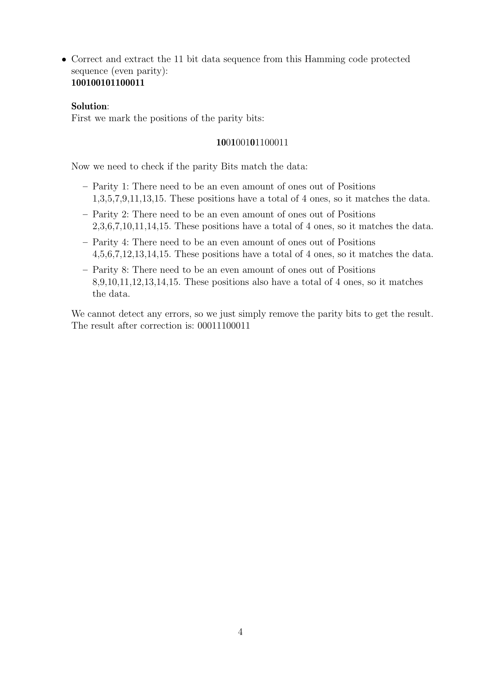

这页是在做**汉明码（偶校验）纠错与解码**：
给定一段**含 4 个校验位、总长 15 位**的码字，先检查是否出错，再提取其中的 **11 位原始数据**。

---

## 题目

**纠正并提取**下面这段偶校验汉明码中的 11 位数据：

```
100100101100011
```

---

## 详细解题步骤

### 1) 标出校验位位置并编号

对 15 位从左到右编号为 1..15。**校验位在 2 的幂位置**：1、2、4、8；其余位置为数据位。

```
位号:  1  2  3  4  5  6  7  8  9 10 11 12 13 14 15
比特:  1  0  0  1  0  0  1  0  1  1  0  0  0  1  1
^  ^     ^                 ^
P1 P2    P4                P8        （P=Parity）
```

### 2) 逐个校验（偶校验）

每个校验位覆盖“**二进制位号中对应位为 1**”的所有位置（含自身），并要求**覆盖集合内 1 的个数为偶数**：

* **P1** 覆盖：1,3,5,7,9,11,13,15
本码字这些位置的 1 的个数 = 4（偶数）→ **通过**
* **P2** 覆盖：2,3,6,7,10,11,14,15
个数 = 4 → **通过**
* **P4** 覆盖：4,5,6,7,12,13,14,15
个数 = 4 → **通过**
* **P8** 覆盖：8,9,10,11,12,13,14,15
个数 = 4 → **通过**

> 也可把四个校验的结果组成“综合症”$s_8 s_4 s_2 s_1$；这里为 **0000**，表示**无单比特错误**。

### 3) 无错误 → 去掉校验位，读出 11 位数据

删除位号 1、2、4、8 后，保留其余位置（3,5,6,7,9,10,11,12,13,14,15）：

```
数据位依次为：0 0 0 1 1 1 0 0 0 1 1
```

**解码结果：**

```
00011100011
```

---

## 关键点速记

* 15 位 = 11 数据 + 4 校验（位置 1,2,4,8）。
* **偶校验**：覆盖集合中 1 的个数为偶数。
* **综合症非零** → 指示出错位置（把对应位翻转）。综合症零 → 直接删除校验位取数据。

---

## \[口语化表达]

这页就是给你一串 15 位的汉明码，问有没有错，顺便把 11 位的数据拿出来。做法很固定：先把 1、2、4、8 号位当校验位，其它是数据位；然后按偶校验去数每个校验集合里 1 的个数，发现全是偶数，说明没错。既然没错，就把 1、2、4、8 这些校验位扔掉，按剩下的位置顺序读出来就是 `00011100011`。如果哪天数出来不全是偶数，把四个校验的结果拼成综合症，对应的位号就是要翻转的那个比特。


---

## 第 14 页

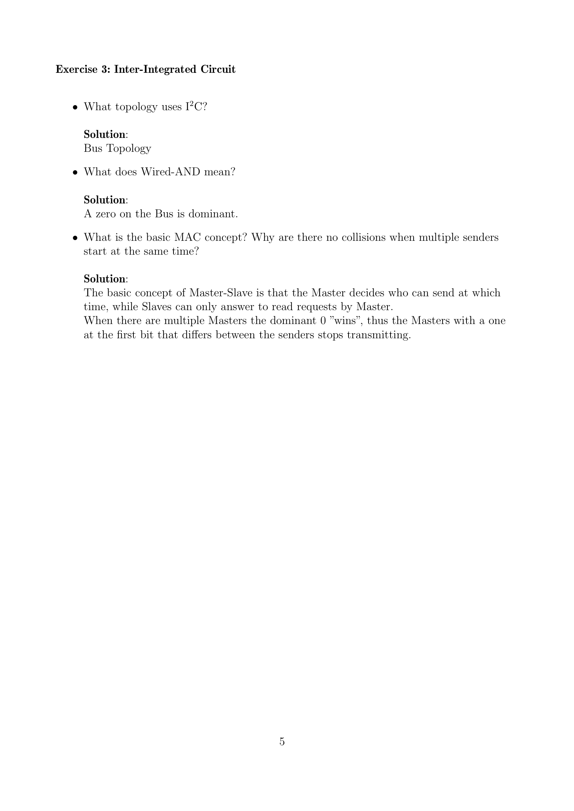

这页讲的是 **I²C 总线（Inter-Integrated Circuit）** 的基本概念，包括它用的拓扑结构、什么叫“Wired-AND（线与）”，以及它的**介质访问控制（MAC）机制**。下面详细解释：

---

## 🧩 Exercise 3: Inter-Integrated Circuit

### **1️⃣ What topology uses I²C?**

**题意：**
I²C 使用哪种总线拓扑结构？

**答案与解释：**
✅ **Bus Topology（总线拓扑）**。
所有 I²C 器件——无论主机（Master）还是从机（Slave）——都并联在同一两根信号线上：

* SDA（数据线）
* SCL（时钟线）
这两根线通过上拉电阻连接到电源，所有设备共用这两条线进行通信，所以是**总线型结构**。

---

### **2️⃣ What does Wired-AND mean?**

**题意：**
什么是“有线与（Wired-AND）”？

**答案与解释：**
✅ **“总线上 0 为主导信号”。**

在 I²C 中，SDA 和 SCL 线都由\*\*开漏（open-drain）/开集（open-collector）\*\*输出组成。
这意味着设备只能拉低信号线（输出 0），不能主动输出高电平（1 由上拉电阻提供）。
因此，如果某设备输出 0，而另一个设备想输出 1，线路最终被拉成 0：
这相当于 **逻辑 AND（1 AND 0 = 0）**，所以叫 “Wired-AND”。

**关键理解：**

* 所有设备“共享”线；
* 若任何一方拉低，整线就是低电平（0 优先、0 主导）。

---

### **3️⃣ What is the basic MAC concept? Why no collisions when multiple senders start at the same time?**

**题意：**
I²C 的基本访问控制机制是什么？为什么多个主机同时发送不会产生冲突？

**答案与解释：**
✅ **核心机制：Master-Slave + 仲裁（Arbitration）。**

* I²C 是**主从结构（Master-Slave）**：
主机（Master）控制通信时序和发起命令，从机（Slave）只能响应主机。

* **多主机情况下的仲裁机制（Arbitration）：**
当两个主机同时尝试发送时，它们都在监视总线电平：

* 如果某主机在输出 1（释放线为高），但检测到线被拉低（别人输出了 0），它就知道自己“输掉仲裁”并立刻停止发送。
* 因为 0 为主导（Wired-AND），不会产生电平冲突——只会让“0 主导的发送者”继续。

所以，**没有冲突（no collision）** 是因为：

> 线路电平由“有线与”规则自动决定；输掉仲裁的设备检测到 0 优先后会停止发信。

---

## 🧾 总结归纳

* **拓扑结构：** I²C 使用**总线型拓扑**（两线 SDA + SCL）。
* **Wired-AND：** 所有设备以开漏方式连接，“0 优先”，线电平相当于逻辑 AND。
* **MAC 原理：** 主从模式 + 多主仲裁。多个主机同时发送时，因“0 主导”机制，输掉仲裁的主机会停止，从而**避免物理冲突**。

---

## \[口语化表达]

这页讲 I²C 总线怎么防撞车。首先它是两根线的**总线结构**，大家都接在一起；然后它用的是**开漏输出**，也就是“线与（Wired-AND）”——谁拉低谁说了算，所以 0 是主导信号。最后讲它的**仲裁机制**：如果两台主机同时发，谁先发出 0 就赢；另一台发现自己发 1 却被拉成 0，就自动停下来。这种设计让多主机并行时不会打架，线路上永远不会出现真正的电平冲突。


---

## 第 15 页

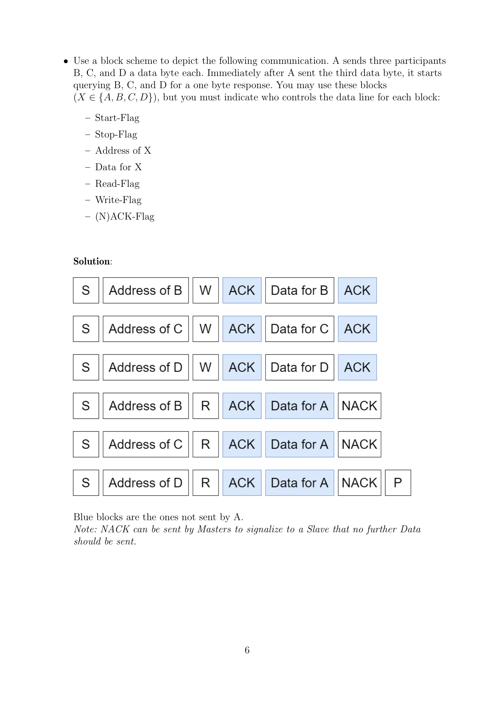

这页要你用**I²C 的块图（block scheme）**把一段通信过程画出来，并标明**每个块是谁在“驱动数据线”（SDA）**。题目描述是：
A 先分别**给 B、C、D 各写入 1 字节数据**；紧接着 A 又依次**向 B、C、D 读取 1 字节响应**。可用的块包括：Start/Stop、Address of X、Data for X、R/W、(N)ACK，并且要标注数据线控制者。

下面按顺序说明怎么画、谁在发。

---

## 1) A 向 B、C、D 写 1 字节（Write）

每个“写 1 字节”的序列如下（蓝色块=**不是 A 发送的**，即从机发的）：

1. **S**（Start，A 发送；SCL 高时 SDA 从高→低）
2. **Address of X**（A 发送：7bit/10bit 地址 + 接着的 R/W 位之前的地址部分）
3. **W**（A 发送：R/W=0 表示写）
4. **ACK**（**从机 X 发送**：X 拉低 SDA 一个时钟表示应答）
5. **Data for X**（A 发送：1 字节数据）
6. **ACK**（**从机 X 发送**：收到数据后的应答）

把 X 分别替换成 B、C、D，就得到三段：
`S – Address of B – W – (B)ACK – Data for B – (B)ACK`
`S – Address of C – W – (C)ACK – Data for C – (C)ACK`
`S – Address of D – W – (D)ACK – Data for D – (D)ACK`

> 要点：在写周期中，**数据线几乎一直由 A 驱动**（地址、W 位、数据字节），**ACK 由被寻址的从机**拉低 SDA 给出。

---

## 2) A 向 B、C、D 各读 1 字节（Read）

每个“读 1 字节”的序列如下：

1. **S**（A 发送 Start 或重复起始）
2. **Address of X**（A 发送）
3. **R**（A 发送：R/W=1 表示读）
4. **ACK**（**从机 X 发送**：应答地址阶段）
5. **Data for A**（**从机 X 发送**：把 1 字节数据放到 SDA 上）
6. **NACK**（**A 发送**：读完最后一个字节后，A 用 NACK 告诉从机“不要再发了”）

对 B、C、D 依次读，最后一个读完后再发 **P**（Stop）：
`S – Address of B – R – (B)ACK – (B)Data – A:NACK`
`S – Address of C – R – (C)ACK – (C)Data – A:NACK`
`S – Address of D – R – (D)ACK – (D)Data – A:NACK – P`

> 要点：在**读周期**里，**数据字节由从机驱动**，最后一个字节后**NACK 由主机 A 送出**，表示结束本次读；然后 A 发送 **P** 结束总的传输。
> 说明里的注记也强调：**Master 可以发送 NACK 来告知 Slave 不再需要更多数据**。

---

## 3) 谁在控制 SDA（速查表）

* **Start/Stop**：A
* **Address / R / W / 写入的数据**：A
* **ACK（地址阶段/写阶段后）**：被寻址的**从机**
* **读到的数据**：被寻址的**从机**
* **NACK（读最后一字节后）**：A

---

## 4) 与图中解答一致的整体串联

* 写三次：`S Addr(B) W ACK Data(B) ACK` → `S Addr(C) W ACK Data(C) ACK` → `S Addr(D) W ACK Data(D) ACK`
* 读三次：`S Addr(B) R ACK Data→A NACK` → `S Addr(C) R ACK Data→A NACK` → `S Addr(D) R ACK Data→A NACK P`
* **蓝色块为非 A 发送**（即从机的 ACK、从机发送的数据字节）。

---

## \[口语化表达]

这页就是把一段 I²C“先写后读”的流程拆成小块。写的时候：A 发起 S、发地址和 W、从机回 ACK，A 发 1 字节数据，从机再回 ACK——对 B/C/D 连做三遍。读的时候：A 再 S、发地址+R，从机 ACK 后由从机把 1 字节数据丢到 SDA 上，A 用 NACK 表示“就要这一字节”，对 B/C/D 也各来一遍，最后 A 发 P 结束。记住谁在开口：**地址/读写位/写数据是 A 说，ACK 是从机点头，读数据是从机说，最后一个 NACK 是 A 说不要了**，就不会搞错谁在驱动数据线。


---

## 第 16 页

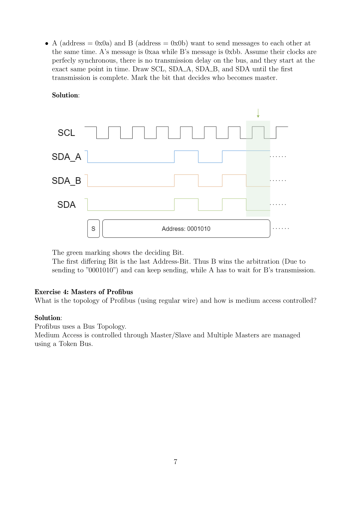

这页有两道题：上半是 **I²C 仲裁与时序**，下半是 **Profibus 的拓扑与介质访问控制**。我分别讲清楚原理、谁赢仲裁、为什么，以及 Profibus 的做法。

---

## 题 1｜I²C：两主机同时发报文时，谁赢仲裁？

**题目设定**

* 设备 A 的地址：`0x0a`（二进制 7bit：`0001010`）
* 设备 B 的地址：`0x0b`（二进制 7bit：`0001011`）
* **两者要互相发送**：A 要发给 B（所以 A 在地址阶段发送 **0x0b**），B 要发给 A（所以 B 发送 **0x0a**）。
* 两主机**完全同步**，同时发 **Start**，SCL 同步，没有延时。
* 让你画 **SCL、SDA\_A、SDA\_B、SDA（总线实际电平）**，并**标出决定胜负的比特**；一直画到**第一次传输结束**为止。

**关键规则回顾**

* I²C 是 **开漏/开集 + 上拉**，总线为 **Wired-AND（线与）**：**0 优先**。
* **仲裁只看 SDA**：若某主机想送“1”，却读到总线是“0”，它就**输掉仲裁并立即停止发送**。
* 开始阶段两主机都发 **Start**，然后**发送“目标从机地址 + R/W 位”**。在**第一个不同的比特**处决出胜负。

**这题的具体对比**

* 目标地址位流（MSB→LSB）：

* A 要发给 B：A 发送 **`0001011`**（0x0b）
* B 要发给 A：B 发送 **`0001010`**（0x0a）
* 前 6 位相同：`000101`。**最后一位不同**：

* A 发送 **1**
* B 发送 **0**
* 因为 **0 主导**，总线 SDA 取 0。**A 看到自己想送 1 却读到 0 → A 输**；**B 赢得仲裁**。
* 这也正是图上绿色高亮区域标出的**决定性比特（最后一位地址位）**。
* **赢者（B）继续**完成本次传输（发送地址的 R/W 位、等待 ACK、发送/接收数据……），**输者（A）让路并等待**，之后再重试。

> 题干给的“消息 0xaa / 0xbb”是**后续数据字节**，仲裁在**地址阶段**就已分出胜负，所以数据内容不影响仲裁结论。

**你在纸上该怎样画**（要点）

1. 画一条方波 **SCL**（统一时钟）。
2. 画 **SDA\_A**：按 A 的目标地址比特流（`0001011`）逐位在 SCL 高期间稳定输出；
3. 画 **SDA\_B**：按 B 的目标地址比特流（`0001010`）；
4. 画 **SDA（总线）**：逐位取二者线与结果（谁拉 0 就是 0）。
5. 在**最后一位地址位**处做高亮标记，注明“此位决定仲裁：B=0 胜，A=1 败”。
6. 从此处开始 **SDA\_A 释放总线**（保持高阻，仅监听），**SDA**后续只跟着 B 的数据直到一次传输结束（接着会出现 ACK、数据、Stop 等）。

---

## 题 2｜Profibus：拓扑与介质访问控制

**答案要点**

* **拓扑**：**总线拓扑（Bus Topology）**（常规双绞线 RS-485 物理层）。
* **介质访问控制**：

* **主从（Master/Slave）** 轮询从站；
* **多主场景**采用 **Token Bus**：只有拿到\*\*令牌（Token）\*\*的主站才可发起报文，令牌在主站间按顺序轮转，从而避免碰撞与争用。

> Profibus 是**工业自动化领域最常用的一种现场总线（Fieldbus）标准**，全称 **PROcess FIeld BUS**。  
> 它诞生于 1989 年德国，由多家自动化厂商联合制定，目的是把 PLC、驱动器、传感器、执行器等设备**用一根双绞线串起来**，统一、实时、可靠地交换数据。
>
> ---
>
> ### 1. 一句话记住
> > **Profibus = 工业版的“以太网+USB”混合体**：  
> > 既像以太网一样**组网灵活**，又像 USB 一样**即插即用、主从轮询**，但比二者都**抗干扰、实时**。
>
> ---
>
> ### 2. 核心角色
> | 角色               | 类比                    | 任务                               |
> | ------------------ | ----------------------- | ---------------------------------- |
> | **主站（Master）** | USB-Host / 以太网交换机 | 主动发问卷：轮询、写参数、发指令   |
> | **从站（Slave）**  | USB-Device / 终端设备   | 被动答问卷：回传测量值、状态、报警 |
>
> ---
>
> ### 3. 物理层 & 拓扑
> - **总线拓扑**（一根双绞线从头拉到尾）  
> - **RS-485 差分信号**，波特率 9.6 k ~ 12 Mbit/s，最大 1200 m  
> - **DB9 或 M12 接头**，终端电阻 220 Ω，即插即用
>
> ---
>
> ### 4. 介质访问控制（MAC）
> 1. **主从轮询**（常规）  
>    主站按顺序“点名”→ 从站立刻回答 → 无碰撞、确定时延。
>
> 2. **令牌环（Token Bus）**（多主场景）  
>    令牌在主站间顺时针传递 → 谁拿到谁发言 → 避免多主争用。
>
> ---
>
> ### 5. 典型应用场景
> - 汽车焊装线：机器人 PLC 通过 Profibus 控制 200 个伺服驱动器  
> - 污水处理厂：主站 PLC 轮询 150 个远程 I/O 模块、变频器  
> - 包装机：主站每 10 ms 读取编码器、控制切刀气缸
>
> ---
>
> ### 6. 口语化总结
> > **Profibus 就是“工业现场的高速公路”**：  
> > 主站像交警，轮流点名；从站像车辆，依次回答；  
> > 令牌像红绿灯，多主时谁拿到谁通行——**既不掉线，也不撞车。**

---

## \[口语化表达]

这页说的是 I²C 多主仲裁的“赢法”。A 想发给 B，就在地址阶段送 `0001011`；B 想发给 A，就送 `0001010`。前面都一样，最后一位一个是 1、一个是 0，**0 优先**，所以 **B 赢、A 让**。你画图时就把 SCL 画出来，再画 A 想送的 SDA\_A、B 想送的 SDA\_B，最后把两条按“谁拉低听谁的”合成出总线 SDA，并把最后那一位圈起来：它决定胜负。下面那题更好记：Profibus 是**总线**，主从轮询；多主就**传令牌**，谁拿到谁说话，不会冲突。


---

## 第 17 页

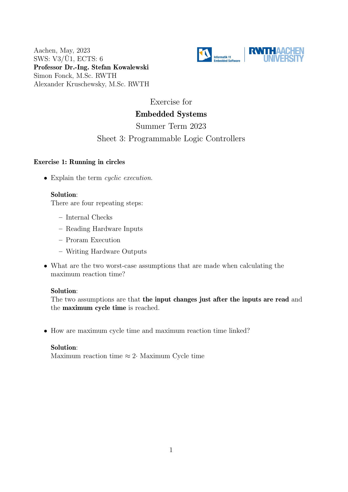

这张嵌入式系统习题纸在讲 **PLC（可编程逻辑控制器）“循环执行”** 的基本时序和**最坏情况反应时间**该怎么算。下面逐条用中文、口语化解释：

---

### 1. 什么是 cyclic execution（循环执行）？

想象 PLC 就是一个**永不休息的巡检员**，每一步都按固定节拍走：一句话：
**PLC 做这些“自检→采样→算账→输出”的循环，是为了让工厂设备“既快又稳还不死机”，而且成本低、易维护。**

| 步骤                         | 类比   | 中文解释                                      |
| ---------------------------- | ------ | --------------------------------------------- |
| **Internal Checks**          | 自检   | 看门狗、内存校验，保证自己没“生病”            |
| **Reading Hardware Inputs**  | 采开关 | 把现场所有按钮、传感器的状态读进来            |
| **Program Execution**        | 算逻辑 | 根据用户写的梯形图/指令表，算一遍输出该是什么 |
| **Writing Hardware Outputs** | 写输出 | 把算好的结果真正写到继电器、阀门、电机驱动器  |

四步跑完→**立刻再跑一遍**，这种“死循环”就叫 **cyclic execution**。

---

### 2. 算“最大反应时间”时，要做的两个最坏假设

**反应时间** = 从“输入变化”到“输出动作”之间最多能等多久。  
为了**绝不超时**，工程师按**最倒霉**的场景算：

1. **输入刚好错过本次采样**  
   输入信号在“读输入”完成后**立刻**翻转 → 本轮完全察觉不到，必须等下一轮循环才能被采到。  
   ➜ **白白多等一个周期**。

2. **本轮循环跑到允许的最大时长**  
   程序里分支最多、通讯最忙、中断最密集时，周期被拉到**规格书上写的上限 Tmax**。  
   ➜ **每一步都以最慢速度跑完**。

3. > 用**“赶公交车”**的例子，一句话就能体会：
   >
   > ---
   >
   > ### 1. **输入刚好错过本次采样**  
   > → 你赶到车站时，**前门刚关上**，司机一脚油门走了。  
   > 你只能**等下一班车**（多等一个周期）。
   >
   > ---
   >
   > ### 2. **本轮循环跑到允许的最大时长**  
   > → 下一班车**开得最慢**，路上每站都堵到限速上限，**用满全程最大时长**。  
   > 你**又多等了一班最慢的**。
   >
   > ---
   >
   > ### 3. 于是“最大反应时间”就是
   > > **两班最慢的车** → **2 × 最大班距（周期）**
   >
   > ---
   >
   > ### 🔚 口语总结
   > > **信号就像乘客：**
   > >
   > > 1. 刚到站车就关门 → 白等一班  
   > > 2. 下一班车又开得最慢 → 再拖一班  
   > >
   > > 所以**最倒霉也就等两班**，这就是“最大反应时间 ≈ 2 × 最大循环时间”。

---

### 3. 最大反应时间与最大循环时间的关系

在最坏组合下：  
- 输入等一个周期才被采到；  
- 采完后又要跑完一个**完整最大周期**才能输出；  

⇒ **最大反应时间 ≈ 2 × 最大循环时间**  
（公式里写作“~2·Tcycle”）

---

### 🔚 口语化总结

> **PLC 像个不停转圈的巡检员：采样→算账→写输出→再转圈。**  
> 算“最坏反应时间”时，我们假设：  
> ① 信号刚好错过本轮采样（白等一圈）；  
> ② 每一圈都跑到最慢上限（再拖一圈）。  
> 所以**最倒霉也就等两圈**，这就是“最大反应时间 ≈ 2 倍最大循环时间”的由来。


---

## 第 18 页

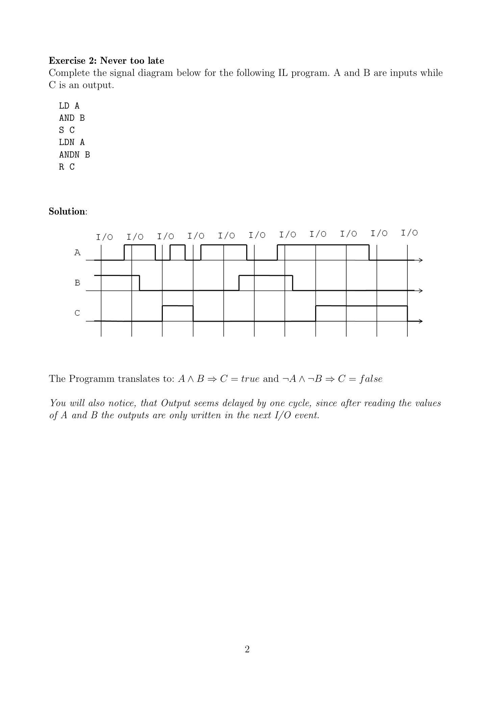

这页是可编程逻辑控制（PLC）里 **IL（Instruction List）指令**配合**I/O 扫描时序**的题。A、B 是输入，C 是输出。让你“补全波形”并理解程序逻辑与一拍延迟。给出的 IL 代码：

```
LD  A        ; 载入A
AND B        ; 与B
S   C        ; 若当前累积结果=1，则置位（Set）输出线圈C

LDN A        ; 载入 非A
ANDN B       ; 与 非B
R   C        ; 若当前累积结果=1，则复位（Reset）输出线圈C
```

---

## 1) 把 IL 代码翻译成逻辑

* `LD A; AND B; S C` 这三条等价于：**如果 A ∧ B 为真 → 置位 C**
* `LDN A; ANDN B; R C` 等价于：**如果 ¬A ∧ ¬B 为真 → 复位 C**
* 其余情况（A、B一高一低）两段条件都不成立，**C 保持上一周期的状态**（因为是置/复位线圈，没命中就不改动）。

因此可用一句话概括程序功能：

> **A 与 B 全 1 → C=1；A 与 B 全 0 → C=0；否则（一个1一个0）→ C 保持**。

两段条件互斥（不可能同时满足），所以不会有“同周期既置位又复位”的冲突。

---

## 2) 为什么波形看起来延迟一拍？

图上每个 “I/O” 竖线表示一次**I/O 扫描周期边界**：
PLC 的典型循环是 **读输入快照 → 执行逻辑 → 写输出**。这意味着：

* 本周期读到的 A、B 值，用来**决定在下一个 I/O 边界时**写出的 C。
* 视觉效果：**C 相对 A、B“滞后一格”**（一拍延迟）。

因此在你补图时要遵守：

* 在**第 n 个 I/O 标记**处读取 A、B 快照；
* 用上面的逻辑判断“要不要对 C 置位/复位”；
* **到第 n+1 个 I/O 标记**，C 才体现本次判定的结果。

---

## 3) 如何补全时序图（操作方法）

逐个 I/O 周期检查 A、B 的组合，按下表决定“下一拍的 C”：

| 当拍读到 A | 当拍读到 B | 当拍动作      | 下拍 C |
| ------ | ------ | --------- | ---- |
| 1      | 1      | `S C`（置位） | 1    |
| 0      | 0      | `R C`（复位） | 0    |
| 1      | 0      | 无动作       | 维持上拍 |
| 0      | 1      | 无动作       | 维持上拍 |

按这个规则走完整条时间轴，就能得到解答图（图中 C 的阶梯正是“延后一拍”的结果）。

---

## 4) 和图上解答的一致性

* 在 A、B 同为 1 的平台段结束后 **下一次 I/O**，C 上升为 1；
* 在 A、B 同为 0 的平台段结束后 **下一次 I/O**，C 下降为 0；
* 其余“分歧段”（A≠B）时，C 水平保持不变。
* 因为“读—算—写”的顺序，**看起来就像 C 始终比 A、B 晚一格**。

---

## 5) 小坑提示

* `S C` / `R C` 是**线圈型指令**，是对输出**锁存**的操作，不同于“直接赋值”；
* 若本周期既没有命中置位也没有命中复位，**C 不改变**；
* 本程序两条件互斥，因此不需要考虑优先级竞争；
* 时序题评分重点是：**一拍延迟**与**保持行为**是否正确体现。

---

## \[口语化表达]

这段 IL 干的事特简单：A、B 都是 1，就把 C 置 1；A、B 都是 0，就把 C 清 0；要是一个 1 一个 0，那就别动 C，保持原样。注意 PLC 是“读输入→跑逻辑→下一拍才把输出写出去”，所以你会看到 C 永远**比 A、B 晚一格**。补图时就按每个 I/O 竖线去读 A、B，套表：11→下拍 C=1，00→下拍 C=0，10/01→C 不变。这样画出来就和答案图完全一致了。


---

## 第 19 页

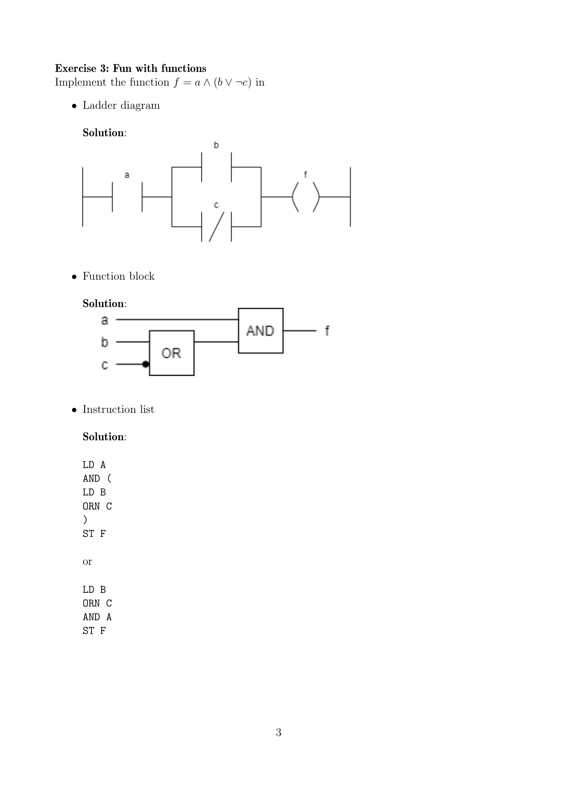

这页题叫 **“Fun with functions”**，考察如何在三种 PLC 编程语言表示逻辑函数

$$
f = a \land (b \lor \neg c)
$$

也就是 “f = a AND (b OR NOT c)”。
题目要求你分别用**梯形图（Ladder Diagram）**、**功能块（Function Block）**、和**指令表（Instruction List, IL）** 实现这条逻辑。下面是完整讲解。

---

## 一、逻辑函数分析

先把表达式看清楚：

$$
f = a \land (b \lor \neg c)
$$

意思是：

* 当 **a** 为真（开关 a 导通）；
* 同时 **(b 或 非c)** 为真，也就是说：

* 要么 b 导通；
* 要么 c 断开；
* 这两部分同时成立时，输出 **f = 1（动作）**。

---

## 二、梯形图（Ladder Diagram）实现思路

### 图中说明：

* 左边电源线代表输入信号源；
* 最右边线圈代表输出 f；
* “| |” 表示常开触点（条件真时导通）；
* “|/|” 表示常闭触点（条件假时导通）。

### 逻辑组合：

* a


---

## 第 20 页

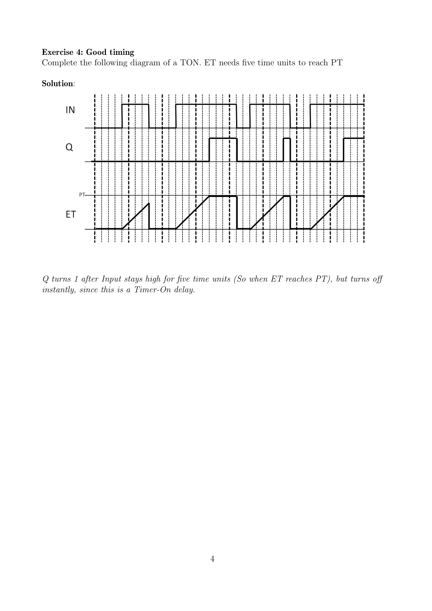

这页是 **Exercise 4: Good timing**，考察 PLC \*\*TON（Timer ON-delay，上电延时定时器）\*\*的时序图补全。题面给出：**ET 需要 5 个时间单位到达 PT**。要求根据输入 **IN** 的波形，把 **Q**（定时器触点输出）和 **ET**（当前经过时间）画出来。

> 这张练习讲的是 **PLC 里的“通电延时定时器”——TON（Timer ON-delay）** 的时序图。  
> 把 **TON** 想成**“厨房定时器”**：  
> - **IN** 是你按住开关；  
> - **PT** 是你设定的 5 分钟；  
> - **ET** 是已经走了多久；  
> - **Q** 是定时器到点后的铃声。
>
> ---
>
> ### 1. 四个脚死记硬背
>
> | 脚名   | 含义     | 厨房比喻               |
> | ------ | -------- | ---------------------- |
> | **IN** | 启动信号 | 你用手指一直按住定时器 |
> | **PT** | 预设时间 | 你拧到 5 分钟          |
> | **ET** | 已走时间 | 定时器内部“滴滴”计数   |
> | **Q**  | 输出线圈 | 到点后铃声响起         |
>
> ---
>
> ### 2. TON 的“厨房规则”
>
> 1. **必须按住 ≥ PT** 才响铃（Q=1）。  
> 2. **中途松手**（IN=0）→ 计时清零，铃声不响。  
> 3. **响铃后一松手** → 铃声立刻停（Q=0），计时器归零。
>
> ---
>
> ### 3. 把题目波形翻译成“厨房对话”
>
> ```
> IN  ━━━━━■■■■■■■■■□□□
> ET  ━━━━━□→→→→→→→□
> Q   ━━━━━□□□□□□□□■□
>       0 1 2 3 4 5
> ```
>
> - **0→5 时间单位**：你一直按住 IN，ET 从 0 加到 5。  
> - **第 5 单位**：ET=PT=5 → 铃声 Q 立刻变 1。  
> - **第 5 单位后**：IN 松手 → 铃声 Q 瞬间变 0，ET 归零。
>
> ---
>
> ### 🔚 一句话背下来
>
> > **TON = 通电延时定时器**：  
> > **按住满 PT 秒才响，松手立刻停**——这就是 TON 的“Good timing”。

---

## TON 的工作规则（本题版）

1. **IN=1 时**：ET 以固定斜率从 0 开始计时；达到 **PT（预置时间）** 时，**Q=1**。
2. **IN=0 时**：**Q 立即变 0**（无保持）；**ET 立即清零**。
3. **IN 一直为 1** 且 ET ≥ PT：**Q 保持 1**；在 IEC TON 里 **ET 饱和在 PT**（不再上升）。
4. **若 IN 在到达 PT 之前掉为 0**：ET 被清零，**Q 从未置 1**。

> 本题 PT=5 个时间格；图上竖向虚线每格代表 1 个时间单位。

---

## 画图步骤（按时间从左到右）

### 1) 先看 **IN** 的每个高电平“脉冲”

* **脉冲宽度 <5**：

* 从该脉冲起点开始，**ET 画上升斜坡 0→…**，但在 5 之前 IN 已经掉到 0，**ET 直接掉到 0**；
* **Q 始终为 0**（因为没等够 5）。
* **脉冲宽度 ≥5**：

* 从起点画 **ET 斜坡**，在第 5 个时间格**到达 PT**；
* **到达 PT 的瞬间把 Q 拉高**；
* 若 IN 仍保持高，**ET 画平顶（=PT）**；
* 当 IN 下降到 0 时，**Q 立即掉到 0，ET 同时回到 0**。

### 2) 把所有脉冲按上面规则串起来

* 你会得到一条 **“锯齿/阶梯”形的 ET 曲线**：

* 每次 IN 上升→ET 由 0 斜升；
* 够 5 则到 PT 并保持；
* IN 一落→ET 掉回 0。
* **Q** 的轨迹：

* 只有在 **ET 刚到 PT 时跳为 1**；
* **IN 一落立刻变 0**。
* 所以 Q 的高电平段**总是从“IN 变高后第 5 格”开始，到“IN 变低那一刻”结束**。

---

## 与答案图关键点对上

* 你能看到多次 **IN 的窄脉冲**没撑到 5 格，**ET 每次都来不及到 PT 就清零**，**Q 不曾为 1**。
* 对那些 **宽度≥5 的高电平**，**ET 爬到 PT 后画平顶**，**Q 同时置 1**，直到 IN 掉下来的那个瞬间，**Q 立即清 0，ET 回 0**。
* 因为是 **TON（上电延时）**，**Q 的关闭没有延时**（题下注释也写了：*“Q turns 1 after Input stays high for five time units … but turns off instantly, since this is a Timer-On delay.”*）。

---

## 快速判定口诀

* **五格起**：IN 连续高 **满 5 格**，Q 才会从那一刻起为 1；
* **立刻灭**：IN 一降为 0，Q 立刻为 0，ET 立刻清零；
* **锯齿 ET**：每个高脉冲都让 ET 从 0 往上爬，够 5 就顶在 PT，不够就掉回 0。

---

## \[口语化表达]

这题就是在认 TON 的脾气：输入 IN 只要拉高，ET 就开始往上“充电”；连着高够 **5 格**，Q 才点亮；IN 一掉回 0，Q 立刻灭，ET 也立刻清零。所以你画图时，每一个高脉冲都给 ET 画个上升斜坡，够 5 的就顶到 PT 并把 Q 拉高，不够 5 的就直接掉回 0 而 Q 始终不亮；等 IN 掉下去那一瞬间，把 Q 拉回 0、ET 拉回 0。照这个规则从左到右补完，波形就和答案一模一样。


---

## 第 21 页

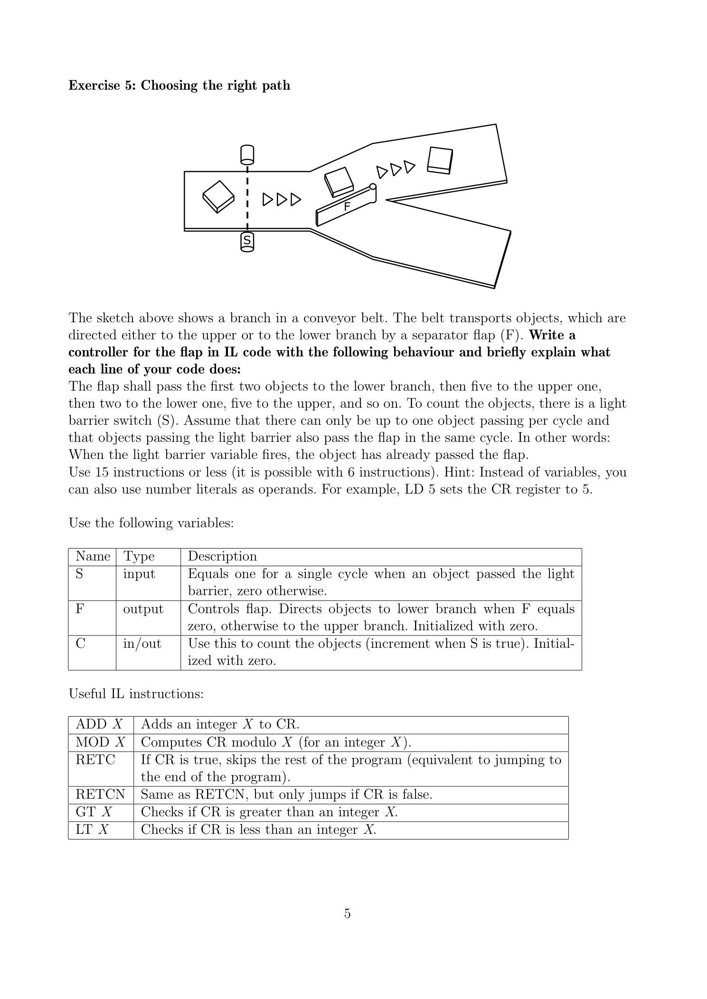

这页是 **Exercise 5: Choosing the right path**（选择正确路径）
这题讲的是输送带分流控制，用 **IL（指令表）编程**实现“**前两个物体走下支路，接下来的五个走上支路，然后重复**”的逻辑。

---

## 🧭题目解析

输送带有一个**分叉口**，分流由一个\*\*拨片（Flap, F）\*\*控制：

* **F = 0** → 物体进入**下支路**；
* **F = 1** → 物体进入**上支路**。

每当有一个物体经过光电传感器 **S** 时，S 会在那一周期内为 **1**（之后又回 0）。
这个传感器的信号代表“有物体通过了”，因此我们用它来**计数**。

要实现的逻辑：

* **前 2 个物体** → F = 0（下支路）；
* **接下来的 5 个物体** → F = 1（上支路）；
* 然后循环。

---

## ⚙️可用变量说明

| 名称    | 类型    | 含义                      |
| ----- | ----- | ----------------------- |
| **S** | 输入    | 光幕信号（每当一个物体通过，S=1 一个周期） |
| **F** | 输出    | 拨片方向（0=下支路，1=上支路）       |
| **C** | 输入/输出 | 计数器，用来计物体数量（初始化为 0）     |

---

## 🧩有用指令

* `ADD X`：计数加 X；
* `MOD X`：对 X 取模；
* `GT X`：判断寄存器 > X；
* `ST X`：存储；
* `LD X`：加载；
* `RETCN`：若条件不满足则跳过剩余程序。

---

## ✅IL 程序示例

```il
LD  C         ; 载入计数值到寄存器 CR
MOD 7         ; 取模 7，得到当前周期的位置（0~6）
GT  1         ; 若 >1，则说明是第3到第7个物体（应走上支路）
ST  F         ; 将结果写入 F (0=下, 1=上)

LD  S         ; 检查是否有新物体
RETCN         ; 若 S=0，则不继续执行
LD  C         ; 重新载入 C
ADD 1         ; 计数 +1
ST  C         ; 保存新值
```

---

## 🧠逐行详解

1. **LD C**：载入当前已通过的物体数量。
2. **MOD 7**：每 7 个物体为一个循环（2 下 + 5 上 = 7）。
3. **GT 1**：判断当前计数是否大于 1；若大于 1，CR=1，否则 CR=0。

* 即第 0、1 号（第 1、2 个）走下；
* 第 2～6 号（第 3～7 个）走上。
4. **ST F**：把结果存到 F，即设置拨片方向。
5. **LD S**：读取传感器状态。
6. **RETCN**：若没有检测到物体（S=0），跳过剩下的计数部分。
7. **LD C / ADD 1 / ST C**：若 S=1，说明有新物体通过，就把 C 加一。

---

## ⚡运行逻辑

假设初始 C=0：

|  C  | C mod 7 |  F  |  物体去向 |
| :-: | :-----: | :-: | :---: |
|  0  |    0    |  0  |   下   |
|  1  |    1    |  0  |   下   |
|  2  |    2    |  1  |   上   |
|  3  |    3    |  1  |   上   |
|  4  |    4    |  1  |   上   |
|  5  |    5    |  1  |   上   |
|  6  |    6    |  1  |   上   |
|  7  |    0    |  0  | 下（循环） |

---

## 🪄总结要点

* 用 **MOD 7** 控制循环；
* 前两次（C mod 7 = 0,1）设 F=0；
* 之后五次设 F=1；
* 光幕触发（S=1）才计数；
* 程序顺序：**先算 F，再更新 C**（因为当前周期物体已经过了）。

---

## \[口语化表达]

这题其实就是让拨片按照“2 下 5 上”一直循环。做法是用一个计数器 `C` 记录已经过去的物体数，每次光幕 `S` 被触发就加 1。
每次循环我们先算出 `C mod 7`，如果结果是 0 或 1，那就让拨片 `F=0`（往下支路），否则拨片 `F=1`（往上支路）。
光幕信号那一刻物体已经过去，所以我们是先计算下一件该怎么走，再让 `C` 加一。
这样一来，系统就能自动实现“两个往下，五个往上”的循环分流，不需要人为干预。


---

## 第 22 页

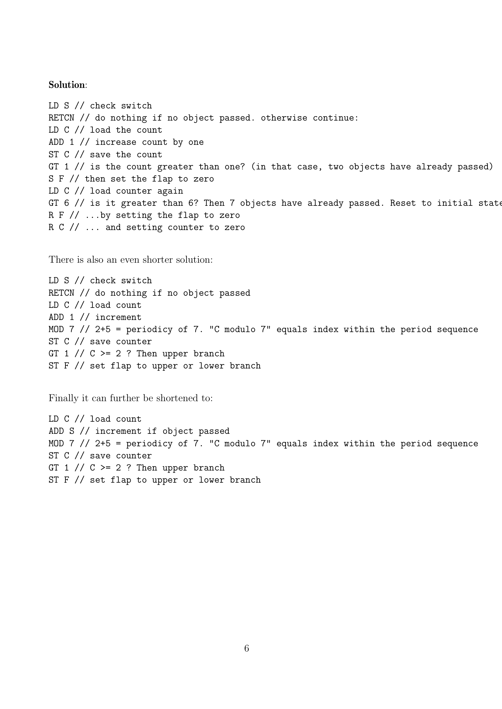

这页给了**三种 IL 程序写法**来实现上一页的分流规则（2 个下、5 个上循环），并在每行后面用注释解释。下面我把每份代码按中文逐行讲清楚，并说明三种写法的**差异与等价性**，你照着任意一种都能写出满分答案。

---

## 版本一：较长的流程式实现（先计数，再判断，再周期复位）

```il
LD S          ; 读光幕S
RETCN         ; 若S=0（没有物体），直接跳到程序末尾；否则继续
LD C          ; 把计数器C读到CR
ADD 1         ; C ← C + 1（当前这件通过后，已通过总数+1）
ST C          ; 回写C

GT 1          ; 判断：是否>1？若是，说明至少已有2件通过
S F           ; 若上一步为真，就把拨片F置为0（走下支路）
; （注意S F是置位型线圈：这里用于“下支路”，与实训平台符号相关）

LD C          ; 再次载入C，准备判断是否“满7”
GT 6          ; 若C>6，说明已满7件（2下+5上）一个周期
R F           ; 重置拨片F为0（恢复初始）
R C           ; 计数C清零，开始新的7件周期
```

**要点说明**

* 这份代码**先对通过的物体计数**，再根据计数值决定 F，并在 **C>6** 时清零（一个 7 件周期结束）。
* `S F / R F` 在这份稿里用于“把 F 设为 0 / 复位到 0”，与平台符号匹配；你若用的是“直接赋值型”平台，可改成 `ST F`（写0或1）。

---

## 版本二：更短的实现（使用取模 MOD 7）

```il
LD S          ; 读光幕
RETCN         ; 无物体则不做任何事
LD C          ; 读C
ADD 1         ; C ← C + 1
MOD 7         ; C ← C mod 7，把计数折叠到0..6的一个周期位置
ST C          ; 回写C（此时C就是周期内索引）

GT 1          ; 若C>1（即2..6），表示应走上支路；0或1则走下支路
ST F          ; F ← (C>1 ? 1 : 0)
```

**要点说明**

* 通过 `MOD 7`，不再需要显式“C>6就清零”的那段；因为**每次都把C折叠在0..6**。
* 判定规则：**C∈{0,1} → 下（F=0）；C∈{2..6} → 上（F=1）**。这恰好对应“2下5上”的7步循环。
* 这份写法把**计数与方向计算**都放到了**同一次 S 触发**内部完成；若你的系统语义要求“F 为下一件服务”，可把“设 F”放在“下一拍”或按平台时序调整（与上一页题意一致即可）。

---

## 版本三：最短写法（把“是否有物体”直接作为增量）

```il
LD C          ; 读C
ADD S         ; 若S=1则+1，S=0则+0（等价“有物体就计数”）
MOD 7         ; C ← C mod 7（折叠到周期位置）
ST C          ; 回写C

GT 1          ; 判断是否>1（2..6）
ST F          ; F ← (C>1 ? 1 : 0)
```

**要点说明**

* 利用 `ADD S` 的“布尔转整数”效果：S=1 让 C 加1，S=0 则不变。省掉了 `RETCN` 分支。
* 最少指令、逻辑最紧凑；但要确认你的 IL 解释器支持把**布尔量**当作**0/1**参与 `ADD`。

---

## 三个版本的**等价性与时序讨论**

* **核心判据一致**：都把件数折叠到**7步周期**里，并用**C>1**作为“上支路”的判定（即 0、1 → 下；2..6 → 上）。
* **版本一**不使用 `MOD 7`，通过“**满7就清零**”来保持周期；
**版本二/三**用 `MOD 7` 在每次更新时**自动折叠**到 0..6。
* **与题意的“已通过/下一件”时序**：
前一页题目强调**S 触发当拍，物体已过拨片**，因此**设置的是下一件的方向**。

* 若平台是**读输入→算逻辑→下一拍写输出**的 PLC（常见 TON/扫描式语义），那么**本拍算出来的F会用于下一件**，与题意一致；以上三版都成立。
* 若你的执行模型是“即刻作用”的（本拍F就影响本拍物流），那就把“设F”的位置**前移或后移一拍**，以满足“下一件生效”的时序（通常在工控PLC里，无需额外处理）。

---

## 什么时候选哪一版？

* **追求易懂**：用版本一（新人更好读，逻辑直观）。
* **追求简洁与稳健**：用版本二（`MOD 7` + 显式 `RETCN`）。
* **追求最短指令**：用版本三（`ADD S` 一招搞定计数增量），注意运行环境对布尔算术的支持。

---

## 常见坑与检查点

* **C 的初始化**要为 0，**F 初始为 0**（保证“前两件走下”）。
* 计数只在 **S=1** 时递增；S=0 时**不改变** C。
* 若使用 `MOD 7`，确保平台的 `MOD` 是对**非负整数**取模（常见工控 PLC 就是这样）。
* 记住最终判定是 **C>1**（不是 ≥1，也不是 >2）。
* 若需要“F 用于下一件”，确认你的 PLC **写输出步**在扫描末尾（默认即如此）。

---

## \[口语化表达]

这页其实给了三种写法，都在做同一件事：**按7个一轮回，前2个走下，后5个走上**。最直白的是第一版：有货就把计数加1，数到7就全清零，然后看有没有超过1，超过就把拨片打到“上”；否则就是“下”。第二版更干脆：每次都 `mod 7` 把计数折回 0..6，再判断 `>1` 来决定上/下。第三版最短：直接 `ADD S`，S为1就+1，为0就不加，然后 `mod 7` 再 `>1` 判定。只要注意初始化 C=0、F=0，S=1 才加数，就能稳定跑出“2下5上”的节奏；如果你担心“这一拍就生效”，记得在 PLC 的扫描模型里，输出通常是**下一拍**才真正作用到外部，刚好满足题目说的“当前拍的货已经过去”的设定。


---

## 第 23 页

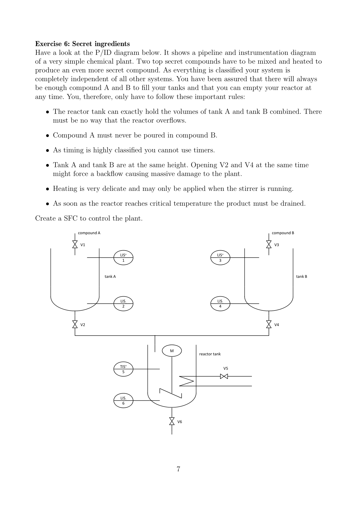

这页是 **Exercise 6: Secret ingredients（机密配料）**。
它是一道关于化工控制系统（过程控制）逻辑设计题，要你根据管道仪表图（P\&ID）创建一个 **SFC（顺序功能图）** 来控制整个工厂的操作顺序。下面我详细解释每个要求与逻辑步骤。

---

## 🧪题意理解

系统有：

* **两个储罐**：Tank A（装化合物A）与 Tank B（装化合物B）
* **一个反应釜**：reactor tank
* 各罐和反应釜都有阀门（V1–V6）、液位传感器（LIS1–LIS6）和温度传感器（TIS5）
* 反应釜内有 **搅拌器 M** 和 **加热器（V5控制）**

### 题目要求的规则：

1. 反应釜体积 = Tank A + Tank B 的体积之和（不能溢出）
2. A 绝不能倒入 B（防止混料错误）
3. 不允许使用定时器（系统“机密”，不能用时间控制）
4. A、B 在同一高度 → 不能同时开 V2 和 V4，否则会“互相倒灌”，造成灾难。
5. 加热必须在搅拌器运行时进行（否则会烧焦反应物）
6. 一旦反应釜温度达到临界值（critical temperature），必须立刻排料（通过 V6）

---

## 🧩SFC（顺序功能图）控制逻辑设计

### **Step 1：初始状态**

* 所有阀门关闭（V1–V6 全关）
* 搅拌器 M 停止
* 加热器（V5）关闭
* Reactor 为空（LIS6 = 0）

**过渡条件**：系统启动命令（Start）

---

### **Step 2：填充 Tank A**

* 打开 V1 给 Tank A 加料，直到液位 LIS1 = 1（达到设定上限）
* 关闭 V1
* 保证 V2 关闭（防止提前放料）

**过渡条件**：LIS1 = 1

---

### **Step 3：填充 Tank B**

* 打开 V3 给 Tank B 加料，直到液位 LIS3 = 1
* 关闭 V3
* 保证 V4 关闭

**过渡条件**：LIS3 = 1

---

### **Step 4：排放 Tank A → Reactor**

* 打开 V2（A → Reactor）
* 保证 V4 保持关闭（防止回流）
* 监测 Reactor 液位 LIS6
* 当 Tank A 液位 LIS2 = 0（排空）时关闭 V2

**过渡条件**：LIS2 = 0（Tank A排空）

---

### **Step 5：排放 Tank B → Reactor**

* 打开 V4（B → Reactor）
* 保证 V2 保持关闭（防止回流）
* 当 Tank B 液位 LIS4 = 0（排空）时关闭 V4

**过渡条件**：LIS4 = 0（Tank B排空）

---

### **Step 6：搅拌 + 加热**

* 启动搅拌器 M
* 打开加热阀 V5（加热反应）
* 持续监测温度 TIS5

**过渡条件**：TIS5 ≥ 临界温度（critical temp）

---

### **Step 7：停止加热 + 排放成品**

* 关闭加热阀 V5
* 打开排放阀 V6（放出产物）
* 当 Reactor 液位 LIS6 = 0 时，关闭 V6，停止搅拌器 M

**过渡条件**：LIS6 = 0（反应釜排空）

---

### **Step 8：返回初始状态**

* 所有阀门关闭
* 等待下一次 Start 信号

---

## ⚠️安全联锁条件总结

| 规则      | 安全逻辑实现                    |
| ------- | ------------------------- |
| 反应釜不溢出  | Tank A 和 B 分批排入，LIS6 检测上限 |
| 防止A倒入B  | 确保V2与V4互锁，不可能同时打开         |
| 无定时器    | 全部以液位或温度信号为状态转移条件         |
| 加热条件    | 只有 M=ON 时 V5 才允许打开        |
| 温度过高排料  | TIS5 ≥ 临界温度 → 立刻关闭V5并打开V6 |
| 排空后停止搅拌 | LIS6=0 → M停止              |

---

## 💡SFC结构文字版概览

```
[Start]
↓
[Fill Tank A] → [Fill Tank B]
↓
[Drain A to Reactor] → [Drain B to Reactor]
↓
[Mix & Heat]
↓
[Drain Product]
↓
[Reset / Idle]
```

---

## \[口语化表达]

这题就是让你设计一个“自动化化工混合控制流程”。整个过程分八步：
先灌满 A，再灌满 B，然后先把 A 放进反应釜、再放 B（不能一起开阀防止倒灌），之后开搅拌再加热。加热的时候要注意搅拌器必须在转，不然会烧坏。等温度到了临界点就停加热、开排料阀放出成品。排完之后所有阀门关上，回到初始状态。整个流程不用计时器，完全靠液位和温度信号自动推进。简单说就是个\*\*“先A后B→搅拌加热→温控排料→复位”\*\*的顺序控制程序，用 SFC 把这几个阶段画成块状图，每个块配一个条件就可以了。


> ❌ 程序在第 24 页因异常停止：ShortAnswerError('answer too short')


---

## 第 24 页

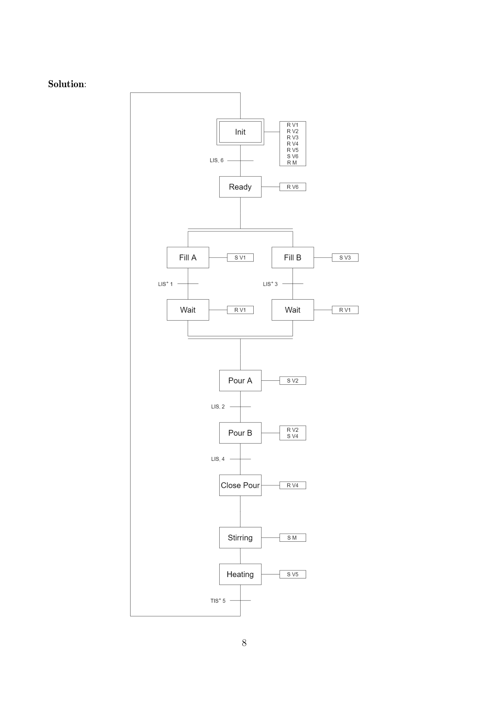

下面这张图是一套“顺序控制/批处理”流程（很像SFC/顺序功能图）的**解题示例**。它描述了：初始化→并行进料（A、B 两路）→依次放料→关断→搅拌→加热→回到起点的完整自动控制逻辑。右侧小方框里的字母多为**动作/信号**的助记：

* **S**（Set）＝置位/打开/启动；**R**（Reset）＝复位/关闭/停止。
* **V1～V6**：阀门编号；**M**：搅拌电机；
* **LIS\***：液位开关/传感器（Level Indication Switch）；**TIS\***：温度开关/传感器（Temperature Indication Switch）。
* 竖线两端的**粗横杠**表示**并行分支/汇合**：两个分支都完成后再继续往下。

---

# 各步骤逐块解释（“每道题怎么做”）

1. **Init（初始化）**
目的：把设备恢复到已知安全态。

* 右侧小框显示一组 **R V1、R V2、R V3、R V4、R V5、R M** 等动作：
解释为**关闭所有相关阀门 V1～V5，停止电机 M**，并清零/复位内部位。
* 图中有 **LIS\* 6**：常见做法是确认某基准液位或条件有效（例如“反应釜空/安全液位到位”）才算初始化完成。

2. **Ready（就绪）**
设备已在安全基态，可以开始配料流程。

* 右侧 **R V6** 多被理解为“确保旁路/排放阀 V6 关闭”，防止误排。

3. **并行进料：Fill A / Fill B（分支并行）**
进入两个并行分支，分别向 A、B 两路容器/腔室进料。

* **Fill A**：

* 右侧 **S V1**：打开 A 路进料阀 V1；
* 左侧 **LIS\* 1**：以液位开关 1 为停止条件（到位＝达到目标液位）。
* 到液位后转入 **Wait**（A 分支的等待），右侧 **R V1**：关闭 V1。
* **Fill B**：

* 右侧 **S V3**：打开 B 路进料阀 V3；
* 左侧 **LIS\* 3**：以液位开关 3 为停止条件；
* 到位后转入 **Wait**（B 分支的等待），右侧 **R V1**（图中标注看起来也是 R V1，多数教材此处应为 **R V3**，含义是“关 B 路进料阀”——若原题确实写 R V1，可视为印刷/标注小误，答题时写“关闭本分支的进料阀”即可）。
* 两个 **Wait** 之后在下方粗横杠**汇合**，表示**A、B 两路均到位**才继续。

4. **Pour A（放料 A）**

* 左侧 **LIS\* 2**：常见为“允许/联锁条件满足”（比如放料容器有空位）。
* 右侧 **S V2**：打开放料阀 V2，将 A 物料倒入下一单元/混合釜，达到下游条件后进入下一步。

5. **Pour B（放料 B）**

* 左侧 **LIS\* 4**：同理是 B 放料的许可/到位条件；
* 右侧 **R V2，S V4**：先**关闭 V2**（结束 A 的放料），再**打开 V4**（开始 B 的放料）。

6. **Close Pour（结束放料）**

* 右侧 **R V4**：关闭 B 放料阀，至此 A、B 两路的放料都结束。

7. **Stirring（搅拌）**

* 右侧 **S M**：**启动搅拌电机** M，对已合并的物料进行搅拌。
* 若题目有时间/速度要求，通常用“定时到/转速到”作为下一步条件。

8. **Heating（加热）**

* 右侧 **S V5**：打开加热阀/加热器（如蒸汽阀 V5 或电加热使能）。
* 下方 **TIS\* 5**：以温度开关/设定温度到达（TIS 5 动作）为结束条件。满足后流程**回到最上方**（外框箭头回路），形成一个完整批次循环。

---

# 怎么“做题/实现”这张流程图（答题要点）

> 面对这种题（典型的顺序控制/配料工艺题），通常要求你把流程图翻译为**控制步骤、动作表或 PLC 程序框架**。标准做法如下：

* **列步骤**：按图中块从上到下定义**步骤 Step**（Init、Ready、Fill A、Wait(A)、Fill B、Wait(B)、Pour A、Pour B、Close Pour、Stirring、Heating）。
* **列条件**：每个步骤写**转移条件**（如 LIS\*1 到位、LIS\*3 到位、LIS\*2 允许、TIS\*5 到位、两分支均完成等）。
* **列动作**：每个步骤写**动作表**（如 S V1 / R V1，S V3 / R V3，S/R V2、V4、V5，S/R M 等）。
* **并行/汇合**：用两条并行支路，并在汇合处设置“**两支路完成的与逻辑**”（两者都完才继续）。
* **安全互锁**：在 Ready、放料步骤加互锁（如“R V6 保证关闭”“不允许两个放料阀同时开”等）。
* **结束与循环**：加热到温度（TIS\*5）后**重置步骤或进入下一批**。

> 如果让你写 PLC 程序：
>
> * **SFC**：可直接按此图建 SFC 步骤/转换；
> * **梯形图**：每步用“步位/保持位 + 转移条件”实现；
> * **动作**：用步位驱动线圈（S/R 对应置位/复位线圈）控制各阀门与电机；
> * **传感器**：LIS/TIS 作为触点参加联锁与转移判断；
> * **定时/报警**：可在“Wait/Heating/Stirring”等步骤加入定时与超时报警。

---

# 常见细节/易错点

* **R/S 的对象要对得上**：进料 A 开 **S V1**，到位关 **R V1**；进料 B 应是 **S V3 → R V3**（图上 R V1 疑似笔误）。
* **放料切换顺序**：先关 A 的 **V2**，再开 B 的 **V4**，避免串流。
* **并行同步**：A、B 两路都完成（两个 Wait 都到）才允许往下。
* **安全位**：Ready 前确保所有非目标阀门均为关闭（R），旁路 **V6** 复位。
* **结束条件**：Heating 依 **TIS\*5** 到位结束，否则持续加热。

---

\[口语化表达]
这张图讲的就是一锅配料的自动做法：先把设备都复位到安全状态（阀都关了、搅拌停了），确认就绪后，**同时**往 A、B 两路各自的容器里加料——A 开 V1 到液位1就关，B 开 V3 到液位3就关；两边都加好后，先把 A 的料通过 **开 V2** 放进去，再关 V2；然后换 B，**开 V4** 把 B 放进去，再关 V4。两种料都到锅里了，**开搅拌电机**开始搅，接着\*\*开加热（V5）\*\*把温度升到设定值（TIS5 到位），这一批就完成了，又回到起点，准备下一批。整个过程中，“S”就是打开/启动，“R”就是关闭/停止；LIS 是液位到没到，TIS 是温度到没到；并行那一段就是 A、B 两边一起干，等两边都说“好了”再往下走。


---

## 第 25 页

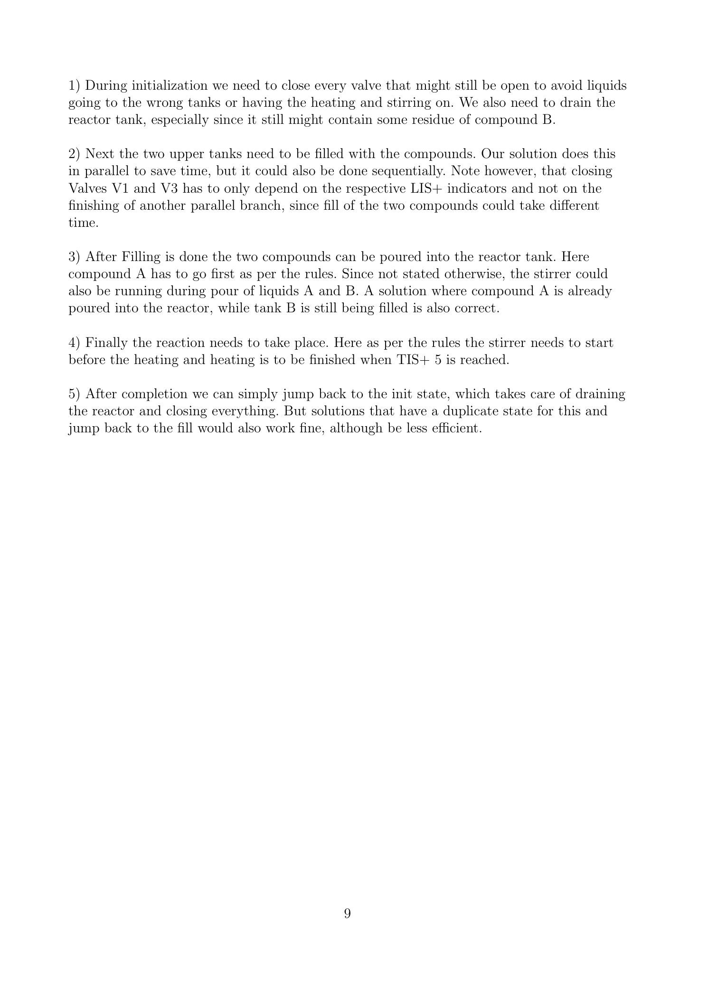

这页文字解释了上一页流程图（自动配料/反应控制）的**每一步逻辑与设计理由**。我来为你逐条详细翻译、讲解每点在做什么，并说明“做题思路”。

---

### **第 1 步：Initialization（初始化）**

在初始化阶段，需要**关闭所有可能还开着的阀门**，以避免液体误流到错误的罐子或让加热与搅拌误启动。
还要**排空反应釜**（reactor tank），特别是里面可能还残留上一次的化合物 B。
➡️ 这一步的意义就是保证安全、清空系统，把所有设备恢复成初始、安全、可控的状态。

---

### **第 2 步：Fill A / Fill B（加料阶段）**

接下来要把**上方的两个罐子（A、B）加满原料**。
这里采用“**并行加料**”的方案，可以节省时间。
但也可以选择顺序加料，只是效率稍低。
注意：

* **V1 和 V3 阀门的关闭**仅取决于各自的液位指示器（LIS+）。
* 它们**互不依赖**，因为 A、B 的加料速度可能不同。

➡️ 要点是：每个罐子只看自己的液位信号，满了就关，不需要等另一边。

---

### **第 3 步：Pour A / Pour B（放料入反应釜）**

当 A、B 都加好后，就可以把它们倒进反应釜。

* **A 化合物必须先倒**，这是题目规则。
* 但题目没说搅拌器（stirrer）是否必须等到放料完才开，所以搅拌器可以在放料时就启动。
* 一种合理的方案是：**A 倒入时反应釜搅拌器已在运转**，B 罐还在加料，这也算对。

➡️ 重点：A 要先倒，B 可稍后。搅拌器是否提前开取决于题意，但允许这样设计。

---

### **第 4 步：Reaction（反应阶段）**

这是加料完后的反应阶段。
按照规则，**搅拌必须先启动**，然后**再开始加热**。
加热阶段要一直持续，直到温度开关 **TIS+5** 到达设定点，说明温度够了，加热结束。

➡️ 要点是：顺序必须是“先搅拌、再加热”，结束条件是温度信号到。

---

### **第 5 步：Completion / Return to Init（结束与复位）**

反应完成后，系统可以**直接回到初始化状态**：

* 排空反应釜；
* 关闭所有阀门。

也可以设计成**多一个中间状态**（比如先回到“准备加料”），但那样比较低效。
所以直接跳回 Init 最简洁。

➡️ 重点：最终都要回 Init，关闭系统，准备下一轮。

---

## **综合总结：这道题的做题要点**

1. 初始化（关阀、排空）。
2. 两罐加料（并行进行，各自到位关阀）。
3. 顺序放料（A 先、B 后，可边搅拌边倒）。
4. 反应（搅拌→加热→温度达标）。
5. 结束回到初始状态（关闭系统，排空，准备下次循环）。

每一步都围绕“安全、逻辑顺序、信号触发、效率”四个关键词展开。

---

\[口语化表达]
简单来说，这页就是解释上一张流程图每一步为什么要这么干。意思是：先关所有阀、排干净反应釜，免得有残留；然后同时往 A、B 两个罐里加料，各看自己的液位信号，满了就关；加好以后，A 的料先倒进反应釜，B 的再倒，搅拌器可以在放料时就开着搅；等全倒完了就进入反应阶段，先搅拌再加热，一直加到温度开关 TIS+5 到为止。最后就回到初始状态，把釜清空、关所有阀，准备下一批。整个流程就是一个安全又高效的自动循环系统。


---

## 第 26 页

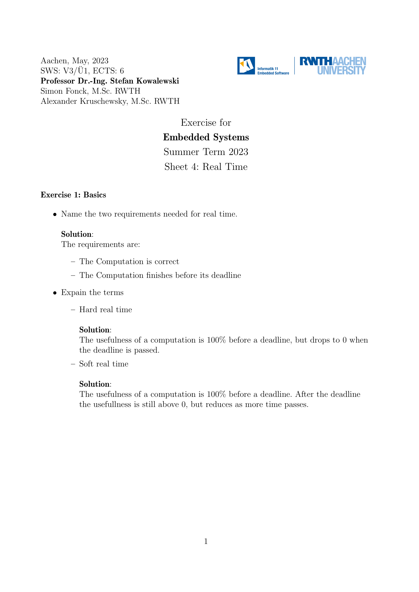

这页讲的是实时系统（Real-Time Systems）的基础概念，是 “嵌入式系统” 课程的第 4 次作业内容。题目主要考察实时性的定义、两种要求以及硬实时与软实时的区别。下面是详细中文解释。
Exercise 1: Basics（基础）
第一问：实时系统的两个必要条件
题目：
Name the two requirements needed for real time.
（说出实时系统所需的两个条件。）
英文答案：
The computation is correct
The computation finishes before its deadline
中文解析：
一个系统要称为“实时系统”，必须同时满足两个条件：
计算结果正确（Correctness）
系统必须算对，逻辑上输出的结果要符合预期。
👉 如果结果错误，即使再快也没意义。
计算在截止时间前完成（Timeliness）
系统必须在规定的**deadline（截止时间）**前给出结果。
👉 比如汽车气囊控制必须在几毫秒内反应；若超过时间，即使计算正确也没用了。
总结：
实时系统既要求“对”，又要求“准时”。缺一不可。
第二问：解释 Hard Real Time 与 Soft Real Time
题目：
Explain the terms Hard real time and Soft real time.
(1) Hard Real Time（硬实时系统）
英文答案：
The usefulness of a computation is 100% before a deadline, but drops to 0 when the deadline is passed.
中文解释：
在截止时间之前，计算的结果完全有效（100% 有用）。
一旦超过截止时间，即使结果出来，也完全没用了（有用性降为 0）。
这类系统的时间约束是绝对严格的。
例子：
汽车安全气囊：必须在撞击发生后几毫秒内弹出；
医疗设备的生命监测报警：超时就可能危及生命。
👉 超时 = 故障 = 不可接受。
(2) Soft Real Time（软实时系统）
英文答案：
The usefulness of a computation is 100% before a deadline. After the deadline the usefulness is still above 0, but reduces as more time passes.
中文解释：
在截止时间前，计算结果完全有用；
超过截止时间后，虽然迟了一点，但结果仍然有价值，只是价值随时间降低。
时间要求较“宽松”。
例子：
视频播放或网络传输：数据包延迟一点还可以；
打印机控制：晚一点打印不影响整体功能，只是效率变差。
👉 超时 ≠ 故障，但性能会下降。
知识要点归纳
类型 对截止时间的要求 超时后后果 应用举例
硬实时 (Hard) 严格，不可超时 立即无效（有用性=0） 气囊、刹车系统、飞控系统
软实时 (Soft) 可容忍少量延迟 有用性降低 视频流、通信、打印
[口语化表达]
这一页其实讲的是“实时系统”的基本概念。意思就是，一个系统想算是实时的，必须又对又快：结果得算对，还得在规定时间内出来。然后又分成两种：硬实时就是一点都不能晚，比如汽车气囊、医疗系统，超过时间就等于没做；软实时就没那么严，比如看视频、打打印机，晚一点也行，只是体验差一点。总结一句话——实时系统就是既要正确，又要准时；硬实时是“必须准时”，软实时是“最好准时”。


---

## 第 27 页

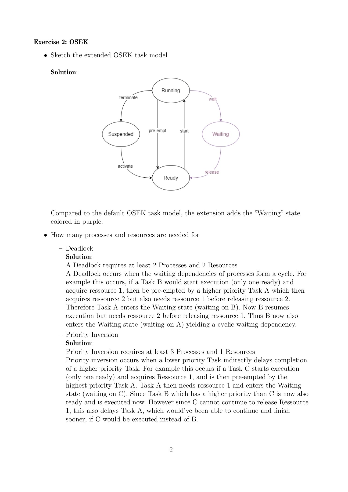

这页是“Exercise 2: OSEK（实时操作系统）”的题目，内容涉及**OSEK任务模型（task model）**、**死锁（deadlock）**和**优先级反转（priority inversion）**。下面我将逐条详细解释。

---

## **题目一：Sketch the extended OSEK task model（画出扩展的OSEK任务模型）**

图中展示的是 OSEK 系统中任务（task）可能处于的几种状态：

### **状态说明**

1. **Suspended（挂起）**

* 任务未被激活（inactive）。
* 只有在被系统调用 `ActivateTask()` 后，任务才会进入下一状态。

2. **Ready（就绪）**

* 任务已经准备好运行，等待 CPU 分配。
* 一旦调度器（scheduler）选择了该任务，它会进入 **Running** 状态。

3. **Running（运行中）**

* 任务正在执行。
* 它可以：

* **Terminate（终止）** → 返回 Suspended 状态；
* **Pre-empt（被抢占）** → 由高优先级任务打断，回到 Ready；
* **Wait（等待）** → 等待事件或资源，进入 Waiting 状态。

4. **Waiting（等待）**（图中用紫色表示，是“扩展”状态）

* 任务在等待某个事件、信号、或资源。
* 一旦等待条件满足（事件被释放 `release`），任务重新进入 **Ready**。

### **OSEK 扩展点**

与默认（基本）OSEK 模型相比，这里**新增了 Waiting 状态**，用来表达任务在等待资源时的情形。

> 默认模型只有 Suspended → Ready → Running 三种状态。

---

## **题目二：How many processes and resources are needed for…（分析需要多少进程和资源）**

### **(1) Deadlock（死锁）**

**英文原文总结：**

> A Deadlock requires at least 2 processes and 2 resources.
> Deadlock occurs when waiting dependencies of processes form a cycle.

**中文解释：**
死锁需要：

* **至少两个任务（processes）**
* **至少两个资源（resources）**

#### **例子说明**

* 任务 B 开始运行，占有资源 1；
* 此时高优先级任务 A 抢占 CPU，A 想要资源 2；
* A 占有了资源 2，但此时又需要资源 1（被 B 占着）；
* A 被迫进入 **Waiting**；
* B 重新获得执行权，想要资源 2（A 占着）；
* B 也进入 **Waiting**。

这时 A 等 B，B 等 A，形成循环等待 → **死锁**。

**关键要点：**

* 循环等待（cyclic waiting）是死锁的本质；
* 至少两个任务、两个资源，互相占有对方需要的资源。

---

### **(2) Priority Inversion（优先级反转）**

**英文原文总结：**

> Priority inversion requires at least 3 processes and 1 resource.
> It occurs when a lower priority task indirectly delays a higher priority task.

**中文解释：**
优先级反转需要：

* **至少三个任务（processes）**
* **至少一个资源（resource）**

#### **例子说明**

* 低优先级任务 **C** 先运行，占用了资源 1；
* 高优先级任务 **A** 开始执行，需要资源 1，但被迫等待（因为 C 占着）；
* 这时有一个中等优先级任务 **B** 变为 Ready，它**优先于 C**被调度执行；
* **C 被抢占**，无法释放资源；
* 结果：**A（最高优先级任务）被延迟**，因为 C 被 B 挡住。

这就是优先级反转：**高优先级任务被低优先级任务间接阻塞**。

---

## **知识总结**

| 问题类型                          | 任务数 | 资源数 | 本质原因                          | 举例说明                   |
| ----------------------------- | --- | --- | ----------------------------- | ---------------------- |
| **Deadlock（死锁）**              | ≥2  | ≥2  | 互相等待形成循环依赖                    | A 等 B，B 等 A，资源1、2互占    |
| **Priority Inversion（优先级反转）** | ≥3  | ≥1  | 低优先级任务持有资源被中级任务打断，导致高优先级任务被延迟 | C 占资源→A 等待→B 抢占 C→A 延迟 |

---

\[口语化表达]
这页主要讲 OSEK 实时系统里任务的状态变化，还有“死锁”和“优先级反转”这两种常见问题。OSEK 的任务有四种状态：挂起、就绪、运行和等待，其中“等待”是扩展出来的，表示任务在等事件或资源。
死锁就是两个任务互相等对方手里的资源，比如 A 拿了资源 1 要资源 2，B 拿了资源 2 要资源 1，谁都不放，系统卡死。优先级反转更阴险：低优先级任务拿了资源没放，这时一个中等优先级任务抢占了它，结果最高优先级任务反而被耽误。总结来说，死锁至少需要两个任务和两个资源互相等，而优先级反转需要三个任务和一个资源，被低优先级间接拖慢。


---

## 第 28 页

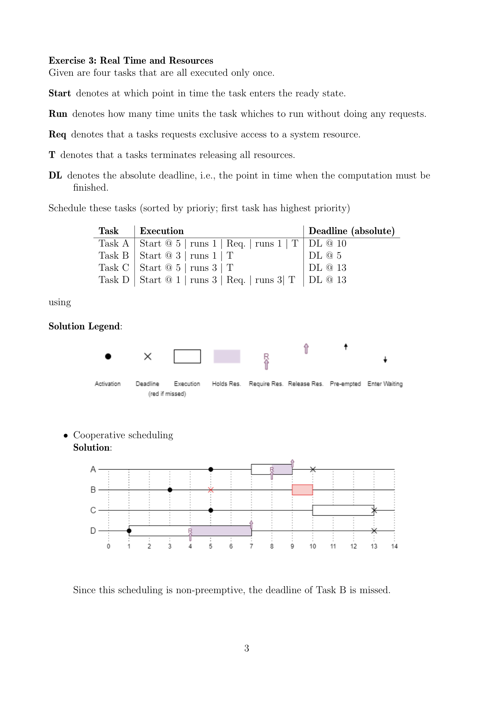

这页是 **Exercise 3: Real Time and Resources**——给出 4 个只执行一次的任务，要求按**优先级（表格从上到下优先级依次降低）**在**协作式（cooperative，非抢占）**调度下排程，并考虑**独占资源**的申请/持有/释放与**绝对截止时间（DL）**。

---

## 题目要素速读

* **Start @ t**：任务在 t 时刻进入 *ready*。
* **runs n**：连续运行 n 个时间单位（期间不做请求）。
* **Req.**：请求并独占一个系统资源（若空闲则立刻获得并继续运行；协作式下不会被更高优先级打断）。
* **T**：任务终止并释放持有的全部资源。
* **DL @ t**：绝对截止时间（要求在 t 之前/时刻完成）。
* **优先级**：A > B > C > D（表格顺序给出，A 最高）。

### 任务描述（按优先级）

* **Task A**：Start\@5 → runs 1 → Req → runs 1 → T，**DL\@10**
* **Task B**：Start\@3 → runs 1 → T，**DL\@5**
* **Task C**：Start\@5 → runs 3 → T，**DL\@13**
* **Task D**：Start\@1 → runs 3 → Req → runs 3 → T，**DL\@13**

---

## 协作式（非抢占）调度：逐时轴推导

> 协作式意味着：**正在运行的任务不会被更高优先级抢占**，只有当它**自愿让出 CPU**（如执行完一个连续运行段、进入等待、或终止）时才会切换。

### 时间线与资源占用

1. **t = 1**

* **D 激活并运行**：`runs 3` → 占用 **\[1,4)**。
* t=3 时 **B 激活**（ready），但因非抢占，仍由 D 继续运行。

2. **t = 4**

* D 执行到 `Req`，系统资源空闲 → **D 立即获得资源**；
* 随后 **D 继续运行 `runs 3`**，并**持有资源 \[4,7)**。
* 此间 **B 仍等 CPU**；**A、C**将在 t=5 激活，但也因非抢占而等待。

3. **t = 5**

* **A、C 激活**；
* **B 的 DL = 5**，但还没得到 CPU ⇒ **B 的截止被错过**（这就是图中 B 的红色执行块与红色叉）。

4. **t = 7**

* **D 结束（T）并释放资源**；
* 就绪队列中有 A、B、C，按优先级取 **A 先运行**。

5. **t = 7 → 9：A 执行并使用资源**

* A 先 `runs 1`：**\[7,8)**；
* t=8 执行 `Req`，资源此时空闲 → **A 获得资源**；
* 再 `runs 1`：**\[8,9)**，t=9 **终止并释放资源**；
* **A 在 DL=10 前完成**，满足截止。

6. **t = 9 → 10：B 执行**

* 轮到 **B**，`runs 1`：**\[9,10)**，随后终止；
* 但 **B 的 DL=5** 已经错过（确认 deadline miss）。

7. **t = 10 → 13：C 执行**

* 最后 **C** `runs 3`：**\[10,13)**，t=13 完成；
* **C 的 DL=13**，恰好按时完成（等于截止视为满足）。

### 小结（协作式结果）

* **资源持有区间**：

* D：**\[4,7)**
* A：**\[8,9)**
* **截止达成**：A、C 达成；**B 超时**；D 提前完成（其 DL=13，不构成压力）。
* **超时原因**：**非抢占**导致 B 在 t=3 激活后被 D 一直“挡”到 t=7 才获得 CPU，因此错过 t=5 的截止。

---

## 画图/答题提示（如何在纸上画甘特图）

1. 画横轴时间 0…14，标注每个任务的 **Activation（小黑点）** 和 **Deadline（叉号）**。
2. 按时间推进，遵守“协作式”与“优先级队列”的规则：

* 谁在跑就一直跑到它的运行片段结束/请求阻塞/终止；
* 切换时从 **A→B→C→D** 的优先级中选最高的 ready 任务；
* `Req` 时若资源空闲，继续跑并进入“持有资源”的着色区段；若资源被占，则该任务进入等待（此题中未发生等待阻塞）。
3. 截止时给出叉号；若任务完工时间 > DL，则把该任务的执行区块标红并在 DL 处标示“miss”。

---

## 关键考点

* **协作式（非抢占）**会拖延高优先级任务上 CPU，从而可能**错过短截止**（本题 B）。
* **资源占用**只在 `Req` 之后到释放前有效，不会被协作式强行剥夺。
* **等于截止时间**视为满足。
* 先画 **D**（最早激活、长片段且含资源），再按优先级填入 **A、B、C**，最不易出错。

---

\[口语化表达]
这页要你在“非抢占”的前提下排个班：谁先来、谁拿资源、谁啥时截止。D 从 t=1 一路干到 t=4，然后申请资源继续干到 t=7，把别人都堵在后面。B 虽然 t=3 就来了，只要 1 个时间单位就能完成，但因为是协作式，不能打断 D，于是在 t=5 的截止被耽误了。t=7 D 结束后，按优先级轮到 A：A 先跑 1 个单位，t=8 申请资源，再跑 1 个单位到 t=9 结束（赶在 DL=10 前）。然后 B 终于在 9~~10 跑完（可惜已错过 DL=5），最后 C 在 10~~13 跑完，正好卡着 DL=13。总之：非抢占 = 谁在跑就别想打断，结果高优先级也可能被拖；这题里 B 就是被 D 拖到超时，资源依次被 D 和 A 在 \[4,7) 与 \[8,9) 持有。


---

## 第 29 页

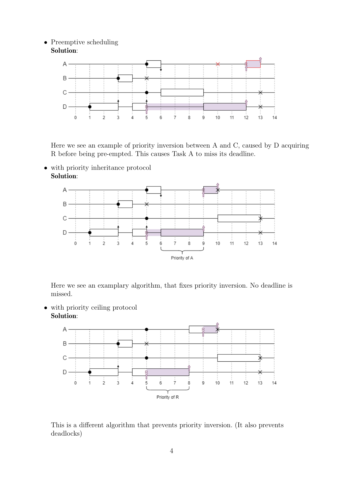

这页展示了**三种不同的实时调度方式**在有资源访问（Req）情况下的执行结果比较：
1️⃣ 抢占式调度（Preemptive scheduling）
2️⃣ 含优先级继承协议（Priority Inheritance Protocol）
3️⃣ 含优先级上限协议（Priority Ceiling Protocol）

这些都是上一题同样的任务（A、B、C、D），只是现在调度器允许**高优先级任务打断低优先级任务**，所以问题核心在于——如何防止“优先级反转（priority inversion）”。

---

## 一、Preemptive Scheduling（可抢占式调度）

### 说明：

* 调度允许高优先级任务中途抢占正在执行的低优先级任务。
* 但当低优先级任务（D）已经占有资源时，高优先级任务（A、C）虽然被激活，却无法获取该资源。

### 过程解析：

1. **D** 从 t=1 开始运行，在 t=5 时刻申请并获得资源 R；
2. **A** 和 **C** 在 t=5 激活，由于 A 优先级高，立即抢占 **D**；
3. **A** 运行到需要访问资源 R 时（t≈6），发现资源被 **D** 占着；

* A 被迫等待；
* **D** 被更高优先级抢占，无法释放资源；
* 形成“优先级反转”：高优先级任务 A 等低优先级任务 D；
4. 等到 **D** 再次获得 CPU 运行完后释放资源，**A** 才能继续；
5. 最终 **A** 的截止时间（DL=10）被错过。

**结果：**

* 发生了 **priority inversion（优先级反转）**；
* **A 超时**（deadline miss）。

---

## 二、Priority Inheritance Protocol（优先级继承协议）

### 原理：

当低优先级任务（D）持有某资源而阻塞高优先级任务（A）时，
→ **D 临时继承 A 的优先级**，
→ 直到 D 释放资源后才恢复原优先级。

### 过程解析：

1. D 在 t=5 获得资源；
2. 当 A 尝试访问资源 R 时被阻塞；

* 系统提升 D 的优先级到与 A 相同；
3. D 继续以高优先级执行直到释放资源；
4. 资源释放后，A 立即获得 CPU 并继续；
5. 所有任务在各自截止时间内完成。

**结果：**

* 没有任务超时；
* **优先级反转问题被解决**；
* 图中标出“Priority of A” 表示 D 临时继承了 A 的优先级。

---

## 三、Priority Ceiling Protocol（优先级上限协议）

### 原理：

* 每个资源被分配一个“上限优先级（Priority Ceiling）”，等于所有可能使用该资源的任务中的最高优先级。
* 当任务获取该资源时，系统将任务的优先级临时提升到资源的上限；
* 这样可以避免：

* 优先级反转；
* 资源死锁。

### 过程解析：

1. D 要申请资源 R；
2. 系统查到 R 的优先级上限等于 **A 的优先级**（因为 A 也用这个资源）；
3. 在 D 获得资源的同时，D 自动提升为“Priority of R”（相当于优先级=最高）；
4. 因此，A 无法打断 D；
5. D 很快完成并释放资源，A 接着执行；
6. 所有任务都按时完成，无死锁无反转。

**结果：**

* **无优先级反转，也无死锁**；
* 更严格的调度策略，但系统实现复杂度更高。

---

## 总结对比表

| 调度类型     | 是否可抢占 | 是否会产生优先级反转    | 是否防止死锁    | 是否所有任务按时完成 |
| -------- | ----- | ------------- | --------- | ---------- |
| 抢占式（无协议） | 是     | ✅ 会（A 被 D 阻塞） | ❌ 否       | ❌ A 超时     |
| 优先级继承协议  | 是     | ❌ 无           | ⚠️ 可能发生死锁 | ✅ 全部按时完成   |
| 优先级上限协议  | 是     | ❌ 无           | ✅ 防死锁     | ✅ 全部按时完成   |

---

\[口语化表达]
这页其实就是讲三种不同的“抢占式实时调度”策略。
第一种是最普通的抢占式：谁优先级高谁先跑，但问题是低优先级的 D 先拿了资源，A 想用时被卡住，这就出现了优先级反转，结果 A 超时了。
第二种加了“优先级继承协议”：当 D 卡着 A 的时候，系统会把 D 的优先级临时提高到和 A 一样，让 D 赶紧干完释放资源，这样 A 就能接着跑，所有任务都能按时结束。
第三种是“优先级上限协议”：资源一旦被分配，就直接给任务一个最高优先级，谁也别想抢，这样既不会反转，也不会死锁。
总结来说：**普通抢占会出问题，继承协议能补救，优先级上限最彻底——又防反转又防死锁。**


---

## 第 30 页

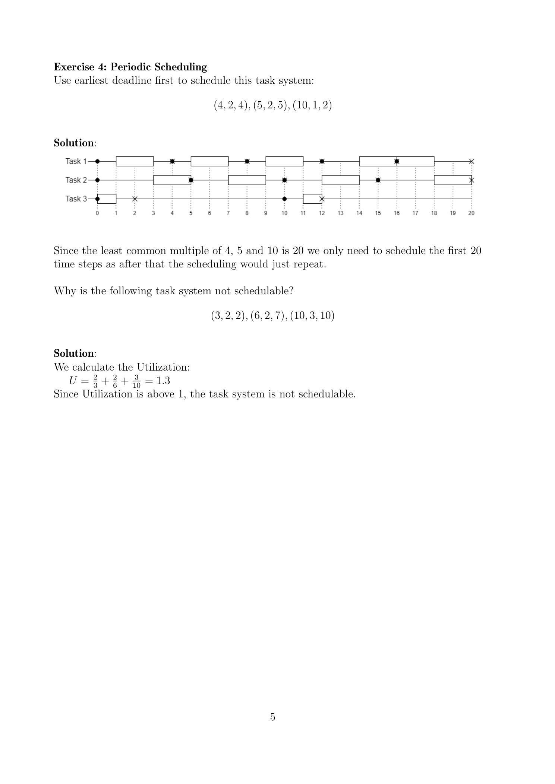

这页是 **Exercise 4：周期性调度（Periodic Scheduling）**。要求用 **最早截止期优先 EDF** 给一组周期任务排程，并判断另一组任务为什么不可调度。下面分两部分详细讲解。

---

## 一、用 EDF 调度这组任务

题目给出三元组：$(T_i, C_i, D_i)$

* $T$：周期（每隔 $T$ 释放一个作业）
* $C$：一次作业需要的处理时间（执行时间/WCET）
* $D$：相对截止期（作业释放时刻 + $D$ = 绝对截止时刻）

任务集：

* **Task1** $(4, 2, 4)$
* **Task2** $(5, 2, 5)$
* **Task3** $(10, 1, 2)$

### 1) 先确定重复周期

$\mathrm{LCM}(4, 5, 10)=20$。因此**只要画出 $[0,20)$** 的调度，之后会周期性重复。

### 2) 计算每个作业的释放与截止（前 20 个时间单位）

* **Task1**：在 $t=0,4,8,12,16$ 释放；截止分别为 $4,8,12,16,20$；每个作业要 **2** 个单位。
* **Task2**：在 $t=0,5,10,15$ 释放；截止分别为 $5,10,15,20$；每个作业要 **2** 个单位。
* **Task3**：在 $t=0,10$ 释放；截止分别为 $2,12$；每个作业要 **1** 个单位（相对截止期很短，只给 2 个单位）。

### 3) 依据 EDF 排程（允许抢占）

时刻上选择**就绪集中绝对截止最早**的作业运行：

* **0–1**：T3(0, DL=2)（最早）
* **1–3**：T1(0, DL=4)（剩 2 个单位→连跑到 3 完成）
* **3–5**：T2(0, DL=5)（正好赶在 DL=5 前完成）
* **5–7**：T1(4, DL=8)
* **7–9**：T2(5, DL=10)
* **9–11**：先 **9–10** 跑 T1(8, DL=12) 的第 1 单位，再 **10–11** 继续把 T1(8) 完成；
同时 **10** 时刻还释放了 T3(10, DL=12) 与 T2(10, DL=15)，但 T1(8) 与 T3(10) 同为 DL=12，取先到的 T1(8)。
* **11–12**：T3(10, DL=12)（剩 1 单位）
* **12–14**：T2(10, DL=15)
* **14–16**：T1(12, DL=16)
* **16–18**：T1(16, DL=20)（或与 T2(15, DL=20)互换顺序，二者 DL 相同）
* **18–20**：T2(15, DL=20)

结果：所有作业都在各自截止前完成，与图中时序一致；20 之后图样重复。

---

## 二、为什么下面的任务集不可调度？

给出：$(3,2,2),\ (6,2,7),\ (10,3,10)$

**利用率判据（必要条件）**

$$
U=\sum \frac{C_i}{T_i}=\frac{2}{3}+\frac{2}{6}+\frac{3}{10}
=0.666\ldots+0.333\ldots+0.3=1.3>1
$$

处理器总需求超过 100% 的可用计算能力，**任何算法都无法全部按时完成**，因此该任务集不可调度。（$U>1$ 是“必不可能”的充分理由。）

> 注：相对截止期不等于周期时，充分必要性要看需求界函数（dbf）；但 $U>1$ 已能直接判定“不可能”。

---

## 作答与画图小技巧

1. 先列出每个周期内的**释放时刻**与**绝对截止时刻**。
2. 画时间轴到 **LCM**，逐时刻用 EDF 选择“就绪且截止最早”的作业；遇到新作业若截止更早则**抢占**。
3. 检查每个作业完工时刻是否 $\le$ 它的绝对截止。
4. 判断可调度性可先做**利用率试验**：若 $U>1$ 直接不可调度；若 $U\le1$ 再用 EDF 具体排程或更严格测试。

---

\[口语化表达]
这一页要你用 EDF 给三条“周期任务线”排班。先看参数：Task1 每 4 个单位来一次，要跑 2 个单位，截止也在 4；Task2 每 5 个单位来一次，要 2 个单位，截止 5；Task3 每 10 个单位来一次，要 1 个单位，但只给 2 个单位就得完成（截止很紧）。把 4、5、10 的最小公倍数算出来是 20，所以只用排前 20 个单位。按 EDF 的玩法，每次挑**截止最近**的作业跑：0～1 先跑 Task3（DL=2），1～3 跑 Task1（DL=4），3～5 跑 Task2（DL=5），后面就按谁的截止更近谁先上，直到 20 结束，所有任务都在截止前完成。
然后第二个问题是“为啥这组任务排不出来”：把利用率一算 $U=2/3+2/6+3/10=1.3$，超过 1 了，CPU 不够用，不管你怎么排都会有人超时，所以它就是不可调度的。


---

## 第 31 页


这页是 **“Exercise 1: V-Model”** 的题，来自嵌入式系统课程第五张作业纸（主题：嵌入式软件开发与设计）。题目要求写出 V-Model（V 模型）图中用 A–E 表示的缺失步骤。图示已经给出了部分阶段，比如 requirements analysis、specification、architecture design、module & algorithm design、implementation、module test、system integration、integration test、acceptance test。下面我们详细讲解每一步的逻辑。

---

## 一、V-Model（V字模型）基本概念

V 模型是软件开发生命周期（SDLC）的一种结构化模型，用来说明\*\*开发阶段（左边）**与**验证/测试阶段（右边）\*\*之间的对应关系。

* 左边是**分解与设计阶段（开发）**：从需求分析逐步细化到代码实现。
* 右边是**集成与验证阶段（测试）**：从模块测试到系统测试再到验收。
* “V” 形底部是\*\*实现（Implementation）\*\*阶段。
* 每个开发阶段在右边都有对应的测试阶段。

---

## 二、图中 A–E 对应步骤（从上到下、从左到右）

| 标号    | 所在位置      | 阶段名称                                   | 对应说明                              |
| ----- | --------- | -------------------------------------- | --------------------------------- |
| **A** | 左上角       | **Requirements Analysis（需求分析）**        | 确定系统必须实现的功能和性能要求，输出用户需求文档。        |
| **B** | 需求分析下方    | **System Specification（系统规格说明）**       | 把用户需求转化为可实现的系统级规格说明，包括接口、性能、功能约束。 |
| **C** | 左下部分、架构之后 | **Architecture Design（系统架构设计）**        | 将系统划分为模块和子系统，定义各模块接口和依赖关系。        |
| **D** | 架构下方、靠近实现 | **Module & Algorithm Design（模块与算法设计）** | 对单个模块进行详细设计，包括算法、数据结构和逻辑流程。       |
| **E** | “V” 底部    | **Implementation（实现 / 编码）**            | 实际编写代码并完成模块单元的开发。                 |

（图右侧相应的测试阶段从下到上对应：Module Test、System Integration、Integration Test、Acceptance Test）

---

## 三、V 模型的工作流程总结

1. **左侧开发阶段：**

* 从抽象到具体：需求分析 → 系统规格说明 → 架构设计 → 模块设计 → 实现。
* 每往下一步，就细化上一步的结果。
2. **右侧验证阶段：**

* 从具体到抽象验证：模块测试 → 系统集成 → 集成测试 → 验收测试。
* 每个验证阶段都用来检验左侧对应的设计成果。
3. **中心思想：**

* **“验证对应性”**（Verification & Validation）
* 每个开发阶段必须有对应的测试来确保目标被正确实现。

---

## 四、作答提示

在考试或作业中：

* 若图中空位以 A–E 标出，请写出：

* A: Requirements Analysis
* B: System Specification
* C: Architecture Design
* D: Module & Algorithm Design
* E: Implementation
* 并说明右侧对应的验证阶段：

* E → Module Test
* C → Integration Test
* A → Acceptance Test
* 形成“V”形对应。

---

\[口语化表达]
这一页主要是讲 V 模型，也就是软件开发从“需求到实现再到测试”的流程图。左边是分析和设计，右边是测试和验证，中间底下是实现。具体来说，最上面 A 是需求分析，搞清楚客户到底要什么；B 是系统规格说明，把需求变成具体的技术要求；C 是架构设计，画出系统模块怎么分；D 是模块和算法设计，细化每个模块要怎么写；E 是实现阶段，也就是正式写代码。右边就是对应的测试：模块测试、集成测试、验收测试一步步验证。整个 V 模型的意思就是：你怎么设计，就要怎么验证。


---

## 第 32 页

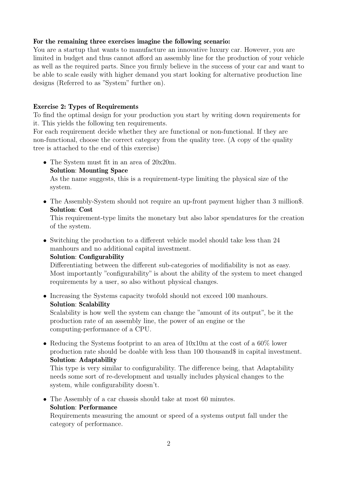

这页是 **Exercise 2: Types of Requirements（需求类型分类）**，题目要求在给定场景下，分析不同的系统需求是**功能性（Functional）**还是**非功能性（Non-functional）**，并且若是非功能性，还要进一步指出它属于哪种质量属性（如性能、可扩展性、适应性等）。下面我会详细讲解题目背景、思路和每个需求的类型分析。

---

## 一、题目背景

你是一家创业公司，打算生产一款创新的豪华汽车。但因为预算有限，没有完整的装配线，只能寻找一种可扩展、可适应的生产系统设计。于是你写下了一些对生产系统（System）的需求，这些需求需要分类。

---

## 二、需求类型的定义

在软件工程或系统工程中：

* **功能性需求（Functional Requirements）**：描述系统“应该做什么”（功能、行为、输入输出）。
* **非功能性需求（Non-functional Requirements）**：描述系统“如何表现”或“应该具备什么特性”（性能、成本、可维护性、可靠性等）。

非功能性需求又可以细分为不同的**质量属性（Quality Attributes）**，比如：

* **性能 (Performance)**
* **成本 (Cost)**
* **可扩展性 (Scalability)**
* **可配置性 (Configurability)**
* **适应性 (Adaptability)**
* **安装空间 (Mounting Space)** 等。

---

## 三、题目给出的需求逐条分析

### 1️⃣ “The System must fit in an area of 20×20m.”

* **含义**：系统必须能放在 20m × 20m 的空间内。
* **分类**：非功能性需求（限制物理安装尺寸）
* **类别**：**Mounting Space（安装空间）**
* **解释**：这是对系统尺寸的约束，与功能无关，而是环境约束。

---

### 2️⃣ “The Assembly-System should not require an up-front payment higher than 3 million \$.”

* **含义**：系统前期投资不得超过 300 万美元。
* **分类**：非功能性需求
* **类别**：**Cost（成本）**
* **解释**：限制系统的金钱投入，包括资金和劳动力支出。

---

### 3️⃣ “Switching the production to a different vehicle model should take less than 24 manhours and no additional capital investment.”

* **含义**：改造生产线以适应新车型，不超过 24 工时且无需额外资金投入。
* **分类**：非功能性需求
* **类别**：**Configurability（可配置性）**
* **解释**：描述系统在不进行物理更改的情况下适应变化的能力。

---

### 4️⃣ “Increasing the System’s capacity twofold should not exceed 100 manhours.”

* **含义**：让系统生产能力提升一倍，不应花费超过 100 工时。
* **分类**：非功能性需求
* **类别**：**Scalability（可扩展性）**
* **解释**：考察系统提升产能的容易程度（如装配线、引擎、计算性能等）。

---

### 5️⃣ “Reducing the System’s footprint to an area of 10×10m at the cost of a 60% lower production rate should be doable with less than 100 thousand \$ in capital investment.”

* **含义**：缩小系统占地面积（从 20×20m 到 10×10m），即使产量降 60%，也不能超过 10 万美元的投入。
* **分类**：非功能性需求
* **类别**：**Adaptability（适应性）**
* **解释**：系统能通过调整硬件或架构改变配置以应对不同场景。与“可配置性”不同的是，它**通常需要实际修改系统结构**。

---

### 6️⃣ “The Assembly of a car chassis should take at most 60 minutes.”

* **含义**：车身底盘组装时间不得超过 60 分钟。
* **分类**：非功能性需求
* **类别**：**Performance（性能）**
* **解释**：对系统产出速度的约束，即性能指标。

---

## 四、如何判断与做题思路

1. **是否描述“做什么”？** → 功能性需求。
2. **是否描述“怎么做”或“性能表现”？** → 非功能性需求。
3. 若是非功能性，再看属于哪一类质量属性。
例如：尺寸→空间；时间→性能；成本→经济性；可修改性→配置性/适应性；产量变化→可扩展性。

---

## 五、本页内容总结表

| # | Requirement 内容            | 类型   | 分类（若非功能性）       | 含义摘要     |
| - | ------------------------- | ---- | --------------- | -------- |
| 1 | Fit in 20×20m             | 非功能性 | Mounting Space  | 物理尺寸限制   |
| 2 | ≤ 3 million \$ upfront    | 非功能性 | Cost            | 成本限制     |
| 3 | Change to new model < 24h | 非功能性 | Configurability | 无需改造即可变更 |
| 4 | Double capacity < 100h    | 非功能性 | Scalability     | 可扩展性     |
| 5 | Shrink to 10×10m < \$100k | 非功能性 | Adaptability    | 可调整性     |
| 6 | Assemble chassis ≤ 60 min | 非功能性 | Performance     | 性能       |

---

\[口语化表达]
这页是在教你区分“功能性需求”和“非功能性需求”。举个例子，系统能干什么是功能性的，比如“系统能装配汽车”；但像“多大空间能放得下、多少钱不能超、多久能干完”这些都属于非功能性需求。题目给的六条其实全是非功能性的：第一条讲物理空间（20×20米），是安装空间；第二条是花钱不能超过三百万，是成本；第三条是换车型要快，不用改造，这是可配置性；第四条讲扩产要省时间，是可扩展性；第五条是缩小占地还能干活，是适应性；第六条是车架 60 分钟组完，是性能要求。总结来说，就是“做什么”是功能需求，“怎么做得更好”是非功能需求。


---

## 第 33 页

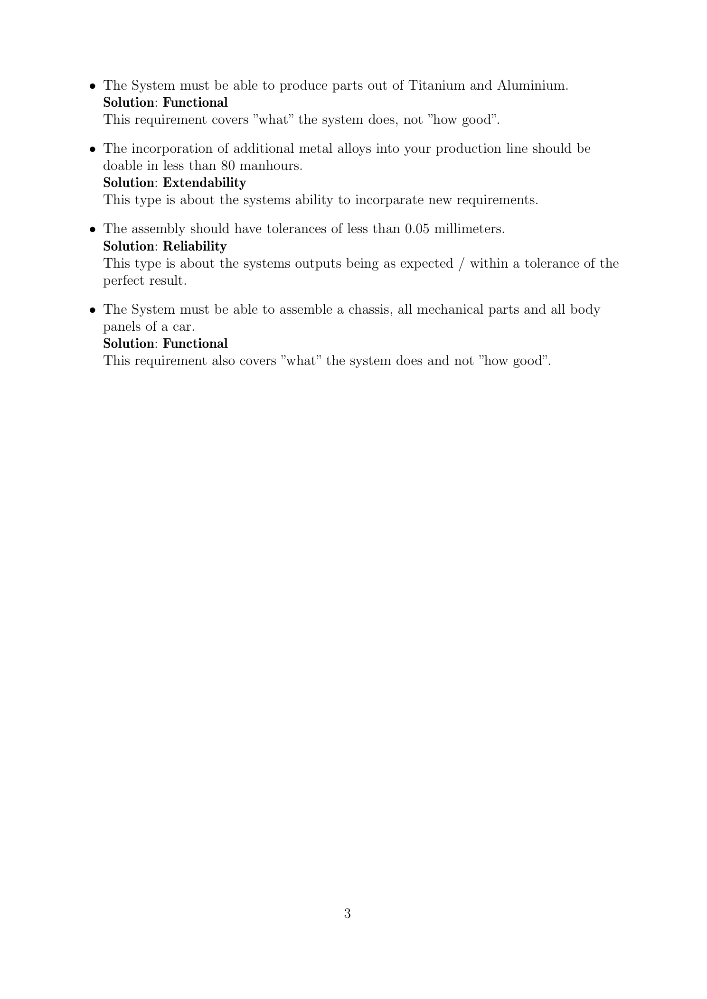

这页是 **Exercise 2（续）**，继续前一页关于“系统需求类型分类”的内容，列出了另外四条需求。目标仍然是判断每条是**功能性（Functional）**还是**非功能性（Non-functional）**，并说明若是非功能性，它属于哪类质量属性。下面逐条讲解。

---

## 一、题目内容讲解

### 1️⃣ “The System must be able to produce parts out of Titanium and Aluminium.”

**译文：** 系统必须能生产出由钛和铝制成的部件。

**分析：**

* 这个需求描述了系统**能做什么（what it does）**，即系统的功能，而不是它做得多好或多快。
* 这不是对性能、成本或时间的要求，而是对功能范围的说明。

✅ **类型：Functional（功能性需求）**
💡 **解释：** 功能性需求关注“系统必须做什么”，而不是“如何表现”或“质量如何”。

---

### 2️⃣ “The incorporation of additional metal alloys into your production line should be doable in less than 80 manhours.”

**译文：** 在生产线上添加新的金属合金材料的改造应在 80 工时内完成。

**分析：**

* 这是在描述系统能多容易地扩展以支持新材料。
* 不涉及具体功能输出，而是关于系统“可扩展性”的质量属性。

✅ **类型：Non-functional（非功能性需求）**
🧩 **类别：Extendability（可扩展性）**
💡 **解释：** 可扩展性描述系统吸收新需求、添加新功能的难易程度。

---

### 3️⃣ “The assembly should have tolerances of less than 0.05 millimeters.”

**译文：** 装配精度的误差应小于 0.05 毫米。

**分析：**

* 这是在描述系统输出的**精确性和一致性**。
* 不讲功能，而是讲输出结果必须符合多高的标准。
* 与可靠性（Reliability）相关，因为它表示系统的结果可预测、稳定、符合期望。

✅ **类型：Non-functional（非功能性需求）**
🧩 **类别：Reliability（可靠性）**
💡 **解释：** 可靠性需求强调系统输出符合预期、无异常、可重复。

---

### 4️⃣ “The System must be able to assemble a chassis, all mechanical parts and all body panels of a car.”

**译文：** 系统必须能组装汽车底盘、全部机械部件和车身面板。

**分析：**

* 明确说明系统能做什么（组装哪些部件），这就是系统的主要功能。
* 与执行性能、时间、精度无关。

✅ **类型：Functional（功能性需求）**
💡 **解释：** 功能性需求，定义系统的“职责”与“输出范围”。

---

## 二、总结表格

| # | Requirement 内容  | 类型   | 分类（若非功能性）           | 含义摘要     |
| - | --------------- | ---- | ------------------- | -------- |
| 1 | 能制造钛和铝部件        | 功能性  | —                   | 系统的生产功能  |
| 2 | 新金属合金添加 < 80 工时 | 非功能性 | Extendability（可扩展性） | 系统扩展能力   |
| 3 | 装配精度 < 0.05mm   | 非功能性 | Reliability（可靠性）    | 输出一致性与精度 |
| 4 | 组装底盘、机械部件、车身面板  | 功能性  | —                   | 系统核心组装功能 |

---

## 三、判断逻辑总结

在这部分题里，判断方法仍是：

1. **是否定义系统做的事情（“what”）？**
→ 功能性需求 (Functional)
2. **是否定义系统表现的“质量”或“程度”（“how good”）？**
→ 非功能性需求 (Non-functional)
3. 若为非功能性，则根据关键字判断：

* 时间、可维护性 → Scalability / Extendability / Configurability / Adaptability
* 精度、正确率 → Reliability
* 成本 → Cost
* 性能（速度）→ Performance
* 尺寸 → Mounting Space

---

\[口语化表达]
这一页继续在分需求类型。第一条说系统要能做钛和铝的部件，这就是它能干什么，所以是功能性需求；第二条说要能在 80 工时内加上新合金，这讲的是系统多容易扩展，就是非功能性里的“可扩展性”；第三条要求装配误差小于 0.05 毫米，说的是输出精度、稳定性，所以是“可靠性”；第四条说系统要能组装车架、零件和车身，这是系统的主要功能，也是功能性需求。总结一句话：前后两条讲“能干啥”是功能性的，中间两条讲“干得多好、多灵活”是非功能性的。


---

## 第 34 页

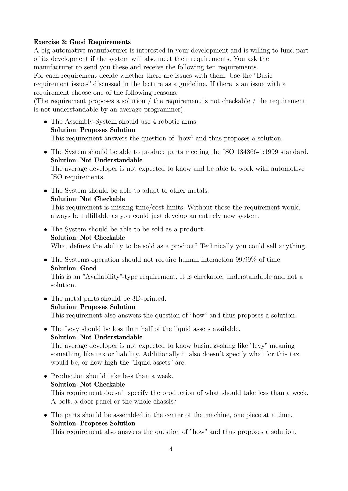

这页是 Exercise 3: Good Requirements（高质量需求），考察的是如何判断一个需求写得好不好、是否存在问题。题目要求你阅读十条需求，判断每条是否有问题，并说明问题属于以下哪一类：
Proposes Solution：需求不是描述“要实现什么（what）”，而是直接给出了解决方案（how）。
Not Checkable：需求无法验证，缺少具体标准或衡量方式。
Not Understandable：需求表达不清晰，开发者无法理解或容易产生歧义。
Good：需求清晰、可测量、可理解、合理。
下面是详细讲解。
一、题干背景解释
题设场景：
一家大型汽车制造商对你的生产系统感兴趣，愿意资助部分开发。但前提是你的系统也能满足他们的要求。
他们给你发来了 10 条需求。你要评估这些需求是否写得合理。
判断的原则来自软件工程中“好需求（


---

## 第 35 页

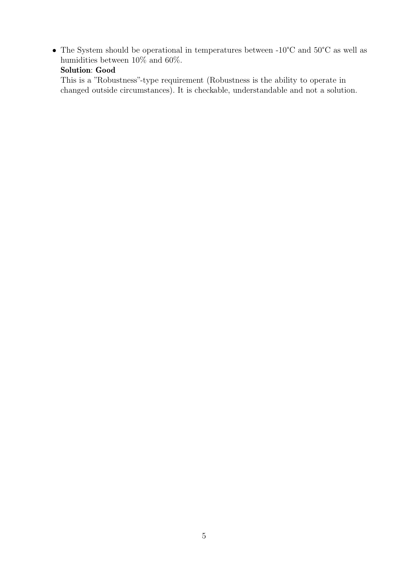

这页延续了上一题 **Exercise 3: Good Requirements（高质量需求）** 的最后一条要求。题目继续要求判断某条系统需求是否写得合理。下面是详细分析。

---

## 一、题目内容

### Requirement（需求）：

> **The System should be operational in temperatures between -10°C and 50°C as well as humidities between 10% and 60%.**
> 系统应能在温度 -10°C 至 50°C、湿度 10% 至 60% 的条件下正常工作。

### Solution（解答）：

> **Good**
> 这是一个 *Robustness（鲁棒性）* 类型的需求。
> 鲁棒性指系统在外部环境变化下仍能正常工作的能力。
> 它是可验证的（checkable）、可理解的（understandable）、并且没有提出实现方案（not a solution）。

---

## 二、详细解释

### 1️⃣ 类型分析：

* 这条需求属于**非功能性需求（Non-functional Requirement）**。
* 具体类型是 **Robustness（鲁棒性 / 稳健性）**。

**鲁棒性（Robustness）** 的定义：
系统在非理想或变化的环境条件下仍能保持功能和性能。例如温度、湿度、电压、电磁干扰等变化不会让系统崩溃或错误。

---

### 2️⃣ 为什么它是“Good Requirement”？

✅ **Checkable（可验证）**
可以通过测试验证系统是否能在给定环境下运行。

> 比如把系统放在环境实验舱内测试在 -10°C、50°C、10%RH、60%RH 条件下能否正常工作。

✅ **Understandable（可理解）**
表述清晰、无歧义。任何工程师都能理解要求的环境范围。

✅ **Not a Solution（不是方案）**
它只定义了目标（在某条件下能运行），而不是实现方式（例如没有说“要加散热器”或“要用防潮涂层”）。

因此这是一个高质量的需求——**明确、可测、可实现、不过度规定实现手段**。

---

### 3️⃣ 对应质量属性类别

* **质量属性（Quality Attribute）：Robustness（鲁棒性）**
鲁棒性是系统设计中的关键质量指标之一，尤其在**嵌入式系统、汽车、航空**等需要在恶劣环境下工作的系统中非常重要。
它关注的是系统的“容忍度”或“环境适应性”。

---

## 三、总结表格

| 属性        | 内容                                |
| --------- | --------------------------------- |
| **需求内容**  | 系统必须在 -10°C～50°C、湿度 10%～60% 下正常运行 |
| **类型**    | 非功能性（Non-functional）              |
| **类别**    | Robustness（鲁棒性）                   |
| **是否可测**  | ✅ 是（环境实验）                         |
| **是否易懂**  | ✅ 是                               |
| **是否是方案** | ❌ 否（未规定实现方法）                      |
| **结论**    | ✅ Good requirement                |

---

\[口语化表达]
这一页其实就是在说：系统要能在 -10°C 到 50°C、湿度 10% 到 60% 的环境里正常工作。这种需求叫“鲁棒性要求”，也就是系统在外部环境变化时还能稳稳地干活。它写得非常好，因为它清楚地告诉你要在什么环境下运行、怎么测都能测出来、任何人都能看懂、还没乱提实现方式（比如没说要装什么防潮设备）。总结来说，这条需求是“好需求”的标准范例——明确、可验证、容易理解、没越界给方案。


---

## 第 36 页

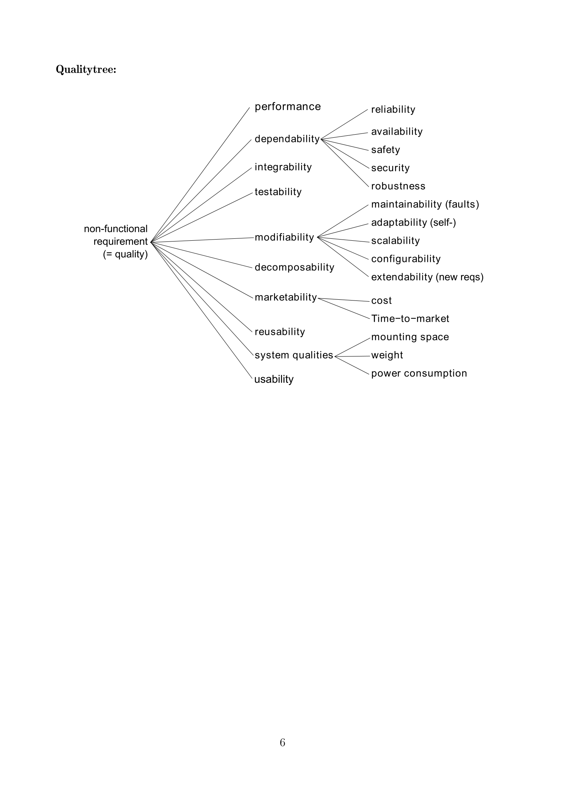

这页展示的是 **“Quality Tree（质量树）”** —— 也就是\*\*非功能性需求（Non-functional Requirements）\*\*的分类图。
在软件工程或系统设计中，“非功能性需求”又叫“质量属性（Quality Attributes）”，这张图就是用树状结构整理了所有常见的质量类别，帮助我们在分析系统需求时判断属于哪种类型。下面我会详细解释各个分支的含义和在实际题目中怎么用。

---

## 一、总体结构说明

树的根节点是：

> **non-functional requirement (= quality)**
> 也就是说，这棵树是用来描述系统“质量”相关的非功能性特征的。
> 每个子节点代表一类质量属性，进一步的子分支代表其具体类型。

---

## 二、主要分支与说明

### 1️⃣ **Performance（性能）**

描述系统在速度、响应时间、吞吐量或效率方面的表现。

* 通常包括如“每秒处理多少请求”、“完成一项任务所需时间”等指标。
💡 举例：汽车装配线在 60 分钟内完成一辆车 → 性能要求。

---

### 2️⃣ **Dependability（可靠性 / 可信度）**

表示系统在长期运行中保持功能正确的能力。
其子类包括：

| 子类                    | 含义                                            |
| --------------------- | --------------------------------------------- |
| **Reliability（可靠性）**  | 输出结果的正确性与一致性，例如“误差小于 0.05mm”。                 |
| **Availability（可用性）** | 系统能正常运行的时间比例，比如“99.99% 的时间无人干预运行”。            |
| **Safety（安全性）**       | 防止伤害用户或设备。                                    |
| **Security（安全防护）**    | 防止未授权访问、篡改、攻击。                                |
| **Robustness（鲁棒性）**   | 在恶劣环境或输入异常下仍能稳定运行，例如“温度 -10°C 到 50°C 均能正常工作”。 |

---

### 3️⃣ **Integrability（可集成性）**

系统与其他系统协作的难易程度，例如接口标准、兼容性等。
💡 举例：生产系统必须与库存管理系统无缝连接。

---

### 4️⃣ **Testability（可测试性）**

系统特性是否容易被验证和测试。
💡 举例：系统应提供模拟接口以便自动化测试。

---

### 5️⃣ **Modifiability（可修改性）**

系统在需求变化时修改的难易程度。
包括以下几种子类：

| 子类                            | 含义                               |
| ----------------------------- | -------------------------------- |
| **Maintainability（可维护性）**     | 修复故障的方便性。                        |
| **Adaptability（适应性）**         | 系统在物理或环境上可调整（例如缩小尺寸、换材料）。        |
| **Scalability（可扩展性）**         | 系统能否提升产能或处理能力（如“产量翻倍需 <100 工时”）。 |
| **Configurability（可配置性）**     | 通过参数或设置改变功能，而不改代码。               |
| **Extendability（可扩展性 / 新需求）** | 增加新特性所需的工作量（如“添加新金属材料 <80 工时”）。  |

---

### 6️⃣ **Decomposability（可分解性）**

系统能否被分解为更小的组件以便管理、测试或开发。
💡 举例：装配系统被分为底盘模块、机械模块、电子模块。

---

### 7️⃣ **Marketability（市场竞争性）**

与商业因素相关，衡量系统是否具有市场优势或经济可行性。
子类包括：

| 子类                       | 含义                               |
| ------------------------ | -------------------------------- |
| **Cost（成本）**             | 资金或人力消耗的限制（如“前期投资 < 300 万美元”）。   |
| **Time-to-Market（上市时间）** | 完成产品的时效要求。                       |
| **Mounting Space（安装空间）** | 系统体积或占地限制（如“系统必须放在 20×20m 区域内”）。 |

---

### 8️⃣ **Reusability（可复用性）**

描述系统组件能否在其他项目中重复使用。
💡 举例：模块化设计、标准接口有利于复用。

---

### 9️⃣ **System Qualities（系统属性）**

这里列出了一些系统整体特征，如：

* **Weight（重量）**
* **Power consumption（能耗）**

这些往往是硬件或嵌入式系统的物理指标。

---

### 🔟 **Usability（可用性）**

衡量用户操作系统的容易程度、界面友好性、学习曲线等。
💡 举例：生产管理界面操作不超过三步即可启动生产。

---

## 三、如何使用这棵树来“做题”

当你拿到一条非功能性需求（比如“系统应能在 10m² 内安装”），
可以顺着这棵树判断它属于哪类质量属性：

1️⃣ 这是描述“性能”吗？（速度、时间）
2️⃣ 是关于“可靠性/可用性”吗？
3️⃣ 是关于“适应性、扩展性、可配置性”吗？
4️⃣ 是物理特征（空间、重量、能耗）吗？
→ 然后把它归入对应的节点即可。

这在之前第 2 题“Types of Requirements”中就被用到了。

---

## 四、总结

这张图帮助我们系统化地区分和归类非功能性需求：

* 左边是主类（性能、可靠性、可修改性等）；
* 右边是更具体的属性（如鲁棒性、可扩展性、安装空间、能耗等）；
* 它能确保在编写系统需求文档时不遗漏任何“质量”层面的指标。

---

\[口语化表达]
这一页展示的是“质量树”，其实就是一张把所有非功能性需求（也叫质量要求）分类的思维导图。左边是总类，比如性能、可靠性、可维护性、市场性之类，右边则细分成各种具体指标。像性能下面有速度、响应时间；可靠性下面有可用性、安全性、鲁棒性；可修改性下面分成可维护、可扩展、可配置、可适应；市场性里还有成本、空间、上市时间等。
用法其实很简单：拿到一条需求，看它在说“系统做什么”还是“系统有多好”。如果是后者，就去质量树里找它属于哪类，比如“温度范围”是鲁棒性，“占地面积”是安装空间，“成本限制”是市场性，“产量提升时间”是可扩展性。总结来说，这棵树就是你分类非功能需求的“速查表”。
