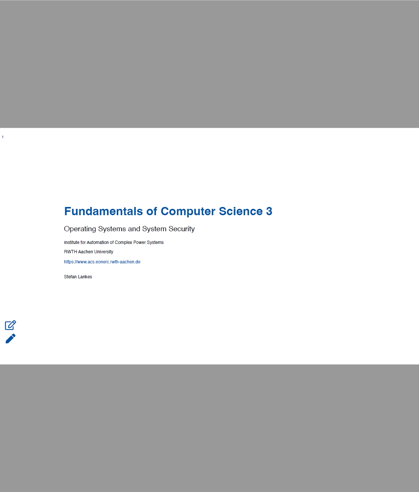
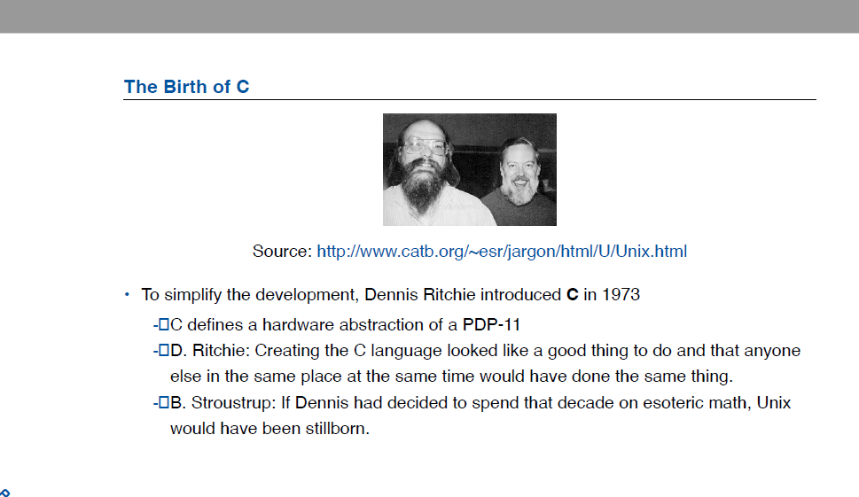

这张幻灯片是关于**计算机科学基础3**的课程介绍，具体内容如下：

### **课程标题：**

- **Fundamentals of Computer Science 3（计算机科学基础3）**

### **课程主题：**

- **Operating Systems and System Security（操作系统与系统安全）**

### **机构和讲师信息：**

- **Institute for Automation of Complex Power Systems（复杂电力系统自动化研究所）**
  - 该课程由该研究所提供，可能与电力系统相关的计算机科学应用有关。
- **RWTH Aachen University（亚琛工业大学）**
  - 该课程属于德国亚琛工业大学的一部分，可能是其计算机科学或工程学相关学科的一部分。
- **网站链接：** [https://www.acs.oenrc.rwth-aachen.de](https://www.acs.oenrc.rwth-aachen.de/)
  - 这是研究所的官方网站，提供更多关于该课程和研究方向的信息。
- **讲师：**
  - **Stefan Lankes** 可能是该课程的授课教师。

### **课程内容：**

该课程主要讲解操作系统和系统安全的基础知识，包括操作系统的工作原理、体系结构以及如何保护系统免受安全威胁。这是计算机科学的核心课程之一，涉及的主题可能包括资源管理、进程调度、内存管理、文件系统和网络安全等内容。

### **总结：**

这张幻灯片是**计算机科学基础3**课程的封面，课程涉及操作系统和系统安全，讲授由亚琛工业大学提供，旨在帮助学生掌握操作系统的基本原理及系统安全的知识。


这张图展示了**操作系统的历史发展**时间轴，并且包含了图表的来源和出版信息。具体内容如下：

### **操作系统历史发展图（时间轴）**：

- **时间轴**：从 1990 年到 2060 年，显示了不同操作系统的演变过程。
- **1990 年前后**：显示了一些经典操作系统的出现，如 **MS DOS**、**LINUX**、**UNIX** 等。
- **2000 年到 2010 年**：出现了移动操作系统和现代桌面操作系统的发展，如 **Android**、**iOS**、**Windows 7/8**。
- **未来**：时间轴的后面部分暗示着操作系统可能的发展趋势，包括 **人工智能操作系统**、**人类与计算机的融合** 等新型的操作系统概念。

### **来源**：

图表的来源是 XKCD 网站，具体链接为：https://xkcd.com/1508/，这个网站以幽默、富有创意的技术和科学类插图而著名。

### **出版信息（Imprint）**：

- **作者**：Dr. rer. nat. Stefan Lankes，来自 **RWTH Aachen University**（德国亚琛工业大学）和 **E.ON Energy Research Center**（E.ON能源研究中心）。
- **地址**：Mathieustraße 10, 52074 Aachen, Germany（德国亚琛，Mathieustraße 10号，52074）

### 总结：

这张图通过幽默的方式呈现了操作系统的演变过程，从早期的 DOS 和 UNIX 系统到当前流行的 Android 和 iOS，再到未来的人工智能操作系统，展示了操作系统技术的不断进化。


这张图片展示了 **许可证和数据隐私** 的相关内容，特别是关于数据使用、版权和隐私政策的说明。

### 详细解释：

#### **许可证（License）**：

1. **文本和图片**：
   - 默认情况下，文本和图片的使用受 **Creative Commons BY-NC-SA 3.0 DE** 许可证的保护。这意味着：
     - **BY**：必须注明原作者。
     - **NC**：非商业用途，即不允许将这些内容用于盈利目的。
     - **SA**：共享相同方式，即如果您对内容进行修改或再发布，必须使用相同的许可证进行发布。
2. **源代码**：
   - 源代码使用以下两种许可证中的一种：
     - **MIT 许可证**：允许使用、复制、修改和分发源代码，但需要附带原许可证声明。
     - **Apache 许可证 2.0**：允许使用、修改和分发源代码，具有类似的条款，并包括明确的专利授权条款。

#### **数据隐私（Data Privacy）**：

1. **ACS 不收集任何数据**：
   - 该部分声明 **ACS（可能指某个服务或平台）** 不收集用户数据。
2. **外部链接的隐私规则**：
   - 如果你使用链接到外部资源（如 YouTube），你需要检查这些外部平台的隐私政策，以确保了解其数据收集和隐私处理方式。

### 总结：

这张图片告知用户，除非另有说明，文本和图片的使用受到 Creative Commons 许可证的约束，源代码则遵循 MIT 许可证或 Apache 许可证。并且强调了 ACS 不会收集用户数据，但在访问外部网站时，用户应检查外部网站的隐私规则。


这张幻灯片提供了**课程的联系方式**和相关授课教师的信息。具体内容如下：

### **联系方式（Contact）：**

- **访问ACS网站（Visit the ACS!）：**
  - 可以访问**复杂电力系统自动化研究所（ACS）**的官方网站，获取更多的课程信息和资料。
- **邮箱（Mail）：**
  - 课程的联系方式邮箱为 **[acs-teaching-gin3@eonerc.rwth-aachen.de](mailto:acs-teaching-gin3@eonerc.rwth-aachen.de)**，用于询问课程相关事宜。
- **Moodle：**
  - 提供Moodle平台，学生可以通过这个平台获取课程材料、提交作业以及与其他同学和教师互动。

### **讲师和助教（Lecture & Exercise Course）：**

- **讲师（Lecture）：**
  - **Dr. Stefan Lankes**：该课程的主讲教师，负责主要的课程讲解。
- **练习课（Exercise Course）：**
  - **Martin Kröning, M.Sc.**：负责练习课程的助教。
  - **Alexander Pastor, M.Sc.**：负责练习课程的助教。
  - **Jonathan Klimt, M.Sc.**：负责练习课程的助教。

### **总结：**

这张幻灯片提供了关于课程**《计算机科学基础3：操作系统与系统安全》**的联系方式、平台以及授课和助教人员的详细信息。学生可以通过提供的邮箱与教师联系，或访问Moodle平台获取更多的课程资源和作业。


这页在介绍**小组练习（Small group exercise）**的安排与注意事项：

1. 目的

- 用来**巩固课堂内容**，把讲过的知识通过动手练习消化掉。

1. 组织方式

- **学生主导**这些练习（你们来带队/讲解/分工）。
- 同时把这个练习**通道用于反馈**（收集同学意见、问题、改进建议）。

1. 报名与日程

- **报名截止：2024年10月11日**。
- 请**检查你的报名状态**是否成功。
- **教室与日期有调整**，记得查看最新安排。

1. 加分任务

- 会发布一些**小任务（Dynexite 平台上的小作业/测验）**，提交后可获得**额外加分**。
- 这些小任务的**成绩将计入期末考试总评**（不是纯练习，具有权重）。

你需要做的：尽快完成报名→关注更新的时间/教室→在Dynexite完成小任务→小组内准备并主持一次练习，并通过该渠道提交反馈。


这张图片展示了 **当前电网的构成**，并说明了为什么 **ACS（可能是自动化控制系统）** 的建立是必要的。

### 详细解释：

#### **电力流动的基本架构**：

1. **能源来源**：
   - 图片上展示了几种常见的能源来源，作为电力生产的起点：
     - **油（Oil）**
     - **核能（Nuclear）**
     - **煤炭（Coal）**
2. **中央电厂（Central Power Plants）**：
   - 这些能源通过 **中央电厂** 被转换为电力。中央电厂是电力的生产源。
3. **输电网络（Transmission Network）**：
   - 生产出来的电力通过 **输电网络** 进行长距离传输，从电厂传送到更广泛的区域。
4. **配电网络（Distribution Network）**：
   - 电力在传输到大范围区域后，进入 **配电网络**，将电力分发到各个用户。

#### **电力流向用户**：

1. **商业建筑（Commercial Buildings）**：
   - 电力最终传送到商业建筑，供办公、零售等用途。
2. **工业（Industry）**：
   - 工业部门也是电力的重要用户，用于机器运作、生产等过程。
3. **住宅（Houses）**：
   - 住宅是电力的最终消费者之一，电力供给家庭的日常使用。

#### **电网的挑战**：

- 图中没有详细描述，但从上下文可以推测，**ACS** 的建立是为了改善电网的管理和控制，以便更高效地分配电力并应对现代电力系统中出现的挑战，比如 **能源转换效率、可再生能源整合、需求响应** 等。

#### **总结**：

这张图描述了从能源生产到最终消费的电力流动过程，展示了从能源源头到商业建筑、工业和住宅的电力分发流程。**ACS** 的建立可能是为了优化电网管理、提高电力传输效率和可靠性，以应对现代电网日益复杂的需求。


这张幻灯片解释了**为什么要建立ACS（复杂电力系统自动化）**，并且展示了**未来电网**的概念。具体内容如下：

### **为什么建立ACS？**

- **未来电网（Future Grids）：**
  - **未来电网**是指将各种能源源（如传统电力、可再生能源等）和能源存储设施连接在一起，通过智能管理和优化，以实现高效、可靠、环保的能源分配和使用。

### **未来电网的组成部分：**

- **中央电厂（Central Power Plants）：** 传统的发电厂，通过燃煤、天然气等方式发电，提供电力给电网。
- **光伏发电厂（Photovoltaics Power Plant）：** 使用太阳能光伏技术生成电力，为电网提供清洁能源。
- **风力发电厂（Wind Power Plant）：** 利用风能发电，与电网连接提供可再生电力。
- **储能装置（Storage）：** 储能系统用于存储多余的电力，以便在需求高峰时段使用，提高电网的稳定性。
- **电力质量设备（Power Quality Device）：** 用于监控和优化电网中的电力质量，确保电力供应的稳定和可靠。
- **电力传输线路（Transmission lines）：** 将电力从发电厂输送到不同的用户和地区。
- **商业建筑（Commercial Buildings）：** 商业和办公楼等大型建筑使用的电力和热力设备。
- **本地热电联产（Local CHP Plant）：** 热电联产系统既提供电力又提供热力，能够提高能源使用效率，减少浪费。

### **总结：**

这张幻灯片展示了未来电网的复杂性和多样性，强调了ACS（复杂电力系统自动化）在未来电网中发挥的作用。通过整合不同类型的能源来源、储能系统、电力质量管理以及热电联产等设备，未来电网将实现更加智能、高效和可持续的能源管理。


这页内容列出了与**计算机科学**相关的**ACS讲座**，包括以下两大部分：

### 1. **计算机科学基础（Foundations of Computer Science 3, GL3）**

- **系统软件与计算机架构（System software, Computer Architectures）**：
   这部分讲解计算机系统的基础软件以及计算机硬件架构的原理。
- **操作系统的实现与设计原则（Implementation and Design Principles of Operating Systems）**：
   讨论操作系统的工作原理、设计方法以及如何实现一个操作系统的核心功能。

### 2. **特定用途的操作系统（Special-Purpose Operating Systems, SOS）**

- **高性能计算（High-Performance Computing）**：
   讲解如何通过并行计算、集群计算等技术提高计算机系统的性能，适用于科学计算、大数据处理等领域。
- **实时计算（Realtime Computing）**：
   讲解实时操作系统的设计，强调在固定时间限制内完成任务，广泛应用于嵌入式系统、航天等高要求领域。
- **云计算（Cloud Computing）**：
   介绍云计算的基本概念与技术，包括资源共享、虚拟化、分布式存储等，广泛应用于数据中心、在线服务等领域。

这些课程内容涵盖了从操作系统设计到高性能、实时和云计算等多个重要领域，适合计算机科学的深度学习和研究。


这张图片列出了关于 **系统软件** 的几本参考书籍，主要集中在操作系统的学习和理解上。具体内容如下：

### 参考书籍：

1. **A. S. Tanenbaum 和 H. Bos -《现代操作系统 (Modern Operating Systems)》**：
   - 出版年份：2014年
   - 该书由 **A. S. Tanenbaum** 和 **H. Bos** 合著，是操作系统领域的经典教材之一。书中深入讨论了现代操作系统的基本概念、设计原理和具体实现。
2. **T. Anderson 和 M. Dahlin -《操作系统：原理与实践 (Operating Systems – Principles and Practice)》**：
   - 出版年份：2015年
   - 这本书介绍了操作系统的原理和实践，重点放在操作系统设计的实际应用上。作者通过大量的实例分析来帮助理解操作系统的工作机制。
3. **A. Silberschatz, P. B. Galvin, 和 G. Gagne -《操作系统概念 (Operating System Concepts)》**：
   - 出版年份：2009年
   - 本书由 **A. Silberschatz**, **P. B. Galvin** 和 **G. Gagne** 合著，是操作系统学习的经典书籍之一，广泛用于各大计算机科学课程。它详细介绍了操作系统的基本概念、功能和结构。
4. **W. Stallings -《操作系统：内部与设计原理 (Operating Systems: Internals and Design Principles)》**：
   - 出版年份：2009年
   - 这本书由 **W. Stallings** 编写，重点讲解了操作系统的内部工作原理和设计理念，适合有一定基础的学习者深入研究。

### 总结：

这些书籍都是学习操作系统的经典教材，涵盖了操作系统的原理、设计、实现等多个方面，为学生和专业人士提供了丰富的理论和实践知识。


这张幻灯片包含了关于**幻灯片显示和设计**的一些说明，具体内容如下：

### **请耐心等待（Please be patient）：**

1. **幻灯片已重新设计，可能有很多拼写错误：**
   - 这是一个正在进行中的工作，设计过程中可能有错误或不完善的地方。
   - 幻灯片的内容可能会不断更新和改进。
2. **加载新幻灯片可能需要几秒钟：**
   - 幻灯片的加载时间可能会有所延迟，用户需要稍微等待。
3. **HTML幻灯片在不同设备上显示效果不同：**
   - 幻灯片在不同的设备上可能显示不同的效果。特别地，幻灯片只在讲师的个人设备上进行了测试，可能不完全适应其他设备的显示。
4. **可打印版本：**
   - 提供了幻灯片的可打印版本，但此版本需要使用**Google Chrome**或**Chromium**浏览器才能正确显示和打印。

### **总结：**

这张幻灯片提醒学生，当前的幻灯片可能仍在修改过程中，并提供了加载和打印的相关说明。特别需要注意的是，幻灯片在不同设备上的显示可能不一致，并且使用特定的浏览器才能打印出版本。


这张图展示了**总体主题**（Overall topics），但并未提供具体内容或详细信息。从标题来看，可能是为一个特定课程或讲座概述整体的主题，具体内容可能会在接下来的页面或讲义中进行展开。


这张图片的标题是 **"Operating Systems and System Security"**，中文意思是 **操作系统与系统安全**。

### 解释：

这部分内容很可能是介绍操作系统的基本概念以及如何确保操作系统的安全性。操作系统安全性主要关注如何保护计算机系统免受未经授权的访问、数据丢失、病毒攻击等威胁。典型的内容包括：

- **用户身份验证**：通过用户名和密码等方式控制访问。
- **权限管理**：确保只有授权的用户才能访问特定的资源。
- **安全补丁和更新**：定期更新操作系统，以修复已知的安全漏洞。
- **加密技术**：通过加密数据和通信来防止敏感信息泄露。
- **防火墙与入侵检测**：阻止非法访问并监控可疑活动。

这部分内容可能会结合具体的操作系统，如 **Linux** 或 **Windows**，讨论其在安全性方面的设计和实现。


这段文字是在探讨**“低级语言（low-level language）”**的定义，并引入了**C语言**和**Rust**作为例子。我们逐句详细解释如下：

---

### 🔹什么是低级语言？

> **原文：**  
> *What is a low-level language?*  
> *Alan Perlis [1] defined a low-level language as follows:*  
> *"A programming language is low level when its programs require attention to the irrelevant."*

#### ✅ 解释：
- **Alan Perlis** 是一位著名的计算机科学家。
- 他说：**“当一种编程语言要求程序员关注与问题无关的细节时，它就是低级的。”**
- 这里的“无关”指的是**与程序逻辑本身无关的底层细节**，比如内存地址、寄存器、指针运算等。

---

### 🔹低级语言 vs 高级语言

> **原文：**  
> *Low-level languages are close to the metal.*  
> *Whereas high-level languages are closer to how humans think.*

#### ✅ 解释：
- **“Close to the metal”** 是计算机领域的俚语，意思是**贴近硬件**。
  - 低级语言（如汇编、C）需要程序员**手动管理内存、寄存器、指令顺序**等。
- 高级语言（如Python、Java）则**抽象了这些细节**，让程序员可以更专注于**逻辑和业务**，而不是硬件。

---

### 🔹C语言是低级语言吗？

> **原文：**  
> *Is today's C an abstraction of the target platform?*  
> *Historically, C is the most important low-level language.*  
> *Consequently, it is used in this course.*  
> *And known from Fundamentals of Computer Science 1.*  
> *In addition, we introduce Rust as a new low-level language.*

#### ✅ 解释：
- 虽然**C语言**比汇编语言高级，但它仍然**需要程序员关注内存、指针、地址等底层细节**。
- 所以，**在现代标准下，C仍被认为是低级语言**（尤其是和Python、JavaScript等相比）。
- 这段话还提到：
  - **C是历史上最重要的低级语言之一**，广泛用于系统编程（如操作系统、嵌入式开发）。
  - 在本课程中，**C被用作教学语言**。
  - **Rust** 是一种新兴的低级语言，它提供了**更好的内存安全性**，同时保留了对硬件的控制能力。

---

### 🔹参考文献

> [1] A. J. Perlis, "Special Feature: Epigrams on Programming," SIGPLAN Not, vol. 17, no. 9, pp. 7–13, 1982.  
> [2] D. Chisnall, "C is Not a Low-Level Language,” Commun. ACM, vol. 61, no. 7, pp. 44–48, 2018.

- 第一篇是**Perlis的经典编程格言**，其中包含了对低级语言的定义。
- 第二篇是**David Chisnall的文章**，标题是《C不是低级语言》，他 argues 说：
  - 现代C已经**脱离了现代硬件的实际结构**，比如它**不了解缓存、并行执行、内存模型**等。
  - 所以，**C不再是“真正”的低级语言**，而是一种“历史遗留的抽象层”。

---

### ✅ 总结一句话：
> **低级语言**就是那些**要求程序员关注底层硬件细节**的语言，比如C和Rust；而高级语言让你更专注于**人类逻辑**，比如Python、Java。

---

如果你想，我可以给你画个对比图，或者举个代码例子来说明C和Python的差异。


你发的这张图片，是一段关于 **Rust 与 C 语言对比** 的技术讨论，内容涉及 **内存安全、指针管理、语言抽象层级** 等话题。下面我会逐句解释，并补充背景知识，帮助你彻底理解这段话的含义。

---

## 🔍 图片内容逐句解析

### 1. `void foo(char* arg) { ... }` 示例代码（C语言）

```c
int *ptr = malloc(sizeof(int));
*ptr = 10;
free(ptr);
*ptr = 20;  // ptr 现在是悬空指针（dangling pointer）
```

#### ✅ 解释：
- `malloc` 分配了一块内存，地址存在 `ptr`。
- `free(ptr)` 把这块内存释放了，但 `ptr` 这个变量本身还保存着原来的地址。
- 此时 `ptr` 成为 **悬空指针（dangling pointer）**，因为它指向的内存已经无效。
- `*ptr = 20;` 是对已释放内存的写入，这是 **未定义行为（Undefined Behavior）**，可能导致程序崩溃或被攻击（如利用悬空指针进行“use-after-free”攻击）。

---

### 2. Rust 的优势（右侧文字）

#### ✅ 原文：
> Memory safe without garbage collection  
> - No null pointers  
> - No dangling pointers  
> A safe, fast and modern programming language  
> - Zero cost abstraction

#### ✅ 解释：
- **Memory safe without garbage collection**：Rust 不需要垃圾回收器（像 Java、Go 那样），但通过 **所有权系统（ownership）** 在编译期保证内存安全。
- **No null pointers**：Rust 没有 `null` 指针，避免了空指针解引用（null pointer dereference）问题。
  - 替代方案是 `Option<T>` 类型，强制你显式处理“可能为空”的情况。
- **No dangling pointers**：Rust 的所有权系统确保一旦内存释放，就不能再访问，杜绝了悬空指针。
- **Zero cost abstraction**：Rust 的高级抽象（如迭代器、trait）在编译后会被优化成和手写底层代码一样高效，不会带来运行时开销。

---

### 3. “Why is C not a low-level language?”（C 不是低级语言？）

#### ✅ 原文：
> Why is C not a low-level language?  
> See [1] and [2]  
> 1. D. Chisnall, "C is Not a Low-Level Language," Commun. ACM, 2018  
> 2. V. Yodaiken, "How ISO C Became Unusable for Operating Systems Development," 2021

#### ✅ 解释：
这其实是近年来学术界对 C 语言的一种 **批判性反思**。

##### 🔍 背景：
传统上我们认为 C 是“低级语言”，因为它接近硬件、能直接操作内存。但这两篇论文指出：

- **C 的抽象模型（abstract machine）** 和 **现代硬件行为** 越来越脱节。
  - 比如 C 的内存模型假设内存是平坦的、顺序一致的，但现代 CPU 有缓存、乱序执行、内存屏障等复杂机制。
- **未定义行为（Undefined Behavior）** 太多，导致编译器优化过度，甚至让操作系统开发者无法预测生成的机器码。
- **C 无法表达现代硬件的并发原语**（如原子操作、内存屏障），需要依赖编译器扩展或内联汇编。

##### ✅ 总结：
> 所以，**“C 不是低级语言”** 是一种 **反讽式说法**，意思是：
> C 的抽象模型已经 **不能真实反映现代硬件行为**，因此它 **不再是“贴近硬件”的语言**，而是一个 **过时的中间层抽象**。

---

## 🧠 总结一句话

> C 语言因为缺乏内存安全、存在大量未定义行为，且其抽象模型与现代硬件脱节，已经不适合作为“底层开发”的理想工具；  
> 而 Rust 通过编译期的所有权系统，实现了 **内存安全 + 高性能 + 现代抽象**，因此被越来越多的系统开发者视为 C 的替代者。

---

如果你想，我可以给你推荐一些中文资料或视频，帮你更深入理解 Rust 的所有权系统，或者这两篇论文的核心观点。


这段文字是在讨论**为什么使用 Rust 编程语言**，以及它的**优缺点**和**现实应用情况**。我来逐句详细解释：

---

### 原文：
> **Why do we use Rust? (Il)**

**翻译：**  
我们为什么使用 Rust？（第二部分）

**解释：**  
这是标题，表示这是关于“为什么使用 Rust”的讨论，可能是系列文章的第二部分。

---

### 原文：
> **: At least, parts of Microsoft have a similar view**  
> **-See blog posts about system programming languages and Rust**

**翻译：**  
至少，微软的部分团队也有类似的看法。  
——参见关于系统编程语言和 Rust 的博客文章。

**解释：**  
微软的一些团队也认为 Rust 是一个有价值的系统编程语言。你可以去看他们发布的相关博客文章，了解他们的观点。

---

### 原文：
> **: The Linux kernel uses partly Rust**

**翻译：**  
Linux 内核部分使用了 Rust。

**解释：**  
Linux 内核是世界上最核心的系统软件之一，长期以来主要用 C 语言编写。近年来，开始引入 Rust 语言来编写部分模块，目的是提高安全性和内存管理能力。

---

### 原文：
> **: Should everything be rewritten in Rust?**  
> **-A huge task...**  
> **-See post from Daniel Stenberg**

**翻译：**  
我们应该把所有东西都用 Rust 重写吗？  
——这是一个巨大的任务……  
——参见 Daniel Stenberg 的文章。

**解释：**  
虽然 Rust 有很多优点，但把所有现有系统（尤其是用 C/C++ 写的）都重写成 Rust 是不现实的，因为工作量巨大。Daniel Stenberg（curl 的作者）写过文章讨论这个问题，他认为不应该盲目地“用 Rust 重写一切”。

---

### 原文：
> **: Disadvantage: Rust isn't an easy programming language**

**翻译：**  
缺点：Rust 不是一门容易的编程语言。

**解释：**  
Rust 的学习曲线比较陡峭。它的内存安全机制（如所有权、借用检查器）虽然强大，但对初学者来说比较难掌握。

---

### 总结：
这段文字的核心意思是：

- Rust 被越来越多地用于系统编程（比如微软、Linux 内核）。
- 它有很多优点，比如安全性高、性能好。
- 但并不意味着所有东西都应该用 Rust 重写，因为代价太高。
- Rust 本身也不容易学，对开发者要求较高。

如果你想，我可以给你推荐一些中文或英文的入门资料，帮助你更好地理解 Rust。


你提供的这段英文是在解释“我们为什么要使用汇编语言（Assembly）”，并列举了几个关键原因。下面我来逐句详细解释它的含义：

---

### 原文：
**Why do we use Assembly?**  
**我们为什么要使用汇编语言？**

---

#### 1. **We have more degrees of freedom**  
**我们拥有更多的自由度。**

- **解释**：汇编语言是接近机器语言的低级语言，它允许程序员直接控制 CPU 的寄存器、内存地址、指令执行顺序等。
- **好处**：你可以精确地控制程序的行为，而不受高级语言（如 C、Python）抽象层的限制。
- **举例**：在操作系统开发或嵌入式系统中，可能需要精确控制硬件行为，这时汇编语言非常有用。

---

#### 2. **Good for OS developers**  
**对操作系统开发者很有用。**

- **解释**：操作系统需要直接与硬件交互，比如管理内存、处理中断、切换进程等，这些操作往往需要汇编语言来完成。
- **举例**：启动引导程序（bootloader）、上下文切换（context switch）等底层代码通常用汇编编写。

---

#### 3. **Good for attackers...**  
**对攻击者也有利……**

- **解释**：由于汇编语言可以直接操控内存和硬件，它常被用于编写恶意软件、漏洞利用代码（如 shellcode）。
- **举例**：缓冲区溢出攻击中，攻击者常使用汇编语言构造精确的内存布局来劫持程序控制流。

---

#### 4. **We can use the latest hardware extensions**  
**我们可以使用最新的硬件扩展。**

- **解释**：新的 CPU 指令集（如 AVX、SSE、AES-NI）在高级语言中可能尚未被支持或封装，使用汇编可以直接调用这些指令。
- **好处**：可以充分利用硬件性能优化程序，比如加密、图像处理等计算密集型任务。

---

#### 5. **Good for the performance**  
**有助于提升性能。**

- **解释**：汇编语言能让你手动优化每一条指令，避免高级语言带来的额外开销（如函数调用、内存管理等）。
- **适用场景**：对性能要求极高的程序，如游戏引擎、加密算法、音视频编解码等。

---

#### 6. **Direct access to the hardware**  
**可以直接访问硬件。**

- **解释**：汇编语言允许你直接操作 I/O 端口、寄存器、内存映射等，这是高级语言无法做到的。
- **举例**：控制一个外设（如键盘、显示器、串口）时，可能需要直接读写特定的硬件地址。

---

#### 7. **e.g. I/O access**  
**例如：输入/输出访问。**

- **解释**：这是“直接访问硬件”的一个具体例子。
- **说明**：在保护模式或实模式下，汇编可以通过 `in/out` 指令直接与设备通信，比如读取键盘输入或控制硬盘。

---

#### 8. **Good for OS developers**（重复）  
**再次强调：对操作系统开发者很有用。**

---

### 总结：

使用汇编语言的原因主要包括：

| 优点       | 说明                         |
| ---------- | ---------------------------- |
| 高自由度   | 精确控制程序行为             |
| 性能优化   | 手动优化每一条指令           |
| 硬件控制   | 直接访问寄存器、I/O、内存    |
| 使用新指令 | 可利用最新 CPU 扩展          |
| 安全研究   | 被用于漏洞分析与攻击代码编写 |

---

如果你是在学习操作系统、逆向工程、嵌入式开发或安全研究，掌握汇编语言是非常有价值的。但它也很难学，需要对计算机体系结构有深入理解。

如果你有具体的应用场景或问题，我可以帮你分析是否需要用到汇编。


这句话的意思是：

> **“在我们自己编写的操作系统内核之上，运行一个 Linux 应用程序。”**

---

### ✅ 逐词解释：

| 短语                            | 含义                                                         |
| ------------------------------- | ------------------------------------------------------------ |
| **Overall objective**           | 总目标，最终目的                                             |
| **Running a Linux application** | 运行一个原本为 Linux 编写的程序（比如 `ls`, `bash`, `gcc`，或者你自己写的 C 程序） |
| **on top of our own kernel**    | 在我们自己开发的操作系统内核之上，而不是用 Linux 内核        |

---

### ✅ 通俗解释：

通常，一个 Linux 程序是**运行在 Linux 内核上的**，依赖 Linux 提供的系统调用（比如文件读写、进程管理、网络通信等）。

但现在，**你自己写了一个操作系统内核**，你想做到的是：

> **不让这个程序知道它不是运行在 Linux 上，而是运行在你自己写的内核上。**

---

### ✅ 举个例子：

假设你写了一个最简单的 C 程序：

```c
#include <stdio.h>

int main() {
    printf("Hello from Linux?\n");
    return 0;
}
```

这个程序在真正的 Linux 上能运行，因为它依赖 Linux 的系统调用（比如 `write` 输出到终端）。

现在你自己写了一个内核，**你要让这个程序在你内核上也能跑起来**，即使它底层调用的不是 Linux 的系统调用，而是**你自己实现的“兼容层”**。

---

### ✅ 技术挑战（你需要做什么）：

| 需要实现的功能     | 举例                                                         |
| ------------------ | ------------------------------------------------------------ |
| **系统调用兼容层** | 让程序调用 `write()` 时，实际调用的是你内核里的 `my_write()` |
| **ELF 加载器**     | Linux 程序是 ELF 格式，你得能解析并加载它                    |
| **libc 支持**      | 程序依赖 `glibc` 或 `musl`，你得提供兼容的 C 库              |
| **进程管理**       | 程序运行时要有进程、线程、调度器等                           |
| **文件系统**       | 程序可能要读 `/bin`, `/lib`, `/dev` 等路径                   |

---

### ✅ 总结一句话：

> **你要做一个“像 Linux”的操作系统内核，能骗过 Linux 程序，让它以为自己还在 Linux 上运行。**

---

如果你想，我可以给你画个架构图，告诉你怎么从“零”开始实现这个目标。


这张图讲的是：

> **“如果你想写一个安全的操作系统（OS），你需要掌握哪些知识？”**

它用德语和英语混合的方式，列出了几个关键层次和知识点。下面我来逐层解释，并补充背景，让你彻底明白。

---

## 🔍 图片内容逐句解析

### ✅ 标题：
> **What kind of knowledge do you need to write a secure OS?**  
> 写一个安全的操作系统，需要哪些知识？

---

### ✅ 1. Understanding of the hardware  
> **理解硬件**

#### ✅ 子问题：
> - What features does the hardware provide to realize an OS, to protect and to accelerate an application?

#### ✅ 解释：
- 操作系统是**直接运行在硬件上的第一层软件**，你必须知道硬件提供了哪些机制来：
  - **保护**系统（如内存隔离、权限级别、中断控制）
  - **加速**应用（如缓存、TLB、虚拟化支持、原子指令、DMA）
- 举例：
  - **CPU 特权级**（ring 0 ~ 3）：OS 运行在 ring 0，用户程序在 ring 3
  - **MMU（内存管理单元）**：支持虚拟内存，隔离进程
  - **中断控制器（APIC）**：用于响应外设事件
  - **TPM / Secure Boot**：用于启动链安全

---

### ✅ 2. Understanding of building and loading applications  
> **理解如何构建和加载应用程序**

#### ✅ 子问题：
> - How can we multiplex resources?  
> - Hardware but also software

#### ✅ 解释：
- **Multiplexing（多路复用）** 是 OS 的核心任务之一：  
  让多个程序**“看起来”同时运行**，但底层只有一套硬件资源（CPU、内存、磁盘、网络）。
- 你需要理解：
  - **进程调度**（如何分时使用 CPU）
  - **虚拟内存**（如何让每个程序以为自己独占内存）
  - **文件系统抽象**（如何让多个程序共享磁盘）
  - **系统调用接口**（如何让程序安全地请求 OS 服务）
  - **链接器和加载器**（如何把编译好的程序变成进程）

---

### ✅ 3. 图中德语层次图（从下到上）

| 德语                 | 中文   | 对应英文          | 作用               |
| -------------------- | ------ | ----------------- | ------------------ |
| **Hardwareebene**    | 硬件层 | Hardware layer    | CPU、内存、外设    |
| **Kernebene**        | 内核层 | Kernel layer      | OS 内核（ring 0）  |
| **Systemebene**      | 系统层 | System layer      | 驱动、系统服务     |
| **Anwendungs­ebene** | 应用层 | Application layer | 用户程序（ring 3） |

> 这张图其实画的是 **操作系统架构的抽象层次**，从硬件到用户程序，每一层都要理解，才能写出**安全的 OS**。

---

## 🧠 总结一句话

> 写一个**安全的操作系统**，不只是写代码，你必须：
> - 懂硬件（CPU、内存、中断、保护机制）
> - 懂软件（如何加载程序、如何隔离资源、如何防止攻击）
> - 懂系统架构（从硬件到应用，每一层怎么交互、怎么防漏洞）

---

## 📌 拓展建议（如果你想深入）

| 方向     | 推荐内容                                             |
| -------- | ---------------------------------------------------- |
| 硬件机制 | Intel SDM 手册（卷 3）、RISC-V 特权指令集            |
| OS 实现  | MIT xv6、Rust 写的 blog-os、Redox OS                 |
| 安全机制 | capability-based security、seL4 微内核               |
| 德语翻译 | 图中“ebene” = layer（层），“Anwendung” = application |

---

如果你想，我可以给你画一个中文版的“安全 OS 知识地图”，或者推荐一份学习路线（从硬件到内核）。


这段文字出现在某份演示文稿（slides）中，是对**“演示示例（Demos / Examples）”**部分的说明。下面逐句为你详细解释：

---

### 原文：
> **Demos / Examples**

**翻译：**  
演示 / 示例

**解释：**  
这是标题，表示接下来会展示一些**实际运行的程序示例**，不是纯理论，而是可以“跑起来”的代码。

---

### 原文：
> **: All demos are runnable within these slides**  
> **-Sometimes in your browser**  
> **-Sometimes remote on our servers**

**翻译：**  
所有演示都可以在这些幻灯片中直接运行。  
——有时是在你的浏览器里运行  
——有时是在我们的远程服务器上运行

**解释：**  
这些演示不是“看看就算了”，而是**可以直接点击运行**的。  
- 如果是在浏览器里运行，说明用的是像 WebAssembly 或 JavaScript 这样的技术，**不需要你安装任何东西**。  
- 如果是在远程服务器运行，说明代码在作者的服务器上执行，**你只是通过网页发送指令并看结果**。

---

### 原文：
> **Demos are written in Assembly or low-level languages like Rust and C**

**翻译：**  
这些演示是用汇编语言或低级语言（如 Rust 和 C）编写的。

**解释：**  
这些不是用 Python、JavaScript 这类“高层语言”写的，而是**非常接近硬件的语言**：  
- **Assembly（汇编）**：几乎是最底层的语言，直接操作 CPU 指令。  
- **C / Rust**：系统级语言，性能极高，常用于操作系统、嵌入式、驱动开发等。

这说明这些演示**非常底层、非常硬核**，不是普通的“Hello World”。

---

### 原文：
> **-See in the appendix for a Rust tutorial**  
> **-Press Esc to see an overview of the slides**

**翻译：**  
——附录里有一个 Rust 教程  
——按 Esc 键可以查看整个幻灯片的概览

**解释：**  
- 如果你不懂 Rust，**附录里有教程**可以帮你入门。  
- 按 Esc 键可以**像地图一样一眼看到所有幻灯片**，方便跳转到你感兴趣的部分。

---

### 总结一句话：
> 这份演示文稿里有很多**用 Rust、C、汇编写的底层代码演示**，你可以**直接在浏览器或远程服务器上运行它们**，附录还有 Rust 教程，按 Esc 可以全景查看所有内容。

---

如果你想，我可以帮你找几个类似的在线演示网站（比如用 Rust 写操作系统、写游戏、写编译器的），你可以自己点点看。


这段英文是在描述一个**在 Linux 服务器上远程运行 C 程序演示（Demo）**的场景，并指出了一些**限制条件**。下面我来逐句详细解释：

---

### 原文：
**Demo remote on a Linux server**  
**在 Linux 服务器上远程演示**

- **解释**：你正在通过一个远程连接（如 SSH）在一台 Linux 服务器上运行一个程序或做演示。
- **背景**：这不是在本地电脑上运行，而是通过网络连接到远程主机。

---

### **Higher latency**  
**延迟更高**

- **解释**：由于你是远程连接，所有的输入输出都要通过网络传输，会比本地操作慢一点。
- **举例**：你敲一个命令，可能要等几百毫秒才有响应，而本地是几乎瞬时的。

---

### **computation power is limited**  
**计算能力有限**

- **解释**：远程服务器可能配置不高，或者是共享资源（如虚拟机、容器），所以 CPU、内存等资源有限。
- **影响**：程序运行速度可能较慢，不能进行大规模计算或高性能任务。

---

### 代码部分：
```c
#include <stdio.h>
int main(int argc, char **argv)
printf("Hello World!\n");
return 0;
```

- 这是一个最简单的 C 语言程序，作用是打印一行文字：“Hello World!”。
- 注意：这段代码**语法上少了大括号 `{}`**，正确的写法应该是：

```c
#include <stdio.h>
int main(int argc, char **argv) {
    printf("Hello World!\n");
    return 0;
}
```

---

### **Run**  
**运行**

- 表示接下来要在远程 Linux 服务器上编译并运行这个程序。

---

### 总结一句话：

> 你在一个**延迟较高、性能有限的远程 Linux 服务器**上，运行一个简单的 C 语言“Hello World”程序作为演示。

---

### 补充说明（如果你在实际操作）：

1. **远程连接工具**：你可能用的是 `ssh username@server_ip`。
2. **编译程序**：用 `gcc hello.c -o hello` 编译。
3. **运行程序**：用 `./hello` 执行，输出 `Hello World!`。

---

如果你是在准备远程演示、教学或面试，这种环境意味着：
- 操作要慢一些，提前准备好命令；
- 避免运行太重的程序；
- 网络不稳定时要小心断线。

---

需要我帮你写一个完整的远程演示流程或脚本吗？


你提供的图片中其实只有一句话：

> **Introduction**  
> **H**  
> Source: https://www.bell-labs.com/usr/dmr/www/picture.html

这句话本身非常简短，但背后有特定含义。我们来逐句解释：

---

### 一、**“Introduction”**
- 英文原意是“引言”或“介绍”。
- 在这里，它很可能是某篇文章、某本书、某个网页或某段内容的开头标题，表示“这是引言部分”。

---

### 二、**“H”**
- 这个“H”非常突兀，看起来像是打字错误、未完成的句子，或者是某种代号。
- 但从上下文来看，这个“H”**极有可能是某个更大标题的开头字母**，比如：
  - **“Hello”**
  - **“History”**
  - **“Hackers”**
  - **“Heaven”**
  - **“Hell”**
- 也有可能是一个**打字错误**，比如本来想写 “Hi” 或 “Hello”，但只输入了第一个字母。

---

### 三、**Source: https://www.bell-labs.com/usr/dmr/www/picture.html**
- 这是一个网页链接，指向 **贝尔实验室（Bell Labs）** 的服务器。
- 路径中出现了 **“dmr”**，这是 **Dennis M. Ritchie** 的用户名缩写——他是 **C语言** 和 **Unix操作系统** 的共同发明人。
- 这个链接原本应该是 Dennis Ritchie 的个人网页之一，可能是他放照片或某篇文章的地方。
- 不过，现在这个链接**已经失效**（404），无法直接访问。

---

### 总结一句话：
> 这张图只是某个网页或文档的**引言部分**，标题只写了个“H”，可能是未完成的标题或打字错误；来源是 Dennis Ritchie 在贝尔实验室的旧网页，但现在已经打不开了。

---

如果你是想问“H”有没有**特殊含义**，比如是不是某种黑客术语、C语言梗、Unix文化里的彩蛋——目前**没有任何证据**表明它有深层含义，**更可能是打字错误或截断**。

如果你有更多上下文（比如这张图出自哪里、前后还有什么内容），我可以帮你进一步分析。


这段话的核心问题是：

> **“我们为什么要学习操作系统？”**

然后用大量数据和事实告诉你：**操作系统是计算机科学中最复杂、最核心、最底层的系统之一**，值得你花时间去学。

---

### ✅ 逐句详细解释：

---

#### 🔹**Why learn anything about Operating Systems?**  
**我们为什么要学操作系统？**

这是整段的标题，抛出一个问题：**学操作系统到底有什么用？**

---

#### 🔹**Interface between hardware and software**  
**操作系统是硬件和软件之间的“桥梁”**

- 没有操作系统，你写的程序无法直接控制 CPU、内存、硬盘、网卡等硬件。
- 操作系统提供了**抽象接口**（比如文件、进程、 socket），让程序员不用关心硬件细节。

---

#### 🔹**One of the most complex topics in computer science!**  
**操作系统是计算机科学中最复杂的主题之一**

- 它涉及：
  - 并发（进程、线程、锁）
  - 内存管理（虚拟内存、页表）
  - 文件系统（磁盘、缓存、权限）
  - 网络协议栈（TCP/IP）
  - 安全（权限、隔离、沙箱）
  - 驱动（硬件控制）
- 每一个模块都足够让你研究一辈子。

---

#### 🔹**Intersection of many areas**  
**它是多个领域的交叉点**

- 操作系统融合了：
  - 计算机体系结构（CPU、内存、缓存）
  - 编译器（系统调用、ABI）
  - 网络（协议栈实现）
  - 安全（权限、隔离）
  - 分布式系统（文件系统、容器）
- 学完操作系统，你对整个计算机系统都会有“打通”的感觉。

---

#### 🔹**Mainstream OS' belong to the most complex software systems in general**  
**主流操作系统是世界上最复杂的软件系统之一**

---

#### 🔹**Windows is the largest GIT repository of the world**  
**Windows 是全球最大的 Git 仓库**

- Windows 源代码体积巨大，**超过 500GB**，**3000 万+ 行代码**，**几万个工程师**同时开发。
- 微软内部用 **Git 虚拟化技术（GVFS）** 才能跑得动。

---

#### 🔹**Linux rapidly catching up in complexity (~20 million LOC)**  
**Linux 的复杂度也在飞速增长（约 2000 万行代码）**

- 虽然 Linux 起步晚，但现在也**超过 2000 万行代码**。
- 每年还在**爆发式增长**。

---

#### 🔹**4466 developers and ~530 companies developed together Linux**  
**Linux 由 4466 名开发者、530 家公司共同开发**

- 这不是一个人写的，而是**全球协作的开源奇迹**。
- 这些公司包括：Intel、Google、IBM、Red Hat、华为、微软等。

---

#### 🔹**9500 lines added, 2700 lines removed, 2000 lines modified every day → 8.5 changes per hour**  
**每天新增 9500 行，删除 2700 行，修改 2000 行 → 每小时 8.5 次变更**

- Linux 的开发速度是**工业级软件中最快的之一**。
- 这意味着：**你得学会如何在巨大、快速变化的系统中理解、修改、调试代码**。

---

#### 🔹**Numbers collected by Greg Kroah-Hartman**  
**这些数据来自 Linux 内核维护者 Greg Kroah-Hartman**

- 他是 Linux 内核最核心的维护者之一，数据权威可信。

---

#### 🔹**How is the complexity managed?**  
**那这么复杂的系统，是怎么“管得住”的？**

- 这是一个关键问题：**操作系统这么复杂，怎么保证它不崩溃、不乱套？**
- 答案涉及：
  - 模块化设计
  - 抽象层（如 VFS、调度器、内存管理子系统）
  - 编码规范
  - 自动化测试（如 Linux 的 `kselftest`, `kvm-unit-tests`）
  - 代码审查（Code Review）
  - 版本控制（Git）

---

#### 🔹**Most other software systems are a subset**  
**大多数其他软件系统，只是操作系统的一部分**

- 比如：
  - **浏览器** → 只是操作系统上的一个应用
  - **数据库** → 只是文件系统 + 内存管理 + 网络
  - **服务器** → 只是进程 + 网络 + 文件
  - **云计算** → 只是操作系统虚拟化（KVM、cgroups、namespace）

---

### ✅ 总结一句话：

> **操作系统是计算机系统的“根”，你学它，不是为了写 OS，而是为了真正理解计算机是怎么跑起来的。**

---

如果你想，我可以给你画一张图，展示操作系统在计算机系统中的“位置”，以及它和其他系统的关系。


这张图是一张 **Linux 内核代码量统计图**，它用 **堆叠面积图（stacked area chart）** 的方式，展示了 **Linux 内核中不同模块的代码量（单位：百万行）** 随着时间的变化。

---

## 🔍 图中信息逐条解释

### ✅ 标题：
> **Lines of code in the Linux kernel**  
> 来源：kernelstats（一个统计 Linux 内核代码量的工具）

---

### ✅ 纵轴（Y轴）：
> 单位：**百万行代码（M = million）**  
> 从 0 到 35.0M，表示 Linux 内核的总代码量已经达到了 **3500 万行** 左右（截至图中最新的时间点）。

---

### ✅ 横轴（X轴）：
> 时间轴（虽然图中没有标年份，但从趋势看是从 2005 年左右到 2023 年左右）  
> 你可以看到代码量是 **持续增长** 的。

---

### ✅ 彩色区域（堆叠模块）：
每一层颜色代表 Linux 内核中的一个 **子系统模块**，面积越大，表示该模块的代码量越多。

| 模块名            | 中文含义     | 说明                                   |
| ----------------- | ------------ | -------------------------------------- |
| **arch/x86**      | x86 架构支持 | 包括 Intel/AMD 处理器的底层代码        |
| **arch/other**    | 其他架构支持 | 如 ARM、RISC-V、PowerPC、MIPS 等       |
| **drivers/gpu**   | GPU 驱动     | 显卡驱动（NVIDIA、AMD、Intel）         |
| **drivers/media** | 媒体设备驱动 | 摄像头、声卡、TV 卡等                  |
| **drivers/net**   | 网络设备驱动 | 网卡驱动（以太网、Wi-Fi）              |
| **fs**            | 文件系统     | ext4、Btrfs、XFS、NFS 等               |
| **net**           | 网络协议栈   | TCP/IP、IPv6、防火墙、路由等           |
| **other**         | 其他         | 内核核心、内存管理、调度器、安全模块等 |

---

## 🧠 总结一句话

> 这张图说明：**Linux 内核越来越庞大**，其中 **驱动程序（drivers）** 是最主要的“膨胀源”，尤其是 **GPU、网络、媒体设备驱动**，占据了绝大部分代码量。

---

## 📌 有趣结论（从图中可以看出）

| 观察                     | 说明                              |
| ------------------------ | --------------------------------- |
| **驱动代码爆炸式增长**   | 从 5M 涨到 20M+，占总代码一半以上 |
| **arch/x86 增长缓慢**    | x86 架构已成熟，新增代码少        |
| **arch/other 快速上升**  | 因为 ARM、RISC-V 等架构流行       |
| **fs 和 net 稳定增长**   | 文件系统和网络协议不断扩展        |
| **“other” 占比越来越小** | 内核核心部分其实越来越“干净”      |

---

## ✅ 一句话记忆

> **Linux 内核 = 驱动大全 + 架构适配器 + 文件系统 + 网络栈**  
> 驱动越多，内核越大，**不是内核变复杂了，是支持的硬件变多了**。

---

如果你想，我可以给你：
- 一张中文标注的图
- 最新 Linux 内核各模块代码量排名
- 或者教你如何用 `kernelstats` 自己生成这张图


这几个词看起来像是**幻灯片标题**或**章节名**，非常简略，带有一种“神秘感”或“悬疑感”。我们来逐词拆解：

---

### 原文：
> **000-005**  
> **Unexplained Phenomena, Software Programming**

---

### 逐词解释：

#### **000-005**
- 这很可能是**幻灯片编号范围**，表示从第 0 页到第 5 页。
- 用三位数（000、001...）是为了**对齐格式**，常见于技术演示或黑客风格的文档。
- 也可能暗示一种“档案编号”或“事件编号”的风格，比如：
  
  > “事件编号 000 到 005：未解之谜”

#### **Unexplained Phenomena**
- **直译：** 无法解释的现象  
- **含义：** 通常用于**超自然、灵异、科幻、黑客文化**中，指那些**看似违反常识、难以调试、无法复现**的问题。
- 在软件领域，这个词常被**幽默地**用来形容：
  - 一个**只在生产环境出现、本地无法复现的 bug**
  - 一个**编译器突然报错、重启后又好了**的问题
  - 一个**明明没改代码，程序行为却变了**的情况

#### **Software Programming**
- **直译：** 软件编程  
- **作用：** 说明这些“未解之谜”**不是 UFO 或灵异事件**，而是**编程世界里的怪事**。

---

### 综合翻译（带语境）：

> **000-005：软件编程中的未解之谜**

---

### 举例说明（你可能在讲/看到这些）：

| 现象                                         | 是否“Unexplained Phenomena” |
| -------------------------------------------- | --------------------------- |
| 程序本地跑得好好的，一上线就崩溃             | ✅                           |
| 重启一下服务器，bug 消失了                   | ✅                           |
| 打印一行 `printf("here")`，程序就不崩了      | ✅                           |
| 换一台电脑编译，结果就不一样了               | ✅                           |
| 注释掉一段**根本没执行**的代码，程序行为变了 | ✅                           |

---

### 总结一句话：
> 这不是讲 UFO，是在讲**程序员最害怕的那种“灵异 bug”** ——**无法解释、无法复现、无法修复**的神秘现象。

---

如果你是在某份幻灯片或演讲稿里看到这段，**接下来的内容大概率是几个“诡异 bug”的故事**，用来吸引注意力或引出调试技巧、底层原理、工具使用等。

需要我帮你预测接下来会讲什么吗？


这句话是一个**版权/来源声明**，通常出现在图片、文档、维基百科等开源内容中。下面我来逐词解释：

---

### 原文：
**Source: Eraserhead1, Infinity0 (CC-BY-SA-3.0, GFDL)**

---

### 逐部分解释：

| 部分                       | 含义                                                         |
| -------------------------- | ------------------------------------------------------------ |
| **Source**                 | 来源，表示这个内容（如图片、文本）是从哪里来的。             |
| **Eraserhead1, Infinity0** | 是用户名，表示这个内容是由这两个用户创建或上传的，常见于维基共享资源（Wikimedia Commons）或维基百科。 |
| **CC-BY-SA-3.0**           | Creative Commons Attribution-ShareAlike 3.0，创作共用许可协议 3.0 版本。你可以自由使用、修改、分发，但必须署名原作者，并且以相同方式共享。 |
| **GFDL**                   | GNU Free Documentation License，GNU 自由文档许可证。也是一种开源协议，允许自由复制、修改，但也要求署名和共享。 |

---

### 总结一句话：

> 这个内容的来源是用户 **Eraserhead1** 和 **Infinity0**，他们以 **CC-BY-SA-3.0** 和 **GFDL** 两种开源协议发布，你可以合法使用、修改，但必须**署名原作者**，并且**以相同协议共享**。

---

### 实际应用注意：

- 如果你在论文、博客、视频中用了这个内容，需要注明来源和协议。
- 示例写法：

> 图片来源：Eraserhead1, Infinity0，授权协议：CC-BY-SA-3.0 与 GFDL

---

如果你有这个图片或内容，想确认能不能用、怎么用，我可以帮你判断。


你提供的这段信息：

```
Time Travel
0:33 / 23:38
口
YouTube: https://youtu.be/XvDZLjaCJuw
```

是一个 **YouTube 视频播放状态** 的简洁描述。逐条解释如下：

---

### 🔹**Time Travel**  
这是这个 **YouTube 视频的标题**，叫做《Time Travel》。

---

### 🔹**0:33 / 23:38**  
表示视频 **当前播放到第 33 秒**，总时长是 **23 分 38 秒**。

---

### 🔹**口**  
这个符号是 **“静音”图标**，表示视频当前是 **静音状态**（没有声音）。

---

### 🔹**YouTube: https://youtu.be/XvDZLjaCJuw**  
这是该视频的 **YouTube 链接**，你可以点击或复制到浏览器中打开观看。

---

### ✅ 总结一句话：
> 这是一个标题为《Time Travel》的 YouTube 视频，当前播放到第 33 秒，总时长 23 分 38 秒，处于静音状态，链接是 https://youtu.be/XvDZLjaCJuw。

---

如果你想，我可以帮你打开这个链接，看看视频内容讲的是什么。


这张图讲的是 **Unix 操作系统诞生的背景故事**，是计算机历史上非常重要的一段。下面我来逐句详细解释，并补充背景知识，让你彻底明白“Unix 是怎么来的”。

---

## 🔍 原文逐句解析

### ✅ 1.  
> **MIT, Bell Labs and General Electric developed MULTICS in the sixties**  
> 麻省理工学院、贝尔实验室和通用电气在1960年代联合开发了 **MULTICS**。

#### ✅ 解释：
- 这是三个顶级机构合作的巨型项目。
- 目标是打造一个 **多用户、分时操作系统**，支持数百人同时使用一台大型机。

---

### ✅ 2.  
> **MULTICS is an acronym for MULTIplexed Information and Computing System**  
> MULTICS 是“多路复用信息与计算系统”的缩写。

#### ✅ 解释：
- **MULTIplexed**：多路复用，意思是多个用户可以同时使用系统。
- 这是早期 **分时操作系统（time-sharing）** 的代表。

---

### ✅ 3.  
> **Designed to handle hundreds of users in time sharing manner**  
> 设计目标是让 **数百个用户** 以 **分时** 方式同时使用计算机。

#### ✅ 解释：
- 在1960年代，计算机极其昂贵，通常是 **批处理系统**（一次只能跑一个任务）。
- MULTICS 想打破这个限制，让多人“同时”使用一台机器（其实是快速切换任务）。

---

### ✅ 4.  
> **Extremely ambitious project with little economic success**  
> 这是一个 **极其雄心勃勃的项目**，但 **商业上几乎失败**。

#### ✅ 解释：
- 技术很先进，但太复杂、太庞大，开发周期长，成本高。
- 最终没有大规模商用，算是“理想很丰满，现实很骨感”。

---

### ✅ 5.  
> **At the same time the first mini computers (e.g. PDP-1) were introduced**  
> 与此同时，第一批 **小型计算机**（如 PDP-1）出现了。

#### ✅ 解释：
- 以前计算机是“大型机”，占地一个房间。
- PDP-1 是 **DEC 公司** 推出的小型机，体积小、价格低，个人或小团队也能用。
- 这是“个人计算”时代的萌芽。

---

### ✅ 6.  
> **Ken Thompson developed a slimmed down single user version of MULTICS in 1969 for the PDP-7**  
> 1969年，**肯·汤普森** 在 PDP-7 上开发了一个 **精简版、单用户版** 的 MULTICS。

#### ✅ 解释：
- Ken Thompson 是贝尔实验室的工程师，参与过 MULTICS。
- 他觉得 MULTICS 太臃肿，想做一个 **简单、可运行在小机器上的系统**。
- 这个“简化版 MULTICS”就是 **Unix 的雏形**。

---

### ✅ 7.  
> **→ Birth of UNIX**  
> → Unix 诞生！

#### ✅ 解释：
- 最初这个系统叫 **UNICS**（Uniplexed Information and Computing System），是讽刺 MULTICS 的“多路”变“单路”。
- 后来演变成 **UNIX**，成为整个现代操作系统家族的祖先。

---

## 🧠 总结一句话

> Unix 诞生于 **“对复杂系统的极简反抗”**：  
> 一个失败的巨型项目（MULTICS）激发了一个天才程序员（Ken Thompson）在一台小机器（PDP-7）上写出了 Unix，结果改变了整个世界。

---

## 📌 拓展知识（你可以继续了解）

| 名称               | 说明                                                      |
| ------------------ | --------------------------------------------------------- |
| **PDP-7**          | 1964 年 DEC 发布的小型机，Unix 第一个版本就在这上面写的   |
| **Ken Thompson**   | Unix 之父，后来还发明了 **B 语言**（C 语言的前身）        |
| **Dennis Ritchie** | 与 Ken 合作，用 C 语言重写了 Unix，奠定了现代操作系统基础 |
| **Unix 哲学**      | “Do one thing and do it well”——每个程序只做好一件事       |

---

如果你想，我可以给你：
- 一张 Unix 家族树（Unix → BSD → Linux → macOS）
- 或者推荐你看一部纪录片：《Unix 的诞生》（The Code: Story of Linux）

这段历史真的很酷，是现代计算机文明的“创世纪”。





这段文字讲的是 **C 语言诞生的背景**，引用了几位计算机界大佬的话，语气带点“历史感”和“英雄主义”。我来逐句给你详细解释：

---

### 原文：
> **The Birth of C**  
> **Source: http://www.catb.org/~esr/jargon/html/U/Unix.html**

**翻译：**  
C 语言的诞生  
来源：http://www.catb.org/~esr/jargon/html/U/Unix.html

**解释：**  
这是标题和出处，说明这段内容来自 **Eric S. Raymond** 维护的《黑客词典》（Jargon File），一个记录黑客文化和计算机历史的权威文档。

---

### 原文：
> **To simplify the development, Dennis Ritchie introduced C in 1973**  
> **- C defines a hardware abstraction of a PDP-11**

**翻译：**  
为了简化开发，Dennis Ritchie 在 1973 年引入了 C 语言。  
——C 语言定义了一种对 PDP-11 机器的硬件抽象。

**解释：**  
- **背景：** 当时 Dennis Ritchie 和 Ken Thompson 在贝尔实验室开发 **Unix 操作系统**，最初是用汇编语言写的，移植性差、开发效率低。
- **C 的作用：** Ritchie 设计了 C 语言，用来重写 Unix，使其**可移植、可维护**。
- **PDP-11：** 是当时非常流行的小型机，C 语言的语法和结构（比如指针、寄存器变量）**深受 PDP-11 硬件影响**。
- **“硬件抽象”：** C 语言并不是直接操作硬件，而是**提供了一种接近硬件但又可移植的表达方式**，比如用指针模拟内存地址，用 struct 模拟寄存器。

---

### 原文：
> **- D. Ritchie: Creating the C language looked like a good thing to do and that anyone else in the same place at the same time would have done the same thing.**

**翻译：**  
——Dennis Ritchie 说：“创造 C 语言看起来是件顺理成章的事，任何人在那个时间、那个地点，都会做同样的事。”

**解释：**  
这是 Ritchie 的**谦虚说法**，意思是：  
> “不是我多聪明，而是**问题摆在那儿，换你也得这么干**。”

但其实**没人能像他干得那么好** —— C 语言成了**现代编程语言的基石**，影响了 C++、Java、Go、Rust 等几乎所有主流语言。

---

### 原文：
> **- B. Stroustrup: If Dennis had decided to spend that decade on esoteric math, Unix would have been stillborn.**

**翻译：**  
——Bjarne Stroustrup（C++ 之父）说：“如果 Dennis 那十年去搞玄奥数学了，Unix 就会胎死腹中。”

**解释：**  
这句话是**高度赞扬**，意思是：  
> **没有 C 语言，就没有 Unix 的成功**；  
> **没有 Dennis Ritchie，就没有现代操作系统和编程语言的今天**。

Stroustrup 用“stillborn（死产）”这个词，**非常强烈地表达了 C 语言对 Unix 的生死攸关作用**。

---

### 总结一句话：
> C 语言不是“发明”，而是**被逼出来的解决方案** ——  
> 为了写 Unix，Dennis Ritchie 在 1973 年设计了 C，  
> 结果**不仅拯救了 Unix，也塑造了现代计算机世界**。

---

如果你想，我可以给你画个时间线：  
从 **PDP-11 → Unix → C → POSIX → Linux → 现代操作系统**，一条线串起来。


这段文字简要介绍了 **MINIX** 和 **Linux** 的起源，以及它们与 **GNU 项目** 的关系。下面我来逐句详细解释：

---

### 原文：
**MINIX, Linux, ..**  
**MINIX、Linux 等……**

- 这是主题，表示接下来要讲的是与 MINIX 和 Linux 相关的历史背景。

---

### **In 1991 MINIX was developed by Andrew S. Tanenbaum.**  
**MINIX 由 Andrew S. Tanenbaum 于 1991 年开发。**

- **MINIX** 是一个类 Unix 的操作系统，主要用于教学目的。
- **Andrew S. Tanenbaum** 是荷兰计算机科学家，写了很多操作系统教材。
- MINIX 的设计目标是**简单、易懂、适合教学**，不是为高性能或商业用途。

---

### **Only open for academic purposes**  
**仅用于学术目的**

- MINIX 的源代码是开放的，但**仅限于教育和学术研究使用**，不是完全自由的开源协议。
- 这意味着你不能随意修改、分发或商业使用它。

---

### **Linus Torvalds developed a kernel that was binary compatible with MINIX.**  
**Linus Torvalds 开发了一个与 MINIX 二进制兼容的内核。**

- **Linus Torvalds** 是芬兰的计算机系学生（当时），他在 1991 年写了 **Linux 内核**。
- **“二进制兼容”** 意思是：Linux 可以运行原本为 MINIX 编译的程序（初期阶段）。
- 这有助于 Linux 初期吸引 MINIX 用户和开发者。

---

### **This kernel was released under the GNU Public License.**  
**这个内核以 GNU 通用公共许可证发布。**

- Linux 内核并不是用 MINIX 的许可证，而是用了 **GPL（GNU Public License）**。
- 这意味着：**任何人都可以自由使用、修改、分发 Linux 内核，但必须开源并保持相同许可证**。
- 这是 Linux 能快速发展和流行的关键原因之一。

---

### **Richard Stallman founded the GNU project in 1983.**  
**Richard Stallman 于 1983 年创立了 GNU 项目。**

- **Richard Stallman** 是自由软件运动的领袖。
- 他创立 GNU 项目的目的是：**创建一个完全自由、开源的类 Unix 操作系统**。

---

### **Goal: complete Unix-compatible software system**  
**目标：构建一个完整的与 Unix 兼容的软件系统**

- GNU 项目的目标是做出一个**完全自由软件组成的操作系统**，功能上与 Unix 相同，但**不含任何专有代码**。

---

### **Recursive acronym: GNU's Not Unix**  
**递归缩写：GNU's Not Unix**

- 这是一个**程序员式的幽默**：GNU 是一个递归缩写，意思是 “GNU’s Not Unix”。
- 它强调：**GNU 是类 Unix 的，但不是 Unix，也不含 Unix 的专有代码**。

---

### 总结一句话：

> MINIX 是一个教学用的类 Unix 系统，Linus 受它启发写出了 Linux 内核，并用更自由的方式（GPL）发布；而 GNU 项目早在 1983 年就开始构建自由软件系统，最终与 Linux 内核结合，形成了今天广泛使用的 **GNU/Linux 操作系统**。

---

如果你想了解 Linux、GNU、MINIX 三者之间的关系，我可以画个时间线或关系图帮你理清。


这张图是在问：

> **“你以前真的读过软件许可证吗？”**  
> 然后给出了一个典型例子 —— **BSD 许可证（Berkeley Software Distribution License）**，并附上了完整英文原文。

---

## 🔍 逐句中文解释（人话版）

### ✅ 标题：
> **Do you already read a Software License?**  
> 你以前真的读过软件许可证吗？

👉 这是在提醒你：  
> **大多数人用软件从来不看许可证，但其实它很重要！**

---

### ✅ 示例：BSD 许可证（简化版）

> **Copyright <年份> <版权所有者>**  
> 版权所有，归原作者或贡献者。

---

### ✅ 核心条款（共 2 条）

#### ✅ 第 1 条：
> **如果重新发布源代码**，必须保留上面的版权声明、这份条件列表和免责声明。

👉 意思：  
> 你可以自由修改、分发源码，但**不能把作者名字删掉**，也不能**假装这是你写的**。

---

#### ✅ 第 2 条：
> **如果以二进制形式发布（比如编译好的程序）**，必须在文档或其他附带材料里放一份同样的版权声明、条件列表和免责声明。

👉 意思：  
> 你发布 `.exe`、`.apk`、`.deb` 这类“编译后”的东西，也得**附带一份原作者的许可证文字**。

---

### ✅ 最重要的“免责条款”（全大写那段）

> **本软件“按原样”提供，没有任何明示或暗示的保证，包括但不限于适销性、特定用途适用性。**  
> **在任何情况下，版权所有者或贡献者都不对因使用本软件而产生的任何直接、间接、偶然、特殊、惩罚性或后果性损害负责。**

👉 用人话翻译：
> **“你爱用就用，出了问题别找我。”**  
> 哪怕软件把你的硬盘格式化了、把你的咖啡机点着了，作者也不负责。

---

## 🧠 总结一句话

> **BSD 许可证 = 几乎“你想干嘛就干嘛”，只要保留原作者名字，别告我就行。**

---

## ✅ BSD vs 其他许可证（快速对比）

| 许可证  | 是否可闭源               | 是否必须开源修改 | 是否必须保留原作者名 | 是否可用于商业 |
| ------- | ------------------------ | ---------------- | -------------------- | -------------- |
| **BSD** | ✅ 可以                   | ❌ 不需要         | ✅ 必须               | ✅ 可以         |
| **GPL** | ❌ 不可以（衍生必须开源） | ✅ 必须           | ✅ 必须               | ✅ 可以         |
| **MIT** | ✅ 可以                   | ❌ 不需要         | ✅ 必须               | ✅ 可以         |

---

## 📌 一句话记忆

> **BSD 是“最佛系”的开源许可证：只要你不删我名字，爱干啥干啥，出事别找我。**

---

如果你想，我可以给你：
- 一张“开源许可证对比图”
- 或者帮你判断你现在用的项目能不能用 BSD 许可证


这段文字出自某份讲义或幻灯片，标题是：

> **4.12 Do you already read a Software License?**  
> （你读过软件许可证吗？）

它用 **2-clause BSD license**（简化 BSD 许可证）做例子，带你逐条看懂一份**开源许可证**到底在说什么。下面我逐句给你**翻译成普通人能懂的话**，并告诉你**背后真正的含义**。

---

### ✅ 许可证标题
> **Example: 2-clause BSD license**  
> **Derived from a license used by the Berkeley Software Distribution (BSD)**

**翻译：**  
例子：简化版 BSD 许可证  
最初由加州大学伯克利分校的 BSD 操作系统使用。

---

### ✅ 核心条款（只有两条）

#### **第 1 条**
> **Redistributions of source code must retain the above copyright notice, this list of conditions and the following disclaimer.**

**翻译：**  
如果你**把源代码转给别人**，必须**保留这段版权文字** + **这份条件清单** + **免责申明**。

**通俗理解：**  
你可以自由复制、修改、转发源码，但**不能把作者名字和许可证偷偷删掉**。

---

#### **第 2 条**
> **Redistributions in binary form (compiled executables) must reproduce the same copyright notice and conditions in the documentation or other materials provided with the distribution.**

**翻译：**  
如果你**只发布编译好的程序（.exe、.app、.deb 等）**，也必须在**随包文档**或**说明书**里**再放一遍那段版权文字和条件**。

**通俗理解：**  
你卖/送别人“盒子里的软件”，**盒子里得放一张“许可证小纸条”**。

---

### ⚠️ 免责条款（全部大写，律师体）

> **THIS SOFTWARE IS PROVIDED "AS IS" ...**  
> **... EVEN IF ADVISED OF THE POSSIBILITY OF SUCH DAMAGE.**

**翻译成人话：**

1. **“AS IS”** = **“原样提供”**  
   不管代码里有没有 bug、会不会崩溃、会不会删你硬盘，**作者都不管**。

2. **“NO WARRANTY”** = **“不保证任何用途”**  
   不保证能跑、不保证能赚钱、不保证适合你的项目。

3. **“NOT LIABLE FOR ANY DAMAGES”** = **“出事了别找我们”**  
   无论直接损失（数据没了）、间接损失（公司倒闭）、还是精神损失（加班三天），**作者、贡献者一律不赔**。

---

### ✅ 许可证的俗称
> **Simplified BSD License**

**别名：**  
- 2-clause BSD  
- FreeBSD License  
- 最宽松的许可证之一

---

### ✅ 总结一句话

> **你可以随便用、随便改、随便卖，只要别删掉作者名字，出事了别找作者。**

---

### ✅ 实际例子

| 你在做什么                            | 需要做的事                     |
| ------------------------------------- | ------------------------------ |
| 把 BSD 代码嵌进自己公司软件并闭源卖钱 | ✅ 可以，保留许可证文件即可     |
| 修改源码后只发二进制                  | ✅ 可以，文档里放许可证         |
| 把作者名字换成你自己的                | ❌ 不行，违反第 1 条            |
| 软件把用户硬盘格了，用户来索赔        | ❌ 用户告不到作者，免责条款生效 |

---

如果你想，我可以给你对比 **MIT、GPL、Apache、BSD 3-clause** 的区别，一张表就看懂该选哪个。


这段话讲的是 **BSD 许可证** 和 **FreeBSD** 及其衍生项目（如 DragonFly BSD）之间的关系，以及它们如何被使用和修改。我们来逐句详细解释：

---

### ✅ 原文逐句解释：

---

#### 🔹**4.13 2-clause BSD license**  
**第 4.13 节：二条款 BSD 许可证**

- 这是 BSD 许可证的一种简化版本，也叫 **“Simplified BSD License”** 或 **“FreeBSD License”**。
- 它比原来的 **四条款 BSD 许可证** 少了两条，主要是去掉了“广告条款”。

---

#### 🔹**The rest of the license explain how the software can be distributed.**  
**许可证的其余部分说明了如何分发该软件。**

- BSD 许可证是一种 **非常宽松的开源许可证**。
- 它允许你：
  - 自由使用、修改、分发代码
  - 用于开源或商业项目
  - 不需要开源你的修改（不像 GPL）

---

#### 🔹**For instance, FreeBSD is using the 2-clause BSD license**  
**例如，FreeBSD 就使用了二条款 BSD 许可证。**

- FreeBSD 是一个类 Unix 的操作系统，基于 BSD 代码。
- 它选择使用 **最宽松的 BSD 许可证**，鼓励商业和个人使用。

---

#### 🔹**The project distributes the operating system in source and in binary format**  
**该项目以源代码和二进制形式发布操作系统。**

- 你可以下载 FreeBSD 的源代码自己编译，也可以直接下载安装镜像（二进制）。

---

#### 🔹**Matt Dillon creates an own version of FreeBSD with better multi-processor support.**  
**Matt Dillon 创建了一个改进多处理器支持的 FreeBSD 分支。**

- Matt Dillon 是 FreeBSD 的核心开发者之一。
- 他觉得 FreeBSD 的多核支持不够好，于是自己改了一套。
- 这就是 **DragonFly BSD** 的起源。

---

#### 🔹**DragonFly BSD born - Also an open-source project**  
**DragonFly BSD 诞生了——它也是一个开源项目。**

- DragonFly BSD 是 FreeBSD 的一个分支。
- 它专注于：
  - 更好的多核支持
  - 新的文件系统（HAMMER）
  - 高并发性能

---

#### 🔹**But it is required to publish modifications**  
**但必须发布修改（代码）。**

- 注意：这里说的 **“必须发布”** 并不是 BSD 许可证的要求。
- BSD 许可证 **不强制你开源修改**。
- 但 DragonFly BSD 自己是开源项目，所以 **它选择公开修改**，而不是被强制。

---

#### 🔹**Sony's Playstation based also on FreeBSD**  
**索尼的 PlayStation 也基于 FreeBSD。**

- PlayStation 4 和 PlayStation 5 的操作系统底层使用了 FreeBSD。
- 索尼可以合法使用 FreeBSD，因为 BSD 许可证允许商业闭源使用。
- **索尼不需要开源 PlayStation 的系统代码**。

---

#### 🔹**All BSD belongs to the permissive software licenses**  
**所有 BSD 许可证都属于宽松型许可证。**

- “Permissive” 意思是：
  - 你可以随便用、改、卖
  - 不需要开源你的修改
  - 只需要保留原始许可证和版权声明

---

### ✅ 总结一句话：

> **BSD 许可证非常宽松，允许自由使用、修改和闭源商业化。FreeBSD、DragonFly BSD、甚至 PlayStation 都用了它。**

---

### ✅ 类比理解：

| 许可证类型 | 是否必须开源修改 | 是否可用于商业 | 代表项目 |
| ---------- | ---------------- | -------------- | -------- |
| GPL        | ✅ 必须开源       | ✅              | Linux    |
| BSD        | ❌ 不强制         | ✅              | FreeBSD  |

---

如果你想，我可以给你看 BSD 许可证的原文，或者对比一下 GPL 和 BSD 的区别。


这段话讲的是 **Linux 使用的开源许可证 —— GPL v2**，以及它和其他开源许可证（如 Apache）之间的 **不兼容性**。我们来逐句详细解释：

---

### ✅ 原文逐句解释：

---

#### 🔹**GNU Public License 2**  
**GNU 通用公共许可证 第二版（GPL v2）**

- 这是由 **自由软件基金会（FSF）** 发布的开源许可证。
- 它是 **最严格的开源许可证之一**，属于 **copyleft** 类型。

---

#### 🔹**Linux is licensed under the GNU Public License 2 (GPL)**  
**Linux 内核使用的是 GPL v2 许可证。**

- 也就是说，**Linux 内核的代码是开源的**，但你必须遵守 GPL v2 的规则。

---

#### 🔹**GPL belongs to the copyleft licenses**  
**GPL 属于“copyleft”许可证。**

- **Copyleft** 的意思是：
  - 你可以自由使用、修改、分发代码。
  - 但**如果你修改了代码并发布出去（哪怕是作为产品的一部分），你必须把修改后的源代码也公开**。
  - 而且**你必须继续使用 GPL 许可证**，不能换成更宽松的协议。

---

#### 🔹**Modification of Linux has to be published**  
**修改 Linux 的代码必须公开。**

- 只要你把修改后的 Linux 用在**实际产品**中（比如路由器、手机、汽车系统），你就**必须公开你的修改源码**。

---

#### 🔹**At the latest when the modifications are used in a product.**  
**最迟在你把修改用于产品时，就必须公开。**

- 不是“内部测试”或“研发阶段”就公开，而是**一旦产品上市或部署，就必须发布源码**。

---

#### 🔹**For example, AVM as vendor of FritzBox has to publish their modifications**  
**例如，FritzBox 的厂商 AVM 就必须公开他们对 Linux 的修改。**

- FritzBox 是德国常见的家用路由器。
- 它内部运行的是 Linux。
- 因为 GPL 的要求，**AVM 必须公开他们修改过的 Linux 源码**。
- 你可以去他们官网下载这些源码。

---

#### 🔹**It exists many open-source licenses models, which are partly not compatible to each other.**  
**存在很多开源许可证模型，它们之间有时互不兼容。**

- 不是所有开源代码都能“混着用”。
- 有些许可证的规则互相冲突。

---

#### 🔹**For example, code under GPL may not be mixed with code under an Apache License 2.0**  
**例如，GPL 代码不能和 Apache 2.0 许可证的代码混合使用。**

- **Apache 2.0** 是一种宽松许可证，允许闭源商用。
- 但 **GPL v2** 要求“衍生作品必须整体 GPL 开源”。
- 所以：
  - 如果你把 GPL 代码和 Apache 2.0 代码合并成一个项目，
  - 你就**违反了 GPL 的规定**（除非整个项目都转为 GPL，但这可能违反 Apache 2.0 的某些条款）。

---

#### 🔹**Note: Only a rough overview has been given here.**  
**注意：这里只是一个大致概述。**

- 意思是：  
  **开源许可证的法律细节非常复杂，这里只是给你个概念，真实项目中要请律师或专家审查。**

---

### ✅ 总结一句话：

> **Linux 用的是 GPL v2 许可证，只要你修改并发布它，就必须公开源码。它不能和某些宽松许可证（如 Apache 2.0）混用，否则会有法律冲突。**

---

### ✅ 类比理解：

| 许可证     | 是否必须开源修改 | 是否可用于商业 | 是否可与 GPL 混用     |
| ---------- | ---------------- | -------------- | --------------------- |
| GPL v2     | ✅ 必须开源       | ✅              | ✅（自身）             |
| Apache 2.0 | ❌ 不强制         | ✅              | ❌（与 GPL v2 不兼容） |
| BSD        | ❌ 不强制         | ✅              | ✅（可混用）           |

---

如果你想，我可以给你看：
- GPL v2 原文摘要
- 一个真实公司（如小米、华为）发布的 Linux 修改源码页面
- 如何检查一个项目是否违反了 GPL


这张图其实是一句话总结：

> **“Unix 没有死，它反而无处不在。”**

---

## 🔍 逐句解释

### ✅ 标题：
> **Why a Unix-like Operating System?**  
> 为什么要用“类 Unix”操作系统？

👉 这是在反问：  
> **“为什么今天我们还要学/用 Unix 那一套？”**

---

### ✅ 副标题（来自《BYTE》杂志）：
> **Is Unix Dead?**  
> Unix 死了吗？

👉 这是上世纪 90 年代媒体最爱问的噱头问题。  
因为当时 Windows 崛起，很多人觉得“Unix 要完了”。

---

### ✅ 回答（图中给出的结论）：

| 原文              | 中文         | 解释                                                         |
| ----------------- | ------------ | ------------------------------------------------------------ |
| **It is popular** | 它很流行     | 你今天用的 **Android、iPhone、Mac、Linux 服务器、路由器、智能电视**……全是 Unix 或类 Unix 系统。 |
| **Android**       | 安卓         | 基于 Linux（Linux 是类 Unix）。                              |
| **Linux**         | Linux        | 就是 Unix 的“开源复刻版”。                                   |
| **FreeBSD**       | FreeBSD      | 直接继承自 BSD，是 Unix 的“亲儿子”。                         |
| **macOS**         | 苹果电脑系统 | 基于 **Darwin**，而 Darwin 又基于 **BSD**，是正宗 Unix 血统。 |

---

### ✅ 最后一句话：
> **It is well documented**  
> 它文档齐全、资料丰富

👉 意思：  
> Unix 的设计理念、命令行工具、系统调用……**几十年积累下来的文档、书籍、教程、社区支持**极其丰富，学一次，终身受用。

---

## 🧠 总结一句话

> **“Unix 没死，它只是变成了你每天都在用的样子。”**

---

## 📌 一句话记忆

> **“你打开的不是手机，是 Unix；你点的不是图标，是 1970 年代就设计好的哲学。”**

---

如果你想，我可以给你：
- 一张“Unix 家谱图”（从 1969 到 Android）
- 或者一句话解释“Unix 哲学”是什么


这段话出自 **Ken Thompson**（Unix 之父）在 **1999 年 IEEE Computer 杂志采访**中的回忆，讲的是：

> **“为什么 Unix 会流行起来？为什么它特别适合教学和研究？”**

---

### 原文逐句解释：

#### **Why a Unix-like Operating System? (Il)**
> **翻译：**  
> 为什么要用类 Unix 操作系统？（第二部分）

**解释：**  
这是标题，表示这是系列讨论中的第二部分，探讨“Unix 为什么能成功”。

---

#### **“Unix was a very small... So it was very beneficial to a lot of people, especially at universities...”**

> **翻译：**  
> Unix 非常小……所以对很多人，特别是大学来说，非常有用。

**解释：**  
- **“小”** 指的是：
  - **代码量少**（早期内核只有几千行）
  - **硬件要求低**（能在小型机上跑，比如 PDP-11）
  - **功能精简但完整**（有 shell、文件系统、工具链）

- **“对大学有用”** 是因为：
  - 当时大学买不起大型机（如 IBM System/360），而 Unix 能跑在便宜的迷你机上。
  - 学生可以**整台机器拿来折腾**，而不是像 IBM 系统那样只能“远程提交作业”。

---

#### **“...because it was very hard to teach computing from an IBM end-user point of view.”**

> **翻译：**  
> 因为从 IBM 的“最终用户视角”来教计算机，实在太难了。

**解释：**  
- **IBM 系统**（比如 OS/360）是**大型商业系统**，强调：
  - 权限管控
  - 批处理作业（batch job）
  - 用户只能“提交卡片”等结果，**看不到系统内部怎么运作**

- **教学痛点：**
  - 学生无法接触底层，**像黑箱一样**
  - 无法修改操作系统、无法调试内核、无法写驱动
  - 只能学“怎么用”，不能学“怎么做”

---

#### **“That was the origin of the so-called Unix culture.”**

> **翻译：**  
> 这就是所谓“Unix 文化”的起源。

**解释：**  
- **Unix 文化** =  
  **开放、简洁、可 hack、可教学、可移植、源码可得、工具链完整**

- 这种文化**不是营销出来的**，是**大学教学需求逼出来的**  
  → 学生要能看源码、改内核、写 shell、写编译器  
  → Unix 正好满足这些需求，于是迅速在大学传播  
  → 培养出一代代黑客、系统程序员、开源贡献者

---

### ✅ 总结一句话：

> **Unix 之所以流行，不是因为它功能多，而是因为它“小得刚好能看懂”，让大学能拿来教学生“真正的计算机系统是怎么工作的”，从而孕育了整个 Unix 黑客文化。**

---

### ✅ 举个例子：

| 系统       | 学生能不能改内核？ | 能不能本地跑？  | 能不能看源码？   |
| ---------- | ------------------ | --------------- | ---------------- |
| IBM OS/360 | ❌ 商业机密         | ❌ 需大型机      | ❌ 闭源           |
| Unix V6    | ✅ 几千行 C 代码    | ✅ PDP-11 迷你机 | ✅ 源码随磁带附送 |

---

如果你想，我可以给你推荐一本经典教材：《Unix V6 源码剖析》——就是日本大学用来教操作系统的那本，**把几千行 Unix 源码一行行讲给你听**。


这段话的核心是：

> **“Unix 哲学：一切皆文件”**  
> 这是一个来自 Unix 系统设计思想的理念，意思是：**系统中的所有资源（设备、进程、网络接口等）都被抽象成‘文件’，你可以像读写文件一样操作它们。**

---

### ✅ 逐句解释：

---

#### 🔹**The Unix-Philosophy: Everything is a file**  
**Unix 哲学：一切皆文件**

- 这是 Unix 系统设计的核心思想之一。
- 在 Unix/Linux 中，**不只是你硬盘上的文档叫“文件”**。
- 以下这些东西也都被当作“文件”来处理：

| 系统资源   | 在 Unix 中的表现形式 | 示例路径              |
| ---------- | -------------------- | --------------------- |
| 硬盘       | 块设备文件           | `/dev/sda`            |
| 键盘       | 字符设备文件         | `/dev/input/event0`   |
| 打印机     | 设备文件             | `/dev/usb/lp0`        |
| 进程信息   | 虚拟文件             | `/proc/1234/status`   |
| 系统信息   | 虚拟文件             | `/sys/class/thermal/` |
| 网络套接字 | 特殊文件             | `/proc/net/tcp`       |

- 你可以用 `cat`, `echo`, `open()`, `read()`, `write()` 等标准文件操作来访问它们。
- 好处是：**统一的接口，简单、强大、可脚本化**。

---

#### 🔹**UPGRABE CONFERENCF gotocon**  
这段是**会议名称或品牌词**，看起来是：

> **GoTo Conference**（可能是 GoTo 技术大会）

- **UPGRABE** 可能是拼写错误，应该是 **UPGRADE**
- **CONFERENCF** 应该是 **CONFERENCE**
- **gotocon** 是 **GoTo Conference** 的缩写或品牌名

---

#### 🔹**0:12 / 30:03**  
**视频播放到第 12 秒，总时长 30 分 3 秒**

---

#### 🔹**YouTube: https://youtu.be/7uwW20odwEk**  
这是该演讲的 YouTube 视频链接，主题就是：

> **“Unix 哲学：一切皆文件”**

---

### ✅ 举个例子理解“一切皆文件”：

#### ✅ 查看 CPU 信息：
```bash
cat /proc/cpuinfo
```
- `/proc/cpuinfo` 不是一个真实文件，而是内核暴露出来的“虚拟文件”。
- 你读它，就像读普通文本文件一样，简单直接。

#### ✅ 控制 LED 灯（在树莓派上）：
```bash
echo 1 > /sys/class/leds/led0/brightness
```
- 你把 `1` 写进这个“文件”，LED 灯就亮了。
- 这就是“把硬件抽象成文件”的典型例子。

---

### ✅ 总结一句话：

> **在 Unix/Linux 里，不管你是谁（程序、用户、脚本），只要你会“读写文件”，你就能操作系统的一切资源。**

---

如果你想，我可以：
- 给你演示几个“一切皆文件”的实战例子
- 打开这个 YouTube 视频，告诉你演讲者讲了哪些干货
- 画一张图，展示“文件”是如何成为 Unix 系统的统一接口的


这张图是在向你介绍 **“Unix 哲学”** 的入门体验方式：

> **不用装系统，也不用虚拟机，直接打开浏览器，就能跑一个真正的 Linux 系统，亲手练习 Unix 的基本命令。**

---

## 🔍 逐句详细解释

### ✅ 标题：
> **The Unix-Philosophy**  
> Unix 哲学

👉 这是指 Unix 系统一贯的设计思想，比如：
- **一切皆文件**（包括设备、进程、网络接口）
- **每个工具只干一件事，并把它干好**
- **用文本做接口，方便人读和脚本处理**

---

### ✅ 邀请你：
> **Try it!**  
> 来试试吧！

---

### ✅ 具体怎么做：
> **Start Buildroot Linux in a Browser**  
> 在浏览器里启动一个 **Buildroot 制作的极简 Linux 系统**

| 关键词           | 解释                                                         |
| ---------------- | ------------------------------------------------------------ |
| **Buildroot**    | 一个工具链，用来“自己拼”一个最小化的 Linux 系统（没图形、没垃圾软件，纯命令行） |
| **in a Browser** | 完全不用安装，打开网页就能用                                 |

---

### ✅ 给你三个“动手”命令（照抄即可）

| 命令                | 作用                                     | Unix 哲学体现                                    |
| ------------------- | ---------------------------------------- | ------------------------------------------------ |
| `ls /proc`          | 列出当前 **所有进程** 的 ID              | 在 Unix 里，**进程也被当成文件**（虚拟文件系统） |
| `ls /dev`           | 列出 **所有设备**                        | 设备同样是文件：硬盘、键盘、摄像头……都在 `/dev`  |
| `ls /proc/self/fd/` | 查看 **当前 shell 自己打开的文件描述符** | 连“打开的文件”也是文件！可见“一切皆文件”         |

---

### ✅ 技术幕后

| 原文                                     | 解释                                                         |
| ---------------------------------------- | ------------------------------------------------------------ |
| **The web-site based on a x86 emulator** | 网页里跑的是一个真正的 **x86 模拟器**（类似 QEMU）           |
| **Compiled to WebAssembly**              | 模拟器被编译成 **WebAssembly**，一种浏览器能直接运行的底层字节码 |
| **Runnable in any browser**              | 于是 **Chrome、Edge、Firefox、Safari** 都能直接打开，无需插件 |

---

## 🧠 总结一句话

> **打开网页 → 得到一台真·Linux → 敲三条命令 → 亲自验证“Unix 一切皆文件”的哲学。**

---

## 📌 一句话记忆

> **“Unix 哲学不用背，打开浏览器敲三遍 `ls` 就懂了。”**

---

如果你想，我可以：
1. 给你那个 **能跑 Linux 的网页链接**（官方开源版）
2. 给你 **5 条更酷的 Unix 命令** 继续体验
3. 或者教你 **自己用 Buildroot 生成一个 1MB 的迷你 Linux**


这段话是课程 FAQ 里的一句“快速答疑”，意思是：

> **“上这门课，我能不能用自己的 Linux 笔记本？需要装啥？”**

下面逐句给你拆开说：

---

### 原文：
> **Can I use my Linux for this lecture?**  
> **:Sure!**

**翻译：**  
我能用自己的 Linux 系统上这门课吗？  
——当然可以！

**解释：**  
老师明确表态：**不强制用学校机房，不强制用 Windows**，你自带 Linux 笔记本直接开工。

---

### 原文：
> **Popular Linux distributions are Ubuntu, Debian, CentOS, Fedora, Arch Linux, ..**

**翻译：**  
常见发行版有 Ubuntu、Debian、CentOS、Fedora、Arch Linux……

**解释：**  
**“甭管你玩啥流派，都可以。”**  
- 用 Debian 系（Ubuntu、Mint）→ apt 装包  
- 用 RedHat 系（CentOS、Fedora）→ dnf/yum 装包  
- 用 Arch 系 → pacman 装包  
老师不会纠结“哪个才是正统”，**能跑就行**。

---

### 原文：
> **Which packages must be installed?**  
> **- see RWTHmoodle**

**翻译：**  
需要装哪些软件包？  
——去 RWTHmoodle（课程网站）看清单。

**解释：**  
老师把**具体包名、版本号、安装命令**都写在 Moodle 页面里了，**这里不重复贴**，避免过时。  
通常包括：  
- gcc/clang  
- make/cmake  
- gdb  
- git  
- 某门课专用库（如 xv6、qemu、bochs、flex、bison 等）

---

### 原文：
> **Your preferred editor or IDE (vim, Visual Studio Code, ...)**

**翻译：**  
编辑器/IDE 随你挑（vim、VS Code……）

**解释：**  
**“不搞宗教战争”**。  
- 你是 vim 党 → 就 `vim + gdb`  
- 你是鼠标党 → 就 `VS Code + 插件`  
- 你是 JetBrains 党 → 就 CLion  
老师只看**最终代码能不能编译、能不能跑**，不管你怎么写。

---

### ✅ 总结成一句话：

> **“带你的 Linux 笔记本来上课就行，具体装啥包去 Moodle 看清单，编辑器爱用啥用啥。”**

---

### ✅ 实操小贴士（给你现成命令）

| 发行版          | 一次性把常见包全装上                                         |
| --------------- | ------------------------------------------------------------ |
| Ubuntu / Debian | `sudo apt update && sudo apt install build-essential gdb git qemu cmake code` |
| Fedora          | `sudo dnf install gcc gdb git qemu cmake code`               |
| Arch            | `sudo pacman -S base-devel gdb git qemu cmake code`          |

装完用 `gcc --version` 和 `qemu --version` 验证一下即可。

---

如果 Moodle 页面是德文的，你把链接发我，我可以帮你**把包名表格翻译成中文**，再给你一行行复制粘贴命令。


这段话的意思是：

> **“我可以用我的 Mac 上这门课吗？”**  
> **“当然可以！”**

然后给出了**在 Mac 上配置开发环境的具体步骤**，因为 macOS 本质上是一个类 UNIX 系统，所以**可以用来上这门课**（大概率是操作系统、编程或计算机系统相关的课）。

---

### 逐句详细解释：

| 原文                                           | 详细解释                                                     |
| ---------------------------------------------- | ------------------------------------------------------------ |
| **Can I use my Mac for this lecture?**         | 学生问：我能用 Mac 上这门课吗？                              |
| **Sure!**                                      | 老师/助教回答：当然可以！                                    |
| **macOS is (more or less) a UNIX**             | macOS 基本上是一个 UNIX 系统（内核叫 Darwin，是 BSD 的变种），所以**兼容大多数 UNIX 工具**，适合上系统编程、操作系统等课程。 |
| **Install Command Line Tools (CLT) for Xcode** | 你需要安装苹果的开发工具包（不需要装完整的 Xcode），它提供编译器（如 `gcc`、`clang`）、`make`、`git` 等基础工具。 |
| **xcode-select --install**                     | 在终端输入这行命令，**一键安装 CLT**，非常方便。             |
| **Install the package manager Homebrew**       | 安装 Homebrew，这是 macOS 上最常用的**开源软件包管理器**，用来安装各种开发工具（如 `vim`、`gdb`、`valgrind` 等）。 |
| **Install required packages (see RWTHmoodle)** | 根据课程要求，安装所需的软件包。RWTHmoodle 是你们学校的课程平台（亚琛工大），上面会列出具体要装哪些工具。 |

---

### 总结一句话：

> 你可以用 Mac 上这门课，只要**装好开发工具（CLT）**、**安装 Homebrew**，再去 **RWTHmoodle 上看需要装哪些软件包**就行了。

---

### 实操步骤（你可以直接照着做）：

1. 打开终端（Terminal）
2. 安装开发工具：
   ```bash
   xcode-select --install
   ```
3. 安装 Homebrew（如果还没装）：
   ```bash
   /bin/bash -c "$(curl -fsSL https://raw.githubusercontent.com/Homebrew/install/HEAD/install.sh)"
   ```
4. 去 RWTHmoodle 上看课程页面，复制要装的软件包列表
5. 用 Homebrew 安装它们，例如：
   ```bash
   brew install gcc gdb make valgrind
   ```

---

如果你把 RWTHmoodle 上的软件包列表发给我，我可以帮你写一条完整的安装命令。


这段话的意思是：

> **“现在有很多操作系统（OS）可供选择”**，然后列出了一些现实中存在的操作系统名称，但它们被**故意拼错或变形**，看起来像是**恶搞、梗图、或讽刺**的风格。

---

### ✅ 逐词解释：

| 原文                     | 真实名称        | 说明                                                     |
| ------------------------ | --------------- | -------------------------------------------------------- |
| **ANUROID**              | Android（安卓） | 故意拼错，可能是讽刺安卓碎片化或“山寨感”                 |
| **BE:**                  | BeOS            | 一个已停产的轻量级多媒体操作系统，曾经很前卫             |
| **Lynxos**               | LynxOS          | 实时操作系统（RTOS），用于工业、航空、军工               |
| **BlackBerry**           | BlackBerry OS   | 黑莓手机系统，已停产，曾以安全著称                       |
| **ONX**                  | QNX             | 故意拼反，QNX 是黑莓旗下的实时操作系统，广泛用于车载系统 |
| **QNX SOFTWARE SYSTEMS** | QNX 公司        | 加拿大公司，专门做实时操作系统                           |
| **debian**               | Debian          | 拼写正确，Linux 发行版之一，以稳定著称                   |
| **NetBSD**               | NetBSD          | 拼写正确，Unix-like 系统，极强调可移植性                 |
| **VxWorks**              | VxWorks         | 商业实时操作系统，用于火星探测器、火箭、工业控制         |
| **ubuntu**               | Ubuntu          | 拼写正确，最流行的桌面 Linux 发行版之一                  |
| **solaris**              | Solaris         | 甲骨文（Oracle）的 Unix 系统，曾用于高端服务器           |

---

### ✅ 这张图想表达什么？

#### 🔍 1. **“操作系统世界非常丰富”**
这些系统覆盖了：
- **手机**（Android、BlackBerry）
- **桌面/服务器**（Ubuntu、Debian、Solaris）
- **嵌入式/工业**（QNX、VxWorks、LynxOS）
- **极客/历史**（BeOS、NetBSD）

#### 🔍 2. **“有些系统你根本没听过，但它们就在你身边”**
- 你的车机系统可能是 **QNX**
- 你坐的飞机可能用 **VxWorks**
- 你家的路由器可能跑的是 **NetBSD**

#### 🔍 3. **“拼写错误”可能是故意搞笑**
像 **ANUROID**、**ONX** 这种，明显是“恶搞式拼写”，模仿：
- 山寨手机上的“Andriod”
- 或者程序员打字打反了

---

### ✅ 总结一句话：

> **这张图是在调侃+科普：操作系统不只有 Windows 和 Android，还有很多你没见过但每天都在用的“隐形系统”。**

---

如果你想，我可以：
- 给你画一张“操作系统地图”，按用途分类
- 告诉你哪些系统还在用，哪些已经“灭绝”
- 给你讲 QNX 是怎么在你车里跑起来的


这张图列出了 **不同用途的操作系统（OS）**，并给出了每类任务中 **实际在用的典型系统**。  
一句话：**“没有万能的操作系统，不同场景用不同的 OS。”**

---

## 🔍 逐类详细解释

### ✅ 1. Server / Mainframe  
> **服务器 / 大型机**（7×24 小时干活，要稳）

| 系统            | 说明                                                     |
| --------------- | -------------------------------------------------------- |
| **IBM AIX**     | IBM 自己 Unix，跑在 Power 芯片上，银行、电信核心系统常用 |
| **OpenIndiana** | Sun Solaris 的开源续命版，Solaris 曾是最强商用 Unix      |

👉 特点：稳定、支持热插拔、硬件冗余、服务合同贵得吓人。

---

### ✅ 2. Internet-of-Things (IoT)  
> **物联网**——传感器、灯泡、门锁，内存以 **KB** 计

| 系统        | 说明                                 |
| ----------- | ------------------------------------ |
| **RIOT OS** | 德国产，开源，号称“物联网界的 Linux” |
| **Contiki** | 瑞典产，几十 KB 就能跑，带网络栈     |
| **TinyOS**  | 学术圈出身，事件驱动，代码量 < 10 KB |

👉 特点：超小、超低功耗、无线协议栈（6LoWPAN、ZigBee）内置。

---

### ✅ 3. Real-Time Computing (RTC)  
> **实时系统**——规定 **微秒级** 必须响应，晚一点就炸

| 系统         | 说明                                            |
| ------------ | ----------------------------------------------- |
| **VxWorks**  | 美国 Wind River 商用旗舰，火星车、波音 787 飞控 |
| **FreeRTOS** | 亚马逊开源，几百万嵌入式设备在跑                |
| **QNX**      | 加拿大黑莓出品，汽车仪表盘、核电站控制          |

👉 特点：确定性调度、中断延迟极低、认证证书齐全（DO-178C、SIL3）。

---

### ✅ 4. High-Performance Computing (HPC)  
> **超算**——几万核、几千节点，跑天气模拟、核弹爆炸

| 系统               | 说明                                     |
| ------------------ | ---------------------------------------- |
| **ZeptoOS**        | 专为 IBM Blue Gene 系列超算定制          |
| **Hobbes**         | 美国 DOE 项目，支持“多内核”混搭          |
| **Kitten**         | 轻量级内核，只跑计算节点，服务交给 Linux |
| **Argo**           | DOE 资助，面向 Exascale（百亿亿次）      |
| **mOS / McKernel** | 日本“富岳”超算用的分离内核方案           |

👉 特点：  
- 计算节点用 **极简内核**（减少干扰）  
- 服务 I/O 节点用 **Linux**（方便用户）  
- 支持 **MPI 通信库、超低延迟网络**（InfiniBand）

---

### ✅ 5. Cloud Computing  
> **云计算**——一台物理机跑几百个容器 / 微虚拟机，要 **快起快灭**

| 系统         | 说明                                                      |
| ------------ | --------------------------------------------------------- |
| **Unikraft** | 欧盟项目，把 OS 拆成乐高，只编译你需要的功能，镜像 < 1 MB |
| **HermitOS** | 德国产，专为 **无服务器函数** 设计，启动 5 ms 以内        |

👉 特点：  
- **Library OS** 思路：应用+内核编译成一个单镜像  
- 没有用户/内核态切换，启动极快，内存占用极低  
- 适合 **AWS Lambda / 边缘计算** 这类“来了就跑，跑完就死”的场景

---

### ✅ 6. 桌面 / 通用  
> **macOS, Windows, and many more...**  
> 日常办公、上网、剪视频、打游戏

👉 特点：图形界面、驱动齐全、软件生态巨大，但上面五类任务它们搞不定（实时、超算、嵌入式）。

---

## 🧠 一句话总结

> **“操作系统没有银弹：银行用 AIX，飞机用 VxWorks，灯泡用 Contiki，超算用 Kitten，云函数用 Unikraft——各司其职。”**

---

## 📌 记忆口诀（按场景）

| 场景   | 关键词 | 代表系统 |
| ------ | ------ | -------- |
| 服务器 | 稳     | AIX      |
| 物联网 | 小     | Contiki  |
| 实时   | 快     | VxWorks  |
| 超算   | 狠     | Kitten   |
| 云原生 | 轻     | Unikraft |

---

如果你想，我可以：
1. 给你一张 **“OS 地图”**（一张图看清所有系统定位）
2. 教你 **自己编译一个 Unikraft 镜像**（5 MB 以内）
3. 或者 **在树莓派上跑 RIOT OS** 控制 LED


这句话 **“Don’t Look Back in Anger”** 本身是一句英文成语，字面意思是：

> **“不要带着愤怒回头看”**  
> 也就是：**别耿耿于怀、别翻旧账、别记仇**。

但在这个语境里，它 **不是普通鸡汤**，而是 **对操作系统界三场“宗教战争”的幽默总结**。

---

### 一、为什么把这三个人并列？

| 人物                    | 代表作                      | 立场                                                         |
| ----------------------- | --------------------------- | ------------------------------------------------------------ |
| **Richard Stallman**    | GNU 项目、GPL 许可证        | **自由软件原教旨主义**：“所有软件必须开源，闭源是道德犯罪！” |
| **Linus Torvalds**      | Linux 内核                  | **实用主义**：“开源好用就行，GPL v2 挺好，v3 太极端。”       |
| **Andrew S. Tanenbaum** | Minix、教材《现代操作系统》 | **学术派**：“微内核才优雅，Linux 宏内核是技术倒退！”         |

这三位在 1990–2000 年代有过 **史诗级口水战**，比如：

1. **Tanenbaum vs. Torvalds**  
   1992 年 Usenet 帖子：“Linux 已经过时了！”（微内核 vs 宏内核之争）  
   Linus 回怼：“Minix 根本跑不了真机器，只配当教学玩具。”

2. **Stallman vs. Torvalds**  
   GPL v3 草案时，Stallman 想强制硬件厂商开放固件；Linus 拒绝升级，说 “GPL v3 限制实用自由”。  
   Stallman 因此坚持叫 “GNU/Linux”，Linus 说 “叫我 Linux 就行，别加 GNU”。

3. **Stallman vs. Tanenbaum**  
   虽然没公开撕破脸，但 Stallman 认为 Minix 的 BSD 许可证 “太宽松，纵容闭源掠夺”。

---

### 二、“Don’t Look Back in Anger” 的梗

- 来自英国摇滚乐队 **Oasis** 1996 年神曲 *Don’t Look Back in Anger*。  
- 歌里唱的是：**往事别再愤怒追究，大家一起向前看**。

把这句套到三位大佬身上，就是：

> **“当年吵得再凶，也是技术史佳话；如今各领风骚，就别再翻旧账了。”**

---

### 三、一张图看懂“恩怨时间线”

```
1991  Linus 贴出 Linux 0.01
1992  Tanenbaum 发帖：“你的内核架构已经过时”
1993  Stallman 把 Linux 拉进 GNU 系统，开始喊 GNU/Linux
1998  “开源”(Open Source) 一词诞生，Linus 赞同，Stallman 反对
2007  GPL v3 发布，Linus 拒绝升级，Stallman 批评
至今  三派各自繁荣：GNU 坚守自由、Linux 主导服务器、Minix 走进 Intel ME（真·微内核）
```

---

### 四、总结一句话

> **“别带着怒气翻旧账”——操作系统三巨头当年吵得不可开交，却一起塑造了今天的开源世界；回头再看，那些口水战都成了传奇。**

---

### 彩蛋：把这句刻成 T 恤

正面大字：  
**Don’t Look Back in Anger**  
下面三行小字：  
**GNU · Linux · Minix**  
**Peace at last**


“**Constant changes**” 是一个英文短语，直译是：

> **“持续的变化”** 或 **“不断变化”**

---

### 详细解释：

| 项目             | 内容                                               |
| ---------------- | -------------------------------------------------- |
| **Constant**     | 持续的、不断的、始终存在的                         |
| **Changes**      | 变化、变动、变更                                   |
| **合起来的意思** | 事情**一直在变**，没有稳定下来，强调**变化是常态** |

---

### 在不同语境下的含义：

#### 1. **技术/开发场景**
> “The requirements are subject to constant changes.”  
> **需求在不断变化。**

- 表示项目需求、接口、设计等**频繁变动**，开发节奏被打乱。
- 隐含吐槽：计划赶不上变化。

#### 2. **生活/工作场景**
> “Living with a newborn means constant changes.”  
> **有了新生儿，生活就一直在变。**

- 表示生活节奏、作息、情绪等**随时调整**。

#### 3. **商业/市场场景**
> “In tech industry, constant changes are the norm.”  
> **在科技行业，持续变化才是常态。**

- 表示**变化是唯一不变的**，公司必须快速适应。

---

### 中文对应表达：

| 英文             | 中文语感对应                              |
| ---------------- | ----------------------------------------- |
| Constant changes | 变化无常 / 说变就变 / 改来改去 / 一直在变 |

---

### 一句话总结：

> **“Constant changes” 强调变化不是一次性的，而是持续发生的，往往带有不稳定、难预测、需适应的意味。**

---

如果你有具体语境（比如哪门课、哪段话、哪张图里看到的），我可以帮你更精准地解释。


这段话讲的是：

> **操作系统必须具备“适应性”** —— 因为硬件在变、需求在变、bug 也在变，操作系统必须跟着不断进化、打补丁、加新功能。

---

### ✅ 逐句详细解释：

---

#### 🔹**4.26 Adaptability of Operating Systems**  
**第 4.26 节：操作系统的适应性**

- 这是本节标题，强调：**操作系统不能一成不变，必须能“跟着环境变”**。

---

#### 🔹**Hardware and its features changed**  
**硬件及其功能在不断变化**

- 操作系统必须能支持**新出现的硬件特性**。
- 例子：
  - 早期的 CPU 没有**分页（Paging）**机制，后来有了，操作系统就得支持虚拟内存。
  - **RISC-V** 是一个全新的开源指令集架构，操作系统得移植上去才能跑。

---

#### 🔹**Paging wasn't available in the beginning**  
**最早的时候并没有“分页”机制**

- 分页（Paging）是现代操作系统实现**虚拟内存**的基础。
- 早期计算机（比如 1960 年代）没有这个功能，操作系统直接操作物理内存。
- 后来硬件支持了分页，操作系统就得**重新设计内存管理模块**。

---

#### 🔹**RISC-V is a really new platform**  
**RISC-V 是一个全新的平台**

- RISC-V 是一种**开源、模块化的 CPU 架构**，不像 x86 或 ARM 是封闭的。
- 因为它新，所以操作系统（如 Linux、FreeBSD）必须**移植内核、驱动、引导程序**才能在上面跑。

---

#### 🔹**New services**  
**新服务不断涌现**

- 操作系统不仅要“跑得起来”，还得**提供新功能**来满足现代需求。

---

#### 🔹**Multi-tasking**  
**多任务处理**

- 早期系统一次只能跑一个程序，后来用户希望**同时跑多个程序**。
- 操作系统就得支持**进程调度、时间片轮转、上下文切换**等机制。

---

#### 🔹**Integration of cloud services**  
**集成云服务**

- 现代操作系统（如 Windows、macOS、Android）都**内置了云同步**：
  - Windows 有 OneDrive
  - macOS 有 iCloud
  - Android 有 Google Drive
- 操作系统必须**适配网络、身份验证、加密、后台同步**等新功能。

---

#### 🔹**(Hot) Fixes**  
**（热）修复**

- 所有软件都有 bug，操作系统也不例外。
- **Hot Fix** 是指**不打断系统运行的情况下，在线修复漏洞**。
- 操作系统必须支持**动态补丁、内核热升级、回滚机制**等。

---

#### 🔹**Every software is buggy**  
**所有软件都有 bug**

- 这是现实：**没有无 bug 的系统**。
- 所以操作系统必须**设计得容易修复、容易更新、容易回滚**。

---

### ✅ 总结一句话：

> **操作系统不是“写出来就完了”，它必须不断适应新硬件、新需求、新漏洞，永远在不断进化。**

---

### ✅ 类比理解：

| 变化来源 | 例子                    | 操作系统如何应对 |
| -------- | ----------------------- | ---------------- |
| 新硬件   | RISC-V、ARMv9、新显卡   | 移植内核、写驱动 |
| 新需求   | 多任务、云同步、AI 加速 | 增加新服务、API  |
| 新漏洞   | Meltdown、Spectre       | 打补丁、热修复   |

---

如果你想，我可以：
- 给你看 Linux 是怎么移植到 RISC-V 的
- 演示一个“热补丁”是怎么打上去的
- 画一张图：操作系统如何“跟着时代进化”


这张图用 **三个非常形象的比喻**，把操作系统（OS）的核心角色总结成一句话：

> **“操作系统既是裁判，又是魔术师，还是胶水。”**

---

## 🔍 逐词拆解

| 英文比喻        | 直译   | OS 的实际含义  | 生活化解释                                                   |
| --------------- | ------ | -------------- | ------------------------------------------------------------ |
| **Referee**     | 裁判   | **资源仲裁者** | 当多个程序抢 CPU、内存、硬盘时，OS 说了算：谁先跑、谁用多少、谁滚出去。 |
| **Illusionist** | 魔术师 | **假象制造者** | 让每个程序都 **以为自己在独占整台机器**（虚拟内存、虚拟 CPU、虚拟文件系统）。 |
| **Glue**        | 胶水   | **粘合剂**     | 把 **硬件** 和 **软件**、**用户程序** 和 **底层驱动** 无缝粘在一起，让它们能沟通。 |

---

## ✅ 一句话技术版

> OS 负责 **公平分配资源**（裁判）、**制造抽象假象**（魔术师）、**衔接硬件与软件**（胶水）。

---

## ✅ 一句话故事版

> **“操作系统就像剧场经理：**  
> 裁判——给每个演员分配上台时间；  
> 魔术师——让观众以为舞台只属于一个人；  
> 胶水——把灯光、音响、演员、剧本全部粘成一台戏。”

---

## 📌 记忆口诀

> **“裁判分资源，魔术师变假象，胶水粘硬件。”**

---

如果你想，我可以给你：
1. 一张图：把 **裁判/魔术师/胶水** 对应到 Linux 内核的真实模块（调度器、MMU、VFS）
2. 或者一个 **5 分钟的小实验**，让你亲眼看到：
   - 两个进程怎么被“裁判”分时
   - 它们怎么都以为自己占了 4 GB 内存（魔术）
   - 键盘驱动怎么被“胶水”粘到文本编辑器上


这段话出自操作系统课程的一页幻灯片，标题把 **操作系统** 比喻成 **“裁判（Referee）”**，核心职责是 **“资源管理（Resource Manager）”**。  
下面逐句给你拆成大白话，并配上例子，保证一听就懂。

---

### 标题
> **4.28 Referee: Resource Manager**

**翻译：**  
第 4.28 讲——操作系统当裁判：管资源的那位。

**解释：**  
裁判不踢球，但定规则、吹哨子、维持秩序；  
操作系统不跑应用，但**管 CPU、内存、硬盘、网络**，让众多程序“公平踢球”。

---

### 一、Sharing（共享）
> **Multiplexing of hardware (CPU, memory, ...)**

**翻译：**  
把硬件“时分/空分”复用，**让多个程序“同时”用同一台机器**。

**例子：**  
- **CPU 复用**：程序 A 跑 10 ms，程序 B 跑 10 ms，肉眼看来像“同时”。  
- **内存复用**：每个程序以为自己独占 4 GB 地址空间，其实是操作系统“映射”出来的虚拟地址。

---

### 二、Protecting（保护）
#### 1. **Control who can access the hardware**
> **翻译：**  
> 控制“谁能碰硬件”。

**例子：**  
- 用户程序想直接读写硬盘？**门都没有**，必须经过系统调用。  
- 只有内核能关中断、换页表、写控制寄存器。

#### 2. **Isolation of applications**
> **翻译：**  
> 把应用程序互相隔离，**一个崩溃不会拖垮全家**。

**例子：**  
- Chrome 一个标签页卡死，其他标签还能动——因为**进程隔离**。  
- 安卓 App 沙箱：微信即使被植入木马，也**读不到支付宝数据**。

#### 3. **Self-protection against viruses, hackers, etc.**
> **翻译：**  
> 操作系统还得**保护自己**不被病毒、黑客干掉。

**例子：**  
- 早期 Windows 95 随便让用户程序改内核内存→蓝屏+病毒横行。  
- 现代 OS 把内核页标成“只读”，启用 **SMEP/SMAP**、**DEP**、**KASLR** 等硬件保护，**用户态想捅刀子先被硬件拦截**。

---

### 三、Defines the game rule（定规则）
> **Protected applications must still communicate**

**翻译：**  
**规则既要严格，又得留口子**：被隔离的程序**有时必须合作**，操作系统就提供**受控的通信机制**。

**例子：**  
- **管道（pipe）**：`ls | grep foo` 两个进程传数据。  
- **共享内存**：高性能数据库把一块内存同时映射到多个进程，**速度比拷贝快 100 倍**。  
- **套接字（socket）**：浏览器和本地代理服务器 127.0.0.1:8080 通信。  
所有这些**都经过操作系统检查**，防止一个进程越权偷窥或篡改另一个进程。

---

### ✅ 一张图秒懂

| 裁判职责 | 操作系统对应功能 | 例子                    |
| -------- | ---------------- | ----------------------- |
| 分场地   | CPU/内存复用     | 时间片轮转、虚拟内存    |
| 吹哨子   | 权限检查         | 系统调用、内核态/用户态 |
| 拉架     | 进程隔离         | 一个崩溃不影响别人      |
| 开对讲机 | 受控通信         | pipe、shm、socket       |

---

### ✅ 总结一句话

> **操作系统=裁判：硬件只有一套，程序却有一堆；它既让所有人“踢得上球”，又保证“不打架、不越位、不暗杀”，还得在需要时“让队员合法传球”。**


这段文字讲的是操作系统（或广义上任何**资源管理系统**，如云计算、嵌入式系统、调度器）在**管理 CPU、内存、I/O 等资源**时，追求的三大目标：

> **Fairness（公平性）**、**Efficiency（效率）**、**Predictability（可预测性）**

并抛出一个核心问题：

> **这三大目标能同时达成吗？**

---

### 逐条详细解释：

| 目标               | 原文                                                         | 中文解释                                                     | 举例/背后的矛盾                                              |
| ------------------ | ------------------------------------------------------------ | ------------------------------------------------------------ | ------------------------------------------------------------ |
| **Fairness**       | No starvation, every application makes progress              | **不能让任何一个程序饿死**，每个应用都要有机会向前推进       | 如果一个程序写了 `while(true);` 死循环，**是否允许它一直占着 CPU**？<br>→ 若允许，**别的程序就饿死了**，不公平；<br>→ 若限制它，**又降低了 CPU 利用率**，牺牲效率。 |
| **Efficiency**     | Best usage of all machine resources<br>Minimize power consumption<br>Maximize performance | **把机器资源用到极致**：<br>- CPU 尽量跑满<br>- 功耗尽量低<br>- 性能尽量高 | 为了公平，频繁切换任务（上下文切换）会**浪费 CPU 时间**；<br>为了省电，可能要让 CPU 降频、休眠，**又损失性能**。<br>→ **效率与公平、功耗与性能常常冲突**。 |
| **Predictability** | Guarantee real-time performance                              | **保证实时性**：<br>任务必须在**规定时间内完成**，不能有时快、有时慢 | 实现可预测性需要**预留资源、限制并发**；<br>→ 这会导致**资源利用率下降**（效率降低），**某些任务被延迟**（公平性下降）。 |

---

### 核心问题：

> **Can we achieve all goals at the same time?**  
> **我们能同时达成所有目标吗？**

#### 简短回答：
**不能。**

#### 原因：
这三大目标**彼此存在内在冲突**：

| 冲突对                           | 简述                                                       |
| -------------------------------- | ---------------------------------------------------------- |
| **Fairness vs Efficiency**       | 公平要求“人人有份”，效率要求“能者多占”；死循环例子最典型。 |
| **Efficiency vs Predictability** | 为了实时性，必须留“空闲”资源保底；效率就降了。             |
| **Predictability vs Fairness**   | 要保证某任务实时，可能得让它“插队”，破坏公平。             |

---

### 类比生活：

> 像**高速公路管理**：
> - **公平**：每辆车都能上，不能永远只让救护车走；
> - **效率**：车道尽量跑满，不准空着；
> - **可预测**：救护车、公交车必须 5 分钟内通过。
>
> **三者无法同时最大化** → 必须**权衡**（trade-off）。

---

### 结论一句话：

> **Fairness、Efficiency、Predictability 是资源管理的“不可能三角”；系统设计只能根据场景** prioritize（优先）**某一个或两个，牺牲其余。**

---

如果你想知道具体操作系统（如 Linux、RTOS、Windows）是怎样权衡这些目标的，我可以给你举调度算法例子。


\这段话用了一个非常形象的比喻：

> **操作系统像个“魔术师（Illusionist）”**，它通过**硬件抽象层（HAL）**把复杂的真实硬件“变”成一套**简单、虚拟、易用的资源**，还能让多个程序“共享”这些资源，彼此不打架。

---

### ✅ 逐句详细解释：

---

#### 🔹**Illusionist**  
**“魔术师”**

- 这是比喻：操作系统就像魔术师，**让用户和程序“以为”自己独占整个机器**。
- 实际上，后台是**共享、切换、虚拟化**的一套复杂机制。

---

#### 🔹**Hardware abstraction layer**  
**硬件抽象层（HAL）**

- 这是操作系统内部的一层代码，作用是把**真实硬件的复杂性藏起来**。
- 比如：
  - 你不需要知道硬盘是 SATA 还是 NVMe，统一看成“块设备”。
  - 你不需要知道 CPU 是 x86 还是 ARM，统一用“系统调用”接口。

---

#### 🔹**Simplified view of the hardware → virtualized hardware**  
**简化硬件视图 → 虚拟化硬件**

- 操作系统给每个程序一个**“简化版”的虚拟硬件世界**：
  - 每个进程都以为自己有**连续的巨大内存空间**（其实是虚拟内存）
  - 每个虚拟机都以为自己有**整台 CPU**（其实是 Hypervisor 模拟的）

---

#### 🔹**Resource sharing**  
**资源共享**

- 一台机器要跑很多任务，操作系统必须让它们**共享 CPU、内存、磁盘、网络**。
- 但又要让它们**互不干扰**，就像每个程序都“以为”自己在独占资源。

---

#### 🔹**Multiplexing / Emulation / Aggregation of resources**  
**资源的复用 / 模拟 / 聚合**

| 技术                     | 作用                   | 例子                              |
| ------------------------ | ---------------------- | --------------------------------- |
| **Multiplexing**（复用） | 一个资源分给多个任务   | 一个 CPU 跑多个进程（时间片轮转） |
| **Emulation**（模拟）    | 用软件“假装”出一个硬件 | 虚拟机里“假装”出一整块硬盘        |
| **Aggregation**（聚合）  | 把多个资源合成一个     | 把多个磁盘聚合成一个逻辑卷（LVM） |

---

#### 🔹**Examples:**  
**举几个例子：**

---

#### 🔸**Memory Management**  
**内存管理**

- 每个进程都以为自己有**一整块连续内存**（从 0x0 开始）
- 其实是操作系统用**页表 + MMU** 把虚拟地址映射到**分散的真实物理内存**

---

#### 🔸**Virtual Machines**  
**虚拟机**

- 一台物理机可以“变”出多台“假电脑”
- 每台虚拟机都以为自己有**独立的 CPU、内存、硬盘、网卡**
- 其实是 **Hypervisor（如 VMware、KVM）** 用软件模拟出来的

---

#### 🔸**Filesystem**  
**文件系统**

- 硬盘其实是**一堆块设备**，但操作系统给你抽象成**“目录 + 文件”**的树状结构**
- 你还可以挂载网络驱动器、U 盘、云盘，**看起来都一样**，这就是抽象的力量

---

### ✅ 总结一句话：

> **操作系统像个“魔术师”，用硬件抽象层把复杂、真实、共享的硬件，变成简单、虚拟、独占的资源，让程序和用户“信以为真”。**

---

### ✅ 类比理解：

| 现实比喻                                   | 操作系统“魔术”                   |
| ------------------------------------------ | -------------------------------- |
| 魔术师让你“以为”兔子从帽子里变出来         | 操作系统让你“以为”你独占整台电脑 |
| 电影院里每人一个座位，其实是轮流坐         | 单核 CPU 轮流跑多个进程          |
| 云盘看起来像“一个文件夹”，其实是无数服务器 | 文件系统抽象了底层存储           |

---

如果你想，我可以：
- 画一张图：操作系统如何把“真实硬件”变成“虚拟世界”
- 演示一段代码：如何用 `mmap()` 制造“虚拟内存”的错觉
- 给你看虚拟机里“假硬盘”是怎么被模拟出来的


这张图虽然极简，但它想表达的核心概念是：

> **“在同一台物理机上，可以通过虚拟机技术同时运行多个不同的操作系统。”**

---

## 🔍 图中信息逐条解释

| 图中文字             | 含义                                           | 补充说明                                                     |
| -------------------- | ---------------------------------------------- | ------------------------------------------------------------ |
| **Virtual Machines** | 虚拟机                                         | 用软件模拟出一台“完整电脑”，可以安装并运行一个完整的操作系统。 |
| **Ubuntu Linux**     | 一种流行的 Linux 发行版                        | 常用于开发、服务器、个人桌面。                               |
| **CentOS Linux**     | 企业级 Linux（已停止更新，被 Rocky/Alma 接替） | 以前服务器领域非常常见。                                     |
| **Windows 10**       | 微软桌面操作系统                               | 常见于办公、游戏、商业软件环境。                             |

---

## ✅ 一句话总结

> **借助虚拟机，你可以在一台电脑上同时跑 Ubuntu、CentOS 和 Windows 10，就像有了三台独立的电脑。**

---

## ✅ 举个例子（生活化）

你只有一台笔记本电脑，但你可以：

- 打开 **VMware / VirtualBox / Hyper-V**
- 创建三个虚拟机窗口：
  - 窗口 1：Ubuntu → 写代码
  - 窗口 2：CentOS → 模拟服务器环境
  - 窗口 3：Windows 10 → 跑 Office 和 Photoshop

三者互不干扰，可以同时开机、同时运行。

---

## ✅ 技术背后的关键词（如果你想深入）

| 名词           | 一句话解释                                                   |
| -------------- | ------------------------------------------------------------ |
| **Hypervisor** | 虚拟机的“管理员”，负责分配物理资源给虚拟机（如 VMware、KVM、Hyper-V）。 |
| **Guest OS**   | 虚拟机里运行的操作系统（如 Ubuntu、CentOS、Win10）。         |
| **Host OS**    | 你物理机原本的系统（比如你的 Windows 11 或 macOS）。         |
| **虚拟硬件**   | 虚拟机模拟出来的 CPU、内存、硬盘、网卡， Guest OS 以为是真的。 |

---

## ✅ 一句话记忆

> **“虚拟机 = 一台电脑变多台，Ubuntu、CentOS、Windows 10 一起开。”**

---

如果你想，我可以：
1. 给你 **VirtualBox 安装教程**（10 分钟装好 Ubuntu）
2. 给你 **性能对比图**（虚拟机 vs 真机）
3. 或者教你 **用虚拟机搭一个 Linux 服务器环境** 练手


这张图把 **操作系统（OS）** 画成了一块“**胶水（Glue）**”，用来把 **硬件、内核、系统库、应用程序** 粘在一起，并给它们提供 **统一接口和服务**。  
下面从上到下逐层给你拆成大白话，并标出每一层“谁是谁、干嘛用”。

---

### ① 最顶层：Applications（应用程序）
> **例子：printer daemon（打印守护进程）**

**解释：**  
你平时用的 **浏览器、微信、游戏、打印任务管理器** 都算。  
它们**不直接碰硬件**，而是喊下面的“胶水”帮忙：“我要打印！”“我要读硬盘！”

---

### ② 第二层：System Libraries（系统库）
> **例子：libc**

**解释：**  
- **libc** 就是 **C 标准库**，里面提供 `printf`、`malloc`、`open`、`read` 等函数。  
- 应用程序调 `printf` 时，**其实是调用 libc**，libc 再帮你进入内核。  
- 作用：**把内核的复杂接口包装成程序员友好的“小清新的 API”**。

---

### ③ 第三层：Kernel（内核）——胶水的核心
内核里又分几大块常见服务：

| 模块                   | 功能                           | 例子                                   |
| ---------------------- | ------------------------------ | -------------------------------------- |
| **User management**    | 账号/权限/登录                 | `root`、`sudo`、`adduser`              |
| **Accounting**         | 记录谁用了多少 CPU、磁盘、网络 | 校园网计费、云服务器账单               |
| **Process scheduling** | 决定哪个进程先用 CPU           | 时间片、优先级、CFS 调度器             |
| **Memory management**  | 给进程分内存、换页、虚拟地址   | `malloc` 背后其实是内核的 `mmap`/`brk` |
| **Device drivers**     | 让内核认识键盘、磁盘、网卡     | NVMe 驱动、Intel 网卡驱动              |
| **File systems**       | 把磁盘变成 `/home`、`/etc`     | ext4、Btrfs、XFS                       |

---

### ④ 第四层：Interfaces（接口 triple 组合）
内核向外提供三种“合同”，让上层能**不踩线地调用硬件**：

1. **API（Application Programming Interface）**  
   给 **程序员** 看的函数签名，如 `open()`、`read()`、`socket()`。  
   **只要包含头文件就能调**。

2. **ABI（Application Binary Interface）**  
   给 **编译器/链接器/操作系统** 看的**二进制约定**：  
   - 参数怎么压栈、寄存器怎么用、系统调用号是多少。  
   - **保证 2015 年编译的 `.o` 文件在 2025 年的内核上仍能链接运行**。

3. **ISA（Instruction Set Architecture）**  
   给 **CPU 本身** 看的语言：x86-64、ARMv8、RISC-V。  
   - 内核最终把 `read()` 翻译成 `syscall` 指令，**进入特权模式**。  
   - 再下面就是 **微码、电路、晶体管** 了。

---

### ⑤ 最底层：Hardware（硬件）
> **Processor + I/O devices + System Interconnect**

**解释：**  
- **Processor** = CPU 核心、缓存、MMU、TLB。  
- **I/O devices** = 键盘、鼠标、磁盘、网卡、GPU、打印机。  
- **System Interconnect** = 主板上的总线（PCIe、DDR、QPI、Infinity Fabric），**把 CPU 和 I/O 连起来**。

---

### ✅ 一张图秒懂（文字版）

```
┌-----------------------------┐
│      Applications           │ 微信、浏览器、打印守护进程
├-----------------------------┤
│    System Libraries (libc)  │ printf, malloc, open…
├-----------------------------┤
│         Kernel              │ 进程、内存、文件、驱动、账号、计费
│  ┌----┬----┬----┬----┬----┐ │
│  │User│Acc │Sched│MM │Dev │ │
│  └----┴----┴----┴----┴----┘ │
├-----------------------------┤
│  API │  ABI │      ISA       │ 三层接口合同
├-----------------------------┤
│  Hardware (CPU + I/O + Bus) │ 真正的硅片、电路、晶体管
└-----------------------------┘
```

---

### ✅ 总结一句话

> **操作系统=Glue（胶水）：它把“硅片”和“人类”粘在一起，给程序员提供好看的 API，给程序提供稳定的 ABI，给 CPU 提供指令集 ISA，最终让应用程序能轻松打印文件、开摄像头、连 Wi-Fi，而不用去琢磨寄存器怎么写。**


这张图的标题是 **“Hardware / software structure”**，它用分层方式画出了**一个典型操作系统（如 Linux）中，从应用程序到硬件的完整调用链条**，并标出了各层之间的接口名称。下面逐层、逐句给你“翻译+解释”。

---

### 一、图的结构（从下往上看）

| 层级                    | 中文名              | 举例             | 作用                   |
| ----------------------- | ------------------- | ---------------- | ---------------------- |
| **Processor + ISA**     | 处理器 + 指令集架构 | x86-64, ARMv8    | 真正执行指令的硅片     |
| **System Interconnect** | 系统总线            | PCIe, AXI        | 把 CPU-内存-I/O 连起来 |
| **I/O Devices**         | 外设                | 磁盘、网卡、键盘 | 输入输出数据           |

---

### 二、内核层（Kernel）

> **“The kernel provides common services for applications and manages all resources”**  
> 内核为应用提供**通用服务**（打开文件、发网络包、分配内存等），并**管理所有硬件资源**。

> **“An application error should not influence the kernel”**  
> 应用程序崩溃**不能让内核也跟着崩溃**。

> **“Kernel is isolated from the applications”**  
> 内核与应用**隔离**：应用运行在**低特权级**（用户态），内核在**高特权级**（内核态）。  
> 硬件（CPU 的特权级机制）保证应用越权访问时会被 CPU 拦截并抛异常。

---

### 三、系统库层（System Libraries）

> **“System libraries (e.g. libc) provides a programming interface to the kernel”**  
> 系统库（最常见的是 **glibc / musl / libc**）把内核提供的**低层系统调用**包装成**程序员友好的函数**：  
> `open()`、`read()`、`malloc()`、`printf()` …  
> 没有 libc，你就得自己写汇编去做 `syscall`。

---

### 四、应用层（Application）

> 最顶层就是**用户写的程序**：浏览器、数据库、你的作业代码 …  
> 它们**只通过 libc 等库**间接使用内核服务，**不能直接访问硬件**。

---

### 五、两张重要“接口”名片

| 缩写    | 全称                              | 中文           | 位置      | 作用                                                         |
| ------- | --------------------------------- | -------------- | --------- | ------------------------------------------------------------ |
| **API** | Application Programming Interface | 应用编程接口   | 应用 ↔ 库 | 程序员调 `printf()`、`malloc()` 时用的就是 API。             |
| **ABI** | Application Binary Interface      | 应用二进制接口 | 库 ↔ 内核 | 定义**二进制级别**怎么传参数、寄存器用法、系统调用号、ELF 文件格式 … 保证**编译好的二进制**能在当前内核上跑起来。 |

> 一句话：  
> **API 给“人”看，ABI 给“机器”看。**

---

### 六、Operating System 到底指什么？

> **“Operating System = kernel + system libraries”**  
> 严格地说，**操作系统 ≠ 只有内核**，还得包括**能让应用跑起来的最小用户态基础设施**，也就是 **libc + 基本工具**。

---

### 七、调用链完整走一遍（以“写文件”为例）

1. 应用调用 `fwrite("hello", 1, 5, fp);` —— **API 级别**
2. libc 里把数据缓冲、最终调用 `write(fd, buf, 5);` —— **库函数**
3. libc 把参数填进寄存器，执行 `syscall` 指令 —— **ABI 规定**
4. CPU 切换到内核态，进入内核的 `sys_write()` —— **系统调用接口**
5. 内核把数据拷到页缓存，发起磁盘 I/O —— **内核服务**
6. 磁盘控制器收到指令，真正写盘 —— **硬件 / ISA / I/O 设备**

---

### 一张速记图（记住四层+两接口）

```
Application
      │ API
System Libraries (libc)
      │ ABI
Kernel
      │ ISA
Hardware (CPU + MEM + I/O)
```

---

### 结论一句话

> 这张图把“**应用怎么安全又高效地用到硬件**”拆成了**四层结构**，并标出**API/ABI**两个关键边界；**内核隔离+系统调用+libc 封装** 是现代操作系统最核心的设计思想。


这三句话看似简单，其实是在**逐层深入地质问现代计算系统的根本安全问题**：

> **“我们到底能信什么？”**

---

### ✅ 逐句拆解 + 背后含义：

---

#### 🔹**Security: How to protect the data?**  
**安全：如何保护数据？**

- 这是**最表层**的问题，也是用户、开发者、公司最关心的。
- 包括：
  - 数据不被偷（加密、访问控制）
  - 数据不被改（完整性校验）
  - 数据不丢失（备份、冗余）
- 但这个问题**默认信任了操作系统、软件、硬件**，所以只是起点。

---

#### 🔹**Can we trust our software?**  
**我们能信任自己的软件吗？**

- 这一层开始**怀疑软件本身**：
  - 操作系统有没有后门？
  - 编译器有没有被植入恶意代码？
  - 开源项目是否被篡改？
- 著名例子：
  - **XcodeGhost**：苹果开发者下载的 Xcode 被植入恶意代码，编译出的 App 全都带毒。
  - **SolarWinds**：官方更新服务器被黑，全球 1.8 万客户装了带后门的“正版”软件。
- 结论：**即使软件看起来正常，也可能不可信。**

---

#### 🔹**Can we trust our hardware?**  
**我们能信任自己的硬件吗？**

- 这是**最深层的拷问**：如果连硬件都被动了手脚，那软件和数据还安全吗？
- 威胁来源：
  - **CPU 后门**（如 Intel ME、AMD PSP）
  - **恶意固件**（BIOS、UEFI、硬盘固件、网卡固件）
  - **供应链攻击**（设备在出厂前就被植入间谍芯片）
- 著名例子：
  - **Snowden 爆料**：NSA 在路由器、服务器里植入“物理级后门”。
  - **Supermicro 事件**（2018）：彭博称中国代工厂在主板上植入“米粒大小”的间谍芯片（争议很大，但引发全球恐慌）。
- 结论：**如果硬件不可信，那所有上层安全都可能崩塌。**

---

### ✅ 三层信任模型（从外到内）：

| 层级       | 问题             | 例子                          | 一旦失守的后果         |
| ---------- | ---------------- | ----------------------------- | ---------------------- |
| **数据层** | 数据被加密了吗？ | 硬盘没加密 → 被盗直接读       | 数据泄露               |
| **软件层** | 软件有没有后门？ | 编译器被植入 → 所有程序带毒   | 数据被篡改、远程控制   |
| **硬件层** | 硬件有没有后门？ | CPU 有隐藏指令 → 无视操作系统 | **彻底失控，无法检测** |

---

### ✅ 总结一句话：

> **数据安全不只是“加密码”，而是要问：我连运行的软件、手里的芯片，真的能信吗？**

---

### ✅ 延伸思考（哲学级）：

- **信任根（Root of Trust）**在哪里？
  - 是操作系统？→ 可能被黑
  - 是 BIOS？→ 可能被刷写
  - 是 CPU？→ 可能有隐藏微码
- **终极问题**：
  
  > **“如果硬件厂商和政府联手，我们还能有什么安全？”**

---

如果你想，我可以：
- 给你演示如何用 `me_cleaner` 部分关闭 Intel ME
- 告诉你什么是“可信启动（Secure Boot）”和它的局限性
- 画一张图：从“数据”到“硅片”，信任是如何一步步崩塌的


这句话的字面意思是：

> **“每份工作都有合适的工具。——照片由 Cesar Carlevarino Aragon 拍摄（来自 Unsplash）”**

但在 **编程/计算机** 的语境下，它想传达的深层含义是：

---

## ✅ 核心思想（一句话版）

> **“别迷信‘万能语言’或‘万能框架’，编程的世界是‘工具箱’思维：不同任务，选不同工具，才能事半功倍。”**

---

## ✅ 类比解释（生活化）

| 生活场景                        | 对应编程场景                                                 | 启示         |
| ------------------------------- | ------------------------------------------------------------ | ------------ |
| 钉钉子 → 用锤子，不用扳手       | 写 Web 后端 → 用 Express（Node）、Django（Python），不用 C++ | 选最趁手的   |
| 切菜 → 用菜刀，不用斧头         | 写脚本处理 CSV → 用 Python + Pandas，不用 Java               | 别过度工程   |
| 拆手机 → 用精密螺丝刀，不用榔头 | 写操作系统内核 → 用 C + 汇编，不用 JavaScript                | 尊重底层需求 |

---

## ✅ 常见“工具 vs 任务”对照表

| 任务       | 典型工具（语言/框架/库）         | 理由                     |
| ---------- | -------------------------------- | ------------------------ |
| 快速脚本   | Python / Bash                    | 语法短，库丰富           |
| 高并发 Web | Go / Elixir                      | 原生协程/Actor           |
| 系统编程   | Rust / C                         | 零成本抽象，直接操作硬件 |
| 数据分析   | Python + Pandas / R              | 矩阵运算、可视化生态成熟 |
| 移动 App   | Kotlin（Android） / Swift（iOS） | 官方一等人支持           |
| 区块链合约 | Solidity                         | 以太坊原生               |
| 前端交互   | JavaScript / TypeScript + React  | 浏览器唯一语言           |

---

## ✅ 一句话记忆

> **“语言无圣杯，场景即真理。”**

---

## ✅ 给你的实用建议

1. **先问任务，再问工具**  
   不要“我会 Python，所以所有项目都用 Python”。
2. **小任务 → 小工具**  
   批量重命名文件一行 Bash 就能搞定，别开 IDE 写 Java。
3. **大任务 → 组合工具**  
   微服务时代，不同服务用不同语言很常见（Go 网关 + Rust 计算 + Python 机器学习）。

---

如果你想，我可以：
1. 给你一张 **“选型流程图”**（5 步锁定最合适语言/框架）
2. 或者帮你分析 **你现在的项目** 适合什么工具栈

一句话：**“先挑活，再挑刀，干活才快！”**


这段话用一句话就能抓住重点：

> **Unix 的“世界观”只有两条：1. 万物皆文件；2. 所有文件都挂在一棵以 `/` 为根的倒挂树上。**  
> 非 Unix 系统（Windows、Mac 经典时代、大型机）则完全不这么干。

下面把“万物皆文件”+“倒挂树”拆开讲，给你看看到底**“区别”在哪**。

------------------------------------------------
1. 万物皆文件（Everything is a file）
------------------------------------------------
Unix 把**几乎所有系统资源**都抽象成“文件”，你只用 `open/read/write/ioctl/close` 这一套系统调用就能操作：

| 资源       | 在 Unix 里的路径例子                      | 非 Unix 系统怎么搞                                |
| ---------- | ----------------------------------------- | ------------------------------------------------- |
| 硬盘块设备 | `/dev/sda`                                | Windows 用 `\\.\PhysicalDrive0` + 专门的 API      |
| 光驱       | `/dev/cdrom`                              | Windows 用盘符 `E:` + 设备句柄                    |
| 鼠标       | `/dev/input/mouse0`                       | Windows 用 DirectInput / Raw Input API            |
| 进程表     | `/proc/1234/stat`                         | Windows 用 Toolhelp32 / WMI / Performance Counter |
| 内核变量   | `/sys/class/thermal/thermal_zone0/temp`   | Windows 用注册表 + API 调用                       |
| 套接字     | `socket()` 返回一个 fd，照样 `read/write` | Windows 用 `SOCKET` 句柄，和文件句柄不通用        |

→ 结果：  
**Unix 下学 5 个系统调用就能玩遍 90 % 资源**；  
非 Unix 要学一堆独立 API，而且每种资源句柄互不兼容。

------------------------------------------------
2. 所有文件都挂在一棵倒挂树（Single hierarchical directory structure）
------------------------------------------------
- **只有一个根目录 `/`**  
  没有 Windows 的 `C:\`、`D:\`、`E:\` 多根概念。  
  不管实际有多少块硬盘、多少分区，**全部挂载到某个子目录下**：

```
/                 ← 唯一根
├─ bin            ← 常用命令（实际可能在 /dev/sda2）
├─ dev            ← 设备节点（内核虚拟出来的）
├─ home/Alice     ← Alice 的家目录（可能挂载在 /dev/sdb1）
├─ proc           ← 内核实时信息（内存文件系统，不占地）
└─ usr            ← 用户程序（可能挂载在 /dev/sda3）
```

- **挂载（mount）机制**  
  在 Windows 里插 U 盘会多出一个新盘符 `F:\`；  
  在 Unix 里插 U 盘**只是多出一个新树枝**，例如 `/mnt/usb`，**对程序完全透明**——路径里根本看不出物理磁盘变化。

- **路径分隔符**  
  Unix 用正斜杠 `/`，且**大小写敏感**；  
  Windows 用反斜杠 `\`，且**大小写不敏感**（NTFS 支持但默认关）。

------------------------------------------------
3. 一张表看全区别
------------------------------------------------

| 特性       | Unix / Linux             | 传统 Windows / 非 Unix |
| ---------- | ------------------------ | ---------------------- |
| 资源抽象   | 统一文件模型             | 各自独立 API           |
| 根目录数量 | 单根 `/`                 | 多根 `C:\ D:\ ...`     |
| 设备表示   | `/dev/sda`, `/dev/cdrom` | 盘符 + 句柄            |
| 挂载方式   | 任意子目录               | 只能挂成盘符           |
| 路径分隔   | `/` 大小写敏感           | `\` 大小写不敏感       |
| 典型后果   | 脚本/程序随处可用        | 换机器路径全断         |

------------------------------------------------
4. 总结一句话

> **Unix 把世界拍扁成“一张文件表 + 一棵目录树”，所以脚本、工具、思维可以“一次写成，到处跑”；非 Unix 系统则像百宝箱里塞满各种独立工具，功能强但接口杂，换环境就要重新适配。**


这几行字是在描述**早期 UNIX 终端（terminal）**的**最原始、最硬件级**的输入输出模型——简单到可以用一句话概括：

> **“终端就是键盘 + 打印机。”**

下面逐句给你展开解释，顺便补上历史背景，让你明白为什么今天 Linux 里还叫“终端”“tty”“print”“echo”这些奇怪名字。

------------------------------------------------
1. UNIX Terminals  
   终端（terminal）在 1970 年代是一台**独立的机电设备**，通过串口线与 UNIX 小型机相连。  
   它本身**没有计算能力**，只是负责“把人打进去的字符送给主机，再把主机返回的字符打在纸上”。

2. Output: Printer (also for errors)  
   - 所有“屏幕输出”**真的是一台打字机式的打印机**（如 Teletype ASR-33）。  
   - 包括你敲的命令、程序的正常输出、甚至错误信息，都会**实时打在纸上**。  
   - 所以 UNIX 设计里出现了“print”这个词：今天 `printf` / `printk` 里的 “print” 就是**字面意义的打印**。

3. Input: Keyboard  
   - 键盘就是终端上的一排机械按键。  
   - 每按一个键，立即把对应字符通过串口发向主机；主机也可以回送一个字符，让打印机把字母敲到纸上（echo）。  
   - 因此内核里“echo”、“raw mode”、“cooked mode”这些术语都源于**纸笔打字机的物理行为**。

------------------------------------------------
把这三点放在一起，就是下图的极简模型：

    +------------------+
    |  Keyboard        |→ 字符流 → 主机
    |  Printer (paper) |← 字符流 ← 主机
    +------------------+
           终端

------------------------------------------------
为什么这对你今天还有意义  
- 现代 Linux 仍把虚拟控制台叫 `/dev/tty1`, `/dev/ttyS0`——tty 就是 **teletype** 的缩写。  
- “标准输出”“标准错误”默认是同一个设备，因为早期**只有一条纸带**，正常输出和错误只能一起打。  
- 很多命令行工具的短选项 `-q` / `-s` / `-v` 最初是为了**节省纸张**（quiet→少打，silent→不打，verbose→多打）。  

------------------------------------------------
一句话总结  
“UNIX 终端最初就是键盘进、打印机出；今天屏幕里的‘终端’只是用像素模拟了那张长长的纸，但名字和行为习惯全都保留了下来。”


这段话是在介绍 **UNIX 终端（Terminal）** 的基本概念和工作方式，特别是它如何支持 **ANSI 转义码** 来控制显示内容（如光标位置、颜色、字体样式等）。

---

### ✅ 逐句详细解释：

---

#### 🔹**UNIX Terminals (I)**  
**UNIX 终端（第一部分）**

- 表示这是关于 UNIX 终端的**系列内容的第一部分**。
- “终端”在这里指的是**用户与 UNIX 系统交互的界面**，不是我们现在说的“终端机”或“IDE”，而是**命令行界面（CLI）**。

---

#### 🔹**Source: ClickRick, CC BY-SA 3.0, via Wikimedia Commons**  
**图片来源：ClickRick，采用 CC BY-SA 3.0 授权，来自 Wikimedia Commons**

- 说明这张图片是开源的，来自维基共享资源，作者是 ClickRick。

---

#### 🔹**Output: Display (also for errors)**  
**输出：显示器（也用于显示错误信息）**

- 终端的输出设备是**显示器**。
- 所有命令的输出结果、错误提示（stderr）都会显示在这里。

---

#### 🔹**Input: Keyboard**  
**输入：键盘**

- 用户通过**键盘**输入命令（如 `ls`, `cd`, `grep` 等）。
- 终端将键盘输入传递给操作系统或 shell 解释器。

---

#### 🔹**One of the first terminals to support ANSI escape codes**  
**这是最早支持 ANSI 转义码的终端之一**

- **ANSI 转义码** 是一种标准，用于控制终端显示行为。
- 它允许程序**不只是输出纯文本**，还可以：
  - 移动光标
  - 改变文字颜色
  - 设置粗体、下划线等样式
  - 清屏、滚动等

---

#### 🔹**Allows the control of cursor location, color, and font styling**  
**允许控制光标位置、颜色和字体样式**

- 举例：
  - `\033[31m` → 红色文字
  - `\033[1m` → 粗体
  - `\033[2A` → 光标上移两行
  - `\033[2J` → 清屏

这些就是 **ANSI 转义码** 的典型用法。

---

### ✅ 举个例子：

你在终端运行：
```bash
echo -e "\033[31m红色文字\033[0m"
```
终端会显示：**红色文字**（红色）

---

### ✅ 总结一句话：

> **UNIX 终端是用户与系统交互的命令行界面，它通过 ANSI 转义码让输出不只是黑白文字，而是可以“控制光标、颜色、样式”的丰富界面。**

---

### ✅ 延伸理解：

| 名称              | 作用                           |
| ----------------- | ------------------------------ |
| **Terminal**      | 用户输入命令、查看输出的界面   |
| **Shell**         | 解释命令的程序（如 bash、zsh） |
| **ANSI 转义码**   | 控制终端显示的标准指令集       |
| **TTY / Console** | 更底层的终端设备接口           |

---

如果你想，我可以：
- 给你一张 ANSI 颜色码表
- 演示如何用转义码做一个“彩色进度条”
- 告诉你终端是怎么从“打字机”进化成今天这样的


这句话的意思是：

> **“如今的 Unix 终端，已经完全是‘软件’实现的了。”**

---

## 🔍 逐词解释

| 原文                               | 含义                         |
| ---------------------------------- | ---------------------------- |
| **UNIX Terminals (I)**             | Unix 终端（第一章/第一部分） |
| **Today: Pure software terminals** | 如今：终端已**纯软件化**     |

---

## ✅ 背景知识（为什么这句话重要）

### 1. 过去：终端是**物理设备**
- 1970 年代，Unix 跑在**小型机**上，用户通过**真正的硬件终端**（如 VT100）登录。
- 这些终端是**带键盘和屏幕的“铁盒子”**，通过串口线连到主机。
- 它们只能**显示字符**，没有图形，所有交互靠**ASCII 码**。

### 2. 今天：终端是**软件模拟**
- 你用的 **gnome-terminal、iTerm2、Windows Terminal、VS Code 终端**……
- 其实都是**运行在图形界面里的程序**，只是**模拟**了当年硬件终端的行为。
- 内核看到的仍是“一个字符设备”，但背后已是**伪终端（pseudo-terminal, /dev/pts/0）**。

---

## ✅ 一句话总结

> **“你天天黑的‘命令行窗口’，其实就是一段代码在假装 1978 年的 VT100 铁盒子。”**

---

## ✅ 实用影响（对你写代码/排错）

| 场景         | 说明                                              |
| ------------ | ------------------------------------------------- |
| 设置 `$TERM` | 告诉系统你“假装”成哪种终端，比如 `xterm-256color` |
| 颜色/快捷键  | 纯软件实现，所以不同终端模拟器支持程度不同        |
| 远程 ssh     | 服务端仍给你分配一个“伪终端” pts，完全软件        |

---

## ✅ 记忆口诀

> **“终端已非物质，全靠软件模拟；字符依旧流淌，pts 代替串口。”**

---

如果你想，我可以：
1. 给你 **一张图** 看“物理终端 → 伪终端”的演变
2. 教你 **用 `tty` 命令** 查看自己当前在哪一个“软件终端”
3. 或者 **5 分钟搭一个串口终端** 体验 1970 年代的感觉


这张图把 **“用户敲命令 → 硬件干活”** 的完整链路用最简 6 个词摆了出来，其实就是在画：

> **Shell 究竟处在什么位置？它和内核、硬件、应用程序之间是什么关系？**

下面按 **“从上到下 + 从左到右”** 把每个箭头、每个框翻译成大白话，并给出**一个具体例子**让你看到电流是怎么流动的。

------------------------------------------------
1. 用户（User）
------------------------------------------------
- 活人坐在键盘前。
- 动作：敲字符串，例如  
  `ls -l /tmp`

------------------------------------------------
2. Shell（命令解释器）
------------------------------------------------
- **定位**：第一个跑起来的**用户态进程**（`/bin/bash`, `/bin/zsh` …）。
- **任务**：
  1. **解析**你敲的字符串 → 拆成 `argv[0]="ls"`, `argv[1]="-l"`, `argv[2]="/tmp"`
  2. **查找**可执行文件 → 根据 `$PATH` 找到 `/bin/ls`
  3. **发起系统调用** → `execve("/bin/ls", ...)` + `fork()`
  4. **等 ls 跑完** → 收尸（`waitpid`），把退出码给你看。

一句话：Shell 是**用户空间的“命令调度员”**，本身不干活，只负责“叫人”。

------------------------------------------------
3. 系统调用（System Call）
------------------------------------------------
- **是内核向用户程序开放的**“官方 API”。
- 上面例子中 `ls` 会陆续调用：
  - `open("/tmp", O_DIRECTORY|O_RDONLY)`  
  - `getdents64()`        // 读目录项
  - `write(1, buf, len)`  // 把结果输出到终端
- 这些调用触发 **CPU 特权级切换**（用户态 → 内核态）。

------------------------------------------------
4. 内核（Kernel）
------------------------------------------------
- 收到系统调用后：
  1. **权限检查**：“允许你读 /tmp 吗？”
  2. **文件系统层**：“/tmp 在 ext4 的 inode 12345”
  3. **块设备层**：“去磁盘 0x3F00 处拿 4 KiB 目录块”
  4. **调度层**：“磁盘 I/O 会阻塞，把 ls 进程挂起，换别人跑”
  5. **驱动层**：“向 AHCI 控制器发 DMA 命令”

------------------------------------------------
5. 硬件（HW）
------------------------------------------------
- **磁盘** → DMA 把数据搬进内存  
- **CPU** → 把内存映射到用户空间缓冲区  
- **终端** → `write()` 最终把字符送进 VGA 显存 / UART 串口 / 伪终端 PTY

------------------------------------------------
6. Application（应用程序）
------------------------------------------------
- 这里的 `ls` 就是**被 Shell 启动的应用**。
- 它跑完把结果写到 STDOUT，然后 `exit(0)`。
- Shell 收到退出码，打印新提示符，继续读下一条命令。

------------------------------------------------
一张图秒懂（文字版链路）

```
用户敲 ls -l /tmp
        │
        ▼
Shell 解析 → fork() + execve("/bin/ls", ...)
        │
        ▼
ls 用户态运行 → 发起系统调用 open/getdents64/write
        │
        ▼
内核：权限+文件系统+驱动 → 操作硬件
        │
        ▼
硬件：磁盘 → 内存 → 屏幕
        │
        ▼
用户看到目录列表
```

------------------------------------------------
常见误区提醒

| 误区                      | 正解                                                   |
| ------------------------- | ------------------------------------------------------ |
| Shell 是内核的一部分吗？  | ❌ 完全是用户态进程，和内核无关                         |
| Shell 会自己去读磁盘？    | ❌ 它只 `execve`，真正读盘的是 ls 发起的系统调用        |
| 图形界面下还有 Shell 吗？ | ✅ 有！GNOME/KDE 的“终端模拟器”= 图形程序 + 里面的 bash |

------------------------------------------------
一句话总结

> **Shell 就是用户与内核之间的“人肉翻译器”：你把自然语言命令扔给它，它帮你调程序、发系统调用、最终让硬件干活，再把结果翻译回你能看懂的文字。**


这张幻灯片在回答一个新手常问的问题：

> “命令行那么丑，我为什么还要用 CLI？直接用漂亮的图形界面（GUI）不行吗？”

它用几个非常实际的例子告诉你：**CLI 是效率、自动化和可重复性的王道**；GUI 只是“好看”，但在批量任务面前几乎无能为力。

下面逐句拆解给你看：

------------------------------------------------
1. Help! Why should I use a Command Line Interface (CLI)?  
   求救式吐槽：救命啊，干嘛逼我学黑乎乎的命令行？

2. Command | Cursor | Freely definable information | Arguments  
   四个关键词点出 CLI 的核心能力：  
   - Command：一条命令即一个**功能原子**。  
   - Cursor：光标等你输入，**即时交互**。  
   - Freely definable information：输入可以是**任意参数、变量、脚本逻辑**。  
   - Arguments：参数可以**批量、模板化、程序化**。

3. stefan@falcon:/home/stefan$ ls  
   给出一条真实终端提示符，告诉你“这就是命令行”——用户 stefan 在机器 falcon 上，当前目录是 /home/stefan，敲了 ls。

4. Graphic User Interfaces (GUIs) are so beautiful!  
   承认 GUI 确实好看、点点点就完事。

5. Automatization with a GUI is difficult!  
   但是**用 GUI 做自动化就痛苦了**：  
   - 鼠标点击无法脚本化；  
   - 没有“循环”“条件”能力；  
   - 人工操作 10000 次会疯。

6. e.g. creation of 10 000 new email accounts for every new student is difficult to handle  
   举硬场景：新生入学，要给 **10000 人开邮箱账号**。  
   - GUI 流程：管理员点“新建用户”→填表→保存→再点→再填……×10000，**人眼花、手废、易出错**。  
   - CLI 流程：一条脚本循环读 CSV，调用 `create-user` 命令，**几分钟跑完**，还能夜里 cron 自动跑。

7. A bundle of commands is easier to handle  
   把“多条命令”写成脚本（bash、Python、PowerShell），**一次编写，反复运行**，比点点点可靠一万倍。

8. In addition, most GUIs are just frontends for the CLI  
   补刀：你以为你在 GUI 里点按钮？后台其实**调用的就是同一条命令行工具**，只是图形包了一层。  
   例：  
   - Linux 的“文件管理器”删除文件 → 底层调用 `rm`；  
   - VSCode 的 Git 图形按钮 → 后台跑的是 `git commit/push`。

------------------------------------------------
一张图总结

        场景规模 │ GUI 方式            │ CLI 方式
        ─────────┼─────────────────────┼──────────────────
        1 次     │ 点点点，直观        │ 敲一行命令
        10 次    │ 点点点，有点烦      │ for 循环一句话
        10 000 次│ 不可能，会死人      │ 脚本夜里自己跑

------------------------------------------------
一句话背走

> GUI 让人“能干活”，CLI 让人“**不用干活**”——把活交给脚本，自己喝咖啡去。


这张图片列出了一些常用的Linux命令及其解释：

1. **id**：该命令返回当前用户的身份信息，包括用户ID（UID）、组ID（GID）以及其他相关信息。
2. **pwd**：该命令打印当前工作目录（即你所在的目录）。当你不确定自己在哪个目录时，这个命令非常有用。
3. **cd /home/stefan**：`cd`命令用于改变当前目录。在这个例子中，它将工作目录更改为`/home/stefan`。
4. **~（波浪符）**：这个符号代表当前用户的家目录。通常情况下，`~`表示`/home/username`。
5. **ls**：该命令列出当前工作目录中的内容，包括文件和目录。
6. **cp source_file target_file**：`cp`命令用于将`source_file`的内容复制到`target_file`。它用于复制文件。
7. **mv source target**：`mv`命令用于重命名或移动文件。在这个例子中，它将名为`source`的文件重命名为`target`，或者将其移动到`target`指定的位置。
8. **rm fname**：`rm`命令用于删除指定的文件（`fname`）。删除的文件无法恢复，因此使用时要小心。

这些命令是Linux系统中用于文件管理的基本命令。如果你对任何命令有更深入的疑问，随时告诉我！


这张图片列出了更多常用的Linux命令，并包含了一些演示内容：

### 命令解释：

1. **man**：该命令用于查看某个命令的在线手册或帮助文档。例如，输入`man ls`将显示有关`ls`命令的详细帮助信息。
2. **cat file**：该命令用于打印出指定文件（`file`）的内容，常用于查看文本文件的内容。
3. **vi**：这是一个简单的文本编辑器，广泛用于Linux系统中。可以用它来编辑文件，尤其是在没有图形界面的环境下。
4. **echo "Hello World"**：该命令会输出`Hello World`到屏幕上。它通常用于显示文本或打印一些变量的内容。

### 演示（Demo）内容：

- **启动浏览器中的Linux**：通过浏览器可以运行Linux系统的模拟器。
  - 使用`id`命令确定用户身份。
  - 使用`pwd`命令打印当前工作目录。
  - 使用`ls /`列出根目录中的所有文件和目录。
- **当前版本的模拟器基于WebAssembly和JavaScript**：这说明所使用的模拟器可以在Web浏览器中运行，利用WebAssembly和JavaScript技术。

这些命令和功能是Linux系统中常见的工具，用于查看帮助、编辑文件、输出信息等。如果你需要更深入的解释或有其他问题，随时告诉我！

